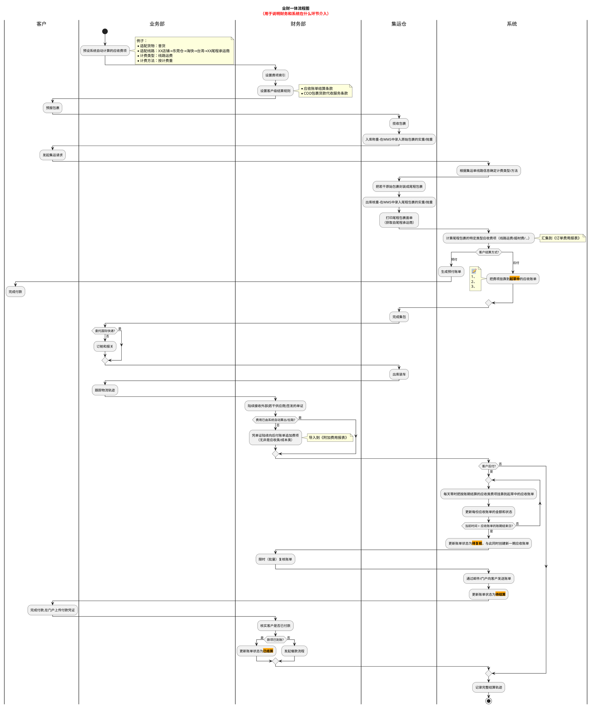
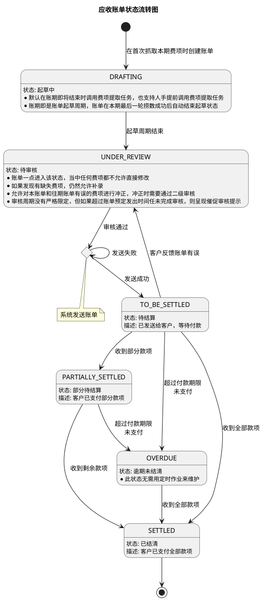
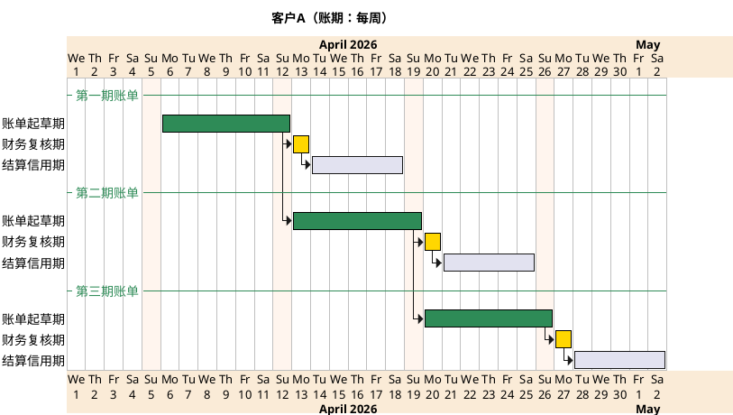
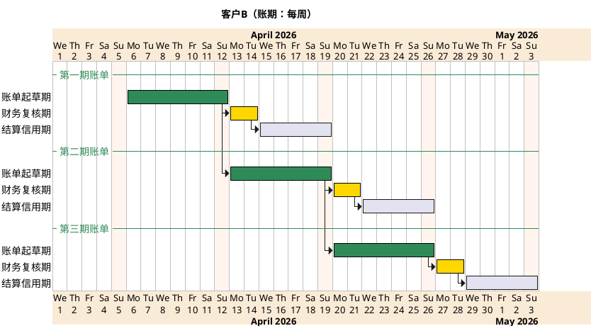
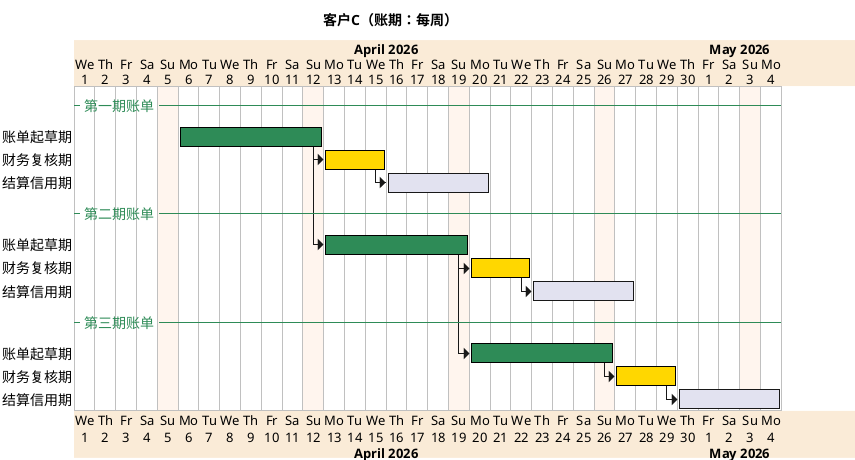
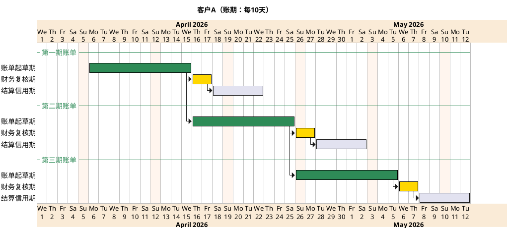
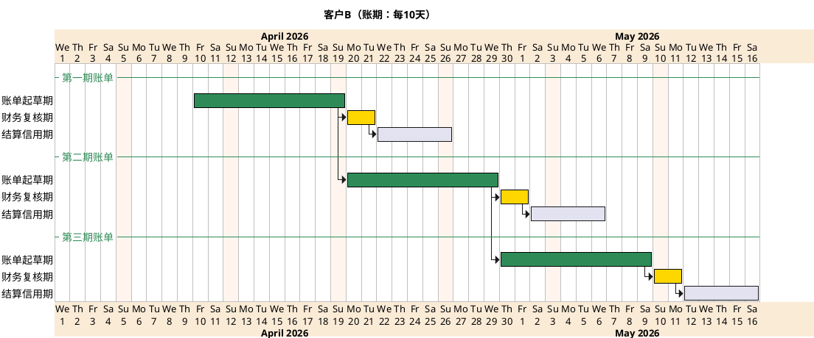
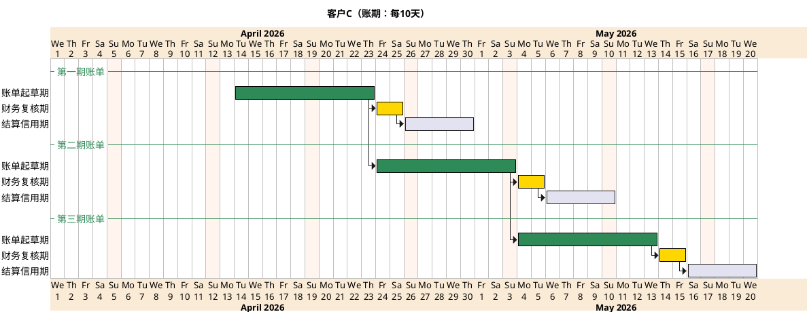

# 财务模块 PRD

## 应收账单模块

### 需求背景

集运单自创建后的整个履约过程所涉及的任何后付应收费项，财务普遍会跨越客户的多个账期录入，普遍存在后付费项挂靠到不同的应收账单分期结算这一情形。

### 核心设计思路

* 任何费项都必须有挂靠对象，应收费项挂靠对象包括：应收账单、集运单/中转单/其他主单、尾程包裹（对应尾程运单）、原始包裹（对应首程运单）
* 任何后付费项都必须挂靠到特定账单（应收/应付/返款账单）进行结算，一个后付费项（代收代付类除外）只挂靠到一张账单。
* 如何后付费项都可以灵活归入应收类/成本类/代收代付类，并非特定费项就必须是应收类/成本类/代收代付类。
  * 其中，代收代付类费项同时挂靠到一张应收账单和一张成本账单，应收和成本抵消后不产生利润。
  * 目前，系统根据线路信息自动计算的所有费项（包括线路运费）都归入应收类，录入员默认为系统，支持人为在账单起草期修改修改，但保留系统原始算值。
* 集运单费用报表需要改数据结构，以支持上述几条，财务需要方便查看集运单自创建后的整个履约过程所涉及的所有费项及利润分析
* 新账单创建自上一账期最后一轮费项数据捞取，默认处于起草状态，当前账期即为账单起草周期。
* 系统每天零时自动把本期后付费项捞取到起草中的本期账单，账单在本期最后一轮捞数结束后自动结束起草状态。
* 如果费项所挂靠的应收账单已通过财务复核，则该费项无法被修改，因为客户可能已经在财务复核后的短时间内收到账单。如果客户在收到账单后产生异议，财务需要重走复核流程，或在下期账单冲正。
* 往期账单费项的金额错误/变动，只能在本期账单冲正。
* 需要支持财务批量调账的情形。
* 目前，系统把自动计算的费项归集到《订单费用报表》；而补录费项则由财务先导入到《附加费用报表》，再归集到《订单费用报表》。关于补录费项，在实操中需要让按账期计算的费项在一个新入口按新模板导入到《订单费用报表》，以便财务区分处理按订单预付/到付的费项。

### 账单类型

账单类型包括：应收账单、应付账单、返款账单。本需求暂且只考虑应收账单。

* 应收账单：即天马运通向客户收取费项时出示给客户的账单。
* 应付账单：即天马运通向供应商支付费项时用于对账的账单。
* 返款账单：即天马运通COD包裹代客户回收货款后，把货款返还给客户时出示给客户的账单。

#### 账单编号规则

| 账单类型 | 前缀 | 结算主体   | 集运目的国 | 账期起始日 | 账单编号样例           |
| :------- | :--- | :--------- | :--------- | :--------- | :--------------------- |
| 应收账单 | YS   | 客户编号   | 三字码     | yyyymmdd   | YS-OG4155-TWN-20260101 |
| 应付账单 | YF   | 供应商编号 | -          | yyyymmdd   | YF-SP4534-20260101     |
| 返款账单 | FK   | 客户编号   | -          | yyyymmdd   | FK-OG4155-20260101     |

以下按流程节点详细说明财务和系统在各环节的职责分工，便于把图中的动作对应到实际业务操作、账务处理和系统能力。

### 业财一体流程



#### 1. 费项规则与结算规则初始化

- 财务负责维护费项索引，定义哪些费用属于应收、成本或返款类，以及每类费用的归集口径。
- 财务负责配置客户级结算规则，包括账期、预付/后付方式、COD 代收规则等。
- 系统根据业务部预设的线路、货物类型和计费方式，建立后续自动计费的基础规则。

#### 2. 预报、揽收与称重

- 客户发起预报后，系统接收包裹基础信息，作为后续计费和账单归集的起点。
- 集运仓完成揽收后，在 WMS 中录入原始包裹的实重、抛重等数据。
- 系统保存这些重量/体积数据，作为线路运费、超材费、仓储费等标准费项的计算依据。
- 财务在这一阶段主要关注数据是否可作为结算依据，以及是否满足后续账单归集要求。

#### 3. 集运请求与标准费项计算

- 客户发起集运请求后，系统根据线路信息确定计费类型和计费方法。
- 集运仓完成包裹合并、封装后，再次录入尾程包裹的核重数据。
- 系统根据尾程包裹数据自动计算线路运费、超材费等可规则化费用。
- 计算结果汇集到《订单费用报表》，作为后续账单和对账的统一来源。

#### 4. 预付与后付分流

- 如果是预付模式，系统生成预付账单，客户完成付款后进入履约流程。
- 如果是后付模式，系统把已识别费项挂靠到“起草中”的应收账单。
- 财务在此阶段确认账单类型、账期和结算方式，避免费用挂错账单或挂错期间。

#### 5. 集包、订舱、报关与运输跟踪

- 集运仓完成集包和出库装车，业务部按是否委托国际快递决定是否执行订舱和报关。
- 业务部持续跟踪物流轨迹，掌握可能影响费用的异常情况。
- 系统在这一阶段主要承担流程状态流转和费用关联，不直接替代业务判断。
- 财务会持续接收外部供应商签发的单证，为后续附加费补录做准备。

#### 6. 非标费用补录

- 当费用无法由系统自动算出或拉取时，财务根据单证或凭证手工补录到后付账单。
- 这类费用通常属于应收类或成本类的附加费用，需要导入《附加费用报表》。
- 系统提供承载和归集入口，但补录依据由财务审核确认。

#### 7. 后付账单流转

- 系统在账期内按日把应收类费项挂靠到起草中的应收账单，并持续更新金额和状态。
- 账期结束后，系统将账单推进到“待复核”，同时创建新一期账单。
- 财务限时批量复核账单，确认费项、金额、账期和客户维度都无误。
- 财务复核通过后，系统通过邮件或门户向客户发送账单，并更新为“待结算”。

#### 8. 收款、核销与结算闭环

- 客户完成付款并在门户上传付款凭证后，财务核实款项是否到账。
- 若到账，财务确认结算完成，系统将账单状态更新为“已结算”。
- 若未到账，财务发起催款流程，系统保留完整结算轨迹，便于后续追踪。
- 最终所有动作都会沉淀到系统中，形成从费用生成、账单挂靠、复核、发送、付款到结算的完整链路记录。

### 账单状态流转



下面基于上面的业财一体流程图，补充说明应收账单从生成到结清的状态流转逻辑。这里的核心是：系统负责状态推进和自动挂账，财务负责审核、纠错、补录和收款核销，客户侧则负责确认账单并完成付款。

#### 状态含义

- `起草中`：系统已开始按账期抓取费项，但账单还未进入人工审核和对外发送阶段。
- `待审核`：账单已经结束起草，进入财务复核窗口，准备确认是否可以发给客户。
- `待发送`：账单已审核通过，系统准备或正在对客户侧发送账单。
- `待结算`：账单已成功发送给客户，正在等待付款。
- `部分待结算`：客户已经支付部分款项，但账单尚未完全结清。
- `逾期未结清`：付款期限已过，但账单仍未收到足额款项。
- `已结清`：账单对应款项已全部到账，流程结束。

#### 流转说明

1. 系统在首次抓取本期费项时创建应收账单，账单进入 `起草中`。
2. 在 `起草中` 阶段，系统持续按账期提取应收费项并挂靠到账单中，财务可以在必要时查看起草结果，但不做最终对外确认。
3. 当账期结束后，系统自动将账单推进到 `待审核`，并冻结该账单的正常修改入口。
4. 财务在 `待审核` 阶段完成复核，重点检查费项是否齐全、金额是否正确、账期是否匹配、客户是否适用对应结算规则。
5. 如果发现缺失费项，财务仍可补录；如果发现错误费项，需要走冲正或二级审核流程，保证账单对外发送前的准确性。
6. 财务审核通过后，账单进入 `待发送`，系统负责向客户发送账单，通常通过邮件或门户完成。
7. 如果发送成功，账单转入 `待结算`，表示客户已经收到账单，系统和财务都开始等待实际回款。
8. 如果发送失败，账单仍停留在 `待发送`，系统需要重试或由财务/运营介入排查发送异常。
9. 在 `待结算` 阶段，客户可以支付全额或部分款项；系统根据到账情况更新账单金额和状态。
10. 如果客户先付一部分，账单转为 `部分待结算`，后续收到剩余款项后再转为 `已结清`。
11. 如果在付款期限内一直未收到账，账单会转入 `逾期未结清`，财务据此发起催收或对账动作。
12. 即使账单已逾期，只要后续收到全部款项，账单仍可从 `逾期未结清` 直接回到 `已结清`。

#### 财务与系统分工

财务在 `起草中` 关注费项是否完整，必要时补录附加费用，但不做最终发单。

财务在 `待审核` 负责复核账单、处理冲正、确认是否满足发单条件。

系统在 `待发送` 阶段负责通知客户、记录发送结果，并保留失败重试能力。

财务在 `待结算`、`部分待结算`、`逾期未结清` 阶段负责对账、核销、催收和结算确认。

系统在全流程中负责状态机推进、金额更新、发送记录和结算轨迹留痕，保证账单状态可追溯。

### 账期类型

#### 账期：周/半月/月

每个客户的账期是对齐的







说明：这张图表达的是“周账期且账期对齐”的典型场景。每一期账单都包含 1 周起草期、1 到 3 天不等的财务复核期，以及 5 天结算信用期，三段时间在每一期内顺序衔接。系统负责按周滚动抓取费项、生成账单草稿并推进状态；财务负责在金色复核期内完成校验、补录和确认发单；客户则在信用期内完成付款。由于客户 A、B、C 的复核期天数不同，所以虽然都属于每周账期，但人工审核窗口可以按客户风险和业务复杂度差异化配置。

说明：这张图和客户 A 的账期结构一致，差别只在于财务复核期从 1 天变成 2 天。它强调的是，同样都是周账期，系统的账期切换方式不变，但财务审核时长可以独立配置。图中三期账单首尾相接，表示上一期结束后系统会自动进入下一期，不需要人为重建账单周期；复核完成后，系统再进入发送和结算跟踪阶段。

说明：这张图进一步把周账期下的财务复核期拉长到 3 天，说明账期长度相同并不代表审核节奏必须一致。系统继续按照周粒度滚动生成下一期账单，但财务可根据费项数量、异常比例、客户重要性等因素，给不同客户配置不同的复核时长。三张图放在一起的目的，是说明“账期对齐”场景下，账期节奏统一，而审核窗口可分层控制。

#### 账期：自然天（10天/15天）

每个客户的账期不要求对齐







说明：这张图表示自然天账期下的客户 A，账期长度为 10 天，起点从 2026/04/06 开始滚动。与周账期不同，这里不强调周几对齐，而是强调按自然天累加。绿色段代表系统持续抓取费项并形成账单草稿，金色段代表财务复核，后面的信用期代表客户付款窗口。系统在这里负责按客户自己的起始日滚动生成下一期账单，不要求和其他客户同步。

说明：这张图展示的是另一个 10 天账期客户，但起始日比客户 A 更晚，所以同样是 10 天周期，三期账单在时间轴上会整体后移。它说明自然天账期的关键不是“长度一致就对齐”，而是“每个客户按自己的账期滚动”。系统按客户维度独立生成账单和复核窗口，财务按客户维度独立复核和结算，不依赖其他客户的周期节奏。

说明：这张图继续向后平移了 10 天账期的起点，表达自然天账期在客户 C 身上又往后错开了一段时间。三期账单的结构仍然保持“起草期 + 复核期 + 信用期”的固定组合，但具体开始日不再统一。这样做的业务含义是：系统支持每个客户按自己的合同条款独立滚动，财务也按客户账期单独做复核、发单和催收，避免不同客户之间的账单节奏互相干扰。

```

```

### 财务配置

#### 客户账单配置

* 客户级配置，结算条款依照公司与客户签订的合同，分两部分：应收账单结算条款、COD包裹货款代收条款。
* 结算条款必须采取版本管理。
* 结算条款一经确定，则会发邮件通知客户，且不可在原版本改动，任何改动都只能发在新版本。
* 每个账单都必须指明是依赖哪个版本的结算条款来生成。
* 结算条款以json格式存储在数据库。

##### 应收账单结算条款

##### COD包裹货款代收条款

* 详见原型
  [结算条款](http://localhost:8080/index.html#id=ngn0y4&p=%E7%BB%93%E7%AE%97%E6%9D%A1%E6%AC%BE%EF%BC%88%E5%AE%A2%E6%88%B7%E7%BA%A7%EF%BC%89&g=1)

#### 费项索引

* 费项索引用于供财务部在导入费项时参考
* 费项名称不允许出现重复，避免引用时混淆，统一口径
* 费项索引修改频次低，由技术人员听取财务意见来维护，无需提供维护功能，可以配置账单捞取费项的数据源
* 当费项冲正时，费项名称必须在费项索引找到

#### 结算汇率

结算汇率分3级：店铺级、账单级、费项级。

* 优先级：费项级 > 账单级 > 店铺级。
* 店铺级汇率：现有功能已支持设置。
* 账单级汇率：财务在起草中/待复核的账单中设置。
* 费项级汇率：财务在《附加费用报表中导入文件》中给特定费项设置特定汇率。
* 财务侧必须处理好费项原始币种、账单结算币种和财务本位币种的转换
