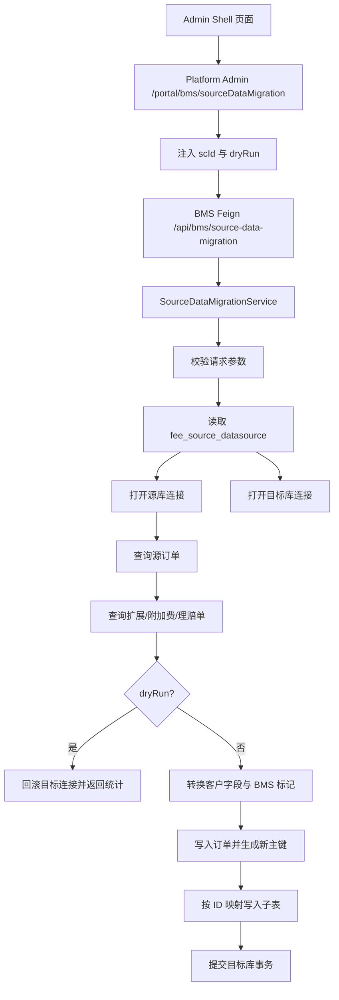

# BMS 测试源数据迁移设计

## 1. 背景

BMS 账单生成、附加费归集、理赔抵扣等功能需要贴近真实业务的数据进行验证。测试环境如果只手工造订单，容易出现以下问题：

1. 订单主表、订单扩展表、附加费表、理赔单之间的数据关系不完整。
2. 客户、店铺、会员编码与账单配置不匹配，导致生成账单时查不到费用。
3. 来源表已经带有 BMS 计费、付款、核销标记，复制后会影响重新生成账单。
4. 直接暴露数据库账号密码给页面存在安全风险。

因此需要一个内部测试工具，从生产或指定源库读取集运订单相关数据，转换客户归属后写入目标测试库，并重置 BMS 相关标记，供测试客户重新跑账单生成链路。

当前页面入口：

- 前端页面：`admin_shell/src/views/billing/sourceDataMigration/index.vue`
- 路由：`/billing/sourceDataMigration`
- 权限码：`bms_source_data_migration`
- 菜单标题：`BMS测试数据迁移` / `测试数据迁移`

## 2. 目标

1. 支持按源客户条件筛选订单。
2. 支持按订单号或时间范围圈定迁移范围。
3. 支持将源订单复制到目标客户名下。
4. 支持可选复制订单扩展表、附加费表、理赔单。
5. 支持预览模式，只统计命中数据，不写目标库。
6. 支持执行迁移模式，在目标库重新生成订单主键并维护子表外键。
7. 默认重置 BMS 计费、付款、核销相关标记，使迁移后的数据可以重新参与账单验证。
8. 数据库连接由 BMS 的 `fee_source_datasource` 维护，页面不展示账号密码。

## 3. 模块边界

本模块是内部测试数据准备工具，不属于正式业务账单流程。

负责范围：

1. 读取源库 `sale_order_header`。
2. 按订单 ID 读取源库 `sale_order_header_extend`。
3. 按订单 ID 读取源库 `sale_order_additional_matter`。
4. 按订单号读取或按客户与时间读取源库 `claim_order`。
5. 将上述数据写入目标库，并替换目标客户字段。
6. 返回预览或执行结果。

不负责范围：

1. 不自动创建账单配置。
2. 不自动触发账单生成任务。
3. 不校验目标客户是否真实存在。
4. 不处理除上述四张来源表以外的业务表。
5. 不提供源库或目标库账号密码维护页面。

## 4. 前端设计

### 4.1 页面布局

页面由三部分组成：

1. 顶部操作区：重置、预览、执行迁移。
2. 查询表单区：客户映射、迁移范围、迁移选项。
3. 执行结果区：命中数量、写入数量、消息、迁移后的订单号。

页面顶部固定提示：

`内部测试工具：源库只读，目标库写入。执行迁移会在目标库重新生成订单主键，并清空 BMS 计费/付款标记。数据库连接由 BMS 数据源配置维护，页面不展示账号密码。`

### 4.2 客户映射

源客户条件用于筛选源订单：

| 字段 | 前端字段 | 后端字段 | 说明 |
| --- | --- | --- | --- |
| 源店铺 ID | `sourceShopId` | `sourceShopId` | 对应源订单 `shop_id` |
| 源用户 ID | `sourceUserId` | `sourceUserId` | 对应源订单 `user_id` |
| 源会员编码 | `sourceMemberCode` | `sourceMemberCode` | 对应源订单 `member_code` |
| 源客户编码 | `sourceCustomerNo` | `sourceCustomerNo` | 当前页面作为辅助备注，后端不作为强过滤 |

目标客户字段用于写入目标库：

| 字段 | 前端字段 | 后端字段 | 写入列 |
| --- | --- | --- | --- |
| 目标店铺 ID | `targetShopId` | `targetShopId` | `shop_id`、理赔单 `dealer_shop_id` |
| 目标用户 ID | `targetUserId` | `targetUserId` | `user_id` |
| 目标会员编码 | `targetMemberCode` | `targetMemberCode` | `member_code` |
| 目标客户编码 | `targetCustomerNo` | `targetCustomerNo` | `customer_no` |
| 目标客户名称 | `targetCustomerName` | `targetCustomerName` | `customer_name`，可回填 `member_name` |
| 目标店铺名称 | `targetShopName` | `targetShopName` | `shop_name` |

目标店铺 ID、目标用户 ID、目标会员编码为必填项。

### 4.3 迁移范围

支持两种圈定方式：

1. 指定订单号：多个订单号用逗号、空格、换行分隔。填写后优先按订单号迁移，时间范围不再必填。
2. 时间范围：未填写订单号时，必须选择开始日期、结束日期和时间字段。

时间字段白名单：

| 页面选项 | 字段值 | 说明 |
| --- | --- | --- |
| 核重时间 | `measure_time` | 集运核重出库时间 |
| 签收时间 | `signed_time` | 订单签收时间 |
| 创建时间 | `create_time` | 订单创建时间 |
| 修改时间 | `modify_time` | 订单修改时间 |
| 审核时间 | `check_time` | 订单审核时间 |

时间范围后端按左闭右开处理：

```text
time_field >= startDate
time_field < endDate + 1 day
```

单次最多订单数 `limit` 默认 500，页面上限 2000，后端也会强制截断到 2000。

### 4.4 迁移选项

| 选项 | 前端字段 | 默认值 | 说明 |
| --- | --- | --- | --- |
| 复制订单扩展 | `includeHeaderExtend` | `true` | 复制 `sale_order_header_extend` |
| 复制附加费 | `includeAdditionalMatter` | `true` | 复制 `sale_order_additional_matter` |
| 复制理赔单 | `includeClaimOrder` | `true` | 复制 `claim_order` |
| 重置 BMS 标记 | `resetBmsFlags` | `true` | 清空计费、付款、核销相关字段 |

订单号后缀 `targetOrderNoSuffix` 用于避免目标库订单号冲突。后端会对 `order_code`、`order_no`、`sale_order_no` 追加后缀。

## 5. 接口设计

### 5.1 前端到 Platform Admin

前端 API 定义在 `admin_shell/src/api/billing.js`：

| 操作 | URL | 方法 | 说明 |
| --- | --- | --- | --- |
| 预览 | `/portal/bms/sourceDataMigration/preview` | POST | 只统计，不写入 |
| 执行迁移 | `/portal/bms/sourceDataMigration/migrate` | POST | 写入目标库 |

页面使用 `@/utils/request` 发起请求，`baseURL` 为当前 `window.location.protocol + '//' + window.location.host`。

### 5.2 Platform Admin 到 BMS

Platform Admin 控制器：

`platform-admin/web/src/main/java/com/szt/supplychain/platform/admin/web/controller/BmsSourceDataMigrationController.java`

职责：

1. 接收 Admin Shell 请求。
2. 从当前登录请求中读取 `scId`，写入 `SourceDataMigrationReqDTO.scId`。
3. 预览接口强制设置 `dryRun = true`。
4. 执行接口强制设置 `dryRun = false`。
5. 通过 `SourceDataMigrationRemoteService` Feign 调用 BMS 服务。
6. 使用 `RestResult<SourceDataMigrationRespDTO>` 包装返回结果。

### 5.3 BMS Feign 与 Controller

BMS Feign：

`bms/client/src/main/java/com/szt/supplychain/bms/client/api/SourceDataMigrationRemoteService.java`

```text
@FeignClient(name = "tmall-bms-service", path = "/api/bms/source-data-migration")
POST /preview
POST /migrate
```

BMS Controller：

`bms/web/src/main/java/com/szt/supplychain/bms/web/controller/SourceDataMigrationController.java`

Controller 只做入口转发，业务逻辑在 `SourceDataMigrationService`。

## 6. 请求与响应模型

### 6.1 请求 DTO

`SourceDataMigrationReqDTO`

| 字段 | 类型 | 必填 | 说明 |
| --- | --- | --- | --- |
| `scId` | Long | Platform Admin 注入 | 当前供应链 ID |
| `sourceDatasourceCode` | String | 否 | 源数据源编码，默认 `OFP_DB_SOURCE` |
| `targetDatasourceCode` | String | 否 | 目标数据源编码，默认 `OFP_DB_TARGET` |
| `sourceShopId` | Long | 否 | 源店铺 ID |
| `sourceUserId` | Long | 否 | 源用户 ID |
| `sourceMemberCode` | String | 否 | 源会员编码 |
| `sourceCustomerNo` | String | 否 | 源客户编码，当前不强过滤 |
| `targetShopId` | Long | 是 | 目标店铺 ID |
| `targetUserId` | Long | 是 | 目标用户 ID |
| `targetMemberCode` | String | 是 | 目标会员编码 |
| `targetCustomerNo` | String | 否 | 目标客户编码 |
| `targetCustomerName` | String | 否 | 目标客户名称 |
| `targetMemberName` | String | 否 | 目标会员名称 |
| `targetShopName` | String | 否 | 目标店铺名称 |
| `startDate` | LocalDate | 条件必填 | 时间范围开始日期 |
| `endDate` | LocalDate | 条件必填 | 时间范围结束日期 |
| `timeField` | String | 否 | 时间字段，默认 `measure_time` |
| `orderNos` | String | 条件必填 | 指定订单号列表 |
| `targetOrderNoSuffix` | String | 否 | 目标订单号后缀 |
| `includeHeaderExtend` | Boolean | 否 | 是否复制扩展表 |
| `includeAdditionalMatter` | Boolean | 否 | 是否复制附加费 |
| `includeClaimOrder` | Boolean | 否 | 是否复制理赔单 |
| `resetBmsFlags` | Boolean | 否 | 是否重置 BMS 标记 |
| `dryRun` | Boolean | 网关注入 | 是否预览 |
| `limit` | Integer | 否 | 最大订单数 |
| `operator` | String | 否 | 操作人，当前实现未使用 |

### 6.2 响应 DTO

`SourceDataMigrationRespDTO`

| 字段 | 类型 | 说明 |
| --- | --- | --- |
| `dryRun` | Boolean | 是否预览模式 |
| `sourceOrderCount` | Integer | 源订单命中数量 |
| `sourceExtendCount` | Integer | 源订单扩展命中数量 |
| `sourceAdditionalCount` | Integer | 源附加费命中数量 |
| `sourceClaimCount` | Integer | 源理赔单命中数量 |
| `insertedOrderCount` | Integer | 目标库写入订单数 |
| `insertedExtendCount` | Integer | 目标库写入扩展数 |
| `insertedAdditionalCount` | Integer | 目标库写入附加费数 |
| `insertedClaimCount` | Integer | 目标库写入理赔单数 |
| `conditionSummary` | String | 查询条件摘要 |
| `migratedOrderNos` | List<String> | 迁移后的订单号 |
| `messages` | List<String> | 执行消息 |

## 7. 后端处理流程

### 7.1 总体流程



### 7.2 参数校验

后端校验规则：

1. `targetUserId` 不能为空。
2. `targetMemberCode` 不能为空。
3. `targetShopId` 不能为空。
4. `timeField` 必须在白名单内，空值默认 `measure_time`。
5. 未指定订单号时，`startDate` 和 `endDate` 必填。
6. `startDate` 不能晚于 `endDate`。
7. `limit` 为空或小于 1 时默认 500。
8. `limit` 最大 2000。

### 7.3 数据源加载

服务从 BMS 当前数据源读取 `fee_source_datasource`：

```sql
SELECT datasource_code, driver_class_name, jdbc_url, username, password_cipher
FROM fee_source_datasource
WHERE datasource_code = ?
  AND enabled = 1
  AND is_deleted = 0
LIMIT 1
```

默认数据源编码：

| 用途 | 默认编码 | 兜底编码 |
| --- | --- | --- |
| 源库 | `OFP_DB_SOURCE` | `OFP_DB` |
| 目标库 | `OFP_DB_TARGET` | `OFP_DB` |

如果默认编码不存在且允许兜底，则使用 `OFP_DB`。连接密码读取 `password_cipher` 字段，当前实现直接作为 JDBC 密码使用。

### 7.4 源订单查询

源订单表：`sale_order_header h`

固定查询结构：

1. 按源店铺 ID 过滤：`h.shop_id = ?`
2. 按源用户 ID 过滤：`h.user_id = ?`
3. 按源会员编码过滤：`h.member_code = ?`
4. 如果指定订单号，使用 `h.order_code IN (...)`
5. 如果未指定订单号，使用白名单时间字段做范围查询
6. 按 `h.id ASC` 排序
7. 使用 `LIMIT` 限制最大订单数

### 7.5 子表查询

订单扩展和附加费按源订单 ID 查询，每批最多 500 个订单 ID：

```text
sale_order_header_extend.sale_order_id IN (...)
sale_order_additional_matter.sale_order_id IN (...)
```

理赔单查询逻辑：

1. 如果指定了订单号，按 `claim_order.order_code IN (...)` 查询。
2. 如果未指定订单号，优先使用源订单的 `order_code` 查询。
3. 当没有可用订单号时，按源客户条件和 `claim_order.update_time` 时间范围查询。

## 8. 数据转换规则

### 8.1 订单主表

写入 `sale_order_header` 时：

1. 移除源记录 `id`，由目标库重新生成主键。
2. 写入 `sc_id` 为当前登录供应链 ID。
3. 写入目标 `shop_id`、`user_id`、`member_code`。
4. 可选写入 `customer_no`、`customer_name`、`member_name`、`shop_name`。
5. 如果填写订单号后缀，则对 `order_code`、`order_no`、`sale_order_no` 追加后缀。

### 8.2 订单扩展表

写入 `sale_order_header_extend` 时：

1. 移除源记录 `id`。
2. 将源 `sale_order_id` 替换为目标库新订单 ID。
3. 写入目标 `sc_id`、`shop_id`、`user_id`、`member_code`、`customer_no`。
4. 如果开启重置 BMS 标记，则清理计费和付款标记。

### 8.3 附加费表

写入 `sale_order_additional_matter` 时：

1. 复用订单扩展表的转换规则。
2. 如果开启重置 BMS 标记，额外设置：
   - `fee_pay_status = waiting_pay`
   - `fee_pay_handler = null`
   - `fee_pay_handle_time = null`

### 8.4 理赔单

写入 `claim_order` 时：

1. 移除源记录 `id`。
2. 写入目标 `sc_id`、`shop_id`、`dealer_shop_id`、`user_id`、`member_code`。
3. 可选写入 `customer_no`、`customer_name`、`member_name`。
4. 如果填写订单号后缀，则对订单号相关字段追加后缀。
5. 如果开启重置 BMS 标记，则清理计费、抵扣、付款相关字段。

### 8.5 BMS 标记重置

通用重置字段：

| 字段 | 重置值 |
| --- | --- |
| `bms_billed_flag` | `0` |
| `bms_bill_no` | `null` |
| `bms_after_bill_added_flag` | `0` |
| `bms_paid_flag` | `0` |
| `bms_paid_bill_no` | `null` |
| `bms_paid_at` | `null` |
| `bms_paid_writeoff_no` | `null` |
| `bms_payment_status` | `UNPAID` |

理赔单额外重置字段：

| 字段 | 重置值 |
| --- | --- |
| `bms_billed_at` | `null` |
| `bms_offset_status` | `NONE` |
| `bms_offset_bill_no` | `null` |
| `bms_offset_at` | `null` |
| `bms_offset_writeoff_no` | `null` |
| `payment_status` | `1`，仅字段存在时 |
| `pay_time` | `null` |

## 9. 写入与事务

目标库连接手动关闭自动提交：

```text
targetConn.setAutoCommit(false)
```

执行规则：

1. 预览模式永远回滚目标库连接，不写入数据。
2. 未命中源订单时回滚并返回消息。
3. 执行模式中，订单先写入目标库并获取新主键。
4. 使用 `sourceOrderId -> targetOrderId` 映射写入扩展表和附加费表。
5. 任意异常都会回滚目标库事务。
6. 全部成功后提交目标库事务。

注意：当前实现使用 JDBC 直连目标库，不使用 Spring 声明式事务，事务边界由目标库 `Connection` 控制。

## 10. 与账单生成的关系

迁移后的数据主要服务于以下验证场景：

1. 账单生成按 `sc_id/shop_id/user_id/member_code` 命中测试客户账单配置。
2. 主订单费用可按 `measure_time` 或 `signed_time` 等字段进入账期。
3. 附加费在 `fee_pay_status = waiting_pay` 时可重新参与附加费归集。
4. 已清空 BMS 账单号、付款状态、核销号，避免被认为已计费或已支付。
5. 理赔单清空抵扣状态后，可验证理赔抵扣/冲抵链路。

本模块通常与以下设计文档联动阅读：

1. `bms-bill-generation-design.md`
2. `bms-bill-generate-code-design.md`
3. `bms-fee-source-dataset-design.md`
4. `bms-bill-writeoff-design.md`

## 11. 权限与安全

1. 页面权限码为 `bms_source_data_migration`，应只授权给内部测试、开发、运维人员。
2. 页面不允许输入或展示数据库账号密码。
3. 源库只读使用，目标库才允许写入。
4. 生产环境不建议开放执行迁移入口。
5. 迁移前建议先使用预览功能确认命中范围。
6. 执行迁移建议填写订单号后缀，避免目标库订单号唯一约束冲突。
7. `limit` 上限为 2000，避免一次迁移过大影响数据库。

## 12. 异常与提示

常见异常：

| 场景 | 提示 |
| --- | --- |
| 未填目标用户 ID | `迁移到客户 userId 不能为空` |
| 未填目标会员编码 | `迁移到客户会员编码不能为空` |
| 未填目标店铺 ID | `迁移到店铺ID不能为空` |
| 未指定订单号且未填时间范围 | `未指定订单号时，必须填写时间范围` |
| 开始日期晚于结束日期 | `开始日期不能晚于结束日期` |
| 时间字段不在白名单 | `不支持的时间字段：xxx` |
| 数据源不存在 | `未找到可用数据源配置：xxx` |
| 未命中订单 | `没有命中可迁移订单` |
| 预览成功 | `预览完成，未写入目标库` |
| 执行成功 | `迁移成功，目标库已提交` |

前端错误展示优先取响应中的 `msg` 或 `message`，否则展示 JavaScript error message。

## 13. 后续优化建议

1. 给 `SourceDataMigrationReqDTO` 和 `SourceDataMigrationRespDTO` 补齐字段 JavaDoc，满足 BMS DTO 注释规范。
2. 为 `SourceDataMigrationServiceImpl.migrate` 增加操作日志，记录操作人、源目标数据源、迁移条件、写入数量。
3. 增加目标库订单号冲突预检查，提前提示是否需要填写后缀。
4. 增加源/目标数据源编码的页面选择能力，但仍不展示账号密码。
5. 增加仅允许非生产目标库执行的环境保护。
6. 将 `sourceCustomerNo` 是否参与过滤做成明确页面说明或后端过滤选项。
7. 增加迁移批次号，便于后续按批次追踪或清理测试数据。
