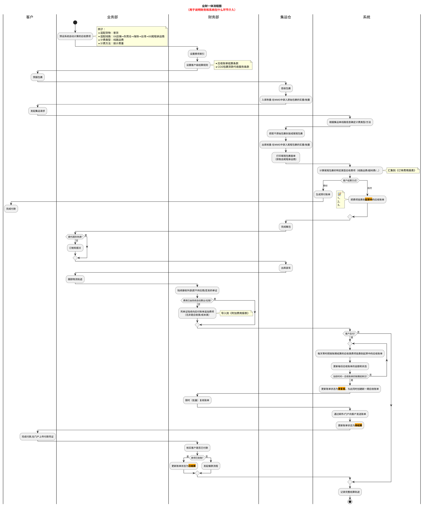

```plantuml
@startuml
title 业财一体流程图\n<color:red>（用于说明财务和系统在什么环节介入）</color>
skinparam DefaultTextAlignment center
skinparam NoteTextAlignment left

|客户|
|业务部|
|财务部|
|集运仓|
|系统|


|业务部|
start
:预设系统自动计算的应收费项;
note right
例子：
* 适配货物：普货
* 适配线路：XX店铺→东莞仓→海快→台湾→XX尾程承运商
* 计费类型：线路运费
* 计费方法：按计费重
end note

|财务部|
:设置费项索引;
:设置客户级结算规则;
note right
* 应收账单结算条款
* COD包裹货款代收服务条款
end note

|客户|
:预报包裹;
|集运仓|
:揽收包裹;
:入库称重-在WMS中录入原始包裹的实重/抛重;
|客户|
:发起集运请求;
|系统|
:根据集运单线路信息确定计费类型/方法;
|集运仓|
:把若干原始包裹封装成尾程包裹;
:出库核重-在WMS中录入尾程包裹的实重/抛重;
:打印尾程包裹面单\n（获取自尾程承运商）;
|系统|
:计算尾程包裹的特定类型应收费项（线路运费/超材费/…）;
note right
汇集到《订单费用报表》
end note

switch(客户结算方式?)
case (预付)
  |系统|
  :生成预付账单;
  |客户|
  :完成付款;
case (后付)
  |系统|
  :把费项挂靠到<back:orange><b>起草中</b></back>的应收账单;
  note left
  <#transparent,#transparent>|<:1F4DD:>|
  |1、|对同一客户，每类账单同时都只能有一份账\n单处于起草中|
  |2、|账单类型：应收账单、返款账单、成本账单|
  |3、|起草周期对应于账单中的账期|
  end note
endswitch

|集运仓|
:完成集包;

|业务部|
if (委托国际快递?) then (否)
  :订舱和报关;
else(是)
endif

|集运仓|
:出库装车;
|业务部|
:跟踪物流轨迹;

|财务部|
:陆续接收外部(若干供应商)签发的单证;
if (费用已由系统自动算出/拉取?) then (是)
else (否)
  :凭单证陆续向后付账单追加费项\n（无非是应收类/成本类）;
  note right
  导入到《附加费用报表》
  end note
endif

|系统|
if (客户后付?) then (是)
  repeat
    :每天零时把按账期结算的应收类费项挂靠到起草中的应收账单;
    :更新每份应收账单的金额和状态;
  repeat while(当前时间 > 应收账单的账期结束日?) is (否) not (是)
  :更新账单状态为<back:orange><b>待复核</b></back>，与此同时创建新一期应收账单;
  |财务部|
  :限时（批量）复核账单;
  |系统|
  :通过邮件/门户向客户发送账单;
  :更新账单状态为<back:orange><b>待结算</b></back>;
  |客户|
  :完成付款,在门户上传付款凭证;
  |财务部|
  :核实客户是否已付款;
  if (款项已到账?) then (是)
    :更新账单状态为<back:orange><b>已结算</b></back>;
  else (否)
    :发起催款流程;
  endif
else(否)
endif

|系统|
:记录完整结算轨迹;
stop
@enduml
```
