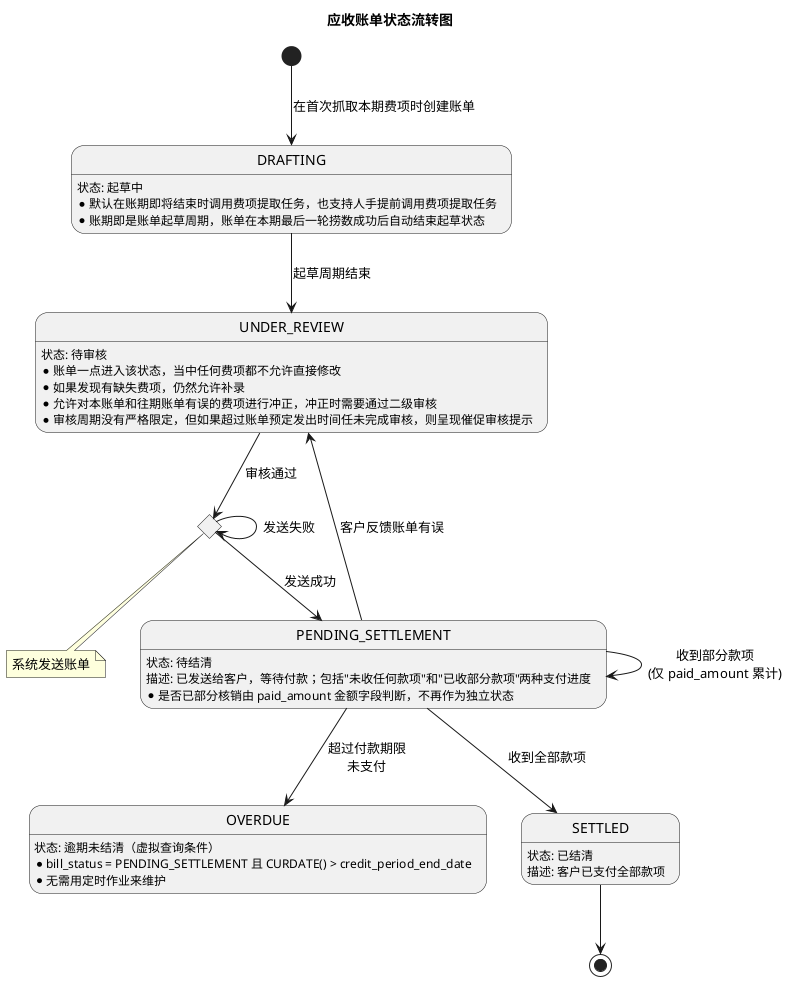

```plantuml
@startuml
title 应收账单状态流转图
top to bottom direction

state DRAFTING : 状态: 起草中\n* 默认在账期即将结束时调用费项提取任务，也支持人手提前调用费项提取任务\n* 账期即是账单起草周期，账单在本期最后一轮捞数成功后自动结束起草状态
state UNDER_REVIEW : 状态: 待审核\n* 账单一点进入该状态，当中任何费项都不允许直接修改\n* 如果发现有缺失费项，仍然允许补录\n* 允许对本账单和往期账单有误的费项进行冲正，冲正时需要通过二级审核\n* 审核周期没有严格限定，但如果超过账单预定发出时间任未完成审核，则呈现催促审核提示

state TO_BE_SENT <<choice>>
note bottom of TO_BE_SENT
  系统发送账单
end note

state PENDING_SETTLEMENT : 状态: 待结清\n描述: 已发送给客户，等待付款；包括"未收任何款项"和"已收部分款项"两种支付进度\n* 是否已部分核销由 paid_amount 金额字段判断，不再作为独立状态
state OVERDUE : 状态: 逾期未结清（虚拟查询条件）\n* bill_status = PENDING_SETTLEMENT 且 CURDATE() > credit_period_end_date\n* 无需用定时作业来维护
state SETTLED : 状态: 已结清\n描述: 客户已支付全部款项

'------------------------------------------'
[*] --> DRAFTING : 在首次抓取本期费项时创建账单
DRAFTING --> UNDER_REVIEW : 起草周期结束

UNDER_REVIEW --> TO_BE_SENT : 审核通过

TO_BE_SENT --> PENDING_SETTLEMENT : 发送成功
TO_BE_SENT --> TO_BE_SENT : 发送失败
PENDING_SETTLEMENT --> UNDER_REVIEW : 客户反馈账单有误
PENDING_SETTLEMENT --> PENDING_SETTLEMENT : 收到部分款项\n(仅 paid_amount 累计)
PENDING_SETTLEMENT --> SETTLED : 收到全部款项
PENDING_SETTLEMENT --> OVERDUE : 超过付款期限\n未支付
SETTLED --> [*]
@enduml
```
