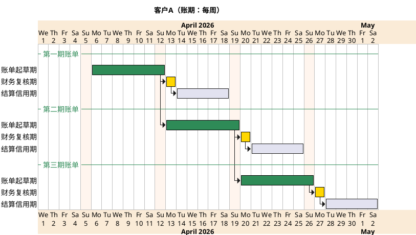
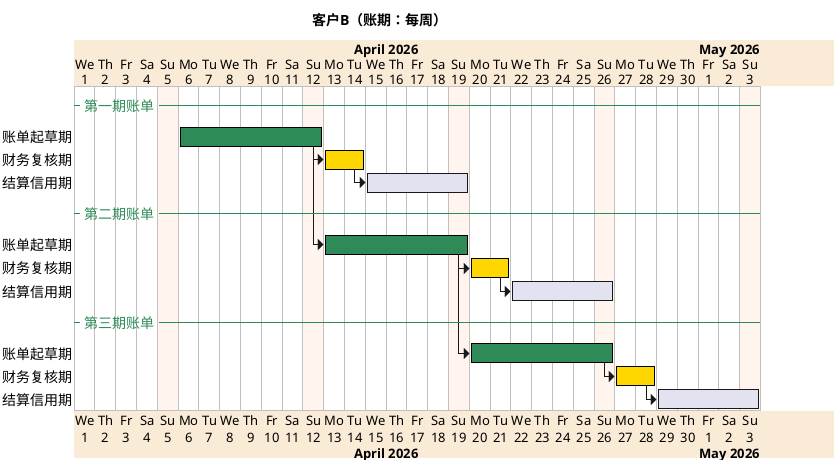
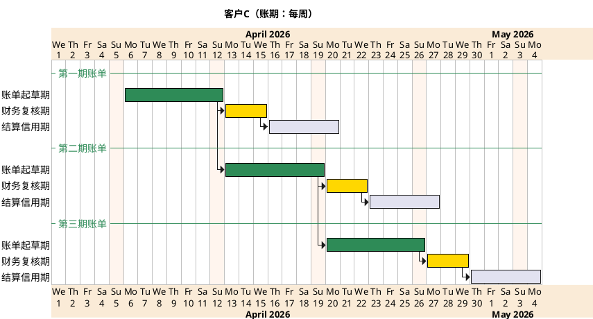
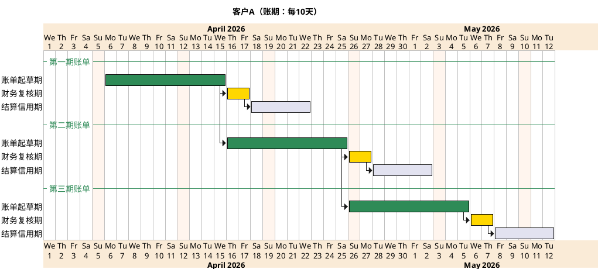
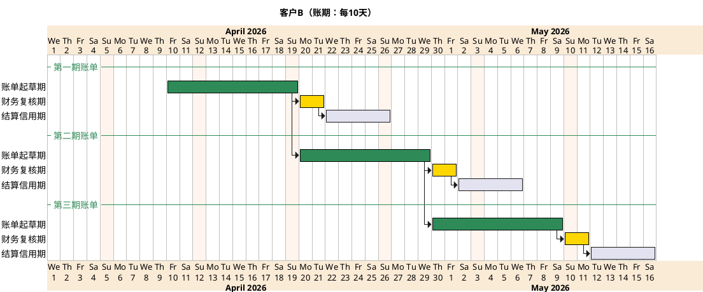
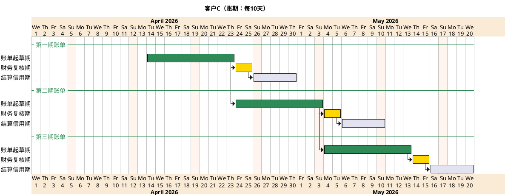

## 账期：周

```plantuml
@startgantt
title 客户A（账期：每周）
<style>
ganttDiagram {
	timeline {
        FontSize 13
        BackgroundColor AntiqueWhite
	}
	task {
		FontSize 14
	}
    arrow {
		LineThickness 1.0
	}
    separator {
		FontSize 14
		FontColor SeaGreen
		LineColor SeaGreen
	}
}
</style>

printscale daily
Label on first column and left aligned
sunday is colored in SeaShell
Project starts 2026/04/01

-- 第一期账单 --
[账单起草期] as [T1] starts 2026/04/06 and requires 1 week 
then [财务复核期] as [T1.1] requires 1 days
[T1.1] pauses on sataday
then [结算信用期] as [T1.2] requires 5 days

[T1] is colored in SeaGreen/Black
[T1.1] is colored in Gold/Black

-- 第二期账单 --
[账单起草期] as [T2] starts at [T1]'s end and requires 1 week
then [财务复核期] as [T2.1] requires 1 days
then [结算信用期] as [T2.2] requires 5 days

[T2] is colored in SeaGreen/Black
[T2.1] is colored in Gold/Black

-- 第三期账单 --
[账单起草期] as [T3] starts at [T2]'s end and requires 1 week
then [财务复核期] as [T3.1] requires 1 days
then [结算信用期] as [T3.2] requires 5 days

[T3] is colored in SeaGreen/Black
[T3.1] is colored in Gold/Black
@endgantt
```

```plantuml
@startgantt
title 客户B（账期：每周）
<style>
ganttDiagram {
	timeline {
        FontSize 13
        BackgroundColor AntiqueWhite
	}
	task {
		FontSize 14
	}
    arrow {
		LineThickness 1.0
	}
    separator {
		FontSize 14
		FontColor SeaGreen
		LineColor SeaGreen
	}
}
</style>

printscale daily
Label on first column and left aligned
sunday is colored in SeaShell
Project starts 2026/04/01

-- 第一期账单 --
[账单起草期] as [T1] starts 2026/04/06 and requires 1 week 
then [财务复核期] as [T1.1] requires 2 days
then [结算信用期] as [T1.2] requires 5 days

[T1] is colored in SeaGreen/Black
[T1.1] is colored in Gold/Black

-- 第二期账单 --
[账单起草期] as [T2] starts at [T1]'s end and requires 1 week
then [财务复核期] as [T2.1] requires 2 days
then [结算信用期] as [T2.2] requires 5 days

[T2] is colored in SeaGreen/Black
[T2.1] is colored in Gold/Black

-- 第三期账单 --
[账单起草期] as [T3] starts at [T2]'s end and requires 1 week
then [财务复核期] as [T3.1] requires 2 days
then [结算信用期] as [T3.2] requires 5 days

[T3] is colored in SeaGreen/Black
[T3.1] is colored in Gold/Black
@endgantt
```

```plantuml
@startgantt
title 客户C（账期：每周）
<style>
ganttDiagram {
	timeline {
        FontSize 13
        BackgroundColor AntiqueWhite
	}
	task {
		FontSize 14
	}
    arrow {
		LineThickness 1.0
	}
    separator {
		FontSize 14
		FontColor SeaGreen
		LineColor SeaGreen
	}
}
</style>

printscale daily
Label on first column and left aligned
sunday is colored in SeaShell
Project starts 2026/04/01

-- 第一期账单 --
[账单起草期] as [T1] starts 2026/04/06 and requires 1 week 
then [财务复核期] as [T1.1] requires 3 days
then [结算信用期] as [T1.2] requires 5 days

[T1] is colored in SeaGreen/Black
[T1.1] is colored in Gold/Black

-- 第二期账单 --
[账单起草期] as [T2] starts at [T1]'s end and requires 1 week
then [财务复核期] as [T2.1] requires 3 days
then [结算信用期] as [T2.2] requires 5 days

[T2] is colored in SeaGreen/Black
[T2.1] is colored in Gold/Black

-- 第三期账单 --
[账单起草期] as [T3] starts at [T2]'s end and requires 1 week
then [财务复核期] as [T3.1] requires 3 days
then [结算信用期] as [T3.2] requires 5 days

[T3] is colored in SeaGreen/Black
[T3.1] is colored in Gold/Black
@endgantt
```

## 账期：10天

```plantuml
@startgantt
title 客户A（账期：每10天）
<style>
ganttDiagram {
	timeline {
        FontSize 13
        BackgroundColor AntiqueWhite
	}
	task {
		FontSize 14
	}
    arrow {
		LineThickness 1.0
	}
    separator {
		FontSize 14
		FontColor SeaGreen
		LineColor SeaGreen
	}
}
</style>

printscale daily
Label on first column and left aligned
sunday is colored in SeaShell
Project starts 2026/04/01

-- 第一期账单 --
[账单起草期] as [T1] starts 2026/04/06 and requires 10 day 
then [财务复核期] as [T1.1] requires 2 days
then [结算信用期] as [T1.2] requires 5 days

[T1] is colored in SeaGreen/Black
[T1.1] is colored in Gold/Black

-- 第二期账单 --
[账单起草期] as [T2] starts at [T1]'s end and requires 10 day
then [财务复核期] as [T2.1] requires 2 days
then [结算信用期] as [T2.2] requires 5 days

[T2] is colored in SeaGreen/Black
[T2.1] is colored in Gold/Black

-- 第三期账单 --
[账单起草期] as [T3] starts at [T2]'s end and requires 10 day
then [财务复核期] as [T3.1] requires 2 days
then [结算信用期] as [T3.2] requires 5 days

[T3] is colored in SeaGreen/Black
[T3.1] is colored in Gold/Black
@endgantt
```

```plantuml
@startgantt
title 客户B（账期：每10天）
<style>
ganttDiagram {
	timeline {
        FontSize 13
        BackgroundColor AntiqueWhite
	}
	task {
		FontSize 14
	}
    arrow {
		LineThickness 1.0
	}
    separator {
		FontSize 14
		FontColor SeaGreen
		LineColor SeaGreen
	}
}
</style>

printscale daily
Label on first column and left aligned
sunday is colored in SeaShell
Project starts 2026/04/01

-- 第一期账单 --
[账单起草期] as [T1] starts 2026/04/10 and requires 10 day 
then [财务复核期] as [T1.1] requires 2 days
then [结算信用期] as [T1.2] requires 5 days

[T1] is colored in SeaGreen/Black
[T1.1] is colored in Gold/Black

-- 第二期账单 --
[账单起草期] as [T2] starts at [T1]'s end and requires 10 day
then [财务复核期] as [T2.1] requires 2 days
then [结算信用期] as [T2.2] requires 5 days

[T2] is colored in SeaGreen/Black
[T2.1] is colored in Gold/Black

-- 第三期账单 --
[账单起草期] as [T3] starts at [T2]'s end and requires 10 day
then [财务复核期] as [T3.1] requires 2 days
then [结算信用期] as [T3.2] requires 5 days

[T3] is colored in SeaGreen/Black
[T3.1] is colored in Gold/Black
@endgantt
```

```plantuml
@startgantt
title 客户C（账期：每10天）
<style>
ganttDiagram {
	timeline {
        FontSize 13
        BackgroundColor AntiqueWhite
	}
	task {
		FontSize 14
	}
    arrow {
		LineThickness 1.0
	}
    separator {
		FontSize 14
		FontColor SeaGreen
		LineColor SeaGreen
	}
}
</style>

printscale daily
Label on first column and left aligned
sunday is colored in SeaShell
Project starts 2026/04/01

-- 第一期账单 --
[账单起草期] as [T1] starts 2026/04/14 and requires 10 day 
then [财务复核期] as [T1.1] requires 2 days
then [结算信用期] as [T1.2] requires 5 days

[T1] is colored in SeaGreen/Black
[T1.1] is colored in Gold/Black

-- 第二期账单 --
[账单起草期] as [T2] starts at [T1]'s end and requires 10 day
then [财务复核期] as [T2.1] requires 2 days
then [结算信用期] as [T2.2] requires 5 days

[T2] is colored in SeaGreen/Black
[T2.1] is colored in Gold/Black

-- 第三期账单 --
[账单起草期] as [T3] starts at [T2]'s end and requires 10 day
then [财务复核期] as [T3.1] requires 2 days
then [结算信用期] as [T3.2] requires 5 days

[T3] is colored in SeaGreen/Black
[T3.1] is colored in Gold/Black
@endgantt
```