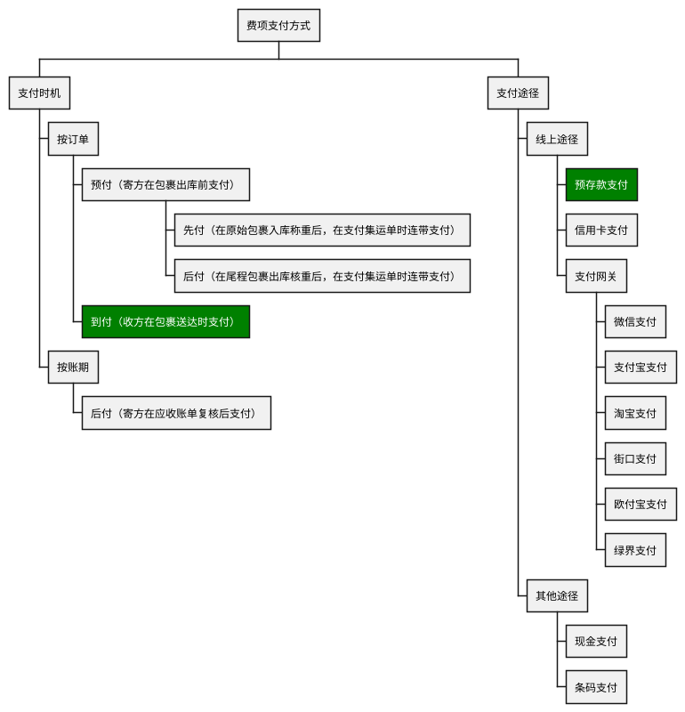
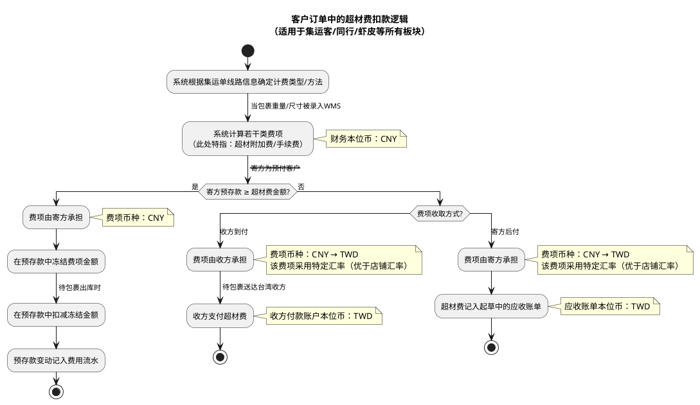

```plantuml
@startwbs
<style>
  .group1 {
    BackGroundColor green
    FontColor white
  }
</style>

* 费项支付方式
** 支付时机
*** 按订单
**** 预付（寄方在包裹出库前支付）
***** 先付（在原始包裹入库称重后，在支付集运单时连带支付）
***** 后付（在尾程包裹出库核重后，在支付集运单时连带支付）
**** 到付（收方在包裹送达时支付） <<group1>>
*** 按账期
**** 后付（寄方在应收账单复核后支付）
** 支付途径
*** 线上途径
**** 预存款支付 <<group1>>
**** 信用卡支付
**** 支付网关
***** 微信支付
***** 支付宝支付
***** 淘宝支付
***** 街口支付
***** 欧付宝支付
***** 绿界支付
*** 其他途径
**** 现金支付
**** 条码支付
@endwbs
```

```plantuml
@startuml
title 客户订单中的超材费扣款逻辑\n（适用于集运客/同行/虾皮等所有板块）
skinparam DefaultTextAlignment center
skinparam NoteTextAlignment left

start
:系统根据集运单线路信息确定计费类型/方法;
->当包裹重量/尺寸被录入WMS;
:系统计算若干类费项\n（此处特指：超材附加费/手续费）;
note right
财务本位币：CNY
end note
-><s>寄方为预付客户</s>;
if (寄方预存款 ≥ 超材费金额?) then (是)
  :费项由寄方承担;
  note right
  费项币种：CNY
  end note
  :在预存款中冻结费项金额;
  ->待包裹出库时;
  :在预存款中扣减冻结金额;
  :预存款变动记入费用流水;
  stop
else (否)
  switch(费项收取方式?)
  case(收方到付)
    :费项由收方承担;
    note right
    费项币种：CNY → TWD 
    该费项采用特定汇率（优于店铺汇率）
    end note
    ->待包裹送达台湾收方;
    :收方支付超材费;
    note right
    收方付款账户本位币：TWD
    end note
    stop
  case(寄方后付)
    :费项由寄方承担;
        note right
    费项币种：CNY → TWD 
    该费项采用特定汇率（优于店铺汇率）
    end note
    :超材费记入起草中的应收账单;
    note right
    应收账单本位币：TWD
    end note
    stop
  endswitch
endif
@enduml
```

1、集运客会员、同行、虾皮等所有板块都存在预付客户和后付客户。
2、无论是预付客户还是后付客户，都可以充值预存款，预存款往往会被优先使用，且只能在预付时使用。
3、不是按账期结算的应收费用不会被捞取到应收账单，只会归集到费用流水。