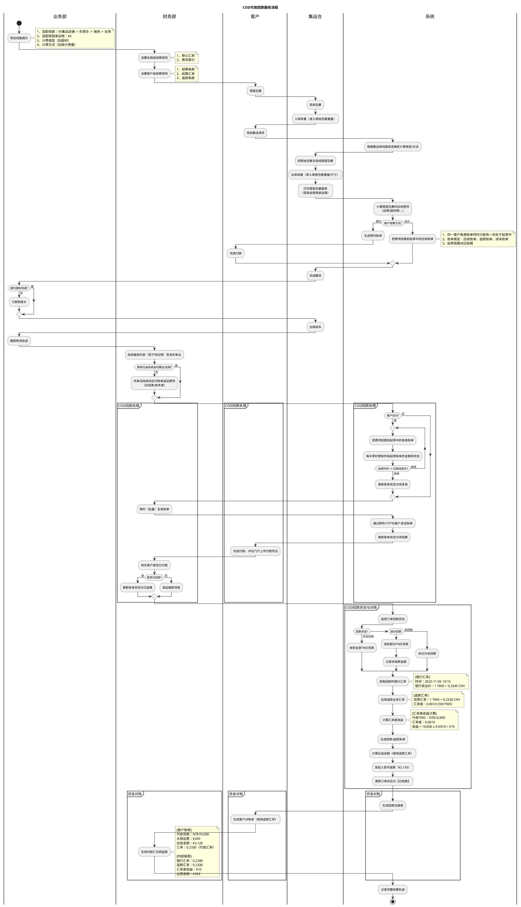

```plantuml
@startuml
title COD代收回款服务流程
skinparam DefaultTextAlignment center
skinparam NoteTextAlignment left
skinparam shadowing false

|业务部|
start
:预设线路报价;
note right
  1、适配线路：XX集运店铺 -> 东莞仓 -> 海快 -> 台湾
  2、适配尾程承运商：XX
  3、计费类型（如超材）
  4、计费方式（如按计费重）
end note

|财务部|
:设置全局级结算规则;
note right
  1、默认汇率
  2、费项索引
end note
:设置客户级结算规则;
note right
  1、结算条款
  2、结算汇率
  3、返款条款
end note

|客户|
:预报包裹;

|集运仓|
:揽收包裹;
:入库称重（录入原始包裹重量）;

|客户|
:发起集运请求;

|系统|
:根据集运单线路信息确定计费类型/方法;

|集运仓|
:把原始包裹合装成尾程包裹;
:出库核重（录入尾程包裹重量/尺寸）;
:打印尾程包裹面单\n（获取自尾程承运商）;

|系统|
:计算尾程包裹的应收费项\n（运费/超材费/…）;

if (客户结算方式?) then (预付)
  |系统|
  :生成预付账单;
  |客户|
  :完成付款;
else (后付)
  |系统|
  :把费项挂靠到起草中的应收账单;
  note right
    1、同一客户每类账单同时只能有一份处于起草中
    2、账单类型：应收账单、返款账单、成本账单
    3、起草周期对应账期
  end note
endif

|集运仓|
:完成集货;

|业务部|
if (委托国际快递?) then (否)
  :订舱和报关;
else (是)
endif

|集运仓|
:出库装车;

|业务部|
:跟踪物流轨迹;

|财务部|
:陆续接收外部（若干供应商）签发的单证;
if (费用已由系统自动算出/拉取?) then (是)
else (否)
  :凭单证陆续向后付账单追加费项\n（应收类/成本类）;
endif

group COD回款处理 {
  |系统|
  if (客户后付?) then (是)
    repeat
      :把费项挂靠到起草中的各类账单;
      :每天零时更新所有起草账单的金额和状态;
    repeat while (当前时间 <= 记账结束日?) is (继续) not (结束)
    :更新账单状态为待复核;
  else (否)
  endif

  |财务部|
  :限时（批量）复核账单;

  |系统|
  :通过邮件/门户向客户发送账单;
  :更新账单状态为待结算;

  |客户|
  :完成付款，并在门户上传付款凭证;

  |财务部|
  :核实客户是否已付款;
  if (款项已到账?) then (是)
    :更新账单状态为已结算;
  else (否)
    :发起催款流程;
  endif
}

group COD回款状态与对账 {
  |系统|
  :监控订单回款状态;
  if (回款状态?) then (完全回款)
    :收到全部TWD货款;
  elseif (部分回款)
    :收到部分TWD货款;
    :记录未结款金额;
  else (未回款)
    :标记为未回款;
  endif

  :获取回款时银行汇率;
  note right
    [银行汇率]
    时间：2023-11-05 10:15
    银行卖出价：1 TWD = 0.2340 CNY
  end note

  :应用返款业务汇率;
  note right
    [返款汇率]
    现用汇率：1 TWD = 0.2330 CNY
    汇率差：0.0010 CNY/TWD
  end note

  :计算汇率差收益;
  note right
    [汇率差收益计算]
    代收TWD：NT$10,000
    汇率差：0.0010
    收益 = 10,000 x 0.0010 = ¥10
  end note

  :生成回款/返款账单;
  :计算应返金额（使用返款汇率）;
  :发起人民币返款（¥2,130）;
  :更新订单状态为【已结款】;
}

group 资金对账 {
  |系统|
  :生成回款日报表;

  |客户|
  :生成客户对账单（使用返款汇率）;

  |财务部|
  :生成内部汇兑损益表;
  note right
    [客户账单]
    代收货款：NT$10,000
    头程运费：¥200
    应收金额：¥2,120
    汇率：0.2330（代收汇率）

    [内部报表]
    银行汇率：0.2340
    返款汇率：0.2330
    汇率差收益：¥10
    运费差额：¥200
  end note
}
|系统|
:记录完整结算轨迹;
stop
@enduml
```
