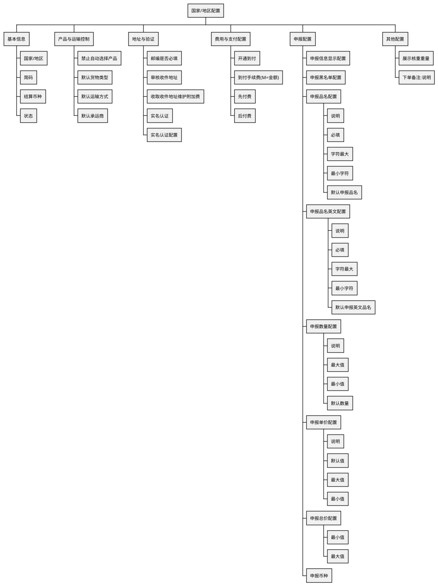

#

```plantuml
@startwbs
* 国家/地区配置
** 基本信息
*** 国家/地区
*** 简码
*** 结算币种
*** 状态
** 产品与运输控制
*** 禁止自动选择产品
*** 默认货物类型
*** 默认运输方式
*** 默认承运商
** 地址与验证
*** 邮编是否必填
*** 审核收件地址
*** 收取收件地址维护附加费
*** 实名认证
*** 实名认证配置
** 费用与支付配置
*** 开通到付
*** 到付手续费(M=金额)
*** 先付费
*** 后付费
** 申报配置
*** 申报信息显示配置
*** 申报黑名单配置
*** 申报品名配置
**** 说明
**** 必填
**** 字符最大
**** 最小字符
**** 默认申报品名
*** 申报品名英文配置
**** 说明
**** 必填
**** 字符最大
**** 最小字符
**** 默认申报英文品名
*** 申报数量配置
**** 说明
**** 最大值
**** 最小值
**** 默认数量
*** 申报单价配置
**** 说明
**** 默认值
**** 最大值
**** 最小值
*** 申报总价配置
**** 最小值
**** 最大值
*** 申报币种
** 其他配置
*** 展示核重重量
*** 下单备注:说明
@endwbs
```
