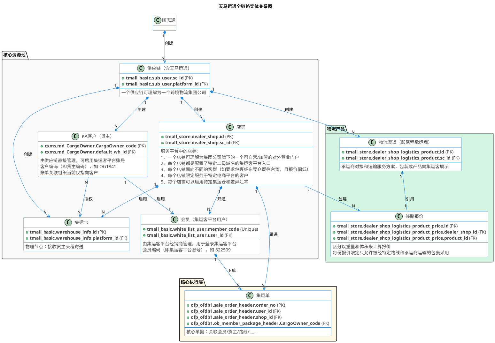

```plantuml
@startuml
title 天马运通全链路实体关系图

' 设置样式
skinparam class {
    BackgroundColor White
    ArrowColor #2688d2
    BorderColor #2688d2
    AttributeFontColor #444
}


class "顺志通" as TM {}


package "核心资源池" #F9F9F9 {
    class "供应链（含天马运通）" as SC {
        + **tmall_basic.sub_user.sc_id** (PK)
        + **tmall_basic.sub_user.platform_id** (FK)
        --
        一个供应链可理解为一个跨境物流集团公司
    }

    class "店铺" as Shop {
        + **tmall_store.dealer_shop.id** (PK)
        + **tmall_store.dealer_shop.sc_id** (FK)
        --
        服务平台中的店铺:
        1、一个店铺可理解为集团公司旗下的一个可自营/加盟的对外营业门户
        2、每个店铺都是配置了特定二级域名的集运客平台入口
        3、每个店铺面向不同的客群（如要求包裹经东莞仓既往台湾，且报价偏低）
        4、每个店铺限定服务于特定电商平台的客户
        5、每个店铺可以启用特定集运仓和差异汇率
    }

    class "会员（集运客平台用户）" as Member {
        + **tmall_basic.white_list_user.member_code** (Unique)
        + **tmall_basic.white_list_user.user_id** (FK)
        --
        由集运客平台经销商管理，用于登录集运客平台
        会员编码（即集运客平台账号），如 822509
    }

    class "集运仓" as WH {
        + **tmall_basic.warehouse_info.id** (PK)
        + **tmall_basic.warehouse_info.platform_id** (FK)
        --
        物理节点：接收货主头程寄送
    }

    class "KA客户（货主）" as CargoOwner {
        + **cxms.md_CargoOwner.CargoOwner_code** (PK)
        + **cxms.md_CargoOwner.default_wh_id** (FK)
        --
        由供应链直接管理，可启用集运客平台账号
        客户编码（即货主编码），如 OG1841
        账单关联组织当前仅指向客户
    }
}


package "物流产品" #D5F5E3 {
    class "物流渠道（即尾程承运商）" as Channel {
        + **tmall_store.dealer_shop_logistics_product.id** (PK)
        + **tmall_store.dealer_shop_logistics_product.sc_id** (FK)
        --
        承运商对接和运输服务方案，包装成产品向集运客展示
    }

    class "线路报价" as RoutePrice {
        + **tmall_store.dealer_shop_logistics_product_price.id** (PK)
        + **tmall_store.dealer_shop_logistics_product_price.dealer_shop_id** (FK)
        + **tmall_store.dealer_shop_logistics_product_price.product_id** (FK)
        --
        区分以重量和体积来计算报价
        每份报价限定只允许被经特定路线和承运商运输的包裹采用
    }
}

package "核心执行层" #FEF9E7 {
    class "集运单" as Order {
        + **ofp_ofdb1.sale_order_header.order_no** (PK)
        + **ofp_ofdb1.sale_order_header.user_id** (FK)
        + **ofp_ofdb1.sale_order_header.shop_id** (FK)
        + **ofp_ofdb1.ob_member_package_header.CargoOwner_code** (FK)
        --
        核心单据：关联会员/货主/路线/……
    }
}

' --- 逻辑关联 ---
SC "1" *--> "N" WH : 创建
SC "1" *--> "N" Shop : 创建
SC "1" *--> "N" CargoOwner : 创建
SC "1" *--> "N" Channel : 创建

TM "1" *--> "N" SC : 创建
CargoOwner "N" --> "N" WH : 授权
Shop "1" --> "N" RoutePrice : 创建
Channel "N" <-- "1" RoutePrice : 引用
Shop "1" *--> "N" Member : 开通
Shop "1" *--> "N" Order : 跟进
Shop "1" *--> "N" WH : 启用
Member "1" *--> "N" Order : 下单
CargoOwner "1" --> "1" Member : 启用

@enduml
```