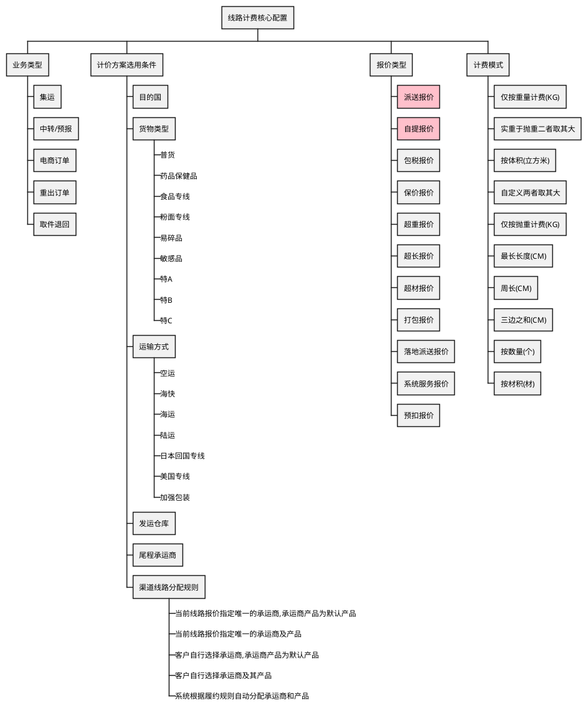

```plantuml
@startwbs
<style>
  .group1 {
     BackgroundColor pink
  }
</style>

* 线路计费核心配置
** 业务类型
*** 集运
*** 中转/预报
*** 电商订单
*** 重出订单
*** 取件退回
** 计价方案选用条件
*** 目的国
*** 货物类型
****_ 普货
****_ 药品保健品
****_ 食品专线
****_ 粉面专线
****_ 易碎品
****_ 敏感品
****_ 特A
****_ 特B
****_ 特C
*** 运输方式
****_ 空运
****_ 海快
****_ 海运
****_ 陆运
****_ 日本回国专线
****_ 美国专线
****_ 加强包装
*** 发运仓库
*** 尾程承运商
*** 渠道线路分配规则
****_ 当前线路报价指定唯一的承运商,承运商产品为默认产品
****_ 当前线路报价指定唯一的承运商及产品
****_ 客户自行选择承运商,承运商产品为默认产品
****_ 客户自行选择承运商及其产品
****_ 系统根据履约规则自动分配承运商和产品
** 报价类型
*** 派送报价 <<group1>>
*** 自提报价 <<group1>>
*** 包税报价
*** 保价报价
*** 超重报价
*** 超长报价
*** 超材报价
*** 打包报价
*** 落地派送报价
*** 系统服务报价
*** 预扣报价
** 计费模式
*** 仅按重量计费(KG)
*** 实重于抛重二者取其大
*** 按体积(立方米)
*** 自定义两者取其大
*** 仅按抛重计费(KG)
*** 最长长度(CM)
*** 周长(CM)
*** 三边之和(CM)
*** 按数量(个)
*** 按材积(材)
@endwbs
```