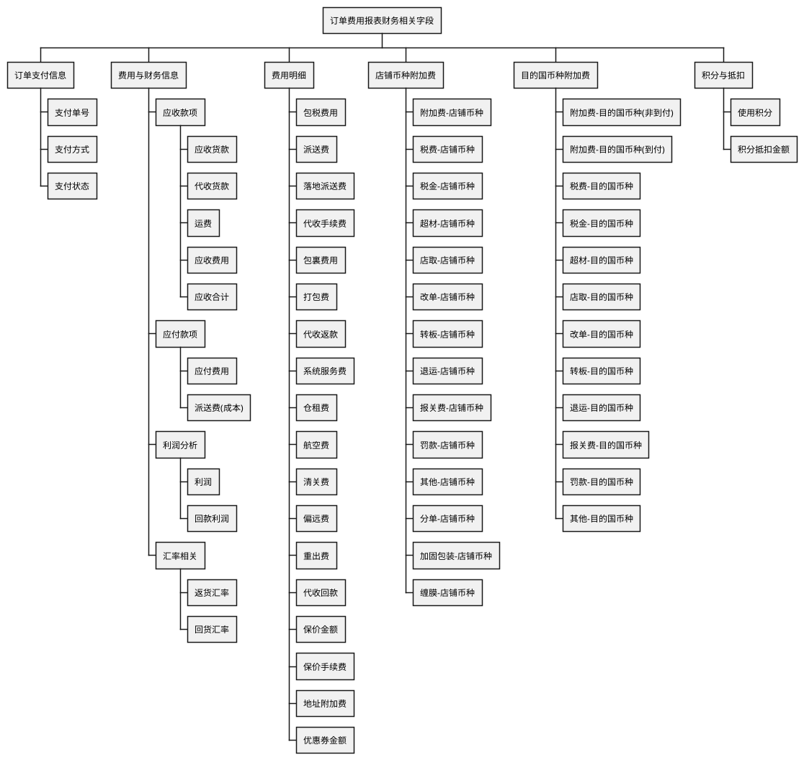
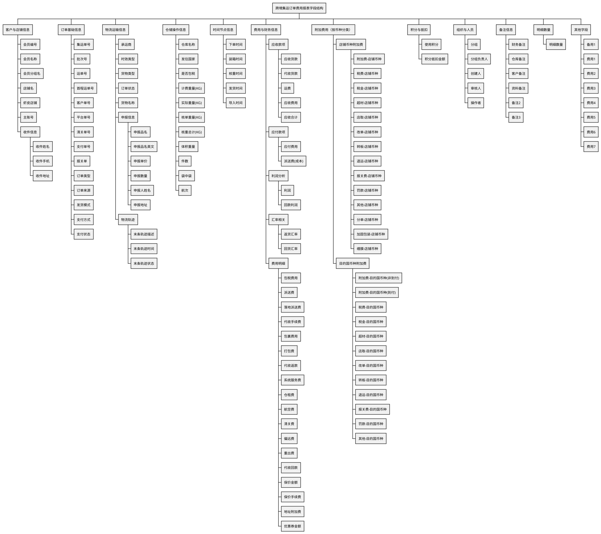

```plantuml
@startwbs #
* 订单费用报表财务相关字段
** 订单支付信息
*** 支付单号
*** 支付方式
*** 支付状态
** 费用与财务信息
*** 应收款项
**** 应收货款
**** 代收货款
**** 运费
**** 应收费用
**** 应收合计
*** 应付款项
**** 应付费用
**** 派送费(成本)
*** 利润分析
**** 利润
**** 回款利润
*** 汇率相关
**** 返货汇率
**** 回货汇率
** 费用明细
*** 包税费用
*** 派送费
*** 落地派送费
*** 代收手续费
*** 包裏费用
*** 打包费
*** 代收返款
*** 系统服务费
*** 仓租费
*** 航空费
*** 清关费
*** 偏远费
*** 重出费
*** 代收回款
*** 保价金额
*** 保价手续费
*** 地址附加费
*** 优惠券金额
** 店铺币种附加费
*** 附加费-店铺币种
*** 税费-店铺币种
*** 税金-店铺币种
*** 超材-店铺币种
*** 店取-店铺币种
*** 改单-店铺币种
*** 转板-店铺币种
*** 退运-店铺币种
*** 报关费-店铺币种
*** 罚款-店铺币种
*** 其他-店铺币种
*** 分单-店铺币种
*** 加固包装-店铺币种
*** 缠膜-店铺币种
** 目的国币种附加费
*** 附加费-目的国币种(非到付)
*** 附加费-目的国币种(到付)
*** 税费-目的国币种
*** 税金-目的国币种
*** 超材-目的国币种
*** 店取-目的国币种
*** 改单-目的国币种
*** 转板-目的国币种
*** 退运-目的国币种
*** 报关费-目的国币种
*** 罚款-目的国币种
*** 其他-目的国币种
** 积分与抵扣
*** 使用积分
*** 积分抵扣金额
@endwbs
```

```plantuml
@startwbs
* 跨境集运订单费用报表字段结构
** 客户与店铺信息
*** 会员编号
*** 会员名称
*** 会员分组名
*** 店铺名
*** 虾皮店铺
*** 主账号
*** 收件信息
**** 收件姓名
**** 收件手机
**** 收件地址
** 订单基础信息
*** 集运单号
*** 批次号
*** 运单号
*** 首程运单号
*** 客户单号
*** 平台单号
*** 清关单号
*** 支付单号
*** 报关单
*** 订单类型
*** 订单来源
*** 发货模式
*** 支付方式
*** 支付状态
** 物流运输信息
*** 承运商
*** 时效类型
*** 货物类型
*** 订单状态
*** 货物名称
*** 申报信息
**** 申报品名
**** 申报品名英文
**** 申报单价
**** 申报数量
**** 申报人姓名
**** 申报地址
*** 物流轨迹
**** 末条轨迹描述
**** 末条轨迹时间
**** 末条轨迹状态
** 仓储操作信息
*** 仓库名称
*** 发往国家
*** 是否包税
*** 计费重量(KG)
*** 实际重量(KG)
*** 核单重量(KG)
*** 核重总计(KG)
*** 体积重量
*** 件数
*** 袋中袋
*** 航次
** 时间节点信息
*** 下单时间
*** 装箱时间
*** 核重时间
*** 发货时间
*** 导入时间
** 费用与财务信息
*** 应收款项
**** 应收货款
**** 代收货款
**** 运费
**** 应收费用
**** 应收合计
*** 应付款项
**** 应付费用
**** 派送费(成本)
*** 利润分析
**** 利润
**** 回款利润
*** 汇率相关
**** 返货汇率
**** 回货汇率
*** 费用明细
**** 包税费用
**** 派送费
**** 落地派送费
**** 代收手续费
**** 包裏费用
**** 打包费
**** 代收返款
**** 系统服务费
**** 仓租费
**** 航空费
**** 清关费
**** 偏远费
**** 重出费
**** 代收回款
**** 保价金额
**** 保价手续费
**** 地址附加费
**** 优惠券金额
** 附加费用（按币种分类）
*** 店铺币种附加费
**** 附加费-店铺币种
**** 税费-店铺币种
**** 税金-店铺币种
**** 超材-店铺币种
**** 店取-店铺币种
**** 改单-店铺币种
**** 转板-店铺币种
**** 退运-店铺币种
**** 报关费-店铺币种
**** 罚款-店铺币种
**** 其他-店铺币种
**** 分单-店铺币种
**** 加固包装-店铺币种
**** 缠膜-店铺币种
*** 目的国币种附加费
**** 附加费-目的国币种(非到付)
**** 附加费-目的国币种(到付)
**** 税费-目的国币种
**** 税金-目的国币种
**** 超材-目的国币种
**** 店取-目的国币种
**** 改单-目的国币种
**** 转板-目的国币种
**** 退运-目的国币种
**** 报关费-目的国币种
**** 罚款-目的国币种
**** 其他-目的国币种
** 积分与抵扣
*** 使用积分
*** 积分抵扣金额
** 组织与人员
*** 分组
*** 分组负责人
*** 创建人
*** 审核人
*** 操作者
** 备注信息
*** 财务备注
*** 仓库备注
*** 客户备注
*** 资料备注
*** 备注2
*** 备注3
** 明细数量
*** 明细数量
** 其他字段
*** 备用1
*** 费用1
*** 费用2
*** 费用3
*** 费用4
*** 费用5
*** 费用6
*** 费用7
@endwbs
```
