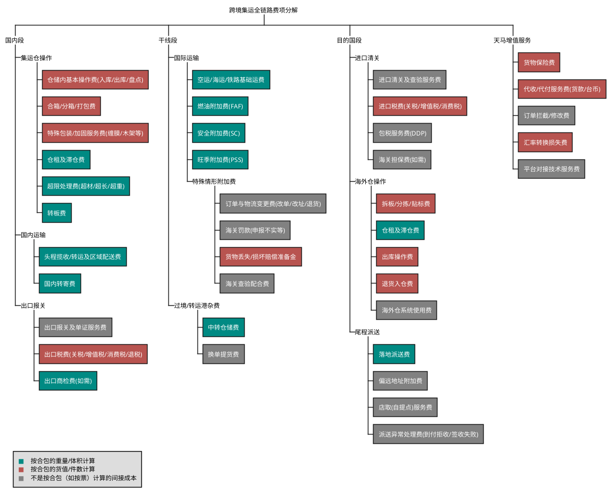

```plantuml
@startwbs
<style>
  .按重量/体积 { 
    BackgroundColor #008a83;
    FontColor white;
  }
  .按货值/数量 { 
    BackgroundColor #B85450;
    FontColor white;
  }
  .按票或间接成本 { 
    BackgroundColor #818181;
    FontColor white;
  }
</style>

*_ 跨境集运全链路费项分解
**_ 国内段
***_ 集运仓操作
**** 仓储内基本操作费(入库/出库/盘点) <<按货值/数量>>
**** 合箱/分箱/打包费 <<按货值/数量>>
**** 特殊包装/加固服务费(缠膜/木架等) <<按货值/数量>>
**** 仓租及滞仓费 <<按重量/体积>> 
**** 超限处理费(超材/超长/超重) <<按重量/体积>>
**** 转板费 <<按重量/体积>>
***_ 国内运输
**** 头程揽收/转运及区域配送费 <<按重量/体积>> 
**** 国内转寄费 <<按重量/体积>>
***_ 出口报关
**** 出口报关及单证服务费 <<按票或间接成本>>
**** 出口税费(关税/增值税/消费税/退税) <<按货值/数量>>
**** 出口商检费(如需) <<按重量/体积>>

**_ 干线段
***_ 国际运输
**** 空运/海运/铁路基础运费 <<按重量/体积>>
**** 燃油附加费(FAF) <<按重量/体积>>
**** 安全附加费(SC) <<按重量/体积>>
**** 旺季附加费(PSS) <<按重量/体积>>
****_ 特殊情形附加费
***** 订单与物流变更费(改单/改址/退货) <<按票或间接成本>>
***** 海关罚款(申报不实等) <<按票或间接成本>>
***** 货物丢失/损坏赔偿准备金 <<按货值/数量>>
***** 海关查验配合费 <<按票或间接成本>>
***_ 过境/转运港杂费
**** 中转仓储费 <<按重量/体积>>
**** 换单提货费 <<按票或间接成本>>

**_ 目的国段
***_ 进口清关
**** 进口清关及查验服务费 <<按票或间接成本>>
**** 进口税费(关税/增值税/消费税) <<按货值/数量>>
**** 包税服务费(DDP) <<按票或间接成本>>
**** 海关担保费(如需) <<按票或间接成本>>
***_ 海外仓操作
**** 拆板/分拣/贴标费 <<按货值/数量>>
**** 仓租及滞仓费 <<按重量/体积>>
**** 出库操作费 <<按货值/数量>>
**** 退货入仓费 <<按货值/数量>>
**** 海外仓系统使用费 <<按票或间接成本>>
***_ 尾程派送
**** 落地派送费 <<按重量/体积>>
**** 偏远地址附加费 <<按票或间接成本>>
**** 店取(自提点)服务费 <<按票或间接成本>>
**** 派送异常处理费(到付拒收/签收失败) <<按票或间接成本>>

**_ 天马增值服务
*** 货物保险费 <<按货值/数量>>
*** 代收/代付服务费(货款/台币) <<按货值/数量>>
*** 订单拦截/修改费 <<按票或间接成本>>
*** 汇率转换损失费 <<按货值/数量>>
*** 平台对接技术服务费 <<按票或间接成本>>


legend left
<color:#008a83>■</color>    按合包的重量/体积计算
<color:#B85450>■</color>    按合包的货值/件数计算
<color:#818181>■</color>    不是按合包（如按票）计算的间接成本
end legend
@endwbs
```

