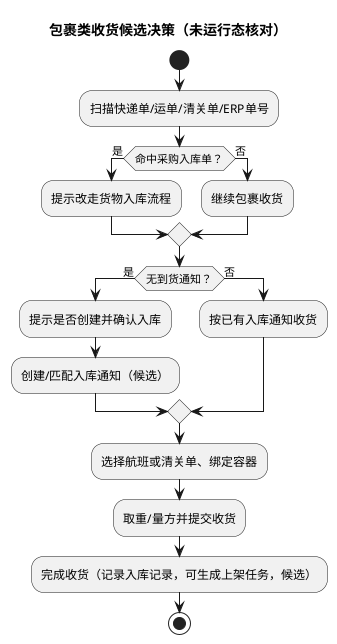
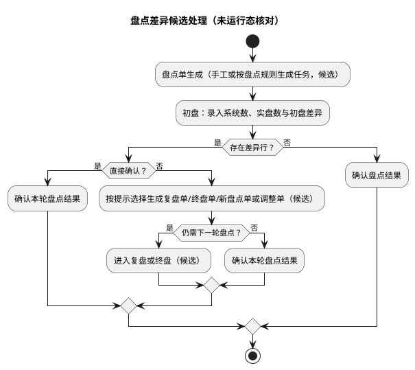

# WMS 完整版 PRD：产品结构与功能基线

## 阅读导航

本 PRD 按“已确认结构 → 候选逻辑 → 待核对问题”三层组织：第 1–2 章界定范围、来源与统计口径并给出模块结构总览和页面结构树；第 3–16 章按模块先交代页面结构与结构疑点，再给出候选业务主线与页面关系；第 17 章汇总跨模块共用结构，第 18 章登记未核对与待决策问题，第 19 章说明维护与深化方式，第 20 章给出逐页功能点与关键业务字段候选。

| 阅读目的 | 直达位置 |
| --- | --- |
| 快速了解 14 个一级模块、142 个菜单/功能页与两条候选主线 | [2. 产品全貌](#2-产品全貌) |
| 查看某一模块的候选主线与页面关系 | 从 [3. 基础模块](#3-基础模块) 起按模块阅读，逐页字段候选统一见 [20. 附录：页面功能点与关键业务字段索引](#20-附录页面功能点与关键业务字段索引) |
| 查看跨模块复用的对象与待统一口径 | [17. 跨模块共用结构](#17-跨模块共用结构) |
| 查看未核对事项与需要产品确认的决策 | [18. 问题清单](#18-问题清单) |
| 了解本文件的后续维护与深化方式 | [19. 后续维护与深化方式](#19-后续维护与深化方式) |

## 1. 需求目的与范围

### 1.1 需求目的

WMS 此前没有完整版 PRD，模块、菜单和页面的结构口径散落在前端代码与运行系统中，后续新增、修改或删除需求时缺少可定位的结构主库。本版 PRD 先把现行 WMS 的产品结构固化为完整版 PRD 基线：明确一级模块、二级分组、菜单/功能页、内部路由标识和结构级操作能力，使后续每个业务迭代都能先定位结构落点，再补充字段、状态、权限和计算口径。

本版只确认“产品结构”这一层口径；页面级字段、校验、状态机、权限点和业务流程规则不因本版收录而视为已确认，统一在 [18. 问题清单](#18-问题清单) 中登记，并在后续模块化迭代中逐个闭合。

本版同时把各模块页面之间的业务关系和候选主线整理为“模块逻辑描述（候选）”，作为后续逐模块深化的阅读骨架；这些逻辑由页面结构、页面名称与前端文案字典推断，未运行态核对前不作为已确认的业务流程规则。

### 1.2 适用范围

本 PRD 覆盖 WMS `/wh` 路径下的全部前端功能结构，当前收录 14 个一级模块、142 个菜单/功能页，以及与之配套的新增、编辑、查看/详情等隐藏子路由。

本版收录以下内容：

1. 一级模块与二级分组关系。
2. 菜单/功能页清单及前端路由标识（`route name`）。
3. 由前端路由结构可直接观察到的“新增、编辑、查看/详情”子页能力。
4. 同一页面在不同模块或新旧版本中重复出现等结构疑点。
5. 附录中的页面功能点与关键业务字段候选概述（未运行态核对，作为模块化深化起点）。
6. 各模块“模块逻辑描述（候选）”：以页面结构与文案字典推断的页面间关系、候选业务主线及与相邻模块的衔接。

本版不收录以下内容，后续迭代另行处理：

1. `/login`、`/selectSystem`、`/modifyPassword`、`/console`、`/mouTai`、`/test` 等非 WMS `/wh` 入口。
2. 页面级字段清单、校验规则、状态机、权限点、计算口径和打印版式。
3. 后端接口、任务调度、数据同步等实现侧结构。
4. PDA、称重机等非浏览器终端的设备交互细节。

### 1.3 事实来源与读取口径

本版产品结构的事实来源是 2026-09-02 可访问的 WMS 前端页面与静态资源：

| 事实来源 | 说明 |
| --- | --- |
| 页面地址 | http://192.168.0.243:7783/wh/index（浏览器标题为 WMS） |
| 静态资源 | `/js/app.ed7e51ca.js` 及配套 chunk 文件 |
| 采集方式 | 解析前端路由表并关联中文文案字典，还原模块、菜单、页面与隐藏子路由 |
| 运行态核对 | 未执行：当前无登录账号，未对登录后的菜单、页面布局和操作按钮做浏览器冒烟 |

本版口径约定如下：

1. “一级模块”指 `/wh` 路由的直接功能分组；“二级分组”指模块内可再展开的菜单分组。
2. “菜单/功能页”指前端路由中未标记隐藏的页面；“隐藏子路由”指新增、编辑、查看/详情、批量更新等不直接出现在菜单中的页面。
3. “页面数量”按菜单/功能页统计，不把同一列表下的隐藏子路由重复计数。
4. 前端路由是全量能力目录，不等于某个账号登录后可见的菜单；实际菜单还受账号权限、仓库节点和自定义菜单影响。
5. “模块逻辑描述（候选）”是页面级业务顺序与对象关系的候选口径，依据为路由分组顺序、页面名称和前端文案字典中的字段与操作提示；未经运行态与接口核对，不得作为正式业务流程规则使用。

## 2. 产品全貌

### 2.1 业务覆盖

从页面结构看，WMS 承担两类业务：一类是仓库内履约，覆盖电商/会员包裹的入库、上架、库存、波次拣货、复核、打包、出库交接和退件；另一类是跨境集运，覆盖航班航线、集运交接、空/航运集包、散件合包、报关与清关袋点到、集运复核和核重算费。基础资料、业务规则、权限、系统设备、报表、日志和任务管理作为横向支撑模块同时存在。

以上覆盖范围由页面名称和模块结构直接可观察；两段业务的主流程、单据状态和作业口径仍需后续按模块确认。本版在各模块章节给出“模块逻辑描述（候选）”，仅用于阅读定位，不作为正式流程规则。

#### 2.1.1 一图看懂：两条候选业务主线与模块落点

下图把 14 个一级模块按“仓内履约、跨境集运、横向支撑”三条主线组织（报表与系统日志合并为“报表/系统日志”节点，自定义查询作为独立入口未在图中单列），只表达候选主线上的环节顺序与模块归属；页面归属的完整主描述见 [2.3 页面结构树](#23-页面结构树)，图中出现的顺序不作为已确认规则。

```d2
vars: {
  d2-config: {
    layout-engine: elk
    theme-id: 104
    sketch: false
  }
  d2-elk-config: {
    "elk.direction": "RIGHT"
    "elk.layered.spacing.nodeNodeBetweenLayers": 34
    "elk.spacing.nodeNode": 26
  }
}

classes: {
  lane: {
    style.fill: "#F1F5F9"
    style.stroke: "#94A3B8"
    style.stroke-width: 1
  }
  start: {
    style.fill: "#EAF4FF"
    style.stroke: "#2563A6"
    style.stroke-width: 1
    style.font-size: 14
  }
}

upstream: 外部输入 {
  class: start
  po_in: "出库订单/预报出库"
  asn_in: "入库通知(ASN)/到货包裹"
  return_in: "退件预报/快递退回"
}

fulfill: 仓内履约主线（候选） {
  class: lane
  receive: "入库模块\n收货/上架"
  inventory: "库存模块\n库存账与库存作业"
  outbound: "出库模块\n波次/拣货/复核/交接"
  track: "物流跟踪模块\n运单轨迹"
  returns: "退件模块\n退件回仓/再出库"
}

cross: 跨境集运主线（候选） {
  class: lane
  parcel_in: "入库模块\n包裹/电商包裹入库"
  consolidate: "集运模块\n空/航运集包、散件合包"
  customs: "集运模块\n报关单/清关袋点到"
  recheck: "集运模块\n复核/核重算费"
  handover: "集运模块\n集运发货交接"
}

support: 横向支撑模块（候选） {
  class: lane
  base: "基础模块：主数据"
  rules: "业务规则模块：规则配置"
  tasks: "任务管理模块：任务编组/指派"
  sys: "系统模块：设备/参数/字典"
  auth: "权限模块：账号/角色/用户组"
  report: "报表/系统日志：统计与追溯"
}

po_in -> fulfill.outbound: 出库需求（候选）
asn_in -> fulfill.receive: 到货（候选）
fulfill.receive -> fulfill.inventory: 收货上架（候选）
fulfill.inventory -> fulfill.outbound: 分配/拣货（候选）
fulfill.outbound -> fulfill.track: 交接离仓（候选）
fulfill.returns -> fulfill.receive: 拆包后回仓（候选）
fulfill.returns -> fulfill.outbound: 退件再出库（候选）

asn_in -> cross.parcel_in: 包裹到货（候选）
cross.parcel_in -> cross.consolidate: 集包/合包（候选）
cross.consolidate -> cross.customs: 报关/清关袋点到（候选）
cross.customs -> cross.recheck: 复核/核重（候选）
cross.recheck -> cross.handover: 集运交接（候选）

support -> fulfill: 支撑关系（候选）
support -> cross: 支撑关系（候选）
```

| 图中环节 | 业务说明 | 候选依据 | 形成结果 |
| --- | --- | --- | --- |
| 仓内履约主线 | 收货/上架 → 库存 → 出库执行 → 交接离仓，退件在回仓与再出库间流转 | 入库、库存、出库、退件各章“模块逻辑描述（候选）” | 包裹/货物完成仓内履约并进入承运环节（候选） |
| 跨境集运主线 | 包裹类入库 → 集包/合包 → 报关/清关袋点到 → 复核/核重 → 集运交接 | 集运模块“模块逻辑描述（候选）” | 集运包裹完成干线交接（候选） |
| 横向支撑模块 | 主数据、规则、任务、设备参数、权限、报表与日志对两条主线的支撑和结果追溯 | 模块结构树与页面文案字典 | 支撑模块与主线的具体挂接点待逐模块确认 |

图中“支撑关系”不表示某条已确认的接口或调用链，只用于提示模块分工；基础主数据、业务规则等如何被主线页面引用，见各模块“模块逻辑描述（候选）”。

### 2.2 模块结构总览

| 一级模块 | 菜单/功能页数 | 结构内容 |
| --- | ---: | --- |
| 基础 | 27 | 商品、包装、容器、仓库、货主/客户、库内物理位置、清关/报关/国际货运资料、币种汇率、物流渠道、组合商品 |
| 入库 | 13 | 入库通知、多种收货/入库作业、分拣、上架任务、入库记录、预入库明细 |
| 集运 | 17 | 航线航班、集运交接、空/航运集包、包裹查询、散件合包、报关与清关袋点到、复核与核重算费 |
| 出库 | 25 | 出库订单与通知、打印、波次拣货、复核、称重码托、交接、集货、取消登记 |
| 退件 | 5 | 退件查询/收货/出库、快速退件、拆包退件登记 |
| 物流跟踪 | 1 | 运单轨迹 |
| 库存 | 12 | 六类库存查询、库存转移/调整/盘点、批次调整、冻结/解冻、库存日志 |
| 报表 | 7 | 库内、入库、出库三类报表 |
| 权限 | 3 | 用户账户、角色权限、用户组 |
| 系统 | 9 | 设备集成、安防监控、运营参数、代码字典、业务参数、打印模板 |
| 系统日志 | 2 | 导入记录、错误消息 |
| 业务规则 | 16 | 筛单、波次、上架、分配、批次、销毁、存储、库位组合、任务拆分、装箱互斥、盘点、质检、串号等规则配置（含波次模板、自动波次、自动分配） |
| 任务管理 | 4 | 任务列表、增值服务任务、未编组任务、通知消息 |
| 自定义查询 | 1 | 自定义查询入口页 |

页面数量合计 142。统计边界见 [1.3 事实来源与读取口径](#13-事实来源与读取口径)。

### 2.3 页面结构树

下列树状图是页面结构的唯一主描述；`▾` 表示可展开分组，`·` 表示菜单/功能页，方括号内为前端路由 `name`，用于定位页面与后续迭代落点。

```text
基础 ▾
  商品信息 ▾
    · 商品管理 [itemList]
    · 商品类目 [itemCategoryList]
    · 商品条码 [multiBarcodeList]
    · 商品包装 [packageUnitList]
    · 包材档案 [boxList]
  容器信息 ▾
    · 容器类型 [containerTypeList]
    · 容器资料 [containerList]
  清关公司信息 ▾
    · 清关公司 [customsVendorList]
    · 清关单 [customsClearanceOrderList]
    · 清关货物类型 [itemCustomsTypeList]
  国家/汇率资料信息 ▾
    · 币种汇率 [currencyRateList]
    · 全球地址库 [sysAdministrativeAreaList]
  国际货运公司信息 ▾
    · 国际货运公司 [transportCompanyList]
    · 货运运输线路 [transportRouteList]
  · 报关公司信息 [customsDeclarationVendorList]
  · 物流渠道设置 [waybillInfo]
  · 仓库信息 [warehouseView]
  · 货主信息 [companyList]
  · 库位 [locationList]
  · 库区 [zoneList]
  · 库区会员 [zoneMemberList]
  · 区域 [areaList]
  · 库位组 [locGroupList]
  · 作业区 [workAreaList]
  · 作业站 [workstationList]
  · 客户资料 [clientFileList]
  · 组合商品 [assembleItemList]
入库 ▾
  · 入库通知 [ASNList]
  入库管理 ▾
    · 货物入库 [ReceivingIndex]
    · 急速入库 [fastReceiptList]
    · 包裹入库 [packageReceiptList]
    · 退件包裹入库 [returnPackageReceipt]
    · 电商包裹入库 [merchantParcelStorage]
    · 包裹入库-旧 [packageReceiptListOld]
    · 分拣入库 [packageSortingInbound]
    · 电商包裹分拣 [merchantParcelSorting]
  · 入库记录 [receiptListList]
  · 上架任务 [putawayListList]
  · 预入库托/箱明细 [asnPalletCartonList]
  · 预入库序列号明细 [asnSerialList]
集运 ▾
  航线资料 ▾
    · 航班管理 [routeOrderList]
    · 航班包裹查询 [routeOrderPackageList]
  集运交接 ▾
    · 集运发货交接 [transportDeliveryList]
    · 集运交接记录 [transportDeliveryDetailList]
  集运打包 ▾
    · 航运集包 [oceanConsolidateOrderList]
    · 空运集包 [airConsolidateOrderList]
  · 会员包裹查询 [memberPackageList]
  · 集运袋包裹查询 [consolidatePackageList]
  · 合包包裹查询 [bundleBarcodeList]
  · 散件合包 [bundleBarcode]
  · 报关单 [customsDeclarationOrder]
  · 清关袋点到 [clearanceOrderPageList]
  · 清关袋点到明细 [consolidateOrderPackageList]
  · 电商复核 [merchantParcelCheck]
  · 集运复核 [transportCheck]
  · 核重算费 [consolidationInternationalReview]
  · 集运复核 [transportChecksTest]
出库 ▾
  · 预报出库 [forecastOutboundOrderList]
  订单管理 ▾
    · 新电商订单打印 [platformOrderPrintV2]
    · 电商订单打印 [platformOrderPrint]
    · 订单通知 [outboundOrderList]
    · 出库通知 [shippingOrderList]
    · 自动一键发运执行记录 [autoOneClickDeliveryTaskConfig]
  拣货管理 ▾
    · 单据拣货 [pickingListIndex]
    · 拣货确认 [pickConfirmIndex]
    · 新建波次 [manuallyCreateWaveList]
    · 播种 [rebinIndex]
    · 波次列表 [waveList]
    · 拣货任务 [pickingTask]
    · 销毁任务 [destroyTaskList]
  复核管理 ▾
    · 商品复核 [reviewCheckItem]
    · 单据复核 [checkIndex]
    · 查询包裹 [boxingList]
    · 称重码托 [palletWeighingIndex]
    · 运单补打 [waybillRePrinting]
    · 通用打印 [universalPrintService]
  交接管理 ▾
    · 发货交接 [delivery]
    · 交接记录 [deliveryList]
    · 发货预检 [deliveryValidate]
    · 箱标补打 [boxLabelPrint]
  · 集货管理 [collectionList]
  · 登记取消包裹 [registerCancelIndex]
退件 ▾
  · 退件管理 [returnInquiry]
  · 退件收货 [returnedInbound]
  · 快速退件 [fastReturnedOutbound]
  · 退件出库 [returningOutbound]
  · 拆包退件登记 [unpackingOutbound]
物流跟踪 ▾
  · 运单轨迹 [WaybillTrack]
库存 ▾
  商品库存 ▾
    · 商品库存 [inventoryItemList]
    · 货主库存 [inventoryCompanyList]
    · 库位库存 [inventoryLocationList]
    · 批次库存 [inventoryLotList]
    · 商品-库位库存 [inventoryItemLocList]
    · 批次-库位-跟踪号 [inventoryLotLocTraceList]
  · 库存转移 [moveList]
  · 库存调整 [adjustmentList]
  · 库存盘点 [countList]
  · 批次调整 [lotAttrTransferList]
  · 冻结/解冻 [holdList]
  · 库存日志 [transactionLogList]
报表 ▾
  库内报表 ▾
    · 商品库存效期报表 [itemInventoryList]
    · 标准库龄报表 [standardInventoryAgeList]
    · 商品库存进销存报表 [itemInventoryNetList]
  入库报表 ▾
    · 入库报表 [inboundBaseList]
    · 入库商品明细报表 [inboundItemList]
  出库报表 ▾
    · 出库报表 [outboundOrderReportList]
    · 出库商品明细报表 [outboundBaseReportList]
权限 ▾
  · 用户账户 [userList]
  · 角色权限 [roleList]
  · 用户组 [userGroupList]
系统 ▾
  设备集成 ▾
    · 打印机-参数 [printEdit]
    · 称重台-参数 [weighingInstrumentConfig]
    · 监控摄像管理 [surveillanceCameraManagement]
    · 分拣线配置 [sortingConfig]
  安防监控 ▾
    · 图片库 [cameraLibrary]
  · 运营参数 [runningParamList]
  · 代码字典 [dictionaryList]
  · 业务参数 [sequenceRuleList]
  · 打印模板 [bindingTemplate]
系统日志 ▾
  · 导入记录 [importRecords]
  · 错误消息 [logMessageExceptionList]
业务规则 ▾
  · 筛单规则 [orderFilterList]
  · 波次规则 [waveRuleList]
  · 上架规则 [putawayList]
  · 分配规则 [allocationList]
  · 自动分配 [autoOrderAllotRuleList]
  · 波次模板 [waveTemplateList]
  · 自动波次 [autoWaveRuleList]
  · 批次规则 [batchList]
  · 销毁规则 [destroyTaskRule]
  · 存储规则 [storageRuleList]
  · 库位组合 [locCompositionRuleList]
  · 任务拆分 [taskSplitRuleList]
  · 装箱互斥 [packageExclusionRuleList]
  · 盘点规则 [countRuleList]
  · 质检规则 [qualityInspectionRuleList]
  · 串号规则 [serialNumberRuleList]
任务管理 ▾
  · 任务列表 [groupList]
  · 增值服务任务 [additionalServicesTask]
  · 未编组任务 [ungroupList]
  · 通知消息 [informList]
自定义查询 [whCustomSearch]
```

## 3. 基础模块

基础模块集中维护仓库作业依赖的主数据和库内空间资料：商品与包装、容器、仓库与货主、客户资料、库位/库区/作业区等物理位置，以及清关、报关、国际货运、币种汇率和物流渠道等跨境资料。后续作业、规则和报表页面通过该模块的主数据确定操作对象与可选范围。

本模块结构要点如下：

1. 商品信息维护商品、类目、条码、包装和包材档案；其中商品管理页面含编辑与查看/详情子路由，商品新增入口是否由本模块提供需运行态核对。
2. 容器信息维护容器类型与容器资料，作为托/箱/序列号等库存粒度在基础侧的支撑资料。
3. 物理位置体系由区域、库区、库区会员、库位、库位组、作业区、作业站组成，库位页面同时存在“批量更新”子路由。
4. 清关公司信息、报关公司信息、国际货运公司信息与国家/汇率资料信息支撑集运与清关页面使用。
5. 仓库信息、货主信息、客户资料、物流渠道设置和组合商品作为独立页面存在，页面关系见 [2.3 页面结构树](#23-页面结构树)。

### 基础模块逻辑描述（候选）

基础模块不直接生成作业单据，而是维护被入库、出库、库存、业务规则与报表页面引用的主数据。下列页面关系与用途为候选口径，未运行态核对：

1. 商品主数据关系候选为“商品类目 → 商品 → 商品条码/商品包装”；组合商品由商品子件与数量构成（字段证据：子商品与数量、单位），与普通商品的分拣/发货差异待确认。商品管理与组合商品未观察到新增子路由，新增入口待核对。
2. 物理位置关系候选为“仓库 → 区域 → 库区 → 库位”，库位组把多个库位聚合成可整体引用的集合；作业区下挂作业站，作为收货、复核等作业的执行位置；库区会员把库区与货主/会员范围绑定，是“限定哪些主体可用该库区”的结构候选（字段证据：库区编码、会员/货主、关系状态）。
3. 容器资料按容器类型建立实例并绑定仓库与库位（字段证据：容器类型、所属仓库、库位），为收货容器、托/箱、LPN 等作业对象提供实例来源。
4. 货主信息、客户资料与库区会员三者涉及的主体关系未确认：货主与客户/会员是否同一业务主体、库区会员绑定哪一个主体，见 [18. 问题清单](#18-问题清单) L-11。
5. 清关公司/清关单/清关货物类型、报关公司、国际货运公司与运输线路、物流渠道设置、币种汇率、全球地址库供集运与出库申报页面引用（候选）；物流渠道与运输线路、承运公司的挂接方式待运行界面核对。
6. 业务规则与作业页面引用本模块主数据的结构证据：上架任务校验“库位编码不存在/库位禁用”，货物收货校验工作站可用性与商品批次属性模板，存储规则、库位组合按库位体系配置。

#### 基础主数据对象关系（D2）

下图只画主数据间的“分类、包含、聚合、实例化、引用”等静态关系，不表达处理顺序；全部关系为候选口径，未运行态核对。

```d2
vars: {
  d2-config: {
    layout-engine: elk
    theme-id: 104
    sketch: false
  }
  d2-elk-config: {
    "elk.direction": "RIGHT"
    "elk.layered.spacing.nodeNodeBetweenLayers": 30
    "elk.spacing.nodeNode": 20
  }
}

classes: {
  lane: {
    style.fill: "#F1F5F9"
    style.stroke: "#94A3B8"
    style.stroke-width: 1
  }
}

商品体系: 商品与包装（候选） {
  class: lane
  类目: 商品类目
  商品: 商品管理
  条码: 商品条码
  包装: 商品包装
  包材: 包材档案
  组合: 组合商品
}

容器体系: 容器（候选） {
  class: lane
  类型: 容器类型
  资料: 容器资料
}

位置体系: 库内物理位置（候选） {
  class: lane
  仓库: 仓库信息
  区域: 区域
  库区: 库区
  库位: 库位
  库位组: 库位组
  作业区: 作业区
  作业站: 作业站
  库区会员: 库区会员
}

主体: 货主与客户（候选） {
  class: lane
  货主: 货主信息
  客户: 客户资料
}

跨境资料: 跨境支撑资料（候选） {
  class: lane
  清关: 清关公司/清关单/清关货物类型
  报关: 报关公司信息
  货运: 国际货运公司/货运运输线路
  渠道: 物流渠道设置
  汇率: 币种汇率
  地址: 全球地址库
}

作业与规则: 入库/出库/库存作业与业务规则

商品体系.类目 -> 商品体系.商品: 分类（候选）
商品体系.商品 -> 商品体系.条码: 对应（候选）
商品体系.商品 -> 商品体系.包装: 包装（候选）
商品体系.组合 -> 商品体系.商品: 子件构成（候选）

容器体系.类型 -> 容器体系.资料: 实例化（候选）

位置体系.仓库 -> 位置体系.区域: 下辖（候选）
位置体系.区域 -> 位置体系.库区: 下辖（候选）
位置体系.库区 -> 位置体系.库位: 包含（候选）
位置体系.库位组 -> 位置体系.库位: 聚合（候选）
位置体系.作业区 -> 位置体系.作业站: 配置作业位置（候选）
位置体系.库区会员 -> 位置体系.库区: 限定可用范围（候选）

位置体系.库区会员 -- 主体.货主: 绑定对象待核对（L-11）
位置体系.库区会员 -- 主体.客户: 绑定对象待核对（L-11）

商品体系 -> 作业与规则: 被引用（候选）
容器体系 -> 作业与规则: 被引用（候选）
位置体系 -> 作业与规则: 被引用（候选）
主体 -> 作业与规则: 被引用（候选）
跨境资料 -> 作业与规则: 被引用（候选）
```

商品类目、商品、条码与包装的父子关系，容器类型与容器资料的实例化关系，以及“仓库 → 区域 → 库区 → 库位”的层级均为候选；库区会员绑定对象同时与货主和客户相连，实际绑定哪个主体见 [18. 问题清单](#18-问题清单) L-11。

## 4. 入库模块

入库模块承接到仓货物的接收与上架：入库通知页面承载外部入库单（ASN），入库管理分组承载多种收货方式，上架任务承接收货后上架，入库记录和预入库明细用于追溯接收结果。

本模块结构要点如下：

1. 入库管理分组按业务形态拆分：货物入库、急速入库、包裹入库、退件包裹入库、电商包裹入库、分拣入库和电商包裹分拣；“包裹入库-旧”疑似旧版入口，需确认是否仍上线。
2. 入库通知页面含编辑与查看/详情子路由；入库记录、上架任务含查看/详情子路由。
3. 预入库托/箱明细与预入库序列号明细把入库通知细化到容器与序列号维度。

收货流程、入库状态、称重与批次属性规则的正式口径未确认，候选主线见本节“入库模块逻辑描述（候选）”，未确认项见 [18. 问题清单](#18-问题清单) L-09、L-10。

### 入库模块逻辑描述（候选）

入库模块的候选主线为“入库通知/到货预报 → 收货（按业务形态分流）→ 上架 → 库存与入库记录”，下列环节与页面分工以页面名称、分组顺序和文案字典推断，未运行态核对：

#### 入库候选主线（D2）

```d2
vars: {
  d2-config: {
    layout-engine: elk
    theme-id: 104
    sketch: false
  }
  d2-elk-config: {
    "elk.direction": "RIGHT"
    "elk.layered.spacing.nodeNodeBetweenLayers": 34
    "elk.spacing.nodeNode": 26
  }
}

需求: "入库通知\n预入库托/箱与序列号明细"
货物: "货物入库\n急速入库"
包裹: "包裹入库\n退件包裹入库/电商包裹入库"
分拣: "分拣入库\n电商包裹分拣"
记录: "入库记录"
上架: "上架任务"
库存: "库存模块\n库存账与库存日志"

需求 -> 货物: 按收货单收货（候选）
需求 -> 包裹: 包裹扫码收货（候选）
需求 -> 分拣: 分拣收货（候选）
包裹 -> 需求: 无到货通知时创建/匹配（候选）
货物 -> 记录: 完成收货
包裹 -> 记录: 完成收货
分拣 -> 记录: 完成收货
记录 -> 上架: 生成上架任务（候选）
上架 -> 库存: 上架后更新库存（候选）
```

图中“包裹 → 需求”的反向箭头表示包裹入库在无到货通知时可创建/匹配入库通知，不是作业回退步骤；其余箭头表示候选主线的推进顺序。

| 环节（候选） | 承载页面 | 候选页面关系与处理 |
| --- | --- | --- |
| 需求接收 | 入库通知、预入库托/箱明细、预入库序列号明细 | 入库通知承接外部入库需求（字段证据：ERP行号、PO单号、应收数量(EA)、批次属性、头程运单号、会员包裹号），提供到仓登记、整单收货、关闭、取消等操作；预入库托/箱明细与预入库序列号明细把应收量细化到容器与序列号维度。 |
| 货物收货 | 货物入库、急速入库 | 扫描收货单号定位收货作业，按商品/箱/托扫描并采集收货容器、录入批次属性与收货库位后完成收货或确认入库（文案证据：采集容器、清空/关闭容器、完成收货、确认入库、批次属性与工作站校验）；急速入库与货物入库共用同一收货文案。 |
| 包裹收货 | 包裹入库、退件包裹入库、电商包裹入库、包裹入库-旧 | 扫描快递/运单/清关单/ERP单号定位包裹；无到货通知时可创建并确认入库，可自动创建会员，选择航班或清关单、绑定容器、取重/量方后提交收货（文案证据）；扫描到采购入库单时提示改走货物入库流程，说明两类收货按单据来源分流（候选）。 |
| 分拣入库 | 分拣入库、电商包裹分拣 | 与分拣线/格口相关的包裹收货分拣作业；页面级文案不足，作业对象与分拣后的库存去向待运行界面核对。 |
| 结果记录 | 入库记录 | 收货完成后记录收货单状态、实收数量(EA)、首程运单号，支持取消收货（文案证据）。 |
| 上架 | 上架任务 | 收货完成后可生成上架任务（文案证据“生成上架任务成功”）；上架任务按 PDA 任务作业，按推荐库位完成整容器/整跟踪号或部分上架，并回写已上架数量与实际上架库位（字段证据：PDA任务号、推荐上架库位、应上架/实际上架数量、整容器上架、整跟踪号上架）。 |
| 库存衔接 | 入库记录与上架任务 → 库存模块 | 收货与上架完成后库存余额、库存日志随之更新（候选，更新时点与口径见 [18. 问题清单](#18-问题清单) L-09）。 |

收货环节引用批次规则（商品批次属性模板启用状态与录入校验，文案证据），质检规则页含“质检完成后才能收货/上架”配置，是否前置质检取决于规则启用情况（候选）。

#### 包裹收货候选决策（PlantUML 活动图）

活动图只用于呈现“无到货通知、命中采购入库单”等分支提示，图中判定条件来自前端文案字典，顺序为候选，未运行态核对。



参与方为仓库收货作业人员；触发为扫描包裹单号；两个判定分支分别对应“采购入库单转货物入库”和“无到货通知时创建并确认入库”的提示；最终形成入库记录，并可能继续生成上架任务（候选）。

## 5. 集运模块

集运模块覆盖干线集运环节：航线资料维护航班与航班包裹，集运交接负责干线交接，集运打包（航运/空运）与散件合包形成集运包裹，报关单与清关袋点到衔接清关，电商复核、集运复核与核重算费完成出运前核对。

本模块结构要点如下：

1. 集运打包分组中的“航运集包”与“空运集包”按运输方式拆分。
2. 查询类页面覆盖会员包裹、集运袋包裹、合包包裹三个查询入口。
3. “集运复核”在页面树中出现两次：`transportCheck` 与 `transportChecksTest` 使用同一页面组件，后者疑似测试路由，需确认是否下线。
4. 核重算费页面承接集运环节的重量与费用重算，计算口径待后续确认。

### 集运模块逻辑描述（候选）

集运模块候选主线为“航班资料 → 包裹集包/合包 → 报关与清关袋点到 → 复核/核重 → 集运交接离仓”，按页面分组顺序与文案字典推断，未运行态核对：

#### 集运候选主线（D2）

```d2
vars: {
  d2-config: {
    layout-engine: elk
    theme-id: 104
    sketch: false
  }
  d2-elk-config: {
    "elk.direction": "RIGHT"
    "elk.layered.spacing.nodeNodeBetweenLayers": 34
    "elk.spacing.nodeNode": 26
  }
}

航线: "航班管理\n航班包裹查询"
集包: "空运集包/航运集包\n散件合包"
报关清关: "报关单\n清关袋点到及明细"
复核: "电商复核/集运复核\n核重算费"
交接: "集运发货交接\n集运交接记录"
查询: "会员包裹/集运袋包裹\n合包包裹查询"

航线 -> 集包: 按航班集包/合包（候选）
集包 -> 报关清关: 报关与清关衔接（候选）
报关清关 -> 复核: 出运前复核/核重（候选）
复核 -> 交接: 干线交接（候选）
查询 -- 航线: 按航班查询（候选）
查询 -- 集包: 按集包/袋/合包查询（候选）
```

图中“查询”与“航线/集包”的无方向连线表示按对象维度查询包裹，不构成流程环节；报关单导出/导入与清关袋点到的先后口径未确认，见下表和 [18. 问题清单](#18-问题清单) L-10。

| 环节（候选） | 承载页面 | 候选页面关系与处理 |
| --- | --- | --- |
| 航班 | 航班管理、航班包裹查询 | 航班管理维护航线航班；航班包裹查询按航班查看已关联包裹（字段证据：所属仓库/清关公司/承运商/航空公司/报关公司、航班名/班次、目的地、集包时间、集包类型）。 |
| 集包/合包 | 空运集包、航运集包、散件合包 | 集包页选择航班后扫描绑定包裹（物流单号/ERP订单/拣货单/合包号等），绑定或切换清关单并自动取号，按航班限重、清关袋件数限制、货主锁定等约束校验，并支持复核重量/核重（文案证据）；散件合包把散件包裹合成合包条码（字段证据：合包条码、袋中袋号），与集包的先后关系待核对。 |
| 清关衔接 | 报关单、清关袋点到、清关袋点到明细 | 报关单按航班/搜索结果导出申报表（按运单/商品/发票明细粒度），支持导入修改预报重量并报关核账（文案证据）；清关袋点到及明细登记清关到袋情况，点到口径待运行界面核对。 |
| 复核核重 | 电商复核、集运复核、核重算费 | 三者均为扫码核对作业页（扫码订单号/运单号/包裹号并核对误差，文案证据）；核重算费指向集运环节的核重与费用重算，计算口径待确认。 |
| 交接 | 集运发货交接、集运交接记录 | 交接页新建交接单、扫描单号并整车提交发货（文案证据）；交接记录保留交接单明细；与出库模块发货交接的对象边界待核对。 |
| 包裹查询 | 会员包裹查询、集运袋包裹查询、合包包裹查询 | 分别按会员、集运袋、合包条码查询包裹的状态与去向（候选）。 |

本模块多数页面的文案字典证据较弱，上表中带“候选”的环节顺序与对象粒度需按运行界面逐页核对；集运复核重复路由见 [18. 问题清单](#18-问题清单) L-05。

## 6. 出库模块

出库模块覆盖从出库单到交接离仓的执行链路：预报出库与订单通知/出库通知承接出库需求，订单打印与自动一键发运衔接发运，拣货管理分组完成波次、拣货与播种，复核管理分组完成复核、称重码托与补打，交接管理分组完成发货预检、交接与记录。

本模块结构要点如下：

1. 订单管理分组同时存在“新电商订单打印”与“电商订单打印”，是否为新旧两版并存需确认。
2. 拣货管理分组含新建波次、波次列表、单据拣货、拣货确认、拣货任务、播种和销毁任务。
3. 复核管理分组含商品复核、单据复核、查询包裹、称重码托、运单补打和通用打印。
4. 交接管理分组含发货交接、交接记录、发货预检和箱标补打。
5. 集货管理与登记取消包裹独立于上述分组。

### 出库模块逻辑描述（候选）

出库模块候选主线为“订单接收 → 波次 → 拣货/播种 → 复核/装箱 → 交接离仓”，并穿插订单打印、补打与取消登记；下列环节与页面分工以页面名称、分组顺序和文案字典推断，未运行态核对：

#### 出库候选主线（D2）

```d2
vars: {
  d2-config: {
    layout-engine: elk
    theme-id: 104
    sketch: false
  }
  d2-elk-config: {
    "elk.direction": "RIGHT"
    "elk.layered.spacing.nodeNodeBetweenLayers": 34
    "elk.spacing.nodeNode": 26
  }
}

订单: "预报出库\n订单通知"
出库通知: "出库通知"
波次: "新建波次\n波次列表"
拣货: "单据拣货/拣货确认\n拣货任务/播种"
复核: "商品复核/单据复核\n查询包裹/称重码托"
集货: "集货管理\n（集货模式，候选）"
交接: "发货预检\n发货交接/交接记录"
离仓: "承运商物流\n运单轨迹"
打印: "订单打印/运单补打\n箱标补打/通用打印"
取消: "登记取消包裹"

订单 -> 出库通知: 生成出库通知（候选）
出库通知 -> 波次: 组波次（候选）
波次 -> 拣货: 生成拣货任务（候选）
拣货 -> 复核: 拣后复核/装箱（候选）
复核 -> 交接: 非集货模式（候选）
复核 -> 集货 -> 交接: 集货模式（候选）
交接 -> 离仓: 交接离仓
打印 -> 出库通知: 订单单据打印（候选）
打印 -> 复核: 运单/装箱清单补打（候选）
取消 -> 拣货: 拣后取消登记（候选）
```

图中“复核 → 集货 → 交接”与“复核 → 交接”表示按波次集货方式分出的两条候选去向；集货与复核的先后口径未确认，见下表“交接”行与 [18. 问题清单](#18-问题清单) L-10。

| 环节（候选） | 承载页面 | 候选页面关系与处理 |
| --- | --- | --- |
| 订单接收 | 预报出库、订单通知、出库通知 | 订单通知承接平台/上游出库订单，提供取消订单、冻结/释放、订单拉回、订单重置、上传附件等处理（文案证据），并带 COD、运单、承运商、报关等订单信息；出库通知记录分配结果/备注、拣货数量与装箱明细，提供取消分配、绑定运单、生成拣货任务/动态拣货单、出库完成、打印/补打等操作（文案证据）；预报出库与两者的先后关系待核对。 |
| 订单打印 | 新电商订单打印、电商订单打印、自动一键发运执行记录 | 两个订单打印入口疑似新旧并存（见 [18. 问题清单](#18-问题清单) L-05）；自动一键发运执行记录查询自动发运任务的执行结果，触发方式待确认。 |
| 波次 | 新建波次、波次列表 | 新建波次先筛选订单，支持订单分析、波次试跑后创建波次并执行库存分配，展示完全/部分/分配失败订单数（文案证据）；波次列表查看波次状态并支持单据打印/补打、波次取消；波次生成规则见业务规则模块。 |
| 拣货/播种 | 单据拣货、拣货确认、拣货任务、播种、销毁任务 | 拣货任务生成后指派作业人（字段证据：指派时间、拣货时间、作业人、库位）；单据拣货按任务号/容器号领用拣货，拣货确认登记确认结果；播种把已拣商品按订单分播到播种车格口，处理多货与异常容器（文案证据）；销毁任务承接满足销毁规则的任务（候选）。 |
| 复核/装箱 | 商品复核、单据复核、查询包裹、称重码托 | 复核页扫描容器/商品/运单完成装箱，支持单件复核、一键复核、切箱、赠品与原包装处理、尾箱打印（文案证据）；查询包裹查看包裹/箱明细，支持运单补打、装箱清单补打、重置装箱、重绑运单（文案证据）；称重码托对包裹称重并按托盘码托（字段证据：理论/实际重量、码托单号）。 |
| 交接 | 集货管理、发货预检、发货交接、交接记录 | 采用集货模式的波次在集货位集货并做集货确认（字段证据：集货单号、集货位、集货状态、是否到达集货位）；发货预检在交接前检查包裹（页面级文案不足），发货交接选择承运商、扫描面单完成交接并生成交接记录（文案证据）；出库通知提供出库完成关单操作，交接后订单/包裹进入承运环节（候选）。 |
| 取消与补打 | 登记取消包裹、运单补打、箱标补打、通用打印 | 登记取消包裹记录拣货后被取消的包裹（字段证据：反拣容器号、箱号/运单号）；补打与通用打印按单据类型/单号重新输出面单、箱标或装箱清单。 |

单据打印与补打依赖系统模块的打印模板与打印机参数（候选）；复核页同时依赖称重台参数（文案证据：称重异常、连接电子称）。

## 7. 退件模块

退件模块集中承载退件作业：退件管理提供全链查询；退件收货与快速退件接收退件到货；拆包退件登记把整袋退件拆分为会员包裹明细；退件出库处理退件的再次发出。收货后是否即完成回仓、拆包与回仓/再出库的先后，以及快速退件与入库模块“退件包裹入库”等收货页面是否指向同一作业，均未运行态核对，见 [18. 问题清单](#18-问题清单) L-07。

### 退件模块逻辑描述（候选）

退件模块候选主线为“退件预报/到货 → 退件接收（退件收货/快速退件）→ 拆包退件登记 → 拆包后退件再次出库或回仓”，退件管理贯穿全链查询；收货与拆包、回仓的先后未确认（见 [18. 问题清单](#18-问题清单) L-07）；以下为候选口径，未运行态核对：

| 环节（候选） | 承载页面 | 候选页面关系与处理 |
| --- | --- | --- |
| 全链查询 | 退件管理 | 按退件单/运单查看退件全链信息与状态（字段证据：退件日期/节点/类型/原因/状态、自提日期、退件收货/复核/出库/取消人与时间、退件包裹预报模板），提供批量退回、生成出库单、查看轨迹等操作（文案证据）。 |
| 退件接收 | 退件收货、快速退件 | 退件收货绑定库位、录入重量并打印/补打交接单（文案证据）；快速退件扫描运单/清关单/ERP单号完成收货并打印交接单（文案证据），其文案键挂在入库域；接收后是直接回仓，还是先按整袋接收再进入拆包登记，作业方向与顺序见 [18. 问题清单](#18-问题清单) L-07。 |
| 拆包登记 | 拆包退件登记 | 先扫清关袋号/总包号，再扫袋内小包/运单号登记拆包结果（文案证据），把整袋退件拆成会员包裹明细（候选）；拆包后进入再次出库或回仓环节（候选，见 [18. 问题清单](#18-问题清单) L-07）。 |
| 再次出库 | 退件出库 | 扫描拣货单按包裹出库，支持部分发货与拣货单切换（文案证据），完成后退件再次进入出库/交接链路（候选）。 |

退件收货与入库模块的退件包裹入库共用相近名称，两者是否同一作业或互相关联需运行态核对（见 [18. 问题清单](#18-问题清单) L-07）。

## 8. 物流跟踪模块

物流跟踪模块当前收录运单轨迹页面，用于查询运单的轨迹信息。轨迹数据来源、刷新方式和查询范围待后续确认。

### 物流跟踪模块逻辑描述（候选）

运单轨迹按运单查询轨迹状态与路由节点（字段证据：运单状态、揽收时间、出库时间、最新路由更新时间、最新操作备注），支持批量下载面单（文案证据）；运单号来源为出库/集运/退件作业产生的面单，轨迹数据由承运方回传（候选），回传口径待确认。

## 9. 库存模块

库存模块提供库存查询与库存作业两类页面：商品库存分组按商品、货主、库位、批次、商品-库位、批次-库位-跟踪号六个维度查询库存；库存转移、库存调整、库存盘点、批次调整和冻结/解冻完成库存变更；库存日志记录库存变动。

本模块结构要点如下：

1. 库存转移、库存盘点、批次调整、冻结/解冻页面均含新增、编辑、查看/详情子路由。
2. 库存调整含编辑与查看/详情子路由，未观察到新增子路由，需确认调整单的新建入口。
3. 库存日志页面只观察到列表入口，未观察到独立查看子路由。

### 库存模块逻辑描述（候选）

库存模块候选逻辑：商品库存分组六个页面是同一库存账在不同维度下的投影，作业页面对账上数量做变更，库存日志记录每一次前后变化；库存查询口径（可用、冻结、分配与在途）待运行界面核对。

#### 库存账、查询与作业关系（D2）

```d2
vars: {
  d2-config: {
    layout-engine: elk
    theme-id: 104
    sketch: false
  }
  d2-elk-config: {
    "elk.direction": "RIGHT"
    "elk.layered.spacing.nodeNodeBetweenLayers": 34
    "elk.spacing.nodeNode": 26
  }
}

classes: {
  lane: {
    style.fill: "#F1F5F9"
    style.stroke: "#94A3B8"
    style.stroke-width: 1
  }
}

账: "库存账\n（商品/货主/库位/批次/LPN/跟踪号，候选）"

查询: 六类库存查询（候选） {
  class: lane
  商品库存: 商品库存
  货主库存: 货主库存
  库位库存: 库位库存
  批次库存: 批次库存
  商品库位: 商品-库位库存
  批次跟踪: 批次-库位-跟踪号
}

作业: 库存作业单（候选） {
  class: lane
  转移: 库存转移
  调整: 库存调整
  盘点: 库存盘点
  批次调整: 批次调整
  冻结: 冻结/解冻
}

日志: "库存日志\n（原/目标库位、LPN、跟踪号与操作前后数量）"
规则: "业务规则模块\n批次/盘点/任务拆分/串号规则"

账 -> 查询: 按维度投影（候选）
作业 -> 账: 变更库存（候选）
账 -> 日志: 记录变动（候选）
规则 -> 作业: 生成与校验（候选）
```

图中“库存账”只表示六个查询页共享同一批库存余额对象的候选口径，不表示数据表或技术实现；可用/冻结/分配/在途等查询口径待运行界面核对。

| 作业（候选） | 承载页面 | 候选处理与结果 |
| --- | --- | --- |
| 移库 | 库存转移 | 按移库单把指定数量从源库位移到目标库位（字段证据：移库单表头/明细、类型、移库原因、批次、源/目标库位），可引用移库任务拆分规则（字段证据）。 |
| 调整 | 库存调整 | 按调整单增减库存数量，记录来源单类型/编号与调整原因（字段证据）；差异调整可由盘点等来源单生成（候选）。 |
| 盘点 | 库存盘点 | 按盘点单执行初盘、复盘、终盘并对比系统数与实盘数，差异行可生成复盘单/终盘单/新盘点单或调整单（文案证据）；盘点单由盘点规则生成任务（候选）。 |
| 批次调整 | 批次调整 | 把库存数量从原批次属性转移到目标批次属性（字段证据：转移数量、属性流水号、原始/目标批次信息），转移单需审核通过后生效（文案证据）。 |
| 冻结/解冻 | 冻结/解冻 | 按冻结单对库存做冻结或解冻，记录冻结方式、操作原因与分配数量（字段证据）；冻结影响后续分配的可用量（候选）。 |
| 库存日志 | 库存日志 | 记录库存变动的原/目标库位、LPN、跟踪号、批次属性及操作前后数量（字段证据），收货、上架、出库、移库、调整、盘点、冻结等作业均会写入（候选）。 |

批次属性录入与控制由业务规则模块的批次规则定义，盘点任务由盘点规则驱动，任务拆分规则可用于移库与盘点任务拆分（字段证据），串号规则定义序列号/串号的解析与校验（候选）。

#### 盘点差异候选处理（PlantUML 活动图）

活动图用于呈现盘点单从生成到差异处理的可选去向；分支选项来自盘点页文案字典，具体流转顺序为候选，未运行态核对。



参与方为盘点作业人员与审核人员；触发为盘点单生成；分支选项来自文案字典“差异行生成复盘单/终盘单/新盘点单/调整单”等提示；“复盘/终盘轮次”与“差异去向”的组合规则需运行态核对。

## 10. 报表模块

报表模块按库内、入库、出库三类组织报表：库内报表包含商品库存效期、标准库龄和商品库存进销存；入库报表包含入库汇总与入库商品明细；出库报表包含出库汇总与出库商品明细。报表口径、导出与权限待后续确认。

### 报表模块逻辑描述（候选）

报表模块候选逻辑：报表数据来自仓库作业与库存结果，不直接产生作业单据。库内报表取库存余额并按效期、库龄区间或期间进销存统计（商品库存进销存候选口径为期初+入库-出库=期末）；入库报表汇总收货单与收货商品明细；出库报表汇总出库单/运单与出库商品明细。统计口径（仓库/货主/时间范围、含未完成单据与否）与导出权限待后续确认。

## 11. 权限模块

权限模块维护用户账户、角色权限与用户组：用户账户和角色权限页面含新增、编辑、查看/详情子路由，用户组页面含新增与编辑子路由。账号与角色/用户组、仓库节点和菜单权限的绑定关系待运行态确认。

### 权限模块逻辑描述（候选）

权限模块候选逻辑：用户账户维护可登录系统的账号并记录登录信息（字段证据：账号、密码过期时间、登录时间/终端/IP、重置密码）；角色权限按角色配置 PC 与 APP 端权限并可复制角色权限（字段证据）；用户组把用户与作业区域、任务类型/优先级关联（字段证据：作业区域、用户选择、任务类型或者优先级已存在）。账号、角色、用户组三者如何组合决定菜单可见性与操作权限，需运行态核对。

## 12. 系统模块

系统模块维护设备与系统级配置：设备集成分组包含打印机参数、称重台参数、监控摄像管理和分拣线配置；安防监控分组包含图片库；另有运营参数、代码字典、业务参数和打印模板四个配置页面。

本模块结构疑点：业务参数页面的内部组件为 `SequenceRuleList`（序列/编码规则语义），其页面名称与组件语义是否一致需登录核对，见 [18. 问题清单](#18-问题清单) L-03。

### 系统模块逻辑描述（候选）

系统模块承担设备、参数、字典与打印的全局配置，候选关系如下：

1. 打印机-参数与打印模板共同支撑各单据打印/补打：打印模板按单据类型与匹配表达式绑定模板（字段证据：匹配表达式、第三方url），打印机参数选择默认打印机与模板（字段证据：默认打印机、启用模板、打印机模板）。
2. 称重台-参数配置称重设备（字段证据：称重机型号编码/名称），收货、复核、集运交接等作业连接电子称取重（文案证据：连接电子称、称重异常请检查称重机）。
3. 分拣线配置维护分拣线与格口，供分拣入库、电商包裹分拣等作业使用（候选，页面级文案不足）。
4. 监控摄像管理与图片库配套：摄像管理维护摄像机账号/IP 并支持一键上传图片（文案证据），图片库管理抓拍图片压缩包（字段证据：图片压缩包名称、批量下载、重新生成）。
5. 运营参数存放影响作业行为的全局参数，作业页在运行时读取（文案证据：运营参数获取失败提示、REBIN 相关系统参数取值校验）。
6. 代码字典维护业务下拉选项的枚举值与明细；业务参数（页面名待核对）按编码规则生成单据/对象编码（字段证据：编码用途、规则表达式、编码模板、生成示例），与各单据号的生成关系待确认。

## 13. 系统日志模块

系统日志模块收录导入记录与错误消息两个页面，其中错误消息含查看/详情子路由。日志保留范围、查询条件和查看权限待后续确认。

### 系统日志模块逻辑描述（候选）

导入记录记录各导入动作的文件名、导入人与导入时间（字段证据），用于追溯批量导入结果；错误消息记录系统异常的消息模块、标题、内容与事务信息（字段证据），用于问题定位。导入失败原因与错误消息的写入/保留条件待后续确认。

## 14. 业务规则模块

业务规则模块集中配置仓库作业的运行规则，共 16 个规则页面：筛单规则、波次规则、波次模板、自动波次、分配规则、自动分配、上架规则、批次规则、销毁规则、存储规则、库位组合、任务拆分、装箱互斥、盘点规则、质检规则和串号规则。结构要点：15 个规则页面存在新增、编辑、查看/详情隐藏子路由，销毁规则页未观察到上述子路由，其规则新建/编辑入口待运行界面核对。规则页与作业页的正式引用关系、启用优先级和生效版本待后续逐项确认，候选落点见本节“业务规则模块逻辑描述（候选）”对照表。

### 业务规则模块逻辑描述（候选）

业务规则模块候选逻辑：各规则页在作业生成前配置条件与参数，作业执行时按命中规则生成波次、任务、库位建议或校验结果。规则页面普遍提供启用/禁用（文案证据：重复启用/禁用提示），启用优先级与生效版本待运行态确认。候选规则与作业落点对照如下：

| 规则页面 | 候选作业落点 | 依据（字段/文案证据） |
| --- | --- | --- |
| 筛单规则 | 波次创建前的订单筛选 | 筛单条件、过滤可以提总订单；波次模板引用筛单模板 |
| 波次规则 | 手工/自动波次生成 | 波次限制参数、分组约束、任务拆分参数、边拣边分/集货方式/动态拣货任务 |
| 波次模板 | 波次创建的模板引用 | 模板引用筛单模板、波次分配规则、库存分配规则、波次规则列表 |
| 自动波次 | 定时生成波次 | 定时类型、执行间隔（分钟）、启动时间、运行订单数、生成波次数 |
| 分配规则 | 订单库存分配 | 库位库存指定规则、分配方式、部分分配、周转策略、批次属性、匹配方式与排序 |
| 自动分配 | 定时执行库存分配 | 执行间隔（秒）、自动分配订单筛选条件、执行/成功/失败订单数与耗时 |
| 上架规则 | 收货后上架任务的推荐库位 | 待上架信息匹配表达式、库位指定规则、适应包装、拆分上架 |
| 存储规则 | 上架与分配的库位组合选择 | 商品规则选择条件、库位组合、优先级（1-127） |
| 库位组合 | 按适用场景引用库位组合 | 适用场景、库位组合规则选择条件 |
| 任务拆分 | 生成拣货、移库、盘点等任务时拆分 | 任务类型、SKU/件数/重量/体积/订单/库位等限制、按库区/区域/工作区/包装单位拆分 |
| 装箱互斥 | 复核装箱的禁止同箱控制 | 限制条件、分组字段、支持多选、优先级 |
| 盘点规则 | 生成盘点任务/盘点单 | 任务生成周期与时间点、动碰库位范围、忽略过渡库位、空库位盘点 |
| 质检规则 | 收货与上架前置质检 | 质检单生成方式、质检完成后才能收货/上架、质检数量规则与取整方式 |
| 销毁规则 | 生成销毁任务 | 规则匹配条件表达式 |
| 批次规则 | 收货/库存的批次属性录入与控制 | 属性模板、RF标签名、关键属性、输入/校验表达式、适用货主/仓库 |
| 串号规则 | 序列号/串号解析与校验 | 校验规则表达式、解析规则名称、限制条件 |

自动分配与自动波次页面同时记录执行结果（成功/失败订单数、运行订单数、生成波次数等字段），规则配置与执行记录是否同页共存待运行态核对。

## 15. 任务管理模块

任务管理模块收录任务列表、增值服务任务、未编组任务和通知消息。任务列表与未编组任务均含查看/详情子路由（任务列表的查看子路由文案键解析为“未编组任务”，见 [18. 问题清单](#18-问题清单) L-03）；任务分组方式、执行状态和失败处理待后续确认。

### 任务管理模块逻辑描述（候选）

任务管理模块候选逻辑：业务规则触发或手工操作生成仓库任务后，任务按容器/LPN/跟踪号等对象编组到任务列表，再指派给作业人执行；未编组任务是尚未编组入任务的对象记录，通知消息把任务/异常通知到作业人。页面关系候选如下：

1. 任务列表展示任务状态、作业模式、库位/SKU/总件数、多货/少货数量及源/目标容器、LPN、跟踪号、批次（字段证据），支持任务指派、勾选操作与任务打印（文案证据），并区分是否动态任务（字段证据）。
2. 未编组任务记录待编组的容器与源/目标 LPN、跟踪号（字段证据），是编组入任务列表的对象来源（候选）。
3. 增值服务任务记录订单携带的配送增值服务（候选；出库通知含增值服务编码/配送增值服务字段），与任务列表的关系待核对。
4. 通知消息按作业人展示消息类型与状态（字段证据），用于提醒作业任务或结果（候选）。

任务由入库/出库/库存作业执行后回写状态，失败与超时处理待后续确认（见 [18. 问题清单](#18-问题清单) L-09）。

## 16. 自定义查询模块

自定义查询模块在当前 `/wh` 路由中只收录入口页 `whCustomSearch`。数据源与查询配置的管理路由位于其他系统前缀（`ent.customSearch`），不在本 PRD 收录范围内；入口页与配置页的跳转关系需运行态核对。

### 自定义查询模块逻辑描述（候选）

自定义查询模块仅承载查询入口，查询数据源与查询条件配置由其他系统前缀管理，本 PRD 不展开其逻辑；入口页跳转与可执行查询对象待运行界面核对。

## 17. 跨模块共用结构

以下结构观察在两个及以上模块中出现，后续新增或修改需求时应按同一对象口径处理：

1. 物理位置体系跨基础、库存、入库、出库和业务规则使用：区域、库区、库位、库位组、作业区、作业站是库内定位的基础；存储规则、上架规则、库位组合和盘点规则均以库位体系为对象。
2. 商品与包装资料跨基础、入库、出库、库存和报表使用：商品管理、商品类目、商品条码、商品包装、包材档案是商品维度的主数据来源。
3. 容器与序列号能力跨基础、入库和库存出现：容器类型/容器资料、预入库托/箱与序列号明细、批次与串号规则、批次-库位-跟踪号库存查询共用同一对象语义。
4. 货主与客户主体在基础、入库、出库、库存和权限中复用，其编码与称谓口径需与 WMS 既有货主/会员关系保持一致；货主/客户/集运会员是否同一主体及库区会员绑定对象见 [18. 问题清单](#18-问题清单) L-11。
5. 打印能力分散在出库、系统、基础等处：打印模板、打印机参数提供配置，各单据页面提供打印或补打入口。
6. 设备集成（称重台、分拣线、监控摄像）与入库/出库作业页面的设备调用关系需按设备类型逐项确认。
7. 权限模块控制用户账户、角色与用户组，实际菜单可见性由权限与自定义菜单共同决定，本版全量路由不能代表任一账号的可见菜单。
8. 自动执行类页面承载规则配置并出现执行结果字段：业务规则模块的自动分配、自动波次出现运行订单数、成功/失败订单数与生成波次数等字段，出库模块的自动一键发运执行记录查询自动发运结果；配置与执行记录是否同页共存、执行结果如何承接为波次、拣货任务或出库交接等作业对象，待运行态核对。
9. 报表与系统日志共享作业与库存结果：报表按库内/入库/出库维度汇总，不直接产生作业单据；导入记录登记跨模块批量导入动作，错误消息登记系统异常。统计口径、导入失败原因与错误消息的写入/保留条件待逐模块确认。
10. 出库、集运与退件作业共用“运单/面单”对象，物流跟踪模块按运单查询轨迹；各环节产生或引用运单的边界与轨迹回传口径见 [8. 物流跟踪模块](#8-物流跟踪模块) 候选描述。

## 18. 问题清单

本清单登记运行态未核对与需要产品确认的事项。问题未关闭前，受影响内容维持“候选/待核对”标注，不作为已确认业务口径使用；统计与读取口径约定见 [1.3 事实来源与读取口径](#13-事实来源与读取口径)。

| 问题 ID | 问题摘要 | 影响 | 改进建议 | 需要产品确认的决策 |
| --- | --- | --- | --- | --- |
| L-01 | 本版无登录账号，未对登录后的菜单、页面布局、字段和按钮做运行态核对 | 页面级字段、状态、权限和交互尚未定义，结构命名可能与运行界面有出入 | 提供只读账号或截图后逐模块核对并回写 | 是否需要产品提供 WMS 运行环境账号 |
| L-02 | 前端全量路由不等于任一账号可见菜单 | 页面数量统计是能力目录，不是角色菜单清单 | 后续以某仓库节点、某角色登录导出菜单快照 | 以哪个角色/仓库节点菜单作为默认基线 |
| L-03 | 个别页面名称与内部组件/文案语义不一致，例如系统模块“业务参数”的组件为序列/编码规则列表、任务管理“任务列表”（`groupList`）的查看子路由文案键（`whse.task.group.NotArrange`）解析为“未编组任务” | 名称口径可能误导开发定位与阅读 | 登录后按页面实际标题统一文案与文案键 | 页面正式文案以哪种来源为准 |
| L-04 | 一级模块文案存在短称与全称并存：树中使用“基础”“系统”，运行界面或字典中存在“基础数据”“系统配置”等表述 | 阅读者可能混淆模块边界 | 统一一级模块标准文案后回写本 PRD | 一级模块标准命名清单 |
| L-05 | 存在疑似重复或旧版页面：包裹入库-旧、集运复核（`transportCheck` 与 `transportChecksTest`）、新电商订单打印与电商订单打印 | 影响范围边界和页面数量统计 | 确认下线或并存原因后在树中标注 | 是否下线/合并上述页面 |
| L-06 | 集运模块与清关、国际货运等跨境页面一并挂在 `/wh` 下 | 影响 PRD 边界是“纯仓库”还是“仓配+集运一体” | 本版先按 `/wh` 现状整体收录，拆分时另行决策 | 是否拆分为独立集运 PRD |
| L-07 | 退件模块页面的标题文案键未集中在退件域：退件收货（`returnedInbound`）与快速退件（`fastReturnedOutbound`）挂在入库域（`whse.inbound.backGoodsReceipt`、`whse.inbound.fastReturnedInbound`），退件管理、拆包退件登记与退件出库挂在出库域（`whse.outbound.*`）；快速退件还与入库模块“退件包裹入库”等收货页面名称接近 | 退件作业方向（回仓还是出库）、页面归属及收货→拆包→回仓/再出库顺序可能被误读，第 7 章候选主线口径受影响 | 登录后核对各退件页面的入口、作业对象、方向与顺序，再统一文案键归属并回写第 7 章 | “快速退件”的作业方向与页面归属、退件收货/拆包/回仓的先后顺序 |
| L-08 | 前端静态资源未提供版本号，仅能记录资源 hash `app.ed7e51ca` | 后续站点升级后结构可能变化，难以自动发现差异 | 每次结构维护记录页面地址、资源 hash 与日期 | 是否由产品固定 WMS 展示环境版本 |
| L-09 | 页面级字段、状态、规则与权限未收录 | 本版不能支撑研发直接开发页面功能 | 以本版结构为定位依据，按模块迭代逐个补充并回写 | 后续优先深化哪个模块 |
| L-10 | 本版各模块逻辑描述由前端结构、页面名称与文案字典推断，未经登录运行态与后端数据核对 | 候选主线可能漏环节或顺序有出入，不能作为已确认流程规则使用 | 按模块做运行态冒烟与单据数据核对，逐模块转正并回写 | 是否以候选模块主线作为后续模块化深化的基线 |
| L-11 | 基础模块“货主信息、客户资料、库区会员”的主体关系未确认：货主/客户/集运会员是否同一业务主体、库区会员绑定哪一个主体 | 影响基础主数据与库区范围、库存归属、权限与出库匹配的归属口径 | 登录后核对各主体列表与关系字段后回写 | 货主与客户/会员的对应关系及库区会员的绑定对象 |

## 19. 后续维护与深化方式

本文件作为 WMS 完整版 PRD 的结构主库，维护规则如下：

1. 页面结构树（[2.3](#23-页面结构树)）是模块、菜单、页面与路由标识的唯一主描述；站点路由变化时先更新该树，再同步模块总览统计。
2. 每个模块的后续迭代按“结构定位 → 模块逻辑描述（候选）核对与转正 → 页面字段与操作 → 状态与权限 → 规则与计算 → 报表与导出”的顺序深化，闭合一项回写一项，不在一版内虚构未核实的业务口径。
3. 深化过程中若发现本版名称、重复页面或模块归属判断与运行界面不一致，先记入 [18. 问题清单](#18-问题清单) 并明确以运行界面或产品确认为准。
4. 页面级行为规则未确认前，不得把本版收录的页面名称当作已确认的功能规则使用。

## 20. 附录：页面功能点与关键业务字段索引

本节按 [2.3 页面结构树](#23-页面结构树) 逐页给出功能点与关键业务字段的**首版候选概述**。功能点来自页面名称、前端路由能力与文案字典中的操作提示；关键业务字段来自前端中文文案字典中的页面字段文案，并结合页面业务语义归纳。本附录不新增业务规则，未登录运行界面核对前，字段与操作清单一律视为候选，深化时以运行界面和产品确认结果为准。

表格使用口径：

1. “功能点概述”只描述页面承担的结构职责和可观察入口，不描述字段校验、状态迁移和权限规则。
2. “关键业务字段（候选）”列出该页面最可能出现的业务字段，非完整字段清单。
3. 标注“需运行界面核对”的页面表示前端文案字典中缺少可用的页面级字段证据。

### 20.1 基础模块

| 页面 | 功能点概述 | 关键业务字段（候选） |
| --- | --- | --- |
| 商品管理 | 商品主数据查询与维护；提供编辑、查看/详情子页，新增入口待核对 | 商品编码、商品名称、商品类目、商品条码、主单位、货主、重量/体积、状态、备注 |
| 商品类目 | 商品分类层级维护；提供新增、编辑、查看/详情 | 类目编码、类目名称、上级类目、状态、排序 |
| 商品条码 | 商品与条码对应关系维护；提供新增、编辑、查看/详情 | 商品编码、条码、条码类型、状态 |
| 商品包装 | 商品包装/包装单位资料维护；提供新增、编辑、查看/详情 | 包装编码、包装名称、商品、包装单位、换算数量、尺寸 |
| 包材档案 | 包材档案查询与查看；提供查看/详情 | 包材编码、包材名称、规格、单位、状态 |
| 容器类型 | 容器类型资料维护；提供新增、编辑、查看/详情 | 类型编码、类型名称、容器属性、状态 |
| 容器资料 | 容器实例资料维护；提供新增、编辑、查看/详情 | 容器编码、容器类型、所属仓库、库位、状态 |
| 清关公司 | 清关公司资料维护 | 公司编码、公司名称、资质信息、联系方式、状态 |
| 清关单 | 清关单资料查询维护 | 清关单号、清关公司、货物信息、状态、时间 |
| 清关货物类型 | 清关货物类型字典维护 | 类型编码、类型名称、监管条件、状态 |
| 币种汇率 | 币种与汇率资料维护 | 币种、汇率、生效时间、状态 |
| 全球地址库 | 国家/地区与地址资料维护 | 国家/地区、地址层级、邮编、状态 |
| 国际货运公司 | 国际货运公司资料维护 | 公司编码、公司名称、运输方式、联系方式、状态 |
| 货运运输线路 | 货运线路资料维护 | 线路编码、线路名称、起运/目的地、承运公司、运输方式、状态 |
| 报关公司信息 | 报关公司资料维护 | 公司编码、公司名称、资质、联系方式、状态 |
| 物流渠道设置 | 物流渠道资料维护 | 渠道编码、渠道名称、运输方式、承运商/线路、状态 |
| 仓库信息 | 仓库资料查看与编辑 | 仓库编码、仓库名称、仓库类型、地址、状态 |
| 货主信息 | 货主/客户主体资料维护；提供编辑、查看/详情 | 货主编码、货主名称、客户资料、状态 |
| 库位 | 库位资料维护与批量更新；提供新增、编辑、查看/详情、批量更新 | 库位编码、库区、区域、库位类型、用途、所属仓库、状态 |
| 库区 | 库区资料维护；提供新增、编辑、查看/详情 | 库区编码、库区名称、所属区域、仓库、库位类型、状态 |
| 库区会员 | 库区与会员/货主归属关系维护；提供新增 | 库区编码、会员/货主、关系状态 |
| 区域 | 区域资料维护；提供新增、编辑、查看/详情 | 区域编码、区域名称、所属仓库、层级、状态 |
| 库位组 | 库位组资料维护；提供新增、编辑、查看/详情 | 库位组编码、库位组名称、包含库位、状态 |
| 作业区 | 作业区资料维护；提供新增、编辑、查看/详情 | 作业区编码、作业区名称、仓库、作业类型、状态 |
| 作业站 | 作业站/工作站资料维护；提供新增、编辑、查看/详情 | 工作站编码、工作站名称、作业区、设备类型、状态 |
| 客户资料 | 客户/会员资料维护；提供新增、编辑、查看/详情 | 客户编码、客户名称、店铺/客户组、联系方式、状态 |
| 组合商品 | 组合商品与子件构成维护；提供编辑、查看/详情 | 组合商品编码、名称、子商品与数量、单位、状态 |

### 20.2 入库模块

| 页面 | 功能点概述 | 关键业务字段（候选） |
| --- | --- | --- |
| 入库通知 | 入库通知（ASN）查询与处理；提供编辑、查看/详情；文案字典含到仓登记、整单收货、关闭、取消等操作 | 入库类型、通知状态、ERP单号/行号、会员包裹号、商品编码/名称/条码、应收/实收数量(EA)、批次属性、到仓时间 |
| 货物入库 | 货物到仓收货作业，按收货单扫描收货、维护收货容器并确认入库 | 收货单号、商品、收货容器、箱/托、应收/实收数量(EA)、批次属性、库位 |
| 急速入库 | 快速收货作业入口，与货物入库共用收货文案 | 收货单号、商品、容器、实收数量、批次属性（需运行界面核对） |
| 包裹入库 | 会员包裹到仓收货：扫码运单/清关单/ERP单号，绑定容器、创建会员与入库通知并提交收货 | 快递/运单号、会员编码/ID/名称、所属店铺、存放库位、重量/尺寸、航班或清关单（需运行界面核对） |
| 退件包裹入库 | 退件包裹到仓收货 | 运单号、会员编码/名称、退件来源、存放库位、重量/尺寸（需运行界面核对） |
| 电商包裹入库 | 电商平台包裹到仓收货 | 电商单号/运单号、会员/店铺、存放库位、重量/尺寸（需运行界面核对） |
| 包裹入库-旧 | 旧版包裹入库入口，疑似被新版替代，是否仍上线待确认 | 同包裹入库（需运行界面核对） |
| 分拣入库 | 包裹分拣后入库作业 | 运单号、分拣库位/格口、数量（需运行界面核对） |
| 电商包裹分拣 | 电商包裹分拣作业 | 运单号、会员/店铺、分拣库位/格口（需运行界面核对） |
| 入库记录 | 收货记录查询与详情查看 | 收货单号、收货状态、收货系统、实收数量(EA)、收货时间、首程运单号、序列号明细 |
| 上架任务 | 上架任务与结果管理；提供查看/详情 | 上架任务号/上架单号、状态、PDA任务号、推荐上架库位、应上架/实际上架数量(EA)、上架人、上架时间 |
| 预入库托/箱明细 | 查看入库通知的托/箱预收明细 | 托号、箱号、应收数量 |
| 预入库序列号明细 | 查看入库通知的序列号预收明细 | 序列号、创建时间（需运行界面核对） |

### 20.3 集运模块

| 页面 | 功能点概述 | 关键业务字段（候选） |
| --- | --- | --- |
| 航班管理 | 航线航班资料维护与查询 | 航班号、航线、承运公司、起飞/到达时间、状态（需运行界面核对） |
| 航班包裹查询 | 按航班查询已关联包裹 | 航班号、集包号、包裹号/运单号、会员、状态（需运行界面核对） |
| 集运发货交接 | 干线发货交接作业与记录 | 交接单号、航班/线路、包裹数量、交接状态、交接时间、承运方（需运行界面核对） |
| 集运交接记录 | 集运交接历史记录查询与详情 | 交接单号、交接状态、时间、操作人（需运行界面核对） |
| 航运集包 | 航运/海运集包作业与列表 | 集包号、航班/船期、包裹号、会员、重量/体积、集包状态（需运行界面核对） |
| 空运集包 | 空运集包作业与列表 | 集包号、航班、包裹号、会员、重量/体积、集包状态（需运行界面核对） |
| 会员包裹查询 | 按会员维度查询包裹 | 会员编码/ID、包裹号/运单号、入库/出库状态、集包号、库位（需运行界面核对） |
| 集运袋包裹查询 | 按集运袋查询包裹 | 袋号、包裹号、航班、状态（需运行界面核对） |
| 合包包裹查询 | 按合包条码查询包裹 | 合包条码、包裹号、状态（需运行界面核对） |
| 散件合包 | 散件合包作业 | 包裹号/运单号、合包条码、航班、重量/体积（需运行界面核对） |
| 报关单 | 报关单管理 | 报关单号、清关公司、航班/袋、申报信息、状态（需运行界面核对） |
| 清关袋点到 | 清关袋数量点收/核对作业，具体口径待运行界面确认 | 袋号、清关单、点到数量、差异（需运行界面核对） |
| 清关袋点到明细 | 清关袋点到结果明细 | 袋号、包裹/货物明细、点到结果（需运行界面核对） |
| 电商复核 | 电商包裹复核作业 | 包裹/运单号、会员/店铺、复核状态、差异（需运行界面核对） |
| 集运复核 | 集运包裹/集包复核作业 | 集包/袋号、包裹号、复核状态、差异（需运行界面核对） |
| 核重算费 | 集运环节核重与费用重算 | 包裹/集包号、实重/抛重、费用重算结果、状态（需运行界面核对） |
| 集运复核（测试） | 与集运复核使用同一页面组件，疑似测试路由，是否下线待确认 | 同集运复核 |

### 20.4 出库模块

| 页面 | 功能点概述 | 关键业务字段（候选） |
| --- | --- | --- |
| 预报出库 | 预报出库需求查询与处理 | 出库单号、订单/包裹、商品、数量、预计出库时间、状态（需运行界面核对） |
| 新电商订单打印 | 电商订单面单/单据打印（新版入口） | 订单号、运单号、收货信息、打印状态（需运行界面核对） |
| 电商订单打印 | 电商订单打印入口 | 订单号、运单号、收货信息、打印状态（需运行界面核对） |
| 订单通知 | 出库订单通知列表与处理；提供编辑、查看/详情；字典含取消订单、冻结/释放、订单拉回、订单重置、上传附件等操作 | 出库单号、订单状态、是否COD/COD金额、运单信息、承运商信息、报关信息、取消原因、备注 |
| 出库通知 | 出库通知（出库单）查询与详情查看 | 出库通知单号、状态、拣货数量、分配结果与备注、承运商、包裹明细、关闭时间 |
| 自动一键发运执行记录 | 自动一键发运任务的执行记录查询 | 任务/批次标识、执行状态、执行时间、结果摘要（需运行界面核对） |
| 单据拣货 | 按单据拣货作业 | 拣货单/出库单、商品、库位、应拣/实拣数量、状态（需运行界面核对） |
| 拣货确认 | 拣货结果确认作业 | 拣货任务/单号、商品、拣货数量、库位、操作人（需运行界面核对） |
| 新建波次 | 手工创建波次 | 波次单号、订单范围、拣货方式、创建结果（需运行界面核对） |
| 播种 | 播种（二次分拣）作业 | 播种任务/单号、订单/包裹、格口/库位、播种数量、状态（需运行界面核对） |
| 波次列表 | 波次列表查询与详情查看 | 波次单号、状态、订单数、拣货方式、创建/完成时间 |
| 拣货任务 | 拣货任务管理 | 拣货任务号、状态、拣货单、数量、操作人/时间（需运行界面核对） |
| 销毁任务 | 销毁任务入口与执行记录 | 任务号、订单/包裹、销毁原因、状态（需运行界面核对） |
| 商品复核 | 按商品维度复核作业 | 复核单/任务、商品、应复核/实复核数量、差异、状态（需运行界面核对） |
| 单据复核 | 按单据复核作业 | 复核单号、订单/包裹、数量、差异、状态（需运行界面核对） |
| 查询包裹 | 装箱/包裹维度查询与详情查看 | 箱号/包裹号、订单、复核状态、明细 |
| 称重码托 | 出库称重与码托作业 | 包裹/托盘、实重/体积、码托状态（需运行界面核对） |
| 运单补打 | 运单补打 | 运单号、订单号、打印模板、打印状态/历史（需运行界面核对） |
| 通用打印 | 通用打印服务 | 单据类型、单号、打印模板、打印状态（需运行界面核对） |
| 发货交接 | 发货交接作业与详情查看 | 交接单号、承运商/线路、包裹数、交接状态、交接时间 |
| 交接记录 | 发货交接历史记录查询与详情查看 | 交接单号、交接状态、时间、操作人 |
| 发货预检 | 发运前预检作业 | 预检单/批次、订单/包裹、预检结果、状态（需运行界面核对） |
| 箱标补打 | 箱标补打 | 箱号/单号、打印模板、打印状态/历史（需运行界面核对） |
| 集货管理 | 出库集货查询与详情查看 | 集货任务/单号、包裹/订单、库位/格口、状态 |
| 登记取消包裹 | 取消包裹登记 | 订单/包裹号、取消原因、登记时间、状态（需运行界面核对） |

### 20.5 退件模块

| 页面 | 功能点概述 | 关键业务字段（候选） |
| --- | --- | --- |
| 退件管理 | 退件信息查询与处理 | 退件单号/运单号、会员、退件状态、时间、原因（需运行界面核对） |
| 退件收货 | 退件包裹收货作业，可绑定库位、录入重量并打印交接单 | 运单号、退件单号、会员、绑定库位、重量、交接单号（需运行界面核对） |
| 快速退件 | 快速退件作业入口，作业方向待运行界面确认 | 运单号、会员、状态（需运行界面核对） |
| 退件出库 | 退件再次出库作业 | 退件出库单号、运单、库位、数量、状态（需运行界面核对） |
| 拆包退件登记 | 拆包退件登记 | 退件单号、箱/包裹、拆包商品明细、登记结果（需运行界面核对） |

### 20.6 物流跟踪模块

| 页面 | 功能点概述 | 关键业务字段（候选） |
| --- | --- | --- |
| 运单轨迹 | 运单轨迹查询 | 运单号、轨迹节点、轨迹时间、状态（需运行界面核对） |

### 20.7 库存模块

| 页面 | 功能点概述 | 关键业务字段（候选） |
| --- | --- | --- |
| 商品库存 | 按商品维度查询库存 | 商品编码/名称、货主、仓库、库存数量、可用数量、冻结数量、单位（需运行界面核对） |
| 货主库存 | 按货主维度查询库存 | 货主、商品、仓库/库位、库存数量、可用数量、冻结数量（需运行界面核对） |
| 库位库存 | 按库位维度查询库存 | 库位、商品/批次、库存数量、可用数量、冻结数量（需运行界面核对） |
| 批次库存 | 按批次维度查询库存 | 批次、商品、库位、库存数量、批次属性（需运行界面核对） |
| 商品-库位库存 | 按商品与库位组合查询库存 | 商品、库位、货主、库存数量、可用数量、冻结数量（需运行界面核对） |
| 批次-库位-跟踪号 | 按批次-库位-跟踪号查询库存 | 批次、库位、跟踪号/LPN、商品、数量（需运行界面核对） |
| 库存转移 | 库存转移单维护与详情；提供新增、编辑、查看/详情 | 转移单号、源/目标库位、商品/批次、转移数量、状态 |
| 库存调整 | 库存调整单维护与详情；提供编辑、查看/详情，新增入口待核对 | 调整单编号、调整单状态、来源单类型、调整原因、调整数量、操作时间 |
| 库存盘点 | 盘点单维护与详情；提供新增、编辑、查看/详情 | 盘点单号、状态、盘点范围/库位、账面数量、实盘数量、差异数量 |
| 批次调整 | 批次属性转移/调整；提供新增、编辑、查看/详情 | 批次、源/目标属性、调整数量、状态 |
| 冻结/解冻 | 库存冻结与解冻单据；提供新增、编辑、查看/详情 | 冻结单号、冻结单类型、冻结方式、原因、商品/批次、冻结数量、状态 |
| 库存日志 | 库存变动日志查询 | 库存交易编号、单据类型、商品/批次、库位、变动数量、操作前/后数量、时间 |

### 20.8 报表模块

| 页面 | 功能点概述 | 关键业务字段（候选） |
| --- | --- | --- |
| 商品库存效期报表 | 按商品效期统计库存 | 商品、批次/效期、库存数量、库位（需运行界面核对） |
| 标准库龄报表 | 按标准库龄区间统计库存 | 商品、库龄区间、库存数量、库位（需运行界面核对） |
| 商品库存进销存报表 | 商品库存进销存统计 | 商品、期初/入库/出库/期末数量、统计周期（需运行界面核对） |
| 入库报表 | 入库汇总报表 | 仓库、入库单号、入库类型、商品、数量、时间（需运行界面核对） |
| 入库商品明细报表 | 入库商品维度明细报表 | 入库单号、商品、数量、收货时间（需运行界面核对） |
| 出库报表 | 出库汇总报表 | 仓库、出库单号/运单、商品、数量、时间（需运行界面核对） |
| 出库商品明细报表 | 出库商品维度明细报表 | 出库单号、商品、数量、包裹、出库时间（需运行界面核对） |

### 20.9 权限模块

| 页面 | 功能点概述 | 关键业务字段（候选） |
| --- | --- | --- |
| 用户账户 | 系统用户账户管理；提供新增、编辑、查看/详情 | 用户名、姓名、所属用户组、角色、状态、最后登录时间 |
| 角色权限 | 角色与权限配置；提供新增、编辑、查看/详情 | 角色名称、权限范围、状态 |
| 用户组 | 用户组管理；提供新增、编辑 | 用户组名称、组成员、说明 |

### 20.10 系统模块

| 页面 | 功能点概述 | 关键业务字段（候选） |
| --- | --- | --- |
| 打印机-参数 | 打印机设备与打印参数配置 | 打印机名称/IP、类型、关联模板/纸张、状态（需运行界面核对） |
| 称重台-参数 | 称重台设备参数配置 | 设备名称/编码、称重精度、连接参数、状态（需运行界面核对） |
| 监控摄像管理 | 监控摄像头设备管理 | 摄像头名称/编码、IP、监控区域、状态（需运行界面核对） |
| 分拣线配置 | 分拣线与格口配置 | 分拣线名称、格口号、格口映射、状态（需运行界面核对） |
| 图片库 | 安防监控图片/抓拍记录查看 | 设备、抓拍时间、图片内容（需运行界面核对） |
| 运营参数 | 系统运营参数维护；提供新增、编辑、查看/详情 | 参数编码、参数名称、参数值、说明、生效状态 |
| 代码字典 | 代码字典维护；提供新增、编辑、查看/详情 | 字典类型、字典编码、字典名称、排序、状态 |
| 业务参数 | 序列/编码规则维护；提供新增、编辑，页面名称与组件语义待核对 | 规则编码、规则名称、规则类型、前缀/位数/流水号等（需运行界面核对） |
| 打印模板 | 打印模板与单据绑定维护；提供新增、编辑 | 模板名称、单据类型、模板文件/纸张、启用状态（需运行界面核对） |

### 20.11 系统日志模块

| 页面 | 功能点概述 | 关键业务字段（候选） |
| --- | --- | --- |
| 导入记录 | 导入任务记录查询 | 导入文件、导入类型、导入时间、结果/失败原因（需运行界面核对） |
| 错误消息 | 系统错误消息日志查看；提供查看/详情 | 消息编码、所属模块、错误时间、错误内容、处理状态（需运行界面核对） |

### 20.12 业务规则模块

业务规则模块中 15 个规则页采用“规则列表 + 新增/编辑/查看/详情子页”的结构（新增/编辑/查看为隐藏子路由）；销毁规则页未观察到新增/编辑/查看子路由，规则配置入口待运行界面核对。下列字段来自规则页文案字典，为该类规则常见配置项。

| 页面 | 功能点概述 | 关键业务字段（候选） |
| --- | --- | --- |
| 筛单规则 | 配置出库订单筛选模板并过滤可提总订单 | 模板编码、模板名称、模板描述、筛单条件、过滤可以提总订单 |
| 波次规则 | 配置波次生成限制与分组约束 | 基础信息、规则描述、波次限制参数、波次订单数/SKU总数/商品总件数/总重量/总体积限制、波次拣货库位数/库区数、分组约束（相同货主/承运商/拣货区域/订单优先级等） |
| 上架规则 | 配置待上架信息匹配与上架库位指定规则 | 待上架信息匹配规则、规则匹配表达式、库位指定规则、库位分配策略、适应包装、拆分上架、库位查找条件 |
| 分配规则 | 配置订单库存分配规则与库位查找策略 | 库位库存指定规则、分配方式、允许部分分配、周转策略、可分配包装单位、批次属性、匹配方式、升降序、清仓优先/最短路径/最少拣货次数 |
| 自动分配 | 配置自动分配任务的筛选条件与执行频率 | 执行间隔（秒）、自动分配订单筛选条件、执行订单数、成功/失败订单数、耗时时长 |
| 波次模板 | 配置可复用的波次模板 | 模板编码、模板名称、模板类型、规则描述、筛单模板、波次个数上限、订单数上下限、波次分配规则、库存分配规则、波次规则列表 |
| 自动波次 | 配置定时自动生成波次 | 定时类型、执行间隔（分钟）、启动时间、运行时长、运行订单数、生成波次数、自动波次规则 |
| 批次规则 | 配置批次属性模板与录入校验 | 属性模板编码/名称、批次列名、RF标签名、使用控制、关键属性、输入方式、数据格式、数据来源、校验表达式、适用货主/仓库 |
| 销毁规则 | 销毁任务规则配置与查询；未观察到新增/编辑/查看子路由，配置入口待运行界面核对 | 规则匹配条件表达式（字段较少，完整清单需运行界面核对） |
| 存储规则 | 配置商品存储库位组合与优先级 | 商品规则选择条件、库位组合、优先级（1-127） |
| 库位组合 | 配置库位组合规则的适用场景与条件 | 适用场景、库位组合规则选择条件 |
| 任务拆分 | 配置任务拆分的维度与数量上限 | 规则描述、任务类型、任务拆分类型/依据、SKU个数/商品件数/总重量/总体积/订单数/库位数等限制、拆分扩展表达式 |
| 装箱互斥 | 配置禁止同箱装箱的分组条件 | 限制条件、分组字段、支持多选、优先级 |
| 盘点规则 | 配置盘点任务生成范围、周期与参数 | 任务生成周期、任务生成时间点、动碰库位范围、库位选取范围、忽略过渡库位、空库位盘点、生成盘点任务参数、任务拆分 |
| 质检规则 | 配置质检单生成条件与抽样数量规则 | 应用场景、质检单生成方式、质检完成后才能收货/上架、质检数量规则（比例/数量、取值方式、取整方式）、规则明细适配条件、大值/小值优先 |
| 串号规则 | 配置序列号解析与校验规则 | 限制条件、分组字段、支持多选、校验规则表达式、解析规则名称 |

### 20.13 任务管理模块

| 页面 | 功能点概述 | 关键业务字段（候选） |
| --- | --- | --- |
| 任务列表 | 作业任务分组列表与详情查看 | 任务状态、作业人工号、指派人员/指派时间、库位总数、SKU总数、总件数、多货/少货数量、原/目标容器与LPN、源/目标跟踪号、批次、作业模式、任务明细 |
| 增值服务任务 | 增值服务任务列表（无独立页面字典） | 任务号、增值服务类型、订单/包裹、状态、时间（需运行界面核对） |
| 未编组任务 | 未编组任务列表与详情查看 | 容器号、源LPN、目标LPN、源跟踪号、目标跟踪号 |
| 通知消息 | 作业通知消息列表 | 消息ID、编号、类型、状态、作业人 |

### 20.14 自定义查询模块

| 页面 | 功能点概述 | 关键业务字段（候选） |
| --- | --- | --- |
| 自定义查询 | 自定义查询入口页；数据源与查询配置管理位于其他系统前缀，不在本 PRD 收录范围 | 页面字段需运行界面核对 |

本附录各页面字段与操作清单均为候选口径。进入模块化深化时，应先以运行界面核对“页面实际字段、表头、按钮和弹窗”，再将确认结果回写对应页面行；回写后移除对应“需运行界面核对”标注。
