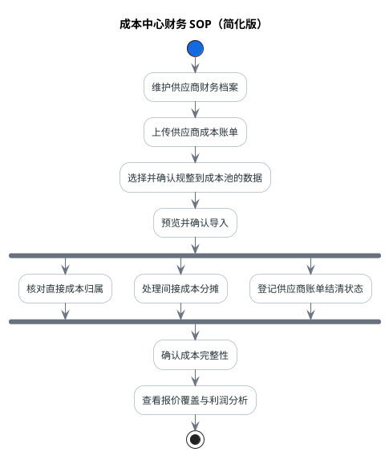
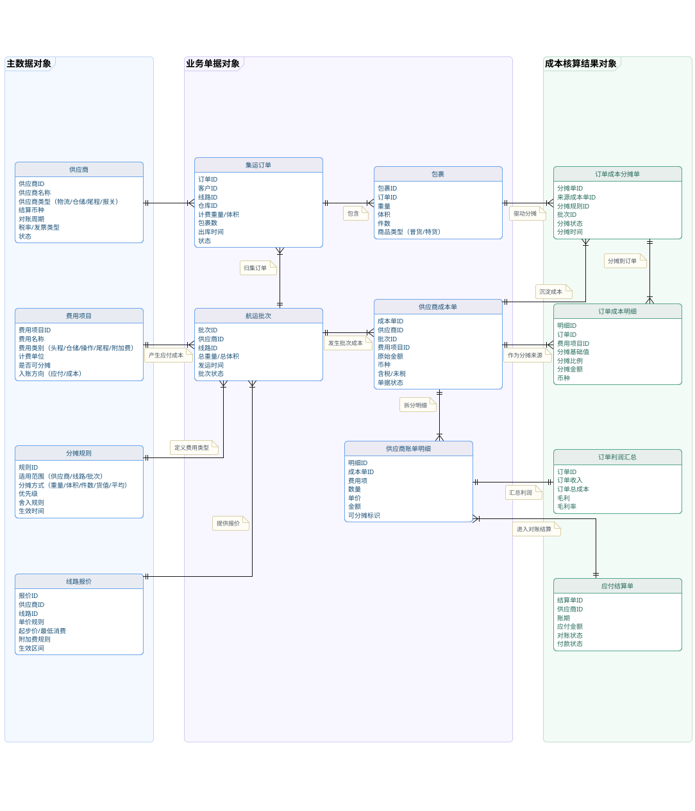
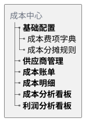
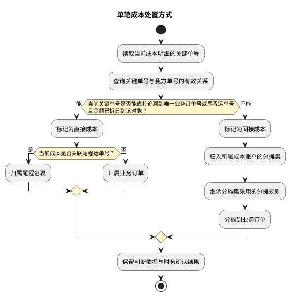
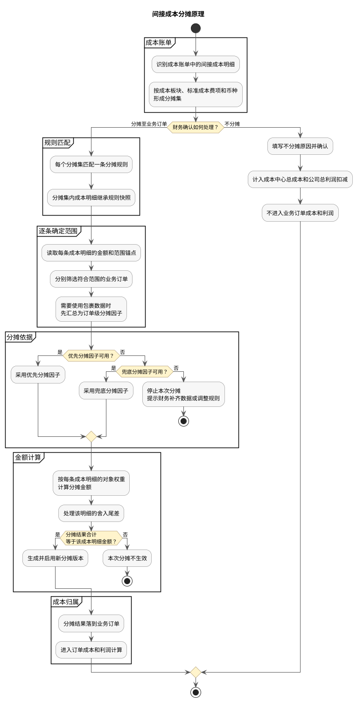
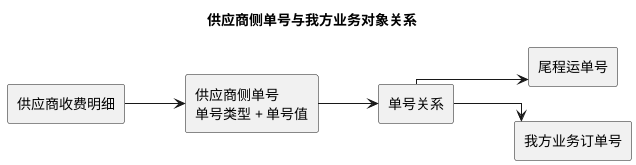

# 成本中心 PRD

本文定义 BMS 成本中心的业务范围、供应商账单导入、成本标准化、成本归属、间接成本分摊、结清调账及利润分析要求。财务系统共享的金额汇兑、调账、非功能和审计规则，分别见[《账单系统 PRD》金额汇兑](账单系统/PRD.账单系统.第15篇.DOC-27b80ef314.md#doc-27b80ef314-currency-exchange-e7e21dd6)、[《账单系统 PRD》调账中心](账单系统/PRD.账单系统.第16篇.DOC-17f89514c9.md#doc-17f89514c9-adjustment-center-98536490)、[《账单系统 PRD》非功能需求](账单系统/PRD.账单系统.第18篇.DOC-f88d5ab332.md#doc-f88d5ab332-nonfunctional-b6777ef6)和[《账单系统 PRD》内部审计](账单系统/PRD.账单系统.第19篇.DOC-38b07ac864.md#doc-38b07ac864-internal-audit-b4731bb9)。
## 1. 项目背景与核心痛点

### 1.1 项目背景

BMS 已经具备客户侧应收账单和返款账单管理能力，但供应商侧成本仍来源于格式不一、语言不一、计价口径不一的账单文件。财务需要先理解原始文件，再手工整理费项、单号和金额；业务侧则难以持续回答一笔成本来自哪张供应商账单、归属于哪个订单，以及最终如何影响利润。

成本中心用于承接供应商账单核对和内部成本管理：既保留供应商原始账单事实，又把可用数据规整为统一成本明细，最终建立“供应商收费—成本明细—业务对象—订单利润”的可追溯关系。

### 1.2 核心痛点

| 核心痛点 | 现状影响 | 本项目的解决方向 |
| :--- | :--- | :--- |
| 供应商账单格式不统一 | 固定模板难以覆盖不同供应商、成本板块和语言，财务整理工作量大且容易误填。 | 通过导入向导识别 Excel 数据区，由财务确认需要规整到成本池的数据，并保存供应商最近一次导入设置。 |
| 供应商费项名称不统一 | 同一成本在不同供应商账单中名称不同，无法直接汇总、比较或分析。 | 建立与客户侧费项分离的标准成本费项索引，把供应商原始费项映射为内部标准名称。 |
| 外部单号与内部业务对象关系不清 | 财务难以判断成本应直接归属，还是需要分摊；成本来源和去向难以追溯。 | 以关键单号追溯结果判定直接成本和间接成本，并保留原始单号及识别过程。 |
| 间接成本缺少统一分摊口径 | 同类费用可能依赖人工经验处理，容易重复分摊、漏分摊或结果不可复核。 | 以分摊集承接同口径间接成本，按基础规则或供应商特调规则分摊到业务订单。 |
| 账单结清与成本归属容易混淆 | 已结清不代表成本已归属，成本已归属也不代表供应商账单已结清。 | 分别管理成本账单结清状态和成本明细归属状态，差错统一进入调账中心。 |
| 成本数据未形成利润闭环 | 财务难以及时识别未覆盖报价、晚到成本及利润异常。 | 汇总业务订单收入与直接成本、分摊成本，形成报价覆盖和实际利润分析。 |

### 1.3 建设目标、核心对象与边界

成本中心依次回答四个问题：供应商收取了哪些费用、费用来源是否可信、费用应归属到哪些业务对象、归属后的成本对报价覆盖和利润产生什么影响。

本项目涉及的核心对象及其关系如下：

| 核心对象 | 业务含义 | 与其它对象的关系 |
| :--- | :--- | :--- |
| 成本账单 | 即供应商账单，是供应商某一账期收费结果在 BMS 中的登记和核对记录。 | 一次成功导入形成一张成本账单，并产生逐行成本明细。 |
| 成本费项索引 | BMS 按成本板块维护、供内部统一使用的标准成本费项。 | 供应商原始费项名称先映射到成本费项索引，再形成成本明细；不与客户侧费项索引混用。 |
| 成本明细 | 从供应商账单原始行生成或由财务直接补录的单项成本记录。 | 全部进入 `BMS费项池`，并保留原始金额、币种、来源和业务识别信息。 |
| 成本池 | `BMS费项池`中承接应付类成本明细的业务集合。 | 负责成本识别、归属、分摊和后续分析，不等同于成本账单。 |
| 直接成本 | 当前成本明细的`关键单号`能够直接追溯到唯一`业务订单号`或`尾程运单号`，且该笔金额已经拆分到该对象的成本。 | 直接落到相应业务订单或尾程包裹。 |
| 间接成本 | 无法直接归属到单个业务对象，需要先圈定业务范围再分摊的成本。 | 在所属成本账单内形成间接成本分摊集，继承分摊集规则后分摊到业务订单；不分摊到尾程包裹。 |

成本处理主线依次为“供应商资料 → 成本费项标准化 → 供应商账单导入 → 成本明细入池 → 直接归属或间接成本处理 → 成本完整性确认 → 报价覆盖和利润分析”。成本账单导入成功后即可登记结清，结清与成本归属并行推进；结清或成本事实发生差错时再进入调账。后续各节按这一主线和并行关系展开。

成本中心中凡需同时选择开始日和结束日的录入或筛选字段，统一使用日期范围控件一次确认起止日期，不拆分为两个相互独立的单日控件；只表达一个业务日期的字段继续使用单日控件。

成本中心遵循以下边界：

1. 成本账单和成本池均面向内部供应商收费核对，不面向客户，也不进入客户对账报表。
2. 成本处理可以引用应收账单、返款账单所涉及的业务订单和尾程包裹，但不得反向修改客户侧账单金额或对账结果。
3. BMS 记录供应商账单及其结清事实，不承接供应商付款申请、付款审批或实际付款执行。
4. BMS 不维护供应商价卡，不复算供应商计价结果，也不以系统推算金额替代财务对供应商原账单的核对。
5. 本期只预留`暂估成本`概念，不实现暂估成本的录入、计算、分摊、冲销或转实际。

## 2. 方案框架

### 2.1 总体框架

成本中心以供应商账单为入口，以成本池为统一承载，以业务订单利润为结果。整体方案分为三层：第一层规整供应商账单和成本费项，第二层完成成本归属、间接成本分摊和结清管理，第三层形成成本完整性、报价覆盖与利润分析。账单原始事实始终保留，标准化和归属结果可以追溯。

### 2.2 数据归集链路图

以下归集图呈现成本中心的完整数据链路。五大成本板块是供应商账单的导入场景，不是五套独立账单，也不直接决定成本类型。每条导入明细均进入成本池并保留原始字段快照和标准成本字段；其中，只有当前关键单号能够直接追溯到业务订单号或尾程运单号的成本明细才作为直接成本归属，间接成本经分摊后只归属业务订单。

```d2
vars: {
  d2-config: {
    layout-engine: elk
    theme-id: 104
  }
  d2-elk-config: {
    "elk.layered.spacing.nodeNodeBetweenLayers": 20
  }
}

classes: {
  container: {
    style.stroke: "#606162"
    style.stroke-width: 1
    style.border-radius: 8
    style.font-size: 20
    style.bold: true
  }
  card: {
    style.fill: "#FFFFFF"
    style.stroke: "#4B5563"
    style.stroke-width: 1
    style.border-radius: 6
    style.font-size: 16
  }
  arrow: {
    style.stroke: "#4B5563"
  }
}

supplier_bill: "供应商账单" {
  class: container
  style.fill: "#EAF4FF"
  label.near: border-top-left
  grid-columns: 5
  grid-gap: 40

  delivery: "派送成本" { class: card }
  clearance: "清关成本" { class: card }
  sea: "海运成本" { class: card }
  air: "空运成本" { class: card }
  truck: "租车成本" { class: card }
}

import_wizard: "导入向导" {
  class: container
  style.fill: "#ECF8F0"
  label.near: border-top-left
  grid-columns: 3
  grid-gap: 40

  upload: "上传成本账单" { class: card }
  organize: "选择要规整到成本明细的数据" { class: card }
  preview: "预览即将规整到成本明细的数据" { class: card }

  upload -> organize: {
    class: arrow
  }
  organize -> preview: {
    class: arrow
  }
}

cost_center: "成本中心" {
  class: container
  style.fill: "#F5ECFA"
  label.near: border-top-left
  direction: down

  cost_pool: "成本明细" {
    class: container
    direction: right
    label.near: border-top-left
    style.fill: transparent
    style.font-size: 19

    direct: "直接成本" {
      class: card
    }
    indirect: "间接成本" {
      class: card
      tooltip: 无法被直接归属的成本
    }
  }

  allocation: "分摊规则" { class: card }
  indirect_target: "业务订单" { class: card }

  cost_pool.direct -> indirect_target: {
    label: "直接归属"
    class: arrow
  }
  cost_pool.indirect -> allocation: {
    label: "进行分摊"
    class: arrow
  }
  allocation -> indirect_target: {
    label: "分摊归属"
    class: arrow
  }
}

supplier_bill -> import_wizard: {
  label: "账单准备导入到系统"
  class: arrow
}
import_wizard -> cost_center: {
  label: "金额数据规整到成本明细"
  class: arrow
}
```

`原始字段快照`用于还原供应商账单原貌和辅助核对，`标准成本字段`用于金额汇总、业务匹配、成本类型判断和分摊。尾程包裹只承接能够明确归属的直接成本；间接成本统一分摊到业务订单。具体分摊范围、分摊因子和计算方式见`7 间接成本分摊`。

### 2.3 财务 SOP 流程图（简化版）

财务主流程只保留日常操作必须经过的环节；字段识别、单号追溯、分摊计算和异常校验等细节由后续功能章节展开。



直接成本和间接成本可以并行核对；账单结清状态不替代成本归属、分摊或完整性确认。

### 2.4 概念实体关系图（简化版）

下图只保留理解方案所需的核心实体和关系，字段级技术定义以[《CERD》](./CERD.md)为准。



供应商账单与账单原始数据快照共同保留供应商侧事实；成本明细只保存已经规整到成本池的数据。直接成本明细可归属业务订单或尾程包裹，间接成本明细进入分摊集，并通过分摊结果归属业务订单。

## 3. 功能清单

成本中心每个菜单页均使用独立且稳定的Hash路径。供应商账单导入和成本账单详情虽然没有独立菜单，也分别拥有可直接访问的页面路径。

| 页面 | 稳定原型路径 |
| :--- | :--- |
| 成本总览 | [🔗原型链接](http://localhost:4181/#/cost/overview) |
| 供应商管理 | [🔗原型链接](http://localhost:4181/#/cost/suppliers) |
| 成本账单 | [🔗原型链接](http://localhost:4181/#/cost/bills) |
| 导入供应商账单 | [🔗原型链接](http://localhost:4181/#/cost/bills/import) |
| 成本账单详情 | `http://localhost:4181/#/cost/bills/{成本账单编号}` |
| 成本池 | [🔗原型链接](http://localhost:4181/#/cost/pool) |
| 分摊规则 | [🔗原型链接](http://localhost:4181/#/cost/rules) |
| 利润分析 | [🔗原型链接](http://localhost:4181/#/cost/profit) |
| 成本费项索引 | [🔗原型链接](http://localhost:4181/#/cost/fee-index) |



| 功能模块 | 核心能力 | 解决的关键痛点 | 对应章节 |
| :--- | :--- | :--- | :--- |
| 供应商管理 | 维护供应商、成本板块、板块账期、默认币种和状态。 | 同一供应商涉及多个成本板块且账期口径不同，导入前缺少稳定的财务基础资料。 | `4 供应商管理` |
| 成本费项标准化与供应商账单导入 | 维护标准成本费项；识别 Excel 数据区；选择、预览并导入成本数据；复用供应商导入设置。 | 供应商账单格式和费项命名不统一，固定模板难覆盖，人工整理成本高且易错。 | `5 成本费项标准化与供应商账单导入` |
| 成本池管理 | 管理成本明细、关键单号、成本类型、业务归属和直接补录。 | 外部单号与内部业务对象关系不清，直接成本和间接成本容易误判或无法追溯。 | `6 成本池管理` |
| 间接成本分摊 | 建立分摊集，匹配基础或供应商特调规则，并把间接成本分摊到业务订单。 | 间接成本缺少统一、可复核且防重复的分摊口径。 | `7 间接成本分摊` |
| 成本账单结清与调账 | 登记待结清、已结清状态，记录核销事实，并通过调账中心纠错。 | 供应商账单结清与成本归属混淆，结清后差错缺少规范处理路径。 | `8 成本账单结清与调账` |
| 成本完整性与跨期处理 | 识别未归属、未分摊、汇率待确认及晚到成本，管理跨期影响。 | 成本不完整或晚到会导致订单利润失真，且缺少显式风险提示。 | `9 成本完整性与跨期处理` |
| 利润与经营分析 | 汇总业务订单收入、直接成本和分摊成本，分析报价覆盖和利润。 | 成本数据未形成经营闭环，无法识别报价未覆盖或利润异常。 | `10 利润与经营分析` |

上述功能均纳入本期范围。`暂估成本`仅预留概念；供应商价卡、供应商费用复算、付款申请与审批、实际支付执行、成本账单导出及客户侧账单联动修改不纳入本期。

## 4. 供应商管理

本章解决的关键痛点是：同一供应商可能覆盖多个成本板块，且各板块账期和金额口径不同，导入前缺少稳定、可复用的财务基础资料。

主流程从供应商资料开始。供应商管理用于建立 BMS 成本核对所需的供应商财务档案，使财务在导入账单前，先确认供应商身份、所选成本板块的账期及默认金额口径。成本账期按`供应商 + 成本板块`配置，描述该供应商在对应成本板块下的账单通常覆盖的业务周期，不代表供应商信用账期，也不触发付款排程。

### 4.1 供应商财务档案

每个供应商财务档案至少包含以下字段：

| 信息分组 | 业务字段 | 规则 |
| --- | --- | --- |
| 基本信息 | `供应商编码*`、`供应商名称*`、`供应商状态*` | 供应商编码必须唯一；状态包括`启用`和`停用`。停用后不再允许新建导入任务或成本账单，已经存在的成本账单仍可继续完成成本归集和结清登记。 |
| 成本范围 | `适用成本板块*`、`默认币种*` | 成本板块可多选派送成本、清关成本、海运成本、空运成本和租车成本；默认币种用于供应商侧账单未提供币种字段时的导入默认值。 |
| 成本板块账期配置 | `成本板块*`、`成本账期类型*`、`账期参数`、`生效开始日*`、`生效结束日` | 每条配置只对应该供应商的一个适用成本板块；每个适用成本板块都必须独立维护账期配置。成本账期类型支持`周`、`半月`、`月`和`自然天`；只有`自然天`需要填写周期天数和首个账期开始日。原则上不允许配置为`不固定`。 |
| 辅助信息 | `备注` | 用于记录供应商对账口径、账期例外或其它需要财务关注的信息。 |

带`*`的字段为必填字段。以下账期类型规则分别适用于每一条成本板块账期配置：

1. `周`属于日历账期，必须对齐自然周边界，固定按周一至周日标记，不允许另行配置每周起始星期。
2. `半月`按每月 1 日至 15 日、16 日至月末标记。
3. `月`按自然月标记。
4. `自然天`按连续天数滚动，必须维护周期天数和首个账期开始日；财务选择该类型时，周期天数默认填入`7`，允许改为大于等于 1 的整数。页面、列表和账单统一按`N 自然天`显示，例如周期天数为 35 时显示`35 自然天`。
同一供应商的不同成本板块可以配置不同的账期类型、账期参数和生效周期，各板块账期之间不要求对齐。对同一`供应商 + 成本板块`，任一日期只能命中一套生效中的账期配置，其生效周期不得重叠；新增适用成本板块时，必须先完成该板块的账期配置，才能以该板块发起供应商账单导入。

即使供应商在某一成本板块下偶尔延迟出账、补账或给出的实际范围与常规周期不同，也仍应维护最接近该板块常规出账习惯的固定账期，不以`不固定`规避配置。成本板块账期配置只用于导入时推导、预填和校验账期范围，不直接替代供应商侧账单上的实际账期。

导入成本账单时，财务先选择供应商和成本板块。系统根据当前日期匹配该`供应商 + 成本板块`下生效的账期配置，并结合本次账单中可识别的日期信息，推导`实际成本账期`的开始日和结束日并默认填入日期范围控件。财务必须核对该范围，可以按供应商账单上的实际范围直接修改；最终以财务确认值作为成本账单的实际成本账期。实际值与推导值不一致时，系统保留推导值、财务确认值和差异说明，调整只影响当前导入，不回写成本板块账期配置。

### 4.2 供应商列表与金额统计

供应商列表至少展示以下信息：

| 信息类型 | 业务字段 |
| --- | --- |
| 供应商识别 | `供应商编码`、`供应商名称`、`供应商状态`、`适用成本板块` |
| 账期标记 | `板块账期配置`、`默认币种` |
| 账单统计 | `成本账单数`、`待结清账单数`、`已结清账单数`、`待结清金额`、`已结清金额`、`累计成本金额` |
| 最近动态 | `最近账期`、`最近账单编号`、`最近账单状态`、`最近更新时间` |

金额统计遵循以下口径：

1. 统计范围跟随页面选择的成本账期范围；未选择范围时展示该供应商全部历史数据。
2. 所有金额按币种分别统计和展示，同一统计字段存在多个币种时按币种分行呈现，不同币种不得直接相加为单一总额。
3. `待结清金额`汇总待结清成本账单尚未完成结清登记的金额。
4. `已结清金额`汇总已完成结清登记的金额，包括待结清账单中的部分结清金额和已结清账单的全部结清金额。
5. `累计成本金额`汇总该供应商全部成本账单的账单金额，不区分是否已经结清；不得与`已结清金额`混用。
6. 成本账单状态或结清金额发生变化后，系统按最新结果重新统计，待结清金额与已结清金额不得重复计算同一金额。
7. 金额统计以成本账单及其结清记录为数据来源；尚未归入成本账单的成本池明细不进入上述账单金额统计。

`板块账期配置`按成本板块分别展示`成本账期类型`和`当前成本账期`；同一供应商适用多个成本板块时，不得合并为一个供应商级账期值。各板块的`当前成本账期`根据当前日期和对应成本板块账期配置计算，不反向取最近一次成本账单的实际成本账期替代配置结果。

页面支持按供应商编码、供应商名称、供应商状态、成本板块、成本账期类型和成本账期范围组合筛选。成本账期类型和成本账期范围按所选成本板块对应的账期配置筛选；未选择成本板块时，只要任一板块账期配置命中即展示该供应商。财务可新增、编辑、启用、停用和查看供应商财务档案；已被导入任务、成本明细或成本账单引用的供应商不得删除。

### 4.3 与账单导入及成本账单的关系

1. 供应商侧账单导入第一步只展示启用中的供应商。选择供应商后带出其适用成本板块和默认币种；选择成本板块后，再带出该板块的成本账期类型和当前成本账期。
2. 所选成本板块在当前日期没有生效中的账期配置时，系统不得进入后续导入步骤，并提示财务先补充或调整该板块的账期配置。
3. 一次成功导入对应一份供应商独立账单文件，并形成一张成本账单；该文件必须只对应一个供应商、一个成本板块和一个实际成本账期。对应成本板块的账期配置只提供预填和差异校验，不改变本次导入确认的实际账期。
4. 供应商财务档案或成本板块账期配置变更，只影响后续新建的导入任务和成本账单，不回写历史导入任务、历史成本明细或历史成本账单。
5. 从供应商列表进入详情时，可按成本板块查看该供应商各币种金额统计、当前成本账期、最近成本账单及其实际成本账期，并跳转到带入供应商和成本板块筛选条件的成本账单列表。

## 5. 成本费项标准化与供应商账单导入

本章解决的关键痛点是：供应商账单格式和费项名称不统一，固定模板难以覆盖，财务手工整理工作量大且容易造成金额、单号和费项失真。

### 5.1 背景与总体方案

供应商资料确认后，财务从成本账单列表发起供应商账单导入，并进入成本账单下的二级页面完成导入向导；该页面不设置独立菜单入口，财务可从顶部导航返回成本账单列表。供应商给出的账单没有统一格式；不同供应商、同一供应商的不同业务板块，甚至同一文件的不同 sheet，都可能使用不同的表头、金额列、单号列、汇总方式和辅助说明。部分业务辅助识别字段本身也没有稳定定义，要求财务先理解并重制为统一模板，会产生大量重复整理工作，也容易因复制、拆行、改名或漏列造成金额和单号失真。

现有供应商侧账单的文件结构、工作表用途、关键单号、金额字段及直接成本与间接成本特征，详见[《供应商侧账单样本分析》](../derivant/供应商侧账单样本分析.md)。该文档作为本方案的样本分析依据，不替代本章规定的产品需求。

因此，成本费项导入不以“财务先把原文件改成统一模板”为前提。产品应把标准化动作放在导入向导和系统入池过程中：财务保留供应商原始文件，只明确系统形成成本明细所必需的字段；系统负责保存映射结果、生成标准成本明细，并保留其余原始信息以供追溯。

### 5.2 导入边界与标准化基础

本节先明确原始文件进入 BMS 的总体边界，再定义客户侧与成本侧费项分域，以及供应商原始名称向标准成本费项的映射方式。完成这些前置约束后，后续字段配对和导入向导才能形成稳定、可追溯的成本明细。

#### 5.2.1 总体导入原则

1. 财务直接上传供应商原始文件，不要求删除列、调整列顺序、修改表头或另行制作统一模板。
2. 五大成本板块只作为导入场景预设，用于提供更贴近原文件的字段识别建议，不代表财务必须先套用五套模板。
3. 财务在导入向导中必须明确`成本金额`字段，并明确`关键单号`字段及其类型；原文件确实没有可用关键单号时，必须显式选择`无关键单号`，成本类型固定判定为`间接成本`。系统不能仅凭列名猜测后直接入池。
4. 财务只需确认影响金额归集和业务匹配的必要信息。供应商原文件中的收件信息、车种、柜型、目的港、备注等不稳定字段，不要求财务逐项整理为 BMS 固定列。
5. 标准化后的成本明细和供应商原始行必须保持可追溯关系；一个原始行可以展开为多条成本明细，但每条明细都必须能回到原始文件中的对应数据和来源金额列。
6. 原始文件、字段映射和入池结果共同构成成本来源依据。成本账单已结清后，不得通过重新上传或修改映射静默覆盖原有结果。
7. 一次导入只处理一份供应商独立账单文件，并且只对应一个供应商和一个实际成本账期；一次完全成功的导入形成一张成本账单。一个导入文件不得包含多个供应商。若收到的文件混合了多个供应商，财务必须先按供应商拆分为相互独立的文件，再分别选择对应供应商发起多次导入；系统不在导入向导内拆分供应商数据，也不允许通过选择不同数据范围把同一混合文件分批导入。
8. 供应商账单导入采用整批原子处理。财务确认的数据范围必须全部成功写入，任务才算`导入成功`；任一应导入数据写入失败时，整批任务为`导入失败`，不得保留部分成本明细或形成部分金额的成本账单。
9. 系统应识别疑似重复上传，但允许财务确认后再次导入。重复导入形成新的导入任务和成本账单，并通过成本账单编号后缀保持唯一；系统不得因编号不同而取消重复风险提示。

#### 5.2.2 客户侧与成本侧费项索引分域

BMS 将费项索引划分为`客户侧费项索引`和`成本费项索引`两个相互独立的业务域。两者在命名来源、适用账单和唯一性口径上均不同，不得仅通过同一张费项列表中的费用类型筛选来混合维护。成本费项索引以五大成本板块标签卡作为标准成本费项的一级浏览入口；切换板块后，关键词和状态条件只筛选当前板块内的费项，不再重复提供成本板块下拉筛选。

| 对比项 | 客户侧费项索引 | 成本费项索引 |
| :--- | :--- | :--- |
| 名称来源 | 由我司统一定义，不使用供应商原始名称。 | 由我司按供应商收费含义归一形成内部标准名称，供应商原始名称通过导入设置快照中的费项映射接入。 |
| 适用账单 | 应收账单、返款账单。 | 仅成本账单。 |
| 费项类型 | 可使用`应收类`、`应收扣减类`、`代收类`、`代付类`和`非费项`。 | 固定为`应付类`。 |
| 业务分组 | 按业务场景、挂靠对象和订单来源配置。 | 必须归属且只归属一个成本板块。 |
| 同名规则 | 由我司按客户侧业务含义控制名称和编码唯一性。 | 不同成本板块允许同名，同一成本板块内不允许存在两个启用中的同名费项。 |
| 维护入口 | [《账单系统 PRD》客户侧费项与数据源配置](账单系统/PRD.账单系统.第09篇.DOC-c986f40642.md#doc-c986f40642-fee-source-0283d06f)。 | 成本中心的成本费项索引维护入口。 |

成本费项索引遵循以下规则：

1. 每个成本费项索引必须归属于派送成本、清关成本、海运成本、空运成本或租车成本中的一个成本板块，不允许一个索引同时跨多个板块。
2. 不同成本板块可以存在相同的内部标准名称。例如空运成本和海运成本都可以维护名为“运费”的费项，但两者必须使用不同的费项编码，分别参与各自板块的导入、统计和分摊。
3. 成本费项编码在成本中心内全局唯一，建议包含成本板块特征；内部标准名称在同一成本板块内唯一。唯一性判断不跨成本板块比较名称。
4. 同一费用含义横跨多个成本板块时，应按成本板块分别建立成本费项索引，不得为了复用名称而让一条成本费项跨板块引用。
5. 供应商原始费项名称不得直接作为成本费项索引。财务应先确认其业务含义，再通过`5.2.3 导入设置快照中的费项映射`指向对应成本板块的成本费项索引。
6. 客户侧费项索引不得被成本账单、成本明细或导入设置快照中的费项映射引用；成本费项索引不得被应收账单、返款账单、客户级账单配置或客户侧场景取值规则引用。
7. `BMS费项池`中的每条费项只能引用一个索引域。进入应收账单或返款账单的费项引用客户侧费项索引；进入成本账单的费项引用成本费项索引，不得同时引用两类索引。
8. 已被成本明细、导入设置快照中的费项映射、间接成本分摊集或历史账单引用的成本费项索引不得物理删除，只允许停用。停用只影响后续导入、补录和分摊配置，不改写历史快照。

成本费项索引至少包含以下字段：

| 字段 | 规则 |
| :--- | :--- |
| 成本费项编码 | 必填，在成本中心内全局唯一；启用并被引用后不得修改。 |
| 内部标准名称 | 必填，同一成本板块内唯一；不同成本板块允许同名。 |
| 成本板块 | 必填且单选，枚举为派送成本、清关成本、海运成本、空运成本、租车成本。 |
| 业务定义 | 必填，说明该成本费项包含和不包含的供应商收费内容，作为导入设置快照中的费项映射和财务确认依据。 |
| 状态 | 必填，枚举为`启用`、`停用`。 |
| 备注 | 记录板块内的特殊核算口径。 |

分摊因子不直接维护在成本费项索引上。可能作为间接成本的标准成本费项，应按`7.3 分摊规则与因子选择`单独维护基础分摊规则或供应商特调分摊规则，使费项定义与具体分摊场景相互独立。

#### 5.2.3 导入设置快照中的费项映射

不同供应商可能使用不同名称表达同一项费用。例如同一清关税费，供应商 A 可能写作“税费”，供应商 B 写作“税金”，供应商 C 写作“关税”。若财务按供应商原始名称分别建立成本费项索引，会造成同一成本被拆成多个统计口径；若系统仅按名称相似度自动合并，又可能把含义不同的税种错误归为一项。

因此，成本中心采用“统一标准成本费项 + 导入设置快照中的费项映射”的方式管理：

1. `标准成本费项`是成本费项索引中的内部标准费项，`费项类型`固定为`应付类`，用于成本汇总、归属、分摊和利润分析。财务不得仅因供应商名称不同而在同一成本板块内重复建立成本费项索引。
2. `供应商原始费项名称`是供应商账单中实际出现的表头名称或行级费用名称，必须原样保留，不因映射而被覆盖。
3. `导入设置快照中的费项映射`用于把供应商原始费项名称指向同一成本板块下的标准成本费项。基础映射口径为`供应商 + 成本板块 + 供应商原始费项名称 → 成本费项索引`。
4. 当同一供应商在不同文件结构或工作表中使用相同名称表达不同含义时，映射口径应增加`文件结构特征`或`工作表`加以区分。系统不得以全局同义词规则覆盖供应商差异。
5. 多个供应商原始名称可以映射到同一个标准成本费项；同一个原始名称在不同供应商或不同成本板块下可以映射到不同标准成本费项。
6. 同一映射口径在任一时点只能存在一条启用中的映射。映射被历史导入引用后不得物理删除；修改或停用时生成新版本，只影响后续导入。
7. “税费”“税金”“关税”等名称相近的费项只有在财务确认业务含义一致时才能映射到同一标准成本费项。若供应商能够区分进口关税、增值税或其它税费，且这些费用需要分别核算，应建立不同的标准成本费项，不得为了减少费项数量强行合并。

导入设置快照中的费项映射由财务在导入向导中确认，并随当前供应商的导入设置快照保存；不设置独立的供应商费项映射维护入口。每条映射至少记录：

| 字段 | 规则 |
| :--- | :--- |
| 供应商 | 必填，限定该别名的供应商范围。 |
| 成本板块 | 必填，枚举为派送成本、清关成本、海运成本、空运成本和租车成本。 |
| 供应商原始费项名称 | 必填，保留供应商使用的原始文本；系统可以另存去除首尾空格、统一全半角和大小写后的匹配文本，但不得改写原文。 |
| 标准成本费项 | 必填，只能选择与当前成本板块一致且处于启用状态的成本费项索引。 |
| 文件结构特征 / 工作表 | 条件必填；同一供应商、同一成本板块下的同名费项存在不同含义时，用于缩小适用范围。 |
| 状态 | 必填，枚举为`启用`、`停用`。 |
| 生效信息 | 记录版本、生效时间、创建人、最近确认人和最近确认时间。 |
| 说明 | 首次映射、同名异义或映射调整时填写业务口径。 |

导入时按原始文件结构分别处理：

1. 费项名称位于金额列表头时，系统优先按当前供应商最近一次兼容的导入设置快照识别该金额列对应的标准成本费项，并同时保留原始列表头。
2. 费项名称位于数据行时，系统按供应商、成本板块和原始费项名称查找启用中的导入设置快照中的费项映射；存在文件结构或工作表限定时，必须同时满足限定条件。
3. 未命中已确认的供应商导入设置快照时，系统可以根据名称相似度推荐候选标准成本费项，但推荐结果不得直接入池，必须由财务确认。
4. 财务可以把本次确认结果保存为导入设置快照中的费项映射；本次最终确认的完整导入设置必须形成供应商导入设置快照，供该供应商后续导入预填，但仍须在预览中展示原始名称和映射结果。
5. 无法确认的原始费项不得被静默归入名称最接近的费项。财务必须选择映射到现有标准成本费项、新建标准成本费项、映射到启用中的`其他成本`并填写说明，或排除该字段 / 数据行；未完成处理时不得确认导入。
6. 每条入池成本明细必须同时保存供应商原始费项名称、标准成本费项、映射方式、映射版本、确认人和确认时间。历史成本明细始终使用导入时的映射快照，不随导入设置快照中的费项映射变更而改写。

五大成本板块作为导入场景预设，决定系统优先推荐哪些关键单号、成本金额和辅助识别字段，但不限定供应商文件的实际字段，也不直接决定费用属于直接成本还是间接成本。

| 导入场景 | 建议优先识别的关键单号 | 建议优先识别的成本金额 | 默认归集判断 |
| :--- | :--- | :--- | :--- |
| 派送成本 | 尾程运单号、追踪号、转单号、出货单号、明细表号、请款书号 | 派送费、超大或超才费、偏远费、跨区费、转发费、手续费 | 当前关键单号可直接追溯到唯一业务订单号或尾程运单号，且金额已拆到该对象时作为直接成本；否则作为间接成本。 |
| 清关成本 | 清关条码、主提单号、分提单号、报单号、税单号、柜号、规费或处罚编号 | 清关费、税金、报关费、仓租、规费、罚款、移仓费、退运费 | 当前关键单号可直接追溯到唯一业务订单号或尾程运单号，且金额已拆到该对象时作为直接成本；仅能定位分提单、税单、报单、主提单、柜号、批次或账期时仍作为间接成本。 |
| 海运成本 | 提单号、柜号、报关单号 | 海运费、拖柜费、报关费、续单费、操作费 | 当前关键单号可直接追溯到唯一业务订单号或尾程运单号，且金额已拆到该对象时作为直接成本；整票、整柜或集运线路级费用作为间接成本。 |
| 空运成本 | 提单号、磅单号、账单号 | 空运费、提单费、收送或打包费、中港段费、报关费、压夜或查验费 | 当前关键单号可直接追溯到唯一业务订单号或尾程运单号，且金额已拆到该对象时作为直接成本；提单、磅单、航班或批次级费用作为间接成本。 |
| 租车成本 | 车次号；原文件没有车次号时保留月份、发车地、车种和集运线路等辅助信息 | 车辆费用、搬运费用、月度或车次汇总金额 | 当前关键单号可直接追溯到唯一业务订单号或尾程运单号，且金额已拆到该对象时作为直接成本；仅能定位车次或业务范围时作为间接成本。 |

同一成本板块可以同时包含直接成本和间接成本。系统不得仅按导入场景、费项名称、其它原始单号、范围信息或财务人工标签确定`成本类型`。直接成本的必要条件是：当前成本明细采用的唯一关键单号能够直接追溯到唯一业务订单号或尾程运单号，且金额已经拆分到该对象；不满足任一条件时只能判为间接成本。

### 5.3 字段分层与入池粒度

导入数据按以下三层管理：

| 数据层级 | 内容 | 形成方式 | 主要用途 |
| :--- | :--- | :--- | :--- |
| 本次导入标准字段 | 供应商、供应商侧账单号、成本账期、成本板块、默认币种、原始文件 | 财务在上传时统一设置，或由系统从已确认配置中带出 | 确定账单归属和本次导入范围 |
| 财务标准化字段（行级） | 关键单号类型、关键单号、供应商原始费项名称、标准成本费项、费项映射版本、成本金额、币种、金额方向、费项类型、成本类型、成本归属方式、匹配状态 | 财务映射关键列，系统按映射结果逐行或逐金额列生成 | 参与 `BMS费项池` 匹配、汇总、分摊和结清，并保留供应商原始口径 |
| 非财务标准化字段 | 供应商原始行中除已映射字段外的所有列名和列值 | 系统按原始表头完整保留，不要求财务改名或补齐 | 用于人工识别、异常复核、来源追溯和后续字段升级 |

`费项类型`固定为`应付类`，用于表达该成本明细进入成本账单后的财务归集方向；`成本类型`枚举为`直接成本`、`间接成本`，用于表达当前关键单号能否直接追溯到唯一业务订单号或尾程运单号，且该笔金额是否已经拆分到该对象。二者是相互独立的业务字段，不存在命名或口径混淆，也不得互相替代。

`成本归属方式`枚举为`直接归属尾程包裹`、`直接归属业务订单`、`按间接成本分摊集待分摊`、`待人工确认`；`匹配状态`至少包括`待系统匹配`、`已匹配`、`无法匹配`、`待人工确认`。系统根据当前关键单号的追溯结果推导成本类型和归属方式，财务确认导入前必须核对该结果，但不得在缺少有效追溯关系时把成本明细确认为直接成本。

`关键单号`和`成本金额`是财务在行级需要重点明确的核心标准化内容，但不能只存储两个孤立值；原文件没有可用关键单号时，应记录财务确认的`无关键单号`结果：

1. 原文件存在`关键单号`时，必须同时记录`关键单号类型`，例如尾程运单号、主订单号、提单号、分提单号、柜号、报单号或税单号；相同字符在不同单号类型下不得直接视为同一业务对象。
2. 每份导入设置最多只能指定一个`关键单号`字段。同一行存在多个可用单号时，财务从中选择一个作为关键单号；其余单号不进入财务标准化字段，仅随该行其它未映射字段完整保存在原始字段快照中，用于查看和追溯。
3. 每个`成本金额`字段必须分别明确对应的标准成本费项、币种来源和金额方向。币种来源可以引用本次导入默认币种，也可以映射原文件中的币种列；金额方向按成本金额字段逐项确认，不设置整张二维表共用的全局值。
4. 同一原始行存在多个金额列时，财务可以一次选择多个成本金额列，并分别指定对应的标准成本费项；系统应自动展开为多条成本明细，不要求财务手工复制和拆行。
5. 原始文件只有汇总金额且没有可用关键单号时，允许关键单号为空，但成本类型必须为`间接成本`；成本归属方式可以先标记`待人工确认`。导入成功后，系统按`7.1 间接成本分摊集`形成分摊集并匹配规则，不得要求财务虚构订单号或包裹号。

`BMS费项池`采用`一行一项成本费项`的入池粒度，供应商原始文件无需预先满足该结构：

1. 原始行只对应一个费用金额时，系统生成一条标准成本明细。
2. 原始行同时包含多个具有不同费用含义的金额列时，财务应分别指定各金额列对应的标准成本费项，系统按金额列展开为多条标准成本明细；不得使用一个总金额替代可明确拆分的成本费项。
3. 展开后的多条明细必须关联同一原始行，并分别保留供应商侧账单号、成本账期、关键单号、来源金额列、原始币种和原始金额方向。
4. 合计列、小计列与其组成明细列不得同时作为成本金额导入；系统应在预览阶段识别并阻断重复计入。
5. 账单总表、付款进度表、报价说明、内部核对表等非明细数据原则上只作为核对资料；只有原文件不存在更细成本明细时，财务才可选择其作为间接成本来源，并明确归属范围或标记为`待人工确认`。
6. 原文件存在的关键单号不得因当前无法匹配而丢弃。尾程运单号、追踪号、转单号、袋号、清关条码、主提单号、分提单号、柜号、报单号、税单号及规费或处罚编号等，应作为标准关键单号或原始行数据保留。
7. 费用保留供应商原始币种和原始金额，不要求财务在导入前手工折算；账单汇兑按 BMS 的汇率规则处理。
8. 罚款、货故赔款、退运、移仓、账务调整等可能具有负向或冲减性质的费用，按供应商侧账单的原始金额方向导入，并保留费用原因或原始备注。
9. 进入 `BMS费项池` 的成本明细不得通过修改原始行或重新套用映射静默覆盖。修正已入池金额时，应按成本调整、冲正或后续账单差异承接规则处理。

<div id="cost-excel-data-region"></div>

### 5.4 Excel 数据区识别方法

供应商账单等业务 Excel 通常不是一张完全规整的数据表。一个工作表内一般同时存在用于逐行记录业务明细的`二维表`，以及分布在二维表上方、下方或侧边的`零散数值字段`；此外还可能存在标题、说明、图片、空白区和页脚。系统负责识别二维表范围，零散数值字段则由财务按单元格位置维护；系统不能把整个工作表直接视为一张二维表，也不得自动扫描并推荐零散数值字段。

<div id="cost-excel-data-region-1"></div>

#### 5.4.1 数据结构定义

| 结构 | 定义 | 常见特征 | 默认用途 |
| :--- | :--- | :--- | :--- |
| 二维表 | 由一行表头和若干数据行组成的连续矩形数据区；同一列在各数据行中表达相同业务含义。 | 字段按列稳定排列；相邻数据行结构重复；关键单号、费项金额或币种通常位于固定列。 | 逐行生成原始行及成本明细。 |
| 零散数值字段 | 位于二维表之外、由财务按单元格位置明确配置且不具备重复数据行结构的数值字段。 | 常见为应付合计、费用合计、税费合计、单独收取的附加费或其它独立金额；可能使用合并单元格、公式或突出样式。 | 系统不自动识别；完成财务配置、入池选择和标准化后才可作为成本来源。 |
| 非数据内容 | 不表达可归集业务数据的展示内容。 | 文件标题、公司名称、说明文字、图片、印章、页眉页脚和纯空白区域。 | 不参与字段映射和导入。 |

二维表中的小计行、合计行即使位于矩形范围内，也不属于普通明细行。系统应根据“合计”“小计”“总计”“应付”等语义、公式引用关系、行结构变化和样式变化将其识别为汇总候选，避免与组成该合计的明细金额同时导入。

<div id="cost-excel-data-region-2"></div>

#### 5.4.2 二维表识别

系统按工作表分别识别二维表，识别过程如下：

1. 读取工作表中的单元格值、公式结果、合并关系、行列位置和基础格式；格式只能作为辅助信号，不得仅凭边框或底色判断数据区。
2. 从非空单元格中查找连续矩形候选区。候选区应具有稳定列数、可识别的表头，以及至少两行结构相近的数据；只有一组名称和值时，不得将其自动纳入二维表范围，也不得据此自动生成零散数值字段配置。
3. 根据表头文本、列内数据类型、相邻行重复结构、关键单号特征和金额特征计算候选区可信度，优先选择能够形成业务明细的区域作为当前工作表主二维表。
4. `二维表起始行`为表头所在的 Excel 原始行号；`二维表结束行`为最后一条纳入识别的数据所在行号。标题、说明、空白行、页脚及已判定为汇总的尾部行不计入有效明细。
5. 系统应展示每个工作表识别出的起始行、结束行和已识别成本金额数量。财务可以逐工作表修正起止行；修正后重新读取表头和数据行，并刷新关键单号、成本金额、币种、费项映射和导入预览。
6. 起始行和结束行均须为大于 0 的整数，结束行不得早于起始行，也不得超过当前工作表实际最大行号。范围内没有有效数据行时，该工作表不能参与导入。

同一文件中的不同工作表必须独立识别和保存范围。一个工作表的范围修正不得影响其它工作表；供应商导入设置快照应保存各工作表最终确认的起止行，其中起始行可供下次兼容文件预填，结束行仅作识别参考。每次导入必须根据当前工作表的数据行重新识别结束行，再校验并确认完整范围。

<div id="cost-excel-data-region-3"></div>

#### 5.4.3 零散数值字段配置

零散数值字段完全由财务配置，系统不主动扫描工作表、不生成候选字段，也不根据字段名称、公式、样式或数值格式推荐用途。每项配置至少包括：所属工作表、字段名称、单元格列号、行定位方式、绝对行号或相对偏移量、是否入池、标准成本费项、币种和用途。

1. `单元格列号`采用 Excel 列标表达，例如`A`、`H`或`AA`。
2. `绝对行号`直接指向 Excel 原始行号，必须为大于 0 且不超过工作表实际最大行号的整数。
3. `相对二维表结束行`按`实际行号 = 成本费项明细二维表结束行 + 偏移量`解析。偏移量必须为整数；二维表结束行变化时，系统同步重算实际行号。
4. 解析后的单元格必须位于工作表有效范围内且处于成本费项明细二维表范围之外。位置无效、落入二维表范围或读取不到数值时，该配置不得选中入池。
5. 页面应同时展示财务填写的定位方式、解析后的实际单元格地址和当前读取值，便于财务核对。
6. 财务在第三步确认导入后，本次零散数值字段配置覆盖到该供应商的当前导入设置快照；下次引用快照时，系统按当前工作表结构重新解析并展示读取值，但仍须由财务确认。

每个已配置字段应在成本账单快照中保留字段名称、定位方式、列号、绝对行号或相对偏移量、解析后的单元格位置、原始字段值、公式结果、是否入池、标准化结果和最终用途。

<div id="cost-excel-data-region-4"></div>

#### 5.4.4 金额核对与防重复

1. 二维表中的明细金额是成本明细的优先来源；具有合计性质的零散数值字段默认只参与核对，不生成成本明细。
2. 财务将某个零散数值字段配置为核对用途时，系统应将其与二维表按相同币种、金额方向和费项口径汇总后的结果进行比较，并展示一致、存在差异或无法核对。
3. 同一笔金额不得同时通过二维表明细和零散数值字段导入。系统校验发现已配置零散数值字段可能汇总已选明细金额时，应阻断重复选择并提示对应关系。
4. 原文件不存在更细明细，或零散数值字段表达一项无法拆到业务对象的真实成本时，财务可以明确选择该字段作为成本金额来源，并映射标准成本费项和币种；该金额固定按间接成本处理，除非后续能够基于有效关键单号拆分并直接追溯到唯一业务对象。
5. 财务排除某个零散数值字段或将其仅用于核对时，系统仍须在原始账单快照中保留该字段，不得改写或删除原始文件内容。

<div id="cost-excel-data-region-5"></div>

#### 5.4.5 无法稳定识别时的处理

出现以下情况时，系统不得自动确认数据区，应标记为待财务处理：未识别到可信二维表、识别到多个相互重叠的二维表、起止行无法确定、表头跨多行且含义不明确、二维表中夹杂多个独立小表，或财务配置的零散合计值与明细汇总存在无法解释的差异。

财务可以修正二维表起止行、排除非明细行、重新指定成本金额或将零散数值字段设为核对字段。完成修正后，系统必须重新生成识别结果和金额预览；仍存在重复计入、数据范围无效或金额口径未确认时，不得提交导入。

### 5.5 三步式导入向导

供应商账单导入固定按`上传成本账单`、`选择要规整到成本池的数据`、`预览即将规整到成本池的数据`三步完成。导入二级页面按步骤呈现财务需要确认的内容，不得跳过财务确认直接入池。该页面归属于成本账单，不设置独立菜单入口；成本中心也不设置独立的导入记录入口或页面。导入成功后形成的账单及成本明细统一在成本账单和成本池中查看，导入失败原因在当次导入结果中反馈。

#### 5.5.1 第一步：上传成本账单

财务先确认成本账单的归属信息和初始结清状态，再上传所选供应商提供的原始 Excel 文件。本步骤只建立本次导入的账单口径并完成文件上传，不选择具体入池数据，也不写入`BMS费项池`。

| 配置项 | 规则 |
| :--- | :--- |
| 供应商 | 必选，只展示启用中的供应商；选择后带出适用成本板块和默认币种，并作为后续成本账单的结算主体。 |
| 成本板块 | 必选，只能从当前供应商的适用成本板块中选择，枚举为`派送成本`、`清关成本`、`海运成本`、`空运成本`、`租车成本`。选择后，系统带出该`供应商 + 成本板块`当前生效的成本账期配置，并确定可引用的最近一次供应商导入设置快照和字段推断范围。 |
| 原始文件 | 必传，只能包含当前所选供应商和成本板块的数据；系统完整留存财务本次上传的文件，不修改文件内容。 |
| 供应商侧账单号 | 原文件存在时必须填写或从文件中确认；原文件没有账单号时保持为空，由导入任务编号承担系统内部追溯，不得虚构供应商侧账单号。 |
| 实际成本账期 | 必填。系统根据当前所选`供应商 + 成本板块`下生效的账期配置和账单内可识别日期默认填充推导值；财务通过同一个日期范围控件核对并可改为账单实际值，结束日不得早于开始日。同一文件包含多个账期且不能通过字段明确区分时，财务应先按账期拆分文件，再分别导入。 |
| 导入时结清状态 | 必选，枚举为`待结清`、`已结清`，默认选择`待结清`。该值作为第三步最终确认结清信息的初始值；在导入成功前不得据此提前登记结清结果。 |
| 账期差异说明 | 实际成本账期与系统推导值不一致时必填，用于说明供应商账单口径、跨期费用或其它差异原因；采用系统推导值时无需填写。系统同时保留推导值、财务确认值和差异说明。 |
| 默认币种 | 必填，默认带出供应商财务档案中的默认币种，财务可以按当前账单修改。同一文件包含多币种时，应在第二步映射币种字段；无法按字段区分币种时，财务应先按币种拆分文件，再分别导入。 |

一次导入只能上传一份`.xls`或`.xlsx`文件。只有供应商、成本板块、实际成本账期、导入时结清状态、默认币种和原始文件均已确认，且应填的账期差异说明已经填写后，财务才能进入第二步。上传文件后系统只完成文件读取和结构解析，不得自动进入下一步；财务重新上传文件时，系统以新文件替换当前文件并清除当前导入中尚未确认的解析草稿，但不得改动已保存的供应商导入设置快照。

每份导入文件必须由一个供应商独立出具或由财务事先按供应商拆分，只能匹配第一步选择的供应商。若文件包含两个或以上供应商，财务必须退出当前导入，按供应商拆成相互独立的文件后分次上传；每个拆分文件分别选择对应供应商并形成独立导入任务和成本账单。系统不提供文件内供应商拆分，也不得只排除其他供应商的数据后继续导入该混合文件。同一供应商文件包含多个 sheet 时，可以在一次导入中选择多个结构一致且业务口径相同的 sheet；结构或口径不同的 sheet 应分别完成字段配对。

一次导入文件只能选择一个成本板块。供应商原始账单同时包含多个成本板块时，财务应先按板块拆分为多个文件，再分别导入；每个拆分文件形成独立成本账单，并保留相同的供应商侧账单号、原始账单总金额和拆分说明，便于财务核对拆分文件合计是否回到原始账单总额。

#### 5.5.2 第二步：选择要规整到成本池的数据

文件上传后，系统按 Excel 工作表解析候选数据区域，财务逐个工作表选择本次需要标准化并写入`BMS费项池`的数据。单一供应商给出的账单格式通常保持稳定，因此系统应优先复用该供应商最近一次确认的兼容导入设置，减少财务重复配对；首次导入或没有兼容快照时，系统默认从原始文件重新推断。即使已存在快照，财务发现供应商账单格式发生变化或认为预填结果不再适用时，也可以主动发起`重新自动识别`。无论采用快照复用还是自动识别结果，系统都不得替代财务完成入池选择。

1. `首次导入`：当前供应商没有可引用的导入设置快照时，系统根据原始表头、样例值、成本板块和已维护的导入设置快照中的费项映射，推断唯一关键单号、成本金额、标准成本费项、币种、成本类型及其它必要设置。
2. `后续导入`：系统按`供应商 + 成本板块 + 文件结构特征`查找最近一次确认的兼容快照，自动预填导入设置，并突出展示本次文件与快照在 sheet、表头、字段位置和字段类型上的差异。
3. `无法兼容`：未找到兼容快照，或关键字段发生新增、删除、改名、移位或类型变化时，系统对无法复用的部分重新推断，并要求财务补充确认；不得强行套用旧快照。
4. 财务可以新增、删除或修改所有预填与推断结果。引用当前快照只减少重复操作，不代表系统已完成本次导入确认。
5. `重新自动识别`：文件读取完成后始终允许财务主动触发。系统应先提示该操作将重新识别当前文件的二维表范围和系统推荐映射；财务确认后，系统不再沿用快照中的二维表识别结果，而是基于当前文件的 sheet、表头、样例值、成本板块和导入设置快照中的费项映射重新识别。重新识别只替换系统自动生成的候选结果，保留财务在本次导入中手工新增的关键单号行和成本费项行，避免人工录入丢失；若自动结果与手工新增行指向同一原始字段，财务必须处理冲突后才能进入第三步。该操作不得新增、修改或删除财务维护的零散数值字段配置，仅按最新二维表结束行重新解析相对定位并刷新指定单元格的读取值。

重新自动识别的结果只替换当前导入页面的设置草稿，不立即覆盖已保存的供应商导入设置快照。财务可以继续调整识别结果、返回上一步或取消导入；只有在第三步最终确认导入后，本次确认结果才覆盖原快照。财务未最终确认或取消导入时，原快照保持不变，仍供下一次导入使用。

第二步按工作表提供`成本费项二维表`和`零散数值字段`两个标签页，并在顶部统一提示：`请选中要规整到成本池的数据`；`未选中或无法标准化的数据不会被规整到成本池，仅在成本账单快照中保存`。

系统应区分明细、汇总、付款跟踪、报价说明和内部核对等工作表角色，默认优先识别明细工作表；识别方法见<a href="#cost-excel-data-region">5.4 Excel 数据区识别方法</a>。每个工作表分别展示二维表中的成本费项数量和零散数值字段数量，数量为`0`时仍须显示，便于财务判断该工作表是否包含拟入池数据。

每个参与导入的工作表必须独立显示系统识别出的`成本费项明细二维表起始行`和`成本费项明细二维表结束行`，并允许财务修正。起始行指当前二维表表头所在的原文件行号，结束行指最后一条纳入识别的数据所在的原文件行号；两者均采用 Excel 原始行号且必须为大于 0 的整数，结束行不得早于起始行。系统可以从兼容快照预填起始行，但每次导入都必须按当前文件重新识别结束行，不得直接沿用上次结束行，因为不同账期的数据行数量可能变化。切换工作表时，系统应保留各工作表各自的范围草稿；财务修改某个工作表的范围不得影响其它工作表。范围变更后，系统应按新范围重新读取表头、样例值和数据行，并刷新关键单号、成本费项、金额数量及后续导入预览。

1. `成本费项二维表`：承载连续明细区的起止行确认、唯一关键单号选择、成本金额字段选择、标准成本费项映射、币种与金额方向确认，以及直接成本或间接成本推导。完成标准化映射的已选金额字段才参与后续明细展开和入池。
2. `零散数值字段`：承载二维表之外、由财务明确指定的独立数值单元格。系统不自动扫描、识别或推荐零散数值字段；财务按工作表手动新增、编辑或删除配置，并填写字段名称、单元格列号、行定位方式、行号或偏移量、标准成本费项、币种和用途。系统只读取财务指定的单元格并校验结果。被选中字段只有在单元格位置有效且标准成本费项、金额和币种均可确定后才生成成本明细；核对字段、未选中字段和无法标准化字段不入池。
3. 系统应防止同一金额同时通过二维表明细和零散数值字段入池。零散数值字段疑似汇总已选二维表明细时，不得作为成本来源重复选中；原文件没有更细明细且该字段表达真实成本时，才允许财务选择并完成标准化。
4. 零散数值字段支持`绝对行号`和`相对二维表结束行`两种行定位方式。采用绝对行号时，财务直接填写 Excel 原始行号；采用相对定位时，实际行号按`当前工作表成本费项明细二维表结束行 + 偏移量`计算。偏移量为整数，可为正数或负数；计算结果必须大于 0、不得超过工作表实际最大行号，且不得落入成本费项明细二维表范围。二维表结束行被修正后，系统必须同步重算相对定位字段的实际单元格地址和读取值，绝对行号配置保持不变。
5. 切换标签页或工作表时，系统应分别保留当前导入任务中的选择与映射草稿。无论是否入池，两个标签页所覆盖的原始数据都必须随原文件保存在成本账单快照中。

两个标签页中的`标准成本费项`下拉框均须加载第一步所选成本板块下的完整`成本费项索引`，不得混入其它成本板块的费项。启用费项可以选择；停用费项保留展示并标记`已停用`，但不得用于新的映射。快照中的原映射已停用、已移除或不属于当前成本板块时，系统应标记该映射失效，并要求财务改选有效费项后方可入池。财务返回第一步切换成本板块时，系统应清除与新板块不兼容的标准成本费项映射，并按新板块重新识别。

系统至少推断以下内容：

1. 每个工作表中可参与导入的二维表起始行和结束行；复用快照时可以预填起始行，但必须按当前文件重新识别结束行，再校验范围是否存在且结构兼容。
2. 哪些原始字段可作为`关键单号`，并推断关键单号类型，例如尾程运单号、主订单号、提单号、分提单号、柜号、报单号或税单号。
3. 同一文件存在多个可用单号字段时，系统只推荐其中一个作为关键单号，财务可以改选其它候选字段，但不得同时选中两个或以上。未选中的单号字段不再映射为辅助关键单号，仅保存在原始字段快照中。
4. 哪些原始字段可作为`成本金额`，并识别金额格式、正负方向和空值情况。
5. 每个成本金额字段或行级原始费项名称对应的标准成本费项、币种来源和金额方向；三者按成本费项独立确认，不以工作表级设置覆盖。系统先应用本次引用的供应商导入设置快照中的费项映射；未命中时只推荐候选项，由财务确认。
6. 哪些字段是明细金额，哪些字段是总计、小计或计算结果；合计列不得与其组成明细列同时配对为成本金额。
7. 同一原始行存在多个金额字段时，系统应展示展开结果，说明该行将形成多少条标准成本明细。
8. 对每条展开后的成本明细，系统只使用本次选定的唯一关键单号查询有效单号关系。关键单号可直接追溯到唯一业务订单号或尾程运单号，且该笔金额已经拆分到该对象时，推导为`直接成本`并形成相应直接归属；无关键单号、无法追溯、只定位到其它业务范围，或同时覆盖多个对象但未给出对象级金额时，推导为`间接成本`。财务可以核对和修正追溯关系；只有满足直接成本前置条件后，才允许把结果调整为直接成本。

第二步的展示必须分为`关键单号识别`和`成本费项识别`两个区域。两个区域的标题旁均提供帮助入口，说明默认隐藏；财务点击帮助图标后，以气泡说明该区域哪些字段会进入财务标准字段、哪些原始信息只保留在成本账单快照，以及系统如何推导成本类型。

1. `关键单号识别`只展示一个最终采用的原始单号字段、关键单号类型、匹配预估和识别结果，并明确标记`最多 1 个`。存在多个候选单号时，仅在同一选择控件中供财务改选，不得按多行映射展示为多个已采用关键单号。只有该已选关键单号参与直接成本追溯判定；未选中的其它单号只保留在原始字段快照中，不得参与直接成本自动判定。
2. `成本费项识别`按原始成本金额字段逐项展示`原始成本费项 → 标准成本费项 → 成本类型推导`，并展示关键单号最终追溯到的业务订单号或尾程运单号；未形成直接追溯时，应明确展示未匹配、多目标、仅定位范围或金额未按对象拆分等原因，使关键单号与成本费项在视觉和业务含义上保持明确区分。
3. 成本类型必须落到展开后的成本明细，不得仅依据成本板块、标准成本费项名称或原始列名直接确定。同一金额字段的不同明细行可能分别被推导为直接成本和间接成本；页面可按字段汇总显示`混合`及两类数量，但`混合`不是成本类型枚举值，入池明细仍只能取`直接成本`或`间接成本`。
4. 财务可以在两个区域手工新增或逐行删除映射。`关键单号识别`最多保留一行：已有系统识别行或手工行时不得继续新增，财务可先删除当前行，再新增并填写原始单号字段和关键单号类型。`成本费项识别`允许新增多行，每行分别填写原始成本费项并选择当前成本板块下的标准成本费项，同时独立确认币种来源和金额方向。
5. 删除关键单号映射后，该工作表视为未选择关键单号，剩余成本费项不得自动判定为直接成本；删除成本费项映射后，该原始金额字段不进入成本池，但仍随原文件保存在成本账单快照中。删除只影响本次尚未确认的导入草稿，不得删除原始文件、已保存的供应商导入设置快照或历史成本明细。
6. 手工新增行与系统识别行遵循相同的标准化校验。原始字段、关键单号类型或标准成本费项未填写完整时，该行不得进入第三步预览和最终入池；财务可以重新执行自动识别以恢复被删除的系统候选行，手工新增行继续保留。

系统应展示每项推断的样例值和推断结果，不得只展示原始列名。对于唯一关键单号，还应展示预计匹配成功、无法匹配和存在多条候选对象的数量；对于成本金额，应展示有效金额、空值和格式异常数量；对于费项名称，应并列展示供应商原始费项名称、建议标准成本费项、成本类型推导依据和待财务确认数量。

原文件确实没有可用关键单号时，财务应显式选择`无关键单号`。系统必须把相关金额判定为`间接成本`，并在导入成功后纳入相应分摊集；无法确认标准成本费项或分摊规则时，分摊集保持`待人工确认`，不得为了完成导入而虚构订单号或包裹号。

本次导入设置按`供应商导入设置快照`保存并复用，遵守以下规则：

1. 快照至少按`供应商 + 成本板块 + 文件结构特征`区分。同一供应商存在不同成本板块或多种稳定文件结构时，可以分别保留一份当前快照。
2. 同一`供应商 + 成本板块 + 文件结构特征`下只保留一份快照。财务在第三步最终确认导入时，系统直接以本次确认结果覆盖原快照；不存在快照版本链，也不保留被覆盖的旧快照。
3. 文件结构特征至少包括参与导入的工作表、各工作表的二维表起始行、上次确认的结束行、表头字段集合、关键字段位置和数据范围识别规则，用于判断下次文件能否引用该快照。上次确认的结束行仅作识别参考，不得作为下一次导入的最终结束行。
4. 快照至少保存：参与导入的工作表及各自最终确认的二维表起止行、零散数值字段的字段名称、列号、行定位方式、绝对行号或相对偏移量、解析后的单元格地址、是否入池、标准成本费项、币种与最终用途、至多一个关键单号字段及其类型、成本金额字段及其标准成本费项、费项映射结果、币种来源、金额方向、多金额列展开方式、排除行规则和其它财务标准字段配对。其它原始单号不保存为字段配对，只随原始行进入原始字段快照。
5. 每份快照记录最近来源导入任务、最近识别方式、最近财务确认人和最近确认时间。最近识别方式包括`首次自动识别`、`快照复用`和`重新自动识别`；不提供旧快照查询、恢复或版本对比功能。
6. 快照被覆盖后，只影响下一次尚未确认的导入。已经确认或正在执行的导入任务继续使用财务在该任务确认时选定的导入设置，不得在执行过程中改读后来覆盖的新快照。
7. 快照只复用导入设置，不复用供应商侧账单号、成本账期、账单金额、原始行内容、结清状态或其它仅属于某一份账单的数据。
8. 后续导入引用快照后，财务仍须核对本次文件差异、字段配对和金额预览，并完成最终确认；系统不得因文件结构相同而自动入池。

#### 5.5.3 第三步：预览即将规整到成本池的数据

财务完成第二步的入池选择后，系统先生成导入预览，不立即写入`BMS费项池`。第三步沿用第二步的页面布局，继续按`Excel 工作表`展示`成本费项二维表`、`零散数值字段`两个标签页，但全部内容改为只读的实际采集结果：

1. 左侧工作表列表、标签页及其数量随当前预览结果联动；财务可以切换工作表和标签页核对数据。
2. `成本费项二维表`按最小粒度展示即将入池的成本明细，即一个原始行中的每个非零成本金额单元格分别形成一条预览记录。记录至少包含工作表行号、关键单号类型、关键单号、原始成本费项、标准成本费项、成本金额及币种、成本类型、归属结果和状态。
3. `零散数值字段`只展示第二步中已选中、位置有效且已完成标准化的字段，至少包含字段名称、实际读取单元格、实际采集值、标准成本费项、币种、成本类型和入池结果。
4. 第三步不得再提供二维表范围、字段映射、币种来源、金额方向或零散字段位置等编辑操作；需要调整时，财务返回第二步修改后重新生成预览。

在逐项核对实际采集结果的基础上，页面还应提供以下整体汇总与校验信息：

1. 原始数据行数、排除行数和拟生成标准成本明细数。
2. 原始金额合计，以及按币种、标准成本费项分别汇总的拟入池金额。
3. 一个原始行包含多个成本金额字段时的展开结果和展开后金额合计。
4. 有关键单号、无关键单号、空金额、金额格式异常和币种无法确定的行数。
5. 关键单号预计匹配成功、无法匹配、匹配到多个对象和待人工确认的行数。
6. 疑似重复导入的行数及判定依据。
7. 因合计列与明细列重复配对、同一金额字段重复配对或其它规则产生的阻断性异常。
8. 按直接成本、间接成本和待人工确认分别汇总的明细数量及各币种金额。
9. 按供应商原始费项名称和标准成本费项展示映射结果，并汇总未识别、存在多个候选项和待财务确认的费项数量。

财务在预览确认时必须复核第一步所选的成本账单`结清状态`，并可在提交导入前修改。选择`已结清`时，还必须填写结清日期、结清方式，并按币种确认结清金额及本次成本核销汇率；付款或抵扣凭证、备注按实际情况填写。各币种结清金额必须等于本次拟形成成本账单的对应币种金额，否则不得提交导入。选择`待结清`时，系统在导入成功后将各币种账单金额全部记为未结清金额，待后续结清登记时再确认成本核销汇率。

财务可以从预览结果返回第二步调整配对关系。存在阻断性异常时不得确认导入；只有财务确认预览结果后，系统才创建导入任务、创建或覆盖本次供应商导入设置快照，并异步写入标准成本明细和原始行数据。覆盖后的快照供相同适用口径下的下一次导入直接引用。

确认导入后，页面无需停留等待全部处理完成。导入任务状态包括`待执行`、`导入中`、`导入成功`、`导入失败`，不设置`部分成功`或`部分失败`。只有全部应导入数据均成功写入后，任务才进入`导入成功`，并创建成本账单、成本明细和原始行数据；任一应导入数据写入失败时，任务进入`导入失败`，本次业务数据整体回滚，仅保留导入任务、原始文件和失败原因供财务查看。无法匹配业务对象但已形成间接成本分摊集或保持`待人工确认`的数据，属于成功写入，不视为导入失败。

导入完成后，页面展示导入总数、排除数、疑似重复数、待人工确认数和已进入成本池数量；导入失败时展示失败阶段和失败原因。同一份预览结果只能成功创建一个导入任务，重复点击确认或同一任务的接口重试不得重复写入成本明细，也不得生成新的成本账单编号。

无法解析的数据必须在预览阶段修正或排除；确认导入后仍无法解析的应导入数据会导致整批导入失败。能够完整写入但暂时无法匹配业务对象或无法判断最终归属的数据必须进入异常清单，不得无提示丢弃；财务可以将其确认为间接成本或待人工确认成本，此类数据不影响整批导入成功。

### 5.6 校验与防错

1. 成本金额为空、无法转换为数值或币种无法确定的行不得入池。
2. 关键单号为空不等同于导入失败，但成本类型必须为`间接成本`；无法确定标准成本费项或分摊规则时，对应分摊集标记为`待人工确认`。
3. 导入前必须分别展示原始文件金额合计和拟入池金额合计。若一行多金额列被展开，拟入池合计应按所选金额列重新计算，不能直接与供应商总计列重复相加。
4. 系统应根据供应商、供应商侧账单号、账期、关键单号、标准成本费项、金额、币种及原始行特征识别疑似重复导入。疑似重复不自动删除，由财务确认继续、排除或撤销整批导入。
5. 导入任务在开始执行前可以取消；执行失败的导入任务不形成成本账单或成本明细，执行成功的导入结果不得整单撤回，只能按成本调整或冲正规则处理。
6. 系统自动识别出的关键单号、金额列和费项映射均属于建议值。未经财务确认，不得形成成本账单金额。
7. 财务必须确认导入文件只包含当前所选供应商的数据。系统发现文件内存在其他供应商标识，或财务确认文件混合多个供应商时，必须阻断确认导入并提示按供应商拆分文件；不得自动拆分、忽略其他供应商数据或生成跨供应商成本账单。
8. 同一导入设置不得同时映射两个或以上关键单号字段。财务选中新的关键单号字段时，系统应自动取消原选择；提交前仍检测到多个关键单号映射时，必须阻断导入。
9. 每条成本明细必须具有唯一成本类型结果；`混合`只允许作为字段级推导统计，不得写入成本明细或 `BMS费项池`。

### 5.7 数据存储与追溯

成本导入初版采用`MySQL 关系字段 + MySQL JSON 原始行数据 + 对象存储原始文件`的组合方式，不为非财务标准化字段单独引入 MongoDB。

1. `MySQL 关系字段`存储导入任务和成本明细标准字段。这些字段需要参与账单归集、金额汇总、业务匹配、分摊、结清和审计，必须具有明确字段含义和稳定数据类型。
2. `MySQL JSON 原始行数据`存储每条供应商原始行的全部列名和列值，包括未映射、暂时无法解释或不同供应商特有的业务辅助字段。原始行数据主要用于查看和追溯，不直接作为成本金额计算依据。
3. `对象存储原始文件`完整保存财务上传的供应商账单，记录文件与导入任务的关联。原始文件是最终来源凭证，原始行数据是便于页面查看和定位的结构化副本，二者都必须保留。
4. `供应商导入设置快照`保存至多一个原始关键单号列及其类型，以及原始成本金额列与币种、标准成本费项之间的当前映射关系，并记录最近财务确认人和最近确认时间；每次确认直接覆盖同一适用口径下的原快照。其它原始单号列不进入映射结果。
5. 每条标准成本明细必须能定位到导入任务和原始行；由一个原始行展开出的多条成本明细必须共享同一原始行关联，并分别记录来源金额列。
6. 若某个非财务标准化字段后续成为高频筛选、稳定匹配或成本分摊依据，应经产品口径确认后升级为标准字段；升级前的历史原始行数据仍须保留，不做破坏性迁移。

MongoDB 虽适合存储字段不固定的文档，但本场景中的非标准字段只是成本明细的附属追溯信息，不是独立业务对象。初版引入 MongoDB 会增加标准成本明细与原始行之间的跨库一致性、回滚、备份、权限和审计成本，收益不足。只有当非标准字段形成独立查询场景、需要高频跨供应商检索，且数据规模或访问方式已明显超出 MySQL JSON 的承载范围时，才重新评估 MongoDB；字段格式不统一本身不构成引入 MongoDB 的理由。

### 5.8 成本账单编号

供应商账单导入完全成功后，系统为本次导入形成的成本账单生成唯一编号：

| 账单类型 | 前缀 | 结算主体 | 账期起始日 | 后缀 | 示例 |
| :--- | :--- | :--- | :--- | :--- | :--- |
| 成本账单 | APB | 供应商编号 | yyyymmdd | 导入信息哈希前 6 位 | `APB-TMS001-20260101-A1B2C3` |

1. 编号格式为`APB-{供应商编号}-{账期起始日}-{导入信息哈希前6位}`；账期起始日采用`yyyymmdd`格式。
2. 导入信息哈希至少基于供应商编号、实际成本账期起止日、供应商侧账单号、成本板块、原始文件内容哈希和导入任务编号生成，后缀取前 6 位大写字符。
3. 财务确认重复风险后再次导入同一文件时，系统创建新的导入任务，并通过不同后缀生成新的成本账单编号；编号不同不代表系统已经排除重复风险。
4. 同一导入任务因接口或执行重试再次提交时，必须复用原导入任务编号和成本账单编号，不得生成新后缀或重复成本账单。
5. 疑似重复仍按`5.6 校验与防错`提示财务确认，编号后缀只用于唯一识别，不作为重复判定结果。

## 6. 成本池管理

本章解决的关键痛点是：成本明细进入 BMS 后，外部单号与内部业务对象关系不清，导致直接成本、间接成本和归属对象难以准确判定与追溯。

账单导入成功后，逐行成本明细进入成本池，并进入成本识别与归属环节。每条成本明细都必须确认`成本类型`和`成本归属方式`。直接成本采用唯一判定口径：当前成本明细的`关键单号`能够直接追溯到唯一`业务订单号`或`尾程运单号`，且该笔金额已经拆分到该对象。不依据成本板块、标准成本费项、金额大小、其它原始单号或人工标签判定；即使关键单号能够定位业务范围，一笔未拆金额同时覆盖多个业务对象时仍不属于直接成本。成本账单结清状态与该判断相互独立。

关键单号的追溯必须遵守[`11.1.1 单号追溯关系`](#cost-number-tracing)；本章只规定追溯结果如何影响成本类型、成本归属和后续处理。

本章中的`集运线路`指订单选择的跨境集运运输线路。一个集运线路通常包含揽收、干线、清关、派送等多个履约节点；由外部供应商完成的履约节点可能产生供应商成本。导入文件已提供集运线路、履约节点、供应商或费用类型时直接保留；未提供时，系统可依据已知单号、柜号、提单、仓库、目的地或财务确认结果补充映射，但不得在缺少依据时自动确定归属。

| 成本类型 | 定义 | 典型场景 | 核算落点 |
| :--- | :--- | :--- | :--- |
| 直接成本 | 当前成本明细的关键单号能够直接追溯到唯一业务订单号或尾程运单号，且金额已经拆分到该对象。 | 关键单号可追溯到尾程运单号的单票派送费、退件费，或可追溯到业务订单号的单票清关费、保险费。 | 追溯到尾程运单号时落到对应尾程包裹；追溯到业务订单号时落到对应业务订单。 |
| 间接成本 | 成本已经发生，但来源账单无法直接归属到单个尾程包裹或业务订单，需要先圈定适用业务范围再分摊的成本。 | 干线包板 / 包车 / 航空舱位成本、海外仓租金、仓库人工、批量清关服务费、燃油附加费、供应商最低消费差额、系统标签或耗材类批量费用。 | 在所属成本账单内形成分摊集，继承分摊集规则后分摊到业务订单。 |

直接成本和间接成本都必须保留成本来源、供应商、成本类型、标准成本费项、原始币种、原始金额、成本发生日期、账期、匹配对象和处理方式。同一成本明细在同一时点只能采用一种成本类型和一种归属方式，不得同时直接归属和参与间接成本分摊。

### 6.1 初始成本类型与归属判定

1. 系统在导入预览时，只使用当前成本明细采用的关键单号查询有效单号关系；其它原始单号不参与初始成本类型判定。
2. 当前关键单号能够直接追溯到唯一尾程运单号或我方业务订单号，且供应商已经按该对象列明金额时，判定为`直接成本`。
3. 无关键单号、无法追溯到业务订单号或尾程运单号、只能定位其它业务范围，或者一笔金额覆盖多个对象但没有对象级金额时，判定为`间接成本`。
4. 追溯到尾程运单号时直接归属对应尾程包裹；追溯到我方业务订单号时直接归属对应业务订单。
5. 多个供应商侧单号指向同一业务对象不构成冲突；同一供应商侧单号出现相互矛盾的有效关系时，初始成本类型按`间接成本`处理，同时把匹配状态标记为`待人工确认`，不得选择任一候选对象直接归属。
6. 系统推导结果须由财务确认。财务可以修正关键单号、单号关系或对象级金额拆分结果，但不能在未满足第 2 条时直接把成本明细改为直接成本；确认结果与系统推导不一致时必须填写原因。

### 6.2 单笔成本处置流程

`2.2 数据归集链路图`描述供应商账单从上传到成本归属的全链路；下图进一步说明单笔成本明细进入 `BMS费项池` 后，如何完成分类和归属。



### 6.3 成本归属层级

`成本账单`负责保留供应商收费和结清事实，`成本池`负责承接逐行成本明细，两者不互相替代。成本明细进入成本池后，按以下层级确定归属：

1. 当前关键单号可直接追溯到尾程运单号的直接成本归属对应尾程包裹，再汇总到所属业务订单。
2. 当前关键单号可直接追溯到业务订单号的直接成本直接归属对应业务订单。
3. 无法直接归属，或一笔未拆金额同时覆盖多个对象的间接成本，先按集运线路、履约节点、仓库、承运商、运抵国等范围圈定候选业务订单，再按`7 间接成本分摊`落到业务订单。
4. 包裹数据可以作为订单级分摊因子的计算依据，但间接成本不得落到尾程包裹；尾程包裹也不单独计算利润。

五大成本板块用于区分供应商账单的导入和统计场景，集运线路与履约节点用于定位成本发生范围，两组维度可以同时存在。具体值优先采用供应商账单明确给出的信息；缺失时只能依据已确认单号关系或财务确认结果补充，不得无依据推断。

### 6.4 直接成本归属规则

1. 若当前关键单号能通过有效单号关系直接追溯到唯一尾程运单号，且金额已经拆分到该对象，则该成本必须直接落到对应尾程包裹。
2. 若当前关键单号只能直接追溯到唯一业务订单号，无法确认具体尾程运单号，且金额已经拆分到该订单，则该成本可作为订单级直接成本落到业务订单；后续若补齐尾程运单号关系，应通过调整记录迁移到尾程包裹，不直接覆盖原记录。
3. 若一条供应商收费明细同时包含多个包裹，应先按供应商收费账单给出的单包裹金额拆分；若供应商未拆分，则按`7 间接成本分摊`处理。
4. 直接成本确认后应保留来源凭证、匹配字段、匹配时间和确认人，支持财务回溯“为什么这笔成本属于这个包裹或订单”。
5. 已形成成本账单的直接成本不得被来源数据后续变更静默覆盖；如需修正，应通过[《账单系统 PRD》调账中心](账单系统/PRD.账单系统.第16篇.DOC-17f89514c9.md#doc-17f89514c9-adjustment-center-98536490)形成成本调整记录。已结清成本账单不得返结清。

### 6.5 成本类型人工切换

财务可以在`直接成本`和`间接成本`之间切换成本类型，但系统必须重新按[`11.1.1 单号追溯关系`](#cost-number-tracing)校验，不允许只改标签而保留相互矛盾的归属结果。

1. `间接成本 → 直接成本`：必须先建立或确认当前关键单号可直接追溯到唯一尾程运单号或我方业务订单号的有效关系，并确认金额已拆分到该对象；未满足时不允许切换。成本明细已经参与间接成本分摊时，必须先使受影响的旧分摊版本失效、从原分摊集移除，再直接归属。
2. `直接成本 → 间接成本`：只有原单号关系已经失效、存在冲突，或者一笔金额实际覆盖多个对象但没有对象级金额时才允许切换。财务必须先解除当前直接归属，再由系统按成本账单、成本板块、标准成本费项和币种归入分摊集；不得在直接归属仍生效时参与分摊。
3. 成本明细已影响订单成本或利润时，切换提交后必须重算受影响订单的成本和利润，并把成本完整性退回`成本未齐`，直至财务重新确认。
4. 切换动作必须填写原因，并记录切换前后成本类型、归属对象、分摊集、影响范围、操作人和操作时间；审计要求见[《账单系统 PRD》内部审计](账单系统/PRD.账单系统.第19篇.DOC-38b07ac864.md#doc-38b07ac864-internal-audit-b4731bb9)。
5. 成本账单处于`待结清`或`已结清`均可发起类型切换，因为成本归属和账单结清相互独立；切换不得修改账单结清金额、结清状态或已锁定成本核销汇率。

### 6.6 成本池直接补录

除供应商侧账单导入外，财务可以在成本池中直接补录成本明细，用于处理供应商临时通知、账单漏项、人工补差、线下确认差额或原始文件暂未覆盖的费用。成本池直接补录不是绕过成本池，而是由财务在成本池内新增标准成本明细。

成本池直接补录必须遵守以下规则：

1. 必须填写供应商、成本账期、成本板块、标准成本费项名称、费用金额、币种和成本发生日期。
2. 按直接成本补录时，必须指定唯一关键单号，并建立该关键单号直接追溯到唯一尾程运单号或业务订单号的有效关系，同时确认补录金额已拆分到该对象；其它凭证只作为附件或核对依据，不能替代关键单号关系。
3. 只能确认集运线路、履约节点、提单、柜号、月份、车种、仓库、目的地或费用事件的，按间接成本补录，并填写候选业务订单范围和分摊规则建议。
4. 若该补录金额来自供应商侧账单的某一行或某一附件，应填写供应商侧账单号、供应商侧账单明细号或原始单据凭证。
5. 补录成本是否纳入当前成本账单，由财务明确选择。当前成本账单处于`待结清`时，可按供应商确认结果纳入并保留调整记录；成本账单处于`已结清`时，必须通过[《账单系统 PRD》调账中心](账单系统/PRD.账单系统.第16篇.DOC-17f89514c9.md#doc-17f89514c9-adjustment-center-98536490)形成成本金额冲正及新的成本调整记录，不得直接覆盖历史结果。

## 7. 间接成本分摊

本章解决的关键痛点是：无法直接归属的间接成本缺少统一、可复核且防重复的分摊口径，容易造成漏分摊、重复分摊或订单利润失真。

完成成本识别后，直接成本结束本阶段处理并落到业务对象；间接成本按费项口径形成`间接成本分摊集`，由财务在分摊集层统一确认处理方式。处理方式只包括`分摊至业务订单`和`不分摊`，不设置`暂不分摊`。

选择`分摊至业务订单`时，系统为分摊集匹配一条分摊规则，分摊结果只落到业务订单，不落到尾程包裹。选择`不分摊`时，该分摊集不匹配分摊规则、不生成订单分摊结果，但金额仍计入成本中心总成本，并在公司总利润中扣减；该金额不进入任何单笔业务订单的成本和利润。

分摊集既是同类间接成本的归集单位，也是处理方式和分摊规则的统一确认单位。选择分摊后，分摊集内的成本明细继承同一规则，但仍分别按自身金额和范围锚点生成候选业务订单及分摊结果，避免把不同提单、柜号、航班、车次、清关批次或作业事件的成本混在一起计算。



上图说明间接成本形成分摊集后的两种处理路径。分摊集只统一处理方式、规则口径和汇总展示，不改变成本明细作为金额与范围依据的事实；只有选择`分摊至业务订单`时才执行规则匹配和金额分摊，任一成本明细无法形成完整候选订单、分摊因子或金额守恒结果时，本次分摊不得生效。

### 7.1 间接成本分摊集

成本账单导入成功并完成成本类型识别后，系统在该成本账单内对`间接成本`明细自动形成分摊集。直接成本不进入分摊集，继续按成本明细归属尾程包裹或业务订单。

初始分摊集键固定为：

> `成本账单 + 成本板块 + 标准成本费项 + 币种`

一份成本账单只属于一个供应商，因此供应商通过成本账单自然确定，不需要重复成为同一账单内的分摊集键。币种必须进入分摊集键，不同币种不得进入同一分摊集，也不得在分摊前直接折算合并。每条间接成本明细在同一时点只能属于一个有效分摊集。

每个分摊集至少记录：

1. 分摊集编号、所属成本账单和供应商。
2. 成本板块、标准成本费项和币种。
3. 成本明细数量、分摊集原始金额、已分摊金额、待分摊金额和不分摊金额。
4. 间接成本处理方式；选择`不分摊`时，还应记录不分摊原因。
5. 选择`分摊至业务订单`时命中的分摊规则编号、规则类型、规则版本、规则命中方式和规则快照。
6. 当前有效分摊版本和分摊集状态。
7. 候选业务订单数量、成功分摊订单数量和异常明细数量。
8. 最近确认人、最近确认时间和最近分摊时间。

#### 7.1.1 分摊集与成本明细的关系

分摊集是成本账单内部的逻辑归类和分摊执行口径，不是独立成本容器，也不产生第二份成本数据。分摊集金额始终由其包含的成本明细实时汇总，成本金额、币种、范围锚点和原始凭证仍以成本明细为准。

分摊集统一确认处理方式。选择`不分摊`时，集内全部成本明细沿用该处理方式，不再执行以下分摊计算；选择`分摊至业务订单`时，分摊集统一指定分摊规则，但不把集内所有金额当成一笔无差别金额处理。执行分摊时，系统必须逐条读取成本明细：

1. 以该明细自身的金额作为待分摊金额。
2. 以该明细自身的提单、柜号、航班、车次、清关批次、仓储事件、派送批次、集运线路、账期或其它范围锚点筛选候选业务订单。
3. 使用分摊集继承的规则快照计算该明细对应业务订单的订单级分摊因子。
4. 对该明细独立计算尾差并校验金额守恒。
5. 将同一分摊集内各成本明细的分摊结果汇总为分摊集结果，供财务查看和下钻。

因此，同一分摊集内允许存在不同范围锚点值，例如同一海运费分摊集包含多个柜号；但每个柜号对应的成本明细只能分摊给该柜实际覆盖的业务订单，不得把所有柜号的金额合并后分摊给全部订单。分摊集只是减少重复指定规则的操作，不得扩大成本实际覆盖范围。

#### 7.1.2 分摊集与分摊规则的关系

`间接成本分摊集`回答“本账单中哪一组间接成本是否分摊、采用什么规则以及执行结果如何”，`分摊规则`回答“需要分摊的标准成本费项如何确定订单范围、分摊因子和例外处理”。费用的业务含义由标准成本费项的`业务定义`统一表达，分摊集和分摊规则不重复承载费用业务定义。两者关系如下：

| 对比维度 | 间接成本分摊集 | 分摊规则 |
| :--- | :--- | :--- |
| 对象性质 | 成本账单内的具体业务分组，包含实际成本明细和汇总金额。 | 可跨账单复用的配置模板，不承载具体成本金额和正式分摊结果。 |
| 规则关系 | 处理方式为`分摊至业务订单`时，一个分摊集在一个分摊版本中只能采用一个规则版本；`不分摊`时不绑定规则。 | 一个规则版本可以被零个或多个需要分摊的分摊集引用。 |
| 明细继承 | 分摊集内全部成本明细继承分摊集确认的处理方式；需要分摊时再统一继承规则，不需要逐条人工指定。 | 规则通过成本板块、标准成本费项、供应商及成本发生时间确定适用范围。 |
| 金额计算 | 保存并汇总实际成本明细、币种金额、候选订单和逐订单结果。 | 仅提供候选订单条件、优先与兜底因子、数据缺失及例外处理口径。 |
| 变更影响 | 本分摊集调整只生成本分摊集的新快照和分摊版本。 | 新增、修改、换版或停用只影响后续尚未确认规则的分摊集。 |

财务必须先确认分摊集处理方式。系统不得自动把分摊集设为`不分摊`；财务选择`不分摊`时必须填写原因，原因包括`公司整体管理费用`、`无合理分摊依据`、`金额较小，无需分摊`、`不纳入订单利润核算`和`其他`，选择`其他`时必须补充说明。确认后记录确认人和确认时间，不要求选择规则，也不生成分摊版本或订单分摊结果。

处理方式为`分摊至业务订单`时，系统固定按以下顺序匹配规则：

1. 根据成本账单供应商、成本板块、标准成本费项和成本发生时间匹配`供应商特调分摊规则`。
2. 未命中供应商特调规则时，再匹配`基础分摊规则`。
3. 唯一命中且规则可用时，把该规则绑定到分摊集，并由分摊集内全部成本明细继承。
4. 两个层级均未命中、命中规则未通过试算，或同一层级命中多条规则时，分摊集进入`待人工确认`。同一层级多命中属于配置冲突，系统不得自行选择，也不得从发生冲突的供应商特调层级自动降级到基础规则。
5. 财务可以为分摊集指定一条当前适用且可用的规则，也可以对本分摊集临时调整范围或因子；临时调整不得反向修改全局规则。

每个需要分摊的分摊集必须保存`规则编号`、`规则版本`、`规则类型`和`规则命中方式`。规则命中方式至少区分`系统唯一命中`、`财务指定规则`和`本分摊集临时调整`。同时固化成本板块、标准成本费项、适用供应商、范围锚点类型、候选订单条件、优先与兜底因子、数据缺失处理、例外处理、尾差处理、生效期间和试算状态等完整规则快照。

分摊执行必须读取分摊集保存的规则快照，不得重新读取规则页面上的最新内容。规则后续编辑、换版或停用不得改变既有分摊集已经确认的候选订单、分摊因子、分摊结果或订单利润。

#### 7.1.3 分摊集拆分与合并

系统形成初始分摊集后，出现以下任一情况时必须拆成不同分摊集：

1. 成本板块、标准成本费项或币种不同。
2. 同一标准成本费项下的部分明细需要`分摊至业务订单`，其它明细选择`不分摊`。
3. 同为`不分摊`的明细采用不同不分摊原因。
4. 同一标准成本费项下的部分明细需要采用不同分摊规则。
5. 部分明细无法由同一规则解释其候选订单范围或范围锚点类型。
6. 部分明细需要财务临时调整分摊因子，而其它明细继续采用原规则。
7. 部分明细处于待人工确认、分摊失败或其它状态，继续与正常明细合并会影响处理方式确认、规则确认或重算。

财务对分摊集内部分成本明细改用其它规则或临时口径时，系统应先展示受影响的成本明细、金额和原分摊结果，再自动拆出新分摊集；不得只在明细上保存一条与所属分摊集不一致的规则。拆分后，原分摊集和新分摊集分别形成规则快照和分摊版本。

只有所属成本账单、成本板块、标准成本费项、币种、处理方式和分摊集状态均一致时，才允许合并分摊集。需要分摊的分摊集还必须具有一致的规则版本和规则快照，且合并不得改变各成本明细候选订单范围；不分摊的分摊集还必须具有一致的不分摊原因。已经形成生效分摊结果的分摊集不得直接合并；需要合并时必须先生成新的重算版本并保留历史版本。系统不得跨成本账单、跨供应商或跨币种合并分摊集。

#### 7.1.4 分摊集状态、调整与权限

分摊集状态包括：

| 状态 | 业务含义 |
| :--- | :--- |
| `待人工确认` | 未唯一命中规则、规则不可用、部分明细范围不完整、因子不可用或责任范围不明确。 |
| `待分摊` | 分摊集规则已经确认，分摊集内全部明细均可形成候选业务订单和有效分摊因子。 |
| `已分摊` | 分摊集内全部成本明细均存在唯一生效分摊版本，金额守恒且结果已进入业务订单成本。 |
| `不分摊` | 财务已明确选择不分摊并填写原因；该分摊集不绑定规则、不生成订单分摊结果。 |
| `分摊失败` | 正式执行时发生数据变化、总因子为 0、金额不守恒或其它阻断问题，且当前没有可继续生效的旧版本；若重算失败但旧版本仍有效，分摊集保持`已分摊`并记录本次失败。 |

分摊规则状态与分摊集状态相互独立。规则处于`启用`只代表可供尚未确认规则的分摊集匹配，不代表分摊集已经完成分摊；规则停用也不使已经固化该规则快照的分摊集失效。

财务调整分摊集处理方式、规则、拆分或合并分摊集、调整候选订单范围、调整因子或发起重算时，必须填写原因。将`已分摊`改为`不分摊`时，系统应使原有效分摊版本失效，从受影响业务订单中移除对应成本并重算利润；将`不分摊`改为`分摊至业务订单`时，必须先确认规则，再按正常流程生成新分摊版本。变更前后处理方式、不分摊原因、金额及币种、规则快照、受影响订单、操作人和操作时间均写入[《账单系统 PRD》内部审计](账单系统/PRD.账单系统.第19篇.DOC-38b07ac864.md#doc-38b07ac864-internal-audit-b4731bb9)。成本账单结清状态与处理方式相互独立，不因处理方式变更而改变。

`分摊规则维护`与`分摊执行`必须是两项独立权限：分摊执行人员可以处理本次分摊集，但不能借此修改全局规则；规则维护人员不能仅凭规则启用操作直接改写已经分摊的成本。

### 7.2 分摊对象确定

仅当处理方式为`分摊至业务订单`时，分摊对象固定为`业务订单`，页面和规则中不提供`尾程包裹`选项。处理方式为`不分摊`时不产生分摊对象。可进入分摊范围的业务订单应同时满足：

1. 订单命中当前成本明细及分摊集规则快照限定的集运线路、运抵国、仓库、客户、承运商或业务板块范围。
2. 订单归属时间落入成本明细对应的费用期间，具体时间口径由分摊集采用的规则快照决定。
3. 订单未被排除在该成本明细的候选范围之外，例如取消单、测试单或异常作废单。
4. 订单具备当前分摊因子所需的订单级数据。分摊因子来自计费重、实重、包裹数、体积、申报价值、仓储天数或操作次数等包裹级数据时，系统必须先按订单汇总，再以订单汇总值参与分摊。
5. 同一个尾程包裹的基础数据只能汇总到其所属的一个业务订单，不得重复计入多个候选订单的分摊因子。

同一业务订单可以承接多个不同标准成本费项的间接成本，但在同一成本明细的候选订单清单内只能出现一次。对象范围由系统按规则和成本明细范围锚点生成后，财务可以排除不适用订单；人工加入不满足范围的订单时必须填写原因。尾程包裹可以作为订单级分摊因子的明细来源和成本下钻维度，但不生成包裹级间接成本分摊结果。

### 7.3 分摊规则与因子选择

大型快递、空运、海运和清关服务商通常按`每票 / 每件`、`计费重`、`提单 / 柜`、`申报行数 / 税费金额`、`占用量 × 天数`或`车次 / 等待时长`等实际成本动因收费。BMS 只借鉴这些计费维度来确定分摊范围和因子，不复制外部供应商的费率、阈值或计价公式；供应商账单能够明确给出收费单位时，应以账单口径为准。

#### 7.3.1 通用判定顺序

分摊规则应按`成本板块 + 标准成本费项`预先配置；供应商存在专用口径时，再配置对应供应商的特调规则。财务在分摊集层确认`分摊至业务订单`后，系统才按`7.1.2 分摊集与分摊规则的关系`匹配并固化实际采用的规则，避免财务逐条选择或临时改变口径。需要分摊的间接成本依次按以下顺序处理：

1. `拆分费用`：供应商账单把基础运费、燃油附加、文件费、仓租、罚款等分别列示时，必须分别形成成本明细，并按标准成本费项和币种形成分摊集；不得用合计金额套用一个因子。
2. `确定范围锚点`：先找到该费用实际覆盖的提单、柜号、航班、车次、报关批次、仓储事件、派送批次、集运线路或供应商账期，再从该范围内筛选业务订单；不得把一笔局部费用摊给账期内全部订单。
3. `限定候选订单`：只纳入实际使用该项服务、触发该项附加费或占用相关资源的业务订单。当前关键单号能够直接追溯到唯一业务订单号且金额已拆分到该订单的费用应改判为直接成本，不进入分摊集。
4. `匹配收费单位`：供应商按金额比例收费时，优先按对应基础费用金额分摊；按重量、体积、票件、申报行、天数、车次或距离收费时，优先采用同类业务数据作为分摊因子。
5. `汇总订单因子`：包裹级重量、体积、件数、仓储天数和操作次数必须先汇总到业务订单，再参与分摊；分摊结果只落业务订单。
6. `使用兜底因子`：优先因子不可用时，才可使用规则预设的兜底因子。优先因子和兜底因子总值均为 0 或数据不完整时，停止分摊并提示财务处理。
7. `控制例外费用`：罚款、赔付、改单、退运、销毁、空驶和等待等责任型费用，应优先限定到责任订单；无法确认责任范围时进入`待人工确认`，不得自动均摊给全部订单。

每条分摊规则至少应记录：规则类型、成本板块、标准成本费项、适用供应商、供应商收费单位、范围锚点类型、范围匹配字段、订单时间口径、候选订单条件、优先分摊因子、兜底分摊因子、例外处理规则、计费口径说明、生效期间和状态。规则类型为基础分摊规则时适用供应商为空；同一标准成本费项存在供应商特调分摊规则时，优先采用该供应商的特调规则。

费用的业务含义只在标准成本费项的`业务定义`中维护，分摊规则仅承接候选订单范围、分摊因子和例外处理。同一标准成本费项只允许存在一条同期生效的基础规则；每个供应商只允许存在一条同期生效的特调规则。若两笔费用的业务含义或分摊口径实质不同，应先拆成不同的标准成本费项，再分别配置规则，不得借助规则字段制造同名异义。财务调整范围锚点、候选订单、优先因子或兜底因子时必须填写原因，并按`7.5 分摊版本与重算`生成新版本。

#### 7.3.2 分摊规则设置方式

##### 7.3.2.1 配置入口与设置层级

成本中心设置独立的`分摊规则`页面，集中维护所有间接成本分摊规则。分摊规则仍必须关联一个标准成本费项，不能脱离标准成本费项单独存在，也不能跨成本板块引用。页面按规则适用范围分为两个页签：

1. `基础分摊规则`：不指定供应商，作为同一标准成本费项面向全部供应商的默认口径。
2. `供应商特调分摊规则`：必须指定一个供应商，用于覆盖该供应商在同一标准成本费项下的基础口径。

规则命中优先级固定为`供应商特调分摊规则 > 基础分摊规则`。系统先按供应商、标准成本费项和成本发生时间查找供应商特调分摊规则；未命中时再查找对应的基础分摊规则，不提供人工数值优先级。一次匹配在同一规则类型中只能命中一条规则；同一规则类型命中多条时视为配置冲突，不得自动选择或降级到另一类型。

##### 7.3.2.2 页面区域与业务字段

| 区域 | 业务字段 | 交互与约束 |
| :--- | :--- | :--- |
| 查询与列表 | 规则类型、规则编号、成本板块、标准成本费项、适用供应商<br>供应商收费单位、状态、试算状态、生效期间、规则版本<br>最近确认人、最近确认时间 | 页面以`基础分摊规则`和`供应商特调分摊规则`两个页签分开呈现；各页签支持组合查询、新增、复制、查看、编辑、启用和停用。供应商筛选只在供应商特调分摊规则页签出现。复制只复制规则内容，新规则以`草稿`和`未试算`保存，规则编号、版本和生效信息重新生成。 |
| 基本信息 | 规则类型*、成本板块*、标准成本费项*、适用供应商<br>供应商收费单位*、计费口径说明*、生效开始时间*、生效结束时间、状态* | 从哪个页签新增规则，即锁定为对应规则类型。成本板块由标准成本费项带出且不可修改；基础分摊规则的适用供应商必须为空，供应商特调分摊规则的适用供应商必填。生效结束时间为空表示持续有效。 |
| 分摊范围 | 范围锚点类型*、范围匹配字段*、订单时间口径*、候选订单条件<br>默认排除条件、责任订单限定方式、范围说明* | 范围锚点类型从当前成本板块允许的提单、柜号、航班、车次、报关批次、仓储事件、派送批次、线路或账期中选择。多个条件之间采用`且`；同一字段选择多个值时采用`或`。默认排除取消单、测试单、作废单及未实际使用该服务的订单。 |
| 分摊因子 | 优先分摊因子*、兜底分摊因子、因子聚合方式*、数据缺失处理*<br>金额比例基准、组合因子参数、舍入与尾差口径 | 因子只能从系统因子库选择，不允许录入脚本或任意公式。包裹级数据的聚合方式固定为按业务订单求和；组合因子仅支持系统预置的`数量 × 天数`、`重量 × 天数`、`体积 × 天数`、`重量 × 里程`和`体积 × 里程`。 |
| 例外处理 | 无匹配订单处理*、责任范围不明处理*、优先与兜底因子均不可用处理*<br>允许人工调整范围、允许人工调整因子、调整原因要求 | 默认处理均为停止自动分摊并转`待人工确认`。不得配置为自动平均分配；允许人工调整时必须填写原因并生成新的分摊版本。 |
| 试算预览 | 试算账期 / 成本明细、命中规则、候选订单数、排除订单数、因子缺失订单数<br>各币种待分摊金额、总因子值、逐订单试算结果、尾差、阻断原因 | 选择一笔待分摊成本或历史账期后执行试算。预览不写入订单成本、不生成有效分摊版本；支持下钻查看订单及其包裹级因子来源。 |

字段右侧带`*`表示数据库中必填。`状态`枚举为`草稿`、`启用`、`停用`；`试算状态`枚举为`未试算`、`试算通过`、`试算失败`；`规则类型`枚举为`基础分摊规则`、`供应商特调分摊规则`；`数据缺失处理`枚举为`使用兜底因子`、`停止并待人工确认`。规则启用后，数据缺失处理不得设置为跳过缺失订单后继续分摊，防止成本只落到数据较完整的部分订单。

##### 7.3.2.3 系统因子库

系统因子库提供以下业务因子，财务只能选择与当前标准成本费项的业务定义和收费单位相容的因子：

| 因子类别 | 可选因子 | 使用约束 |
| :--- | :--- | :--- |
| 金额 | 基础派送费、基础海运费、基础空运费、基础租车成本、实际税费、应税金额、申报价值、责任金额 | 作为比例基准的金额必须与当前费用属于同一供应商账单范围、同一范围锚点和同一币种；不同币种不得直接相加。 |
| 重量与体积 | 实重、计费重、空运计费重、毛重、体积重、计费吨、占用体积 | 采用供应商收费口径；包裹级数据先汇总到业务订单。 |
| 数量与操作 | 订单数、包裹数、票数、分提单数、分运单数、申报行数、操作次数、处理件数 | `订单数`只能用于规则明确允许的固定费用，不得作为系统通用兜底。 |
| 时间与距离 | 仓储天数、超期天数、等待时长、承运里程 | 必须取实际事件区间；无法取得实际值时不得自行补默认值。 |
| 组合因子 | 占用体积 × 天数、重量 × 天数、包裹数 × 天数、重量 × 里程、体积 × 里程 | 两个基础因子都完整时才可计算；任一因子缺失时按规则执行兜底或阻断。 |

系统因子库由产品预置，不允许财务新增计算脚本。后续新增因子必须明确数据来源、订单聚合方式、适用成本板块和缺失处理后再开放。

##### 7.3.2.4 创建、校验与生效

1. 财务先进入基础分摊规则或供应商特调分摊规则页签，再选择标准成本费项并新增规则，依次设置分摊范围、分摊因子、例外处理和生效期间。
2. 保存草稿时必须满足数据库必填字段，但可以暂不完成试算和冲突消解，且草稿不得被分摊集命中。启用前必须完成规则冲突和结构校验；存在可用样本时，还必须完成至少一次无阻断的试算。
3. 系统校验相同`标准成本费项 + 规则类型 + 适用供应商`下的启用规则生效期间不得重叠，生效结束时间不得早于生效开始时间。基础分摊规则与供应商特调分摊规则允许同期存在，并按供应商特调分摊规则优先。
4. 标准成本费项和供应商必须处于启用状态，供应商必须适用当前成本板块。范围锚点、范围匹配字段和因子必须属于当前板块允许值；例如空运费不能选择柜号作为范围锚点，纯文件费不得默认采用重量因子。
5. 优先分摊因子与兜底分摊因子不得相同。`数据缺失处理`选择`使用兜底因子`时，兜底分摊因子必填；未配置兜底因子时只能选择`停止并待人工确认`。
6. 启用前的试算必须展示候选订单、被排除订单、因子缺失订单、各币种金额守恒结果和尾差承接订单。存在样本但试算结果为范围为空、同层级多规则命中、总因子为 0、金额不守恒或责任范围未确认时不得启用。
7. 新标准成本费项确无历史或待分摊样本时，允许规则通过结构和冲突校验后以`启用 + 未试算`状态生效。该规则首次命中分摊集时，分摊集必须进入`待人工确认`，由财务完成首次实际预览和确认后才能转为`待分摊`；系统同步把规则试算状态更新为`试算通过`。首次实际预览失败时，规则试算状态更新为`试算失败`，分摊集保持`待人工确认`。
8. 规则启用后只供后续尚未确认规则的分摊集匹配；已经确认规则的分摊集继续使用固化的规则快照，不随模板变化。

##### 7.3.2.5 编辑、停用与运行时命中

1. `草稿`规则可以原记录编辑。已启用且尚未被分摊集引用的规则可以修改后重新试算；已被引用的规则不得原位改写，编辑时生成新版本并关联前序版本。
2. 新版本启用后，旧版本结束生效，但旧规则及其形成的分摊集快照、分摊版本和订单成本继续保留。新旧版本生效期间不得重叠。
3. 停用规则只阻止其被后续尚未确认规则的分摊集命中，不使既有分摊结果失效，也不触发历史订单利润重算。
4. 系统形成分摊集时，按`标准成本费项 + 供应商 + 成本发生时间`先匹配供应商特调分摊规则，未命中时再匹配基础分摊规则。唯一命中且规则已`试算通过`时，自动带出范围锚点、候选订单条件和因子；两个层级均未命中、同一层级命中多条或命中规则为`未试算 / 试算失败`时，分摊集进入`待人工确认`。
5. 财务可以在分摊集内调整本次范围或因子，但该调整只形成当前分摊集的新快照和分摊版本，不反向修改规则模板。若只调整部分成本明细，系统必须先按`7.1.3 分摊集拆分与合并`拆出新分摊集；若调整需要长期复用，财务应另行创建或更新分摊规则。
6. 规则新增、复制、编辑、启用、停用和版本切换均写入[《账单系统 PRD》内部审计](账单系统/PRD.账单系统.第19篇.DOC-38b07ac864.md#doc-38b07ac864-internal-audit-b4731bb9)；分摊规则维护权限与分摊执行权限相互独立。

#### 7.3.3 派送成本

| 适用标准成本费项（示例） | 成本明细范围锚点 | 候选业务订单 | 优先分摊因子 | 兜底分摊因子 | 关键约束 |
| :--- | :--- | :--- | :--- | :--- | :--- |
| 批量基础派送费 | 供应商 + 派送批次 / 路线 + 派送日期 | 实际进入该批次或路线的订单 | 订单计费重 | 订单包裹数、订单实重 | 有逐票金额时改为直接成本。 |
| 燃油附加费、旺季附加费 | 与附加费对应的供应商账单范围和基础派送费范围一致 | 实际产生基础派送费的订单 | 订单基础派送费金额 | 订单计费重 | 供应商按基础费用百分比收费时必须按基础派送费金额分摊，不得按订单平均分摊。 |
| 偏远、住宅、超大、超重、特殊处理 | 邮编 / 区域 + 派送批次，或供应商标识的异常件范围 | 满足该附加费条件的订单 | 触发附加费的包裹数汇总值 | 触发包裹计费重汇总值 | 当前关键单号能直接追溯到唯一业务订单号且金额已拆到该订单时改为直接成本；未触发条件的订单不得参与。 |
| 专车、车趟、拖柜派送 | 车次 / 车辆 + 路线 + 发车日期 | 该车次实际装载的订单 | 订单占用体积；供应商按重量收费时改用计费重 | 订单计费重、订单包裹数 | 不得扩大到同日但未装入该车次的订单。 |
| 续仓、滞留、重派、退件 | 仓储或派送异常事件 + 发生期间 | 发生续仓、滞留、重派或退件的订单 | 占用体积 × 实际天数，或供应商采用的计费重 × 天数 | 操作次数、包裹数 | 有明确责任订单时仅在责任订单内分摊。 |
| 批量贴单、拖袋、叠货、分拣 | 操作批次 / 袋号 / 车次 + 作业日期 | 实际参与该次操作的订单 | 订单操作次数 | 订单包裹数、订单计费重 | 单个订单的操作记录可以识别时改为直接成本。 |
| 最低消费差额、账期级补差 | 供应商 + 集运线路 + 账期 | 该账期实际使用该供应商及线路的订单 | 订单基础派送费金额 | 订单计费重 | 取消单、测试单和未产生派送服务的订单不得参与。 |
| 货故赔款、账务调整 | 货故 / 调整事件或供应商明确的受影响范围 | 可确认承担责任的订单 | 责任金额、申报价值或供应商核定金额 | 不设自动兜底 | 无法确认责任订单时必须人工处理。 |

#### 7.3.4 清关成本

| 适用标准成本费项（示例） | 成本明细范围锚点 | 候选业务订单 | 优先分摊因子 | 兜底分摊因子 | 关键约束 |
| :--- | :--- | :--- | :--- | :--- | :--- |
| 清关、传输、报单基础服务费 | 主提单 / 报关批次 / 清关批次 | 纳入该次申报或清关的订单 | 订单申报票数或分提单数 | 订单包裹数 | 供应商按每票固定收费时按票数，不得按申报价值分摊。 |
| 多品名、多申报行附加费 | 报关单 + 申报行范围 | 含对应申报行的订单 | 订单申报行数 | 订单申报票数 | 未超出免费行数或未产生附加处理的订单不得参与。 |
| 代垫税费手续费、资金服务费 | 税单 / 报关单 + 代垫记录 | 实际发生代垫税费的订单 | 订单实际税费金额 | 订单申报价值 | 税费本金能够逐单识别时作为直接成本；这里只分摊无法逐单拆出的服务费。 |
| 批量税费或规费 | 税单 / 报关单 / 主提单 | 该税单或报关单覆盖的订单 | 订单应税金额或实际税费金额 | 订单申报价值 | 不得将免税或未纳入该报关单的订单加入范围。 |
| 仓租、保税仓储、进仓仓租 | 仓库 + 入出仓事件 + 计费期间 | 实际占仓的订单 | 订单占用体积 × 仓储天数 | 订单计费重 × 仓储天数、订单包裹数 × 仓储天数 | 仓储天数必须按订单实际占用期间计算。 |
| 查验、拆装柜、开箱、重新包装 | 查验事件 / 柜号 / 报关单 | 实际被查验或处理的订单 | 订单被处理件数或操作次数 | 订单计费重、订单包裹数 | 已知被抽检订单时不得摊给同柜未被处理订单。 |
| 移仓、退运、销毁、改名 | 异常事件 + 提单 / 报关单 / 柜号 | 实际受事件影响的订单 | 订单计费重或占用体积 | 订单包裹数 | 能确认责任或受益订单时只在该范围内分摊。 |
| 罚款、预收罚款 | 处罚决定 / 案件号 / 报关单 | 财务确认的责任订单 | 责任比例或核定金额 | 不设自动兜底 | 无法确认责任订单时保持待人工确认，不得分摊给普通订单。 |

#### 7.3.5 海运成本

| 适用标准成本费项（示例） | 成本明细范围锚点 | 候选业务订单 | 优先分摊因子 | 兜底分摊因子 | 关键约束 |
| :--- | :--- | :--- | :--- | :--- | :--- |
| 拼箱海运费、燃油或旺季附加费 | 主提单 + 航次 + 起运港 / 目的港 | 实际装入该票拼箱货物的订单 | 订单计费吨 | 订单体积、订单毛重 | 计费吨按供应商账单确认的重量吨 / 体积吨换算规则计算，不在 BMS 固定换算常数。 |
| 整柜海运费、柜级附加费 | 柜号 + 航次 | 实际装入该柜的订单 | 订单占柜体积 | 订单毛重、订单计费重 | 同一分摊集可包含多个柜号明细，但每条明细必须按柜号分别确定订单范围，不得跨柜分摊。 |
| 提单费、文件费、续单费、电放费 | 主提单或文件处理事件 | 该提单下实际形成分提单或订单文件的订单 | 订单分提单数 | 订单数 | 供应商按每份文件收费时，以实际文件份数为准。 |
| 码头操作、装卸、堆场、吊柜 | 柜号 / 主提单 + 码头作业事件 | 使用该柜或参与该作业的订单 | 订单占柜体积 | 订单毛重 | 只覆盖部分柜或部分货物时必须缩小范围。 |
| 拖柜、港前 / 港后运输 | 柜号 + 拖车车次 + 路线 | 该柜内或该车次承载的订单 | 订单占柜体积 | 订单毛重、订单计费重 | 不得按整个账期订单分摊。 |
| 滞箱、滞港、堆存、压柜 | 柜号 + 超期日期范围 | 超期期间仍占用柜或堆场资源的订单 | 订单占柜体积 × 超期天数 | 订单毛重 × 超期天数 | 若超期由明确订单导致，应仅向责任订单分摊。 |
| 改单、甩柜、退关、查验等异常费 | 异常事件 + 提单 / 柜号 | 实际受影响或承担责任的订单 | 责任比例、订单占柜体积或计费吨 | 不设通用兜底 | 范围不清时必须人工确认，不得自动扩大。 |
| 最低消费或海运账期补差 | 供应商 + 航线 + 账期 | 账期内实际使用该供应商航线的订单 | 订单基础海运费金额 | 订单计费吨 | 已单独结算的异常费不得重复作为分摊基础。 |

#### 7.3.6 空运成本

| 适用标准成本费项（示例） | 成本明细范围锚点 | 候选业务订单 | 优先分摊因子 | 兜底分摊因子 | 关键约束 |
| :--- | :--- | :--- | :--- | :--- | :--- |
| 空运费、燃油、旺季、运力附加费 | 主运单 + 航班 / 磅单 + 起运日期 | 实际进入该主运单或航班的订单 | 订单空运计费重 | 订单实重、订单体积重 | 空运计费重按供应商采用的实重与体积重取高口径汇总到订单。 |
| 安保费、机场处理费 | 主运单 + 机场作业批次 | 参与该次机场处理的订单 | 订单空运计费重 | 订单件数 | 供应商按票固定收费时应改用订单运单数。 |
| 提单费、文件费、报关文件费 | 主运单 / 分运单 + 文件处理事件 | 实际形成对应文件的订单 | 订单分运单数 | 订单数 | 不得按重量分摊纯文件类固定费用，除非供应商账单明确按重量收费。 |
| 收送、打包、贴标、打板 | 作业批次 / 板号 / 磅单 | 实际参与该次操作的订单 | 订单操作次数或件数 | 订单空运计费重 | 有板位或占用体积记录时，可以配置为优先因子。 |
| 压夜、仓储 | 机场 / 仓库 + 入出仓事件 + 计费期间 | 实际压夜或占仓的订单 | 订单空运计费重 × 天数 | 订单占用体积 × 天数、订单件数 × 天数 | 不得把未压夜订单纳入范围。 |
| 查验、危险品、超规、特殊处理 | 查验 / 特殊处理事件 | 实际触发该项处理的订单 | 触发件数或操作次数 | 订单空运计费重 | 当前关键单号能直接追溯到唯一业务订单号且金额已拆到该订单时改为直接成本。 |
| 最低计费重、最低运费或账期补差 | 主运单 / 航班，或供应商 + 航线 + 账期 | 实际占用对应运力的订单 | 订单空运计费重 | 订单基础空运费金额 | 不得纳入未实际交运或已取消订单。 |

#### 7.3.7 租车成本

| 适用标准成本费项（示例） | 成本明细范围锚点 | 候选业务订单 | 优先分摊因子 | 兜底分摊因子 | 关键约束 |
| :--- | :--- | :--- | :--- | :--- | :--- |
| 单次包车、固定车趟 | 车次 / 车辆 + 路线 + 发车日期 | 该车次实际装载的订单 | 订单占用体积；供应商按载重收费时改用订单计费重 | 订单计费重、订单件数 | 车辆费用已明确对应单个订单时改为直接成本。 |
| 多站点运输、里程型运输 | 车次 + 各订单实际承运区段 | 该车次实际承载的订单 | 订单占用重量 × 承运里程，或订单占用体积 × 承运里程 | 订单计费重、订单占用体积 | 能取得各订单卸货点时按实际区段计算；不得一律使用全程里程。 |
| 燃油、路桥、车辆附加费 | 与费用对应的车次 / 路线一致 | 实际使用该车次或路线的订单 | 订单基础租车成本金额；无基础金额时采用重量 / 体积 × 里程 | 订单计费重、订单占用体积 | 供应商按车次固定收费时，范围不得跨车次。 |
| 装卸、搬运、上楼、打托 | 装卸作业单 / 车次 / 作业日期 | 实际接受操作的订单 | 订单操作次数或件数 | 订单计费重、订单占用体积 | 未发生相关操作的订单不得参与。 |
| 等待、压夜、超时 | 车次 + 等待事件 + 时间范围 | 导致或实际占用等待时间的订单 | 责任时长或订单占用量 × 等待时长 | 订单占用体积、订单计费重 | 能确认责任订单时只向责任订单分摊。 |
| 月租车、保底车次、最低消费差额 | 供应商 + 车型 + 集运线路 + 月份 | 该期间实际使用车辆资源的订单 | 订单占用体积 × 承运里程 | 订单计费重 × 承运里程、订单计费重 | 有车次记录时，应先限定各车次订单后汇总订单因子；不得包含未使用该线路的订单。 |
| 空驶、取消、罚款和其它责任费 | 空驶 / 取消 / 处罚事件 | 财务确认的责任订单 | 责任比例或核定金额 | 不设自动兜底 | 无法确认责任范围时保持待人工确认。 |

上述规则是各成本板块的默认口径。若供应商账单明确采用其它收费单位，财务可以在标准成本费项下配置供应商适用规则，但必须保留收费依据、范围锚点、优先与兜底因子及生效时间。不得仅因数据方便而把`订单数`设为所有费用的统一兜底因子。

### 7.4 分摊计算公式

分摊集按币种建立，系统对分摊集内每条间接成本明细分别执行以下公式，`分摊对象`固定表示业务订单：

```text
成本明细 D 的分摊对象权重 = 分摊对象对应的分摊因子值
成本明细 D 的总权重 = 该明细全部有效候选业务订单的分摊权重之和
对象承接成本明细 D 的金额 = 成本明细 D 的金额 × 对象分摊权重 ÷ 成本明细 D 的总权重
分摊集金额 = 分摊集内全部成本明细分摊金额之和
```

金额处理规则：

1. 不同币种必须形成不同分摊集，不得在分摊前折算或相加；同一分摊集只存在一个成本币种。
2. 每条成本明细独立计算候选订单、权重和尾差，不得因为同属一个分摊集而共用其它明细的范围锚点。
3. 分摊结果保留到币种最小金额单位；因四舍五入产生的尾差，应按最大余数法分配给该成本明细下分摊余数最大的对象。
4. 每条成本明细的全部订单分摊金额合计必须等于该明细金额；分摊集内全部明细均守恒时，全部明细的分摊金额合计自然等于分摊集原始金额。
5. 分摊结果保留原始币种和原始金额；用于订单成本和利润时，再按[《账单系统 PRD》金额汇兑](账单系统/PRD.账单系统.第15篇.DOC-27b80ef314.md#doc-27b80ef314-currency-exchange-e7e21dd6)换算为财务本位币人民币。
6. 任一成本明细总权重为 0、候选订单范围不完整或金额不守恒时，当前分摊集的新分摊版本整体不得生效；已有旧版本仍有效时不得被本次失败覆盖。

### 7.5 分摊版本与重算

1. 每次首次分摊、分摊集规则变更、分摊集拆分或合并、对象范围变更、分摊因子变更、成本明细增减、成本类型切换或金额变化，都必须生成新的分摊版本。
2. 新版本生效后，旧版本保留用于追溯，但旧版本金额不得继续进入当前订单成本和利润；同一分摊集同一时点只能有一个有效版本。
3. 版本至少保存分摊集键、成本明细清单、分摊集币种与金额、规则编号和规则快照、每条明细的范围锚点、业务订单清单、分摊因子、兜底处理、尾差分配和逐订单结果。
4. 分摊规则、对象范围和有效版本的变更必须写入[《账单系统 PRD》内部审计](账单系统/PRD.账单系统.第19篇.DOC-38b07ac864.md#doc-38b07ac864-internal-audit-b4731bb9)，记录变更前后快照、变更原因、操作人和影响对象。
5. 新版本影响已经标记`成本已齐`的业务订单时，系统必须把相关订单退回`成本未齐`并重算暂估实际利润，待财务重新确认。

### 7.6 订单成本汇总

尾程包裹的直接成本完成归属后，系统将其汇总到业务订单，并与订单级直接成本、订单级间接成本共同形成业务订单总成本：

```text
业务订单直接成本 = 订单级直接成本 + 订单下全部尾程包裹直接成本
业务订单间接成本 = 分摊到该业务订单的全部间接成本
业务订单总成本 = 业务订单直接成本 + 业务订单间接成本
```

间接成本分摊结果直接进入订单级间接成本。当一个业务订单包含多个尾程包裹时，可以先汇总包裹级真实作业数据形成该订单的分摊因子，但不得把间接成本落到尾程包裹，也不得简单按订单平均分摊替代已经配置的分摊因子。

## 8. 成本账单结清与调账

本章解决的关键痛点是：供应商账单结清与成本归属容易混淆，且结清后发现差错时缺少保持历史事实不变的规范纠错路径。

成本归属和分摊回答“成本属于谁”，账单结清回答“供应商账单是否已经完成资金闭环”。两者并行推进、互不替代。本节先定义账单状态和结清登记，再说明 BMS 与付款动作的边界，以及已结清账单发生错误时的处理方式。

成本账单列表和详情仅用于查询、核对、结清及调账，不提供成本账单导出。`10.3 成本统计与未决事项`定义的内部成本分析导出是独立的分析能力，不等同于导出成本账单。

成本账单详情采用独立页面承载，不使用弹窗或抽屉。财务从成本账单列表点击账单编号或`详情`进入详情页。`返回`入口统一设置在页面顶部导航栏，不在页面操作区重复出现；返回成本账单列表后应保留原列表的筛选条件和分页位置。详情页集中展示以下信息：

| 区域 | 业务字段 | 交互与约束 |
| :--- | :--- | :--- |
| 账单基本信息 | 成本账单编号、结清状态、供应商、成本板块、实际成本账期、原始文件、账单金额、已结清金额 | 支持下载原始账单；账单为`待结清`时支持发起结清登记。 |
| `成本费项汇总`页签 | 成本明细数、直接成本数、间接成本数、待处理数；分摊集编号、标准成本费项、币种、成本明细数、分摊集金额、采用规则、分摊状态 | 作为默认页签；统计结果应与本账单明细和分摊集保持一致。支持进入分摊集详情，确认或调整采用规则，并预览分摊结果。 |
| `成本费项明细`页签 | 标准成本费项、关键单号、金额、成本类型、归属对象或所属分摊集、处理状态 | 展示当前成本账单的逐笔成本明细。直接成本展示归属对象；间接成本展示所属分摊集，并支持继续下钻。 |

两个页签共用当前成本账单上下文，切换页签不得离开详情页或重复打开详情页面；页签只改变内容区的展示，不改变成本明细、分摊集及其归属关系。

### 8.1 状态与结清登记

成本账单状态只反映供应商账单是否完成结清，不反映成本匹配、归属、分摊或利润计算进度。财务仅标记`待结清`和`已结清`，不使用`起草中`、`待审核`等中间状态；成本归属与结清状态是两条相互独立的业务线。

| 状态 | 定义 | 关键规则 |
| :--- | :--- | :--- |
| 待结清 | 供应商账单已在 BMS 登记，但账单金额尚未全部完成结清。 | 支持继续处理成本匹配、归属和分摊，登记部分结清及跟进未结清差额；部分结清后状态仍为`待结清`。 |
| 已结清 | 供应商账单各币种金额均已完成结清登记。 | 不再修改该账单的结清金额和结清状态；仍可继续处理尚未完成的成本匹配、归属和分摊，并保留查询、追溯和后续成本调整入口。该状态不代表系统已自动付款或已完成供应商付款审批。 |

状态流转遵循以下规则：

1. 财务在导入预览确认时选择`待结清`或`已结清`。导入完全成功后，系统形成成本账单并采用财务所选状态；导入失败时不形成成本账单。
2. 财务应按实际付款、抵扣或其他结清结果登记结清金额、结清币种、结清日期、付款或抵扣凭证、登记人和备注。
3. 成本账单部分结清时，状态保持`待结清`，并分别展示账单金额、已结清金额和未结清金额。
4. 多币种成本账单应按币种分别核对结清金额；所有币种的未结清金额均为零后，状态才变为`已结清`。
5. 每个非人民币币种在核销或结清登记时必须确认换算为财务本位币人民币的成本核销汇率，并形成锁定快照；同一币种分次结清时，每次结清分别记录汇率和本位币金额。
6. 成本明细的匹配、归属、分摊、成本类型切换或调整进度不得派生新的成本账单状态，也不得自动把`待结清`改为`已结清`；反之，账单结清也不得自动确认成本归属或成本完整性。
7. `已结清`成本账单发生供应商补收、减免、折让或漏项时，应通过[《账单系统 PRD》调账中心](账单系统/PRD.账单系统.第16篇.DOC-17f89514c9.md#doc-17f89514c9-adjustment-center-98536490)形成成本金额冲正及新的成本调整记录，不得直接改写原账单结果。
8. 成本账单不触发客户邮件通知，也不进入客户对账报表。
9. 导入时直接选择`已结清`与导入成功后从`待结清`变更为`已结清`使用同一结清校验口径，并保留结清日期、结清方式、各币种结清金额、成本核销汇率、凭证、登记人和备注。

### 8.2 结清与付款边界

成本中心只登记供应商账单的结清事实，不承接供应商付款申请、付款审批和实际付款执行。`结清`表示财务确认该供应商账单金额已经通过付款、抵扣或其它方式完成闭环，不等于 BMS 已向供应商发起付款。

1. BMS 只保存结清金额、币种、日期、方式、凭证、成本核销汇率、登记人和备注，用于账单余额、人民币成本和审计追溯。
2. BMS 不根据供应商计价算法判断应付金额，也不自动发起付款；财务以供应商账单和线下资金结果作为结清登记依据。

### 8.3 已结清成本账单的纠错

`已结清`表示原供应商账单在当时已经完成结清登记，是不可回退、不可覆盖的历史事实。成本账单不支持`返结清`，也不得通过修改或删除原结清记录把状态改回`待结清`。结清后的纠错统一进入[《账单系统 PRD》调账中心](账单系统/PRD.账单系统.第16篇.DOC-17f89514c9.md#doc-17f89514c9-adjustment-center-98536490)，并按错误对象分开处理：

1. `账单金额有误`：供应商补收、减免、折让、漏项或原金额录错时，财务发起成本金额冲正。调账记录必须关联原成本账单、原成本明细、原币种、原金额、冲正金额、原因和凭证；审核通过后形成新的成本调整明细，不改写原账单金额。
2. `核销信息有误`：结清金额、结清币种、结清日期、成本核销汇率、结清方式或凭证登记错误时，财务发起成本核销冲正。系统先以反向核销记录抵消错误信息，再登记正确核销信息；错误记录、反向记录和正确记录必须保持完整关联。
3. 原成本账单始终保持`已结清`。若金额冲正或核销冲正后仍产生需要后续结清的差额，差额由新的成本调整记录承接，并独立标记`待结清`或`已结清`，不得把原账单退回待结清。
4. 金额冲正和核销冲正只修正成本事实及其人民币换算结果，不改变原供应商账单文件、原始行快照、原账单编号和历史结清状态。
5. 调账审核通过后，系统应重算受影响业务订单的成本完整性和利润；涉及间接成本时，应使受影响的旧分摊版本失效并按`7.5 分摊版本与重算`生成新版本。
6. 成本金额冲正、核销冲正及后续差额结清必须进入[《账单系统 PRD》内部审计](账单系统/PRD.账单系统.第19篇.DOC-38b07ac864.md#doc-38b07ac864-internal-audit-b4731bb9)，并能从原成本账单双向追溯。
7. 成本调整记录同时具有`调账审核状态`和`差额结清状态`：前者遵循调账中心的`待审核`、`审核通过`、`审核驳回`，后者只使用`待结清`、`已结清`。两组状态相互独立，不得混为成本账单的新状态。
8. 正向差额表示仍需向供应商补付的成本，负向差额表示等待供应商退款、减免或抵扣的成本。两者均按原成本币种记录；未经财务确认，不得跨币种自动抵扣。
9. 调账审核通过但差额尚未完成付款、退款或抵扣时，差额结清状态为`待结清`；财务登记对应资金或抵扣结果后，才变为`已结清`。

## 9. 成本完整性与跨期处理

本章解决的关键痛点是：已归属成本不代表订单成本已经到齐，晚到、跨期、待分摊或汇率待确认成本会使利润结果被误认为最终结果。

成本明细完成归属、分摊或不分摊确认后，并不代表某个业务订单的全部成本已经到齐。系统需要先判断订单是否仍有待到、待匹配、待分摊、待确认汇率或待调账成本，再决定利润结果属于阶段性结果还是最终结果。

### 9.1 成本完整性确认

`成本已齐`按业务订单判断，规则如下：

1. `应到资料`：订单所选集运线路涉及的供应商和履约节点，其对应供应商账单已经到齐，或者财务已经确认本期无账单、无需收费。若确认账单将在后续账期到达，该检查项保持未通过，并记录预计到达账期。
2. `待匹配成本`：与该订单相关的成本明细不存在`待系统匹配`、`无法匹配`、`待人工确认`或单号关系冲突。
3. `待分摊成本`：应由该订单承接的间接成本已经通过所属分摊集完成分摊，相关分摊集存在唯一有效版本，且没有待处理尾差。财务已确认为`不分摊`的间接成本不归属于任何订单，不作为订单的待分摊成本，但必须纳入公司总成本和公司总利润口径。
4. `汇率待确认成本`：进入订单利润的外币成本已经锁定成本核销汇率，不存在尚未换算为人民币的成本。
5. `未决调账`：与该订单有关的成本金额冲正、核销冲正、成本类型切换和归属调整均已审核并生效，不存在待审核或审核驳回后未处理的记录。
6. 系统按上述五类检查项形成`成本完整性检查清单`，展示每类未决数量和关联对象，但不依据供应商计价算法判断供应商是否少收或漏收，也不自动推算缺失成本金额。
7. 检查项全部通过后，仍须由财务确认`成本已齐`；系统不得仅因当前没有待处理成本明细而自动确认。
8. 晚到成本、补录、冲正、成本类型切换、归属调整、分摊集拆分或合并、分摊新版本生效或核销信息冲正时，系统自动把受影响订单退回`成本未齐`，并要求财务重新确认。
9. 成本完整性确认和退回只影响利润成熟度，不修改供应商账单结清状态，也不修改客户侧账单金额。

### 9.2 成本晚到与跨账期处理

成本晚到或跨账期确认时，按以下规则处理：

1. 成本以供应商账单账期进入成本账单，同时保留其对应业务订单、尾程包裹、集运线路、履约节点和成本发生日期。
2. 若成本对应的客户侧账单仍处于`起草中`或`待审核`，成本变化只影响利润分析和成本覆盖率，不自动改写客户侧账单金额；客户侧需补收或扣减时，应按应收账单、返款账单或冲正规则单独处理。
3. 若成本对应的客户侧账单已进入`待结清`或`已结清`，成本晚到不得回写历史客户账单，只能形成成本差异记录、后续成本账单承接或利润分析重算结果。
4. 若成本账单形成后又出现供应商补收、减免、折让或漏项，待结清账单可按规则补充成本明细；已结清账单必须通过[《账单系统 PRD》调账中心](账单系统/PRD.账单系统.第16篇.DOC-17f89514c9.md#doc-17f89514c9-adjustment-center-98536490)承接差异，不得被静默覆盖。
5. 晚到成本影响已经`成本已齐`的业务订单时，系统应撤销该订单原有成本完整性确认，退回`成本未齐`并重算暂估实际利润；财务重新核对并确认后，再形成新的实际利润结果。
6. 利润分析应能同时查看`按客户账期`和`按成本账期`两种视角：前者用于解释某张客户账单的成本覆盖情况，后者用于解释某张供应商账单在财务期间内的成本影响。
7. 每条晚到或跨账期成本同时保留`成本发生日期`、`供应商账单账期`和`BMS确认期间`。三者分别用于还原业务发生、供应商出账和财务确认时点，不得相互覆盖。
8. 原成本账单已经结清时，晚到差异通过调账中心形成新的成本调整记录，并关联原成本账单；原账单不返结清，差额按新记录独立结清。
9. 跨账期调整生效后，只重算受影响订单的成本完整性和利润，不回写原客户账单、原供应商账单或历史分摊版本。

## 10. 利润与经营分析

本章解决的关键痛点是：成本数据完成归集后仍未形成经营闭环，业务和财务难以判断客户报价是否覆盖实际履约成本，以及订单利润是否完整可信。

成本完成归属后，系统按业务订单把客户侧收入、返款扣减影响和供应商侧成本关联起来，用于分析报价覆盖和利润。该关联只形成经营分析结果，不改变应收账单、返款账单或成本账单的主结果；代收代付类费用必须分别记录客户侧收入和供应商侧成本，避免重复计算。

成本、报价与利润按以下口径理解：

1. `客户报价`：我司通过 OIS 向客户给出的订单报价，不是供应商向我司提供的报价。BMS 只读取并保留客户报价结果，不负责重新计价或回写报价。
2. `最终成本`：供应商账单导入、成本池直接补录及间接成本分摊后，由财务确认并归属到业务订单的实际成本结果；包裹级直接成本先向上汇总到业务订单。
3. `暂估成本`：供应商账单尚未到达前，根据历史、合同或人工判断预先记录的成本金额。本期只预留该概念，不提供暂估成本录入、自动计算、分摊、冲销或转实际能力，暂估成本也不进入成本账单、`BMS费项池`和利润公式。
4. `暂估实际利润`：业务订单成本尚未确认完整时，仅基于当前已经归属的实际成本计算的阶段性利润。名称中的“暂估”表示利润结果尚未成熟，不表示公式中包含暂估成本。
5. `实际利润`：业务订单被财务确认`成本已齐`后，按已确认客户侧收入、返款扣减影响和完整实际成本计算的经营分析结果。
6. `成本差异`：同一尾程包裹、业务订单、集运线路或履约节点下，本次有效实际成本与前次有效实际成本之间的差额。
7. `返款扣减影响`：仅指返款链路中会冲减我方收入的费用、调整或差额，不包括应返还客户的 COD 货款本金；客户货款本金属于代收代付资金，不得作为订单经营成本重复扣减。

### 10.1 客户报价覆盖分析

BMS 不生成、修改或推荐客户报价。直接成本和间接成本用于解释客户报价能否覆盖实际履约成本，为业务人员复盘既有报价和决定是否在 OIS 调整后续报价提供事实依据；BMS 的成本变化不得自动回写任何已成交订单报价。

1. `客户报价收入`取 OIS 已形成并随订单保存的客户报价结果；若客户实际应收已经形成，以客户账单锁定的收入结果作为利润计算依据，客户报价只作为对比值。
2. 直接成本完成归属后，可按供应商、集运线路、履约节点、运抵国、重量段和标准成本费项分析单票实际消耗，定位客户报价未覆盖或覆盖不足的具体收费项。
3. 间接成本只有完成分摊后，才能进入订单成本和报价覆盖分析；待确认或待分摊金额只作为成本缺口展示，不得直接平均计入客户报价。财务确认`不分摊`的间接成本不进入单笔订单报价覆盖分析，但应在公司整体成本覆盖分析中单列展示。
4. 报价覆盖分析至少展示客户报价收入、已确认客户侧收入、直接成本、间接成本、总成本、报价覆盖差额和利润率，并允许下钻到对应成本明细。
5. 分析结果可以按客户、集运线路、履约节点、运抵国、重量段、标准成本费项和时间范围汇总，但只作为经营复盘信息，不自动生成调价方案。
### 10.2 订单利润计算

直接成本和间接成本都会减少其所归属业务订单的利润，但进入订单利润的时点不同：直接成本在完成订单或尾程包裹归属后计入；间接成本在完成分摊并形成有效分摊版本后计入。成本账单处于`待结清`或`已结清`只表示供应商账单的结清进度，不决定成本是否参与利润计算。

利润只在业务订单和订单汇总层计算。尾程包裹只承接能够明确归属的直接成本，并向上汇总到业务订单；不承接间接成本，也不单独计算或展示包裹利润。

系统应区分`暂估实际利润`和`实际利润`：

```text
业务订单暂估实际利润 = 已确认客户侧收入 - 返款扣减影响 - 当前已归属直接成本 - 当前有效间接分摊成本
业务订单实际利润 = 成本已齐时的已确认客户侧收入 - 返款扣减影响 - 已确认直接成本 - 已确认间接成本
总暂估实际利润 = 查询范围内全部业务订单暂估实际利润之和
总实际利润 = 查询范围内全部成本已齐业务订单实际利润之和
公司总利润 = 已确认客户侧收入合计 - 返款扣减影响合计 - 直接成本合计 - 已分摊间接成本合计 - 不分摊间接成本合计
```

1. 直接成本完成归属后，订单级直接成本直接计入业务订单；包裹级直接成本先计入尾程包裹，再汇总到所属业务订单。
2. 处理方式尚未确认或选择分摊但尚未完成的间接成本，不计入任何业务订单，只在成本池和成本缺口中展示；利润结果必须标记`间接成本未分摊`。
3. 间接成本完成分摊后，分摊结果直接计入业务订单；重新分摊时按新有效版本重算暂估实际利润，不生成包裹级间接成本或包裹利润。
4. 财务确认`不分摊`的间接成本不进入任何业务订单成本或订单利润，但仍计入成本中心总成本，并在公司总利润中扣减；利润分析应将其单列为`不分摊间接成本`，可下钻到分摊集、不分摊原因和成本明细。
5. 同一成本明细只能以直接归属、间接分摊或不分摊中的一种方式影响成本统计，不得重复计入。负向成本、供应商减免和折让按原金额方向冲减成本并相应增加利润。
6. 利润统一按财务本位币人民币计算和展示。客户侧收入使用客户账单已经锁定的汇率；供应商侧成本使用成本核销或结清登记时确认的成本核销汇率。
7. 外币成本尚未确认成本核销汇率时，不使用当前市场汇率冒充实际成本汇率。该外币成本暂不进入人民币利润合计，并按原币种展示为`汇率待确认成本`；成本核销汇率锁定后，系统按锁定结果补入并重算受影响利润。
8. 利润详情应能够下钻查看客户侧收入、返款扣减影响、直接成本、已分摊间接成本、不分摊间接成本、成本完整性和各自来源，支持按业务订单、客户、供应商、集运线路、履约节点和账期汇总。尾程包裹可作为成本下钻维度，但不展示包裹利润。

利润结果是否可以标记为`实际利润`，统一依据`9.1 成本完整性确认`判断；订单退回`成本未齐`时，系统同步将利润结果退回`暂估实际利润`并重算。

### 10.3 成本统计与未决事项

成本中心应同时提供成本结果和待处理缺口，避免财务只能看到金额而无法判断后续动作。

1. 成本统计至少包括成本账单数、按币种分桶的账单金额、待结清金额、已结清金额、直接成本、间接成本、已分摊金额、不分摊金额、待分摊金额、已归属金额和待归属金额。
2. 未决事项至少包括导入失败、疑似重复待确认、待人工匹配、单号关系冲突、分摊集处理方式待确认、分摊集规则待确认、分摊失败、汇率待确认、成本金额冲正待审核、成本核销冲正待审核和成本未齐订单。`不分摊`是财务已确认的终态，不计入待处理数量。
3. 统计和未决事项支持按供应商、成本板块、成本账期、集运线路、履约节点、运抵国、标准成本费项、成本类型、结清状态和成本完整性筛选。
4. 财务可以从统计结果下钻到成本账单、间接成本分摊集、成本明细、原始行、业务订单和尾程包裹；同一指标在统计列表、下钻详情和内部成本分析导出中的币种及金额口径必须一致。
5. 内部成本分析导出可以包含供应商、成本归属、分摊和利润信息，但不得混入客户对账报表，也不得向客户发送。
6. 系统应展示数据更新时间和统计范围；存在汇率待确认、待分摊或成本未齐时，不得把当前利润结果标示为最终结果。

## 11. 附录

### 11.1 业务系统基本面

本节记录成本中心依赖的现行业务对象、数据关系和系统能力。功能需求必须以本节定义的业务事实为前提；基本面发生变化时，应先更新本节，再评估受影响的成本功能。

<div id="cost-number-tracing"></div>

#### 11.1.1 单号追溯关系

单号追溯仅适用于成本费项导入、直接成本判定和成本账单追溯，不适用于应收账单或返款账单的费项归集与账单生成。

供应商账单通常只提供供应商侧单号，而直接成本必须归属到确定的业务订单或尾程包裹。不同单号对应的业务粒度并不相同：业务订单号指向订单，子运单号指向尾程包裹，清关单号、提单号和柜号等单号通常只表示一组业务对象。系统能够按某个单号查询到数据，不代表该单号能够唯一确定成本归属对象。

成本中心必须建立`供应商侧单号`与`尾程运单号`、`我方业务订单号`之间的关系。对单笔成本明细进行直接成本判定时，关系中的供应商侧单号必须与该明细当前采用的关键单号一致；原始快照中的其它单号只能辅助人工核对，不能替代关键单号参与判定。



单号关系至少记录供应商、供应商侧单号类型、供应商侧单号值、我方对象类型、我方对象编号、关系来源、确认人、确认时间和有效状态。关系来源包括系统匹配、导入文件指明和财务人工确认。一个供应商侧单号可以关联多个我方对象，但若当前关键单号同时追溯到多个对象，且供应商未给出对象级金额，该金额仍应按间接成本处理，不能直接完整计入任一或全部对象。仅能追溯到提单、柜号、账单、批次、车次、集运线路或其它范围信息，也不构成直接成本关系。

##### 11.1.1.1 追溯对象与判定口径

单号追溯最终只落到以下两类对象：

1. `业务订单`：`业务订单号`是集运单和中转单共用的上位口径。两类订单均保存在 OIS 业务订单主对象中，并通过订单类型区分；页面和业务文件分别显示为`集运单号`或`中转单号`。
2. `尾程包裹`：尾程包裹同时保存所属业务订单号、`运单号`和`子运单号`。`运单号`是承运商主运单号，可能覆盖多个尾程包裹或业务订单；`子运单号`用于标识主运单下的具体尾程包裹。

追溯结果按以下口径判定：

1. `直接追溯至业务订单`：在所属供应链、店铺等必要业务范围内，一个标准化单号经精确查询后只命中一个有效业务订单。
2. `直接追溯至尾程包裹`：在所属供应链、店铺和承运商等必要业务范围内，一个标准化单号经精确查询后只命中一组`业务订单号 + 子运单号`。
3. `条件可追溯`：单号具备关联路径，但是否能够直接追溯取决于当前数据是否唯一命中目标对象。
4. `范围型单号`：单号本身表示订单、包裹或运输对象的集合，只能用来圈定业务范围，不能单独作为直接成本的归属依据。

##### 11.1.1.2 当前追溯能力

当前追溯能力分为以下三种成熟度：

1. `BMS 已使用`：BMS 当前已有实际关联路径，但仍可能存在一对多处理不完整等限制。
2. `OIS 已具备`：OIS 已能按该单号查询候选业务订单号和子运单号，但 BMS 尚未形成统一接入、归并和唯一命中判定。
3. `待补充能力`：对象中可能已有相关字段，但当前通用查询能力不足，不能作为本期可直接使用的追溯入口。

| 单号层级 | 单号 | 当前成熟度 | 产品使用结论 |
| :--- | :--- | :--- | :--- |
| 业务订单级 | 集运单号、中转单号 | BMS 已使用 | 两者共用业务订单号字段，通过订单类型区分。可直接追溯至业务订单；当前从业务订单继续查询尾程包裹时只取得一条包裹记录，尚不能代表该订单的全部尾程包裹。 |
| 包裹级 | 尾程子运单号 | OIS 已具备 | 是当前最可靠的反向追溯入口。精确查询唯一命中一组`业务订单号 + 子运单号`时，可直接追溯至尾程包裹及其所属业务订单。部分普通面单场景中，子运单号与尾程主运单号可能相同，不能仅凭字段非空判断其一定属于一主多子模式。 |
| 包裹级 | 系统报关单号 | OIS 已具备 | 可返回业务订单号和子运单号候选集合；只有精确查询唯一命中一组有效对象时，才可形成直接追溯。 |
| 业务引用级 | ERP 订单号、外部系统订单号 | OIS 已具备 | 字段来源或业务关系可能不唯一，只能条件追溯；必须以归并后的有效目标数量为准。 |
| 业务订单级 | 内部出库单号 | BMS 已使用 | 当前可补充追溯至业务订单，但尚未继续取得该订单的全部子运单号，不得据此直接认定唯一尾程包裹。 |
| 尾程范围级 | 尾程主运单号 | OIS 已具备 | 可返回该主运单覆盖的业务订单号和子运单号集合，通常是一对多，属于范围型单号。 |
| 清关及包裹集合级 | 清关单号、袋中袋号 / 合包号 | OIS 已具备 | 可查询关联的业务订单号和子运单号候选集合，但单号本身表示业务范围，不单独作为唯一直接成本归属依据。 |
| 干线及作业范围级 | 一程提单号、二程提单号、航班号 / 航次、集运交接单号 | OIS 已具备 | 可查询候选集合，但只用于圈定干线或作业范围，不单独作为唯一直接成本归属依据。 |
| 业务引用级 | 平台订单号、客户单号 / 客户主单号 | 待补充能力 | 产品目标允许在唯一命中时追溯至业务订单，但当前通用查询能力尚未完整支持，不能按已实现能力使用。 |
| 包裹及报关引用级 | 客户报关单号、包裹号、出库单号、第三方订单号 | 待补充能力 | 当前尚未形成完整、统一的查询链路，不能与系统报关单号或尾程子运单号视为同等成熟的追溯入口。 |
| 其它范围级 | 清关袋运单号、清关袋报关单号、柜号、托盘号、首程运单号 | 待统一接入或仅作范围信息 | 可以作为辅助识别字段或范围锚点保留，但不得单独建立直接成本唯一归属。 |

现阶段，`尾程子运单号`最接近可直接定位尾程包裹的单号，`业务订单号`可直接定位业务订单，`系统报关单号`仅在唯一命中时可以形成直接追溯。其它已经能够查询候选集合的单号，仍需根据其业务粒度判断是条件追溯还是范围追溯；尚未进入统一查询能力的单号不得在产品上标记为已自动匹配。

##### 11.1.1.3 现状差距与建设要求

当前系统尚未形成可供 BMS 统一使用的完整单号追溯能力。本期建设必须满足以下要求：

1. BMS 必须通过统一追溯能力提交单号类型、标准化单号及必要业务范围，不得在不同功能中分别维护相互独立的追溯口径。
2. 业务订单与尾程包裹按一对多处理。从业务订单继续追溯尾程包裹时必须返回全部有效包裹，不得只选最新一条或任意一条记录代替完整结果。
3. 查询结果必须按目标业务粒度归并：业务订单级单号按业务订单号去重，包裹级单号按`业务订单号 + 子运单号`去重，并返回去重后的目标数量。
4. 唯一命中判定必须排除取消、测试、失效及跨业务范围的数据，并结合供应链、店铺、货主、仓库、承运商等必要条件缩小匹配范围。
5. 直接成本归属只允许使用完整单号进行精确查询；前缀、包含或相似匹配只能用于人工查找，不得据此建立自动归属。
6. 每个单号必须返回`唯一命中`、`未匹配`、`多目标`或`仅定位范围`之一，并在不能唯一命中时展示原因及候选对象数量。
7. 平台订单号、客户单号、客户报关单号等当前未完整支持的单号，必须明确显示为待补充或无法自动追溯，不得在无提示、无记录的情况下改用其它字段替代。
8. 上线前必须验证历史数据中业务订单号、子运单号及其关联关系的完整性；字段为空或关系缺失时必须返回明确原因并进入人工确认。
9. BMS 完成追溯并形成成本归属后，必须保存当时的单号关系快照。OIS 后续换单或更新当前单号时，不得覆盖历史账单已使用的追溯结果。

##### 11.1.1.4 统一判定流程

BMS 必须按以下顺序处理供应商账单中的关键单号：

1. `确认单号类型`：先明确原始字段实际表示的单号口径。供应商使用`运单号`、`报关号`等泛化表头时，不能仅凭字段名称判断，必须区分`尾程主运单号`与`尾程子运单号`、`系统报关单号`与`客户报关单号`。
2. `标准化单号`：去除首尾空格、统一字符大小写，并清除明确无业务意义的格式字符；不得改变单号中的有效字符。
3. `精确查询`：使用标准化后的完整单号查询 OIS，不进行模糊匹配，也不以相似单号替代原单号。
4. `限定业务范围`：按有效状态及所属供应链、店铺、承运商等必要条件排除无效或跨范围记录。
5. `归并追溯结果`：业务订单级单号按业务订单归并；包裹级单号按`业务订单号 + 子运单号`归并。
6. `形成判定`：结果唯一时标记为`唯一命中`；没有有效结果时标记为`未匹配`；存在多个有效结果时标记为`多目标`，并展示命中数量和候选对象。

范围型单号不参与唯一归属自动判定。即使某次查询碰巧只返回一个对象，也只能作为当前范围的辅助信息，不能改变该类单号的业务粒度。

##### 11.1.1.5 BMS 使用约束

1. 供应商账单每次导入最多选择一个关键单号字段。未选中的其它单号继续保存在原始字段快照中，不参与直接成本自动判定。
2. 关键单号唯一命中业务订单或尾程包裹，并且成本金额已经拆分到该对象时，对应成本明细才可以判定为直接成本；只满足单号命中但金额仍覆盖多个对象时，仍属于间接成本。
3. 关键单号为范围型单号、查询结果为`未匹配`或`多目标`时，不得建立唯一归属关系。系统必须保留原始单号、单号类型、匹配状态和候选结果，供财务核对。
4. 财务可以修正单号类型、关键单号或候选对象，但修正后必须重新执行追溯。只有满足唯一命中和金额拆分条件后，才允许将成本明细调整为直接成本。
5. 直接追溯至尾程包裹的成本可以先归属该包裹；计算业务订单利润时，再沿尾程包裹保存的业务订单号归集至所属业务订单。
6. OIS 后续发生换单或单号变更时，BMS 已形成的账单和成本归属必须继续使用当时保存的单号关系快照，不得因上游当前值变化而覆盖历史结果。

