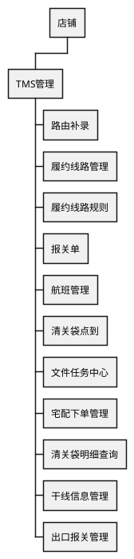

# TMS 完整版 PRD：产品结构与功能基线

## 阅读导航

本 PRD 按“已确认结构（I 类）→ 候选业务逻辑（C 类）→ 待核对问题（L 类）”三层组织。I 类内容是前端路由、页面文件、接口与中文文案可交叉验证的事实；C 类内容是由 I 类事实推断的页面职责、业务主线与交互口径，未登录运行态核对前不作为已确认规则；L 类问题登记在本文件 [9. 问题清单](#9-问题清单)，问题未关闭前，受影响内容保持“候选/待核对”标注。

| 阅读目的 | 直达位置 |
| --- | --- |
| 快速了解 TMS 管理的业务覆盖、范围结论与两层入口（店铺后台 TMS 管理组、7888 平台侧相关档案） | [2. 业务全貌](#2-业务全貌) |
| 查看 TMS 管理组 11 个菜单的页面结构树与逐页落点 | [2.3 页面结构树](#23-tms-管理页面结构树) |
| 查看三个可深挖的核心页面（路由补录、履约线路管理、履约线路规则）的候选流程、操作与字段 | [3. 路由补录](#3-核心页面路由补录)、[4. 履约线路管理](#4-核心页面履约线路管理)、[5. 履约线路规则](#5-核心页面履约线路规则) |
| 查看同组其余页面的结构级描述与候选职责 | [6. 同组其余页面（结构级）](#6-同组其余页面结构级) |
| 查看 7888 平台侧与 TMS 相关的入口 | [7. 平台侧（7888 Shell）TMS 相关入口](#7-平台侧7888-shelltms-相关入口) |
| 查看跨页面共用对象与待统一口径 | [8. 跨页面共用对象与候选口径](#8-跨页面共用对象与候选口径) |
| 查看未核对事项与需要产品确认的决策 | [9. 问题清单](#9-问题清单) |
| 查看本文件维护方式与代码事实索引 | [10. 后续维护与深化方式](#10-后续维护与深化方式)、[11. 附录：代码事实对照索引](#11-附录代码事实对照索引) |

## 1. 需求目的与范围

### 1.1 需求目的

TMS 管理此前没有完整版 PRD。相关菜单、页面、路由、接口与业务对象的现行口径分散在前端工程（7888 前端 shell 与店铺后台前端）和后端网关工程中，后续新增、修改或删除需求时缺少可定位的结构主库和统一业务术语。

本版先把 TMS 管理的产品结构固化为完整版 PRD 基线：明确 TMS 管理菜单组、页面清单、前端路由标识、同域页面候选、页面级功能点与关键业务字段的首版候选概述，并登记运行态未核对事项。后续每个 TMS 迭代先在本文件定位结构落点，再逐页补充字段、状态、权限、校验与计算口径。

本版只把“结构事实”作为已确认层；页面级字段清单、交互规则、状态机、权限点和业务流程规则不因本版收录而视为已确认，统一标注为候选并在 [9. 问题清单](#9-问题清单) 登记。

### 1.2 适用范围

本版收录范围分为两层：

1. **店铺后台 TMS 管理菜单组**：以现有店铺后台菜单树参考蓝图（[case4.md](C:\Coding\szt\agentskills-jacky\DSL\PlantUML\case4.md)）中“店铺 → TMS管理”下的 11 个菜单为组内范围，并结合店铺后台前端工程（`frontend-bop-core`）中可定位的页面、路由与接口写入结构事实。
2. **7888 平台侧（`frontend-bop-shell`）与 TMS 直接相关的入口**：7888 前端静态路由与源码中未检索到名为“TMS管理”的独立菜单组，但平台侧系统设置区承载了与 TMS 强相关的基础档案与作业入口（承运单号管理、物流渠道、清关袋点到、清关单/报关单基础档案、拼多多集运配置等），作为第二层范围收录在 [7. 平台侧（7888 Shell）TMS 相关入口](#7-平台侧7888-shelltms-相关入口)。

本版不收录以下内容：

1. WMS、BMS 账单、销售订单、会员、产品、财务等非 TMS 管理模块的完整规则。
2. 页面级完整字段清单、校验规则、状态机、权限点和打印版式。
3. 数据库表、消息队列、任务调度等技术实现结构（代码事实仅用于定位，不进入正式业务规则）。
4. 承运商、清关公司、报关公司等主数据在平台侧与店铺后台是否同源的判断结论（登记为待确认）。
5. 店铺后台中与 TMS 相邻但不属于“TMS管理”参考蓝图组的其他分组（如 集运管理→运单号管理、集运中心→包裹追踪、集运订单→集运跟踪/菜鸟订单实时监控/订单清关规则）本版不展开；是否纳入 TMS 管理范围待 [9. 问题清单](#9-问题清单) L-02、L-04 确认。

### 1.3 事实来源与读取口径

本版事实来源与核对状态如下：

| 事实来源 | 位置/标识 | 用途 | 核对状态 |
| --- | --- | --- | --- |
| 7888 站点静态资源 | http://supplychain-test.omszt.com:7888/，页面标题“服务平台”，静态资源 `static/js/app.46fbe057.js`，webpack 全局名 `webpackJsonp_bms` | 确认站点为 7888 前端 shell（`frontend-bop-shell`），不包含独立 TMS 菜单组 | 已定位静态层；登录后菜单未见 |
| 7888 shell 路由 | `C:\Coding\szt\frontend-bop-shell\src\router\system.js` | 平台侧 TMS 相关入口的路由名与页面标题 | 代码可证 |
| 店铺后台菜单树参考蓝图 | `C:\Coding\szt\agentskills-jacky\DSL\PlantUML\case4.md` | “店铺 → TMS管理”11 个菜单的名称依据 | 蓝图本身未标注版本与日期，来源待确认（L-02） |
| 店铺后台前端工程 | `C:\Coding\szt\frontend-bop-core\src\router\index.ts`、`src\views\tmsManage\` 及相关 views/api | TMS 页面路由、组件、字段文案与接口调用 | 代码可证；运行态未见 |
| 后端网关工程 | `C:\Coding\szt\backend-gateway-supplychain-shop\web\src\main\java\...\controller\` 下 TMS/物流线路/干线/报关相关控制器 | 页面接口归属与业务对象命名佐证 | 代码可证；接口契约未核对 |

本版口径约定如下：

1. “TMS 管理组”指店铺后台菜单树中“店铺 → TMS管理”分组；组内菜单名称以 [case4.md](C:\Coding\szt\agentskills-jacky\DSL\PlantUML\case4.md) 为参考蓝图，“页面路由名”以 `frontend-bop-core` 路由元信息为准。
2. “同组其余页面”指 TMS 管理组中本版只能写结构级描述的 8 个菜单；其中个别名称与代码页面名不完全一致，映射关系登记 L-03。
3. I 类（已确认结构）指“菜单/页面/路由/接口存在”这一层；C 类（候选逻辑）指页面用途、业务顺序与字段语义推断；正文以“（候选）”显式标注。
4. 前端路由是全量能力目录，不等于任一账号登录后可见的菜单；实际菜单受账号权限、店铺节点与自定义菜单影响。
5. 页面数量按菜单/功能页统计，不把列表下的抽屉、弹窗与详情子路由重复计数。

## 2. 业务全貌

### 2.1 业务覆盖

从页面结构与接口证据看，TMS 管理覆盖跨境干线运输履约侧的以下能力：

1. **线路与规则主数据**：履约线路（节点化的端到端运输路径）、履约线路规则（哪些仓库/货主/承运商/货物类型/时效类型的运单匹配哪条履约线路）。
2. **运单路由与异常处理**：路由补录（对缺少关键节点时间的运单，手工或按菜鸟口径补录各环节时间与失败原因）、物流轨迹查看、监控节点查看、重新分配履约线路。
3. **干线与清关作业支撑**：航班管理、干线信息管理（提单/船班/航班/清关/回传件数）、清关袋点到与清关袋点到明细查询、出口报关管理与相关报关域页面。
4. **宅配与文件任务**：宅配下单管理（文件任务驱动的派件下单）、文件任务中心（上传/下载/异步任务的进度与结果）。

以上覆盖范围由路由、页面名称与中文文案直接可观察；页面间的主流程、对象关系与状态口径仍需逐页核对，本版先以候选主线表达。

各章节中的“店铺运营人员”指店铺后台中具有对应菜单权限的账号，用于泛指操作角色；账号角色、菜单与按钮权限基线见 [9. 问题清单](#9-问题清单) L-12，未确认前不作为已确认权限规则。

### 2.2 一图看懂：TMS 运输履约候选主线

下图表达两条候选主线：运单从仓库交接进入运输环节后，由线路规则决定履约线路，路由补录保证关键节点时间完整，干线提单/航班承载运输段信息，清关袋与报关作业记录跨境节点；图只表达候选环节顺序与页面分工，不作为已确认规则。

```d2
vars: {
  d2-config: {
    layout-engine: elk
    theme-id: 104
    sketch: false
  }
  d2-elk-config: {
    "elk.direction": "RIGHT"
    "elk.layered.spacing.nodeNodeBetweenLayers": 34
    "elk.spacing.nodeNode": 26
  }
}

classes: {
  lane: {
    style.fill: "#F1F5F9"
    style.stroke: "#94A3B8"
    style.stroke-width: 1
  }
  start: {
    style.fill: "#EAF4FF"
    style.stroke: "#2563A6"
    style.stroke-width: 1
    style.font-size: 14
  }
}

upstream: 上游（候选） {
  class: start
  wms_out: "仓库出库交接/运单产生"
  rule_base: "履约线路与规则主数据"
  carrier_base: "承运商/清关/报关基础档案"
}

core: TMS 管理组（候选） {
  class: lane
  route_rule: "履约线路规则\n匹配线路"
  line: "履约线路管理\n节点/时效"
  route_collect: "路由补录\n补录/覆盖节点时间"
  monitor: "轨迹查看\n监控节点"
  flight: "航班管理"
  trunk: "干线信息管理"
  bag: "清关袋点到\n清关袋明细"
  customs: "出口报关管理"
  zpt: "宅配下单管理"
  file_task: "文件任务中心"
}

downstream: 下游（候选） {
  class: start
  platform: "平台/店铺物流轨迹与监控"
  carrier_fe: "承运商/清关行/报关行"
  last_mile: "末端派送"
}

upstream.wms_out -> core.route_collect: 产生待补录运单（候选）
upstream.rule_base -> core.route_rule: 线路/节点/时效（候选）
upstream.carrier_base -> core.route_collect: 承运商/清关/报关（候选）
core.route_rule -> core.route_collect: 分配履约线路（候选）
core.line -> core.route_rule: 线路候选（候选）
core.route_collect -> core.monitor: 节点时间/轨迹（候选）
core.route_collect -> core.trunk: 干线信息（候选）
core.flight -> core.trunk: 航班/船班（候选）
core.trunk -> core.bag: 清关袋（候选）
core.bag -> core.customs: 报关（候选）
core.route_collect -> core.zpt: 宅配下单文件（候选）
core.file_task -> core.zpt: 异步文件结果（候选）
core.monitor -> downstream.platform: 轨迹/监控结果（候选）
core.trunk -> downstream.carrier_fe: 提单/推送（候选）
core.zpt -> downstream.last_mile: 派件下单（候选）
```

| 图中环节 | 业务说明 | 进入条件 | 形成结果（均候选） |
| --- | --- | --- | --- |
| 线路与规则主数据 | 履约线路定义节点与时效，规则把限定情形映射到线路 | 店铺维护线路、规则 | 运单可自动或手动获得履约线路 |
| 路由补录与监控 | 对缺失节点时间的运单按环节补录时间/描述/失败原因 | 运单缺路由节点或异常 | 运单路由时间完整，可供轨迹与下游查询 |
| 干线与清关 | 航班/干线提单承载运输与清关信息，清关袋点到记录袋级、包裹级清关状态 | 干线启运、清关袋到达 | 干线提单、清关袋与包裹点到结果 |
| 宅配与文件任务 | 宅配下单文件与文件任务中心承载异步导入/导出/下单结果 | 文件生成或任务创建 | 派件下单、文件下载与任务进度结果 |

### 2.3 TMS 管理页面结构树

下列树是 TMS 管理组页面结构的唯一主描述；`·` 表示菜单/功能页，方括号内为店铺后台前端路由 `name`，用于定位页面与后续迭代落点。组名“TMS管理”及 11 个菜单名称来自菜单树参考蓝图 [case4.md](C:\Coding\szt\agentskills-jacky\DSL\PlantUML\case4.md)（L-02 待确认）。

```text
店铺 ▾
  TMS管理 ▾
    · 路由补录 [routeCollection]
    · 履约线路管理 [promiseLineManage]
    · 履约线路规则 [allotPromiseRoute]
    · 报关单（映射待核对，见 L-03）
    · 航班管理 [FlightManage]
    · 清关袋点到 [ClearanceOrderPageList]
    · 文件任务中心 [FileTaskCenter]
    · 宅配下单管理 [ZptOrder]
    · 清关袋明细查询 [ClearanceOrderPackageList]（代码标题为“清关袋点到明细查询”）
    · 干线信息管理 [TrunkLineInfoManage]
    · 出口报关管理 [ExportCustomsDeclarationManage]
```



页面与路由、视图文件的对应关系是 I 类事实，完整对应表见 [11. 附录：代码事实对照索引](#11-附录代码事实对照索引)。

### 2.4 模块结构总览

| 页面组/页面 | 路由 name | 本版描述深度 | 结构事实状态 | 业务语义状态 |
| --- | --- | --- | --- | --- |
| 路由补录 | routeCollection | 详细 | 已确认 | 候选 |
| 履约线路管理 | promiseLineManage | 详细 | 已确认 | 候选 |
| 履约线路规则 | allotPromiseRoute | 详细 | 已确认 | 候选 |
| 报关单 | 待核对 | 结构级 | 映射待核对 | 候选 |
| 航班管理 | FlightManage（meta code flightManage） | 结构级 | 已确认 | 候选 |
| 清关袋点到 | ClearanceOrderPageList | 结构级 | 已确认 | 候选 |
| 文件任务中心 | FileTaskCenter（meta code fileTaskCenter） | 结构级 | 已确认 | 候选 |
| 宅配下单管理 | ZptOrder | 结构级 | 已确认 | 候选 |
| 清关袋明细查询（代码标题：清关袋点到明细查询） | ClearanceOrderPackageList | 结构级 | 已确认 | 候选 |
| 干线信息管理 | TrunkLineInfoManage | 结构级 | 已确认 | 候选 |
| 出口报关管理 | ExportCustomsDeclarationManage | 结构级 | 已确认 | 候选 |

同域关联但不在 TMS 管理组参考蓝图内的页面（出口报关监控、报关资料、报关公司接口/任务配置、申报品名映射库、报单进件管理等）仅在第 6 章相关页面处引用，不作为组内页面计数。

## 3. 核心页面：路由补录

### 3.1 页面职责与入口

路由补录（`/tmsManage/routeCollection`，路由 name `routeCollection`，视图 `frontend-bop-core/src/views/tmsManage/routeCollection/index.vue`）承担跨境运单路由节点时间完整性管理：查询出库后进入运输环节的运单，识别缺少关键节点时间或节点执行超期的运单，通过页面按钮“路由补录”（下称“手工路由补录”，页面标题仍为“路由补录”，无“手工”字样）或“菜鸟路由补录”补录环节时间、描述与失败原因，并支持查看轨迹、查看监控节点、重新分配履约线路和导出。

页面业务语义为候选，结构事实（组件、按钮、筛选、字段、接口）来自视图文件与接口调用，可交叉验证。

### 3.2 候选主流程

| 步骤 | 触发或适用条件 | 参与方与对象 | 业务落点 | 系统处理（候选） | 业务结果（候选） |
| --- | --- | --- | --- | --- | --- |
| 1 查询 | 用户进入页面并按筛选条件查询 | 店铺运营人员；运单 | 路由补录列表 | 按筛选条件查询运单并返回汇总统计 | 列表展示符合条件的运单，行高亮异常 |
| 2 定位异常 | 运单缺节点时间或超出预估执行时间 | 运单 | 列表行样式、监控异常统计 | 对异常天数与超期行着色；顶部按节点显示异常数量 | 用户可快速定位待补录运单 |
| 3 查看 | 用户需要核对单票情况 | 运单 | 行操作“查看轨迹/查看监控节点” | 按运单号查询轨迹明细或节点计划/预估/执行时间 | 抽屉展示轨迹或监控节点 |
| 4 选择补录范围 | 用户决定补录哪些运单 | 运单集合 | 按钮“路由补录”“菜鸟路由补录” | 按当前查询条件组装待补录范围并打开对应抽屉；存在覆盖场景时先提示确认 | 打开补录抽屉，携带待处理范围 |
| 5 补录 | 用户逐环节填写时间/描述/失败原因并提交 | 运单路由节点 | 补录抽屉“更新路由” | 校验必填后提交更新路由 | 抽屉关闭并刷新列表 |
| 6 重新分配 | 用户需要更换运单的履约线路 | 运单集合 | 按钮“重新分配履约线路” | 选择启用中的履约线路后提交重新分配 | 所选运单重新绑定线路并刷新 |
| 7 导出 | 用户需要导出结果 | 运单集合 | 按钮“导出” | 按勾选集合或查询条件触发下载 | 生成导出文件；是否登记到文件任务中心待核对（L-09） |

### 3.3 列表查询与范围选择（候选，字段级事实为 I 类）

页面顶部按钮为“菜鸟路由补录、路由补录、导出、重新分配履约线路”；“重新分配履约线路”在未勾选运单时禁用。

查询区提供两类筛选：

1. 批量搜索框：支持按“运单号、箱号/订单号、交接号、一程提单号、二程提单号、线路编码、航班、清关公司、清关单号、袋中袋号、报关单号”批量输入查询，支持模糊与精确两种输入模式，查询失败结果有反馈（候选）。
2. 高级查询区：“货主、承运商、是否异常、异常天数（是否异常=是时可填）、绑定线路（是否已绑定履约线路）、发货时间（默认近一个月，候选）”。

列表支持勾选，并提供三种圈选口径（页面文案与统计为 I 类事实）：

| 圈选口径 | 页面表现 | 用途（候选） | 边界（候选） |
| --- | --- | --- | --- |
| 选择本页 | 表头勾选弹层“选择本页（N）” | 对当前页运单操作 | 仅当前页 |
| 选中全部 | 表头勾选弹层“选中全部（N）” | 对查询结果全量运单操作 | 全量数量由查询返回 |
| 按列未补录圈选 | 干线、干线出发、干线到达列头统计“未补录数量”并可勾选 | 圈选某节点为空/未补录的运单批量补录 | 列与统计口径需运行态核对 |

列表行样式为代码可证事实：异常天数大于 3 时行标红，否则当当前时间超过“监控节点预估执行时间”时行标黄；“异常天数”的业务判定与红色优先级语义为候选。

“监控异常统计”按节点显示异常数量，数据来自 `queryLineNodeStats`；列表汇总统计来自 `getRouteLogPageStats`。

### 3.4 路由补录抽屉（手工路由补录与菜鸟路由补录）

两个补录入口分别打开 `Detail.vue`（标题“路由补录”，本版称手工路由补录）与 `DetailCainiao.vue`（标题“菜鸟路由补录”），二者都以当前查询条件为待补录范围；提交前若范围中已存在已补录数据，会先弹出以“覆盖/补录”两段展示范围数量的提示（`warningDetail.vue`），由用户确认后再执行（精确文案与触发条件为候选，L-06 确认）。

手工补录抽屉按环节分组，结构事实如下：

| 分组 | 环节字段（I 类） | 补充字段（I 类） |
| --- | --- | --- |
| 仓库作业 | 复核时间、出库交接时间（输入框占位文案为“系统自动获取”，是否允许人工修改待核对） | 各自“描述”输入 |
| 干线 | 干线、供应商产品、出发时间、到达时间 | 各自“描述”输入 |
| 境内查验 | 报关行、供应商产品、开始查验（菜鸟：国内清关开始）、查验放行（菜鸟：国内清关结束） | 描述；国内清关失败原因下拉 |
| 一程 | 提单号、供应商产品、航空、航班号、计划出发/到达、出发/到达 | 出发/到达各自“描述” |
| 二程 | 提单号、供应商产品、航空、航班号、计划出发/到达、出发（菜鸟：干线出发）、到达（菜鸟：干线到达） | 描述 |
| 境外查验 | 清关公司、供应商产品、提货时间、开始查验（菜鸟：境外清关开始）、查验放行（菜鸟：境外清关结束） | 描述；境外失败异常原因下拉 |
| 揽收 | 揽收时间（菜鸟：揽收） | 描述；揽收失败原因下拉 |
| 抵达派送网点 | 抵达派送网点时间（菜鸟：抵达网点） | 描述 |
| 派送 | 派送时间（菜鸟：派送） | 描述 |
| 签收 | 签收时间（菜鸟：已妥投） | 描述；菜鸟签收异常原因下拉 |
| 退件 | 退件时间（菜鸟：退货） | 描述 |
| 其他/疑难 | 其他节点时间（按可配置项展示） | 描述；按配置显示签收异常/境外清关异常/再次派送失败原因下拉 |

提交按钮文案为“更新路由”，提交后触发列表刷新。失败原因选项来自“菜鸟签收异常原因、境外清关异常原因、再次派送失败原因、国内清关失败原因”等接口（候选语义；接口调用为 I 类事实）。

菜鸟补录抽屉的分组更贴近菜鸟口径：国内清关、干线、境外清关、境外运输、派送完结、其他/疑难；提交结果提示“路由补录结果”。

### 3.5 查看轨迹与监控节点

| 抽屉 | 打开方式 | 展示内容（I 类字段） | 数据来源（I 类） |
| --- | --- | --- | --- |
| 物流轨迹 | 行操作“查看轨迹” | 轨迹状态、描述、时间、轨迹保存时间、轨迹创建人（空值显示“系统”） | `queryWaybillTrajectoryInfo` |
| 查看监控节点 | 行操作“查看监控节点” | 线路编码、线路名称、监控节点、监控节点预估执行时间；节点明细含节点、计划时间、预估时间、执行时间 | 节点明细直接取自行数据 `lineNodeList`（候选） |

轨迹与监控节点只展示，不提供修改入口（候选）。

### 3.6 重新分配履约线路（候选规则）

用户在列表勾选运单后点击“重新分配履约线路”，系统二次确认并提示“只会修改当前页的数据，不包含不在本页的”；确认后选择履约线路（支持按线路名/编码搜索，仅列出启用中的线路，候选），提交后调用重新分配接口；返回成功后刷新列表。

边界（候选）：接口校验失败时列表不刷新并提示失败原因；当前页之外的同条件运单不在操作范围内。

### 3.7 列表关键字段候选索引

以下字段来自列表列定义（I 类事实），业务含义为候选：序号、已选、线路名称、监控节点预估执行时间、监控节点、运单号、航班、箱号/订单号、承运商、货主、仓库、清关公司、清关单号、袋中袋号、报关单号、交接号、复核时间、发货时间、干线、干线出发、干线到达（列头统计）、线路编码；行操作为“查看轨迹/查看监控节点”。

### 3.8 边界与待核对

1. 补录范围的“覆盖已补录数据”确认规则、单次批量上限与提交结果明细口径未确认（L-06）。
2. 菜鸟路由补录与手工路由补录的差异（同一运单可补录环节、失败原因来源、与菜鸟接口回传关系）未完全确认（L-07）。
3. 是否每个环节均必填、哪些环节允许只填部分时间后提交，未确认（L-07 关联）。
4. “重新分配履约线路”与 [5. 履约线路规则](#5-核心页面履约线路规则) 自动分配结果的覆盖关系未确认（L-05）。

## 4. 核心页面：履约线路管理

### 4.1 页面职责与入口

履约线路管理（`/tmsManage/promiseLineManage`，路由 name `promiseLineManage`，视图 `frontend-bop-core/src/views/tmsManage/promiseLineManage/index.vue`）维护可分配给运单的“履约线路”主数据：一条履约线路由多个路由节点组成，每个节点指定始发地、目的地、供应商产品与时效。

### 4.2 候选主流程

| 步骤 | 触发或适用条件 | 参与方与对象 | 业务落点 | 系统处理（候选） | 业务结果（候选） |
| --- | --- | --- | --- | --- | --- |
| 1 查询 | 用户进入页面按线路关键词/状态/创建时间/创建人筛选 | 店铺运营人员；履约线路 | 履约线路列表 | 查询并返回列表 | 展示线路名、编码、状态、始发地、目的地、创建时间 |
| 2 新增 | 用户点击“新增线路” | 履约线路 | 新增抽屉 | 打开新增抽屉 | 形成一条新线路草稿 |
| 3 编辑 | 用户点击行“修改” | 履约线路 | 编辑抽屉 | 回填线路并允许修改 | 保存后更新线路 |
| 4 启停用 | 用户勾选后选择“启用/停用” | 履约线路集合 | 批量启停 | 提交状态变更 | 线路状态切换并刷新 |
| 5 删除 | 用户勾选后点击“批量删除” | 履约线路集合 | 批量删除 | 二次确认后提交删除 | 删除成功并刷新；被规则/运单引用时的限制待核对 |

### 4.3 列表与操作（结构事实）

列表顶部按钮：“新增线路”“启/停用（启用/停用）”“批量删除”；行操作“修改”。筛选条件：“履约线路（线路名/编码关键词）”“状态（已启用/未启用）”“创建时间”“创建人”。列表字段：履约线路名、线路编码、状态（已启用/未启用）、始发地、目的地、创建时间。

删除与启停用均需先勾选行；批量删除前二次确认。删除被履约线路规则引用或被运单绑定的线路时的系统限制未确认（L-05）。

### 4.4 新增/编辑抽屉（候选规则）

抽屉标题“新增线路/编辑线路”，表单分两部分：

1. 基础资料：履约线路名（必填）、是否启用（开关）。
2. 路由节点明细：可添加/删除多个“路由节点”，每个节点行包含节点名称（必填，来自节点字典）、始发地（国家/省份/城市，必填）、目的地（国家/省份/城市，必填）、供应商产品（必填，弹窗“选择供应商产品”选择，支持多产品）、时效（“设置时效”弹窗设置）。

保存按钮“确定保存”；保存前校验线路名、节点、始发地/目的地、供应商产品是否完整。

“选择供应商产品”弹窗按“供应商名、编码、供应商类型”查询产品，产品列展示产品名、产品类型、供应商，可选择多个产品；若新勾选与已选线路产品范围冲突，保留旧勾选并提示（L-05 关联确认精确限制）。

“设置时效”弹窗提供三种时效口径（单选，结构事实）：统一时效、动态时效、无时效；其中动态时效按周一到周日分别设置下单时效，且时效单位可配置；未配置可估算时效时顶部整体时效显示“没有最大时效，无法预估”（三种口径的业务语义为候选）。

整体时效：由线路各节点配置的时效值汇总展示（代码路径为对节点时效字段累加；同一节点多产品、时效单位的合并口径待核对，候选）。

### 4.5 边界与待核对

1. 节点字典（“路由节点”可选值）的来源与节点顺序限制未确认（L-08）。
2. 供应商产品与时效的选择范围、产品与节点的绑定数量上限未确认（L-05、L-08 关联）。
3. 线路启用/停用/删除对已按线路执行的运单、已绑定的规则与文件任务的存量影响未确认。
4. 统一时效、动态时效、无时效三种时效口径的适用语义、单位换算与合并计算方式未确认（L-08）。

## 5. 核心页面：履约线路规则

### 5.1 页面职责与入口

履约线路规则（`/tmsManage/allotPromiseRoute`，路由 name `allotPromiseRoute`，视图 `frontend-bop-core/src/views/tmsManage/allotPromiseRoute/index.vue`）维护“在什么限定情形下把哪条履约线路分给运单”的分配规则。

### 5.2 列表与操作（结构事实）

列表顶部按钮：“新增分配线路”“启/停用（启用/停用）”“批量删除”；行操作“修改”。列表字段：履约线路名、线路编码、货主、承运商、货物类型、时效类型、仓库、状态（已启用/未启用）、始发地、目的地、创建时间。

筛选条件：履约线路（线路名/编码远程搜索）、仓库、状态、货主、始发地（国家地址级联）、目的地（国家地址级联）、承运商、货物类型、时效类型、创建时间、创建人。

### 5.3 新增/编辑抽屉（候选规则）

抽屉标题“新增分配线路/编辑分配线路”，表单分两部分：

1. 基础资料：履约线路（必填，线路名/编码远程搜索）、始发地（由所选履约线路回填并禁用）、目的地（同左）、是否启用（开关）。
2. 分配规则（限定情形，均为多选，结构事实）：仓库、货主、承运商、货物类型、时效类型。货物类型与时效类型的下拉选项依赖先选择仓库（未选仓库时提示“请先选择仓库”）。

保存按钮“确定保存”，提交前校验履约线路、仓库、货主、承运商、货物类型、时效类型、始发地、目的地的有效性。

### 5.4 候选业务语义与待核对

候选语义：当运单满足规则中仓库、货主、承运商、货物类型、时效类型全部限定，且始发地/目的地与线路范围一致时，系统为该运单分配该履约线路；列表页未发现“优先级”字段，多条规则同时命中时的选用顺序未确认（L-05）。

重新分配接口（`/shopLogisticsLineRule/reAssign`）在路由补录页被调用，说明规则与线路分配存在运行时重算入口；规则生效范围（何时为哪些运单匹配线路）与覆盖既有分配的口径未确认（L-05）。

## 6. 同组其余页面（结构级）

以下页面均能定位到店铺后台前端路由与视图文件（I 类事实），但运行态页面语义未核对，正文描述一律为候选。

### 6.1 航班管理

| 项目 | 内容 |
| --- | --- |
| 页面与路由 | 航班管理，路由 name `FlightManage`（meta code `flightManage`），路径 `/FlightManage/index`，视图 `views/FlightManage/index.vue` |
| 结构事实 | 列表字段含清关袋数、订单数、航班、适用日期、所属仓库、承运商、报关公司、限重(KG)、已使用重量(KG)、可用重量(KG)等；支持导出；筛选含适用日期等 |
| 候选职责 | 按“适用日期 + 仓库/承运商/报关公司”维度查看航班的清关袋数与重量容量占用，辅助判断可装载量与干线装载安排 |
| 待核对 | 是否只读查询、是否有新增/编辑航班入口、限重与已用/可用重量的统计口径 |

### 6.2 清关袋点到

| 项目 | 内容 |
| --- | --- |
| 页面与路由 | 清关袋点到，name `ClearanceOrderPageList`，路径 `/ClearanceOrderPageList/index`，视图 `views/clearanceOrderPageList/index.vue` |
| 结构事实 | 列表字段含航班、清关单号、清关公司、清关公司编码、清关袋运单号、清关袋报关单号、打包仓、打包仓编码、发货时间、内件重量(kg)等，另有点到仓、点到时间、点到人字段；顶部操作含导出、导入、批量修改点到仓；导入模板文件名为“清关袋点到导入.xlsx”；筛选含点到仓库、是否已点到、点到时间等 |
| 候选职责 | 记录清关袋到达清关公司/仓库的“点到”作业（到点仓、到点时间、到点人），支持导入登记与批量修改点到仓；行级“是否点到/点到状态”作为后续拆袋、报关处理的前置条件 |
| 待核对 | 点到动作由人工勾选/导入触发还是扫描触发；点到仓可选范围与状态迁移 |

清关袋点到页存在拆袋相关状态字段（拆袋点到状态），与明细查询页联动；页面如何进入拆袋流程未确认。

### 6.3 清关袋点到明细查询（菜单参考名：清关袋明细查询）

| 项目 | 内容 |
| --- | --- |
| 页面与路由 | 清关袋点到明细查询，name `ClearanceOrderPackageList`，路径 `/ClearanceOrderPageList/ClearanceOrderPackageList`，视图 `views/clearanceOrderPageList/ClearanceOrderPackageList.vue` |
| 结构事实 | 列表字段含包裹号、运单号、承运商、集运单号、平台单号、合包号、清关单号、清关公司、清关袋运单号、清关袋报关号、报关公司、打包仓、集包时间、预计到仓时间、点到仓、点到时间、点到人、处理等级（普通/紧急）、拆袋点到状态（正常/串袋/漏货）、实际袋号、实际袋运单号、实际袋报关号、拆袋扫描时间、漏货标记时间/人、串袋标记时间/人、航班、集包员、集运交接时间、交接员、理论重量(KG)、复核重量(KG)；筛选含清关公司、点到仓、是否点到、处理等级、拆袋点到状态、是否已扫 |
| 候选职责 | 按清关袋查询袋内包裹的到点、拆袋结果（正常/串袋/漏货）、实际袋信息与交接信息，用于清关异常追溯与后续处理 |
| 待核对 | 菜单名（清关袋明细查询）与代码标题（清关袋点到明细查询）取哪个为正式名称；漏货/串袋标记的触发动作与下游处理 |

### 6.4 报关单（组内菜单，页面映射待核对）

| 项目 | 内容 |
| --- | --- |
| 页面与路由 | case4 参考蓝图组内有“报关单”菜单；店铺后台路由中未检索到同名页面 |
| 候选关联页面 | 报关域候选页面包括：报关资料（name `CustomsDeclarationInfo`，`views/CustomsDeclarationManage/CustomsDeclarationInfo.vue`）、报单进件管理（name `DongFengManifestManage`）、报关公司接口配置、报关公司任务配置、报关资料请求日志、申报品名映射库等；其组内归属与可见关系需运行态确认 |
| 候选职责 | 对出口/跨境包裹的报关资料进行申报、推送与结果跟踪；具体哪一页面承载“报关单”菜单以运行态菜单为准 |
| 待核对 | “报关单”与报关资料/报单进件管理/出口报关管理的确切对应关系（L-03） |

### 6.5 文件任务中心

| 项目 | 内容 |
| --- | --- |
| 页面与路由 | 文件任务中心，name `FileTaskCenter`，路径 `/system/file/downloadList`，视图 `views/system/file/DownloadList.vue` |
| 结构事实 | 任务类型枚举：上传、下载、异步任务；列表/筛选含文件名或任务名、任务状态、任务类型、创建时间；支持按任务查看明细、下载文件、打包下载（JSZip 保存）与进度展示；页面可从导出入口带文件名/文件 ID 参数进入 |
| 候选职责 | 集中展示各页面触发的文件类任务（导出下载、导入上传、异步生成）的执行状态与结果文件，作为导出入口的统一结果承接点 |
| 待核对 | 哪些页面触发文件任务写入该中心；任务保留期与失败重试入口 |

### 6.6 宅配下单管理

| 项目 | 内容 |
| --- | --- |
| 页面与路由 | 宅配下单管理，name `ZptOrder`，路径 `/ZptOrder/index`，视图 `views/ZptOrder/index.vue` |
| 结构事实 | 列表字段含文件名称、FTP 文件路径、OSS 存储路径、文件状态、记录创建时间、最后更新时间、重新下单关联的文件 ID、重新下单关联文件名称、是否重新下单；行操作“派件下单”“查看”；代码引用一键下单函数与文件日志/明细查询接口（对应页面入口位置待运行态核对） |
| 候选职责 | 按宅配渠道文件（FTP/OSS）驱动“派件下单”：用户查看文件任务状态，对未下单或需重新下单的文件触发派件下单，并跟踪是否重新下单 |
| 待核对 | 文件生成来源、文件状态枚举、派件下单成功后生成的下游对象及重复下单防重 |

### 6.7 干线信息管理

| 项目 | 内容 |
| --- | --- |
| 页面与路由 | 干线信息管理，name `TrunkLineInfoManage`，路径 `/TrunkLineInfoManage`，视图 `views/focusTransport/TrunkLineInfoManage/TrunkLineInfoManage.vue` |
| 结构事实 | 顶部操作：导入海运船班、导入空运航班、上传提单文件、提交干线信息、推送平台；导入模板文件名“海运船班导入模版.xlsx”“空运航班导入.xlsx”；行操作“查看提单文件”“包裹明细” |
| 候选职责 | 管理干线提单（海运船班/空运航班）的班期与状态，跟踪发货、离港到港、清关件数与平台回传结果；支持提单文件上传与按提单查看包裹明细 |
| 待核对 | 干线提单与航班/履约线路的关联口径；提交干线信息、推送平台的对象范围与回传计数口径（L-10） |

干线列表字段候选：主提单号、柜号、航司、航班/船班、清关行、打包航次、集运方式、发货日期、装柜日期、干线提交时间、待/已回传平台件数、待/已回传拼多多件数、预计/实际离港时间、离港码头/机场、二程出发轨迹生成数、预计/实际到港时间、到港码头/机场、二程到达轨迹生成数、清关日期、清关情况、已清/未清件数、提单发货人/收货人、提单件数、提单毛重(KG)、提单体积、税金总额、提交状态（未提交/已提交）、提交人、备注。

### 6.8 出口报关管理（及关联候选：出口报关监控）

| 项目 | 内容 |
| --- | --- |
| 页面与路由 | 出口报关管理，name `ExportCustomsDeclarationManage`，路径 `/CustomsDeclarationManage/ExportCustomsDeclarationManage`，视图 `views/CustomsDeclarationManage/ExportCustomsDeclarationManage.vue`；关联页面“出口报关监控”，name `ExportCustomsDeclarationNotImportedManage`，视图同目录 `ExportCustomsDeclarationNotImportedManage.vue` |
| 结构事实 | 顶部操作：导入（模板“出口申报信息导入模版.xlsx”）、导入(新)（模板“出口申报信息导入模版(新).xlsx”）、删除、提交（批量提交）、推送平台（可异步，文案“推送成功，请稍后再来查看处理结果”）；字段含推送平台时间、推送错误信息、是否删除等 |
| 候选职责 | 对出口申报信息批量导入、提交与推送报关平台，跟踪推送时间与错误信息；监控页面向未导入/未推送成功的申报数据提供处理入口 |
| 待核对 | “提交”与“推送平台”的差异、异步任务承接位置（是否进入文件任务中心）、申报单号与运单/清关单的关联口径 |

## 7. 平台侧（7888 Shell）TMS 相关入口

7888 站点静态资源与路由表明其前端工程为 `frontend-bop-shell`（webpack 全局 `webpackJsonp_bms`）；该工程静态路由与源码中未检索到“TMS管理”菜单组，系统设置区内承载与 TMS 强相关的基础档案与作业入口。本层只收录“与 TMS 直接相关”的入口；所属一级菜单分组、登录后可见性均待核对（L-04、L-11）。

### 7.1 承运单号管理

承运单号管理（路由 name `waybillManage`，视图 `frontend-bop-shell/src/views/system/waybillManage/index.vue`）维护可分配给店铺/客户使用的 TMS 承运商运单号资源。

#### 7.1.1 列表与筛选（结构事实）

列表字段：运单号、承运商、导入时间、是否使用（已使用/未使用）、使用时间、分派客户、使用备注、是否代收（是/否）。

筛选条件：运单号（批量输入）、承运商、仓库（远程模糊搜索，候选）、是否使用、导入时间、使用时间、是否代收、分派客户（客户远程搜索）。

#### 7.1.2 操作（候选规则）

顶部操作：批量更改使用状态、批量分派到客户、导入、删除。

| 操作 | 页面处理（候选） | 边界（候选） |
| --- | --- | --- |
| 批量更改使用状态 | 勾选运单后批量修改“是否使用”及使用备注 | 状态可逆性待核对 |
| 批量分派到客户 | 勾选运单后选择分派客户，批量写入分派客户 | 已分派/已使用运单是否可重新分派待核对 |
| 导入 | 使用 Excel 上传（模板文件“供应链-运单号导入模板.xlsx”）导入承运商运单号 | 导入校验、重复运单号处理待核对 |
| 删除 | 二次确认后删除；若勾选数据包含已使用运单则提示“已使用运单无法删除” | 已分派未使用运单删除影响待核对 |

接口事实：列表、上传、删除、分派客户、批量更新使用状态接口均挂在 `/portal/tmsWaybillNoRepository/*`（I 类事实）；客户列表来自账单域客户查询（候选）。

### 7.2 其他平台侧入口（结构级）

| 入口 | 路由 name | 页面标题/代码标识 | 候选职责 | 待核对 |
| --- | --- | --- | --- | --- |
| 物流渠道 | electronSurfaceChannel | 物流渠道 | 维护物流渠道资料（渠道编码/名称、接口标准与接口地址、取号模式、子单模式、订单申报规则、清关公司、货物类型、运输方式、启用状态等）及承运商关联 | 与履约线路/运单号（取号）的引用关系 |
| 供应链管理 | supplyChainGovern | 供应链管理 | 管理供应链组织与用户（含组织树、组织用户子页） | 是否含运单号/承运商运营配置入口 |
| 清关公司/报关公司 | clearanceCompany、customsBroker | 清关公司（代码重复出现两次） | 维护清关/报关公司基础档案 | 两处“清关公司”入口的差异与归属 |
| 清关单 | customsClearanceOrderList | 清关单 | 维护清关单基础资料 | 与清关袋点到页清关单号口径一致 |
| 报关单单 | customsDeclarationOrderList | `报关单单`（代码标题） | 维护报关单基础资料（候选） | 标题文案与店铺后台“报关单”页的关系（L-03） |
| 清关袋点到 | clearanceOrderPageList | 清关袋点到 | 平台侧清关袋点到查询/登记入口 | 与店铺后台同名页面的数据同源与角色差异（L-04） |
| 拼多多集运配置 | pddJyConfig | 拼多多集运配置（含配置编辑子路由） | 配置拼多多集运渠道承运商与集运规则 | 承运商下拉接口与 TMS 承运商档案关系 |
| 目的国设置 | destinationCountry | 目的国设置 | 维护目的国基础资料 | 被哪些线路/规则引用 |

以上入口除承运单号管理外，本版未展开页面字段；相关需求上线前须先按运行态菜单与页面核对（L-11）。

## 8. 跨页面共用对象与候选口径

以下对象在两个及以上页面出现，后续需求维护应保持同一对象口径；对象间的确切关系待逐页核对：

1. **运单**：路由补录、物流轨迹、监控节点、清关袋点到明细、承运单号管理共用“运单号”概念；运单号来源（候选：承运商导入、出库交接生成等）与唯一性口径待统一。
2. **履约线路与节点**：履约线路管理、履约线路规则、路由补录共用线路名/编码、路由节点、监控节点口径；节点可选值由线路相关节点字典接口提供（候选）。
3. **供应商产品与时效**：履约线路管理中按节点选择供应商产品并设置时效，线路整体时效由节点时效汇总展示（合并口径待核对）；路由补录按供应商产品选择干线/清关段承运商。
4. **清关对象**：清关单、清关袋、袋中袋与报关单编号在路由补录列表、清关袋点到、清关袋点到明细查询、报关域页面重复出现；清关袋与袋中袋是否为同一袋对象、各编号之间的引用关系待核对（L-03）。
5. **航班与干线**：航班管理（航班/日期容量）、干线信息管理（提单/船班/航班/回传件数）与路由补录列表（航班、干线出发/到达）共用“航班/干线”名称；对象粒度（班期、提单、包裹）不一致，统计口径待统一（L-10）。
6. **文件任务**：路由补录等页面的导出与宅配下单文件、文件任务中心均涉及文件生成与下载；哪些导出进入文件任务中心未确认（L-09）。

## 9. 问题清单

本清单登记运行态未核对与需要产品确认的事项。问题未关闭前，受影响内容维持“候选/待核对”标注，不作为已确认业务口径使用。

| 问题 ID | 问题摘要 | 影响 | 改进建议 | 需要产品确认的决策 |
| --- | --- | --- | --- | --- |
| L-01 | 本版无登录账号，未对 7888 与店铺后台登录后的菜单、页面布局、字段和按钮做运行态核对 | 页面级字段、状态、权限和交互尚未定义，菜单归属可能与运行界面有出入 | 提供只读账号或菜单/截图快照后逐页核对并回写 | 是否需要产品提供 TMS 运行环境账号 |
| L-02 | TMS 管理组 11 个菜单来自参考蓝图 [case4.md](C:\Coding\szt\agentskills-jacky\DSL\PlantUML\case4.md)，该文件未标注版本与日期，且无法确认是否为当前官方菜单树 | 组内页面清单可能与实际菜单不一致 | 以登录后菜单树或菜单管理配置核对并回写 | 以哪份菜单树作为 TMS 管理组基线 |
| L-03 | “报关单”菜单在店铺后台路由中无同名页面；参考蓝图“清关袋明细查询”与代码标题“清关袋点到明细查询”不一致；平台侧存在标题为“报关单单”的页面 | 页面与菜单映射关系不确定，影响定位与后续迭代 | 按运行态菜单逐项给出组内页面与路由对应表 | “报关单”对应哪一页面，以及菜单正式名称清单 |
| L-04 | 7888 平台侧与店铺后台（`frontend-bop-core`）的导航关系、登录切换方式与同页面重复出现（清关袋点到等）的关系未确认 | TMS 管理 PRD 的两层范围边界存在不确定性 | 登录后确认平台与店铺后台的入口关系与数据同源性 | 用户期望的“TMS 管理”是平台侧入口、店铺后台组还是两者 |
| L-05 | 履约线路规则的分配时机、多条规则同时命中时的选用顺序、覆盖既有分配的口径、删除/修改规则与线路对存量运单的影响均未确认 | 直接影响运单如何获得履约线路及与手动重新分配的关系 | 结合后端分配作业与运行数据核对规则匹配与冲突处理 | 规则命中顺序与手动/自动分配覆盖关系 |
| L-06 | 路由补录的“覆盖/补录”确认规则、单次批量上限、提交结果明细与部分成功处理未确认 | 补录操作可能影响已补录数据，范围与结果口径不确定 | 运行态触发大范围补录核对提示与结果 | 补录范围、覆盖确认与批量上限口径 |
| L-07 | 菜鸟路由补录与手工路由补录的差异（可补录环节、失败原因来源、与菜鸟接口回传关系）未完全确认 | 两个补录入口的业务边界不清 | 运行态核对两个抽屉的字段与提交语义 | 两个补录入口分别适用于哪些场景 |
| L-08 | 履约线路的供应商产品、动态时效（按周一到周日）、节点字典的来源与约束未确认 | 影响线路新增/编辑的校验与整体时效计算口径 | 核对产品/时效字典与后端校验 | 节点字典与动态时效的正式口径 |
| L-09 | 文件任务中心的触发来源、任务保留期与失败重试入口未确认；宅配下单管理的文件生成来源与下游结果未确认 | 文件类操作的结果承接与追溯不确定 | 核对导出/导入/异步任务入口与任务记录 | 文件任务中心的任务来源清单与保留策略 |
| L-10 | 干线信息管理的干线提单与航班/履约线路关联、提交干线信息与推送平台的对象范围、回传件数统计口径未确认 | 干线节点与回传结果可能无法与运单监控对齐 | 结合干线提单/包裹接口核对对象粒度 | 干线信息管理在 TMS 组内的定位与回传口径 |
| L-11 | 平台侧（7888 shell）各 TMS 相关入口所属一级菜单分组、页面标题与代码标识一致性（如 `electronSurfaceChannel` 对应页面标题“物流渠道”）、与店铺后台同名页面的角色差异未确认 | 平台侧入口收录边界不完整 | 登录后导出平台菜单快照并核对 | 平台侧需要收录哪些入口作为 TMS 管理范围 |
| L-12 | 权限与角色口径未核对：店铺主账号/子账号、平台运营账号在 TMS 各页面的可见与操作范围未知 | 页面结构不能代表任一账号的菜单与按钮权限 | 后续按角色核对菜单与按钮权限点 | 以哪些角色作为 TMS 权限基线 |

## 10. 后续维护与深化方式

本文件作为 TMS 完整版 PRD 的结构主库，维护规则如下：

1. [2.3 TMS 管理页面结构树](#23-tms-管理页面结构树) 是组内菜单、页面与路由标识的唯一主描述；路由或菜单变化时先更新该树，再同步 [2.4 模块结构总览](#24-模块结构总览) 统计。
2. 每个页面的后续迭代按“结构定位 → 运行态核对与转正 → 页面字段与操作 → 状态与权限 → 规则与计算 → 报表与导出”的顺序深化，闭合一项回写一项，不在一版内虚构未核实的业务口径。
3. 深化过程中若发现本版名称、重复页面或菜单归属判断与运行界面不一致，先记入 [9. 问题清单](#9-问题清单) 并明确以运行界面或产品确认为准。
4. 候选（C 类）内容转正时，同步删除“（候选）”标注并保持正文、表格与问题清单口径一致；未确认内容不得作为已确认目标规则交付。

## 11. 附录：代码事实对照索引

下表是 I 类结构事实的代码定位索引，供研发与后续深化定位；业务含义以正文为准。

| 页面/入口 | 前端路由 name | 视图文件 | 主要接口/后端控制器（代码事实） |
| --- | --- | --- | --- |
| 路由补录 | routeCollection | `frontend-bop-core/src/views/tmsManage/routeCollection/index.vue`（含 Detail、DetailCainiao、monitoringNode、trackDetails、warningDetail、HeadersToChoose） | `/tmsWaybillOrder/queryPageList`、`/tmsWaybillOrder/additional`、`/tmsWaybillOrder/queryWaybillTrajectoryInfo`、`/tmsWaybillOrder/download`、`/shopLogisticsLineRule/reAssign` 等；后端 `TmsWaybillOrderController` |
| 履约线路管理 | promiseLineManage | `frontend-bop-core/src/views/tmsManage/promiseLineManage/`（index、editDrawer、editAging、supplier） | `/shopLogisticsLine/queryPageList|insert|update|delete|enable`、`/shopLogisticsLine/queryRouteNodeList`；后端 `ShopLogisticsLineController` |
| 履约线路规则 | allotPromiseRoute | `frontend-bop-core/src/views/tmsManage/allotPromiseRoute/`（index、editDrawer） | `/shopLogisticsLineRule/queryPageList|insert|update|delete|enable|reAssign`；后端 `ShopLogisticsLineRuleController` |
| 航班管理 | FlightManage | `frontend-bop-core/src/views/FlightManage/index.vue` | `routeOrderQueryPageList` 等（api/system） |
| 清关袋点到/明细查询 | ClearanceOrderPageList / ClearanceOrderPackageList | `frontend-bop-core/src/views/clearanceOrderPageList/` | `getClearanceOrderPageList`、`updateCountingWarehouse` 等（api/system） |
| 文件任务中心 | FileTaskCenter | `frontend-bop-core/src/views/system/file/DownloadList.vue` | `queryFileTaskDetail`、`queryFileTaskList`、`renderFileTaskList`（api/system） |
| 宅配下单管理 | ZptOrder | `frontend-bop-core/src/views/ZptOrder/index.vue` | `oneClickOrder`、`queryTmsFtpFileDetail`、`queryTmsFtpFileLogPage`（api/zptOrder）；后端 `ZptOrderController` |
| 干线信息管理 | TrunkLineInfoManage | `frontend-bop-core/src/views/focusTransport/TrunkLineInfoManage/TrunkLineInfoManage.vue` | `queryMainlineBillOfLadingPage`、`pushPlf` 等（api/mainlineBillOfLading）；后端 `MainlineBillOfLadingController` 等 |
| 出口报关管理/监控 | ExportCustomsDeclarationManage / ExportCustomsDeclarationNotImportedManage | `frontend-bop-core/src/views/CustomsDeclarationManage/` | 后端 `ExportCustomsDeclarationController`、`ExportCustomsDeclarationImportHeaderController` |
| 报关域关联页面 | CustomsDeclarationInfo 等 | `frontend-bop-core/src/views/CustomsDeclarationManage/` 多个视图 | 后端 `CustomsDeclarationInfoController`、`CustomsDeclarationApiConfigController` 等 |
| 承运单号管理（平台侧） | waybillManage | `frontend-bop-shell/src/views/system/waybillManage/index.vue` | `/portal/tmsWaybillNoRepository/queryList|upload2SC|deleteWaybillNo|useByCustomer|batchUpdateUseState`；后端 `TmsWaybillNoRepositoryController` |
| 平台侧系统入口 | electronSurfaceChannel、supplyChainGovern、clearanceCompany、customsClearanceOrderList、customsDeclarationOrderList、clearanceOrderPageList、pddJyConfig 等 | `frontend-bop-shell/src/views/system/*` | 对应 api（frontend-bop-shell/src/api/system.js 等） |
