# 账单系统 PRD

<div id="section-1"></div>

## 1. 背景与目标

本 PRD 定义 BMS 账单管理系统的业务口径。BMS 实质上是财务系统的一大核心板块，重点承接客户应收、COD 返款、供应商收费核对、金额汇兑、账单核销和历史追溯，不等同于完整的财务系统。

系统目标如下：

1. 让财务能够按客户配置和账期稳定生成应收账单、返款账单，并登记、核对供应商提供的成本账单。
2. 让每张账单都有清晰的来源、金额、币种、状态和历史快照。
3. 让 `BMS费项池` 成为 BMS 内部数据归集的根基，应收账单、返款账单、成本账单的全部金额明细都必须从 `BMS费项池` 归集。
4. 让客户对账只看到客户需要核对的信息，让供应商收费核对和内部成本信息留在内部。
5. 让账单生成后的修正、冲正、核销和重跑都有明确边界，不靠删除或覆盖历史结果解决问题。

要实现以上目标，首先需要把当前财务链路中最容易造成口径不一致、结果不可追溯的问题说清楚。

<div id="section-2"></div>

## 2. 核心问题

当前主要问题集中在五个方面：

1. 账单线分散：应收账单、返款账单和供应商收费核对分别处理，财务难以从同一业务订单或尾程包裹追溯完整账务结果。
2. 配置口径分散：账期、履约节点、返款模式、币种、汇率和客户规则如果没有统一快照，账单生成结果会随配置变化产生歧义。
3. 来源金额不稳定：来源数据在进入 BMS 前可能仍会变化，系统必须明确可采集口径和最终金额口径。
4. 历史账单易被覆盖：账单进入审核、对账、核销或结清后，如果仍允许后续任务直接覆盖，会破坏客户确认、供应商核对和财务审计链路。
5. 对账边界不清：客户对账、供应商收费核对和内部经营分析关注的信息不同，导出、通知和页面展示必须区分客户可见信息与内部信息。

这些问题最终都会落到不同参与方的日常动作上，因此需要先说明谁会使用系统、各自关注什么，再说明系统要覆盖哪些业务场景。

<div id="section-3"></div>

## 3. 参与方与业务场景

BMS 围绕财务账单管理工作展开，同时需要让业务、客户和系统任务在同一账单口径下协作。

| 参与方 | 关注点 |
| :--- | :--- |
| 财务专员 | 维护配置、核对费用、审核账单、导出对账报表、登记核销结果。 |
| 财务主管 | 关注账单口径、异常差异、调账冲正、审核结果和历史留痕。 |
| 业务部 | 关注订单、包裹、线路、仓库、供应商和费项归属是否符合业务事实。 |
| 客户 | 接收应收账单或返款账单，核对金额并完成付款或返款确认。 |
| 系统任务 | 按配置读取来源数据、生成账单、锁定快照、记录状态和异常。 |

核心业务场景按阅读顺序理解如下：

1. 账前配置：财务先维护客户级账单配置和客户级汇率配置。
2. 客户应收：系统按配置归集客户应付费用，形成应收账单，审核后用于客户对账和收款核销。
3. COD 返款：系统按返款模式及对应的签收、回款事实形成返款账单，审核后用于客户返款确认和核销。
4. 供应商收费核对：财务用成本账单核对供应商给出的收费账单，并把收费结果沉淀为包裹和订单成本。
5. 差异处理：账单生成后发现差异时，通过补录、调账、冲正、反核销或后续账单承接，不直接改写已生效结果。
6. 历史追溯：所有关键配置、金额、汇率、核销和调整动作都保留快照和操作轨迹。

明确参与方和业务场景后，下一步需要限定本 PRD 负责解决哪些问题，以及哪些问题不在本期范围内展开。

<div id="section-4"></div>

## 4. 范围与边界

<div id="section-4-1"></div>

### 4.1 需求范围内

本 PRD 覆盖以下能力：

1. 客户级账单配置、客户级汇率配置及其版本快照。
2. 来源数据同步、费项池、客户侧费项索引、成本费项索引和账单生成机制。
3. 应收账单、返款账单的生成、审核、结清，以及成本账单的登记、成本处理、结清、查询和追溯。
4. 账单重跑、账单侧重算、补录、调账、冲正、反核销和后续账单承接。
5. 金额汇兑、币种汇总、核销约束和客户对账报表导出。
6. 权限、审计、幂等、异常恢复、数据安全和测试环境辅助能力。

<div id="section-4-2"></div>

### 4.2 需求范围外

本 PRD 不覆盖以下内容：

1. 不重写 OIS、OMS、WMS、TMS 的基础履约逻辑。
2. 不重新计算上游订单报价，只读取和快照来源数据中已经形成的业务事实。
3. 不展开供应商付款审批、发票管理、税务处理、总账凭证和企业级会计分录。
4. 不把内部成本、内部汇率来源、系统审计字段输出给客户。
5. 不把跨币种自动抵扣作为 V1 默认能力。

范围明确之后，本章从系统视角说明整体方案：账单链路如何组织，三类账单如何分工，以及所有后续章节共同遵守哪些原则。

<div id="section-5"></div>

## 5. 总体方案

系统总体采用“先配置、再采集、再生成、再审核对账、最后核销和留痕”的顺序组织。后续章节分别展开这条主链路上的具体规则。

<div id="section-5-1"></div>

### 5.1 总体链路

BMS 账单管理主链路如下：

| 阶段 | 目标 | 主要落点 |
| :--- | :--- | :--- |
| 前置配置 | 明确客户出账规则、返款规则和默认汇率。 | <a href="#section-7">7. 客户级账单配置</a>、<a href="#section-8">8. 客户级汇率配置</a> |
| 来源准备 | 把稳定后的来源费项进入 `BMS费项池`；`BMS费项池` 是应收账单、返款账单、成本账单全部金额明细的统一归集根基。 | <a href="#section-9-5">9.5 第四步：来源费用怎样变成BMS费项？</a>、<a href="#section-19-2">19.2 业务系统基本面</a> |
| 账单生成 | 按配置快照和来源数据生成账单结果。 | <a href="#section-9">9. 账单生成/重算机制</a> |
| 账单处理 | 按账单类型完成审核、对账、核销和供应商收费核对。 | <a href="#section-10">10. 应收账单模块</a>、<a href="#section-11">11. 返款账单模块</a>、<a href="./成本中心.PRD.md">《成本中心 PRD》</a> |
| 金额处理 | 锁定币种、汇率、金额快照和核销口径。 | <a href="#section-15">15. 金额汇兑</a> |
| 差异闭环 | 对错误、遗漏、客户异议和历史差异做可追溯处理。 | <a href="#section-16">16. 调账中心</a>、<a href="#section-17">17. 非功能需求</a> |

<div id="section-5-2"></div>

### 5.2 账单类型

三类账单的业务目的不同，不能互相替代：

三类账单的金额明细来源必须一致：应收账单、返款账单、成本账单的全部金额明细均归集自 `BMS费项池`。各账单模块只负责在 `BMS费项池` 基础上按自身业务目的做分流、汇总和后续处理；应收账单、返款账单按客户账单流程审核与核销，成本账单按供应商账单流程进行成本处理与结清。

| 类型 | 面向对象 | 业务目的 | 详见 |
| :--- | :--- | :--- |
| 应收账单 | 客户 | 核对客户应向我方支付的费用，并完成收款核销。 | <a href="#section-10">10. 应收账单模块</a> |
| 返款账单 | 客户 | 核对 COD 货款应返金额、扣减项和返款结果。 | <a href="#section-11">11. 返款账单模块</a> |
| 成本账单 | 供应商 / 内部财务 | 核对供应商给出的收费账单，并沉淀包裹和订单成本。 | <a href="./成本中心.PRD.md">《成本中心 PRD》</a> |

<div id="section-5-3"></div>

### 5.3 设计原则

1. 配置先行：账单生成必须先读取客户级账单配置、客户级汇率配置和来源数据快照。
2. 费项池归集：三类账单的全部金额明细必须先进入 `BMS费项池`，不得绕过 `BMS费项池` 直接生成账单金额。
3. 快照优先：账单一旦形成关键结果，必须保留配置、金额、币种、汇率和操作快照。
4. 类型分流：应收账单、返款账单和成本账单按各自业务目的处理，具体分流规则在对应账单模块展开。
5. 历史保护：应收账单、返款账单在审核后不得被静默覆盖；成本账单形成后不得被来源数据静默覆盖，已结清成本账单只能通过<a href="#section-16">16. 调账中心</a>形成成本金额冲正或成本核销冲正，且不得返结清。
6. 差异留痕：补录、调账、冲正、反核销和重跑都必须保留触发原因、影响范围和处理结果。
7. 信息分层：客户对账只输出客户可核对的信息；供应商收费核对、内部成本、内部汇率来源和系统审计信息不得对客户暴露。

系统视角的链路明确后，还需要把同一条链路翻译成财务每天能执行的操作顺序。

<div id="section-6"></div>

## 6. 财务日常SOP

本章只描述财务从确认客户配置到完成账单核销的日常操作。应收账单和返款账单共用账前准备环节，进入账单处理后可以并行推进。

<div id="section-6-1"></div>

### 6.1 SOP目标

1. 让财务按稳定顺序完成配置确认、账单费项处理、导出、审核、客户对账和核销。
2. 让应收账单和返款账单可以同时处理，两条账单线互不等待。
3. 让特定场景的处理完成后能回到明确的主流程节点，不依赖线下记忆继续推进。

<div id="section-6-2"></div>

### 6.2 执行原则

1. 配置先行：先确认客户级账单配置和客户级汇率配置，再进入本期账单处理。
2. 先处理费项：确认本期账单已生成后，财务先补录或调整账单费项，再分别处理应收账单和返款账单。
3. 先导出再审核：导出的账单用于财务核对；财务确认账单内容无误后再审核。
4. 审核后发出：账单只有审核通过后才能发给客户并进入客户对账。
5. 双线并行：应收和返款分别按各自的导出、审核、客户对账和核销进度处理，一条账单线未完成不得阻塞另一条。
6. 结果留痕：账单金额或核销有误时，按重算、调账、冲正或后续账单承接规则处理，不删除或覆盖已生效历史。
7. 状态约束：已向客户发出的账单不得作废或替换生成；已结清账单不得返核销，核销差错通过核销记录冲正处理。

<div id="section-6-3"></div>

### 6.3 每日按什么顺序处理？

| 环节 | 财务动作 | 关注重点 | 输出 |
| :--- | :--- | :--- | :--- |
| 配置确认 | 依次确认客户级账单配置和客户级汇率配置。 | 配置是否完整，是否与客户约定一致。 | 本期账单采用的配置口径 |
| 账单确认 | 确认本期应处理的账单已经生成。 | 账单范围、账期和采用的配置是否符合预期。 | 已生成的本期账单 |
| 费项处理 | 补录或调整账单费项。 | 费项、金额、币种、汇率、扣减项和冲正结果是否完整、准确。 | 可供导出核对的账单 |
| 账单导出 | 分别导出应收账单和返款账单。 | 导出内容是否完整，金额汇总是否与账单一致。 | 应收账单 / 返款账单导出文件 |
| 账单审核 | 分别审核应收账单和返款账单。 | 账单是否可以正式发给客户；未收口账单是否确需截断账期。 | 已审核账单 |
| 客户对账 | 发出已审核账单并跟客户对账。 | 客户是否收到正确版本，异议是否已记录和处理。 | 客户确认结果 / 待处理异议 |
| 账单核销 | 分别核销应收账单和返款账单。 | 实际收款或返款、未结金额、差额及汇兑损益是否清楚。 | 应收账单 / 返款账单核销结果 |

<div id="section-6-4"></div>

### 6.4 主流程与子流程

主流程以“配置确认 → 账单生成确认 → 费项处理 → 分线导出、审核、客户对账和核销”为固定顺序。应收账单和返款账单在同一个 `fork` 中并行，表示两条账单线可以同时推进，不表示必须同时完成。子流程只在配置变更、账单有误、客户异议或资金差异等特定场景下触发。

<div id="section-6-4-1"></div>

#### 6.4.1 主流程

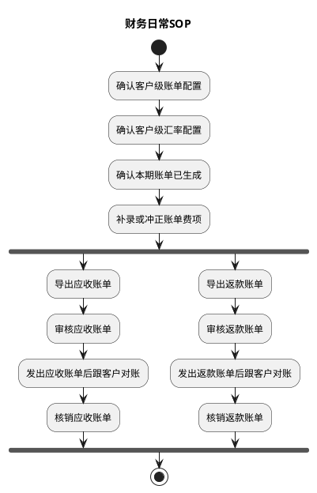

客户只启用应收或返款其中一类配置时，只执行对应分支；两类配置同时启用时，两条分支并行推进。账单生成与重算的适用边界见<a href="#section-9">9. 账单生成/重算机制</a>，应收和返款的具体处理规则分别见<a href="#section-10">10. 应收账单模块</a>、<a href="#section-11">11. 返款账单模块</a>。

<div id="section-6-4-2"></div>

#### 6.4.2 哪些情况才进入子流程？

子流程只在特定场景下触发，不进入主流程的必经节点。子流程处理完成后，应回到配置确认、账单确认、费项处理、账单导出、客户对账或账单核销中的对应节点继续主流程。

| 子流程 | 触发场景 | 财务动作 | 回到主流程的位置 |
| :--- | :--- | :--- | :--- |
| 配置新建 / 变更 | 新客户启用账单，或现有客户的账期、账单范围、返款规则、币种或汇率口径变更。 | 维护配置，确认生效时间、适用范围及对已有待审核账单的影响。 | 配置确认 |
| 提前生成 / 提前收口 | 财务需要在账期结束前提前查看或向客户发出账单。 | 选择`账单生成`；需提前审核时，确认截断后的实际账期范围。 | 账单确认 |
| 待审核账单重新生成 | 账单配置已变更，或账期结束前已生成账单但来源费用又发生变化。 | 对从未发出的`待审核`账单选择`账单生成`，由系统判定补充生成或替换生成；已发出账单不得使用该方式。 | 账单确认 |
| 账单重算 | 不增加新的来源费项，只需将已有账单的汇率调整、调账或冲正结果重新计算。 | 选择`账单重算`，完成后重新确认和处理账单费项。 | 费项处理 |
| 费项或金额缺失 | 账单费项处理或审核时发现费项、扣减项、返款金额或必要的订单信息不完整。 | 暂停后续处理；补录或来源结果完整后，再选择账单生成或重算。 | 费项处理 |
| 审核未通过 | 账单金额或明细有误，或关联冲正尚未全部审核通过。 | 驳回并记录原因；修正账单费项后重新导出和审核。 | 费项处理 |
| 客户异议 | 客户收到账单后，对金额、费项、扣减项、回款或返款口径提出异议。 | 记录异议，按账单状态进入重算、调账、冲正或后续账单承接；需要形成新版本时，重新导出、审核并发给客户。 | 费项处理 / 账单导出 / 客户对账 |
| 通知失败 / 未配置邮箱 | 账单审核通过后，`通知状态`为`通知失败`或`未配置邮箱`。 | 确认客户邮箱配置并重新发送；不得因通知失败重新生成账单。 | 客户对账 |
| 部分结清 / 金额差异 | 客户部分付款、财务向客户部分返款，或实际金额与账单待结清金额不一致。 | 登记实际资金结果，按部分核销、超额、差额和汇兑损益口径处理。 | 账单核销 |
| 核销错误 | 已结清账单的核销记录有误。 | 发起核销记录冲正；不返核销、不改写原核销记录。 | 账单核销 |
| 导出字段定制 | 客户要求在默认对账报表外追加辅助核对字段。 | 按<a href="#section-19-6">19.6 对账报表导出格式</a>处理，追加字段不得改变账单金额口径。 | 账单导出 |

财务 SOP 确定了配置确认、费项处理、账单导出、审核、客户对账和核销的操作顺序。其中配置确认需要稳定的客户出账和返款口径，下一章继续定义客户级账单配置。

<div id="customer-billing-config"></div>

<div id="section-7"></div>

## 7. 客户级账单配置

[🔗原型链接](http://localhost:4181/#/billing/config)

客户级账单配置用于集中维护客户出账和返款的前置规则。应收账单模块和返款账单模块不再各自重复定义配置口径，统一从本章读取配置版本、账期规则、币种规则、履约节点、返款模式和生效周期。

<div id="section-7-1"></div>

### 7.1 章节概述

客户级账单配置回答的是“某个店铺、客户组或客户按什么规则生成应收账单和返款账单”。一份配置可以被多个店铺、客户组或客户共享，也可以只服务一个客户。它位于账单生成之前，是任务类型为`账单生成`的BMS任务读取配置快照的来源。

本章覆盖两类配置：

1. 应收账单配置：用于控制客户应付费用如何按账期、履约节点、业务范围和币种规则生成应收账单。
2. 返款账单配置：用于控制 COD 货款如何按返款模式、回款时间、扣减项和货款结算币种生成返款账单。

两类配置都支持`店铺级`、`客户组级`和`客户级`适用范围，一份配置可被多个适用对象共享，具体规则见<a href="#section-7-2-1">7.2.1 配置适用范围与命中优先级</a>。

#### 7.1.1 页面原型概述

页面分为配置列表、应收配置编辑和返款配置编辑三个业务区域：

| 区域 | 业务字段 | 业务操作 | 关键业务约束 |
| --- | --- | --- | --- |
| 配置列表 | 适用层级、适用对象、状态、配置编号、默认结算币种、账期类型、账单发出时间、返款模式、配置状态 | 查询、新建配置、编辑配置、生成账单 | 应收账单配置与返款账单配置分别维护；配置按店铺、客户组或客户设置适用对象，一份配置可包含多个适用对象，命中优先级为客户级 > 客户组级 > 店铺级 |
| 应收配置编辑 | 配置编号与版本、适用范围（适用层级、适用对象）、默认方案、分支方案、费项结算币种、履约节点、账期类型、账单发出时间、方案生效周期、信用评级、信用期限、逾期滞纳金、垫资额度上限、合同编号、合同文件 | 新增或移除分支方案、新增或移除费项币种规则、引用模板、保存配置 | 默认方案不设置限定情形；分支方案必须设置订单类型和目的国；分支方案限定情形不得相互交叉；每个方案至少保留一条末行费项结算币种兜底规则；同一方案内同一明确费项只能配置一条币种规则 |
| 返款配置编辑 | 配置编号与版本、适用范围（适用层级、适用对象）、启用状态、返款模式、账期类型、半周起始日、账单发出时间、必要归集金额、直接扣减费项、货款原始币种、货款结算币种、客户收款账户、负数金额处理方式、条款生效周期 | 新增或移除币种账户规则、保存配置 | 账期仅支持周和半周；半周必须选择两个起始日且两个账期均不少于 3 天；币种账户规则必须保留一条末行兜底规则，兜底货款原始币种为只读的“全部”或“其他”；非兜底规则指定货款原始币种前，货款结算币种为空，指定后默认取货款原始币种；每条规则必须配置明确的货款结算币种和客户收款账户，不支持“随原始币种” |

配置变更默认只影响变更后创建的任务和账单，不自动回写已有账单。尚未向客户发出的`待审核`账单如需改用新版配置，财务应发起`账单生成`并选择本次采用的新版配置；系统按<a href="#section-9-6-3">9.6.3 配置变了，怎样安全替换待审核账单？</a>判定是否执行替换生成。已经发出的账单不得作废或替换生成。

<div id="billing-config-version"></div>

<div id="section-7-2"></div>

### 7.2 配置版本与生效规则

客户级账单配置必须版本化管理。

1. 同一账单类型、同一生效周期内，同一适用层级下不同生效配置版本的适用对象不得存在交集；不同适用层级的配置允许同时存在，按命中优先级生效。
2. 应收账单配置和返款账单配置可以分别启用，也可以同时启用。
3. 旧版本生效并用于出账后，不允许就地编辑，只能新建版本。
4. 每张账单必须记录本次命中的配置版本快照。
5. 配置版本至少应记录生效开始日期、生效结束日期、启用状态、操作人、操作时间和变更原因。
6. 配置变更只影响后续新任务；尚未发出的`待审核`账单可由财务确认影响后发起`账单生成`并选择新版配置，由系统判定是否替换生成。已经发出、待结清或已结清的账单继续使用原快照，只能通过重算、调账、冲正或后续账单承接修正，不得作废或替换生成。
7. 客户邮箱属于客户主数据，不属于共享账单配置；财务必须在客户主数据中维护客户邮箱，用于系统自动向客户发送应收账单、返款账单和客户级账单配置变更通知；未维护客户邮箱时，系统不得自动发送客户邮件。
8. 保存或启用配置前，系统必须校验必填项、账期、履约节点、生效周期、限定情形、方案互斥关系、费项结算币种及其它规则是否合法且完整。任一校验不通过时，不得保存或启用配置，并应定位到具体配置项说明原因。
9. 普通账单任务只允许读取已经通过校验并生效的配置版本。唯一例外是与`替换生成`任务绑定的`待生效`配置：该配置只允许用于生成本次替换的候选账单，不得被其它任务读取，并须在候选账单成功切换时同步生效。不得把保存配置时能够识别的问题延迟到账单生成或重算阶段处理。

<div id="section-7-2-1"></div>

#### 7.2.1 配置适用范围与命中优先级

每份应收账单配置和返款账单配置都必须设置适用层级和适用对象：

1. 适用层级包括`店铺级`、`客户组级`和`客户级`。一份配置只能选择一个适用层级，但可以同时选择该层级下的多个适用对象；适用对象必须真实存在且属于所选层级。
2. 客户级配置选择多个客户时，多个客户共享同一份配置；客户级配置只选择单个客户时，即为该客户独享的配置。
3. 客户组关系遵循 OIS 事实：一个店铺可有多个客户组，一个客户组可下挂多个客户，见<a href="#section-19-2-1">19.2.1 核心对象关系</a>。
4. 账单生成时，系统按客户归属关系确定客户命中的适用层级，优先级为`客户级 > 客户组级 > 店铺级`。只存在客户级配置时直接使用；没有客户级配置时，再使用客户组级配置；没有客户组级配置时，再使用店铺级配置；三级均无生效配置时，不得生成该客户的本期账单。
5. 同一账单类型、同一生效周期内，同一适用层级下不同配置版本的适用对象不得存在交集。不同适用层级的配置允许同时存在，并分别按各自适用对象生效。
6. 配置版本快照、任务执行和账单生成必须记录客户实际命中的适用层级和配置版本，供财务核对客户采用哪一份共享配置。
7. 共享配置不保存客户邮箱；客户邮箱属于客户主数据，系统按账单归属客户读取邮箱。
8. 配置层级只决定客户命中哪份配置，不产生店铺级或客户组级账单。账单结果始终以客户为唯一主体：按店铺级配置生成账单时，适用该配置的每个客户分别生成独立客户级账单；按客户组级配置生成账单时同理，组内每个客户分别生成客户级账单。
9. 店铺和客户组只是账单列表的筛选维度，不代表账单主体或组织视图。财务可按店铺、客户组、任务编号或配置编号筛选客户级账单；筛选不改变账单归属客户、账单编号或客户对账口径。
10. 财务按任务编号或配置编号筛选出账单后，可以对筛选结果批量下载；每张账单仍按各自客户生成独立对账文件，批量下载规则见<a href="#section-19-6-3-1">19.6.3.1 发起导出</a>。

<div id="billing-period-rules"></div>

<div id="section-7-3"></div>

### 7.3 账期定义与节奏

账期是客户级账单配置中的出账周期口径，用于决定系统在什么时间范围内归集费项、生成账单并进入后续审核与对账流程。应收账单配置和返款账单配置都可以独立维护账期，两条账单线不要求同周期对齐。

账期类型分为两类：

1. 日历账期：`周`、`半月`、`月`等，必须对齐日历边界。`周`按自然周，`半月`按每月 1 日至 15 日、16 日至月末，`月`按自然月。
2. 自然天账期：统一显示为`N 自然天`，例如`1 自然天`、`7 自然天`、`10 自然天`、`15 自然天`；按配置生效起始日连续滚动计算，不要求对齐自然周、自然半月或自然月。

返款账单配置的账期类型仅支持`周`和`半周`，不支持`半月`、`月`或自然天账期。`半周`是返款账单专用账期，表示在一个自然周内拆成两个连续账期。

理解口径：

1. 账期只定义本期账单归集来源数据的时间范围，不代表客户付款、财务返款或核销必须在同一时间范围内完成。
2. 常规情况下，账期结束后由系统完成期末收口；已经生成的账单达到`待审核 + 已收口`后进入财务审核，尚未生成的账单由期末任务首次生成并收口。财务确需提前对账时，可以对`待审核 + 未收口`账单执行<a href="#section-9-7-3">9.7.3 账期还没结束，怎样提前收口并审核？</a>，由系统先形成截断账期并完成收口，再推进审核。信用期、返款处理期和核销期是账期之后的资金处理口径。
3. 同一客户的应收账单和返款账单可以使用不同账期；同一应收配置中的默认方案和分支方案也可以使用不同账期。
4. 当默认方案和分支方案账期不同，系统按各方案自己的账期独立判断是否到达出账时点，不存在固定先后或兜底关系。

<div id="section-7-3-1"></div>

#### 7.3.1 账期（周）甘特图

本图演示日历账期中的`周`账期。`周`账期必须对齐自然周边界，因此客户 A 和客户 B 的账期起止日都按同一自然周滚动；账期结束后再按客户级账单配置进入账单发出日和结算信用期。图中客户 A 与客户 B 的账单发出日偏移不同，用于表达账期相同不代表账单发出日或信用期安排必须完全一致。

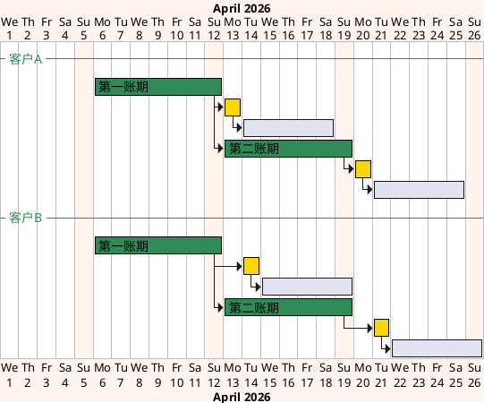

<div id="section-7-3-2"></div>

#### 7.3.2 账期（7 自然天）甘特图

本图演示`7 自然天`账期。该账期按客户级账单配置的生效起始日连续滚动，不要求对齐自然周、自然半月或自然月；因此客户 A 可以从 2026/04/06 开始滚动，客户 B 可以从 2026/04/08 开始滚动，两者不需要对齐同一日历边界。账期结束后，仍按各自配置进入账单发出日和结算信用期。

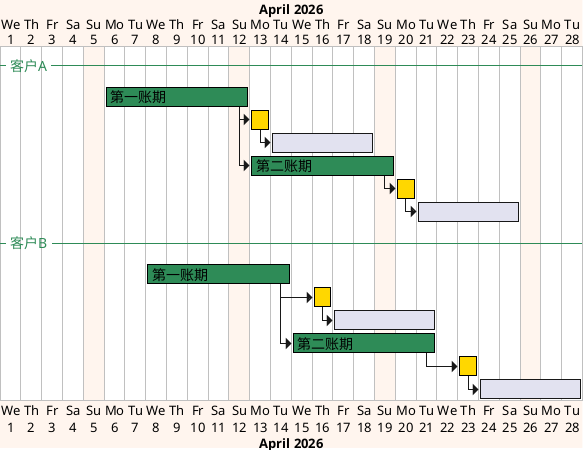

<div id="receivable-billing-config"></div>

<div id="section-7-4"></div>

### 7.4 应收账单配置

应收账单配置用于维护客户后付费用的出账规则。

应收账单配置由配置版本信息、默认方案和分支方案组成。

配置版本信息至少包括：

- 生效周期
- 启用状态
- 操作人
- 操作时间
- 变更原因

每个方案都应独立维护出账规则，方案级配置项至少包括：

- 账期类型
- 账单发出时间
- 费项结算币种
- 应收账单履约节点
- 限定情形

客户级信用与合同条款包括信用期限、逾期未结算滞纳金、信用评级、垫资额度上限、合同编号和合同文件，不随默认方案或分支方案分别维护。

配置页面可以套用`费项结算币种模板`，批量填充费项结算币种规则。套用后只保留填充结果，不保存模板引用；财务可以继续修改填充值，模板后续变化也不得联动修改账单配置。

费项结算币种规则至少保留一行，且末行固定为兜底规则。当仅有一行时，兜底规则的费项口径为`全部`；存在明确费项规则时，兜底规则的费项口径自动变为`其他`。兜底规则的费项只读，不允许人工修改；其结算币种默认为`随原始币种`，也可以指定为其他币种。兜底规则之前的规则必须配置明确费项和明确币种，新增明确费项规则的结算币种默认取原始币种。同一方案内明确费项不得重复。

应收账单履约节点规则：

1. 应收账单配置的履约节点仅支持`出库时间`和`订单完结`。
2. `核重时间`不作为履约节点选项，任何环境均不得展示、选择或生效该选项。订单完成出库前仍存在费项重算窗口，核重完成不代表费项横表金额已经稳定，不得作为账单归集依据。
3. `签收`已由`订单完结`取代，不再作为应收账单配置选项。
4. `订单完结`与广义签收的当前系统口径见<a href="#section-19-2-5">19.2.5 广义签收</a>；订单类费用归集时间口径见<a href="#section-9-5-4">9.5.4 费用达到什么条件才能入池？</a>。

<div id="refund-billing-config"></div>

<div id="section-7-5"></div>

### 7.5 返款账单配置

返款账单配置用于维护 COD 包裹货款代收与返还条款。

配置项至少包括：

- 返款模式
- 账期类型
- 账期起始日
- 账单发出时间
- 返款账单必要归集金额
- 在准返款中直接扣减的应收费项
- 货款原始币种
- 货款结算币种
- 客户收款账户
- 当已返货款金额为负数时的应对措施
- 条款生效周期

返款账单配置规则：

1. 配置采用版本化管理。
2. 生效后默认只影响后续任务，不自动回写已有返款账单；尚未发出的待审核返款账单只有在财务发起`账单生成`、选择新版配置且系统判定为替换生成时，才允许改用新版配置。
3. 条款生效周期内不允许重叠。
4. 货款原始币种、货款结算币种和客户收款账户的匹配及换算规则见<a href="#section-7-5-1">7.5.1 返款账单怎样确定结算币种和金额？</a>；完整换算口径见<a href="#section-15-7-1">15.7.1 返款账单换算总则</a>。
5. 负数金额可选择顺延到下期返款账单，或反向计入本期应收账单。
6. 返款账单账期类型仅支持`周`和`半周`。
7. 当账期类型为`周`时，账期按自然周滚动。
8. 当账期类型为`半周`时，财务必须明确两个连续账期的起始星期，例如`周二`和`周五`；系统应据此在每个自然周内拆出两个连续账期。
9. `半周`的两个起始星期必须保证每个单独账期不少于 3 天；若任一账期少于 3 天，系统不得保存配置。

<div id="section-7-5-1"></div>

#### 7.5.1 返款账单怎样确定结算币种和金额？

后续订单费用报表只导入`回款汇率`和`实收回款`，不再导入`返款汇率`和`实付返款`。返款账单根据客户级返款配置确定货款原始币种和货款结算币种，并锁定两者之间的返款汇率；历史已导入的返款字段不参与新生成或重算的返款账单。

返款账单采用以下口径：

1. `货款原始币种`是配置的匹配条件，用于匹配`应付返款（即代收货款）`的原始币种。该币种通常为目的国币种。
2. `货款结算币种`是客户最终收款的币种，也是最终`实付返款`的币种。
3. `返款汇率`是返款账单锁定的`货款原始币种 → 货款结算币种`汇率，按<a href="#section-15-3-1">15.3.1 汇率层级</a>取得；同币种换算时固定为`1`。
4. `实付返款（准）`是在货款原始币种中，从`应付返款`扣除返款账单指定扣减费项后得到的换算前金额；最终`实付返款`再按返款汇率换算为货款结算币种。

系统按以下顺序处理每张满足返款归集条件的 COD 业务订单：

| 处理步骤 | 处理口径 | 不满足时的处理 |
| :--- | :--- | :--- |
| 1. 匹配原始币种 | 先按`应付返款`的真实原始币种匹配明确的`货款原始币种`规则；没有明确规则时，才匹配`其他`兜底规则。`其他`不是可参与换算的真实币种。 | 没有匹配规则时，受影响业务订单不得进入本次返款账单。 |
| 2. 确定结算币种 | 读取匹配规则中的`货款结算币种`，作为返款账单的计算和分桶币种。 | 货款结算币种为空时，不得保存配置或生成账单。 |
| 3. 汇总指定扣减 | 将返款账单指定扣减费项统一换算为货款原始币种后汇总。 | 缺少必要汇率时，受影响业务订单不得进入本次返款账单。 |
| 4. 计算换算前返款 | `实付返款（准） = 应付返款 - 返款账单指定扣减费项`，结果仍使用货款原始币种。 | 缺少应付返款本金，或结果触发负数处理规则时，按对应规则处理。 |
| 5. 锁定返款汇率 | 按真实的货款原始币种和货款结算币种取得`返款汇率`，并随账单保存快照。 | 按<a href="#section-15-3-1">15.3.1 汇率层级</a>处理。 |
| 6. 计算实付返款 | `实付返款 = 实付返款（准） × 返款汇率`。 | 缺少必要汇率时，受影响业务订单不得进入本次返款账单。 |
| 7. 校验收款账户 | 客户收款账户币种必须等于`货款结算币种`。 | 未配置同币种客户收款账户时，配置不得保存，受影响账单不得生成。 |

配置保存时，系统必须阻止同一配置版本内相同`货款原始币种`存在多个不同的`货款结算币种`规则；否则同一业务订单会得到多个结算结果。`其他`只负责兜底匹配未单独配置的原始币种，计算时仍须使用业务订单真实的原始币种取得返款汇率。例如，配置为`其他 → USD`时，TWD 业务订单应锁定`TWD → USD`返款汇率，不能把`其他`当作货币。

存量数据中历史已导入的`返款汇率`和`实付返款`只保留原记录，不在返款账单详情和对账报表中继续展示，也不影响货款币种规则匹配、账单生成、替换、重算或审核。

<div id="billing-scheme-rules"></div>

<div id="section-7-6"></div>

### 7.6 默认方案与分支方案

应收账单配置必须支持默认方案和分支方案。

1. 默认方案必须存在，用于表达客户最基础的应收出账规则。
2. 分支方案用于按运抵国、集运仓、业务板块等维度拆分账单规则。
3. 默认方案不包含限定情形，保存后直接生效；分支方案用于表达限定情形下的独立出账规则。
4. 分支方案必须选择订单类型和目的国，集运仓可以不限定。
5. 分支方案之间的限定情形不得存在交集；订单类型、目的国和集运仓三个维度均存在交集时，判定为方案冲突。
6. 任一分支方案的某个限定维度未填写时，该维度按不限制处理，并与其它分支方案在该维度视为存在交集。
7. 分支方案存在范围交集、缺少订单类型或缺少目的国时，配置不得保存。
8. 默认方案不参与分支方案限定情形的交集校验。

<div id="section-7-7"></div>

### 7.7 限定情形互斥算法

1. 校验对象：新增或修改的应收方案，应与同一应收配置版本内其它已启用方案逐一校验；默认方案和分支方案都参与校验。
2. 情形表达：每个限定情形维度都按集合处理；单选值视为单元素集合，多选值视为多元素集合，`不限`或未配置视为该维度全集。
3. 交集判定：两个方案在全部限定情形维度上都存在交集，才判定两个方案的适用范围有交集；只要任一维度无交集，即可判定两个方案互斥。
4. 收敛方法：先用待校验方案的情形选项 1 跟其它方案的情形选项 1 比对，保留有交集的方案；再用情形选项 2 仅跟上一轮保留方案继续比对，直至所有情形选项比对完成。
5. 判定结果：任一轮比对后候选方案为空，则待校验方案与其它方案互斥；所有情形选项比对完成后仍存在候选方案，则这些候选方案与待校验方案有交集，配置不得保存或启用。
6. 特殊限制：当任一分支方案存在时，默认方案不得使用`不限`或未配置作为整体限定情形；否则默认方案会被视为可能覆盖分支方案范围。

样例：假如要新增方案 10，则系统按以下方式判定其与方案 1-9 是否存在交集。

- 先用方案 10 的情形选项 1 跟方案 1-9 的情形选项 1 对比，发现方案 1-8 与方案 10 有交集。
- 再用方案 10 的情形选项 2 跟方案 1-8 的情形选项 2 对比，发现方案 1-7 与方案 10 有交集。
- 再用方案 10 的情形选项 3 跟方案 1-7 的情形选项 3 对比，发现方案 6-7 与方案 10 有交集。
- 最后用方案 10 的情形选项 4 跟方案 6-7 的情形选项 4 对比，未发现交集，因此方案 10 与其它方案互斥，可以通过校验。

<div style="overflow-x:auto; width:100%;">
<table style="width:max-content; border-collapse:collapse; white-space:nowrap;">
  <thead>
    <tr>
      <th style="text-align:left; border:1px solid #999; background:#f0f0f0;">情形维度</th>
      <th style="text-align:left; border:1px solid #999;">方案 1</th>
      <th style="text-align:left; border:1px solid #999;">方案 2</th>
      <th style="text-align:left; border:1px solid #999;">方案 3</th>
      <th style="text-align:left; border:1px solid #999;">方案 4</th>
      <th style="text-align:left; border:1px solid #999;">方案 5</th>
      <th style="text-align:left; border:1px solid #999;">方案 6</th>
      <th style="text-align:left; border:1px solid #999;">方案 7</th>
      <th style="text-align:left; border:1px solid #999;">方案 8</th>
      <th style="text-align:left; border:1px solid #999;">方案 9</th>
      <th style="text-align:left; border:2px solid #e55;">方案 10</th>
    </tr>
  </thead>
  <tbody>
    <tr>
      <td style="text-align:left; border:1px solid #999; background:#f0f0f0;">情形选项 1<br/>枚举：A1、A2、A3、A4、A5</td>
      <td style="text-align:left; border:1px solid #999; background:#f8d7da;">A1、A2、A3、A4、A5</td>
      <td style="text-align:left; border:1px solid #999; background:#f8d7da;">A1、A2、A3、A4、A5</td>
      <td style="text-align:left; border:1px solid #999; background:#f8d7da;">A1、A2、A3、A4、A5</td>
      <td style="text-align:left; border:1px solid #999; background:#f8d7da;">A1、A2、A3、A4、A5</td>
      <td style="text-align:left; border:1px solid #999; background:#f8d7da;">A1、A2、A3、A4、A5</td>
      <td style="text-align:left; border:1px solid #999; background:#f8d7da;">A1、A2、A3、A4、A5</td>
      <td style="text-align:left; border:1px solid #999; background:#f8d7da;">A1、A2、A3、A4、A5</td>
      <td style="text-align:left; border:1px solid #999; background:#f8d7da;">A1、A2、A3、A4、A5</td>
      <td style="text-align:left; border:1px solid #999;">A5</td>
      <td style="text-align:left; border:2px solid #e55; background:#f8d7da;">A1、A2、A3、A4</td>
    </tr>
    <tr>
      <td style="text-align:left; border:1px solid #999; background:#f0f0f0;">情形选项 2<br/>枚举：B1、B2、B3、B4、B5</td>
      <td style="text-align:left; border:1px solid #999; background:#d6f5f5;">B1、B2、B3、B4</td>
      <td style="text-align:left; border:1px solid #999; background:#d6f5f5;">B1、B2、B3、B4</td>
      <td style="text-align:left; border:1px solid #999; background:#d6f5f5;">B1、B2、B3、B4</td>
      <td style="text-align:left; border:1px solid #999; background:#d6f5f5;">B1、B2、B3、B4</td>
      <td style="text-align:left; border:1px solid #999; background:#d6f5f5;">B1、B2、B3、B4</td>
      <td style="text-align:left; border:1px solid #999; background:#d6f5f5;">B1、B2、B3</td>
      <td style="text-align:left; border:1px solid #999; background:#d6f5f5;">B2、B4</td>
      <td style="text-align:left; border:1px solid #999;">B3、B4</td>
      <td style="text-align:left; border:1px solid #999;">B5</td>
      <td style="text-align:left; border:2px solid #e55; background:#d6f5f5;">B1、B2</td>
    </tr>
    <tr>
      <td style="text-align:left; border:1px solid #999; background:#f0f0f0;">情形选项 3<br/>枚举：C1、C2、C3、C4、C5</td>
      <td style="text-align:left; border:1px solid #999;">C1、C2、C3、C4</td>
      <td style="text-align:left; border:1px solid #999;">C1、C2、C3、C4</td>
      <td style="text-align:left; border:1px solid #999;">C1、C2、C3、C4</td>
      <td style="text-align:left; border:1px solid #999;">C1、C2、C3、C4</td>
      <td style="text-align:left; border:1px solid #999;">C1、C2、C3、C4</td>
      <td style="text-align:left; border:1px solid #999; background:#e2f0d9;">C5</td>
      <td style="text-align:left; border:1px solid #999; background:#e2f0d9;">C5</td>
      <td style="text-align:left; border:1px solid #999;">C4</td>
      <td style="text-align:left; border:1px solid #999;">C5</td>
      <td style="text-align:left; border:2px solid #e55; background:#e2f0d9;">C5</td>
    </tr>
    <tr>
      <td style="text-align:left; border:1px solid #999; background:#f0f0f0;">情形选项 4<br/>枚举：D1、D2、D3、D4、D5</td>
      <td style="text-align:left; border:1px solid #999;">D1</td>
      <td style="text-align:left; border:1px solid #999;">D2</td>
      <td style="text-align:left; border:1px solid #999;">D3</td>
      <td style="text-align:left; border:1px solid #999;">D4</td>
      <td style="text-align:left; border:1px solid #999;">D5</td>
      <td style="text-align:left; border:1px solid #999;">D1</td>
      <td style="text-align:left; border:1px solid #999;">D3</td>
      <td style="text-align:left; border:1px solid #999;">D4</td>
      <td style="text-align:left; border:1px solid #999;">D5</td>
      <td style="text-align:left; border:2px solid #e55;">D5</td>
    </tr>
  </tbody>
</table>

</div>

<div id="section-7-8"></div>

### 7.8 与其它章节的关系

1. 账单生成 / 重算过程读取客户级账单配置快照，具体规则见<a href="#section-9">9. 账单生成/重算机制</a>。
2. 应收账单模块只描述应收账单的状态、账期、详情和导出，配置口径统一引用本章。
3. 返款账单模块只描述返款账单的状态、返款模式、与回款管理的联动关系和报表输出；包裹级回款跟踪统一见<a href="#section-12">12. 回款管理</a>，配置口径统一引用本章。
4. 费项结算币种、汇率快照和多币种汇总规则统一见<a href="#section-15">15. 金额汇兑</a>。
5. 客户级汇率配置只负责生成账单前的默认汇率，具体见<a href="#section-8">8. 客户级汇率配置</a>。

客户级账单配置解决的是“哪些客户、哪些业务、按什么账期和履约节点生成账单”。当账单内存在多币种金额时，还需要在生成前确定默认汇率，所以下一章继续定义客户级汇率配置。

<div id="section-8"></div>

## 8. 客户级汇率配置

[🔗原型链接](http://localhost:4181/#/billing/rates)

<div id="section-8-1"></div>

### 8.1 章节概述

客户级汇率配置解决的是“账单生成前，不同客户、不同货币对默认采用什么汇率”的问题。它位于账单生成之前，是账单特调汇率快照的前置配置；账单生成之后，命中的汇率会进入账单侧快照，由<a href="#section-15">15. 金额汇兑</a>继续定义换算、汇总和核销规则。特调汇率支持按`店铺级`、`客户组级`和`客户级`设置适用对象，用于覆盖或调整某些店铺、客户组或客户的默认汇率。

本章的业务链路如下：

1. 财务先维护基准汇率表。基准汇率表支持手动导入，也支持财务在页面中添加、修改、移除基准汇率；`抓取`功能暂且预留，本期不开放使用。
2. 账单特调汇率配置默认值按`客户级特调 > 客户组级特调 > 店铺级特调 > 基准汇率表 > 店铺汇率表 > 1`取值；若这些来源都找不到可用汇率，该货币对汇率固定按 `1` 处理。
3. 财务再按店铺、客户组或客户维护特调汇率规则，用于覆盖或调整某些适用对象的默认汇率；同一客户按命中到的特调汇率执行，不再按应收 / 返款等账单类型拆分专属规则。
4. 生成账单时，系统按客户和货币对命中默认汇率。本章不设置`账单特调汇率日期`概念，也不支持按账期开始日、账期结束日或指定日期切换汇率口径。
5. 账单生成成功后，系统把命中的特调规则（含适用层级和适用对象）、基准汇率、店铺汇率、推导关系和最终默认汇率固化到账单特调汇率快照。

客户级汇率配置不直接改写已生成账单，也不替代账单详情页中的账单级汇率调整。基准汇率或特调规则发生变化后，可用于重新计算后续客户级默认汇率，但不会触发既有账单重跑，也不得自动回写历史账单。店铺汇率表变化不触发 BMS 任何动作，仅在后续账单生成或财务主动发起账单侧重算且需要店铺汇率兜底时读取。

基准汇率和特调汇率在导入、添加、修改、确认或启用前，必须校验币种、货币对、汇兑方向、汇率值、调整方式、调整方向、调整值、适用层级、适用对象、唯一性及推导结果是否合法。任一校验不通过时，不得保存、确认或启用，并应定位到具体字段说明原因。账单任务只读取已经通过校验且可以生效的汇率配置；缺少兜底汇率时按本章规定使用`1`，不得把可在配置阶段识别的问题转化为任务执行异常。

<div id="section-8-2"></div>

### 8.2 页面原型概述

客户级汇率配置页面用于让财务先维护基准汇率，再按店铺、客户组或客户维护特调汇率。页面划分为左右并列的两个业务区域：左侧为基准汇率表区，右侧为特调汇率区；窄屏仅调整为上下排列，不改变区域字段与业务操作。

| 区域 | 区域用途 | 业务字段 | 支持操作 |
| :--- | :--- | :--- | :--- |
| 基准汇率表区 | 展示当前已确认或待确认的基准货币对汇率 | `货币对`、`汇兑方向`、`基准汇率`、`汇率来源`、`来源时间`、`确认状态`、`当前生效`、`最近操作人` | 查看、确认、添加、修改、移除基准汇率；支持手动导入基准汇率；`抓取`功能入口暂且预留，本期不开放使用；确认后的基准汇率作为客户级汇率配置的兜底来源。 |
| 特调汇率区 | 按店铺、客户组或客户维护某些货币对的特调规则和特调后默认汇率 | `适用层级`、`适用对象`、`货币对`、`汇兑方向`、`调整方式`、`调整方向`、`调整值`、`基准汇率`、`特调后默认汇率`、`状态`、`最近操作人`、`最近操作时间` | 按适用层级和适用对象筛选、查看明细、添加、编辑、停用特调汇率；特调停用后，对应范围回到下一优先级汇率来源。 |

原型页面的阅读顺序应理解为：

1. 财务先通过`导入`、`添加`、`修改`或`移除`维护基准汇率表；`抓取`功能暂且预留，本期不开放使用，后续开放时再补充来源接入、认证方式和失败重试规则。
2. 基准汇率表只要求维护以财务本位币为锚点的货币对，方向可以是`外币 -> 财务本位币`，也可以是`财务本位币 -> 外币`，不要求支持批量货币对预览。
3. 财务对店铺、客户组或客户维护特调汇率后，对应范围生成账单时优先使用特调后的默认汇率。
4. 未命中任何特调汇率时，系统先使用客户级汇率配置下已确认的基准汇率兜底；若基准汇率也不可用，再使用店铺汇率表兜底；若仍找不到兜底汇率，该货币对汇率固定按 `1` 处理。
5. 适用对象按适用层级选择：店铺级选择店铺，客户组级选择客户组，客户级选择客户；一份特调规则可包含多个适用对象。
6. 页面所有操作均由财务执行。基准汇率表的导入、添加、修改、移除、确认和停用必须记录操作日志；特调汇率只保留最近操作人、最近操作时间和操作原因，不生成独立变更日志。

<div id="section-8-3"></div>

### 8.3 基准汇率表

基准汇率表是客户级汇率配置的基础来源，用于承接财务确认的标准汇率。基准汇率由财务维护，可以通过手动导入产生，也可以由财务在页面中添加、修改或移除。`抓取`功能暂且预留，本期不开放使用。

1. 手动导入：财务上传基准汇率表，系统校验币种、货币对、汇兑方向和汇率值。
2. 手动维护：财务可以在页面中添加、修改或移除单条基准汇率记录，系统校验规则与手动导入一致。
3. 系统抓取：功能入口暂且预留，本期不开放使用，不参与基准汇率表维护。
4. 店铺汇率表是现有能力，本 PRD 不重新定义其配置需求；店铺汇率表不写入基准汇率表，也不替代特调汇率和基准汇率，仅在特调汇率和基准汇率都不可用时，作为后续兜底来源。

基准汇率货币对必须以财务本位币为锚点；财务本位币固定为人民币，系统内统一用 `CNY` 表达。货币对的摆位用`左侧币种`和`右侧币种`表达，因为汇兑方向可以独立变化，货币摆位也可以调整。货币对方向不是固定的，可以是`外币 -> CNY`，也可以是`CNY -> 外币`。但同一条基准汇率必须明确方向，不能只记录无方向的汇率值。

货币对是否相同，只看两个币种的组合是否相同，不看左侧币种和右侧币种的排列，也不看汇兑方向。例如 `USD / CNY`、`CNY / USD`、`USD -> CNY` 和 `CNY -> USD` 都属于同一货币对。

本 PRD 将`左侧币种 + 右侧币种 + 汇兑方向`称为汇率设置的三元口径。三元口径不是一个必须落库的独立字段，也不是判断货币对是否相同的方法，而是系统判断“是否同一条汇率设置”的业务唯一性口径。

三元口径的理解方式如下：

1. `左侧币种`和`右侧币种`只表达货币对在页面、导入文件和快照中的摆位。
2. `汇兑方向`表达汇率值实际从哪一侧换算到哪一侧。
3. 判断两个货币对是否相同，只比较左侧币种和右侧币种组成的币种集合；只要币种集合一致，即认定为同一货币对。
4. 判断两个汇率设置是否相同，才需要同时比较左侧币种、右侧币种和汇兑方向。
5. 汇率值只对同一三元口径有效，不得脱离汇兑方向单独复用。
6. 例如 `左侧币种 = USD`、`右侧币种 = CNY`、`汇兑方向 = USD -> CNY` 与 `左侧币种 = USD`、`右侧币种 = CNY`、`汇兑方向 = CNY -> USD` 属于同一货币对，但属于两条不同汇率设置；后者如未直接维护，应通过倒数推导，而不是直接复用前者汇率。
7. 基准汇率、特调汇率、账单特调汇率和账单内锁定汇率都必须按三元口径判断汇率设置唯一性、命中关系和汇率一致性。

1. 外币对外币的组合很难穷举，若要求财务直接维护所有外币货币对，容易产生漏配、重复配置和方向冲突。
2. 账单汇总、调账归属和内部核算都需要形成财务本位币金额，因此外币对外币汇率可以通过两条以 `CNY` 为锚点的汇率间接推导。
3. 例如需要计算`USD -> TWD`时，系统先得到 `USD -> CNY` 和 `TWD -> CNY` 的等价汇率，再相除得到：`USD -> TWD = (USD -> CNY) / (TWD -> CNY)`。若基准表维护的是 `CNY -> USD` 或 `CNY -> TWD`，系统先取倒数得到对应的`外币 -> CNY`等价汇率，再参与相除。
4. 基准汇率推导只要求货币对可通过 `CNY` 换算，不要求两条参考汇率归属同一供应链、店铺或其它业务对象。

基准汇率表应至少记录以下业务字段：

| 字段 | 说明 |
| :--- | :--- |
| 汇率来源 | 基准汇率表来源可为`手动导入`或`手动添加`；`抓取`来源暂且预留，后续可扩展外部数据源。 |
| 来源时间 | 汇率被导入、添加或修改的时间，用于追溯来源，不作为账单特调汇率日期。 |
| 左侧币种 | 货币对左侧展示的币种。 |
| 右侧币种 | 货币对右侧展示的币种。左侧币种与右侧币种二者必须有一端是财务本位币 `CNY`，另一端是外币。 |
| 汇兑方向 | 明确表达 `左侧币种 -> 右侧币种`或`右侧币种 -> 左侧币种`，不得只保存无方向汇率。 |
| 基准汇率 | 财务基于左侧币种、右侧币种和汇兑方向确认的原始汇率值。 |
| 获取方式 | 手动导入、手动添加、手动修改；系统抓取暂且预留，本期不开放使用。 |
| 确认状态 | 待确认、生效、停用。 |
| 当前生效标记 | 同一货币对、同一汇兑方向存在多来源或多条记录时，由财务确认哪一条作为当前账单生成兜底汇率。 |
| 操作记录 | 导入人、添加人、修改人、移除人、确认人、停用人、操作时间和操作原因。 |

基准汇率表规则：

1. 基准汇率表只有在财务确认生效后，才能作为客户级汇率配置的基础汇率来源。
2. 未确认、解析失败、币种缺失、方向不明确或数值异常的汇率，不得参与账单生成。
3. 基准汇率表中的货币对必须有一端是财务本位币 `CNY`，另一端是外币；方向可以是`外币 -> CNY`，也可以是`CNY -> 外币`。
4. 基准汇率表不允许直接维护外币对外币的基准汇率，也不需要支持任意货币对批量预览。
5. 基准汇率表中的货币对方向必须明确；系统不得只保存无方向汇率。
6. 同一货币对、同一汇兑方向在同一时点只能有一条当前生效基准汇率。若同一货币对和汇兑方向存在多个来源或多条记录，必须由财务确认当前生效记录；系统不得自动随机选择。
7. 财务允许添加、修改、移除已确认生效的基准汇率。修改或移除后，系统需要重新计算所有受该货币对影响的特调汇率结果，但不得因此触发账单重跑。
8. 已生成账单始终以账单特调汇率快照为准；基准汇率添加、修改、移除、停用或重新导入，不得自动回写历史账单。
9. 基准汇率记录应保留操作日志和变更原因，避免后续无法解释客户级默认汇率变化。

基准汇率命中规则：

1. 未命中任何特调汇率时，系统先使用已确认生效的基准汇率兜底。
2. 若同一货币对、同一汇兑方向存在多个已确认来源，系统不得随机选择，必须按财务确认的当前生效记录命中。
3. 若无法命中当前生效基准汇率，系统再按账单归属店铺和货币对命中店铺汇率表；若店铺汇率也不可用，该货币对汇率固定按 `1` 处理，并在账单特调汇率快照中记录未命中兜底汇率的原因。
4. 当账单需要的汇兑方向与基准表已维护方向相反时，系统允许在同一左侧币种和右侧币种范围内按倒数推导。
5. 当账单需要`外币A -> 外币B`方向时，系统允许通过`外币A -> CNY`和`外币B -> CNY`的等价汇率间接推导：`外币A -> 外币B = (外币A -> CNY) / (外币B -> CNY)`。
6. 所有推导后的汇率必须在账单特调汇率快照中记录原始货币对、推导方式和推导后结果。
7. 本规则只约束基准汇率表的兜底与推导口径，不限制特调汇率直接维护外币对外币等非 `CNY` 锚点货币对。

<div id="section-8-4"></div>

### 8.4 特调汇率规则

特调汇率规则用于在基准汇率基础上，按店铺、客户组或客户和货币对生成账单默认汇率。它只处理“这个客户是否要按不同于基准汇率的方式生成默认汇率”，不处理账单生成后的金额换算。

特调汇率不做版本控制。财务可以直接编辑或停用特调规则；编辑后系统重新计算受影响适用对象的默认汇率结果，但不得触发已生成账单重跑，也不得自动回写历史账单快照。

规则维度如下：

| 规则维度 | 说明 |
| :--- | :--- |
| 适用层级 | `店铺级`、`客户组级`或`客户级`，一份特调规则只能选择一个适用层级。 |
| 适用对象 | 所选层级下的店铺、客户组或客户；一份特调规则可包含多个适用对象，适用对象必须真实存在且属于所选层级。 |
| 货币对 | 用左侧币种和右侧币种表达货币摆位，并必须明确汇兑方向，例如 `USD -> TWD`。特调货币对不要求锚定财务本位币，汇率设置必须基于左侧币种、右侧币种和汇兑方向共同确定。 |
| 基准汇率 | 当前生效基准汇率。使用固定汇率值时，基准汇率可记录为`不适用`。 |
| 调整方向 | 上浮或下浮；固定汇率值不需要调整方向。 |
| 调整方式 | 百分比缩放、固定汇率差、固定汇率值。 |
| 调整值 | 百分比、固定汇率差或固定汇率值。 |
| 特调后默认汇率 | 系统根据基准汇率和特调规则计算出的默认汇率结果。 |
| 启用状态 | 启用后参与账单生成；停用后对应范围回到下一优先级汇率来源。 |
| 操作信息 | 最近操作人、最近操作时间和操作原因；特调汇率变更不要求生成独立日志。 |

支持的调整方式如下：

| 调整方式 | 计算方式 | 示例 |
| :--- | :--- | :--- |
| 百分比缩放 | 上浮：`账单默认汇率 = 基准汇率 × (1 + 调整比例)`；下浮：`账单默认汇率 = 基准汇率 × (1 - 调整比例)` | 基准汇率 `7.0000`，调整方向为上浮，调整值填 `2`，表示 `2%`，默认汇率为 `7.1400`。 |
| 固定汇率差 | 上浮：`账单默认汇率 = 基准汇率 + 固定差值`；下浮：`账单默认汇率 = 基准汇率 - 固定差值` | 基准汇率 `7.0000`，调整方向为上浮，固定差值 `0.0300`，默认汇率为 `7.0300`。 |
| 固定汇率值 | `账单默认汇率 = 固定汇率` | 不再引用基准汇率，直接使用 `7.1000`。 |

特调汇率规则要求：

1. 同一适用层级、同一适用对象、同一货币对只允许存在一条启用中的特调规则；不同适用层级的特调规则允许并存，并按`客户级 > 客户组级 > 店铺级`命中。特调汇率不再按账单类型拆分。
2. 货币对方向必须明确。特调规则可以直接维护账单实际需要的货币对，不要求一端必须是财务本位币 `CNY`；若账单需要反向换算，系统按明确的倒数规则推导，并在账单特调汇率快照中记录推导来源。
3. 固定汇率值适用于有明确约定汇率的场景；使用固定汇率值时，不要求存在对应基准汇率，但必须保存固定汇率值和操作原因。
4. 百分比缩放和固定汇率差都以基准汇率为基础；若特调货币对无法直接命中基准汇率，但可通过<a href="#section-8-3">8.3 基准汇率表</a>的财务本位币锚点规则推导出基准汇率，系统允许先推导再计算特调后默认汇率。
5. 百分比缩放和固定汇率差不以店铺汇率为基础继续调整；若基准汇率直接命中和推导均不可用，该特调规则本次不产出默认汇率，系统把该级视为未命中，继续按更低层级特调、基准汇率表、店铺汇率表、`1` 兜底，并在账单特调汇率快照中记录未命中兜底汇率的原因。
6. 百分比缩放的输入单位为百分数，输入 `2` 表示 `2%`，不是 `0.02`。
7. 固定汇率差不允许出现负数；若需要下浮，应选择调整方向为`下浮`，固定差值仍填写正数。
8. 调整后默认汇率必须大于 `0`；固定汇率值也必须大于 `0`。
9. 原型表格中展示的特调汇率，应理解为特调后用于账单生成的默认汇率结果；系统仍需保留其背后的适用层级、适用对象、调整方式、调整方向和调整值。
10. `添加`特调汇率时，必须先选择适用层级和适用对象，再选择需要特调的货币对、调整方式和调整值。
11. `编辑`或`停用`特调汇率时，只影响后续新账单和仍允许账单侧重算的账单；已审核、待结清或已结清账单不得被自动回写。

<div id="billing-rate-match"></div>

<div id="section-8-5"></div>

### 8.5 账单生成命中与快照

账单生成前，系统必须按账单客户和账单内货币对命中客户级汇率配置。本章不设置`账单特调汇率日期`概念，账单生成时不支持按账期开始日、账期结束日或指定日期切换汇率口径。

命中顺序如下：

1. 新账单生成时，系统先按客户归属关系逐级查找启用特调规则：先查同客户、同一货币对的客户级特调规则，再查客户所属客户组的客户组级特调规则，再查客户所属店铺的店铺级特调规则；某一级存在规则但无法产出有效默认汇率时，视为该级未命中并继续查找下一级。命中规则的汇兑方向与账单所需方向相反时，按倒数规则推导默认汇率。
2. 命中特调固定汇率值时，直接作为账单默认汇率。
3. 命中特调百分比缩放或固定汇率差时，先按<a href="#section-8-3">8.3 基准汇率表</a>的基准汇率命中规则取已确认生效的基准汇率；若特调货币对不是 `CNY` 锚点货币对，则允许通过<a href="#section-8-3">8.3 基准汇率表</a>的财务本位币锚点规则先推导基准汇率，再按特调规则计算账单默认汇率。
4. 客户级、客户组级和店铺级特调规则均未命中时，使用客户级汇率配置下已确认生效的基准汇率作为下一优先级默认汇率。
5. 若账单所需货币对未直接命中基准汇率，但可通过财务本位币锚点汇率推导，系统允许按<a href="#section-8-3">8.3 基准汇率表</a>的倒数或相除规则自动推导。
6. 若特调规则和基准汇率均不可用，系统使用店铺汇率表作为下一优先级默认汇率。
7. 若各级特调汇率、基准汇率表和店铺汇率表均不可用，该货币对汇率固定按 `1` 处理；同币种换算同样固定按 `1` 处理。

账单生成成功后，系统必须把命中的特调规则（含适用层级和适用对象）、基准汇率、店铺汇率、汇率来源、调整方式、调整方向、调整值、推导关系和计算后的默认汇率一起固化到账单特调汇率快照中。若命中的是固定汇率值，基准汇率和店铺汇率可记录为`不适用`，但固定汇率值和规则来源必须进入账单特调汇率快照。后续客户级汇率配置变化，只影响后续新账单和仍允许账单侧重算的账单；店铺汇率表变化不触发 BMS 任何动作；二者均不得回写历史账单。

账单生成命中规则补充：

1. 账单内出现多个货币对时，必须逐一命中默认汇率；不能因为部分货币对命中成功，就忽略其它缺失货币对。
2. 倒数推导只用于同一人民币锚点货币对方向相反的场景。例如已维护`USD -> CNY`但账单需要`CNY -> USD`，或已维护`CNY -> USD`但账单需要`USD -> CNY`。
3. 未直接命中特调规则时，外币对外币兜底推导只允许通过财务本位币间接换算，不允许在两个无关货币对之间任意交叉推导。
4. 推导后的汇率必须保留推导来源，例如`由 USD -> CNY 倒数推导 CNY -> USD`，或`由 USD -> CNY 与 TWD -> CNY 相除推导 USD -> TWD`；若直接命中特调规则，则记录特调规则来源、适用层级和适用对象，不再额外要求经 `CNY` 推导。
5. 因缺少汇率兜底而按 `1` 处理时，系统必须在账单特调汇率快照中记录客户、货币对，以及各级特调汇率、基准汇率表、店铺汇率表均未命中的结果，便于财务后续核对配置。
6. 缺少汇率兜底后按 `1` 处理的规则，同时适用于账单生成和财务在账单详情页触发的账单侧重算。
7. 系统不因汇率按 `1` 处理而增加独立二次确认，也不触发账单自动审核；账单必须由财务在审核环节确认金额和汇率口径无误后，才能进入后续流程。
8. 账单详情页允许在状态规则许可范围内进行账单级汇率调整；账单级调整只影响当前账单，不回写客户级汇率配置。

<div id="section-8-6"></div>

### 8.6 与金额汇兑的关系

客户级汇率配置负责决定账单生成前的默认汇率；金额汇兑负责定义账单生成后如何锁定快照、如何换算金额、如何汇总和核销。

1. 客户级汇率配置输出的是账单默认汇率。
2. 账单生成时，账单默认汇率被固化为账单特调汇率快照。
3. 基准汇率或特调规则变化后，可以重新计算后续账单默认汇率结果，但不会自动触发既有账单重跑；店铺汇率表变化不触发 BMS 任何动作。
4. 账单详情页允许在状态规则许可范围内进行账单级汇率调整；账单级调整只影响当前账单，不回写客户级汇率配置。
5. 账单费项明细中的汇率默认值取值优先级为：`账单级锁定汇率 > 客户级特调汇率 > 客户组级特调汇率 > 店铺级特调汇率 > 基准汇率表 > 店铺汇率表 > 1`。
6. 历史账单始终以账单快照为准，不再读取最新客户级汇率配置。
7. 特调汇率与客户级账单配置相互独立：特调汇率按客户归属的店铺、客户组和客户关系命中，不要求与账单配置命中的适用层级一致。

客户级账单配置提供出账范围和账期口径，客户级汇率配置提供生成前的默认汇率。两类前置配置都具备后，账单生成机制才能按稳定快照归集来源数据并形成账单结果。

<div id="section-9"></div>

## 9. 账单生成/重算机制

[🔗原型链接](http://localhost:4181/#/billing/tasks)

本章统一规定应收账单和返款账单如何从来源费用形成账单，以及账单形成后发生变化时如何处理。

`BMS费项池`是账单金额明细的统一归集基础。来源费用必须先进入费项池，再参与账单生成或重算，不得从业务数据源直接写入账单。

本章按照账单形成顺序展开：先说明整体流程和任务触发方式，再依次说明配置取用、来源筛选、费项入池、账单计算和结果保存，最后说明账单形成后的差异处理、页面操作与记录要求。

<div id="section-9-1"></div>

### 9.1 先看全貌：一张账单是怎样算出来的？

<div id="section-9-1-1"></div>

#### 9.1.1 一图看懂：同一个BMS任务怎样按需执行？

系统统一使用`BMS任务`承载费项入池、账单生成和账单重算，不建立父子任务。每条任务只有一个`任务类型`，用于直接说明本次任务要完成`费项入池`、`账单生成`还是`账单重算`。

同一套任务流程按本次目的走到不同位置：只同步费用时执行到第四步；生成账单时从来源数据一直执行到账单结果；重算账单时跳过来源同步和费项入池，直接读取已有账单。第七步只在账单形成后又出现变化时触发。

```d2
vars: {
  d2-config: {
    layout-engine: elk
    theme-id: 104
  }
  d2-elk-config: {
    "elk.direction": "RIGHT"
    "elk.layered.spacing.nodeNodeBetweenLayers": 24
  }
}

classes: {
  step: {
    style.fill: "#FFFFFF"
    style.stroke: "#4B5563"
    style.stroke-width: 1
    style.border-radius: 6
    style.font-size: 16
  }
  entry: {
    style.fill: "#EAF4FF"
    style.stroke: "#2563A6"
    style.stroke-width: 1
    style.border-radius: 6
    style.font-size: 16
  }
  result: {
    style.fill: "#ECF8F0"
    style.stroke: "#2F855A"
    style.stroke-width: 1
    style.border-radius: 6
    style.font-size: 16
  }
}

pool: "费项入池\n仅由系统定时触发" { class: entry }
generate: "账单生成\n首次、补充或替换生成" { class: entry }
recalculate: "账单重算\n财务修正、汇率调整或客户异议" { class: entry }

step1: "第一步\n确定任务类型并创建任务" { class: step }
step2: "第二步\n锁定任务执行规则" { class: step }
step3: "第三步\n筛选并锁定来源数据" { class: step }
step4: "第四步\n写入BMS费项池" { class: step }
step5: "第五步\n生成或重算账单" { class: step }
poolDone: "费项入池完成" { class: result }
step6: "第六步\n保存账单结果" { class: result }
step7: "第七步\n处理账单形成后的差异" { class: result }

pool -> step1
generate -> step1
recalculate -> step1
step1 -> step2
step2 -> step3: "费项入池或账单生成"
step3 -> step4
step4 -> step5: "账单生成"
step4 -> poolDone: "费项入池"
step2 -> step5: "账单重算"
step5 -> step6
step6 -> step7: "后续发生差异"
```

三类入口分别按以下方式执行：

1. `费项入池`：账期内的日常任务把已达到归集时点的新费用写入`BMS费项池`后结束，不创建或更新账单。
2. `账单生成`：财务可在账期结束前或结束后点击`账单生成`。目标范围没有有效账单时首次生成；已有可沿用的从未发出`待审核`账单时补充生成；本次配置改变账期范围、分组结果或费项归属且满足替换条件时替换生成。
3. `账单重算`：只读取目标账单及其有效调整记录，不重新筛选业务来源数据。同时存在新增费项和重算需求时，先通过账单生成任务补充生成，再按补充后的结果重算。

`期末收口`不是第四种任务类型。账期结束后的次日凌晨，系统创建本账期最后一个`账单生成`任务，补齐期末费用并首次生成或补充生成；校验通过后把账期收口状态更新为`已收口`，不得重复创建账单。

账期结束前生成的账单为`待审核 + 未收口`，默认只在财务内部处理。财务可以继续等待期末收口，也可以按<a href="#section-9-7-3">9.7.3 账期还没结束，怎样提前收口并审核？</a>确认截断范围；系统必须先把截断后的实际账期更新为`已收口`，再完成审核和发出，不允许直接形成`待结清 + 未收口`。账单审核通过后，系统才按客户级账单配置向客户发出账单；`账单发出时间`不触发任务。

任务必须记录`当前执行阶段`并为已经成功的阶段保存检查点。任务因技术异常中断后，重新执行从失败阶段继续，不重复执行已完成的来源筛选或费项入池；需要采用新配置、新范围或新数据截止点时，必须创建新任务。

<div id="section-9-1-2"></div>

#### 9.1.2 先统一语言：任务、范围、快照和账单结果分别是什么？

阅读后续规则前，先按“任务怎样执行、任务能处理什么、最终形成什么”三个层次理解本章术语。同一个词在任务、账单和页面中必须保持相同含义。

**第一层：先看任务怎样执行**

| 术语 | 回答的问题 | 定义 |
| :--- | :--- | :--- |
| `BMS任务` | 本次处理怎样排队、跟踪和恢复？ | 一次独立进入队列、记录进度并形成执行结果的处理单元。费项入池、账单生成和账单重算都由BMS任务承载。 |
| `任务类型` | 本次任务要做什么？ | 固定分为`费项入池`、`账单生成`和`账单重算`。任务创建后不得改变类型。用户只能手动创建后两类任务；`费项入池`任务仅由系统定时创建。 |
| `账单生成方式` | 账单生成任务最终怎样形成账单？ | `账单生成`任务取得执行权后，系统根据已有账单、采用的配置及数据范围判定为`首次生成`、`补充生成`或`替换生成`；财务不得预先指定。账单重算和费项入池任务不适用。 |
| `收口结果` | 本次任务有没有完成账期收口？ | 系统内部字段。任务不处理收口时为`不涉及`；尝试收口并通过校验时为`已收口`，未通过时为`未收口`。该字段不向用户展示，也不替代账单自身的账期收口状态。 |
| `无需补充` | 任务成功后为什么没有新结果版本？ | 补充生成或期末任务检查后没有发现需要新增或更正的账单结果。这是执行结论，不是任务状态，也不是生成方式。 |

因此，用户先看`任务类型`确认任务要做什么；只有任务类型为`账单生成`时，再看`账单生成方式`确认系统最终怎样生成。任务是否完成账期收口由系统内部记录，用户统一查看账单自身的`账期收口状态`。

**第二层：再看任务能处理什么**

| 术语 | 定义 | 与相近概念的区别 |
| :--- | :--- | :--- |
| `数据截止点` | 本任务允许读取数据的最晚时间。 | 它限制可读取数据，不等于任务创建时间、开始执行时间或账期结束时间。 |
| `提前收口` | 财务在原账期结束前确认以当前账单的数据截止点截断实际账期，并审核该截断账单。 | 它不是绕过收口校验；系统必须先完成截断范围内的完整性校验和收口，再推进审核。 |
| `来源处理范围` | 本任务允许筛选和锁定的来源数据集、时间范围及配置范围。 | 用于防止来源数据被不同任务重复采集。 |
| `账单计算范围` | 本任务允许创建、补充、替换或重算的账期、配置方案、账单分组或目标账单范围。 | 用于防止同一账单结果被多个任务同时计算。 |
| `任务占用范围` | 任务创建后为防止并发冲突而暂时占用的范围。 | 费项入池任务占用来源处理范围；账单生成通常同时占用来源处理范围和账单计算范围；重算只占用账单计算范围。 |
| `业务快照` | 账单配置、来源规则、费项规则和汇率等业务内容在某一版本下的不可变记录。 | 回答“业务规则具体是什么”；任务只引用所需业务快照，不重复复制其完整内容。 |
| `任务执行快照` | 任务创建时冻结的业务快照引用和本次执行特有条件，包括数据截止点、来源处理范围、账单计算范围、目标账单及操作参数。 | 回答“本次任务引用哪些规则、处理什么范围”；排队期间发生的配置或数据变化不得改写它。 |
| `增量同步水位` | 系统记录某个来源数据集已经成功同步到的位置。 | 用于确定下一条任务从哪里继续读取来源数据；任务列表不展示，任务详情只展示便于排查的可读摘要。 |
| `来源扫描记录` | 任务对一个来源数据集执行一次扫描所形成的记录。 | 分别保存该来源数据集采用全量还是增量扫描、扫描范围、水位、数量及结果；同一任务可以包含多条且扫描方式不同。 |
| `阶段检查点` | 某个执行阶段成功后保存的中间结果。 | 用于原任务失败恢复，不是可供页面、导出或核销使用的账单结果。 |
| `账单配置快照` | 客户级账单配置某一版本的完整、不可变记录。 | 任务执行快照和账单结果都引用它；后续配置变化不会改写该快照或已有账单口径。 |
| `账单结果版本` | 一次生成或重算成功后保存的完整账单计算结果。 | 同一账单可以保留多个历史版本，但同一时点只能有一个`当前有效结果版本`供页面、导出、通知和核销读取。 |

**第三层：最后看费项形成哪张账单**

| 术语 | 定义 | 关键边界 |
| :--- | :--- | :--- |
| `有效账单` | 尚未进入`已作废`状态、仍代表一项有效账单事实的账单，包括待审核、待结清和已结清账单。 | 候选新账单在替换成功前不是有效账单；已作废账单不再占用费项。 |
| `目标账单` | 本次补充生成或重算明确处理的已有账单。 | 首次生成没有目标账单；替换生成从一张账单进入，但可能扩展为待替换账单集合。 |
| `账单分组键` | 在同一客户、账单类型、配置方案、配置版本和实际账期内，用于继续区分具体账单的业务维度组合。 | 应收账单使用`业务板块 + 运抵国`；分组键不同必须形成不同账单。 |
| `费项占用关系` | 某条费项已经作为有效明细归属于某张有效账单的关系。 | 同一费项在同一业务用途下只能有一个有效占用；替换生成成功前不得提前释放原占用。 |
| `候选新账单` | 替换生成期间按新版配置计算、尚未对内生效或对外可见的新账单。 | 只有替换批次整体成功后，候选新账单才转为有效账单。 |
| `替换批次` | 将一张或多张旧账单与一张或多张候选新账单作为一个整体校验和切换的处理范围。 | 批次内必须整体成功或整体失败，不允许只切换其中部分账单。 |
| `配置移出待处理` | 原账单费项因新版配置不再适用，且暂时无法归入其它候选新账单时的费项处置标记。 | 它不是账单状态；被标记费项不得因释放占用而被后续任务自动归入其它账期。 |

**用一个生成账单的例子串起来**

1. 财务点击`账单生成`后，系统创建一条任务类型为`账单生成`的BMS任务，通过任务执行快照锁定本次采用的账单配置等业务快照引用、数据截止点、来源处理范围和账单计算范围；此时账单生成方式为`待判定`。
2. 任务取得执行权后检查有效账单和配置影响：对应范围尚无有效账单时，账单生成方式为`首次生成`；已有可沿用的同配置、同账期、同分组键且未发出的待审核账单时，账单生成方式为`补充生成`；已有待审核账单但本次配置改变账期范围、分组结果或费项归属，无法沿用原账单时，账单生成方式为`替换生成`。
3. 任务依次完成来源筛选、费项入池和账单计算，每个成功阶段保存检查点。检查点只用于失败恢复，不直接成为账单结果。
4. 计算成功后，首次生成为新账单保存首个结果版本，补充生成在目标账单下保存后续结果版本，替换生成则先形成候选新账单集合并在整体成功后切换新旧账单；所有旧结果继续保留供追溯。
5. 补充生成没有发现新增或更正结果时，任务以`无需补充`成功结束，不创建空的结果版本。

<div id="section-9-1-3"></div>

#### 9.1.3 别混淆：生成决定“哪些费项入账”，重算只改“怎样计算”

`账单生成`决定哪些费项进入账单：系统先同步来源数据，再从`BMS费项池`中选出符合账期和配置范围、尚未出账的费项，用于创建、补充或替换账单。

`账单重算`决定已有账单怎样重新得出金额：系统锁定一张已经存在的目标账单，在该账单已有明细范围内，结合已经审核生效且明确归属于该账单的调整记录，重新计算允许变化的明细、汇率、币种分桶和汇总金额。重算不重新发现来源数据，也不把最新账单配置套用到历史账单。

这里的`账单已有明细范围`，是指已经归属于目标账单的费项池记录、调整记录和冲正记录；`计算结果`是基于这些记录得到的明细金额、结算币种金额、汇率换算结果、币种分桶、账单总额和未结余额。

| 对比维度 | 账单生成 | 账单重算 |
| :--- | :--- | :--- |
| 业务目的 | 确定本期应当出账的费项，并形成账单。 | 修正一张已有账单的计算结果。 |
| 是否必须已有目标账单 | 首次生成不需要；补充生成和替换生成必须先选定从未发出的`待审核`账单。 | 必须先选定一张已有账单，不允许无目标账单重算。 |
| 典型触发 | 财务点击`账单生成`，或系统在账期结束后的次日凌晨创建本账期最后一个任务类型为`账单生成`的定时任务。 | 财务修正账单特调汇率、处理客户异议，或审核生效的调账、冲正需要反映到账单。 |
| 是否处理来源数据 | 执行来源筛选和费项入池后，再计算账单。 | 跳过来源筛选和费项入池。 |
| 输入范围 | 按账期、履约节点、限定情形和账单配置，从费项池中选取尚未归入有效账单的费项。 | 读取目标账单当前有效明细，以及已经审核生效并明确归属于该账单的调整或冲正记录。 |
| 使用哪套账单配置 | 首次生成使用任务创建时生效的配置；补充生成沿用目标账单配置；替换生成使用财务明确选择的新版配置。新版配置可以已经生效，也可以是仅与本次替换绑定的`待生效`配置。 | 沿用目标账单锁定的配置版本、费项规则和已保存的费项结算币种，不读取最新配置替换原口径。 |
| 能否扩大普通来源费项范围 | 可以。首次生成和补充生成纳入对应配置范围内的新费项；替换生成按新版配置重新确定完整范围。 | 不可以。普通来源费项遗漏时，应先通过`费项入池`和补充生成处理；账单已不能补充时，由调账或后续账单承接。 |
| 能否加入调整记录 | 可以纳入生成前已经审核生效且符合本期范围的调整记录。 | 只允许加入已经审核生效、已进入费项池且明确指向目标账单的调整或冲正记录。 |
| 如何处理原有明细 | 首次生成创建首版明细；补充生成保留原明细并增加新明细；替换生成按新版配置形成候选新账单集合，不直接复制原账单明细。 | 保留原明细和来源关系，在允许的重算范围内生成新的计算结果版本；不得物理删除原明细。 |
| 能否改变账单身份 | 首次生成创建账单编号；补充生成沿用原账单；替换生成按拆单结果创建一张或多张新账单，成功后把本批次全部原账单转为`已作废`。 | 不得改变账单编号、客户、账单类型、账期、配置方案或原始来源关系。 |
| 允许的账单状态 | 首次生成时不存在有效账单；补充生成和替换生成仅适用于从未发出的`待审核`账单。 | `待审核`可重算；`待结清`须先折返`待审核`；`已作废`和`已结清`不得重算。 |
| 结果 | 创建账单首版结果、形成补充后的新结果版本，或以候选新账单集合替换原账单集合。 | 在同一账单下形成新的重算结果版本，并保留重算前版本。 |
| 对通知和资金事实的影响 | 生成完成不等于发送、核销、回款或返款完成。 | 不得清空或覆盖既有通知、核销、收款、回款和返款事实。 |

选择处理方式时只需依次判断：

1. 只同步新费用，不需要账单结果：由系统按日创建`费项入池`任务，用户无需也不能手动触发。
2. 需要把普通来源新费项纳入账单：选择`账单生成`；没有账单时首次生成，沿用原配置补入同一账单时补充生成，改用新版配置时替换生成。
3. 不增加普通来源新费项，只重新计算已有账单：选择`账单重算`。
4. 同时存在新费项和重算需求：先补充生成，再重算。账单已经发出、已作废或已结清时，不得替换生成，差异按第七步处理。

<div id="section-9-1-4"></div>

#### 9.1.4 六条底线：不重复、不漏记、不暗中覆盖

1. 创建任务时必须立即锁定本任务规则：`费项入池`和账单生成锁定任务创建时生效的来源规则、处理范围、数据截止点及本次采用的客户级账单配置；账单重算锁定目标账单已经使用的配置版本。账单生成方式在任务取得执行权并完成重复检查、既有账单检查和配置影响检查后，确定为`首次生成`、`补充生成`或`替换生成`；补充生成没有新增结果时，任务以`无需补充`的执行结论成功结束，不新增结果版本。排队和执行期间发生的其它配置变化不得影响已创建任务。
2. 应收、返款和成本金额明细均先进入 `BMS费项池`再由对应账单归集；成本费项必须按成本账单规则单独归集，不参与应收与返款分流。
3. 同一来源费项在同一业务用途下只能形成一条有效费项池记录和一条有效账单明细，重复触发不得重复入池或重复出账。
4. 已进入 `BMS费项池` 的原始金额不得通过修改或删除来源数据进行修正；金额差异必须通过补录、调账、冲正或后续账单处理。
5. 已审核、已通知、已核销、已返款或已结清的记录，不得被后续配置、汇率或来源变化在无提示、无记录的情况下覆盖。
6. 每次执行费项入池、首次生成、补充生成、替换生成或账单重算时，都必须保留触发原因、任务类型、当前执行阶段、任务执行快照、阶段结果和最终结果；涉及账单生成时还须保留账单生成方式、金额变化、账单结果版本和新旧账单关系。

<div id="section-9-2"></div>

### 9.2 第一步：谁会触发任务，何时算创建成功？

系统先根据触发场景确定任务类型，再创建一条`BMS任务`。任务进入队列后即视为创建成功，任务状态为`待执行`；此时任务正在轮候执行，尚未开始处理。

`数据截止点`是本任务允许读取数据的最晚时间。任务只能处理截止点以内且符合规则的数据；即使排队到更晚时间才执行，也不得擅自扩大到截止点之后的数据。

| 适用范围 | 本步骤要求 |
| :--- | :--- |
| 账单生成 | 创建任务类型为`账单生成`的任务；同一任务依次完成来源筛选、费项入池和账单计算。 |
| 账单重算 | 创建任务类型为`账单重算`的任务；必须锁定目标账单和重算范围，并跳过来源筛选和费项入池。 |

<div id="section-9-2-1"></div>

#### 9.2.1 系统自动跑，还是财务手动跑？

| 处理入口 | 触发条件 | 创建结果 |
| :--- | :--- | :--- |
| 定时费项入池 | 到达账期内每日预定执行时间，且不是本账期最后一次任务 | 创建任务类型为`费项入池`的定时任务，只处理已达到归集时点的新费用。 |
| 系统期末生成 | 账期结束后的次日凌晨，到达本账期最后一次定时执行时间 | 创建任务类型为`账单生成`的定时任务；取得执行权后判定首次生成、补充生成或替换生成，没有新增结果时记为`无需补充`，并在成功后完成期末收口。 |
| 手动账单生成 | 财务需要形成账单、纳入新增或更正费项，或者要求本次采用新版配置 | 创建任务类型为`账单生成`的手动任务，账单生成方式统一先记为`待判定`。任务取得执行权后，系统按已有账单和配置影响判定首次生成、补充生成或替换生成；账期已经结束时自动标记需要收口。 |
| 账单重算 | 财务修正当前账单金额、账单特调汇率，或需要反映已审核调账、冲正 | 创建任务类型为`账单重算`的手动任务，锁定目标账单和重算范围。 |
| 客户异议修正 | 待结清账单因客户异议折返回待审核 | 折返完成后创建任务类型为`账单重算`的任务，沿用目标账单口径并保留既有核销和通知事实。 |

用户不能独立触发`费项入池`任务，只能手动创建`账单生成`和`账单重算`任务。账单生成任务在同一条任务中先完成必要的来源筛选和费项入池，再计算账单；该内置阶段不得在页面上拆成可单独点击的`同步数据`操作。

**把这些入口放进一个账期来看**

| 时间点 | 发生的事情 | 任务和账单结果 |
| :--- | :--- | :--- |
| 账期进行中，财务尚未手动生成 | 系统按日同步已经达到归集条件的费用。 | 创建`费项入池`任务；费用进入BMS费项池，但不创建账单。 |
| 账期进行中，财务提前点击`账单生成` | 财务希望提前查看当前账单金额。 | 创建`账单计算 + 账单生成`任务；系统取得执行权后判定首次生成、补充生成或替换生成。账单保持`待审核 + 未收口`。 |
| 提前生成后，账期内又出现新费用 | 日常任务继续将新费用写入费项池。 | 日常同步不直接改写账单；财务再次生成或系统执行期末任务时，才通过补充生成纳入账单。 |
| 账期结束后的次日凌晨 | 系统执行本账期最后一个定时任务。 | 尚无账单时首次生成，已有账单时补充生成，没有新增结果时记录`无需补充`；通过完整性校验后完成期末收口。 |
| 财务与系统在相近时间触发同一范围 | 两个入口都试图处理同一账期。 | 必须先按同范围防重和串行规则确认可执行任务；无论触发几次，同一费项和账单结果都不得重复生成。 |

所有`BMS任务`统一遵循以下规则：

1. `任务创建时间`为任务进入排队队列的时间，不是任务开始执行的时间。任务创建时立即锁定所引用的业务快照和本次执行条件，并保存任务执行快照。
2. `执行耗时`从任务进入`执行中`开始累计，不包含`待执行`期间的轮候时间，也不包含两次自动重试之间的等待时间；每次实际执行产生的耗时均应累计。
3. 系统必须防止同一范围重复创建任务。来源处理范围按`客户 + 账单类型 + 配置方案 + 配置版本 + 来源数据集 + 处理时间范围`判定；账单计算范围按`客户 + 账单类型 + 实际账期 + 配置方案 + 目标账单或替换批次 + 任务类型`判定。`费项入池`任务占用来源处理范围；`账单生成`任务同时占用来源处理范围和账单计算范围；`账单重算`任务只占用账单计算范围。同一范围已有`待执行`、`执行中`或尚未删除的`执行失败`任务时，不得再次创建。失败任务重新执行成功或被财务删除后，才释放其占用范围。
4. `任务类型`用于区分任务目的，不作为同一目标账单或替换批次并发放行的依据。同一目标账单或替换批次的`账单生成`和`账单重算`任务不得并行；两者同时发生时，先完成账单生成，再以其最新结果创建或继续执行账单重算任务。
5. 财务手动发起生成或重算后，无需留在当前页面等待。页面应立即告知任务已进入队列，并通过通知卡片更新后续状态。
6. 任务执行快照不得重复保存账单配置、来源规则、费项规则或汇率快照的完整内容，只保存所引用业务快照的编号、版本和校验值，以及本次执行特有的范围、时点、目标对象和操作参数。不同任务类型需要保存的具体内容见<a href="#section-9-3">9.3 第二步：任务按哪套规则执行，又需保存什么？</a>。
7. 每次触发只生成一个唯一任务编号。任务必须记录任务类型、账单生成方式、内部收口结果、数据截止点、当前执行阶段，以及各阶段的开始时间、结束时间、执行结果和检查点。任务类型不是`账单生成`时，账单生成方式显示为`不适用`；账单生成任务尚未取得执行权时显示为`待判定`。内部收口结果不向用户展示。
8. 已成功完成的阶段结果可以在原任务重新执行时复用，但不得跨任务复用为新的任务输入。新触发、新配置、新范围或新数据截止点必须创建新任务，从规则与范围锁定阶段重新执行。

<div id="section-9-2-2"></div>

#### 9.2.2 任务现在到哪一步，失败了怎么办？

`任务状态`回答任务是否已经完成，`当前执行阶段`回答任务正在处理哪一步。任务页面只展示用户需要关注的四种任务状态；技术重试标记不得混入任务状态。

| 执行阶段 | `费项入池` | `账单生成` | `账单重算` | 阶段成功后保存的检查点 |
| :--- | :---: | :---: | :---: | :--- |
| 规则与范围锁定 | 执行 | 执行 | 执行 | 任务执行快照，包括业务快照引用、处理范围和数据截止点。 |
| 来源数据筛选 | 执行 | 执行 | 跳过 | 已锁定来源行和筛选结果。 |
| 费项写入BMS费项池 | 执行 | 执行 | 跳过 | 已入池费项、来源关系和检阅标记。 |
| 账单计算 | 不执行 | 执行 | 执行 | 账单计算草稿及金额校验结果；成功保存正式结果前不得对外可见。 |
| 结果保存 | 保存费项入池结果 | 保存账单结果 | 保存账单结果 | 本次执行结果、账单结果版本和审计记录。 |

任务只沿一条路径推进。任务类型在创建后不得修改；账单生成方式在任务取得执行权、锁定账单计算范围并完成重复检查、既有账单检查和配置影响检查后确定为首次生成、补充生成或替换生成，此后不得修改。`当前执行阶段`随任务推进而更新。任务重新执行时，从失败阶段继续，复用前面已经成功的阶段结果，不重复处理。

任务状态包括`待执行`、`执行中`、`执行成功`和`执行失败`：

| 用户关注状态 | 状态含义 |
| :--- | :--- |
| 待执行 | 任务已经进入队列，正在轮候执行，尚未开始处理。 |
| 执行中 | 任务已经开始同步数据或计算账单，尚未形成最终结果。 |
| 执行成功 | 本次任务已完整执行并形成结果。 |
| 执行失败 | 本次执行未能完成。用户可查看失败原因；后续操作按任务类型开放。 |

`费项入池`任务由系统创建并负责失败恢复。用户只可查看其状态、进度和结果，不得创建、删除或重新执行；下述删除和重新执行操作仅适用于`账单生成`和`账单重算`任务。

任务状态按以下路径流转：

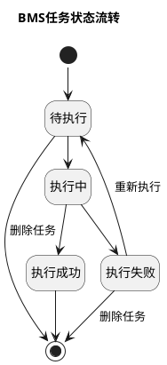

**每种状态允许做什么**

| 任务状态 | 允许操作 | 操作结果 |
| :--- | :--- | :--- |
| 待执行 | 查看详情；`账单计算`任务可删除 | 删除后移出队列并释放本任务占用的处理范围。`费项入池`任务不可删除。 |
| 执行中 | 查看详情、查看进度 | 不得删除或手动重新执行；临时技术异常由系统自动重试。 |
| 执行成功 | 查看详情、查看关联结果 | 不得删除或重新执行；后续业务变化应创建新任务。 |
| 执行失败 | 查看详情、查看错误；`账单生成`和`账单重算`任务可删除或重新执行 | 任务继续占用原处理范围。账单生成或账单重算任务重新执行时沿用原任务编号和快照，先回到`待执行`，再从失败阶段继续；删除后才释放处理范围。费项入池任务由系统内部恢复。 |

删除账单生成或账单重算任务后，任务不再出现在任务列表并释放其占用范围，但系统仍须保留任务编号、删除前状态、删除人和删除时间。重新执行不得改用新配置或扩大原范围；需要采用新配置或新范围时，财务应删除失败任务，再从对应业务入口创建新任务。同一范围存在尚未删除的失败任务时，系统不得接受新的同范围任务。费项入池任务不开放删除和重新执行入口，其失败恢复与范围释放由系统内部处理。

**临时故障由谁处理**

1. 网络波动、服务暂时不可用或资源冲突等技术异常由系统在原任务内自动重试，不要求财务介入。
2. 自动重试期间，页面继续显示`执行中`；系统沿用原任务编号、快照和处理范围，不创建重复任务。重试仍未成功时，任务进入`执行失败`。
3. 系统记录每次重试的时间、失败阶段和原因；两次重试之间的等待时间不计入执行耗时。未按时触发等调度异常只产生内部告警，不增加财务可见的任务状态。
4. 账单配置和汇率配置必须在保存或启用时通过完整性校验。任务执行时仍发现配置不一致，应进入`执行失败`并产生内部告警，不得要求财务在任务页面临时修正后继续原任务。

**失败后重来，会不会重复处理**

| 适用范围 | 失败后的数据处理 | 重新执行的依据 |
| :--- | :--- | :--- |
| `费项入池` | 未完整入池的来源数据恢复为可处理；已经完整入池的记录保持不变。 | 使用原任务执行快照，从失败阶段继续处理原范围。 |
| `账单生成` | 不展示或保留未完成的账单结果；已经成功入池的费项保持不变。 | 使用原任务执行快照、原数据截止点和原账期，从失败阶段继续，不重复入池。 |
| `账单重算` | 目标账单继续使用重算前的有效结果版本，不改变来源行标记。 | 使用原目标账单口径、原任务执行快照和已经确认的重算范围，从失败阶段继续。 |

**按失败位置理解恢复结果**

| 失败位置 | 用户看到什么 | 重新执行从哪里继续 |
| :--- | :--- | :--- |
| 尚未完成规则与范围锁定 | 没有来源数据或账单结果发生变化。 | 重新校验原任务创建时的配置版本、处理范围和数据截止点，再从规则与范围锁定开始。 |
| 来源数据筛选或费项入池期间 | 已完整入池的费项继续有效，未完整入池的记录不作为账单输入。 | 复用完整且与任务执行快照一致的检查点，从最早未完成的阶段继续。 |
| 账单计算期间 | 页面仍显示目标账单上一个有效结果；首次生成失败时不展示半成品账单。 | 保留已经成功完成的费项入池结果，从账单计算阶段继续。 |
| 结果保存或切换期间 | 旧账单结果、旧占用关系和旧配置继续有效，候选结果不可见。 | 重新校验候选结果后整体保存或切换，不得只启用部分结果。 |

重新执行前，系统必须确认检查点完整且仍与原任务执行快照一致。检查点缺失、损坏或对应数据已回退时，应从最早受影响的阶段重新处理，但不得改变原任务引用的业务快照、处理范围和数据截止点；需要改变这些条件时，必须删除失败任务并创建新任务。

**页面与通知同步**

1. 任务状态变化后，页面统计、任务列表、通知卡片和允许操作必须同步更新。
2. 技术处理过程发生变化但用户任务状态未变化时，不重复发送状态通知。

<div id="section-9-3"></div>

### 9.3 第二步：任务按哪套规则执行，又需保存什么？

任务创建时不再复制一份账单配置。系统应引用已经形成且不可修改的业务快照，并把这些引用与本次执行特有条件共同保存为`任务执行快照`。

| 任务类型 | 引用的业务快照 | 任务执行快照保存的本次条件 |
| :--- | :--- | :--- |
| 费项入池 | 当前生效的账单配置快照、来源数据与场景取值规则快照、费项入池规则快照 | 客户、账单类型、配置方案、账期、来源处理范围、数据截止点，以及各来源数据集采用的扫描方式和读取的增量同步水位。 |
| 账单生成 | 保存既有待审核账单引用的原业务快照，以及本次采用的账单配置、来源规则、费项规则、费项结算币种和默认汇率快照；没有既有账单时保存任务创建时生效的对应业务快照 | 是否需要收口、来源处理范围、账单计算范围、数据截止点、已有待审核账单、本次采用的配置及配置切换时点，以及各来源数据集采用的扫描方式和读取的增量同步水位；取得执行权后补记账单生成方式和收口结果。判定为替换生成时，再形成替换批次和待替换账单集合。 |
| 账单重算 | 目标账单引用的账单配置、费项规则、费项结算币种、汇率及当前有效结果版本 | 目标账单、重算原因、重算范围、本次账单特调汇率输入，以及本次纳入的已审核调整或冲正记录。 |

业务快照与任务执行快照必须分别保存并建立引用关系：

1. 账单配置、来源规则、费项规则和汇率快照保存业务规则本身；任务执行快照只保存其快照编号、版本和校验值，不重复保存完整内容。
2. 数据截止点、处理范围、目标账单、替换批次、重算范围和本次操作参数只属于任务执行快照，不应写入账单配置快照。
3. 任务引用的业务快照不得修改或物理删除。任务创建、执行或重新执行时发现快照不存在或校验值不一致，必须阻断任务并记录异常。
4. 任务排队期间出现新配置或新规则时，原任务继续使用任务执行快照引用的版本；需要采用新版本时必须创建新任务。
5. 任务成功后，账单结果版本同时引用本次任务执行快照和实际采用的业务快照，形成“业务规则—本次执行—账单结果”的完整追溯关系。

共同规则如下：

1. 账单生成按<a href="#section-7-2">7.2 配置版本与生效规则</a>锁定本次采用的配置版本，并按<a href="#section-7-3">7.3 账期定义与节奏</a>确定账期范围；新旧配置版本的切换边界、截断账期和费项归属按<a href="#section-9-3-1">9.3.1 配置改了，旧账单怎么办，新费项归谁？</a>执行。执行前发现同范围账单使用不同配置版本，或本次配置会改变原账单范围、分组或费项归属时，不得判定为补充生成；符合替换边界时由系统判定为替换生成，不符合替换边界时任务失败并提示调整配置或处理范围。重算不得用后来生效的配置替换目标账单版本。
2. 应收账单的履约节点和方案范围按<a href="#section-7-4">7.4 应收账单配置</a>及<a href="#section-7-6">7.6 默认方案与分支方案</a>执行；返款账单按<a href="#section-7-5">7.5 返款账单配置</a>执行。
3. 客户、供应链、店铺、会员与业务订单的归属边界按<a href="#section-19-2-1">19.2.1 核心对象关系</a>执行。
4. 费项结算币种读取客户级账单配置已经保存的结果；默认汇率命中按<a href="#section-8-5">8.5 账单生成命中与快照</a>执行，金额换算按<a href="#section-15-3">15.3 汇率与金额换算</a>执行。
5. 客户侧费项、场景取值规则和来源数据集从<a href="#section-9-9-3">9.9.3 系统从哪里知道该取哪些费用？</a>读取。配置变更只影响变更后创建的任务，不自动改变已有任务或账单，也不自动触发重算或替换生成。

任务准备创建时先确定并校验需要引用的业务快照，再保存任务执行快照。只有两者均校验成功，任务才正式创建并进入`待执行`：

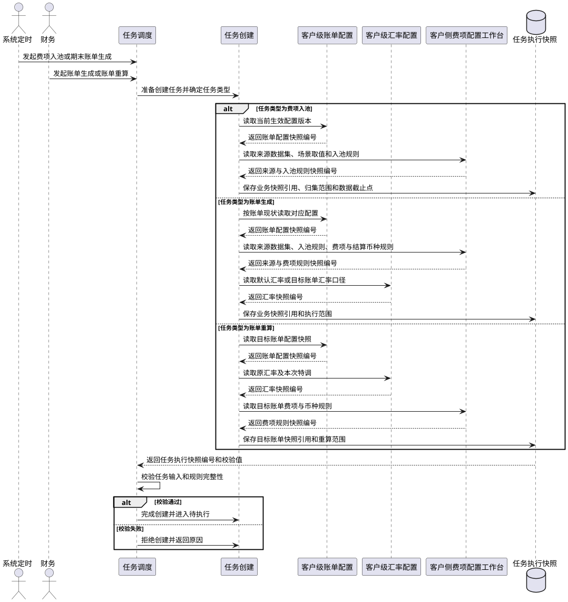

<div id="section-9-3-1"></div>

#### 9.3.1 配置改了，旧账单怎么办，新费项归谁？

客户级账单配置变更后，旧版配置形成的账单和任务可能尚未结束，新版配置也可能已经保存。本节规定新旧配置的切换边界、账期衔接和费项归属，确保同一费项不重复出账，也不因任务执行先后改变归属。

本节只适用于`账单生成`。`账单重算`必须沿用目标账单已经锁定的配置版本、账期和费项范围，不得通过重算切换至新版配置。

客户级账单配置的版本化要求见<a href="#section-7-2">7.2 配置版本与生效规则</a>，完整账期的定义和计算方式见<a href="#section-7-3">7.3 账期定义与节奏</a>。本节仅补充新旧版本交接时的处理规则。

**先看结论：新配置不会改写旧账单**

1. 已按旧版配置生成的账单继续使用原配置快照。新版配置不得自动覆盖、作废、重建或改变已有账单；只有尚未发出的`待审核`账单，才允许财务发起`账单生成`并选择新版配置，由系统判定是否替换生成。
2. 新旧配置以唯一的配置切换时点`T`划分承接范围：`T`之前由旧版配置承接，`T`及之后由新版配置承接。
3. 系统先确定费项归属哪个配置版本，再按该版本校验账期、履约节点、限定情形、费项范围和结算币种。不得先尝试新版，再把不符合新版的费项交给旧版处理。
4. 同一费项在同一业务用途下只能归入一个有效账单。任务先执行、后执行或重新执行，均不得改变已经确定的配置版本和账单归属。

**先看懂三个词：切换时点、完整账期、截断账期**

| 概念 | 定义 |
| :--- | :--- |
| 配置切换时点`T` | 旧版配置停止承接、新版配置开始承接的唯一时间边界。 |
| 完整账期 | 按配置的账期类型、起始日和周期长度形成的标准账期。 |
| 截断账期 | 完整账期被`T`切开后，实际保留的旧版末段或新版首段。 |

**`T`怎样划分新旧配置**

1. 旧版配置的有效范围截止到`T`之前，新版配置的有效范围从`T`开始；恰好发生在`T`的费项按新版配置判断。
2. 系统内部统一按`[开始时间, 结束时间)`处理。页面按日期展示时，旧版截止日期为`T`的前一日，新版开始日期为`T`所在日期。
3. `T`按客户财务业务时区解释，并从生效日期当日`00:00:00`开始。
4. 新版配置只处理`T`及之后首次达到归集条件的费项，不得自动补取`T`之前未被旧版覆盖的历史数据。
5. 仅变更费项结算币种、默认汇率来源或其它金额口径时，虽然订单数据范围不变，仍须按`T`切换版本；旧账单保留旧快照，后续账单使用新版配置。

**新版配置什么时候可以生效**

保存新版配置时，系统先将其置为`待生效`，再按以下步骤确定并校验`T`：

1. 查询该客户、账单类型和配置方案下的旧版有效账单，取得最近的实际账期结束时间。
2. 查询使用旧版配置且处于`待执行`、`执行中`或`执行失败`的任务，取得任务已经锁定的账期和处理范围。
3. 根据旧版占用范围计算最早可切换日期。普通切换时，`T`不得落入旧版有效账单的实际账期，也不得截断已创建任务锁定的账期。
4. 财务选择切换方式并确认`T`。若`T`与旧版账单或任务冲突，系统不得直接启用新版配置，并应展示冲突对象和最早可切换日期。
5. 新版配置可提前保存并指定未来的`T`。到达`T`前，系统继续使用旧版配置；到达`T`后，不得再为普通新增费项创建跨越`T`的旧版账期。

尚未发出的`待审核`账单需要改用新版配置时，允许作为普通切换的唯一例外，与`替换生成`同步处理：

1. 财务先选定一张待替换账单作为入口；系统再按新版配置推演候选范围，并自动识别所有与候选范围发生交集、必须共同替换的未发出待审核账单，形成`待替换账单集合`。任一受影响账单不满足替换条件时，本次任务不得创建。
2. 新版配置在替换成功前保持`待生效`，并只允许与本次替换任务绑定，不得用于其它任务。
3. 系统以待替换账单集合的实际账期和新版配置推演候选账单集合，并校验不存在集合外的有效账单或未结束任务与新范围重叠。
4. 候选新账单集合成功后，系统在一次结果切换中启用新版配置、作废全部待替换账单并启用全部候选新账单；新版配置从确认的`T`开始承接后续费项。
5. 替换失败时，旧版配置和待替换账单继续有效，新版配置保持`待生效`并继续与失败任务绑定。财务重新执行时沿用原绑定关系；删除失败任务时，系统解除绑定、清除候选结果并重新校验`T`，新版配置不得自动生效。

系统提供以下两种切换方式：

| 切换方式 | `T`的确定规则 | 适用情形 |
| :--- | :--- | :--- |
| 下个完整新账期切换 | 将`T`顺延至新版配置的下一个完整账期起点；旧版配置负责承接`T`之前的剩余日期，必要时形成截断账期。 | 默认方式；新版首张账单需要保持完整账期。 |
| 指定日期切换 | 采用财务指定且通过冲突校验的日期作为`T`；旧版末段、新版首段均可能形成截断账期。 | 合同或客户明确要求从指定日期采用新版口径。 |

旧版任务阻断切换时，按任务状态处理：

| 旧版任务状态 | 处理规则 |
| :--- | :--- |
| 待执行 | 财务可删除任务，再由系统重新计算`T`。 |
| 执行中 | 必须等待任务进入`执行成功`或`执行失败`。 |
| 执行失败 | 任务仍占用切换范围时，财务须将其重新执行成功或删除，才能启动新版配置的首个`账单生成`任务。 |

**`T`切到账期中间时怎么办**

新旧账期类型不同，或相同账期类型的起始日、周期长度发生变化时，系统必须以`T`切开账期，不得生成与旧版实际账期重叠的新版完整账期。

1. `T`同时对齐旧版下一账期起点和新版完整账期起点时，新旧账期直接衔接，不形成截断账期。
2. `T`落在旧版完整账期内时，旧版账期截止到`T`之前，形成旧版截断账期。
3. `T`落在新版完整账期内时，新版账期从`T`开始，到该完整账期结束，形成新版截断账期。
4. `T`同时落在新旧完整账期内时，新旧两侧分别形成截断账期；两个实际账期必须在`T`处首尾相接，不得重叠或留空。
5. `月`、`半月`、`周`等日历账期在截断账期后，须从下一个日历边界恢复完整账期；`7自然天`、`10自然天`、`15自然天`等自然天账期须从新版首个实际账期起点连续计算，不要求对齐日历。
6. 返款账单的`半周`截断账期仍须不少于3天。拟定`T`导致任一实际账期少于3天时，系统不得启用新版配置，并应建议最近的可用切换日期。
7. 截断账单必须展示实际账期开始日、实际账期结束日、配置版本和`截断账期`标记，不得以完整月、完整周等名称代替实际范围。

下图统一以旧版`10自然天`、新版`周`为例，展示`T`与新旧账期边界的四种关系：

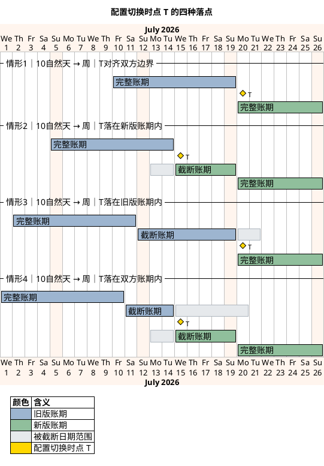

图中的“`T`落在某个账期内”，是指`T`落在按该版本配置推演的完整账期内，不代表该账单已经生成。旧版账单或旧版任务已经锁定包含`T`的实际账期时，该`T`无效，系统必须阻止切换。

| 情形 | 典型配置与`T` | 边界关系 | 实际账期结果 |
| :--- | :--- | :--- | :--- |
| 情形1：新旧账期直接衔接 | 旧版`10自然天`从7月10日起滚动；新版按自然周滚动；`T`为7月20日。 | `T`同时对齐旧版下一账期起点和新版自然周起点。 | 不形成截断账期；新版从7月20日至26日形成完整账期。 |
| 情形2：只截断新版账期 | 旧版`10自然天`从7月5日起滚动；新版按自然周滚动；`T`为7月15日。 | 旧版账期于7月14日结束；`T`落在新版7月13日至19日的完整账期内。 | 新版形成7月15日至19日的截断账期，并从7月20日起恢复完整账期。 |
| 情形3：只截断旧版账期 | 旧版`10自然天`从7月2日起滚动；新版按自然周滚动；`T`为7月20日。 | `T`落在旧版7月12日至21日的完整账期内，同时对齐新版自然周起点。 | 旧版形成7月12日至19日的截断账期；新版从7月20日至26日形成完整账期。 |
| 情形4：同时截断新旧账期 | 旧版`10自然天`从7月1日起滚动；新版按自然周滚动；`T`为7月15日。 | `T`同时落在旧版7月11日至20日和新版7月13日至19日的完整账期内。 | 旧版形成7月11日至14日的截断账期；新版形成7月15日至19日的截断账期，并从7月20日起恢复完整账期。 |

情形1和情形3可由任一切换方式产生，区别在于`T`是否对齐旧版账期边界。情形2和情形4只在`指定日期切换`时产生；若情形4改用`下个完整新账期切换`，`T`将顺延至7月20日，并转为情形3。

无论属于哪种情形，`T`之前只由旧版配置覆盖，`T`及之后只由新版配置覆盖。截断账期不得改变这一分界，也不得补生成与旧版已覆盖日期重叠的完整账期。

**一条费项到底归哪个配置版本**

系统必须按业务时间和首次达到归集条件的时间确定版本，不得按任务创建时间、执行时间或费项同步时间判断：

1. 费项已经进入有效账单时，保持原账单和原配置版本，不再参与新旧版本判断。
2. 尚未出账的费项在`T`之前已满足旧版归集条件时，归属于旧版配置。
3. 尚未出账的费项在`T`之前未满足旧版归集条件，并从`T`起满足新版归集条件时，归属于新版配置。
4. 费项不符合其所在时间范围对应版本的归集条件时，本次不归集；不得改用另一个版本补位。
5. 版本归属确定后，补充生成、任务重新执行和延迟同步均不得改变该归属。财务发起`账单生成`并选择新版配置后，系统如判定为替换生成，应按新版配置重新确定候选新账单范围，并保留原归属结果和替换差异，不得直接改写原账单。

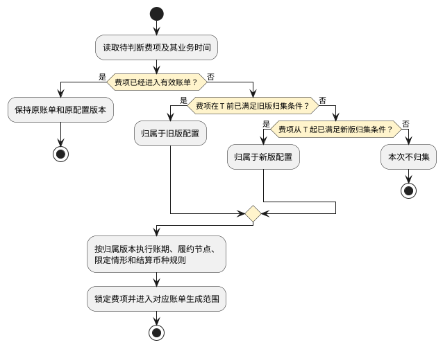

流程图只确定费项归属的配置版本。确定版本后，费项还须通过该版本的账期、履约节点、限定情形、费项范围和防重校验，才能进入具体账单。

**配置范围或归集条件变化时怎样处理**

| 变更类型 | 处理规则 |
| :--- | :--- |
| 扩大国家、仓库、承运商、业务板块或费项范围 | 新增范围仅从`T`起生效，不补取`T`之前未被旧版覆盖的历史费项。 |
| 缩小数据范围 | `T`之前已经满足旧版条件的未出账费项仍归旧版；`T`及之后不符合新版条件的费项不再归集。 |
| 变更履约节点 | 例如旧版使用`出库时间`、新版使用`订单完结`：`T`之前已达到旧版节点的费项归旧版；此前未达到旧版节点、并从`T`起达到新版节点的费项归新版。 |
| 变更结算币种、默认汇率来源或其它金额口径 | 已有账单保持旧快照；费项仍按`T`确定配置版本，并使用归属版本的金额口径。 |

已进入旧版账单的费项即使在`T`之后再次满足新版履约节点或范围条件，也不得重复归集。旧版任务尚未执行，不代表已经满足旧版条件的费项可以转入新版。

**延迟同步的费用怎样处理**

费项在`T`之后才同步进入`BMS费项池`，不代表其归属于新版配置。系统仍按业务时间和首次达到归集条件的时间判断：

1. 费项在`T`之前已经满足旧版归集条件，但在`T`之后才同步入池时，仍归属于旧版配置。
2. 对应旧账单仍处于`待审核`、尚未发出且允许补充时，按旧版配置补充生成到对应旧账单。
3. 对应旧账单已经不能补充时，按<a href="#section-9-8">9.8 第七步：账单生成后又有变化，应该走哪条路？</a>通过调账、冲正或本期、后续账单承接，并保留原配置版本、原账期和延迟归集原因。若由新版账单承接，必须先形成审核通过并进入`BMS费项池`的调整记录；不得把归属于旧版的原始费项直接补入新版账单。
4. 不得仅因费项同步时间晚于`T`，就套用新版履约节点、限定情形或结算币种。

**新旧任务怎样隔离处理范围**

以下规则适用于所有`BMS任务`；涉及创建、补充、替换或重算账单的要求只适用于`账单生成`或`账单重算`任务：

1. 使用旧版配置创建的任务始终使用任务执行快照所引用的旧版账单配置快照；即使执行时间晚于`T`，也不得读取新版配置。
2. 使用新版配置创建的任务不得读取`T`之前已经归属于旧版的费项。
3. 旧版最后一个`账单生成`任务与新版第一个`账单生成`任务涉及相邻范围时，新版任务可以进入`待执行`，但须等待旧版任务`执行成功`后再开始。旧版任务`执行失败`时，新版任务继续等待，直至旧版任务重新执行成功或被删除并重新确定`T`。
4. 旧版任务自动重试或由用户重新执行时，仍使用旧版配置和原处理范围，不得借重新执行跨越`T`。
5. 任务筛选费项时，须先排除已经进入有效账单的费项，再锁定本次处理范围。不同任务同时锁定同一费项时，后发任务不得写入；系统自动重试，重试失败后将任务置为`执行失败`。
6. 补充生成只能接收归属于原配置版本的费项。新版费项不得补入旧版账单，旧版延迟费项也不得直接补入新版账单；替换生成按新版配置重新筛选候选新账单，但不得占用其它有效账单已经占用的费项。

**启用新版配置前，财务需要确认什么**

新版配置从`待生效`转为`生效`前，页面必须展示以下切换预览，并由财务确认：

| 区域 | 展示内容 | 交互与约束 |
| :--- | :--- | :--- |
| 版本信息 | 适用范围对象、账单类型、旧版配置编号、新版配置编号、变更原因 | 财务必须确认本次切换对象无误。 |
| 配置差异 | 账期类型、账期起点、履约节点、限定情形、费项范围、费项结算币种及其它数据范围变化 | 范围扩大、缩小或履约节点变化必须重点提示。 |
| 切换边界 | 切换方式、拟定`T`、系统允许的最早切换日期 | `T`与旧账单或旧任务冲突时不得启用。 |
| 账期预览 | 旧版最后一个实际账期、新版第一个实际账期、新版首个完整账期、截断账期标记 | 必须展示实际开始日和结束日，不得只展示账期类型。 |
| 历史占用 | 已有旧账单、待执行任务、执行中任务、执行失败任务及其范围 | 存在阻断项时，应提供账单或任务跳转入口。 |
| 影响说明 | 配置变更不会自动改写旧账单、未发出待审核账单何时采用`替换生成`、已发出账单不追溯以及延迟费项的承接方式 | 财务确认后才能启用新版配置。 |

**切换后必须保留哪些记录**

系统必须保存独立的配置切换记录，并建立与账单、任务和费项的追溯关系：

1. 配置切换记录至少包括适用范围对象、账单类型、旧版配置编号、新版配置编号、切换方式、`T`、变更原因、操作人和确认时间。
2. 配置切换记录须包括旧版最后一个实际账期、新版第一个实际账期、新版首个完整账期及是否形成截断账期。
3. 每张账单须记录配置版本、实际账期、账期类型、是否为截断账期和对应的配置切换记录。
4. 每个`账单生成`任务必须记录配置版本、`T`、任务执行快照、计划账期、数据截止点和实际处理范围。
5. 每条进入账单的费项必须能够追溯其归属配置版本、原业务时间、首次达到归集条件的时间、归属账单及是否属于延迟归集。
6. 系统必须记录因旧账单占用、旧任务锁定、版本范围不符或防重规则而未进入新版账单的费项及原因，供财务核对切换结果。

<div id="section-9-4"></div>

### 9.4 第三步：哪些来源数据可以由本次任务处理？

| 适用范围 | 本步骤要求 |
| :--- | :--- |
| `费项入池` | 执行本步骤，按任务执行快照引用的业务规则及其处理范围筛选并锁定业务来源数据。 |
| `账单生成` | 执行本步骤，为本次账单生成补齐数据截止点以内尚未入池的来源费用。 |
| `账单重算` | 跳过本步骤；不查询或锁定业务来源数据，不改变来源行的`BMS检阅标记`。 |

因此，本节后续需求适用于`费项入池`和`账单生成`，不适用于`账单重算`。重算直接读取目标账单当前有效明细和定向调整记录。

<div id="section-9-4-1"></div>

#### 9.4.1 本次从哪里开始同步？

`增量同步水位`用于记录某个来源数据集已经成功同步到的位置。水位按`客户 + 账单类型 + 配置方案 + 配置版本 + 来源数据集 + 来源规则版本 + 归集时间口径`分别维护；其中任一项不同，均不得共用水位。

系统对任务涉及的每个来源数据集分别确定扫描方式：

1. `账单重算`不读取来源数据，不适用全量或增量扫描。
2. `费项入池`和`账单生成`存在连续且有效的增量同步水位时，采用增量扫描，主要读取`上次成功水位（不含）至本次数据截止点（含）`之间的数据。
3. 不存在有效水位时，采用全量扫描。全量仅扫描本任务锁定的来源处理范围，不代表扫描整个来源数据库，也不得把`已入池（synced）`记录再次入池。
4. 同一任务包含多个来源数据集时，各数据集可以分别采用全量或增量扫描；系统不得用一个任务级字段概括为全量或增量。
5. 增量扫描除读取水位之后的数据外，还必须补查本任务来源处理范围内仍为`未处理（null）`的历史数据，避免遗漏延迟到达或此前未成功处理的数据。

增量同步水位至少记录来源数据集、增量字段、增量值、同一增量值下最后一条来源记录标识、上次数据截止点、最近成功任务和更新时间。仅使用时间值不足以区分同一时刻的多条记录，必须同时保存稳定的来源记录标识。

以下任一情形发生时，原水位失效，本次对应来源数据集改为全量扫描：

1. 首次同步，尚未形成水位。
2. 水位缺失、损坏，或无法与最近一次成功任务相互校验。
3. 来源数据集、来源规则版本、归集时间口径或增量字段发生变化。
4. 客户、账单类型、配置方案、配置版本或来源处理范围发生变化，导致原水位不能覆盖本次范围。
5. 系统执行数据修复并明确要求重新建立同步基线。

水位推进必须满足以下规则：

1. 来源数据筛选、费项池写入和来源关系保存全部成功后，才能把水位推进到本次已成功处理的位置。
2. 任务失败、事务回滚或仍存在未完成来源行时，不得推进水位；原水位继续有效。
3. 一条任务涉及多个来源数据集时，各数据集独立推进水位；某个数据集失败不得伪造其成功水位。
4. 任务重新执行时沿用原任务读取的起始水位和数据截止点，不得改读当前最新水位。
5. 任务列表及筛选条件不展示全量或增量扫描方式，避免用一个任务级字段概括多个来源数据集。任务详情按来源数据集展示`来源数据集`、`扫描方式`、`扫描范围`、`上次成功水位`、`本次数据截止点`、`拉取数量`、`命中数量`、`扫描结果`和`失败原因`；账单重算显示`不适用`。水位的内部主键等实现信息不向财务展示。

`增量同步水位`与`阶段检查点`用途不同：前者决定下一条新任务从哪里开始同步，后者仅供当前任务失败后从已完成阶段继续执行，两者不得互相替代。

任务锁定规则后，系统先按<a href="#section-9-3-1">9.3.1 配置改了，旧账单怎么办，新费项归谁？</a>确定费项归属配置版本，再按该版本的账期、履约节点、限定情形和新增时间筛选本次可处理的来源数据。各类费项对应的来源表、金额字段、业务类型和首次产生时机见<a href="#section-19-2-3">19.2.3 客户侧费项的 OIS 数据源</a>。`BMS检阅标记`只表示来源数据是否已被BMS处理，不表示账单、支付或核销状态。

| 标记值 | 业务含义 | 进入条件 | 后续处理 |
| :--- | :--- | :--- | :--- |
| 未处理（`null`） | 尚未被BMS处理 | 新来源数据进入本次处理范围 | 本次任务选中后转为`处理中`。 |
| 处理中（`locked`） | 已被当前任务锁定 | 任务开始处理该来源行 | 处理期间禁止修改、物理删除或被其它任务重复采集。 |
| 已入池（`synced`） | 已成功同步 | 费项池写入及关联结果完成 | 来源行和已入池原始金额冻结，后续任务不再处理。 |


状态图规则：

1. 任务选中并锁定来源行后，来源行从`未处理（null）`进入`处理中（locked）`；处于该状态时禁止修改或物理删除。
2. 本轮费项写入和来源关系均保存成功后，来源行从`处理中（locked）`进入`已入池（synced）`。进入`已入池（synced）`后不得补写、修改或重新采集；后续新费用必须形成新来源记录，并从`未处理（null）`重新进入同步流程。
3. 任务进入`执行失败`且该来源行未完整入池时，来源行从`处理中（locked）`回到`未处理（null）`；已经完整入池的来源行不得回退。

筛选和锁定的补充规则如下：

1. 本次可处理的范围仅包括`未处理（null）`和已被本任务锁定的`处理中（locked）`；不再处理`已入池（synced）`行。
2. 订单类来源按本次任务的账期、履约节点和限定情形筛选。`附加费用报表导入`形成的附加费挂靠真实业务订单下的尾程包裹，并按该包裹所属的真实业务订单执行相同筛选；`记账单导入`形成的附加费挂靠虚拟业务订单，不校验订单履约节点，按`ofp_ofdb1.sale_order_additional_matter.create_time`筛选。两类入口的来源事实见<a href="#section-19-2-3-5">19.2.3.5 同一张附加事项表，为什么要区分两种导入？</a>。
3. 同一来源行只能被一个未结束任务锁定；锁定冲突时，后发任务不得继续处理该行。
4. 任务自动重试期间，来源行保持`处理中（locked）`并继续归属原任务；任务进入`执行失败`时，未完整入池的写入结果必须撤回，来源行恢复为`未处理（null）`。已经完整入池并建立来源关系的记录保持`已入池（synced）`，不得回退后重复采集。

<div id="section-9-5"></div>

### 9.5 第四步：来源费用怎样变成BMS费项？

| 适用范围 | 本步骤要求 |
| :--- | :--- |
| `费项入池` | 执行本步骤，把第三步锁定的来源数据转换为统一费项池记录，完成后结束任务。 |
| `账单生成` | 执行本步骤，把第三步锁定的来源数据写入费项池，再继续计算账单。 |
| `账单重算` | 跳过本步骤；只读取目标账单已有明细，不新增、覆盖或重采普通来源费项。 |

因此，本节后续需求适用于`费项入池`和`账单生成`。来源数据锁定后，系统将订单费用、附加费、赔付和财务导入数据整理为统一费项记录并写入`BMS费项池`。`费项入池`任务在本步骤成功后结束；`账单生成`继续执行账单计算。

`账单生成`不得只使用本次新增的费项。来源写入完成后，系统须以任务数据截止点为边界，从费项池累计读取符合账期与配置范围且尚未出账的全部费项。`账单重算`不执行本节，只读取目标账单已有明细及明确归属于目标账单的有效调整记录。普通来源费项尚未入池时，必须通过`费项入池`或`账单生成`处理；不得用重算把普通来源新费项补入账单。

<div id="section-9-5-1"></div>

#### 9.5.1 什么能入池，什么只能展示？

OIS 当前保存客户侧费用的表、字段、关联对象和数据结构见<a href="#section-19-2-3">19.2.3 客户侧费项的 OIS 数据源</a>。系统只能从已配置并启用的来源中识别费项。

1. `BMS费项池`是应收、返款和成本账单全部金额明细的统一来源，但不等于账单本身。
2. 每条费项池记录必须保留费项、挂靠对象、来源记录、来源批次、原始币种、原始金额、费用发生时间和入池时间。
3. 只用于展示和核对的金额必须标记为`非费项`，不得计入应收、应返或核销汇总。
4. 成本费项使用独立的成本费项索引和账单归属规则，不参与本章的应收与返款分流。
5. 财务补录以及已审核的调账、冲正记录必须先形成可追溯的费项池记录，再参与账单计算；不得跳过费项池直接修改账单金额。

来源费用写入费项池时，按 OIS 的实际存储结构处理：

1. 费项横表按“来源记录 + 金额字段”拆分；同一行有多个有效金额字段时，分别形成多条费项池记录。
2. 费项纵表通常一条有效记录形成一条费项池记录。
3. 多行横字段混合结构先区分明细记录，再按该记录中的金额字段拆分；每条费项池记录必须保留原明细记录和原金额字段。

<div id="section-9-5-2"></div>

#### 9.5.2 入池后发现原金额有误，应该怎么办？

1. 费项原始金额一旦成功入池，就成为已使用的历史依据。来源数据不得删除或改写该金额；如需修正，必须通过调账中心新增调整或冲正记录。
2. 费项横表的一行数据成功入池后，整行都被保护：已入池金额不得改写，原为空值或`0`的其它费项字段，也不得在事后补写并重新采集。
3. 费项横表行处于`处理中（locked）`时不得修改任何费项金额或币种。
4. 同步完成后新发生的费用必须形成新的纵表来源行、附加费、索赔记录或调账记录；不得通过补写已同步横表表达后续费用。
5. 金额为`0`或空的来源记录默认不生成有效费项；业务明确要求保留占位时，必须标记占位原因且不计入金额汇总。

<div id="section-9-5-3"></div>

#### 9.5.3 系统从哪里取金额和币种？

每条来源规则都必须回答六个问题：使用哪个来源数据集、从哪张表取值、哪个字段是金额、哪个字段是币种、需要过滤什么数据、如何避免重复。系统只能使用已启用的数据集和场景取值规则，不得在任务执行时临时换表或换金额字段。

页面按两个层级选择来源：

1. `来源数据集`确定本次可以共同查询的主表、关联表、基础过滤条件和可用时间字段。
2. `取值表`确定实际保存金额和币种的表，可以不同于来源数据集的主表。例如，业务订单身份和出库时间来自订单主表，派送费金额可以来自订单扩展表。

同一张表存在名称相同或相近的金额字段时，启用中的场景取值规则必须明确指定唯一的金额字段和币种字段；任务不得根据字段名称自行猜测。

订单费项报表导入采用独立的原始币种口径，优先于下方店铺币种规则：

1. 每个作为 BMS 费项或账单计算输入的导入金额都必须在导入时确定原始币种，不得只保存无币种金额。`实收回款`和`回款汇率`属于回款来源事实，不按普通费项金额处理。
2. 普通费项中的`仓租费`和`航空费`原始币种固定为人民币；其它普通费项金额的原始币种均为来源订单的目的国币种，不得改用店铺币种。
3. 目的国币种优先读取来源订单的`ofp_ofdb1.sale_order_header.dest_country_currency_code`；该字段为空时，再按运抵国匹配运抵国配置。仍无法确定时，该行不得导入或进入`BMS费项池`，并须反馈币种缺失原因。
4. `回款汇率`不是金额字段，表示订单目的国币种到回款结算币种的汇率；当前由订单费用报表导入。具体字段口径见<a href="#section-19-2-3-4">19.2.3.4 OIS 有哪些客户侧费用字段？</a>。
5. 订单费用报表不再导入`实付返款`和`返款汇率`。返款汇率由返款账单根据货款原始币种和货款结算币种取得并锁定，不从订单费用报表读取。

以下 OIS 来源采用目的国币种作为 BMS 记录的原始币种，该口径同样优先于店铺币种规则：

1. `ofp_ofdb1.sale_order_additional_matter.payment_method`表示`到付`的全部附加费。
2. `ofp_ofdb1.sale_order_header.collection_price`、`collection_premium_amount`、`cod_price`和`cod_amount`。
3. 以上来源即使同时存在其它币种字段，BMS 原始币种仍按目的国币种记录；来源中的其它币种值只作为来源事实保留，不得替代该口径。
4. 此处只规定原始币种，不改变应收归集范围。到付附加费不得因采用目的国币种而进入应收账单；附加费仍只有`收取方式`为`账期支付`时才进入应收归集，详见<a href="#section-9-5-4">9.5.4 费用达到什么条件才能入池？</a>。

除上述专用口径外，其它费项优先采用录入币种作为 BMS 原始币种；录入币种为空时，使用来源订单所属店铺的店铺币种兜底。店铺币种通常配置为人民币，但系统必须读取实际店铺配置，不得将人民币硬编码为固定值。录入币种和店铺币种均无法确定时，该费项不得进入`BMS费项池`，并记录币种缺失原因。

订单费项报表和上述指定目的国币种的来源不适用本兜底规则，始终按各自专用口径记录 BMS 原始币种。

系统按来源规则选定的时间字段取得实际时间，并把该值写为费项池记录的`费用发生时间`；费项实际写入费项池的时刻记为`入池时间`。账期归属按费用发生时间判断，不按入池时间判断。

页面显示口径如下：

| 配置项 | 页面显示 | 规则 |
| :--- | :--- | :--- |
| 来源位置 | 来源数据集、取值表 | 先识别公共数据集，再识别实际取值表。 |
| 时间口径 | 跟随账单配置或来源创建时间 | 订单类费项跟随履约节点；`附加费用报表导入`形成的附加费跟随尾程包裹所属真实业务订单的履约节点；`记账单导入`形成的附加费使用`ofp_ofdb1.sale_order_additional_matter.create_time`。各来源使用的非金额字段见<a href="#section-19-2-3-3">19.2.3.3 BMS 归集费项时使用哪些非金额字段？</a>。 |
| 金额口径 | 金额字段、币种字段 | 多币种来源必须具备币种字段或可追溯的默认币种。 |
| 非费项 | 非费项标记 | 只展示和核对，不进入账单核销汇总。 |

<div id="section-9-5-4"></div>

#### 9.5.4 费用达到什么条件才能入池？

费用进入`BMS费项池`必须同时满足账单配置和来源金额稳定条件：

1. 订单类费项的履约节点按<a href="#section-7-4">7.4 应收账单配置</a>执行；`订单完结`的判断按<a href="#section-19-2-5">19.2.5 广义签收</a>执行。
2. 费项金额的稳定边界按<a href="#section-19-2-4">19.2.4 费项重算窗口</a>执行。尚处于重算窗口内的横表来源不得入池。
3. 返款模式和账期范围按<a href="#section-7-5">7.5 返款账单配置</a>执行；附加费按本节下方的导入入口、挂靠对象和履约节点规则判断能否入池。
4. 同一来源行、费项和有效版本不得因任务重复触发而重复入池。

写入费项池时还必须满足以下规则：

1. 横表、纵表和多行横字段混合结构按<a href="#section-9-5-1">9.5.1 什么能入池，什么只能展示？</a>拆分为独立费项池记录。
2. 费项池写入、来源关联和必要汇总全部成功后，来源行才能从`处理中（locked）`更新为`已入池（synced）`。
3. 任一关键步骤发生异常时，任务不得标记为`执行成功`；来源行按<a href="#section-9-4">9.4 第三步：哪些来源数据可以由本次任务处理？</a>规定的自动重试、`执行失败`或已完整入池结果处理。
4. 同一请求即使重复执行，同一来源对象、来源行、费项和有效版本也只能保留一条费项池记录。
5. 后续导入、配置变化或重复任务，不得在无提示、无记录的情况下覆盖已成功入池的历史版本。

附加费用表的两个导入入口还须满足以下规则：

1. 两个入口形成的附加费均须读取`ofp_ofdb1.sale_order_additional_matter.payment_method`。只有`收取方式`为`账期支付`的附加费，才可作为客户应收费项写入`BMS费项池`并参与应收账单计算；其它收取方式不得进入应收归集范围。
2. `附加费用报表导入`必须提供尾程运单号，并据此定位真实业务订单下的尾程包裹。同一尾程运单号对应多个包裹时，系统必须结合业务订单号、尾程子运单号等信息完成消歧；无法唯一定位尾程包裹时，导入不得成功。
3. 系统必须校验尾程包裹所属业务订单满足`ofp_ofdb1.sale_order_header.order_type != "BILL"`、订单有效且属于目标客户，才可把附加费挂靠至该尾程包裹；包裹不存在、所属订单不可执行或客户不一致时，导入不得成功。
4. `附加费用报表导入`形成的费项随尾程包裹所属的真实业务订单参与归集。只有该订单达到应收账单配置要求的`出库`或`订单完结`履约节点，并同时满足限定情形、账期和费项范围等条件后，费项才能进入`BMS费项池`。
5. `记账单导入`产生的费项挂靠`ofp_ofdb1.sale_order_header.order_type = "BILL"`的虚拟业务订单。该类费项是履约节点的例外来源：导入成功后，以`ofp_ofdb1.sale_order_additional_matter.create_time`作为归集时间，不等待虚拟业务订单出库或完结。
6. `记账单导入`形成且`收取方式`为`账期支付`的附加费必须归入客户应收账单，并使用客户应收账单配置的`默认方案`。来源创建时间落入默认方案的实际账期，同时满足客户、店铺、费项范围、金额、币种和防重条件时，由后续系统自动发起的`费项入池`任务或`账单生成`任务写入`BMS费项池`并参与账单计算。
7. 系统必须以`ofp_ofdb1.sale_order_header.order_type = "BILL"`识别虚拟业务订单，不得另设重复表达同一事实的字段，也不得为满足归集条件而伪造虚拟业务订单的出库或完结数据。
8. `记账单导入`形成的附加费进入费项池后，如对应账期尚无账单，则参与首次生成；如对应账单尚未发出且允许补充，则参与补充生成；其它情形按<a href="#section-9-8">9.8 第七步：账单生成后又有变化，应该走哪条路？</a>承接，不得重复形成应收费项。

<div id="section-9-5-5"></div>

#### 9.5.5 怎样防止重复，并查清每笔费用的来源？

1. 每笔费用必须先有可追溯的来源记录，再进入费项池；不得跳过来源记录直接写入账单明细。
2. 同一来源费项只能对应一个当前有效费项池版本；在同一客户、账单类型、账期和配置方案下，同一来源费项只能形成一条有效账单明细。
3. 来源缺少业务板块、运抵国、挂靠对象、归集时间、金额或币种时，不得入池。
4. 无费用订单不得标记为已计费；若业务明确跳过，必须记录跳过原因。

每次入池必须记录数据来源、本次处理范围、处理人、处理时间、结果和失败原因，至少包括来源系统、来源表、来源对象、来源行号、来源批次和导入文件。配置或来源规则发生变化时必须形成新版本，不得覆盖费项池原始记录和来源关系。账单结果及后续资金记录的留痕要求见<a href="#section-9-7-1">9.7.1 每个结果为什么都能追溯？</a>和<a href="#section-9-10">9.10 最后一道防线：操作前预览，操作后留痕</a>。

通过附加费用表导入时，每条记录还必须保留导入入口、导入批次、原始行、挂靠对象和导入人员。系统须为原始导入行生成稳定的来源记录标识，并至少按`导入入口 + 文件校验值 + 工作表 + 原始行号`执行防重校验；重复导入同一文件不得形成第二条有效费项。需要更正已入池金额时，按<a href="#section-9-5-2">9.5.2 入池后发现原金额有误，应该怎么办？</a>处理。

<div id="section-9-5-6"></div>

#### 9.5.6 同一费项进入应收账单，还是返款账单？

费项支付方式按<a href="#section-19-2-2">19.2.2 费项支付方式</a>判断；应收与返款的费项用途、占用优先级、账期关系和展示口径按<a href="#section-11-2-2">11.2.2 返款账单和应收账单的关联性</a>执行。并发和负数处理还须遵守以下规则：

1. 应收和返款的`账单生成`任务可以并行匹配，但写入账单明细前必须一次性确认唯一归属；同一费项不得同时成为两类账单的可核销明细。
2. 正常情况下，返款本金和返款扣减项优先归入返款账单，应收账单只保留关联展示。
3. 返款账单计算后出现负数时，按<a href="#section-7-5">7.5 返款账单配置</a>执行：选择`顺延到下期返款账单`时形成负数承接记录；选择`反向计入应收账单`时，系统生成一条独立的应收调整费项并关联原返款账单，不得把原扣减费项同时归入两类账单。
4. `非费项`只用于展示和核对，不进入任何账单的核销范围。
5. 应收账单计算时，`应收扣减类`和`代收类`费项必须按负数参与汇总，`代付类`费项必须按正数参与汇总；系统不得因来源金额的展示方式改变该财务方向。

<div id="section-9-6"></div>

### 9.6 第五步：如何生成新账单，或重算已有账单？

| 任务类型 | 本步骤要求 |
| :--- | :--- |
| 账单生成 | 以任务数据截止点为边界执行首次生成、补充生成或替换生成；期末任务还须判断是否完成账期收口。 |
| 账单重算 | 读取目标账单当前有效明细和定向调整记录，在锁定范围内重新计算，不扩大普通来源费项范围。 |

任务创建时必须确定任务类型。`账单生成`任务创建时的账单生成方式统一为`待判定`；系统取得执行权并锁定范围后，按以下顺序判定账单生成方式，财务不得直接指定：

1. 目标范围内不存在有效账单：判定为`首次生成`。
2. 已有从未发出的`待审核`账单，且本次采用的配置版本、实际账期、分组键和费项归属均可沿用：判定为`补充生成`。没有新增或更正结果时，以`无需补充`成功结束，不创建空结果版本。
3. 已有从未发出的`待审核`账单，但本次配置会改变账期范围、分组结果或费项归属，导致原账单不能继续沿用：在全部受影响账单均可替换时判定为`替换生成`。
4. 已有账单但既不能补充也不满足替换条件：任务失败，并明确提示阻断账单和原因；系统不得退回首次生成，也不得另建重复账单绕过占用关系。

补充生成必须同时满足：目标账单尚未发出、主状态为`待审核`，本次仍采用目标账单锁定的配置版本、实际账期和分组键，且不会把目标账单已占用费项移动到其它账单。替换生成必须同时满足：全部受影响账单均为从未发出的`待审核`账单，不存在核销、回款、返款等资金事实，没有其它执行中任务占用相同范围，并且系统能够一次性确定完整的待替换账单集合。具体替换过程见<a href="#section-9-6-3">9.6.3 配置变了，怎样安全替换待审核账单？</a>。

`账单生成`完成费项入池后，根据任务数据截止点从费项池累计读取本次可出账费项；判定为替换生成时，还可在不释放原占用关系的前提下读取待替换账单已经占用的费项。`账单重算`跳过来源处理，读取目标账单当前有效明细和本次允许带入的调整记录。确定输入范围后，两种任务共同执行以下计算：

1. 承接应收与返款分流结果，并确认同一来源费项没有被两张账单重复收取。
2. 按任务类型和账单生成方式创建、补充、替换或刷新账单明细，同时保留费项池记录、来源订单和挂靠对象的关联关系。
3. 读取账单配置已经保存的费项结算币种，并按<a href="#section-15-3">15.3 汇率与金额换算</a>和<a href="#section-15-4">15.4 多币种账单汇总</a>形成结算币种金额、财务本位币金额、币种分桶和账单总览。
4. 将本次符合条件的新增、调整、冲正和往期承接记录纳入结果，并校验账单总额与明细汇总一致。
5. 保存新的结果版本；不得覆盖上一个已保存版本。

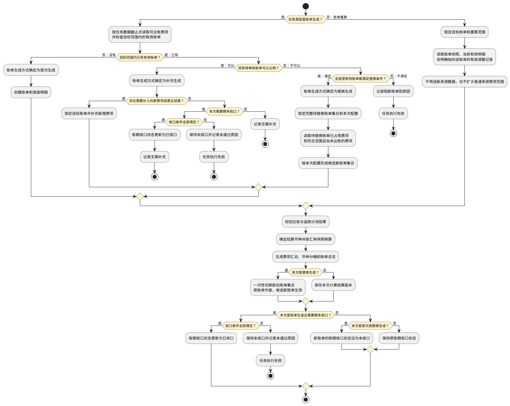

<div id="section-9-6-1"></div>

#### 9.6.1 首次、补充和期末收口有何区别？

**首次生成**

1. 首次生成按任务执行快照引用的业务规则、处理范围和数据截止点筛选费项池记录，创建账单、账单编号、首版明细和首个结果版本。系统按`客户 + 账单类型 + 配置方案 + 配置版本 + 实际账期 + 账单分组键`识别同一张账单，不得重复创建。应收账单的分组键包含业务板块和运抵国，具体拆分规则以<a href="#section-10-5">10.5 自动拆单</a>为准；不适用自动拆单的账单类型使用其对应模块规定的默认分组键。
2. 首次生成不要求账期已经结束。账期结束前手动生成成功时，账单进入`待审核`，账期收口状态为`未收口`；页面必须显示`账期未结束`提示。普通`审核通过`和直接发送不可用，但具有审核权限的财务可以发起<a href="#section-9-7-3">9.7.3 账期还没结束，怎样提前收口并审核？</a>。
3. 账期已经结束时，手动或自动首次生成任务必须标记需要期末收口；通过全部收口条件后同时完成期末收口，未通过时按本节期末收口失败规则处理。

**补充生成**

1. 目标账期已经存在从未发出的有效待审核账单且继续使用原配置时，账单生成方式确定为`补充生成`。补充生成沿用目标账单锁定的配置版本，只查找原账单范围内尚未归入有效账单的新费项或更正费项。
2. 补充生成保留原账单编号，在同一账单下保存新的结果版本，并保留补充前版本、本次新增明细和金额变化。
3. 补充生成不得把当前最新配置造成的范围变化混入原账单；需要改用新版配置时必须执行<a href="#section-9-6-3">9.6.3 配置变了，怎样安全替换待审核账单？</a>。
4. 账期结束前允许多次补充生成。账期结束后的自动或手动期末任务仍须重新检查数据完整性，不得仅因已有账单而跳过。

**提前生成后又有新费用，怎么办**

1. 新增来源记录或尚未入池的来源记录发生变化时，本次任务先按最新有效数据完成费项入池，再执行补充生成。
2. 原费用已经成功进入`BMS费项池`时，不得通过重新读取来源数据覆盖原始费项；必须形成可追溯的更正、调整或冲正费项，再由补充生成或重算纳入账单。
3. 变化只影响非金额展示字段时，只刷新展示关系，不创建执行账单生成的BMS任务，不改变账单结果版本。
4. 已收口但尚未发出的账单出现会影响范围或金额的数据变化时，系统应在相关费项入池或账单生成任务创建成功时，立即把账期收口状态改为`未收口`并禁用普通审核和发送，不得等到任务开始执行。任务删除或结束后，系统重新执行收口校验；全部条件再次满足时恢复为`已收口`。财务确需缩短实际账期时，必须等同范围任务全部结束后再执行提前收口。已经发出的账单不得重新打开收口状态，晚到费用按调账、冲正或后续账单规则处理。

**期末收口**

1. 期末收口既不是任务类型，也不是账单生成方式。系统期末任务由定时机制创建，任务类型为`账单生成`；财务在账期结束后主动处理时也创建`账单生成`任务。系统按已有账单和配置影响判定首次生成、补充生成或替换生成，并在执行后记录`已收口`或`未收口`。
2. 账期收口状态只有同时满足以下条件时才能更新为`已收口`：
   - 数据截止点已经覆盖账期结束时间；
   - 截止点以内符合来源规则、账期、履约节点和限定情形的来源记录均已形成完整入池结果，不存在仍为`未处理（null）`或`处理中（locked）`的应处理记录；
   - 除本次收口任务外，同一来源处理范围和账单计算范围内不存在`待执行`、`执行中`或尚未删除的`执行失败`任务；
   - 账期内符合配置的费项均已归入对应账单，或已经记录不归入本账单的明确原因；
   - 账单明细汇总、币种分桶和账单总额一致。
3. 标记为期末收口的任务未通过任一收口条件时，账单保持`未收口`，任务进入`执行失败`并列出未通过条件；财务补齐数据或处理阻断任务后，重新执行原任务。
4. 自动期末任务发现账单已经`已收口`时，仍须校验数据截止点和完整性；全部满足时记录`无需补充`并成功结束，不创建重复账单或结果版本。
5. 自动任务与手动任务同时命中同一账单范围时，以先进入队列的任务为准。后发任务等待前一任务结束后重新检查，不得重复生成或重复占用费项。

**一个账期怎样从提前生成走到收口**

| 顺序 | 账期内发生的事情 | 账单结果 |
| :--- | :--- | :--- |
| 1 | 财务在账期结束前手动生成账单。 | 没有目标账单时执行首次生成；账单进入`待审核 + 未收口`，可以查看、继续补充，或在确认截断范围后提前收口并审核。 |
| 2 | 账期继续进行，系统每天同步新产生且已满足归集条件的费项。 | 新费项先进入BMS费项池，不直接改写账单。 |
| 3 | 财务再次手动生成，或等待期末任务。 | 已有符合条件的待审核账单时执行补充生成，沿用账单编号和原配置版本，并保存新的结果版本。 |
| 4 | 到达账期结束后的期末任务时点。 | 系统再次完成费项入池、首次或补充生成及完整性校验；全部通过后把账期更新为`已收口`。 |
| 5 | 已收口但尚未发出的账单又出现影响金额或范围的数据变化。 | 账期先恢复为`未收口`，完成补充生成并再次通过收口校验后才可审核和发送。账单已经发出时不得重新打开收口状态。 |

<div id="section-9-6-2"></div>

#### 9.6.2 重算能改什么，不能改什么？

重算前必须同时锁定`目标账单`和`重算范围`。重算范围支持整张账单、选中订单、选中费项、账单特调汇率、币种分桶或已审核调整记录；未明确选择的范围不得随本次任务变化。

**重算读取什么**

1. 读取目标账单锁定的配置、费项规则、费项结算币种、原汇率快照和当前有效账单明细。
2. 读取财务本次明确提交的账单特调汇率。
3. 读取已经审核生效、已经进入费项池且明确归属于目标账单的补录、调账或冲正记录。
4. 不读取尚未入池的业务来源，不重新执行账期、履约节点和限定情形筛选，也不因当前配置变化扩大账单范围。

**重算可以改变什么**

| 可变结果 | 处理规则 |
| :--- | :--- |
| 选中明细的结算金额 | 按目标账单口径和本次允许使用的汇率重新计算。 |
| 账单特调汇率及换算结果 | 只更新财务本次明确提交的货币对及其受影响金额。 |
| 币种分桶和账单汇总 | 根据重算后的有效明细重新汇总。 |
| 未结余额 | 在保留既有核销、收款、回款和返款事实的前提下重新计算。 |
| 调整或冲正后的净额 | 仅纳入已经审核生效并明确归属于目标账单的记录。 |

**重算不能改变什么**

1. 不得改变账单编号、客户、账单类型、账期、配置方案和原始账单配置版本。
2. 不得修改 `BMS费项池`中的原始金额、原始币种、来源对象或来源关系。
3. 不得把普通来源新费项直接作为重算输入；待审核账单的普通来源遗漏应走补充生成，账单已经发出时由调账或后续账单承接。
4. 不得物理删除原账单明细。错误明细必须通过失效标记、调整或冲正形成可追溯结果。
5. 不得清零、覆盖或倒推修改既有通知、审核、核销、收款、回款和返款记录。
6. 不得把重算后的最终应收或应返金额降到已核销金额以下，也不得直接形成无法结算的超收或超返结果。返款重算出现负数时，优先按<a href="#section-7-5">7.5 返款账单配置</a>选择的方式顺延到下期返款账单，或生成独立的应收调整费项，使当前返款账单不以负数结算；处理后仍与既有核销、回款或返款事实冲突时，再转入<a href="#section-16">16. 调账中心</a>。合法的红冲或负向调账明细不受该限制。

重算成功后，系统在原账单下生成新的结果版本，记录重算范围、触发原因、重算前后金额及所用快照；原结果版本继续保留。重算失败时，原账单仍使用重算前的有效结果，不得暴露半成品金额。

**用三个场景理解重算范围**

| 场景 | 财务选择的范围 | 系统实际处理 |
| :--- | :--- | :--- |
| 修正个别费项金额 | 选中一条或多条账单明细 | 只重新计算选中明细；未选中明细沿用当前有效结果，随后基于全部有效明细重新汇总币种分桶、账单总额和未结余额。 |
| 修改某个货币对的账单特调汇率 | 选中该货币对 | 重新计算目标账单内所有使用该货币对的有效明细，不得只更新部分明细而使同一账单同时使用新旧两套汇率。 |
| 同时选择订单、费项和货币对 | 提交多个重算条件 | 先取各条件命中明细的并集；货币对命中范围大于手工勾选范围时，以完整货币对范围为准。页面必须在提交前展示最终受影响明细和预计金额变化。 |

<div id="section-9-6-3"></div>

#### 9.6.3 配置变了，怎样安全替换待审核账单？

客户级账单配置变更不会自动改变已有账单。财务确认尚未发出的待审核账单需要采用新版配置时，必须从其中一张账单发起`账单生成`并选择新版配置；系统确认原账单不能沿用且满足替换条件后，才把账单生成方式判定为`替换生成`。不得直接覆盖原账单快照，也不得先作废原账单后再单独生成。

系统必须先按新版配置推演账期和自动拆单结果，再找出所有受影响的旧账单，形成一个`替换批次`。一个替换批次可以包含一张或多张待替换账单，也可以形成一张或多张候选新账单；新旧账单数量不必相同，但必须作为一个整体校验和切换。

**为什么替换不一定是一张旧账单对应一张新账单**

| 变化结果 | 典型配置变化 | 替换关系 |
| :--- | :--- | :--- |
| 账单边界不变，只改变账单内容 | 费项结算币种、限定情形或适用费项发生变化，但实际账期和拆单结果不变。 | 一张旧账单形成一张候选新账单。 |
| 一张旧账单被拆开 | 新版配置新增业务板块、运抵国等拆单维度，或原来合并的范围改由不同方案承接。 | 一张旧账单形成多张候选新账单。 |
| 多张旧账单被合并 | 新版账期或拆单口径使多张从未发出的待审核账单落入同一新账期和同一账单分组。 | 多张旧账单形成一张候选新账单。 |
| 边界和拆单结果同时变化 | 账期切换与自动拆单规则同时变化。 | 多张旧账单可形成多张候选新账单。 |

只要替换批次中的任一旧账单已经发出、已发生资金事实或不满足替换条件，整个替换批次都不得执行，不能只替换其中一部分。

**允许替换的条件**

1. 待替换账单集合中的每张账单主状态均为`待审核`。
2. 每张待替换账单的`账单发出时间`均为空，且尚未通过邮件、客户端或其它方式向客户开放查看、下载或送达。
3. 每张待替换账单均不存在核销、收款、回款、返款等资金事实。
4. 待替换范围内不存在审核、发送、补充生成、其它替换生成或重算任务，也不存在尚未删除的同范围失败任务。
5. 新版配置已经通过完整性校验，且处于`生效`状态，或处于仅与本次替换绑定的`待生效`状态；财务必须明确选择本次使用的配置版本。
6. 新版配置已经生效时，候选新账单集合的实际账期必须完全落在新版配置的有效范围内；新版配置仍待生效时，必须按待替换账单集合确定`T`并与本次替换同步生效。
7. 候选新账单必须按对应账单模块的拆单规则生成；候选范围不得与替换批次以外的有效账单、待执行任务、执行中任务或尚未删除的失败任务重叠。

邮件`通知失败`或`未配置邮箱`不能单独证明账单尚未发出。只要账单已经在客户端发布或通过其它方式送达，系统就必须记录`账单发出时间`并禁止替换生成。待结清账单因客户异议折返`待审核`后，账单发出时间仍然保留，因此同样不得作废或替换生成。

**财务确认什么**

执行前，页面必须展示并确认以下差异：

| 对比区域 | 展示内容 | 交互与约束 |
| :--- | :--- | :--- |
| 账单身份 | 客户、账单类型、待替换账单清单、候选新账单清单、原配置版本、新配置版本 | 客户或账单类型不一致时不得提交；系统必须明确展示一对一、一对多、多对一或多对多关系。 |
| 账期变化 | 原实际账期集合、新实际账期集合、账期类型、切换时点和截断账期 | 新实际账期不得与替换批次以外的有效账单重叠。 |
| 范围变化 | 履约节点、限定情形、默认与分支方案、费项范围 | 分别展示新增、移出和仍保留的费项范围。 |
| 金额变化 | 费项结算币种、汇率口径、分币种金额和账单总额 | 按币种展示预计差异，不得只展示本位币净差额。 |
| 操作确认 | 替换原因、影响说明 | 替换原因必填，财务确认后创建任务。 |

**怎样避免原账单先失效**

1. 替换任务创建成功后，系统立即锁定待替换账单集合、原费项占用范围和新版配置。锁定解除前，待替换账单不得审核、发送、补充生成、再次替换、重算或核销；页面必须展示`替换处理中`或`替换待处理`提示。
2. 系统按新版配置生成候选新账单集合。候选账单在任务成功前不得对外可见、不得参与审核、发送或核销；与本次替换绑定的待生效配置也不得被其它任务使用。
3. 候选新账单允许在计算时引用待替换账单占用的费项，但不得提前释放、转移或修改原占用关系。
4. 候选新账单完整生成并通过金额、费项去向、重复占用、自动拆单和账期重叠校验后，系统在一次结果切换中启用待生效的新配置、将全部待替换账单转为`已作废`、释放原占用关系，并使全部候选新账单成为有效账单。新版配置原本已生效时，只切换新旧账单集合。
5. 替换生成失败时，待替换账单继续保持有效的`待审核`状态、原收口状态和原结果版本；候选结果不得展示或占用费项。替换锁和待生效配置绑定继续保留，财务只能重新执行或删除失败任务。
6. 财务删除失败的替换任务后，系统删除候选结果、解除待替换账单和费项范围锁、解除待生效配置绑定并重新校验`T`；原账单恢复替换前允许的操作，新版配置不得自动生效。
7. 新账单必须使用新的账单编号，原账单编号不得复用。系统使用独立的`账单替换关系`记录替换批次、每张旧账单和每张新账单的对应关系，不在账单主表中使用方向含糊的单值`替换账单号`或`被替换账单号`表达多账单关系。
8. 新账单的账期收口状态根据实际账期和本次数据完整性重新判断。账期未结束或未通过收口校验时为`未收口`，不得沿用原账单的`已收口`结果。

**被新版配置移出的费项怎么办**

1. 每条原账单有效明细在替换结果中必须有且只有一个明确去向：归入某张候选新账单、转为已审核调整记录，或标记为`配置移出待处理`。存在未确定去向或重复去向时，替换任务不得成功。
2. 仍符合新版配置但因账期或自动拆单结果变化而转移的费项，必须归入对应候选新账单，并保留原账单、替换批次和新账单关系。
3. 不再符合新版配置且无法归入其它候选新账单的费项，释放原账单占用后标记为`配置移出待处理`，记录原账单、原配置、新配置、移出原因和替换任务。该费项不得被同一配置和同一实际范围的后续普通生成任务自动归集。
4. `配置移出待处理`费项只有在后续生效配置明确重新纳入，或财务通过调账中心确认处置后，才能重新参与账单计算；系统不得因其处于未占用状态而自动归入其它账期。

`已作废`是账单的最终状态。已作废账单只允许查询、导出内部留档和审计追溯，不得重新启用、审核、发送、核销、重算或再次替换；其账单明细、配置快照、金额结果、任务记录和作废原因不得删除。

<div id="section-9-6-4"></div>

#### 9.6.4 调账、冲正和费用重整如何参与计算？

调账、冲正、费用重整、核销记录冲正及其审核和归属规则统一见<a href="#section-16">16. 调账中心</a>。

1. `账单生成`：生成前已经审核生效、已进入 `BMS费项池`且符合本期配置范围的调整记录，可以与普通来源费项一起进入本次账单结果。
2. `账单重算`：只读取已经审核生效、已进入 `BMS费项池`且明确指向目标账单的调整记录，不得把未指定目标账单的调整记录自动纳入。
3. `共同规则`：任何任务都不得直接修改原费用、原核销记录或往期账单快照。

<div id="section-9-7"></div>

### 9.7 第六步：计算完成后，系统保存什么，账单变成什么状态？

`账单生成`或`账单重算`任务成功后，系统先保存本次结果和计算依据，再按任务类型和账单生成方式处理账单主状态与账期收口状态，并记录任务的`收口结果`。`结果快照`回答“这个金额是怎样算出来的”，主状态决定账单处于哪个财务环节，账期收口状态决定账单能否按常规路径审核和发出；未收口账单只有在完成提前收口后才能推进审核。

| 处理方式 | 结果保存 | 主状态处理 | 账期收口状态处理 |
| :--- | :--- | :--- | :--- |
| 首次生成 | 保存首个结果版本。 | 新账单进入`待审核`。 | 账期未结束或未通过收口校验时为`未收口`；期末生成通过完整性校验时为`已收口`。 |
| 补充生成 | 在同一账单下保存新结果版本并保留补充前版本。 | 保持`待审核`。 | 影响已收口结果的数据变化先置为`未收口`；通过期末收口校验后恢复`已收口`。 |
| 替换生成 | 保存候选新账单集合的首个结果版本、替换批次和新旧差异。 | 成功后原账单集合进入`已作废`，候选新账单集合进入`待审核`；失败时原账单集合不变。 | 每张新账单分别重新判断，不继承原账单收口状态。 |
| 账单重算 | 在原账单下保存新的重算结果版本，并保留重算前版本。 | 不因重算成功自动推进主状态；待审核账单保持`待审核`。 | 不涉及来源范围变化时保持原收口状态。 |

生成和重算都必须采用完整成功后再切换有效结果的方式。任务自动重试期间或进入`执行失败`时，页面、导出、通知和核销继续读取上一个有效结果版本。

<div id="section-9-7-1"></div>

#### 9.7.1 每个结果为什么都能追溯？

每次生成或重算成功后，系统必须保存以下结果：

1. 任务、账期、配置方案和限定范围快照。
2. 客户侧费项、来源数据集、场景取值规则和费项结算币种快照。
3. 费项池记录、账单明细、来源订单和挂靠对象关系。
4. 汇率来源、换算方向、锁定汇率、币种分桶和账单金额快照。
5. 调账、冲正、核销、回款和返款的关联结果。
6. 本次任务类型、账单生成方式、收口结果、上一结果版本、本次结果版本、计算前后金额和差异明细。

首次生成形成账单首个结果版本；补充生成和账单重算形成同一账单的后续结果版本；替换生成为候选新账单集合分别形成首个结果版本。每个后续版本必须关联上一版本并标明产生方式，每个替换生成结果必须通过替换批次建立新旧账单集合之间的关系。

<div id="section-9-7-2"></div>

#### 9.7.2 账单处于不同状态时，还能做什么？

任务状态与账单状态相互独立。任务`执行成功`只表示本次处理完成，不代表账单已经审核、发出或结清；任务`执行失败`也不得回退账单状态。账单主状态、账期收口状态和账单发出时间共同决定后续允许的操作，具体处理路径见<a href="#section-9-8-2">9.8.2 再确认：当前账单状态允许怎么处理？</a>。

普通审核只对`待审核 + 已收口`账单开放。`待审核 + 未收口`账单必须按<a href="#section-9-7-3">9.7.3 账期还没结束，怎样提前收口并审核？</a>先完成截断和收口，才能审核和发出。账单一旦发出，既有通知和资金事实必须保留；已结清账单不支持反核销，核销错误须通过<a href="#section-16">16. 调账中心</a>新增核销记录冲正。

<div id="section-9-7-3"></div>

#### 9.7.3 账期还没结束，怎样提前收口并审核？

`提前收口并审核`适用于财务需要在原账期结束前，先把当前已经形成的账单发给客户对账的场景。它不是直接审核未收口账单，而是把原完整账期截短为一个实际账期，完成该范围的收口校验后再审核。

**什么情况下允许提前收口**

1. 账单主状态必须为`待审核`，账期收口状态为`未收口`，且账单从未通过邮件、客户端或其它方式向客户发出。
2. 当前时间必须早于原账期结束时点。原账期已经结束但因数据不完整、任务失败或配置问题仍为`未收口`时，不得使用提前收口绕过问题，必须补齐数据并完成常规期末收口。
3. 账单不得存在核销、收款、回款、返款等资金事实；冲正记录必须全部审核通过。
4. 同一来源处理范围和账单计算范围内不得存在`待执行`、`执行中`或尚未删除的`执行失败`任务，也不得存在其它正在进行的审核、补充生成、替换生成或重算操作。
5. 截断点固定为账单当前有效结果版本的数据截止点，不允许在审核弹窗中手工改写；系统必须通过截止点以内的来源完整性、费项归属、币种分桶和金额一致性校验。财务需要采用其它数据截止点时，必须先完成对应账单生成任务并形成新的有效结果版本，再重新发起提前收口。
6. 截断后的实际账期必须与同一配置范围内的其它有效账单按数据截止点首尾连续，不得重叠或留下无人承接的时间范围。配置版本恰好在剩余范围内切换时，按<a href="#section-9-3-1">9.3.1 配置改了，旧账单怎么办，新费项归谁？</a>确定后续归属。
7. 返款账单采用`半周`账期时，截断后的单个实际账期仍不得少于3天。

**财务需要确认什么**

| 确认项 | 页面展示 | 交互与约束 |
| :--- | :--- | :--- |
| 原账期 | 原账期类型、原账期起始日、原账期结束日 | 只读展示，不因提前收口改写客户级账单配置。 |
| 截断结果 | 截断后的实际账期、数据截止点、剩余待出账范围 | 数据截止点读取当前有效结果版本并保持只读；实际账期结束日取数据截止点所在日期，系统内部仍按精确到秒的数据截止点划分新旧范围。 |
| 账单结果 | 截断范围内的费项数量、币种分桶、账单金额、未处理记录和未完成任务 | 存在未处理记录、金额不一致或范围冲突时不得提交。 |
| 后续归属 | 截断点之后的剩余账期、预计期末生成时间、适用配置版本 | 必须明确告知剩余范围将形成后续账单，不会继续补入本账单。 |
| 操作确认 | 提前收口原因 | 原因必填；按钮命名为`提前收口并审核`，不得继续使用含义不清的普通`审核通过`。 |

**确认后系统怎样处理**

1. 系统必须在同一次结果提交中完成截断范围校验、更新实际账期结束日、写入`截断账期`标记、把账期收口状态更新为`已收口`、记录审核结果并将账单推进至`待结清`。任一步失败时全部回滚，账单继续保持`待审核 + 未收口`。
2. 系统不得产生`待结清 + 未收口`的中间状态。提前收口成功后，账单配置快照、汇率快照、当前有效结果版本、实际账期和数据截止点一并锁定，不再通过补充生成追加费项。
3. 原账期中截断点之后的日期形成`剩余待出账范围`。系统日常任务继续把符合条件的费用写入`BMS费项池`；财务再次手动生成或原账期到达期末时，只能针对尚未被有效账单覆盖的剩余范围生成新账单，不得重新生成原完整账期。
4. 账单发出后才到达BMS费项池、但按业务日期本应归入已截断范围的晚到费项，不得回写或补充生成到该账单；应按<a href="#section-9-8-2">9.8.2 再确认：当前账单状态允许怎么处理？</a>由调账、冲正、其它当前账单或后续账单承接，并保留原账期、原账单和晚到原因。
5. 账单对账报表、列表、详情和客户通知必须同时展示`截断账期`标记、实际账期起止日和数据截止点，不得只展示原账期名称，使客户误认为账单覆盖完整周期。
6. 系统必须记录原账期、截断后的实际账期、数据截止点、剩余待出账范围、提前收口原因、审核人、审核时间、审核结果和客户通知结果，供后续对账和审计追溯。

<div id="section-9-7-4"></div>

#### 9.7.4 账单结清后，来源系统还要更新什么？

账单核销完毕并进入`已结清`后，系统将数据源中与该账单关联的全部费项支付状态更新为`已支付`。该动作只更新支付状态，不得改写费项金额、币种、汇率、账单快照或历史核销结果。

<div id="section-9-8"></div>

### 9.8 第七步：账单生成后又有变化，应该走哪条路？

账单生成后出现变化时，先判断`发生了什么变化`，再判断`当前账单状态是否允许处理`。不得用重算补入普通来源新费项，不得用补充生成套用新版配置，也不得删除账单后重新生成。

<div id="section-9-8-1"></div>

#### 9.8.1 先分清：是新费用、配置变化，还是金额重算？

| 发生的变化 | 应选处理方式 | 处理规则 |
| :--- | :--- | :--- |
| 出现尚未同步、尚未入账或已经形成更正记录的新费项，且继续使用原配置 | 补充生成 | 先完成费项入池，再把新费项补入同一张未发出的待审核账单；影响已收口结果时，先改为`未收口`，补充后重新校验收口。 |
| 财务要求未发出的待审核账单改用新版配置 | 替换生成 | 按<a href="#section-9-6-3">9.6.3 配置变了，怎样安全替换待审核账单？</a>生成候选新账单集合；成功后一次性作废原账单集合并启用候选新账单集合。 |
| 已有账单明细、账单特调汇率或已审核调整记录需要重新计算 | 账单重算 | 锁定目标账单和重算范围，只更新允许变化的计算结果，不扩大普通来源费项范围。 |
| 同时出现新费项和已有结果变化 | 先补充生成，再重算 | 先得到包含新增费项的完整结果，再以该结果为基础重算。 |
| 发生调账、冲正、费用重整或核销错误 | 调账中心处理 | 新增可追溯的调整或冲正记录，不得由重算直接修改原费项或原核销记录。 |
| 只变化非金额展示信息 | 刷新展示 | 不创建账单任务，不改变账单金额或结果版本。 |

<div id="section-9-8-2"></div>

#### 9.8.2 再确认：当前账单状态允许怎么处理？

应收账单状态见<a href="#section-10-4">10.4 账单状态机</a>，返款账单状态见<a href="#section-11-4">11.4 返款账单状态机</a>，多币种结清条件见<a href="#section-15-5">15.5 多币种核销</a>。共同处理边界如下：

| 当前账单情况 | 允许处理 | 不允许处理 |
| :--- | :--- | :--- |
| 从未发出的`待审核`账单 | 补充生成、替换生成、重算；发生影响范围或金额的变化后重新校验账期收口；`已收口`时普通审核，`未收口`时可确认提前收口并审核 | 删除账单、覆盖原结果、直接形成`待结清 + 未收口`或跳过影响预览 |
| 已经发出后折返为`待审核` | 在保留既有通知和资金事实的前提下重算、调账或冲正 | 补充生成、替换生成、作废或清空原核销记录 |
| `待结清`账单 | 因客户异议先按对应账单模块规则折返`待审核`，再按允许范围修正 | 直接替换生成、删除账单或覆盖已生效资金事实 |
| `已作废`账单 | 查询、内部留档和审计追溯 | 重新启用、审核、发送、核销、重算或再次替换 |
| `已结清`账单 | 调账中心新增冲正记录，或由其它当前账单、后续账单承接差异 | 重新打开、重算、反核销或修改原记录 |

`晚到费项`是指费用发生时间或原应归属账期早于其进入BMS费项池的时间，导致相关账单生成时尚未取得该费项。晚到费项按相关账单当前阶段处理：

| 相关账单阶段 | 处理方式 | 必须保留的信息 |
| :--- | :--- | :--- |
| 从未发出的`待审核 + 未收口` | 通过补充生成归入原账单。 | 本次入池时间、补充任务和新增结果版本。 |
| 从未发出的`待审核 + 已收口` | 先恢复为`未收口`，完成补充生成和收口校验后再恢复`已收口`。 | 原收口结果、重新打开原因、本次补充任务和新收口结果。 |
| 已经发出后折返为`待审核`，或仍为`待结清` | 不得补充生成；通过调账、冲正或其它当前账单承接差异。 | 原订单号、原账期、原账单号、费用发生时间、归集时间及承接账单。 |
| `已结清` | 不得重新打开或重算；通过调账中心或后续账单承接差异。 | 原订单号、原账期、原账单号、费用发生时间、归集时间、调整记录及承接账单。 |

<div id="section-9-8-3"></div>

#### 9.8.3 返款账单还有哪些额外限制？

返款账单与应收账单的独立性、占用关系和扣减优先级见<a href="#section-11-2-2">11.2.2 返款账单和应收账单的关联性</a>，返款账单状态和`逾期未结清`边界见<a href="#section-11-4">11.4 返款账单状态机</a>。返款重算不得改写应收账单；确需形成应收金额时，只能按返款账单配置生成独立的应收调整费项。

<div id="section-9-9"></div>

### 9.9 财务在哪里操作，页面如何反馈？

财务通过任务页面、账单详情、调账中心和费项配置工作台执行相关操作。各页面只能开放当前账单状态允许且当前用户有权限执行的操作。

<div id="section-9-9-1"></div>

#### 9.9.1 每个页面负责什么？

| 页面入口 | 允许操作 | 状态与权限约束 |
| :--- | :--- | :--- |
| 账单任务列表 | 统一查看BMS任务、错误、快照及结果，并按任务状态执行允许的后续操作 | 不提供费项入池的创建入口；操作入口按<a href="#section-9-2-2">9.2.2 任务现在到哪一步，失败了怎么办？</a>开放。 |
| 客户级账单配置 | 财务发起账单生成，且目标范围尚无有效账单 | 创建前确认配置已生效，且同一配置适用的客户范围、账单类型、实际账期和配置方案不存在未结束的同范围任务。 |
| 应收账单详情 | 账单生成、账单重算、提前收口并审核、汇率重算、补录、调账、冲正、重整、导出 | `待审核 + 未收口`只允许通过提前收口完成审核；账单生成的实际方式由系统判定，替换生成仅适用于尚未发出的待审核账单；已作废和已结清不提供计算入口。 |
| 返款账单详情 | 账单生成、账单重算、提前收口并审核、返款金额修正、扣减项调整、折返审核、导出 | 使用与应收账单相同的收口和替换边界；不得通过返款账单操作改写应收账单。 |
| 调账中心 | 新增、导入、审核、移除调账 / 冲正和费用重整 | 审核通过后才影响账单金额。 |
| 核销记录区 | 查看核销记录、发起核销记录冲正 | 核销错误跳转调账中心新增冲正记录；不得修改或删除原核销记录。 |
| 数据源规则 | 查看数据集、来源表、时间口径和引用范围 | 日常财务以查看为主；变更只影响后续任务。 |

页面操作权限统一遵守<a href="#section-17-1">17.1 权限与职责边界</a>，并补充以下约束：

1. 费项入池只由系统定时触发，任何用户均无权手动创建、删除或重新执行。财务人员只能手动创建`账单生成`和`账单重算`任务；账单生成任务取得执行权后，由系统判断账单生成方式属于首次生成、补充生成还是替换生成。
2. 财务在账单生成中选择新版配置且可能触发替换生成时，创建任务前必须校验高风险操作权限；账单重算和删除失败任务同样只对具有相应高风险操作权限的财务人员开放。
3. 账单审核权限与账单处理权限分别配置；同一人员能否兼任由角色权限明确设定，页面不得临时放开。

<div id="section-9-9-2"></div>

#### 9.9.2 任务列表应该怎样看？

任务页面使用一个统一任务列表，通过`任务类型`筛选`费项入池`、`账单生成`或`账单重算`，不建立父子任务关系。只有账单生成任务展示`账单生成方式`：取得执行权前显示`待判定`，完成判定后显示`首次生成`、`补充生成`或`替换生成`；其它任务类型统一显示`不适用`。

账期内每日预定任务的任务类型为`费项入池`；系统在账期结束后的次日凌晨创建本账期最后一个定时任务时，任务类型为`账单生成`。财务可在自动生成前后手动创建`账单生成`或`账单重算`任务；每次触发仍只创建一条任务。账单生成方式由任务取得执行权后判断。`账单发出时间`只决定账单是否已经对客户生效，不参与任务创建判断。

任务`触发方式`只区分`定时`和`手动`，与任务类型相互独立。系统按计划创建的费项入池和期末账单生成任务记为`定时`；财务创建账单生成、账单重算或处理客户异议时记为`手动`。采用配置、数据截止点和操作原因由任务执行快照记录。

| 区域 | 业务字段 | 业务操作与约束 |
| :--- | :--- | :--- |
| 任务统计区 | 任务总数、待执行任务、执行中任务、执行成功任务、执行失败任务 | 按任务类型、任务状态和筛选条件统计。 |
| 任务筛选区 | 任务编号、任务类型、配置编号、客户名称、客户编码<br>会员编码、店铺、任务状态、账单生成方式、触发方式<br>账期开始日期、账期结束日期 | 组合筛选同时作用于统计区和任务列表；选择的任务类型不适用`账单生成方式`时，该筛选条件自动清空并禁用。 |
| 任务列表区 | 任务编号、任务状态、任务创建时间、执行耗时、任务类型<br>账单生成方式、触发方式、配置编号、配置类型<br>客户名称、客户编码、会员编码、店铺、账期<br>数据截止点 | `费项入池`任务只提供详情；`账单生成`和`账单重算`任务按状态提供详情、重新执行或删除。任务执行阶段、内部收口结果、来源扫描方式和错误摘要不在列表展示。 |
| 任务详情区 | 任务编号、任务状态、任务创建时间、执行耗时、任务类型<br>账单生成方式、触发方式、配置编号、客户、账期<br>数据截止点、原账单清单、新账单清单、结果版本、错误摘要<br>处理建议、任务执行快照、业务快照引用、替换影响、重算范围<br>来源扫描记录、来源查询语句（SQL） | 任务执行阶段、阶段记录和内部收口结果不展示；错误摘要和处理建议仅在任务详情展示。费项入池和账单生成按来源数据集展示扫描方式、扫描范围、上次成功水位、本次数据截止点、拉取数量、命中数量、扫描结果和失败原因；同一任务的不同来源数据集可以采用不同扫描方式。账单重算不读取来源数据，来源扫描记录显示`不适用`。 |

枚举如下：

| 字段 | 枚举值 |
| :--- | :--- |
| 任务状态 | 待执行、执行中、执行成功、执行失败 |
| 任务类型 | 费项入池、账单生成、账单重算 |
| 账单生成方式 | 待判定、首次生成、补充生成、替换生成、不适用 |
| 触发方式 | 定时、手动 |
| 配置类型 | 默认配置、分支配置 |

各任务状态允许的操作和自动重试规则见<a href="#section-9-2-2">9.2.2 任务现在到哪一步，失败了怎么办？</a>。页面只展示财务关注的四种任务状态；用于调度、并发控制和故障恢复的内部标记不得作为筛选项，也不得进入客户报表或通知。

<div id="section-9-9-3"></div>

#### 9.9.3 系统从哪里知道该取哪些费用？

客户侧费项配置工作台统一维护应收和返款账单的三类信息：有哪些费项、哪些场景适用、从哪里取原始金额和原始币种。费项结算币种在客户级账单配置中保存，不属于来源规则；成本中心使用独立的成本费项配置，客户侧费项和成本费项不得互相引用。

<div id="section-9-9-3-1"></div>

##### 9.9.3.1 三类配置分别管什么？

| 配置对象 | 负责定义 | 不负责定义 |
| :--- | :--- | :--- |
| 客户侧费项 | 费项编码、名称、费项类型、场景标签、挂靠对象和适用订单来源 | 来源表、金额字段、币种字段和成本费项 |
| 场景取值规则 | 某个业务场景使用哪个客户侧费项，以及从哪张表的哪些金额、币种字段取值，如何过滤、去重和排序 | 费项基础资料和公共数据集结构 |
| 数据源规则 | 来源系统、主表、关联关系、基础过滤、归集时间、查询窗口和支持节点 | 单个费项的金额字段和适用业务场景 |

三类配置可以放在同一工作台中联动查看，但仍必须分别保存、启用、停用和记录版本，不得因为页面合并而混淆各自职责。

来源数据集和取值表的页面使用方式见<a href="#section-9-5-3">9.5.3 系统从哪里取金额和币种？</a>。

<div id="section-9-9-3-2"></div>

##### 9.9.3.2 费项索引怎样定义费项类型？

`费项类型`由费项索引配置，用于确定费项进入账单后的业务用途、金额方向和核销边界。该类型不是 OIS 来源数据中的既成分类，也不得仅根据来源字段名、操作名称或资金动作的字面含义推导。

| 费项类型 | 定义 | 适用位置 | 默认金额方向 |
| :--- | :--- | :--- | :--- |
| `应收类` | 向客户收取的服务费用 | 应收账单 | 正数 |
| `应收扣减类` | 用于抵减客户应付金额，不属于正向应收费用 | 应收账单 | 负数 |
| `应付类` | 应向供应商、承运商或其他服务方支付或确认的成本费用 | 成本账单 | 正数；应收账单和返款账单不使用该类型 |
| `代收类` | 代客户收取的资金，不等同于服务费收入 | 应收账单或返款账单，按分流规则确定 | 应收账单中记为负数 |
| `代付类` | 代客户垫付或支付的资金，不等同于服务费收入 | 应收账单或返款账单，按分流规则确定 | 应收账单中记为正数 |
| `非费项` | 只用于呈现业务事实、返款核对或资金核对信息，不属于账单核销金额 | 返款账单、回款管理等指定位置 | 不参与应收、应返、未收、未返或核销金额汇总 |

`代收类`和`代付类`进入哪类账单，必须按<a href="#section-9-5-6">9.5.6 同一费项进入应收账单，还是返款账单？</a>判定；同一费项不得同时进入应收账单和返款账单。

<div id="section-9-9-3-3"></div>

##### 9.9.3.3 页面展示什么，可以做什么？

| 页面视角 | 业务字段 | 交互与约束 |
| :--- | :--- | :--- |
| 客户侧费项 | 费项编码、费项名称、费项类型、场景标签、挂靠对象<br>适用订单来源、状态、备注、被引用场景数、配置完整性 | 支持新增、编辑和启停；费项编码启用后不得修改；至少存在一条启用且校验通过的场景取值规则时，费项才可参与账单生成。 |
| 费项详情 | 业务场景、来源数据集、取值表、金额字段、币种字段<br>归集时间、过滤参数、去重规则、优先级、状态 | 支持新增、编辑和启停场景取值规则；同一费项可按不同业务场景绑定不同取值规则。 |
| 按业务场景配置 | 业务场景、费项编码、费项名称、费项类型、来源数据集<br>取值表、金额字段、币种字段、优先级、状态、配置完整性 | 支持筛选、批量启停、调整优先级和完整性检查；修改费项或数据源时跳转至对应页面。 |
| 数据源规则 | 数据集编码、名称、来源系统、来源库、主表、关联关系<br>支持节点、归集时间、查询窗口、分页条数、状态、引用规则数 | 支持新增、编辑和启停；修改或停用前必须展示受影响的场景取值规则。 |

<div id="section-9-9-3-4"></div>

##### 9.9.3.4 哪些配置不能保存或启用？

| 场景取值字段 | 必填性 | 规则 |
| :--- | :--- | :--- |
| 业务场景、客户侧费项、来源数据集、取值表、金额字段、归集时间、优先级、状态 | 必填 | 只能引用启用中的客户侧费项和数据集；取值表及金额字段必须属于所选数据集。 |
| 币种字段 | 条件必填 | 多币种费项必填；固定单币种可使用场景取值规则中的固定原始币种，但必须可追溯。 |
| 过滤参数 | 非必填 | 必须使用系统可识别的条件，不得保存系统无法执行的自由文本。 |
| 去重规则 | 条件必填 | 来源可能出现重复记录时必填。 |

保存或启用前还必须完成以下校验：

1. 订单类费项的归集时间必须跟随客户级账单配置，不得在费项规则中覆盖履约节点；附加费使用新增时间。
2. 附加费来源必须过滤可计费状态，避免无关历史数据进入 `BMS费项池`。
3. 同一业务场景、费项、数据源、取值表、金额字段和过滤参数组合下，只允许一条启用规则。
4. `非费项`只能用于展示和核对，不得计入应收、应返、未收、未返或核销汇总金额。
5. 已被客户级账单配置、BMS任务或历史账单快照引用的规则不得直接删除，只能停用。

<div id="section-9-9-3-5"></div>

##### 9.9.3.5 谁能修改，修改后影响什么？

| 操作 | 权限角色 | 变更要求 |
| :--- | :--- | :--- |
| 新增或编辑客户侧费项、场景取值规则 | 财务主管、产品、实施 | 记录业务场景、费项、来源规则、变更原因及前后值。 |
| 新增或编辑数据源规则 | 管理员、实施、产品 | 修改关联关系、过滤条件或时间口径时，必须填写原因并展示影响范围。 |
| 启停客户侧费项或场景取值规则 | 财务主管、产品、实施 | 停用前展示引用范围；停用不影响历史快照。 |
| 启停数据源规则 | 管理员、实施、产品 | 存在启用规则引用时必须阻断停用；只有先停用或迁移全部引用规则并再次通过完整性校验后，才允许停用数据源规则，二次确认不得绕过该限制。 |

配置变更只影响变更后创建的新任务，不自动触发既有账单重算，也不得回写历史任务和账单快照。

<div id="section-9-10"></div>

### 9.10 最后一道防线：操作前预览，操作后留痕

1. 财务手动发起`账单生成`前，页面必须展示客户、账单类型、实际账期、当前配置版本、数据截止点、当前收口状态和预计处理范围，并允许财务确认本次采用当前配置还是新版配置；不得要求财务预先选择首次生成、补充生成或替换生成。选择新版配置时，还须展示新旧配置、账期、费项和金额差异及可能触发替换生成的提示；发起`账单重算`前须展示目标账单、原配置版本、重算范围、当前有效结果版本和已核销 / 已返款情况。
2. 待结清账单已有部分核销时，折返或重算前必须二次确认，并明确已核销记录不会被覆盖。
3. 已作废和已结清账单不得显示生成、重算或覆盖入口。已经发出的账单不得显示作废或替换生成入口；核销记录错误通过调账中心新增核销记录冲正，收款、回款或返款错误按对应资金纠错流程处理，账单差异由调账、冲正或后续账单承接。
4. 任务失败时，必须展示财务可识别的错误原因和处理建议；任务执行阶段不在页面展示。
5. 同一费项被应收和返款同时命中时，系统按返款扣减优先处理并记录分流结果；按既定规则仍无法确定唯一归属时，任务失败并向财务提示冲突原因。
6. 补录、调账、冲正、重整和批量操作提交前必须预览校验；跨客户、跨账期、跨配置或跨币种错误时不得提交。
7. 所有首次生成、补充生成、替换生成、期末收口、账单重算、调账、冲正、核销记录冲正和折返审核，必须记录操作对象、原因、前值、后值、操作人、时间和结果。
8. 历史快照只用于内部追溯，不作为客户对账报表导出内容；导出文件只输出当前账单的有效对账结果。

应收账单和返款账单还必须分别遵守各自模块规定的账期、金额、审核、核销和对账规则。

<div id="section-10"></div>

## 10. 应收账单模块

[🔗原型链接](http://localhost:4181/#/billing/receivable-bills)

<div id="section-10-1"></div>

### 10.1 需求背景

集运单自创建后到履约结束涉及的大量后付应收费项，常跨越多个账期录入，财务需要按账期把费项挂靠到账单，并支持补录、冲正和批量调账。

<div id="section-10-2"></div>

### 10.2 核心设计思路

1. `挂靠对象`是账单视角下一笔费项直接归属的最小业务对象，不等同于 OIS 数据库表之间的关联字段。任何费项都必须有且只能有一个挂靠对象，类型限定为`财务账单`、`业务订单`、`尾程包裹`或`首程包裹`。
2. 后付费项必须挂靠到特定账单进行结算。
3. 机算费项默认归入应收类。已入池原始金额不得直接修改；差异通过更正费项、调账或冲正处理并保留原始值。
4. 需要改造费项报表结构，以支持履约全过程费项与利润分析，并兼容包裹级到订单级的费项汇总链路。
5. 账期内每日任务把本期后付费项写入`BMS费项池`，不要求提前创建账单。
6. 财务可在账期结束前或结束后手动生成账单；生成后主状态为`待审核`，账期未结束或数据未完整时收口状态为`未收口`。
7. `待审核 + 已收口`账单可以按常规路径审核；`待审核 + 未收口`账单只有在财务确认提前收口、系统形成截断账期并完成收口后才能审核和发出。账单发出后不得作废或替换生成。

<div id="section-10-3"></div>

### 10.3 业财一体流程

1. 业务部预设应收类机算费项。
2. 财务维护客户侧费项索引与客户级结算条款。
3. 客户预报、仓库揽收、入库称重、集运请求、尾程核重。
4. 线路运费、超材费等机算费项完成计算后汇集到订单费项报表。
5. 后付模式下，系统先把费项归集到`BMS费项池`；财务可以在账期结束前后手动生成待审核账单。
6. 常规路径下，账期结束后系统完成期末费项入池和账单收口，账单达到`待审核 + 已收口`后由财务审核；需要提前对账时，财务按<a href="#section-9-7-3">9.7.3 账期还没结束，怎样提前收口并审核？</a>确认截断范围。
7. 财务批量审核后，账单进入`待结清`，系统按客户级账单配置向客户发出账单。
8. 客户付款后，财务核实到账并完成结清。
9. 财务按系统导入模板不定期导入订单费项报表面板文件；导入数据的包裹级落表、订单级汇总及回款金额字段见<a href="#section-19-2-3-2">19.2.3.2 各来源表怎样保存并关联业务对象？</a>和<a href="#section-19-2-3-4">19.2.3.4 OIS 有哪些客户侧费用字段？</a>。

<div id="section-10-3-1"></div>

#### 10.3.1 业财一体流程图

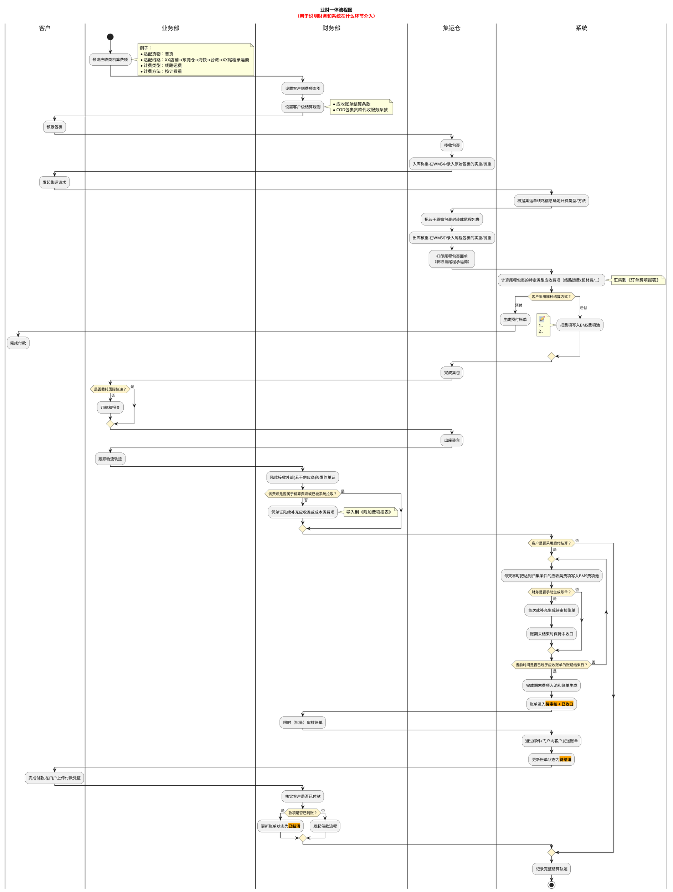

<div id="receivable-bill-status"></div>

<div id="section-10-4"></div>

### 10.4 账单状态机

| 主状态 | 定义 | 关键规则 |
| :--- | :--- | :--- |
| 待审核 | 账单已经生成，仍在财务内部处理 | 从未发出时允许发起账单生成或账单重算，补充生成或替换生成由系统判定；已经发出后折返时只允许按既有事实重算或调账；已收口时按常规路径审核，未收口时必须先确认提前收口 |
| 待结清 | 审核通过并进入客户对账与付款阶段 | 可按到账进度展示`待结算`或`部分待结算`；是否已向客户发出以`账单发出时间`为准，邮件发送结果由`通知状态`单独记录 |
| 已结清 | 全部到账 | 终态，只允许查询、导出和审计追溯 |
| 已作废 | 未发出的待审核账单被新账单成功替换 | 终态，不得重新启用、审核、发送、核销、重算或再次替换 |

账期收口状态独立于主状态：

| 账期收口状态 | 定义 | 关键规则 |
| :--- | :--- | :--- |
| 未收口 | 账期尚未结束，或账期结束后仍有来源数据、配置变更等待处理 | 待审核账单可以查看、补充生成、重算或替换生成；账期尚未结束时可执行`提前收口并审核`，但不得跳过收口直接发出 |
| 已收口 | 数据截止点已经覆盖实际账期结束时间，且实际账期内应处理费用和金额校验均已完成 | 与`待审核`同时满足时允许按常规路径审核并发出；实际账期可以是完整账期或提前收口形成的截断账期 |

补充规则：

1. 若账单内存在冲正记录，则必须待全部冲正记录审核通过后，账单才允许审核通过。
2. 冲正记录未全部审核通过时，账单应继续保留在待审核态。账期收口状态为`未收口`时，只能通过<a href="#section-9-7-3">9.7.3 账期还没结束，怎样提前收口并审核？</a>完成截断和收口，不得直接进入待结清口径。
3. 冲正记录的审核统一在调账中心完成，账单侧只负责发起、展示和引用审核结果。
4. `逾期未结清`不是账单主状态，只是待结清账单中“超过信用期且未收齐款项”的筛选条件和展示标签。
5. 客户查收应收账单后对账单金额、费项或口径持有异议并要求修正时，账单可从待结清折返回`待审核`；折返不清空账单发出时间，因此不得作废或替换生成。
6. 应收账单折返回`待审核`时，若已经存在部分回款核销，系统必须保留原核销记录、核销币种、核销金额、汇率快照和操作轨迹，不得因状态折返删除或重置。
7. 应收账单核销完毕并进入`已结清`后，本系统应将数据源中与该应收账单关联的所有费项支付状态更新为`已支付`；支付状态同步不得改变原费项金额和账单历史结果。

<div id="section-10-4-1"></div>

#### 10.4.1 应收账单状态机

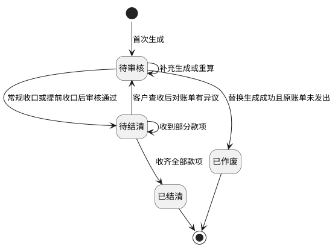

1. 任务类型为`账单生成`的BMS任务首次读取本期可出账费项时创建应收账单，账单直接进入`待审核`。账期未结束或尚未完成期末数据处理时，账期收口状态为`未收口`。
2. `待审核`是财务内部处理窗口。从未发出的账单可以发起账单生成、账单重算或补录遗漏费项，其中补充生成或替换生成由系统判定；已经发出后折返的账单不得补充或替换，只能按既有外部和资金事实重算、调账或冲正。既有费项原始金额不得直接改写。
3. 账期结束后的自动或手动期末任务完成费项入池、账单生成和完整性校验后，把账期收口状态更新为`已收口`。常规审核要求`待审核 + 已收口`且冲正记录全部审核通过；账期尚未结束时，财务可以按<a href="#section-9-7-3">9.7.3 账期还没结束，怎样提前收口并审核？</a>先形成截断账期并完成收口，再审核账单。
4. 财务审核通过后，账单进入 `待结清`，系统按客户级账单配置向客户发出账单。账单首次通过邮件、客户端或其它方式成功向客户开放查看、下载或送达时，必须记录`账单发出时间`；各渠道不得重复改写首次发出时间。系统读取账单归属客户的客户主数据邮箱并发送账单邮件；若未配置客户邮箱，系统不得自动发送邮件，并在应收账单列表的`通知状态`展示`未配置邮箱`标签；邮件发送失败时展示`通知失败`，发送成功时展示`已通知`。`通知状态`只表示邮件结果，不阻断账单进入待结清；财务可在待结清阶段触发系统重发邮件，如改用其它方式送达，应另记送达说明且不改变`通知状态`枚举口径。
5. `待结清` 是广义结算阶段，覆盖 `待结算` 和 `部分待结算` 等展示口径。客户未付款时保持待结算；收到部分款项时仍停留在待结清口径并更新已收 / 未收金额；收齐全部款项后进入 `已结清`。
6. `逾期未结清` 并非真实账单状态。待结清账单同时满足“未收齐全部款项”和“当前日期大于信用期结束日”时，命中 `逾期未结清` 筛选条件，并可在列表上展示对应标签；后续收齐全部款项后进入 `已结清`，自然退出该筛选结果。
7. 客户查收账单后对金额、费项或口径提出异议并要求修正时，账单可从`待结清`折返回`待审核`；账单发出时间和既有核销事实继续保留，折返后的修正边界见<a href="#section-9-8-2">9.8.2 再确认：当前账单状态允许怎么处理？</a>。
8. `已作废`是未发出待审核账单被新账单替换后的终态；其明细、配置快照、金额结果、作废原因和替换关系必须保留。
9. `已结清`是资金闭环终态。账单仅保留查询、导出、对账和审计追溯，不再通过状态折返直接改写历史结果。
10. 应收账单进入`已结清`后，本系统应将数据源中与该账单关联的全部费项支付状态更新为`已支付`；后续调账不得删除或覆盖原处理结果，具体处理见<a href="#section-9-8-2">9.8.2 再确认：当前账单状态允许怎么处理？</a>。

<div id="section-10-5"></div>

### 10.5 自动拆单

账期定义、理解和节奏示意见<a href="#section-7-3">7.3 账期定义与节奏</a>；本节只描述应收账单生成结果中的自动拆单规则。

1. 同一客户、同一账期内，业务板块或运抵国不同的费项必须拆成多张应收账单。
2. 拆分依据来自源订单的业务板块和运抵国，缺值则任务报错。
3. 同一账期拆出的账单互不影响，审核、发送、付款、核销均按账单维度独立进行。

<div id="section-10-6"></div>

### 10.6 账单配置

应收账单配置统一见<a href="#section-7">7. 客户级账单配置</a>。本模块只描述应收账单的生成结果、状态流转、账期展示、详情和导出，不重复维护配置口径。

<div id="section-10-7"></div>

### 10.7 客户侧费项索引

客户侧费项索引只服务应收账单和返款账单，费项名称由我司统一定义，用于财务导入、冲正和采集配置参考；不得被成本账单或成本明细引用。成本账单使用的成本费项索引见<a href="./成本中心.PRD.md">《成本中心 PRD》5.2.2 客户侧与成本侧费项索引分域</a>。具体金额换算、汇率快照和多币种汇总规则见<a href="#section-15">15. 金额汇兑</a>。

<div id="section-10-8"></div>

### 10.8 关键交互

1. 财务可在`BMS费项池`查看账期内费项归集结果，并可对从未发出的待审核账单发起`账单生成`或`账单重算`，也可执行补录或冲正；首次生成、补充生成或替换生成由系统判定。
2. 待审核账单达到`已收口`后可以按常规路径审核；账期尚未结束且状态为`未收口`时，可由财务确认提前收口并审核。未发出的待审核账单允许发起账单生成，并由系统判定是否需要替换生成。
3. 系统在账单审核通过后负责邮件发送，并以`通知状态`记录发送结果。
4. 财务在`待结清`账单中完成对账、核销与催收；页面可按到账进度展示`待结算`或`部分待结算`，并以`逾期未结清`标签快速定位超过信用期且未收齐款项的账单。
5. 应收账单列表支持按店铺、客户组、任务编号和配置编号筛选客户级账单；财务按任务编号或配置编号筛选出账单后，可以对筛选结果批量下载，规则见<a href="#section-19-6-3-1">19.6.3.1 发起导出</a>。

<div id="section-10-9"></div>

### 10.9 应收账单详情与账单特调汇率

应收账单详情页用于查看一张应收账单的结算结果、金额快照和汇率快照；涉及币种分桶、金额换算、往期冲正和本位币折算的规则统一见<a href="#section-15">15. 金额汇兑</a>。

<div id="section-10-9-1"></div>

#### 10.9.1 账单概况与金额展示

页面划分为以下业务字段区域：

| 区域 | 业务字段 / 操作 | 关键业务约束 |
| :--- | :--- | :--- |
| 账单概况 | 账单编号、主状态、账期收口状态、账期类型、实际账期起止日、截断账期标记、数据截止点、客户、会员编码、店铺、业务板块、运抵国；审核通过、提前收口并审核、导出账单 | `逾期未结清`仅作为筛选条件或标签；`待审核 + 已收口`展示普通`审核通过`，`待审核 + 未收口`且满足条件时展示`提前收口并审核`；详情导出固定为当前账单的客户对账文件。 |
| 费项结算币种金额 | 费项结算币种、核销状态、应收金额、实收金额、待收金额；费用核销 | 同一账单可以存在多个费项结算币种桶；各币种独立核销和判断结清。 |
| 账单汇率 | 费项结算币种、财务本位币种、费项原始币种、汇兑方向、锁定汇率；编辑汇率 | 仅展示账单内已存在的货币对；账单级调整只影响当前账单。 |
| 费用汇总与明细 | 费用汇总展示费项、结算币种、应收金额、已核销金额、待核销金额；费用明细支持横表和纵表，展示业务单号、尾程运单号、首程运单号、费用编号、动态费项金额列、金额币种口径、非业务订单下挂费项；补录费项 | 横表以业务单号为行、实际发生费项为动态列；纵表以单条费项为行。金额与费项必须读取当前有效账单结果版本，补录形成新费项记录，不得直接改写原始费项。 |
| 调账记录与核销记录 | 调账编号、调账类型、调账状态、核销编号、核销币种、核销金额、核销时间 | 原调账和核销记录只读；错误通过调账中心新增冲正记录处理。 |

<div id="section-10-9-2"></div>

#### 10.9.2 账单特调汇率页签与编辑弹窗

1. 账单特调汇率页签仅用于查看账单内已存在的货币对及其锁定结果。
2. 弹窗中的货币对列表必须来源于账单内已存在的费项货币对，不允许手工新增账单内不存在的货币对。
3. 货币对来源、换算方向、账单级锁定汇率和客户级默认汇率回显的规则统一见<a href="#section-15">15. 金额汇兑</a>；账单级锁定汇率配置不可关闭。
4. 页面保存后仅影响当前账单的金额换算结果，不回写历史账单。

说明：

1. “货币对一致，则必须汇兑方向一致，汇率一致”指的是同一账单内相同币种组合只能采用一个汇兑方向和一套汇率口径，不允许同一货币对同时出现两个方向或两个数值。
2. 账单级锁定汇率配置不可关闭。未人工调整时，页面展示账单生成时命中的客户级默认汇率；人工调整后，页面展示当前账单级锁定汇率。

<div id="section-10-9-3"></div>

#### 10.9.3 账单导出范围

1. 应收账单详情内的`导出`固定为`导出给客户`，仅导出当前应收账单，并按<a href="#section-19-6-1">19.6.1 面向客户的对账报表导出</a>生成一份客户对账文件；该入口不展示用途选择，也不支持内部明细导出。
2. 应收账单列表的批量导出分为`导出给客户`和`导出给内部`。`导出给客户`按<a href="#section-19-6-1">19.6.1 面向客户的对账报表导出</a>逐账单生成客户对账文件；`导出给内部`按<a href="#section-19-6-2">19.6.2 面向财务的对账报表导出</a>汇总所选账单的费项明细，并允许财务选择`拆分式`或`合并式`。
3. 两种用途均只读取任务创建时固化的当前账单结果，不支持导出账单历史快照，也不提供历史快照版本列表、历史配置快照、历史金额快照或历史汇率快照文件。
4. 历史快照只保留在系统内用于审计、追溯和防回写判断，不作为客户对账文件或内部明细文件的导出对象。
5. 财务按任务编号或配置编号筛选出应收账单后，可以对筛选结果批量下载：`导出给客户`逐客户生成对账文件并打包下载，`导出给内部`按筛选结果全部账单生成内部明细文件，打包规则见<a href="#section-19-6-3-1">19.6.3.1 发起导出</a>。

<div id="section-10-10"></div>

### 10.10 账单编号

应收账单编号用于唯一识别客户在某一账期、某一拆分维度下形成的应收账单。

| 账单类型 | 前缀 | 结算主体 | 账期起始日 | 后缀 | 示例 |
| :--- | :--- | :--- | :--- | :--- | :--- |
| 应收账单 | ARB | 客户编号 | yyyymmdd | 业务板块+运抵国 MD5 截前 4 位 | `ARB-OG4155-20260101-fse3` |

规则：

1. 应收账单编号前缀固定为 `ARB`。
2. 结算主体取客户编号。
3. 账期起始日按 `yyyymmdd` 格式取当前应收账单账期开始日期。
4. 同一客户、同一账期内，若不同费项关联订单的业务板块或运抵国不同，必须拆成多张应收账单。
5. 应收账单后缀用于区分拆单维度，取 `业务板块 + 运抵国` 组合的 MD5 截前 4 位。

<div id="section-11"></div>

## 11. 返款账单模块

[🔗原型链接](http://localhost:4181/#/billing/refund-bills)

<div id="section-11-0"></div>

### 11.0 模块总览

返款账单模块用于把 COD 业务订单的应付返款及手续费，与其尾程包裹的回款事实整理为客户可核对、财务可审核、可执行返款和可追溯结清的账单结果。模块的核心结果不是“把到付总额原样返给客户”，而是依次确定到付总额、到付附加费、应付返款本金、返款账单指定扣减费项、换算前的实付返款（准）和最终实付返款。

本章定义返款账单的金额、归集、状态、审核、核销、返款、汇兑损益和输出规则。尾程包裹的回款状态和返款状态统一由<a href="#section-12">12. 回款管理</a>负责；OIS 来源表、字段结构和导入事实统一见<a href="#section-19-2-3">19.2.3 客户侧费项的 OIS 数据源</a>；币种和汇率快照统一见<a href="#section-15">15. 金额汇兑</a>。

<div id="section-11-1"></div>

### 11.1 需求背景

尾程派送商向收件人收取的 COD 到付金额中，可能同时包含应返给客户的代收货款和已经向收件人收取的到付附加费。尾程派送商应把完整到付金额返给财务；财务不得把完整到付金额直接返给客户，否则会把不属于代收货款本金的到付附加费一并返还。若返款账单指定扣减费未单独处理，又会把应由客户承担的费用从返款结果中遗漏或重复计费。

因此，返款账单必须先在原始到付币种中拆出代收货款本金，再扣除返款账单明确指定的扣减费项，得到换算前的`实付返款（准）`；最后按<a href="#section-7-5-1">7.5.1 返款账单怎样确定结算币种和金额？</a>锁定返款汇率，并换算为客户实际收款的货款结算币种。订单费用报表只提供`实收回款`和`回款汇率`，不再提供返款金额或返款汇率。签收返款和回款返款只是“何时具备返款条件、何时锁定回款事实”的两种配置方式，不能改变上述金额顺序。

<div id="section-11-2"></div>

### 11.2 核心概念

本章中的`回款`和`返款`均以财务为观察主体：资金回到财务称为回款，资金由财务返还给客户称为返款。

| 概念 | 定义 | 说明 |
| :--- | :--- | :--- |
| `回款` | 尾程派送商从收件人收取到付金额后，将该到付金额返给财务 | 资金方向为`收件人 → 尾程派送商 → 财务`；回款对象是完整的到付金额。 |
| `返款` | 财务将代客户收取的货款返还给客户 | 资金方向为`财务 → 客户`；返款对象是代收货款，不包含到付附加费。 |
| `应收回款（即到付金额）` | 尾程派送商应返给财务的 COD 总额 | `到付金额 = 代收货款 + 到付附加费`，因此到付金额不等于应返给客户的代收货款。 |
| `到付附加费总额` | 随 COD 一起向收件人收取、但不属于代收货款本金的费用合计 | 例如`超材费（到付）`；先从到付总额中扣除，再确定应付返款本金。 |
| `应付返款（即代收货款）` | 从到付总额中扣除到付附加费后的代收货款本金 | OIS机算结果直接挂靠业务订单，BMS读取该结果并以货款原始币种记录，是计算`实付返款（准）`的原始金额。 |
| `代收货款手续费` | 因代收货款业务产生、可按返款配置从返款中扣减的费用 | OIS按包裹计算后汇总形成业务订单级机算结果，并直接挂靠业务订单；BMS读取该结果，命中直接扣减配置时进入返款账单，同一业务订单只计入一次。 |
| `实收回款` | 订单费用报表导入的包裹侧回款事实 | 直接挂靠尾程包裹，表示尾程派送商实际返给财务的金额；当前版本直接读取导入值，不由系统按公式生成。 |
| `回款汇率` | 订单费项报表导入的回款汇率 | 表示订单目的国币种到回款结算币种的汇率；当前版本直接读取导入值。 |
| `返款汇率` | 返款账单锁定的`货款原始币种 → 货款结算币种`汇率 | 按<a href="#section-15-3-1">15.3.1 汇率层级</a>取得，用于把换算前返款金额换算为客户收款币种。 |
| `实付返款（准）` | 扣除指定扣减费项后的换算前返款金额 | `实付返款（准） = 应付返款 - 返款账单指定扣减费项`；以货款原始币种记录。 |
| `返款账单指定扣减费项` | 在返款账单中明确指定、从扣减前返款金额中扣除的客户应承担费用 | 例如`税金（账期支付）`；只有被指定后才参与本次返款扣减。 |
| `实付返款` | 按返款汇率换算后的最终返款金额 | `实付返款 = 实付返款（准） × 返款汇率`；以货款结算币种记录，实际返款完成后才形成已返金额。 |
| `签收返款` | 收件人签收后，先返还、后回收 | 适用于需要先垫资的场景。 |
| `回款返款` | 收件人签收后，先回收、后返还 | 适用于先收到货款再返还的场景。 |
| `正常签收` | COD 包裹正常签收且进入回款 / 返款结算闭环 | 必须同时产生回款和返款动作。 |
| `异常签收` | COD 包裹发生拒收、退件或其他异常 | 不产生回款和返款动作，仅保留在回款管理中跟踪。 |
| `汇兑损益` | 同一换算前返款金额分别按回款汇率和返款汇率折算产生的差额 | 在返款账单中计算，仅财务可见，不进入客户对账报表；具体口径见<a href="#section-15-7-3">15.7.3 返款账单怎样计算汇兑损益？</a>。 |

关键规则：

1. 返款账单与应收账单可独立按各自账期运行，不要求同周期对齐。
2. 返款账单按 COD 业务订单归集`应付返款`和`代收货款手续费`；尾程包裹只提供签收和`实收回款`事实。异常签收包裹不形成自身回款事实，并由<a href="#section-12">12. 回款管理</a>保留状态追踪。
3. 到付附加费和返款账单指定扣减费项均在货款原始币种中依次扣除：前者决定应付返款本金，后者决定换算前的`实付返款（准）`。两类费用不得互相替代，也不得在应收账单和返款账单中重复核销。
4. 回款金额以尾程派送商应返给财务的完整到付金额为基础；返款金额以从到付金额中扣除到付附加费后得到的代收货款为基础。

<div id="section-11-2-1"></div>

#### 11.2.1 返款金额从哪里取？

返款账单同时引用订单侧金额和订单费用报表导入形成的包裹侧事实，但两类数据的用途不同：

1. OIS机算形成的`应付返款（即代收货款）`和`代收货款手续费`直接挂靠业务订单；BMS只读取结果并按业务订单归集，不负责计算这两个原始金额。到付金额用于核对该订单的 COD 业务背景。
2. `实收回款`和`回款汇率`来自订单费用报表导入，直接挂靠对应尾程包裹，继续作为回款链路的金额和汇率事实。`ofp_ofdb1.sale_order_package_fee`下的金额均为尾程包裹级导入值，不是OIS机算值；包裹导入手续费与订单级机算手续费分别保留形成方式和挂靠对象，两者同时存在时按各自挂靠层级归集，不做覆盖、合并或冲突拦截。
3. 后续订单费用报表不再导入`实付返款`和`返款汇率`；存量历史值不作为返款账单展示、结算币种、返款汇率或实付返款的计算输入。
4. 返款账单先在货款原始币种中计算`实付返款（准） = 应付返款 - 返款账单指定扣减费项`，再按账单锁定的返款汇率计算最终`实付返款`。
5. 字段名称相近不代表金额含义相同。系统不得仅凭中文字段名，把到付总额、代收货款本金、手续费、实收回款和账单计算的实付返款互相替代。
6. 返款账单明细必须分别保留业务订单和尾程包裹的挂靠关系，并明确区分订单级金额、包裹级回款事实和本账单计算结果。
7. 来源表、字段含义及当前数据核对事实统一见<a href="#section-19-2-3-6">19.2.3.6 返款账单怎样理解订单侧和包裹侧字段？</a>；本章不重复定义来源表结构。

一票多件怎样触发返款账单：

1. 一张业务订单包含多个尾程包裹时，`应付返款`和`代收货款手续费`仍各自只属于该业务订单，不拆分、复制或重复下挂到每个尾程包裹。
2. `回款返款`模式下，只要该业务订单任一尾程包裹已录入非空且非零的`实收回款`，该业务订单即满足“已回款”归集条件；不要求同一订单下所有尾程包裹都录入实收回款。
3. 首个符合条件的尾程包裹只负责触发订单归集。系统必须按业务订单去重，将订单级`应付返款`和命中直接扣减配置的`代收货款手续费`各计入返款账单一次。
4. 同一业务订单的其他尾程包裹后续录入实收回款时，只新增或更新对应包裹的回款事实，不得再次计入该订单的应付返款或手续费。
5. 包裹级`实收回款`不得复制到同一订单的其他尾程包裹，也不得自动拆分为订单下各包裹的回款金额。各包裹的回款状态仍按自身实收回款独立判定，见<a href="#section-12-3">12.3 业务规则</a>。
6. `签收返款`模式仍以正常签收作为归集条件，不要求先录入实收回款；本节的一票多件回款触发规则不改变该模式的先返后回顺序。

<div id="receivable-refund-relation"></div>

<div id="section-11-2-2"></div>

#### 11.2.2 同一费项进入应收账单，还是返款账单？

[🔗原型链接](http://localhost:4181/#/billing/refund-bills)

应收账单和返款账单可以引用同一订单、尾程包裹和来源明细，但结算目的不同：应收账单核对客户应向我方支付的费用，返款账单核对我方应返给客户的 COD 货款及本次返款扣减。系统必须按费项用途分流，不得仅按订单是否已入账判断归属。

| 来源金额或费项 | 应收账单 | 返款账单 | 归属口径 |
| :--- | :--- | :--- | :--- |
| 普通客户应付费用，例如运费 | 进入应收账单并参与应收核销 | 不进入返款账单 | 客户应向我方支付的服务费。 |
| 代收货款本金 | 不进入应收账单 | 作为`应付返款`参与返款核销 | 我方代客户收取、后续应返给客户的资金。 |
| 到付附加费，例如`超材费（到付）` | 不作为客户账期应收费重复核销 | 在原始到付币种中先从到付总额扣除 | 该费用已随 COD 向收件人收取，用于确定代收货款本金，不属于返款账单指定扣减费项。 |
| 返款账单指定扣减费项，例如被指定的`税金（账期支付）` | 仅保留来源和关联关系，不参与应收核销 | 从`实付返款（准）`中扣除并参与返款核销 | 只有命中客户级返款账单配置中的直接扣减规则后，才进入返款扣减。 |
| 未被指定为返款扣减的账期支付费用 | 进入应收账单并参与应收核销 | 不进入返款账单 | 不能因同一订单存在返款账单，就自动改为返款扣减。 |

这里的`参与核销`表示金额进入该账单的应收 / 应返、已核销和待核销计算；`仅保留来源和关联关系`表示页面和导出可以展示其去向，但金额不进入该账单核销进度。

分流与防重规则如下：

1. 每笔来源费项必须先确定业务用途，再确定进入哪条账单线；一笔费项最多只能在一类账单中作为可核销金额出现。
2. 到付附加费和返款账单指定扣减费项是两个不同层级。前者先在原始到付币种中影响代收货款本金，后者再在`实付返款（准）`所在币种中影响最终实付返款，详见<a href="#section-11-2-3">11.2.3 到付金额、代收货款和实际返款如何区分？</a>。
3. 只有命中返款账单指定扣减规则的费用，才能从返款金额中扣除；未命中的客户应付费用继续按应收账单规则处理。
4. 已被返款账单作为扣减金额占用的费项，应收账单只能关联展示，不得再次核销；已经进入应收账单核销的费项，也不得再转为返款扣减。
5. 系统发现同一来源费项同时成为两类账单的可核销金额时，必须阻止生成冲突结果并提示财务处理，不得静默按某一账单优先。
6. 来源费项必须保留账单类型、账单编号、账单期次和占用状态，供重算、调账和追溯时判断是否已经结算。

账期与展示规则如下：

1. 应收账单和返款账单分别读取各自配置、账期和触发时间，可以在不同日期生成，也可以归属不同账期。
2. 同一订单的普通应收费可能先进入应收账单，代收货款及指定扣减费项可能在回款条件满足后进入后续返款账单；账期不同不影响两者保持订单和包裹关联。
3. 账单详情应按费项粒度展示归属账单、账单期次和是否参与核销，不得只按订单粒度显示`已入账`。
4. 应收账单详情、返款账单详情、对账报表和回款管理必须使用同一归属结果。
5. 两条账单线需要修正时分别处理：返款账单按<a href="#section-9-8-3">9.8.3 返款账单还有哪些额外限制？</a>处理，应收账单按<a href="#section-9">9. 账单生成/重算机制</a>处理；任一侧的修正不得反向改写另一侧已经核销的金额。

<div id="section-11-2-3"></div>

#### 11.2.3 到付金额、代收货款和实际返款如何区分？

返款账单不能把 COD 到付总额直接当作应返给客户的金额。一笔正常签收的 COD 包裹，至少要按以下顺序区分金额：

1. **先识别到付总额**：`应收回款（即到付金额）`是尾程派送商向收件人收取后，应完整返给财务的 COD 总额。
2. **再扣除到付附加费**：`到付附加费总额`是随 COD 一起向收件人收取、但不属于代收货款本金的费用，例如`超材费（到付）`。该金额先从到付总额中扣除，得到`应付返款（即代收货款）`。
3. **再扣除指定扣减费项**：把返款账单明确指定的扣减费项换算到货款原始币种后汇总，计算`实付返款（准） = 应付返款 - 返款账单指定扣减费项`。例如，`税金（账期支付）`只有在被指定为返款扣减费项后，才参与本次扣减。
4. **最后换算为客户收款币种**：按<a href="#section-7-5-1">7.5.1 返款账单怎样确定结算币种和金额？</a>匹配货款原始币种和货款结算币种，取得并锁定返款汇率，计算`实付返款 = 实付返款（准） × 返款汇率`。

两类费用的扣减对象不同，但都先在货款原始币种中处理：到付附加费先决定应付返款本金，返款账单指定扣减费项再决定换算前的`实付返款（准）`。到付附加费不会因为被从 COD 总额中扣除，就自动变成返款账单的指定扣减费项；返款账单也不得把同一笔费用在应收账单和返款账单中重复核销。

下表用两个相同业务金额的案例，说明货款原始币种与结算币种相同或不同时，返款账单怎样按方案 2 计算实付返款。两个案例的到付金额均为`70 TWD`，到付附加费均为`10 TWD`，因此应付返款均为`60 TWD`；指定扣减费项均为`20 TWD`，因此换算前的`实付返款（准）`均为`40 TWD`。绿色区域中的`实收回款`和`回款汇率`为订单费用报表导入的回款事实；粉色区域为返款账单计算结果。

<style>
.refund-amount-table {
  border-collapse: collapse;
  border: 1px solid #888;
  width: max-content;
  table-layout: auto;
  white-space: nowrap;
  font-family: Arial, 'Microsoft YaHei', sans-serif;
  font-size: 14px;
  color: #111;
}
.refund-amount-table th,
.refund-amount-table td {
  border: 1px solid #888;
  padding: 6px 8px;
  text-align: left;
}
.refund-amount-table th { font-weight: 400; }
.refund-amount-table .green { background-color: #dcefd1; }
.refund-amount-table .gray { background-color: #e7e7e7; }
.refund-amount-table .pink { background-color: #f5d5db; }
.refund-amount-table .value { background-color: #ffffff; }
.refund-amount-table .empty { background-color: #000000; color: #000000; }
</style>

<p><strong>示例一：货款原始币种与结算币种一致</strong></p>
<div style="overflow-x:auto; width:100%; margin:12px 0 8px 0;">
  <table class="refund-amount-table">
    <tbody>
      <tr>
        <th class="green">应收回款（即到付金额）</th>
        <th class="green">回款汇率</th>
        <th class="green">实收回款</th>
        <th colspan="2" class="empty">&nbsp;</th>
      </tr>
      <tr>
        <td class="value">70 TWD</td>
        <td class="value">--</td>
        <td class="value">70 TWD</td>
        <td colspan="2" class="empty">&nbsp;</td>
      </tr>
      <tr>
        <td class="gray">到付附加费总额</td>
        <td colspan="4" class="empty">&nbsp;</td>
      </tr>
      <tr>
        <td class="value">10 TWD</td>
        <td colspan="4" class="empty">&nbsp;</td>
      </tr>
      <tr>
        <th class="pink">应付返款（代收货款）</th>
        <th class="pink">返款账单指定扣减费项</th>
        <th class="pink">实付返款（准）</th>
        <th class="pink">返款汇率</th>
        <th class="pink">实付返款</th>
      </tr>
      <tr>
        <td class="value">60 TWD</td>
        <td class="value">20 TWD</td>
        <td class="value">40 TWD</td>
        <td class="value">1</td>
        <td class="value">40 TWD</td>
      </tr>
    </tbody>
  </table>
</div>

<p><strong>示例二：货款原始币种与结算币种不同</strong></p>
<div style="overflow-x:auto; width:100%; margin:12px 0 8px 0;">
  <table class="refund-amount-table">
    <tbody>
      <tr>
        <th class="green">应收回款（即到付金额）</th>
        <th class="green">回款汇率</th>
        <th class="green">实收回款</th>
        <th colspan="2" class="empty">&nbsp;</th>
      </tr>
      <tr>
        <td class="value">70 TWD</td>
        <td class="value">0.2</td>
        <td class="value">14 CNY</td>
        <td colspan="2" class="empty">&nbsp;</td>
      </tr>
      <tr>
        <td class="gray">到付附加费总额</td>
        <td colspan="4" class="empty">&nbsp;</td>
      </tr>
      <tr>
        <td class="value">10 TWD</td>
        <td colspan="4" class="empty">&nbsp;</td>
      </tr>
      <tr>
        <th class="pink">应付返款（代收货款）</th>
        <th class="pink">返款账单指定扣减费项</th>
        <th class="pink">实付返款（准）</th>
        <th class="pink">返款汇率</th>
        <th class="pink">实付返款</th>
      </tr>
      <tr>
        <td class="value">60 TWD</td>
        <td class="value">20 TWD</td>
        <td class="value">40 TWD</td>
        <td class="value">0.15</td>
        <td class="value">6 CNY</td>
      </tr>
    </tbody>
  </table>
</div>

示例一中，货款币种配置为`TWD → TWD`，同币种返款汇率固定为`1`，因此`40 TWD`的`实付返款（准）`换算后仍为`40 TWD`。示例二中，货款币种配置为`TWD → CNY`，账单锁定的返款汇率为`0.15`，因此最终`实付返款 = 40 TWD × 0.15 = 6 CNY`。两个示例的结算币种均由货款币种配置决定。

配置为`TWD → USD`时，系统必须取得并锁定`TWD → USD`返款汇率；配置为`其他 → USD`时，也必须按业务订单真实的货款原始币种取得对应的返款汇率。

计算关系如下：

1. `应付返款（即代收货款） = 应收回款（即到付金额） - 到付附加费总额`，两个示例均为 `70 TWD - 10 TWD = 60 TWD`。
2. `实付返款（准） = 应付返款 - 返款账单指定扣减费项`；两个示例均为`60 TWD - 20 TWD = 40 TWD`。
3. `实付返款 = 实付返款（准） × 返款汇率`；示例一为`40 TWD × 1 = 40 TWD`，示例二为`40 TWD × 0.15 = 6 CNY`。
4. 当前版本的`实收回款`由报表导入：示例一导入`70 TWD`；示例二导入`14 CNY`。示例二的导入值与核对关系 `70 TWD × 0.2 = 14 CNY`一致；无回款汇率时，导入的实收回款继续使用目的国币种。实收回款不等于客户最终收到的返款金额。
5. 表内所有相减和相加必须在同一币种下进行。指定扣减费项不是货款原始币种时，须先按账单锁定汇率换算为货款原始币种，再参与`实付返款（准）`计算。
6. 客户最终收到的金额以换算后的`实付返款`为准；未完成实际返款前，该金额属于待返金额，完成返款后才形成已返金额，不能仅凭计算结果把账单标记为已结清。
7. `实付返款（准）`小于零时，不得继续换算或执行负数返款；系统应按<a href="#section-7-5">7.5 返款账单配置</a>选择的负数金额处理方式，顺延至下期返款账单或反向计入本期应收账单。

<div id="section-11-3"></div>

### 11.3 返款账单怎样形成并完成结清？

返款账单从业务订单取得返款触发事实开始，到客户返款和尾程派送商回款全部完成后结束。本章只描述账单负责的环节；包裹派送、回款状态、返款状态和未回款跟进统一见<a href="#section-12">12. 回款管理</a>。

<div id="section-11-3-1"></div>

#### 11.3.1 从可返款业务订单到账单结清

| 环节 | 处理规则 | 业务结果 |
| :--- | :--- | :--- |
| 确认归集范围 | 先按尾程包裹识别正常签收和实收回款事实，再归并到业务订单。`签收返款`继续按正常签收规则触发；`回款返款`按<a href="#section-11-2-1">11.2.1 返款金额从哪里取？</a>的一票多件规则，以任一尾程包裹的有效实收回款触发。 | 得到本期可进入返款账单的业务订单范围。 |
| 读取金额及来源事实 | 按业务订单读取到付总额、应付返款、代收货款手续费、到付附加费和指定扣减费项；同时读取各尾程包裹的实收回款和回款汇率，具体规则见<a href="#section-11-2-1">11.2.1 返款金额从哪里取？</a>。 | 得到订单级返款金额和可追溯的包裹级回款事实。 |
| 计算返款金额 | 按<a href="#section-11-2-3">11.2.3 到付金额、代收货款和实际返款如何区分？</a>，以业务订单为单位依次计算应付返款、实付返款（准）和最终实付返款。 | 形成订单级返款结果和账单汇总金额。 |
| 生成待审核账单 | 系统按返款配置、账期和任务使用的配置快照归集明细，生成返款账单并进入`待审核`。 | 财务可以核对金额、来源、扣减项和汇率。 |
| 审核并发出 | 财务确认账期范围、金额链路和扣减费项后审核账单；未收口账期必须先按提前收口规则形成截断账期。审核通过后，账单进入`待结清`并向客户发出。 | 客户收到可核对的返款账单。 |
| 登记资金和核销 | 财务按实际发生结果登记尾程派送商向财务的回款、财务向客户的返款及扣减核销。部分完成时账单保持`待结清`。 | 已返、已回、待返和待回金额持续更新。 |
| 完成结清 | 最终实付返款、应回款及本账单扣减均已完成，且各结算币种不存在待处理金额。 | 账单进入`已结清`，相关费项支付状态同步为`已支付`。 |

补充规则：

1. 返款模式只决定包裹何时进入可归集范围及回款、返款的先后顺序，不改变金额计算公式。
2. 返款账单生成时必须锁定配置、金额、币种和汇率快照；后续页面刷新或来源数据变化不得静默改写账单结果。
3. 账单进入`待结清`后，可以分别登记部分回款和部分返款；两者不得用同一个完成标记互相替代。
4. 客户异议、账单折返、重算、调账和冲正统一按<a href="#section-9-8-3">9.8.3 返款账单还有哪些额外限制？</a>处理，不在本流程重复定义。

<div id="refund-bill-status"></div>

<div id="section-11-4"></div>

### 11.4 返款账单处于什么状态？

返款账单状态只表示账单处理进度，不代替尾程包裹的回款状态或返款状态。包裹状态统一由<a href="#section-12">12. 回款管理</a>计算和展示。

| 主状态 | 含义 | 允许的主要处理 |
| :--- | :--- | :--- |
| `待审核` | 账单已经生成，仍在财务内部核对 | 查看、账单生成、账单重算、补录、审核或提前收口并审核；未发出账单需要替换时，由系统判定替换生成。 |
| `待结清` | 账单已经审核通过并进入客户对账、回款、返款和扣减核销阶段 | 登记部分或全部回款、返款和扣减核销；客户提出异议时折返回`待审核`。 |
| `已结清` | 最终实付返款、应回款及本账单扣减均已完成 | 终态，只允许查询、导出和审计追溯。 |
| `已作废` | 未发出的待审核账单已被新账单成功替换 | 终态，只允许查询和追溯，不得重新启用。 |

账期收口状态与账单主状态分别记录：

| 账期收口状态 | 含义 | 审核约束 |
| :--- | :--- | :--- |
| `未收口` | 账期尚未结束，或期末来源数据和金额校验尚未完成 | 不得直接审核通过；账期尚未结束时，可按<a href="#section-9-7-3">9.7.3 账期还没结束，怎样提前收口并审核？</a>形成截断账期。 |
| `已收口` | 数据截止点已覆盖实际账期结束时间，且本期应处理明细和金额校验已经完成 | 与`待审核`同时满足、且冲正记录均已审核通过时，允许审核通过。 |

<div id="section-11-4-1"></div>

#### 11.4.1 返款账单状态机图

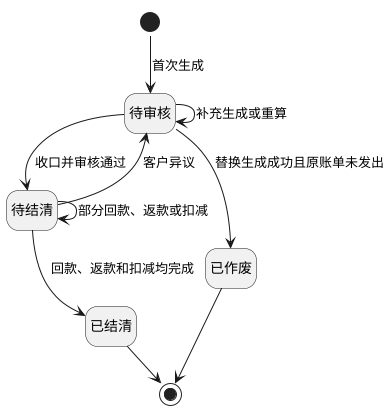

状态补充规则：

1. `待审核`账单从未发出时，可以按<a href="#section-9">9. 账单生成/重算机制</a>补充或替换；已经发出后因客户异议折返时，必须保留账单发出时间和既有资金事实，不得作废或替换生成。
2. 财务审核前必须确认金额链路、返款扣减项、账期收口状态和冲正审核结果；任一冲正记录未审核通过时，账单继续保持`待审核`。
3. 审核通过后账单进入`待结清`并向客户发出。`账单发出时间`记录首次实际送达时间，邮件结果使用`通知状态`单独记录，规则见<a href="#section-19-5">19.5 邮件模板</a>。
4. 部分回款、部分返款或部分扣减核销不会改变`待结清`主状态，但必须分别更新已回、已返和待处理金额。
5. 客户异议导致账单折返时，原核销记录、核销币种、核销金额、汇率快照和操作轨迹不得删除或重置，具体修正边界见<a href="#section-9-8-2">9.8.2 再确认：当前账单状态允许怎么处理？</a>和<a href="#section-9-8-3">9.8.3 返款账单还有哪些额外限制？</a>。
6. 返款账单不设置`逾期未结清`状态或标签；逾期只适用于应收账单客户信用期。
7. 账单进入`已结清`后，系统将与该账单关联的费项支付状态同步为`已支付`，但不得改写费项金额、账单金额或历史核销记录。

<div id="section-11-5"></div>

### 11.5 返款模式只改变先后顺序

系统支持`签收返款`和`回款返款`。两种模式使用相同的订单级金额链路、扣减规则和货款结算币种，只改变业务订单何时取得包裹侧触发事实，以及回款和返款的先后顺序。

| 返款模式 | 业务订单取得返款触发事实的条件 | 资金顺序 | 适用口径 |
| :--- | :--- | :--- | :--- |
| `签收返款` | 业务订单达到既有正常签收归集条件 | 财务先向客户返款，尾程派送商再向财务回款 | 我方需要先行垫付返款。 |
| `回款返款` | 业务订单任一尾程包裹已录入有效`实收回款` | 尾程派送商先向财务回款，财务再向客户返款 | 我方收到到付金额后再返还代收货款；一票多件时不等待全部包裹回款。 |

<div id="section-11-5-1"></div>

#### 11.5.1 签收返款（先返后回）

业务订单达到既有正常签收归集条件后，系统即可按本期账单配置归集该业务订单并计算返款；财务向客户完成返款后，仍须继续跟踪尾程派送商向财务回款，回款未完成前账单保持`待结清`。

<div id="section-11-5-2"></div>

#### 11.5.2 回款返款（先回后返）

业务订单进入回款等待阶段后，只要任一尾程包裹已录入有效`实收回款`，该业务订单即可进入返款账单归集范围。一票多件时不等待其他包裹全部回款；其他包裹的部分回款、未回款及后续跟进由<a href="#section-12">12. 回款管理</a>记录，财务向客户返还的金额仍按<a href="#section-11-2-3">11.2.3 到付金额、代收货款和实际返款如何区分？</a>计算。

<div id="section-11-6"></div>

### 11.6 哪些配置决定返款账单？

返款账单读取<a href="#section-7-5">7.5 返款账单配置</a>，本章不重复维护配置字段。以下配置会直接影响返款账单结果：

| 配置 | 影响 |
| :--- | :--- |
| 返款模式 | 决定正常签收后是立即具备返款条件，还是等待回款后再具备返款条件。 |
| 账期类型与起始日 | 决定包裹归属哪一期返款账单。 |
| 必要归集金额 | 决定生成账单时必须具备哪些货款或回款事实。 |
| 直接扣减费项 | 决定哪些账期支付费用从`实付返款（准）`中扣除；未配置的费项不得自动扣减。 |
| 货款原始币种、货款结算币种和客户收款账户 | 决定返款明细的币种匹配、返款汇率、分桶汇总和实际返款账户；返款汇率即货款原始币种到货款结算币种的账单锁定汇率。 |
| 负数金额处理方式 | 决定最终返款金额小于零时如何进入后续处理。 |

每张返款账单必须保存实际采用的配置版本快照。配置变更对既有账单的影响、替换生成和存量边界见<a href="#section-7-2">7.2 配置版本与生效规则</a>和<a href="#section-9-6-3">9.6.3 配置变了，怎样安全替换待审核账单？</a>。

<div id="section-11-7"></div>

### 11.7 返款账单详情怎样展示金额链路？

返款账单详情页用于核对一张账单“金额从哪里来、怎样计算、已经处理多少、还剩多少”，并向财务展示汇兑损益。包裹级回款和返款状态跳转至<a href="#section-12">12. 回款管理</a>查看，不在账单详情中重新计算。

| 区域 | 业务字段 / 操作 | 交互与约束 |
| :--- | :--- | :--- |
| 账单概况 | 账单编号、账单状态、账期收口状态、客户、会员编码、店铺、目的国、账期类型、实际账期起止日、截断账期标记、数据截止点、返款模式；审核通过、提前收口并审核、退回待审核、登记返款、调账中心、导出明细 | 操作随账单状态和收口状态显示；详情导出只包含当前账单。 |
| 到付与回款汇总 | 应收回款（即到付金额）、回款汇率、实收回款、已回款、待回款 | 应收回款与实收回款分开显示；回款汇率和返款汇率不得共用一个字段。 |
| 返款金额链路 | 到付附加费总额、应付返款（即代收货款）、返款账单指定扣减费项、实付返款（准）、返款汇率、实付返款 | 字段顺序必须与<a href="#section-11-2-3">11.2.3 到付金额、代收货款和实际返款如何区分？</a>一致，并展示每一步币种。 |
| 货款结算币种汇总 | 货款结算币种、实付返款、已返金额、待返金额、核销状态；核销 | 各货款结算币种分别汇总和核销；所有币种待返金额为零只是结清条件之一，还须完成应回款和扣减处理。 |
| 财务本位币汇总 | 财务本位币、实付返款、已返金额、待返金额、汇兑损益金额 | 仅供财务统一查看，不替代货款结算币种的核销结果；汇兑损益仅财务可见。 |
| 账单汇率 | 左侧币种、右侧币种、汇兑方向、汇率来源、锁定汇率、汇率状态 | 读取账单锁定快照，不随后续配置或市场汇率变化。 |
| 包裹返款明细 | 尾程运单号、主订单号、签收时间、来源金额与币种、到付附加费、应付返款、指定扣减金额、实付返款（准）、返款汇率、实付返款、已返金额、待返金额、核销状态 | 每笔明细必须保留业务订单和包裹关联，并区分包裹级回款事实与订单级返款账单结果。 |
| 指定扣减费项 | 费用编号、费项名称、业务订单号、尾程运单号、原始币种及金额、换算汇率、货款原始币种及扣减金额、处理状态 | 只展示本账单实际占用的指定扣减费项；扣减金额须先统一为货款原始币种，同一费项不得再进入应收账单核销。 |
| 关联调账与核销记录 | 调账编号、调账状态、核销编号、核销类型、币种、金额、时间、操作人 | 原记录不得修改或删除；差异通过新增调账、冲正或核销冲正记录处理。 |

详情页金额必须满足以下关系：

1. `待返金额 = 实付返款 - 已返金额`。
2. `待回款 = 应收回款 - 已回款`；当回款事实以换算后金额登记时，页面同时保留原始币种金额和换算结果。
3. 指定扣减费项不是货款原始币种时，先按账单锁定汇率换算为货款原始币种，再计入指定扣减金额。
4. 财务本位币汇总、货款结算币种汇总和包裹明细必须能相互追溯；展示精度差异按<a href="#section-15">15. 金额汇兑</a>处理。
5. `实付返款（准）`小于零时，详情页应展示负数金额及其处理去向，不计算实付返款，也不生成负数待返金额或负数返款核销记录。
6. 汇兑损益按<a href="#section-15-7-3">15.7.3 返款账单怎样计算汇兑损益？</a>计算，不参与实付返款、已返金额、待返金额或核销金额。

<div id="section-11-8"></div>

### 11.8 返款账单输出什么？

1. 面向客户输出返款账单对账报表，包含账单基本信息、货款结算币种汇总、返款明细和往期账单冲正信息，格式统一见<a href="#section-19-6-1">19.6.1 面向客户的对账报表导出</a>。
2. 面向财务的批量或内部核对格式统一见<a href="#section-19-6-2">19.6.2 面向财务的对账报表导出</a>，本章不重复定义字段和样式。
3. 汇兑损益属于返款账单内部财务信息，仅在返款账单页面和面向财务的内部导出中展示，不进入面向客户的对账报表。
4. 配置快照、金额快照、审核、发出、返款、回款、扣减、核销和调账轨迹属于内部审计记录，统一见<a href="#section-18">18. 内部审计</a>。
5. 返款账单列表支持按店铺、客户组、任务编号和配置编号筛选客户级账单；财务按任务编号或配置编号筛选出返款账单后，可以对筛选结果批量下载，每张账单仍按客户生成独立对账文件，规则与应收账单一致，见<a href="#section-19-6-3-1">19.6.3.1 发起导出</a>。

<div id="section-11-9"></div>

### 11.9 账单编号

返款账单编号用于唯一识别客户在某一账期下形成的 COD 货款返款账单。

| 账单类型 | 前缀 | 结算主体 | 账期起始日 | 后缀 | 示例 |
| :--- | :--- | :--- | :--- | :--- | :--- |
| 返款账单 | PCB | 客户编号 | yyyymmdd | 无 | `PCB-OG4155-20260101` |

规则：

1. 返款账单编号前缀固定为 `PCB`。
2. 结算主体取客户编号。
3. 账期起始日按 `yyyymmdd` 格式取当前返款账单账期开始日期。
4. 返款账单不因业务板块或运抵国生成编号后缀；若后续出现返款账单拆分需求，应在返款账单配置和编号规则中同步补充拆分维度。

<div id="section-12"></div>

## 12. 回款管理

[🔗原型链接](http://localhost:4181/#/billing/remittance)

回款管理是包裹视角列表，用于查看所有 COD 包裹的回款状态、返款状态和对账状态。页面中的回款和返款均采用财务视角：尾程派送商将到付金额返给财务称为回款，财务将代收货款返还给客户称为返款，完整定义见<a href="#section-11-2">11.2 核心概念</a>。

页面以尾程包裹为主粒度展示导入的回款事实，并关联返款账单结果以判断返款状态；不在本页面重新计算返款金额、返款汇率或汇兑损益。返款金额链路和汇兑损益统一在<a href="#section-11">11. 返款账单模块</a>处理。回款管理不提供单独的回款导入入口。

<div id="section-12-1"></div>

### 12.1 页面目标

1. 以尾程包裹为主粒度，关联运单和订单信息，集中展示回款状态、返款状态和结算结果。
2. 回款管理直接读取订单费项报表已形成的包裹级明细，不在本页面二次导入；来源表和汇总关系见<a href="#section-19-2-3-2">19.2.3.2 各来源表怎样保存并关联业务对象？</a>。
3. 支持快速识别已回款、待回款、不回款，以及已返款、待返款、不返款，并覆盖所有 COD 包裹的状态跟踪。
4. 支持从列表直接定位关联返款账单，并追踪核销结果。

<div id="section-12-2"></div>

### 12.2 页面结构与字段

| 区域 | 字段 / 操作 | 说明 |
| :--- | :--- | :--- |
| 基础信息列 | 尾程运单号、所属内部订单、所属客户、所属店铺、签收状态、签收时间、货款原始金额、尾程派送商、回款状态、返款状态 | 用于定位运单并确认签收、回款与返款状态。 |
| 回款事实列 | 回款时间、回款币种、回款金额、回款方式、回款流水号、回款汇率、实收回款金额 | 用于追踪 COD 回款事实及其锁定快照。 |
| 返款信息列 | 返款时间、返款模式、关联返款账单、应付返款金额、实付返款（准）、返款汇率、实付返款 | 金额读取关联返款账单的计算结果，只用于包裹追踪；点击关联账单查看完整金额链路和汇兑损益。 |

<div id="section-12-3"></div>

### 12.3 业务规则

回款状态和返款状态是包裹级状态，返款账单状态是账单级状态，两者不互相替代，只存在关联关系。

包裹状态判定优先级如下：

1. 先判定签收结果。异常签收优先落为 `不回款` 和 `不返款`，并直接忽略返款账单状态。
2. 再判定回款明细。正常签收包裹若包裹级回款明细满足入账条件，则回款状态为 `已回款`，否则为 `待回款`。
3. 再判定返款账单结清结果。正常签收包裹若其所属业务主单挂靠的返款账单已结清，则返款状态反推为 `已返款`，否则为 `待返款`。
4. 返款账单结清结果只影响返款状态反推，不反向改写回款状态；回款状态只看回款明细，不看账单是否已结清。

1. 所有 COD 包裹都必须同时有回款状态和返款状态，且两者均与返款账单状态解耦。
2. 回款状态仅取值 `已回款`、`待回款`、`不回款`。
3. 返款状态仅取值 `已返款`、`待返款`、`不返款`。
4. 异常签收的 COD 包裹固定为 `不回款` 和 `不返款`。
5. 正常签收的 COD 包裹，`ofp_ofdb1.sale_order_package_fee.tail_way_bill_no`存在对应尾程运单号，且同一应收行的`ofp_ofdb1.sale_order_package_fee.recovery_money`非空非零时，回款状态为`已回款`，否则为`待回款`。应收行与成本行的区分见<a href="#section-19-2-3-2">19.2.3.2 各来源表怎样保存并关联业务对象？</a>。
6. 正常签收的 COD 包裹，其所属业务主单挂靠的返款账单已结清时，返款状态反推为 `已返款`，否则为 `待返款`。
7. 返款模式为签收返款时，先返还后回收。
8. 返款模式为回款返款时，先回收后返还。
9. 关联返款账单应可点击跳转到对应账单详情，便于核销追溯。
11. 订单费项报表导入后，系统应同步刷新列表状态、账单核销记录和未回款监控。

<div id="section-12-4"></div>

### 12.4 状态联动

1. 正常签收包裹的回款状态和返款状态，分别按<a href="#section-12-3">12.3 业务规则</a>独立计算，不因返款账单主状态直接变化。
2. 返款账单从待结清进入已结清，只表示对应业务主单的返款闭环完成，不代表所有包裹状态同步变更。
3. 异常签收包裹固定显示为 `不回款` 和 `不返款`，并保留在回款管理列表中。

<div id="section-13"></div>

## 13. 营收总览

[🔗原型链接](http://localhost:10520/#/billing/revenue-overview)

营收总览用于让财务在顶部已选定的供应链范围内，按店铺及其下属客户集中查看应收账单的收款进度。页面只汇总<a href="#section-10">10. 应收账单模块</a>已经形成的有效账单结果，不替代账单生成、审核、核销或调账操作。

页面先按所选店铺和账期范围展示应收、已收、应收未收和逾期未收人民币金额，再以客户列表展示该范围内各客户的收款进度及未结账单。

<div id="section-13-1"></div>

### 13.1 总表回答哪些问题？

1. `店铺金额总览`回答当前供应链全部店铺或所选店铺在账期范围内共有多少应收、已经收回多少、仍有多少未收及其中多少已经逾期。
2. `客户汇总`回答所选店铺和账期范围内各客户的应收和收款进度，并定位具体未结账单。
3. 店铺金额总览统一折算为人民币，且只受店铺和账期范围影响；客户、结算币种和未收状态等客户区条件不得改变店铺金额总览。客户金额必须等于其下全部有效应收账单的对应结算币种汇总金额。
4. 总表只用于查询、下钻和导出，不允许直接修改账单金额、核销金额、信用期或账单状态。

<div id="section-13-2"></div>

### 13.2 金额从哪里取？

总表按`应收账单 + 费项结算币种`读取当前有效账单结果中的币种汇总，不在页面重新计算费项、汇率或核销金额。

| 指标 | 统计口径 |
| :--- | :--- |
| 应收金额 | 当前有效应收账单各结算币种的`应结金额`之和。 |
| 已收金额 | 当前有效应收账单各结算币种的`已结金额`之和；只统计有效核销结果。 |
| 应收未收金额 | 当前有效应收账单各结算币种的`未结金额`之和。 |
| 逾期未收金额 | 信用期结束日早于当前日期且`未结金额`大于零的账单未结金额之和。 |
| 待审核金额 | `待审核`有效应收账单的`应结金额`之和，用于区分尚未发给客户的内部金额。 |
| 未结账单数 | `未结金额`大于零的有效应收账单数量；同一账单包含多个币种时只计一张。 |

1. `待审核`、`待结清`和`已结清`的有效应收账单均进入总表；`候选`、`已作废`或`失效`账单不得进入总表。
2. `待审核金额`进入应收金额，但必须单独列示，避免与已经发给客户的应收金额混淆。
3. 核销记录冲正生效后，总表随账单币种汇总更新；冲正前历史金额不得继续计入当前已收金额。
4. 金额和核销口径承接<a href="#section-15">15. 金额汇兑</a>，总表不得采用当前市场汇率重算历史账单。

<div id="section-13-3"></div>

### 13.3 店铺和客户怎样归属？

1. 应收账单首次形成时，系统必须保存客户当时所属的`供应链快照`和`店铺快照`。
2. 页面范围由顶部已选定供应链确定；店铺金额总览按账单的`店铺快照`分组，不按客户当前所属店铺回溯改写历史账单。
3. 客户后来更换供应链或店铺时，变更前形成的账单仍归原供应链和原店铺，变更后形成的新账单归新供应链和新店铺。
4. 当前供应链范围内未能取得店铺的账单归入`未归属店铺`，不得遗漏。
5. 客户明细按`店铺快照 + 客户主体 + 结算币种`形成一行，客户名称、客户编号和会员编码均须展示并支持查询。

<div id="section-13-4"></div>

### 13.4 不同币种怎样展示？

1. 店铺金额总览统一以人民币展示；非人民币账单按<a href="#section-15">15. 金额汇兑</a>确定的有效汇率折算，禁止直接相加原币金额。
2. 客户汇总保留账单结算币种。结算币种默认不选，未选择时按币种分别展示记录；选择后仅筛选客户汇总列表，不改变店铺金额总览。
3. 同一客户同时存在多个结算币种时，每个币种分别形成汇总记录。
4. 总表导出必须同时保留店铺人民币汇总和客户结算币种，不得以店铺折算金额覆盖客户原结算币种金额。

<div id="section-13-5"></div>

### 13.5 页面原型概述

| 区域 | 业务字段 | 交互与约束 |
| :--- | :--- | :--- |
| 店铺范围区 | 店铺、账期范围 | 店铺默认不选并表示当前供应链下全部店铺；账期范围支持月份范围和日期范围，默认以月份范围选择当前月。月份范围按账期结束日所属月份筛选，日期范围按账期结束日是否落入起止日期筛选。两项条件共同限定店铺金额总览和客户汇总列表的账单范围。 |
| 店铺金额总览区 | 应收金额、已收金额、应收未收、逾期未收 | 四项指标统一以人民币展示，只受店铺和账期范围影响，不受客户筛选区条件影响。 |
| 客户筛选区 | 客户名称 / 客户编号 / 会员编码、结算币种、未收状态 | 三项条件默认不选，只筛选客户汇总列表。 |
| 客户汇总列表 | 客户名称、客户编号、会员编码、所属店铺、结算币种<br>应收金额、已收金额、应收未收、逾期未收、待审核金额<br>账单数、未结账单数、最早到期日、状态 | 仅展示当前店铺范围内的客户汇总记录；客户可查看当前条件下的应收账单明细。 |
| 客户账单明细 | 应收账单编号、账期、信用期结束日、应收金额、已收金额<br>应收未收金额、账单状态、账单发出时间 | 默认只列当前筛选范围内的有效应收账单；账单编号可进入应收账单详情，查看和处理权限按<a href="#section-10">10. 应收账单模块</a>执行。 |

`未收状态`取值为`全部`、`逾期`、`未逾期`：`逾期`表示信用期已经结束且未结金额大于零；`未逾期`表示未结金额大于零且信用期尚未结束。

<div id="section-13-6"></div>

### 13.6 查询、刷新与导出

1. 页面打开或完成有效核销、核销冲正、账单审核、账单作废、替换生成后，总表必须读取最新的账单和币种汇总结果。
2. 一次查询同时提交店铺范围区和客户筛选区的当前条件。店铺金额总览只按店铺和账期范围更新；客户汇总列表按店铺、账期范围及客户筛选条件的交集更新，客户筛选条件不得改变店铺金额总览。
3. 点击`导出`时，系统按当前店铺、账期范围及客户筛选条件创建异步导出任务。导出内容包含店铺人民币金额总览、客户结算币种汇总和下钻账单字段，不替代客户对账报表。
4. 财务只能查看顶部已选定供应链及其数据权限范围内的店铺和客户；导出范围不得超出页面查询权限。
5. 当汇总金额与账单明细不一致时，页面应阻止导出并提示重新查询；系统不得以页面临时计算值覆盖账单结果。

<div id="section-14"></div>

## 14. 成本中心

成本中心已拆分为独立需求文档，完整需求见<a href="./成本中心.PRD.md">《成本中心 PRD》</a>。本章仅作为财务系统总 PRD 的模块入口；成本中心与金额汇兑、调账、非功能需求和内部审计的跨模块约束，继续分别承接<a href="#section-15">15. 金额汇兑</a>、<a href="#section-16">16. 调账中心</a>、<a href="#section-17">17. 非功能需求</a>和<a href="#section-18">18. 内部审计</a>。

<div id="section-15"></div>

## 15. 金额汇兑

<div id="section-15-1"></div>

### 15.1 章节概述

本章统一定义应收账单、返款账单、成本账单和回款管理涉及的金额汇兑口径。客户级汇率配置先决定账单生成前的默认汇率，本章再定义默认汇率如何在账单侧固化为快照、如何参与金额换算、汇总和核销。

1. 费项结算币种如何选择。
2. 汇率快照如何锁定。
3. 多币种账单如何汇总和核销。

本章聚焦金额换算与币种汇总，其他章节分别承接业务流程、页面入口和结果展示。

<div id="fee-settlement-currency"></div>

<div id="section-15-2"></div>

### 15.2 费项结算币种模板

费项结算币种模板是应收账单配置页面的快捷填充工具，用于把常用的费项结算币种映射一次性带入默认方案或分支方案。模板不参与账单生成时的实时匹配，也不与客户级账单配置建立绑定关系。

<div id="section-15-2-1"></div>

#### 15.2.1 模板作用

1. 模板按常用业务场景维护费项与结算币种的映射，减少财务逐项填写工作。
2. 模板可以提供费项结算币种规则集合。
3. 模板不是客户级账单配置项，也不是账单计算规则；任务类型为`账单生成`的BMS任务不得根据模板编号或模板当前内容决定结算币种。
4. 模板不是客户私有配置，不按客户复制维护；客户差异通过应收账单配置最终保存的费项结算币种表达。

<div id="section-15-2-2"></div>

#### 15.2.2 套用与保存规则

1. 财务编辑应收账单默认方案或分支方案时，可以选择一个模板并预览将要填充的费项结算币种规则。
2. 财务确认套用后，系统把模板当时的字段值复制到账单配置；页面不得只保存模板编号后延迟读取模板内容。
3. 目标配置已有费项结算币种时，套用前必须展示覆盖差异，由财务确认保留原值或使用模板值。
4. 套用完成后，财务可以继续新增、删除或修改任一费项结算币种；这些修改不回写模板。
5. 保存账单配置时，只校验并保存最终的费项结算币种规则，不保存模板引用关系。
6. 模板后续被修改、停用或移除时，不得联动改变任何已套用但未绑定的客户级账单配置。

<div id="section-15-2-3"></div>

#### 15.2.3 账单读取口径

1. 首次生成账单时，系统只读取任务锁定的应收账单配置中已经保存的费项结算币种，不再查询币种模板。
2. 账单任务和账单结果只保存最终费项结算币种快照，不保存模板编号、模板版本或模板快照。
3. 补充生成和账单重算沿用目标账单已经锁定的费项结算币种，不受模板后续变化影响；替换生成使用财务选择的新版配置中已经保存的费项结算币种。
4. 财务套用模板的动作可以作为账单配置编辑日志保留，但该日志只说明填充值来源，不构成账单配置与模板之间的业务关联。
5. 历史账单需要调整结算币种时，按<a href="#section-9">9. 账单生成/重算机制</a>和<a href="#section-16">16. 调账中心</a>处理，不得通过修改模板回写历史结果。

<div id="exchange-calculation"></div>

<div id="section-15-3"></div>

### 15.3 汇率与金额换算

<div id="section-15-3-1"></div>

#### 15.3.1 汇率层级

账单生成前，默认汇率按<a href="#section-8">8. 客户级汇率配置</a>命中；账单生成后，命中的默认汇率会固化为账单特调汇率快照。账单金额换算时，汇率使用层级如下：

1. 账单级锁定汇率：账单生成或账单侧调整后固化的汇率。
2. 客户级特调汇率：同客户、同一货币对存在启用客户级特调规则时使用；若规则方向与账单所需方向相反，按倒数规则推导。
3. 客户组级特调汇率：未命中客户级特调规则时，按客户所属客户组使用启用中的客户组级特调规则；方向相反时按倒数规则推导。
4. 店铺级特调汇率：未命中客户级和客户组级特调规则时，按客户所属店铺使用启用中的店铺级特调规则；方向相反时按倒数规则推导。
5. 基准汇率表：未命中任何特调规则时，使用已确认生效的基准汇率。
6. 店铺汇率表：未命中特调汇率和基准汇率表时，使用账单归属店铺对应的店铺汇率。
7. 固定汇率 `1`：以上来源均不可用，或同币种换算时使用。

某一级特调规则因基准汇率不可用而无法产出默认汇率时，视为该级未命中并继续查找下一级。账单金额换算优先级为：`账单级锁定汇率 > 客户级特调汇率 > 客户组级特调汇率 > 店铺级特调汇率 > 基准汇率表 > 店铺汇率表 > 1`。同币种换算汇率固定为 `1`；异币种换算在账单特调汇率、各级特调汇率、基准汇率表和店铺汇率表均找不到兜底汇率时，该货币对汇率也固定按 `1` 处理，并写入账单特调汇率快照。费项级明确汇率目前仅作为后续扩展概念预留，本期不纳入开发范围，也不参与账单生成和账单重算优先级。

<div id="section-15-3-2"></div>

#### 15.3.2 汇率快照

1. 账单生成或审核时必须锁定汇率快照。
2. 锁定后的汇率不随市场汇率变化自动刷新。
3. 财务本位币种仅用于内部核算和对账，不改变客户侧真实应收币种。

<div id="section-15-3-3"></div>

#### 15.3.3 费项结算币种汇率列表生成与锁定

费项结算币种级锁定汇率列表中的汇率行，必须由账单下所有费项详情的货币对 `DISTINCT` 生成，不允许人工新增账单内不存在的货币对。

1. 费项结算币种级汇率行分为两类：
   - `费项结算币种 -> 财务本位币`
   - `费项结算币种 -> 费项原始币种`
2. 同一货币对在同一账单内只保留一条记录，不能因为费项行重复、左右币种排列不同或来源方向不同而重复生成多条。
3. 同一货币对一旦在账单内出现，必须固定一个汇兑方向和一套汇率口径；同一账单内不得同时存在相同货币对但方向相反或数值不同的汇率行。
4. 若 `费项结算币种 -> 费项原始币种` 没有可直接使用的直连汇率，则优先按两端币种各自对 `财务本位币` 的锁定汇率推导：
   - `费项结算币种 -> 费项原始币种 = （费项结算币种 -> 财务本位币） / （费项原始币种 -> 财务本位币）`
5. 若账单内同时存在直连汇率和推导汇率，系统必须保持两者口径一致；若不一致，以费项结算币种级锁定结果为准。
6. 汇率行生成后必须存在有效汇率；未人工调整时，系统使用账单生成时命中的客户级默认汇率作为当前账单的锁定结果。
7. 财务在账单详情页人工调整汇率后，系统以当前填写值作为账单级锁定汇率，并用于后续账单金额换算。
8. 账单级锁定汇率配置不可关闭；财务可以在状态规则许可范围内修改当前账单的锁定汇率，但不能把该货币对汇率行关闭为空。
9. 账单级锁定汇率调整后，只影响当前账单的换算口径，不回写历史已结清账单。
10. 账单内若后续新增新的费项货币对，则该货币对自动补入账单特调汇率列表，并遵循同样的锁定汇率规则。
11. 若 `费项原始币种 = 费项结算币种`，该货币对视为同币种行，换算汇率固定为 `1`。
12. 账单特调汇率列表只决定费项结算币种级锁定汇率与回显口径，不改变 `账单级锁定汇率 > 客户级特调汇率 > 客户组级特调汇率 > 店铺级特调汇率 > 基准汇率表 > 店铺汇率表 > 1` 的换算优先级。

<div id="section-15-3-4"></div>

#### 15.3.4 金额换算规则

1. 当费项原始币种与结算币种相同时，金额不做换算，直接沿用原始金额。
2. 当费项原始币种与结算币种不同时，按锁定汇率换算为结算币种金额。
3. 若需要进入财务本位币，再按<a href="#section-15-3-1">15.3.1 汇率层级</a>中对应的锁定汇率换算到财务本位币。
4. 历史金额只保留快照结果，不允许被后续汇率改写。

<div id="multi-currency-summary"></div>

<div id="section-15-4"></div>

### 15.4 多币种账单汇总

当费项结算币种和汇率快照已经锁定后，系统需要把同一账单下的多币种费项归并成可汇总、可核销的账单结果。

<div id="section-15-4-1"></div>

#### 15.4.1 账单主表与汇总表

1. 账单主记录只保留账单编号、客户、账期、状态和总览信息。
2. 单笔费项明细需要保留原始币种、结算币种和财务本位币下的金额快照。
3. 账单需要按 `bill_no + currency` 形成币种汇总结果，并记录应收、已收、未收金额。

<div id="section-15-4-2"></div>

#### 15.4.2 汇总规则

1. 同一张账单可以同时存在多个结算币种。
2. 同一张账单的金额汇总按币种分组进行。
3. 财务本位币只用于内部统计和对账，不改变客户侧的真实应收币种。

<div id="section-15-5"></div>

### 15.5 多币种核销

核销必须建立在已形成的币种汇总结果之上，并且只能落到具体的币种汇总行，不能直接跨币种混核。

<div id="section-15-5-1"></div>

#### 15.5.1 核销落点

1. `payment_writeoff_detail` 必须关联具体的 `currency_summary_id`。
2. 核销必须落到具体的币种汇总行，不能把不同结算币种混在一起核销。
3. V1 不做跨币种自动抵扣。

<div id="section-15-5-2"></div>

#### 15.5.2 核销约束

1. 收款币种必须与本次核销对应的结算币种一致。
2. 若到付币种与结算币种不一致，系统只允许按锁定汇率折算后参与核销口径计算。
3. 汇率快照必须随账单或核销动作一并保存。
4. 历史账单、历史核销和历史汇率都不回写。
5. 应收账单或返款账单从 `待结清` 折返回 `待审核` 时，已发生的部分核销记录必须保留；系统不得删除、覆盖或重新生成既有核销流水，只能基于修正后的账单结果重新计算未核销余额和后续可核销金额。

<div id="section-15-6"></div>

### 15.6 应收账单币种间换算

<div id="section-15-6-1"></div>

#### 15.6.1 应收账单换算总则

应收账单的币种间换算遵循“先分币种桶，再按锁定汇率换算费项，最后合并历史冲正并按需换算财务本位币”的顺序。也就是说，账单先在费项结算币种维度形成可核算结果，再在需要时折算到财务本位币；每一步的详细定义见<a href="#section-15-6-2">15.6.2 费项结算币种级锁定汇率规则</a>和<a href="#section-15-6-3">15.6.3 应收账单币种间换算规则</a>。

1. `原始应收金额` 只负责承接本账期内费项换算后的汇总结果，不包含历史账期冲正。
2. `往期账单冲正` 只在 `费项结算币种` 下计入，不在原始币种维度重复拆分。
3. 财务本位币只用于内部核算和对账，不改变客户侧结算币种。

<div id="section-15-6-2"></div>

#### 15.6.2 费项结算币种级锁定汇率规则

费项结算币种级锁定汇率的生成、启用、关闭和推导规则，统一见<a href="#section-15-3-3">15.3.3 费项结算币种汇率列表生成与锁定</a>。本节只说明金额换算如何引用这些锁定结果。

<div id="section-15-6-3"></div>

#### 15.6.3 应收账单币种间换算规则

应收账单以“费项结算币种桶”为主线组织金额换算。账单内不同费项可以命中不同的结算币种，但每一个币种桶内的计算口径必须一致，且所有换算都必须基于同一批锁定快照完成。

1. 账单生成时，系统先按 `费项结算币种` 将账单下分桶；同一张账单允许同时存在多个费项结算币种桶。
2. 每个币种桶内，系统先取该桶下费项的 `费项原始币种` 和 `费项金额`，再按<a href="#section-15-3-1">15.3.1 汇率层级</a>换算到 `费项结算币种`。
3. 若 `费项原始币种 = 费项结算币种`，则直接沿用原始金额，不做换算。
4. 若 `费项原始币种 != 费项结算币种`，则必须按锁定汇率换算后再汇总，不允许先汇总再换算。
5. `原始应收金额` 只承接当前账期内费项换算后的结果，不包含历史账期冲正。
6. `往期账单冲正`、补录、调账都以 `费项结算币种` 计入，并直接参与当前账单汇总，不再回到原始币种重新拆分。
7. `最终应收金额（费项结算币种） = 原始应收金额 + 往期账单冲正`。
8. 若账单需要同时展示财务本位币，则先得到费项结算币种金额，再按 `费项结算币种 -> 财务本位币` 的锁定汇率换算。
9. 财务本位币金额仅用于内部核算和对账，不改变客户侧真实应收币种。
10. 应收账单中的对应金额结果均以本规则为准。

<div id="section-15-6-4"></div>

#### 15.6.4 应收账单换算示例

1. 某一币种桶的 `原始应收金额` 为 `18 USD`，`往期账单冲正` 为 `-8 USD`，则 `最终应收金额（费项结算币种） = 10 USD`。
2. 若该桶对应的 `费项结算币种 -> 财务本位币` 锁定汇率为 `6.86080`，则 `最终应收金额（财务本位币） = 10 × 6.86080 = 69.608 RMB`。
3. 若另一币种桶的 `原始应收金额` 为 `100 TWD`，`往期账单冲正` 为 `0 TWD`，且 `TWD -> RMB` 锁定汇率为 `0.21450`，则 `最终应收金额（财务本位币） = 22.45 RMB`。

<div id="section-15-7"></div>

### 15.7 返款账单与回款币种口径

<div id="section-15-7-1"></div>

#### 15.7.1 返款账单换算总则

正常签收的 COD 包裹同时存在回款和返款两条金额链路：回款是尾程派送商将完整到付金额返给财务，返款是财务将代收货款返还给客户；`到付金额 = 代收货款 + 到付附加费`。回款链路读取订单费用报表导入的`实收回款`和`回款汇率`；返款链路由返款账单根据配置计算。完整业务定义见<a href="#section-11-2">11.2 核心概念</a>。

1. 只有正常签收的 COD 包裹才进入返款金额计算；异常签收的 COD 包裹不产生回款金额或返款金额。
2. 到付附加费和应付返款本金在货款原始币种中计算：`应付返款 = 到付金额 - 到付附加费总额`。
3. 返款账单指定扣减费项须先换算为货款原始币种，再计算`实付返款（准） = 应付返款 - 返款账单指定扣减费项`。`实付返款（准）`是换算前金额，不是客户最终收款金额。
4. `返款汇率`是返款账单中`货款原始币种 → 货款结算币种`的汇率，按<a href="#section-15-3-1">15.3.1 汇率层级</a>取得并随账单锁定；同币种时固定为`1`。
5. 客户最终收款金额按`实付返款 = 实付返款（准） × 返款汇率`计算，币种为货款结算币种。
6. 客户收款账户币种必须与货款结算币种一致；未配置同币种账户时，配置不得保存，受影响账单不得生成或执行返款。
7. 后续订单费用报表只导入`实收回款`和`回款汇率`，不再导入`实付返款`和`返款汇率`。历史已导入的返款字段只保留原记录，不参与账单展示、生成、重算、审核或核销。
8. `回款汇率`表示目的国币种到回款结算币种的导入汇率；无回款汇率且实收回款仍使用目的国币种时，按同币种汇率`1`理解。系统不得用回款汇率替代返款汇率。
9. 返款账单中的实付返款、已返金额与待返金额均以本节计算结果为准；包裹侧历史实付返款不参与返款核销。
10. `实付返款（准）`小于零时，按返款账单负数处理规则执行，不得直接形成负数实付返款或负数核销记录。
11. 返款金额链的识别和扣减顺序见<a href="#section-11-2-3">11.2.3 到付金额、代收货款和实际返款如何区分？</a>。

<div id="section-15-7-2"></div>

#### 15.7.2 返款账单换算示例

以下示例均为：到付金额`70 TWD`，到付附加费总额`10 TWD`，返款账单指定扣减费项`20 TWD`。因此，`应付返款 = 70 - 10 = 60 TWD`，`实付返款（准） = 60 - 20 = 40 TWD`。

1. 货款币种配置为`TWD → TWD`时，返款汇率为`1`，最终`实付返款 = 40 TWD × 1 = 40 TWD`。若订单费用报表导入的实收回款为`70 TWD`且无回款换算，回款链路继续按`70 TWD`记录。
2. 货款币种配置为`TWD → CNY`时，返款账单锁定返款汇率`0.15`，最终`实付返款 = 40 TWD × 0.15 = 6 CNY`。若订单费用报表同时导入回款汇率`0.2`和实收回款`14 CNY`，两项仅描述回款链路，不改变返款金额。

<div id="section-15-7-3"></div>

#### 15.7.3 返款账单怎样计算汇兑损益？

汇兑损益用于比较同一笔换算前返款金额分别按回款汇率和返款汇率折算后的差额。该金额属于返款账单内部财务信息，不参与客户实付返款、账单核销或结清判断。

1. 公式中的返款金额基数是换算前的`实付返款（准）`，不是已经换算为货款结算币种的最终`实付返款`：`汇兑损益金额 = 实付返款（准） ×（标准化回款汇率 - 标准化返款汇率）`。
2. 两个汇率相减前，必须具有完全相同的左侧币种、右侧币种和汇兑方向。比较货币对以回款汇率的货币对和汇兑方向为准。
3. 返款汇率与回款汇率货币对一致时，直接作为标准化返款汇率。返款汇率货币对不一致时，使用账单已锁定的汇率换算为回款汇率货币对；不得直接相减。
4. 例如，回款汇率为`TWD → CNY`，返款汇率为`TWD → USD`，则须通过账单锁定的`USD → CNY`汇率计算`标准化返款汇率 = TWD → USD × USD → CNY`。若中间汇率方向相反，先取倒数再参与换算。
5. 正常情况下，货款原始币种与回款汇率左侧币种均为目的国币种。两者不一致时，须先按账单锁定汇率把`实付返款（准）`换算为比较货币对的左侧币种，再代入公式。
6. 汇兑损益币种为比较货币对的右侧币种。缺少回款汇率或必要的换算汇率时，返款账单仍须显示`汇兑损益金额`字段，字段值为`--`并说明缺失项。
7. 无回款汇率且实收回款继续使用货款原始币种时，标准化回款汇率按同币种汇率`1`处理；若返款也为同币种，汇兑损益为`0`。
8. 汇兑损益金额只在返款账单详情和面向财务的内部导出中展示，客户页面、客户邮件和面向客户的对账报表均不得展示。
9. 汇兑损益只反映汇率差异，不改变`实付返款`、已返金额、待返金额或核销金额，也不回写订单费用报表的实收回款和回款汇率。

按<a href="#section-15-7-2">15.7.2 返款账单换算示例</a>的第二个场景，`实付返款（准）`为`40 TWD`，回款汇率为`0.2`，返款汇率为`0.15`，且货币对均为`TWD → CNY`，因此`汇兑损益金额 = 40 ×（0.2 - 0.15）= 2 CNY`。

<div id="section-15-8"></div>

### 15.8 成本账单与利润换算口径

成本账单保留供应商收费的原始币种和原始金额；成本进入业务订单利润时，统一换算为财务本位币。客户侧收入和供应商侧成本分别使用各自业务时点锁定的汇率，不共用同一组汇率快照。

1. 客户侧收入使用应收账单或返款账单已经锁定的账单汇率，后续客户级汇率配置和市场汇率变化不得回写。
2. 供应商侧成本使用成本核销或结清登记时由财务确认的`成本核销汇率`；导入时直接标记`已结清`的，在导入确认时同步锁定。
3. 多币种成本账单按币种分别记录结清金额和成本核销汇率，再分别换算为人民币，不得先把不同币种原始金额相加。
4. 分次结清同一币种时，每次结清分别记录本次金额和本次成本核销汇率；业务订单最终成本人民币金额为各次结清人民币金额之和。
5. 成本账单处于`待结清`且尚无锁定成本核销汇率时，外币成本按原币种展示为`汇率待确认成本`，不使用当前市场汇率计入人民币利润合计，也不得确认`成本已齐`。
6. 成本核销汇率锁定后，系统把相关外币成本换算为人民币并重算受影响业务订单的利润；锁定前后只形成利润补入记录，不修改供应商原始币种金额，也不修改客户账单金额。
7. 成本核销汇率、汇兑方向、锁定时间、确认人和关联结清记录必须形成不可覆盖的快照，并按<a href="#section-18">18. 内部审计</a>保留审计记录。


<div id="adjustment-center"></div>

<div id="section-16"></div>

## 16. 调账中心

<div id="section-16-1"></div>

### 16.1 章节概述

调账中心产生于“原始金额或核销信息已经入账，但后续发现需要修正，且历史账单不能回写”的业务背景。它统一承接应收账单、返款账单和成本账单的冲正差异，让财务能够在不改写源数据、历史账单和历史结清事实的前提下完成修正闭环。调账中心的核心价值，是把分散在账单侧、导入侧和人工处理侧的冲正动作收敛到同一处管理，保证修正结果可追溯、可审核、可留痕，并能被对应账单线稳定引用。

成本账单调账分为`成本金额冲正`和`成本核销冲正`。前者修正供应商收费金额及成本明细，后者修正已登记的结清金额、币种、日期、汇率、方式或凭证。两类调账均不允许把原成本账单从`已结清`退回`待结清`，具体规则见<a href="./成本中心.PRD.md">《成本中心 PRD》8.3 已结清成本账单的纠错</a>。

<div id="section-16-2"></div>

### 16.2 原型概述

[🔗原型链接](http://localhost:4181/#/billing/adjustments)

<div id="section-16-2-1"></div>

#### 16.2.1 业务字段

| 区域 | 业务字段 |
| :--- | :--- |
| 列表域 | 批次提交时间、调账单号、审核状态、客户名称、触发账单号、冲正费项、费项挂靠对象、业务订单号、尾程运单号、首程运单号、冲正理由、冲正前币种、金额变幅<冲正前币种>、冲正后金额<冲正前币种>、归属账单号、冲正后币种、锁定汇率、金额变幅<冲正后币种>、冲正后金额<冲正后币种>、费项凭证、登记人 |
| 导入域 | 客户名称、应收账单号、冲正费项、费项挂靠对象、业务订单号、尾程运单号、首程运单号、冲正理由、冲正前币种、金额变幅<冲正前币种> |
| 筛选域 | 批次提交时间、调账单号、审核状态、客户名称、触发账单号、冲正费项、费项挂靠对象、业务订单号、尾程运单号、首程运单号、冲正前币种、归属账单号、冲正后币种、登记人 |
| 成本金额冲正域 | 调账类型、供应商、原成本账单号、原成本明细号、成本板块、标准成本费项、成本类型、业务订单号、尾程运单号、原币种、原金额、冲正金额、冲正后金额、冲正原因、凭证、登记人 |
| 成本核销冲正域 | 调账类型、供应商、原成本账单号、原结清记录号、原结清金额、原结清币种、原结清日期、原成本核销汇率、原结清方式、反向核销金额、正确结清金额、正确结清币种、正确结清日期、正确成本核销汇率、正确结清方式、冲正原因、凭证、登记人 |
| 说明 | 1、调账单号采用 UUID <br>2、再按照冲正费项的原始币种或结算币种填写冲正前币种 |


<div id="section-16-2-2"></div>

#### 16.2.2 业务操作
调账记录的业务操作与审核状态强绑定，操作权限、批量能力和状态流转必须一起定义。

| 状态 | 可执行操作 | 执行人 | 是否支持批量 | 状态流转 |
| :--- | :--- | :--- | :--- | :--- |
| `待审核` | 修改 | 提交人，且仅限本人提交的记录 | 否 | 修改后仍停留在 `待审核` |
| `待审核` | 移除 | 提交人，且仅限本人提交的记录 | 是 | 移除后记录终止，不再进入后续状态 |
| `待审核` | 审核 | 审核人 | 是 | 审核通过后进入 `审核通过`，审核驳回后进入 `审核驳回` |
| `审核驳回` | 修改并重新提交 | 提交人 | 否 | 重新提交后回到 `待审核` |
| `审核通过` | 查看 | 所有人 | 否 | 只读，不允许修改、移除或再次审核 |

| 状态 | 说明 |
| :--- | :--- |
| `待审核` | 记录可编辑、可移除、可审核，是唯一支持批量审核和批量移除的状态。 |
| `审核通过` | 记录已生效，只读保留，不允许再改。 |
| `审核驳回` | 记录保留驳回原因，允许提交人修改后再次提交，重新回到 `待审核`。 |
| 状态机起点 | 记录新建后进入 `待审核`。 |

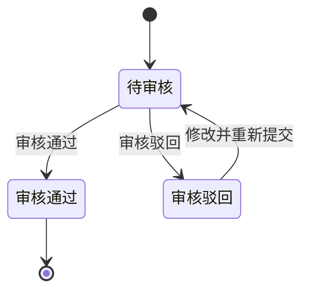

<div id="section-16-3"></div>

### 16.3 录入与审核规则

1. 账单录入的冲正记录和调账中心批量导入的冲正记录，最终都统一在调账中心审核，且归属账单由财务在审核时确认。
2. 应收账单调账、返款账单调账和成本账单调账共用同一审核入口，但字段、默认归属、审核归属和生效对象按各自账单类型处理。
3. `待审核` 记录可以修改、移除、审核。
4. 提交人只能修改和移除自己提交的待审核记录。
5. 审核人只能审核，不能代替提交人修改内容。
6. `审核通过` 记录进入只读态，不允许再次修改或移除，只能通过新增反向调账修正。
7. `审核驳回` 记录保留驳回原因，提交人可重新编辑后再次提交；重新编辑后仍回到 `待审核` 状态。
8. 批量移除、批量审核仅对待审核记录生效，混入其它状态时应禁用相应操作。
9. 归属账单未确认且系统未生成有效默认归属的调账记录，不允许审核通过。
10. 调账记录必须明确记录来源、去向、金额、币种、原因和凭证。
11. 成本金额冲正必须关联供应商、原成本账单、原成本明细和受影响业务对象；成本核销冲正必须关联原结清记录，并明确错误记录、反向记录和正确记录之间的关系。
12. 成本调账的提交人与审核人必须分离；审核人不得修改提交内容后直接通过。

<div id="section-16-4"></div>

### 16.4 生效与归属规则

1. 应收账单中的特定费项冲正完成后，系统按费项归属把结果计入对应应收账单的本期调账或往期调账，不直接覆盖历史快照。
2. 返款账单中的特定费项冲正完成后，系统按费项归属把结果计入对应返款账单的本期调账或往期调账，不直接覆盖历史快照。
3. 调账通过审核后，才允许影响对应应收账单或返款账单的应收金额、应返金额或核销结果，或者影响成本调整记录、成本归属、成本核销结果和利润分析。
4. 如果原始金额已经进入 `BMS费项池`，修正动作必须走调账中心，不允许直接回写源数据。
5. 已结清账单若再发现差异，不能直接改写历史账单金额，必须通过后续账单、反向调账承接。
6. 调账记录一旦审核通过，必须保留历史状态、审核轨迹和凭证，不允许被后续操作直接覆盖。
7. 账单中的任何未移除冲正记录，只有在调账中心全部审核通过后，整份账单才允许审核通过。
8. 调账中心也不触发源数据重采，不改变 `BMS检阅标记` 的状态流转。
9. 已结清成本账单发生金额差异时，调账中心生成新的成本调整明细和关联关系，原成本账单金额、编号和状态保持不变。
10. 已结清成本账单发生核销信息错误时，调账中心以新增反向核销记录和正确核销记录完成修正，不修改或删除原核销流水。
11. 成本调账形成待结清差额时，差额按供应商、币种和成本账期形成独立待结清记录；后续结清该差额不改变原成本账单状态。
12. 成本调账影响间接成本时，必须生成新的分摊版本；影响已确认`成本已齐`订单时，必须退回`成本未齐`并重算利润。

<div id="section-16-5"></div>

### 16.5 自动归属规则

1. 对于尚未归属任何应收账单的应收账单调账记录，系统在导入后先预生成默认归属，但该归属不等于最终审核归属。
2. 对于尚未归属任何返款账单的返款账单调账记录，系统在导入后先预生成默认归属，但该归属不等于最终审核归属。
3. 调账记录的归属账单由财务在审核时最终确认；财务可以沿用系统预生成的默认归属，也可以手动改派到另一份同类型的有效待审核账单。
4. 应收账单调账默认优先选择同客户、同账期内的有效待审核应收账单；`已作废`账单不得作为归属账单。
5. 返款账单调账默认优先选择同客户、同账期内的有效待审核返款账单；`已作废`账单不得作为归属账单。
6. 在同一客户、同一账期内，若可候选账单中存在财务本位币汇总金额最高的那一份，应优先选择该账单作为默认归属。
7. 选择财务本位币汇总金额最高的账单，是为了让冲正金额叠加后更不容易把单张账单推到负值。
8. 若候选账单的财务本位币汇总金额相同，系统应按账单编号升序选出唯一承接账单，账单编号以固定且唯一的规则生成，不会重复。
9. 自动归属只处理尚未归属任何应收账单或返款账单的调账记录，不影响已经归属完成的记录。
10. 成本账单调账不使用客户账单的自动归属算法。成本调账必须明确关联原成本账单；无法关联原成本账单的新增成本，应作为新的成本明细或新的成本账单处理，不得由系统猜测归属。


<div id="section-16-6"></div>

### 16.6 与账单的关系

1. 应收账单中的调账影响应收金额、已收金额和未收金额的展示与核销口径。
2. 返款账单中的调账影响应返金额、已返金额和未返金额的展示与核销口径。
3. 成本账单中的成本金额冲正影响成本调整金额、成本归属和利润；成本核销冲正影响结清流水及人民币换算结果，但不改变原成本账单的`已结清`状态。
4. 调账中心只是修正入口，不等于应收账单、返款账单或成本账单本身。
5. 调账中心产生的结果最终仍要由对应账单线或独立成本调整记录承接，不能绕过账单直接改写历史结果。

<div id="section-17"></div>

## 17. 非功能需求

非功能需求约束的是系统在所有账单模块中的横向表现。它不重新定义业务规则，但必须保证账单生成、审核、核销、调账、导出和追溯过程稳定、可控、可复盘。

<div id="section-17-1"></div>

### 17.1 权限与职责边界

1. 系统必须按角色控制配置、生成、审核、发送、核销、反核销、调账、冲正、导出和回款管理等操作。
2. 同一笔业务操作应区分提交人、审核人、核销人和查询人；需要审核的动作不得由同一角色绕过审核直接生效。
3. 待审核、待结清、已结清等状态下的可执行操作必须与各章节状态机一致，页面按钮、批量操作和接口入口都必须遵守同一权限口径。
4. 无权限操作必须给出明确提示，并记录拦截结果；不得仅隐藏入口而缺少服务端校验。
5. 导出权限应单独控制。能查看账单不代表一定能导出客户对账报表或内部审计信息。
6. 成本中心应分别控制供应商档案维护、成本费项索引维护、导入设置快照中的费项映射维护、供应商账单导入、单号关系维护、成本类型切换、成本归属、分摊规则维护、分摊执行、结清登记、成本调账、利润查看和内部成本导出权限，不得用单一“成本中心管理”权限覆盖全部高风险操作。
7. 成本金额冲正、成本核销冲正、分摊规则变更和`成本已齐`确认应区分提交人与审核或确认人；同一人员是否允许兼任由角色权限明确配置，不得由页面临时放开。

<div id="section-17-2"></div>

### 17.2 数据一致性与防回写

1. 已进入审核、待结清或已结清阶段的账单，不得被后续配置变更、汇率变更、源数据变化或重跑任务直接回写。
2. 已被 `BMS费项池` 成功采集的来源金额，不允许在数据源侧直接删除或覆盖；修正必须通过补录、调账、冲正或后续账单承接。
3. 源数据行级标记、账单明细、金额汇总、核销流水和调账记录之间必须保持一致；任一环节失败时，不得出现只更新部分结果的状态。
4. 同一来源费项只能按业务用途进入对应账单线。返款扣减项被返款账单占用后，应收账单不得再次把该金额作为可核销应收金额。
5. 账单结清后触发的支付状态同步，只能更新支付状态，不得改写费项金额、币种、汇率、账单快照或历史核销结果。

<div id="section-17-3"></div>

### 17.3 幂等、并发与恢复保护

本节只定义系统横向保护要求，不重复定义账单重跑的业务分流规则；具体重跑路径和状态边界见<a href="#section-9">9. 账单生成/重算机制</a>。

1. 账单生成、失败重试、补跑、重跑、金额重算、导入和核销动作必须具备幂等保护，重复触发不得生成重复账单、重复明细、重复核销或重复调账结果。
2. 同一客户、同一账期、同一配置组的账单生成流程不得并发执行；已有任务执行中时，后续任务应提示被占用或排队处理。
3. 源数据被任务锁定期间，不得被其它任务重复采集；锁定失败、任务中断或执行超时必须有可恢复处理。
4. 一般批量操作应保证每条记录的成功、失败和失败原因可见，不能用整体成功掩盖部分失败；<a href="./成本中心.PRD.md">《成本中心 PRD》5. 成本费项标准化与供应商账单导入</a>按整批原子规则处理，只允许完全成功或失败，不适用部分成功口径。
5. 重跑或重算后的结果必须能与原账单结果、来源快照和操作原因关联，避免财务无法解释金额变化；具体记录要求见<a href="#section-9-10">9.10 最后一道防线：操作前预览，操作后留痕</a>。

<div id="section-17-4"></div>

### 17.4 金额、币种与精度

1. 所有金额展示、汇总、核销和导出必须明确金额所属币种，不得把不同结算币种金额混合成单一余额。
2. 原始币种金额、费项结算币种金额、货款结算币种金额、财务本位币金额和汇兑损益必须按<a href="#section-15">15. 金额汇兑</a>的口径计算与展示。
3. 汇率一旦在账单侧锁定，后续市场汇率、基准汇率表或客户级汇率配置变化不得自动影响历史账单金额。
4. 金额计算应保持明细、币种分桶汇总、账单总览、核销余额和导出结果一致。
5. 负数、超收、超返、部分核销和跨账期冲正必须有明确提示，不能只在后台形成异常状态。

<div id="section-17-5"></div>

### 17.5 对账导出与信息边界

1. `导出给客户`面向客户与财务对账，不是系统审计报表；导出内容只保留客户核对账单结果所需的信息。
2. 应收账单和返款账单的客户导出必须按对账报表整合格式输出账单基本信息、结算币种分桶金额汇总、账单明细和往期账单冲正信息。
3. 客户导出文件不得包含内部任务状态、内部快照版本、内部审批意见、源数据锁定标记、系统审计字段或客户不需要关注的技术字段。
4. 客户要求追加字段时，只允许追加订单费用报表中可用于识别、筛选或辅助核对的非金额字段；不得追加会造成金额口径混乱的原始金额、内部汇率或内部结算字段。
5. 应收账单的`导出给内部`只汇总所选账单的费项明细和对应账单基本信息，不输出客户告示、客服二维码、收款账户、收款二维码、账单汇总或往期账单冲正 Sheet，也不得用于向客户发送账单。
6. 两种导出结果均必须与任务创建时固化的当前生效账单结果一致；历史快照只用于系统内审计、追溯和防回写判断，不作为导出对象。

<div id="section-17-6"></div>

### 17.6 可用性与操作体验

1. 财务日常高频页面应围绕账期、客户、账单状态、审核状态、核销状态、回款状态和异常状态提供清晰筛选。
2. 列表、详情、金额汇总、明细区和核销记录之间的字段命名必须一致，避免同一含义在不同页面使用不同名称。
3. 关键动作必须在提交前展示影响范围，例如影响的账单、费项、金额、币种、核销结果和是否会产生调账或冲正。
4. 审核、核销、反核销、重跑、折返审核、批量移除和批量导出等高风险动作必须有二次确认或明确结果反馈。
5. 页面异常提示应使用财务能理解的业务语言，说明失败原因、影响范围和下一步处理方式。

<div id="section-17-7"></div>

### 17.7 异常恢复与告警

1. BMS任务因技术原因执行异常时，系统必须自动重试，不得要求财务介入技术恢复过程。自动重试期间任务保持`执行中`，达到重试上限后直接进入`执行失败`。
2. 每次自动重试必须记录任务编号、失败阶段、失败原因、重试时间和重试结果，并保证同一任务不会产生重复账单、重复费项或重复调整结果。
3. `执行失败`任务必须展示财务可以识别的失败阶段和结果。技术问题解决后，账单生成和账单重算任务可以按原任务执行快照重新执行；费项入池任务由系统内部恢复。系统不得提供人工继续执行一个尚处于`执行中`的任务入口。
4. 客户级账单配置和客户级汇率配置必须在保存、确认或启用时完成完整性、合法性和冲突校验。校验不通过时必须阻断操作，不得把可提前识别的配置问题延迟到任务执行阶段。
5. 任务执行阶段若仍发现账单配置或汇率配置数据不一致，应进入`执行失败`并产生内部告警，不得要求财务在任务页面临时修正后继续原任务。
6. 导入、核销、导出和支付状态同步失败时，系统必须记录失败原因，并按对应业务权限提供重试或纠错入口。
7. 已完成的账单结果不得因后续异常被自动撤销；需要修正时，应按状态机、调账或冲正规则处理。

<div id="section-17-8"></div>

### 17.8 数据安全与信息保护

1. 系统应按客户、角色和业务范围控制数据可见性，防止不同客户账单、订单、回款和返款信息被越权查看。
2. 客户对账报表只输出客户可见信息；内部配置、内部审核、内部成本、内部汇率来源和系统审计字段不得向客户暴露。
3. 下载、导出和批量查询应记录操作人、时间、条件和文件类型，便于追溯敏感数据流向。
4. 敏感操作产生的日志应可用于审计，但不得在普通页面暴露不必要的内部实现细节。
5. 历史账单、快照、核销流水和调账记录应按财务审计要求保留，删除或归档策略不得破坏账单追溯链路。

<div id="section-18"></div>

## 18. 内部审计

内部审计用于集中查询 BMS 中影响账单金额、成本归属、结清结果和客户对账结果的关键操作。审计记录只用于内部追溯，不进入客户邮件或对账报表；普通业务页面可以展示与当前对象直接相关的操作记录，但不得允许修改审计内容。

<div id="section-18-1"></div>

### 18.1 审计范围

以下操作必须形成审计记录：

1. 客户级账单配置、基准汇率表、账单内锁定汇率、客户侧费项索引、成本费项索引、间接成本分摊规则、导入设置快照中的费项映射、场景取值规则、数据源规则和供应商财务档案变更；特调汇率变更按<a href="#section-8-4">8.4 特调汇率规则</a>只保留最近操作信息，不生成独立审计记录。
2. 账单首次生成、补充生成、替换生成、期末收口、失败重试、金额重算、审核、驳回、发送、作废、核销、核销记录冲正、调账、冲正和导出。
3. 供应商账单导入、导入失败、疑似重复确认、成本账单结清登记、成本金额冲正、成本核销冲正和成本核销汇率锁定。
4. 供应商侧单号关系新增、修改、停用，以及成本明细在直接成本和间接成本之间切换。
5. 间接成本分摊集形成、处理方式确认或变更、不分摊原因、拆分、合并、成本明细加入或移出、分摊集规则变更、对象范围变更、分摊因子变更、执行分摊、版本生效和版本失效。
6. 业务订单`成本已齐`确认、退回`成本未齐`和由晚到成本或分摊重算触发的利润重算。

<div id="section-18-2"></div>

### 18.2 审计记录内容

1. 每条记录至少包含业务模块、操作对象类型、操作对象编号、操作类型、操作人、操作时间、操作原因、前值快照、后值快照和执行结果。
2. 涉及账单、任务、订单、尾程包裹、成本明细、间接成本分摊集或调账时，应保存相应关联编号，使财务能够沿业务链路追溯。
3. 系统自动触发的操作应把操作主体标记为`系统`，同时记录触发来源和关联业务操作，不得伪装为某个财务人员操作。
4. 操作失败或被系统阻断时，也应记录失败原因和阻断规则；失败记录不得写入虚假的业务后值。
5. 历史快照、金额快照、汇率快照、核销流水和分摊版本只允许追加或生成新版本，不允许静默覆盖。

<div id="section-18-3"></div>

### 18.3 成本中心专项审计

1. 成本类型切换应记录原成本类型、目标成本类型、原归属对象、原分摊集、目标归属方式、切换依据和受影响订单。
2. 成本明细因规则或分摊集键变化从一个分摊集迁移到另一个分摊集时，应记录原分摊版本失效和新分摊版本生效的完整过程，证明该成本没有被重复分摊。
3. 分摊规则变更应保存成本费项索引、成本板块、适用供应商、供应商收费单位、范围锚点、候选订单条件、业务订单清单、优先与兜底分摊因子、例外处理规则、分摊集币种与金额、尾差处理及变更前后结果。
4. 成本完整性记录应说明财务确认`成本已齐`时检查的应有成本范围、未决明细数量、分摊完成情况和汇率锁定情况；自动退回`成本未齐`时应记录触发原因。
5. 成本核销汇率记录应按币种保存汇率、汇兑方向、确认时间、结清记录和人民币金额；后续汇率配置变化不得修改已锁定记录。
6. 成本归属或分摊变化引起暂估实际利润、实际利润变化时，应记录受影响订单、变更前后利润和重算依据，但不得把利润变化写回客户侧账单。
7. 已结清成本账单的金额冲正应记录原成本账单、原成本明细、冲正金额、新成本调整记录和受影响订单；核销冲正应记录原核销流水、反向流水、正确流水和各自汇率快照。
8. 成本账单不允许返结清。任何试图修改或删除已结清状态、原结清流水或锁定汇率的操作都应被阻断，并记录操作人、操作时间、目标对象和阻断原因。

<div id="section-18-4"></div>

### 18.4 查询与权限

1. `内部审计`菜单仅对具有审计查询权限的财务管理人员开放；审计记录不得编辑或删除。
2. 支持按业务模块、操作对象、客户、供应商、账单号、主订单号、尾程运单号、成本明细号、分摊集编号、调账记录号、操作人、操作类型和时间范围组合查询。
3. 审计详情应并列展示前值与后值，并提供关联对象跳转；涉及多币种金额时按币种分桶展示。
4. 导出审计结果应受独立权限控制，并记录导出条件、导出人、导出时间和文件结果。
5. 审计记录的保留、归档和查询性能应满足财务审计周期要求，归档后仍不得破坏账单、成本和分摊版本的追溯链路。

<div id="section-19"></div>

## 19. 附录

<div id="section-19-1"></div>

### 19.1 业务术语表

| 术语 | 定义 | 术语 | 定义 |
| :--- | :--- | :--- | :--- |
| 费项 | 进入账单归集的费用明细，包括机算费项、导入费项和手工补录费项。 | 应收账单 | 天马运通向客户收取费项时出示的账单。 |
| 返款账单 | COD 包裹代收货款返还给客户时出示的账单。 | 成本账单 | 供应商向我方提供、由财务在 BMS 登记并核对的收费账单，用于归集直接成本和分摊间接成本。 |
| 待审核 | 账单已经生成，仍在财务内部处理；已收口时可按常规路径审核，未收口时必须先完成提前收口。 | 账期收口状态 | 表示实际账期范围内的数据是否完整，枚举值为`未收口`、`已收口`。 |
| 提前收口 | 财务在原账期结束前确认以数据截止点截断实际账期，系统完成截断范围校验和收口后再审核。 | 截断账期 | 原完整账期被截短后实际用于账单归集、审核和对账的连续日期范围。 |
| 已作废 | 未发出的待审核账单被替换生成的新账单成功取代后的终态。 | 账单发出时间 | 账单首次通过邮件、客户端或其它方式对客户开放查看、下载或送达的时间，是禁止作废和替换生成的边界。 |
| 通知状态 | 系统向客户邮箱发送账单邮件的结果，枚举值为`已通知`、`通知失败`、`未配置邮箱`。 | 待结清 | 账单审核通过后进入客户对账及资金结清阶段；页面可按进度显示`待结算`或`部分待结算`。 |
| 已结清 | 账单全部金额闭环，仅保留查询与审计。 | 锁定汇率 | 生成或审核时冻结的汇率快照，具体口径见<a href="#section-15">15. 金额汇兑</a>。 |
| 仅展示不核销 | 事实金额已进入账单分摊范围，但仅在账单中呈现，不纳入任何账单的核销范围。 | 逾期未结清 | 非真实账单状态，是待结清账单中“超过信用期且未收齐款项”的常用筛选条件和展示标签。 |

<div id="section-19-2"></div>

### 19.2 业务系统基本面

本节记录当前业务系统（OIS）已经形成的基础事实，账单配置、账单生成规则、以及数据同步均以此为前提。OIS 主要由 OMS、WMS、TMS 构成。

<div id="business-baseline-core-objects"></div>

<div id="section-19-2-1"></div>

#### 19.2.1 核心对象关系

<div id="section-19-2-1-1"></div>

##### 19.2.1.1 提及原因

BMS 的账单配置、账单生成、对账和核销都建立在 OIS 已有业务对象之上。系统并不是直接面对一张孤立订单，而是沿着`供应链 -> 店铺 -> 会员 / 客户 -> 集运单`这条业务链路识别费用归属。

本节参考`系统核心对象关系图`，并结合现有系统实现完成核对后，将核心对象关系沉淀为产品口径。后续涉及客户级账单配置、客户级汇率配置、费项归集、对账报表和核销时，都应沿用本节定义的对象边界。

<div id="section-19-2-1-2"></div>

##### 19.2.1.2 核心关系概览

OIS 的核心对象关系可以理解为三层：

1. 资源层：供应链、店铺、客户组、会员、KA客户 / 货主、集运仓。
2. 产品层：物流渠道 / 尾程承运商、线路报价。
3. 执行层：集运单。

其中，供应链是最上层组织，店铺是对外经营入口，客户组是店铺下归集客户的分组关系，会员是集运客平台的下单主体，KA客户 / 货主是财务和合同更关注的客户主体，集运仓是履约节点，物流渠道和线路报价决定订单采用的运输服务与报价基础，集运单是费用归集和账单生成的核心执行对象。

<div id="section-19-2-1-3"></div>

##### 19.2.1.3 对象关系说明

| 对象 | 产品含义 | 与账单的关系 |
| :--- | :--- | :--- |
| 供应链 | 可理解为一个跨境物流集团或经营组织，是店铺、仓库、客户和物流产品的上层归属。 | BMS 的账单数据必须在供应链范围内隔离，不能跨供应链归集费用或核销款项。 |
| 店铺 | 面向客户经营的服务入口，可配置独立域名、服务客群、启用仓库、物流产品和差异化汇率。 | 店铺决定订单从哪个经营入口产生，也影响账单配置匹配、店铺汇率兜底和对账报表归属。 |
| 客户组 | 店铺下的客户归集分组；一个店铺可有多个客户组，一个客户组可下挂多个客户。 | 客户组用于识别客户的适用范围，BMS 只读取订单已沉淀的客户组，不重新划分客户组。 |
| 会员 | 集运客平台的下单账号，通常由店铺开通和管理。 | 会员是订单下单主体。BMS 生成账单时，需要保留会员维度，避免只按客户名称或订单号归集导致串账。 |
| KA客户 / 货主 | 与供应链或店铺存在业务合作关系的客户主体，可启用集运客平台账号。 | 财务对账通常面向客户 / 货主进行，BMS 需要把客户口径与会员账号、店铺口径关联起来。 |
| 集运仓 | 接收头程包裹、完成仓内作业并推动订单履约的物理节点。 | 仓库不直接等同于账单主体，但会影响出库、核重、订单完结、费用产生和分支账单配置命中。 |
| 物流渠道 / 尾程承运商 | 承运商服务被包装成面向客户可选择的物流产品。 | 决定订单后续运输路径、尾程包裹轨迹和部分费用口径，BMS 只读取订单已沉淀的结果。 |
| 线路报价 | 某店铺下针对特定路线、承运商、重量或体积规则形成的报价方案。 | 决定订单费用产生的报价基础，BMS 不重新判定报价，只归集和快照订单侧已产生费用。 |
| 集运单 | 会员或客户在店铺下形成的核心业务单据，承接包裹、仓库、线路、承运商、费用和履约节点。 | 是 BMS 账单生成的核心执行对象。应收账单、返款账单、回款管理和对账报表都围绕集运单及其费用结果展开。 |

<div id="section-19-2-1-4"></div>

##### 19.2.1.4 已验证的业务事实

结合现有系统实现核对后，本 PRD 按以下业务事实设计 BMS 需求：

1. 一条账单主体链路必须同时包含供应链、店铺、会员和客户相关信息，不能只依赖客户名称或订单号。
2. 店铺和会员不是同一对象：店铺是经营入口，会员是下单账号；同一个客户在不同店铺下产生的订单，需要按店铺维度区分。
3. KA客户 / 货主和会员也不是天然等同：客户是财务对账和合同口径，会员是平台账号口径；BMS 需要在账单快照中保留二者关系。
4. 店铺可启用特定集运仓、物流产品、线路报价和汇率口径，因此店铺是账单配置、汇率兜底和费用归属的重要匹配维度。
5. 集运单已经沉淀了店铺、会员、仓库、承运商、尾程运单、费用和履约节点等信息，BMS 账单生成应读取这些已形成事实，而不是重新定义上游对象关系。
6. 物流产品和线路报价属于订单费用产生前的业务约束，BMS 不重新计算其可用性，只在账单明细、对账报表和追溯信息中保留订单侧结果。
7. 一个店铺可有多个客户组，一个客户组可下挂多个客户；客户组是 OIS 已形成的客户归集主数据，订单已沉淀所属店铺、客户组和客户关系，BMS 只读取该关系。

<div id="section-19-2-1-5"></div>

##### 19.2.1.5 BMS 使用口径

1. 客户级账单配置以客户为财务主体，但适用范围可按店铺、客户组或客户设置，并按`客户级 > 客户组级 > 店铺级`命中。账单结果始终为客户级：按店铺或客户组配置生成账单时，适用对象内每个客户分别生成独立客户级账单；店铺和客户组只作为账单列表的筛选维度，批量下载按任务编号或配置编号筛选结果进行，不改变账单归属客户。账单生成仍保留供应链、店铺、客户组、会员和客户维度。
2. 账单生成必须按订单已沉淀的主体关系归集费用，不能跨供应链、跨店铺或跨客户合并。
3. 分支账单配置可使用业务板块、运抵国、集运仓等条件进一步拆分账单，但不能改变订单原有主体归属。
4. 对账报表面向客户和财务核对，应展示客户能理解的订单、运单、仓库、承运商、费用和状态信息，不暴露系统内部对象编号。
5. 汇率兜底、费用归属、返款归属和核销归属，都必须以账单生成时固化的对象快照为准。
6. BMS 对上游核心对象只做读取、快照和对账，不反向改变 OIS 中的客户、会员、店铺、仓库、物流产品和线路报价配置。
7. 客户组作为 OIS 已形成的主数据，BMS 只读取并快照订单侧已沉淀的店铺、客户组和客户关系，不反向修改客户组及客户挂靠关系。

<div id="business-baseline-fee-payment-methods"></div>

<div id="section-19-2-2"></div>

#### 19.2.2 费项支付方式

<div id="section-19-2-2-1"></div>

##### 19.2.2.1 提及原因

费项支付方式是 OIS 已经存在的业务基本面，BMS 账单生成不能只看“费用是否产生”，还必须判断“费用由谁承担、何时支付、是否已经通过其他路径完成支付”。

对 BMS 账单管理来说，支付方式的核心影响如下：

1. 若费项已通过预存款扣款或收方到付完成支付，原则上不应再次作为寄方应收金额进入应收账单。
2. 若费项按账期后付或寄方后付，才需要按客户级账单配置归集到应收账单。
3. 同一类费项在不同业务场景下可能走不同支付路径，账单生成必须保留来源支付方式，便于后续对账、冲正和核销追溯。
4. 支付途径用于识别资金动作来源；支付时机用于判断费项是否进入账单、进入哪类账单以及何时进入账单。

<div id="section-19-2-2-2"></div>

##### 19.2.2.2 支付方式分类

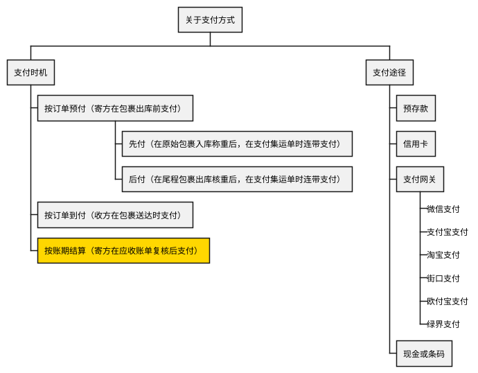

预付下的`现付`和`后付`是在运抵国配置面板中设置的运抵国级规则。BMS 只读取 OIS 已沉淀到来源数据中的支付时机结果，用于判断费用是否已通过预付链路完成支付，以及是否还需要进入应收账单。归集时使用的支付状态字段见<a href="#section-19-2-3-3">19.2.3.3 BMS 归集费项时使用哪些非金额字段？</a>。

<div id="section-19-2-2-3"></div>

##### 19.2.2.3 超材费扣款逻辑示例

超材费用于说明同一费项在不同支付条件下的归属差异。超材费作为机算费项产生后，需要先判断寄方预存款是否足以覆盖该费用；若不能覆盖，再根据费项收取方式判断由收方到付还是寄方后付。

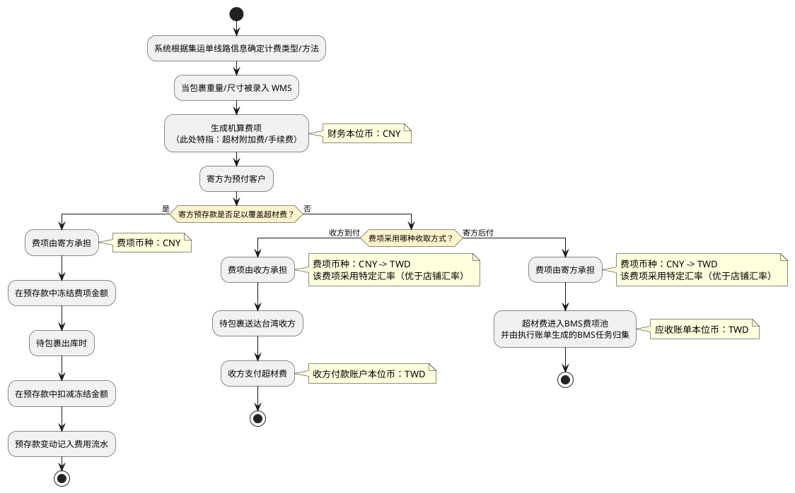

<div id="section-19-2-2-4"></div>

##### 19.2.2.4 账单生成影响

1. 预存款扣款场景下，费用应体现为预存款冻结、扣减和费用流水，不再重复进入应收账单应收金额。
2. 收方到付场景下，费用由收方支付，BMS 可保留展示和追溯信息，但不得作为寄方应收账单的可核销应收金额。
3. 寄方后付场景下，费用应先进入`BMS费项池`，再由执行账单生成的BMS任务按<a href="#section-7">7. 客户级账单配置</a>和<a href="#section-15">15. 金额汇兑</a>形成账单金额。
4. 支付方式、承担方、支付币种、汇率口径和资金流水应在来源数据或账单明细中保留可追溯关系，避免后续重跑、补录或冲正时重复归集。

<div id="business-baseline-fee-sources"></div>

<div id="section-19-2-3"></div>

#### 19.2.3 客户侧费项的 OIS 数据源

本节记录应收账单和返款账单涉及的客户侧费用在 OIS 中的现状，包括存储结构、来源表、关联字段、金额与币种字段、时间与支付字段以及两类附加费导入形成的数据差异。

成本费项不在本节范围内，其来源和导入方式见<a href="./PRD.成本中心.md">《成本中心 PRD》5. 成本费项标准化与供应商账单导入</a>。客户侧费项的业务对象层级见<a href="#section-19-2-1">19.2.1 核心对象关系</a>。

<div id="section-19-2-3-1"></div>

##### 19.2.3.1 OIS 怎样存放费用数据？

OIS 保存费用时存在三种数据结构：

1. `费项横表`：同一条业务记录通过多个金额字段保存不同费项。费项名称由金额字段决定，例如`freight`表示运费、`warehouse_rental_amount`表示仓租费。
2. `费项纵表`：一条记录只表达一项费用或一项费用事件，费项名称、金额和币种保存在该记录中。同一业务对象发生多项费用时，通过增加多条记录而非增加新的金额字段表达。
3. `多行横字段混合结构`：同一业务订单可以对应多条明细记录，每条明细记录中又包含多个固定金额字段。

<div id="section-19-2-3-2"></div>

##### 19.2.3.2 各来源表怎样保存并关联业务对象？

OIS 的费用数据主要分布在以下六张表中，OIS 集运单在 BMS 中按`业务订单`理解。完整对象层级见<a href="#section-19-2-1">19.2.1 核心对象关系</a>，账单中的费项挂靠规则见<a href="#section-10-2">10.2 核心设计思路</a>。

| 来源表 | 存储方式 | 一条记录表示什么 | 关联字段 | 关联对象 | 补充说明 |
| :--- | :--- | :--- | :--- | :--- | :--- |
| `ofp_ofdb1.sale_order_header` | 费项横表 | 一笔业务订单；同一行包含多个订单级金额字段 | `id`、`order_code` | 业务订单 | 保存业务订单主体及部分金额字段；`order_type = "BILL"`的记录为虚拟业务订单。 |
| `ofp_ofdb1.sale_order_header_extend` | 费项横表 | 一笔业务订单的扩展信息；同一行包含多个扩展金额字段 | `sale_order_id` | 业务订单 | `sale_order_id`关联`sale_order_header.id`，并保存订单完结时间等扩展事实。 |
| `ofp_ofdb1.sale_order_package_fee` | 多行横字段混合结构 | 一个费用方向下的一笔尾程包裹费用明细；同一业务订单可以对应多条包裹级记录 | `sale_order_id`、`tail_way_bill_no` | 尾程包裹 | 订单费项报表导入后形成的包裹级明细，直接保存包裹级回款金额；`sale_order_id`关联`sale_order_header.id`。主键为`id`，唯一索引为`type + sale_order_id + tail_way_bill_no`，同一尾程包裹可以分别存在应收行和成本行。 |
| `ofp_ofdb1.sale_order_fee_detail` | 多行横字段混合结构 | 一笔订单费用明细；同一业务订单可以对应多条记录，每条记录仍包含多个金额字段 | `sale_order_id` | 业务订单 | 同一业务订单可以存在多条独立的费用明细记录。 |
| `ofp_ofdb1.sale_order_additional_matter` | 费项纵表 | 一项附加事项；同一业务订单可以对应多条记录 | `sale_order_id`、`bill_waybill_no`、`sub_bill_waybill_no` | 业务订单或尾程包裹 | `sale_order_id`关联业务订单，收款运单号和子运单号记录附加费涉及的尾程运单；两种导入入口的差异见<a href="#section-19-2-3-5">19.2.3.5 同一张附加事项表，为什么要区分两种导入？</a>。 |
| `ofp_ofdb1.claim_order` | 业务事件纵表 | 一笔理赔；同一订单编号可以对应多条记录 | `order_code` | 业务订单 | 同一业务订单可以存在多条独立的理赔记录。 |

`ofp_ofdb1.sale_order_package_fee.type`和`ofp_ofdb1.sale_order_fee_detail.type`采用相同口径：`1`表示应收，`2`表示成本。客户侧费项使用应收数据，成本数据由成本中心处理；其它值没有已定义的业务含义。

订单费项报表导入的数据先按尾程包裹粒度写入`ofp_ofdb1.sale_order_package_fee`，再汇总为业务订单粒度的`ofp_ofdb1.sale_order_fee_detail`。前者保留包裹级回款明细，后者承接订单级汇总；两张表不得被理解为两份彼此独立的回款来源。

订单主表和订单扩展表中的金额在订单出库前仍可能变化，金额稳定过程见<a href="#section-19-2-4">19.2.4 费项重算窗口</a>。附加事项和理赔以新增记录表达新增业务事实，不在订单原记录中继续增加金额字段。

<div id="section-19-2-3-3"></div>

##### 19.2.3.3 BMS 归集费项时使用哪些非金额字段？

下表只列 BMS 归集 OIS 费用时正式使用的非金额字段，包括用于判断来源数据能否进入本次范围的过滤字段，以及写入`BMS费项池`后仍需保留的采集字段。同一字段可以同时用于过滤和采集；某张来源表不涉及的分组以`--`表示。金额字段见<a href="#section-19-2-3-4">19.2.3.4 OIS 有哪些客户侧费用字段？</a>，订单或包裹关联字段见<a href="#section-19-2-3-2">19.2.3.2 各来源表怎样保存并关联业务对象？</a>，均不在本表重复列示。

| 来源表 | 归属范围 | 费项识别 | 扫描时间 | 业务状态 | 支付信息 | 金额币种 |
| :--- | :--- | :--- | :--- | :--- | :--- | :--- |
| `ofp_ofdb1.sale_order_header` | `member_code`<br>`shop_id`<br>`sc_id`<br>`order_type`<br>`country_code`<br>`dest_warehouse_code`<br>`warehouse_code` | -- | `delivery_time` | -- | -- | `currency`<br>`dest_country_currency_code` |
| `ofp_ofdb1.sale_order_header_extend` | -- | -- | `order_completed_time` | -- | -- | -- |
| `ofp_ofdb1.sale_order_package_fee` | -- | `type` | `create_time` | -- | -- | -- |
| `ofp_ofdb1.sale_order_additional_matter` | -- | `fee_item_type` | `create_time` | -- | `payment_method`<br>`fee_pay_status` | `fee_amount_currency` |
| `ofp_ofdb1.claim_order` | `member_code`<br>`user_id`<br>`dealer_shop_id` | -- | `create_time` | `status`<br>`customer_service_audit_status`<br>`finance_audit_status` | `payment_status` | `currency`<br>`real_currency` |

字段使用口径如下：

1. `归属范围`：匹配任务锁定的客户、店铺和供应链，以及账单配置中的业务场景、运抵国和仓库。`order_type = "BILL"`表示虚拟业务订单。
2. `费项识别`：`sale_order_package_fee.type`用于区分费用方向，`1`表示应收，`2`表示成本；BMS 归集客户侧费项时只采集`type = 1`的记录。`sale_order_additional_matter.fee_item_type`用于匹配启用中的客户侧费项及场景取值规则。
3. `扫描时间`：履约节点为`出库`时使用`delivery_time`，为`订单完结`时使用`order_completed_time`。`sale_order_package_fee`本身不保存这两个履约时间，系统通过`sale_order_id`关联业务订单，并按账单配置中的`履约节点`选用对应时间；不得以订单费项报表的导入时间代替。`记账单导入`形成的直接客户附加费使用`create_time`，其它附加费跟随真实业务订单的履约节点；理赔记录使用`update_time`。
4. `业务状态`：理赔记录只归集有效且已通过客服、财务审核的数据。
5. `支付信息`：`payment_method`记录附加费的`收取方式`，是应收归集的必要过滤字段；只有其值表示`账期支付`时，该附加费才进入应收归集范围。`fee_pay_status`和理赔记录的`payment_status`用于排除已经完成支付处理的数据，并随来源记录保留以供追溯。
6. `金额币种`：`currency`和`currency_code`记录来源订单现有币种信息，`dest_country_currency_code`记录目的国币种。币种字段与来源金额一并采集并保留原值，不参与账期范围判断；来源未明确币种时的默认规则见<a href="#section-9-5-3">9.5.3 系统从哪里取金额和币种？</a>，换算规则见<a href="#section-15">15. 金额汇兑</a>。

<div id="section-19-2-3-4"></div>

##### 19.2.3.4 OIS 有哪些客户侧费用字段？

下表统一记录 OIS 当前存在的客户侧费用字段及其财务名称、账单挂靠对象、费项类型、是否由系统计算、最早形成阶段和 BMS 原始币种或汇率口径。费项类型由费项索引定义，见<a href="#section-9-9-3-2">9.9.3.2 费项索引怎样定义费项类型？</a>；挂靠对象边界见<a href="#section-10-2">10.2 核心设计思路</a>。附加事项行按`附加费用报表导入`的现有数据关系列示。

<style>
.fee-source-table {
  border-collapse: collapse;
  width: 100%;
  min-width: 1320px;
}
.fee-source-table th {
  background-color: #000000;
  color: #ffffff;
  border: 1px solid #666666;
  padding: 4px 6px;
  text-align: left;
}
.fee-source-table td {
  border: 1px solid #999999;
  padding: 3px 6px;
}
.fee-source-table .source-extend { background-color: #f4cccc; }
.fee-source-table .source-header { background-color: #d9ead3; }
.fee-source-table .source-package-fee { background-color: #d9eaf7; }
.fee-source-table .source-claim { background-color: #fff2cc; }
.fee-source-table .source-additional { background-color: #ffffff; }
</style>
<div style="overflow-x: auto;">
<table class="fee-source-table">
  <thead>
    <tr>
      <th>OIS 字段或筛选条件</th>
      <th>费项名称</th>
      <th>挂靠对象</th>
      <th>费项类型</th>
      <th>是否机算费项</th>
      <th>最早产生时刻</th>
      <th>币种</th>
    </tr>
  </thead>
  <tbody>
    <tr class="source-extend"><td><code>ofp_ofdb1.sale_order_header_extend.tail_freight_amount</code></td><td>派送费</td><td>业务订单</td><td>应收类</td><td><code>是</code></td><td>业务订单完成核重</td><td>店铺币种</td></tr>
    <tr class="source-extend"><td><code>ofp_ofdb1.sale_order_header_extend.system_service_amount</code></td><td>系统服务费</td><td>业务订单</td><td>应收类</td><td><code>是</code></td><td>业务订单完成核重</td><td>店铺币种</td></tr>
    <tr class="source-extend"><td><code>ofp_ofdb1.sale_order_header_extend.packing_amount</code></td><td>打包费</td><td>业务订单</td><td>应收类</td><td><code>是</code></td><td>业务订单完成核重</td><td>店铺币种</td></tr>
    <tr class="source-extend"><td><code>ofp_ofdb1.sale_order_header_extend.overweight_amount</code></td><td>超重费</td><td>业务订单</td><td>应收类</td><td><code>是</code></td><td>业务订单完成核重</td><td>店铺币种</td></tr>
    <tr class="source-extend"><td><code>ofp_ofdb1.sale_order_header_extend.overmaterial_amount</code></td><td>超材费</td><td>业务订单</td><td>应收类</td><td><code>是</code></td><td>业务订单完成核重</td><td>店铺币种</td></tr>
    <tr class="source-extend"><td><code>ofp_ofdb1.sale_order_header_extend.overlength_amount</code></td><td>超长费</td><td>业务订单</td><td>应收类</td><td><code>是</code></td><td>业务订单完成核重</td><td>店铺币种</td></tr>
    <tr class="source-extend"><td><code>ofp_ofdb1.sale_order_header_extend.marketing_activity_discount_amount</code></td><td>满减活动优惠金额</td><td>业务订单</td><td>应收扣减类</td><td><code>是</code></td><td>下单核价</td><td>店铺币种</td></tr>
    <tr class="source-header"><td><code>ofp_ofdb1.sale_order_header.weight_charge_amount</code></td><td>超重费</td><td>业务订单</td><td>应收类</td><td><code>否</code></td><td>--</td><td>店铺币种</td></tr>
    <tr class="source-header"><td><code>ofp_ofdb1.sale_order_header.warehouse_rental_amount</code></td><td>仓租费用</td><td>业务订单</td><td>应收类</td><td><code>是</code></td><td>下单核价</td><td>店铺币种</td></tr>
    <tr class="source-header"><td><code>ofp_ofdb1.sale_order_header.user_coupon_fee</code></td><td>优惠券优惠金额</td><td>业务订单</td><td>应收扣减类</td><td><code>是</code></td><td>下单核价</td><td>店铺币种</td></tr>
    <tr class="source-header"><td><code>ofp_ofdb1.sale_order_header.tax_premium_amount</code></td><td>包税手续费</td><td>业务订单</td><td>应收类</td><td><code>是</code></td><td>下单核价</td><td>店铺币种</td></tr>
    <tr class="source-header"><td><code>ofp_ofdb1.sale_order_header.material_charge_amount</code></td><td>包材费</td><td>业务订单</td><td>应收类</td><td><code>否</code></td><td>--</td><td>店铺币种</td></tr>
    <tr class="source-header"><td><code>ofp_ofdb1.sale_order_header.length_charge_amount</code></td><td>超长费</td><td>业务订单</td><td>应收类</td><td><code>否</code></td><td>--</td><td>店铺币种</td></tr>
    <tr class="source-header"><td><code>ofp_ofdb1.sale_order_header.integral_fee</code></td><td>积分优惠金额</td><td>业务订单</td><td>应收扣减类</td><td><code>是</code></td><td>下单核价</td><td>店铺币种</td></tr>
    <tr class="source-header"><td><code>ofp_ofdb1.sale_order_header.insurance_amount</code></td><td>保险金额</td><td>业务订单</td><td>应收类</td><td><code>否</code></td><td>--</td><td>店铺币种</td></tr>
    <tr class="source-header"><td><code>ofp_ofdb1.sale_order_header.freight</code></td><td>运费</td><td>业务订单</td><td>应收类</td><td><code>是</code></td><td>下单核价</td><td>店铺币种</td></tr>
    <tr class="source-header"><td><code>ofp_ofdb1.sale_order_header.forwarding_charge_amount</code></td><td>转运费用</td><td>业务订单</td><td>应收类</td><td><code>否</code></td><td>--</td><td>店铺币种</td></tr>
    <tr class="source-header"><td><code>ofp_ofdb1.sale_order_header.dest_division_amount</code></td><td>偏远地区费用</td><td>业务订单</td><td>应收类</td><td><code>是</code></td><td>下单核价</td><td>店铺币种</td></tr>
    <tr class="source-header"><td><code>ofp_ofdb1.sale_order_header.compensation_price</code></td><td>保价金额</td><td>业务订单</td><td>应收类</td><td><code>否</code></td><td>--</td><td>店铺币种</td></tr>
    <tr class="source-header"><td><code>ofp_ofdb1.sale_order_header.compensation_premium_amount</code></td><td>保价手续费</td><td>业务订单</td><td>应收类</td><td><code>是</code></td><td>下单核价</td><td>店铺币种</td></tr>
    <tr class="source-header"><td><code>ofp_ofdb1.sale_order_header.advance_amount</code></td><td>垫付金额</td><td>业务订单</td><td>代付类</td><td><code>是</code></td><td>下单核价</td><td>店铺币种</td></tr>
    <tr class="source-header"><td><code>ofp_ofdb1.sale_order_header.cod_price</code></td><td>到付金额</td><td>业务订单</td><td>非费项</td><td><code>是</code></td><td>下单核价</td><td>目的国币种</td></tr>
    <tr class="source-header"><td><code>ofp_ofdb1.sale_order_header.cod_amount</code></td><td>货到付款手续费</td><td>业务订单</td><td>非费项</td><td><code>是</code></td><td>下单核价</td><td>目的国币种</td></tr>
    <tr class="source-header"><td><code>ofp_ofdb1.sale_order_header.dest_country_surcharge_amount</code></td><td>到付附加费总额</td><td>业务订单</td><td>非费项</td><td><code>是</code></td><td>--</td><td>目的国币种</td></tr>
    <tr class="source-header"><td><code>ofp_ofdb1.sale_order_header.collection_price</code></td><td>代收货款</td><td>业务订单</td><td>代收类</td><td><code>否</code></td><td>--</td><td>目的国币种</td></tr>
    <tr class="source-header"><td><code>ofp_ofdb1.sale_order_header.collection_premium_amount</code></td><td>代收货款手续费</td><td>业务订单</td><td>应收类</td><td><code>否</code></td><td>--</td><td>目的国币种</td></tr>
    <tr class="source-package-fee"><td><code>ofp_ofdb1.sale_order_package_fee.collection</code></td><td>历史实付返款</td><td>尾程包裹</td><td>非费项</td><td><code>否</code></td><td>历史订单费用报表导入（停止新增）</td><td>只保留存量原记录；不再展示，也不作为返款账单币种、汇率或金额计算依据</td></tr>
    <tr class="source-package-fee"><td><code>ofp_ofdb1.sale_order_package_fee.recovery_money</code></td><td>实收回款</td><td>尾程包裹</td><td>非费项</td><td><code>否</code></td><td>订单费项报表导入</td><td>原始口径为目的国币种；有回款汇率时，导入结果为财务本位币</td></tr>
    <tr class="source-package-fee"><td><code>ofp_ofdb1.sale_order_package_fee.receivable_collection_amount</code></td><td>代收货款手续费（包裹导入值）</td><td>尾程包裹</td><td>应收类</td><td><code>否</code></td><td>订单费项报表导入</td><td>目的国币种</td></tr>
    <tr class="source-package-fee"><td><code>ofp_ofdb1.sale_order_package_fee.payment_collect</code></td><td>回款汇率</td><td>尾程包裹</td><td>非费项</td><td><code>否</code></td><td>订单费项报表导入</td><td>目的国币种兑财务本位币</td></tr>
    <tr class="source-package-fee"><td><code>ofp_ofdb1.sale_order_package_fee.resend_fee</code></td><td>重出费</td><td>尾程包裹</td><td>应收类</td><td><code>否</code></td><td>订单费项报表导入</td><td>目的国币种</td></tr>
    <tr class="source-package-fee"><td><code>ofp_ofdb1.sale_order_package_fee.receivable_freight</code></td><td>运费</td><td>尾程包裹</td><td>应收类</td><td><code>否</code></td><td>订单费项报表导入</td><td>目的国币种</td></tr>
    <tr class="source-package-fee"><td><code>ofp_ofdb1.sale_order_package_fee.receivable_delivery_fee</code></td><td>派送费</td><td>尾程包裹</td><td>应收类</td><td><code>否</code></td><td>订单费项报表导入</td><td>目的国币种</td></tr>
    <tr class="source-package-fee"><td><code>ofp_ofdb1.sale_order_package_fee.additional_fee</code></td><td>仓租费</td><td>尾程包裹</td><td>应收类</td><td><code>否</code></td><td>订单费项报表导入</td><td>店铺币种</td></tr>
    <tr class="source-package-fee"><td><code>ofp_ofdb1.sale_order_package_fee.air_fee</code></td><td>航空费</td><td>尾程包裹</td><td>应收类</td><td><code>否</code></td><td>订单费项报表导入</td><td>店铺币种</td></tr>
    <tr class="source-package-fee"><td><code>ofp_ofdb1.sale_order_package_fee.customs_clearance</code></td><td>清关费</td><td>尾程包裹</td><td>应收类</td><td><code>否</code></td><td>订单费项报表导入</td><td>目的国币种</td></tr>
    <tr class="source-package-fee"><td><code>ofp_ofdb1.sale_order_package_fee.remote_fee</code></td><td>偏远费</td><td>尾程包裹</td><td>应收类</td><td><code>否</code></td><td>订单费项报表导入</td><td>目的国币种</td></tr>
    <tr class="source-package-fee"><td><code>ofp_ofdb1.sale_order_package_fee.should_amount</code></td><td>应付手续费</td><td>尾程包裹</td><td>应收类</td><td><code>否</code></td><td>订单费项报表导入</td><td>目的国币种</td></tr>
    <tr class="source-package-fee"><td><code>ofp_ofdb1.sale_order_package_fee.receivable6</code></td><td>费用6</td><td>尾程包裹</td><td>应收类</td><td><code>否</code></td><td>订单费项报表导入</td><td>目的国币种</td></tr>
    <tr class="source-package-fee"><td><code>ofp_ofdb1.sale_order_package_fee.receivable7</code></td><td>费用7</td><td>尾程包裹</td><td>应收类</td><td><code>否</code></td><td>订单费项报表导入</td><td>目的国币种</td></tr>
    <tr class="source-claim"><td><code>ofp_ofdb1.claim_order.claim_amount</code></td><td>理赔费</td><td>业务订单</td><td>应收扣减类</td><td><code>否</code></td><td>--</td><td>录入币种</td></tr>
    <tr class="source-additional"><td><code>ofp_ofdb1.sale_order_additional_matter where fee_item_type="超材费"</code></td><td>超材费</td><td>尾程包裹</td><td>应收类</td><td><code>可能</code></td><td>--</td><td>录入币种</td></tr>
    <tr class="source-additional"><td><code>ofp_ofdb1.sale_order_additional_matter where fee_item_type="转板费"</code></td><td>转板费</td><td>尾程包裹</td><td>应收类</td><td><code>否</code></td><td>--</td><td>录入币种</td></tr>
    <tr class="source-additional"><td><code>ofp_ofdb1.sale_order_additional_matter where fee_item_type="退运费"</code></td><td>退运费</td><td>尾程包裹</td><td>应收类</td><td><code>否</code></td><td>--</td><td>录入币种</td></tr>
    <tr class="source-additional"><td><code>ofp_ofdb1.sale_order_additional_matter where fee_item_type="税金"</code></td><td>税金</td><td>尾程包裹</td><td>应收类</td><td><code>否</code></td><td>--</td><td>录入币种</td></tr>
    <tr class="source-additional"><td><code>ofp_ofdb1.sale_order_additional_matter where fee_item_type="税费"</code></td><td>税费</td><td>尾程包裹</td><td>应收类</td><td><code>否</code></td><td>--</td><td>录入币种</td></tr>
    <tr class="source-additional"><td><code>ofp_ofdb1.sale_order_additional_matter where fee_item_type="木架费"</code></td><td>木架费</td><td>尾程包裹</td><td>应收类</td><td><code>否</code></td><td>--</td><td>录入币种</td></tr>
    <tr class="source-additional"><td><code>ofp_ofdb1.sale_order_additional_matter where fee_item_type="加收地址附加费"</code></td><td>加收地址附加费</td><td>尾程包裹</td><td>应收类</td><td><code>否</code></td><td>--</td><td>录入币种</td></tr>
    <tr class="source-additional"><td><code>ofp_ofdb1.sale_order_additional_matter where fee_item_type="加固包装费"</code></td><td>加固包装费</td><td>尾程包裹</td><td>应收类</td><td><code>否</code></td><td>--</td><td>录入币种</td></tr>
    <tr class="source-additional"><td><code>ofp_ofdb1.sale_order_additional_matter where fee_item_type="国内转寄"</code></td><td>国内转寄</td><td>尾程包裹</td><td>应收类</td><td><code>否</code></td><td>--</td><td>录入币种</td></tr>
    <tr class="source-additional"><td><code>ofp_ofdb1.sale_order_additional_matter where fee_item_type="国内到付"</code></td><td>国内到付</td><td>尾程包裹</td><td>应收类</td><td><code>否</code></td><td>--</td><td>录入币种</td></tr>
    <tr class="source-additional"><td><code>ofp_ofdb1.sale_order_additional_matter where fee_item_type="改单费"</code></td><td>改单费</td><td>尾程包裹</td><td>应收类</td><td><code>否</code></td><td>--</td><td>录入币种</td></tr>
    <tr class="source-additional"><td><code>ofp_ofdb1.sale_order_additional_matter where fee_item_type="分单费"</code></td><td>分单费</td><td>尾程包裹</td><td>应收类</td><td><code>否</code></td><td>--</td><td>录入币种</td></tr>
    <tr class="source-additional"><td><code>ofp_ofdb1.sale_order_additional_matter where fee_item_type="罚款"</code></td><td>罚款</td><td>尾程包裹</td><td>应收类</td><td><code>否</code></td><td>--</td><td>录入币种</td></tr>
    <tr class="source-additional"><td><code>ofp_ofdb1.sale_order_additional_matter where fee_item_type="店取费"</code></td><td>店取费</td><td>尾程包裹</td><td>应收类</td><td><code>否</code></td><td>--</td><td>录入币种</td></tr>
    <tr class="source-additional"><td><code>ofp_ofdb1.sale_order_additional_matter where fee_item_type="代客收台币"</code></td><td>代客收台币</td><td>尾程包裹</td><td>代收类</td><td><code>否</code></td><td>--</td><td>录入币种</td></tr>
    <tr class="source-additional"><td><code>ofp_ofdb1.sale_order_additional_matter where fee_item_type="代客付台币"</code></td><td>代客付台币</td><td>尾程包裹</td><td>代付类</td><td><code>否</code></td><td>--</td><td>录入币种</td></tr>
    <tr class="source-additional"><td><code>ofp_ofdb1.sale_order_additional_matter where fee_item_type="超重费"</code></td><td>超重费</td><td>尾程包裹</td><td>应收类</td><td><code>否</code></td><td>--</td><td>录入币种</td></tr>
    <tr class="source-additional"><td><code>ofp_ofdb1.sale_order_additional_matter where fee_item_type="超长费"</code></td><td>超长费</td><td>尾程包裹</td><td>应收类</td><td><code>否</code></td><td>--</td><td>录入币种</td></tr>
    <tr class="source-additional"><td><code>ofp_ofdb1.sale_order_additional_matter where fee_item_type="超材手续费"</code></td><td>超材手续费</td><td>尾程包裹</td><td>应收类</td><td><code>否</code></td><td>--</td><td>录入币种</td></tr>
    <tr class="source-additional"><td><code>ofp_ofdb1.sale_order_additional_matter where fee_item_type="缠膜费"</code></td><td>缠膜费</td><td>尾程包裹</td><td>应收类</td><td><code>否</code></td><td>--</td><td>录入币种</td></tr>
    <tr class="source-additional"><td><code>ofp_ofdb1.sale_order_additional_matter where fee_item_type="仓租费"</code></td><td>仓租费</td><td>尾程包裹</td><td>应收类</td><td><code>否</code></td><td>--</td><td>录入币种</td></tr>
    <tr class="source-additional"><td><code>ofp_ofdb1.sale_order_additional_matter where fee_item_type="报关费"</code></td><td>报关费</td><td>尾程包裹</td><td>应收类</td><td><code>否</code></td><td>--</td><td>录入币种</td></tr>
    <tr class="source-additional"><td><code>ofp_ofdb1.sale_order_additional_matter where fee_item_type="派送费"</code></td><td>派送费</td><td>尾程包裹</td><td>应收类</td><td><code>否</code></td><td>--</td><td>录入币种</td></tr>
    <tr class="source-additional"><td><code>ofp_ofdb1.sale_order_additional_matter where fee_item_type="其他"</code></td><td>其他</td><td>尾程包裹</td><td>应收类</td><td><code>否</code></td><td>--</td><td>录入币种</td></tr>
  </tbody>
</table>
</div>

字段说明：

1. `是否为机算费项`为`是`，表示当前存在明确的系统计算或汇总过程；为`否`，表示当前没有明确的系统计算过程，数据来自历史兼容字段、人工登记、后置录入或外部导入；为`可能`，表示同名费项在不同业务场景下可能属于机算费项，也可能由人工登记或外部导入产生。
2. `最早形成阶段`为`--`，表示当前没有统一、明确的形成阶段；`下单核价`早于`业务订单完成核重`，后者发生在尾程包裹完成核重并回填费用之后。
3. 订单主表和订单扩展表中存在名称相同或相近的费项字段。
4. 表中订单费项报表字段按包裹级来源`sale_order_package_fee`列示；`sale_order_fee_detail`保存由包裹明细形成的业务订单级汇总，不在表中重复展开。`collection`、`recovery_money`和`payment_collect`属于返款、回款或汇率核对事实，不是普通应收费项；`payment_collect`当前保存订单费用报表导入的回款汇率，历史返款汇率仅作为存量原记录保留，不再依赖`sale_order_package_fee.type`区分返款汇率和回款汇率。
5. 附加事项通过`fee_item_type`区分费项；上表所列附加费按`附加费用报表导入`口径挂靠尾程包裹。两种导入入口的差异见<a href="#section-19-2-3-5">19.2.3.5 同一张附加事项表，为什么要区分两种导入？</a>。
6. `代收货款`和`应返货款`属于代收类资金，用于返款账单、回款管理或对账；`cod_price`、`dest_country_surcharge_amount`和`实收回款`属于非费项核对事实。`dest_country_surcharge_amount`是订单侧到付附加费总额，不进入客户应收账单。费项类型和账单用途见<a href="#section-9-9-3-2">9.9.3.2 费项索引怎样定义费项类型？</a>。
7. `录入币种`表示优先采用来源数据中随金额录入的币种；录入币种为空时，使用来源订单所属店铺的店铺币种兜底。店铺币种通常配置为人民币，但必须以实际店铺配置为准。完整规则见<a href="#section-9-5-3">9.5.3 系统从哪里取金额和币种？</a>。
8. 目的国币种优先读取`ofp_ofdb1.sale_order_header.dest_country_currency_code`，为空时再按运抵国匹配运抵国配置。该规则只确定 BMS 原始币种，不改变费项类型和账单归属：到付附加费仍不进入客户应收账单，只有`收取方式`为`账期支付`的附加费才进入应收归集范围。
9. 订单费用报表导入的普通费项金额都必须确定原始币种；其中`仓租费`和`航空费`固定为人民币，其它普通费项金额采用目的国币种。后续订单费用报表只导入`实收回款`和`回款汇率`，不再导入`实付返款`和`返款汇率`。系统不再依赖`ofp_ofdb1.sale_order_package_fee.type`区分返款汇率和回款汇率，`payment_collect`当前导入值统一按回款汇率处理。当前回款汇率表示`目的国币种 → 财务本位币`；返款账单所用返款汇率由货款原始币种和货款结算币种确定，见<a href="#section-15-7-1">15.7.1 返款账单换算总则</a>。
10. 表中币种是`费项原始币种`，不是客户账单的`费项结算币种`。进入账单后的换算按<a href="#section-15">15. 金额汇兑</a>执行；系统不得因账单结算币种不同而改写来源数据的原始币种。

<div id="section-19-2-3-5"></div>

##### 19.2.3.5 同一张附加事项表，为什么要区分两种导入？

`附加费用报表导入`和`记账单导入`产生的记录都写入`ofp_ofdb1.sale_order_additional_matter`，但两类费用归属不同的业务对象，采用不同的履约时间口径。

| 导入入口 | 记录什么费用 | 当前挂靠对象 | 可用的时间事实 |
| :--- | :--- | :--- | :--- |
| `附加费用报表导入` | 归属于真实尾程包裹的附加费 | 真实业务订单下由尾程运单号对应的尾程包裹 | 可以沿包裹归属读取真实业务订单的出库时间或订单完结时间。 |
| `记账单导入` | 直接向客户收取、但不归属于真实业务订单的附加费 | `ofp_ofdb1.sale_order_header.order_type = "BILL"`的虚拟业务订单 | 虚拟业务订单没有出库或完结时间；附加事项记录自身具有`create_time`。 |

`ofp_ofdb1.sale_order_header.order_type = "BILL"`用于标记虚拟业务订单。虚拟业务订单只承载来源和客户归属，不代表客户真实下单，也不发生核价、核重、出库、运输或签收。两类附加费如何进入任务处理范围、如何入池和防重，分别见<a href="#section-9-4">9.4 第三步：哪些来源数据可以由本次任务处理？</a>、<a href="#section-9-5-4">9.5.4 费用达到什么条件才能入池？</a>和<a href="#section-9-5-5">9.5.5 怎样防止重复，并查清每笔费用的来源？</a>。

<div id="section-19-2-3-6"></div>

##### 19.2.3.6 返款账单怎样理解订单侧和包裹侧字段？

返款相关金额同时存在于OIS输出的订单级机算结果和订单费用报表导入形成的包裹级金额中。OIS机算形成的`应付返款`及其手续费直接下挂业务订单，BMS只读取结果；`ofp_ofdb1.sale_order_package_fee`中的所有金额均为尾程包裹级导入值，不是OIS机算值。后续包裹侧只继续导入实收回款、回款汇率和包裹级手续费等事实；历史实付返款和返款汇率只保留存量原记录。

| 来源字段 | 当前业务含义 | 返款账单用途 |
| :--- | :--- | :--- |
| `ofp_ofdb1.sale_order_header.collection_price` | 订单侧代收货款本金 | OIS输出并直接挂靠业务订单；BMS读取后作为订单级`应付返款`的来源。 |
| `ofp_ofdb1.sale_order_header.collection_premium_amount` | 订单侧代收货款手续费 | 用于核对业务订单级手续费结果；命中返款扣减配置时按业务订单计入一次。 |
| `ofp_ofdb1.sale_order_header.cod_price` | 收件人侧 COD 到付总额 | 用于核对到付总额；该金额可能同时包含代收货款本金和到付附加费，不等于客户应收返款。 |
| `ofp_ofdb1.sale_order_header.cod_amount` | 历史字段中文名为`货到付款手续费` | 不得仅凭字段名直接认定为手续费；必须结合具体订单和包裹侧事实判断。 |
| `ofp_ofdb1.sale_order_header.dest_country_surcharge_amount` | 订单侧到付附加费总额 | 用于核对到付附加费并从到付总额中扣除，确定应付返款本金；不作为客户应收费用进入应收账单。 |
| `ofp_ofdb1.sale_order_package_fee.collection` | 历史包裹侧实付返款 | 停止新增导入；存量只保留原记录，不再展示，也不参与返款账单计算或核销。 |
| `ofp_ofdb1.sale_order_package_fee.recovery_money` | 包裹侧导入的实收回款 | 当前版本直接作为`实收回款`来源；回款返款模式下，用于判断是否已回款并核对回款金额。 |
| `ofp_ofdb1.sale_order_package_fee.receivable_collection_amount` | 包裹侧导入的代收货款手续费 | 直接挂靠对应尾程包裹，是导入费项而非机算结果；与业务订单级机算手续费同时存在时，按各自挂靠层级分别归集。 |
| `ofp_ofdb1.sale_order_package_fee.payment_collect` | 包裹侧导入的回款汇率 | 来源口径为`目的国币种 → 财务本位币`；当前版本直接作为回款汇率来源，账单生成时随任务或账单快照固化，不由系统按金额关系自动生成或覆盖。 |

字段使用规则如下：

1. 到付总额、代收货款本金、实际回款和实际返款必须分开保存和展示，不得因数值相同而合并为一个金额口径。
2. 当订单侧 `cod_price` 大于 `collection_price` 时，差额只能表示到付总额中存在非货款本金部分；不得在缺少费项明细时自动把差额认定为某一种手续费。
3. 当历史字段的中文名与实际数据表现不一致时，以可追溯的业务事实和包裹侧导入结果为准，不得按字段名直接生成扣减金额。
4. 同时存在业务订单级机算手续费和尾程包裹级导入手续费时，不做额外冲突判断、覆盖或合并；两者按各自挂靠层级分别归集，并分别保留形成方式、来源字段和挂靠对象。
5. `实收回款`和`回款汇率`继续作为包裹级回款事实导入，不属于客户应付费用，不得直接进入应收账单核销金额。历史`实付返款`和`返款汇率`只保留存量原记录，不参与返款账单的结算币种、返款汇率、金额计算或核销。系统不再依赖`ofp_ofdb1.sale_order_package_fee.type`区分返款汇率和回款汇率。
6. 返款账单详情须保留订单号、尾程运单号、当前采用的来源字段、来源金额、来源币种和最终账单计算金额，便于财务区分包裹级回款事实、订单级机算金额与账单计算结果；不展示历史实付返款和历史返款汇率。

已有数据核对表明，订单侧字段名不能独立决定业务含义。例如订单`1051651926`中，`cod_price = 608`、`collection_price = 505`，而`cod_amount = 505`。该结果只能证明到付总额与代收货款本金存在差额，并且`cod_amount`不能按字段中文名直接作为`505`的手续费扣减；差额和手续费归属仍须回到包裹侧导入事实及费项明细判断。

<div id="business-baseline-fee-recalculation-window"></div>

<div id="section-19-2-4"></div>

#### 19.2.4 费项重算窗口

<div id="section-19-2-4-1"></div>

##### 19.2.4.1 提及原因

BMS 账单生成依赖 OIS 数据源中的费项原始金额。若在订单完成出库前就把费项金额同步到 `BMS费项池`，后续 WMS 核重回传、包裹增删、支付变化、补录或重算仍可能改变费项横表金额，导致 BMS 已采集金额与 OIS 最新金额不一致。

因此，本节需要明确：订单完成出库前属于费项重算窗口，费项金额还未稳定；BMS 不应把该阶段的金额视为最终出账依据。订单完成出库后，费项横表才进入 BMS 同步；同步成功后固化为账单生成、冲正和追溯的原始口径。

<div id="section-19-2-4-2"></div>

##### 19.2.4.2 业务口径

`sale_order_header.calc_fee_status` 可以理解为业务订单的计费状态。对于费项横表而言，业务订单完成出库前，所有机算费项都可能因为包裹回传、支付变化或补录动作再次发生计算，因此这一阶段的费项金额并不稳定。

为了避免 `BMS费项池` 同步之后，费项横表原始金额继续变化，`BMS费项池` 的同步时点应落在业务订单完成出库时。也就是说，出库前允许二次计费，出库后再进入 BMS 同步和后续账单流程。费项横表成功同步后不得再修改、补写或整行重采；后续新发生的费用必须通过新来源记录或调账记录进入 BMS。

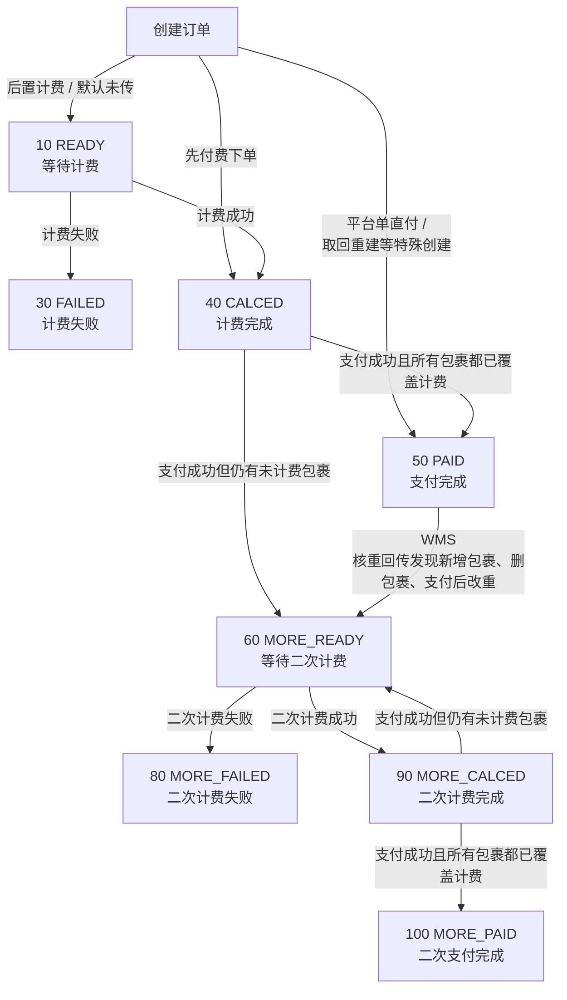

上图说明的是订单从首次计费到二次计费完成的状态流转：只要订单仍可能从 `PAID`、`CALCED` 或 `MORE_CALCED` 回到 `MORE_READY`，就表示费用仍可能被重新计算或补充，不能把当前费项金额视为最终稳定结果。BMS 判断同步时点时，应同时参考本节的重算窗口和<a href="#section-19-2-3">19.2.3 客户侧费项的 OIS 数据源</a>中的字段产生时机，避免提前采集仍可能变化的费项金额。

<div id="business-baseline-generalized-delivery"></div>

<div id="section-19-2-5"></div>

#### 19.2.5 广义签收

<div id="section-19-2-5-1"></div>

##### 19.2.5.1 提及原因

当<a href="#section-7">7. 客户级账单配置</a>中的应收账单配置将`履约节点`选择为`订单完结`时，任务类型为`费项入池`或`账单生成`的BMS任务，均按`订单完结时间`从数据源筛选本期要归集的订单并形成对应费项。

当前 OIS 的`ofp_ofdb1.sale_order_header`主表没有订单完结时间字段，订单完结时间记录在`ofp_ofdb1.sale_order_header_extend.order_completed_time`。该字段用于 BMS 归集的口径见<a href="#section-19-2-3-3">19.2.3.3 BMS 归集费项时使用哪些非金额字段？</a>。该字段由 OIS 定时任务维护：任务根据订单下尾程包裹的 TMS 物流末条轨迹判断是否命中广义签收状态；若订单只有一个尾程包裹，则该包裹命中广义签收后，将末条轨迹时间写入`order_completed_time`；若订单有多个尾程包裹，则必须全部尾程包裹均命中广义签收后，订单才算完结，并将满足条件时的最新末条轨迹时间写入`order_completed_time`。

这里的广义签收是判断`订单完结`的业务口径，不是一个新的物流状态，也不等同于狭义的“正常签收”。当订单下全部尾程包裹的履约结果均已足以判断订单可进入应收账单归集时，该订单可视为达到广义签收口径。

<div id="section-19-2-5-2"></div>

##### 19.2.5.2 状态范围

当前纳入广义签收的末条轨迹状态如下：

| 轨迹状态 | 枚举名               | 枚举码   | 业务含义                   |
| :--- | :--- | :--- | :--- |
| 已妥投  | `SEND_COMPLETE`   | `220` | 尾程已完成正常妥投或签收           |
| 出柜   | `OUT_CABINET`     | `223` | 柜机、自提点或门店场景下，订单已进入取件完成 |
| 退件登记 | `RETURN_ORDER`    | `230` | 订单已进入退件链路并完成退件登记       |
| 退回妥投 | `RETURN_DELIVERY` | `250` | 退件链路已完成退回妥投            |
| 退货收货 | `RETURN_RECEIPT`  | `270` | 退货链路中，退回方或仓库已完成收货      |
| 退货上架 | `RETURN_PUTAWAY`  | `280` | 退货已完成仓库上架              |

<div id="section-19-3"></div>

### 19.3 系统功能清单

所有 BMS 菜单统一收口到`账单系统`根节点。下图中加粗节点是真实菜单；灰色节点只用于标识菜单所属的业务标签，不提供独立入口。

账单系统每个菜单页均使用独立且稳定的Hash路径。PRD引用原型时应直接链接对应路径；浏览器刷新、前进、后退或粘贴链接后，系统必须恢复到该页面。

| 页面 | 稳定原型路径 |
| :--- | :--- |
| 营收总览 | [🔗原型链接](http://localhost:10520/#/billing/revenue-overview) |
| 应收账单 | [🔗原型链接](http://localhost:4181/#/billing/receivable-bills) |
| 返款账单 | [🔗原型链接](http://localhost:4181/#/billing/refund-bills) |
| 回款管理 | [🔗原型链接](http://localhost:4181/#/billing/remittance) |
| 调账中心 | [🔗原型链接](http://localhost:4181/#/billing/adjustments) |
| 账单配置 | [🔗原型链接](http://localhost:4181/#/billing/config) |
| 汇率配置 | [🔗原型链接](http://localhost:4181/#/billing/rates) |
| 生成任务 | [🔗原型链接](http://localhost:4181/#/billing/tasks) |
| 基础配置 | [🔗原型链接](http://localhost:4181/#/billing/base-config) |
| 导出管理 | [🔗原型链接](http://localhost:4181/#/billing/exports) |
| 内部审计 | [🔗原型链接](http://localhost:4181/#/billing/audit) |
| 报表比对 | [🔗原型链接](http://localhost:4181/#/billing/report-compare) |
| 数据迁移 | [🔗原型链接](http://localhost:4181/#/billing/data-migration) |

```plantuml
@startuml
skinparam defaultFontName Microsoft YaHei

rectangle tree [
  <color:#6B7280>账单系统</color>
  |_ <color:#6B7280>财务日常</color>
    |_ <b>营收总览</b>
    |_ <b>应收账单</b>
    |_ <b>返款账单</b>
    |_ <b>回款管理</b>
    |_ <b>调账中心</b>
  |_ <color:#6B7280>核心配置</color>
    |_ <b>账单配置</b>
    |_ <b>汇率配置</b>
  |_ <color:#6B7280>过程管控</color>
    |_ <b>生成任务</b>
    |_ <b>基础配置</b>
    |_ <b>导出管理</b>
    |_ <b>内部审计</b>
  |_ <color:#6B7280>辅助测试</color>
    |_ <b>报表比对</b>
    |_ <color:red><b>数据迁移</b></color>
]
@enduml
```

菜单功能清单仅列出树图中加粗的真实菜单：

| 所属标签路径 | 真实菜单 | 主要能力 | 对应需求章节 |
| :--- | :--- | :--- | :--- |
| 财务日常 | 营收总览 | 在当前供应链范围内按店铺及其下属客户查看应收、已收、应收未收及逾期未收金额，并下钻到具体应收账单 | <a href="#section-13">13. 营收总览</a> |
| 财务日常 | 应收账单 | 查询、审核、发送、结算、补录、冲正、核销及跟踪应收账单异常 | <a href="#section-10">10. 应收账单模块</a> |
| 财务日常 | 返款账单 | 查询、审核、发送和结清返款账单，核对 COD 货款、扣减项及应返金额 | <a href="#section-11">11. 返款账单模块</a> |
| 财务日常 | 回款管理 | 登记和核对派送商回款，查看回款状态及回款金额 | <a href="#section-12">12. 回款管理</a> |
| 财务日常 | 调账中心 | 处理补录、调账、冲正、重整及历史账单差异承接 | <a href="#section-16">16. 调账中心</a> |
| 财务日常 / 核心配置 | 账单配置 | 维护客户级应收和返款配置，包括账期、履约节点、限定情形、币种及版本 | <a href="#section-7">7. 客户级账单配置</a> |
| 财务日常 / 核心配置 | 汇率配置 | 维护基准汇率、按店铺 / 客户组 / 客户设置特调汇率和账单特调汇率，查看默认汇率结果 | <a href="#section-8">8. 客户级汇率配置</a> |
| 财务日常 / 过程管控 | 账单任务 | 按任务类型查看BMS任务，跟踪待执行、执行中、执行成功或执行失败的任务并处理异常事项 | <a href="#section-9-9">9.9 财务在哪里操作，页面如何反馈？</a> |
| 财务日常 / 过程管控 | 基础配置 | 在费项管理和数据源规则中维护费项口径、数据来源及场景规则；维护费项结算币种模板，供财务编辑应收账单配置时快捷填充 | <a href="#section-9-9-3">9.9.3 系统从哪里知道该取哪些费用？</a>、<a href="#section-9-5">9.5 第四步：来源费用怎样变成BMS费项？</a>、<a href="#section-15-2">15.2 费项结算币种模板</a> |
| 财务日常 / 过程管控 | 导出管理 | 跟踪应收和返款账单导出进度，区分客户对账与内部明细用途，下载结果、重试失败任务并维护对账报表导出配置 | <a href="#section-19-6-3">19.6.3 导出管理</a> |
| 财务日常 / 过程管控 | 内部审计 | 查询账单、配置、导入、核销、调账、导出、结清、成本归属及分摊版本等关键操作记录 | <a href="#section-18">18. 内部审计</a> |
| 成本中心 | 成本总览 | 汇总供应商收费、成本归属、待处理事项、成本完整性和利润概况 | <a href="./成本中心.PRD.md">《成本中心 PRD》2. 成本归集链路总览</a>、<a href="./成本中心.PRD.md">《成本中心 PRD》10. 报价覆盖、利润与经营分析</a> |
| 成本中心 | 供应商管理 | 维护供应商财务档案、成本账期类型、适用成本板块和金额统计 | <a href="./成本中心.PRD.md">《成本中心 PRD》4. 供应商管理</a> |
| 成本中心 | 成本账单 | 导入并核对供应商账单，登记待结清或已结清状态；按间接成本分摊集确认分摊规则和执行结果 | <a href="./成本中心.PRD.md">《成本中心 PRD》5. 成本费项标准化与供应商账单导入</a>、<a href="./成本中心.PRD.md">《成本中心 PRD》7. 间接成本分摊</a>、<a href="./成本中心.PRD.md">《成本中心 PRD》8. 成本账单结清与调账</a> |
| 成本中心 | 成本池 | 查看逐行成本明细，确认直接成本归属或间接成本分摊集结果 | <a href="./成本中心.PRD.md">《成本中心 PRD》6. 成本识别与归属</a>、<a href="./成本中心.PRD.md">《成本中心 PRD》7.1 间接成本分摊集</a> |
| 成本中心 | 分摊规则 | 分页维护基础分摊规则和供应商特调分摊规则；供应商特调规则优先于基础规则 | <a href="./成本中心.PRD.md">《成本中心 PRD》7.3 分摊规则与因子选择</a> |
| 成本中心 | 利润分析 | 按业务订单查看收入、直接成本、间接成本、利润及成本完整性 | <a href="./成本中心.PRD.md">《成本中心 PRD》10. 报价覆盖、利润与经营分析</a> |
| 成本中心 | 成本费项索引 | 按五大成本板块维护标准成本费项及供应商原始名称识别口径 | <a href="./成本中心.PRD.md">《成本中心 PRD》5.2.2 客户侧与成本侧费项索引分域</a> |
| 辅助测试 | 数据迁移 | 在测试环境中同步指定生产数据并重置测试所需标记 | <a href="#section-19-4-1">19.4.1 同步生产环境数据</a> |
| 辅助测试 | 报表比对 | 仅在财务试运营 BMS 阶段比对财务侧报表和系统侧报表，定位缺单、重复及费项差异 | <a href="#section-19-4-2">19.4.2 财务侧报表与系统侧报表比对</a> |

<div id="section-19-4"></div>

### 19.4 辅助测试功能

<div id="section-19-4-1"></div>

#### 19.4.1 同步生产环境数据

同步生产环境数据用于把生产或指定来源中的集运订单、订单扩展、附加费、包裹费用、费用明细和理赔单等验证数据复制到测试客户名下，支撑账单生成、附加费归集、费用明细归集、理赔抵扣、重跑和核销链路验证。该能力只服务内部测试验证，不属于财务日常生产操作。

<div id="section-19-4-1-1"></div>

##### 19.4.1.1 使用边界与安全要求

同步生产环境数据是高风险内部测试能力，必须先限定环境、权限和连接安全，再允许用户选择同步范围。

1. 环境边界：仅允许在测试环境或经授权的内部验证环境使用，生产环境不得开放同步生产环境数据入口。
2. 写入边界：同步动作只能写入目标测试客户，不得改写来源客户、来源订单和来源费用。
3. 标记重置：执行同步会重置目标数据的 BMS 计费 / 付款相关标记，使同步后的数据可重新参与测试账单生成；该规则不得用于生产环境制造重新出账。
4. 连接安全：数据库连接、账号密码和来源连接参数由系统配置维护，页面不得展示账号密码。
5. 权限继承：同步生产环境数据不得绕过<a href="#section-17">17. 非功能需求</a>的权限、审计、幂等、数据一致性和信息保护要求。

<div id="section-19-4-1-2"></div>

##### 19.4.1.2 来源范围与目标映射

用户需要先圈定来源数据，再指定这些数据要复制到哪个测试客户口径下。

1. 来源客户筛选：来源客户条件应支持按来源店铺、来源用户、来源会员编码和来源客户编码筛选。
2. 来源订单圈定：支持按时间字段、时间范围和指定订单号圈定来源订单；指定订单号优先于时间范围。
3. 目标映射：同步目标应明确目标店铺、目标用户、目标会员编码、目标客户编码、目标仓库编码、目标客户名称和目标店铺名称。
4. 目标校验：系统必须校验目标客户、目标店铺和目标仓库是否存在且可用，避免把测试数据写入错误客户或错误仓库。
5. 归属一致：同步后订单及其费用、包裹、理赔等关联数据必须统一落到同一目标客户口径下，不能出现订单归属与费用归属不一致。

<div id="section-19-4-1-3"></div>

##### 19.4.1.3 同步内容与执行控制

来源范围和目标客户确定后，用户再选择本次同步的关联数据类型，并控制写入方式。

1. 同步项选择：同步项应支持选择是否复制订单扩展、附加费、包裹费用、费用明细和理赔单；未勾选的数据不应被写入目标环境。
2. 订单防冲突：支持为同步后的订单追加后缀，避免与目标环境已有订单号冲突。
3. 批量控制：支持按批次控制每批订单数量，防止一次性同步过多数据影响测试环境稳定性。
4. 执行一致性：同步执行过程中应保持同一批次内订单主数据与关联数据的一致性，任一关键写入失败时应给出失败原因和可重试范围。

<div id="section-19-4-1-4"></div>

##### 19.4.1.4 预览、执行与结果反馈

系统必须先让用户看到影响范围，再允许正式执行同步。

1. 预览要求：系统应提供`预览`能力，在正式执行前展示本次预计同步的订单数、扩展数、附加费数、包裹费用数、费用明细数和理赔单数；预览不得写入目标环境，也不得重置任何 BMS 标记。
2. 执行要求：`执行同步`必须校验权限并展示影响范围；用户确认后才允许写入目标环境。
3. 结果回显：执行完成后，页面应展示来源订单、源扩展、源附加费、源包裹费、源费用明细、源理赔单和已写入订单的数量。
4. 摘要与追溯：系统应展示摘要信息和同步后的订单号；摘要至少包括筛选条件、写入扩展数量、写入附加费数量、写入包裹费用数量、写入费用明细数量和写入理赔单数量。
5. 部分成功：部分成功时必须明确成功范围、失败范围和失败原因，不能只展示整体成功或整体失败。

<div id="section-19-4-1-5"></div>

##### 19.4.1.5 测试标识与审计隔离

同步后的数据和日志应能支持内部追溯，但不得进入客户可见或生产对账口径。

1. 测试标识：同步后的测试数据应带有可识别的测试来源标记，避免与真实生产业务数据混淆。
2. 审计日志：每次预览和执行同步都必须记录操作人、操作时间、来源条件、目标客户、同步范围、同步项、批次数量、执行结果和失败原因。
3. 信息隔离：同步日志应能用于追溯测试账单来源，但不应向客户、普通财务用户或生产对账报表暴露。

<div id="section-19-4-2"></div>

#### 19.4.2 财务侧报表与系统侧报表比对

财务侧报表与系统侧报表比对仅在财务试运营 BMS 阶段使用。财务侧继续导入现有财务报表，系统侧改为导入 BMS 当前生成的新版应收账单对账报表。系统先把新版对账报表的明细结构转换为订单级可比数据，再按订单和同名费项与财务侧报表对齐，辅助识别缺单、重复数据和结构异常，并并排呈现两侧金额。

该能力仅用于试运营期间的内部验证，不属于客户对账报表，不作为正式账单核销、客户对账或财务审批依据。试运营结束后，系统关闭该入口，不再创建新的比对任务。

<div id="section-19-4-2-1"></div>

##### 19.4.2.1 使用入口与前提

页面分别提供财务侧报表卡片和系统侧报表卡片。用户在对应卡片中点击`上传`，各选择一份 `.xlsx` 报表；两侧均上传成功后，才可点击结果区工具栏中的`开始比对`。导入文件即为本次比对的数据来源，比对入口不依赖账单是否已生成、待结算或已结清。

1. 财务侧格式保持不变：继续按现有财务侧模板识别 Sheet、表头、数据起始行、`订单号`、`承运单号`、`出库时间`、`结单时间`和各费用字段，本次不调整财务侧模板及取数口径。
2. 系统侧格式改为新版：必须导入符合<a href="#section-19-6-1">19.6.1 面向客户的对账报表导出</a>的应收账单 Excel。系统只读取名为`费项明细`的 Sheet；`账单汇总`和`往期账单冲正信息`不参与比对。
3. 账单类型限制：系统侧文件必须是应收账单对账报表。文件不存在`费项明细`、只有`返款明细`，或缺少新版必需字段时，系统不得开始比对，并一次性提示缺少的 Sheet 或字段。
4. 币种前提：两侧报表的费项结算币种必须一致。系统不在比对过程中换算币种；系统侧金额单元格中的币种属于 Excel 显示格式，不属于金额真实值，读取时必须保留数值本身，不得把显示出的币种文本拼入金额。
5. 旧版边界：旧版系统侧单 Sheet 报表不再作为正式导入格式。识别到旧字段`内部订单号`且不存在新版`费项明细`时，系统应提示用户从 BMS 重新导出新版应收账单对账报表，不得按新旧字段混合猜测。
6. 留存前提：比对结果不要求跨登录或跨天保存。用户需要留存时，应通过结果导出功能保存当前比对结果。
7. 数据边界：系统不得在比对过程中覆盖、修正或反写任一来源报表，也不得改变正式账单、BMS 费项池或费项配置。
8. 上传交互：页面顶部将财务侧报表卡片、系统侧报表卡片和`履约时间`控件排列在同一行；财务侧报表卡片和系统侧报表卡片各自显示已上传文件名及一个`上传`按钮。任一侧重新上传文件后，既有比对结果立即失效，但保留当前的`履约时间`选择。
9. 开始比对：`开始比对`位于结果表工具栏；任一侧尚未上传成功时按钮不可用。两侧均上传成功后按钮可用，点击后才生成并呈现比对结果。
10. 履约时间：页面固定显示`履约时间`选项，支持`出库时间`和`结单时间`，首次进入页面时默认为`出库时间`。财务可在开始比对前或生成结果后切换选项；生成结果后切换时，系统直接切换结果第二列的列名、取值和排序，不重新执行金额比对。系统分别从两侧文件读取所选字段；同一订单优先取财务侧值，财务侧为空时取系统侧值；两侧均无值时该单元格留空。
11. 导出交互：`导出`位于结果表工具栏中的`开始比对`之后。尚未生成比对结果时按钮不可用；生成结果后，按当前时间字段和当前表格列结构导出。

<div id="section-19-4-2-2"></div>

##### 19.4.2.2 新版系统侧报表怎样进入 SQL 比对？

新版系统侧文件导入后，先将`费项明细`整理为供比对使用的系统侧临时数据。比对逻辑不直接解析 Excel，而是读取已经完成格式识别的临时表；临时表至少需要保留`业务订单号`、财务所选时间字段及系统侧全部费项金额字段。

1. SQL 只把系统侧`业务订单号`不以`>`结尾的记录作为订单记录；以`>`结尾的尾程包裹子行不进入订单主集合。`>`是导出文件中的层级展示符号，系统侧临时数据中的业务订单号应使用不带该符号的订单号。
2. 比对逻辑以系统侧订单记录为基础，通过财务侧`订单号`与系统侧`业务订单号`的关联，生成`业务订单号`、所选时间字段、`财务侧报表`和`系统侧报表`四个基础字段。
3. 按现有 SQL，订单主集合实际以系统侧符合条件的订单记录为基础；财务侧没有匹配到系统侧业务订单号的独有订单不会单独形成结果行。该行为属于现有 SQL 的比对口径。
4. 系统侧费用不从尾程包裹子行累加，直接读取系统侧临时表中与业务订单号对应的费用字段。新版 Excel 中动态展开的全部费项均应在导入整理时保留原字段名，供两侧按字段名精确对齐。

<div id="section-19-4-2-3"></div>

##### 19.4.2.3 两侧订单怎样关联？

SQL 使用财务侧`订单号`和系统侧`业务订单号`关联两侧数据，并以系统侧订单记录为基础输出比对结果。

1. 直接关联：财务侧`订单号`与系统侧`业务订单号`相等时，直接认定属于同一业务订单。
2. 财务侧`订单号 = '/'`时，SQL 使用`承运单号`作为关联值；实际匹配值由`订单号`不等于`/`时取`订单号`，否则取`承运单号`。财务侧订单号为空时，现有 SQL 不会自动改用承运单号。
3. 费用关联：直接费用按财务侧`订单号`与系统侧`业务订单号`关联；附加费用和代收返款使用上述替代关联值与系统侧业务订单号关联。
4. 存在性标记：`财务侧报表`和`系统侧报表`在对应侧存在记录时标记为`✅`，不存在时留空。
5. SQL 通过 `WHERE 系统侧业务订单号 != '/'` 排除业务订单号为`/`的系统侧记录；空值、重复值和未能关联的记录不由 SQL 自动修正。
6. 重复记录：SQL 不对财务侧重复订单号、系统侧重复业务订单号或未能关联的记录进行自动修正；这些数据按现有临时表内容参与查询。

<div id="section-19-4-2-4"></div>

##### 19.4.2.4 两侧费项怎样按字段名对齐和汇总？

上传前，财务必须确保两侧报表对同一费项使用完全相同的字段名。系统不提供费项映射配置，也不使用别名、名称相似度或其它算法推断两个异名字段属于同一费项。比对范围取财务侧费项字段与系统侧费项字段的并集；只要任一侧存在某个费项字段，结果中就必须输出该费项的一组财务侧、系统侧对比列。

1. 费项集合：分别识别两侧文件中的全部费用字段，按字段名合并为本次比对的费项集合，不设置固定费项清单。
2. 同名对齐：两侧字段名完全相同时，系统才将其认定为同一费项。字段名的文字、字符或空格存在差异时，视为两个不同费项。
3. 异名处理：系统不提供费项映射区域、人工改名入口或匹配建议；两个异名字段即使业务含义相同，也分别作为单侧费项参与比对。
4. 单侧费项：某个费项字段仅存在于一侧时，系统按原字段名保留该费项，并为另一侧同时生成空白对比列。
5. 既有取数口径：`运费`、`派送费`按财务侧`订单号`汇总；`超材费`、`转板费`和`税金`分别筛选财务侧`收件人地址`中的同名记录并汇总`其它费用`；`收件人地址 = 代收返款`时，分别汇总`应收货款`和`手续费`为`代收货款`和`货到付款手续费`。财务侧完成这些既有字段整理后，再与系统侧按字段名精确对齐。
6. 金额汇总：财务侧费用按业务订单号和费项字段名分组汇总，并使用三位小数进行四舍五入；系统侧通过业务订单号读取父行费项金额，不累计尾程包裹子行金额。

<div id="section-19-4-2-5"></div>

##### 19.4.2.5 结果怎样展示和导出？

比对结果仅并排展示两侧金额，不自动判定两侧金额是否一致。用户可根据存在性标记、所选时间字段和成对金额人工核对。

1. 成对展示：每个费项必须按`<费项名称><财务侧>`和`<费项名称><系统侧>`成对输出，并且两列相邻展示。
2. 单侧费项：财务侧存在、系统侧不存在的费项，系统侧列为空；系统侧存在、财务侧不存在的费项，财务侧列为空。
3. 空值与零值：某侧报表不存在该订单或该费项无金额时，对应单元格为空；金额为`0`时必须展示`0`。
4. 时间展示：生成结果后，第二列使用财务当前选择的时间字段，列名为`出库时间`或`结单时间`。同一订单两侧均有值时优先取财务侧值，财务侧为空时取系统侧值。
5. 排序规则：默认按结果第二列倒序；时间相同时按`业务订单号`倒序。按现有 SQL，系统侧存在而财务侧不存在的订单保留在结果中；财务侧独有订单不单独形成结果行。
6. 导入反馈：系统应在结果上方汇总文件结构异常、缺少字段、重复订单、重复承运单号及补充匹配未命中等信息，并允许用户定位到来源文件、Sheet 和行号。异名费项不属于导入异常，按两个单侧费项正常输出。
7. 导出规则：导出结果应保持页面展示的列结构和金额原值，导入反馈同时写入独立的`比对说明` Sheet；没有反馈信息时仍保留表头，不写空白说明行。

比对结果应输出为一个明细 Sheet，固定列在前、动态费项列在后。

| 字段 | 说明 |
| :--- | :--- |
| `业务订单号` | 本次比对的订单主键。 |
| `出库时间`或`结单时间` | 财务在`履约时间`中选择的时间字段；固定为结果第二列。 |
| `财务侧报表` | 财务侧存在性标记；打钩表示财务侧报表中有此订单。 |
| `系统侧报表` | 系统侧存在性标记；打钩表示系统侧报表中有此订单。 |
| `<费项名称><财务侧>` | 财务侧报表中该订单、该费项的金额。 |
| `<费项名称><系统侧>` | 新版系统侧`费项明细`业务订单父行中该费项的金额。 |

字段顺序规则如下：

| 固定列 | 动态费项列 |
| :--- | :--- |
| `业务订单号`、`出库时间`或`结单时间`、`财务侧报表`、`系统侧报表` | 按费项并集依次输出：`<费项A><财务侧>`、`<费项A><系统侧>`、`<费项B><财务侧>`、`<费项B><系统侧>`、... |

展示要求：

1. `财务侧报表`和`系统侧报表`建议使用勾选样式展示存在性；导出 Excel 时可用 `TRUE` / `FALSE`、`Y` / 空值或图标样式承载，但页面和说明文案必须表达为“打钩表示该侧有此订单”。
2. 动态费项列中，`运费`和`派送费`分别排在第一组和第二组；其它费项按原字段名排序。同一批次的页面和导出结果必须保持一致。
3. 可对不同费项组使用浅色背景分区，但颜色只作为视觉辅助，不参与业务判断。

<div id="section-19-4-2-6"></div>

##### 19.4.2.6 参考 SQL 逻辑

完整 SQL 详见派生分析文档：<a href="derivant/对账报表比对分析.md#财务侧报表与系统侧报表比对-sql">对账报表比对分析.md - 财务侧报表与系统侧报表比对 SQL</a>。

参考 SQL 只作用于已经完成格式识别和父子行整理的临时数据，不直接解析原始 Excel。系统侧临时数据必须已经做到：只保留业务订单父行、将层级标志从订单号中移除，并把新版动态费项列保留为数值列。具体临时表名不构成产品约束。

现有 SQL 中列出的七个费项用于说明既有财务侧取数和汇总方法，不构成产品支持费项的固定清单。最终比对应在该汇总方法上按<a href="#section-19-4-2-4">19.4.2.4 两侧费项怎样按字段名对齐和汇总？</a>扩展为两侧费项字段并集。

1. 标准化系统侧数据：读取新版`费项明细`，按<a href="#section-19-4-2-2">19.4.2.2 新版系统侧报表怎样进入 SQL 比对？</a>形成一条业务订单对应一条父行的系统侧临时数据。
2. 构造订单集合：现有 SQL 以系统侧业务订单父行为基础，通过财务侧`订单号`与系统侧`业务订单号`关联，生成`财务侧报表`、`系统侧报表`两个存在性标记。
3. 汇总财务侧基础费用：财务侧`运费`、`派送费`按订单号汇总和匹配。
4. 补充订单匹配：财务侧`订单号 = '/'`时，以`承运单号`作为附加费用和代收返款的业务订单关联值。
5. 汇总财务侧附加费用：按`收件人地址`区分`超材费`、`转板费`、`税金`等附加费用，并汇总`其它费用`。
6. 汇总财务侧代收返款：当`收件人地址 = '代收返款'`时，汇总`应收货款`为`代收货款<财务侧>`，汇总`手续费`为`货到付款手续费<财务侧>`。
7. 读取系统侧金额：按系统侧`业务订单号`回连订单集合，读取业务订单父行中的全部动态费项金额；不得读取或累计尾程包裹子行金额。
8. 建立动态费项并集：仅将字段名完全相同的两侧费项对齐；任一侧存在的费项都按原字段名生成一组财务侧、系统侧金额列。
9. 输出比对结果：以订单集合为主表，左连接财务侧汇总结果和系统侧父行数据，按<a href="#section-19-4-2-5">19.4.2.5 结果怎样展示和导出？</a>生成固定列和动态费项列。

现有 SQL 中的同名字段对齐示例如下；未列出的费项按相同结构动态扩展：

| 比对列 | 财务侧取数口径 | 系统侧取数口径 |
| :--- | :--- | :--- |
| `运费` | 财务侧报表按订单号汇总`运费` | 系统侧报表`运费` |
| `派送费` | 财务侧报表按订单号汇总`派送费` | 系统侧报表`派送费` |
| `超材费` | 财务侧报表中`收件人地址 = '超材费'`时汇总`其它费用` | 系统侧报表`超材费` |
| `转板费` | 财务侧报表中`收件人地址 = '转板费'`时汇总`其它费用` | 系统侧报表`转板费` |
| `税金` | 财务侧报表中`收件人地址 = '税金'`时汇总`其它费用` | 系统侧报表`税金` |
| `代收货款` | 财务侧报表中`收件人地址 = '代收返款'`时汇总`应收货款` | 系统侧报表`代收货款` |
| `货到付款手续费` | 财务侧报表中`收件人地址 = '代收返款'`时汇总`手续费` | 系统侧报表`货到付款手续费` |

<div id="section-19-5"></div>

### 19.5 邮件模板

邮件模板仅用于规范系统自动向客户发出的邮件。人工催收、人工差异跟进、内部失败通知、财务手工沟通和客户经理沟通不纳入本节邮件模板范围。邮件内容应面向客户对账，不暴露内部配置、内部成本、内部汇率来源、系统审计字段或测试数据标识。

<div id="section-19-5-1"></div>

#### 19.5.1 通用规则

1. 邮件模板只适用于系统在账单首次审核通过、待结清账单反审修正后再次审核通过、客户级账单配置发生变更后自动向客户发送邮件的场景。
2. 邮件模板应支持按供应链、客户、账单类型和语言扩展，但同一账单或同一次配置变更发送时必须固化本次使用的模板版本。
3. 邮件主题、正文、附件名称均应支持变量替换；任一邮件场景的必需变量缺失时不得自动发送，应提示财务补齐该场景所需的客户邮箱、客户名称、账单信息、配置变更信息或附件等必要信息。
4. 如邮件包含附件，附件必须使用<a href="#section-19-6-1">19.6.1 面向客户的对账报表导出</a>生成的客户对账文件，并遵循客户可见信息规则；<a href="#section-19-6-2">19.6.2 面向财务的对账报表导出</a>生成的内部文件不得作为客户邮件附件。
5. `通知状态`指应收账单列表和返款账单列表中，系统向客户邮箱发送账单邮件的状态，只允许展示`已通知`、`通知失败`、`未配置邮箱`三个枚举值。
6. 账单类邮件发送成功或失败都必须记录发送时间、收件人、抄送人、模板版本、账单编号、附件名称和失败原因；客户级账单配置变更通知发送成功或失败必须记录发送时间、收件人、抄送人、模板版本、配置版本、生效周期和失败原因。发送失败只进入对应页面的状态提示，不另行触发面向内部人员的邮件。
7. 客户邮箱来自客户主数据；共享客户级账单配置不保存客户邮箱。未配置客户邮箱时，系统不得自动发送客户邮件。账单类邮件应在对应账单列表的`通知状态`展示`未配置邮箱`标签；客户级账单配置变更通知不挂靠具体账单，应在配置变更通知记录中记录`未配置邮箱`，不回写应收账单列表或返款账单列表。
8. 邮件正文不得承诺系统外无法自动判断的付款到账、返款到账或客户确认结果；相关状态以系统账单和核销记录为准。
9. 提前收口形成的账单首次发送时，邮件正文和附件必须明确展示`截断账期`、实际账期起止日和数据截止点，并提示截断点之后的费用将由后续账单承接。

<div id="section-19-5-2"></div>

#### 19.5.2 模板场景

| 邮件发送时机 | 邮件主题建议 | 正文 | 附件 |
| :--- | :--- | :--- | :--- |
| 当应收账单首次审核通过 | `{{客户名称}} {{账期}} 应收账单 {{账单编号}}` | 尊敬的客户，您好：<br/>附件为贵司 `{{账期}}` 应收账单对账报表，账单编号：`{{账单编号}}`。账期说明：`{{账期说明}}`。本期应收金额：`{{应收金额}}`，结算币种：`{{结算币种}}`，信用期截止日：`{{信用期截止日}}`。<br/>请您核对附件中的账单汇总和费项明细，并按约定付款方式安排付款；付款备注：`{{付款备注}}`。如对账单内容有疑问，请及时与我司对接人员联系。 | 应收账单对账报表 |
| 当返款账单首次审核通过 | `{{客户名称}} {{账期}} 返款账单 {{账单编号}}` | 尊敬的客户，您好：<br/>附件为贵司 `{{账期}}` 返款账单对账报表，账单编号：`{{账单编号}}`。账期说明：`{{账期说明}}`。本期应返货款：`{{应返金额}}`，实返金额：`{{实返金额}}`，货款结算币种：`{{结算币种}}`。<br/>本次返款将按系统记录的客户收款账户处理，账户摘要：`{{收款账户摘要}}`。请您核对附件中的返款汇总、扣减项和返款明细。如对账单内容有疑问，请及时与我司对接人员联系。 | 返款账单对账报表 |
| 当待结清应收账单因客户要求反审修正，且财务修正完成并再次审核通过 | `更新：{{客户名称}} {{账期}} 应收账单 {{账单编号}}` | 尊敬的客户，您好：<br/>贵司 `{{账期}}` 应收账单已完成修正并重新审核通过，账单编号：`{{账单编号}}`。关于此账单的此前邮件已失效，以本邮件为准。<br/>本次修正摘要：`{{修正摘要}}`。修正后本期应收金额：`{{应收金额}}`，结算币种：`{{结算币种}}`，信用期截止日：`{{信用期截止日}}`。<br/>请您以本邮件附件中的应收账单对账报表核对账单汇总和费项明细，并按约定付款方式安排付款；付款备注：`{{付款备注}}`。如对账单内容有疑问，请及时与我司对接人员联系。 | 应收账单对账报表 |
| 当待结清返款账单因客户要求反审修正，且财务修正完成并再次审核通过 | `更新：{{客户名称}} {{账期}} 返款账单 {{账单编号}}` | 尊敬的客户，您好：<br/>贵司 `{{账期}}` 返款账单已完成修正并重新审核通过，账单编号：`{{账单编号}}`。关于此账单的此前邮件已失效，以本邮件为准。<br/>本次修正摘要：`{{修正摘要}}`。修正后本期应返货款：`{{应返金额}}`，实返金额：`{{实返金额}}`，货款结算币种：`{{结算币种}}`。<br/>请您以本邮件附件中的返款账单对账报表核对返款汇总、扣减项和返款明细。如对账单内容有疑问，请及时与我司对接人员联系。 | 返款账单对账报表 |
| 当客户级账单配置变更确认后 | `{{客户名称}} 账单配置变更通知 {{配置生效周期}}` | 尊敬的客户，您好：<br/>贵司账单配置已发生变更，配置版本：`{{配置版本}}`，生效周期：`{{配置生效周期}}`。本次变更内容：`{{配置变更摘要}}`。<br/>该变更不会自动改写已有账单；尚未向贵司发出的待审核账单如需采用新版配置，将由我司财务确认后重新生成；已经向贵司发出的账单仍以原账单内容为准。如对配置变更内容有疑问，请及时与我司对接人员联系。 | 无 |

<div id="section-19-5-3"></div>

#### 19.5.3 邮件变量

| 变量 | 含义 | 适用场景 |
| :--- | :--- | :--- |
| `{{客户名称}}` | 账单归属客户名称 | 账单首次发送、账单修正重发、客户级账单配置变更通知 |
| `{{账单编号}}` | 应收账单或返款账单编号 | 应收账单首次发送、返款账单首次发送、账单修正重发 |
| `{{账单类型}}` | 应收账单、返款账单 | 账单类邮件，用于区分应收账单和返款账单 |
| `{{账期}}` | 账单起止日期或账期名称 | 应收账单首次发送、返款账单首次发送、账单修正重发 |
| `{{账期说明}}` | 完整账期填`完整账期`；截断账期填`截断账期，仅覆盖实际账期起止日及数据截止点，后续费用由后续账单承接` | 应收账单首次发送、返款账单首次发送、账单修正重发 |
| `{{结算币种}}` | 账单汇总使用的结算币种 | 应收账单首次发送、返款账单首次发送、账单修正重发 |
| `{{应收金额}}` | 应收账单本次应收金额 | 应收账单首次发送、应收账单修正重发 |
| `{{应返金额}}` | 返款账单本次应返货款金额 | 返款账单首次发送、返款账单修正重发 |
| `{{实返金额}}` | 返款账单扣减后的实际返款金额 | 返款账单首次发送、返款账单修正重发 |
| `{{信用期截止日}}` | 应收账单信用期结束日期 | 应收账单首次发送、应收账单修正重发 |
| `{{付款备注}}` | 客户付款时需要填写的备注信息 | 应收账单首次发送、应收账单修正重发 |
| `{{收款账户摘要}}` | 客户收款账户的脱敏摘要 | 返款账单首次发送 |
| `{{修正摘要}}` | 待结清账单反审修正后的客户可见修正说明 | 应收账单修正重发、返款账单修正重发 |
| `{{附件名称}}` | 本次邮件附带的账单文件名称 | 应收账单首次发送、返款账单首次发送、账单修正重发 |
| `{{配置版本}}` | 客户级账单配置本次生效的版本号 | 客户级账单配置变更通知 |
| `{{配置生效周期}}` | 客户级账单配置变更后的生效周期 | 客户级账单配置变更通知 |
| `{{配置变更摘要}}` | 面向客户展示的配置变更内容摘要 | 客户级账单配置变更通知 |

<div id="section-19-6"></div>

### 19.6 导出模板

<div id="section-19-6-1"></div>

#### 19.6.1 面向客户的对账报表导出

<div id="section-19-6-1-1"></div>

##### 19.6.1.1 导出定位与适用范围

对账报表面向客户与财务核对账单结果，不作为系统审计报表。BMS 仅为应收账单和返款账单提供对账报表导出，账单处于任一状态时均可导出。账单详情内的`导出`也属于面向客户的对账报表导出：入口仅处理当前账单，固定采用本节文件结构和客户可见信息边界，不提供内部导出用途。

导出内容遵循以下信息边界：

1. 只保留客户能够理解、核对和追溯的信息，不展示内部处理过程、审核记录、系统快照或其它后台字段。
2. 金额口径承接<a href="#section-15">15. 金额汇兑</a>：应收账单只展示费项结算币种金额，返款账单只展示货款结算币种金额。
3. 对账报表不展示原始币种金额、汇率或财务本位币金额。

<div id="section-19-6-1-2"></div>

##### 19.6.1.2 导出文件与 Sheet 总览

每张账单对应一份独立 Excel，文件内容和 Sheet 结构不与其它账单合并。

Excel 文件名至少包含账单类型和账单编号，并过滤操作系统不允许使用的字符。

每份对账报表固定包含以下三个 Sheet：

| Sheet | Sheet 名称 | 内容定位 |
| --- | --- | --- |
| Sheet 1 | 账单汇总 | 账单基本信息、结算币种分桶金额汇总及可配置的客户告示和二维码等信息 |
| Sheet 2 | 应收账单为`费项明细`；返款账单为`返款明细` | 供客户逐行核对、筛选和二次汇总的账单明细 |
| Sheet 3 | 往期账单冲正信息 | 已影响当前账单结果的往期账单冲正记录 |

<div id="section-19-6-1-3"></div>

##### 19.6.1.3 Sheet 1：账单汇总

Sheet 1 先展示客户识别账单所需的基本信息，再展示按结算币种汇总的账单金额，最后展示对应账单类型的客户告示、二维码和收款信息。各信息区按下表输出：

| 信息区 | 应收账单 | 返款账单 |
| --- | --- | --- |
| 账单基本信息 | 账单编号、账期类型、账期、客户名称、业务板块、目的国 | 账单编号、账期类型、账期、客户名称、业务板块、目的国、返款模式 |
| 结算币种分桶金额汇总 | 结算币种账单总计、费项、结算币总计 | 结算币种账单总计、应返货款、扣减金额、实返金额、已返金额、未返金额 |
| 客户告示 | 输出应收账单配置 | 输出返款账单配置 |
| 客服二维码 | 输出应收账单配置 | 输出返款账单配置 |
| 收款账户 | 输出唯一指定对公账户的账户名称、账户编号和开户银行 | 不适用 |
| 收款二维码 | 输出应收账单配置 | 不适用 |

Sheet 1 按`账单基本信息`、`结算币种分桶金额汇总`、`客户告示`、`客服二维码`、`收款账户`、`收款二维码`的顺序输出。未配置或不适用于当前账单类型的信息区直接跳过，不保留空白占位。

<div id="section-19-6-1-3-1"></div>

###### 19.6.1.3.1 账单基本信息

1. `账期`合并展示账期开始日和账期结束日，格式为`YYYY/MM/DD - YYYY/MM/DD`。
2. `账期类型`展示本账单实际采用的日历账期或自然天账期类型，例如`周`、`半月`、`月`、`7 自然天`或`15 自然天`。
3. 基本信息只保留客户核对账单所需字段，不展示账单状态、客户编码、会员编码、店铺或审核通过时间等内部识别和过程字段。

<div id="section-19-6-1-3-2"></div>

###### 19.6.1.3.2 金额汇总

1. 金额按结算币种分别成块展示。每个币种块先展示`{结算币种名称}总计`，例如费项结算币种为 CNY 时显示`人民币总计`。
2. 应收账单在各币种块内使用`费项`和`结算币总计`两列，按账单实际包含的费项动态逐行汇总。费项展示顺序固定为`运费`、`派送费`、其它费项：`运费`和`派送费`分别优先作为第一个和第二个展示费项，其它费项按费项索引顺序排列。未发生的费项不输出空行，同一费项存在多个结算币种时分别计入对应币种块。
3. 应收账单的结算币种账单总计等于该币种块内所有费项最终金额之和，并包含当前账单已生效的冲正结果。冲正明细统一在 Sheet 3 展示，Sheet 1 不再拆分本期冲正和往期账单冲正。
4. 返款账单按货款结算币种分别展示账单总计，并在对应币种块内汇总`应返货款`、`扣减金额`、`实返金额`、`已返金额`和`未返金额`。
5. 所有金额的数值、币种和精度遵循<a href="#section-19-6-1-6">19.6.1.6 金额、币种与精度</a>。

<div id="section-19-6-1-3-3"></div>

###### 19.6.1.3.3 对账报表导出配置

`对账报表导出配置`入口位于<a href="#section-19-6-3-2">19.6.3.2 管理面板</a>，以`应收账单`和`返款账单`为唯一配置维度，配置结果由所有客户共用。两类账单分别维护：

1. 应收账单配置`客户告示`、`客服二维码`、一个用于收款的对公账户和`收款二维码`。
2. 返款账单配置`客户告示`和`客服二维码`。

`客户告示`使用多行文本框编辑。收款账户的账户名称、账户编号和开户银行按原值保存，并在配置页面和导出文件中完整展示。客服二维码和收款二维码保持原始宽高比例，在 Sheet 1 的固定区域内完整居中显示；存在多张图片时按配置顺序横向排列。

配置保存后只影响新创建的导出任务。已创建任务继续使用任务创建时固化的配置；二维码配置有误时，财务修正配置后重新发起导出。

<div id="section-19-6-1-4"></div>

##### 19.6.1.4 Sheet 2：账单明细

Sheet 2 是客户逐行核对和二次汇总的主要明细区。应收账单命名为`费项明细`，返款账单命名为`返款明细`，两类 Sheet 使用统一字段结构，便于客户合并、筛选和透视。

1. 统一明细字段表中的固定字段必须同时出现在应收账单和返款账单中。某字段不适用于当前账单类型或当前行无值时，保留该列并让单元格为空。
2. `费项展开`按账单实际存在的费项动态生成金额列：实际有多少种费项，就输出多少列；未发生的费项不输出空列。费项金额列的展示顺序固定为`运费`、`派送费`、其它费项：`运费`和`派送费`分别优先作为第一个和第二个展示费项，其它费项按费项索引顺序排列。某一优先费项未发生时不保留空列，后续实际发生的费项顺位前移。统一明细字段表中的费项仅用于说明常见费项及适用范围，不限制实际列数。
3. 除`费项展开`外，统一明细字段表中的字段均为默认导出字段。财务可以按客户对账要求追加`订单费用报表`中的个别非金额字段；追加字段必须同时出现在该客户的应收账单和返款账单 Sheet 2 中，不适用或无值时保留列并让单元格为空。
4. 追加字段只用于客户识别、筛选或辅助核对，不改变账单金额口径，也不包含原始币种金额、汇率、财务本位币金额、内部快照或内部审核字段。
5. `下单时间`、`核重时间`、`出库时间`和`广义签收时间`按完整日期时间值写入，单元格显示格式统一为`yyyy/mm/dd hh:mm:ss`。例如原始值为`2026-07-06 14:30:25`时，显示为`2026/07/06 14:30:25`，并支持客户按年月日筛选、分组和透视。
6. 除`核重时间`外，其它时间原始值为空时，对应单元格保持为空。`核重时间`必须输出真实值；该字段不作为应收账单配置的履约节点，但仍作为对账明细字段导出。源数据缺失`核重时间`时按导出数据异常处理，不继续生成该账单的导出文件。

<div id="section-19-6-1-4-1"></div>

###### 19.6.1.4.1 业务订单行与尾程包裹行

面向客户和面向财务的对账报表明细统一按需采用`业务订单行 + 尾程包裹行`的两级结构，尽可能将导出结果细化到尾程包裹级：

1. 每个业务订单固定输出一条业务订单行。业务订单行必须保留该订单的完整数据，包括订单自身字段、订单级金额和按业务订单口径形成的汇总结果；其`子运单号`字段保留以逗号`,`分隔的完整子运单号清单，不得因展开尾程包裹而清空、拆散或用包裹行替代。
2. 每个业务订单至少包含一个子运单号，同一业务订单内的子运单号不重复。系统按逗号`,`拆分子运单号清单：只有一个子运单号时仅输出业务订单行，不额外生成尾程包裹行；多于一个子运单号时，按每个子运单号输出一条尾程包裹行，并连续排列在所属业务订单行下方。
3. 业务订单行与其尾程包裹行使用 Excel 行分组形成父子层级。尾程包裹行统一使用浅蓝色底色；其`业务订单号`单元格展示所属业务订单号，并在右侧附加`>`作为层级标志。`>`仅用于识别包裹子行，不属于业务订单号真实值。
4. 尾程包裹行的`子运单号`只展示当前包裹对应的一个子运单号，其它字段也只展示该包裹自身专有值，包括包裹标识、包裹履约时间、承运信息、重量以及直接挂靠该包裹的费项金额。订单专有值和其它包裹的值不得复制、继承或分摊到当前包裹行；当前包裹无值的字段保持为空。
5. 业务订单行是订单汇总层，尾程包裹行是该订单的下钻层。同一费用同时以订单汇总值和包裹明细值呈现时，两层表达的是同一账单事实，不得合并求和；账单汇总、核销和 Sheet 1 金额仍以当前有效账单结果为准。
6. 客户版和财务版可以按各自的信息边界决定输出哪些字段，但不得改变订单与包裹的行粒度、父子关系和字段归属规则。

<div id="section-19-6-1-4-2"></div>

###### 19.6.1.4.2 统一明细字段表

<table>
  <thead>
    <tr>
      <th align="left">分组</th>
      <th align="left">明细字段</th>
      <th align="left">应收账单适用</th>
      <th align="left">返款账单适用</th>
    </tr>
  </thead>
  <tbody>
    <tr><td>单据识别</td><td>业务订单号</td><td>✅</td><td>✅</td></tr>
    <tr><td>单据识别</td><td>子运单号</td><td>✅</td><td>✅</td></tr>
    <tr><td>履约节点</td><td>下单时间</td><td>✅</td><td>✅</td></tr>
    <tr><td>履约节点</td><td>核重时间</td><td>✅</td><td>✅</td></tr>
    <tr><td>履约节点</td><td>出库时间</td><td>✅</td><td>✅</td></tr>
    <tr><td>履约节点</td><td>广义签收时间</td><td>✅</td><td>✅</td></tr>
    <tr><td>单据识别</td><td>主运单号</td><td>✅</td><td>✅</td></tr>
    <tr><td>单据识别</td><td>报关单号</td><td>✅</td><td>✅</td></tr>
    <tr><td>单据识别</td><td>清关单号</td><td>✅</td><td>✅</td></tr>
    <tr><td>单据识别</td><td>电商平台订单号</td><td>✅</td><td>✅</td></tr>
    <tr><td>计费要素</td><td>核单重量</td><td>✅</td><td>✅</td></tr>
    <tr><td>计费要素</td><td>计费重量</td><td>✅</td><td>✅</td></tr>
    <tr><td>计费要素</td><td>计费单价</td><td>✅</td><td>--</td></tr>
    <tr><td>费项展开</td><td>运费</td><td>✅</td><td>✅</td></tr>
    <tr><td>费项展开</td><td>派送费</td><td>✅</td><td>✅</td></tr>
    <tr><td>费项展开</td><td>进店费</td><td>✅</td><td>--</td></tr>
    <tr><td>费项展开</td><td>打包费</td><td>✅</td><td>--</td></tr>
    <tr><td>费项展开</td><td>到付金额</td><td>--</td><td>✅</td></tr>
    <tr><td>费项展开</td><td>代收货款</td><td>--</td><td>✅</td></tr>
    <tr><td>费项展开</td><td>代收货款手续费</td><td>--</td><td>✅</td></tr>
    <tr><td>费项展开</td><td>其它费项</td><td>✅</td><td>✅</td></tr>
    <tr><td>业务识别</td><td>业务板块</td><td>✅</td><td>✅</td></tr>
    <tr><td>业务识别</td><td>时效类型</td><td>✅</td><td>✅</td></tr>
    <tr><td>业务识别</td><td>运抵国</td><td>✅</td><td>✅</td></tr>
    <tr><td>业务识别</td><td>仓库</td><td>✅</td><td>✅</td></tr>
    <tr><td>业务识别</td><td>店铺</td><td>✅</td><td>✅</td></tr>
    <tr><td>物流信息</td><td>货物类型</td><td>✅</td><td>✅</td></tr>
    <tr><td>物流信息</td><td>货物品名</td><td>✅</td><td>✅</td></tr>
    <tr><td>物流信息</td><td>收件人</td><td>✅</td><td>✅</td></tr>
    <tr><td>物流信息</td><td>收件电话</td><td>✅</td><td>✅</td></tr>
    <tr><td>物流信息</td><td>收件地址</td><td>✅</td><td>✅</td></tr>
    <tr><td>物流信息</td><td>承运商</td><td>✅</td><td>✅</td></tr>
    <tr><td>物流信息</td><td>末条轨迹时间</td><td>✅</td><td>✅</td></tr>
    <tr><td>物流信息</td><td>末条轨迹状态</td><td>✅</td><td>✅</td></tr>
    <tr><td>物流信息</td><td>末条轨迹描述</td><td>✅</td><td>✅</td></tr>
  </tbody>
</table>

<div id="section-19-6-1-5"></div>

##### 19.6.1.5 Sheet 3：往期账单冲正信息

Sheet 3 用于说明已影响当前账单结果的往期账单冲正记录。若当前账单没有往期账单冲正，仍保留 Sheet 3，并输出固定表头和空明细。

Sheet 3 至少包含以下字段：原账单类型、原账单编号、原账期、冲正记录编号、冲正原因、费项名称、主订单号、主运单号、子运单号、结算币种、冲正前金额、冲正金额、冲正后金额、生效账单编号、审核通过时间、备注。

<div id="section-19-6-1-6"></div>

##### 19.6.1.6 金额、币种与精度

对账报表中的所有金额字段均按 3 位小数展示和保留精度，包括 Sheet 1 的结算币种分桶金额汇总、Sheet 2 的账单明细金额和动态费项金额列，以及 Sheet 3 的冲正金额。

1. 金额单元格的真实值必须为可计算数值，币种通过 Excel 单元格显示格式呈现，不写入单元格真实值。例如单元格显示为`1,433.780 CNY`时，单元格格式为`#,##0.000 "CNY"`。
2. 应收账单金额按费项结算币种生成显示格式，返款账单金额按货款结算币种生成显示格式。币种不写入字段名，也不拆成独立币种列。
3. 金额统一采用“逢五进一”舍入，对应技术口径为`HALF_UP`。系统先按内部 4 位小数精度完成明细、分桶、冲正和汇总计算，再在导出时统一舍入为 3 位小数；汇总前不得先将明细逐行舍入为 3 位小数。
4. Sheet 1 汇总金额与 Sheet 2 的 3 位小数明细逐行相加结果可能存在舍入尾差。按币种和汇总项计算允许尾差：`max(0.1, 明细金额行数 × 0.0005 + 0.0005)`个对应结算币种单位，结果向上保留 3 位小数。差异绝对值不超过允许尾差时视为正常；超过时记录为导出金额异常，供财务复核。
5. 导出精度只约束客户对账文件中的数值和显示，不改变系统内部金额计算、汇率换算或核销精度；页面与导出必须基于同一账单结果。

<div id="section-19-6-2"></div>

#### 19.6.2 面向财务的对账报表导出

面向财务的对账报表导出用于集中查看、核对和汇总一张或多张应收账单的费项明细，不形成客户对账报表。返款账单不提供该导出用途。

<div id="section-19-6-2-1"></div>

##### 19.6.2.1 先选择哪种内部导出格式？

一次选择一张或多张应收账单，均只生成一份 Excel。财务选择`导出给内部`后，必须继续选择以下一种`内部导出格式`，系统不得根据账单数量或上一次选择自动确定格式：

| 内部导出格式 | Sheet 结构 | 适用目的 |
| :--- | :--- | :--- |
| `拆分式` | 每张账单对应一个独立 Sheet，账单基本信息置于表头首个单元格的批注中 | 分账单查看账单基本信息和费项明细 |
| `合并式` | 所选账单的全部费项明细进入同一个 Sheet | 跨账单筛选、汇总和数据透视 |

导出确认页必须展示所选账单数量、导出用途、内部导出格式和预期 Sheet 数量。内部导出格式随任务固化，任务重试不得切换格式；需要改用其它格式时，财务应重新创建导出任务。

<div id="section-19-6-2-2"></div>

##### 19.6.2.2 拆分式

1. 文件名使用`对账报表批量导出_拆分式_任务创建时间`。
2. 每张应收账单对应一个独立 Sheet，Sheet 按账期开始日升序、账单编号升序排列。
3. Sheet 名称使用完整账单编号，不得截断、缩写或替换为序号。应收账单编号规则必须保证编号可直接作为合法且唯一的 Sheet 名称；不满足时，该账单导出失败并明确提示原因，不得静默改名。
4. 每个 Sheet 只包含一张连续的`费项明细`表，不在表格上方单独展示账单基本信息，也不生成客户版的`账单汇总`、`往期账单冲正信息`或其它附加 Sheet。
5. 费项明细表头首个单元格必须插入 Excel 批注，用于存放当前 Sheet 对应账单的基本信息；同一 Sheet 的其它单元格不重复插入该批注。
6. 批注按`字段名称：字段值`逐行展示，至少包含`账单编号`、`账单状态`、`账期类型`、`账期`、`客户名称`、`客户编码`、`会员编码`、`店铺`、`业务板块`、`目的国`、`账单发送日`和`信用期结束日`。无值字段显示`-`，不得省略字段名称。
7. `账期`格式为`YYYY/MM/DD - YYYY/MM/DD`。批注不得改变表头首个单元格的字段名称、显示格式、筛选或排序能力。

<div id="section-19-6-2-3"></div>

##### 19.6.2.3 合并式

**一个 Sheet 怎样容纳多张账单**

1. 文件名使用`对账报表批量导出_合并式_任务创建时间`，只生成一个名为`费项明细`的 Sheet。
2. Sheet 只保留一套统一表头；所选账单按账期开始日升序、账单编号升序排列，每张账单的全部业务订单行及其尾程包裹行必须连续成块，相邻账单的数据区不得交叉。
3. `账单编号`作为第一列并写入每条业务订单行和尾程包裹行，不得仅通过批注或背景色表达明细所属账单。财务排序、筛选或透视后，仍须能够凭该字段追溯每条明细。
4. 动态费项列取本次成功导出的全部账单所含费项的并集，并按`运费`、`派送费`、其它费项的顺序生成统一列；其它费项按费项索引顺序排列。某张账单未发生某项费用时，保留该列并让对应单元格为空，不得为不同账单重复生成同名列。
5. 表头启用筛选并冻结；数据区不得插入重复表头、空白分隔行、合并单元格或额外的账单汇总行。<a href="#section-19-6-1-4-1">19.6.1.4.1 业务订单行与尾程包裹行</a>规定的业务订单父行和包裹子行不属于本条禁止的额外汇总行。

**账单基本信息怎样放入批注**

1. 每张账单数据区首行的首个单元格，即该账单第一条费项明细的`账单编号`单元格，必须插入 Excel 批注；同一账单的其它单元格不重复插入。
2. 批注按`字段名称：字段值`逐行展示，至少包含`账单编号`、`账单状态`、`账期类型`、`账期`、`客户名称`、`客户编码`、`会员编码`、`店铺`、`业务板块`、`目的国`、`账单发送日`和`信用期结束日`。无值字段显示`-`，不得省略字段名称。
3. `账期`格式为`YYYY/MM/DD - YYYY/MM/DD`。批注仅补充账单基本信息，不得改变首个单元格的真实值、显示格式或排序能力。

**订单与包裹怎样用底色区分**

1. 业务订单行使用普通数据行底色；尾程包裹行统一使用浅蓝色底色，且背景色覆盖统一表头范围内的全部列，空值单元格也保持包裹行底色。
2. 浅蓝色只表示尾程包裹子行，不表达账单归属、账单状态、异常程度或金额含义；账单归属始终以每行的`账单编号`为准，订单归属以`业务订单号`及 Excel 行分组为准。
3. 相邻账单不再使用交替底色区分，避免与尾程包裹行的固定底色冲突。

<div id="section-19-6-2-4"></div>

##### 19.6.2.4 两种格式共同遵守哪些明细规则？

1. 业务订单与尾程包裹的行粒度、父子分组、字段归属、费项明细字段、动态费项展开、日期时间格式、金额币种显示格式和 3 位小数精度，与<a href="#section-19-6-1-4">19.6.1.4 Sheet 2：账单明细</a>和<a href="#section-19-6-1-6">19.6.1.6 金额、币种与精度</a>中的应收账单口径一致。
2. 所有固定字段均须输出；当前账单或当前明细行无值时保留列并让单元格为空。`拆分式`按各账单实际包含的费项生成动态金额列；`合并式`按<a href="#section-19-6-2-3">19.6.2.3 合并式</a>规定的全部成功账单费项并集生成动态金额列。
3. 内部导出只承接费项明细，不额外输出账单金额汇总、核销记录、调账 / 冲正明细或客户展示内容。
4. 内部导出文件不得作为客户账单邮件附件，也不得通过账单发送操作直接发送给客户。
5. 内部导出不读取`对账报表导出配置`，不输出客户告示、客服二维码、收款账户或收款二维码。

<div id="section-19-6-3"></div>

#### 19.6.3 导出管理

导出管理统一承接应收账单和返款账单的导出发起、用途确认、任务查询、进度跟踪、结果下载，以及对账报表导出配置。

<div id="section-19-6-3-1"></div>

##### 19.6.3.1 发起导出

导出可以从账单详情或账单列表发起。账单详情只处理当前账单；应收账单和返款账单列表均提供行勾选框、当前页全选和`导出`操作，财务可以勾选一张或多张账单发起导出。

1. 在应收账单或返款账单详情内点击`导出`时，系统固定按`导出给客户`创建任务，仅包含当前账单，不展示导出用途选择；生成结果为一份符合<a href="#section-19-6-1">19.6.1 面向客户的对账报表导出</a>的 Excel。
2. 从账单列表发起导出时，导出范围以财务提交时实际勾选的账单为准，不受后续翻页、筛选条件变化或列表刷新影响。
3. 应收账单列表点击`导出`后，必须选择`导出给客户`或`导出给内部`，系统不得根据上一次选择自动确定用途。选择`导出给内部`时，还必须选择`拆分式`或`合并式`，具体规则见<a href="#section-19-6-2-1">19.6.2.1 先选择哪种内部导出格式？</a>。
4. 返款账单列表固定为`导出给客户`，沿用<a href="#section-19-6-1">19.6.1 面向客户的对账报表导出</a>，不展示内部导出选项。
5. 系统只处理财务有权查看的账单。创建任务前发现账单不存在、已失去访问权限或数据不完整时，将对应账单记为失败并说明原因。
6. 创建导出任务时，系统固化发起入口、导出用途、内部导出格式和每张账单的导出数据；只有`导出给客户`时才同时固化本次命中的对账报表导出配置。任务创建后发生的账单状态、账单内容或配置变化，不影响本次导出结果。
7. `导出给客户`时，单张账单生成一份 Excel；从列表选择多张账单时，各账单分别生成 Excel 后打入同一个 ZIP。ZIP 文件名至少包含`BMS 账单导出`和任务创建时间，压缩包内文件名不得重复。
8. `导出给内部`时，不论选择一张还是多张应收账单，均按<a href="#section-19-6-2">19.6.2 面向财务的对账报表导出</a>生成一份 Excel。两种内部格式均按已处理账单数量计算进度，不以 Sheet 数量或明细行数计算进度。
9. 财务确认后，系统立即创建异步导出任务并反馈提交结果；财务可以离开发起页面，前往<a href="#section-19-6-3-2">19.6.3.2 管理面板</a>跟进进度。
10. 同一任务内单张账单导出失败不影响其它账单继续处理。客户导出部分成功时，ZIP 只包含成功生成的 Excel；`拆分式`部分成功时，Excel 只包含成功账单的 Sheet；`合并式`部分成功时，统一 Sheet 只包含成功账单的数据区，并按成功账单重新确定动态费项列、批注和交替底色。任务详情必须列出失败账单和失败原因，并允许重试失败项；全部账单失败时不生成结果文件。
11. 重试失败项成功后，系统重新生成包含原成功项和本次新增成功项的完整结果文件，并以新文件替换该任务此前的结果文件；旧文件立即失效，避免同一任务存在多个内容不一致的可下载版本。
12. 按任务编号或配置编号筛选后的批量下载：财务在应收账单或返款账单列表按`任务编号`或`配置编号`筛选出账单后，可以对筛选结果批量下载，无需逐张勾选；应收账单仍可选择`导出给客户`或`导出给内部`，返款账单固定为`导出给客户`。系统在导出任务中记录本次筛选条件（例如`任务编号 / BMS-20260731-0001`或`配置编号 / ARB-SCHEME-20260701-01-v1`），压缩包内各客户账单仍分别生成独立 Excel，文件名以客户编号或账单编号区分，不得重复。
13. 按筛选条件批量下载的`导出给内部`按筛选结果全部账单汇总处理；`拆分式`和`合并式`的范围、Sheet 和进度口径与列表勾选导出一致。

<div id="section-19-6-3-2"></div>

##### 19.6.3.2 管理面板

`BMS 导出管理`至少包含以下区域：

| 区域 | 业务字段 | 交互与约束 |
| --- | --- | --- |
| 任务筛选 | `任务编号`、`账单类型`、`导出用途`、`导出范围`、`内部导出格式`、`任务状态`、`创建人`、`创建时间` | 支持组合筛选；默认优先展示当前用户最近创建的任务。`导出用途`包括`导出给客户`和`导出给内部`；`导出范围`包括`列表勾选`、`任务编号筛选`和`配置编号筛选`，按实际筛选条件记录；`内部导出格式`只在导出用途为`导出给内部`时适用。 |
| 导出任务列表 | `任务编号`、`账单类型`、`导出用途`、`导出范围`、`内部导出格式`、`结果文件类型`<br>`账单数量`、`成功数量`、`失败数量`、`任务状态`、`导出进度`<br>`创建人`、`创建时间`、`完成时间`、`文件失效时间` | `导出进度`同时展示已处理数量、总数量和完成百分比。客户导出结果为单份 Excel 或 ZIP，内部导出结果固定为一份 Excel；客户导出的`内部导出格式`显示`不适用`。任务状态包括`待执行`、`导出中`、`导出成功`、`部分成功`、`导出失败`和`已取消`。 |
| 任务详情 | `导出用途`、`导出范围`、`内部导出格式`、`账单编号`、`处理结果`、`Sheet 名称或文件名称`、`失败原因` | 客户导出按账单展示独立文件结果；`拆分式`展示各账单对应的 Sheet；`合并式`展示各账单是否成功写入统一 Sheet。失败原因必须定位到具体账单。 |
| 任务操作 | 无业务字段 | `待执行`任务允许取消，取消后进入`已取消`；`导出中`任务只允许查看详情；`导出成功`和`部分成功`任务在文件有效期内允许下载；存在失败账单时允许重试失败项；`导出成功`、`部分成功`、`导出失败`和`已取消`任务允许删除。 |
| 对账报表导出配置 | 无业务字段 | 提供配置入口，用于维护应收账单和返款账单客户导出文件 Sheet 1 的客户告示、二维码和收款信息；该配置不作用于内部导出，且入口只向财务管理员展示。 |

任务进入`导出成功`、`部分成功`、`导出失败`或`已取消`后，系统向任务创建人发送站内通知。通知至少包含导出用途、任务状态、账单数量、成功数量和失败数量，点击后直接进入任务详情。

<div id="section-19-6-3-3"></div>

##### 19.6.3.3 权限与文件生命周期

1. 财务管理员可以查看全部导出任务，并维护对账报表导出配置。
2. 普通财务可以创建导出任务，但只能查看和操作本人创建的任务。
3. 导出文件保留时长作为 BMS 系统参数维护，默认自任务完成起保留 1 天。保留期内允许下载；到期后系统删除已生成的 Excel 或 ZIP，并将文件标记为已失效。
4. 删除已完成任务时，同步删除其 Excel 或 ZIP；任务操作日志继续保留。
5. 文件失效或被删除后，财务需要重新发起导出。
