# 概念实体关系图

本图根据测试数据库的账单、配置、费项、汇率、核销、返款和调账相关结构，并结合产品需求文档的业务口径反推整理。图中展示文本均使用中文；本图表达概念实体关系，不约束物理表结构、字段类型、索引或接口实现。

```plantuml
@startuml
left to right direction
hide circle
skinparam shadowing false
skinparam linetype ortho
skinparam defaultTextAlignment left
skinparam packageStyle rectangle
skinparam entity {
  BackgroundColor #F7FAFF
  BorderColor #5A6B85
  FontColor #1F2937
}

package "主体与配置" {
  entity "客户主体" {
    * 客户编码
    --
    客户名称
    会员编码
    店铺
    用户
    供应链
    结算邮箱
  }

  entity "供应商主体" {
    * 供应商编码
    --
    供应商名称
    结算币种
    结算账户
  }

  entity "应收账单配置" {
    * 配置编号
    --
    客户主体
    账单名称
    配置类型
    默认方案
    分支方案
    账期类型
    履约节点
    账单结算币种
    财务本位币
    信用期
    发送偏移天数
    生效周期
    配置版本
  }

  entity "配置限定范围" {
    * 限定范围标识
    --
    应收账单配置
    限定类型
    限定编码
    限定名称
  }

  entity "配置费项币种规则" {
    * 币种规则标识
    --
    应收账单配置
    业务类型
    费项
    收费币种模式
    收费币种
    启用状态
  }

  entity "返款账单配置" {
    * 配置编号
    --
    客户主体
    返款模式
    账期类型
    半周起始日
    发送偏移天数
    服务费比例
    生效周期
    配置版本
  }

  entity "费项币种模板" {
    * 模板编号
    --
    目的国
    仓库
    模板名称
    启用状态
  }

  entity "费项币种模板规则" {
    * 模板规则标识
    --
    费项币种模板
    业务类型
    费项
    收费币种模式
    收费币种
  }
}

package "来源与费项池" {
  entity "来源数据源" {
    * 数据源编码
    --
    数据源名称
    来源系统
    环境
    连接状态
    启用状态
  }

  entity "来源数据集" {
    * 数据集编码
    --
    来源数据源
    来源系统
    主表
    基础筛选条件
    支持履约节点
    行级标记字段
  }

  entity "费项来源规则" {
    * 来源规则标识
    --
    来源数据集
    费项索引
    来源金额字段
    来源币种字段
    来源时间字段
    去重键表达式
    筛选表达式
  }

  entity "费项索引" {
    * 费项编码
    --
    费项名称
    费项类型
    挂靠对象
    场景标签
    是否启用
  }

  entity "业务类型费项" {
    * 业务类型费项标识
    --
    业务类型
    费项索引
    费项来源规则
    计费优先级
    代收校验标记
  }

  entity "业务主单快照" {
    * 业务订单号
    --
    订单类型
    订单状态
    客户主体
    店铺
    收件信息
    货物信息
    目的国
    仓库
    尾程承运商
    尾程运单号
    首程运单号
    账期
    履约节点时间
    账单快照
  }

  entity "来源归集标记" {
    * 归集标记编号
    --
    来源系统
    来源表
    来源记录
    业务订单号
    客户主体
    账单
    生成任务
    标记状态
    重试次数
  }

  entity "费项池" {
    * 费项编号
    --
    客户主体
    业务订单号
    尾程运单号
    首程运单号
    费项索引
    费项来源规则
    来源系统
    来源记录
    来源支付状态
    费项原始币种
    费项原始金额
    账单结算币种
    账单结算金额
    财务本位币
    财务本位币金额
    账单归属
    费项状态
  }
}

package "账单与汇总" {
  entity "账单主表" {
    * 账单编号
    --
    账单类型
    账单标题
    账单状态
    客户主体
    供应商主体
    账单配置
    生成任务
    目的国
    业务板块
    仓库
    账期开始日
    账期结束日
    账单发送日
    信用期结束日
    账单结算币种
    财务本位币
    应收金额
    应返金额
    成本金额
    已核销金额
    未核销金额
  }

  entity "账单币种汇总" {
    * 币种汇总标识
    --
    账单主表
    账单类型
    结算币种
    财务本位币
    本金金额
    扣减金额
    调账金额
    应结金额
    已结金额
    未结金额
    费项数量
    订单数量
  }

  entity "账单生成任务" {
    * 任务编号
    --
    账单配置
    账单类型
    客户主体
    账期
    任务状态
    触发方式
    数据拉取类型
    开始时间
    执行耗时
    拉取数量
    命中数量
    跳过数量
    错误摘要
    配置快照
  }
}

package "汇率" {
  entity "基准汇率" {
    * 基准汇率标识
    --
    源币种
    目标币种
    汇兑方向
    汇率
    确认状态
    货币对键
  }

  entity "客户特调汇率" {
    * 特调规则标识
    --
    客户主体
    源币种
    目标币种
    调整方式
    调整方向
    调整值
    默认汇率
    客户汇率
    规则状态
  }

  entity "客户特调汇率变更日志" {
    * 变更日志标识
    --
    客户特调汇率
    操作类型
    变更前内容
    变更后内容
    操作人
    操作时间
  }

  entity "账单汇率" {
    * 账单汇率标识
    --
    账单主表
    账单结算币种
    换算币种
    货币对键
    换算币种类型
    汇兑方向
    锁定汇率
    汇率来源
    命中层级
    推导关系
    兜底原因
  }
}

package "资金与核销" {
  entity "收款单" {
    * 收款编号
    --
    客户主体
    付款方
    收款渠道
    收款币种
    收款金额
    已核销金额
    未核销金额
    收款状态
    付款凭证
    到账时间
  }

  entity "收款核销明细" {
    * 核销编号
    --
    收款单
    账单主表
    账单币种汇总
    结算币种
    收款币种
    核销金额
    财务本位币金额
    锁定汇率
    核销状态
    核销时间
  }

  entity "来源付款状态回写" {
    * 回写编号
    --
    收款核销明细
    账单主表
    账单币种汇总
    费项池
    来源系统
    来源记录
    回写类型
    回写状态
    回写前状态
    回写后状态
    重试次数
  }

  entity "返款打款流水" {
    * 打款编号
    --
    客户主体
    打款币种
    打款金额
    已分配金额
    未分配金额
    打款渠道
    打款时间
    打款状态
    打款凭证
  }

  entity "返款打款分配" {
    * 分配编号
    --
    返款打款流水
    账单主表
    账单币种汇总
    打款币种
    分配金额
    账单结算金额
    财务本位币金额
    锁定汇率
    分配状态
  }
}

package "调账与留痕" {
  entity "调账单" {
    * 调账编号
    --
    调账类型
    账期类型
    触发账单
    来源账单
    目标账单
    客户主体
    业务订单号
    调账状态
    调账原因
    提交人
    审核人
  }

  entity "冲正记录" {
    * 冲正记录标识
    --
    调账单
    费项池
    冲正理由
    冲正前币种
    金额变幅
    冲正后金额
    触发账单
    生效账单
    锁定汇率
    审核状态
  }

  entity "操作日志" {
    * 操作日志标识
    --
    操作对象
    操作类型
    操作人
    操作时间
    操作前内容
    操作后内容
    操作原因
  }
}

"客户主体" ||--o{ "应收账单配置"
"客户主体" ||--o{ "返款账单配置"
"客户主体" ||--o{ "客户特调汇率"
"客户主体" ||--o{ "业务主单快照"
"客户主体" ||--o{ "账单主表"
"供应商主体" ||--o{ "账单主表"

"应收账单配置" ||--o{ "配置限定范围"
"应收账单配置" ||--o{ "配置费项币种规则"
"费项币种模板" ||--o{ "费项币种模板规则"

"来源数据源" ||--o{ "来源数据集"
"来源数据集" ||--o{ "费项来源规则"
"费项索引" ||--o{ "费项来源规则"
"费项索引" ||--o{ "业务类型费项"
"费项来源规则" ||--o{ "业务类型费项"
"费项来源规则" ||--o{ "费项池"
"业务主单快照" ||--o{ "费项池"
"来源归集标记" ||--o{ "费项池"

"应收账单配置" ||--o{ "账单生成任务"
"返款账单配置" ||--o{ "账单生成任务"
"账单生成任务" ||--o{ "来源归集标记"
"账单生成任务" ||--o{ "业务主单快照"
"账单生成任务" ||--o{ "费项池"
"账单生成任务" ||--o{ "账单主表"

"账单主表" ||--o{ "账单币种汇总"
"账单主表" ||--o{ "费项池"
"账单主表" ||--o{ "账单汇率"
"基准汇率" ||--o{ "账单汇率"
"客户特调汇率" ||--o{ "账单汇率"
"客户特调汇率" ||--o{ "客户特调汇率变更日志"

"收款单" ||--o{ "收款核销明细"
"账单主表" ||--o{ "收款核销明细"
"账单币种汇总" ||--o{ "收款核销明细"
"收款核销明细" ||--o{ "来源付款状态回写"
"费项池" ||--o{ "来源付款状态回写"

"返款打款流水" ||--o{ "返款打款分配"
"账单主表" ||--o{ "返款打款分配"
"账单币种汇总" ||--o{ "返款打款分配"

"账单主表" ||--o{ "调账单"
"调账单" ||--o{ "冲正记录"
"费项池" ||--o{ "冲正记录"
"账单主表" ||--o{ "冲正记录"

"客户主体" ||--o{ "操作日志"
"账单主表" ||--o{ "操作日志"
"账单生成任务" ||--o{ "操作日志"
"调账单" ||--o{ "操作日志"
@enduml
```

## 说明

1. 账单主表承接应收账单、返款账单和成本账单三类账单；其中应收账单和返款账单的结算主体是客户，成本账单的结算主体是供应商。
2. 费项池是账单金额明细的统一来源。应收账单、返款账单和成本账单都不得绕过费项池直接生成金额明细。
3. 账单币种汇总按账单和结算币种分桶，用于账单汇总、对账展示、收款核销、返款分配和余额追踪。
4. 账单汇率是账单生成后的快照，来源可以是客户特调汇率、基准汇率、店铺汇率或兜底汇率；历史账单以账单汇率快照为准。
5. 来源归集标记用于保证来源数据进入费项池和账单时可追溯、可补偿、可防重。
6. 收款核销完成后，来源付款状态回写只同步支付状态，不回写费项金额、币种、汇率或历史账单结果。
7. 调账单和冲正记录用于承接账单生成后的差异修正，不直接覆盖已生效的来源金额或历史账单结果。
8. 旧接口兼容表不进入主图；操作日志作为留痕实体保留，用于追溯配置、账单、任务和调账等关键动作。
