# BMS 概念实体关系图

## 文档定位

本文根据测试数据库中与账单配置、费项归集、账单生成、汇率、核销、返款及调账有关的结构，并结合 PRD 中的成本中心方案整理而成，用于统一 BMS 核心概念、字段口径及实体关系。

本文描述逻辑数据模型，不直接规定物理表数量、字段类型、索引或接口实现。实体可以在落库时拆分或合并，但不得改变图中已经明确的业务主键、关系基数、可选关系和历史追溯要求。涉及 MySQL JSON 的落库现状与建议统一在`MySQL JSON 存储`章节说明。

## 读图约定

概念模型按数据形成和处理链路划分为七个区域：

| 区域 | 涵盖范围 |
| :--- | :--- |
| `主体与配置` | 客户、供应商、账单配置及费项币种配置。 |
| `来源与费项池` | 外部数据源、费项识别规则、订单快照、来源归集标记及 BMS 费项池。 |
| `账单与汇总` | 账单生成任务、账单主数据及按结算币种形成的金额汇总。 |
| `成本中心` | 供应商资料、账单导入、成本识别与归属、间接成本分摊、成本结清、完整性、利润及报价参考。 |
| `汇率` | 基准汇率、客户特调汇率及账单特调汇率。 |
| `资金与核销` | 应收账单的收款核销、来源支付状态回写及返款账单的打款分配。 |
| `调账与留痕` | 调账、冲正、内部审计及通用操作日志。 |

图中符号按以下口径理解：

| 符号或标记 | 含义 |
| :--- | :--- |
| 实体字段前的`*` | 该实体的业务主键。 |
| 实体内的`--` | 分隔业务主键与普通字段。 |
| 关系端点`\|\|` | 必须且仅有一个。 |
| 关系端点`o\|` | 可以没有，最多一个。 |
| 关系端点`o{` | 可以没有，也可以有多个。 |
| `（MySQL JSON）` | 测试库已有对应的 MySQL JSON 字段。 |
| `（建议 MySQL JSON）` | 当前测试库尚未落地，建议后续采用 MySQL JSON 保存。 |

关系线表达逻辑基数，并不表示必须创建数据库外键。跨库数据以来源系统、来源表和来源记录标识建立关联；BMS 库内关系是否使用物理外键，由一致性、写入顺序、批量性能和历史保留要求共同决定。

## 概念模型

```plantuml
@startuml
left to right direction
hide circle
skinparam shadowing false
skinparam linetype ortho
skinparam defaultTextAlignment left
skinparam packageStyle rectangle
skinparam entity {
  BackgroundColor #F7FAFF
  BorderColor #5A6B85
  FontColor #1F2937
}

package "主体与配置" #EAF2F8 {
  entity "客户主体" {
    * 客户编码
    --
    客户名称
    会员编码
    店铺
    用户
    供应链
    结算邮箱
  }

  entity "供应商主体" {
    * 供应商编码
    --
    供应商名称
    供应商状态
    结算币种
    结算账户
  }

  entity "应收账单配置" {
    * 配置编号
    --
    客户主体
    账单名称
    配置类型
    默认方案
    分支方案
    账期类型
    履约节点
    账单结算币种
    财务本位币
    信用期
    发送偏移天数
    生效周期
    配置版本
    扩展配置（MySQL JSON）
  }

  entity "配置限定范围" {
    * 限定范围标识
    --
    应收账单配置
    限定类型
    限定编码
    限定名称
  }

  entity "配置费项币种规则" {
    * 币种规则标识
    --
    应收账单配置
    业务类型
    费项
    收费币种模式
    收费币种
    启用状态
  }

  entity "返款账单配置" {
    * 配置编号
    --
    客户主体
    返款模式
    账期类型
    半周起始日
    发送偏移天数
    服务费比例
    生效周期
    配置版本
    页面配置快照（MySQL JSON）
  }

  entity "费项币种模板" {
    * 模板编号
    --
    目的国
    仓库
    模板名称
    启用状态
  }

  entity "费项币种模板规则" {
    * 模板规则标识
    --
    费项币种模板
    业务类型
    费项
    收费币种模式
    收费币种
  }
}

package "来源与费项池" #EAF7F0 {
  entity "来源数据源" {
    * 数据源编码
    --
    数据源名称
    来源系统
    环境
    连接状态
    启用状态
  }

  entity "来源数据集" {
    * 数据集编码
    --
    来源数据源
    来源系统
    主表
    基础筛选条件
    支持履约节点
    行级标记字段
  }

  entity "费项来源规则" {
    * 来源规则标识
    --
    来源数据集
    客户侧费项索引
    来源金额字段
    来源币种字段
    来源时间字段
    去重键表达式
    筛选表达式
    来源关联字段映射（MySQL JSON）
    来源租户字段映射（MySQL JSON）
    来源状态字段映射（MySQL JSON）
    来源扩展字段映射（MySQL JSON）
    过滤参数（MySQL JSON）
  }

  entity "客户侧费项索引" {
    * 费项编码
    --
    费项名称
    费项类型
    挂靠对象
    场景标签
    是否启用
  }

  entity "业务类型费项" {
    * 业务类型费项标识
    --
    业务类型
    客户侧费项索引
    费项来源规则
    计费优先级
    代收校验标记
    扩展配置（MySQL JSON）
  }

  entity "业务主单快照" {
    * 业务订单号
    --
    订单类型
    订单状态
    客户主体
    店铺
    收件信息
    货物信息
    目的国
    仓库
    首程运单号
    账期
    履约节点时间
    账单快照
  }

  entity "尾程包裹快照" {
    * 尾程运单号
    --
    业务订单号
    包裹状态
    尾程承运商
    目的国
    仓库
    计费重量
    包裹体积
    履约节点时间
  }

  entity "来源归集标记" {
    * 归集标记编号
    --
    来源系统
    来源表
    来源记录
    业务订单号
    客户主体
    账单
    生成任务
    标记状态
    重试次数
    来源数据关键字段快照（MySQL JSON）
  }

  entity "费项池" {
    * 费项编号
    --
    客户主体
    业务订单号
    尾程运单号
    首程运单号
    费项索引域
    客户侧费项索引
    成本费项索引
    费项类型
    费项来源规则
    来源系统
    来源记录
    来源支付状态
    费项原始币种
    费项原始金额
    账单结算币种
    账单结算金额
    财务本位币
    财务本位币金额
    账单归属
    费项状态
    来源扩展快照（MySQL JSON）
  }
}

package "账单与汇总" #FFF7E6 {
  entity "账单主表" {
    * 账单编号
    --
    账单类型
    账单标题
    账单状态
    客户主体
    供应商主体
    账单配置
    生成任务
    目的国
    业务板块
    仓库
    账期开始日
    账期结束日
    账单发送日
    信用期结束日
    账单结算币种
    财务本位币
    应收金额
    应返金额
    成本金额
    已核销金额
    未核销金额
    配置快照（MySQL JSON）
  }

  entity "账单币种汇总" {
    * 币种汇总标识
    --
    账单主表
    账单类型
    结算币种
    财务本位币
    本金金额
    扣减金额
    调账金额
    应结金额
    已结金额
    未结金额
    费项数量
    订单数量
  }

  entity "账单生成任务" {
    * 任务编号
    --
    账单配置
    账单类型
    客户主体
    账期
    任务状态
    触发方式
    数据拉取类型
    开始时间
    执行耗时
    拉取数量
    命中数量
    跳过数量
    错误摘要
    账单配置快照（MySQL JSON）
    配置范围快照（MySQL JSON）
    费项规则快照（MySQL JSON）
  }
}

package "成本中心" #FDEEEE {
  entity "成本费项索引" {
    * 成本费项编码
    --
    内部标准名称
    成本板块
    费项类型
    业务定义
    优先分摊因子
    兜底分摊因子
    索引状态
    备注
  }

  entity "供应商财务档案" {
    * 财务档案编号
    --
    供应商主体
    适用成本板块
    默认币种
    账期类型
    账期参数
    生效开始日
    生效结束日
    档案状态
    备注
  }

  entity "供应商报价资料" {
    * 报价资料编号
    --
    供应商主体
    集运线路
    履约节点
    目的国
    服务范围
    成本费项索引
    计价单位
    报价币种
    报价金额
    重量数量阶梯
    最低收费
    生效开始日
    生效结束日
    来源附件
  }

  entity "供应商费项别名映射" {
    * 别名映射编号
    --
    供应商主体
    成本板块
    供应商原始费项名称
    费项匹配文本
    成本费项索引
    文件结构特征
    工作表
    映射版本
    映射状态
    生效时间
    创建人
    最近确认人
    最近确认时间
    业务口径说明
  }

  entity "供应商账单导入任务" {
    * 导入任务编号
    --
    供应商主体
    成本账单
    供应商侧账单号
    成本板块
    账期开始日
    账期结束日
    默认币种
    原始账单文件
    单一供应商确认
    导入信息摘要
    账单编号后缀
    疑似重复标记
    任务状态
    导入时结清状态
    创建人
    创建时间
    确认人
    确认时间
  }

  entity "供应商导入设置快照" {
    * 导入设置快照编号
    --
    供应商主体
    成本板块
    文件结构特征（建议 MySQL JSON）
    关键单号配对结果（建议 MySQL JSON）
    成本金额配对结果（建议 MySQL JSON）
    费项别名映射结果（建议 MySQL JSON）
    币种配对结果（建议 MySQL JSON）
    其他字段配对结果（建议 MySQL JSON）
    最近来源导入任务
    最近识别方式
    最近财务确认人
    最近财务确认时间
  }

  entity "供应商账单原始行" {
    * 原始行标识
    --
    导入任务
    原始字段快照（建议 MySQL JSON）
    原始金额字段
    原始币种字段
    行处理状态
    排除原因
  }

  entity "成本明细" {
    * 成本明细编号
    --
    费项池
    导入任务
    原始行标识
    供应商主体
    成本账单
    成本板块
    供应商侧单号
    关键单号类型
    关键单号
    供应商原始费项名称
    成本费项索引
    费项映射
    费项映射方式
    费项映射版本
    费项映射确认人
    费项映射确认时间
    费项类型
    成本类型
    成本来源
    成本归属方式
    成本币种
    成本金额
    金额方向
    成本发生日
    成本账期
    匹配状态
  }

  entity "供应商侧单号关系" {
    * 单号关系编号
    --
    供应商主体
    供应商侧单号类型
    供应商侧单号
    己方对象类型
    己方业务订单号
    尾程运单号
    关系来源
    确认人
    确认时间
    生效状态
  }

  entity "直接成本归属" {
    * 直接归属编号
    --
    成本明细
    归属对象类型
    业务订单号
    尾程运单号
    成本币种
    归属金额
    财务本位币金额
    归属状态
    确认人
    确认时间
  }

  entity "间接成本分摊池" {
    * 分摊池编号
    --
    供应商主体
    成本费项索引
    账期开始日
    账期结束日
    业务范围
    集运线路
    目的国
    仓库
    承运商
    分摊对象类型
    分摊因子
    兜底因子
    当前版本
    分摊池状态
  }

  entity "分摊池成本明细" {
    * 入池明细编号
    --
    间接成本分摊池
    成本明细
    成本币种
    入池金额
    入池版本
    生效状态
  }

  entity "分摊版本" {
    * 分摊版本编号
    --
    间接成本分摊池
    版本号
    成本明细快照（建议 MySQL JSON）
    分摊对象范围快照（建议 MySQL JSON）
    分摊因子快照（建议 MySQL JSON）
    尾差处理规则
    版本状态
    创建人
    创建时间
    生效时间
  }

  entity "分摊版本币种汇总" {
    * 币种汇总编号
    --
    分摊版本
    成本币种
    入池金额
    已分摊金额
    未分摊金额
    尾差金额
  }

  entity "间接成本分摊结果" {
    * 分摊结果编号
    --
    分摊版本
    分摊对象类型
    业务订单号
    尾程运单号
    成本币种
    分摊因子值
    分摊金额
    财务本位币金额
    尾差承接标记
    结果状态
  }

  entity "成本账单结清记录" {
    * 结清记录编号
    --
    成本账单
    账单币种汇总
    结清币种
    结清金额
    结清日期
    结清方式
    核销汇率
    财务本位币金额
    结清凭证
    登记人
    登记时间
    记录状态
  }

  entity "订单应有成本项" {
    * 应有成本项编号
    --
    完整性记录编号
    业务订单号
    集运线路
    履约节点
    供应商主体
    成本费项索引
    预计成本类型
    预计归属对象类型
    成本匹配状态
    判断依据
    生效状态
  }

  entity "订单成本完整性" {
    * 完整性记录编号
    --
    业务订单号
    应有成本范围快照（建议 MySQL JSON）
    成本完整性状态
    待归属成本数量
    待分摊成本数量
    待定汇率数量
    确认人
    确认时间
    回退原因
  }

  entity "成本差异记录" {
    * 差异记录编号
    --
    供应商主体
    业务订单号
    尾程运单号
    成本费项索引
    成本明细
    差异类型
    差异币种
    差异金额
    影响账期
    处理方式
    承接成本账单
    记录状态
  }

  entity "订单利润快照" {
    * 利润快照编号
    --
    业务订单号
    收入本位币金额
    返款扣减本位币金额
    直接成本本位币金额
    间接成本本位币金额
    暂估实际利润
    实际利润
    成本完整性状态
    收入汇率口径
    成本汇率口径
    快照版本
    快照时间
  }

  entity "报价参考方案" {
    * 报价方案编号
    --
    客户主体
    集运线路
    目的国
    服务范围
    样本账期
    风险缓冲
    目标利润率
    报价币种
    方案状态
    分析快照（建议 MySQL JSON）
  }

  entity "报价参考成本项" {
    * 参考成本项编号
    --
    报价参考方案
    供应商报价资料
    成本费项索引
    成本类型
    计价单位
    单位成本
    预计数量
    预计成本
    成本币种
  }
}

package "汇率" #F3EEFA {
  entity "基准汇率" {
    * 编号
    --
    左侧币种
    右侧币种
    汇兑方向
    汇率
    确认状态
  }

  entity "客户特调汇率" {
    * 编号
    --
    客户主体
    左侧币种
    右侧币种
    汇兑方向
    调整方式
    调整方向
    调整值
    默认汇率
    客户汇率
    规则状态
  }

  entity "账单特调汇率" {
    * 编号
    --
    账单主表
    左侧币种
    右侧币种
    汇兑方向
    币种业务类型
    锁定汇率
    汇率来源
    命中层级
    推导关系
    兜底原因
  }
}

package "资金与核销" #EAF7F7 {
  entity "收款单" {
    * 收款编号
    --
    客户主体
    付款方
    收款渠道
    收款币种
    收款金额
    已核销金额
    未核销金额
    收款状态
    付款凭证
    到账时间
  }

  entity "收款核销明细" {
    * 核销编号
    --
    收款单
    账单主表
    账单币种汇总
    结算币种
    收款币种
    核销金额
    财务本位币金额
    锁定汇率
    核销状态
    核销时间
  }

  entity "来源付款状态回写" {
    * 回写编号
    --
    收款核销明细
    账单主表
    账单币种汇总
    费项池
    来源系统
    来源记录
    回写类型
    回写状态
    回写前状态
    回写后状态
    重试次数
  }

  entity "返款打款流水" {
    * 打款编号
    --
    客户主体
    打款币种
    打款金额
    已分配金额
    未分配金额
    打款渠道
    打款时间
    打款状态
    打款凭证
  }

  entity "返款打款分配" {
    * 分配编号
    --
    返款打款流水
    账单主表
    账单币种汇总
    打款币种
    分配金额
    账单结算金额
    财务本位币金额
    锁定汇率
    分配状态
  }
}

package "调账与留痕" #F7F2EA {
  entity "调账单" {
    * 调账编号
    --
    调账类型
    账期类型
    触发账单
    来源账单
    目标账单
    客户主体
    业务订单号
    调账状态
    调账原因
    提交人
    审核人
  }

  entity "冲正记录" {
    * 冲正记录标识
    --
    调账单
    费项池
    冲正理由
    冲正前币种
    金额变幅
    冲正后金额
    触发账单
    生效账单
    锁定汇率
    审核状态
  }

  entity "内部审计记录" {
    * 审计记录编号
    --
    审计对象类型
    审计对象编号
    业务动作
    动作前快照（建议 MySQL JSON）
    动作后快照（建议 MySQL JSON）
    动作原因
    操作人
    操作时间
  }

  entity "操作日志" {
    * 操作日志标识
    --
    操作对象
    操作类型
    操作人
    操作时间
    操作前内容（MySQL JSON）
    操作后内容（MySQL JSON）
    操作原因
  }
}

"客户主体" ||--o{ "应收账单配置"
"客户主体" ||--o{ "返款账单配置"
"客户主体" ||--o{ "客户特调汇率"
"客户主体" ||--o{ "业务主单快照"
"客户主体" ||--o{ "账单主表"
"供应商主体" ||--o{ "账单主表"
"供应商主体" ||--o{ "供应商财务档案"
"供应商主体" ||--o{ "供应商导入设置快照"
"供应商主体" ||--o{ "供应商费项别名映射"
"供应商主体" ||--o{ "供应商账单导入任务"
"供应商主体" ||--o{ "供应商侧单号关系"
"供应商主体" ||--o{ "间接成本分摊池"
"供应商主体" ||--o{ "供应商报价资料"

"应收账单配置" ||--o{ "配置限定范围"
"应收账单配置" ||--o{ "配置费项币种规则"
"费项币种模板" ||--o{ "费项币种模板规则"

"来源数据源" ||--o{ "来源数据集"
"来源数据集" ||--o{ "费项来源规则"
"客户侧费项索引" ||--o{ "费项来源规则"
"客户侧费项索引" ||--o{ "业务类型费项"
"客户侧费项索引" |o--o{ "费项池"
"成本费项索引" ||--o{ "供应商费项别名映射"
"成本费项索引" |o--o{ "费项池"
"成本费项索引" ||--o{ "成本明细"
"成本费项索引" |o--o{ "供应商报价资料"
"成本费项索引" |o--o{ "间接成本分摊池"
"成本费项索引" |o--o{ "订单应有成本项"
"成本费项索引" |o--o{ "成本差异记录"
"成本费项索引" |o--o{ "报价参考成本项"
"费项来源规则" ||--o{ "业务类型费项"
"费项来源规则" ||--o{ "费项池"
"业务主单快照" ||--o{ "尾程包裹快照"
"业务主单快照" ||--o{ "费项池"
"尾程包裹快照" ||--o{ "费项池"
"来源归集标记" ||--o{ "费项池"

"应收账单配置" ||--o{ "账单生成任务"
"返款账单配置" ||--o{ "账单生成任务"
"账单生成任务" ||--o{ "来源归集标记"
"账单生成任务" ||--o{ "业务主单快照"
"账单生成任务" ||--o{ "费项池"
"账单生成任务" ||--o{ "账单主表"

"账单主表" ||--o{ "账单币种汇总"
"账单主表" ||--o{ "费项池"
"账单主表" ||--o{ "账单特调汇率"
"账单主表" |o--o| "供应商账单导入任务"
"账单主表" ||--o{ "成本账单结清记录"
"账单币种汇总" ||--o{ "成本账单结清记录"
"基准汇率" ||--o{ "账单特调汇率"
"客户特调汇率" ||--o{ "账单特调汇率"

"供应商费项别名映射" |o--o{ "成本明细"
"供应商账单导入任务" |o--o| "供应商导入设置快照"
"供应商账单导入任务" ||--o{ "供应商账单原始行"
"供应商账单导入任务" |o--o{ "成本明细"
"供应商账单原始行" |o--o{ "成本明细"
"费项池" ||--o| "成本明细"
"供应商侧单号关系" |o--o{ "成本明细"
"业务主单快照" |o--o{ "供应商侧单号关系"
"尾程包裹快照" |o--o{ "供应商侧单号关系"

"成本明细" ||--o{ "直接成本归属"
"业务主单快照" |o--o{ "直接成本归属"
"尾程包裹快照" |o--o{ "直接成本归属"
"间接成本分摊池" ||--o{ "分摊池成本明细"
"成本明细" ||--o{ "分摊池成本明细"
"间接成本分摊池" ||--o{ "分摊版本"
"分摊版本" ||--o{ "分摊版本币种汇总"
"分摊版本" ||--o{ "间接成本分摊结果"
"业务主单快照" |o--o{ "间接成本分摊结果"
"尾程包裹快照" |o--o{ "间接成本分摊结果"

"业务主单快照" ||--o{ "订单成本完整性"
"订单成本完整性" ||--o{ "订单应有成本项"
"业务主单快照" ||--o{ "订单利润快照"
"订单成本完整性" ||--o{ "订单利润快照"
"供应商主体" |o--o{ "订单应有成本项"
"供应商主体" ||--o{ "成本差异记录"
"成本明细" |o--o{ "成本差异记录"
"业务主单快照" |o--o{ "成本差异记录"
"尾程包裹快照" |o--o{ "成本差异记录"
"账单主表" |o--o{ "成本差异记录"
"客户主体" ||--o{ "报价参考方案"
"报价参考方案" ||--o{ "报价参考成本项"
"供应商报价资料" |o--o{ "报价参考成本项"

"收款单" ||--o{ "收款核销明细"
"账单主表" ||--o{ "收款核销明细"
"账单币种汇总" ||--o{ "收款核销明细"
"收款核销明细" ||--o{ "来源付款状态回写"
"费项池" ||--o{ "来源付款状态回写"

"返款打款流水" ||--o{ "返款打款分配"
"账单主表" ||--o{ "返款打款分配"
"账单币种汇总" ||--o{ "返款打款分配"

"账单主表" ||--o{ "调账单"
"调账单" ||--o{ "冲正记录"
"费项池" ||--o{ "冲正记录"
"账单主表" ||--o{ "冲正记录"

"供应商账单导入任务" ||--o{ "内部审计记录"
"成本明细" ||--o{ "内部审计记录"
"供应商侧单号关系" ||--o{ "内部审计记录"
"直接成本归属" ||--o{ "内部审计记录"
"间接成本分摊池" ||--o{ "内部审计记录"
"分摊版本" ||--o{ "内部审计记录"
"成本账单结清记录" ||--o{ "内部审计记录"
"订单成本完整性" ||--o{ "内部审计记录"
"订单利润快照" ||--o{ "内部审计记录"
"成本差异记录" ||--o{ "内部审计记录"

"客户主体" ||--o{ "操作日志"
"账单主表" ||--o{ "操作日志"
"账单生成任务" ||--o{ "操作日志"
"调账单" ||--o{ "操作日志"
@enduml
```

## 技术实现约束

以下内容用于补充概念图无法完整表达的数据一致性、处理边界和历史追溯要求，不扩展产品或业务规则。

### 实体关联与数据边界

1. `账单主表`通过`账单类型`区分应收账单、返款账单和成本账单。客户主体、供应商主体及账单配置等条件关联必须随账单类型做互斥校验，避免同一账单同时绑定不相容的结算主体或配置。
2. `费项池`是各类账单共用的金额事实实体；`成本明细`以费项编号与其建立一对零或一的扩展关系。通用金额字段只保存在费项池，成本专属字段只保存在成本扩展结构，避免同一事实被重复存储。
3. `业务主单快照`与`尾程包裹快照`为一对多关系。供应商侧单号关系、直接成本归属及分摊结果采用“对象类型 + 对象编号”表达多态关联时，业务订单号和尾程运单号必须且只能命中一个。
4. 成本账单结清、成本归属、分摊版本及订单成本完整性分别持久化，不以其中一个状态实时推导或覆盖其他状态；需要联动时，通过同一服务事务处理并记录关联审计信息。

### 唯一性与互斥约束

1. `账单币种汇总`以“账单编号 + 结算币种”作为业务唯一键；`分摊版本币种汇总`以“分摊版本 + 成本币种”作为业务唯一键，避免同一统计范围重复生成币种汇总。
2. 直接成本归属与分摊池成本明细分开保存。实现层应通过事务校验、有效状态唯一索引或等效约束，保证同一成本明细在同一时点最多存在一个有效直接归属，并且不能同时具有有效直接归属和有效分摊池占用。
3. 分摊结果以“分摊版本 + 对象类型 + 对象编号 + 币种”作为业务唯一键，避免同一版本向同一对象重复写入同币种结果。
4. 供应商费项别名映射以“供应商 + 成本板块 + 供应商原始费项名称 + 文件结构特征 + 工作表”确定适用口径，同一口径在同一时点只能有一条启用映射；多个原始名称可以指向同一成本费项索引，同一原始名称在不同供应商或成本板块下可以指向不同成本费项索引。
5. 成本费项编码在成本中心内全局唯一；内部标准名称按“成本板块 + 内部标准名称”形成唯一口径。不同成本板块允许同名，同一成本板块不允许存在两个启用中的同名成本费项。
6. 费项池必须按费项索引域互斥引用索引：客户侧记录只能关联客户侧费项索引，成本记录只能关联成本费项索引，同一记录不得同时关联两类索引。
7. 供应商导入设置快照以“供应商 + 成本板块 + 文件结构特征”作为业务唯一键。同一口径只允许保留一条记录，财务确认新设置时直接更新该记录，不新增历史版本。

### 来源归集与账单任务

1. 来源归集以来源系统、来源记录、归集规则和业务去重键建立幂等约束。来源锁定、费项池写入或归集状态更新失败后，补偿处理必须复用原幂等键，不得重复新增费项。
2. 账单生成任务在创建时固化账单配置、配置范围和费项规则快照。任务失败重试继续使用原快照；只有新建任务才生成新快照，历史任务不得反查当前配置覆盖原执行口径。

### 供应商账单导入

1. 供应商账单导入沿“导入任务 → 原始行 → 成本明细”形成一对多链路，一个原始行可以拆分为多条成本明细。成本池直接补录的数据允许不关联导入任务和原始行，但必须保留独立来源标识。
2. 财务确认导入时先创建导入任务，并创建或覆盖相同适用口径下的供应商导入设置快照，再异步写入成本账单、费项池、成本明细和原始行。异步写入任一步骤失败时回滚本次账单及成本业务数据，保留导入任务、原始文件地址、当前导入设置快照和失败信息。
3. 疑似重复文件识别与同一任务重复提交的幂等控制相互独立。财务重新确认导入可以形成新任务和新账单；同一导入任务因接口重试而再次提交时，必须复用原任务编号和账单号。成本账单编号、导入任务编号和导入信息摘要应分别建立适用的唯一索引或幂等索引。
4. 首次导入由系统推断设置并经财务调整确认；后续导入优先引用相同供应商、成本板块和兼容文件结构下的当前快照。即使快照存在，财务仍可主动发起重新自动识别；重新识别只更新本次页面草稿，最终确认导入时才覆盖原快照，取消或未确认时保留原快照。覆盖只影响下一次导入，已经确认或正在执行的任务继续使用其确认时的导入设置。
5. 供应商费项别名映射只负责把供应商原始名称归一为同一成本板块下的成本费项索引。名称相似推荐不能直接形成映射；财务确认后，成本明细必须同时保存原始名称、成本费项索引、映射方式和映射版本。别名后续变更不得改写历史成本明细。
6. 一个供应商账单导入任务只能关联一个供应商主体和一份仅包含该供应商数据的导入文件；任务成功后形成一张成本账单。财务必须在确认导入前完成单一供应商确认；混合多个供应商的文件不得通过选择数据范围分次导入，必须由财务先按供应商拆成独立文件后分别发起导入任务。系统不负责自动拆分或忽略其他供应商数据。

### 快照、版本与留痕

1. 分摊版本采用追加方式保存，不原位覆盖历史版本；同一分摊池在同一时点只能存在一个生效版本。
2. 账单特调汇率快照以账单、货币对和汇兑方向形成唯一口径。汇率来源、命中层级、推导关系和锁定值随账单保存，历史账单不得依赖当前汇率配置重新计算。
3. 操作日志保存通用操作轨迹；内部审计记录保存关键业务对象变更前后的不可覆盖快照。版本切换或状态失效应新增审计记录，不得更新原记录来表达最新结果。
4. 已被账单、导入任务、成本明细、分摊版本或审计记录引用的配置和主数据，应通过停用、失效或逻辑删除保留，不得物理删除并产生悬空引用。
5. 供应商费项别名映射采用版本化保存。成本明细引用映射时固化映射编号、映射版本和确认结果，不通过当前启用映射动态解释历史费项。

## MySQL JSON 存储

### 使用边界

MySQL JSON 用于承接结构易变、以快照追溯为主且不作为核心金额计算键的内容。需要高频筛选、关联、汇总、唯一约束或金额计算的字段，应拆分为普通列或明细实体，不应集中写入单个 JSON 字段。

图中两类标记含义如下：

- `（MySQL JSON）`：概念字段已经能够映射到测试库中的真实 MySQL JSON 列。
- `（建议 MySQL JSON）`：当前测试库尚未落地对应物理列，但因结构可变或需要保留不可覆盖快照，建议后续采用 MySQL JSON。

两类标记分别表示落库现状与后续建议，不得混用。

### 已落库字段

| 概念实体 | 概念字段 | 测试库物理字段 | 用途 |
| :--- | :--- | :--- | :--- |
| `应收账单配置` | `扩展配置` | `bill_config.extra_json` | 保存账单配置中不适合拆成固定列的扩展内容。 |
| `返款账单配置` | `页面配置快照` | `refund_bill_config.config_snapshot_json` | 保存币种账户矩阵、直接扣减费项等返款配置快照。 |
| `费项来源规则` | `来源关联字段映射`、`来源租户字段映射`、`来源状态字段映射`、`来源扩展字段映射`、`过滤参数` | `fee_source_rule.source_ref_columns_json`、`source_tenant_columns_json`、`source_status_columns_json`、`source_extra_columns_json`、`filter_params_json` | 保存不同来源表的字段映射和结构化过滤参数。 |
| `业务类型费项` | `扩展配置` | `business_type_fee_index.extra_json` | 保存业务类型与费项关系的扩展配置。 |
| `来源归集标记` | `来源数据关键字段快照` | `bill_source_collect_mark.source_snapshot_json` | 保存来源记录被归集时的关键字段，支持防重和追溯。 |
| `费项池` | `来源扩展快照` | `fee_detail.source_extra_json` | 保存来源记录中未拆成固定列的扩展信息。 |
| `账单主表` | `配置快照` | `ar_bill.config_snapshot_json` | 固化账单形成时使用的配置口径。 |
| `账单生成任务` | `账单配置快照`、`配置范围快照`、`费项规则快照` | `bill_generate_task.bill_config_snapshot_json`、`bill_scope_snapshot_json`、`fee_rule_snapshot_json` | 保证任务重试和历史追溯继续使用任务创建时的规则。 |
| `操作日志` | `操作前内容`、`操作后内容` | `bms_operation_log.before_json`、`after_json` | 保存关键操作前后的结构化内容。 |
| 结算条款（主图未单独展开） | `结算条款配置` | `settlement_terms.settlement_terms_profile` | 保存结算条款的结构化配置；该列在测试库中不可为空。 |

### 建议新增字段

| 概念实体 | 建议使用 MySQL JSON 的字段 | 采用原因 |
| :--- | :--- | :--- |
| `供应商导入设置快照` | `文件结构特征`、`关键单号配对结果`、`成本金额配对结果`、`费项别名映射结果`、`币种配对结果`、`其他字段配对结果` | 保存财务最近一次确认的完整导入设置，供下次导入复用；同一适用口径的新设置直接覆盖旧快照，不保留历史版本。 |
| `供应商账单原始行` | `原始字段快照` | 供应商文件没有统一格式，需要逐行完整保留未标准化的列名和值。 |
| `分摊版本` | `成本明细快照`、`分摊对象范围快照`、`分摊因子快照` | 分摊成员、对象范围和规则会随版本变化，历史版本必须能够完整还原。 |
| `订单成本完整性` | `应有成本范围快照` | 应有成本范围由集运线路、履约节点、供应商和成本费项索引共同形成，需要保留确认时口径。 |
| `报价参考方案` | `分析快照` | 需要固化样本范围、成本来源、风险缓冲和报价参数，避免后续数据变化改写分析依据。 |
| `内部审计记录` | `动作前快照`、`动作后快照` | 成本类型切换、归属调整、分摊和结清等动作需要保存不可覆盖的前后差异。 |

## 枚举口径

本章只收录 PRD 已明确且直接出现在概念实体中的枚举。筛选项中的`全部`、空值占位符和仅用于页面展示的标签，不属于业务枚举值。

| 枚举性质 | 使用规则 |
| :--- | :--- |
| `固定值` | 字段只有一个合法取值。 |
| `固定枚举` | 字段只能使用表内列出的取值。 |
| `条件枚举` | 合法取值由账单类型等上下文共同决定。 |
| `开放枚举` | 可以在业务含义不变的前提下，通过配置或业务字典扩展取值。 |

### 主体与账单配置

| 实体 | 字段 | 枚举性质 | 枚举值 | 口径说明 |
| :--- | :--- | :--- | :--- | :--- |
| `供应商主体` | `供应商状态` | 固定枚举 | `启用`、`停用` | 停用后不得新建该供应商的导入任务或成本账单，历史数据继续保留。 |
| `应收账单配置` | `配置类型` | 固定枚举 | `默认方案`、`分支方案` | 两类方案独立按各自账期和限定情形执行，不存在固定优先级。 |
| `应收账单配置` | `账期类型` | 开放枚举 | `周`、`半月`、`月`、自然天周期 | 自然天周期包括`1天`、`7天`、`10天`、`15天`等可配置天数。 |
| `返款账单配置` | `返款模式` | 固定枚举 | `回款返款`、`签收返款` | 回款返款为主流路径，签收返款为例外配置。 |
| `返款账单配置` | `账期类型` | 固定枚举 | `周`、`半周` | 半周必须配置两个连续账期的起始星期，且单个账期不得少于 3 天。 |
| `配置费项币种规则`、`费项币种模板` | `启用状态` | 固定枚举 | `启用`、`停用` | 停用后不参与新账单命中，历史账单继续使用原快照。 |

### 来源、费项与账单

| 实体 | 字段 | 枚举性质 | 枚举值 | 口径说明 |
| :--- | :--- | :--- | :--- | :--- |
| `客户侧费项索引` | `费项类型` | 固定枚举 | `应收类`、`应收扣减类`、`代收类`、`代付类`、`非费项` | 只用于应收账单和返款账单，名称由我司定义。 |
| `客户侧费项索引` | `挂靠对象` | 固定枚举 | `财务账单`、`业务订单`、`尾程包裹`、`首程包裹` | 一个客户侧费项在同一口径下只能选择一种挂靠对象。 |
| `费项池` | `费项索引域` | 固定枚举 | `客户侧费项`、`成本费项` | 决定当前记录引用哪一类费项索引，两类索引引用必须互斥。 |
| `费项池` | `费项类型` | 条件枚举 | 客户侧：`应收类`、`应收扣减类`、`代收类`、`代付类`、`非费项`；成本侧：`应付类` | 费项类型必须与费项索引域一致。 |
| `来源归集标记` | `标记状态` | 固定枚举 | `未归集`、`已锁定`、`后置新增`、`已同步` | 分别对应尚未处理、等待同步、横表后置追加和同步完成。 |
| `费项池` | `来源支付状态` | 固定枚举 | `待支付`、`已支付` | 账单核销完毕后，只回写来源支付状态为已支付，不回写金额和汇率。 |
| `账单主表` | `账单类型` | 固定枚举 | `应收账单`、`返款账单`、`成本账单` | 成本账单即供应商账单。 |
| `账单主表` | `账单状态` | 条件枚举 | 应收及返款：`起草中`、`待审核`、`待结清`、`已结清`；成本：`待结清`、`已结清` | 成本账单不使用起草中、待审核等客户账单状态。 |
| `账单生成任务` | `任务状态` | 固定枚举 | `待执行`、`运行中`、`成功`、`失败`、`待重试`、`已取消`、`漏执行` | 待重试等待人工处理或补偿重试，不持续自动轮询。 |

### 成本中心

| 实体 | 字段 | 枚举性质 | 枚举值 | 口径说明 |
| :--- | :--- | :--- | :--- | :--- |
| `供应商财务档案` | `适用成本板块` | 固定枚举 | `派送成本`、`清关成本`、`海运成本`、`空运成本`、`租车成本` | 一个供应商可适用多个成本板块；一次导入只能选择一个成本板块。 |
| `成本费项索引` | `成本板块` | 固定枚举 | `派送成本`、`清关成本`、`海运成本`、`空运成本`、`租车成本` | 每个成本费项必须且只能归属一个成本板块，不同板块允许同名。 |
| `成本费项索引` | `费项类型` | 固定值 | `应付类` | 只用于成本账单，不得被应收账单或返款账单引用。 |
| `成本费项索引` | `索引状态` | 固定枚举 | `启用`、`停用` | 被历史成本明细、别名映射或分摊规则引用后不得物理删除。 |
| `供应商财务档案` | `账期类型` | 固定枚举 | `周`、`半月`、`月`、`自然天`、`不固定` | 不固定表示每次导入时由财务填写实际成本账期。 |
| `供应商财务档案` | `档案状态` | 固定枚举 | `启用`、`停用` | 停用只影响后续使用，不覆盖历史导入任务和快照。 |
| `供应商导入设置快照` | `最近识别方式` | 固定枚举 | `首次自动识别`、`快照复用`、`重新自动识别` | 记录当前快照最近一次确认前采用的识别入口；财务后续人工调整不改变识别入口。 |
| `供应商费项别名映射` | `映射状态` | 固定枚举 | `启用`、`停用` | 同一映射口径只能存在一条启用记录；停用不影响历史成本明细中的映射快照。 |
| `供应商账单导入任务` | `疑似重复标记` | 固定枚举 | `是`、`否` | 疑似重复只触发风险提示，不自动阻止财务确认后再次导入。 |
| `供应商账单导入任务` | `任务状态` | 固定枚举 | `待执行`、`导入中`、`导入成功`、`导入失败` | 导入只允许完全成功或失败，不存在部分成功、部分失败。 |
| `供应商账单导入任务` | `导入时结清状态` | 固定枚举 | `待结清`、`已结清` | 导入成功后成本账单直接采用财务确认的结清状态。 |
| `成本明细` | `关键单号类型` | 开放枚举 | `尾程运单号`、`主订单号`、`提单号`、`分提单号`、`柜号`、`报单号`、`税单号`、`无关键单号`等 | 必须保留单号类型；原文件确无单号时显式选择无关键单号，不得虚构编号。 |
| `成本明细` | `费项类型` | 固定值 | `应付类` | 成本明细进入成本账单后的财务方向固定为应付类。 |
| `成本明细` | `费项映射方式` | 固定枚举 | `导入设置快照`、`供应商费项别名`、`财务指定` | 名称相似匹配只提供候选项，财务确认后按财务指定记录。 |
| `成本明细`、`报价参考成本项` | `成本类型` | 固定枚举 | `直接成本`、`间接成本` | 费项类型与成本类型是两个独立字段。 |
| `成本明细` | `成本来源` | 固定枚举 | `供应商账单导入`、`成本池直接补录`、`系统归集`、`间接成本分摊结果` | 用于追溯成本明细的形成入口。 |
| `成本明细` | `成本归属方式` | 固定枚举 | `直接归属尾程包裹`、`直接归属业务订单`、`进入间接成本分摊池`、`待人工确认` | 同一成本明细在同一时点只能存在一种有效归属方式。 |
| `成本明细` | `金额方向` | 固定枚举 | `正向`、`负向` | 负向金额用于表达供应商减免、折让或成本冲减。 |
| `成本明细` | `匹配状态` | 固定枚举 | `待系统匹配`、`已匹配`、`无法匹配`、`待人工确认` | 系统建议不替代财务确认。 |
| `供应商侧单号关系` | `己方对象类型` | 固定枚举 | `尾程包裹`、`业务订单` | 一条关系只能指向其中一种对象类型。 |
| `供应商侧单号关系` | `关系来源` | 固定枚举 | `系统匹配`、`导入文件指明`、`财务人工确认` | 财务人工确认和关系变更必须保留审计记录。 |
| `供应商侧单号关系` | `生效状态` | 固定枚举 | `生效`、`停用` | 同一供应商侧单号存在矛盾的生效关系时不得直接归属。 |
| `直接成本归属` | `归属对象类型` | 固定枚举 | `尾程包裹`、`业务订单` | 能匹配尾程包裹时优先归属包裹，只能匹配订单时归属业务订单。 |
| `直接成本归属` | `归属状态` | 固定枚举 | `生效`、`失效` | 成本类型切换或归属迁移时先使旧归属失效，再建立新归属。 |
| `间接成本分摊池`、`间接成本分摊结果` | `分摊对象类型` | 固定枚举 | `尾程包裹`、`业务订单` | 同一分摊池不得混用两类对象。 |
| `间接成本分摊池` | `分摊因子`、`兜底因子` | 开放枚举 | `计费重`、`实重`、`包裹数`、`仓储天数×占用体积`、`仓储天数`、`操作次数`、`申报价值`、`COD金额`等 | 具体可用因子由成本费项索引配置；优先因子不可用时才使用兜底因子。 |
| `分摊池成本明细` | `生效状态` | 固定枚举 | `生效`、`失效` | 同一成本明细在同一时点只能属于一个有效分摊池。 |
| `分摊版本` | `版本状态` | 固定枚举 | `生效`、`失效` | 同一分摊池同一时点只能有一个生效版本。 |
| `间接成本分摊结果` | `尾差承接标记` | 固定枚举 | `是`、`否` | 标识当前对象是否承接该币种按最大余数法分配的尾差。 |
| `成本账单结清记录` | `结清方式` | 固定枚举 | `付款`、`抵扣`、`其他` | 每次结清按币种分别登记金额和成本核销汇率。 |
| `订单应有成本项` | `预计成本类型` | 固定枚举 | `直接成本`、`间接成本` | 用于形成订单成本完整性的应有成本范围。 |
| `订单应有成本项` | `预计归属对象类型` | 固定枚举 | `尾程包裹`、`业务订单` | 表达该应有成本预计由哪一级对象承接。 |
| `订单成本完整性`、`订单利润快照` | `成本完整性状态` | 固定枚举 | `成本未齐`、`成本已齐` | 成本已齐必须由财务确认；晚到成本或分摊变化会自动退回成本未齐。 |
| `成本差异记录` | `差异类型` | 固定枚举 | `晚到成本`、`补收`、`减免`、`折让`、`漏项`、`跨账期调整` | 差异不得静默覆盖已结清成本账单。 |
| `成本差异记录` | `处理方式` | 固定枚举 | `新增成本明细`、`成本调整`、`冲正`、`后续成本账单承接` | 处理结果可以触发成本完整性和利润重算，但不改写客户账单。 |

### 汇率与调账

| 实体 | 字段 | 枚举性质 | 枚举值 | 口径说明 |
| :--- | :--- | :--- | :--- | :--- |
| `基准汇率`、`客户特调汇率`、`账单特调汇率` | `汇兑方向` | 条件枚举 | `左侧币种 → 右侧币种`、`右侧币种 → 左侧币种` | 方向必须结合左侧币种和右侧币种共同解释。 |
| `基准汇率` | `确认状态` | 固定枚举 | `待确认`、`生效`、`停用` | 只有财务确认生效的基准汇率才可参与新账单计算。 |
| `客户特调汇率` | `调整方式` | 固定枚举 | `百分比缩放`、`固定汇率差`、`固定汇率值` | 固定汇率值不再引用基准汇率。 |
| `客户特调汇率` | `调整方向` | 条件枚举 | `上浮`、`下浮` | 仅百分比缩放和固定汇率差需要选择调整方向。 |
| `客户特调汇率` | `规则状态` | 固定枚举 | `启用`、`停用` | 停用只影响后续新账单和仍允许重算的账单。 |
| `账单特调汇率` | `汇率来源` | 固定枚举 | `财务人工调整`、`客户特调汇率`、`基准汇率`、`店铺汇率`、`兜底汇率1`、`同币种汇率1` | 快照必须保留命中来源和必要的推导关系。 |
| `账单特调汇率` | `命中层级` | 固定枚举 | `账单人工级`、`客户级`、`基准级`、`店铺级`、`兜底级` | 与账单金额换算优先级一致。 |
| `调账单` | `调账状态` | 固定枚举 | `待审核`、`审核通过`、`审核驳回` | 审核驳回后可修改并重新提交，重新回到待审核。 |
| `冲正记录` | `审核状态` | 固定枚举 | `待审核`、`审核通过`、`审核驳回` | 只有审核通过的冲正记录才可进入账单结果。 |

### 外部字典字段

业务类型、限定类型、收款渠道、打款渠道、供应商侧单号类型、审计对象类型和业务动作等字段，由外部业务字典、页面配置或实际对象集合提供，本图不将其封闭为固定枚举。后续如需固化取值，必须先在 PRD 中明确完整取值、状态流转及历史兼容规则，再同步更新本图。
