# BMS 概念实体关系图

## 文档定位

本文根据测试数据库中与账单配置、费项归集、账单生成、汇率、核销、返款及调账有关的结构，并结合 PRD 中的成本中心方案整理而成，用于统一 BMS 核心概念、字段口径及实体关系。

本文描述逻辑数据模型，不直接规定物理表数量、字段类型、索引或接口实现。实体可以在落库时拆分或合并，但不得改变图中已经明确的业务主键、关系基数、可选关系和历史追溯要求。涉及 MySQL JSON 的落库现状与建议统一在`MySQL JSON 存储`章节说明。

## 读图约定

概念模型按数据形成和处理链路划分为八个区域：

| 区域 | 涵盖范围 |
| :--- | :--- |
| `主体与配置` | 客户、供应商、账单配置及费项币种配置。 |
| `来源与费项池` | 外部数据源、费项识别规则、订单快照、来源归集标记及 BMS 费项池。 |
| `账单与汇总` | 账单生成任务、账单主数据及按结算币种形成的金额汇总。 |
| `成本中心` | 供应商资料、账单导入、成本识别与归属、间接成本分摊、成本结清、完整性、利润及报价参考。 |
| `汇率` | 基准汇率、客户特调汇率及账单特调汇率。 |
| `资金与核销` | 应收账单的收款核销、来源支付状态回写及返款账单的打款分配。 |
| `导出管理` | 客户对账与内部明细导出的用途、任务、逐账单处理结果、配置快照及结果文件。 |
| `调账与留痕` | 调账、冲正、内部审计及通用操作日志。 |

图中符号按以下口径理解：

| 符号或标记 | 含义 |
| :--- | :--- |
| 实体字段前的`*` | 该实体的业务主键。 |
| 实体内的`--` | 分隔业务主键与普通字段。 |
| 关系端点`\|\|` | 必须且仅有一个。 |
| 关系端点`o\|` | 可以没有，最多一个。 |
| 关系端点`o{` | 可以没有，也可以有多个。 |
| `（MySQL JSON）` | 测试库已有对应的 MySQL JSON 字段。 |
| `（建议 MySQL JSON）` | 当前测试库尚未落地，建议后续采用 MySQL JSON 保存。 |

关系线表达逻辑基数，并不表示必须创建数据库外键。跨库数据以来源系统、来源表和来源记录标识建立关联；BMS 库内关系是否使用物理外键，由一致性、写入顺序、批量性能和历史保留要求共同决定。

## 概念模型

```plantuml
@startuml
left to right direction
hide circle
skinparam shadowing false
skinparam linetype ortho
skinparam defaultTextAlignment left
skinparam packageStyle rectangle
skinparam entity {
  BackgroundColor #F7FAFF
  BorderColor #5A6B85
  FontColor #1F2937
}

package "主体与配置" #EAF2F8 {
  entity "客户主体" {
    * 客户编码
    --
    客户名称
    会员编码
    店铺
    用户
    供应链
    结算邮箱
  }

  entity "供应商主体" {
    * 供应商编码
    --
    供应商名称
    供应商状态
    结算币种
    结算账户
  }

  entity "应收账单配置" {
    * 配置编号
    --
    客户主体
    账单名称
    配置类型
    默认方案
    分支方案
    账期类型
    履约节点
    账单结算币种
    财务本位币
    信用期
    发送偏移天数
    生效周期
    配置版本
    扩展配置（MySQL JSON）
  }

  entity "配置限定范围" {
    * 限定范围标识
    --
    应收账单配置
    限定类型
    限定编码
    限定名称
  }

  entity "配置费项币种规则" {
    * 币种规则标识
    --
    应收账单配置
    业务类型
    费项
    收费币种模式
    收费币种
    启用状态
  }

  entity "返款账单配置" {
    * 配置编号
    --
    客户主体
    返款模式
    账期类型
    半周起始日
    发送偏移天数
    服务费比例
    生效周期
    配置版本
    页面配置快照（MySQL JSON）
  }

  entity "费项币种模板" {
    * 模板编号
    --
    目的国
    仓库
    模板名称
    启用状态
  }

  entity "费项币种模板规则" {
    * 模板规则标识
    --
    费项币种模板
    业务类型
    费项
    收费币种模式
    收费币种
  }
}

package "来源与费项池" #EAF7F0 {
  entity "来源数据源" {
    * 数据源编码
    --
    数据源名称
    来源系统
    环境
    连接状态
    启用状态
  }

  entity "来源数据集" {
    * 数据集编码
    --
    来源数据源
    来源系统
    主表
    基础筛选条件
    支持履约节点
    行级标记字段
  }

  entity "费项来源规则" {
    * 来源规则标识
    --
    来源数据集
    客户侧费项索引
    来源金额字段
    来源币种字段
    来源时间字段
    去重键表达式
    筛选表达式
    来源关联字段映射（MySQL JSON）
    来源租户字段映射（MySQL JSON）
    来源状态字段映射（MySQL JSON）
    来源扩展字段映射（MySQL JSON）
    过滤参数（MySQL JSON）
  }

  entity "客户侧费项索引" {
    * 费项编码
    --
    费项名称
    费项类型
    挂靠对象
    场景标签
    是否启用
  }

  entity "业务类型费项" {
    * 业务类型费项标识
    --
    业务类型
    客户侧费项索引
    费项来源规则
    计费优先级
    代收校验标记
    扩展配置（MySQL JSON）
  }

  entity "业务主单快照" {
    * 业务订单号
    --
    业务订单号类型
    订单类型
    订单状态
    客户主体
    店铺
    收件信息
    货物信息
    目的国
    仓库
    首程运单号
    账期
    履约节点时间
    账单快照
  }

  entity "尾程包裹快照" {
    * 尾程包裹标识
    --
    业务订单号
    运单号
    子运单号
    包裹状态
    尾程承运商
    目的国
    仓库
    计费重量
    包裹体积
    履约节点时间
  }

  entity "来源归集标记" {
    * 归集标记编号
    --
    来源系统
    来源表
    来源记录
    业务订单号
    客户主体
    账单
    生成任务
    标记状态
    重试次数
    来源数据关键字段快照（MySQL JSON）
  }

  entity "费项池" {
    * 费项编号
    --
    客户主体
    业务订单号
    尾程运单号
    首程运单号
    费项索引域
    客户侧费项索引
    成本费项索引
    费项类型
    费项来源规则
    来源系统
    来源记录
    来源支付状态
    费项原始币种
    费项原始金额
    账单结算币种
    账单结算金额
    财务本位币
    财务本位币金额
    账单归属
    费项状态
    来源扩展快照（MySQL JSON）
  }
}

package "账单与汇总" #FFF7E6 {
  entity "账单主表" {
    * 账单编号
    --
    账单类型
    账单标题
    账单状态
    客户主体
    供应商主体
    账单配置
    生成任务
    目的国
    业务板块
    仓库
    账期开始日
    账期结束日
    账单发送日
    信用期结束日
    账单结算币种
    财务本位币
    应收金额
    应返金额
    成本金额
    已核销金额
    未核销金额
    配置快照（MySQL JSON）
  }

  entity "账单币种汇总" {
    * 币种汇总标识
    --
    账单主表
    账单类型
    结算币种
    财务本位币
    本金金额
    扣减金额
    调账金额
    应结金额
    已结金额
    未结金额
    费项数量
    订单数量
  }

  entity "账单生成任务" {
    * 任务编号
    --
    账单配置
    账单类型
    客户主体
    账期
    任务状态
    触发方式
    数据拉取类型
    开始时间
    执行耗时
    拉取数量
    命中数量
    跳过数量
    错误摘要
    账单配置快照（MySQL JSON）
    配置范围快照（MySQL JSON）
    费项规则快照（MySQL JSON）
  }
}

package "导出管理" #EDF6FF {
  entity "对账报表导出配置" {
    * 导出配置编号
    --
    账单类型
    客户告示
    客服二维码
    收款账户名称
    收款账户编号
    开户银行
    收款二维码
    更新人
    更新时间
  }

  entity "账单导出任务" {
    * 导出任务编号
    --
    账单类型
    发起入口
    导出用途
    任务状态
    账单数量
    成功数量
    失败数量
    导出进度
    结果文件类型
    数据冻结时间
    导出配置快照（建议 MySQL JSON）
    创建人
    创建时间
    完成时间
    文件失效时间
  }

  entity "导出任务账单" {
    * 任务账单编号
    --
    账单导出任务
    账单主表
    账单编号
    处理状态
    文件名称
    工作表名称
    导出数据快照（建议 MySQL JSON）
    失败原因
    处理时间
  }

  entity "导出结果文件" {
    * 结果文件编号
    --
    账单导出任务
    文件名称
    文件类型
    文件状态
    文件生成时间
    文件失效时间
  }
}

package "成本中心" #FDEEEE {
  entity "成本费项索引" {
    * 成本费项编码
    --
    内部标准名称
    成本板块
    费项类型
    业务定义
    索引状态
    备注
  }

  entity "间接成本分摊规则" {
    * 分摊规则编号
    --
    成本费项索引
    成本板块
    规则类型
    适用供应商
    供应商收费单位
    范围锚点类型
    范围匹配字段
    订单时间口径
    候选订单条件
    默认排除条件
    优先分摊因子
    兜底分摊因子
    因子聚合方式
    数据缺失处理
    例外处理规则
    允许人工调整范围
    允许人工调整因子
    计费口径说明
    规则版本
    前序分摊规则
    生效开始时间
    生效结束时间
    规则状态
    试算状态
    最近试算时间
    创建人
    创建时间
    最近确认人
    最近确认时间
  }

  entity "供应商财务档案" {
    * 财务档案编号
    --
    供应商主体
    适用成本板块
    默认币种
    账期类型
    账期参数
    生效开始日
    生效结束日
    档案状态
    备注
  }


  entity "供应商账单导入任务" {
    * 导入任务编号
    --
    供应商主体
    成本账单
    供应商侧账单号
    成本板块
    推导账期开始日
    推导账期结束日
    账期开始日
    账期结束日
    账期确认方式
    账期差异说明
    默认币种
    原始账单文件
    单一供应商确认
    导入信息摘要
    账单编号后缀
    疑似重复标记
    任务状态
    导入时结清状态
    创建人
    创建时间
    确认人
    确认时间
  }

  entity "供应商导入设置快照" {
    * 导入设置快照编号
    --
    供应商主体
    成本板块
    文件结构特征（建议 MySQL JSON）
    工作表数据范围（建议 MySQL JSON）
    游离字段识别结果（建议 MySQL JSON）
    关键单号配对结果（建议 MySQL JSON，至多一个）
    成本金额配对结果（建议 MySQL JSON）
    费项映射结果（建议 MySQL JSON）
    币种配对结果（建议 MySQL JSON）
    最近来源导入任务
    最近识别方式
    最近财务确认人
    最近财务确认时间
  }

  entity "供应商账单原始行" {
    * 原始行标识
    --
    导入任务
    工作表名称
    原始行号
    原始字段快照（建议 MySQL JSON）
    原始金额字段
    原始币种字段
    行处理状态
    排除原因
  }

  entity "成本明细" {
    * 成本明细编号
    --
    费项池
    导入任务
    原始行标识
    供应商主体
    成本账单
    成本板块
    供应商侧单号
    关键单号类型
    关键单号
    供应商原始费项名称
    成本费项索引
    费项映射
    费项映射方式
    费项映射版本
    费项映射确认人
    费项映射确认时间
    费项类型
    成本类型
    成本来源
    成本归属方式
    成本币种
    成本金额
    金额方向
    成本发生日
    成本账期
    匹配状态
  }

  entity "供应商侧单号关系" {
    * 单号关系编号
    --
    供应商主体
    供应商侧单号类型
    供应商侧单号
    标准化单号
    匹配业务范围
    匹配对象数量
    唯一命中标记
    己方对象类型
    己方业务订单号
    己方尾程子运单号
    关系来源
    确认人
    确认时间
    生效状态
  }

  entity "直接成本归属" {
    * 直接归属编号
    --
    成本明细
    归属对象类型
    业务订单号
    尾程运单号
    成本币种
    归属金额
    财务本位币金额
    归属状态
    确认人
    确认时间
  }

  entity "间接成本分摊集" {
    * 分摊集编号
    --
    成本账单
    供应商主体
    成本费项索引
    间接成本处理方式
    不分摊原因
    间接成本分摊规则
    分摊规则版本
    命中规则类型
    规则命中方式
    分摊规则快照（建议 MySQL JSON）
    成本板块
    成本币种
    成本明细数量
    分摊集原始金额
    已分摊金额
    待分摊金额
    不分摊金额
    候选业务订单数量
    成功分摊订单数量
    异常明细数量
    当前版本
    分摊集状态
    最近确认人
    最近确认时间
    最近分摊时间
  }

  entity "分摊集成本明细" {
    * 分摊集明细编号
    --
    间接成本分摊集
    成本明细
    成本币种
    分摊集金额
    成员版本
    生效状态
  }

  entity "分摊版本" {
    * 分摊版本编号
    --
    间接成本分摊集
    版本号
    成本明细快照（建议 MySQL JSON）
    分摊对象范围快照（建议 MySQL JSON）
    分摊因子快照（建议 MySQL JSON）
    尾差处理规则
    版本状态
    创建人
    创建时间
    生效时间
  }

  entity "分摊版本币种汇总" {
    * 币种汇总编号
    --
    分摊版本
    成本币种
    入池金额
    已分摊金额
    未分摊金额
    尾差金额
  }

  entity "间接成本分摊结果" {
    * 分摊结果编号
    --
    分摊版本
    业务订单号
    成本币种
    分摊因子值
    分摊金额
    财务本位币金额
    尾差承接标记
    结果状态
  }

  entity "成本账单结清记录" {
    * 结清记录编号
    --
    成本账单
    账单币种汇总
    结清币种
    结清金额
    结清日期
    结清方式
    核销汇率
    财务本位币金额
    结清凭证
    登记人
    登记时间
    记录状态
  }

  entity "订单应有成本项" {
    * 应有成本项编号
    --
    完整性记录编号
    业务订单号
    集运线路
    履约节点
    供应商主体
    成本费项索引
    预计成本类型
    预计归属对象类型
    成本匹配状态
    判断依据
    生效状态
  }

  entity "订单成本完整性" {
    * 完整性记录编号
    --
    业务订单号
    应有成本范围快照（建议 MySQL JSON）
    成本完整性状态
    待归属成本数量
    待分摊成本数量
    待定汇率数量
    确认人
    确认时间
    回退原因
  }

  entity "成本差异记录" {
    * 差异记录编号
    --
    供应商主体
    业务订单号
    尾程运单号
    成本费项索引
    成本明细
    差异类型
    差异币种
    差异金额
    影响账期
    处理方式
    承接成本账单
    记录状态
  }

  entity "订单利润快照" {
    * 利润快照编号
    --
    业务订单号
    客户报价本位币金额
    收入本位币金额
    返款扣减本位币金额
    直接成本本位币金额
    间接成本本位币金额
    总成本本位币金额
    报价覆盖差额
    利润率
    暂估实际利润
    实际利润
    成本完整性状态
    收入汇率口径
    成本汇率口径
    快照版本
    快照时间
  }

}

package "汇率" #F3EEFA {
  entity "基准汇率" {
    * 编号
    --
    左侧币种
    右侧币种
    汇兑方向
    汇率
    确认状态
  }

  entity "客户特调汇率" {
    * 编号
    --
    客户主体
    左侧币种
    右侧币种
    汇兑方向
    调整方式
    调整方向
    调整值
    默认汇率
    客户汇率
    规则状态
  }

  entity "账单特调汇率" {
    * 编号
    --
    账单主表
    左侧币种
    右侧币种
    汇兑方向
    币种业务类型
    锁定汇率
    汇率来源
    命中层级
    推导关系
    兜底原因
  }
}

package "资金与核销" #EAF7F7 {
  entity "收款单" {
    * 收款编号
    --
    客户主体
    付款方
    收款渠道
    收款币种
    收款金额
    已核销金额
    未核销金额
    收款状态
    付款凭证
    到账时间
  }

  entity "收款核销明细" {
    * 核销编号
    --
    收款单
    账单主表
    账单币种汇总
    结算币种
    收款币种
    核销金额
    财务本位币金额
    锁定汇率
    核销状态
    核销时间
  }

  entity "来源付款状态回写" {
    * 回写编号
    --
    收款核销明细
    账单主表
    账单币种汇总
    费项池
    来源系统
    来源记录
    回写类型
    回写状态
    回写前状态
    回写后状态
    重试次数
  }

  entity "返款打款流水" {
    * 打款编号
    --
    客户主体
    打款币种
    打款金额
    已分配金额
    未分配金额
    打款渠道
    打款时间
    打款状态
    打款凭证
  }

  entity "返款打款分配" {
    * 分配编号
    --
    返款打款流水
    账单主表
    账单币种汇总
    打款币种
    分配金额
    账单结算金额
    财务本位币金额
    锁定汇率
    分配状态
  }
}

package "调账与留痕" #F7F2EA {
  entity "调账单" {
    * 调账编号
    --
    调账类型
    账期类型
    触发账单
    来源账单
    目标账单
    客户主体
    业务订单号
    调账状态
    调账原因
    提交人
    审核人
  }

  entity "冲正记录" {
    * 冲正记录标识
    --
    调账单
    费项池
    冲正理由
    冲正前币种
    金额变幅
    冲正后金额
    触发账单
    生效账单
    锁定汇率
    审核状态
  }

  entity "内部审计记录" {
    * 审计记录编号
    --
    审计对象类型
    审计对象编号
    业务动作
    动作前快照（建议 MySQL JSON）
    动作后快照（建议 MySQL JSON）
    动作原因
    操作人
    操作时间
  }

  entity "操作日志" {
    * 操作日志标识
    --
    操作对象
    操作类型
    操作人
    操作时间
    操作前内容（MySQL JSON）
    操作后内容（MySQL JSON）
    操作原因
  }
}

"客户主体" ||--o{ "应收账单配置"
"客户主体" ||--o{ "返款账单配置"
"客户主体" ||--o{ "客户特调汇率"
"客户主体" ||--o{ "业务主单快照"
"客户主体" ||--o{ "账单主表"
"供应商主体" ||--o{ "账单主表"
"供应商主体" ||--o{ "供应商财务档案"
"供应商主体" ||--o{ "供应商导入设置快照"
"供应商主体" ||--o{ "供应商账单导入任务"
"供应商主体" ||--o{ "供应商侧单号关系"
"供应商主体" |o--o{ "间接成本分摊规则"
"供应商主体" ||--o{ "间接成本分摊集"

"应收账单配置" ||--o{ "配置限定范围"
"应收账单配置" ||--o{ "配置费项币种规则"
"费项币种模板" ||--o{ "费项币种模板规则"

"来源数据源" ||--o{ "来源数据集"
"来源数据集" ||--o{ "费项来源规则"
"客户侧费项索引" ||--o{ "费项来源规则"
"客户侧费项索引" ||--o{ "业务类型费项"
"客户侧费项索引" |o--o{ "费项池"
"成本费项索引" |o--o{ "费项池"
"成本费项索引" ||--o{ "成本明细"
"成本费项索引" |o--o{ "间接成本分摊集"
"成本费项索引" ||--o{ "间接成本分摊规则"
"间接成本分摊规则" |o--o{ "间接成本分摊集"
"成本费项索引" |o--o{ "订单应有成本项"
"成本费项索引" |o--o{ "成本差异记录"
"费项来源规则" ||--o{ "业务类型费项"
"费项来源规则" ||--o{ "费项池"
"业务主单快照" ||--o{ "尾程包裹快照"
"业务主单快照" ||--o{ "费项池"
"尾程包裹快照" ||--o{ "费项池"
"来源归集标记" ||--o{ "费项池"

"应收账单配置" ||--o{ "账单生成任务"
"返款账单配置" ||--o{ "账单生成任务"
"账单生成任务" ||--o{ "来源归集标记"
"账单生成任务" ||--o{ "业务主单快照"
"账单生成任务" ||--o{ "费项池"
"账单生成任务" ||--o{ "账单主表"

"账单主表" ||--o{ "账单币种汇总"
"账单主表" ||--o{ "费项池"
"账单主表" ||--o{ "账单特调汇率"
"账单主表" ||--o{ "导出任务账单"
"账单主表" |o--o| "供应商账单导入任务"
"账单主表" ||--o{ "成本账单结清记录"
"账单币种汇总" ||--o{ "成本账单结清记录"
"基准汇率" ||--o{ "账单特调汇率"
"客户特调汇率" ||--o{ "账单特调汇率"

"对账报表导出配置" |o--o{ "账单导出任务"
"账单导出任务" ||--|{ "导出任务账单"
"账单导出任务" ||--o| "导出结果文件"

"供应商账单导入任务" |o--o| "供应商导入设置快照"
"供应商账单导入任务" ||--o{ "供应商账单原始行"
"供应商账单导入任务" |o--o{ "成本明细"
"供应商账单原始行" |o--o{ "成本明细"
"费项池" ||--o| "成本明细"
"供应商侧单号关系" |o--o{ "成本明细"
"业务主单快照" |o--o{ "供应商侧单号关系"
"尾程包裹快照" |o--o{ "供应商侧单号关系"

"成本明细" ||--o{ "直接成本归属"
"业务主单快照" |o--o{ "直接成本归属"
"尾程包裹快照" |o--o{ "直接成本归属"
"成本账单" ||--o{ "间接成本分摊集"
"间接成本分摊集" ||--o{ "分摊集成本明细"
"成本明细" ||--o| "分摊集成本明细"
"间接成本分摊集" ||--o{ "分摊版本"
"分摊版本" ||--o{ "分摊版本币种汇总"
"分摊版本" ||--o{ "间接成本分摊结果"
"业务主单快照" |o--o{ "间接成本分摊结果"

"业务主单快照" ||--o{ "订单成本完整性"
"订单成本完整性" ||--o{ "订单应有成本项"
"业务主单快照" ||--o{ "订单利润快照"
"订单成本完整性" ||--o{ "订单利润快照"
"供应商主体" |o--o{ "订单应有成本项"
"供应商主体" ||--o{ "成本差异记录"
"成本明细" |o--o{ "成本差异记录"
"业务主单快照" |o--o{ "成本差异记录"
"尾程包裹快照" |o--o{ "成本差异记录"
"账单主表" |o--o{ "成本差异记录"

"收款单" ||--o{ "收款核销明细"
"账单主表" ||--o{ "收款核销明细"
"账单币种汇总" ||--o{ "收款核销明细"
"收款核销明细" ||--o{ "来源付款状态回写"
"费项池" ||--o{ "来源付款状态回写"

"返款打款流水" ||--o{ "返款打款分配"
"账单主表" ||--o{ "返款打款分配"
"账单币种汇总" ||--o{ "返款打款分配"

"账单主表" ||--o{ "调账单"
"调账单" ||--o{ "冲正记录"
"费项池" ||--o{ "冲正记录"
"账单主表" ||--o{ "冲正记录"

"供应商账单导入任务" ||--o{ "内部审计记录"
"成本明细" ||--o{ "内部审计记录"
"供应商侧单号关系" ||--o{ "内部审计记录"
"直接成本归属" ||--o{ "内部审计记录"
"间接成本分摊规则" ||--o{ "内部审计记录"
"间接成本分摊集" ||--o{ "内部审计记录"
"分摊版本" ||--o{ "内部审计记录"
"成本账单结清记录" ||--o{ "内部审计记录"
"订单成本完整性" ||--o{ "内部审计记录"
"订单利润快照" ||--o{ "内部审计记录"
"成本差异记录" ||--o{ "内部审计记录"

"客户主体" ||--o{ "操作日志"
"账单主表" ||--o{ "操作日志"
"账单生成任务" ||--o{ "操作日志"
"账单导出任务" ||--o{ "操作日志"
"调账单" ||--o{ "操作日志"
@enduml
```

## 技术实现约束

本章仅补充概念图无法表达的数据库约束、事务边界、幂等键和历史数据保留方式。业务流程、页面交互、计算规则及操作权限以 PRD 为准。

### 实体关联与数据边界

1. `账单主表`使用`账单类型`承载应收账单、返款账单和成本账单。客户主体、供应商主体及账单配置采用条件关联，并通过检查约束或服务层校验保证引用互斥。
2. `费项池`保存各类账单共用的金额事实；`成本明细`以费项编号与费项池建立一对零或一扩展关系。通用金额字段与成本专属字段不得重复存储。
3. `业务主单快照`与`尾程包裹快照`为一对多。采用“对象类型 + 对象编号”的多态关联时，对象类型必须与实际非空编号一致，且一条记录只能指向一种对象。
4. `账单导出任务`与`导出任务账单`为一对多，与`导出结果文件`为一对零或一；任务账单必须引用应收账单或返款账单，禁止引用成本账单。`发起入口 = 账单详情`时只能关联一张账单。
5. 成本账单结清、成本归属、分摊版本和订单成本完整性分别持久化，禁止以任一状态字段即时覆盖或反向推导其它状态。
6. `业务主单快照.业务订单号类型`区分集运单号和中转单号；二者共用业务订单号字段，通过订单类型确定口径。
7. `尾程包裹快照.子运单号`用于关联具体尾程包裹，并可经业务订单号关联业务主单；`运单号`允许对应多个尾程包裹或业务主单，不得单独作为唯一对象键。

### 唯一性与互斥约束

1. `账单币种汇总`唯一键：`账单编号 + 结算币种`。
2. `分摊版本币种汇总`唯一键：`分摊版本 + 成本币种`。
3. `间接成本分摊结果`唯一键：`分摊版本 + 业务订单号 + 成本币种`。
4. `导出任务账单`唯一键：`导出任务编号 + 账单编号`；同一导出任务最多关联一个有效结果文件。
5. `成本费项索引`的成本费项编码全局唯一；标准成本费项名称在`成本板块 + 标准成本费项名称`范围内唯一。
6. `费项池`的客户侧费项索引和成本费项索引必须互斥，且与`费项索引域`保持一致。
7. 同一成本明细在同一时点最多存在一个有效直接归属或一个有效分摊集成员关系，二者不得并存。
8. `供应商导入设置快照`唯一键：`供应商 + 成本板块 + 文件结构特征`。
9. 供应商费项映射唯一键：`供应商 + 成本板块 + 供应商原始费项名称 + 文件结构特征 + 工作表`。
10. `间接成本分摊规则`的有效期不得在`成本费项索引 + 规则类型 + 适用供应商`范围内重叠。
11. `供应商账单导入任务`的推导账期和实际账期起止日均不得为空，且各自结束日不得早于开始日；实际账期偏离推导账期时，账期确认方式和差异说明必须同步满足条件约束。
12. `供应商导入设置快照`的关键单号配对结果只允许为空或包含一个字段映射，不建立辅助关键单号；未选中的原始单号仅存在于`供应商账单原始行.原始字段快照`。
13. `成本明细`的关键单号类型与关键单号按零或一组存储；成本类型只允许`直接成本`或`间接成本`。字段级推导统计中的`混合`不得持久化为成本类型。
14. `成本明细.成本类型 = 直接成本`时，必须存在一条生效的`供应商侧单号关系`，其供应商、供应商侧单号类型和供应商侧单号分别与该成本明细的供应商、关键单号类型和关键单号一致，并且该关系只能指向一个有效的业务订单号或尾程运单号；同时必须存在与该对象一致的生效`直接成本归属`。无匹配关系、关系冲突、仅匹配其它范围对象或未拆金额覆盖多个对象时，不得保存为直接成本。
15. `供应商导入设置快照.工作表数据范围`按工作表名称保存二维表起始行和结束行；起止行均为大于 0 的整数且结束行不得早于起始行。同一工作表在同一快照中最多存在一个生效范围。
16. 集运单号或中转单号在所属业务范围内必须唯一命中一条`业务主单快照`；子运单号必须唯一命中一条`尾程包裹快照`。运单号允许命中多条尾程包裹记录，只有查询结果唯一或通过业务订单号完成消歧后，才能建立唯一的直接成本归属。
17. `供应商侧单号关系`按`供应商 + 供应商侧单号类型 + 标准化单号 + 匹配业务范围`保存精确匹配结果。己方对象类型为业务订单时，必须唯一命中一个己方业务订单号；己方对象类型为尾程包裹时，必须唯一命中一组`己方业务订单号 + 己方尾程子运单号`。满足对应条件时`唯一命中标记`才允许为`是`；查询不到、命中多个对象或仅命中清关袋、提单、柜、航班、托盘等范围对象时必须为`否`。

### 事务与幂等

1. 来源归集使用`来源系统 + 来源记录 + 归集规则 + 业务去重键`作为幂等口径；失败补偿必须复用原幂等键。
2. 账单生成任务在创建时固化账单配置、配置范围和费项规则快照；同一任务重试继续使用原快照。
3. 供应商账单导入按`导入任务 → 原始行 → 成本明细`写入。成本账单、费项池、成本明细和原始行必须整体提交或整体回滚，导入任务及失败信息独立保留。
4. 同一供应商账单导入任务重试必须复用原任务编号和账单编号；导入任务编号、成本账单编号和导入信息摘要分别建立唯一或幂等约束。
5. 账单导出任务创建时固化逐账单导出数据；客户导出额外固化导出配置。失败项重试使用原快照，结果变化时以新结果文件替换旧文件。
6. 状态迁移使用当前状态条件、版本号或等效并发控制，避免重复审核、重复核销、重复分摊及重复生成结果文件。

### 快照、版本与留痕

1. 账单配置、汇率、导出数据、分摊规则和分摊对象范围以快照保存；历史记录不得反查当前配置覆盖原值。
2. 分摊版本采用追加写入，同一分摊集同一时点只允许一个生效版本。
3. 账单特调汇率以`账单 + 无序货币对 + 汇兑方向`形成唯一口径，并固化汇率来源、命中层级、推导关系和锁定值。
4. 供应商导入设置快照采用覆盖更新；已生成的成本明细仍保存其映射编号、映射版本和确认结果，不随当前快照变化。
5. 操作日志保存通用操作轨迹，内部审计记录保存关键对象变更前后的不可覆盖快照。
6. 已被业务事实或审计记录引用的配置和主数据使用停用、失效或逻辑删除，不得物理删除形成悬空引用。

## MySQL JSON 存储

### 使用边界

MySQL JSON 用于承接结构易变、以快照追溯为主且不作为核心金额计算键的内容。需要高频筛选、关联、汇总、唯一约束或金额计算的字段，应拆分为普通列或明细实体，不应集中写入单个 JSON 字段。

图中两类标记含义如下：

- `（MySQL JSON）`：概念字段已经能够映射到测试库中的真实 MySQL JSON 列。
- `（建议 MySQL JSON）`：当前测试库尚未落地对应物理列，但因结构可变或需要保留不可覆盖快照，建议后续采用 MySQL JSON。

两类标记分别表示落库现状与后续建议，不得混用。

### 已落库字段

| 概念实体 | 概念字段 | 测试库物理字段 | 用途 |
| :--- | :--- | :--- | :--- |
| `应收账单配置` | `扩展配置` | `bill_config.extra_json` | 保存账单配置中不适合拆成固定列的扩展内容。 |
| `返款账单配置` | `页面配置快照` | `refund_bill_config.config_snapshot_json` | 保存币种账户矩阵、直接扣减费项等返款配置快照。 |
| `费项来源规则` | `来源关联字段映射`、`来源租户字段映射`、`来源状态字段映射`、`来源扩展字段映射`、`过滤参数` | `fee_source_rule.source_ref_columns_json`、`source_tenant_columns_json`、`source_status_columns_json`、`source_extra_columns_json`、`filter_params_json` | 保存不同来源表的字段映射和结构化过滤参数。 |
| `业务类型费项` | `扩展配置` | `business_type_fee_index.extra_json` | 保存业务类型与费项关系的扩展配置。 |
| `来源归集标记` | `来源数据关键字段快照` | `bill_source_collect_mark.source_snapshot_json` | 保存来源记录被归集时的关键字段，支持防重和追溯。 |
| `费项池` | `来源扩展快照` | `fee_detail.source_extra_json` | 保存来源记录中未拆成固定列的扩展信息。 |
| `账单主表` | `配置快照` | `ar_bill.config_snapshot_json` | 固化账单形成时使用的配置口径。 |
| `账单生成任务` | `账单配置快照`、`配置范围快照`、`费项规则快照` | `bill_generate_task.bill_config_snapshot_json`、`bill_scope_snapshot_json`、`fee_rule_snapshot_json` | 保证任务重试和历史追溯继续使用任务创建时的规则。 |
| `操作日志` | `操作前内容`、`操作后内容` | `bms_operation_log.before_json`、`after_json` | 保存关键操作前后的结构化内容。 |
| 结算条款（主图未单独展开） | `结算条款配置` | `settlement_terms.settlement_terms_profile` | 保存结算条款的结构化配置；该列在测试库中不可为空。 |

### 建议新增字段

| 概念实体 | 建议使用 MySQL JSON 的字段 | 采用原因 |
| :--- | :--- | :--- |
| `供应商导入设置快照` | `文件结构特征`、`工作表数据范围`、`游离字段识别结果`、`关键单号配对结果`、`成本金额配对结果`、`费项映射结果`、`币种配对结果` | 同一唯一键下整体覆盖更新，不保留历史版本；工作表数据范围按工作表保存最终确认的二维表起止行，游离字段保存单元格位置、原值、公式结果和最终用途，关键单号配对结果只允许零或一个字段映射。 |
| `供应商账单原始行` | `原始字段快照` | 供应商文件没有统一格式，需要逐行完整保留未标准化的列名和值。 |
| `间接成本分摊集` | `分摊规则快照` | 固化分摊集确认时命中的规则版本、范围锚点、候选订单条件、优先与兜底因子及例外处理，避免模板变化改写历史口径。 |
| `分摊版本` | `成本明细快照`、`分摊对象范围快照`、`分摊因子快照` | 分摊成员、对象范围和规则会随版本变化，历史版本必须能够完整还原。 |
| `订单成本完整性` | `应有成本范围快照` | 应有成本范围由集运线路、履约节点、供应商和成本费项索引共同形成，需要保留确认时口径。 |
| `内部审计记录` | `动作前快照`、`动作后快照` | 成本类型切换、归属调整、分摊和结清等动作需要保存不可覆盖的前后差异。 |
| `账单导出任务` | `导出配置快照` | 只在客户对账导出时固化任务创建时生效的客户告示、二维码和收款信息；内部明细导出保持为空。 |
| `导出任务账单` | `导出数据快照` | 固化每张账单在导出任务创建时的基本信息、费项明细及客户导出所需汇总结果，保证异步导出和失败重试不被后续账单变化影响。 |

## 枚举口径

本章仅定义概念实体字段的持久化和接口取值集合，不重复解释业务含义或状态流转。筛选项中的`全部`、空值占位符及纯展示标签不属于实体枚举。

| 枚举性质 | 使用规则 |
| :--- | :--- |
| `固定值` | 字段只有一个合法取值。 |
| `固定枚举` | 字段只能使用表内列出的取值。 |
| `条件枚举` | 合法取值由账单类型等上下文共同决定。 |
| `开放枚举` | 可以在业务含义不变的前提下，通过配置或业务字典扩展取值。 |

### 主体与账单配置

| 实体 | 字段 | 枚举性质 | 枚举值 | 技术约束 |
| :--- | :--- | :--- | :--- | :--- |
| `供应商主体` | `供应商状态` | 固定枚举 | `启用`、`停用` | 历史引用不级联删除。 |
| `应收账单配置` | `配置类型` | 固定枚举 | `默认方案`、`分支方案` | 类型本身不编码执行优先级。 |
| `应收账单配置` | `账期类型` | 开放枚举 | `周`、`半月`、`月`、`自然天` | 自然天以周期天数参数化，对外显示值由`周期天数 + 自然天`派生为`N 自然天`。 |
| `返款账单配置` | `返款模式` | 固定枚举 | `回款返款`、`签收返款` | 不允许枚举外值。 |
| `返款账单配置` | `账期类型` | 固定枚举 | `周`、`半周` | 半周参数与账期类型联合校验。 |
| `配置费项币种规则`、`费项币种模板` | `启用状态` | 固定枚举 | `启用`、`停用` | 历史账单通过快照保留原值。 |

### 来源、费项与账单

| 实体 | 字段 | 枚举性质 | 枚举值 | 技术约束 |
| :--- | :--- | :--- | :--- | :--- |
| `客户侧费项索引` | `费项类型` | 固定枚举 | `应收类`、`应收扣减类`、`代收类`、`代付类`、`非费项` | 仅允许客户侧费项索引引用。 |
| `客户侧费项索引` | `挂靠对象` | 固定枚举 | `财务账单`、`业务订单`、`尾程包裹`、`首程包裹` | 单条索引只保存一个值。 |
| `费项池` | `费项索引域` | 固定枚举 | `客户侧费项`、`成本费项` | 与两个索引外键执行互斥校验。 |
| `费项池` | `费项类型` | 条件枚举 | 客户侧：`应收类`、`应收扣减类`、`代收类`、`代付类`、`非费项`；成本侧：`应付类` | 与`费项索引域`联合校验。 |
| `来源归集标记` | `标记状态` | 固定枚举 | `未归集`、`已锁定`、`后置新增`、`已同步` | 状态迁移需满足当前状态条件。 |
| `费项池` | `来源支付状态` | 固定枚举 | `待支付`、`已支付` | 独立于金额和汇率字段。 |
| `账单主表` | `账单类型` | 固定枚举 | `应收账单`、`返款账单`、`成本账单` | 与条件外键联合校验。 |
| `账单主表` | `账单状态` | 条件枚举 | 应收及返款：`起草中`、`待审核`、`待结清`、`已结清`；成本：`待结清`、`已结清` | 与`账单类型`联合校验。 |
| `账单生成任务` | `任务状态` | 固定枚举 | `待执行`、`运行中`、`成功`、`失败`、`待重试`、`已取消`、`漏执行` | 状态更新采用条件更新。 |
| `账单导出任务` | `发起入口` | 固定枚举 | `账单详情`、`账单列表` | 与任务账单数量、导出用途联合校验。 |
| `账单导出任务` | `导出用途` | 固定枚举 | `导出给客户`、`导出给内部` | `账单详情`固定为`导出给客户`；`导出给内部`仅允许应收账单列表使用。 |
| `账单导出任务` | `任务状态` | 固定枚举 | `待执行`、`导出中`、`导出成功`、`部分成功`、`导出失败`、`已取消` | 汇总状态由任务账单状态计算并固化。 |
| `账单导出任务` | `结果文件类型` | 条件枚举 | `表格文件`、`压缩包` | 与导出用途及账单数量联合校验。 |
| `导出任务账单` | `处理状态` | 固定枚举 | `待处理`、`处理中`、`成功`、`失败`、`已取消` | 状态更新采用条件更新。 |

### 成本中心

| 实体 | 字段 | 枚举性质 | 枚举值 | 技术约束 |
| :--- | :--- | :--- | :--- | :--- |
| `供应商财务档案` | `适用成本板块` | 固定枚举 | `派送成本`、`清关成本`、`海运成本`、`空运成本`、`租车成本` | 采用多值关联；导入任务只保存一个板块。 |
| `成本费项索引` | `成本板块` | 固定枚举 | `派送成本`、`清关成本`、`海运成本`、`空运成本`、`租车成本` | 单条索引只保存一个板块。 |
| `成本费项索引` | `费项类型` | 固定值 | `应付类` | 仅允许成本索引域引用。 |
| `成本费项索引` | `索引状态` | 固定枚举 | `启用`、`停用` | 历史引用不级联删除。 |
| `供应商财务档案` | `账期类型` | 固定枚举 | `周`、`半月`、`月`、`自然天` | `周`固定按周一至周日计算，不保存可配置的周起始日；自然天显示值派生为`N 自然天`；不接受`不固定`。 |
| `供应商财务档案` | `账期参数` | 条件字段 | `周期天数`、`首个账期开始日` | 仅`自然天`使用；周期天数为大于等于 1 的整数，界面初始默认值为 7；其它账期类型不保存该参数。 |
| `供应商账单导入任务` | `账期确认方式` | 固定枚举 | `采用推导值`、`财务调整` | 实际账期与推导账期不一致时固定为`财务调整`，且账期差异说明不得为空。 |
| `供应商财务档案` | `档案状态` | 固定枚举 | `启用`、`停用` | 历史任务和快照保留原引用。 |
| `供应商导入设置快照` | `最近识别方式` | 固定枚举 | `首次自动识别`、`快照复用`、`重新自动识别` | 仅记录识别入口。 |
| `供应商账单导入任务` | `疑似重复标记` | 固定枚举 | `是`、`否` | 与幂等状态分离存储。 |
| `供应商账单导入任务` | `任务状态` | 固定枚举 | `待执行`、`导入中`、`导入成功`、`导入失败` | 不包含部分成功状态。 |
| `供应商账单导入任务` | `导入时结清状态` | 固定枚举 | `待结清`、`已结清` | 写入成本账单初始状态。 |
| `成本明细` | `关键单号类型` | 开放枚举 | `集运单号`、`中转单号`、`尾程主运单号`、`尾程子运单号`、`系统报关单号`、`客户报关单号`、`清关单号`、`清关袋运单号`、`清关袋报关单号`、`袋中袋号`、`提单号`、`柜号`、`航班号`、`托盘号`、`集运交接单号`、`平台订单号`、`客户主单号`、`首程运单号`、`税单号`、`无关键单号`等 | 与关键单号值联合校验；泛化的`运单号`、`报关号`必须先明确具体单号类型。 |
| `成本明细` | `费项类型` | 固定值 | `应付类` | 不允许其它值。 |
| `成本明细` | `费项映射方式` | 固定枚举 | `导入设置快照`、`财务指定` | 与映射版本同时保存。 |
| `成本明细` | `成本类型` | 固定枚举 | `直接成本`、`间接成本` | `直接成本`必须由当前关键单号唯一匹配到业务订单号或尾程运单号，并存在一致的生效直接归属；否则只能取`间接成本`。 |
| `成本明细` | `成本来源` | 固定枚举 | `供应商账单导入`、`成本池直接补录`、`系统归集`、`间接成本分摊结果` | 作为来源追溯字段。 |
| `成本明细` | `成本归属方式` | 固定枚举 | `直接归属尾程包裹`、`直接归属业务订单`、`按间接成本分摊集待分摊`、`待人工确认` | 与有效归属记录联合校验。 |
| `成本明细` | `金额方向` | 固定枚举 | `正向`、`负向` | 金额符号与方向保持一致。 |
| `成本明细` | `匹配状态` | 固定枚举 | `待系统匹配`、`已匹配`、`无法匹配`、`待人工确认` | 独立于成本类型保存。 |
| `供应商侧单号关系` | `己方对象类型` | 固定枚举 | `尾程包裹`、`业务订单` | 业务订单类型与己方业务订单号联合校验；尾程包裹类型与己方业务订单号、己方尾程子运单号联合校验。作为直接成本依据时必须与成本明细的当前关键单号一致。 |
| `供应商侧单号关系` | `关系来源` | 固定枚举 | `系统匹配`、`导入文件指明`、`财务人工确认` | 变更写入审计记录。 |
| `供应商侧单号关系` | `生效状态` | 固定枚举 | `生效`、`停用` | 同一口径的有效关系不得冲突。 |
| `供应商侧单号关系` | `唯一命中标记` | 固定枚举 | `是`、`否` | 仅当精确查询结果唯一命中一个业务订单，或唯一命中一组业务订单号与尾程子运单号时取`是`。 |
| `直接成本归属` | `归属对象类型` | 固定枚举 | `尾程包裹`、`业务订单` | 与对象编号联合校验。 |
| `直接成本归属` | `归属状态` | 固定枚举 | `生效`、`失效` | 同一成本明细最多一个生效归属。 |
| `间接成本分摊规则` | `规则类型` | 固定枚举 | `基础分摊规则`、`供应商特调分摊规则` | 与适用供应商联合校验。 |
| `间接成本分摊规则` | `数据缺失处理` | 固定枚举 | `使用兜底因子`、`停止并待人工确认` | 不允许空值。 |
| `间接成本分摊规则` | `规则状态` | 固定枚举 | `草稿`、`启用`、`停用` | 仅启用状态可被新分摊集引用。 |
| `间接成本分摊规则` | `试算状态` | 固定枚举 | `未试算`、`试算通过`、`试算失败` | 与规则版本共同保存。 |
| `间接成本分摊规则`、`间接成本分摊集` | `优先分摊因子`、`兜底分摊因子` / `规则快照` | 开放枚举 | 金额、重量与体积、数量与操作、时间与距离及系统预置组合因子 | 分摊集保存引用时的规则快照。 |
| `间接成本分摊集` | `间接成本处理方式` | 固定枚举 | `分摊至业务订单`、`不分摊` | 与规则引用及不分摊原因联合校验。 |
| `间接成本分摊集` | `不分摊原因` | 固定枚举 + 补充说明 | `公司整体管理费用`、`无合理分摊依据`、`金额较小，无需分摊`、`不纳入订单利润核算`、`其他` | 处理方式为`不分摊`时非空。 |
| `间接成本分摊集` | `分摊集状态` | 固定枚举 | `待人工确认`、`待分摊`、`已分摊`、`不分摊`、`分摊失败` | 状态更新采用条件更新。 |
| `分摊集成本明细` | `生效状态` | 固定枚举 | `生效`、`失效` | 同一成本明细最多一个生效成员关系。 |
| `分摊版本` | `版本状态` | 固定枚举 | `生效`、`失效` | 同一分摊集最多一个生效版本。 |
| `间接成本分摊结果` | `尾差承接标记` | 固定枚举 | `是`、`否` | 同一币种范围内按分摊算法校验。 |
| `成本账单结清记录` | `结清方式` | 固定枚举 | `付款`、`抵扣`、`其他` | 与结清币种、金额和汇率共同保存。 |
| `订单应有成本项` | `预计成本类型` | 固定枚举 | `直接成本`、`间接成本` | 与预计归属对象类型联合校验。 |
| `订单应有成本项` | `预计归属对象类型` | 固定枚举 | `尾程包裹`、`业务订单` | 不允许枚举外值。 |
| `订单成本完整性`、`订单利润快照` | `成本完整性状态` | 固定枚举 | `成本未齐`、`成本已齐` | 两实体分别固化，不实时跨表推导。 |
| `成本差异记录` | `差异类型` | 固定枚举 | `晚到成本`、`补收`、`减免`、`折让`、`漏项`、`跨账期调整` | 不允许枚举外值。 |
| `成本差异记录` | `处理方式` | 固定枚举 | `新增成本明细`、`成本调整`、`冲正`、`后续成本账单承接` | 与承接对象引用联合校验。 |

### 汇率与调账

| 实体 | 字段 | 枚举性质 | 枚举值 | 技术约束 |
| :--- | :--- | :--- | :--- | :--- |
| `基准汇率`、`客户特调汇率`、`账单特调汇率` | `汇兑方向` | 条件枚举 | `左侧币种 → 右侧币种`、`右侧币种 → 左侧币种` | 与左右币种联合形成有效值。 |
| `基准汇率` | `确认状态` | 固定枚举 | `待确认`、`生效`、`停用` | 状态更新采用条件更新。 |
| `客户特调汇率` | `调整方式` | 固定枚举 | `百分比缩放`、`固定汇率差`、`固定汇率值` | 与调整方向和调整值联合校验。 |
| `客户特调汇率` | `调整方向` | 条件枚举 | `上浮`、`下浮` | 固定汇率值模式下为空。 |
| `客户特调汇率` | `规则状态` | 固定枚举 | `启用`、`停用` | 历史账单继续使用锁定快照。 |
| `账单特调汇率` | `汇率来源` | 固定枚举 | `财务人工调整`、`客户特调汇率`、`基准汇率`、`店铺汇率`、`兜底汇率1`、`同币种汇率1` | 与命中层级和推导关系共同固化。 |
| `账单特调汇率` | `命中层级` | 固定枚举 | `账单人工级`、`客户级`、`基准级`、`店铺级`、`兜底级` | 与汇率来源联合校验。 |
| `调账单` | `调账状态` | 固定枚举 | `待审核`、`审核通过`、`审核驳回` | 状态更新采用条件更新。 |
| `冲正记录` | `审核状态` | 固定枚举 | `待审核`、`审核通过`、`审核驳回` | 状态更新采用条件更新。 |

### 外部字典字段

业务类型、限定类型、收款渠道、打款渠道、供应商侧单号类型、审计对象类型和业务动作等字段由外部字典提供。实体保存稳定字典编码；显示名称不作为关联键。字典值停用后保留历史编码，不级联改写既有记录。
