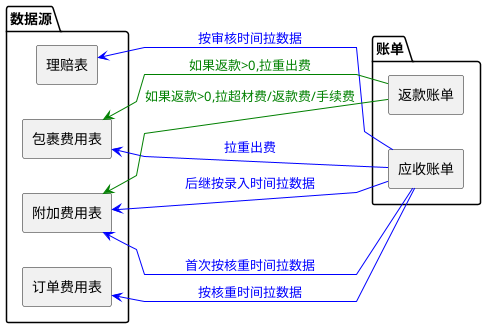

```plantuml
@startuml
left to right direction
skinparam componentStyle rectangle
skinparam linetype polyline
'ortho / polyline / direct / curve'


together {
  folder "数据源" {
    [订单费用表] as N1
    [附加费用表] as N2
    [包裹费用表] as N3
    [理赔表] as N4

    N1 -[hidden] N2
    N2 -[hidden] N3
    N3 -[hidden] N4
  }
  folder "账单" {

    [应收账单] as G1
    [返款账单] as G2
    '[T1]'
    'hide T1'
  }
}

N1 <-[#blue]- G1 #text:blue : 按核重时间拉数据 
N2 <-[#blue]- G1 #text:blue : 首次按核重时间拉数据
N2 <-[#blue]- G1 #text:blue : 后继按录入时间拉数据
N3 <-[#blue]- G1 #text:blue : 拉重出费
N4 <-[#blue]- G1 #text:blue : 按审核时间拉数据

N2 <-[#green]- G2 #text:green : 如果返款>0,拉超材费/返款费/手续费
N3 <-[#green]- G2 #text:green : 如果返款>0,拉重出费

'[#red,dashed,thickness=2]'
'plain / dashed / dotted'
'#color;line.[bold|dashed|dotted];text:color'
@enduml
```

