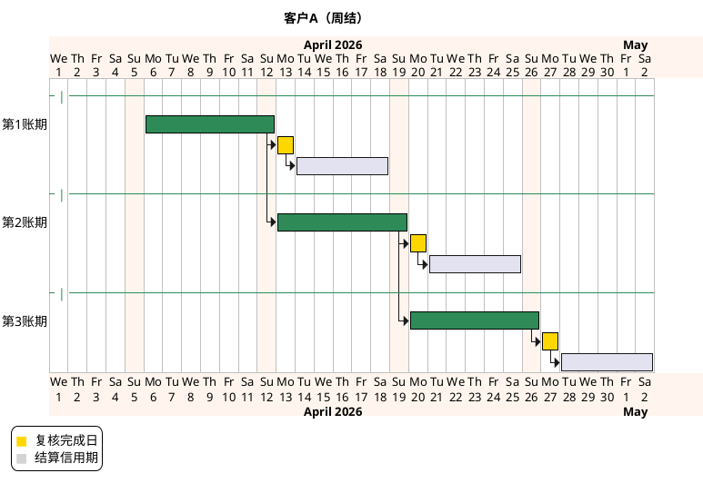
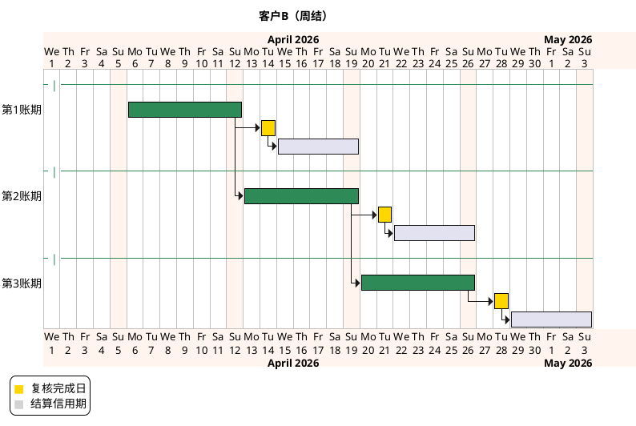
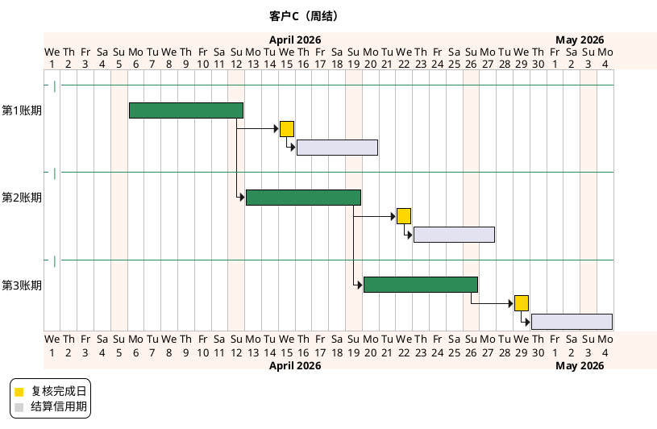

# 账期：周

```plantuml
@startgantt
skinparam LegendBackgroundColor null
<style>
ganttDiagram {
	timeline {
        FontSize 13
        BackgroundColor SeaShell
	}
	task {
		FontSize 14
	}
    arrow {
		LineThickness 1.0
	}
    separator {
		FontSize 14
		FontColor SeaGreen
		LineColor SeaGreen
	}
}
</style>

title 客户A（周结）

printscale daily
Label on first column and left aligned
sunday is colored in SeaShell
Project starts 2026/04/01

-- | --
[第1账期] as [T1] starts 2026/04/06 and requires 1 week 
[ ] as [T1.1] requires 1 day and starts 0 day after [T1]'s end
[ ] as [T1.2] requires 5 day and starts at [T1.1]'s end

[T1] is colored in SeaGreen/Black
[T1.1] is colored in Gold/Black

-- | --
[第2账期] as [T2] starts at [T1]'s end and requires 1 week
[ ] as [T2.1] requires 1 day and starts 0 day after [T2]'s end
[ ] as [T2.2] requires 5 day and starts at [T2.1]'s end

[T2] is colored in SeaGreen/Black
[T2.1] is colored in Gold/Black

-- | --
[第3账期] as [T3] starts at [T2]'s end and requires 1 week
[ ] as [T3.1] requires 1 day and starts 0 day after [T3]'s end
[ ] as [T3.2] requires 5 day and starts at [T3.1]'s end

[T3] is colored in SeaGreen/Black
[T3.1] is colored in Gold/Black

legend left
<color:gold>■</color>  复核完成日
<color:lightgray>■</color>  结算信用期
end legend
@endgantt
```

```plantuml
@startgantt
title 客户B（周结）
skinparam LegendBackgroundColor null
<style>
ganttDiagram {
	timeline {
        FontSize 13
        BackgroundColor SeaShell
	}
	task {
		FontSize 14
	}
    arrow {
		LineThickness 1.0
	}
    separator {
		FontSize 14
		FontColor SeaGreen
		LineColor SeaGreen
	}
}
</style>

printscale daily
Label on first column and left aligned
sunday is colored in SeaShell
Project starts 2026/04/01

-- | --
[第1账期] as [T1] starts 2026/04/06 and requires 1 week 
[ ] as [T1.1] requires 1 day and starts 1 day after [T1]'s end
[ ] as [T1.2] requires 5 day and starts at [T1.1]'s end

[T1] is colored in SeaGreen/Black
[T1.1] is colored in Gold/Black

-- | --
[第2账期] as [T2] starts at [T1]'s end and requires 1 week
[ ] as [T2.1] requires 1 day and starts 1 day after [T2]'s end
[ ] as [T2.2] requires 5 day and starts at [T2.1]'s end

[T2] is colored in SeaGreen/Black
[T2.1] is colored in Gold/Black

-- | --
[第3账期] as [T3] starts at [T2]'s end and requires 1 week
[ ] as [T3.1] requires 1 day and starts 1 day after [T3]'s end
[ ] as [T3.2] requires 5 day and starts at [T3.1]'s end

[T3] is colored in SeaGreen/Black
[T3.1] is colored in Gold/Black

legend left
<color:gold>■</color>  复核完成日
<color:lightgray>■</color>  结算信用期
end legend
@endgantt
```

```plantuml
@startgantt
title 客户C（周结）
skinparam LegendBackgroundColor null
<style>
ganttDiagram {
	timeline {
        FontSize 13
        BackgroundColor SeaShell
	}
	task {
		FontSize 14
	}
    arrow {
		LineThickness 1.0
	}
    separator {
		FontSize 14
		FontColor SeaGreen
		LineColor SeaGreen
	}
}
</style>

printscale daily
Label on first column and left aligned
sunday is colored in SeaShell
Project starts 2026/04/01

-- | --
[第1账期] as [T1] starts 2026/04/06 and requires 1 week 
[ ] as [T1.1] requires 1 day and starts 2 day after [T1]'s end
[ ] as [T1.2] requires 5 day and starts at [T1.1]'s end

[T1] is colored in SeaGreen/Black
[T1.1] is colored in Gold/Black

-- | --
[第2账期] as [T2] starts at [T1]'s end and requires 1 week
[ ] as [T2.1] requires 1 day and starts 2 day after [T2]'s end
[ ] as [T2.2] requires 5 day and starts at [T2.1]'s end

[T2] is colored in SeaGreen/Black
[T2.1] is colored in Gold/Black

-- | --
[第3账期] as [T3] starts at [T2]'s end and requires 1 week
[ ] as [T3.1] requires 1 day and starts 2 day after [T3]'s end
[ ] as [T3.2] requires 5 day and starts at [T3.1]'s end

[T3] is colored in SeaGreen/Black
[T3.1] is colored in Gold/Black

legend left
<color:gold>■</color>  复核完成日
<color:lightgray>■</color>  结算信用期
end legend
@endgantt
```
