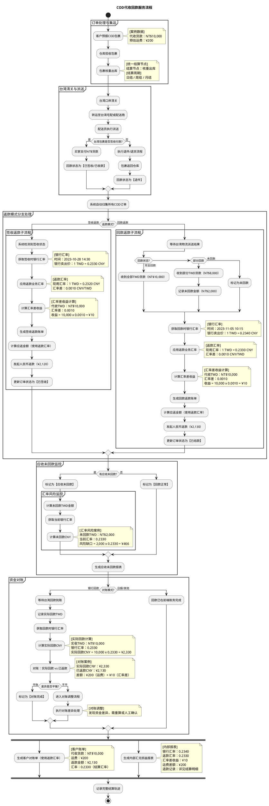

```plantuml
@startuml
title COD代收回款服务流程
skinparam DefaultTextAlignment center
skinparam NoteTextAlignment left
skinparam shadowing false

start

group 订单处理与集运 {
  :客户预报COD包裹;
  note right
    [案例数据]
    代收货款：NT$10,000
    预估运费：¥200
  end note
  :仓库揽收包裹;
  :包裹核重出库;
  note right
    [统一结算节点]
    结算节点：核重出库
    [结算周期]
    日结 / 周结 / 月结
  end note
}

group 台湾清关与派送 {
  :台湾口岸清关;
  :转运至台湾宅配或配送商;
  :配送员执行派送;

  if (台湾包裹是否签收付款?) then (是)
    :买家支付NT$货款;
    :回款状态为【已签收/已收款】;
  else (否)
    :执行退件/退货流程;
    :包裹返回仓库;
    :回款状态为【退件】;
  endif
}

:系统自动归集所有COD订单;

group 返款模式分支处理 {
  if (返款模式?) then (签收返款)
    group 签收返款子流程 {
      :系统检测到签收状态;
      :获取签收时银行汇率;
      note right
        [银行汇率]
        时间：2023-10-28 14:30
        银行卖出价：1 TWD = 0.2330 CNY
      end note

      :应用返款业务汇率;
      note right
        [返款汇率]
        现用汇率：1 TWD = 0.2320 CNY
        汇率差：0.0010 CNY/TWD
      end note

      :计算汇率差收益;
      note right
        [汇率差收益计算]
        代收TWD：NT$10,000
        汇率差：0.0010
        收益 = 10,000 x 0.0010 = ¥10
      end note

      :生成签收返款账单;
      :计算应返金额（使用返款汇率）;
      :发起人民币返款（¥2,120）;
      :更新订单状态为【已签收】;
    }
  else (回款返款)
    group 回款返款子流程 {
      :等待台湾物流派送结果;

      if (回款状态?) then (完全回款)
        :收到全部TWD货款（NT$10,000）;
      elseif (部分回款)
        :收到部分TWD货款（NT$8,000）;
        :记录未回款金额（NT$2,000）;
      else (未回款)
        :标记为未回款;
      endif

      :获取回款时银行汇率;
      note right
        [银行汇率]
        时间：2023-11-05 10:15
        银行卖出价：1 TWD = 0.2340 CNY
      end note

      :应用返款业务汇率;
      note right
        [返款汇率]
        现用汇率：1 TWD = 0.2330 CNY
        汇率差：0.0010 CNY/TWD
      end note

      :计算汇率差收益;
      note right
        [汇率差收益计算]
        代收TWD：NT$10,000
        汇率差：0.0010
        收益 = 10,000 x 0.0010 = ¥10
      end note

      :生成回款返款账单;
      :计算应返金额（使用返款汇率）;
      :发起人民币返款（¥2,130）;
      :更新订单状态为【已结款】;
    }
  endif
}

group 应收未回款监控 {
  if (有应收未回款?) then (是)
    :标记为【应收未回款】;
    group 汇率风险监控 {
      :计算未回款TWD金额;
      :获取当前银行汇率;
      :计算未回款CNY;
      note right
        [汇率风险案例]
        未回款TWD：NT$2,000
        当前汇率：0.2330
        风险缺口 = 2,000 x 0.2330 = ¥466
      end note
    }
  else (否)
    :标记为【回款正常】;
  endif
  :生成应收未回款报表;
}

group 资金对账 {
  if (对账模式?) then (银行回款)
    :等待台湾回款到账;
    :记录实际回款TWD;
    :获取回款时银行汇率;
    :计算实际回款CNY;
    note right
      [实际回款计算]
      实收TWD：NT$10,000
      银行汇率：0.2330
      实际回款CNY = 10,000 x 0.2330 = ¥2,330
    end note

    :对账：实际回款 vs 已返款;
    note right
      [对账案例]
      实际回款CNY：¥2,330
      已返款CNY：¥2,130
      差额：¥200（运费）+ ¥10（汇率差）
    end note

    if (差异是否平衡?) then (平账)
      :标记为【对账完成】;
    else (不平)
      :进入对账调整流程;
      :执行对账差异处理;
      note right
        [对账调整]
        发现资金差异，需重算或人工确认
      end note
    endif
  else (日报/其他)
    :回款已在前端账务完成;
  endif
}

fork
  :生成客户对账单（使用返款汇率）;
  note right
    [客户账单]
    代收货款：NT$10,000
    运费：¥200
    返款金额：¥2,130
    汇率：0.2330（结算汇率）
  end note
fork again
  :生成内部汇兑损益报表;
  note right
    [内部报表]
    银行汇率：0.2340
    返款汇率：0.2330
    汇率差收益：¥10
    运费差额：¥200
    退款记录：详见结算明细
  end note
end fork

:记录完整结算轨迹;
stop
@enduml
```
