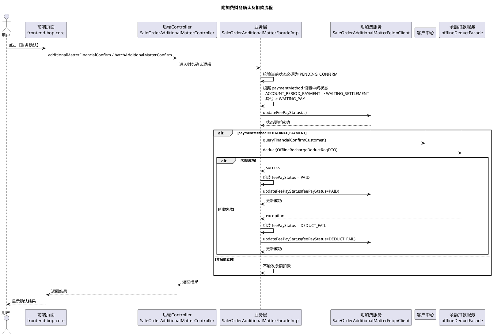

```plantuml
@startuml
title 附加费财务确认及扣款流程

actor 用户
participant "前端页面\nfrontend-bop-core" as FE
participant "后端Controller\nSaleOrderAdditionalMatterController" as WC
participant "业务层\nSaleOrderAdditionalMatterFacadeImpl" as BI
participant "附加费服务\nSaleOrderAdditionalMatterFeignClient" as SOAM
participant "客户中心" as CUST
participant "余额扣款服务\nofflineDeductFacade" as DEDUCT

用户 -> FE: 点击【财务确认】
FE -> WC: additionalMatterFinancialConfirm / batchAdditionalMatterConfirm
WC -> BI: 进入财务确认逻辑

BI -> BI: 校验当前状态必须为 PENDING_CONFIRM
BI -> BI: 根据 paymentMethod 设置中间状态\n- ACCOUNT_PERIOD_PAYMENT -> WAITING_SETTLEMENT\n- 其他 -> WAITING_PAY
BI -> SOAM: updateFeePayStatus(...)
SOAM --> BI: 状态更新成功

alt paymentMethod == BALANCE_PAYMENT
  BI -> CUST: queryFinancialConfirmCustomer()
  BI -> DEDUCT: deduct(OfflineRechargeDeductReqDTO)
  alt 扣款成功
    DEDUCT --> BI: success
    BI -> BI: 组装 feePayStatus = PAID
    BI -> SOAM: updateFeePayStatus(feePayStatus=PAID)
    SOAM --> BI: 更新成功
  else 扣款失败
    DEDUCT --> BI: exception
    BI -> BI: 组装 feePayStatus = DEDUCT_FAIL
    BI -> SOAM: updateFeePayStatus(feePayStatus=DEDUCT_FAIL)
    SOAM --> BI: 更新成功
  end
else 非余额支付
  BI -> BI: 不触发余额扣款
end

BI --> WC: 返回结果
WC --> FE: 返回结果
FE --> 用户: 显示确认结果

@endumlplantu
```
