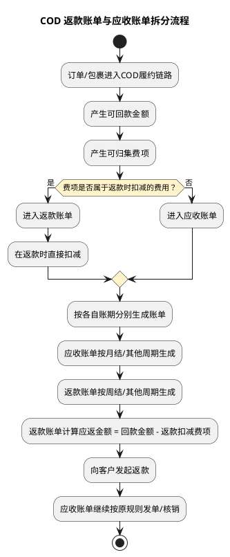

# BMS COD 返款账单设计

## 1. 背景

COD 包裹的核心链路是“代收货款 -> 回款 -> 返款给客户”。  
在这个链路里，客户侧会同时产生两类账单：

1. `应收账单`：承载和履约/运输相关的应收费项。
2. `返款账单`：承载 COD 货款回款后的返还金额，以及在返款时需要直接扣减的费用。

关键点是，两类账单的账期可以不同。

- 例如应收账单按月结。
- 返款账单按周结。
- 返款账单并不要求和应收账单同账期、同周期、同结算节奏。

## 2. 业务理解

COD 货款代收流程可理解为：

1. 客户发货，包裹进入履约链路。
2. 平台/承运链路代客户向收件方代收货款。
3. 货款回到平台侧后，形成可返还给客户的资金。
4. 平台在返款时，优先扣减应在返款阶段扣除的费用。
5. 剩余金额再返还客户。

这意味着：

- `返款账单`不是简单的收款流水单。
- 它是“货款回款 + 可在返款时抵扣的费项 + 最终返款结果”的业务载体。
- `应收账单`则继续承载其余应收费项，不因为 COD 回款而被挪走。

## 3. 账单拆分原则

### 3.1 账单类型边界

建议将账单按业务目的拆为两类：

1. `应收账单`
2. `返款账单`

其中：

- 应收账单：记录客户应向平台支付的费用。
- 返款账单：记录平台应向客户返还的 COD 货款，以及返款时直接扣减的费用。

### 3.2 费项归属原则

费项分两类处理：

1. `返款时扣减的费项`
2. `计入应收账单的费项`

建议规则如下：

- `代收货款手续费` 进入返款账单，在返款时直接扣减。
- `超材费` 如属于 COD 返款链路下的扣减项，也进入返款账单，在返款时直接扣减。
- 其余应收费项继续进入应收账单。
- `代收货款` 本身作为返款本金判断项，必须优先存在，且金额必须大于 `0`。
- 当 `代收货款 <= 0` 时，本期返款账单不再拉取其他直接扣减费项。
- 当 `代收货款 > 0` 时，直接扣减费项不按本期返款账期现拉，而是按本期 `start_time` 往前回看一个同长度周期进行关联。

也就是说：

- `返款账单`只吸收“返款动作发生时必须一起结算”的费项。
- `应收账单`吸收其他仍需向客户收取的费项。

## 4. 账期规则

### 4.1 账期可独立配置

应收账单和返款账单的账期应该独立配置：

- 应收账单：可月结
- 返款账单：可周结

两者之间不要求对齐，也不要求起止日一致。

### 4.2 账期归属

建议每个账单实例都保存独立账期信息：

- `billing_period_start_date`
- `billing_period_end_date`
- `billing_cycle_type`
- `bill_type`

这样可以保证：

- 一笔 COD 回款只进入它所属的返款账单周期。
- 同一批业务费项仍可按应收账单周期进入对应应收账单。

## 5. 推荐流程



## 6. 返款账单计算口径

返款账单建议至少包含以下金额维度：

1. `代收货款金额`
2. `返款扣减费项金额`
3. `应返金额`
4. `已返金额`
5. `未返金额`

推荐公式：

```text
应返金额 = 代收货款金额 - 返款扣减费项金额
```

如果存在手续费或超材费已经在其他账单中处理，则返款账单需要避免重复扣减。

## 7. 数据建议

### 7.1 账单主表

建议账单主表保留 `bill_type`，用于区分：

- `AR` / `MEMBER_AR`：应收账单
- `COD_REFUND` / `PCB`：返款账单

### 7.2 明细表

建议账单明细至少补充这些标识：

- `fee_scope`
- `settlement_role`
- `deduct_at_refund_flag`
- `source_bill_no`
- `source_order_id`

其中：

- `deduct_at_refund_flag = 1` 表示该费项需要在返款时直接扣减。
- `source_bill_no` 用于反查来源账单或来源周期。

### 7.3 归集标记

建议对来源业务数据保留账单归集标记，避免重复归集：

- 应收账单归集标记
- 返款账单归集标记

## 8. 状态建议

返款账单建议具备独立状态流转，不与应收账单状态混用。

建议状态：

1. `DRAFT`
2. `GENERATED`
3. `PENDING_REMITTANCE`
4. `REMITTED`
5. `VOID`

含义：

- `DRAFT`：起草中
- `GENERATED`：已生成待复核
- `PENDING_REMITTANCE`：已确认，待返款
- `REMITTED`：已返款
- `VOID`：作废

## 9. 与现有应收账单的关系

现有 BMS 已有应收账单主链路，且应收账单状态、核销、调账逻辑都已存在。  
因此这次设计建议：

1. 不把返款账单硬塞进现有应收账单状态机。
2. 返款账单独立成一种账单类型。
3. 通过费项归属规则决定费项进入哪张账单。
4. 返款账单只吸收“返款阶段必须一起处理”的费项。

## 10. 边界情况

### 10.1 账期不一致

如果应收账单是月结，返款账单是周结：

- 同一笔业务可能在不同时间先进入返款账单，再进入应收账单。
- 这不是冲突，而是两种不同结算目的的并行账单。

### 10.2 费项重复归集

如果某个费项既已进入返款账单，又被应收账单规则命中：

- 需要以“费项归属优先级”决策。
- 建议优先级：`返款时扣减` > `应收账单`
- 如果返款账单先生成并已占用该费用来源，应收账单需要改为“弱关联”到该费项，不再重复计费。
- 弱关联只补账单关系，不增加应收金额。

### 10.3 回款不足

如果代收货款不足以覆盖返款扣减项：

- 返款账单应记录差额。
- 可进入待补扣/待补收状态，由财务或业务后续处理。

## 11. 结论

本设计的核心是把 COD 场景拆成两条账单线：

- `应收账单`负责收客户该付的费用。
- `返款账单`负责处理代收货款返还，并在返款时扣减指定费项。

这样既能支持不同账期，也能把 `代收货款手续费`、`超材费` 这类费用从应收链路中拆出来，避免账务口径混乱。
