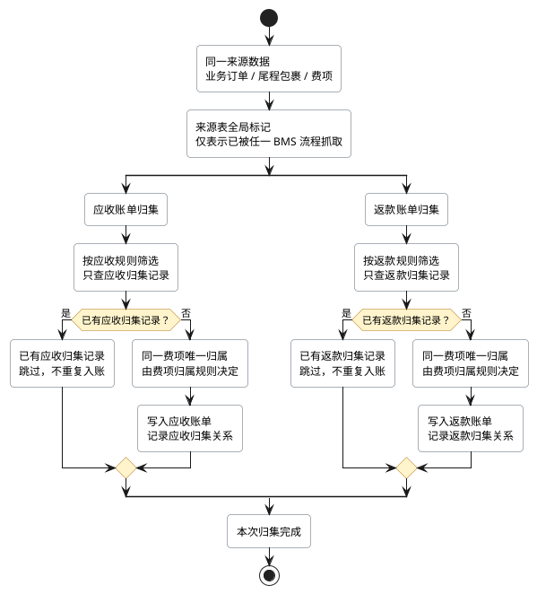

# 待开发需求：应收与返款账单按账单类型独立归集源数据

## 1. 需求概要

| 项目 | 说明 |
| --- | --- |
| 需求类型 | 修改项 |
| 当前问题 | 应收账单与返款账单共用来源表上的全局 BMS 标记。任一账单先归集源数据后，另一账单可能把该数据误判为已处理，导致符合条件的订单或费项无法进入账单。 |
| 目标 | 同一来源数据可以按应收账单、返款账单各自的规则分别归集；同一账单类型仍不得重复归集同一来源数据。 |
| 影响范围 | 账单源数据筛选、归集判重、归集留痕、任务重试、账单重算及相关标记恢复。 |
| 不变范围 | 账单配置、费项归属、金额正负方向、汇率、应收金额、返款金额、核销及调账规则均保持不变。 |

本次修改解决的是“来源数据能否被不同账单类型分别使用”，不改变“同一费项最终进入哪类账单”的业务规则。

## 2. 核心规则

### 2.1 不同账单类型分别判断是否已归集

| 判断项 | 当前处理 | 调整后处理 |
| --- | --- | --- |
| 来源数据是否可参与应收账单归集 | 只要来源表已被 BMS 标记，就可能被排除 | 只判断该来源数据是否已被应收账单成功归集 |
| 来源数据是否可参与返款账单归集 | 只要来源表已被 BMS 标记，就可能被排除 | 只判断该来源数据是否已被返款账单成功归集 |
| 同一类型重复归集 | 依赖来源表全局标记阻止 | 依据“来源数据 + 账单类型”的归集记录阻止 |
| 来源表的 BMS 标记 | 同时承担抓取留痕和跨账单类型判重 | 仅表示该数据至少被一个 BMS 流程抓取过，不作为不同账单类型之间互斥的依据 |
| 来源表的账单编号 | 可能参与候选数据过滤 | 仅保留最近一次关联账单的信息，不作为候选数据过滤条件 |

下面的图展示同一来源数据如何按账单类型分别归集，以及同一类型为什么不会重复入账：

### 2.2 同一来源可以复用，同一费项不能重复入账

1. 同一业务订单、尾程包裹或来源明细，可以分别参与应收账单和返款账单的归集判断。
2. 应收账单与返款账单分别按照各自的账单配置、账期和归集条件筛选数据，彼此不得因另一账单类型已处理而直接排除。
3. 来源数据可被两类账单引用，不代表同一费项可以重复成为两类账单的核对金额。
4. 同一费项同时命中应收与返款规则时，仍按 [9.5.6 同一费项进入应收账单，还是返款账单？](../PRD.账单系统.md#section-9-5-6) 和 [11.2.2 同一费项进入应收账单，还是返款账单？](../PRD.账单系统.md#section-11-2-2) 确定唯一归属。
5. 返款本金、返款扣减费项等仅作为应收账单关联信息展示时，不得重复计入应收账单核对金额。

### 2.3 归集顺序不得影响结果

| 场景 | 处理结果 |
| --- | --- |
| 应收账单先归集，返款账单后归集 | 返款账单仍可归集符合返款规则的来源数据。 |
| 返款账单先归集，应收账单后归集 | 应收账单仍可归集符合应收规则的来源数据。 |
| 同一账单类型再次处理同一来源数据 | 已被该账单类型成功归集的数据不得重复进入账单。 |
| 两类账单同时处理同一来源数据 | 两类任务可独立判断和留痕；系统必须保证各自幂等，并在写入账单明细前执行费项唯一归属判断。 |

## 3. 归集、重试与重算

### 3.1 归集流程

1. 任务按创建时确定的账单配置和账期筛选候选数据。
2. 系统按当前账单类型查询该来源数据的归集记录。
3. 当前账单类型已有成功归集记录时，跳过该来源数据。
4. 仅存在另一账单类型的成功归集记录时，不得据此跳过。
5. 系统继续执行当前账单类型的费项归属、金额计算和账单明细生成规则。
6. 归集成功后，系统记录来源数据、归集方式和账单类型，作为该类型后续判重与追溯依据。
7. 任务中的拉取数、命中数等统计只反映本次账单类型的处理结果。

### 3.2 失败重试

1. 技术异常导致任务失败时，重新执行必须创建新任务，并使用新任务对应的配置快照。
2. 失败、待处理或已被重算替代的归集记录，不得被视为当前账单类型已经成功归集。
3. 重新执行只检查和更新当前账单类型的归集记录，不得清除或覆盖另一账单类型的有效记录。
4. 重试的任务状态和用户操作继续遵循 [17.3 幂等、并发与恢复保护](../PRD.账单系统.md#section-17-3)。

### 3.3 账单作废、重算或回滚

1. 账单作废、重算或回滚时，只撤销当前账单类型、当前账单对应的归集关系。
2. 同一来源数据仍被另一账单类型有效使用时，来源表上的“已被 BMS 抓取”标记必须保留。
3. 仅当该来源数据不再存在任何有效归集关系时，才可恢复为未被 BMS 抓取。
4. 恢复归集记录时，只恢复当前账单类型的记录，不得连带恢复另一账单类型的记录。

## 4. 来源范围与边界

| 来源 | 本次处理边界 |
| --- | --- |
| 业务订单 | 应收与返款按各自条件独立筛选和判重。 |
| 附加费及其增量、台账来源 | 按原有费项归属规则进入适用的账单类型，并按账单类型独立判重。 |
| 理赔数据 | 当前仍仅适用于应收账单；本次不扩展至返款账单。 |
| 账单生成后的新增费项标记 | 语义保持不变，仍用于识别账单生成后追加的费项。 |

本次不新增来源表字段。来源表上的全局标记只保留抓取留痕；应收与返款是否已经处理该来源，以 BMS 内按账单类型记录的归集历史为准。

## 5. 现有数据处理

1. 上线时不批量修改或删除来源表中的现有数据，也不得通过人工清空来源表账单编号来绕过判重。
2. 因旧逻辑形成的空任务或漏归集账单，不自动批量重跑。
3. 财务确认需要补处理的客户、账期和任务范围后，系统按现行账单状态及生成、重算规则创建新任务处理。
4. 补处理不得改变已经正确生成的账单金额，也不得使同一账单类型产生重复明细。

## 6. 来源与追溯

1. 业务规则来源：[PRD.账单系统.md](../PRD.账单系统.md)，重点参考 [9.5.6 同一费项进入应收账单，还是返款账单？](../PRD.账单系统.md#section-9-5-6)、[11.2.2 同一费项进入应收账单，还是返款账单？](../PRD.账单系统.md#section-11-2-2) 和 [17.3 幂等、并发与恢复保护](../PRD.账单系统.md#section-17-3)。
2. 现状与调整依据：[2026-08-20-bms-应收与返款账单源数据打标互斥技术调整方案及实施计划.md](../../../technical-caliber/bms/dev-specs/2026-08-20-bms-应收与返款账单源数据打标互斥技术调整方案及实施计划.md)。
3. 版本来源：Commit `e86585e8fc55b2480b04a39b8d2fc0fd1a0f54e7`。
