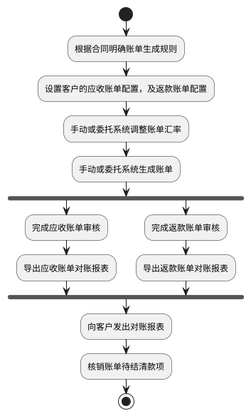
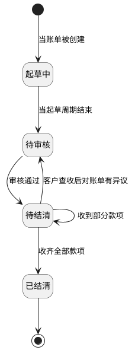
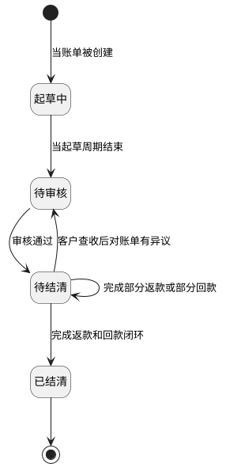
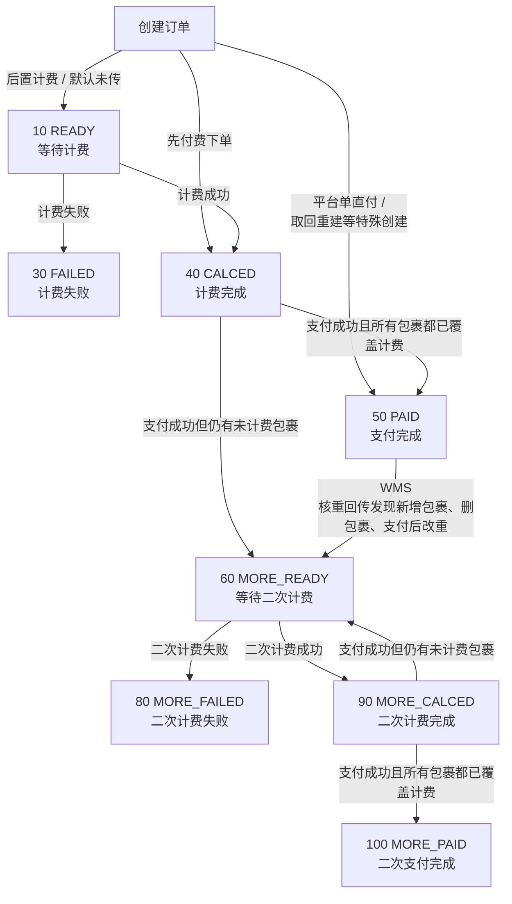
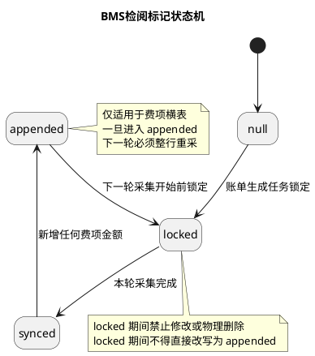
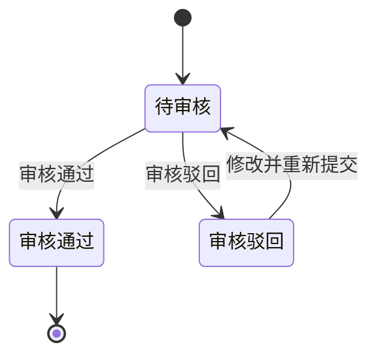

# 财务系统 PRD

## 1. 背景与目标
本 PRD 统一定义财务系统的账单体系与规则，目标是让系统能够：

- 按账期自动归集费项并生成账单。
- 支持应收账单与返款账单独立运行。
- 支持版本化结算条款管理，币种 / 汇率 / 汇兑口径统一见第11章`金额汇兑`。
- 支持审核、补录、冲正、核销、对账和催收闭环。
- 保留历史账单、历史规则和历史金额快照，不回写已生效单据。

## 2. 问题定义

1. 财务在应收、返款、核销、对账之间切换时，口径分散，难以追溯同一费项最终归属。
2. 账单生成依赖账期、费项归集和金额口径，若规则不统一会直接影响结算结果；相关币种 / 汇率 / 汇兑规则见第11章`金额汇兑`。
3. 应收账单与返款账单都存在历史快照诉求，若无统一冻结机制，容易出现历史账单被回写。
4. 返款与应收共享同一订单费项归属，但业务边界不同，需要明确优先级和分流规则。

## 3. 用户与场景

- 财务专员：维护配置、审核账单、处理核销与对账。
- 财务主管：审批冲正、调账、异常处理。
- 业务部：关注账单口径、线路与费项归属。
- 系统：按配置归集费项、生成账单、锁定快照、流转状态。
- 客户：接收账单、确认金额、完成付款或返款确认。

典型场景：

1. 应收账单按账期自动归集后付费项，并在审核后发给客户。
2. COD 返款账单按签收或回款触发，完成代收货款返还、扣减和核销。
3. 同一费项先判断是否进入返款账单，未命中时再进入应收账单。

## 4. 范围与边界

### 4.1 需求范围内

- 应收账单配置、生成、审核、发送、结算、冲正、核销。
- 返款账单配置、生成、审核、发送、回款管理、核销、对账。
- 费项索引、结算条款版本、金额快照、账单状态机；币种 / 汇率 / 汇兑口径见第11章`金额汇兑`。
- 账单列表、详情、导出、审计留痕、异常处理。

### 4.2 需求范围外

- 不重写上游订单、包裹、WMS 的基础履约逻辑。
- 不展开应付账单的详细功能设计，仅保留类型定义与编号规则。
- 不做跨币种自动抵扣作为 V1 默认能力。

## 5. 总体方案与关键原则

财务系统的核心目标，是把“费项怎么来、账单怎么分、金额怎么锁、状态怎么走、历史怎么留”统一起来，形成一条财务和技术都能对齐的主链路。

### 5.1 总体链路

财务系统采用“费项归集 -> 账单生成 -> 审核发送 -> 付款 / 返款 -> 核销对账 -> 历史留痕”的统一链路。

系统负责：

1. 维护结算条款版本和费项索引，金额快照与汇率口径见第11章`金额汇兑`。
2. 按账期自动归集费项并生成账单草稿。
3. 根据账单类型进入对应状态机。
4. 记录核销、回款、冲正和对账结果。

财务负责：

1. 维护客户级结算条款和返款配置。
2. 审核账单、补录费项、处理冲正。
3. 登记回款、核销差异、发起催收。

### 5.2 账单类型

| 类型 | 说明 | 本期范围 |
| :--- | :--- | :--- |
| 应收账单 | 客户应付给天马运通的账单 | 是 |
| 返款账单 | 天马运通向客户返还 COD 货款的账单 | 是 |
| 应付账单 | 向供应商支付费项的账单 | 仅定义，不展开 |

### 5.3 账单编号

| 账单类型 | 前缀 | 结算主体 | 账期起始日 | 后缀 | 示例 |
| :--- | :--- | :--- | :--- | :--- | :--- |
| 应收账单 | ARB | 客户编号 | yyyymmdd | 业务板块+目的国 MD5 截前 4 位 | `ARB-OG4155-20260101-fse3` |
| 应付账单 | APB | 供应商编号 | yyyymmdd | 无 | `APB-OG4155-20260101` |
| 返款账单 | PCB | 客户编号 | yyyymmdd | 无 | `PCB-OG4155-20260101` |

应收账单同一账期内，若不同费项关联订单的业务板块或目的国不同，必须拆成多张账单，后缀用于区分。

### 5.4 归集与变更原则

1. 所有费项必须有挂靠对象，且挂靠对象只能是 `财务账单`、`业务订单`、`尾程包裹`、`首程包裹` 之一。
2. 一个后付费项（代收代付类除外）只挂靠到一张账单。
3. 代收代付类费项可以同时挂靠到一张应收账单和一张成本账单。
4. 返款账单优先于应收账单分流。
5. 历史账单一旦进入审核或结清，不允许被后续配置直接回写。
6. 已通过财务审核的应收账单，不允许直接修改已挂靠费项。
7. 往期金额错误或变动，只能在本期账单冲正。
8. 返款账单已结清后，不允许直接改写原核销结果，只能通过新账单或调整单处理。
9. 所有账单均需保留配置快照、金额快照与核销轨迹；涉及币种 / 汇率 / 汇兑的口径统一见第11章`金额汇兑`。

## 6. 财务SOP

财务 SOP 关注的是“每天先看什么、先做什么、什么状态能改、什么状态只能等”的固定操作节奏。它把账单生成、审核、发送、回款、核销和异常处理串成一条可执行的日常流程，方便财务和技术按同一顺序理解和实现。

### 6.1 SOP目标

1. 把财务日常动作标准化，减少个人经验差异。
2. 把系统任务、人工审核和资金动作串成同一条闭环。
3. 把起草、审核、发送、结算、核销和归档的边界说清楚。
4. 让财务和技术都能按同一节奏理解账单状态。

### 6.2 SOP主原则

1. 先看配置，再看费项，再看账单，再看资金，最后看核销。
2. 起草中可以改，待审核要审核，待结清只做资金动作，已结清只看历史。
3. 返款优先于应收，避免同一笔费项重复进入两个主账单。
4. 历史账单及相关金额快照不回写，具体口径见第11章`金额汇兑`。
5. 所有异常都要有记录，不能靠删除源数据解决。

### 6.3 日常SOP

| 时段 | 财务人员实际动作 | 关注重点 | 输出 |
| :--- | :--- | :--- | :--- |
| 日初 | 查看当日账期、客户账单规则、待审核账单和待处理事项 | 账期是否切换、客户规则是否有效、优先处理事项是否明确 | 当日财务处理清单 |
| 账前准备 | 确认本期应出账客户、账期范围、结算币种和费用范围 | 客户、账期、币种、费用归属是否一致 | 本期出账范围确认 |
| 费用核对 | 核对订单费用、运费、代收款、返款、扣减等金额是否完整 | 是否存在漏项、重项、错项或金额口径不一致 | 费用核对结果 |
| 账单核对 | 核对应收账单和返款账单的客户、账期、明细和汇总金额 | 明细金额与汇总金额是否一致，结算币种金额是否正确 | 账单核对结果 |
| 审核期 | 审核应收账单、返款账单及相关调账 / 冲正记录 | 金额依据是否充分，调整原因是否清楚，账单口径是否一致 | 审核结论 |
| 对账准备 | 导出应收账单和返款账单对账报表 | 报表是否只包含客户对账需要的信息，金额是否按结算币种展示 | 客户对账文件 |
| 客户对账 | 将对账报表提供给客户，并跟进客户确认或差异反馈 | 发送对象、账期、金额和客户反馈是否记录清楚 | 客户确认结果 / 差异清单 |
| 结清期 | 登记回款、返款、扣减结果，并核对未结清余额 | 是否存在部分结清、金额差额或待跟进款项 | 核销结果 / 跟进清单 |
| 日终 | 整理当天未完成事项和次日待办 | 是否还有未审核、未确认、未结清或待客户反馈事项 | 次日待办清单 |

日常执行顺序建议如下：

1. 先确认客户账单规则和账期，再核对本期费用范围和金额。
2. 账单审核前先处理清楚补录、调账和冲正，避免带着未确认差异进入对账。
3. 应收账单和返款账单可以同步核对、同步审核、同步导出。
4. 导出给客户前，先确认报表只保留客户对账所需的信息。
5. 客户反馈差异时，先记录差异原因，再按补录、调账或冲正处理。
6. 已结清账单只做查询、对账和后续跟进，不直接修改原账单结果。

### 6.4 财务SOP

财务 SOP 拆分为主流程和子流程：

- 主流程描述 happy flow，即从客户账单配置到导出应收账单、返款账单并与客户对账的无卡点链路，只保留无论如何都必须经历的环节。
- 子流程描述特定场景才触发的处理路径，例如配置变更、费项异常、调账冲正、审核驳回、客户异议、部分结清或差额处理。

#### 6.4.1 主流程

主流程不承载异常判断，也不展开系统内部任务细节。系统自动生成、自动归集、发送失败重试、审计日志归档等动作只作为结果被财务确认，不作为财务 SOP 的主动作。

#### 6.4.2 子流程触发清单

子流程只在特定场景下触发，不进入主流程的必经节点。子流程处理完成后，应回到对应账单的核对、审核或导出节点继续主流程。

| 子流程 | 触发场景 | 财务动作 | 回到主流程的位置 |
| :--- | :--- | :--- | :--- |
| 配置确认 / 变更 | 客户账单配置缺失、失效、账期或币种规则变化 | 修改或确认客户账单配置，确认生效时间和适用范围 | 确认配置已生效 |
| 数据缺失处理 | 本期费项、回款、返款或订单基础信息未进入可出账范围 | 补充来源文件、发起导入或要求业务补齐数据，并确认系统采集结果 | 确认本期业务数据已进入可出账范围 |
| 费项补录 | 账单核对时发现应收费用、扣减项或返款费用缺失 | 在账单侧补录费项，确认补录金额进入账单明细和汇总 | 核对应收 / 返款账单金额 |
| 调账 / 冲正 | 本期或往期账单金额有误，不能直接改写历史账单 | 在调账中心发起调账或冲正，完成审核后引用到当前账单 | 核对应收 / 返款账单金额 |
| 审核驳回 | 账单审核不通过，或关联冲正记录未全部审核通过 | 填写审核意见，退回修正，修正完成后重新审核 | 完成账单审核 |
| 客户异议 | 客户收到对账报表后对金额、费项、扣减项、回款或返款口径提出异议 | 记录异议，必要时将待结清账单折返回待审核，并通过补录、调账或冲正承接差异 | 核对应收 / 返款账单金额 |
| 部分结清 / 差额 | 客户部分付款、部分返款，或回款 / 返款金额与账单金额不一致 | 登记实际资金结果，核对差额原因，确认可核销金额和未结清余额 | 后续资金核销流程 |
| 导出字段定制 | 客户要求在默认对账报表外追加识别、筛选或辅助核对字段 | 按客户要求追加允许展示的非金额字段，不追加原始币种金额、汇率、内部快照或审核字段 | 导出应收 / 返款账单对账报表 |

## 7. 账单生成机制

### 7.1 设计目标

1. 起草中账单允许随时重跑。
2. 审核完成后的账单禁止再走“账单生成任务”重跑。
3. 账单生成拆分为源数据增量采集任务和账单侧调整重算任务。
4. 源数据侧行级状态包括 `null / locked / appended / synced`；其中 `appended` 仅用于费项横表后续追加费项金额后的再采集场景。
5. 已被 BMS 成功采集的费项原始金额，不允许在数据源侧直接删除或修改。
6. 费项修正或作废必须通过账单侧调账、冲正或作废兜底；若原始金额有误，应在调账中心对该费项做冲正，不回写源数据。

### 7.2 任务分层

1. 源数据增量采集任务负责先将待处理行锁定为 `locked`，再写入账单明细；所有步骤执行完毕后统一回写为 `synced`。
2. 账单侧调整重算任务负责补录、冲正、金额口径调整和配置变更后的重算，不回写源数据；相关币种 / 汇率 / 汇兑口径见第11章`金额汇兑`。
3. 触发方式包括定时、手动生成、失败重试、配置变更和财务调整。

### 7.3 行级标记

| 标记值 | 含义 | 产品规则 |
| :--- | :--- | :--- |
| `null` | 尚未被采集 | 首次进入账单采集范围时拉取 |
| `locked` | 已被账单生成任务锁定 | 处理期间禁止修改或物理删除 |
| `appended` | 行内追加了新的费项金额 | 仅适用于费项横表，表示该行已有 BMS 已采集费项之后又追加了新的费项金额，需进入下一轮采集 |
| `synced` | 已被采集并同步 | 不再重复拉取 |

规则：

1. 这里的行级标记，当前特指供 BMS 检阅的标记，不是通用业务状态字段。
2. 新数据默认是 `null`。
3. 账单生成任务执行时，第一步必须先把参与处理的源数据行更新为 `locked`。
4. 锁定完成后再执行后续采集、归集、写入账单明细等步骤。
5. 对于费项横表，若某一行在既有 BMS 成功采集结果之后又追加了新的费项金额，追加事务必须先将该行标记置为 `appended`，以便下一轮采集任务识别该行需要再次同步。
6. 所有步骤执行完毕后，将本次处理涉及的源数据行统一回写为 `synced`。
7. `locked`、`appended` 和 `synced` 行都不能物理删除，只能保留用于追溯和审计。

### 7.4 配置与归属

1. 账单配置定义客户维度、业务类型、账期类型、履约节点和默认/分支规则；其中应收账单配置的履约节点仅允许选择`出库`和`订单完结`，不再提供`核重`或`签收`选项。
2. 同一客户只能有一个默认配置，可以有多个分支配置。
3. 分支配置按目的国、仓库、业务板块等范围限定，重叠时按优先级或先到先得处理。
4. 同一订单在同一账期内只能命中一个 `bill_config_id`。
5. 执行前必须固化配置快照、范围快照和费项规则快照，不反查最新配置覆盖旧结果。
6. 账单归属时间不能简单按 `create_time` 判断，必须以账单归属时间快照为准。

### 7.5 生成与调整原则

1. 系统扫描启用配置，锁定当前账期和配置快照后开始生成。
2. 起草中账单可持续吸收新增或变化费项。
3. 进入 `待审核` 后，不允许再通过账单生成任务重跑覆盖结果，只能通过补录、冲正、调账或新账单承接变化。
4. 账单内只要存在任何冲正记录，这些冲正记录就必须先审核通过，整份账单才允许审核通过。
5. 进入 `待结清` 或 `已结清` 后，不允许再回写历史主结果；但应收账单和返款账单均允许因客户查收账单后提出异议，从 `待结清` 折返回 `待审核` 进行账单修正。
6. 若某笔费项同时满足应收与返款规则，优先进入返款账单。
7. 重跑只采增量，不做全量回扫。

### 7.6 状态与操作权限

| 账单状态 | 导出账单 | 调整账单 | 重跑账单 | 审核账单 | 重发账单 | 核销账单 |
| :--- | :--- | :--- | :--- | :--- | :--- | :--- |
| 起草中 | 可 | 可 | 可 | 不可 | 不可 | 不可 |
| 待审核 | 可 | 可 | 不可 | 可 | 不可 | 不可 |
| 待结清 | 可 | 不可 | 不可 | 不可 | 不可 | 可 |
| 已结清 | 可 | 不可 | 不可 | 不可 | 不可 | 不可 |

说明：

1. 这里的“调整账单”指账单侧的补录、冲正、调账和重算，不等于重跑生成任务。
2. `待审核` 阶段不再允许重跑账单生成任务，但仍可通过账单侧调整触发口径修正。
3. `待结清` 账单因客户查收后对账单持有异议而折返回 `待审核` 时，只改变账单审核状态；如果已有部分款项核销，必须保留核销记录，不删除、不覆盖已发生的回款 / 返款核销流水；后续修正仅调整未核销余额或通过调账、冲正承接差异。
4. `已结清` 只保留查询和历史追溯能力。
5. 账单核销完毕并进入 `已结清` 后，本系统应触发支付状态同步：将数据源中与该账单关联的所有费项支付状态更新为`已支付`；该动作只更新支付状态，不回写费项金额、币种、汇率或历史账单结果。

### 7.7 账单生成与调整流程图

```plantuml
@startuml
title BMS账单生成与调整产品流程
skinparam shadowing false
skinparam DefaultTextAlignment center
start
partition "任务触发" {
  :系统扫描启用中的账单配置;
  :判断当前是否到了账期出账时点;
  if (是否需要生成本期账单?) then (是)
    :创建本期账单生成任务;
    :固化配置快照、范围快照、费项规则快照;
  else (否)
    :保留为待触发状态;
    stop
  endif
}
partition "任务领取" {
  :领取账单生成任务;
  if (任务是否可执行?) then (是)
    :锁定任务，进入本次处理周期;
  else (否)
    :提示任务已被占用或已失效;
    stop
  endif
}
partition "范围判定" {
  :按照账单配置筛选客户、业务类型、目的国、仓库和账期;
  :确定本次允许进入账单的费项范围;
  if (是否命中分支配置?) then (是)
    :使用分支配置作为本次账单口径;
  else (否)
    :使用默认配置作为本次账单口径;
  endif
  :按账单归属时间筛选订单和附加费候选项;
}
partition "费项归集" {
  :按订单归属时间拉取候选费项;
  :判断每条费项是否已在 BMS 中存在有效历史版本;
  if (是否为新增费项?) then (是)
    :将费项记入 BMS 费项池;
  else (否)
    :判断来源费项是否发生变化;
    if (是否发生变化?) then (是)
      :保留旧费项版本;
      :新增费项版本并标记为待重算;
    else (否)
      :跳过重复费项;
    endif
  endif
  :根据费项规则拆分主费项和附加费;
  if (是否为账单后新增附加费?) then (是)
    :进入增量归集候选队列;
  else (否)
    :继续进入本期常规归集队列;
  endif
}
partition "账单归属" {
  :按账单类型判断费项应进入应收、返款或其他账单;
  if (是否允许进入当前账单类型?) then (是)
    :生成账单费项关联;
  else (否)
    :将费项保留在待后续处理队列;
  endif
  if (是否同时命中返款与应收规则?) then (是)
    :优先进入返款账单;
  else (否)
    :按各自规则进入对应账单;
  endif
  if (是否存在待结清或已结清账单?) then (是)
    :不修改既有账单结果;
    :转入后续调整账单或新账单处理;
  else (否)
    :允许当前账单侧继续吸收未结清费项;
  endif
}
partition "账单计算" {
  :锁定结算币种、财务本位币和快照，口径见第11章`金额汇兑`;
  :计算原始金额、结算金额和本位币金额，口径见第11章`金额汇兑`;
  :汇总账单金额、待处理金额和核销进度;
  if (是否发生红冲、调账或补录?) then (是)
    :在账单侧新增调整记录;
    :保留原费项版本和历史轨迹;
  else (否)
    :继续保留正常费项汇总结果;
  endif
  if (是否需要重跑当前账单?) then (是)
    :仅重算账单侧结果;
    :不回写源费项和已存在历史账单;
  else (否)
    :保留本次生成结果;
  endif
}
partition "结果落库" {
  :写入账单费项关联及账单侧快照;
  :刷新账单汇总、币种汇总和状态;
  :更新来源归集轨迹和源表打标结果;
  if (是否存在源表打标失败?) then (是)
    :保留失败标记并等待补偿重试;
  else (否)
    :完成本次账单生成;
  endif
  if (是否允许后续修正?) then (是)
    :保留可调整入口;
  else (否)
    :冻结当前账单口径;
  endif
}
partition "后续处理" {
  if (账单是否仍可调整?) then (是)
    :允许补录、冲正、调账、金额口径调整或重跑，具体口径见第11章`金额汇兑`;
    if (是否已结清?) then (是)
      :只允许通过后续调整账单处理;
    else (否)
      :允许在当前账单侧重算并刷新结果;
    endif
  else (否)
    :仅保留查询、导出和审计追溯;
  endif
}
stop
@enduml
```

## 8. 账单重跑机制

本章定义账单重跑机制的产品口径。这里的“重跑”是一个业务统称，不等于删除账单后重新生成；系统必须先识别触发对象、账单状态、任务状态、来源归集状态、客户侧事实、核销 / 返款事实、币种汇总、配置快照和金额快照，再选择对应的修正路径。

本章阅读顺序按实际决策链路展开：先明确目标和边界，再区分状态，再汇总触发场景，然后给出分流规则和流程图，最后分别落到任务侧、来源侧、金额侧、特殊场景、页面入口、异常提示和验收标准。

### 8.1 目标与核心原则

账单重跑机制要解决的是“账单结果与任务执行、来源数据或资金事实不一致时，系统应如何修正”的问题。产品目标如下：

1. 让账单生成失败、漏执行、源表打标失败、附加费后置新增、汇率变更、财务补录、客户异议、核销后差异、返款链路变化等场景都有明确处理路径。
2. 防止同一客户、同一账期、同一配置组、同一来源费项被重复归集，避免重复出账、漏出账和跨分支配置串账。
3. 保护已经审核、发送、通知、客户确认、核销、返款或结清的账单事实，避免后续配置、汇率或来源数据变更自动回写历史账单。
4. 保证每次重跑都能追溯到触发入口、触发人、操作原因、任务快照、来源数据、错误原因、影响账单、金额前后值和后续处理结果。
5. 在产品入口上区分“生成任务重试”“漏执行补跑”“账单侧重算”“调账 / 冲正”“反核销”“后续账单承接”“返款账单修正”，避免用一个“重跑”按钮承载所有处理。

核心原则是：可增量的只增量，可补偿的只补偿，可重算的只重算，可调账的走调账；已经形成客户侧确认、通知、核销或返款事实的账单，不允许被生成任务静默覆盖。

### 8.2 对象与状态边界

重跑判断首先要区分“处理对象”。对象不同，允许的动作不同：

| 对象 | 说明 | 主要判断点 | 可进入的处理路径 |
| :--- | :--- | :--- | :--- |
| 生成任务 | `bill_generate_task` 或配置监控中的一次出账执行记录 | 任务状态、任务快照、失败阶段、同客户同账期是否已有活动任务 | 失败重试、待重试补偿、漏执行补跑、人工处理 |
| 应收账单 | 已形成或正在形成的应收账单结果 | 账单状态、是否已发送 / 通知 / 确认、是否已核销、币种汇总 | 起草中增量、账单侧重算、调账 / 冲正、反核销、后续账单承接 |
| 来源数据 | 订单、附加费、赔付、非费项展示数据等 | 是否已归集、是否打标成功、是否被返款账单占用、是否仅展示 | 来源补偿、增量归集、弱关联展示、人工处理 |
| 附加费 | 订单出账后新增的转板费、退运费、税费、木架费等 | 原账单状态、附加费发生时间、归集标记、原订单和原账单号 | 起草中追加、后续账单、调账 / 冲正 |
| 核销流水 | 收款与账单之间的核销记录 | 流水状态、核销币种、核销金额、是否正常核销 | 反核销、资金事实回退、后续调账 |
| 返款账单 | COD 返款账单及其回款、扣减项、返款流水 | 返款账单状态、代收货款、扣减项归属、是否已返款 | 返款账单修正、后续返款账单、扣减项调账、反向返款 |

#### 8.2.1 账单状态边界

账单状态决定“账单结果还能不能被改、怎么改”。账单状态不与任务状态混用。

| 账单状态 | 是否允许生成任务重跑 | 是否允许账单侧重算 | 产品规则 |
| :--- | :--- | :--- | :--- |
| 起草中 | 允许 | 允许 | 可吸收未归集来源数据、`null / locked / appended` 行和账单后新增附加费；重跑必须幂等，不重复入账。 |
| 待审核 | 不允许用生成任务覆盖 | 允许 | 只能通过补录、汇率重算、冲正、调账、费用重整修正当前账单；所有冲正记录审核通过后，账单才允许审核通过。 |
| 待结清 | 不允许直接重跑覆盖 | 条件允许 | 客户异议时可折返回待审核；已有部分款项核销时，核销记录、币种、金额、汇率快照和操作轨迹必须保留。 |
| 已结清 | 不允许 | 原则上不允许直接影响历史结果 | 已结清账单只保留查询、导出和审计追溯；如需修正，先按反核销规则处理资金事实，或通过后续账单、调账、冲正承接差异。 |

#### 8.2.2 任务状态边界

任务状态决定“生成任务还能不能被重试、按什么口径重试”。任务状态不代表账单状态，也不能直接覆盖账单状态判断。

| 任务状态 | 是否允许任务重试 / 补跑 | 是否允许影响既有账单 | 产品规则 |
| :--- | :--- | :--- | :--- |
| 待执行 | 不允许重复触发 | 不适用 | 任务已进入等待执行队列；同客户、同账期、同配置组不得再次创建任务，避免并发。 |
| 运行中 | 不允许重复触发 | 不适用 | 任务正在执行；页面只允许查看进度和日志，不允许失败重试或再次手动生成。 |
| 失败 | 允许失败重试 | 仅允许按失败阶段处理 | 必须复用原任务快照与原查询口径；如果失败点是源表打标，只做补偿，不重复生成账单明细。 |
| 待重试 | 允许补偿重试 | 仅允许补偿未完成部分 | 用于跨库打标、来源归集标记等可补偿场景；重试只处理失败来源，不全量回扫。 |
| 成功 | 原则上不允许原任务重跑 | 按关联账单状态判断 | 如需要新增费用，按账单状态进入起草中增量、待审核账单侧重算或后续账单承接。 |
| 已取消 | 不允许直接重试 | 不影响既有账单 | 取消原因必须留痕；如确需重新生成，应重新发起任务并重新做状态与幂等校验。 |
| 漏执行 | 允许漏执行补跑 | 生成新任务后再判断 | 配置监控识别应执行但漏执行的配置；人工补跑不能掩盖原漏执行事实。 |

### 8.3 触发场景汇总

系统或用户触发“重跑 / 重算 / 重试”时，应先归类触发场景，再进入统一决策顺序。触发场景和默认处理路径如下：

| 场景分类 | 触发场景 | 典型触发入口 | 默认处理路径 | 关键限制 |
| :--- | :--- | :--- | :--- | :--- |
| 系统任务异常 | 账单生成任务失败、任务待重试、源库连接失败、来源 SQL 执行失败、缺少必要汇率、来源表打标失败 | 账单生成任务列表 / 配置监控页 | 失败任务按快照重试；若失败点是源表打标，只做补偿打标 | 不允许读取最新配置覆盖原任务口径；不允许重复生成已成功明细。 |
| 调度漏执行 | 配置应出账但没有成功任务，或定时任务未按计划生成账单 | 配置监控页 | 漏执行补跑 | 人工补跑必须保留原漏执行轨迹；存在待执行、运行中、待重试任务时不得重复触发。 |
| 起草期新增来源 | 起草中账单对应账期内出现新订单、新费项、待重采来源行或尚未归集来源数据 | 账单生成任务 / 手动生成 | 起草中增量重跑 | 只采集未归集或待补偿来源；已同步来源不重复入账。 |
| 源表打标补偿 | BMS 已生成账单明细，但订单、附加费或其他来源表 BMS 标记回写失败 | 任务监控失败重试 | 来源打标补偿 | 只补打标或归集标记，不重复生成 `fee_detail`。 |
| 附加费后置新增 | 订单已出账后新增转板费、退运费、税费、木架费等附加费用 | 附加费增量任务 / 后续账单 | 起草中追加；审核后进入后续账单或调账 | 不反复改写已审核、待结清或已结清账单；必须保留原订单、原账期、原账单号。 |
| 账单侧配置或金额调整 | 财务调整汇率、补录费项、修改调账、发起本期冲正、发起往期冲正、选中订单重整 | 应收账单详情 / 调账中心 / 汇率弹窗 | 账单侧重算或调账 / 冲正 | 待审核可修正；待结清需先折返；已结清不直接覆盖历史结果。 |
| 多币种金额变化 | 汇率快照调整、费项结算币种变化、币种汇总金额异常、缺少汇率导致任务失败 | 账单详情 / 汇率弹窗 / 任务失败详情 | 逐币种重算或失败重试 | 不允许跨币种自动抵扣；缺少必要汇率时禁止按 `1` 强行换算。 |
| 客户异议 | 客户查收账单后对金额、费项、扣减项、回款或返款口径提出异议 | 账单详情 / 客户异议处理 | 待结清折返回待审核，再做账单侧修正 | 已核销或已返款金额必须保留，只重算未核销余额或未返余额。 |
| 核销后差异 | 已部分核销或已结清后发现费用错误、超收、少收、币种桶余额异常 | 核销记录区 / 调账中心 / 账单详情 | 反核销、调账、冲正或后续账单承接 | 不允许生成任务覆盖；反核销只处理正常核销流水，并保留原流水。 |
| 返款链路变化 | COD 回款金额变化、返款扣减项变化、返款模式口径调整、已返款后发现差异 | 返款账单详情 / 回款管理 | 返款账单修正、后续返款账单、扣减项调账或反向返款 | 返款账单独立于应收账单；返款时扣减费项优先，不得在应收账单重复收费。 |
| 非费项展示变化 | 非费项来源需要重新展示、追溯或弱关联到账单 | 账单详情 / 数据源规则 | 重新展示或弱关联，不触发应收金额重算 | 非费项不进入应收、未收和核销分摊金额。 |
| 测试验证 | 测试库迁移数据已重置 BMS 标记，需要验证账单生成、附加费归集、核销或理赔抵扣链路 | 测试数据迁移工具 / 手动生成 | 测试环境重新生成 | 仅限测试环境；生产环境不允许通过清空来源标记制造重新生成。 |

### 8.4 处理路径定义

触发场景只是入口，最终执行动作必须落到明确的处理路径。系统应在操作确认页展示“本次属于哪一种处理路径、会处理哪些来源、影响哪些账单、是否影响已核销 / 已返款金额、是否会产生调账或冲正记录”。

| 处理路径 | 触发对象 | 产品含义 | 典型入口 | 结果口径 |
| :--- | :--- | :--- | :--- | :--- |
| 任务失败重试 | `bill_generate_task` | 原生成任务失败或需要补偿时，沿用原任务口径继续处理 | 账单生成任务列表 / 配置监控 | 复用原配置快照、范围快照、费项规则快照和来源 SQL 快照，不读取最新配置覆盖原任务。 |
| 漏执行补跑 | `bill_config + 账期` | 配置应出账但没有成功任务 | 配置监控页 | 新建或复用任务行，按当前应执行账期生成；若已有运行中或待补偿任务，禁止并发补跑。 |
| 起草中增量重跑 | 起草中账单 | 账单尚未进入审核，可继续吸收新增或变化费项 | 账单生成任务 / 手动生成 | 只拉取未归集、未打标或待重采来源数据，并刷新当前账单金额和币种汇总。 |
| 待审核账单重算 | 待审核账单 | 账单已经结束生成任务，不允许再被任务覆盖，但可在账单侧修正金额 | 账单详情 / 调账中心 / 汇率弹窗 | 通过补录、汇率重算、冲正、调账、选中重整刷新账单结果。 |
| 费用重整 | 账单内订单或费项 | 对选中订单或费项按当前规则重新计算差异 | 账单详情“选中重整” | 生成差异调账或冲正记录，不直接覆盖原费用行。 |
| 待结清异议折返 | 待结清账单 | 客户查收后对账单有异议，财务需重新审核账单 | 账单详情 / 客户异议处理 | 账单回到待审核；已有部分款项核销时，必须保留核销记录和流水。 |
| 来源打标补偿 | 来源归集标记 / 源表打标 | BMS 明细已生成但源表打标失败时，只补偿打标 | 任务监控失败重试 | 不重复生成 `fee_detail`，只补齐来源标记或源表 BMS 标记。 |
| 附加费增量归集 | 附加费来源行 | 订单已出账后又产生转板、退运、税费、木架等后置费用 | 附加费增量任务 / 后续账单 | 原账单仍起草中则追加；已审核、待结清或已结清则进入后续账单或调账。 |
| 返款账单重跑 | COD 返款账单 | COD 回款、扣减项或返款金额出现差异时修正返款账单 | 返款账单详情 / 回款管理 | 按返款账单独立状态流转处理，不混用应收账单生成任务。 |
| 后续账单承接 | 已审核、待结清或已结清账单 | 既有账单不再允许生成任务覆盖时，由后续账单承接差异 | 调账中心 / 后续账单 | 形成本期或往期调账、冲正、补收附加费，不改写历史主结果；本期账单冲正本期或往期费项时，只触发本期账单重跑 / 重算，不触发往期账单重跑。 |

### 8.5 决策顺序与产品流程

系统收到任何“重跑 / 重算 / 重试”操作时，必须按以下顺序判断，不能直接进入生成逻辑：

1. 判断触发对象：生成任务、应收账单、返款账单、来源数据、附加费、核销流水、调账记录。
2. 判断对象状态：任务侧判断待执行、运行中、失败、待重试、成功、已取消、漏执行；账单侧判断起草中、待审核、待结清、已结清。
3. 判断客户侧事实：是否已发送、是否已通知、客户是否已确认、是否已核销、是否已返款。
4. 判断来源数据状态：是否未归集、已归集、打标失败、后置新增、已被返款账单占用、非费项仅展示。
5. 判断金额口径：是否涉及汇率、币种桶、调账、冲正、非费项、已核销金额、已返款金额。
6. 选择处理路径：任务重试、补打标、起草中增量、账单侧重算、调账 / 冲正、反核销、后续账单承接或人工处理。

#### 8.5.1 账单重跑机制产品流程图

本流程图以产品经理口径描述账单重跑的完整分流逻辑。图中“重跑”是统称，实际落地时会被系统拆成任务失败重试、漏执行补跑、起草中增量、账单侧重算、附加费增量归集、返款账单修正、调账 / 冲正、反核销和后续账单承接等不同动作。

```plantuml
@startuml
title 账单重跑机制产品流程图
skinparam DefaultTextAlignment center
skinparam ActivityBorderColor #555555
skinparam ActivityBackgroundColor #F7F8FA
skinparam DiamondBackgroundColor #FFF7E6
skinparam DiamondBorderColor #B26A00
skinparam NoteBackgroundColor #FFFDF2
skinparam NoteBorderColor #B26A00
skinparam NoteTextAlignment left

start

partition "触发入口" {
  :用户或系统发起重跑相关动作;
  note right
  入口包括：
  1. 账单生成任务列表`失败重试`
  2. 配置监控页`漏执行补跑/手动生成`
  3. 应收账单详情`重算/补录/冲正/重整`
  4. 返款账单详情`扣减项/返款金额修正`
  5. 附加费增量任务`后置费用归集`
  6. 核销记录区`反核销`
  7. 调账中心`本期/往期调账`
  end note
  :记录触发入口、操作人、操作时间、操作原因;
  :加载目标对象;
  note right
  目标对象可以是：
  生成任务、账单、来源数据、附加费、
  调账记录、冲正记录、核销流水、返款记录
  end note
}

partition "基础预检" {
  if (目标对象是否存在?) then (否)
    :提示对象不存在或已被删除;
    :写入操作失败审计;
    stop
  else (是)
  endif

  if (用户是否具备对应权限?) then (否)
    :提示无权限执行该动作;
    :写入权限拦截审计;
    stop
  else (是)
  endif

  if (是否已有同客户同账期活动任务?) then (是)
    :拦截本次触发;
    :提示先处理待执行/运行中/待重试任务;
    :避免并发生成导致重复归集;
    stop
  else (否)
  endif

  :识别账单类型;
  note right
  账单类型：
  1. 应收账单
  2. 返款账单
  3. 后续差异账单
  4. 仅任务记录，尚未形成账单
  end note
}

partition "按触发对象分流" {
  if (触发对象是生成任务?) then (是)
    if (任务状态是失败或待重试?) then (是)
      :进入任务失败重试路径;
      :读取原任务配置快照;
      :读取原任务范围快照;
      :读取原任务费项规则快照;
      :读取原任务来源 SQL 快照;
      note right
      失败重试不能读取最新配置覆盖历史口径。
      只允许沿用原任务生成时固化的口径。
      end note
    else (否)
      if (任务状态是运行中或待执行?) then (是)
        :提示任务仍在处理中;
        :不允许重复触发;
        stop
      else (成功/已取消/其他)
        :不允许原任务直接重跑;
        :引导按账单状态进入增量、重算或后续承接;
        stop
      endif
    endif
  elseif (触发对象是配置监控?) then (是)
    if (监控状态是漏执行?) then (是)
      :进入漏执行补跑路径;
      :计算本次应生成账期;
      :保留原漏执行监控轨迹;
      :创建或复用补跑任务;
    elseif (监控状态是失败或待重试?) then (是)
      :进入任务失败重试路径;
      :复用失败任务快照;
    else (成功/运行中/未到执行日)
      :提示当前配置不需要补跑;
      stop
    endif
  elseif (触发对象是账单?) then (是)
    :进入账单状态判断路径;
  elseif (触发对象是附加费来源行?) then (是)
    :进入附加费后置新增路径;
  elseif (触发对象是核销流水?) then (是)
    :进入反核销路径;
  else (调账/冲正/重整)
    :进入账单侧调整路径;
  endif
}

partition "任务级重试与补跑" {
  if (当前路径是否为任务级处理?) then (是)
    :校验任务快照完整性;
    if (快照缺失或无法解析?) then (是)
      :任务进入人工处理;
      :提示配置快照缺失，不能自动重试;
      :记录失败阶段=配置快照;
      stop
    else (否)
    endif

    :校验数据源配置、数据集、来源表白名单;
    :校验账期窗口、分页策略、金额字段、币种字段;
    if (数据源不可用或字段缺失?) then (是)
      :任务标记失败/待重试;
      :记录失败阶段=来源查询;
      :展示错误摘要和完整错误详情;
      stop
    else (否)
    endif

    :按任务快照拉取候选来源数据;
    note right
    主订单按履约节点取数：
    出库 -> 出库时间
    订单完结 -> 订单完结时间
    返款回款 -> 回款时间

    附加费按 create_time 增量归集，
    并过滤可计费状态。
    end note

    :过滤已归集、已打标、已被返款占用的数据;
    if (存在来源归属冲突?) then (是)
      :按返款扣减优先于应收处理;
      :应收侧只保留弱关联展示;
      :记录冲突来源和已占用账单号;
    else (否)
    endif

    if (无候选数据?) then (是)
      :任务完成但不新增费用;
      :记录拉取数=0、命中数=0、跳过原因;
      :更新任务成功或无数据;
      stop
    else (否)
    endif

    :执行默认/分支配置互斥归属;
    :按业务板块 + 目的国拆分应收账单;
    if (缺少业务板块或目的国?) then (是)
      :任务失败;
      :提示补齐源数据后再重跑;
      :记录失败阶段=订单归属;
      stop
    else (否)
    endif

    :按费项规则拆分 fee_detail;
    if (存在非费项?) then (是)
      :写入明细用于展示和追溯;
      :不计入应收、未收和核销金额;
    else (否)
    endif

    :校验费用币种、结算币种、财务本位币;
    if (缺少必要汇率?) then (是)
      :任务失败;
      :提示维护汇率后重试;
      :禁止按 1 强行跨币种换算;
      :记录失败阶段=币种汇率;
      stop
    else (否)
      :固化 L1/L2 汇率快照;
      :计算结算币种金额和本位币金额;
    endif

    :写入或追加账单草稿;
    :写入费用明细、订单快照、币种汇总;
    :写入 bill_source_collect_mark;
    :回写源表 BMS 标记;

    if (源表打标失败?) then (是)
      :账单保持生成中或失败态;
      :任务标记待重试/失败;
      :记录失败来源表、来源 ID、异常信息;
      :后续只允许补打标，不重复生成 fee_detail;
      stop
    else (否)
      :刷新账单金额和币种汇总;
      :任务标记成功;
      :写入成功审计;
      stop
    endif
  else (否)
  endif
}

partition "账单状态判断" {
  if (当前路径是否为账单级处理?) then (是)
    :读取账单状态、账单类型、账期、客户、配置快照;
    :读取是否已发送、已通知、已核销、已返款;
    :读取币种汇总和核销流水;

    if (账单状态是起草中?) then (是)
      :允许生成任务增量归集;
      :允许账单侧补录、汇率重算、冲正、重整;
      :只吸收未归集或待补偿来源;
      :刷新明细、金额、币种汇总;
      :保留全部操作轨迹;
      stop
    elseif (账单状态是待审核?) then (是)
      :禁止生成任务覆盖;
      :允许账单侧修正;
      note right
      可执行：
      1. 汇率编辑后重算
      2. 手工补录费项
      3. 本期冲正
      4. 往期冲正
      5. 选中订单/费项重整
      6. 调账审核
      end note
      note right
      冲正触发范围：
      1. 冲正本期账单费项 -> 只刷新本期账单
      2. 冲正往期账单费项 -> 仍只刷新本期账单
      3. 被引用的往期账单不重跑、不重算、不回写
      end note
      :生成差异记录或刷新账单侧金额;
      :不回写来源数据归集标记;
      :等待财务复核;
      stop
    elseif (账单状态是待结清?) then (是)
      if (客户是否提出异议?) then (否)
        :不允许直接重跑覆盖;
        :引导通过后续账单或调账处理;
        stop
      else (是)
        :折返回待审核;
        :保留发送、通知、核销、返款轨迹;
        if (是否已有部分核销/返款?) then (是)
          :锁定已核销或已返款事实;
          :只重算未核销余额或未返余额;
          :若金额小于已核销/已返，提示超收/超返;
          :引导反核销、退款、调账或后续账单;
          stop
        else (否)
          :允许账单侧重算和调账;
          :完成后重新进入审核;
          stop
        endif
      endif
    elseif (账单状态是已结清?) then (是)
      :禁止生成任务或账单侧重算覆盖历史结果;
      if (必须影响既有资金事实?) then (是)
        :先走反核销或反向资金处理;
        :再进入待审核修正或后续调账流程;
      else (否)
        :通过后续账单承接往期冲正/调账;
      endif
      :历史账单保留原快照、原明细、原汇率、原核销流水;
      stop
    else (其他异常情况)
      :提示账单状态异常或数据不完整;
      :进入人工异常流程;
      stop
    endif
  else (否)
  endif
}

partition "附加费后置新增" {
  if (当前路径是否为附加费增量?) then (是)
    :识别附加费来源行;
    :校验 bms_after_bill_added_flag 或未归集标记;
    :查找关联订单和原账单;
    if (关联订单不存在?) then (是)
      :任务失败;
      :提示维护来源关联关系;
      stop
    else (否)
    endif

    if (原账单仍起草中?) then (是)
      :追加到原账单;
      :刷新 fee_detail、币种汇总、账单金额;
      :回写附加费来源标记;
      stop
    elseif (原账单待审核?) then (是)
      :由财务选择当前账单补录/调账;
      :或进入后续账单承接;
      :保留原订单号、原账期、原账单号;
      stop
    else (待结清/已结清)
      :默认进入后续账单或形成往期补收调账;
      :不改写原账单;
      :前台标识为往期补收附加费;
      stop
    endif
  else (否)
  endif
}

partition "返款账单重跑" {
  if (当前路径是否为返款账单?) then (是)
    :读取 COD 代收货款、回款记录、返款扣减项;
    if (代收货款 <= 0?) then (是)
      :本期不拉取返款扣减费项;
      :提示无可返本金;
      stop
    else (否)
    endif

    :判断返款账单状态;
    if (返款账单未确认?) then (是)
      :允许修正回款口径、扣减项、应返金额;
      :刷新返款金额和扣减明细;
      :不影响应收账单;
      stop
    elseif (返款账单待返款且未返?) then (是)
      :允许折返回待审核;
      :修正后重新确认;
      stop
    else (已返款/已结清)
      :禁止直接覆盖;
      :通过后续返款账单、扣减项调账或反向返款处理;
      :保留原返款流水和金额快照;
      stop
    endif
  else (否)
  endif
}

partition "反核销与资金保护" {
  if (当前路径是否为反核销?) then (是)
    :读取核销流水;
    if (核销流水状态是否 NORMAL?) then (否)
      :禁止反核销;
      :提示仅正常核销流水可反核销;
      stop
    else (是)
      :锁定账单、收款单、核销流水;
      :生成反核销轨迹;
      :回退收款单已核销/未核销金额;
      :回退账单币种汇总已收/未收金额;
      :按所有币种桶刷新账单状态;
      :保留原核销流水，不物理删除;
      stop
    endif
  else (否)
  endif
}

partition "统一收尾" {
  :所有路径均写入审计日志;
  note right
  审计信息包括：
  操作入口、操作人、原因、
  影响账单、来源数据、任务号、
  金额前值、金额后值、
  汇率快照、币种桶变化、
  核销/返款影响、异常详情
  end note
  :页面刷新任务状态、账单状态、金额汇总、错误提示;
  :必要时创建待办或人工处理记录;
}

stop
@enduml
```

### 8.6 任务侧重跑规则

任务侧处理承接“生成任务失败、待重试、漏执行”三类场景。任务侧重跑只解决任务执行链路问题，不直接绕过账单状态边界。

1. 账单生成任务创建时必须固化账单配置快照、分支范围快照、费项规则快照、币种模板 / 费项结算币种规则快照。
2. 任务执行和失败重试都必须以任务快照为准，不允许因为 `bill_config`、分支范围、费项规则、币种模板后续被修改而改变历史任务口径。
3. 任务需要保留来源查询 SQL 快照，包括主订单来源 SQL、附加费来源 SQL、查询账期窗口、分页策略和关键过滤条件。
4. 失败任务即使回滚了账单写入，也必须保留失败状态、错误摘要、错误详情、失败阶段、失败来源表 / 来源 ID 和可重试标记。
5. `失败重试` 只允许用于失败 / 待重试任务；页面需展示重试次数、上次失败原因、原配置快照和关联账单。
6. 配置监控需识别漏执行、执行失败、待重试、运行中、已成功等状态，并支持财务快速筛选漏执行和失败任务。
7. 人工补跑不能掩盖原定时任务漏执行事实；配置监控仍要保留原漏执行轨迹，并标识后续由人工补跑完成。
8. 若同一配置、同一账期已存在待执行 / 运行中 / 待重试活动任务，系统必须拒绝再次发起，提示先处理当前活动任务。

### 8.7 来源归集与幂等规则

来源侧规则承接任务执行后的取数、归属、打标和防重复要求。其核心目标是保证“同一来源只进入一个有效结果”，并且在失败补偿时只补失败部分。

1. 重跑取数必须使用 `fee_source_dataset` 和 `fee_source_rule` 定义的数据集口径，不允许临时绕开数据集直接写死来源表。
2. 主订单类费用跟随账单配置的履约节点：出库使用出库时间口径，订单完结使用订单完结时间口径，返款回款模式使用回款时间口径。
3. 附加费类数据按 `sale_order_additional_matter.create_time` 增量归集，并固定过滤可计费状态，例如 `fee_pay_status = waiting_pay`。
4. 数据集配置中的查询窗口、分页大小、金额字段白名单和来源表白名单必须在任务快照中可追溯。
5. 同一客户、同一账期、同一默认配置组只允许一个账单生成流程运行；分支配置按优先级先执行，默认配置只吸收未被分支占用的剩余来源数据。
6. 同一业务订单在同一账期只能命中一个 `bill_config_id`，同一来源费项只能生成一条有效账单明细或一条明确的调整记录。
7. 来源数据必须通过 `BMS检阅标记`、源表 BMS 打标和 `bill_source_collect_mark` 等机制防重复；不能只依赖前端按钮置灰。
8. 任务重跑时，只采集 `null / locked / appended` 或未完成补偿的来源行；`synced` 行不再重复采集。
9. 若 BMS 已生成账单明细但源表打标失败，重试时应根据来源归集标记只补打标，不重复生成 `fee_detail`。
10. 源表打标、账单明细、币种汇总和任务状态必须在同一业务闭环内完成；任一关键步骤失败时，任务不能标记为成功。
11. 订单、附加费、赔付等来源若已进入 BMS 费项池，其原始金额不允许通过源数据删除或修改来撤销，只能通过调账、冲正或后续账单承接差异。
12. 无费用订单原则上不打已计费标识，避免后续真正产生费用时被过滤；如业务要求跳过，必须记录跳过原因，不混用已归集标记。
13. `非费项` 可进入账单明细用于展示、追溯和对账，但不纳入 `ar_bill_currency_summary`、账单应收、未收和核销分摊金额。
14. 返款时扣减费项优先进入返款账单；应收账单再次命中该来源时，只允许弱关联展示，不重复增加应收金额。
15. 来源数据缺少业务板块、目的国、履约节点时间、回款时间、币种或必要汇率时，任务必须失败并提示补齐，不允许系统猜测。
16. 测试数据迁移工具可以清空测试库 BMS 标记以便验证重跑，但生产环境不允许通过清空来源标记制造“重新生成”。

### 8.8 账单侧金额重算规则

账单侧重算承接“账单已经形成，但金额、汇率、币种、调账或冲正需要修正”的场景。账单侧重算不回写来源归集标记，也不替代任务失败重试。

1. 账单重算必须先判断重算范围：整张账单、选中订单、选中费项、汇率区、币种汇总区或调账记录。
2. 汇率编辑后必须重算相关费项的结算币种金额、财务本位币金额、费项汇总、币种汇总和账单总览金额；汇率快照保存规则见第11章`金额汇兑`。
3. 多币种账单重算时，必须按结算币种桶分别刷新应收、已收、未收；不能把不同结算币种混成一个余额。
4. 已核销金额不得因重算被重置。重算后的未核销余额应基于“修正后应收 / 应返金额 - 已核销金额”重新计算。
5. 如果重算导致某币种桶出现负数、超收或已核销金额大于修正后应收 / 应返金额，系统必须提示异常，并要求通过反核销、调账、退款或后续账单处理。
6. 费用重整必须记录原金额、重整后金额、差额、重整原因、操作人和操作时间；重整差异进入调账或冲正审核流，不能静默覆盖原费用行。
7. 往期重整不修改历史账单原始费用，只在当前账单或后续账单生成往期调账记录，并保留来源账单号、来源订单号、来源账单配置和目标账单号。
8. 本期账单冲正本期账单或往期账单费项时，冲正结果只归属到本期账单，并只触发本期账单重跑 / 重算；即使冲正对象来自往期账单，也只在本期账单形成往期冲正 / 调账记录，并引用往期账单号、往期订单号、往期费项和差异原因。
9. 系统不得因本期账单的往期冲正触发往期账单生成任务重跑，也不得刷新往期账单明细、汇率快照、币种汇总、核销流水和审核状态。
10. 缺少必要汇率时，不能把不同币种按汇率 `1` 直接换算；币种相同时汇率固定为 `1`，且不需要新增无意义的汇率记录。
11. 本期红冲必须继承被冲正费用的结算币种；往期红冲进入当前或后续账单时，也必须写入对应币种桶。

### 8.9 特殊场景处理规则

以下场景容易被误解为“重新生成账单”，但实际处理路径不同。系统需要在页面文案、按钮权限和确认弹窗中明确提示差异。

#### 8.9.1 附加费与后置费用

1. 账单生成后新增的附加费，不应反复改写已经审核或待结清的账单。
2. 若原账单仍处于起草中，可追加到原账单并重算金额。
3. 若原账单已进入待审核，可由财务决定在当前账单侧补录 / 调账，或进入后续账单承接。
4. 若原账单已待结清或已结清，新增附加费默认进入后续账单，或形成后续补收 / 调账记录。
5. 附加费进入后续账单时，必须保留原订单号、原订单所属账期、原账单号、附加费发生时间和归集时间，避免客户误解本期账单包含往期订单费用。
6. 附加费类数据固定按创建时间或处理时间增量归集，且必须过滤已归集标记，避免重复收费。
7. 若附加费来源行已标记 `bms_after_bill_added_flag = 1`，系统应按增量附加费路径处理，不再走主订单首次生成路径。
8. 附加费增量任务失败后，重试仍按 `bill_source_collect_mark` 和附加费源表打标过滤，不允许重复写入相同 `fee_detail`。

#### 8.9.2 待结清异议与核销保护

1. 应收账单和返款账单均可从 `待结清` 折返回 `待审核`，典型场景是客户查收账单后对金额、费项、扣减项或回款 / 返款口径提出异议并要求修正。
2. 折返只改变账单审核状态，不删除、不覆盖已发生的核销记录。
3. 若已有部分款项核销，系统必须保留核销流水、核销币种、核销金额、汇率快照、操作人、操作时间和关联收款 / 返款记录。
4. 折返后的账单重算只能影响未核销余额和后续可核销金额；不得把已核销金额直接清零后重新生成。
5. 若修正后账单金额小于已核销金额，系统必须提示超收 / 超返差异，并通过反核销、退款、调账或后续账单处理，不允许自动吞掉差额。
6. 反核销只允许针对正常核销流水操作，反核销后必须同步回退收款单、核销流水、账单币种汇总和账单状态。
7. 一笔收款分摊多张账单时，重跑不得破坏原分摊顺序和流水；需要调整时应新增反向流水或调账记录。

#### 8.9.3 已结清账单差异

1. 已结清账单不允许通过账单生成任务或账单侧重算直接覆盖历史主结果。
2. 已结清账单若发现费用错误，应优先通过后续账单承接往期冲正或调账；本期账单冲正该往期费项时，只触发本期账单重跑 / 重算，不触发往期账单重跑。
3. 已结清账单若必须影响既有资金事实，应先按权限执行反核销或反向资金处理，再进入待审核修正或后续调账流程。
4. 已结清账单的汇率、币种汇总、费项明细、核销流水和金额快照必须保留原历史版本，不随新配置、新汇率或新来源数据自动刷新。
5. 历史差异进入后续账单时，应清楚标识来源账单、来源订单、来源费项、差异原因和调整类型，便于客户对账。
6. 被冲正的往期账单只保留被引用和追溯关系，不因本期冲正动作重新进入生成、重算或审核流程；本期账单冲正本期费项时，也只刷新本期账单自身，不扩散到其他账单。
7. 多币种账单只有所有结算币种桶未收金额均为 0 时才视为已结清；任一币种桶存在未收或超收异常，都不能用单一总额判断结清。

#### 8.9.4 返款账单重跑

1. 返款账单与应收账单是两条独立账单线，账期、状态、回款口径和扣减项归属可以不同。
2. COD 代收货款金额是返款账单生成的前置判断项；当代收货款小于等于 0 时，本期返款账单不拉取返款扣减费项。
3. 返款时扣减的费项优先进入返款账单，在返款账单已占用来源后，应收账单不得重复收费。
4. 返款账单重跑只能修正返款本金、扣减项、应返金额、已返金额和未返金额，不得顺带改写应收账单。
5. 返款账单已返款或已结清后，差异应通过后续返款账单、扣减项调账、反向返款或人工处理承接。
6. 返款账单没有 `逾期未结清` 口径；逾期仅是应收账单基于客户信用期的筛选条件和展示标签。
7. 若返款账单与应收账单引用同一来源费项，页面必须展示费项归属优先级和已占用账单号，避免财务重复处理。

### 8.10 页面入口与权限

页面入口必须与处理路径对应，避免同一入口同时触发任务级重试和账单级覆盖。

| 入口 | 可执行动作 | 权限与状态约束 |
| :--- | :--- | :--- |
| 账单生成任务列表 | 失败重试、查看账单、查看配置快照、查看错误 | 失败 / 待重试才允许失败重试；重试复用原任务快照。 |
| 配置监控页 | 手动生成、失败重试、查看任务 | 仅对漏执行、失败或待重试的配置开放对应操作。 |
| 应收账单详情 | 汇率重算、补录费项、本期冲正、往期冲正、选中重整、导出当前账单明细 | 按账单状态控制；待审核可修正，待结清需先折返，已结清走反核销或后续账单；导出只面向当前账单结果，不支持导出账单历史快照。 |
| 返款账单详情 | 扣减项修正、回款 / 返款口径修正、调账、折返审核 | 与应收同构，但不支持逾期未结清筛选口径。 |
| 调账中心 | 新增调账、导入冲正、审核、移除、重整 | 调账审核通过后才影响账单金额；未审核时只展示为待处理差异。 |
| 核销记录区 | 查看核销、反核销 | 只允许正常核销流水反核销；反核销必须保留原流水并生成反向轨迹。 |
| 数据源规则 | 查看数据集、来源表、时间口径、分页策略 | 只读用于排查重跑取数范围；配置变更只影响后续任务或账单侧重算，不回写历史任务。 |

### 8.11 异常提示与审计

1. 重跑入口必须在执行前展示影响范围：账单编号、账期、客户、配置版本、预计处理来源数量、是否存在已核销金额。
2. 命中待结清且已有部分核销时，系统必须二次确认，并提示“已核销记录将保留，仅重算未核销余额”。
3. 命中已结清账单时，系统不得展示“直接重跑覆盖”入口，只能引导到反核销、调账或后续账单处理。
4. 任务失败时，错误信息必须明确失败阶段：配置快照、来源查询、费项拆分、币种汇率、账单写入、来源打标、币种汇总或状态刷新。
5. 所有重跑、重算、重整、失败重试、反核销和折返审核操作都必须进入审计日志，记录前值、后值、操作人、操作时间、原因和关联任务号。
6. 数据源超时、连接失败、查询超限、字段缺失、规则冲突、目的国或业务板块缺失时，任务必须失败并可在任务详情查看原因。
7. 同一来源数据被返款账单和应收账单同时命中时，系统应提示费项归属冲突，并按“返款时扣减优先于应收”处理。
8. 费用重整、导入冲正和手工补录必须先预览校验结果；存在跨客户、跨账期、跨配置、跨币种错误时，不允许提交。
9. 账单导出不支持导出账单历史快照。历史快照只用于系统审计、问题追溯和防止历史结果被回写；对财务和客户对账无直接业务意义，导出文件只输出当前账单可对账结果。

### 8.12 验收标准

| 编号 | 验收项 | 前置条件 | 操作 / 输入 | 预期结果 |
| :--- | :--- | :--- | :--- | :--- |
| RR-01 | 失败任务按快照重试 | 账单生成任务为失败 / 待重试，且配置已被修改 | 点击失败重试 | 任务复用原配置快照和原来源 SQL 口径，不读取最新配置覆盖历史任务。 |
| RR-02 | 起草中增量重跑 | 起草中账单存在新增未归集来源数据 | 手动触发生成或系统定时重跑 | 仅新增未归集明细，不重复生成已归集费项，账单金额刷新。 |
| RR-03 | 待审核账单侧重算 | 账单处于待审核，存在汇率调整或补录费项 | 保存调整并重算 | 账单明细、币种汇总、账单总览金额同步刷新，来源数据不被回写覆盖。 |
| RR-04 | 待结清异议折返 | 账单处于待结清，且已有部分款项核销 | 折返回待审核并修正账单 | 核销记录完整保留，只重算未核销余额和后续可核销金额。 |
| RR-05 | 已结清禁止直接覆盖 | 账单已结清 | 尝试重新生成或重算覆盖 | 系统禁止直接覆盖，引导通过反核销、调账、冲正或后续账单承接。 |
| RR-06 | 来源打标补偿 | BMS 明细已生成但源表打标失败 | 执行补偿重试 | 只补源表打标或归集标记，不重复生成账单明细。 |
| RR-07 | 费用重整留痕 | 选中账单内订单执行重整 | 提交重整 | 生成差异调账 / 冲正记录，保留原金额、重整后金额、差额、原因和操作轨迹。 |
| RR-08 | 多币种重算保护 | 账单存在多个结算币种桶 | 调整汇率或费用后重算 | 各币种桶分别刷新应收、已核销、未核销金额，不发生跨币种自动抵扣。 |
| RR-09 | 漏执行补跑 | 配置监控显示漏执行 | 点击手动补跑 | 生成补跑任务并保留原漏执行状态轨迹，补跑成功后可关联到账单。 |
| RR-10 | 附加费后置新增 | 原订单已出账，新增附加费标记为后置新增 | 执行附加费增量归集 | 起草中账单可追加；已审核及之后进入后续账单或调账，不改写历史账单。 |
| RR-11 | 返款优先保护 | 同一费项同时命中返款扣减和应收规则 | 生成返款账单后再生成应收账单 | 费项进入返款账单，应收账单只弱关联展示，不重复计入应收金额。 |
| RR-12 | 非费项不参与核销 | 来源数据包含非费项金额 | 生成并重跑账单 | 非费项展示在明细中，但不进入应收、未收和核销分摊金额。 |
| RR-13 | 缺汇率阻断 | 费用币种与结算币种不同且缺少有效汇率 | 触发生成或重算 | 任务失败并提示缺少汇率，不允许按 `1` 强行换算。 |
| RR-14 | 测试迁移重置验证 | 测试库迁移数据已重置 BMS 标记 | 手动触发测试账单生成 | 迁移数据可重新参与测试出账；生产环境无清空标记重跑入口。 |
| RR-15 | 本期冲正只触发本期重跑 | 本期账单冲正本期账单或往期账单中的某一费项 | 提交并审核本期 / 往期冲正记录 | 系统仅重跑 / 重算本期账单，并在本期账单生成冲正 / 调账记录；如引用往期账单，往期账单仅保留引用关系，不重跑、不重算、不刷新历史快照。 |
| RR-16 | 导出不包含历史快照 | 账单存在历史配置快照、金额快照或汇率快照 | 点击账单导出 | 导出文件只包含当前账单对账结果和必要明细，不提供“账单历史快照”导出项，也不输出历史快照版本列表。 |

## 9. 应收账单模块

### 9.1 需求背景

集运单自创建后到履约结束涉及的大量后付应收费项，常跨越多个账期录入，财务需要按账期把费项挂靠到账单，并支持补录、冲正和批量调账。

### 9.2 核心设计思路

1. 任何费项都必须有挂靠对象，且只能归属到 `财务账单`、`业务订单`、`尾程包裹`、`首程包裹` 四类之一。
2. 后付费项必须挂靠到特定账单进行结算。
3. 系统自动算出的费项默认归入应收类，允许在起草期人工调整，但保留系统原始值。
4. 需要改造费项报表结构，以支持履约全过程费项与利润分析，并兼容包裹级到订单级的费项汇总链路。
5. 新账单从上一账期最后一轮费项数据捞取，默认处于起草状态。
6. 每天零时自动把本期后付费项挂靠到起草中的本期应收账单。
7. 若对应账单已审核，则该费项不可再修改。

### 9.3 业财一体流程

1. 业务部预设系统自动计算的应收费项。
2. 财务维护费项索引与客户级结算条款。
3. 客户预报、仓库揽收、入库称重、集运请求、尾程核重。
4. 系统计算线路运费、超材费等标准费项并汇集到订单费项报表。
5. 后付模式下，系统把费项挂靠到起草中的应收账单。
6. 账期结束后，账单进入待审核，系统创建新一期账单。
7. 财务批量审核后，系统发送账单并进入待结算。
8. 客户付款后，财务核实到账并完成结清。
9. 财务按系统导入模板不定期导入订单费项报表面板文件时，文件数据先落到 `sale_order_package_fee` 的包裹级粒度，再由系统自动汇总到 `sale_order_fee_detail` 的订单级粒度；`sale_order_package_fee` 直接包含回款金额。

#### 9.3.1 业财一体流程图

### 9.4 账单状态机

| 状态 | 定义 | 关键规则 |
| :--- | :--- | :--- |
| 起草中 | 按账期持续归集费项 | 账期即起草周期 |
| 待审核 | 结束起草，等待财务审核 | 冻结正常修改入口 |
| 待发送 | 审核通过，待系统发送 | 发送失败可重试 |
| 待结算 | 已发送，等待付款 | 可部分付款；客户查收账单后提出异议时，可折返回待审核修正 |
| 部分待结算 | 已收到部分款项 | 余额继续滚动；已核销记录必须保留 |
| 已结清 | 全部到账 | 终态 |

补充规则：

1. 若账单内存在冲正记录，则必须待全部冲正记录审核通过后，账单才允许审核通过。
2. 冲正记录未全部审核通过时，账单应继续保留在待审核态，不得提前流转到待发送。
3. 冲正记录的审核统一在调账中心完成，账单侧只负责发起、展示和引用审核结果。
4. `逾期未结清` 不是账单主状态，只是待结清账单中“超过信用期且未收齐款项”的筛选条件和展示标签。
5. 客户查收应收账单后对账单金额、费项或口径持有异议并要求修正时，账单可从待结清口径下的 `待结算` 或 `部分待结算` 折返回 `待审核`；若该账单同时命中 `逾期未结清` 筛选条件，也按同一折返规则处理。
6. 应收账单折返回 `待审核` 时，若已经存在部分回款核销，系统必须保留原核销记录、核销币种、核销金额、汇率快照和操作轨迹，不得因状态折返删除或重置。
7. 应收账单核销完毕并进入 `已结清` 后，本系统应将数据源中与该应收账单关联的所有费项支付状态更新为`已支付`；支付状态同步不得改变原费项金额和账单历史结果。

#### 9.4.1 应收账单状态机

1. 账单生成任务首次抓取本期费项时创建应收账单，账单进入 `起草中`。
2. `起草中` 是账单起草周期。系统默认在账期即将结束时调用费项提取任务，也允许财务手动提前触发；本期最后一轮捞数成功后，账单结束起草并进入 `待审核`。
3. `待审核` 是财务审核窗口。账单进入该状态后，既有费项不允许直接改写；若发现缺失费项，允许补录；若发现本账单或往期账单费项有误，应通过调账中心发起冲正，且冲正记录全部审核通过后，账单才允许审核通过。
4. 财务审核通过后，账单进入 `待结清`。若客户配置了邮箱，系统应发送账单邮件；发送失败时在账单列表提示失败，但不阻断账单进入待结清，财务可在待结清阶段重发或改用其他方式送达。
5. `待结清` 是广义结算阶段，覆盖 `待结算` 和 `部分待结算` 等展示口径。客户未付款时保持待结算；收到部分款项时仍停留在待结清口径并更新已收 / 未收金额；收齐全部款项后进入 `已结清`。
6. `逾期未结清` 并非真实账单状态。待结清账单同时满足“未收齐全部款项”和“当前日期大于信用期结束日”时，命中 `逾期未结清` 筛选条件，并可在列表上展示对应标签；后续收齐全部款项后进入 `已结清`，自然退出该筛选结果。
7. 客户查收账单后对金额、费项或口径提出异议并要求修正时，账单可从 `待结清` 折返回 `待审核`。若已有部分核销，系统必须保留既有核销记录、核销币种、核销金额、汇率快照和操作轨迹；修正后只重算未核销余额，或通过调账、冲正承接差异。
8. `已结清` 是终态。账单全部款项闭环后仅保留查询、导出、对账和审计追溯，不再通过状态折返直接改写历史结果。
9. 应收账单进入 `已结清` 后，本系统应将数据源中与该账单关联的全部费项支付状态更新为`已支付`；若后续发生反核销或调账，不直接删除原同步结果，应按反核销或后续调账规则承接。

### 9.5 账期与自动拆单

1. 账期支持周、半月、月、10 天、15 天。
2. 同一客户、同一账期内，业务板块或目的国不同的费项必须拆成多张应收账单。
3. 拆分依据来自源订单的业务板块和目的国，缺值则任务报错。
4. 同一账期拆出的账单互不影响，审核、发送、付款、核销均按账单维度独立进行。

#### 9.5.1 账期节奏示意（周）

#### 9.5.2 账期节奏示意（10天）

### 9.6 结算条款配置

应收账单配置为客户级、版本化结算条款，包含两部分：

- 应收账单结算条款
- COD 包裹货款代收条款

关键规则：

1. 一个客户在同一时间只允许有一个当前生效版本。
2. 旧版本生效并通知客户后，不允许就地编辑，只能新建版本。
3. 每个账单必须指明依赖的条款版本。
4. 条款以 JSON 落库，支持历史版本查看。

配置项至少包括：

- 账期类型
- 生效周期
- 信用期限
- 滞纳金
- 信用评级
- 垫资额度上限
- 合同信息
- 账单发出时间
- 费项结算币种
- 费项默认结算币种
- 费项指定结算币种
- 费项结算币种模板
- 应收账单履约节点：仅支持`出库`、`订单完结`；不支持`核重`或`签收`。原因见 12.3.3：业务订单完成出库前仍存在二次计费窗口，核重完成不代表费项横表金额已经稳定；`签收`已由`订单完结`取代，不再作为应收账单配置选项。订单完结与广义签收的当前系统口径见 15.1`当前系统基本面`。

分支方案规则：

1. 默认方案必须存在。
2. 分支方案用于按目的国、集运仓、业务板块等维度拆分。
3. 分支方案之间不得存在情形交集。
4. 条件变更必须实时校验冲突。

费项结算币种模板、汇率快照和多币种汇总规则统一见第11章`金额汇兑`。

### 9.7 费项索引

费项索引用于财务导入、冲正和采集配置参考；具体金额换算、汇率快照和多币种汇总规则见第11章`金额汇兑`。

### 9.8 关键交互

1. 财务可在起草中查看费项归集结果并补录遗漏费项。
2. 财务在待审核阶段处理冲正与审核。
3. 系统在待发送阶段负责邮件或门户发送。
4. 财务在待结算、部分待结算账单中完成对账、核销与催收；`逾期未结清` 作为重要筛选条件用于快速定位超过信用期且未收齐款项的账单。

### 9.9 应收账单详情与账单汇率

应收账单详情页用于查看一张应收账单的结算结果、金额快照和汇率快照；涉及币种分桶、金额换算、往期冲正和本位币折算的规则统一见第11章`金额汇兑`。

#### 9.9.1 账单概况与金额展示

1. 页面顶部展示账单状态流转，包括 `起草中`、`待审核`、`待结清`、`已结清` 等主状态；`逾期未结清` 作为筛选条件或标签展示，不作为主状态展示。
2. 账单概况区展示账单编号、客户、集运目的国、账期起止日、账单发送日、信用期结束日等基础信息。
3. 金额展示区仅展示账单计算后的结果，不在本章节重复定义币种分桶、汇率锁定和换算公式。
4. 同一张账单可以同时存在多个费项结算币种桶，页面仅按第11章口径回显各币种桶结果。
5. 账单应收金额区展示 `费项结算币种`、`原始应收金额`、`往期账单冲正`、`最终应收金额（费项结算币种）`、`最终应收金额（财务本位币）`。

#### 9.9.2 账单汇率页签与编辑弹窗

1. 账单汇率页签仅用于查看账单内已存在的货币对及其锁定结果。
2. 弹窗中的货币对列表必须来源于账单内已存在的费项货币对，不允许手工新增账单内不存在的货币对。
3. 货币对来源、换算方向、启用 / 关闭、账单级锁定汇率和店铺汇率回显的规则统一见第11章`金额汇兑`。
4. 页面保存后仅影响当前账单的金额换算结果，不回写历史账单。

说明：

1. “货币对一致，则必须汇兑方向一致，汇率一致”指的是同一账单内相同货币对只能有一条换算定义，且不能出现两个不同方向的口径。
2. “关闭时，锁定汇率回显店铺汇率”指的是未启用账单级锁定时，页面仍展示店铺汇率作为回显值，但不将其视为新的账单级锁定结果。

#### 9.9.3 账单导出范围

1. 账单导出用于财务对账、客户核对和内部归档，只导出当前账单的可对账结果、费用明细、调账 / 冲正结果、币种汇总和核销记录。
2. 账单导出不支持导出账单历史快照，也不提供历史快照版本列表、历史配置快照、历史金额快照或历史汇率快照文件。
3. 历史快照只保留在系统内用于审计、追溯和防回写判断；由于财务和客户对账只关注当前生效账单结果，历史快照不作为导出对象。

## 10. 返款账单模块

### 10.0 模块总览

返款账单模块用于管理 COD 包裹签收后的货款回收、货款返还、账单核销追踪和账单结清进度；币种、汇率与汇兑口径统一见第11章`金额汇兑`。

从产品视角看，本模块同时处理两条相互独立、但又彼此关联的线：

1. 包裹线：回答某个 COD 包裹当前是已回款、待回款，还是不回款；已返款、待返款，还是不返款。
2. 账单线：回答与该包裹相关的返款账单当前处于起草中、待审核、待结清还是已结清。

包裹状态与账单状态不做同名映射，包裹状态按回款管理口径计算，账单状态按返款账单处理进度计算。

### 10.1 需求背景

返款账单用于承载 COD 包裹签收后的货款回收与返还结算，统一管理签收返款和回款返款两种模式下的账单归集、核销追踪和账单结清；币种、汇率与汇兑规则统一见第11章`金额汇兑`。
当前业务上，绝大部分客户采用回款返款，签收返款仅用于少数客户的特殊约定场景。

### 10.2 核心概念

| 概念 | 定义 | 说明 |
| :--- | :--- | :--- |
| `回款` | 财务向尾程派送商回收 COD 货款 | 结果是把货款从派送商回收到货代侧。 |
| `返款` | 财务向寄件人返还 COD 货款 | 结果是把货款从货代侧返还给寄件人。 |
| `签收返款` | 收件人签收后，先返还、后回收 | 适用于需要先垫资的场景。 |
| `回款返款` | 收件人签收后，先回收、后返还 | 适用于先收到货款再返还的场景。 |
| `正常签收` | COD 包裹正常签收且进入回款 / 返款结算闭环 | 必须同时产生回款和返款动作。 |
| `异常签收` | COD 包裹发生拒收、退件或其他异常 | 不产生回款和返款动作，仅保留在回款管理中跟踪。 |
| `汇兑损益` | 到付币种与回款 / 返款币种不一致时的差额 | 在回款管理中计算与展示，具体口径见第11章`金额汇兑`。 |

关键规则：

1. 返款账单与应收账单可独立按各自账期运行，不要求同周期对齐。
2. 所有 COD 包裹均纳入回款管理；只有正常签收包裹进入回款、返款，并由回款管理计算汇兑损益，具体口径见第11章`金额汇兑`。

#### 10.2.1 返款账单和应收账单的关联性

[🔗原型链接](http://localhost:10000/#id=zv5u49&p=%E8%BF%94%E6%AC%BE%E8%B4%A6%E5%8D%95%E5%92%8C%E5%BA%94%E6%94%B6%E8%B4%A6%E5%8D%95%E7%9A%84%E5%85%B3%E8%81%94%E6%80%A7&g=1)

返款账单和应收账单会共享同一批订单、包裹和 `fee_detail` 来源数据，因此两者在来源上有关联；但它们承载的结算目的不同，不是同一条账单线，也不能互相替代。

1. 应收账单回答“客户应向我方支付哪些费用、应付多少、已收多少、未收多少”。
2. 返款账单回答“COD 货款应向客户返还多少、从返款中扣减哪些费用、已返多少、未返多少”。
3. 同一订单可以同时出现在应收账单和返款账单中，但每个费项只能按自己的业务用途进入对应账单线，不能在两条账单线重复核销。

从原型示例看，在客户同时配置应收账单与返款账单、订单目的国为台湾、返款模式为`回款返款`时，`fee_detail` 中同一订单会按费用用途拆成不同归属：

| 费项类型 | 应收账单处理方式 | 返款账单处理方式 | 口径说明 |
| :--- | :--- | :--- | :--- |
| 运费 | 进入应收账单并参与应收核销。 | 不进入返款账单。 | 运费是客户应付费用，只在应收侧结算。 |
| 代收货款 | 不进入应收账单。 | 进入返款账单并参与返款核销。 | 代收货款是需要返还给客户的货款本金，只在返款侧结算。 |
| 代收货款手续费 | 应收账单中仅记入并关联展示，不参与应收核销。 | 作为返款扣减项进入返款账单并参与返款核销。 | 该费用从应返货款中扣减，不能再要求客户通过应收账单重复支付。 |
| 重出费 | 应收账单中仅记入并关联展示，不参与应收核销。 | 作为返款扣减项进入返款账单并参与返款核销。 | 该费用从应返货款中扣减，不能再要求客户通过应收账单重复支付。 |

这里的`进入账单并参与核销`表示该金额会进入对应账单的应收 / 应返金额、已核销金额和未核销金额计算；`仅记入并关联展示`表示页面可以展示该来源与账单的关系，但该金额不进入当前账单的应收金额、已收金额、未收金额或核销进度。

账期归属规则：

1. 应收账单和返款账单各自按自己的配置、账期和触发时间生成，彼此不要求同账期。
2. 应收账单按应收账单配置的履约节点归集来源数据；同一订单的应收费用落入哪一期应收账单，以应收账单生成口径判断。
3. 回款返款模式下，返款账单按回款时间归集来源数据；未产生回款时间的订单，不进入返款账单核销范围。
4. 同一订单的运费可能先进入某一期应收账单，代收货款、代收货款手续费和重出费可能因回款时间较晚，进入后续某一期返款账单。
5. 同一订单在应收侧显示的账期，与返款侧显示的账期可以不同；账期不同只表示两条账单线的结算时点不同，不表示来源数据不相关。
6. 原型中的`第N账期：核销`表示该费用进入对应账期账单并参与核销；`第N账期：仅记入但不核销`表示该费用在账单中保留关联展示，但不进入该账单的应收 / 应返核销金额；`--`表示该费用不进入该类账单。

归属与占用规则：

1. 同一来源费项必须先判断是否属于返款本金或返款扣减项；若属于返款本金或返款扣减项，应优先归入返款账单。
2. 已被返款账单占用并核销的扣减项，应收账单只能关联展示，不能再次作为应收费项核销。
3. 未命中返款规则、且属于客户应付费用的来源，才进入应收账单并参与应收核销。
4. 同一来源费项不得同时在应收账单和返款账单中作为可核销金额出现；若系统发现同时命中，应提示归属冲突，并按`返款扣减优先于应收收费`处理。
5. 费用是否已经被应收账单或返款账单占用，应在来源数据上保留可追溯标识，避免后续重跑、补录或修正时重复归集。

页面与明细展示需要让财务能够一眼判断“这笔费用在哪条账单线上结算”：

1. 应收账单明细中，应展示关联返款账单号、返款账单期次或占用状态；对于仅记入但不核销的费用，应明确表达为`仅记入但不核销`。
2. 返款账单明细中，应展示关联应收账单号、应收账单期次或关联状态；对于运费等不属于返款账单的费用，应显示为空或`--`。
3. 当同一订单同时存在应收账单和返款账单时，页面应按费项粒度展示归属结果，而不是只按订单粒度判断是否已入账。
4. 账单详情、账单导出和回款管理中展示的关联关系应保持一致，避免财务在不同页面看到不同归属。

修正边界如下：

1. 返款账单修正、重跑或折返审核，只能影响返款本金、返款扣减项、应返金额、已返金额、未返金额和返款核销结果。
2. 返款账单的修正不得反向改写应收账单已核销金额；如确需影响客户应收结果，应通过调账、冲正或后续应收账单承接。
3. 应收账单修正不得把已由返款账单扣减并核销的费用重新纳入应收核销。
4. 若客户对同一订单的应收费用和返款扣减同时提出异议，应分别在应收账单线和返款账单线处理，并在两边保留关联账单号与处理结果。

### 10.3 货款回收与返还流程

本节描述的是 COD 包裹从签收到货款闭环的主业务链路，重点回答“先发生什么、后发生什么、在哪一步分流、在哪一步结算”。

1. 客户预报 COD 包裹，系统生成包裹记录及货款原始金额。
2. 包裹完成派送后，系统先判断签收结果：正常签收进入结算闭环，异常签收仅保留追踪状态。
3. 正常签收包裹再根据返款模式分流：`签收返款` 先返后回，`回款返款` 先回后返。
4. 财务在系统中确认回款和返款结果，系统同步更新包裹状态、账单状态和核销记录。
5. 若到付币种与回款 / 返款币种不一致，系统将回款 / 返款金额及快照交由回款管理计算汇兑损益，具体口径见第11章`金额汇兑`。

#### 10.3.1 COD货款回收与返还流程图

### 10.4 返款账单状态机

返款账单状态机与应收账单状态机保持同构，只描述账单本身的处理进度，不直接决定包裹的回款状态或返款状态。包裹状态必须按回款管理列表口径单独计算。

| 状态 | 定义 | 关键规则 |
| :--- | :--- | :--- |
| 起草中 | 按账期持续归集返款费项 | 账期即起草周期 |
| 待审核 | 结束起草，等待财务审核 | 冻结正常修改入口 |
| 待结清 | 审核通过，等待对寄件人的返款或对派送商的回款 | 支持部分返款、部分回款；客户查收账单后提出异议时，可折返回待审核修正 |
| 已结清 | 返款和回款全部完成 | 终态 |

补充规则：

1. 若账单内存在冲正记录，则必须待全部冲正记录审核通过后，账单才允许从待审核进入审核通过结论。
2. 冲正记录未全部审核通过时，账单仍应保留在待审核态，不得提前通过。
3. 冲正记录的审核统一在调账中心完成，账单侧只负责发起、展示和引用审核结果。
4. 返款账单不设置 `逾期未结清` 口径；逾期是针对应收账单客户信用期的筛选条件，不适用于返款账单。
5. 客户查收返款账单后对账单金额、扣减费项、回款 / 返款口径持有异议并要求修正时，账单可从 `待结清` 折返回 `待审核`。
6. 返款账单折返回 `待审核` 时，若已经存在部分回款、返款或扣减核销，系统必须保留原核销记录、核销币种、核销金额、汇率快照和操作轨迹，不得因状态折返删除或重置。
7. 返款账单核销完毕并进入 `已结清` 后，本系统应将数据源中与该返款账单关联的所有费项支付状态更新为`已支付`；支付状态同步不得改变原费项金额和账单历史结果。

#### 10.4.1 返款账单状态机图

1. 账单生成任务首次抓取本期返款费项时创建返款账单，账单进入 `起草中`。
2. `起草中` 是账单起草周期。系统默认在账期即将结束时调用费项提取任务，也允许财务手动提前触发；本期最后一轮捞数成功后，账单结束起草并进入 `待审核`。
3. `待审核` 是财务审核窗口。账单进入该状态后，既有费项不允许直接改写；若发现缺失费项，允许补录；若发现本账单或往期账单费项有误，应通过调账中心发起冲正，且冲正记录全部审核通过后，账单才允许审核通过。
4. 财务审核通过后，账单进入 `待结清`。返款账单可在待结清阶段处理对寄件人的返款、对派送商的回款，以及扣减类核销。
5. `待结清` 是返款账单的广义结清阶段。完成部分返款、部分回款或部分扣减核销时，账单仍停留在待结清口径并更新已返 / 已回 / 未结清金额；完成返款和回款闭环后进入 `已结清`。
6. 返款账单没有 `逾期未结清` 口径。`逾期未结清` 只适用于应收账单客户信用期场景，不作为返款账单的状态、筛选条件或展示标签。
7. 客户查收账单后对金额、扣减费项、回款 / 返款口径提出异议并要求修正时，账单可从 `待结清` 折返回 `待审核`。若已有部分回款、返款或扣减核销，系统必须保留既有核销记录、核销币种、核销金额、汇率快照和操作轨迹；修正后只处理未结清余额，或通过调账、冲正承接差异。
8. `已结清` 是终态。返款和回款全部闭环后仅保留查询、导出、对账和审计追溯，不再通过状态折返直接改写历史结果。
9. 返款账单进入 `已结清` 后，本系统应将数据源中与该账单关联的全部费项支付状态更新为`已支付`；若后续发生反核销或调账，不直接删除原同步结果，应按反核销或后续调账规则承接。

### 10.5 返款模式分支

返款模式以回款返款为主流路径，签收返款作为少数客户的例外配置存在。系统需同时支持两种模式，但页面默认表达和业务描述应优先围绕回款返款展开；涉及币种换算、汇率快照和回款管理中的汇兑损益口径统一见第11章`金额汇兑`。

本节只描述返款链路的分支方式，不改变包裹是否回款、是否返款的判定口径。

#### 10.5.1 签收返款（先返后回）

1. 系统识别到订单为正常签收。
2. 财务先向寄件人返还货款，金额口径与快照规则见第11章`金额汇兑`。
3. 系统按第11章`金额汇兑`计算应返金额，并将回款 / 返款金额供回款管理计算汇兑损益。
4. 返款完成后，再向尾程派送商发起货款回收，订单状态更新为回款闭环。

#### 10.5.2 回款返款（先回后返）

1. 系统等待尾程派送结果和派送商回款结果。
2. 按完全回款、部分回款、未回款三类记录回款状态。
3. 财务确认回款到账后，系统按第11章`金额汇兑`锁定相关快照并计算应返金额，相关汇兑损益由回款管理计算。
4. 完成回收后生成回款返款账单，并向寄件人发起货款返还。
5. 订单状态更新为回款返款闭环。

### 10.6 返款配置

返款账单配置用于维护 COD 包裹货款代收条款，至少包括：

- 返款模式
- 账期类型
- 账期起始日
- 账单发出时间
- 在应返货款中直接扣减的应收费项
- 实返货款金额比例
- 货款结算币种
- 客户收款账户
- 当实返货款金额为负数时的应对措施
- 条款生效周期

关键规则：

1. 配置采用版本化管理。
2. 生效后仅影响后续新生成账单，不回写历史账单。
3. 条款生效周期内不允许重叠。
4. 货款结算币种的选择、匹配和兜底规则见第11章`金额汇兑`。
5. 负数金额可选择顺延到下期返款账单，或反向计入本期应收账单。

### 10.7 返款账单详情

返款账单详情页是账单视角页面，用于集中展示订单级返款账单的结算结果和核销轨迹。它只回答一张账单“怎么算、算到哪一步、核销到哪一步”，不负责判断包裹是否已回款、已返款；包裹级状态请到回款管理查看。涉及货款结算币种、回款 / 返款换算和汇率快照的规则统一见第11章`金额汇兑`。

页面展示区块如下：

1. 账单信息区：货款结算币种、返款金额、回款金额、未回款金额、账单状态。
2. 返款明细区：来自 `sale_order_fee_detail` 的订单级返款明细。
3. 扣减费项区：基础运费、代收服务费等可直接扣减费项。
4. 核销记录区：每笔回款或扣减动作的核销轨迹。
5. 账单汇率区：锁定快照和换算结果，具体口径见第11章`金额汇兑`。

### 10.8 回款管理

[原型链接](http://localhost:9999/start.html#g=1&id=36g8f0&p=%E5%9B%9E%E6%AC%BE%E7%AE%A1%E7%90%86&g=1)

回款管理是包裹视角列表，用于查看所有 COD 包裹的回款状态、返款状态、汇兑损益和对账状态。它只回答一个包裹“是否已回款、是否已返款、是否需要跟踪”，不承载返款账单本身的结算流程；返款账单只作为回款状态判定和追溯依据被关联引用。列表主粒度为尾程包裹，回款明细行数据来自订单费项报表导入后沉淀的 `sale_order_package_fee`。回款管理负责回款 / 返款金额换算、汇率快照和汇兑损益计算，具体口径见第11章`金额汇兑`。回款管理不提供单独的回款导入入口。

这一页的核心不是“再算一遍账”，而是把包裹级事实、关联账单结果和对账状态放到同一张列表里，方便财务按包裹追踪全链路。

页面以尾程包裹为主粒度展示回款事实、返款事实和结算结果；回款明细行数据来源于 `sale_order_package_fee`，系统汇总口径对应 `sale_order_fee_detail`。

#### 10.8.1 页面目标

1. 以尾程包裹为主粒度，关联运单和订单信息，集中展示回款状态、返款状态和结算结果。
2. 回款数据直接来源于订单费项报表导入后的 `sale_order_package_fee` 明细，不在回款管理内二次导入。
3. 支持快速识别已回款、待回款、不回款，以及已返款、待返款、不返款，并覆盖所有 COD 包裹的状态跟踪。
4. 支持从列表直接定位关联返款账单，并追踪核销结果。

#### 10.8.2 页面结构与字段

| 区域 | 字段 / 操作 | 说明 |
| :--- | :--- | :--- |
| 操作区 | `查看汇兑损益` | 勾选后展示汇兑损益相关的红色表头字段，具体金额口径见第11章`金额汇兑`。 |
    | 基础信息列 | 尾程运单号、所属内部订单、所属客户、所属店铺、签收状态、签收时间、货款原始金额、尾程派送商、回款状态、返款状态、回款时间、返款时间、回款快照、返款快照、实回货款金额、实返货款金额 | 用于定位运单、确认签收与回款 / 返款事实，并作为回款核对依据。 |
    | 返款信息列 | 返款模式、关联返款账单、应返货款金额 | 用于展示返款动作和结算结果，具体口径见第11章`金额汇兑`。 |

#### 10.8.3 业务规则

回款状态和返款状态是包裹级状态，返款账单状态是账单级状态，两者不互相替代，只存在关联关系。

包裹状态判定优先级如下：

1. 先判定签收结果。异常签收优先落为 `不回款` 和 `不返款`，并直接忽略返款账单状态。
2. 再判定回款明细。正常签收包裹若包裹级回款明细满足入账条件，则回款状态为 `已回款`，否则为 `待回款`。
3. 再判定返款账单结清结果。正常签收包裹若其所属业务主单挂靠的返款账单已结清，则返款状态反推为 `已返款`，否则为 `待返款`。
4. 返款账单结清结果只影响返款状态反推，不反向改写回款状态；回款状态只看回款明细，不看账单是否已结清。

1. 所有 COD 包裹都必须同时有回款状态和返款状态，且两者均与返款账单状态解耦。
2. 回款状态仅取值 `已回款`、`待回款`、`不回款`。
3. 返款状态仅取值 `已返款`、`待返款`、`不返款`。
4. 异常签收的 COD 包裹固定为 `不回款` 和 `不返款`。
5. 正常签收的 COD 包裹，尾程运单号出现在 `ofp_ofdb1.sale_order_package_fee` 且 `ofp_ofdb1.sale_order_package_fee.recovery_money` 非空非零时，回款状态为 `已回款`，否则为 `待回款`。
6. 正常签收的 COD 包裹，其所属业务主单挂靠的返款账单已结清时，返款状态反推为 `已返款`，否则为 `待返款`。
7. 返款模式为签收返款时，先返还后回收。
8. 返款模式为回款返款时，先回收后返还。
9. 关联返款账单应可点击跳转到对应账单详情，便于核销追溯。
11. 订单费项报表导入后，系统应同步刷新列表状态、账单核销记录和未回款监控。

#### 10.8.4 状态联动

1. 正常签收包裹的回款状态和返款状态，分别按 10.8.3 的规则独立计算，不因返款账单主状态直接变化。
2. 返款账单从待结清进入已结清，只表示对应业务主单的返款闭环完成，不代表所有包裹状态同步变更。
3. 异常签收包裹固定显示为 `不回款` 和 `不返款`，并保留在回款管理列表中。
4. `查看汇兑损益` 打开时，页面展示的损益字段应保持与回款 / 返款锁定快照一致，不随市场汇率刷新；异常签收行和同币种行是否展示，按第11章`金额汇兑`处理。

### 10.9 报表输出

系统需输出：

1. 客户对账单。
2. 内部汇兑损益报表。
3. 应收未回款报表。
4. 完整结算轨迹。

## 11. 金额汇兑

### 11.1 章节概述

本章统一定义应收账单、返款账单和回款管理涉及的金额汇兑口径，明确三件事：

1. 费项结算币种如何选择。
2. 汇率快照如何锁定。
3. 多币种账单如何汇总和核销。

本章聚焦金额换算与币种汇总，其他章节分别承接业务流程、页面入口和结果展示。

### 11.2 费项结算币种模板

费项结算币种模板属于公共配置，按业务场景和目的国维护，用于统一费项的结算币种选择口径。

#### 11.2.1 模板作用

1. 模板用于定义“某个业务场景下，某个费项默认按什么结算币种收取”。
2. 模板不是客户私有配置，不允许按客户重复复制维护。
3. 账单配置在生成时可以选择模板，生成后必须固化命中的模板快照。

#### 11.2.2 命中优先级

费项结算币种命中顺序如下：

1. 账单配置显式配置的费项规则。
2. 当前账单已选择的费项结算币种模板。
3. 目的国公共模板。
4. 账单默认结算币种 `bill_config.billing_currency`。

#### 11.2.3 模板快照

1. 生成任务必须保存本次命中的模板、规则和结算币种快照。
2. 历史账单不随模板后续变更而重算。
3. 若历史账单需要修正，只能通过新账期重新生成，不得回写旧快照。

### 11.3 汇率与金额换算

#### 11.3.1 汇率层级

结算汇率分三级：

1. 费项级
2. 账单级
3. 店铺级

优先级为：费项级 > 账单级 > 店铺级。

#### 11.3.2 汇率快照

1. 账单生成或审核时必须锁定汇率快照。
2. 锁定后的汇率不随市场汇率变化自动刷新。
3. 财务本位币种仅用于内部核算和对账，不改变客户侧真实应收币种。

#### 11.3.3 费项结算币种汇率列表生成与锁定

费项结算币种级锁定汇率列表中的汇率行，必须由账单下所有费项详情的货币对 `DISTINCT` 生成，不允许人工新增账单内不存在的货币对。

1. 费项结算币种级汇率行分为两类：
   - `费项结算币种 -> 财务本位币`
   - `费项结算币种 -> 费项原始币种`
2. 同一货币对在同一账单内只保留一条记录，不能因为费项行重复而重复生成多条。
3. 同一货币对一旦在账单内出现，汇兑方向必须固定，汇率必须一致，不允许同时存在相反方向或不同数值。
4. 若 `费项结算币种 -> 费项原始币种` 没有可直接使用的直连汇率，则优先按两端币种各自对 `财务本位币` 的锁定汇率推导：
   - `费项结算币种 -> 费项原始币种 = （费项结算币种 -> 财务本位币） / （费项原始币种 -> 财务本位币）`
5. 若账单内同时存在直连汇率和推导汇率，系统必须保持两者口径一致；若不一致，以费项结算币种级锁定结果为准。
6. 汇率行启用时，系统以当前填写值作为账单级锁定汇率，并用于后续账单金额换算。
7. 汇率行不启用时，系统回显店铺汇率，不在账单内单独固化为新的锁定汇率。
8. 汇率行启用状态变更后，只影响当前账单的换算口径，不回写历史已结清账单。
9. 账单内若后续新增新的费项货币对，则该货币对自动补入账单汇率列表，并遵循同样的启用 / 关闭规则。
10. 若 `费项原始币种 = 费项结算币种`，该货币对视为同币种行，换算汇率固定为 `1`。
11. 账单汇率列表只决定费项结算币种级锁定汇率与回显口径，不改变 `费项级 > 账单级 > 店铺级` 的换算优先级。

#### 11.3.4 金额换算规则

1. 当费项原始币种与结算币种相同时，金额不做换算，直接沿用原始金额。
2. 当费项原始币种与结算币种不同时，按锁定汇率换算为结算币种金额。
3. 若需要进入财务本位币，再按第二层汇率换算到财务本位币。
4. 历史金额只保留快照结果，不允许被后续汇率改写。

### 11.4 多币种账单汇总

当费项结算币种和汇率快照已经锁定后，系统需要把同一账单下的多币种费项归并成可汇总、可核销的账单结果。

#### 11.4.1 账单主表与汇总表

1. 账单主记录只保留账单编号、客户、账期、状态和总览信息。
2. 单笔费项明细需要保留原始币种、结算币种和财务本位币下的金额快照。
3. 账单需要按 `bill_no + currency` 形成币种汇总结果，并记录应收、已收、未收金额。

#### 11.4.2 汇总规则

1. 同一张账单可以同时存在多个结算币种。
2. 同一张账单的金额汇总按币种分组进行。
3. 财务本位币只用于内部统计和对账，不改变客户侧的真实应收币种。

### 11.5 多币种核销

核销必须建立在已形成的币种汇总结果之上，并且只能落到具体的币种汇总行，不能直接跨币种混核。

#### 11.5.1 核销落点

1. `payment_writeoff_detail` 必须关联具体的 `currency_summary_id`。
2. 核销必须落到具体的币种汇总行，不能把不同结算币种混在一起核销。
3. V1 不做跨币种自动抵扣。

#### 11.5.2 核销约束

1. 收款币种必须与本次核销对应的结算币种一致。
2. 若到付币种与结算币种不一致，系统只允许按锁定汇率折算后参与核销口径计算。
3. 汇率快照必须随账单或核销动作一并保存。
4. 历史账单、历史核销和历史汇率都不回写。
5. 应收账单或返款账单从 `待结清` 折返回 `待审核` 时，已发生的部分核销记录必须保留；系统不得删除、覆盖或重新生成既有核销流水，只能基于修正后的账单结果重新计算未核销余额和后续可核销金额。

### 11.6 应收账单币种间换算

#### 11.6.1 应收账单换算总则

应收账单的币种间换算遵循“先分币种桶，再按锁定汇率换算费项，最后合并历史冲正并按需换算财务本位币”的顺序。也就是说，账单先在费项结算币种维度形成可核算结果，再在需要时折算到财务本位币；每一步的详细定义见 11.6.2 和 11.6.3。

1. `原始应收金额` 只负责承接本账期内费项换算后的汇总结果，不包含历史账期冲正。
2. `往期账单冲正` 只在 `费项结算币种` 下计入，不在原始币种维度重复拆分。
3. 财务本位币只用于内部核算和对账，不改变客户侧结算币种。

#### 11.6.2 费项结算币种级锁定汇率规则

费项结算币种级锁定汇率的生成、启用、关闭和推导规则，统一见 11.3.3。本节只说明金额换算如何引用这些锁定结果。

#### 11.6.3 应收账单币种间换算规则

应收账单以“费项结算币种桶”为主线组织金额换算。账单内不同费项可以命中不同的结算币种，但每一个币种桶内的计算口径必须一致，且所有换算都必须基于同一批锁定快照完成。

1. 账单生成时，系统先按 `费项结算币种` 将账单下费项分桶；同一张账单允许同时存在多个费项结算币种桶。
2. 每个币种桶内，系统先取该桶下费项的 `费项原始币种` 和 `费项金额`，再按第12.3章的汇率优先级换算到 `费项结算币种`。
3. 若 `费项原始币种 = 费项结算币种`，则直接沿用原始金额，不做换算。
4. 若 `费项原始币种 != 费项结算币种`，则必须按锁定汇率换算后再汇总，不允许先汇总再换算。
5. `原始应收金额` 只承接当前账期内费项换算后的结果，不包含历史账期冲正。
6. `往期账单冲正`、补录、调账都以 `费项结算币种` 计入，并直接参与当前账单汇总，不再回到原始币种重新拆分。
7. `最终应收金额（费项结算币种） = 原始应收金额 + 往期账单冲正`。
8. 若账单需要同时展示财务本位币，则先得到费项结算币种金额，再按 `费项结算币种 -> 财务本位币` 的锁定汇率换算。
9. 财务本位币金额仅用于内部核算和对账，不改变客户侧真实应收币种。
10. 应收账单中的对应金额结果均以本规则为准。

#### 11.6.4 应收账单换算示例

1. 某一币种桶的 `原始应收金额` 为 `18 USD`，`往期账单冲正` 为 `-8 USD`，则 `最终应收金额（费项结算币种） = 10 USD`。
2. 若该桶对应的 `费项结算币种 -> 财务本位币` 锁定汇率为 `6.86080`，则 `最终应收金额（财务本位币） = 10 × 6.86080 = 69.608 RMB`。
3. 若另一币种桶的 `原始应收金额` 为 `100 TWD`，`往期账单冲正` 为 `0 TWD`，且 `TWD -> RMB` 锁定汇率为 `0.21450`，则 `最终应收金额（财务本位币） = 22.45 RMB`。

### 11.7 返款账单与回款管理币种口径

#### 11.7.1 返款账单换算总则

返款账单以“货款结算币种”为统一核销口径。正常签收的 COD 包裹同时存在回款和返款两条金额链路，两条链路都必须落在同一货款结算币种下比较，才能形成可核算的回款金额与返款金额。

1. 只有正常签收的 COD 包裹才进入返款金额换算。
2. 异常签收的 COD 包裹不产生回款金额、返款金额。
3. 返款账单中的回款金额和返款金额都以 `货款结算币种` 作为统一比较币种。
4. 当到付币种与 `货款结算币种` 一致时，回款金额和返款金额都直接沿用到付金额。
5. 当到付币种与 `货款结算币种` 不一致时，系统分别按回款时点锁定的汇率和返款时点锁定的汇率，将同一笔到付金额换算到 `货款结算币种`。
6. `回款金额 = 到付金额 × 回款汇率`。
7. `返款金额 = 到付金额 × 返款汇率`。
8. 回款汇率与返款汇率可以不同，因为两者锁定的业务时点不同，系统必须分别保留各自快照，不允许共用一组市场汇率。
9. 返款账单中的回款金额、返款金额与未回款金额均以本规则为准。

#### 11.7.2 返款账单换算示例

1. 若到付金额为 `100 TWD`，回款锁定汇率为 `0.23000`，返款锁定汇率为 `0.21500`，则 `回款金额 = 24.00 RMB`，`返款金额 = 22.50 RMB`。
2. 若到付金额币种与货款结算币种一致，则 `回款金额 = 返款金额 = 到付金额`。

#### 11.7.3 回款管理币种口径

回款管理以尾程包裹为主粒度，只展示回款、返款和汇兑损益的包裹级结果，不承担返款账单的核销计算。

1. 回款管理中的回款金额、返款金额和未回款金额，均引用第11.5.1节的换算结果。
2. 回款管理在比较回款金额与返款金额后，计算并展示汇兑损益金额。
3. 汇兑损益金额 = 回款金额 - 返款金额。
4. 回款管理中的汇兑损益字段只做结果展示，不重新计算原始到付金额。
5. 回款管理的包裹级状态与返款账单状态独立计算，不互相替代。

示例：

1. 若到付金额为 `100 TWD`，回款锁定汇率为 `0.23000`，返款锁定汇率为 `0.21500`，则 `汇兑损益金额 = 1.50 RMB`。
2. 若到付金额币种与货款结算币种一致，则 `汇兑损益金额 = 0`。

## 12. 数据源同步至BMS费项池

### 12.1 背景与目标

财务系统需要把上游来自订单、包裹、赔付、附加费和导入文件的原始数据，统一整理成可归集、可追溯、可复算的 `BMS费项池`，作为后续应收账单、返款账单和账单展示的共同原料。

这一章要解决的核心问题是：同一类费用在不同业务场景下，取值来源和归集口径经常不一致。如果把来源表、金额字段、时间字段都拆散到单个费项配置里，就容易出现漏配、错配、重复归集，且历史结果无法追溯。因此，系统需要把“数据从哪里来”“按什么口径进入费项池”“进入后如何分流和展示”拆开定义。

### 12.2 设计原则

1. `fee_source_dataset` 负责定义公共数据集能力，包括主数据源、关联关系、识别字段、归集时点和查询策略。
2. `fee_source_rule` 只负责定义费用如何取值，包括金额字段、币种字段、过滤条件、去重规则和费项映射。
3. 数据源同步只负责把原始费项整理成可归集的费项原料，不负责账单分流、核销、回款状态、返款状态和最终结清判定。
4. 订单类费用的归集时点统一跟随账单配置的履约节点，不允许每个费项各自配置一套时间字段。
5. 附加费类数据按固定业务条件增量拉取，避免把非业务相关的历史脏数据带入费项池。
6. 历史同步结果必须保留快照，后续配置调整不能回写覆盖已生成结果。

### 12.3 数据源、费项与原始金额边界

先明确“数据源归属到什么业务对象”，再明确“这些数据源按横表还是纵表处理”，最后再约束原始金额边界，这样后续同步规则、状态流转和页面配置才有统一前提。

其中，`sale_order_header` 和 `sale_order_header_extend` 是系统自动计费的主要落库表，绝大多数费项金额在业务订单完成核重时产生，少部分费项会在下单核价时产生，还有个别费项会在核重后延迟产生。`sale_order_additional_matter` 绝大部分费项来自`附加费用报表`导入，只有极少数系统自动计费费项会落库到这里，当前仅超材附加费/超材手续费属于此类例外。

补充说明：`sale_order_header` 的`核重状态`以其所属业务订单下全部尾程包裹都完成核重为前提；只有当所有尾程包裹都完成核重后，业务订单的核重状态才会变为`已核重`。尾程包裹产生的若干核重费项，会自动汇总到 `sale_order_header` 等费项横表的对应费项金额。

#### 12.3.1 数据源归属对象

| 数据源 | 费项挂靠对象 | 说明 |
| :--- | :--- | :--- |
| `sale_order_header_extend` | 业务订单 | 系统自动计费主要落库表之一，承载订单扩展信息和多数在核重时生成的费项。 |
| `sale_order_header` | 业务订单 | 系统自动计费主要落库表之一，承载订单主信息、履约节点和多数在核重时及之前生成的费项；少部分费项在核重后延迟产生。 |
| `sale_order_fee_detail` | 业务订单 | 系统基于 `sale_order_package_fee` 自动汇总形成的订单级明细来源。 |
| `sale_order_package_fee` | 尾程包裹 | `订单费项报表`界面导入功能的落库表，属于回款管理数据源，不进入 `BMS费项池`。 |
| `sale_order_additional_matter` | 业务订单 / 尾程包裹 / 首程包裹 | `附加费用报表`界面导入功能的落库表，绝大部分费项来自导入，但由系统自动计算的尾程包裹级超材附加费/超材手续费也会落库到这里。 |
| `claim_order` | 业务订单 | 索赔类费用来源。 |

说明：

1. `BMS费项池` 是最小归集单元，不等于账单本身。
2. `sale_order_fee_detail.collection` 和 `sale_order_fee_detail.recovery_money` 也会进入 `BMS费项池`，但它们属于事实金额而非费项。
3. `sale_order_package_fee` 只用于回款管理，不作为 `BMS费项池` 的同步对象。
4. 非费项金额仅在账单中展示，不纳入任何账单的核销范围。
5. 数据源按“费项横表 / 费项纵表”划分：
   - `费项横表`：一个数据行承载多个费项金额。
   - `费项纵表`：一个数据行只承载一个费项金额。
6. `sale_order_header_extend`、`sale_order_header`、`sale_order_fee_detail` 归为 `费项横表`。
7. `sale_order_additional_matter`、`claim_order` 归为 `费项纵表`。

#### 12.3.2 费项原始金额保护、追加与重采规则

原则上，无论费项横表还是费项纵表，数据行已有的费项原始金额一旦进入 `BMS费项池`，就不允许删除和修改；若金额有误，只能在调账中心对该费项冲正，不得直接在数据源删改费项金额。

本节下面的行级保护、追加和重采规则，重点约束费项横表；费项纵表仍按“一行一费项”口径处理，不使用 `appended` 状态。

`sale_order_additional_matter` 仅作为口径参照，用于说明超材附加费/超材手续费的首次产生时机，不纳入本节费项横表金额保护规则。

1. 对于进入 `BMS费项池` 的费项横表，只要 `BMS检阅标记` 非空，该行已采集到的费项原始金额都不允许再删除或修改。
2. `appended` 只用于提示 BMS：该横表行新增了费项金额，且新增金额一定是在业务订单完成核重后延迟产生的；一旦追加完成，该新增金额本身也按保护口径处理，不允许在下一轮采集前再次改写或删除。
3. 当 `BMS检阅标记` 变为 `appended` 时，下一轮需要对该行整行重采；账单生成任务在处理前先将其转为 `locked`，再继续采集。
4. 对于费项横表，只要新增任何费项金额，数据源侧的追加动作都要把该行标记为 `appended`；若该行此前已经是 `synced`，后续新增金额后可以再次回到 `appended`，并按同样路径流转。
5. 对于费项纵表，`appended` 不作为行级状态流转；其原始金额一旦被系统采集，同样不得删除或修改，修正方式仍然是通过调账中心冲正。
6. 若业务需要调整已保护的金额，只能通过补录、冲正、调整单或新版本同步链路处理，不允许直接修改原费项金额。

补充说明：若数据行当前处于 `locked`，追加动作不能直接改写为 `appended`，必须等当前锁定批次结束后再处理，避免锁定中的行被并发改写。

> 特别说明：
> 1. 从实现层面看，费项横表的修改入口分散在多个业务方法中，既可能来自订单完成核重，也可能来自补录、调整、重算和同步重跑。
> 2. 由于需要被 BMS 识别的字段很多，且同一数据行可能在不同场景下被多处方法间接修改，仅靠统一拦截很难保证所有影响采集口径的字段变更都能同步触发行级标记变化。
> 3. 因此，产品层面需要提前明确：费项金额一旦进入可采集状态，就应按保护规则处理，避免 BMS 费项池与数据源在原始金额上产生口径偏差。

#### 12.3.3 业务订单出库前的二次计费窗口

`sale_order_header.calc_fee_status` 可以理解为业务订单的计费状态。对于费项横表而言，业务订单完成出库前，所有自动计算项都可能因为包裹回传、支付变化或补录动作再次发生计算，因此这一阶段的费项金额并不稳定。

为了避免 `BMS费项池` 同步之后，费项横表原始金额继续变化，`BMS费项池` 的同步时点应落在业务订单完成出库时。也就是说，出库前允许二次计费，出库后再进入 BMS 同步和后续账单流程，这样才能把原始金额稳定在同一版口径上。

| 数据源 | 费项名称 | 是否系统计算项 | 首次产生于哪个业务时机 |
| :--- | :--- | :--- | :--- |
| `ofp_ofdb1.sale_order_header_extend.tail_freight_amount` | 派送费 | `Y` | 业务订单完成核重 |
| `ofp_ofdb1.sale_order_header_extend.system_service_amount` | 系统服务费 | `Y` | 业务订单完成核重 |
| `ofp_ofdb1.sale_order_header_extend.packing_amount` | 打包费 | `Y` | 业务订单完成核重 |
| `ofp_ofdb1.sale_order_header_extend.overweight_amount` | 超重费 | `Y` | 业务订单完成核重 |
| `ofp_ofdb1.sale_order_header_extend.overmaterial_amount` | 超材费 | `Y` | 业务订单完成核重 |
| `ofp_ofdb1.sale_order_header_extend.overlength_amount` | 超长费 | `Y` | 业务订单完成核重 |
| `ofp_ofdb1.sale_order_header_extend.marketing_activity_discount_amount` | 满减活动优惠金额 | `Y` | 下单核价 |
| `ofp_ofdb1.sale_order_header.weight_charge_amount` | 超重费 | `N` |  |
| `ofp_ofdb1.sale_order_header.warehouse_rental_amount` | 仓租费用 | `Y` | 下单核价 |
| `ofp_ofdb1.sale_order_header.user_coupon_fee` | 优惠券优惠金额 | `Y` | 下单核价 |
| `ofp_ofdb1.sale_order_header.tax_premium_amount` | 包税手续费 | `Y` | 下单核价 |
| `ofp_ofdb1.sale_order_header.material_charge_amount` | 包材费 | `N` |  |
| `ofp_ofdb1.sale_order_header.length_charge_amount` | 超长费 | `N` |  |
| `ofp_ofdb1.sale_order_header.integral_fee` | 积分优惠金额 | `Y` | 下单核价 |
| `ofp_ofdb1.sale_order_header.insurance_amount` | 保险金额 | `N` |  |
| `ofp_ofdb1.sale_order_header.freight` | 快递费用（即运费） | `Y` | 下单核价 |
| `ofp_ofdb1.sale_order_header.forwarding_charge_amount` | 转运费用 | `N` |  |
| `ofp_ofdb1.sale_order_header.dest_division_amount` | 偏远地区费用 | `Y` | 下单核价 |
| `ofp_ofdb1.sale_order_header.compensation_price` | 保价金额 | `N` |  |
| `ofp_ofdb1.sale_order_header.compensation_premium_amount` | 保价手续费 | `Y` | 下单核价 |
| `ofp_ofdb1.sale_order_header.collection_price` | 代收货款（应返货款） | `N` |  |
| `ofp_ofdb1.sale_order_header.collection_premium_amount` | 代收货款手续费 | `N` |  |
| `ofp_ofdb1.sale_order_header.cod_price` | COD金额（到付金额） | `Y` | 下单核价 |
| `ofp_ofdb1.sale_order_header.cod_amount` | 货到付款手续费 | `N` |  |
| `ofp_ofdb1.sale_order_header.advance_amount` | 垫付金额 | `Y` | 下单核价 |

说明：
1. `是否系统计算项 = Y` 表示该费项在当前代码中存在明确的系统计算、汇总或补录链路。
2. `是否系统计算项 = N` 表示该费项不属于系统计算项，作为历史兼容字段或后置录入字段。
3. 表中“下单核价”早于“业务订单完成核重”；前者对应订单核价阶段的费用测算，后者对应尾程包裹完成核重后触发的费用汇总与回填。

### 12.4 数据集与归集单元

在完成挂靠对象和横纵表边界定义后，系统再把具体来源表组织成数据集，统一控制取数范围、时间窗口和查询拆分策略。

| 数据集 | 主数据源 | 业务含义 | 归集口径 |
| :--- | :--- | :--- | :--- |
| `CONSOLIDATION_ORDER` | `sale_order_header h LEFT JOIN sale_order_header_extend e` | 集运订单主费项，支持出库、订单完结及返款相关归集。 | 跟随账单配置选择履约节点。 |
| `CONSOLIDATION_ADDITIONAL_FEE` | `sale_order_additional_matter a JOIN sale_order_header h` | 集运附加费，仅归集待支付附加费。 | 仅按 `a.create_time` 增量归集。 |

默认查询策略为 `query_window_days = 1`、`query_page_size = 500`。不同数据集可以单独调整，避免所有来源共用一份隐藏配置。

### 12.5 页面配置与规则映射

页面配置的目标，是把数据集、取值口径和场景映射统一呈现给财务，而不是让财务直接面对底层字段。

`/billing/feeItem` 增加“数据源规则”页签，用于维护 `fee_source_dataset`。

“场景费项对应”页签中，需要同步调整以下展示口径：

| 调整项 | 新口径 | 说明 |
| :--- | :--- | :--- |
| 来源表 | 来源数据集 + 取值表 | 让财务先看到数据集，再看到实际取值来源。 |
| 增量时间字段 | 归集时间口径 | 强调归集规则，而不是单一字段。 |
| 订单类费用 | 跟随账单配置（出库、订单完结、回款） | 统一由账单配置决定归集时间表达式。 |
| 附加费类费用 | 增量：`a.create_time` | 明确只按创建时间增量拉取。 |
| 费用类型 | `非费项` | 仅用于展示，不参与核销汇总。 |

### 12.6 同步规则与账期口径

同步规则承接前面的对象、数据集和页面配置，负责把它们转换成可执行、可复算、可追溯的同步口径。

1. 数据源配置只负责“怎么连接”和“从哪取数”，费项映射、归集粒度和过滤条件由 `fee_source_dataset` / `fee_source_rule` 统一维护。
2. 订单类费项的归集时点必须跟随履约节点；应收账单仅支持出库和订单完结两个履约节点，不支持按核重或签收节点归集。出库节点应取业务订单完成出库后的稳定时间口径；订单完结节点应取订单已广义签收后的稳定时间口径，广义签收状态范围见 15.1`当前系统基本面`；回款模式下可额外使用 `received_time_column` 作为回款时间口径。
3. 附加费按 `sale_order_additional_matter.create_time` 增量拉取，并固定过滤 `fee_pay_status = waiting_pay`；系统自动生成的超材附加费/超材手续费先进入确认流转，确认完成后才会满足该条件。
4. 同单订单和电商订单按 `sale_order_header.order_type` 区分，归集口径必须保持一致，不能在不同费项之间私自改口径。
5. 业务场景费项对应关系独立维护，页面上的“场景费项对应”只表达 `fee_index` 与业务场景的映射，不改变源表本身。
6. 同一业务在同一账期内只能形成一条可追溯的同步链路，不允许同源重复入池。
7. 费项横表金额变动限制见 `12.3.2`。核心规则是：部分横表金额字段允许在订单完成核重后、完成出库前再补录、补算或汇总，最终以出库前稳定下来的金额结果为准。
8. 业务订单完成出库前，费项横表仍可能发生二次计费；因此 `BMS费项池` 的同步时点必须落在业务订单完成出库时，避免同步后原始金额继续变动。

### 12.7 BMS检阅标记、整行重采与状态流转

数据源进入 `BMS费项池` 时，必须以 `BMS检阅标记` 驱动处理。这里的 `BMS检阅标记` 仅指供 BMS 检阅和重采识别的行级标记，不是通用业务状态字段，但要让财务能够看懂、审计和追溯。

#### 12.7.1 BMS检阅标记定义

| 标记值 | 含义 | 同步规则 | 财务含义 |
| :--- | :--- | :--- | :--- |
| `null` | 尚未被采集 | 首次进入采集范围时，系统识别为待采集行。 | 该行尚未进入 `BMS费项池`。 |
| `locked` | 已被账单生成任务锁定 | 账单生成任务执行时先锁定该行。 | 该行在当前处理期间禁止修改或物理删除。 |
| `appended` | 已追加新的费项金额 | 仅适用于费项横表，表示同一行在前一轮采集后又新增了可被 BMS 识别的金额；由于 `BMS检阅标记` 无法区分新增的是哪一个费项金额，下一轮需要整行重采。 | 该行需要在下一轮采集开始前转为 `locked`。 |
| `synced` | 已被采集并同步 | 系统成功写入 `BMS费项池` 后回写为 `synced`。 | 该行在未再次追加金额前不再重复拉取。 |

#### 12.7.2 状态机示意

#### 12.7.3 状态流转与追加规则

1. 新增数据默认状态为 `null`。
2. 账单生成任务执行第一件事是将参与处理的源数据行更新为 `locked`。
3. 对于订单完成核重后延迟产生、且需要后续补录的费项横表金额，若进入既有数据行，则该行先转为 `appended`，下一轮采集开始时再转为 `locked`，随后按整行重采口径重新采集并入池；若进入新数据行，则数据行完成后直接进入 `locked`。
4. `locked` 行在账单生成任务未完成前，不能被修改或物理删除。
5. 所有后续步骤执行完成后，`locked` 行回写为 `synced`。
6. `synced` 行不能被物理删除，只能保留用于追溯、审计和重跑判断。
7. 若任一步骤失败，系统不能直接写成 `synced`；应保留失败原因、失败批次和当前锁定状态，供后续重跑。
8. 任何行级标记的变化，都必须保留变化时间、变化来源和操作者。

#### 12.7.4 增量采集规则与重跑边界

1. 源数据增量采集的候选范围为 `null / locked / appended`；其中 `locked` 仅指已触发本次账单生成流程的行，`appended` 行按整行重采处理，不采集 `synced` 行。
2. 费项横表若处于 `appended` 状态，说明该行已有新增费项金额；由于 `BMS检阅标记` 无法识别新增的是哪一个费项金额，账单生成任务在其他步骤执行前，需要先把该行转为 `locked`，再按整行重采口径继续采集和入池。
3. 同一行在同一账期内只能被有效采集一次；若出现重复同步请求，系统按幂等规则处理，不重复生成费项。
4. 账单生成任务执行过程中，先锁定源数据，再执行后续采集、归集和写账单明细操作，锁定后不允许并发修改。
5. 若任一步骤失败，系统不能直接写成 `synced`；应保留失败原因、失败批次和当前锁定状态，供后续重跑。
6. 重跑任务只处理尚未完成同步的源数据，不重算、不覆盖、不重写已采集成功的历史结果。
7. 行级标记仅用于处理锁定与同步控制，不替代账单状态、核销状态或回款状态。

#### 12.7.5 留痕要求与冲正约束

1. 每次行级状态变化必须记录来源批次、来源表、来源行号、处理时间和处理结果。
2. 系统需要保留行级标记的历史轨迹，以便财务核对本期锁定范围和同步范围。
3. 任何已经写入 `BMS费项池` 的费项原始金额，都不能通过删除或修改源数据的方式撤销或修正；若金额有误，按 12.3.2 的冲正规则处理。

### 12.8 后续生成账单规则

在同步结果稳定之后，账单生成只负责按照账单配置选择时间口径，不再重新判断源数据归属。

生成账单时，系统按照账单配置的 `contract_node` 选择数据集的时间表达式：

| 账单场景 | 时间表达式 | 说明 |
| :--- | :--- | :--- |
| 主订单 `WEIGHT_OUTBOUND` | 出库完成时间口径；历史实现若仍沿用 `sale_order_header.measure_time`，必须确保该同步点不早于业务订单完成出库 | 出库口径。`WEIGHT_OUTBOUND` 仅作为历史编码沿用，页面展示和业务配置应表达为`出库`，不得表达为`核重`。 |
| 主订单 `ORDER_COMPLETED` | 订单广义签收后的订单完结时间口径；具体时间表达式由数据集配置维护 | 订单完结口径。页面展示和业务配置应表达为`订单完结`，不得表达为`签收`；广义签收状态范围见 15.1`当前系统基本面`。 |
| 返款主订单 `RECEIVED` | `received_time_column` | 优先使用数据集配置的回款时间口径。 |
| 附加费 | `sale_order_additional_matter.create_time` | 仅取 `fee_pay_status = waiting_pay`。 |
| `非费项` | 写入 `fee_detail` 并关联账单展示 | 只展示，不进入 `ar_bill_currency_summary` 和账单应收/未收汇总。 |

这样可以保证配置账单时只选择业务含义，不需要对每个费项重复选择时间字段。

### 12.9 同步一致性约束

在“账单原料同步”之后，还要约束源表与订单汇集表之间的一致性，避免跨层级跳写和重复入账。

1. 先落源表，再汇集订单原料，再进入 `BMS费项池`，不允许跨层级跳写。
2. `sale_order_fee_detail` 的同步口径必须保持一致，不能出现同一笔业务在不同订单原料口径下金额不一致。
3. 订单级返款明细行金额必须来自 `sale_order_fee_detail`；`sale_order_package_fee` 只用于回款管理，不进入 `BMS费项池`，也不纳入本章费项同步边界。
4. 同一源行只能对应一个目标费项记录版本，不允许重复入账。
5. 已同步成功的历史记录不允许被后续导入直接回写或修改；若金额有误，按 12.3.2 的冲正规则处理。
6. 数据源侧变更必须保留原始文件、导入批次、来源表、来源行号、处理时间和操作者。
7. 若汇集失败、映射失败或必填字段缺失，则不能进入 `BMS费项池`。
8. 金额为 0 或空的记录不能被当作有效费项同步，除非业务明确要求保留占位。

### 12.10 异常处理、留痕与历史版本

同步失败、重复导入、上游变更和重跑场景，都必须同时满足“可回溯、可追踪、可保留历史版本”三类要求。

#### 12.10.1 异常处理

1. 重复导入同一文件时，系统应按来源批次和来源行幂等处理，不得重复生成费项。
2. 上游数据发生修改后，应生成新的同步版本，不得覆盖历史同步结果。
3. 数据源同步失败时，需保留失败原因、失败字段和失败批次，供财务和技术回溯。
4. 数据源侧仅能同步可追溯数据，不能直接修改已结清账单对应的历史费项结果。

#### 12.10.2 留痕要求

1. 每次同步、锁定、回写和重跑都必须保留处理时间、处理来源、处理人和处理结果。
2. 系统需要保留本次同步链路和重跑链路的历史轨迹，以便财务核对本期锁定范围和同步范围。
3. 任何已经写入 `BMS费项池` 的费项原始金额，都不能通过删除或修改源数据的方式撤销或修正；若金额有误，按 12.3.2 的冲正规则处理。

#### 12.10.3 历史版本保留

系统必须保留以下历史信息：

- 账单快照
- 条款版本
- 金额快照（币种 / 汇率口径见第11章`金额汇兑`）
- 核销记录
- 回款记录
- 对账差异
- 操作日志

### 12.11 交叉归集

最后说明同一份 `BMS费项池` 在返款账单和应收账单之间的分流关系，避免把“先后顺序”误解成“互斥关系”。

1. 同一份 `BMS费项池` 在返款账单和应收账单之间分流，不是时间线上的互斥关系。
2. 若某条费项命中返款账单规则，优先进入返款账单。
3. 未命中返款规则的费项继续进入应收账单。
4. 应收账单中的“仅展示不核销”费项，只在账单中呈现，不纳入任何账单的核销范围。
5. 若返款账单尚未触发或条件不成立，该费项在应收账单中只能保持挂账占位。

## 13. 调账中心

### 13.1 章节概述

调账中心产生于“原始金额已经入账，但后续发现需要修正，且历史账单不能回写”的业务背景。它面向应收账单和返款账单两类场景，提供一个统一承接冲正差异的入口，让财务能够在不改写源数据和历史账单的前提下完成修正闭环。调账中心的核心价值，是把分散在账单侧、导入侧和人工处理侧的冲正动作收敛到同一处管理，保证修正结果可追溯、可审核、可留痕，并能被账单侧稳定引用，避免历史结果被直接覆盖。

### 13.2 原型概述

[原型链接](http://localhost:10000/#id=9kfgjn&p=%E8%B0%83%E8%B4%A6%E4%B8%AD%E5%BF%83)

#### 13.2.1 业务字段

| 区域 | 业务字段 |
| :--- | :--- |
| 列表域 | 批次提交时间、调账记录编号、审核状态、客户名称、应收账单号、冲正费项、费项挂靠对象、业务订单号、尾程运单号、首程运单号、冲正理由、冲正前币种、金额变幅<冲正前币种>、冲正后金额<冲正前币种>、冲正记录归属账单、冲正后币种、锁定汇率、金额变幅<冲正后币种>、冲正后金额<冲正后币种>、费项凭证、登记人 |
| 导入域 | 客户名称、应收账单号、冲正费项、费项挂靠对象、业务订单号、尾程运单号、首程运单号、冲正理由、冲正前币种、金额变幅<冲正前币种> |
| 筛选域 | 批次提交时间、调账记录编号、审核状态、客户名称、应收账单号、冲正费项、费项挂靠对象、业务订单号、尾程运单号、首程运单号、冲正前币种、冲正记录归属账单、冲正后币种、登记人 |
| 说明 | 1、调账记录编号采用 UUID  2、再按照冲正费项的原始币种或结算币种填写冲正前币种 |

#### 13.2.2 业务操作
调账记录的业务操作与审核状态强绑定，操作权限、批量能力和状态流转必须一起定义。

| 状态 | 可执行操作 | 执行人 | 是否支持批量 | 状态流转 |
| :--- | :--- | :--- | :--- | :--- |
| `待审核` | 修改 | 提交人，且仅限本人提交的记录 | 否 | 修改后仍停留在 `待审核` |
| `待审核` | 移除 | 提交人，且仅限本人提交的记录 | 是 | 移除后记录终止，不再进入后续状态 |
| `待审核` | 审核 | 审核人 | 是 | 审核通过后进入 `审核通过`，审核驳回后进入 `审核驳回` |
| `审核驳回` | 修改并重新提交 | 提交人 | 否 | 重新提交后回到 `待审核` |
| `审核通过` | 查看 | 所有人 | 否 | 只读，不允许修改、移除或再次审核 |

| 状态 | 说明 |
| :--- | :--- |
| `待审核` | 记录可编辑、可移除、可审核，是唯一支持批量审核和批量移除的状态。 |
| `审核通过` | 记录已生效，只读保留，不允许再改。 |
| `审核驳回` | 记录保留驳回原因，允许提交人修改后再次提交，重新回到 `待审核`。 |
| 状态机起点 | 记录新建后进入 `待审核`。 |

### 13.3 录入与审核规则

1. 账单录入的冲正记录和调账中心批量导入的冲正记录，最终都统一在调账中心审核，且归属账单由财务在审核时确认。
2. 应收账单调账与返款账单调账共用同一审核入口，但默认归属、审核归属和生效账单分别按各自账单类型处理。
3. `待审核` 记录可以修改、移除、审核。
4. 提交人只能修改和移除自己提交的待审核记录。
5. 审核人只能审核，不能代替提交人修改内容。
6. `审核通过` 记录进入只读态，不允许再次修改或移除，只能通过新增反向调账修正。
7. `审核驳回` 记录保留驳回原因，提交人可重新编辑后再次提交；重新编辑后仍回到 `待审核` 状态。
8. 批量移除、批量审核仅对待审核记录生效，混入其它状态时应禁用相应操作。
9. 归属账单未确认且系统未生成有效默认归属的调账记录，不允许审核通过。
10. 调账记录必须明确记录来源、去向、金额、币种、原因和凭证。

### 13.4 生效与归属规则

1. 应收账单中的特定费项冲正完成后，系统按费项归属把结果计入对应应收账单的本期调账或往期调账，不直接覆盖历史快照。
2. 返款账单中的特定费项冲正完成后，系统按费项归属把结果计入对应返款账单的本期调账或往期调账，不直接覆盖历史快照。
3. 调账通过审核后，才允许影响对应应收账单或返款账单的应收金额、应返金额或核销结果。
4. 如果原始金额已经进入 `BMS费项池`，修正动作必须走调账中心，不允许直接回写源数据。
5. 已结清账单若再发现差异，不能直接改写历史账单金额，必须通过后续账单、反向调账承接。
6. 调账记录一旦审核通过，必须保留历史状态、审核轨迹和凭证，不允许被后续操作直接覆盖。
7. 账单中的任何未移除冲正记录，只有在调账中心全部审核通过后，整份账单才允许审核通过。
8. 调账中心也不触发源数据重采，不改变 `BMS检阅标记` 的状态流转。

### 13.5 自动归属规则

1. 对于尚未归属任何应收账单的应收账单调账记录，系统在导入后先预生成默认归属，但该归属不等于最终审核归属。
2. 对于尚未归属任何返款账单的返款账单调账记录，系统在导入后先预生成默认归属，但该归属不等于最终审核归属。
3. 调账记录的归属账单由财务在审核时最终确认；财务可以沿用系统预生成的默认归属，也可以手动改派到另一份待审核或起草中的同类型账单。
4. 应收账单调账默认优先选择同客户、同账期内的待审核应收账单；如果没有待审核应收账单，再选择起草中的应收账单。
5. 返款账单调账默认优先选择同客户、同账期内的待审核返款账单；如果没有待审核返款账单，再选择起草中的返款账单。
6. 在同一客户、同一账期内，若可候选账单中存在财务本位币汇总金额最高的那一份，应优先选择该账单作为默认归属。
7. 选择财务本位币汇总金额最高的账单，是为了让冲正金额叠加后更不容易把单张账单推到负值。
8. 若候选账单的财务本位币汇总金额相同，系统应按账单编号升序选出唯一承接账单，账单编号以固定且唯一的规则生成，不会重复。
9. 自动归属只处理尚未归属任何应收账单或返款账单的调账记录，不影响已经归属完成的记录。

### 13.6 与账单的关系

1. 应收账单中的调账影响应收金额、已收金额和未收金额的展示与核销口径。
2. 返款账单中的调账影响应返金额、已返金额和未返金额的展示与核销口径。
3. 调账中心只是修正入口，不等于应收账单本身，也不等于返款账单本身。
4. 调账中心产生的结果最终仍要落回账单侧承接，不能绕过账单直接改写历史结果。

## 14. 非功能需求

1. 权限控制：配置、审核、核销和回款管理按角色授权。
2. 审计留痕：配置修改、金额快照保存、核销和回款动作必须可追踪。
3. 一致性：历史账单快照不得被后续配置回写，具体口径见第11章`金额汇兑`。
4. 可用性：列表、详情和管理页支持日常财务稳定访问。
5. 国际化：币种、汇率、日期和时区展示口径统一，具体口径见第11章`金额汇兑`。

## 15. 附录

### 15.1 业务系统基本面

本节记录当前业务系统（OIS）已经形成的基础事实，账单配置、账单生成规则、以及数据同步均以此为前提。OIS 主要由 OMS、WMS、TMS 构成。

#### 15.1.1 关于广义签收

##### 15.1.1.1 提及原因

当应收账单配置的`履约节点`选择`订单完结`时，账单生成任务会先按`订单完结时间`从数据源筛选本期要归集的订单。

当前 OIS 数据源 `sale_order_header` 没有`订单完结时间`字段，需要新增该字段，并由 OIS 定时任务维护。该任务根据订单下尾程包裹的 TMS 物流末条轨迹判断是否命中广义签收状态；若订单只有一个尾程包裹，则该包裹命中广义签收后，将末条轨迹时间写入数据源`订单完结时间`；若订单有多个尾程包裹，则必须全部尾程包裹均命中广义签收后，订单才算完结，并将满足条件时的最新末条轨迹时间写入数据源`订单完结时间`。

这里的广义签收是判断`订单完结`的业务口径，不是一个新的物流状态，也不等同于狭义的“正常签收”。当订单下全部尾程包裹的履约结果均已足以判断订单可进入应收账单归集时，该订单可视为达到广义签收口径。

##### 15.1.1.2 状态范围

当前纳入广义签收的末条轨迹状态如下：

| 轨迹状态 | 枚举名               | 枚举码   | 业务含义                   |
| :--- | :--- | :--- | :--- |
| 已妥投  | `SEND_COMPLETE`   | `220` | 尾程已完成正常妥投或签收           |
| 出柜   | `OUT_CABINET`     | `223` | 柜机、自提点或门店场景下，订单已进入取件完成 |
| 退件登记 | `RETURN_ORDER`    | `230` | 订单已进入退件链路并完成退件登记       |
| 退回妥投 | `RETURN_DELIVERY` | `250` | 退件链路已完成退回妥投            |
| 退货收货 | `RETURN_RECEIPT`  | `270` | 退货链路中，退回方或仓库已完成收货      |
| 退货上架 | `RETURN_PUTAWAY`  | `280` | 退货已完成仓库上架              |

### 15.2 财务系统功能清单

| 功能项 | 主要能力 | 对应菜单 / 入口 | 说明 |
| :--- | :--- | :--- | :--- |
| 应收账单管理 | 支持应收账单的列表、详情、审核、发送、结算、补录、冲正、核销与异常跟踪 | `客户账单 > 应收账单` | 面向财务的日常应收账单主入口 |
| 账单配置管理 | 支持客户级结算条款配置，包含账期、生效周期、信用期限、币种、分支规则与版本管理 | `客户账单 > 账单配置` | 用于维护客户级账单规则与版本快照 |
| 账单核销管理 | 支持核销流水查询、核销确认、反核销与核销结果追踪 | `客户账单 > 账单核销` | 用于核销操作和结果查询 |
| 账单生成任务 | 支持账单生成任务的发起、查看、重跑与执行结果监控 | `客户账单 > 生成任务` | 用于监控账单生成过程与异常结果 |
| 费项管理 | 支持费项索引维护、费项归类、费项取值规则与业务场景映射 | `客户账单 > 费项管理` | 统一维护 fee_index 与费项业务含义 |
| 费项来源配置 | 支持维护费项数据来源口径、取数规则和联表关系，保证自动归集口径统一 | `客户账单 > 数据源规则` | 用于配置费项来源表、关联关系和取数口径 |
| 币种模板管理 | 支持维护目的国及业务场景对应的费项结算币种模板，统一币种映射与结算口径，具体口径见第11章`金额汇兑` | `客户账单 > 币种模板` | 用于维护费项结算币种映射规则 |
| 账单生成机制 | 支持源数据增量采集、账单侧重算、配置快照固化、重跑边界控制与源数据行级标记管理 | `客户账单 > 生成任务 / 账单配置` | 账单生成的产品规则总入口 |

### 15.3 业务术语表

| 术语 | 定义 |
| :--- | :--- |
| 费项 | 进入账单归集的费项明细，来源于自动计算、导入或手工补录。 |
| 应收账单 | 天马运通向客户收取费项时出示的账单。 |
| 返款账单 | COD 包裹代收货款返还给客户时出示的账单。 |
| 应付账单 | 天马运通向供应商支付费项时使用的对账账单，V1 不展开。 |
| 起草中 | 账单按账期持续归集费项的阶段。 |
| 待审核 | 账单已生成，进入财务审核窗口。 |
| 待发送 | 应收账单审核通过后、发送前的状态。 |
| 待结算 | 账单已发送，等待付款或返款完成。 |
| 已结清 | 账单全部金额闭环，仅保留查询与审计。 |
| 锁定汇率 | 生成或审核时冻结的汇率快照，具体口径见第11章`金额汇兑`。 |
| 仅展示不核销 | 事实金额已进入账单分摊范围，但仅在账单中呈现，不纳入任何账单的核销范围。 |
| 逾期未结清 | 非真实账单状态，是待结清账单中“超过信用期且未收齐款项”的常用筛选条件和展示标签。 |

