# 财务系统 PRD

## 1. 背景与目标

本 PRD 定义 BMS 账单管理系统的业务口径。BMS 实质上是财务系统的一大核心板块，重点承接客户应收、COD 返款、供应商收费核对、金额汇兑、账单核销和历史追溯，不等同于完整的财务系统。

系统目标如下：

1. 让财务能够按客户配置和账期稳定生成应收账单、返款账单，并登记、核对供应商提供的成本账单。
2. 让每张账单都有清晰的来源、金额、币种、状态和历史快照。
3. 让 `BMS费项池` 成为 BMS 内部数据归集的根基，应收账单、返款账单、成本账单的全部金额明细都必须从 `BMS费项池` 归集。
4. 让客户对账只看到客户需要核对的信息，让供应商收费核对和内部成本信息留在内部。
5. 让账单生成后的修正、冲正、核销和重跑都有明确边界，不靠删除或覆盖历史结果解决问题。

要实现以上目标，首先需要把当前财务链路中最容易造成口径不一致、结果不可追溯的问题说清楚。

## 2. 核心问题

当前主要问题集中在五个方面：

1. 账单线分散：应收账单、返款账单和供应商收费核对分别处理，财务难以从同一业务订单或尾程包裹追溯完整账务结果。
2. 配置口径分散：账期、履约节点、返款模式、币种、汇率和客户规则如果没有统一快照，账单生成结果会随配置变化产生歧义。
3. 来源金额不稳定：来源数据在进入 BMS 前可能仍会变化，系统必须明确可采集口径和最终金额口径。
4. 历史账单易被覆盖：账单进入审核、对账、核销或结清后，如果仍允许后续任务直接覆盖，会破坏客户确认、供应商核对和财务审计链路。
5. 对账边界不清：客户对账、供应商收费核对和内部经营分析关注的信息不同，导出、通知和页面展示必须区分客户可见信息与内部信息。

这些问题最终都会落到不同参与方的日常动作上，因此需要先说明谁会使用系统、各自关注什么，再说明系统要覆盖哪些业务场景。

## 3. 参与方与业务场景

BMS 围绕财务账单管理工作展开，同时需要让业务、客户和系统任务在同一账单口径下协作。

| 参与方 | 关注点 |
| :--- | :--- |
| 财务专员 | 维护配置、核对费用、审核账单、导出对账报表、登记核销结果。 |
| 财务主管 | 关注账单口径、异常差异、调账冲正、审核结果和历史留痕。 |
| 业务部 | 关注订单、包裹、线路、仓库、供应商和费项归属是否符合业务事实。 |
| 客户 | 接收应收账单或返款账单，核对金额并完成付款或返款确认。 |
| 系统任务 | 按配置读取来源数据、生成账单、锁定快照、记录状态和异常。 |

核心业务场景按阅读顺序理解如下：

1. 账前配置：财务先维护客户级账单配置和客户级汇率配置。
2. 客户应收：系统按配置归集客户应付费用，形成应收账单，审核后用于客户对账和收款核销。
3. COD 返款：系统按返款模式和回款事实形成返款账单，审核后用于客户返款确认和核销。
4. 供应商收费核对：财务用成本账单核对供应商给出的收费账单，并把收费结果沉淀为包裹和订单成本。
5. 差异处理：账单生成后发现差异时，通过补录、调账、冲正、反核销或后续账单承接，不直接改写已生效结果。
6. 历史追溯：所有关键配置、金额、汇率、核销和调整动作都保留快照和操作轨迹。

明确参与方和业务场景后，下一步需要限定本 PRD 负责解决哪些问题，以及哪些问题不在本期范围内展开。

## 4. 范围与边界

### 4.1 需求范围内

本 PRD 覆盖以下能力：

1. 客户级账单配置、客户级汇率配置及其版本快照。
2. 来源数据同步、费项池、客户侧费项索引、成本费项索引和账单生成机制。
3. 应收账单、返款账单的生成、审核、结清，以及成本账单的登记、成本处理、结清、查询和追溯。
4. 账单重跑、账单侧重算、补录、调账、冲正、反核销和后续账单承接。
5. 金额汇兑、币种汇总、核销约束和客户对账报表导出。
6. 权限、审计、幂等、异常恢复、数据安全和测试环境辅助能力。

### 4.2 需求范围外

本 PRD 不覆盖以下内容：

1. 不重写 OIS、OMS、WMS、TMS 的基础履约逻辑。
2. 不重新计算上游订单报价，只读取和快照来源数据中已经形成的业务事实。
3. 不展开供应商付款审批、发票管理、税务处理、总账凭证和企业级会计分录。
4. 不把内部成本、内部汇率来源、系统审计字段输出给客户。
5. 不把跨币种自动抵扣作为 V1 默认能力。

范围明确之后，本章从系统视角说明整体方案：账单链路如何组织，三类账单如何分工，以及所有后续章节共同遵守哪些原则。

## 5. 总体方案

系统总体采用“先配置、再采集、再生成、再审核对账、最后核销和留痕”的顺序组织。后续章节分别展开这条主链路上的具体规则。

### 5.1 总体链路

BMS 账单管理主链路如下：

| 阶段 | 目标 | 主要落点 |
| :--- | :--- | :--- |
| 前置配置 | 明确客户出账规则、返款规则和默认汇率。 | `7. 客户级账单配置`、`8. 客户级汇率配置` |
| 来源准备 | 把稳定后的来源费项进入 `BMS费项池`；`BMS费项池` 是应收账单、返款账单、成本账单全部金额明细的统一归集根基。 | `9.6 数据源同步至BMS费项池`、`18.2 业务系统基本面` |
| 账单生成 | 按配置快照和来源数据生成账单结果。 | `9. 账单生成机制`、`10. 账单重跑机制` |
| 账单处理 | 按账单类型完成审核、对账、核销和供应商收费核对。 | `11. 应收账单模块`、`12. 返款账单模块`、`13. 成本中心` |
| 金额处理 | 锁定币种、汇率、金额快照和核销口径。 | `14. 金额汇兑` |
| 差异闭环 | 对错误、遗漏、客户异议和历史差异做可追溯处理。 | `15. 调账中心`、`16. 非功能需求` |

### 5.2 账单类型

三类账单的业务目的不同，不能互相替代：

三类账单的金额明细来源必须一致：应收账单、返款账单、成本账单的全部金额明细均归集自 `BMS费项池`。各账单模块只负责在 `BMS费项池` 基础上按自身业务目的做分流、汇总和后续处理；应收账单、返款账单按客户账单流程审核与核销，成本账单按供应商账单流程进行成本处理与结清。

| 类型 | 面向对象 | 业务目的 | 详见 |
| :--- | :--- | :--- |
| 应收账单 | 客户 | 核对客户应向我方支付的费用，并完成收款核销。 | `11. 应收账单模块` |
| 返款账单 | 客户 | 核对 COD 货款应返金额、扣减项和返款结果。 | `12. 返款账单模块` |
| 成本账单 | 供应商 / 内部财务 | 核对供应商给出的收费账单，并沉淀包裹和订单成本。 | `13. 成本中心` |

### 5.3 设计原则

1. 配置先行：账单生成必须先读取客户级账单配置、客户级汇率配置和来源数据快照。
2. 费项池归集：三类账单的全部金额明细必须先进入 `BMS费项池`，不得绕过 `BMS费项池` 直接生成账单金额。
3. 快照优先：账单一旦形成关键结果，必须保留配置、金额、币种、汇率和操作快照。
4. 类型分流：应收账单、返款账单和成本账单按各自业务目的处理，具体分流规则在对应账单模块展开。
5. 历史保护：应收账单、返款账单在审核后不得被静默覆盖；成本账单形成后不得被来源数据静默覆盖，已结清成本账单只能通过`15. 调账中心`形成成本金额冲正或成本核销冲正，且不得返结清。
6. 差异留痕：补录、调账、冲正、反核销和重跑都必须保留触发原因、影响范围和处理结果。
7. 信息分层：客户对账只输出客户可核对的信息；供应商收费核对、内部成本、内部汇率来源和系统审计信息不得对客户暴露。

系统视角的链路明确后，还需要把同一条链路翻译成财务每天能执行的操作顺序。

## 6. 财务日常SOP

本章从财务操作视角说明日常处理节奏，回答“财务每天按什么顺序处理账单，以及异常出现时回到哪里继续”。

### 6.1 SOP目标

1. 让财务可以按固定顺序完成配置确认、账单审核、客户对账、供应商收费核对和资金核销。
2. 让系统任务、人工审核、客户反馈和资金动作进入同一闭环。
3. 让应收账单、返款账单的审核与结清状态，以及成本账单的`待结清`、`已结清`状态，对应清楚可执行的操作边界。
4. 让异常处理完成后能回到主流程继续推进，而不是形成线下断点。

### 6.2 执行原则

1. 先看配置，再看费项，再看账单，再看资金，最后看核销。
2. 先完成账单审核，再对外发送账单或对账报表。
3. 客户对账和供应商收费核对分开处理，不混用导出内容。
4. 应收账单、返款账单按各自状态处理审核、客户异议和资金核销；成本账单只标记`待结清`和`已结清`，成本匹配与分摊进度不作为账单状态。
5. 所有异常都要有记录，不能靠删除来源数据或覆盖历史账单解决。

### 6.3 日常处理节奏

| 环节 | 财务动作 | 关注重点 | 输出 |
| :--- | :--- | :--- | :--- |
| 账前准备 | 确认客户配置、汇率配置、账期和本期处理范围。 | 本期是否具备出账条件。 | 本期处理清单 |
| 账单形成 | 触发或等待系统生成应收账单、返款账单；导入或登记供应商提供的成本账单。 | 客户账单任务是否完成，供应商账单是否完整登记。 | 客户账单草稿 / 待结清成本账单 |
| 账单核对 | 审核应收账单、返款账单；核对成本账单收费明细、归属及分摊结果。 | 金额依据、币种口径、差异原因是否清楚。 | 客户账单审核结论 / 供应商收费核对结果 |
| 对账发送 | 向客户发送应收 / 返款对账报表；对供应商收费账单做内部核对。 | 客户可见信息和内部信息是否分离。 | 客户对账文件 / 供应商核对结果 |
| 资金处理 | 登记收款、返款、扣减和核销结果。 | 是否部分结清、超收、少收或存在待跟进差额。 | 核销结果 / 跟进事项 |
| 日终整理 | 汇总未完成事项和次日待办。 | 是否还有未审核、未确认、未结清或待反馈事项。 | 次日待办清单 |

### 6.4 主流程与子流程

主流程描述无卡点情况下财务如何从配置确认走到账单对账和核销；子流程描述只有在特定场景下才触发的处理路径。主流程不展开系统内部实现细节，系统自动生成、自动归集、通知失败重试和审计归档只作为财务确认的结果出现。

#### 6.4.1 主流程

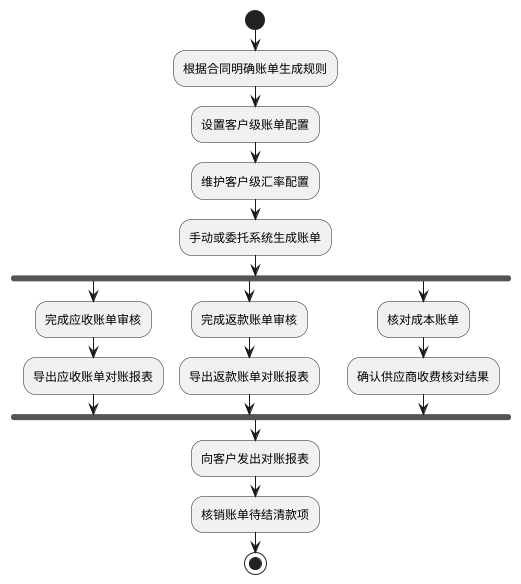

#### 6.4.2 子流程触发清单

子流程只在特定场景下触发，不进入主流程的必经节点。子流程处理完成后，应回到对应账单的核对、审核、导出或核销节点继续主流程。

| 子流程 | 触发场景 | 财务动作 | 回到主流程的位置 |
| :--- | :--- | :--- | :--- |
| 配置确认 / 变更 | 客户级账单配置、汇率配置或供应商核对口径缺失或变化。 | 修改或确认配置，确认生效时间和适用范围。 | 账前准备 |
| 数据缺失处理 | 本期费项、回款、返款、供应商收费或订单基础信息未进入可处理范围。 | 补齐或重新确认来源数据。 | 账单生成 |
| 费项补录 | 账单核对时发现费用、扣减项、返款金额或成本明细缺失。 | 进入对应账单的补录流程。 | 账单审核 |
| 调账 / 冲正 | 本期或往期账单金额有误，不能直接改写历史账单。 | 进入调账中心处理。 | 账单审核 |
| 审核驳回 | 账单审核不通过，或关联冲正记录未全部审核通过 | 退回修正后重新审核。 | 完成账单审核 |
| 客户异议 | 客户收到对账报表后对金额、费项、扣减项、回款或返款口径提出异议 | 记录异议并进入账单修正流程。 | 核对应收 / 返款账单金额 |
| 供应商收费差异 | 供应商收费账单与内部核对结果不一致。 | 记录差异，并在成本账单流程中处理。 | 核对成本账单 |
| 部分结清 / 差额 | 客户部分付款、部分返款，或回款 / 返款金额与账单金额不一致 | 登记资金结果并进入核销流程。 | 后续资金核销流程 |
| 导出字段定制 | 客户要求在默认对账报表外追加辅助核对字段 | 按对账报表导出规则处理。 | 导出应收 / 返款账单对账报表 |

财务 SOP 确定了日常出账、审核、导出、核对和核销的操作顺序。要让这条流程稳定执行，系统必须先明确客户的出账规则和返款规则，因此下一章先定义客户级账单配置。

## 7. 客户级账单配置

[🔗原型链接](http://localhost:10000/#id=de4t5k&p=%E5%AE%A2%E6%88%B7%E7%BA%A7%E8%B4%A6%E5%8D%95%E9%85%8D%E7%BD%AE&g=1)

客户级账单配置用于集中维护客户出账和返款的前置规则。应收账单模块和返款账单模块不再各自重复定义配置口径，统一从本章读取配置版本、账期规则、币种规则、履约节点、返款模式和生效周期。

### 7.1 章节概述

客户级账单配置回答的是“某个客户按什么规则生成应收账单和返款账单”。它位于账单生成之前，是账单生成任务读取配置快照的来源。

本章覆盖两类配置：

1. 应收账单配置：用于控制客户应付费用如何按账期、履约节点、业务范围和币种规则生成应收账单。
2. 返款账单配置：用于控制 COD 货款如何按返款模式、回款时间、扣减项和货款结算币种生成返款账单。

配置只影响后续新生成账单和仍允许重算的账单；已审核、待结清或已结清账单必须以账单快照为准，不随客户级账单配置变化自动回写。

### 7.2 配置版本与生效规则

客户级账单配置必须版本化管理。

1. 同一客户、同一账单类型、同一生效周期内，只允许存在一个生效配置版本。
2. 应收账单配置和返款账单配置可以分别启用，也可以同时启用。
3. 旧版本生效并用于出账后，不允许就地编辑，只能新建版本。
4. 每张账单必须记录本次命中的配置版本快照。
5. 配置版本至少应记录生效开始日期、生效结束日期、启用状态、操作人、操作时间和变更原因。
6. 配置变更只影响后续账单生成；历史账单如需修正，应通过调账、冲正、反核销或后续账单承接。
7. 财务必须在客户级账单配置中维护客户邮箱，用于系统自动向客户发送应收账单、返款账单和客户级账单配置变更通知；未维护客户邮箱时，系统不得自动发送客户邮件。

### 7.3 账期定义与节奏

账期是客户级账单配置中的出账周期口径，用于决定系统在什么时间范围内归集费项、生成账单并进入后续审核与对账流程。应收账单配置和返款账单配置都可以独立维护账期，两条账单线不要求同周期对齐。

账期类型分为两类：

1. 日历账期：`周`、`半月`、`月`等，必须对齐日历边界。`周`按自然周，`半月`按每月 1 日至 15 日、16 日至月末，`月`按自然月。
2. 自然天账期：`1天`、`7 天`、`10 天`、`15 天`等，按配置生效起始日连续滚动计算，不要求对齐自然周、自然半月或自然月。

返款账单配置的账期类型仅支持`周`和`半周`，不支持`半月`、`月`或自然天账期。`半周`是返款账单专用账期，表示在一个自然周内拆成两个连续账期。

理解口径：

1. 账期只定义本期账单归集来源数据的时间范围，不代表客户付款、返款或核销必须在同一时间范围内完成。
2. 账期结束后，账单进入财务审核和客户对账阶段；信用期、返款处理期和核销期是账期之后的资金处理口径。
3. 同一客户的应收账单和返款账单可以使用不同账期；同一应收配置中的默认方案和分支方案也可以使用不同账期。
4. 当默认方案和分支方案账期不同，系统按各方案自己的账期独立判断是否到达出账时点，不存在固定先后或兜底关系。

#### 7.3.1 账期（周）甘特图

本图演示日历账期中的`周`账期。`周`账期必须对齐自然周边界，因此客户 A 和客户 B 的账期起止日都按同一自然周滚动；账期结束后再按客户级账单配置进入账单发出日和结算信用期。图中客户 A 与客户 B 的账单发出日偏移不同，用于表达账期相同不代表账单发出日或信用期安排必须完全一致。

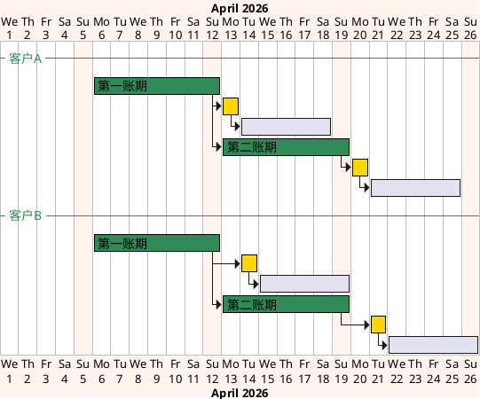

#### 7.3.2 账期（7天）甘特图

本图演示自然天账期中的`7 天`账期。`7 天`账期按客户级账单配置的生效起始日连续滚动，不要求对齐自然周、自然半月或自然月；因此客户 A 可以从 2026/04/06 开始滚动，客户 B 可以从 2026/04/08 开始滚动，两者不需要对齐同一日历边界。账期结束后，仍按各自配置进入账单发出日和结算信用期。

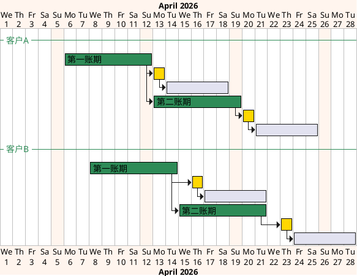

### 7.4 应收账单配置

应收账单配置用于维护客户后付费用的出账规则。

应收账单配置由配置版本信息、默认方案和分支方案组成。

配置版本信息至少包括：

- 生效周期
- 启用状态
- 操作人
- 操作时间
- 变更原因

每个方案都应独立维护出账规则，配置项至少包括：

- 账期类型
- 信用期限
- 滞纳金
- 信用评级
- 垫资额度上限
- 合同信息
- 账单发出时间
- 费项结算币种
- 费项默认结算币种
- 费项指定结算币种
- 费项结算币种模板
- 应收账单履约节点
- 限定情形

应收账单履约节点规则：

1. 应收账单配置的生产环境履约节点支持`出库时间`和`订单完结`。
2. 测试环境额外支持`核重时间`，用于验证账单生成、费用归集和重跑链路；生产环境不得展示、选择或生效`核重时间`。
3. `核重时间`仅作为测试口径保留，是因为订单完成出库前仍存在费项重算窗口，核重完成不代表费项横表金额已经稳定，不适合作为生产出账依据。
4. `签收`已由`订单完结`取代，不再作为应收账单配置选项。
5. `订单完结`与广义签收的当前系统口径见`18.2 业务系统基本面`；订单类费用归集时间口径见`9.6.6 同步规则与账期口径`。

### 7.5 返款账单配置

返款账单配置用于维护 COD 包裹货款代收与返还条款。

配置项至少包括：

- 返款模式
- 账期类型
- 账期起始日
- 账单发出时间
- 在应返货款中直接扣减的应收费项
- 实返货款金额比例
- 货款结算币种
- 客户收款账户
- 当实返货款金额为负数时的应对措施
- 条款生效周期

返款账单配置规则：

1. 配置采用版本化管理。
2. 生效后仅影响后续新生成返款账单，不回写历史返款账单。
3. 条款生效周期内不允许重叠。
4. 货款结算币种的选择、匹配和兜底规则见`14. 金额汇兑`。
5. 负数金额可选择顺延到下期返款账单，或反向计入本期应收账单。
6. 返款账单账期类型仅支持`周`和`半周`。
7. 当账期类型为`周`时，账期按自然周滚动。
8. 当账期类型为`半周`时，财务必须明确两个连续账期的起始星期，例如`周二`和`周五`；系统应据此在每个自然周内拆出两个连续账期。
9. `半周`的两个起始星期必须保证每个单独账期不少于 3 天；若任一账期少于 3 天，系统不得保存配置。

### 7.6 默认方案与分支方案

应收账单配置必须支持默认方案和分支方案。

1. 默认方案必须存在，用于表达客户最基础的应收出账规则。
2. 分支方案用于按运抵国、集运仓、业务板块等维度拆分账单规则。
3. 默认方案和分支方案不是`分支方案优先，默认方案兜底`关系；每个方案均按自身账期、履约节点和限定情形独立判断是否到达出账时点。
4. 分支方案存在时，默认方案也必须设置限定情形；系统不得允许一个未限定范围的默认方案与分支方案同时生效。
5. 默认方案与分支方案、分支方案与分支方案之间的限定情形不得存在交集。
6. 限定情形变更必须实时校验冲突；校验范围至少包括运抵国、集运仓、业务板块等用于拆分账单的维度。
7. 若存在范围交集、缺少必要限定情形或无法判断互斥关系，配置不得保存或启用。
8. 同一来源费项在同一客户、同一应收配置版本内只能命中一个有效配置方案，不得因默认方案和分支方案账期不同、执行先后不同而重复归集到多份应收账单。
9. 默认方案未设置限定情形时，只能在不存在任何分支方案的配置版本中生效。

说明：默认方案原本不限定情形，但当分支方案存在时，如果默认方案先于分支方案执行且没有限定情形，系统无法阻止默认方案覆盖分支方案的归集范围，可能导致同一费项先按默认方案归集、后又按分支方案归集。因此，有分支方案时必须通过限定情形把默认方案和分支方案的归集范围提前拆开。

### 7.7 限定情形互斥算法

1. 校验对象：新增或修改的应收方案，应与同一客户、同一应收配置版本下其它已启用方案逐一校验；默认方案和分支方案都参与校验。
2. 情形表达：每个限定情形维度都按集合处理；单选值视为单元素集合，多选值视为多元素集合，`不限`或未配置视为该维度全集。
3. 交集判定：两个方案在全部限定情形维度上都存在交集，才判定两个方案的适用范围有交集；只要任一维度无交集，即可判定两个方案互斥。
4. 收敛方法：先用待校验方案的情形选项 1 跟其它方案的情形选项 1 比对，保留有交集的方案；再用情形选项 2 仅跟上一轮保留方案继续比对，直至所有情形选项比对完成。
5. 判定结果：任一轮比对后候选方案为空，则待校验方案与其它方案互斥；所有情形选项比对完成后仍存在候选方案，则这些候选方案与待校验方案有交集，配置不得保存或启用。
6. 特殊限制：当任一分支方案存在时，默认方案不得使用`不限`或未配置作为整体限定情形；否则默认方案会被视为可能覆盖分支方案范围。

样例：假如要新增方案 10，则系统按以下方式判定其与方案 1-9 是否存在交集。

- 先用方案 10 的情形选项 1 跟方案 1-9 的情形选项 1 对比，发现方案 1-8 与方案 10 有交集。
- 再用方案 10 的情形选项 2 跟方案 1-8 的情形选项 2 对比，发现方案 1-7 与方案 10 有交集。
- 再用方案 10 的情形选项 3 跟方案 1-7 的情形选项 3 对比，发现方案 6-7 与方案 10 有交集。
- 最后用方案 10 的情形选项 4 跟方案 6-7 的情形选项 4 对比，未发现交集，因此方案 10 与其它方案互斥，可以通过校验。

<div style="overflow-x:auto; width:100%;">
<table style="width:max-content; border-collapse:collapse; white-space:nowrap;">
  <thead>
    <tr>
      <th style="text-align:left; border:1px solid #999; background:#f0f0f0;">情形维度</th>
      <th style="text-align:left; border:1px solid #999;">方案 1</th>
      <th style="text-align:left; border:1px solid #999;">方案 2</th>
      <th style="text-align:left; border:1px solid #999;">方案 3</th>
      <th style="text-align:left; border:1px solid #999;">方案 4</th>
      <th style="text-align:left; border:1px solid #999;">方案 5</th>
      <th style="text-align:left; border:1px solid #999;">方案 6</th>
      <th style="text-align:left; border:1px solid #999;">方案 7</th>
      <th style="text-align:left; border:1px solid #999;">方案 8</th>
      <th style="text-align:left; border:1px solid #999;">方案 9</th>
      <th style="text-align:left; border:2px solid #e55;">方案 10</th>
    </tr>
  </thead>
  <tbody>
    <tr>
      <td style="text-align:left; border:1px solid #999; background:#f0f0f0;">情形选项 1<br/>枚举：A1、A2、A3、A4、A5</td>
      <td style="text-align:left; border:1px solid #999; background:#f8d7da;">A1、A2、A3、A4、A5</td>
      <td style="text-align:left; border:1px solid #999; background:#f8d7da;">A1、A2、A3、A4、A5</td>
      <td style="text-align:left; border:1px solid #999; background:#f8d7da;">A1、A2、A3、A4、A5</td>
      <td style="text-align:left; border:1px solid #999; background:#f8d7da;">A1、A2、A3、A4、A5</td>
      <td style="text-align:left; border:1px solid #999; background:#f8d7da;">A1、A2、A3、A4、A5</td>
      <td style="text-align:left; border:1px solid #999; background:#f8d7da;">A1、A2、A3、A4、A5</td>
      <td style="text-align:left; border:1px solid #999; background:#f8d7da;">A1、A2、A3、A4、A5</td>
      <td style="text-align:left; border:1px solid #999; background:#f8d7da;">A1、A2、A3、A4、A5</td>
      <td style="text-align:left; border:1px solid #999;">A5</td>
      <td style="text-align:left; border:2px solid #e55; background:#f8d7da;">A1、A2、A3、A4</td>
    </tr>
    <tr>
      <td style="text-align:left; border:1px solid #999; background:#f0f0f0;">情形选项 2<br/>枚举：B1、B2、B3、B4、B5</td>
      <td style="text-align:left; border:1px solid #999; background:#d6f5f5;">B1、B2、B3、B4</td>
      <td style="text-align:left; border:1px solid #999; background:#d6f5f5;">B1、B2、B3、B4</td>
      <td style="text-align:left; border:1px solid #999; background:#d6f5f5;">B1、B2、B3、B4</td>
      <td style="text-align:left; border:1px solid #999; background:#d6f5f5;">B1、B2、B3、B4</td>
      <td style="text-align:left; border:1px solid #999; background:#d6f5f5;">B1、B2、B3、B4</td>
      <td style="text-align:left; border:1px solid #999; background:#d6f5f5;">B1、B2、B3</td>
      <td style="text-align:left; border:1px solid #999; background:#d6f5f5;">B2、B4</td>
      <td style="text-align:left; border:1px solid #999;">B3、B4</td>
      <td style="text-align:left; border:1px solid #999;">B5</td>
      <td style="text-align:left; border:2px solid #e55; background:#d6f5f5;">B1、B2</td>
    </tr>
    <tr>
      <td style="text-align:left; border:1px solid #999; background:#f0f0f0;">情形选项 3<br/>枚举：C1、C2、C3、C4、C5</td>
      <td style="text-align:left; border:1px solid #999;">C1、C2、C3、C4</td>
      <td style="text-align:left; border:1px solid #999;">C1、C2、C3、C4</td>
      <td style="text-align:left; border:1px solid #999;">C1、C2、C3、C4</td>
      <td style="text-align:left; border:1px solid #999;">C1、C2、C3、C4</td>
      <td style="text-align:left; border:1px solid #999;">C1、C2、C3、C4</td>
      <td style="text-align:left; border:1px solid #999; background:#e2f0d9;">C5</td>
      <td style="text-align:left; border:1px solid #999; background:#e2f0d9;">C5</td>
      <td style="text-align:left; border:1px solid #999;">C4</td>
      <td style="text-align:left; border:1px solid #999;">C5</td>
      <td style="text-align:left; border:2px solid #e55; background:#e2f0d9;">C5</td>
    </tr>
    <tr>
      <td style="text-align:left; border:1px solid #999; background:#f0f0f0;">情形选项 4<br/>枚举：D1、D2、D3、D4、D5</td>
      <td style="text-align:left; border:1px solid #999;">D1</td>
      <td style="text-align:left; border:1px solid #999;">D2</td>
      <td style="text-align:left; border:1px solid #999;">D3</td>
      <td style="text-align:left; border:1px solid #999;">D4</td>
      <td style="text-align:left; border:1px solid #999;">D5</td>
      <td style="text-align:left; border:1px solid #999;">D1</td>
      <td style="text-align:left; border:1px solid #999;">D3</td>
      <td style="text-align:left; border:1px solid #999;">D4</td>
      <td style="text-align:left; border:1px solid #999;">D5</td>
      <td style="text-align:left; border:2px solid #e55;">D5</td>
    </tr>
  </tbody>
</table>

</div>

### 7.8 与其它章节的关系

1. 账单生成机制读取客户级账单配置快照，具体生成与重跑规则见`9. 账单生成机制`和`10. 账单重跑机制`。
2. 应收账单模块只描述应收账单的状态、账期、详情和导出，配置口径统一引用本章。
3. 返款账单模块只描述返款账单的状态、返款模式、回款管理和报表输出，配置口径统一引用本章。
4. 费项结算币种模板、汇率快照和多币种汇总规则统一见`14. 金额汇兑`。
5. 客户级汇率配置只负责生成账单前的默认汇率，具体见`8. 客户级汇率配置`。

客户级账单配置解决的是“哪些客户、哪些业务、按什么账期和履约节点生成账单”。当账单内存在多币种金额时，还需要在生成前确定默认汇率，所以下一章继续定义客户级汇率配置。

## 8. 客户级汇率配置

[🔗原型链接](http://localhost:10000/#id=u23631&p=%E5%AE%A2%E6%88%B7%E7%BA%A7%E6%B1%87%E7%8E%87%E9%85%8D%E7%BD%AE&g=1)

### 8.1 章节概述

客户级汇率配置解决的是“账单生成前，不同客户、不同货币对默认采用什么汇率”的问题。它位于账单生成之前，是账单特调汇率快照的前置配置；账单生成之后，命中的汇率会进入账单侧快照，由`14. 金额汇兑`继续定义换算、汇总和核销规则。

本章的业务链路如下：

1. 财务先维护基准汇率表。基准汇率表支持手动导入，也支持财务在页面中添加、修改、移除基准汇率；`抓取`功能暂且预留，本期不开放使用。
2. 账单特调汇率配置默认值按`客户特调汇率表 > 基准汇率表 > 店铺汇率表 > 1`取值；若三类来源都找不到可用汇率，该货币对汇率固定按 `1` 处理。
3. 财务再按客户维护特调汇率规则，用于覆盖或调整某些客户、某些货币对的默认汇率；同一客户按同一套客户特调汇率执行，不再按应收 / 返款等账单类型拆分专属规则。
4. 生成账单时，系统按客户和货币对命中默认汇率。本章不设置`账单特调汇率日期`概念，也不支持按账期开始日、账期结束日或指定日期切换汇率口径。
5. 账单生成成功后，系统把命中的客户特调规则、基准汇率、店铺汇率、推导关系和最终默认汇率固化到账单特调汇率快照。

客户级汇率配置不直接改写已生成账单，也不替代账单详情页中的账单级汇率调整。基准汇率或客户特调规则发生变化后，可用于重新计算后续客户级默认汇率，但不会触发既有账单重跑，也不得自动回写历史账单。店铺汇率表变化不触发 BMS 任何动作，仅在后续账单生成或财务主动发起账单侧重算且需要店铺汇率兜底时读取。

### 8.2 页面原型概述

客户级汇率配置页面用于让财务先维护基准汇率，再按客户维护特调汇率。原型页面重点关注基准汇率表区和客户特调汇率区。

| 区域 | 区域用途 | 业务字段 | 支持操作 |
| :--- | :--- | :--- | :--- |
| 基准汇率表区 | 展示当前已确认或待确认的基准货币对汇率 | `货币对`、`汇率`、`来源`、`确认状态`；货币对必须以财务本位币为锚点，方向可以是`外币 -> 财务本位币`，也可以是`财务本位币 -> 外币` | 查看、确认、添加、修改、移除基准汇率；支持手动导入基准汇率；`抓取`功能入口暂且预留，本期不开放使用；确认后的基准汇率作为客户级汇率配置的兜底来源。 |
| 客户特调汇率区 | 按客户维护某些货币对的特调规则和特调后默认汇率 | `客户编号`、`客户名称`、`所属店铺`、各货币对特调结果列、`操作`；原型示例包含 `OG3235`、`南海商贸`、`XXXX`、`6.454678`、`0.253489`、`编辑` 等信息 | `添加`：新增客户特调汇率规则；`编辑`：修改指定客户的特调规则；`停用`：让该客户货币对回到基准汇率兜底。 |

原型页面的阅读顺序应理解为：

1. 财务先通过`导入`、`添加`、`修改`或`移除`维护基准汇率表；`抓取`功能暂且预留，本期不开放使用，后续开放时再补充来源接入、认证方式和失败重试规则。
2. 基准汇率表只要求维护以财务本位币为锚点的货币对，方向可以是`外币 -> 财务本位币`，也可以是`财务本位币 -> 外币`，不要求支持批量货币对预览。
3. 财务对个别客户维护特调汇率后，该客户生成账单时优先使用特调后的默认汇率。
4. 客户未维护特调汇率时，系统先使用客户级汇率配置下已确认的基准汇率兜底；若基准汇率也不可用，再使用店铺汇率表兜底；若仍找不到兜底汇率，该货币对汇率固定按 `1` 处理。
5. `所属店铺`用于辅助财务识别客户经营主体或店铺范围，不改变客户特调汇率规则的归属客户。
6. 页面所有操作均由财务执行。基准汇率表的导入、添加、修改、移除、确认和停用必须记录操作日志；客户特调汇率只保留最近操作人、最近操作时间和操作原因，不生成独立变更日志。

### 8.3 基准汇率表

基准汇率表是客户级汇率配置的基础来源，用于承接财务确认的标准汇率。基准汇率由财务维护，可以通过手动导入产生，也可以由财务在页面中添加、修改或移除。`抓取`功能暂且预留，本期不开放使用。

1. 手动导入：财务上传基准汇率表，系统校验币种、货币对、汇兑方向和汇率值。
2. 手动维护：财务可以在页面中添加、修改或移除单条基准汇率记录，系统校验规则与手动导入一致。
3. 系统抓取：功能入口暂且预留，本期不开放使用，不参与基准汇率表维护。
4. 店铺汇率表是现有能力，本 PRD 不重新定义其配置需求；店铺汇率表不写入基准汇率表，也不替代客户特调汇率和基准汇率，仅在客户特调汇率表和基准汇率表都不可用时，作为第三优先级兜底来源。

基准汇率货币对必须以财务本位币为锚点；财务本位币固定为人民币，系统内统一用 `CNY` 表达。货币对的摆位用`左侧币种`和`右侧币种`表达，因为汇兑方向可以独立变化，货币摆位也可以调整。货币对方向不是固定的，可以是`外币 -> CNY`，也可以是`CNY -> 外币`。但同一条基准汇率必须明确方向，不能只记录无方向的汇率值。

货币对是否相同，只看两个币种的组合是否相同，不看左侧币种和右侧币种的排列，也不看汇兑方向。例如 `USD / CNY`、`CNY / USD`、`USD -> CNY` 和 `CNY -> USD` 都属于同一货币对。

本 PRD 将`左侧币种 + 右侧币种 + 汇兑方向`称为汇率设置的三元口径。三元口径不是一个必须落库的独立字段，也不是判断货币对是否相同的方法，而是系统判断“是否同一条汇率设置”的业务唯一性口径。

三元口径的理解方式如下：

1. `左侧币种`和`右侧币种`只表达货币对在页面、导入文件和快照中的摆位。
2. `汇兑方向`表达汇率值实际从哪一侧换算到哪一侧。
3. 判断两个货币对是否相同，只比较左侧币种和右侧币种组成的币种集合；只要币种集合一致，即认定为同一货币对。
4. 判断两个汇率设置是否相同，才需要同时比较左侧币种、右侧币种和汇兑方向。
5. 汇率值只对同一三元口径有效，不得脱离汇兑方向单独复用。
6. 例如 `左侧币种 = USD`、`右侧币种 = CNY`、`汇兑方向 = USD -> CNY` 与 `左侧币种 = USD`、`右侧币种 = CNY`、`汇兑方向 = CNY -> USD` 属于同一货币对，但属于两条不同汇率设置；后者如未直接维护，应通过倒数推导，而不是直接复用前者汇率。
7. 基准汇率、客户特调汇率、账单特调汇率和账单内锁定汇率都必须按三元口径判断汇率设置唯一性、命中关系和汇率一致性。

1. 外币对外币的组合很难穷举，若要求财务直接维护所有外币货币对，容易产生漏配、重复配置和方向冲突。
2. 账单汇总、调账归属和内部核算都需要形成财务本位币金额，因此外币对外币汇率可以通过两条以 `CNY` 为锚点的汇率间接推导。
3. 例如需要计算`USD -> TWD`时，系统先得到 `USD -> CNY` 和 `TWD -> CNY` 的等价汇率，再相除得到：`USD -> TWD = (USD -> CNY) / (TWD -> CNY)`。若基准表维护的是 `CNY -> USD` 或 `CNY -> TWD`，系统先取倒数得到对应的`外币 -> CNY`等价汇率，再参与相除。
4. 基准汇率推导只要求货币对可通过 `CNY` 换算，不要求两条参考汇率归属同一供应链、店铺或其它业务对象。

基准汇率表应至少记录以下业务字段：

| 字段 | 说明 |
| :--- | :--- |
| 汇率来源 | 基准汇率表来源可为`手动导入`或`手动添加`；`抓取`来源暂且预留，后续可扩展外部数据源。 |
| 来源时间 | 汇率被导入、添加或修改的时间，用于追溯来源，不作为账单特调汇率日期。 |
| 左侧币种 | 货币对左侧展示的币种。 |
| 右侧币种 | 货币对右侧展示的币种。左侧币种与右侧币种二者必须有一端是财务本位币 `CNY`，另一端是外币。 |
| 汇兑方向 | 明确表达 `左侧币种 -> 右侧币种`或`右侧币种 -> 左侧币种`，不得只保存无方向汇率。 |
| 基准汇率 | 财务基于左侧币种、右侧币种和汇兑方向确认的原始汇率值。 |
| 获取方式 | 手动导入、手动添加、手动修改；系统抓取暂且预留，本期不开放使用。 |
| 确认状态 | 待确认、生效、停用。 |
| 当前生效标记 | 同一货币对、同一汇兑方向存在多来源或多条记录时，由财务确认哪一条作为当前账单生成兜底汇率。 |
| 操作记录 | 导入人、添加人、修改人、移除人、确认人、停用人、操作时间和操作原因。 |

基准汇率表规则：

1. 基准汇率表只有在财务确认生效后，才能作为客户级汇率配置的基础汇率来源。
2. 未确认、解析失败、币种缺失、方向不明确或数值异常的汇率，不得参与账单生成。
3. 基准汇率表中的货币对必须有一端是财务本位币 `CNY`，另一端是外币；方向可以是`外币 -> CNY`，也可以是`CNY -> 外币`。
4. 基准汇率表不允许直接维护外币对外币的基准汇率，也不需要支持任意货币对批量预览。
5. 基准汇率表中的货币对方向必须明确；系统不得只保存无方向汇率。
6. 同一货币对、同一汇兑方向在同一时点只能有一条当前生效基准汇率。若同一货币对和汇兑方向存在多个来源或多条记录，必须由财务确认当前生效记录；系统不得自动随机选择。
7. 财务允许添加、修改、移除已确认生效的基准汇率。修改或移除后，系统需要重新计算所有受该货币对影响的客户特调汇率结果，但不得因此触发账单重跑。
8. 已生成账单始终以账单特调汇率快照为准；基准汇率添加、修改、移除、停用或重新导入，不得自动回写历史账单。
9. 基准汇率记录应保留操作日志和变更原因，避免后续无法解释客户级默认汇率变化。

基准汇率命中规则：

1. 客户未维护特调汇率时，系统先使用已确认生效的客户级基准汇率兜底。
2. 若同一货币对、同一汇兑方向存在多个已确认来源，系统不得随机选择，必须按财务确认的当前生效记录命中。
3. 若无法命中当前生效基准汇率，系统再按账单归属店铺和货币对命中店铺汇率表；若店铺汇率也不可用，该货币对汇率固定按 `1` 处理，并在账单特调汇率快照中记录未命中兜底汇率的原因。
4. 当账单需要的汇兑方向与基准表已维护方向相反时，系统允许在同一左侧币种和右侧币种范围内按倒数推导。
5. 当账单需要`外币A -> 外币B`方向时，系统允许通过`外币A -> CNY`和`外币B -> CNY`的等价汇率间接推导：`外币A -> 外币B = (外币A -> CNY) / (外币B -> CNY)`。
6. 所有推导后的汇率必须在账单特调汇率快照中记录原始货币对、推导方式和推导后结果。
7. 本规则只约束基准汇率表的兜底与推导口径，不限制客户特调汇率直接维护外币对外币等非 `CNY` 锚点货币对。

### 8.4 客户特调汇率规则

客户特调汇率规则用于在基准汇率基础上，按客户和货币对生成账单默认汇率。它只处理“这个客户是否要按不同于基准汇率的方式生成默认汇率”，不处理账单生成后的金额换算。

客户特调汇率不做版本控制。财务可以直接编辑或停用客户特调规则；编辑后系统重新计算该客户对应货币对的默认汇率结果，但不得触发已生成账单重跑，也不得自动回写历史账单快照。

规则维度如下：

| 规则维度 | 说明 |
| :--- | :--- |
| 客户 | 规则归属客户。 |
| 货币对 | 用左侧币种和右侧币种表达货币摆位，并必须明确汇兑方向，例如 `USD -> TWD`。客户特调货币对不要求锚定财务本位币，汇率设置必须基于左侧币种、右侧币种和汇兑方向共同确定。 |
| 基准汇率 | 当前客户级基准汇率。使用固定汇率值时，基准汇率可记录为`不适用`。 |
| 调整方向 | 上浮或下浮；固定汇率值不需要调整方向。 |
| 调整方式 | 百分比缩放、固定汇率差、固定汇率值。 |
| 调整值 | 百分比、固定汇率差或固定汇率值。 |
| 特调后默认汇率 | 系统根据基准汇率和客户特调规则计算出的默认汇率结果。 |
| 启用状态 | 启用后参与账单生成；停用后该客户货币对回到基准汇率兜底。 |
| 操作信息 | 最近操作人、最近操作时间和操作原因；客户特调汇率变更不要求生成独立日志。 |

支持的调整方式如下：

| 调整方式 | 计算方式 | 示例 |
| :--- | :--- | :--- |
| 百分比缩放 | 上浮：`账单默认汇率 = 基准汇率 × (1 + 调整比例)`；下浮：`账单默认汇率 = 基准汇率 × (1 - 调整比例)` | 基准汇率 `7.0000`，调整方向为上浮，调整值填 `2`，表示 `2%`，默认汇率为 `7.1400`。 |
| 固定汇率差 | 上浮：`账单默认汇率 = 基准汇率 + 固定差值`；下浮：`账单默认汇率 = 基准汇率 - 固定差值` | 基准汇率 `7.0000`，调整方向为上浮，固定差值 `0.0300`，默认汇率为 `7.0300`。 |
| 固定汇率值 | `账单默认汇率 = 固定汇率` | 不再引用基准汇率，直接使用 `7.1000`。 |

客户特调汇率规则要求：

1. 同一客户、同一货币对只允许存在一条启用中的客户特调规则；客户特调汇率不再按账单类型拆分。
2. 货币对方向必须明确。客户特调规则可以直接维护账单实际需要的货币对，不要求一端必须是财务本位币 `CNY`；若账单需要反向换算，系统按明确的倒数规则推导，并在账单特调汇率快照中记录推导来源。
3. 固定汇率值适用于客户有明确约定汇率的场景；使用固定汇率值时，不要求存在对应基准汇率，但必须保存固定汇率值和操作原因。
4. 百分比缩放和固定汇率差都以基准汇率为基础；若客户特调货币对无法直接命中基准汇率，但可通过`8.3 基准汇率表`的财务本位币锚点规则推导出基准汇率，系统允许先推导再计算特调后默认汇率。
5. 百分比缩放和固定汇率差不以店铺汇率为基础继续调整；若基准汇率直接命中和推导均不可用，该客户特调规则本次不产出默认汇率，系统继续按店铺汇率表兜底，店铺汇率也不可用时该货币对汇率固定按 `1` 处理，并在账单特调汇率快照中记录未命中兜底汇率的原因。
6. 百分比缩放的输入单位为百分数，输入 `2` 表示 `2%`，不是 `0.02`。
7. 固定汇率差不允许出现负数；若需要下浮，应选择调整方向为`下浮`，固定差值仍填写正数。
8. 调整后默认汇率必须大于 `0`；固定汇率值也必须大于 `0`。
9. 原型表格中展示的特调汇率，应理解为特调后用于账单生成的默认汇率结果；系统仍需保留其背后的调整方式、调整方向和调整值。
10. `添加`客户特调汇率时，必须先选择客户，再选择需要特调的货币对、调整方式和调整值。
11. `编辑`或`停用`客户特调汇率时，只影响后续新账单和仍允许账单侧重算的账单；已审核、待结清或已结清账单不得被自动回写。

### 8.5 账单生成命中与快照

账单生成前，系统必须按账单客户和账单内货币对命中客户级汇率配置。本章不设置`账单特调汇率日期`概念，账单生成时不支持按账期开始日、账期结束日或指定日期切换汇率口径。

命中顺序如下：

1. 新账单生成时，先查找同客户、同一货币对的启用客户特调规则；若客户特调规则维护的汇兑方向与账单所需汇兑方向相反，系统按倒数规则推导默认汇率。
2. 命中客户特调固定汇率值时，直接作为账单默认汇率。
3. 命中客户特调百分比缩放或固定汇率差时，先按`8.3 基准汇率表`的基准汇率命中规则取已确认生效的基准汇率；若客户特调货币对不是 `CNY` 锚点货币对，则允许通过`8.3 基准汇率表`的财务本位币锚点规则先推导基准汇率，再按客户特调规则计算账单默认汇率。
4. 未命中客户特调规则，或客户特调百分比缩放 / 固定汇率差因基准汇率不可用而无法产出结果时，使用客户级汇率配置下已确认生效的基准汇率作为第二优先级默认汇率。
5. 若账单所需货币对未直接命中客户特调规则或当前生效基准汇率，但可通过财务本位币锚点汇率推导，系统允许按`8.3 基准汇率表`的倒数或相除规则自动推导。
6. 若客户特调规则、当前生效基准汇率和财务本位币锚点推导均不可用，系统使用店铺汇率表作为第三优先级默认汇率。
7. 若客户特调汇率表、基准汇率表和店铺汇率表均不可用，该货币对汇率固定按 `1` 处理；同币种换算同样固定按 `1` 处理。

账单生成成功后，系统必须把命中的客户特调规则、基准汇率、店铺汇率、汇率来源、调整方式、调整方向、调整值、推导关系和计算后的默认汇率一起固化到账单特调汇率快照中。若命中的是固定汇率值，基准汇率和店铺汇率可记录为`不适用`，但固定汇率值和规则来源必须进入账单特调汇率快照。后续客户级汇率配置变化，只影响后续新账单和仍允许账单侧重算的账单；店铺汇率表变化不触发 BMS 任何动作；二者均不得回写历史账单。

账单生成命中规则补充：

1. 账单内出现多个货币对时，必须逐一命中默认汇率；不能因为部分货币对命中成功，就忽略其它缺失货币对。
2. 倒数推导只用于同一人民币锚点货币对方向相反的场景。例如已维护`USD -> CNY`但账单需要`CNY -> USD`，或已维护`CNY -> USD`但账单需要`USD -> CNY`。
3. 未直接命中客户特调规则时，外币对外币兜底推导只允许通过财务本位币间接换算，不允许在两个无关货币对之间任意交叉推导。
4. 推导后的汇率必须保留推导来源，例如`由 USD -> CNY 倒数推导 CNY -> USD`，或`由 USD -> CNY 与 TWD -> CNY 相除推导 USD -> TWD`；若直接命中客户特调规则，则记录客户特调规则来源，不再额外要求经 `CNY` 推导。
5. 因缺少汇率兜底而按 `1` 处理时，系统必须在账单特调汇率快照中记录客户、货币对，以及客户特调汇率表、基准汇率表、店铺汇率表均未命中的结果，便于财务后续核对配置。
6. 缺少汇率兜底后按 `1` 处理的规则，同时适用于账单生成和财务在账单详情页触发的账单侧重算。
7. 系统不因汇率按 `1` 处理而增加独立二次确认，也不触发账单自动审核；账单必须由财务在审核环节确认金额和汇率口径无误后，才能进入后续流程。
8. 账单详情页允许在状态规则许可范围内进行账单级汇率调整；账单级调整只影响当前账单，不回写客户级汇率配置。

### 8.6 与金额汇兑的关系

客户级汇率配置负责决定账单生成前的默认汇率；金额汇兑负责定义账单生成后如何锁定快照、如何换算金额、如何汇总和核销。

1. 客户级汇率配置输出的是账单默认汇率。
2. 账单生成时，账单默认汇率被固化为账单特调汇率快照。
3. 基准汇率或客户特调规则变化后，可以重新计算后续账单默认汇率结果，但不会自动触发既有账单重跑；店铺汇率表变化不触发 BMS 任何动作。
4. 账单详情页允许在状态规则许可范围内进行账单级汇率调整；账单级调整只影响当前账单，不回写客户级汇率配置。
5. 账单费项明细中的汇率默认值取值优先级为：`账单级锁定汇率 > 客户特调汇率表 > 基准汇率表 > 店铺汇率表 > 1`。
6. 历史账单始终以账单快照为准，不再读取最新客户级汇率配置。

客户级账单配置提供出账范围和账期口径，客户级汇率配置提供生成前的默认汇率。两类前置配置都具备后，账单生成机制才能按稳定快照归集来源数据并形成账单结果。

## 9. 账单生成机制

### 9.1 设计目标

本章只定义账单从前置配置到形成账单结果的生成口径。账单生成失败、漏执行补跑、起草中增量重跑、账单侧重算、客户异议折返、反核销和后续账单承接等处理路径，统一见`10. 账单重跑机制`。

1. 账单生成必须先读取客户级账单配置、客户级汇率配置和来源数据快照，再形成可追溯的账单结果。
2. 账单生成拆分为源数据增量采集任务和账单结果计算任务；两类任务的异常处理与重跑边界见`10. 账单重跑机制`。
3. 源数据侧行级状态包括 `null / locked / appended / synced`；其中 `appended` 仅用于费项横表后续追加费项金额后的再采集场景。
4. 已被 BMS 成功采集的费项原始金额，不允许在数据源侧直接删除或修改。
5. 费项修正或作废必须通过账单侧调账、冲正或作废兜底；若原始金额有误，应在调账中心对该费项做冲正，不回写源数据。

### 9.2 任务分层

1. 源数据增量采集任务负责先将待处理行锁定为 `locked`，再写入账单明细；所有步骤执行完毕后统一回写为 `synced`。
2. 账单结果计算任务负责固化配置快照、汇率快照、金额汇总和账单明细；相关币种 / 汇率 / 汇兑口径见`14. 金额汇兑`。
3. 定时生成、手动生成、失败重试、配置变更和财务调整等触发入口如何分流，统一见`10. 账单重跑机制`。

BMS 任务的创建时机，是任务开始轮候执行的那一刻，不是任务真正开始执行的那一刻。任务创建后进入`待执行`状态，由执行器后续领取并切换为`运行中`；前端页面应在任务创建后通过通知卡片异步监听任务执行状态，并刷新任务状态、执行耗时、错误摘要和关联账单结果。

任务时间口径如下：

1. `任务创建时间`：任务创建并进入轮候队列的时间。
2. `执行耗时`：从任务被执行器领取并开始执行时起算，到任务进入成功、失败、待重试或已取消等结束 / 稳定状态时停止。
3. `执行耗时`不统计`待执行`期间的排队耗时，页面也不单独展示排队耗时。
4. 手动生成账单时，页面只负责创建任务并返回任务已入队结果；任务执行必须异步完成，页面不得等待任务执行结束后才返回。

### 9.3 行级标记

| 标记值 | 含义 | 产品规则 |
| :--- | :--- | :--- |
| `null` | 尚未被采集 | 首次进入账单采集范围时拉取 |
| `locked` | 已被账单生成任务锁定 | 处理期间禁止修改或物理删除 |
| `appended` | 行内追加了新的费项金额 | 仅适用于费项横表，表示该行已有 BMS 已采集费项之后又追加了新的费项金额，需进入下一轮采集 |
| `synced` | 已被采集并同步 | 不再重复拉取 |

规则：

1. 这里的行级标记，当前特指供 BMS 检阅的标记，不是通用业务状态字段。
2. 新数据默认是 `null`。
3. 账单生成任务执行时，第一步必须先把参与处理的源数据行更新为 `locked`。
4. 锁定完成后再执行后续采集、归集、写入账单明细等步骤。
5. 对于费项横表，若某一行在既有 BMS 成功采集结果之后又追加了新的费项金额，追加事务必须先将该行标记置为 `appended`，以便下一轮采集任务识别该行需要再次同步。
6. 所有步骤执行完毕后，将本次处理涉及的源数据行统一回写为 `synced`。
7. `locked`、`appended` 和 `synced` 行都不能物理删除，只能保留用于追溯和审计。

### 9.4 配置与归属

1. 账单生成任务读取`7. 客户级账单配置`，并按配置版本、默认方案和分支方案判断来源数据归属。
2. 默认方案、分支方案、履约节点和生效规则由`7. 客户级账单配置`统一维护，本章只描述生成时如何命中并固化结果。
3. 默认方案和分支方案按各自账期独立触发，不存在固定执行优先级；系统不得把默认方案理解为“分支未命中后的兜底方案”。
4. 同一来源费项在同一客户、同一应收配置版本内只能命中一个 `bill_config_id`。
5. 执行前必须固化配置快照、范围快照、限定情形快照和费项规则快照，不反查最新配置覆盖旧结果。
6. 账单归属时间不能简单按 `create_time` 判断，必须以账单归属时间快照为准。

### 9.5 客户侧费项配置工作台整合方案

应收账单和返款账单生成依赖三类前置配置：`数据源规则`定义公共来源数据集，`客户侧费项索引`定义客户侧费项的业务身份，`场景费项对应`定义某个业务场景下某个费项如何取值。三者在数据模型上不能合并为一个对象，但在页面体验上应整合为一套`客户侧费项配置工作台`，让财务按“先理解费项，再确认场景，再追溯来源”的顺序完成配置。

本节只定义应收账单和返款账单使用的客户侧费项。成本账单使用独立的`成本费项索引`，其名称归一、成本板块和供应商别名规则见`13.5.2.2 客户侧与成本侧费项索引分域`及`13.5.2.3 导入设置快照中的费项映射`；客户侧和成本侧费项不得互相引用。

#### 9.5.1 整合目标

1. 降低财务配置理解成本：财务维护费项时，优先看到费项业务含义和场景可用性，而不是先面对来源表、联表 SQL 和底层字段。
2. 保持生成口径清晰：账单生成仍按 `fee_source_dataset -> fee_source_rule -> business_type_fee_index -> fee_index` 的链路读取配置，不因页面整合而混淆数据模型职责。
3. 减少重复配置：公共来源数据集只维护一次，费项业务身份只维护一次，业务场景下的取值规则只维护差异项。
4. 提高配置校验能力：在保存和启用前暴露来源数据集、取值字段、归集时间口径、过滤参数和业务场景之间的不匹配问题。
5. 支持双视角维护：既能按费项查看“这个费项在哪些场景可用、从哪里取值”，也能按业务场景查看“这个场景会生成哪些费项”。

#### 9.5.2 配置对象边界

| 配置对象 | 页面表达 | 业务职责 | 不应承载的内容 |
| :--- | :--- | :--- | :--- |
| `fee_source_dataset` | 数据源规则 | 定义公共来源数据集能力，包括来源系统、数据源编码、来源库、主表、关联关系、基础过滤、归集时间字段、查询窗口、分页条数、支持节点和状态。 | 不直接定义某个费项金额字段，不直接定义业务场景可用性。 |
| `fee_index` | 客户侧费项索引 / 客户侧费项主档 | 定义应收账单和返款账单所使用费项的身份和业务含义，包括费项编码、费项名称、费用类型、场景标签、挂靠对象、适用订单来源、状态和备注。名称由我司统一定义，不接收供应商费项名称。 | 不直接维护来源表、金额字段、币种字段、归集时间字段，也不承载成本账单使用的成本费项。 |
| `fee_source_rule` | 场景取值规则中的来源规则 | 定义费用如何从来源数据集中取值，包括来源数据集、取值表、金额字段、币种字段、过滤参数、去重规则、优先级和状态。 | 不直接定义客户账单配置，不决定某个客户是否启用该费项。 |
| `business_type_fee_index` | 场景取值规则中的场景绑定 | 定义业务场景与费项及来源规则的绑定关系，包括业务场景、费项、来源规则、优先级、状态和扩展配置。 | 不修改来源数据集本身，不改变费项主档业务含义。 |

配置对象必须保持上述边界。页面可以把这些对象组合展示，但保存时仍应分别落到各自对象，避免把公共来源、费项身份和场景取值规则混成一张大表。

#### 9.5.3 推荐页面结构

`客户侧费项配置工作台`建议采用以下信息架构：

| 一级区域 | 目标用户 | 页面职责 | 主要操作 |
| :--- | :--- | :--- | :--- |
| 客户侧费项配置 | 财务、产品、实施 | 以客户侧费项为中心维护费项主档，并在费项详情中维护该费项的场景取值规则。 | 新增费项、编辑费项、启停费项、查看引用场景、新增 / 编辑场景取值规则。 |
| 按业务场景配置 | 财务、产品、实施 | 以业务场景为中心查看该场景启用了哪些费项，以及这些费项分别从哪些来源规则取值。 | 按场景筛选、批量启停场景费项、检查缺失费项、调整场景内优先级。 |
| 数据源规则 | 实施、管理员、产品 | 维护公共来源数据集，提供给场景取值规则引用。 | 新增 / 编辑数据集、启停数据集、查看引用费项和影响范围。 |
| 币种模板 | 财务、产品 | 维护费项结算币种模板。 | 新增 / 编辑模板、维护费项币种映射。 |

当前页面中的`数据源规则`、`客户侧费项索引`和`场景费项对应`不建议简单合并成一个表。更优方案是把`客户侧费项索引`升级为`客户侧费项配置`主入口，把`场景费项对应`改名为`场景取值规则`并作为费项详情内的子表，同时保留按场景查看的独立视角。

#### 9.5.4 客户侧费项配置视角

`客户侧费项配置`是财务维护应收和返款费项的主入口。列表展示客户侧费项主档信息，详情展示该费项在不同业务场景下的取值规则。

| 区域 | 展示字段 | 交互规则 |
| :--- | :--- | :--- |
| 查询区 | 费项编码、费项名称、费用类型、挂靠对象、适用订单来源、状态 | 支持组合筛选；默认只展示启用费项；可切换查看停用费项。 |
| 费项列表 | 费项编码、费项名称、费用类型、场景标签、挂靠对象、适用订单来源、状态、被引用场景数、配置完整性 | 被引用场景数用于提示该费项影响范围；配置完整性用于提示是否缺少可用场景取值规则。 |
| 费项详情-基础信息 | 费项编码、费项名称、费用类型、场景标签、挂靠对象、适用订单来源、备注、状态 | 费项编码启用后原则上不允许修改；费用类型变更需校验是否影响核销汇总口径。 |
| 费项详情-场景取值规则 | 业务场景、来源数据集、取值表、金额字段、币种字段、归集时间口径、过滤参数、优先级、状态 | 支持新增、编辑、启停；同一费项可在多个业务场景下绑定不同来源规则。 |

新增费项建议采用连续配置流程：

1. 创建客户侧费项主档：填写费项编码、费项名称、费用类型、挂靠对象和适用订单来源。
2. 添加场景取值规则：选择业务场景、来源数据集、取值表、金额字段、币种字段和过滤参数。
3. 执行配置校验：校验来源数据集是否启用、取值字段是否完整、归集时间口径是否被数据集支持。
4. 启用费项：只有至少存在一条启用且校验通过的场景取值规则时，才允许将该费项作为账单生成候选费项。

#### 9.5.5 按业务场景配置视角

`按业务场景配置`用于回答“某个业务场景会生成哪些费项”。该视角适合财务或产品检查场景完整性，避免新增业务场景时漏配费项。

| 区域 | 展示字段 | 交互规则 |
| :--- | :--- | :--- |
| 场景筛选区 | 业务场景、费用类型、来源数据集、状态、配置完整性 | 切换业务场景后，列表只展示当前场景的费项取值规则。 |
| 场景费项列表 | 业务场景、费项编码、费项名称、费用类型、来源数据集、取值表、金额字段、币种字段、归集时间口径、过滤参数、优先级、状态 | 支持批量启停；支持按优先级排序；支持跳转到费项详情或数据源规则详情。 |
| 场景完整性提示 | 缺失必要费项、来源数据集停用、取值字段缺失、归集时间口径不支持、过滤参数非法 | 命中任一异常时，场景不得被视为配置完整；账单生成前应阻断或提示财务处理。 |

场景视角只维护业务场景与客户侧费项及来源规则的绑定关系，不直接修改来源数据集，也不直接修改客户侧费项主档的业务含义。若需要调整公共来源能力，应跳转至`数据源规则`；若需要调整费项名称、费用类型或挂靠对象，应跳转至`客户侧费项配置`。

#### 9.5.6 数据源规则视角

`数据源规则`属于高级基础配置，主要由实施、管理员或产品维护。财务日常使用时应以查看和追溯为主。

| 区域 | 展示字段 | 交互规则 |
| :--- | :--- | :--- |
| 数据集列表 | 数据集编码、数据集名称、来源系统、数据源编码、来源库、主表、关联关系、支持节点、查询窗口、分页条数、优先级、状态、引用规则数 | 引用规则数用于提示停用影响范围；停用前必须展示受影响的场景取值规则。 |
| 数据集详情-来源能力 | 来源系统、数据源编码、来源库、主表、主表别名、关联关系、基础过滤、计费标记字段、账单编号字段 | 这些字段只表达公共数据集能力，不出现具体费项金额字段。 |
| 数据集详情-时间口径 | 出库时间、订单完结时间、回款时间、增量时间、支持节点 | 订单类数据集的归集时间应跟随账单配置履约节点；附加费类数据集固定按增量时间归集。 |
| 数据集详情-查询策略 | 查询窗口天数、分页条数、优先级、状态、备注 | 查询窗口和分页只影响来源采集性能与拆分策略，不改变账单金额口径。 |
| 引用关系 | 业务场景、费项编码、费项名称、取值表、金额字段、币种字段、状态 | 用于停用前影响分析和问题追溯。 |

数据源规则停用或修改时，系统必须先做影响分析：

1. 若存在启用中的场景取值规则引用该数据集，默认不得直接停用。
2. 若修改主表、关联关系、基础过滤或时间口径，应提示会影响后续账单生成和重跑，不回写已生成账单快照。
3. 若修改查询窗口或分页条数，只影响后续采集任务执行方式，不改变历史归集结果。
4. 修改后必须记录操作人、操作时间、修改原因和变更前后内容。

#### 9.5.7 场景取值规则字段与校验

场景取值规则是账单生成读取费项配置的关键对象，必须具备以下字段：

| 字段 | 必填 | 说明 |
| :--- | :--- | :--- |
| 业务场景 | 是 | 例如集运订单、COD订单、理赔单等，用于限定规则适用范围。 |
| 费项 | 是 | 引用启用中的客户侧费项索引；不得引用成本费项索引。 |
| 来源数据集 | 是 | 引用启用中的 `fee_source_dataset`。 |
| 取值表 | 是 | 必须属于来源数据集主表或关联关系中的可用表。 |
| 金额字段 | 是 | 该规则从取值表读取的金额字段。 |
| 币种字段 | 条件必填 | 多币种费项必须配置；若来源固定单币种，可由规则或模板提供默认币种，但必须可追溯。 |
| 归集时间口径 | 是 | 订单类费用展示为跟随账单配置，附加费类费用展示为增量时间。 |
| 过滤参数 | 否 | 用于区分纵表中的具体费项类型，例如 `feeItemType = 超材费`。 |
| 去重规则 | 条件必填 | 当来源表存在重复候选行时必须配置。 |
| 优先级 | 是 | 同一业务场景下存在多条候选规则时，用于决定命中顺序。 |
| 状态 | 是 | 启用后参与后续账单生成；停用后不再作为候选规则。 |

保存或启用场景取值规则时必须执行以下校验：

1. 业务场景、费项、来源数据集、取值表和金额字段不能为空。
2. 来源数据集必须处于启用状态。
3. 取值表必须属于来源数据集的主表或关联关系范围。
4. 金额字段和币种字段必须属于取值表可读取字段；若字段不可校验，应至少提示为待人工确认配置。
5. 归集时间口径必须被来源数据集支持；订单类费用不得在费项级单独指定与账单配置冲突的时间字段。
6. 附加费类规则若使用 `sale_order_additional_matter`，必须固定过滤待支付口径，避免非业务相关历史数据进入 `BMS费项池`。
7. 过滤参数必须是合法 JSON 或页面结构化条件；不得保存无法解析的自由文本。
8. 同一业务场景、同一费项、同一来源数据集、同一取值表、同一金额字段和同一过滤参数下，不允许存在多条同时启用的重复规则。
9. 费用类型为`非费项`时，不纳入任何账单的核销范围；仅允许在返款账单、回款管理等特定位置作为展示或核对信息呈现，不得累计到账单应收、未收、应返、未返或核销汇总金额。
10. 规则启用后若被客户级账单配置、账单生成任务或历史账单快照引用，不允许物理删除，只允许停用并保留历史引用。

#### 9.5.8 账单生成读取规则

账单生成任务读取费项配置时，应按以下顺序执行：

1. 读取当前任务命中的客户级账单配置快照，确定账单类型、业务场景、账期、履约节点和限定情形。
2. 按业务场景读取启用中的场景取值规则。
3. 通过场景取值规则关联启用中的客户侧费项索引和来源数据集。
4. 根据来源数据集确定主表、关联关系、基础过滤、查询窗口、分页条数和可用归集时间口径。
5. 根据场景取值规则确定取值表、金额字段、币种字段、过滤参数、去重规则和优先级。
6. 根据账单配置的履约节点选择来源数据集中的时间表达式；订单类费用不得从场景取值规则单独覆盖履约节点。
7. 将候选来源行同步至 `BMS费项池`，再按费项规则拆分成账单明细。
8. 对`非费项`类型，不写入任何账单的可核销明细；仅在返款账单、回款管理等特定位置展示和追溯，不进入账单金额汇总与核销范围。
9. 生成任务必须固化客户侧费项索引快照、来源数据集快照、场景取值规则快照和币种模板快照，不反查最新配置覆盖旧账单结果。

#### 9.5.9 权限与审计

为了避免财务误改底层来源口径，页面权限应分层控制：

| 操作 | 建议权限 | 审计要求 |
| :--- | :--- | :--- |
| 新增 / 编辑客户侧费项主档 | 财务主管、产品、实施 | 记录操作人、时间、变更字段和原因。 |
| 新增 / 编辑场景取值规则 | 财务主管、产品、实施 | 记录业务场景、费项、来源规则、变更前后值和原因。 |
| 新增 / 编辑数据源规则 | 管理员、实施、产品 | 记录完整变更前后内容；涉及主表、关联关系、时间口径时必须填写原因。 |
| 启停费项或场景取值规则 | 财务主管、产品、实施 | 停用前提示影响范围；停用后不影响历史快照。 |
| 启停数据源规则 | 管理员、实施、产品 | 必须先展示引用关系；存在启用规则引用时需二次确认或阻断。 |

所有配置变更都只影响后续账单生成和允许重跑的任务，不得回写已审核、待结清或已结清账单的历史结果。需要修正历史账单时，必须按`10. 账单重跑机制`或`15. 调账中心`处理。

#### 9.5.10 渐进落地方案

该方案可分阶段落地：

1. 第一阶段：保留现有标签页，但将`场景费项对应`改名为`场景取值规则`，并在`客户侧费项索引`列表增加“被引用场景数”和“配置完整性”。
2. 第二阶段：在客户侧费项详情中内嵌该费项的场景取值规则子表，支持从客户侧费项主档直接新增、编辑和停用场景规则。
3. 第三阶段：新增按业务场景配置视角，支持按业务场景检查费项完整性和批量启停场景规则。
4. 第四阶段：将`数据源规则`调整为高级配置视角，增加引用关系和停用影响分析。

以上调整不要求改变账单生成底层链路。底层仍按 `fee_source_dataset`、`fee_source_rule`、`business_type_fee_index` 和 `fee_index` 读取配置；页面整合只改变财务维护和排查配置的方式。

### 9.6 数据源同步至BMS费项池

#### 9.6.1 背景与目标

BMS 账单管理需要把上游来自订单、包裹、赔付、附加费和导入文件的原始数据，统一整理成可归集、可追溯、可复算的 `BMS费项池`，作为后续应收账单、返款账单和账单展示的共同原料。

这一章要解决的核心问题是：同一类费用在不同业务场景下，取值来源和归集口径经常不一致。如果把来源表、金额字段、时间字段都拆散到单个费项配置里，就容易出现漏配、错配、重复归集，且历史结果无法追溯。因此，系统需要把“数据从哪里来”“按什么口径进入费项池”“进入后如何分流和展示”拆开定义。

#### 9.6.2 设计原则

1. `fee_source_dataset` 负责定义公共数据集能力，包括主数据源、关联关系、识别字段、归集时点和查询策略。
2. `fee_source_rule` 只负责定义费用如何取值，包括金额字段、币种字段、过滤条件、去重规则和费项映射。
3. 数据源同步只负责把原始费项整理成可归集的费项原料，不负责账单分流、核销、回款状态、返款状态和最终结清判定。
4. 订单类费用的归集时点统一跟随账单配置的履约节点，不允许每个费项各自配置一套时间字段。
5. 附加费类数据按固定业务条件增量拉取，避免把非业务相关的历史脏数据带入费项池。
6. 历史同步结果必须保留快照，后续配置调整不能回写覆盖已生成结果。

#### 9.6.3 数据源、费项与原始金额边界

先明确“数据源归属到什么业务对象”，再明确“这些数据源按横表还是纵表处理”，最后再约束原始金额边界，这样后续同步规则、状态流转和页面配置才有统一前提。

其中，`sale_order_header` 和 `sale_order_header_extend` 是系统自动计费的主要落库表，绝大多数费项金额在业务订单完成核重时产生，少部分费项会在下单核价时产生，还有个别费项会在核重后延迟产生。`sale_order_additional_matter` 绝大部分费项来自`附加费用报表`导入，只有极少数系统自动计费费项会落库到这里，当前仅超材附加费/超材手续费属于此类例外。

补充说明：`sale_order_header` 的`核重状态`以其所属业务订单下全部尾程包裹都完成核重为前提；只有当所有尾程包裹都完成核重后，业务订单的核重状态才会变为`已核重`。尾程包裹产生的若干核重费项，会自动汇总到 `sale_order_header` 等费项横表的对应费项金额。

##### 9.6.3.1 数据源归属对象

| 数据源 | 费项挂靠对象 | 说明 |
| :--- | :--- | :--- |
| `sale_order_header_extend` | 业务订单 | 系统自动计费主要落库表之一，承载订单扩展信息和多数在核重时生成的费项。 |
| `sale_order_header` | 业务订单 | 系统自动计费主要落库表之一，承载订单主信息、履约节点和多数在核重时及之前生成的费项；少部分费项在核重后延迟产生。 |
| `sale_order_fee_detail` | 业务订单 | 系统基于 `sale_order_package_fee` 自动汇总形成的订单级明细来源。 |
| `sale_order_package_fee` | 尾程包裹 | `订单费项报表`界面导入功能的落库表，属于回款管理数据源，不进入 `BMS费项池`。 |
| `sale_order_additional_matter` | 业务订单 / 尾程包裹 / 首程包裹 | `附加费用报表`界面导入功能的落库表，绝大部分费项来自导入，但由系统自动计算的尾程包裹级超材附加费/超材手续费也会落库到这里。 |
| `claim_order` | 业务订单 | 索赔类费用来源。 |

说明：

1. `BMS费项池` 是最小归集单元，不等于账单本身。
2. `sale_order_fee_detail.collection` 和 `sale_order_fee_detail.recovery_money` 也会进入 `BMS费项池`，但它们属于事实金额而非费项。
3. `sale_order_package_fee` 只用于回款管理，不作为 `BMS费项池` 的同步对象。
4. 非费项金额不纳入任何账单的核销范围，仅在返款账单、回款管理等特定位置作为展示或核对信息呈现。
5. 数据源按“费项横表 / 费项纵表”划分：
   - `费项横表`：一个数据行承载多个费项金额。
   - `费项纵表`：一个数据行只承载一个费项金额。
6. `sale_order_header_extend`、`sale_order_header`、`sale_order_fee_detail` 归为 `费项横表`。
7. `sale_order_additional_matter`、`claim_order` 归为 `费项纵表`。

##### 9.6.3.2 费项原始金额保护、追加与重采规则

原则上，无论费项横表还是费项纵表，数据行已有的费项原始金额一旦进入 `BMS费项池`，就不允许删除和修改；若金额有误，只能在调账中心对该费项冲正，不得直接在数据源删改费项金额。

本节下面的行级保护、追加和重采规则，重点约束费项横表；费项纵表仍按“一行一费项”口径处理，不使用 `appended` 状态。

`sale_order_additional_matter` 仅作为口径参照，用于说明超材附加费/超材手续费的首次产生时机，不纳入本节费项横表金额保护规则。

1. 对于进入 `BMS费项池` 的费项横表，只要 `BMS检阅标记` 非空，该行已采集到的费项原始金额都不允许再删除或修改。
2. `appended` 只用于提示 BMS：该横表行新增了费项金额，且新增金额一定是在业务订单完成核重后延迟产生的；一旦追加完成，该新增金额本身也按保护口径处理，不允许在下一轮采集前再次改写或删除。
3. 当 `BMS检阅标记` 变为 `appended` 时，下一轮需要对该行整行重采；账单生成任务在处理前先将其转为 `locked`，再继续采集。
4. 对于费项横表，只要新增任何费项金额，数据源侧的追加动作都要把该行标记为 `appended`；若该行此前已经是 `synced`，后续新增金额后可以再次回到 `appended`，并按同样路径流转。
5. 对于费项纵表，`appended` 不作为行级状态流转；其原始金额一旦被系统采集，同样不得删除或修改，修正方式仍然是通过调账中心冲正。
6. 若业务需要调整已保护的金额，只能通过补录、冲正、调整单或新版本同步链路处理，不允许直接修改原费项金额。

补充说明：若数据行当前处于 `locked`，追加动作不能直接改写为 `appended`，必须等当前锁定批次结束后再处理，避免锁定中的行被并发改写。

> 特别说明：
> 1. 从实现层面看，费项横表的修改入口分散在多个业务方法中，既可能来自订单完成核重，也可能来自补录、调整、重算和同步重跑。
> 2. 由于需要被 BMS 识别的字段很多，且同一数据行可能在不同场景下被多处方法间接修改，仅靠统一拦截很难保证所有影响采集口径的字段变更都能同步触发行级标记变化。
> 3. 因此，产品层面需要提前明确：费项金额一旦进入可采集状态，就应按保护规则处理，避免 BMS 费项池与数据源在原始金额上产生口径偏差。

#### 9.6.4 数据集与归集单元

在完成挂靠对象和横纵表边界定义后，系统再把具体来源表组织成数据集，统一控制取数范围、时间窗口和查询拆分策略。

| 数据集 | 主数据源 | 业务含义 | 归集口径 |
| :--- | :--- | :--- | :--- |
| `CONSOLIDATION_ORDER` | `sale_order_header h LEFT JOIN sale_order_header_extend e` | 集运订单主费项，支持出库时间、订单完结及返款相关归集；测试环境额外支持核重时间归集。 | 跟随账单配置选择履约节点。 |
| `CONSOLIDATION_ADDITIONAL_FEE` | `sale_order_additional_matter a JOIN sale_order_header h` | 集运附加费，仅归集待支付附加费。 | 仅按 `a.create_time` 增量归集。 |

默认查询策略为 `query_window_days = 1`、`query_page_size = 500`。不同数据集可以单独调整，避免所有来源共用一份隐藏配置。

#### 9.6.5 页面配置与规则映射

页面配置的目标，是把数据集、取值口径和场景映射统一呈现给财务，而不是让财务直接面对底层字段。

`/billing/feeItem` 增加“数据源规则”页签，用于维护 `fee_source_dataset`。

“场景费项对应”页签中，需要同步调整以下展示口径：

| 调整项 | 新口径 | 说明 |
| :--- | :--- | :--- |
| 来源表 | 来源数据集 + 取值表 | 让财务先看到数据集，再看到实际取值来源。 |
| 增量时间字段 | 归集时间口径 | 强调归集规则，而不是单一字段。 |
| 订单类费用 | 跟随账单配置（测试环境核重时间、生产环境出库时间、订单完结、回款） | 统一由账单配置决定归集时间表达式。 |
| 附加费类费用 | 增量：`a.create_time` | 明确只按创建时间增量拉取。 |
| 费用类型 | `非费项` | 不纳入任何账单核销范围，仅在返款账单、回款管理等特定位置呈现。 |

#### 9.6.6 同步规则与账期口径

同步规则承接前面的对象、数据集和页面配置，负责把它们转换成可执行、可复算、可追溯的同步口径。

1. 数据源配置只负责“怎么连接”和“从哪取数”，费项映射、归集粒度和过滤条件由 `fee_source_dataset` / `fee_source_rule` 统一维护。
2. 订单类费项的归集时点必须跟随履约节点；生产环境应收账单仅支持出库时间和订单完结两个履约节点，测试环境额外支持核重时间，不支持按签收节点归集。核重时间仅用于测试验证；出库时间应取业务订单完成出库后的稳定时间口径；订单完结节点应取订单已广义签收后的稳定时间口径，广义签收状态范围见`18.2 业务系统基本面`；回款模式下可额外使用 `received_time_column` 作为回款时间口径。
3. 附加费按 `sale_order_additional_matter.create_time` 增量拉取，并固定过滤 `fee_pay_status = waiting_pay`；系统自动生成的超材附加费/超材手续费先进入确认流转，确认完成后才会满足该条件。
4. 同单订单和电商订单按 `sale_order_header.order_type` 区分，归集口径必须保持一致，不能在不同费项之间私自改口径。
5. 业务场景费项对应关系独立维护，页面上的“场景费项对应”只表达 `fee_index` 与业务场景的映射，不改变源表本身。
6. 同一业务在同一账期内只能形成一条可追溯的同步链路，不允许同源重复入池。
7. 费项横表金额变动限制见`18.2.4 订单完成出库前的费项重算窗口`。核心规则是：部分横表金额字段允许在订单完成核重后、完成出库前再补录、补算或汇总，最终以出库前稳定下来的金额结果为准。
8. 业务订单完成出库前，费项横表仍可能发生二次计费；因此 `BMS费项池` 的同步时点必须落在业务订单完成出库时，避免同步后原始金额继续变动。

#### 9.6.7 BMS检阅标记、整行重采与状态流转

数据源进入 `BMS费项池` 时，必须以 `BMS检阅标记` 驱动处理。这里的 `BMS检阅标记` 仅指供 BMS 检阅和重采识别的行级标记，不是通用业务状态字段，但要让财务能够看懂、审计和追溯。

##### 9.6.7.1 BMS检阅标记定义

| 标记值 | 含义 | 同步规则 | 财务含义 |
| :--- | :--- | :--- | :--- |
| `null` | 尚未被采集 | 首次进入采集范围时，系统识别为待采集行。 | 该行尚未进入 `BMS费项池`。 |
| `locked` | 已被账单生成任务锁定 | 账单生成任务执行时先锁定该行。 | 该行在当前处理期间禁止修改或物理删除。 |
| `appended` | 已追加新的费项金额 | 仅适用于费项横表，表示同一行在前一轮采集后又新增了可被 BMS 识别的金额；由于 `BMS检阅标记` 无法区分新增的是哪一个费项金额，下一轮需要整行重采。 | 该行需要在下一轮采集开始前转为 `locked`。 |
| `synced` | 已被采集并同步 | 系统成功写入 `BMS费项池` 后回写为 `synced`。 | 该行在未再次追加金额前不再重复拉取。 |

##### 9.6.7.2 状态机示意

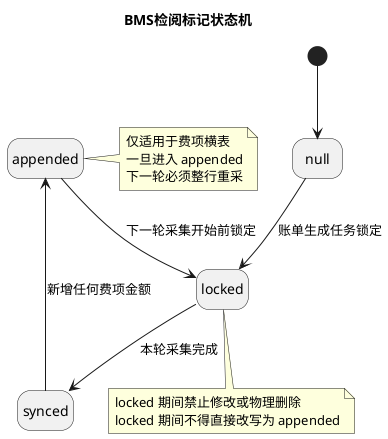

##### 9.6.7.3 状态流转与追加规则

1. 新增数据默认状态为 `null`。
2. 账单生成任务执行第一件事是将参与处理的源数据行更新为 `locked`。
3. 对于订单完成核重后延迟产生、且需要后续补录的费项横表金额，若进入既有数据行，则该行先转为 `appended`，下一轮采集开始时再转为 `locked`，随后按整行重采口径重新采集并入池；若进入新数据行，则数据行完成后直接进入 `locked`。
4. `locked` 行在账单生成任务未完成前，不能被修改或物理删除。
5. 所有后续步骤执行完成后，`locked` 行回写为 `synced`。
6. `synced` 行不能被物理删除，只能保留用于追溯、审计和后续处理判断。
7. 若任一步骤失败，系统不能直接写成 `synced`；应保留失败原因、失败批次和当前锁定状态，后续按`10. 账单重跑机制`处理。
8. 任何行级标记的变化，都必须保留变化时间、变化来源和操作者。

##### 9.6.7.4 增量采集候选范围

本节只定义源数据同步时哪些行可进入采集候选。生成任务失败、漏执行补跑、起草中增量重跑和来源打标补偿的处理路径，统一见`10. 账单重跑机制`。

1. 源数据增量采集的候选范围为 `null / locked / appended`；其中 `locked` 仅指已触发本次账单生成流程的行，`appended` 行按整行重采处理，不采集 `synced` 行。
2. 费项横表若处于 `appended` 状态，说明该行已有新增费项金额；由于 `BMS检阅标记` 无法识别新增的是哪一个费项金额，账单生成任务在其他步骤执行前，需要先把该行转为 `locked`，再按整行重采口径继续采集和入池。
3. 同一行在同一账期内只能被有效采集一次；若出现重复同步请求，系统按幂等规则处理，不重复生成费项。
4. 账单生成任务执行过程中，先锁定源数据，再执行后续采集、归集和写账单明细操作，锁定后不允许并发修改。
5. 若任一步骤失败，系统不能直接写成 `synced`；应保留失败原因、失败批次和当前锁定状态，后续按`10.6 任务侧重跑规则`和`10.7 来源归集与幂等规则`处理。
6. 已采集成功的历史结果不得因后续任务被重复采集、重复入池或静默覆盖。
7. 行级标记仅用于处理锁定与同步控制，不替代账单状态、核销状态或回款状态。

##### 9.6.7.5 留痕要求与冲正约束

1. 每次行级状态变化必须记录来源批次、来源表、来源行号、处理时间和处理结果。
2. 系统需要保留行级标记的历史轨迹，以便财务核对本期锁定范围和同步范围。
3. 任何已经写入 `BMS费项池` 的费项原始金额，都不能通过删除或修改源数据的方式撤销或修正；若金额有误，按`15. 调账中心`的冲正规则处理。

#### 9.6.8 后续生成账单规则

在同步结果稳定之后，账单生成只负责按照`7. 客户级账单配置`选择时间口径，不再重新判断源数据归属。

生成账单时，系统按照`7. 客户级账单配置`中的 `contract_node` 选择数据集的时间表达式：

| 账单场景 | 时间表达式 | 说明 |
| :--- | :--- | :--- |
| 主订单 `WEIGHT_MEASURED` | 核重时间口径；可取历史实现中的 `sale_order_header.measure_time` | 仅测试环境可用。生产环境不得展示、选择或按该口径生成应收账单。 |
| 主订单 `WEIGHT_OUTBOUND` | 出库完成时间口径；历史实现若仍沿用 `sale_order_header.measure_time`，必须确保该同步点不早于业务订单完成出库 | 生产环境可用的出库时间口径。页面展示和业务配置应表达为`出库时间`。 |
| 主订单 `ORDER_COMPLETED` | 订单广义签收后的订单完结时间口径；具体时间表达式由数据集配置维护 | 订单完结口径。页面展示和业务配置应表达为`订单完结`，不得表达为`签收`；广义签收状态范围见`18.2 业务系统基本面`。 |
| 返款主订单 `RECEIVED` | `received_time_column` | 优先使用数据集配置的回款时间口径。 |
| 附加费 | `sale_order_additional_matter.create_time` | 仅取 `fee_pay_status = waiting_pay`。 |
| `非费项` | 不写入任何账单的可核销明细，仅在特定位置弱关联展示 | 仅用于返款账单、回款管理等特定位置呈现，不进入 `ar_bill_currency_summary`、账单应收/未收汇总或任何账单核销范围。 |

这样可以保证配置账单时只选择业务含义，不需要对每个费项重复选择时间字段。

#### 9.6.9 同步一致性约束

在“账单原料同步”之后，还要约束源表与订单汇集表之间的一致性，避免跨层级跳写和重复入账。

1. 先落源表，再汇集订单原料，再进入 `BMS费项池`，不允许跨层级跳写。
2. `sale_order_fee_detail` 的同步口径必须保持一致，不能出现同一笔业务在不同订单原料口径下金额不一致。
3. 订单级返款明细行金额必须来自 `sale_order_fee_detail`；`sale_order_package_fee` 只用于回款管理，不进入 `BMS费项池`，也不纳入本章费项同步边界。
4. 同一源行只能对应一个目标费项记录版本，不允许重复入账。
5. 已同步成功的历史记录不允许被后续导入直接回写或修改；若金额有误，按`15. 调账中心`的冲正规则处理。
6. 数据源侧变更必须保留原始文件、导入任务、来源表、来源行号、处理时间和操作者。
7. 若汇集失败、映射失败或必填字段缺失，则不能进入 `BMS费项池`。
8. 金额为 0 或空的记录不能被当作有效费项同步，除非业务明确要求保留占位。

#### 9.6.10 异常处理、留痕与历史版本

同步失败、重复导入、上游变更和重跑场景，都必须同时满足“可回溯、可追踪、可保留历史版本”三类要求。

##### 9.6.10.1 异常处理

1. 重复导入同一文件时，系统应按来源批次和来源行幂等处理，不得重复生成费项。
2. 上游数据发生修改后，应生成新的同步版本，不得覆盖历史同步结果。
3. 数据源同步失败时，需保留失败原因、失败字段和失败批次，供财务和技术回溯。
4. 数据源侧仅能同步可追溯数据，不能直接修改已结清账单对应的历史费项结果。

##### 9.6.10.2 留痕要求

1. 每次同步、锁定、回写和重跑都必须保留处理时间、处理来源、处理人和处理结果。
2. 系统需要保留本次同步链路和重跑链路的历史轨迹，以便财务核对本期锁定范围和同步范围。
3. 任何已经写入 `BMS费项池` 的费项原始金额，都不能通过删除或修改源数据的方式撤销或修正；若金额有误，按`15. 调账中心`的冲正规则处理。

##### 9.6.10.3 历史版本保留

系统必须保留以下历史信息：

- 账单快照
- 条款版本
- 金额快照（币种 / 汇率口径见`14. 金额汇兑`）
- 核销记录
- 回款记录
- 对账差异
- 操作日志

#### 9.6.11 交叉归集

最后说明同一份 `BMS费项池` 在返款账单和应收账单之间的分流关系，避免把“先后顺序”误解成“互斥关系”。

1. 同一份 `BMS费项池` 在返款账单和应收账单之间分流，不是时间线上的互斥关系。
2. 若某条费项命中返款账单规则，优先进入返款账单。
3. 未命中返款规则的费项继续进入应收账单。
4. 应收账单中的“仅展示不核销”费项，只在账单中呈现，不纳入任何账单的核销范围。
5. 若返款账单尚未触发或条件不成立，该费项在应收账单中只能保持挂账占位。

### 9.7 生成与调整原则

1. 系统扫描启用中的客户级账单配置，锁定当前账期和配置快照后开始生成。
2. 起草中账单可持续吸收新增或变化费项。
3. 进入 `待审核` 后的账单不得被账单生成任务覆盖，后续修正路径见`10.2.1 账单状态边界`和`10.8 账单侧金额重算规则`。
4. 账单内只要存在任何冲正记录，这些冲正记录就必须先审核通过，整份账单才允许审核通过。
5. 进入 `待结清` 或 `已结清` 后，不允许再回写历史主结果；但应收账单和返款账单均允许因客户查收账单后提出异议，从 `待结清` 折返回 `待审核` 进行账单修正。
6. 若某笔费项同时满足应收与返款规则，优先进入返款账单。
7. 重跑、重算、补跑和补偿重试的取数范围、状态边界和幂等规则见`10. 账单重跑机制`。

### 9.8 状态与操作权限

| 账单状态 | 导出账单 | 调整账单 | 重跑账单 | 审核账单 | 重发账单 | 核销账单 |
| :--- | :--- | :--- | :--- | :--- | :--- | :--- |
| 起草中 | 可 | 可 | 可 | 不可 | 不可 | 不可 |
| 待审核 | 可 | 可 | 不可 | 可 | 不可 | 不可 |
| 待结清 | 可 | 不可 | 不可 | 不可 | 不可 | 可 |
| 已结清 | 可 | 不可 | 不可 | 不可 | 不可 | 不可 |

说明：

1. 这里的“调整账单”指账单侧的补录、冲正、调账和重算，不等于重跑生成任务。
2. 各账单状态下的重跑、重算和折返修正规则见`10.2.1 账单状态边界`。
3. `待结清` 账单因客户查收后对账单持有异议而折返回 `待审核` 时，只改变账单审核状态；如果已有部分款项核销，必须保留核销记录，不删除、不覆盖已发生的回款 / 返款核销流水；后续修正路径见`10.9.2 待结清异议与核销保护`。
4. `已结清` 只保留查询和历史追溯能力。
5. 账单核销完毕并进入 `已结清` 后，本系统应触发支付状态同步：将数据源中与该账单关联的所有费项支付状态更新为`已支付`；该动作只更新支付状态，不回写费项金额、币种、汇率或历史账单结果。

### 9.9 账单生成与调整流程图

```plantuml
@startuml
title BMS账单生成与调整产品流程
skinparam shadowing false
skinparam DefaultTextAlignment center
start
partition "任务触发" {
  :系统扫描启用中的账单配置;
  :判断当前是否到了账期出账时点;
  if (是否需要生成本期账单?) then (是)
    :创建本期账单生成任务并进入轮候;
    :固化配置快照、范围快照、限定情形快照、费项规则快照;
  else (否)
    :保留为待触发状态;
    stop
  endif
}
partition "任务领取" {
  :领取账单生成任务并开始执行;
  if (任务是否可执行?) then (是)
    :锁定任务，进入本次处理周期;
  else (否)
    :提示任务已被占用或已失效;
    stop
  endif
}
partition "范围判定" {
  :读取本次到期的账单配置方案;
  :按方案账期、履约节点和限定情形筛选客户、业务类型、运抵国、仓库和账期;
  if (存在分支方案且默认方案未设置限定情形?) then (是)
    :配置范围不完整，阻断生成并提示财务修正;
    stop
  else (否)
    :确定本次允许进入账单的费项范围;
  endif
  :校验候选费项未被同配置版本下其它有效方案占用;
  :按账单归属时间筛选订单和附加费候选项;
}
partition "费项归集" {
  :按订单归属时间拉取候选费项;
  :判断每条费项是否已在 BMS 中存在有效历史版本;
  if (是否为新增费项?) then (是)
    :将费项记入 BMS 费项池;
  else (否)
    :判断来源费项是否发生变化;
    if (是否发生变化?) then (是)
      :保留旧费项版本;
      :新增费项版本并标记为待重算;
    else (否)
      :跳过重复费项;
    endif
  endif
  :根据费项规则拆分主费项和附加费;
  if (是否为账单后新增附加费?) then (是)
    :进入增量归集候选队列;
  else (否)
    :继续进入本期常规归集队列;
  endif
}
partition "账单归属" {
  :按账单类型判断费项应进入应收、返款或其他账单;
  if (是否允许进入当前账单类型?) then (是)
    :生成账单费项关联;
  else (否)
    :将费项保留在待后续处理队列;
  endif
  if (是否同时命中返款与应收规则?) then (是)
    :优先进入返款账单;
  else (否)
    :按各自规则进入对应账单;
  endif
  if (是否存在待结清或已结清账单?) then (是)
    :不修改既有账单结果;
    :转入后续调整账单或新账单处理;
  else (否)
    :允许当前账单侧继续吸收未结清费项;
  endif
}
partition "账单计算" {
  :锁定结算币种、财务本位币和快照，口径见`14. 金额汇兑`;
  :计算原始金额、结算金额和本位币金额，口径见`14. 金额汇兑`;
  :汇总账单金额、待处理金额和核销进度;
  if (是否发生红冲、调账或补录?) then (是)
    :在账单侧新增调整记录;
    :保留原费项版本和历史轨迹;
  else (否)
    :继续保留正常费项汇总结果;
  endif
  if (是否需要走重跑/重算处理?) then (是)
    :按`10. 账单重跑机制`选择处理路径;
    :本生成流程不直接覆盖历史账单结果;
  else (否)
    :保留本次生成结果;
  endif
}
partition "结果落库" {
  :写入账单费项关联及账单侧快照;
  :刷新账单汇总、币种汇总和状态;
  :更新来源归集轨迹和源表打标结果;
  if (是否存在源表打标失败?) then (是)
    :保留失败标记并按`10. 账单重跑机制`进入补偿处理;
  else (否)
    :完成本次账单生成;
  endif
  if (是否允许后续修正?) then (是)
    :保留可调整入口;
  else (否)
    :冻结当前账单口径;
  endif
}
partition "后续处理" {
  if (账单是否仍可调整?) then (是)
    :允许补录、冲正、调账或金额口径调整，重跑/重算边界见`10. 账单重跑机制`;
    if (是否已结清?) then (是)
      :只允许通过后续调整账单处理;
    else (否)
      :允许在当前账单侧重算并刷新结果;
    endif
  else (否)
    :仅保留查询、导出和审计追溯;
  endif
}
stop
@enduml
```

## 10. 账单重跑机制

本章定义账单重跑机制的产品口径。这里的“重跑”是一个业务统称，不等于删除账单后重新生成；系统必须先识别触发对象、账单状态、任务状态、来源归集状态、客户侧事实、核销 / 返款事实、币种汇总、配置快照和金额快照，再选择对应的修正路径。

本章阅读顺序按实际决策链路展开：先明确目标和边界，再区分状态，再汇总触发场景，然后给出分流规则和流程图，最后分别落到任务侧、来源侧、金额侧、特殊场景、页面入口、异常提示和验收标准。

### 10.1 目标与核心原则

账单重跑机制要解决的是“账单结果与任务执行、来源数据或资金事实不一致时，系统应如何修正”的问题。产品目标如下：

1. 让账单生成失败、漏执行、源表打标失败、附加费后置新增、汇率变更、财务补录、客户异议、核销后差异、返款链路变化等场景都有明确处理路径。
2. 防止同一客户、同一账期、同一配置组、同一来源费项被重复归集，避免重复出账、漏出账和跨分支配置串账。
3. 保护已经审核、发送、通知、客户确认、核销、返款或结清的账单事实，避免后续配置、汇率或来源数据变更自动回写历史账单。
4. 保证每次重跑都能追溯到触发入口、触发人、操作原因、任务快照、来源数据、错误原因、影响账单、金额前后值和后续处理结果。
5. 在产品入口上区分“生成任务重试”“漏执行补跑”“账单侧重算”“调账 / 冲正”“反核销”“后续账单承接”“返款账单修正”，避免用一个“重跑”按钮承载所有处理。

核心原则是：可增量的只增量，可补偿的只补偿，可重算的只重算，可调账的走调账；已经形成客户侧确认、通知、核销或返款事实的账单，不允许被生成任务静默覆盖。

### 10.2 对象与状态边界

重跑判断首先要区分“处理对象”。对象不同，允许的动作不同：

| 对象 | 说明 | 主要判断点 | 可进入的处理路径 |
| :--- | :--- | :--- | :--- |
| 生成任务 | `bill_generate_task` 或配置监控中的一次出账执行记录 | 任务状态、任务快照、失败阶段、同客户同账期是否已有活动任务 | 失败重试、待重试补偿、漏执行补跑、人工处理 |
| 应收账单 | 已形成或正在形成的应收账单结果 | 账单状态、是否已发送 / 通知 / 确认、是否已核销、币种汇总 | 起草中增量、账单侧重算、调账 / 冲正、反核销、后续账单承接 |
| 来源数据 | 订单、附加费、赔付、非费项展示数据等 | 是否已归集、是否打标成功、是否被返款账单占用、是否仅展示 | 来源补偿、增量归集、弱关联展示、人工处理 |
| 附加费 | 订单出账后新增的转板费、退运费、税费、木架费等 | 原账单状态、附加费发生时间、归集标记、原订单和原账单号 | 起草中追加、后续账单、调账 / 冲正 |
| 核销流水 | 收款与账单之间的核销记录 | 流水状态、核销币种、核销金额、是否正常核销 | 反核销、资金事实回退、后续调账 |
| 返款账单 | COD 返款账单及其回款、扣减项、返款流水 | 返款账单状态、代收货款、扣减项归属、是否已返款 | 返款账单修正、后续返款账单、扣减项调账、反向返款 |

#### 10.2.1 账单状态边界

账单状态决定“账单结果还能不能被改、怎么改”。账单状态不与任务状态混用。

| 账单状态 | 是否允许生成任务重跑 | 是否允许账单侧重算 | 产品规则 |
| :--- | :--- | :--- | :--- |
| 起草中 | 允许 | 允许 | 可吸收未归集来源数据、`null / locked / appended` 行和账单后新增附加费；重跑必须幂等，不重复入账。 |
| 待审核 | 不允许用生成任务覆盖 | 允许 | 只能通过补录、汇率重算、冲正、调账、费用重整修正当前账单；所有冲正记录审核通过后，账单才允许审核通过。 |
| 待结清 | 不允许直接重跑覆盖 | 条件允许 | 客户异议时可折返回待审核；已有部分款项核销时，核销记录、币种、金额、汇率快照和操作轨迹必须保留。 |
| 已结清 | 不允许 | 原则上不允许直接影响历史结果 | 已结清账单只保留查询、导出和审计追溯；如需修正，先按反核销规则处理资金事实，或通过后续账单、调账、冲正承接差异。 |

#### 10.2.2 任务状态边界

任务状态决定“生成任务还能不能被重试、按什么口径重试”。任务状态不代表账单状态，也不能直接覆盖账单状态判断。

| 任务状态 | 是否允许任务重试 / 补跑 | 是否允许影响既有账单 | 产品规则 |
| :--- | :--- | :--- | :--- |
| 待执行 | 不允许重复触发 | 不适用 | 任务已创建并进入等待执行队列，但尚未被领取执行；同客户、同账期、同配置组不得再次创建任务，避免并发。 |
| 运行中 | 不允许重复触发 | 不适用 | 任务正在执行；页面只允许查看进度和日志，不允许失败重试或再次手动生成。 |
| 失败 | 允许失败重试 | 仅允许按失败阶段处理 | 必须复用原任务快照与原查询口径；如果失败点是源表打标，只做补偿，不重复生成账单明细。 |
| 待重试 | 允许补偿重试 | 仅允许补偿未完成部分 | 用于跨库打标、来源归集标记等可补偿场景；重试只处理失败来源，不全量回扫；进入该状态后页面不得继续自动轮询，应展示人工处理或补偿重试入口。 |
| 成功 | 原则上不允许原任务重跑 | 按关联账单状态判断 | 如需要新增费用，按账单状态进入起草中增量、待审核账单侧重算或后续账单承接。 |
| 已取消 | 不允许直接重试 | 不影响既有账单 | 取消原因必须留痕；如确需重新生成，应重新发起任务并重新做状态与幂等校验。 |
| 漏执行 | 允许漏执行补跑 | 生成新任务后再判断 | 配置监控识别应执行但漏执行的配置；人工补跑不能掩盖原漏执行事实。 |

### 10.3 触发场景汇总

系统或用户触发“重跑 / 重算 / 重试”时，应先归类触发场景，再进入统一决策顺序。触发场景和默认处理路径如下：

| 场景分类 | 触发场景 | 典型触发入口 | 默认处理路径 | 关键限制 |
| :--- | :--- | :--- | :--- | :--- |
| 系统任务异常 | 账单生成任务失败、任务待重试、源库连接失败、来源 SQL 执行失败、来源表打标失败 | 账单生成任务列表 / 配置监控页 | 失败任务按快照重试；若失败点是源表打标，只做补偿打标 | 不允许读取最新配置覆盖原任务口径；不允许重复生成已成功明细。 |
| 调度漏执行 | 配置应出账但没有成功任务，或定时任务未按计划生成账单 | 配置监控页 | 漏执行补跑 | 人工补跑必须保留原漏执行轨迹；存在待执行、运行中、待重试任务时不得重复触发。 |
| 起草期新增来源 | 起草中账单对应账期内出现新订单、新费项、待重采来源行或尚未归集来源数据 | 账单生成任务 / 手动生成 | 起草中增量重跑 | 只采集未归集或待补偿来源；已同步来源不重复入账。 |
| 源表打标补偿 | BMS 已生成账单明细，但订单、附加费或其他来源表 BMS 标记回写失败 | 任务监控失败重试 | 来源打标补偿 | 只补打标或归集标记，不重复生成 `fee_detail`。 |
| 附加费后置新增 | 订单已出账后新增转板费、退运费、税费、木架费等附加费用 | 附加费增量任务 / 后续账单 | 起草中追加；审核后进入后续账单或调账 | 不反复改写已审核、待结清或已结清账单；必须保留原订单、原账期、原账单号。 |
| 账单侧配置或金额调整 | 财务调整汇率、补录费项、修改调账、发起本期冲正、发起往期冲正、选中订单重整 | 应收账单详情 / 调账中心 / 汇率弹窗 | 账单侧重算或调账 / 冲正 | 待审核可修正；待结清需先折返；已结清不直接覆盖历史结果。 |
| 多币种金额变化 | 汇率快照调整、费项结算币种变化、币种汇总金额异常、客户特调汇率表 / 基准汇率表 / 店铺汇率表均缺少汇率兜底导致汇率按 `1` 处理 | 账单详情 / 汇率弹窗 / 汇率快照 | 逐币种重算或汇率侧调整 | 不允许跨币种自动抵扣；缺少汇率兜底时，该货币对汇率固定按 `1` 处理并进入账单特调汇率快照。 |
| 客户异议 | 客户查收账单后对金额、费项、扣减项、回款或返款口径提出异议 | 账单详情 / 客户异议处理 | 待结清折返回待审核，再做账单侧修正 | 已核销或已返款金额必须保留，只重算未核销余额或未返余额。 |
| 核销后差异 | 已部分核销或已结清后发现费用错误、超收、少收、币种桶余额异常 | 核销记录区 / 调账中心 / 账单详情 | 反核销、调账、冲正或后续账单承接 | 不允许生成任务覆盖；反核销只处理正常核销流水，并保留原流水。 |
| 返款链路变化 | COD 回款金额变化、返款扣减项变化、返款模式口径调整、已返款后发现差异 | 返款账单详情 / 回款管理 | 返款账单修正、后续返款账单、扣减项调账或反向返款 | 返款账单独立于应收账单；返款时扣减费项优先，不得在应收账单重复收费。 |
| 非费项展示变化 | 非费项来源需要在返款账单、回款管理等特定位置重新呈现或追溯 | 返款账单 / 回款管理 / 数据源规则 | 重新展示或弱关联，不触发任何账单金额重算 | 非费项不纳入任何账单核销范围。 |
| 测试验证 | 测试环境通过同步生产环境数据已重置 BMS 标记，需要验证账单生成、附加费归集、核销或理赔抵扣链路 | 同步生产环境数据工具 / 手动生成 | 测试环境重新生成 | 仅限测试环境；生产环境不允许通过清空来源标记制造重新生成。 |

### 10.4 处理路径定义

触发场景只是入口，最终执行动作必须落到明确的处理路径。系统应在操作确认页展示“本次属于哪一种处理路径、会处理哪些来源、影响哪些账单、是否影响已核销 / 已返款金额、是否会产生调账或冲正记录”。

| 处理路径 | 触发对象 | 产品含义 | 典型入口 | 结果口径 |
| :--- | :--- | :--- | :--- | :--- |
| 任务失败重试 | `bill_generate_task` | 原生成任务失败或需要补偿时，沿用原任务口径继续处理 | 账单生成任务列表 / 配置监控 | 复用原配置快照、范围快照、费项规则快照和来源 SQL 快照，不读取最新配置覆盖原任务。 |
| 漏执行补跑 | `bill_config + 账期` | 配置应出账但没有成功任务 | 配置监控页 | 新建或复用任务行，按当前应执行账期生成；若已有运行中或待补偿任务，禁止并发补跑。 |
| 起草中增量重跑 | 起草中账单 | 账单尚未进入审核，可继续吸收新增或变化费项 | 账单生成任务 / 手动生成 | 只拉取未归集、未打标或待重采来源数据，并刷新当前账单金额和币种汇总。 |
| 待审核账单重算 | 待审核账单 | 账单已经结束生成任务，不允许再被任务覆盖，但可在账单侧修正金额 | 账单详情 / 调账中心 / 汇率弹窗 | 通过补录、汇率重算、冲正、调账、选中重整刷新账单结果。 |
| 费用重整 | 账单内订单或费项 | 对选中订单或费项按当前规则重新计算差异 | 账单详情“选中重整” | 生成差异调账或冲正记录，不直接覆盖原费用行。 |
| 待结清异议折返 | 待结清账单 | 客户查收后对账单有异议，财务需重新审核账单 | 账单详情 / 客户异议处理 | 账单回到待审核；已有部分款项核销时，必须保留核销记录和流水。 |
| 来源打标补偿 | 来源归集标记 / 源表打标 | BMS 明细已生成但源表打标失败时，只补偿打标 | 任务监控失败重试 | 不重复生成 `fee_detail`，只补齐来源标记或源表 BMS 标记。 |
| 附加费增量归集 | 附加费来源行 | 订单已出账后又产生转板、退运、税费、木架等后置费用 | 附加费增量任务 / 后续账单 | 原账单仍起草中则追加；已审核、待结清或已结清则进入后续账单或调账。 |
| 返款账单重跑 | COD 返款账单 | COD 回款、扣减项或返款金额出现差异时修正返款账单 | 返款账单详情 / 回款管理 | 按返款账单独立状态流转处理，不混用应收账单生成任务。 |
| 后续账单承接 | 已审核、待结清或已结清账单 | 既有账单不再允许生成任务覆盖时，由后续账单承接差异 | 调账中心 / 后续账单 | 形成本期或往期调账、冲正、补收附加费，不改写历史主结果；本期账单冲正本期或往期费项时，只触发本期账单重跑 / 重算，不触发往期账单重跑。 |

### 10.5 决策顺序与产品流程

系统收到任何“重跑 / 重算 / 重试”操作时，必须按以下顺序判断，不能直接进入生成逻辑：

1. 判断触发对象：生成任务、应收账单、返款账单、来源数据、附加费、核销流水、调账记录。
2. 判断对象状态：任务侧判断待执行、运行中、失败、待重试、成功、已取消、漏执行；账单侧判断起草中、待审核、待结清、已结清。
3. 判断客户侧事实：客户送达记录、邮件通知状态、客户是否已确认、是否已核销、是否已返款。
4. 判断来源数据状态：是否未归集、已归集、打标失败、后置新增、已被返款账单占用、非费项仅展示。
5. 判断金额口径：是否涉及汇率、币种桶、调账、冲正、非费项、已核销金额、已返款金额。
6. 选择处理路径：任务重试、补打标、起草中增量、账单侧重算、调账 / 冲正、反核销、后续账单承接或人工处理。

#### 10.5.1 账单重跑机制产品流程图

本流程图以产品经理口径描述账单重跑的完整分流逻辑。图中“重跑”是统称，实际落地时会被系统拆成任务失败重试、漏执行补跑、起草中增量、账单侧重算、附加费增量归集、返款账单修正、调账 / 冲正、反核销和后续账单承接等不同动作。

```plantuml
@startuml
title 账单重跑机制产品流程图
skinparam DefaultTextAlignment center
skinparam ActivityBorderColor #555555
skinparam ActivityBackgroundColor #F7F8FA
skinparam DiamondBackgroundColor #FFF7E6
skinparam DiamondBorderColor #B26A00
skinparam NoteBackgroundColor #FFFDF2
skinparam NoteBorderColor #B26A00
skinparam NoteTextAlignment left

start

partition "触发入口" {
  :用户或系统发起重跑相关动作;
  note right
  入口包括：
  1. 账单生成任务列表`失败重试`
  2. 配置监控页`漏执行补跑/手动生成`
  3. 应收账单详情`重算/补录/冲正/重整`
  4. 返款账单详情`扣减项/返款金额修正`
  5. 附加费增量任务`后置费用归集`
  6. 核销记录区`反核销`
  7. 调账中心`本期/往期调账`
  end note
  :记录触发入口、操作人、操作时间、操作原因;
  :加载目标对象;
  note right
  目标对象可以是：
  生成任务、账单、来源数据、附加费、
  调账记录、冲正记录、核销流水、返款记录
  end note
}

partition "基础预检" {
  if (目标对象是否存在?) then (否)
    :提示对象不存在或已被删除;
    :写入操作失败审计;
    stop
  else (是)
  endif

  if (用户是否具备对应权限?) then (否)
    :提示无权限执行该动作;
    :写入权限拦截审计;
    stop
  else (是)
  endif

  if (是否已有同客户同账期活动任务?) then (是)
    :拦截本次触发;
    :提示先处理待执行/运行中/待重试任务;
    :避免并发生成导致重复归集;
    stop
  else (否)
  endif

  :识别账单类型;
  note right
  账单类型：
  1. 应收账单
  2. 返款账单
  3. 后续差异账单
  4. 仅任务记录，尚未形成账单
  end note
}

partition "按触发对象分流" {
  if (触发对象是生成任务?) then (是)
    if (任务状态是失败或待重试?) then (是)
      :进入任务失败重试路径;
      :读取原任务配置快照;
      :读取原任务范围快照;
      :读取原任务费项规则快照;
      :读取原任务来源 SQL 快照;
      note right
      失败重试不能读取最新配置覆盖历史口径。
      只允许沿用原任务生成时固化的口径。
      end note
    else (否)
      if (任务状态是运行中或待执行?) then (是)
        :提示任务仍在处理中;
        :不允许重复触发;
        stop
      else (成功/已取消/其他)
        :不允许原任务直接重跑;
        :引导按账单状态进入增量、重算或后续承接;
        stop
      endif
    endif
  elseif (触发对象是配置监控?) then (是)
    if (监控状态是漏执行?) then (是)
      :进入漏执行补跑路径;
      :计算本次应生成账期;
      :保留原漏执行监控轨迹;
      :创建或复用补跑任务;
    elseif (监控状态是失败或待重试?) then (是)
      :进入任务失败重试路径;
      :复用失败任务快照;
    else (成功/运行中/未到执行日)
      :提示当前配置不需要补跑;
      stop
    endif
  elseif (触发对象是账单?) then (是)
    :进入账单状态判断路径;
  elseif (触发对象是附加费来源行?) then (是)
    :进入附加费后置新增路径;
  elseif (触发对象是核销流水?) then (是)
    :进入反核销路径;
  else (调账/冲正/重整)
    :进入账单侧调整路径;
  endif
}

partition "任务级重试与补跑" {
  if (当前路径是否为任务级处理?) then (是)
    :校验任务快照完整性;
    if (快照缺失或无法解析?) then (是)
      :任务进入人工处理;
      :提示配置快照缺失，不能自动重试;
      :记录失败阶段=配置快照;
      stop
    else (否)
    endif

    :校验数据源配置、数据集、来源表白名单;
    :校验账期窗口、分页策略、金额字段、币种字段;
    if (数据源不可用或字段缺失?) then (是)
      :任务标记失败/待重试;
      :记录失败阶段=来源查询;
      :展示错误摘要和完整错误详情;
      stop
    else (否)
    endif

    :按任务快照拉取候选来源数据;
    note right
    主订单按履约节点取数：
    核重时间 -> 核重时间（仅测试环境）
    出库时间 -> 出库时间
    订单完结 -> 订单完结时间
    返款回款 -> 回款时间

    附加费按 create_time 增量归集，
    并过滤可计费状态。
    end note

    :过滤已归集、已打标、已被返款占用的数据;
    if (存在来源归属冲突?) then (是)
      :按返款扣减优先于应收处理;
      :应收侧只保留弱关联展示;
      :记录冲突来源和已占用账单号;
    else (否)
    endif

    if (无候选数据?) then (是)
      :任务完成但不新增费用;
      :记录拉取数=0、命中数=0、跳过原因;
      :更新任务成功或无数据;
      stop
    else (否)
    endif

    :执行默认/分支配置互斥归属;
    :按业务板块 + 运抵国拆分应收账单;
    if (缺少业务板块或运抵国?) then (是)
      :任务失败;
      :提示补齐源数据后再重跑;
      :记录失败阶段=订单归属;
      stop
    else (否)
    endif

    :按费项规则拆分 fee_detail;
    if (存在非费项?) then (是)
      :仅在返款账单、回款管理等特定位置呈现;
      :不纳入任何账单核销范围;
    else (否)
    endif

    :校验费用币种、结算币种、财务本位币;
    if (缺少汇率兜底?) then (是)
      :该货币对汇率按 1 处理;
      :记录未命中兜底汇率原因;
    else (否)
      :固化 L1/L2 汇率快照;
    endif
    :固化汇率快照;
    :计算结算币种金额和本位币金额;

    :写入或追加账单草稿;
    :写入费用明细、订单快照、币种汇总;
    :写入 bill_source_collect_mark;
    :回写源表 BMS 标记;

    if (源表打标失败?) then (是)
      :账单保持生成中或失败态;
      :任务标记待重试/失败;
      :记录失败来源表、来源 ID、异常信息;
      :后续只允许补打标，不重复生成 fee_detail;
      stop
    else (否)
      :刷新账单金额和币种汇总;
      :任务标记成功;
      :写入成功审计;
      stop
    endif
  else (否)
  endif
}

partition "账单状态判断" {
  if (当前路径是否为账单级处理?) then (是)
    :读取账单状态、账单类型、账期、客户、配置快照;
    :读取客户送达记录、邮件通知状态、已核销、已返款;
    :读取币种汇总和核销流水;

    if (账单状态是起草中?) then (是)
      :允许生成任务增量归集;
      :允许账单侧补录、汇率重算、冲正、重整;
      :只吸收未归集或待补偿来源;
      :刷新明细、金额、币种汇总;
      :保留全部操作轨迹;
      stop
    elseif (账单状态是待审核?) then (是)
      :禁止生成任务覆盖;
      :允许账单侧修正;
      note right
      可执行：
      1. 汇率编辑后重算
      2. 手工补录费项
      3. 本期冲正
      4. 往期冲正
      5. 选中订单/费项重整
      6. 调账审核
      end note
      note right
      冲正触发范围：
      1. 冲正本期账单费项 -> 只刷新本期账单
      2. 冲正往期账单费项 -> 仍只刷新本期账单
      3. 被引用的往期账单不重跑、不重算、不回写
      end note
      :生成差异记录或刷新账单侧金额;
      :不回写来源数据归集标记;
      :等待财务复核;
      stop
    elseif (账单状态是待结清?) then (是)
      if (客户是否提出异议?) then (否)
        :不允许直接重跑覆盖;
        :引导通过后续账单或调账处理;
        stop
      else (是)
        :折返回待审核;
        :保留发送、通知、核销、返款轨迹;
        if (是否已有部分核销/返款?) then (是)
          :锁定已核销或已返款事实;
          :只重算未核销余额或未返余额;
          :若金额小于已核销/已返，提示超收/超返;
          :引导反核销、退款、调账或后续账单;
          stop
        else (否)
          :允许账单侧重算和调账;
          :完成后重新进入审核;
          stop
        endif
      endif
    elseif (账单状态是已结清?) then (是)
      :禁止生成任务或账单侧重算覆盖历史结果;
      if (必须影响既有资金事实?) then (是)
        :先走反核销或反向资金处理;
        :再进入待审核修正或后续调账流程;
      else (否)
        :通过后续账单承接往期冲正/调账;
      endif
      :历史账单保留原快照、原明细、原汇率、原核销流水;
      stop
    else (其他异常情况)
      :提示账单状态异常或数据不完整;
      :进入人工异常流程;
      stop
    endif
  else (否)
  endif
}

partition "附加费后置新增" {
  if (当前路径是否为附加费增量?) then (是)
    :识别附加费来源行;
    :校验 bms_after_bill_added_flag 或未归集标记;
    :查找关联订单和原账单;
    if (关联订单不存在?) then (是)
      :任务失败;
      :提示维护来源关联关系;
      stop
    else (否)
    endif

    if (原账单仍起草中?) then (是)
      :追加到原账单;
      :刷新 fee_detail、币种汇总、账单金额;
      :回写附加费来源标记;
      stop
    elseif (原账单待审核?) then (是)
      :由财务选择当前账单补录/调账;
      :或进入后续账单承接;
      :保留原订单号、原账期、原账单号;
      stop
    else (待结清/已结清)
      :默认进入后续账单或形成往期补收调账;
      :不改写原账单;
      :前台标识为往期补收附加费;
      stop
    endif
  else (否)
  endif
}

partition "返款账单重跑" {
  if (当前路径是否为返款账单?) then (是)
    :读取 COD 代收货款、回款记录、返款扣减项;
    if (代收货款 <= 0?) then (是)
      :本期不拉取返款扣减费项;
      :提示无可返本金;
      stop
    else (否)
    endif

    :判断返款账单状态;
    if (返款账单未确认?) then (是)
      :允许修正回款口径、扣减项、应返金额;
      :刷新返款金额和扣减明细;
      :不影响应收账单;
      stop
    elseif (返款账单待返款且未返?) then (是)
      :允许折返回待审核;
      :修正后重新确认;
      stop
    else (已返款/已结清)
      :禁止直接覆盖;
      :通过后续返款账单、扣减项调账或反向返款处理;
      :保留原返款流水和金额快照;
      stop
    endif
  else (否)
  endif
}

partition "反核销与资金保护" {
  if (当前路径是否为反核销?) then (是)
    :读取核销流水;
    if (核销流水状态是否 NORMAL?) then (否)
      :禁止反核销;
      :提示仅正常核销流水可反核销;
      stop
    else (是)
      :锁定账单、收款单、核销流水;
      :生成反核销轨迹;
      :回退收款单已核销/未核销金额;
      :回退账单币种汇总已收/未收金额;
      :按所有币种桶刷新账单状态;
      :保留原核销流水，不物理删除;
      stop
    endif
  else (否)
  endif
}

partition "统一收尾" {
  :所有路径均写入审计日志;
  note right
  审计信息包括：
  操作入口、操作人、原因、
  影响账单、来源数据、任务号、
  金额前值、金额后值、
  汇率快照、币种桶变化、
  核销/返款影响、异常详情
  end note
  :页面刷新任务状态、账单状态、金额汇总、错误提示;
  :必要时创建待办或人工处理记录;
}

stop
@enduml
```

### 10.6 任务侧重跑规则

任务侧处理承接“生成任务失败、待重试、漏执行”三类场景。任务侧重跑只解决任务执行链路问题，不直接绕过账单状态边界。

1. 账单生成任务在开始轮候执行时创建，并立即固化账单配置快照、分支范围快照、费项规则快照、币种模板 / 费项结算币种规则快照；不得等到任务真正开始执行时才创建任务或固化快照。
2. 任务执行和失败重试都必须以任务快照为准，不允许因为 `bill_config`、分支范围、费项规则、币种模板后续被修改而改变历史任务口径。
3. 任务需要保留来源查询 SQL 快照，包括主订单来源 SQL、附加费来源 SQL、查询账期窗口、分页策略和关键过滤条件。
4. 失败任务即使回滚了账单写入，也必须保留失败状态、错误摘要、错误详情、失败阶段、失败来源表 / 来源 ID 和可重试标记。
5. `失败重试` 只允许用于失败 / 待重试任务；页面需展示重试次数、上次失败原因、原配置快照和关联账单；任务进入`待重试`后，前端不得持续自动轮询该任务，只展示可操作入口和当前稳定状态。
6. 配置监控需识别漏执行、执行失败、待重试、运行中、已成功等状态，并支持财务快速筛选漏执行和失败任务。
7. 人工补跑不能掩盖原定时任务漏执行事实；配置监控仍要保留原漏执行轨迹，并标识后续由人工补跑完成。
8. 若同一配置、同一账期已存在待执行 / 运行中 / 待重试活动任务，系统必须拒绝再次发起，提示先处理当前活动任务。
9. 手动生成、漏执行补跑和失败重试均只创建或恢复任务，不同步等待任务执行完成；创建成功后当前页面不自动跳转任务流水页，而是在当前页面展示任务通知卡片，由用户自行进入任务流水页追踪详情。

### 10.7 来源归集与幂等规则

来源侧规则承接任务执行后的取数、归属、打标和防重复要求。其核心目标是保证“同一来源只进入一个有效结果”，并且在失败补偿时只补失败部分。

1. 重跑取数必须使用 `fee_source_dataset` 和 `fee_source_rule` 定义的数据集口径，不允许临时绕开数据集直接写死来源表。
2. 主订单类费用跟随账单配置的履约节点：测试环境的核重时间使用核重时间口径，生产环境的出库时间使用出库时间口径，订单完结使用订单完结时间口径，返款回款模式使用回款时间口径。
3. 附加费类数据按 `sale_order_additional_matter.create_time` 增量归集，并固定过滤可计费状态，例如 `fee_pay_status = waiting_pay`。
4. 数据集配置中的查询窗口、分页大小、金额字段白名单和来源表白名单必须在任务快照中可追溯。
5. 同一客户、同一账期、同一配置方案只允许一个账单生成流程运行；默认方案和分支方案按各自账期独立触发，不按固定优先级抢占来源数据。
6. 同一来源费项在同一客户、同一应收配置版本内只能命中一个 `bill_config_id`，并且只能生成一条有效账单明细或一条明确的调整记录。
7. 来源数据必须通过 `BMS检阅标记`、源表 BMS 打标和 `bill_source_collect_mark` 等机制防重复；不能只依赖前端按钮置灰。
8. 任务重跑时，只采集 `null / locked / appended` 或未完成补偿的来源行；`synced` 行不再重复采集。
9. 若 BMS 已生成账单明细但源表打标失败，重试时应根据来源归集标记只补打标，不重复生成 `fee_detail`。
10. 源表打标、账单明细、币种汇总和任务状态必须在同一业务闭环内完成；任一关键步骤失败时，任务不能标记为成功。
11. 订单、附加费、赔付等来源若已进入 BMS 费项池，其原始金额不允许通过源数据删除或修改来撤销，只能通过调账、冲正或后续账单承接差异。
12. 无费用订单原则上不打已计费标识，避免后续真正产生费用时被过滤；如业务要求跳过，必须记录跳过原因，不混用已归集标记。
13. `非费项` 不进入任何账单的可核销明细，仅在返款账单、回款管理等特定位置用于展示、追溯和对账；不纳入 `ar_bill_currency_summary`、账单应收、未收和核销分摊金额。
14. 返款时扣减费项优先进入返款账单；应收账单再次命中该来源时，只允许弱关联展示，不重复增加应收金额。
15. 来源数据缺少业务板块、运抵国、履约节点时间、回款时间或币种时，任务必须失败并提示补齐，不允许系统猜测；若客户特调汇率表、基准汇率表和店铺汇率表都找不到汇率兜底，按`8. 客户级汇率配置`和`14. 金额汇兑`的规则将该货币对汇率固定为 `1`。
16. 同步生产环境数据工具可以重置测试库 BMS 标记以便验证重跑，但生产环境不允许通过清空来源标记制造“重新生成”。

### 10.8 账单侧金额重算规则

账单侧重算承接“账单已经形成，但金额、汇率、币种、调账或冲正需要修正”的场景。账单侧重算不回写来源归集标记，也不替代任务失败重试。

1. 账单重算必须先判断重算范围：整张账单、选中订单、选中费项、汇率区、币种汇总区或调账记录。
2. 汇率编辑后必须重算相关费项的结算币种金额、财务本位币金额、费项汇总、币种汇总和账单总览金额；汇率快照保存规则见`14. 金额汇兑`。
3. 多币种账单重算时，必须按结算币种桶分别刷新应收、已收、未收；不能把不同结算币种混成一个余额。
4. 已核销金额不得因重算被重置。重算后的未核销余额应基于“修正后应收 / 应返金额 - 已核销金额”重新计算。
5. 如果重算导致某币种桶出现负数、超收或已核销金额大于修正后应收 / 应返金额，系统必须提示异常，并要求通过反核销、调账、退款或后续账单处理。
6. 费用重整必须记录原金额、重整后金额、差额、重整原因、操作人和操作时间；重整差异进入调账或冲正审核流，不能静默覆盖原费用行。
7. 往期重整不修改历史账单原始费用，只在当前账单或后续账单生成往期调账记录，并保留来源账单号、来源订单号、来源账单配置和目标账单号。
8. 本期账单冲正本期账单或往期账单费项时，冲正结果只归属到本期账单，并只触发本期账单重跑 / 重算；即使冲正对象来自往期账单，也只在本期账单形成往期冲正 / 调账记录，并引用往期账单号、往期订单号、往期费项和差异原因。
9. 系统不得因本期账单的往期冲正触发往期账单生成任务重跑，也不得刷新往期账单明细、汇率快照、币种汇总、核销流水和审核状态。
10. 客户特调汇率表、基准汇率表和店铺汇率表都缺少汇率兜底时，该货币对汇率固定按 `1` 处理，并必须写入账单特调汇率快照；币种相同时汇率同样固定为 `1`，不需要新增无意义的汇率配置记录。
11. 本期红冲必须继承被冲正费用的结算币种；往期红冲进入当前或后续账单时，也必须写入对应币种桶。

### 10.9 特殊场景处理规则

以下场景容易被误解为“重新生成账单”，但实际处理路径不同。系统需要在页面文案、按钮权限和确认弹窗中明确提示差异。

#### 10.9.1 附加费与后置费用

1. 账单生成后新增的附加费，不应反复改写已经审核或待结清的账单。
2. 若原账单仍处于起草中，可追加到原账单并重算金额。
3. 若原账单已进入待审核，可由财务决定在当前账单侧补录 / 调账，或进入后续账单承接。
4. 若原账单已待结清或已结清，新增附加费默认进入后续账单，或形成后续补收 / 调账记录。
5. 附加费进入后续账单时，必须保留原订单号、原订单所属账期、原账单号、附加费发生时间和归集时间，避免客户误解本期账单包含往期订单费用。
6. 附加费类数据固定按创建时间或处理时间增量归集，且必须过滤已归集标记，避免重复收费。
7. 若附加费来源行已标记 `bms_after_bill_added_flag = 1`，系统应按增量附加费路径处理，不再走主订单首次生成路径。
8. 附加费增量任务失败后，重试仍按 `bill_source_collect_mark` 和附加费源表打标过滤，不允许重复写入相同 `fee_detail`。

#### 10.9.2 待结清异议与核销保护

1. 应收账单和返款账单均可从 `待结清` 折返回 `待审核`，典型场景是客户查收账单后对金额、费项、扣减项或回款 / 返款口径提出异议并要求修正。
2. 折返只改变账单审核状态，不删除、不覆盖已发生的核销记录。
3. 若已有部分款项核销，系统必须保留核销流水、核销币种、核销金额、汇率快照、操作人、操作时间和关联收款 / 返款记录。
4. 折返后的账单重算只能影响未核销余额和后续可核销金额；不得把已核销金额直接清零后重新生成。
5. 若修正后账单金额小于已核销金额，系统必须提示超收 / 超返差异，并通过反核销、退款、调账或后续账单处理，不允许自动吞掉差额。
6. 反核销只允许针对正常核销流水操作，反核销后必须同步回退收款单、核销流水、账单币种汇总和账单状态。
7. 一笔收款分摊多张账单时，重跑不得破坏原分摊顺序和流水；需要调整时应新增反向流水或调账记录。

#### 10.9.3 已结清账单差异

1. 已结清账单不允许通过账单生成任务或账单侧重算直接覆盖历史主结果。
2. 已结清账单若发现费用错误，应优先通过后续账单承接往期冲正或调账；本期账单冲正该往期费项时，只触发本期账单重跑 / 重算，不触发往期账单重跑。
3. 已结清账单若必须影响既有资金事实，应先按权限执行反核销或反向资金处理，再进入待审核修正或后续调账流程。
4. 已结清账单的汇率、币种汇总、费项明细、核销流水和金额快照必须保留原历史版本，不随新配置、新汇率或新来源数据自动刷新。
5. 历史差异进入后续账单时，应清楚标识来源账单、来源订单、来源费项、差异原因和调整类型，便于客户对账。
6. 被冲正的往期账单只保留被引用和追溯关系，不因本期冲正动作重新进入生成、重算或审核流程；本期账单冲正本期费项时，也只刷新本期账单自身，不扩散到其他账单。
7. 多币种账单只有所有结算币种桶未收金额均为 0 时才视为已结清；任一币种桶存在未收或超收异常，都不能用单一总额判断结清。

#### 10.9.4 返款账单重跑

1. 返款账单与应收账单是两条独立账单线，账期、状态、回款口径和扣减项归属可以不同。
2. COD 代收货款金额是返款账单生成的前置判断项；当代收货款小于等于 0 时，本期返款账单不拉取返款扣减费项。
3. 返款时扣减的费项优先进入返款账单，在返款账单已占用来源后，应收账单不得重复收费。
4. 返款账单重跑只能修正返款本金、扣减项、应返金额、已返金额和未返金额，不得顺带改写应收账单。
5. 返款账单已返款或已结清后，差异应通过后续返款账单、扣减项调账、反向返款或人工处理承接。
6. 返款账单没有 `逾期未结清` 口径；逾期仅是应收账单基于客户信用期的筛选条件和展示标签。
7. 若返款账单与应收账单引用同一来源费项，页面必须展示费项归属优先级和已占用账单号，避免财务重复处理。

### 10.10 页面入口与权限

页面入口必须与处理路径对应，避免同一入口同时触发任务级重试和账单级覆盖。

| 入口 | 可执行动作 | 权限与状态约束 |
| :--- | :--- | :--- |
| 账单生成任务列表 | 失败重试、查看账单、查看配置快照、查看错误 | 失败 / 待重试才允许失败重试；重试复用原任务快照。 |
| 配置监控页 | 手动生成、失败重试、查看任务 | 仅对漏执行、失败或待重试的配置开放对应操作。 |
| 应收账单详情 | 汇率重算、补录费项、本期冲正、往期冲正、选中重整、导出当前账单明细 | 按账单状态控制；待审核可修正，待结清需先折返，已结清走反核销或后续账单；导出只面向当前账单结果，不支持导出账单历史快照。 |
| 返款账单详情 | 扣减项修正、回款 / 返款口径修正、调账、折返审核 | 与应收同构，但不支持逾期未结清筛选口径。 |
| 调账中心 | 新增调账、导入冲正、审核、移除、重整 | 调账审核通过后才影响账单金额；未审核时只展示为待处理差异。 |
| 核销记录区 | 查看核销、反核销 | 只允许正常核销流水反核销；反核销必须保留原流水并生成反向轨迹。 |
| 数据源规则 | 查看数据集、来源表、时间口径、分页策略 | 只读用于排查重跑取数范围；配置变更只影响后续任务或账单侧重算，不回写历史任务。 |

#### 10.10.1 原型概述

账单生成任务页面用于让财务查看账单相关任务的执行结果、定位失败原因，并从任务维度进入详情追溯。

任务流水需要区分`账单生成任务`和`源数据同步任务`。系统每天凌晨都会从数据源同步数据到 `BMS费项池`，但数据同步完成不代表一定会生成账单；只有财务人为触发生成账单，或系统检查到任务执行时间为账期结束日的次日凌晨时，才创建账单生成任务并进入轮候队列，任务执行完成后才形成账单结果。

| 区域 | 业务字段 | 交互与约束 |
| :--- | :--- | :--- |
| 任务统计区 | `任务总数`、`成功任务`、`失败任务`、`待重试`、`生成金额` | 统计结果必须基于当前筛选条件和当前任务列表标签实时刷新，并与下方任务列表使用同一查询口径；若支持点击统计项快捷筛选，则点击后必须同步更新筛选条件、统计区和任务列表；统计区只表达任务结果汇总，不替代任务明细和错误详情；`生成金额`仅汇总当前筛选范围内账单生成任务的应收金额，源数据同步任务不应产生账单金额。 |
| 任务筛选区 | `任务编号`、`配置编号`、`客户名称`、`客户编码`、`会员编码`<br>`店铺`、`任务状态`、`触发方式`、`账期开始日期`、`账期结束日期` | 支持按文本、下拉选项和账期日期范围组合筛选任务流水；任一筛选条件变更后，统计区和任务列表必须同步刷新；筛选条件必须同时适用于`账单生成任务`和`源数据同步任务`两个标签卡；账期筛选必须按任务执行时固化的账期口径查询，不反查最新客户级账单配置；未选择店铺时，默认查询当前用户有权限查看的全部店铺；筛选条件为空时，应展示当前默认查询范围，而不是无条件全量加载。 |
| 任务列表区 | `任务编号`、`任务状态`、`任务创建时间`、`执行耗时`、`触发方式`<br>`数据拉取类型`、`配置编号`、`配置类型`、`客户名称`、`客户编码`<br>`会员编码`、`店铺`、`账期`、`拉取订单`、`错误摘要` | 任务列表区划分为`账单生成任务`和`源数据同步任务`两个标签卡，两个标签卡的任务列表字段保持一致；切换标签卡时保留上方筛选条件，并同步刷新统计区和任务列表；列表支持横向滚动和分页查看，横向滚动不得影响固定操作入口的可用性；`任务创建时间`指任务创建并开始轮候执行的时间，不是任务被领取执行的时间；`执行耗时`从任务被执行器领取并开始执行时起算，不统计排队耗时；任务创建后当前页面通过通知卡片异步监听待执行 / 运行中任务状态，并刷新任务状态、执行耗时、错误摘要和关联结果；任务进入成功、失败、待重试或已取消后停止自动监听；`待重试`只展示人工处理或补偿重试入口，不持续自动轮询；`操作`列提供`详情`入口，点击后打开`账单生成任务详情`弹窗；列表展示的配置、账期和客户必须来自任务执行时固化的快照；`错误摘要`只展示财务可快速识别的失败阶段，不承载完整错误；失败 / 待重试任务可按权限进入失败重试或补偿处理，但必须遵守`10. 账单重跑机制`，不得直接覆盖已生成账单结果。 |
| 任务详情弹窗 | `任务编号`、`任务状态`、`任务创建时间`、`执行耗时`、`触发方式`<br>`配置编号`、`客户`、`账期`、`拉取订单`、`错误信息`<br>`账单配置快照`、`费项规则快照`、`主订单拉取 SQL`、`附加费拉取 SQL` | 弹窗由任务列表`详情`入口打开，并支持关闭后回到原列表查询上下文；弹窗内容只读，用于追溯任务执行结果，不提供编辑入口；基础信息区必须展示任务执行时固化的结果；`任务创建时间`指任务创建并开始轮候执行的时间；`执行耗时`从任务真正开始执行时起算，任务未结束且已运行时展示当前已耗时或页面约定的进行中状态，任务仍为`待执行`时不累计执行耗时；`错误信息`为空时展示`-`，有错误时展示完整错误内容；`账单配置快照`、`费项规则快照`、`主订单拉取 SQL`和`附加费拉取 SQL`必须来自任务执行时固化的快照，不读取最新配置或最新取数口径；快照和 SQL 属于内部排查信息，不进入客户对账报表。 |

枚举说明：

| 字段 | 枚举值 | 说明 |
| :--- | :--- | :--- |
| `任务状态` | `待执行`、`运行中`、`成功`、`失败`、`待重试`、`已取消`、`漏执行` | 与`10.2.2 任务状态边界`保持一致；筛选项中的`全部`仅表示不限状态，不属于任务状态枚举值。 |
| `触发方式` | `定时`、`手动生成`、`失败重试`、`配置变更`、`财务调整` | 表示任务被创建或再次触发的来源；筛选项中的`全部`仅表示不限触发方式。 |
| `数据拉取类型` | `全量`、`增量` | `全量`表示按任务快照对应范围完整拉取候选来源；`增量`表示仅处理未归集、待补偿或待重采来源。 |
| `配置类型` | `默认配置`、`分支配置` | 对应客户级账单配置中的默认方案和分支方案；具体命中规则见`7.6 默认方案与分支方案`。 |

### 10.11 异常提示与审计

1. 重跑入口必须在执行前展示影响范围：账单编号、账期、客户、配置版本、预计处理来源数量、是否存在已核销金额。
2. 命中待结清且已有部分核销时，系统必须二次确认，并提示“已核销记录将保留，仅重算未核销余额”。
3. 命中已结清账单时，系统不得展示“直接重跑覆盖”入口，只能引导到反核销、调账或后续账单处理。
4. 任务失败时，错误信息必须明确失败阶段：配置快照、来源查询、费项拆分、币种汇率、账单写入、来源打标、币种汇总或状态刷新。
5. 所有重跑、重算、重整、失败重试、反核销和折返审核操作都必须进入审计日志，记录前值、后值、操作人、操作时间、原因和关联任务号。
6. 数据源超时、连接失败、查询超限、字段缺失、规则冲突、运抵国或业务板块缺失时，任务必须失败并可在任务详情查看原因。
7. 同一来源数据被返款账单和应收账单同时命中时，系统应提示费项归属冲突，并按“返款时扣减优先于应收”处理。
8. 费用重整、导入冲正和手工补录必须先预览校验结果；存在跨客户、跨账期、跨配置、跨币种错误时，不允许提交。
9. 账单导出不支持导出账单历史快照。历史快照只用于系统审计、问题追溯和防止历史结果被回写；对财务和客户对账无直接业务意义，导出文件只输出当前账单可对账结果。

### 10.12 验收标准

| 编号 | 验收项 | 前置条件 | 操作 / 输入 | 预期结果 |
| :--- | :--- | :--- | :--- | :--- |
| RR-01 | 失败任务按快照重试 | 账单生成任务为失败 / 待重试，且配置已被修改 | 点击失败重试 | 任务复用原配置快照和原来源 SQL 口径，不读取最新配置覆盖历史任务。 |
| RR-02 | 起草中增量重跑 | 起草中账单存在新增未归集来源数据 | 手动触发生成或系统定时重跑 | 仅新增未归集明细，不重复生成已归集费项，账单金额刷新。 |
| RR-03 | 待审核账单侧重算 | 账单处于待审核，存在汇率调整或补录费项 | 保存调整并重算 | 账单明细、币种汇总、账单总览金额同步刷新，来源数据不被回写覆盖。 |
| RR-04 | 待结清异议折返 | 账单处于待结清，且已有部分款项核销 | 折返回待审核并修正账单 | 核销记录完整保留，只重算未核销余额和后续可核销金额。 |
| RR-05 | 已结清禁止直接覆盖 | 账单已结清 | 尝试重新生成或重算覆盖 | 系统禁止直接覆盖，引导通过反核销、调账、冲正或后续账单承接。 |
| RR-06 | 来源打标补偿 | BMS 明细已生成但源表打标失败 | 执行补偿重试 | 只补源表打标或归集标记，不重复生成账单明细。 |
| RR-07 | 费用重整留痕 | 选中账单内订单执行重整 | 提交重整 | 生成差异调账 / 冲正记录，保留原金额、重整后金额、差额、原因和操作轨迹。 |
| RR-08 | 多币种重算保护 | 账单存在多个结算币种桶 | 调整汇率或费用后重算 | 各币种桶分别刷新应收、已核销、未核销金额，不发生跨币种自动抵扣。 |
| RR-09 | 漏执行补跑 | 配置监控显示漏执行 | 点击手动补跑 | 生成补跑任务并保留原漏执行状态轨迹，补跑成功后可关联到账单。 |
| RR-10 | 附加费后置新增 | 原订单已出账，新增附加费标记为后置新增 | 执行附加费增量归集 | 起草中账单可追加；已审核及之后进入后续账单或调账，不改写历史账单。 |
| RR-11 | 返款优先保护 | 同一费项同时命中返款扣减和应收规则 | 生成返款账单后再生成应收账单 | 费项进入返款账单，应收账单只弱关联展示，不重复计入应收金额。 |
| RR-12 | 非费项不参与核销 | 来源数据包含非费项金额 | 生成并重跑账单 | 非费项不进入任何账单的可核销明细，仅在返款账单、回款管理等特定位置呈现。 |
| RR-13 | 缺汇率兜底 | 费用币种与结算币种不同，且账单特调汇率、客户特调汇率表、基准汇率表和店铺汇率表均不可用 | 触发生成或重算 | 该货币对汇率固定按 `1` 处理，并在账单特调汇率快照中记录未命中兜底汇率的原因。 |
| RR-14 | 测试迁移重置验证 | 测试库迁移数据已重置 BMS 标记 | 手动触发测试账单生成 | 迁移数据可重新参与测试出账；生产环境无清空标记重跑入口。 |
| RR-15 | 本期冲正只触发本期重跑 | 本期账单冲正本期账单或往期账单中的某一费项 | 提交并审核本期 / 往期冲正记录 | 系统仅重跑 / 重算本期账单，并在本期账单生成冲正 / 调账记录；如引用往期账单，往期账单仅保留引用关系，不重跑、不重算、不刷新历史快照。 |
| RR-16 | 导出不包含历史快照 | 账单存在历史配置快照、金额快照或汇率快照 | 点击账单导出 | 导出文件只包含当前账单对账结果和必要明细，不提供“账单历史快照”导出项，也不输出历史快照版本列表。 |

## 11. 应收账单模块

### 11.1 需求背景

集运单自创建后到履约结束涉及的大量后付应收费项，常跨越多个账期录入，财务需要按账期把费项挂靠到账单，并支持补录、冲正和批量调账。

### 11.2 核心设计思路

1. 任何费项都必须有挂靠对象，且只能归属到 `财务账单`、`业务订单`、`尾程包裹`、`首程包裹` 四类之一。
2. 后付费项必须挂靠到特定账单进行结算。
3. 系统自动算出的费项默认归入应收类，允许在起草期人工调整，但保留系统原始值。
4. 需要改造费项报表结构，以支持履约全过程费项与利润分析，并兼容包裹级到订单级的费项汇总链路。
5. 新账单从上一账期最后一轮费项数据捞取，默认处于起草状态。
6. 每天零时自动把本期后付费项挂靠到起草中的本期应收账单。
7. 若对应账单已审核，则该费项不可再修改。

### 11.3 业财一体流程

1. 业务部预设系统自动计算的应收费项。
2. 财务维护客户侧费项索引与客户级结算条款。
3. 客户预报、仓库揽收、入库称重、集运请求、尾程核重。
4. 系统计算线路运费、超材费等标准费项并汇集到订单费项报表。
5. 后付模式下，系统把费项挂靠到起草中的应收账单。
6. 账期结束后，账单进入待审核，系统创建新一期账单。
7. 财务批量审核后，系统发送账单并进入待结算。
8. 客户付款后，财务核实到账并完成结清。
9. 财务按系统导入模板不定期导入订单费项报表面板文件时，文件数据先落到 `sale_order_package_fee` 的包裹级粒度，再由系统自动汇总到 `sale_order_fee_detail` 的订单级粒度；`sale_order_package_fee` 直接包含回款金额。

#### 11.3.1 业财一体流程图


### 11.4 账单状态机

| 状态 | 定义 | 关键规则 |
| :--- | :--- | :--- |
| 起草中 | 按账期持续归集费项 | 账期即起草周期 |
| 待审核 | 结束起草，等待财务审核 | 冻结正常修改入口 |
| 待结算 | 审核通过后等待付款 | 邮件发送结果由`通知状态`记录，不改变账单主状态 |
| 部分待结算 | 已收到部分款项 | 余额继续滚动；已核销记录必须保留 |
| 已结清 | 全部到账 | 终态 |

补充规则：

1. 若账单内存在冲正记录，则必须待全部冲正记录审核通过后，账单才允许审核通过。
2. 冲正记录未全部审核通过时，账单应继续保留在待审核态，不得提前进入待结清口径。
3. 冲正记录的审核统一在调账中心完成，账单侧只负责发起、展示和引用审核结果。
4. `逾期未结清` 不是账单主状态，只是待结清账单中“超过信用期且未收齐款项”的筛选条件和展示标签。
5. 客户查收应收账单后对账单金额、费项或口径持有异议并要求修正时，账单可从待结清口径下的 `待结算` 或 `部分待结算` 折返回 `待审核`；若该账单同时命中 `逾期未结清` 筛选条件，也按同一折返规则处理。
6. 应收账单折返回 `待审核` 时，若已经存在部分回款核销，系统必须保留原核销记录、核销币种、核销金额、汇率快照和操作轨迹，不得因状态折返删除或重置。
7. 应收账单核销完毕并进入 `已结清` 后，本系统应将数据源中与该应收账单关联的所有费项支付状态更新为`已支付`；支付状态同步不得改变原费项金额和账单历史结果。

#### 11.4.1 应收账单状态机

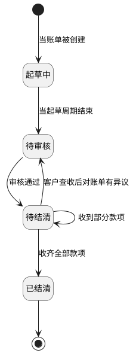

1. 账单生成任务首次抓取本期费项时创建应收账单，账单进入 `起草中`。
2. `起草中` 是账单起草周期。系统默认在账期即将结束时调用费项提取任务，也允许财务手动提前触发；本期最后一轮捞数成功后，账单结束起草并进入 `待审核`。
3. `待审核` 是财务审核窗口。账单进入该状态后，既有费项不允许直接改写；若发现缺失费项，允许补录；若发现本账单或往期账单费项有误，应通过调账中心发起冲正，且冲正记录全部审核通过后，账单才允许审核通过。
4. 财务审核通过后，账单进入 `待结清`。系统读取客户级账单配置中的客户邮箱并发送账单邮件；若未配置客户邮箱，系统不得自动发送邮件，并在应收账单列表的`通知状态`展示`未配置邮箱`标签；邮件发送失败时在应收账单列表的`通知状态`展示`通知失败`标签；邮件发送成功时展示`已通知`标签。`通知状态`不阻断账单进入待结清，财务可在待结清阶段触发系统重发邮件；如改用其他方式送达，应另记送达说明，不改变`通知状态`枚举口径。
5. `待结清` 是广义结算阶段，覆盖 `待结算` 和 `部分待结算` 等展示口径。客户未付款时保持待结算；收到部分款项时仍停留在待结清口径并更新已收 / 未收金额；收齐全部款项后进入 `已结清`。
6. `逾期未结清` 并非真实账单状态。待结清账单同时满足“未收齐全部款项”和“当前日期大于信用期结束日”时，命中 `逾期未结清` 筛选条件，并可在列表上展示对应标签；后续收齐全部款项后进入 `已结清`，自然退出该筛选结果。
7. 客户查收账单后对金额、费项或口径提出异议并要求修正时，账单可从 `待结清` 折返回 `待审核`；折返后的修正边界见`10.9.2 待结清异议与核销保护`。
8. `已结清` 是终态。账单全部款项闭环后仅保留查询、导出、对账和审计追溯，不再通过状态折返直接改写历史结果。
9. 应收账单进入 `已结清` 后，本系统应将数据源中与该账单关联的全部费项支付状态更新为`已支付`；若后续发生反核销或调账，不直接删除原同步结果，具体处理见`10.9.3 已结清账单差异`。

### 11.5 自动拆单

账期定义、理解和节奏示意见`7.3 账期定义与节奏`；本节只描述应收账单生成结果中的自动拆单规则。

1. 同一客户、同一账期内，业务板块或运抵国不同的费项必须拆成多张应收账单。
2. 拆分依据来自源订单的业务板块和运抵国，缺值则任务报错。
3. 同一账期拆出的账单互不影响，审核、发送、付款、核销均按账单维度独立进行。

### 11.6 账单配置

应收账单配置统一见`7. 客户级账单配置`。本模块只描述应收账单的生成结果、状态流转、账期展示、详情和导出，不重复维护配置口径。

### 11.7 客户侧费项索引

客户侧费项索引只服务应收账单和返款账单，费项名称由我司统一定义，用于财务导入、冲正和采集配置参考；不得被成本账单或成本明细引用。成本账单使用的成本费项索引见`13.5.2.2 客户侧与成本侧费项索引分域`。具体金额换算、汇率快照和多币种汇总规则见`14. 金额汇兑`。

### 11.8 关键交互

1. 财务可在起草中查看费项归集结果并补录遗漏费项。
2. 财务在待审核阶段处理冲正与审核。
3. 系统在账单审核通过后负责邮件发送，并以`通知状态`记录发送结果。
4. 财务在待结算、部分待结算账单中完成对账、核销与催收；`逾期未结清` 作为重要筛选条件用于快速定位超过信用期且未收齐款项的账单。

### 11.9 应收账单详情与账单特调汇率

应收账单详情页用于查看一张应收账单的结算结果、金额快照和汇率快照；涉及币种分桶、金额换算、往期冲正和本位币折算的规则统一见`14. 金额汇兑`。

#### 11.9.1 账单概况与金额展示

1. 页面顶部展示账单状态流转，包括 `起草中`、`待审核`、`待结清`、`已结清` 等主状态；`逾期未结清` 作为筛选条件或标签展示，不作为主状态展示。
2. 账单概况区展示账单编号、客户、运抵国、账期起止日、账单发送日、信用期结束日等基础信息。
3. 金额展示区仅展示账单计算后的结果，不在本章节重复定义币种分桶、汇率锁定和换算公式。
4. 同一张账单可以同时存在多个费项结算币种桶，页面仅按`14. 金额汇兑`口径回显各币种桶结果。
5. 账单应收金额区展示 `费项结算币种`、`原始应收金额`、`往期账单冲正`、`最终应收金额（费项结算币种）`、`最终应收金额（财务本位币）`。

#### 11.9.2 账单特调汇率页签与编辑弹窗

1. 账单特调汇率页签仅用于查看账单内已存在的货币对及其锁定结果。
2. 弹窗中的货币对列表必须来源于账单内已存在的费项货币对，不允许手工新增账单内不存在的货币对。
3. 货币对来源、换算方向、账单级锁定汇率和客户级默认汇率回显的规则统一见`14. 金额汇兑`；账单级锁定汇率配置不可关闭。
4. 页面保存后仅影响当前账单的金额换算结果，不回写历史账单。

说明：

1. “货币对一致，则必须汇兑方向一致，汇率一致”指的是同一账单内相同币种组合只能采用一个汇兑方向和一套汇率口径，不允许同一货币对同时出现两个方向或两个数值。
2. 账单级锁定汇率配置不可关闭。未人工调整时，页面展示账单生成时命中的客户级默认汇率；人工调整后，页面展示当前账单级锁定汇率。

#### 11.9.3 账单导出范围

1. 账单导出用于财务对账、客户核对和内部归档，只导出当前账单的可对账结果、费用明细、调账 / 冲正结果、币种汇总和核销记录。
2. 账单导出不支持导出账单历史快照，也不提供历史快照版本列表、历史配置快照、历史金额快照或历史汇率快照文件。
3. 历史快照只保留在系统内用于审计、追溯和防回写判断；由于财务和客户对账只关注当前生效账单结果，历史快照不作为导出对象。

### 11.10 账单编号

应收账单编号用于唯一识别客户在某一账期、某一拆分维度下形成的应收账单。

| 账单类型 | 前缀 | 结算主体 | 账期起始日 | 后缀 | 示例 |
| :--- | :--- | :--- | :--- | :--- | :--- |
| 应收账单 | ARB | 客户编号 | yyyymmdd | 业务板块+运抵国 MD5 截前 4 位 | `ARB-OG4155-20260101-fse3` |

规则：

1. 应收账单编号前缀固定为 `ARB`。
2. 结算主体取客户编号。
3. 账期起始日按 `yyyymmdd` 格式取当前应收账单账期开始日期。
4. 同一客户、同一账期内，若不同费项关联订单的业务板块或运抵国不同，必须拆成多张应收账单。
5. 应收账单后缀用于区分拆单维度，取 `业务板块 + 运抵国` 组合的 MD5 截前 4 位。

## 12. 返款账单模块

### 12.0 模块总览

返款账单模块用于管理 COD 包裹签收后的货款回收、货款返还、账单核销追踪和账单结清进度；币种、汇率与汇兑口径统一见`14. 金额汇兑`。

从产品视角看，本模块同时处理两条相互独立、但又彼此关联的线：

1. 包裹线：回答某个 COD 包裹当前是已回款、待回款，还是不回款；已返款、待返款，还是不返款。
2. 账单线：回答与该包裹相关的返款账单当前处于起草中、待审核、待结清还是已结清。

包裹状态与账单状态不做同名映射，包裹状态按回款管理口径计算，账单状态按返款账单处理进度计算。

### 12.1 需求背景

返款账单用于承载 COD 包裹签收后的货款回收与返还结算，统一管理签收返款和回款返款两种模式下的账单归集、核销追踪和账单结清；币种、汇率与汇兑规则统一见`14. 金额汇兑`。
当前业务上，绝大部分客户采用回款返款，签收返款仅用于少数客户的特殊约定场景。

### 12.2 核心概念

| 概念 | 定义 | 说明 |
| :--- | :--- | :--- |
| `回款` | 财务向尾程派送商回收 COD 货款 | 结果是把货款从派送商回收到货代侧。 |
| `返款` | 财务向寄件人返还 COD 货款 | 结果是把货款从货代侧返还给寄件人。 |
| `签收返款` | 收件人签收后，先返还、后回收 | 适用于需要先垫资的场景。 |
| `回款返款` | 收件人签收后，先回收、后返还 | 适用于先收到货款再返还的场景。 |
| `正常签收` | COD 包裹正常签收且进入回款 / 返款结算闭环 | 必须同时产生回款和返款动作。 |
| `异常签收` | COD 包裹发生拒收、退件或其他异常 | 不产生回款和返款动作，仅保留在回款管理中跟踪。 |
| `汇兑损益` | 到付币种与回款 / 返款币种不一致时的差额 | 在回款管理中计算与展示，具体口径见`14. 金额汇兑`。 |

关键规则：

1. 返款账单与应收账单可独立按各自账期运行，不要求同周期对齐。
2. 所有 COD 包裹均纳入回款管理；只有正常签收包裹进入回款、返款，并由回款管理计算汇兑损益，具体口径见`14. 金额汇兑`。

#### 12.2.1 返款相关字段关系

返款账单涉及两类金额来源：一类是订单创建、核价、改价过程中落在 `sale_order_header` 的订单侧金额；另一类是订单费项报表导入后汇总到 `sale_order_fee_detail` 的导入侧金额。两类字段可以用于同一订单的核对，但不能简单按字段中文名称互相替代。

`sale_order_fee_detail` 与 `sale_order_header` 的关联关系为：

```sql
sale_order_fee_detail.sale_order_id = sale_order_header.id
```

以测试订单 `1051651926` 为例，订单侧与导入侧当前数据如下：

| 订单号 | 代收货款<订单侧> | 代收货款手续费<订单侧> | COD金额<订单侧> | 货到付款手续费<订单侧> | 应收货款<导入侧> | 实回货款<导入侧> | 代收货款手续费<导入侧> |
| :--- | ---: | ---: | ---: | ---: | ---: | ---: | ---: |
| `1051651926` | `505` |  | `608` | `505` |  | `608` |  |

字段关系口径如下：

| 字段 | 字段中文名 | 来源层级 | 产品口径 | 订单 `1051651926` 校验结论 |
| :--- | :--- | :--- | :--- | :--- |
| `ofp_ofdb1.sale_order_header.collection_price` | 代收货款 | 订单侧 | 客户下单或改价时维护的 COD 代收货款本金，即货代代客户向收件人代收、后续应返给客户的货款本金。它不是客户应向货代支付的应收费用。 | 当前值为 `505`，表示本单代收货款本金为 `505`。 |
| `ofp_ofdb1.sale_order_header.collection_premium_amount` | 代收货款手续费 | 订单侧 | 订单侧记录的代收货款手续费。若返款账单需要扣减代收手续费，应作为扣减项理解，不应再作为应收账单可核销费用重复向客户收取。 | 当前为空，说明本单订单侧没有记录代收货款手续费。 |
| `ofp_ofdb1.sale_order_header.cod_price` | COD金额 | 订单侧 | 收件人侧到付 COD 总金额。该金额可能包含代收货款本金，也可能包含到付模式下折算到运抵国币种后的应收运费或其他到付费用，因此它不等同于应返给客户的货款本金。 | 当前值为 `608`。结合 `collection_price = 505`，本单 COD 总额大于代收货款本金，差额 `103` 应理解为到付金额中的非货款本金部分。 |
| `ofp_ofdb1.sale_order_header.cod_amount` | 货到付款手续费 | 订单侧 | 字段名容易被误读为手续费，但实际数据必须结合订单校验。若该字段值与 `collection_price` 相同，应按历史兼容或冗余货款本金字段处理，不能直接作为返款扣减手续费。 | 当前值为 `505`，与 `collection_price` 完全一致，不符合手续费语义；本单不得把该字段作为 `505` 的货到付款手续费扣减。 |
| `ofp_ofdb1.sale_order_fee_detail.collection` | 应收货款 | 导入侧订单级汇总 | 订单费项报表导入后汇总形成的订单级应返货款本金。这里的“应收货款”是从收件人/派送商侧应回收的货款事实，不是应收账单中的客户应付费用。若该字段有值，可作为返款账单应返货款本金来源。 | 当前为空，说明本次导入侧没有单独提供订单级应返货款本金。 |
| `ofp_ofdb1.sale_order_fee_detail.recovery_money` | 实回货款 | 导入侧订单级汇总 | 订单费项报表导入后汇总形成的实际回款金额。回款返款模式下，该字段是判断已回款、进入返款账单核销范围和核对回款金额的重要事实字段。 | 当前值为 `608`，与 `cod_price` 一致，说明本单导入侧实回金额按 COD 总额记录。 |
| `ofp_ofdb1.sale_order_fee_detail.receivable_collection_amount` | 代收货款手续费 | 导入侧订单级汇总 | 订单费项报表导入后汇总形成的代收货款手续费。返款账单中应作为返款扣减项；应收账单中只能关联展示，不参与应收核销，避免同一手续费重复结算。 | 当前为空或 `0`，说明本单导入侧没有形成代收货款手续费扣减。 |

由该订单可得出以下产品规则：

1. `collection_price` 表示应返货款本金；`cod_price` 表示收件人侧 COD 到付总额。两者可能相等，也可能不相等。
2. 当 `cod_price > collection_price` 时，差额不应自动认定为代收货款手续费；它可能是到付模式下折算后的运费或其他到付费用，具体归属应回到订单计费明细和应收账单口径判断。
3. `cod_amount` 虽然字段中文名是`货到付款手续费`，但订单 `1051651926` 中该字段等于 `collection_price`，因此不能仅凭字段名把它作为手续费扣减。
4. 返款账单生成时，应优先使用 `sale_order_fee_detail` 的导入侧事实字段识别回款和扣减；订单侧 `sale_order_header` 字段用于辅助核对、订单追溯和缺失数据排查。
5. 代收货款手续费的扣减口径应优先看 `sale_order_fee_detail.receivable_collection_amount`；若仅订单侧存在 `collection_premium_amount`，系统应明确来源并避免与导入侧手续费重复扣减。
6. `sale_order_fee_detail.collection` 和 `sale_order_fee_detail.recovery_money` 属于返款事实金额，不属于应收账单中的客户应付费用；即使字段名出现“应收货款”，也不得按应收账单费用处理。
7. 返款账单展示时，应把`订单侧金额`与`导入侧金额`分开展示或标注来源，避免财务把订单侧 COD 金额、订单侧代收本金、导入侧实回货款混为同一个口径。

#### 12.2.2 返款账单和应收账单的关联性

[🔗原型链接](http://localhost:10000/#id=zv5u49&p=%E8%BF%94%E6%AC%BE%E8%B4%A6%E5%8D%95%E5%92%8C%E5%BA%94%E6%94%B6%E8%B4%A6%E5%8D%95%E7%9A%84%E5%85%B3%E8%81%94%E6%80%A7&g=1)

返款账单和应收账单会共享同一批订单、包裹和 `fee_detail` 来源数据，因此两者在来源上有关联；但它们承载的结算目的不同，不是同一条账单线，也不能互相替代。

1. 应收账单回答“客户应向我方支付哪些费用、应付多少、已收多少、未收多少”。
2. 返款账单回答“COD 货款应向客户返还多少、从返款中扣减哪些费用、已返多少、未返多少”。
3. 同一订单可以同时出现在应收账单和返款账单中，但每个费项只能按自己的业务用途进入对应账单线，不能在两条账单线重复核销。

从原型示例看，在客户同时配置应收账单与返款账单、订单运抵国为台湾、返款模式为`回款返款`时，`fee_detail` 中同一订单会按费用用途拆成不同归属：

| 费项类型 | 应收账单处理方式 | 返款账单处理方式 | 口径说明 |
| :--- | :--- | :--- | :--- |
| 运费 | 进入应收账单并参与应收核销。 | 不进入返款账单。 | 运费是客户应付费用，只在应收侧结算。 |
| 代收货款 | 不进入应收账单。 | 进入返款账单并参与返款核销。 | 代收货款是需要返还给客户的货款本金，只在返款侧结算。 |
| 代收货款手续费 | 应收账单中仅记入并关联展示，不参与应收核销。 | 作为返款扣减项进入返款账单并参与返款核销。 | 该费用从应返货款中扣减，不能再要求客户通过应收账单重复支付。 |
| 重出费 | 应收账单中仅记入并关联展示，不参与应收核销。 | 作为返款扣减项进入返款账单并参与返款核销。 | 该费用从应返货款中扣减，不能再要求客户通过应收账单重复支付。 |

这里的`进入账单并参与核销`表示该金额会进入对应账单的应收 / 应返金额、已核销金额和未核销金额计算；`仅记入并关联展示`表示页面可以展示该来源与账单的关系，但该金额不进入当前账单的应收金额、已收金额、未收金额或核销进度。

账期归属规则：

1. 应收账单和返款账单各自按自己的配置、账期和触发时间生成，彼此不要求同账期。
2. 应收账单按`7. 客户级账单配置`中的履约节点归集来源数据；同一订单的应收费用落入哪一期应收账单，以应收账单生成口径判断。
3. 回款返款模式下，返款账单按回款时间归集来源数据；未产生回款时间的订单，不进入返款账单核销范围。
4. 同一订单的运费可能先进入某一期应收账单，代收货款、代收货款手续费和重出费可能因回款时间较晚，进入后续某一期返款账单。
5. 同一订单在应收侧显示的账期，与返款侧显示的账期可以不同；账期不同只表示两条账单线的结算时点不同，不表示来源数据不相关。
6. 原型中的`第N账期：核销`表示该费用进入对应账期账单并参与核销；`第N账期：仅记入但不核销`表示该费用在账单中保留关联展示，但不进入该账单的应收 / 应返核销金额；`--`表示该费用不进入该类账单。

归属与占用规则：

1. 同一来源费项必须先判断是否属于返款本金或返款扣减项；若属于返款本金或返款扣减项，应优先归入返款账单。
2. 已被返款账单占用并核销的扣减项，应收账单只能关联展示，不能再次作为应收费项核销。
3. 未命中返款规则、且属于客户应付费用的来源，才进入应收账单并参与应收核销。
4. 同一来源费项不得同时在应收账单和返款账单中作为可核销金额出现；若系统发现同时命中，应提示归属冲突，并按`返款扣减优先于应收收费`处理。
5. 费用是否已经被应收账单或返款账单占用，应在来源数据上保留可追溯标识，避免后续重跑、补录或修正时重复归集。

页面与明细展示需要让财务能够一眼判断“这笔费用在哪条账单线上结算”：

1. 应收账单明细中，应展示关联返款账单号、返款账单期次或占用状态；对于仅记入但不核销的费用，应明确表达为`仅记入但不核销`。
2. 返款账单明细中，应展示关联应收账单号、应收账单期次或关联状态；对于运费等不属于返款账单的费用，应显示为空或`--`。
3. 当同一订单同时存在应收账单和返款账单时，页面应按费项粒度展示归属结果，而不是只按订单粒度判断是否已入账。
4. 账单详情、账单导出和回款管理中展示的关联关系应保持一致，避免财务在不同页面看到不同归属。

修正边界如下：

1. 返款账单修正、重跑或折返审核的处理路径见`10.9.4 返款账单重跑`。
2. 返款账单的修正不得反向改写应收账单已核销金额；如确需影响客户应收结果，应按`10. 账单重跑机制`分流到调账、冲正或后续应收账单承接。
3. 应收账单修正不得把已由返款账单扣减并核销的费用重新纳入应收核销。
4. 若客户对同一订单的应收费用和返款扣减同时提出异议，应分别在应收账单线和返款账单线处理，并在两边保留关联账单号与处理结果。

### 12.3 货款回收与返还流程

本节描述的是 COD 包裹从签收到货款闭环的主业务链路，重点回答“先发生什么、后发生什么、在哪一步分流、在哪一步结算”。

1. 客户预报 COD 包裹，系统生成包裹记录及货款原始金额。
2. 包裹完成派送后，系统先判断签收结果：正常签收进入结算闭环，异常签收仅保留追踪状态。
3. 正常签收包裹再根据返款模式分流：`签收返款` 先返后回，`回款返款` 先回后返。
4. 财务在系统中确认回款和返款结果，系统同步更新包裹状态、账单状态和核销记录。
5. 若到付币种与回款 / 返款币种不一致，系统将回款 / 返款金额及快照交由回款管理计算汇兑损益，具体口径见`14. 金额汇兑`。

#### 12.3.1 COD货款回收与返还流程图

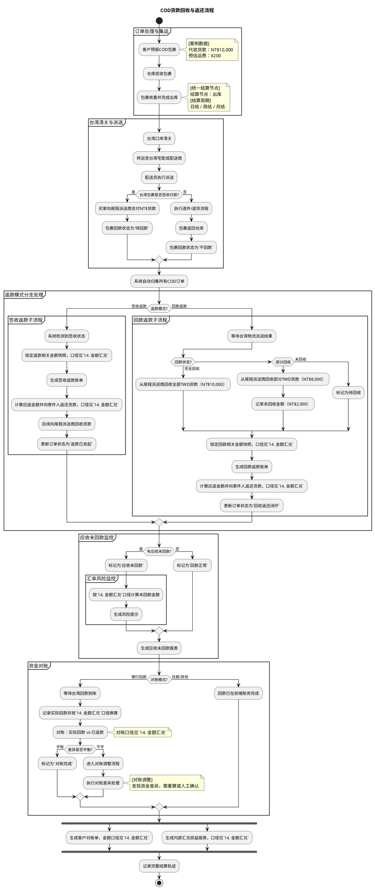

### 12.4 返款账单状态机

返款账单状态机与应收账单状态机保持同构，只描述账单本身的处理进度，不直接决定包裹的回款状态或返款状态。包裹状态必须按回款管理列表口径单独计算。

| 状态 | 定义 | 关键规则 |
| :--- | :--- | :--- |
| 起草中 | 按账期持续归集返款费项 | 账期即起草周期 |
| 待审核 | 结束起草，等待财务审核 | 冻结正常修改入口 |
| 待结清 | 审核通过，等待对寄件人的返款或对派送商的回款 | 支持部分返款、部分回款；客户查收账单后提出异议时，可折返回待审核修正 |
| 已结清 | 返款和回款全部完成 | 终态 |

补充规则：

1. 若账单内存在冲正记录，则必须待全部冲正记录审核通过后，账单才允许从待审核进入审核通过结论。
2. 冲正记录未全部审核通过时，账单仍应保留在待审核态，不得提前通过。
3. 冲正记录的审核统一在调账中心完成，账单侧只负责发起、展示和引用审核结果。
4. 返款账单不设置 `逾期未结清` 口径；逾期是针对应收账单客户信用期的筛选条件，不适用于返款账单。
5. 客户查收返款账单后对账单金额、扣减费项、回款 / 返款口径持有异议并要求修正时，账单可从 `待结清` 折返回 `待审核`。
6. 返款账单折返回 `待审核` 时，若已经存在部分回款、返款或扣减核销，系统必须保留原核销记录、核销币种、核销金额、汇率快照和操作轨迹，不得因状态折返删除或重置。
7. 返款账单核销完毕并进入 `已结清` 后，本系统应将数据源中与该返款账单关联的所有费项支付状态更新为`已支付`；支付状态同步不得改变原费项金额和账单历史结果。

#### 12.4.1 返款账单状态机图

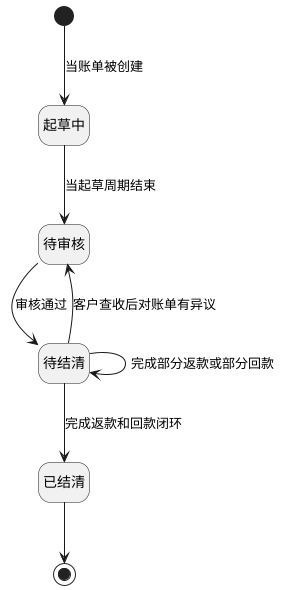

1. 账单生成任务首次抓取本期返款费项时创建返款账单，账单进入 `起草中`。
2. `起草中` 是账单起草周期。系统默认在账期即将结束时调用费项提取任务，也允许财务手动提前触发；本期最后一轮捞数成功后，账单结束起草并进入 `待审核`。
3. `待审核` 是财务审核窗口。账单进入该状态后，既有费项不允许直接改写；若发现缺失费项，允许补录；若发现本账单或往期账单费项有误，应通过调账中心发起冲正，且冲正记录全部审核通过后，账单才允许审核通过。
4. 财务审核通过后，账单进入 `待结清`。系统读取客户级账单配置中的客户邮箱并发送返款账单邮件；若未配置客户邮箱，系统不得自动发送邮件，并在返款账单列表的`通知状态`展示`未配置邮箱`标签；邮件发送失败时在返款账单列表的`通知状态`展示`通知失败`标签；邮件发送成功时展示`已通知`标签。`通知状态`不阻断账单进入待结清，财务可在待结清阶段触发系统重发邮件；如改用其他方式送达，应另记送达说明，不改变`通知状态`枚举口径。返款账单可在待结清阶段处理对寄件人的返款、对派送商的回款，以及扣减类核销。
5. `待结清` 是返款账单的广义结清阶段。完成部分返款、部分回款或部分扣减核销时，账单仍停留在待结清口径并更新已返 / 已回 / 未结清金额；完成返款和回款闭环后进入 `已结清`。
6. 返款账单没有 `逾期未结清` 口径。`逾期未结清` 只适用于应收账单客户信用期场景，不作为返款账单的状态、筛选条件或展示标签。
7. 客户查收账单后对金额、扣减费项、回款 / 返款口径提出异议并要求修正时，账单可从 `待结清` 折返回 `待审核`；折返后的修正边界见`10.9.2 待结清异议与核销保护`和`10.9.4 返款账单重跑`。
8. `已结清` 是终态。返款和回款全部闭环后仅保留查询、导出、对账和审计追溯，不再通过状态折返直接改写历史结果。
9. 返款账单进入 `已结清` 后，本系统应将数据源中与该账单关联的全部费项支付状态更新为`已支付`；若后续发生反核销或调账，不直接删除原同步结果，具体处理见`10.9.3 已结清账单差异`。

### 12.5 返款模式分支

返款模式以回款返款为主流路径，签收返款作为少数客户的例外配置存在。系统需同时支持两种模式，但页面默认表达和业务描述应优先围绕回款返款展开；涉及币种换算、汇率快照和回款管理中的汇兑损益口径统一见`14. 金额汇兑`。

本节只描述返款链路的分支方式，不改变包裹是否回款、是否返款的判定口径。

#### 12.5.1 签收返款（先返后回）

1. 系统识别到订单为正常签收。
2. 财务先向寄件人返还货款，金额口径与快照规则见`14. 金额汇兑`。
3. 系统按`14. 金额汇兑`计算应返金额，并将回款 / 返款金额供回款管理计算汇兑损益。
4. 返款完成后，再向尾程派送商发起货款回收，订单状态更新为回款闭环。

#### 12.5.2 回款返款（先回后返）

1. 系统等待尾程派送结果和派送商回款结果。
2. 按完全回款、部分回款、未回款三类记录回款状态。
3. 财务确认回款到账后，系统按`14. 金额汇兑`锁定相关快照并计算应返金额，相关汇兑损益由回款管理计算。
4. 完成回收后生成回款返款账单，并向寄件人发起货款返还。
5. 订单状态更新为回款返款闭环。

### 12.6 账单配置

返款账单配置统一见`7. 客户级账单配置`。本模块只描述返款账单的生成结果、返款模式、状态流转、回款管理和报表输出，不重复维护配置口径。

### 12.7 返款账单详情

返款账单详情页是账单视角页面，用于集中展示订单级返款账单的结算结果和核销轨迹。它只回答一张账单“怎么算、算到哪一步、核销到哪一步”，不负责判断包裹是否已回款、已返款；包裹级状态请到回款管理查看。涉及货款结算币种、回款 / 返款换算和汇率快照的规则统一见`14. 金额汇兑`。

页面展示区块如下：

1. 账单信息区：货款结算币种、返款金额、回款金额、未回款金额、账单状态。
2. 返款明细区：来自 `sale_order_fee_detail` 的订单级返款明细。
3. 扣减费项区：基础运费、代收服务费等可直接扣减费项。
4. 核销记录区：每笔回款或扣减动作的核销轨迹。
5. 账单特调汇率区：锁定快照和换算结果，具体口径见`14. 金额汇兑`。

### 12.8 回款管理

[🔗原型链接](http://localhost:9999/start.html#g=1&id=36g8f0&p=%E5%9B%9E%E6%AC%BE%E7%AE%A1%E7%90%86&g=1)

回款管理是包裹视角列表，用于查看所有 COD 包裹的回款状态、返款状态、汇兑损益和对账状态。它只回答一个包裹“是否已回款、是否已返款、是否需要跟踪”，不承载返款账单本身的结算流程；返款账单只作为回款状态判定和追溯依据被关联引用。列表主粒度为尾程包裹，回款明细行数据来自订单费项报表导入后沉淀的 `sale_order_package_fee`。回款管理负责回款 / 返款金额换算、汇率快照和汇兑损益计算，具体口径见`14. 金额汇兑`。回款管理不提供单独的回款导入入口。

这一页的核心不是“再算一遍账”，而是把包裹级事实、关联账单结果和对账状态放到同一张列表里，方便财务按包裹追踪全链路。

页面以尾程包裹为主粒度展示回款事实、返款事实和结算结果；回款明细行数据来源于 `sale_order_package_fee`，系统汇总口径对应 `sale_order_fee_detail`。

#### 12.8.1 页面目标

1. 以尾程包裹为主粒度，关联运单和订单信息，集中展示回款状态、返款状态和结算结果。
2. 回款数据直接来源于订单费项报表导入后的 `sale_order_package_fee` 明细，不在回款管理内二次导入。
3. 支持快速识别已回款、待回款、不回款，以及已返款、待返款、不返款，并覆盖所有 COD 包裹的状态跟踪。
4. 支持从列表直接定位关联返款账单，并追踪核销结果。

#### 12.8.2 页面结构与字段

| 区域 | 字段 / 操作 | 说明 |
| :--- | :--- | :--- |
| 操作区 | `查看汇兑损益` | 勾选后展示汇兑损益相关的红色表头字段，具体金额口径见`14. 金额汇兑`。 |
    | 基础信息列 | 尾程运单号、所属内部订单、所属客户、所属店铺、签收状态、签收时间、货款原始金额、尾程派送商、回款状态、返款状态、回款时间、返款时间、回款快照、返款快照、实回货款金额、实返货款金额 | 用于定位运单、确认签收与回款 / 返款事实，并作为回款核对依据。 |
    | 返款信息列 | 返款模式、关联返款账单、应返货款金额 | 用于展示返款动作和结算结果，具体口径见`14. 金额汇兑`。 |

#### 12.8.3 业务规则

回款状态和返款状态是包裹级状态，返款账单状态是账单级状态，两者不互相替代，只存在关联关系。

包裹状态判定优先级如下：

1. 先判定签收结果。异常签收优先落为 `不回款` 和 `不返款`，并直接忽略返款账单状态。
2. 再判定回款明细。正常签收包裹若包裹级回款明细满足入账条件，则回款状态为 `已回款`，否则为 `待回款`。
3. 再判定返款账单结清结果。正常签收包裹若其所属业务主单挂靠的返款账单已结清，则返款状态反推为 `已返款`，否则为 `待返款`。
4. 返款账单结清结果只影响返款状态反推，不反向改写回款状态；回款状态只看回款明细，不看账单是否已结清。

1. 所有 COD 包裹都必须同时有回款状态和返款状态，且两者均与返款账单状态解耦。
2. 回款状态仅取值 `已回款`、`待回款`、`不回款`。
3. 返款状态仅取值 `已返款`、`待返款`、`不返款`。
4. 异常签收的 COD 包裹固定为 `不回款` 和 `不返款`。
5. 正常签收的 COD 包裹，尾程运单号出现在 `ofp_ofdb1.sale_order_package_fee` 且 `ofp_ofdb1.sale_order_package_fee.recovery_money` 非空非零时，回款状态为 `已回款`，否则为 `待回款`。
6. 正常签收的 COD 包裹，其所属业务主单挂靠的返款账单已结清时，返款状态反推为 `已返款`，否则为 `待返款`。
7. 返款模式为签收返款时，先返还后回收。
8. 返款模式为回款返款时，先回收后返还。
9. 关联返款账单应可点击跳转到对应账单详情，便于核销追溯。
11. 订单费项报表导入后，系统应同步刷新列表状态、账单核销记录和未回款监控。

#### 12.8.4 状态联动

1. 正常签收包裹的回款状态和返款状态，分别按`12.8.3 业务规则`独立计算，不因返款账单主状态直接变化。
2. 返款账单从待结清进入已结清，只表示对应业务主单的返款闭环完成，不代表所有包裹状态同步变更。
3. 异常签收包裹固定显示为 `不回款` 和 `不返款`，并保留在回款管理列表中。
4. `查看汇兑损益` 打开时，页面展示的损益字段应保持与回款 / 返款锁定快照一致，不随市场汇率刷新；异常签收行和同币种行是否展示，按`14. 金额汇兑`处理。

### 12.9 报表输出

系统需输出：

1. 客户对账单。
2. 内部汇兑损益报表。
3. 应收未回款报表。
4. 完整结算轨迹。

### 12.10 账单编号

返款账单编号用于唯一识别客户在某一账期下形成的 COD 货款返款账单。

| 账单类型 | 前缀 | 结算主体 | 账期起始日 | 后缀 | 示例 |
| :--- | :--- | :--- | :--- | :--- | :--- |
| 返款账单 | PCB | 客户编号 | yyyymmdd | 无 | `PCB-OG4155-20260101` |

规则：

1. 返款账单编号前缀固定为 `PCB`。
2. 结算主体取客户编号。
3. 账期起始日按 `yyyymmdd` 格式取当前返款账单账期开始日期。
4. 返款账单不因业务板块或运抵国生成编号后缀；若后续出现返款账单拆分需求，应在返款账单配置和编号规则中同步补充拆分维度。

## 13. 成本中心

### 13.1 定位、对象与边界

成本中心用于财务核对供应商收费、沉淀内部成本，并把成本归属到实际承接业务的尾程包裹或业务订单。它依次回答四个问题：供应商收取了哪些费用、费用来源是否可信、费用应归属到哪些业务对象、归属后的成本对报价覆盖和利润产生什么影响。

本章涉及的核心对象及其关系如下：

| 核心对象 | 业务含义 | 与其它对象的关系 |
| :--- | :--- | :--- |
| 成本账单 | 即供应商账单，是供应商某一账期收费结果在 BMS 中的登记和核对记录。 | 一次成功导入形成一张成本账单，并产生逐行成本明细。 |
| 成本费项索引 | BMS 按成本板块维护、供内部统一使用的常规成本费项。 | 供应商原始费项名称先映射到成本费项索引，再形成成本明细；不与客户侧费项索引混用。 |
| 成本明细 | 从供应商账单原始行生成或由财务直接补录的单项成本记录。 | 全部进入 `BMS费项池`，并保留原始金额、币种、来源和业务识别信息。 |
| 成本池 | `BMS费项池`中承接应付类成本明细的业务集合。 | 负责成本识别、归属、分摊和后续分析，不等同于成本账单。 |
| 直接成本 | 能够明确归属到尾程包裹或业务订单的成本。 | 直接落到相应业务对象。 |
| 间接成本 | 无法直接归属到单个业务对象，需要先圈定业务范围再分摊的成本。 | 进入唯一的间接成本分摊池，再分摊到业务订单；不分摊到尾程包裹。 |

成本处理主线依次为“供应商资料 → 成本费项标准化 → 供应商账单导入 → 成本明细入池 → 直接归属或间接分摊 → 成本完整性确认 → 报价覆盖和利润分析”。成本账单导入成功后即可登记结清，结清与成本归属并行推进；结清或成本事实发生差错时再进入调账。后续各节按这一主线和并行关系展开。

成本中心中凡需同时选择开始日和结束日的录入或筛选字段，统一使用日期范围控件一次确认起止日期，不拆分为两个相互独立的单日控件；只表达一个业务日期的字段继续使用单日控件。

成本中心遵循以下边界：

1. 成本账单和成本池均面向内部供应商收费核对，不面向客户，也不进入客户对账报表。
2. 成本处理可以引用应收账单、返款账单所涉及的业务订单和尾程包裹，但不得反向修改客户侧账单金额或对账结果。
3. BMS 记录供应商账单及其结清事实，不承接供应商付款申请、付款审批或实际付款执行。
4. BMS 不维护供应商价卡，不复算供应商计价结果，也不以系统推算金额替代财务对供应商原账单的核对。
5. 本期只预留`暂估成本`概念，不实现暂估成本的录入、计算、分摊、冲销或转实际。

### 13.2 成本归集链路总览

以下归集图先呈现成本中心的完整数据链路，后续章节再分别展开每个环节。五大成本板块是供应商账单的导入场景，不是五套独立账单，也不直接决定成本类型。每条导入明细均进入成本池并保留原始字段快照和标准成本字段；其中，直接成本直接归属到业务订单或尾程包裹，间接成本经分摊后只归属业务订单。

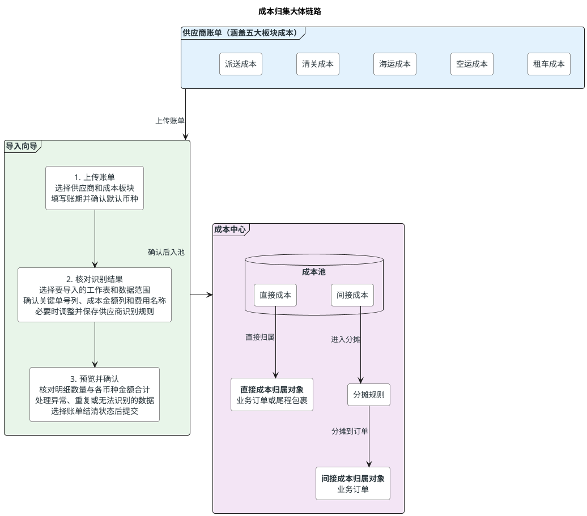

`原始字段快照`用于还原供应商账单原貌和辅助核对，`标准成本字段`用于金额汇总、业务匹配、成本类型判断和分摊。尾程包裹只承接能够明确归属的直接成本；间接成本统一分摊到业务订单。具体分摊范围、分摊因子和计算方式见`13.7 间接成本分摊`。

### 13.3 财务主流程

在进入字段和规则细节前，本节先说明财务日常处理供应商账单的主流程。财务从确认供应商资料开始，依次完成账单导入、成本核对和结清登记；字段识别、成本匹配和分摊属于核对过程，不产生额外账单状态。

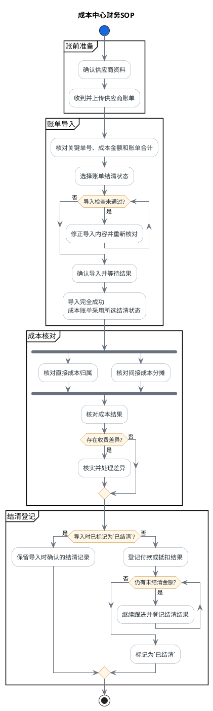

图中只呈现财务日常操作的主干，具体要求在后文展开：供应商资料见`13.4 供应商管理`，账单导入见`13.5 成本费项标准化与供应商账单导入`，成本归属和分摊见`13.6 成本识别与归属`及`13.7 间接成本分摊`，结清与差错处理见`13.8 成本账单结清与调账`。直接成本和间接成本可以并行核对；账单结清状态不替代成本归属、分摊或完整性确认。

### 13.4 供应商管理

主流程从供应商资料开始。供应商管理用于建立 BMS 成本核对所需的供应商财务档案，使财务在导入账单前，先确认供应商身份、成本账期和默认金额口径。这里的`成本账期类型`描述供应商账单通常覆盖的业务周期，不代表供应商信用账期，也不触发付款排程。

#### 13.4.1 供应商财务档案

每个供应商财务档案至少包含以下字段：

| 信息分组 | 业务字段 | 规则 |
| --- | --- | --- |
| 基本信息 | `供应商编码*`、`供应商名称*`、`供应商状态*` | 供应商编码必须唯一；状态包括`启用`和`停用`。停用后不再允许新建导入任务或成本账单，已经存在的成本账单仍可继续完成成本归集和结清登记。 |
| 成本范围 | `适用成本板块*`、`默认币种*` | 成本板块可多选派送成本、清关成本、海运成本、空运成本和租车成本；默认币种用于供应商侧账单未提供币种字段时的导入默认值。 |
| 成本账期 | `成本账期类型*`、`账期参数`、`生效开始日*`、`生效结束日` | 成本账期类型支持`周`、`半月`、`月`、`自然天`和`不固定`；账期参数根据类型动态填写。 |
| 辅助信息 | `备注` | 用于记录供应商对账口径、账期例外或其它需要财务关注的信息。 |

带`*`的字段为必填字段。成本账期类型按以下规则解释：

1. `周`按连续自然周标记，并维护每周起始星期。
2. `半月`按每月 1 日至 15 日、16 日至月末标记。
3. `月`按自然月标记。
4. `自然天`按连续天数滚动，必须维护天数和首个账期开始日。
5. `不固定`适用于供应商不按固定周期出账的场景，每次导入时由财务填写实际成本账期。

同一供应商在任一日期只能存在一套生效中的成本账期配置，生效周期不得重叠。成本账期配置用于导入时预填和校验账期范围，不直接替代供应商侧账单上的实际账期。实际账期与供应商默认账期不一致时，财务可以调整本次导入账期并填写差异说明；调整只影响当前导入任务。

#### 13.4.2 供应商列表与金额统计

供应商列表至少展示以下信息：

| 信息类型 | 业务字段 |
| --- | --- |
| 供应商识别 | `供应商编码`、`供应商名称`、`供应商状态`、`适用成本板块` |
| 账期标记 | `成本账期类型`、`当前成本账期`、`默认币种` |
| 账单统计 | `成本账单数`、`待结清账单数`、`已结清账单数`、`待结清金额`、`已结清金额`、`累计成本金额` |
| 最近动态 | `最近账期`、`最近账单编号`、`最近账单状态`、`最近更新时间` |

金额统计遵循以下口径：

1. 统计范围跟随页面选择的成本账期范围；未选择范围时展示该供应商全部历史数据。
2. 所有金额按币种分别统计和展示，同一统计字段存在多个币种时按币种分行呈现，不同币种不得直接相加为单一总额。
3. `待结清金额`汇总待结清成本账单尚未完成结清登记的金额。
4. `已结清金额`汇总已完成结清登记的金额，包括待结清账单中的部分结清金额和已结清账单的全部结清金额。
5. `累计成本金额`汇总该供应商全部成本账单的账单金额，不区分是否已经结清；不得与`已结清金额`混用。
6. 成本账单状态或结清金额发生变化后，系统按最新结果重新统计，待结清金额与已结清金额不得重复计算同一金额。
7. 金额统计以成本账单及其结清记录为数据来源；尚未归入成本账单的成本池明细不进入上述账单金额统计。

`当前成本账期`根据当前日期和供应商成本账期配置计算；账期类型为`不固定`时，展示最近一次实际成本账期，尚无成本账单时展示为空。

页面支持按供应商编码、供应商名称、供应商状态、成本板块、成本账期类型和成本账期范围组合筛选。财务可新增、编辑、启用、停用和查看供应商财务档案；已被导入任务、成本明细或成本账单引用的供应商不得删除。

#### 13.4.3 与账单导入及成本账单的关系

1. 供应商侧账单导入第一步只展示启用中的供应商，并带出其适用成本板块、默认币种和当前成本账期。
2. 一次成功导入对应一份供应商独立账单文件，并形成一张成本账单；该文件必须只对应一个供应商和一个实际成本账期。供应商默认账期只提供预填和差异校验，不改变本次导入确认的实际账期。
3. 供应商财务档案变更只影响后续新建的导入任务和成本账单，不回写历史导入任务、历史成本明细或历史成本账单。
4. 从供应商列表进入详情时，可查看该供应商各币种金额统计、最近成本账单和对应成本账期，并跳转到筛选后的成本账单列表。

### 13.5 成本费项标准化与供应商账单导入

#### 13.5.1 背景与总体方案

供应商资料确认后，财务从成本账单列表发起供应商账单导入，系统通过弹窗承载导入向导；账单导入不设置独立菜单或独立页面。供应商给出的账单没有统一格式；不同供应商、同一供应商的不同业务板块，甚至同一文件的不同 sheet，都可能使用不同的表头、金额列、单号列、汇总方式和辅助说明。部分业务辅助识别字段本身也没有稳定定义，要求财务先理解并重制为统一模板，会产生大量重复整理工作，也容易因复制、拆行、改名或漏列造成金额和单号失真。

现有供应商侧账单的文件结构、工作表用途、关键单号、金额字段及直接成本与间接成本特征，详见[供应商侧账单样本分析](derivant/供应商侧账单样本分析.md)。该文档作为本方案的样本分析依据，不替代本章规定的产品需求。

因此，成本费项导入不以“财务先把原文件改成统一模板”为前提。产品应把标准化动作放在导入向导和系统入池过程中：财务保留供应商原始文件，只明确系统形成成本明细所必需的字段；系统负责保存映射结果、生成标准成本明细，并保留其余原始信息以供追溯。

#### 13.5.2 导入边界与标准化基础

本节先明确原始文件进入 BMS 的总体边界，再定义客户侧与成本侧费项分域，以及供应商原始名称向常规成本费项的映射方式。完成这些前置约束后，后续字段配对和导入向导才能形成稳定、可追溯的成本明细。

##### 13.5.2.1 总体导入原则

1. 财务直接上传供应商原始文件，不要求删除列、调整列顺序、修改表头或另行制作统一模板。
2. 五大成本板块只作为导入场景预设，用于提供更贴近原文件的字段识别建议，不代表财务必须先套用五套模板。
3. 财务在导入向导中必须明确`成本金额`字段，并明确`关键单号`字段及其类型；原文件确实没有可用关键单号时，必须显式选择`无关键单号`，成本类型固定判定为`间接成本`。系统不能仅凭列名猜测后直接入池。
4. 财务只需确认影响金额归集和业务匹配的必要信息。供应商原文件中的收件信息、车种、柜型、目的港、备注等不稳定字段，不要求财务逐项整理为 BMS 固定列。
5. 标准化后的成本明细和供应商原始行必须保持可追溯关系；一个原始行可以展开为多条成本明细，但每条明细都必须能回到原始文件中的对应数据和来源金额列。
6. 原始文件、字段映射和入池结果共同构成成本来源依据。成本账单已结清后，不得通过重新上传或修改映射静默覆盖原有结果。
7. 一次导入只处理一份供应商独立账单文件，并且只对应一个供应商和一个实际成本账期；一次完全成功的导入形成一张成本账单。一个导入文件不得包含多个供应商。若收到的文件混合了多个供应商，财务必须先按供应商拆分为相互独立的文件，再分别选择对应供应商发起多次导入；系统不在导入向导内拆分供应商数据，也不允许通过选择不同数据范围把同一混合文件分批导入。
8. 供应商账单导入采用整批原子处理。财务确认的数据范围必须全部成功写入，任务才算`导入成功`；任一应导入数据写入失败时，整批任务为`导入失败`，不得保留部分成本明细或形成部分金额的成本账单。
9. 系统应识别疑似重复上传，但允许财务确认后再次导入。重复导入形成新的导入任务和成本账单，并通过成本账单编号后缀保持唯一；系统不得因编号不同而取消重复风险提示。

##### 13.5.2.2 客户侧与成本侧费项索引分域

BMS 将费项索引划分为`客户侧费项索引`和`成本费项索引`两个相互独立的业务域。两者在命名来源、适用账单和唯一性口径上均不同，不得仅通过同一张费项列表中的费用类型筛选来混合维护。成本费项索引以五大成本板块标签卡作为常规成本费项的一级浏览入口；切换板块后，关键词和状态条件只筛选当前板块内的费项，不再重复提供成本板块下拉筛选。

| 对比项 | 客户侧费项索引 | 成本费项索引 |
| :--- | :--- | :--- |
| 名称来源 | 由我司统一定义，不使用供应商原始名称。 | 由我司按供应商收费含义归一形成内部标准名称，供应商原始名称通过导入设置快照中的费项映射接入。 |
| 适用账单 | 应收账单、返款账单。 | 仅成本账单。 |
| 费项类型 | 可使用`应收类`、`应收扣减类`、`代收类`、`代付类`和`非费项`。 | 固定为`应付类`。 |
| 业务分组 | 按业务场景、挂靠对象和订单来源配置。 | 必须归属且只归属一个成本板块。 |
| 同名规则 | 由我司按客户侧业务含义控制名称和编码唯一性。 | 不同成本板块允许同名，同一成本板块内不允许存在两个启用中的同名费项。 |
| 维护入口 | `9.5 客户侧费项配置工作台整合方案`。 | 成本中心的成本费项索引维护入口。 |

成本费项索引遵循以下规则：

1. 每个成本费项索引必须归属于派送成本、清关成本、海运成本、空运成本或租车成本中的一个成本板块，不允许一个索引同时跨多个板块。
2. 不同成本板块可以存在相同的内部标准名称。例如空运成本和海运成本都可以维护名为“运费”的费项，但两者必须使用不同的费项编码，分别参与各自板块的导入、统计和分摊。
3. 成本费项编码在成本中心内全局唯一，建议包含成本板块特征；内部标准名称在同一成本板块内唯一。唯一性判断不跨成本板块比较名称。
4. 同一费用含义横跨多个成本板块时，应按成本板块分别建立成本费项索引，不得为了复用名称而让一条成本费项跨板块引用。
5. 供应商原始费项名称不得直接作为成本费项索引。财务应先确认其业务含义，再通过`13.5.2.3 导入设置快照中的费项映射`指向对应成本板块的成本费项索引。
6. 客户侧费项索引不得被成本账单、成本明细或导入设置快照中的费项映射引用；成本费项索引不得被应收账单、返款账单、客户级账单配置或客户侧场景取值规则引用。
7. `BMS费项池`中的每条费项只能引用一个索引域。进入应收账单或返款账单的费项引用客户侧费项索引；进入成本账单的费项引用成本费项索引，不得同时引用两类索引。
8. 已被成本明细、导入设置快照中的费项映射、分摊池或历史账单引用的成本费项索引不得物理删除，只允许停用。停用只影响后续导入、补录和分摊配置，不改写历史快照。

成本费项索引至少包含以下字段：

| 字段 | 规则 |
| :--- | :--- |
| 成本费项编码 | 必填，在成本中心内全局唯一；启用并被引用后不得修改。 |
| 内部标准名称 | 必填，同一成本板块内唯一；不同成本板块允许同名。 |
| 成本板块 | 必填且单选，枚举为派送成本、清关成本、海运成本、空运成本、租车成本。 |
| 业务定义 | 必填，说明该成本费项包含和不包含的供应商收费内容，作为导入设置快照中的费项映射和财务确认依据。 |
| 状态 | 必填，枚举为`启用`、`停用`。 |
| 备注 | 记录板块内的特殊核算口径。 |

分摊因子不直接维护在成本费项索引上。可能作为间接成本的标准成本费项，应按`13.7.3 分摊规则与因子选择`单独维护基础分摊规则或供应商特调分摊规则，使费项定义与具体分摊场景相互独立。

##### 13.5.2.3 导入设置快照中的费项映射

不同供应商可能使用不同名称表达同一项费用。例如同一清关税费，供应商 A 可能写作“税费”，供应商 B 写作“税金”，供应商 C 写作“关税”。若财务按供应商原始名称分别建立成本费项索引，会造成同一成本被拆成多个统计口径；若系统仅按名称相似度自动合并，又可能把含义不同的税种错误归为一项。

因此，成本中心采用“统一常规成本费项 + 导入设置快照中的费项映射”的方式管理：

1. `常规成本费项`是成本费项索引中的内部标准费项，`费项类型`固定为`应付类`，用于成本汇总、归属、分摊和利润分析。财务不得仅因供应商名称不同而在同一成本板块内重复建立成本费项索引。
2. `供应商原始费项名称`是供应商账单中实际出现的表头名称或行级费用名称，必须原样保留，不因映射而被覆盖。
3. `导入设置快照中的费项映射`用于把供应商原始费项名称指向同一成本板块下的常规成本费项。基础映射口径为`供应商 + 成本板块 + 供应商原始费项名称 → 成本费项索引`。
4. 当同一供应商在不同文件结构或工作表中使用相同名称表达不同含义时，映射口径应增加`文件结构特征`或`工作表`加以区分。系统不得以全局同义词规则覆盖供应商差异。
5. 多个供应商原始名称可以映射到同一个常规成本费项；同一个原始名称在不同供应商或不同成本板块下可以映射到不同常规成本费项。
6. 同一映射口径在任一时点只能存在一条启用中的映射。映射被历史导入引用后不得物理删除；修改或停用时生成新版本，只影响后续导入。
7. “税费”“税金”“关税”等名称相近的费项只有在财务确认业务含义一致时才能映射到同一常规成本费项。若供应商能够区分进口关税、增值税或其它税费，且这些费用需要分别核算，应建立不同的常规成本费项，不得为了减少费项数量强行合并。

导入设置快照中的费项映射可在供应商财务档案或常规成本费项详情中维护，也可由财务在导入向导中首次确认后保存。每条映射至少记录：

| 字段 | 规则 |
| :--- | :--- |
| 供应商 | 必填，限定该别名的供应商范围。 |
| 成本板块 | 必填，枚举为派送成本、清关成本、海运成本、空运成本和租车成本。 |
| 供应商原始费项名称 | 必填，保留供应商使用的原始文本；系统可以另存去除首尾空格、统一全半角和大小写后的匹配文本，但不得改写原文。 |
| 常规成本费项 | 必填，只能选择与当前成本板块一致且处于启用状态的成本费项索引。 |
| 文件结构特征 / 工作表 | 条件必填；同一供应商、同一成本板块下的同名费项存在不同含义时，用于缩小适用范围。 |
| 状态 | 必填，枚举为`启用`、`停用`。 |
| 生效信息 | 记录版本、生效时间、创建人、最近确认人和最近确认时间。 |
| 说明 | 首次映射、同名异义或映射调整时填写业务口径。 |

导入时按原始文件结构分别处理：

1. 费项名称位于金额列表头时，系统优先按当前供应商最近一次兼容的导入设置快照识别该金额列对应的常规成本费项，并同时保留原始列表头。
2. 费项名称位于数据行时，系统按供应商、成本板块和原始费项名称查找启用中的导入设置快照中的费项映射；存在文件结构或工作表限定时，必须同时满足限定条件。
3. 未命中已确认的供应商导入设置快照时，系统可以根据名称相似度推荐候选常规成本费项，但推荐结果不得直接入池，必须由财务确认。
4. 财务可以把本次确认结果保存为导入设置快照中的费项映射；本次最终确认的完整导入设置必须形成供应商导入设置快照，供该供应商后续导入预填，但仍须在预览中展示原始名称和映射结果。
5. 无法确认的原始费项不得被静默归入名称最接近的费项。财务必须选择映射到现有常规成本费项、新建常规成本费项、映射到启用中的`其他成本`并填写说明，或排除该字段 / 数据行；未完成处理时不得确认导入。
6. 每条入池成本明细必须同时保存供应商原始费项名称、常规成本费项、映射方式、映射版本、确认人和确认时间。历史成本明细始终使用导入时的映射快照，不随导入设置快照中的费项映射变更而改写。

五大成本板块作为导入场景预设，决定系统优先推荐哪些关键单号、成本金额和辅助识别字段，但不限定供应商文件的实际字段，也不直接决定费用属于直接成本还是间接成本。

| 导入场景 | 建议优先识别的关键单号 | 建议优先识别的成本金额 | 默认归集判断 |
| :--- | :--- | :--- | :--- |
| 派送成本 | 尾程运单号、追踪号、转单号、出货单号、明细表号、请款书号 | 派送费、超大或超才费、偏远费、跨区费、转发费、手续费 | 能匹配尾程包裹或业务订单的作为直接成本；批量补差、货故、车趟或无法匹配包裹的费用作为间接成本进入分摊池。 |
| 清关成本 | 清关条码、主提单号、分提单号、报单号、税单号、柜号、规费或处罚编号 | 清关费、税金、报关费、仓租、规费、罚款、移仓费、退运费 | 能定位到分提单、税单、报单或明确业务对象的作为直接成本；只能定位到主提单、柜号、批次或账期的作为间接成本进入分摊池。 |
| 海运成本 | 提单号、柜号、报关单号 | 海运费、拖柜费、报关费、续单费、操作费 | 能定位到明确业务对象的作为直接成本；整票、整柜或集运线路级费用作为间接成本进入分摊池。 |
| 空运成本 | 提单号、磅单号、账单号 | 空运费、提单费、收送或打包费、中港段费、报关费、压夜或查验费 | 能定位到明确业务对象的作为直接成本；提单、磅单、航班或批次级费用作为间接成本进入分摊池。 |
| 租车成本 | 车次号；原文件没有车次号时保留月份、发车地、车种和集运线路等辅助信息 | 车辆费用、搬运费用、月度或车次汇总金额 | 能定位到明确车次及其业务范围时按该范围归集；只有月份、地区、车种或线路汇总的作为间接成本。 |

同一成本板块可以同时包含直接成本和间接成本。系统不得仅按导入场景自动确定`成本类型`或最终归属，仍须依据供应商侧单号关系、费用覆盖范围和财务确认结果判断。

#### 13.5.3 字段分层与入池粒度

导入数据按以下三层管理：

| 数据层级 | 内容 | 形成方式 | 主要用途 |
| :--- | :--- | :--- | :--- |
| 本次导入标准字段 | 供应商、供应商侧账单号、成本账期、成本板块、默认币种、原始文件 | 财务在上传时统一设置，或由系统从已确认配置中带出 | 确定账单归属和本次导入范围 |
| 财务标准化字段（行级） | 关键单号类型、关键单号、供应商原始费项名称、常规成本费项、费项映射版本、成本金额、币种、金额方向、费项类型、成本类型、成本归属方式、匹配状态 | 财务映射关键列，系统按映射结果逐行或逐金额列生成 | 参与 `BMS费项池` 匹配、汇总、分摊和结清，并保留供应商原始口径 |
| 非财务标准化字段 | 供应商原始行中除已映射字段外的所有列名和列值 | 系统按原始表头完整保留，不要求财务改名或补齐 | 用于人工识别、异常复核、来源追溯和后续字段升级 |

`费项类型`固定为`应付类`，用于表达该成本明细进入成本账单后的财务归集方向；`成本类型`枚举为`直接成本`、`间接成本`，用于表达成本能否直接归属到尾程包裹或业务订单。二者是相互独立的业务字段，不存在命名或口径混淆，也不得互相替代。

`成本归属方式`枚举为`直接归属尾程包裹`、`直接归属业务订单`、`进入间接成本分摊池`、`待人工确认`；`匹配状态`至少包括`待系统匹配`、`已匹配`、`无法匹配`、`待人工确认`。系统可以根据供应商侧单号关系提出建议，但财务确认导入前必须确认成本类型和成本归属方式。

`关键单号`和`成本金额`是财务在行级需要重点明确的核心标准化内容，但不能只存储两个孤立值；原文件没有可用关键单号时，应记录财务确认的`无关键单号`结果：

1. 原文件存在`关键单号`时，必须同时记录`关键单号类型`，例如尾程运单号、主订单号、提单号、分提单号、柜号、报单号或税单号；相同字符在不同单号类型下不得直接视为同一业务对象。
2. 同一行存在多个可用单号时，财务可指定一个主关键单号和多个辅助关键单号。主关键单号用于优先匹配，辅助关键单号用于缩小匹配范围和人工复核。
3. `成本金额`必须同时明确币种、金额方向和对应的常规成本费项。币种可由本次导入统一设置；若原文件存在多币种，则必须映射币种列或分别设置。
4. 同一原始行存在多个金额列时，财务可以一次选择多个成本金额列，并分别指定对应的常规成本费项；系统应自动展开为多条成本明细，不要求财务手工复制和拆行。
5. 原始文件只有汇总金额且没有可用关键单号时，允许关键单号为空，但成本类型必须为`间接成本`；成本归属方式可以先标记`待人工确认`，或直接选择符合范围的分摊池，不得虚构订单号或包裹号。

`BMS费项池`采用`一行一项成本费项`的入池粒度，供应商原始文件无需预先满足该结构：

1. 原始行只对应一个费用金额时，系统生成一条标准成本明细。
2. 原始行同时包含多个具有不同费用含义的金额列时，财务应分别指定各金额列对应的常规成本费项，系统按金额列展开为多条标准成本明细；不得使用一个总金额替代可明确拆分的成本费项。
3. 展开后的多条明细必须关联同一原始行，并分别保留供应商侧账单号、成本账期、关键单号、来源金额列、原始币种和原始金额方向。
4. 合计列、小计列与其组成明细列不得同时作为成本金额导入；系统应在预览阶段识别并阻断重复计入。
5. 账单总表、付款进度表、报价说明、内部核对表等非明细数据原则上只作为核对资料；只有原文件不存在更细成本明细时，财务才可选择其作为间接成本来源，并明确归属范围或标记为`待人工确认`。
6. 原文件存在的关键单号不得因当前无法匹配而丢弃。尾程运单号、追踪号、转单号、袋号、清关条码、主提单号、分提单号、柜号、报单号、税单号及规费或处罚编号等，应作为标准关键单号或原始行数据保留。
7. 费用保留供应商原始币种和原始金额，不要求财务在导入前手工折算；账单汇兑按 BMS 的汇率规则处理。
8. 罚款、货故赔款、退运、移仓、账务调整等可能具有负向或冲减性质的费用，按供应商侧账单的原始金额方向导入，并保留费用原因或原始备注。
9. 进入 `BMS费项池` 的成本明细不得通过修改原始行或重新套用映射静默覆盖。修正已入池金额时，应按成本调整、冲正或后续账单差异承接规则处理。

#### 13.5.4 三步式导入向导

供应商账单导入固定按三步完成。导入弹窗按步骤呈现财务需要确认的内容，不得跳过财务确认直接入池。成本中心不设置独立的导入记录入口或页面；导入成功后形成的账单及成本明细统一在成本账单和成本池中查看，导入失败原因在当次导入结果中反馈。

##### 13.5.4.1 第一步：选择供应商并上传文件

财务先选择出具账单的供应商，再上传该供应商提供的原始 Excel 文件。系统读取文件后，财务在本步骤确认本次导入范围。

| 配置项 | 规则 |
| :--- | :--- |
| 供应商 | 必选，只展示启用中的供应商；选择后带出适用成本板块、默认币种和当前成本账期，并决定可引用的最近一次供应商导入设置快照及后续成本账单结算主体。 |
| 原始文件 | 必传，只能包含当前所选供应商的数据；系统完整留存财务本次上传的文件，不修改文件内容。 |
| 成本板块 | 必选，枚举为`派送成本`、`清关成本`、`海运成本`、`空运成本`、`租车成本`，用于缩小字段推断范围。 |
| 供应商侧账单号 | 原文件存在时必须填写或从文件中确认；原文件没有账单号时保持为空，由导入任务编号承担系统内部追溯，不得虚构供应商侧账单号。 |
| 实际成本账期 | 必填，通过同一个日期范围控件确认开始日和结束日，结束日不得早于开始日；同一文件包含多个账期且不能通过字段明确区分时，财务应先按账期拆分文件，再分别导入。 |
| 默认币种 | 必填；同一文件包含多币种时，应映射币种字段；无法按字段区分币种时，财务应先按币种拆分文件，再分别导入。 |
| 数据范围 | 系统自动识别候选 sheet、表头行和有效数据区，财务可以调整；汇总说明、空白区域、页眉页脚和不参与入池的合计行应排除。系统应区分明细、汇总、付款跟踪、报价说明和内部核对等工作表角色，默认优先选择明细工作表。 |

每份导入文件必须由一个供应商独立出具或由财务事先按供应商拆分，只能匹配第一步选择的供应商。若文件包含两个或以上供应商，财务必须退出当前导入，按供应商拆成相互独立的文件后分次上传；每个拆分文件分别选择对应供应商并形成独立导入任务和成本账单。系统不提供文件内供应商拆分，也不得只排除其他供应商的数据后继续导入该混合文件。同一供应商文件包含多个 sheet 时，可以在一次导入中选择多个结构一致且业务口径相同的 sheet；结构或口径不同的 sheet 应分别完成字段配对。

一次导入文件只能选择一个成本板块。供应商原始账单同时包含多个成本板块时，财务应先按板块拆分为多个文件，再分别导入；每个拆分文件形成独立成本账单，并保留相同的供应商侧账单号、原始账单总金额和拆分说明，便于财务核对拆分文件合计是否回到原始账单总额。

##### 13.5.4.2 第二步：复用或推断并由财务确认导入设置

单一供应商给出的账单格式通常保持稳定，因此系统应优先复用该供应商最近一次确认的兼容导入设置，减少财务重复配对；首次导入或没有兼容快照时，系统默认从原始文件重新推断。即使已存在快照，财务发现供应商账单格式发生变化或认为预填结果不再适用时，也可以主动发起`重新自动识别`。无论采用快照复用还是自动识别结果，系统都不得跳过财务确认。

1. `首次导入`：当前供应商没有可引用的导入设置快照时，系统根据原始表头、样例值、成本板块和已维护的导入设置快照中的费项映射，推断关键单号、成本金额、常规成本费项、币种及其它必要设置。
2. `后续导入`：系统按`供应商 + 成本板块 + 文件结构特征`查找最近一次确认的兼容快照，自动预填导入设置，并突出展示本次文件与快照在 sheet、表头、字段位置和字段类型上的差异。
3. `无法兼容`：未找到兼容快照，或关键字段发生新增、删除、改名、移位或类型变化时，系统对无法复用的部分重新推断，并要求财务补充确认；不得强行套用旧快照。
4. 财务可以新增、删除或修改所有预填与推断结果。引用当前快照只减少重复操作，不代表系统已完成本次导入确认。
5. `重新自动识别`：文件读取完成后始终允许财务主动触发。系统应先提示该操作将清除本次页面中尚未确认的快照预填结果和人工调整；财务确认后，系统不再沿用快照中的字段配对，而是基于当前文件的 sheet、表头、样例值、成本板块和导入设置快照中的费项映射重新识别全部导入设置。

重新自动识别的结果只替换当前导入页面的设置草稿，不立即覆盖已保存的供应商导入设置快照。财务可以继续调整识别结果、返回上一步或取消导入；只有在第三步最终确认导入后，本次确认结果才覆盖原快照。财务未最终确认或取消导入时，原快照保持不变，仍供下一次导入使用。

系统至少推断以下内容：

1. 哪些原始字段可作为`关键单号`，并推断关键单号类型，例如尾程运单号、主订单号、提单号、分提单号、柜号、报单号或税单号。
2. 同一行存在多个可用单号时，推荐一个主关键单号和若干辅助关键单号；财务可以调整主次关系。
3. 哪些原始字段可作为`成本金额`，并识别金额格式、正负方向和空值情况。
4. 每个成本金额字段或行级原始费项名称对应的常规成本费项、币种来源和金额方向。系统先应用本次引用的供应商导入设置快照或已确认的导入设置快照中的费项映射；未命中时只推荐候选项，由财务确认。
5. 哪些字段是明细金额，哪些字段是总计、小计或计算结果；合计列不得与其组成明细列同时配对为成本金额。
6. 同一原始行存在多个金额字段时，系统应展示展开结果，说明该行将形成多少条标准成本明细。
7. 根据供应商侧单号关系、预计匹配对象和费用覆盖范围，建议每条成本明细的`成本类型`和`成本归属方式`；财务可以调整建议结果，无法确认时选择`待人工确认`。

系统应展示每项推断的样例值和推断结果，不得只展示原始列名。对于关键单号，还应展示预计匹配成功、无法匹配和存在多条候选对象的数量；对于成本金额，应展示有效金额、空值和格式异常数量；对于费项名称，应并列展示供应商原始费项名称、建议常规成本费项、映射依据和待财务确认数量。

原文件确实没有可用关键单号时，财务应显式选择`无关键单号`。系统必须把相关金额判定为`间接成本`；财务可以选择指定分摊池，或者把归属方式暂记为`待人工确认`，不得为了完成导入而虚构订单号或包裹号。

本次导入设置按`供应商导入设置快照`保存并复用，遵守以下规则：

1. 快照至少按`供应商 + 成本板块 + 文件结构特征`区分。同一供应商存在不同成本板块或多种稳定文件结构时，可以分别保留一份当前快照。
2. 同一`供应商 + 成本板块 + 文件结构特征`下只保留一份快照。财务在第三步最终确认导入时，系统直接以本次确认结果覆盖原快照；不存在快照版本链，也不保留被覆盖的旧快照。
3. 文件结构特征至少包括参与导入的 sheet、表头行、表头字段集合、关键字段位置和数据范围识别规则，用于判断下次文件能否直接引用该快照。
4. 快照至少保存：参与导入的 sheet、表头与数据范围规则、关键单号字段及其类型和主次关系、成本金额字段及其常规成本费项、导入设置快照中的费项映射结果、币种来源、金额方向、多金额列展开方式、排除行规则和其它财务标准字段配对。
5. 每份快照记录最近来源导入任务、最近识别方式、最近财务确认人和最近确认时间。最近识别方式包括`首次自动识别`、`快照复用`和`重新自动识别`；不提供旧快照查询、恢复或版本对比功能。
6. 快照被覆盖后，只影响下一次尚未确认的导入。已经确认或正在执行的导入任务继续使用财务在该任务确认时选定的导入设置，不得在执行过程中改读后来覆盖的新快照。
7. 快照只复用导入设置，不复用供应商侧账单号、成本账期、账单金额、原始行内容、结清状态或其它仅属于某一份账单的数据。
8. 后续导入引用快照后，财务仍须核对本次文件差异、字段配对和金额预览，并完成最终确认；系统不得因文件结构相同而自动入池。

##### 13.5.4.3 第三步：预览并确认导入

财务确认字段配对后，系统先生成导入预览，不立即写入 `BMS费项池`。预览至少展示：

1. 原始数据行数、排除行数和拟生成标准成本明细数。
2. 原始金额合计，以及按币种、常规成本费项分别汇总的拟入池金额。
3. 一个原始行包含多个成本金额字段时的展开结果和展开后金额合计。
4. 有关键单号、无关键单号、空金额、金额格式异常和币种无法确定的行数。
5. 关键单号预计匹配成功、无法匹配、匹配到多个对象和待人工确认的行数。
6. 疑似重复导入的行数及判定依据。
7. 因合计列与明细列重复配对、同一金额字段重复配对或其它规则产生的阻断性异常。
8. 按直接成本、间接成本和待人工确认分别汇总的明细数量及各币种金额。
9. 按供应商原始费项名称和常规成本费项展示映射结果，并汇总未识别、存在多个候选项和待财务确认的费项数量。

财务在预览确认时必须选择成本账单的`结清状态`，枚举值为`待结清`、`已结清`。选择`已结清`时，还必须填写结清日期、结清方式，并按币种确认结清金额及本次成本核销汇率；付款或抵扣凭证、备注按实际情况填写。各币种结清金额必须等于本次拟形成成本账单的对应币种金额，否则不得提交导入。选择`待结清`时，系统在导入成功后将各币种账单金额全部记为未结清金额，待后续结清登记时再确认成本核销汇率。

财务可以从预览结果返回第二步调整配对关系。存在阻断性异常时不得确认导入；只有财务确认预览结果后，系统才创建导入任务、创建或覆盖本次供应商导入设置快照，并异步写入标准成本明细和原始行数据。覆盖后的快照供相同适用口径下的下一次导入直接引用。

确认导入后，页面无需停留等待全部处理完成。导入任务状态包括`待执行`、`导入中`、`导入成功`、`导入失败`，不设置`部分成功`或`部分失败`。只有全部应导入数据均成功写入后，任务才进入`导入成功`，并创建成本账单、成本明细和原始行数据；任一应导入数据写入失败时，任务进入`导入失败`，本次业务数据整体回滚，仅保留导入任务、原始文件和失败原因供财务查看。无法匹配业务对象但已按规则进入`待人工确认`或间接成本分摊池的数据，属于成功写入，不视为导入失败。

导入完成后，页面展示导入总数、排除数、疑似重复数、待人工确认数和已进入成本池数量；导入失败时展示失败阶段和失败原因。同一份预览结果只能成功创建一个导入任务，重复点击确认或同一任务的接口重试不得重复写入成本明细，也不得生成新的成本账单编号。

无法解析的数据必须在预览阶段修正或排除；确认导入后仍无法解析的应导入数据会导致整批导入失败。能够完整写入但暂时无法匹配业务对象或无法判断最终归属的数据必须进入异常清单，不得无提示丢弃；财务可以将其确认为间接成本或待人工确认成本，此类数据不影响整批导入成功。

#### 13.5.5 校验与防错

1. 成本金额为空、无法转换为数值或币种无法确定的行不得入池。
2. 关键单号为空不等同于导入失败，但成本类型必须为`间接成本`；未确定分摊池时，成本归属方式标记为`待人工确认`。
3. 导入前必须分别展示原始文件金额合计和拟入池金额合计。若一行多金额列被展开，拟入池合计应按所选金额列重新计算，不能直接与供应商总计列重复相加。
4. 系统应根据供应商、供应商侧账单号、账期、关键单号、常规成本费项、金额、币种及原始行特征识别疑似重复导入。疑似重复不自动删除，由财务确认继续、排除或撤销整批导入。
5. 导入任务在开始执行前可以取消；执行失败的导入任务不形成成本账单或成本明细，执行成功的导入结果不得整单撤回，只能按成本调整或冲正规则处理。
6. 系统自动识别出的关键单号、金额列和费项映射均属于建议值。未经财务确认，不得形成成本账单金额。
7. 财务必须确认导入文件只包含当前所选供应商的数据。系统发现文件内存在其他供应商标识，或财务确认文件混合多个供应商时，必须阻断确认导入并提示按供应商拆分文件；不得自动拆分、忽略其他供应商数据或生成跨供应商成本账单。

#### 13.5.6 数据存储与追溯

成本导入初版采用`MySQL 关系字段 + MySQL JSON 原始行数据 + 对象存储原始文件`的组合方式，不为非财务标准化字段单独引入 MongoDB。

1. `MySQL 关系字段`存储导入任务和成本明细标准字段。这些字段需要参与账单归集、金额汇总、业务匹配、分摊、结清和审计，必须具有明确字段含义和稳定数据类型。
2. `MySQL JSON 原始行数据`存储每条供应商原始行的全部列名和列值，包括未映射、暂时无法解释或不同供应商特有的业务辅助字段。原始行数据主要用于查看和追溯，不直接作为成本金额计算依据。
3. `对象存储原始文件`完整保存财务上传的供应商账单，记录文件与导入任务的关联。原始文件是最终来源凭证，原始行数据是便于页面查看和定位的结构化副本，二者都必须保留。
4. `供应商导入设置快照`保存原始列与关键单号、成本金额、币种、常规成本费项之间的当前映射关系，以及最近财务确认人和最近确认时间；每次确认直接覆盖同一适用口径下的原快照。
5. 每条标准成本明细必须能定位到导入任务和原始行；由一个原始行展开出的多条成本明细必须共享同一原始行关联，并分别记录来源金额列。
6. 若某个非财务标准化字段后续成为高频筛选、稳定匹配或成本分摊依据，应经产品口径确认后升级为标准字段；升级前的历史原始行数据仍须保留，不做破坏性迁移。

MongoDB 虽适合存储字段不固定的文档，但本场景中的非标准字段只是成本明细的附属追溯信息，不是独立业务对象。初版引入 MongoDB 会增加标准成本明细与原始行之间的跨库一致性、回滚、备份、权限和审计成本，收益不足。只有当非标准字段形成独立查询场景、需要高频跨供应商检索，且数据规模或访问方式已明显超出 MySQL JSON 的承载范围时，才重新评估 MongoDB；字段格式不统一本身不构成引入 MongoDB 的理由。

#### 13.5.7 成本账单编号

供应商账单导入完全成功后，系统为本次导入形成的成本账单生成唯一编号：

| 账单类型 | 前缀 | 结算主体 | 账期起始日 | 后缀 | 示例 |
| :--- | :--- | :--- | :--- | :--- | :--- |
| 成本账单 | APB | 供应商编号 | yyyymmdd | 导入信息哈希前 6 位 | `APB-TMS001-20260101-A1B2C3` |

1. 编号格式为`APB-{供应商编号}-{账期起始日}-{导入信息哈希前6位}`；账期起始日采用`yyyymmdd`格式。
2. 导入信息哈希至少基于供应商编号、实际成本账期起止日、供应商侧账单号、成本板块、原始文件内容哈希和导入任务编号生成，后缀取前 6 位大写字符。
3. 财务确认重复风险后再次导入同一文件时，系统创建新的导入任务，并通过不同后缀生成新的成本账单编号；编号不同不代表系统已经排除重复风险。
4. 同一导入任务因接口或执行重试再次提交时，必须复用原导入任务编号和成本账单编号，不得生成新后缀或重复成本账单。
5. 疑似重复仍按`13.5.5 校验与防错`提示财务确认，编号后缀只用于唯一识别，不作为重复判定结果。

### 13.6 成本识别与归属

账单导入成功后，逐行成本明细进入成本池，并进入成本识别与归属环节。每条成本明细都必须确认`成本类型`和`成本归属方式`。成本类型只依据该笔金额能否通过供应商侧单号明确归属到我方尾程运单号或业务订单号判断，不依据成本板块、常规成本费项或金额大小；即使单号可以追溯，一笔未拆金额同时覆盖多个业务对象时仍不属于直接成本。成本账单结清状态与该判断相互独立。

本章中的`集运线路`指订单选择的跨境集运运输线路。一个集运线路通常包含揽收、干线、清关、派送等多个履约节点；由外部供应商完成的履约节点可能产生供应商成本。导入文件已提供集运线路、履约节点、供应商或费用类型时直接保留；未提供时，系统可依据已知单号、柜号、提单、仓库、目的地或财务确认结果补充映射，但不得在缺少依据时自动确定归属。

| 成本类型 | 定义 | 典型场景 | 核算落点 |
| :--- | :--- | :--- | :--- |
| 直接成本 | 来源账单或业务数据中已经能明确归属到某个尾程包裹、业务订单或具体费用明细的成本。 | 尾程派送费、单票清关费、单票保险费、包裹退件费、按运单号结算的供应商费用、可按订单号匹配的仓库操作费。 | 优先落到尾程包裹；若来源只能匹配业务订单，则先落到业务订单。 |
| 间接成本 | 成本已经发生，但来源账单无法直接归属到单个尾程包裹或业务订单，需要先圈定适用业务范围再分摊的成本。 | 干线包板 / 包车 / 航空舱位成本、海外仓租金、仓库人工、批量清关服务费、燃油附加费、供应商最低消费差额、系统标签或耗材类批量费用。 | 进入间接成本分摊池，再按规则分摊到业务订单。 |

直接成本和间接成本都必须保留成本来源、供应商、成本类型、常规成本费项、原始币种、原始金额、成本发生日期、账期、匹配对象和处理方式。同一成本明细在同一时点只能采用一种成本类型和一种归属方式，不得同时直接归属和进入分摊池。

#### 13.6.1 供应商侧单号关系

成本中心应建立`供应商侧单号`与`尾程运单号`、`我方业务订单号`之间的关系，使财务能够从供应商收费明细追溯到我方业务对象。关系图如下：

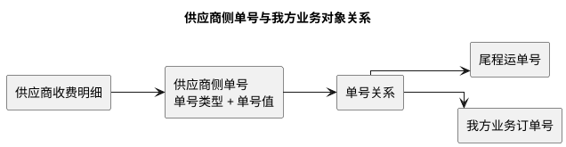

单号关系至少记录供应商、供应商侧单号类型、供应商侧单号值、我方对象类型、我方对象编号、关系来源、确认人、确认时间和有效状态。关系来源包括系统匹配、导入文件指明和财务人工确认。一个供应商侧单号可以关联多个我方对象，但若一笔金额同时覆盖多个对象且供应商未给出对象级金额，该金额仍应按间接成本处理，不能直接完整计入每个对象。

#### 13.6.2 初始成本类型与归属判定

1. 系统在导入预览时，使用本次识别的供应商侧单号查询有效单号关系。
2. 能唯一追溯到一个尾程运单号或我方业务订单号，或者供应商已经按对象列明金额时，建议为`直接成本`。
3. 无法追溯到我方业务对象，或者一笔金额覆盖多个对象但没有对象级金额时，建议为`间接成本`。
4. 能追溯到尾程运单号时优先直接归属尾程包裹；只能追溯到我方业务订单号时，直接归属业务订单。
5. 多个供应商侧单号指向同一业务对象不构成冲突；同一供应商侧单号出现相互矛盾的有效关系时，初始成本类型按`间接成本`处理，同时把匹配状态标记为`待人工确认`，不得选择任一候选对象直接归属。
6. 系统建议不替代财务确认。财务确认后才形成初始成本类型和归属方式；确认结果与系统建议不一致时必须填写原因。

#### 13.6.3 单笔成本处置流程

`13.2 成本归集链路总览`描述供应商账单从上传到成本归属的全链路；下图进一步说明单笔成本明细进入 `BMS费项池` 后，如何完成分类和归属。

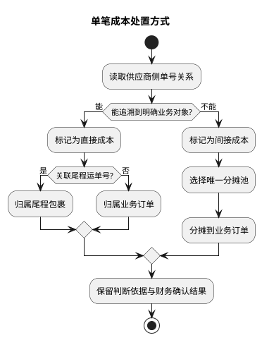

#### 13.6.4 成本归属层级

`成本账单`负责保留供应商收费和结清事实，`成本池`负责承接逐行成本明细，两者不互相替代。成本明细进入成本池后，按以下层级确定归属：

1. 能匹配尾程运单号的直接成本归属尾程包裹，再汇总到所属业务订单。
2. 只能匹配主订单号的直接成本直接归属业务订单。
3. 无法直接归属，或一笔未拆金额同时覆盖多个对象的间接成本，先按集运线路、履约节点、仓库、承运商、运抵国等范围圈定候选业务订单，再按`13.7 间接成本分摊`落到业务订单。
4. 包裹数据可以作为订单级分摊因子的计算依据，但间接成本不得落到尾程包裹；尾程包裹也不单独计算利润。

五大成本板块用于区分供应商账单的导入和统计场景，集运线路与履约节点用于定位成本发生范围，两组维度可以同时存在。具体值优先采用供应商账单明确给出的信息；缺失时只能依据已确认单号关系或财务确认结果补充，不得无依据推断。

#### 13.6.5 直接成本归属规则

1. 若成本来源能通过供应商侧单号关系匹配到尾程运单号，则该成本必须直接落到对应尾程包裹。
2. 若成本来源只能匹配到业务订单，无法确认具体尾程包裹，则该成本可先作为订单级直接成本落到业务订单；后续若补齐包裹匹配关系，应通过调整记录迁移到尾程包裹，不直接覆盖原记录。
3. 若一条供应商收费明细同时包含多个包裹，应先按供应商收费账单给出的单包裹金额拆分；若供应商未拆分，则按`13.7 间接成本分摊`处理。
4. 直接成本确认后应保留来源凭证、匹配字段、匹配时间和确认人，支持财务回溯“为什么这笔成本属于这个包裹或订单”。
5. 已形成成本账单的直接成本不得被来源数据后续变更静默覆盖；如需修正，应通过`15. 调账中心`形成成本调整记录。已结清成本账单不得返结清。

#### 13.6.6 成本类型人工切换

财务可以在`直接成本`和`间接成本`之间切换成本类型，但系统必须重新按`13.6.1 供应商侧单号关系`校验，不允许只改标签而保留相互矛盾的归属结果。

1. `间接成本 → 直接成本`：必须先建立或确认可追溯到尾程运单号或我方业务订单号的单号关系；成本明细已进入分摊池时，必须先移出原分摊池，并使受影响的旧分摊版本失效后再直接归属。
2. `直接成本 → 间接成本`：只有原单号关系已经失效、存在冲突，或者一笔金额实际覆盖多个对象但没有对象级金额时才允许切换。财务必须先解除当前直接归属，再选择一个符合业务范围的分摊池；不得在直接归属仍生效时参与分摊。
3. 成本明细已影响订单成本或利润时，切换提交后必须重算受影响订单的成本和利润，并把成本完整性退回`成本未齐`，直至财务重新确认。
4. 切换动作必须填写原因，并记录切换前后成本类型、归属对象、分摊池、影响范围、操作人和操作时间；审计要求见`17. 内部审计`。
5. 成本账单处于`待结清`或`已结清`均可发起类型切换，因为成本归属和账单结清相互独立；切换不得修改账单结清金额、结清状态或已锁定成本核销汇率。

#### 13.6.7 成本池直接补录

除供应商侧账单导入外，财务可以在成本池中直接补录成本明细，用于处理供应商临时通知、账单漏项、人工补差、线下确认差额或原始文件暂未覆盖的费用。成本池直接补录不是绕过成本池，而是由财务在成本池内新增标准成本明细。

成本池直接补录必须遵守以下规则：

1. 必须填写供应商、成本账期、成本板块、常规成本费项名称、费用金额、币种和成本发生日期。
2. 能通过供应商侧单号或其它凭证明确追溯到尾程包裹或业务订单的，按直接成本补录，并填写对应尾程运单号或主订单号。
3. 只能确认集运线路、履约节点、提单、柜号、月份、车种、仓库、目的地或费用事件的，按间接成本补录，并填写候选业务订单范围和分摊规则建议。
4. 若该补录金额来自供应商侧账单的某一行或某一附件，应填写供应商侧账单号、供应商侧账单明细号或原始单据凭证。
5. 补录成本是否纳入当前成本账单，由财务明确选择。当前成本账单处于`待结清`时，可按供应商确认结果纳入并保留调整记录；成本账单处于`已结清`时，必须通过`15. 调账中心`形成成本金额冲正及新的成本调整记录，不得直接覆盖历史结果。

### 13.7 间接成本分摊

完成成本识别后，直接成本结束本阶段处理并落到业务对象；只有间接成本继续进入分摊环节。间接成本统一分摊到业务订单，不分摊到尾程包裹，因为尾程包裹不计算利润，只有业务订单及订单汇总层计算利润。分摊采用“先建分摊池、再圈定候选业务订单、再选分摊因子、最后逐币种计算”的顺序。间接成本分摊池是从成本池中圈定的一组待分摊成本及其适用业务范围，不是另一个成本数据来源。

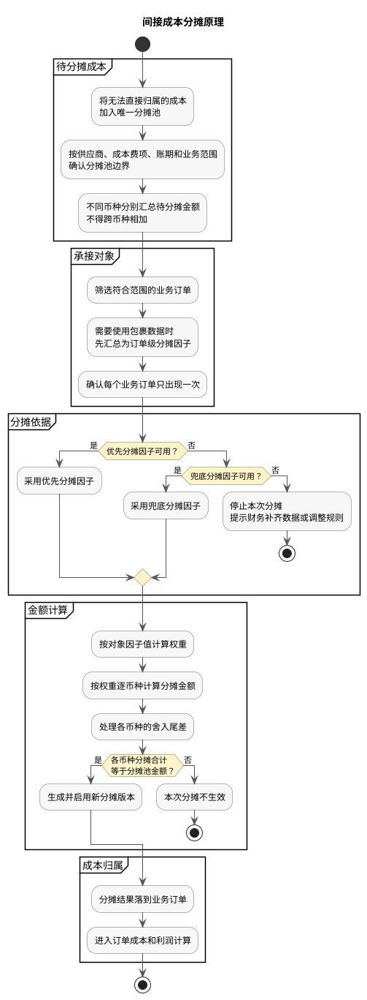

上图说明间接成本从入池到订单成本的完整路径。分摊池边界、对象范围、因子选择、逐币种公式、尾差处理和版本规则分别在下文展开；任一必要条件不成立时，本次分摊不得生效。

#### 13.7.1 间接成本分摊池建立

财务导入或确认间接成本后，系统应在成本池内形成间接成本分摊池。分摊池至少应记录：

1. 分摊池编号。
2. 供应商或内部成本来源。
3. 常规成本费项。
4. 账期开始日期和账期结束日期。
5. 集运线路、运抵国、仓库、承运商或其它适用范围。
6. 分摊对象固定为`业务订单`。
7. 按币种分桶的原始金额、已分摊金额和待分摊金额。
8. 分摊因子、分摊对象范围、当前有效版本和分摊状态。

分摊池的范围必须足够明确，不能把不同集运线路、不同运抵国、不同仓库或不同常规成本费项的成本混在同一个分摊池中。一个分摊池可以包含多个币种，但各币种必须独立分桶计算，不得先把不同币种金额直接相加。若来源账单本身已经分集运线路或分仓库列示，系统应优先沿用来源账单的拆分结果。

同一成本明细在同一时点只能进入一个有效分摊池。系统在加入分摊池、复制分摊池或重新执行分摊前都必须校验占用关系；已被其它有效分摊池占用时应阻断操作并提示原分摊池。需要迁移时，财务应先从原分摊池移除该成本明细并生成新的分摊版本，再加入目标分摊池，避免重复分摊。

分摊池状态包括：

| 状态 | 业务含义 |
| :--- | :--- |
| `待人工确认` | 未唯一命中规则、候选订单范围不完整、因子不可用或责任范围不明确，需要财务处理。 |
| `待分摊` | 已确认规则、候选订单和分摊因子，可以执行正式分摊。 |
| `已分摊` | 已生成唯一生效的分摊版本，各币种金额守恒，结果已进入业务订单成本。 |
| `分摊失败` | 正式执行时发生数据变化、总因子为 0、金额不守恒或其它阻断问题，且当前没有可继续生效的旧版本；若重算失败但旧版本仍有效，分摊池保持`已分摊`并记录本次失败。 |

#### 13.7.2 分摊对象确定

间接成本的分摊对象固定为`业务订单`，页面和规则中不提供`尾程包裹`选项。可进入分摊范围的业务订单应同时满足：

1. 订单命中分摊池配置的集运线路、运抵国、仓库、客户、承运商或业务板块范围。
2. 订单归属时间落入分摊池账期，具体时间口径由常规成本费项配置决定。
3. 订单未被排除在该分摊池之外，例如取消单、测试单或异常作废单。
4. 订单具备当前分摊因子所需的订单级数据。分摊因子来自计费重、实重、包裹数、体积、申报价值、仓储天数或操作次数等包裹级数据时，系统必须先按订单汇总，再以订单汇总值参与分摊。
5. 同一个尾程包裹的基础数据只能汇总到其所属的一个业务订单，不得重复计入多个候选订单的分摊因子。

同一业务订单可以参与多个不同常规成本费项的分摊池，但在同一个分摊池内只能出现一次。对象范围由系统按条件生成后，财务可以排除不适用订单；人工加入不满足范围的订单时必须填写原因。尾程包裹可以作为订单级分摊因子的明细来源和成本下钻维度，但不生成包裹级间接成本分摊结果。

#### 13.7.3 分摊规则与因子选择

大型快递、空运、海运和清关服务商通常按`每票 / 每件`、`计费重`、`提单 / 柜`、`申报行数 / 税费金额`、`占用量 × 天数`或`车次 / 等待时长`等实际成本动因收费。BMS 只借鉴这些计费维度来确定分摊范围和因子，不复制外部供应商的费率、阈值或计价公式；供应商账单能够明确给出收费单位时，应以账单口径为准。

##### 13.7.3.1 通用判定顺序

分摊规则应按`成本板块 + 常规成本费项 + 费用场景`预先配置。系统创建分摊池时固化实际采用的规则，避免财务每次临时选择造成口径漂移。每笔间接成本依次按以下顺序处理：

1. `拆分费用`：供应商账单把基础运费、燃油附加、文件费、仓租、罚款等分别列示时，必须分别形成成本明细和分摊池，不得用合计金额套用一个因子。
2. `确定范围锚点`：先找到该费用实际覆盖的提单、柜号、航班、车次、报关批次、仓储事件、派送批次、集运线路或供应商账期，再从该范围内筛选业务订单；不得把一笔局部费用摊给账期内全部订单。
3. `限定候选订单`：只纳入实际使用该项服务、触发该项附加费或占用相关资源的业务订单。能够唯一追溯到某一业务订单的费用应改判为直接成本，不进入分摊池。
4. `匹配收费单位`：供应商按金额比例收费时，优先按对应基础费用金额分摊；按重量、体积、票件、申报行、天数、车次或距离收费时，优先采用同类业务数据作为分摊因子。
5. `汇总订单因子`：包裹级重量、体积、件数、仓储天数和操作次数必须先汇总到业务订单，再参与分摊；分摊结果只落业务订单。
6. `使用兜底因子`：优先因子不可用时，才可使用规则预设的兜底因子。优先因子和兜底因子总值均为 0 或数据不完整时，停止分摊并提示财务处理。
7. `控制例外费用`：罚款、赔付、改单、退运、销毁、空驶和等待等责任型费用，应优先限定到责任订单；无法确认责任范围时进入`待人工确认`，不得自动均摊给全部订单。

每条分摊规则至少应记录：规则类型、成本板块、标准成本费项、费用场景、适用供应商、供应商收费单位、范围锚点类型、范围匹配字段、订单时间口径、候选订单条件、优先分摊因子、兜底分摊因子、例外处理规则、计费口径说明、生效期间和状态。规则类型为基础分摊规则时适用供应商为空；同一口径存在供应商特调分摊规则时，优先采用该供应商的特调规则。

同一常规成本费项可以因供应商收费方式不同配置多条场景规则，但同一个分摊池只能采用一条生效规则。财务调整范围锚点、候选订单、优先因子或兜底因子时必须填写原因，并按`13.7.5 分摊版本与重算`生成新版本。

##### 13.7.3.2 分摊规则设置方式

###### 13.7.3.2.1 配置入口与设置层级

成本中心设置独立的`分摊规则`页面，集中维护所有间接成本分摊规则。分摊规则仍必须关联一个标准成本费项，不能脱离标准成本费项单独存在，也不能跨成本板块引用。页面按规则适用范围分为两个页签：

1. `基础分摊规则`：不指定供应商，作为同一标准成本费项和费用场景面向全部供应商的默认口径。
2. `供应商特调分摊规则`：必须指定一个供应商，用于覆盖该供应商在同一标准成本费项、同一费用场景下的基础口径。

规则命中优先级固定为`供应商特调分摊规则 > 基础分摊规则`。系统先按供应商、标准成本费项、费用场景和成本发生时间查找供应商特调分摊规则；未命中时再查找对应的基础分摊规则，不提供人工数值优先级。一次匹配在同一规则类型中只能命中一条规则；同一规则类型命中多条时视为配置冲突，不得自动选择或降级到另一类型。

###### 13.7.3.2.2 页面区域与业务字段

| 区域 | 业务字段 | 交互与约束 |
| :--- | :--- | :--- |
| 查询与列表 | 规则类型、规则编号、成本板块、标准成本费项、费用场景<br>适用供应商、供应商收费单位、状态、试算状态、生效期间<br>规则版本、最近确认人、最近确认时间 | 页面以`基础分摊规则`和`供应商特调分摊规则`两个页签分开呈现；各页签支持组合查询、新增、复制、查看、编辑、启用和停用。供应商筛选只在供应商特调分摊规则页签出现。复制只复制规则内容，新规则以`草稿`和`未试算`保存，规则编号、版本和生效信息重新生成。 |
| 基本信息 | 规则类型*、成本板块*、标准成本费项*、费用场景*、适用供应商<br>供应商收费单位*、计费口径说明*、生效开始时间*、生效结束时间、状态* | 从哪个页签新增规则，即锁定为对应规则类型。成本板块由标准成本费项带出且不可修改；基础分摊规则的适用供应商必须为空，供应商特调分摊规则的适用供应商必填。生效结束时间为空表示持续有效。 |
| 分摊范围 | 范围锚点类型*、范围匹配字段*、订单时间口径*、候选订单条件<br>默认排除条件、责任订单限定方式、范围说明* | 范围锚点类型从当前成本板块允许的提单、柜号、航班、车次、报关批次、仓储事件、派送批次、线路或账期中选择。多个条件之间采用`且`；同一字段选择多个值时采用`或`。默认排除取消单、测试单、作废单及未实际使用该服务的订单。 |
| 分摊因子 | 优先分摊因子*、兜底分摊因子、因子聚合方式*、数据缺失处理*<br>金额比例基准、组合因子参数、舍入与尾差口径 | 因子只能从系统因子库选择，不允许录入脚本或任意公式。包裹级数据的聚合方式固定为按业务订单求和；组合因子仅支持系统预置的`数量 × 天数`、`重量 × 天数`、`体积 × 天数`、`重量 × 里程`和`体积 × 里程`。 |
| 例外处理 | 无匹配订单处理*、责任范围不明处理*、优先与兜底因子均不可用处理*<br>允许人工调整范围、允许人工调整因子、调整原因要求 | 默认处理均为停止自动分摊并转`待人工确认`。不得配置为自动平均分配；允许人工调整时必须填写原因并生成新的分摊版本。 |
| 试算预览 | 试算账期 / 成本明细、命中规则、候选订单数、排除订单数、因子缺失订单数<br>各币种待分摊金额、总因子值、逐订单试算结果、尾差、阻断原因 | 选择一笔待分摊成本或历史账期后执行试算。预览不写入订单成本、不生成有效分摊版本；支持下钻查看订单及其包裹级因子来源。 |

字段右侧带`*`表示数据库中必填。`状态`枚举为`草稿`、`启用`、`停用`；`试算状态`枚举为`未试算`、`试算通过`、`试算失败`；`规则类型`枚举为`基础分摊规则`、`供应商特调分摊规则`；`数据缺失处理`枚举为`使用兜底因子`、`停止并待人工确认`。规则启用后，数据缺失处理不得设置为跳过缺失订单后继续分摊，防止成本只落到数据较完整的部分订单。

###### 13.7.3.2.3 系统因子库

系统因子库提供以下业务因子，财务只能选择与当前成本板块、费用场景和收费单位相容的因子：

| 因子类别 | 可选因子 | 使用约束 |
| :--- | :--- | :--- |
| 金额 | 基础派送费、基础海运费、基础空运费、基础租车成本、实际税费、应税金额、申报价值、责任金额 | 作为比例基准的金额必须与当前费用属于同一供应商账单范围、同一范围锚点和同一币种；不同币种不得直接相加。 |
| 重量与体积 | 实重、计费重、空运计费重、毛重、体积重、计费吨、占用体积 | 采用供应商收费口径；包裹级数据先汇总到业务订单。 |
| 数量与操作 | 订单数、包裹数、票数、分提单数、分运单数、申报行数、操作次数、处理件数 | `订单数`只能用于规则明确允许的固定费用，不得作为系统通用兜底。 |
| 时间与距离 | 仓储天数、超期天数、等待时长、承运里程 | 必须取实际事件区间；无法取得实际值时不得自行补默认值。 |
| 组合因子 | 占用体积 × 天数、重量 × 天数、包裹数 × 天数、重量 × 里程、体积 × 里程 | 两个基础因子都完整时才可计算；任一因子缺失时按规则执行兜底或阻断。 |

系统因子库由产品预置，不允许财务新增计算脚本。后续新增因子必须明确数据来源、订单聚合方式、适用成本板块和缺失处理后再开放。

###### 13.7.3.2.4 创建、校验与生效

1. 财务先进入基础分摊规则或供应商特调分摊规则页签，再选择标准成本费项并新增规则，依次设置费用场景、分摊范围、分摊因子、例外处理和生效期间。
2. 保存草稿时必须满足数据库必填字段，但可以暂不完成试算和冲突消解，且草稿不得被分摊池命中。启用前必须完成规则冲突和结构校验；存在可用样本时，还必须完成至少一次无阻断的试算。
3. 系统校验相同`标准成本费项 + 费用场景 + 规则类型 + 适用供应商`下的启用规则生效期间不得重叠，生效结束时间不得早于生效开始时间。基础分摊规则与供应商特调分摊规则允许同期存在，并按供应商特调分摊规则优先。
4. 标准成本费项和供应商必须处于启用状态，供应商必须适用当前成本板块。范围锚点、范围匹配字段和因子必须属于当前板块允许值；例如空运费不能选择柜号作为范围锚点，纯文件费不得默认采用重量因子。
5. 优先分摊因子与兜底分摊因子不得相同。`数据缺失处理`选择`使用兜底因子`时，兜底分摊因子必填；未配置兜底因子时只能选择`停止并待人工确认`。
6. 启用前的试算必须展示候选订单、被排除订单、因子缺失订单、各币种金额守恒结果和尾差承接订单。存在样本但试算结果为范围为空、同层级多规则命中、总因子为 0、金额不守恒或责任范围未确认时不得启用。
7. 新费用场景确无历史或待分摊样本时，允许规则通过结构和冲突校验后以`启用 + 未试算`状态生效。该规则首次命中分摊池时，分摊池必须进入`待人工确认`，由财务完成首次实际预览和确认后才能转为`待分摊`；系统同步把规则试算状态更新为`试算通过`。首次实际预览失败时，规则试算状态更新为`试算失败`，分摊池保持`待人工确认`。
8. 规则启用后只供新建分摊池匹配；已经创建的分摊池继续使用创建时固化的规则快照，不随模板变化。

###### 13.7.3.2.5 编辑、停用与运行时命中

1. `草稿`规则可以原记录编辑。已启用且尚未被分摊池引用的规则可以修改后重新试算；已被引用的规则不得原位改写，编辑时生成新版本并关联前序版本。
2. 新版本启用后，旧版本结束生效，但旧规则及其形成的分摊池、分摊版本和订单成本继续保留。新旧版本生效期间不得重叠。
3. 停用规则只阻止其被后续新建分摊池命中，不使既有分摊结果失效，也不触发历史订单利润重算。
4. 间接成本进入分摊池时，系统按`标准成本费项 + 费用场景 + 供应商 + 成本发生时间`先匹配供应商特调分摊规则，未命中时再匹配基础分摊规则。唯一命中且规则已`试算通过`时，自动带出范围锚点、候选订单条件和因子；两个层级均未命中、同一层级命中多条或命中规则为`未试算 / 试算失败`时，分摊池进入`待人工确认`。
5. 财务可以在分摊池内调整本次范围或因子，但该调整只形成当前分摊池的新版本，不反向修改规则模板。若调整需要长期复用，财务应另行创建或更新分摊规则。
6. 规则新增、复制、编辑、启用、停用和版本切换均写入`17. 内部审计`；分摊规则维护权限与分摊执行权限相互独立。

##### 13.7.3.3 派送成本

| 费用场景 | 分摊池边界 / 范围锚点 | 候选业务订单 | 优先分摊因子 | 兜底分摊因子 | 关键约束 |
| :--- | :--- | :--- | :--- | :--- | :--- |
| 批量基础派送费 | 供应商 + 派送批次 / 路线 + 派送日期 | 实际进入该批次或路线的订单 | 订单计费重 | 订单包裹数、订单实重 | 有逐票金额时改为直接成本。 |
| 燃油附加费、旺季附加费 | 与附加费对应的供应商账单范围和基础派送费范围一致 | 实际产生基础派送费的订单 | 订单基础派送费金额 | 订单计费重 | 供应商按基础费用百分比收费时必须按基础派送费金额分摊，不得按订单平均分摊。 |
| 偏远、住宅、超大、超重、特殊处理 | 邮编 / 区域 + 派送批次，或供应商标识的异常件范围 | 满足该附加费条件的订单 | 触发附加费的包裹数汇总值 | 触发包裹计费重汇总值 | 能定位到单个订单时改为直接成本；未触发条件的订单不得参与。 |
| 专车、车趟、拖柜派送 | 车次 / 车辆 + 路线 + 发车日期 | 该车次实际装载的订单 | 订单占用体积；供应商按重量收费时改用计费重 | 订单计费重、订单包裹数 | 不得扩大到同日但未装入该车次的订单。 |
| 续仓、滞留、重派、退件 | 仓储或派送异常事件 + 发生期间 | 发生续仓、滞留、重派或退件的订单 | 占用体积 × 实际天数，或供应商采用的计费重 × 天数 | 操作次数、包裹数 | 有明确责任订单时仅在责任订单内分摊。 |
| 批量贴单、拖袋、叠货、分拣 | 操作批次 / 袋号 / 车次 + 作业日期 | 实际参与该次操作的订单 | 订单操作次数 | 订单包裹数、订单计费重 | 单个订单的操作记录可以识别时改为直接成本。 |
| 最低消费差额、账期级补差 | 供应商 + 集运线路 + 账期 | 该账期实际使用该供应商及线路的订单 | 订单基础派送费金额 | 订单计费重 | 取消单、测试单和未产生派送服务的订单不得参与。 |
| 货故赔款、账务调整 | 货故 / 调整事件或供应商明确的受影响范围 | 可确认承担责任的订单 | 责任金额、申报价值或供应商核定金额 | 不设自动兜底 | 无法确认责任订单时必须人工处理。 |

##### 13.7.3.4 清关成本

| 费用场景 | 分摊池边界 / 范围锚点 | 候选业务订单 | 优先分摊因子 | 兜底分摊因子 | 关键约束 |
| :--- | :--- | :--- | :--- | :--- | :--- |
| 清关、传输、报单基础服务费 | 主提单 / 报关批次 / 清关批次 | 纳入该次申报或清关的订单 | 订单申报票数或分提单数 | 订单包裹数 | 供应商按每票固定收费时按票数，不得按申报价值分摊。 |
| 多品名、多申报行附加费 | 报关单 + 申报行范围 | 含对应申报行的订单 | 订单申报行数 | 订单申报票数 | 未超出免费行数或未产生附加处理的订单不得参与。 |
| 代垫税费手续费、资金服务费 | 税单 / 报关单 + 代垫记录 | 实际发生代垫税费的订单 | 订单实际税费金额 | 订单申报价值 | 税费本金能够逐单识别时作为直接成本；这里只分摊无法逐单拆出的服务费。 |
| 批量税费或规费 | 税单 / 报关单 / 主提单 | 该税单或报关单覆盖的订单 | 订单应税金额或实际税费金额 | 订单申报价值 | 不得将免税或未纳入该报关单的订单加入范围。 |
| 仓租、保税仓储、进仓仓租 | 仓库 + 入出仓事件 + 计费期间 | 实际占仓的订单 | 订单占用体积 × 仓储天数 | 订单计费重 × 仓储天数、订单包裹数 × 仓储天数 | 仓储天数必须按订单实际占用期间计算。 |
| 查验、拆装柜、开箱、重新包装 | 查验事件 / 柜号 / 报关单 | 实际被查验或处理的订单 | 订单被处理件数或操作次数 | 订单计费重、订单包裹数 | 已知被抽检订单时不得摊给同柜未被处理订单。 |
| 移仓、退运、销毁、改名 | 异常事件 + 提单 / 报关单 / 柜号 | 实际受事件影响的订单 | 订单计费重或占用体积 | 订单包裹数 | 能确认责任或受益订单时只在该范围内分摊。 |
| 罚款、预收罚款 | 处罚决定 / 案件号 / 报关单 | 财务确认的责任订单 | 责任比例或核定金额 | 不设自动兜底 | 无法确认责任订单时保持待人工确认，不得分摊给普通订单。 |

##### 13.7.3.5 海运成本

| 费用场景 | 分摊池边界 / 范围锚点 | 候选业务订单 | 优先分摊因子 | 兜底分摊因子 | 关键约束 |
| :--- | :--- | :--- | :--- | :--- | :--- |
| 拼箱海运费、燃油或旺季附加费 | 主提单 + 航次 + 起运港 / 目的港 | 实际装入该票拼箱货物的订单 | 订单计费吨 | 订单体积、订单毛重 | 计费吨按供应商账单确认的重量吨 / 体积吨换算规则计算，不在 BMS 固定换算常数。 |
| 整柜海运费、柜级附加费 | 柜号 + 航次 | 实际装入该柜的订单 | 订单占柜体积 | 订单毛重、订单计费重 | 同一提单含多个柜时必须按柜分别建池；不得跨柜分摊。 |
| 提单费、文件费、续单费、电放费 | 主提单或文件处理事件 | 该提单下实际形成分提单或订单文件的订单 | 订单分提单数 | 订单数 | 供应商按每份文件收费时，以实际文件份数为准。 |
| 码头操作、装卸、堆场、吊柜 | 柜号 / 主提单 + 码头作业事件 | 使用该柜或参与该作业的订单 | 订单占柜体积 | 订单毛重 | 只覆盖部分柜或部分货物时必须缩小范围。 |
| 拖柜、港前 / 港后运输 | 柜号 + 拖车车次 + 路线 | 该柜内或该车次承载的订单 | 订单占柜体积 | 订单毛重、订单计费重 | 不得按整个账期订单分摊。 |
| 滞箱、滞港、堆存、压柜 | 柜号 + 超期日期范围 | 超期期间仍占用柜或堆场资源的订单 | 订单占柜体积 × 超期天数 | 订单毛重 × 超期天数 | 若超期由明确订单导致，应仅向责任订单分摊。 |
| 改单、甩柜、退关、查验等异常费 | 异常事件 + 提单 / 柜号 | 实际受影响或承担责任的订单 | 责任比例、订单占柜体积或计费吨 | 不设通用兜底 | 范围不清时必须人工确认，不得自动扩大。 |
| 最低消费或海运账期补差 | 供应商 + 航线 + 账期 | 账期内实际使用该供应商航线的订单 | 订单基础海运费金额 | 订单计费吨 | 已单独结算的异常费不得重复作为分摊基础。 |

##### 13.7.3.6 空运成本

| 费用场景 | 分摊池边界 / 范围锚点 | 候选业务订单 | 优先分摊因子 | 兜底分摊因子 | 关键约束 |
| :--- | :--- | :--- | :--- | :--- | :--- |
| 空运费、燃油、旺季、运力附加费 | 主运单 + 航班 / 磅单 + 起运日期 | 实际进入该主运单或航班的订单 | 订单空运计费重 | 订单实重、订单体积重 | 空运计费重按供应商采用的实重与体积重取高口径汇总到订单。 |
| 安保费、机场处理费 | 主运单 + 机场作业批次 | 参与该次机场处理的订单 | 订单空运计费重 | 订单件数 | 供应商按票固定收费时应改用订单运单数。 |
| 提单费、文件费、报关文件费 | 主运单 / 分运单 + 文件处理事件 | 实际形成对应文件的订单 | 订单分运单数 | 订单数 | 不得按重量分摊纯文件类固定费用，除非供应商账单明确按重量收费。 |
| 收送、打包、贴标、打板 | 作业批次 / 板号 / 磅单 | 实际参与该次操作的订单 | 订单操作次数或件数 | 订单空运计费重 | 有板位或占用体积记录时，可以配置为优先因子。 |
| 压夜、仓储 | 机场 / 仓库 + 入出仓事件 + 计费期间 | 实际压夜或占仓的订单 | 订单空运计费重 × 天数 | 订单占用体积 × 天数、订单件数 × 天数 | 不得把未压夜订单纳入范围。 |
| 查验、危险品、超规、特殊处理 | 查验 / 特殊处理事件 | 实际触发该项处理的订单 | 触发件数或操作次数 | 订单空运计费重 | 可追溯到单个订单时改为直接成本。 |
| 最低计费重、最低运费或账期补差 | 主运单 / 航班，或供应商 + 航线 + 账期 | 实际占用对应运力的订单 | 订单空运计费重 | 订单基础空运费金额 | 不得纳入未实际交运或已取消订单。 |

##### 13.7.3.7 租车成本

| 费用场景 | 分摊池边界 / 范围锚点 | 候选业务订单 | 优先分摊因子 | 兜底分摊因子 | 关键约束 |
| :--- | :--- | :--- | :--- | :--- | :--- |
| 单次包车、固定车趟 | 车次 / 车辆 + 路线 + 发车日期 | 该车次实际装载的订单 | 订单占用体积；供应商按载重收费时改用订单计费重 | 订单计费重、订单件数 | 车辆费用已明确对应单个订单时改为直接成本。 |
| 多站点运输、里程型运输 | 车次 + 各订单实际承运区段 | 该车次实际承载的订单 | 订单占用重量 × 承运里程，或订单占用体积 × 承运里程 | 订单计费重、订单占用体积 | 能取得各订单卸货点时按实际区段计算；不得一律使用全程里程。 |
| 燃油、路桥、车辆附加费 | 与费用对应的车次 / 路线一致 | 实际使用该车次或路线的订单 | 订单基础租车成本金额；无基础金额时采用重量 / 体积 × 里程 | 订单计费重、订单占用体积 | 供应商按车次固定收费时，范围不得跨车次。 |
| 装卸、搬运、上楼、打托 | 装卸作业单 / 车次 / 作业日期 | 实际接受操作的订单 | 订单操作次数或件数 | 订单计费重、订单占用体积 | 未发生相关操作的订单不得参与。 |
| 等待、压夜、超时 | 车次 + 等待事件 + 时间范围 | 导致或实际占用等待时间的订单 | 责任时长或订单占用量 × 等待时长 | 订单占用体积、订单计费重 | 能确认责任订单时只向责任订单分摊。 |
| 月租车、保底车次、最低消费差额 | 供应商 + 车型 + 集运线路 + 月份 | 该期间实际使用车辆资源的订单 | 订单占用体积 × 承运里程 | 订单计费重 × 承运里程、订单计费重 | 有车次记录时，应先限定各车次订单后汇总订单因子；不得包含未使用该线路的订单。 |
| 空驶、取消、罚款和其它责任费 | 空驶 / 取消 / 处罚事件 | 财务确认的责任订单 | 责任比例或核定金额 | 不设自动兜底 | 无法确认责任范围时保持待人工确认。 |

上述规则是各成本板块的默认口径。若供应商账单明确采用其它收费单位，财务可以在常规成本费项下配置供应商适用规则，但必须保留收费依据、范围锚点、优先与兜底因子及生效时间。不得仅因数据方便而把`订单数`设为所有费用的统一兜底因子。

#### 13.7.4 分摊计算公式

系统按分摊池中的每个币种分别执行以下公式，`分摊对象`固定表示业务订单：

```text
分摊对象权重 = 分摊对象对应的分摊因子值
分摊池总权重 = 当前分摊池内全部有效对象的分摊权重之和
对象在币种 C 下的分摊金额 = 分摊池币种 C 金额 × 对象分摊权重 ÷ 分摊池总权重
```

金额处理规则：

1. 多币种分摊池必须逐币种独立计算，同一版本共用对象范围和分摊因子，但每个币种分别形成分摊结果和尾差。
2. 分摊结果保留到币种最小金额单位；因四舍五入产生的尾差，应按最大余数法分配给当前币种下分摊余数最大的对象。
3. 分摊完成后，每个币种下全部对象的分摊金额合计必须分别等于该币种的分摊池金额。
4. 分摊结果保留原始币种和原始金额；用于订单成本和利润时，再按`14. 金额汇兑`换算为财务本位币人民币。
5. 分摊池总权重为 0，或者任一币种无法形成完整分摊结果时，本次分摊整体不得生效。

#### 13.7.5 分摊版本与重算

1. 每次首次分摊、对象范围变更、分摊因子变更、成本明细增减、成本类型切换或币种金额变化，都必须生成新的分摊版本。
2. 新版本生效后，旧版本保留用于追溯，但旧版本金额不得继续进入当前订单成本和利润；同一分摊池同一时点只能有一个有效版本。
3. 版本至少保存成本明细清单、各币种池金额、业务订单清单、范围条件、分摊因子、兜底处理、尾差分配和逐订单结果。
4. 分摊规则、对象范围和有效版本的变更必须写入`17. 内部审计`，记录变更前后快照、变更原因、操作人和影响对象。
5. 新版本影响已经标记`成本已齐`的业务订单时，系统必须把相关订单退回`成本未齐`并重算暂估实际利润，待财务重新确认。

#### 13.7.6 订单成本汇总

尾程包裹的直接成本完成归属后，系统将其汇总到业务订单，并与订单级直接成本、订单级间接成本共同形成业务订单总成本：

```text
业务订单直接成本 = 订单级直接成本 + 订单下全部尾程包裹直接成本
业务订单间接成本 = 分摊到该业务订单的全部间接成本
业务订单总成本 = 业务订单直接成本 + 业务订单间接成本
```

间接成本分摊结果直接进入订单级间接成本。当一个业务订单包含多个尾程包裹时，可以先汇总包裹级真实作业数据形成该订单的分摊因子，但不得把间接成本落到尾程包裹，也不得简单按订单平均分摊替代已经配置的分摊因子。

### 13.8 成本账单结清与调账

成本归属和分摊回答“成本属于谁”，账单结清回答“供应商账单是否已经完成资金闭环”。两者并行推进、互不替代。本节先定义账单状态和结清登记，再说明 BMS 与付款动作的边界，以及已结清账单发生错误时的处理方式。

成本账单列表和详情仅用于查询、核对、结清及调账，不提供成本账单导出。`13.10.3 成本统计、未决事项与分析导出`定义的内部成本分析导出是独立的分析能力，不等同于导出成本账单。

#### 13.8.1 状态与结清登记

成本账单状态只反映供应商账单是否完成结清，不反映成本匹配、归属、分摊或利润计算进度。财务仅标记`待结清`和`已结清`，不使用`起草中`、`待审核`等中间状态；成本归属与结清状态是两条相互独立的业务线。

| 状态 | 定义 | 关键规则 |
| :--- | :--- | :--- |
| 待结清 | 供应商账单已在 BMS 登记，但账单金额尚未全部完成结清。 | 支持继续处理成本匹配、归属和分摊，登记部分结清及跟进未结清差额；部分结清后状态仍为`待结清`。 |
| 已结清 | 供应商账单各币种金额均已完成结清登记。 | 不再修改该账单的结清金额和结清状态；仍可继续处理尚未完成的成本匹配、归属和分摊，并保留查询、追溯和后续成本调整入口。该状态不代表系统已自动付款或已完成供应商付款审批。 |

状态流转遵循以下规则：

1. 财务在导入预览确认时选择`待结清`或`已结清`。导入完全成功后，系统形成成本账单并采用财务所选状态；导入失败时不形成成本账单。
2. 财务应按实际付款、抵扣或其他结清结果登记结清金额、结清币种、结清日期、付款或抵扣凭证、登记人和备注。
3. 成本账单部分结清时，状态保持`待结清`，并分别展示账单金额、已结清金额和未结清金额。
4. 多币种成本账单应按币种分别核对结清金额；所有币种的未结清金额均为零后，状态才变为`已结清`。
5. 每个非人民币币种在核销或结清登记时必须确认换算为财务本位币人民币的成本核销汇率，并形成锁定快照；同一币种分次结清时，每次结清分别记录汇率和本位币金额。
6. 成本明细的匹配、归属、分摊、成本类型切换或调整进度不得派生新的成本账单状态，也不得自动把`待结清`改为`已结清`；反之，账单结清也不得自动确认成本归属或成本完整性。
7. `已结清`成本账单发生供应商补收、减免、折让或漏项时，应通过`15. 调账中心`形成成本金额冲正及新的成本调整记录，不得直接改写原账单结果。
8. 成本账单不触发客户邮件通知，也不进入客户对账报表。
9. 导入时直接选择`已结清`与导入成功后从`待结清`变更为`已结清`使用同一结清校验口径，并保留结清日期、结清方式、各币种结清金额、成本核销汇率、凭证、登记人和备注。

#### 13.8.2 结清与付款边界

成本中心只登记供应商账单的结清事实，不承接供应商付款申请、付款审批和实际付款执行。`结清`表示财务确认该供应商账单金额已经通过付款、抵扣或其它方式完成闭环，不等于 BMS 已向供应商发起付款。

1. BMS 只保存结清金额、币种、日期、方式、凭证、成本核销汇率、登记人和备注，用于账单余额、人民币成本和审计追溯。
2. BMS 不根据供应商计价算法判断应付金额，也不自动发起付款；财务以供应商账单和线下资金结果作为结清登记依据。

#### 13.8.3 已结清成本账单的纠错

`已结清`表示原供应商账单在当时已经完成结清登记，是不可回退、不可覆盖的历史事实。成本账单不支持`返结清`，也不得通过修改或删除原结清记录把状态改回`待结清`。结清后的纠错统一进入`15. 调账中心`，并按错误对象分开处理：

1. `账单金额有误`：供应商补收、减免、折让、漏项或原金额录错时，财务发起成本金额冲正。调账记录必须关联原成本账单、原成本明细、原币种、原金额、冲正金额、原因和凭证；审核通过后形成新的成本调整明细，不改写原账单金额。
2. `核销信息有误`：结清金额、结清币种、结清日期、成本核销汇率、结清方式或凭证登记错误时，财务发起成本核销冲正。系统先以反向核销记录抵消错误信息，再登记正确核销信息；错误记录、反向记录和正确记录必须保持完整关联。
3. 原成本账单始终保持`已结清`。若金额冲正或核销冲正后仍产生需要后续结清的差额，差额由新的成本调整记录承接，并独立标记`待结清`或`已结清`，不得把原账单退回待结清。
4. 金额冲正和核销冲正只修正成本事实及其人民币换算结果，不改变原供应商账单文件、原始行快照、原账单编号和历史结清状态。
5. 调账审核通过后，系统应重算受影响业务订单的成本完整性和利润；涉及间接成本时，应使受影响的旧分摊版本失效并按`13.7.5 分摊版本与重算`生成新版本。
6. 成本金额冲正、核销冲正及后续差额结清必须进入`17. 内部审计`，并能从原成本账单双向追溯。
7. 成本调整记录同时具有`调账审核状态`和`差额结清状态`：前者遵循调账中心的`待审核`、`审核通过`、`审核驳回`，后者只使用`待结清`、`已结清`。两组状态相互独立，不得混为成本账单的新状态。
8. 正向差额表示仍需向供应商补付的成本，负向差额表示等待供应商退款、减免或抵扣的成本。两者均按原成本币种记录；未经财务确认，不得跨币种自动抵扣。
9. 调账审核通过但差额尚未完成付款、退款或抵扣时，差额结清状态为`待结清`；财务登记对应资金或抵扣结果后，才变为`已结清`。

### 13.9 成本完整性与跨期处理

成本明细完成归属或分摊后，并不代表某个业务订单的全部成本已经到齐。系统需要先判断订单是否仍有待到、待匹配、待分摊、待确认汇率或待调账成本，再决定利润结果属于阶段性结果还是最终结果。

#### 13.9.1 成本完整性确认

`成本已齐`按业务订单判断，规则如下：

1. `应到资料`：订单所选集运线路涉及的供应商和履约节点，其对应供应商账单已经到齐，或者财务已经确认本期无账单、无需收费。若确认账单将在后续账期到达，该检查项保持未通过，并记录预计到达账期。
2. `待匹配成本`：与该订单相关的成本明细不存在`待系统匹配`、`无法匹配`、`待人工确认`或单号关系冲突。
3. `待分摊成本`：应由该订单承接的间接成本已经进入唯一分摊池并完成分摊，相关分摊池存在唯一有效版本，且没有待处理尾差。
4. `汇率待确认成本`：进入订单利润的外币成本已经锁定成本核销汇率，不存在尚未换算为人民币的成本。
5. `未决调账`：与该订单有关的成本金额冲正、核销冲正、成本类型切换和归属调整均已审核并生效，不存在待审核或审核驳回后未处理的记录。
6. 系统按上述五类检查项形成`成本完整性检查清单`，展示每类未决数量和关联对象，但不依据供应商计价算法判断供应商是否少收或漏收，也不自动推算缺失成本金额。
7. 检查项全部通过后，仍须由财务确认`成本已齐`；系统不得仅因当前没有待处理成本明细而自动确认。
8. 晚到成本、补录、冲正、成本类型切换、归属调整、分摊池成员变化、分摊新版本生效或核销信息冲正时，系统自动把受影响订单退回`成本未齐`，并要求财务重新确认。
9. 成本完整性确认和退回只影响利润成熟度，不修改供应商账单结清状态，也不修改客户侧账单金额。

#### 13.9.2 成本晚到与跨账期处理

成本晚到或跨账期确认时，按以下规则处理：

1. 成本以供应商账单账期进入成本账单，同时保留其对应业务订单、尾程包裹、集运线路、履约节点和成本发生日期。
2. 若成本对应的客户侧账单仍处于`起草中`或`待审核`，成本变化只影响利润分析和成本覆盖率，不自动改写客户侧账单金额；客户侧需补收或扣减时，应按应收账单、返款账单或冲正规则单独处理。
3. 若成本对应的客户侧账单已进入`待结清`或`已结清`，成本晚到不得回写历史客户账单，只能形成成本差异记录、后续成本账单承接或利润分析重算结果。
4. 若成本账单形成后又出现供应商补收、减免、折让或漏项，待结清账单可按规则补充成本明细；已结清账单必须通过`15. 调账中心`承接差异，不得被静默覆盖。
5. 晚到成本影响已经`成本已齐`的业务订单时，系统应撤销该订单原有成本完整性确认，退回`成本未齐`并重算暂估实际利润；财务重新核对并确认后，再形成新的实际利润结果。
6. 利润分析应能同时查看`按客户账期`和`按成本账期`两种视角：前者用于解释某张客户账单的成本覆盖情况，后者用于解释某张供应商账单在财务期间内的成本影响。
7. 每条晚到或跨账期成本同时保留`成本发生日期`、`供应商账单账期`和`BMS确认期间`。三者分别用于还原业务发生、供应商出账和财务确认时点，不得相互覆盖。
8. 原成本账单已经结清时，晚到差异通过调账中心形成新的成本调整记录，并关联原成本账单；原账单不返结清，差额按新记录独立结清。
9. 跨账期调整生效后，只重算受影响订单的成本完整性和利润，不回写原客户账单、原供应商账单或历史分摊版本。

### 13.10 报价覆盖、利润与经营分析

成本完成归属后，系统按业务订单把客户侧收入、返款扣减影响和供应商侧成本关联起来，用于分析报价覆盖和利润。该关联只形成经营分析结果，不改变应收账单、返款账单或成本账单的主结果；代收代付类费用必须分别记录客户侧收入和供应商侧成本，避免重复计算。

成本、报价与利润按以下口径理解：

1. `客户报价`：我司通过 OIS 向客户给出的订单报价，不是供应商向我司提供的报价。BMS 只读取并保留客户报价结果，不负责重新计价或回写报价。
2. `最终成本`：供应商账单导入、成本池直接补录及间接成本分摊后，由财务确认并归属到业务订单的实际成本结果；包裹级直接成本先向上汇总到业务订单。
3. `暂估成本`：供应商账单尚未到达前，根据历史、合同或人工判断预先记录的成本金额。本期只预留该概念，不提供暂估成本录入、自动计算、分摊、冲销或转实际能力，暂估成本也不进入成本账单、`BMS费项池`和利润公式。
4. `暂估实际利润`：业务订单成本尚未确认完整时，仅基于当前已经归属的实际成本计算的阶段性利润。名称中的“暂估”表示利润结果尚未成熟，不表示公式中包含暂估成本。
5. `实际利润`：业务订单被财务确认`成本已齐`后，按已确认客户侧收入、返款扣减影响和完整实际成本计算的经营分析结果。
6. `成本差异`：同一尾程包裹、业务订单、集运线路或履约节点下，本次有效实际成本与前次有效实际成本之间的差额。
7. `返款扣减影响`：仅指返款链路中会冲减我方收入的费用、调整或差额，不包括应返还客户的 COD 货款本金；客户货款本金属于代收代付资金，不得作为订单经营成本重复扣减。

#### 13.10.1 客户报价覆盖分析

BMS 不生成、修改或推荐客户报价。直接成本和间接成本用于解释客户报价能否覆盖实际履约成本，为业务人员复盘既有报价和决定是否在 OIS 调整后续报价提供事实依据；BMS 的成本变化不得自动回写任何已成交订单报价。

1. `客户报价收入`取 OIS 已形成并随订单保存的客户报价结果；若客户实际应收已经形成，以客户账单锁定的收入结果作为利润计算依据，客户报价只作为对比值。
2. 直接成本完成归属后，可按供应商、集运线路、履约节点、运抵国、重量段和常规成本费项分析单票实际消耗，定位客户报价未覆盖或覆盖不足的具体收费项。
3. 间接成本只有完成分摊后，才能进入订单成本和报价覆盖分析；未分摊金额只作为成本缺口展示，不得直接平均计入客户报价。
4. 报价覆盖分析至少展示客户报价收入、已确认客户侧收入、直接成本、间接成本、总成本、报价覆盖差额和利润率，并允许下钻到对应成本明细。
5. 分析结果可以按客户、集运线路、履约节点、运抵国、重量段、常规成本费项和时间范围汇总，但只作为经营复盘信息，不自动生成调价方案。
#### 13.10.2 订单利润计算

直接成本和间接成本都会减少其所归属业务订单的利润，但进入订单利润的时点不同：直接成本在完成订单或尾程包裹归属后计入；间接成本在完成分摊并形成有效分摊版本后计入。成本账单处于`待结清`或`已结清`只表示供应商账单的结清进度，不决定成本是否参与利润计算。

利润只在业务订单和订单汇总层计算。尾程包裹只承接能够明确归属的直接成本，并向上汇总到业务订单；不承接间接成本，也不单独计算或展示包裹利润。

系统应区分`暂估实际利润`和`实际利润`：

```text
业务订单暂估实际利润 = 已确认客户侧收入 - 返款扣减影响 - 当前已归属直接成本 - 当前有效间接分摊成本
业务订单实际利润 = 成本已齐时的已确认客户侧收入 - 返款扣减影响 - 已确认直接成本 - 已确认间接成本
总暂估实际利润 = 查询范围内全部业务订单暂估实际利润之和
总实际利润 = 查询范围内全部成本已齐业务订单实际利润之和
```

1. 直接成本完成归属后，订单级直接成本直接计入业务订单；包裹级直接成本先计入尾程包裹，再汇总到所属业务订单。
2. 间接成本尚未分摊时，不计入任何业务订单，只在成本池和成本缺口中展示；利润结果必须标记`间接成本未分摊`。
3. 间接成本完成分摊后，分摊结果直接计入业务订单；重新分摊时按新有效版本重算暂估实际利润，不生成包裹级间接成本或包裹利润。
4. 同一成本明细只能以直接归属或间接分摊中的一种方式影响利润，不得重复计入。负向成本、供应商减免和折让按原金额方向冲减成本并相应增加利润。
5. 利润统一按财务本位币人民币计算和展示。客户侧收入使用客户账单已经锁定的汇率；供应商侧成本使用成本核销或结清登记时确认的成本核销汇率。
6. 外币成本尚未确认成本核销汇率时，不使用当前市场汇率冒充实际成本汇率。该外币成本暂不进入人民币利润合计，并按原币种展示为`汇率待确认成本`；成本核销汇率锁定后，系统按锁定结果补入并重算受影响利润。
7. 利润详情应能够下钻查看客户侧收入、返款扣减影响、直接成本、间接成本、成本完整性和各自来源，支持按业务订单、客户、供应商、集运线路、履约节点和账期汇总。尾程包裹可作为成本下钻维度，但不展示包裹利润。

利润结果是否可以标记为`实际利润`，统一依据`13.9.1 成本完整性确认`判断；订单退回`成本未齐`时，系统同步将利润结果退回`暂估实际利润`并重算。

#### 13.10.3 成本统计与未决事项

成本中心应同时提供成本结果和待处理缺口，避免财务只能看到金额而无法判断后续动作。

1. 成本统计至少包括成本账单数、按币种分桶的账单金额、待结清金额、已结清金额、直接成本、间接成本、已分摊金额、待分摊金额、已归属金额和待归属金额。
2. 未决事项至少包括导入失败、疑似重复待确认、待人工匹配、单号关系冲突、待选择分摊池、分摊失败、汇率待确认、成本金额冲正待审核、成本核销冲正待审核和成本未齐订单。
3. 统计和未决事项支持按供应商、成本板块、成本账期、集运线路、履约节点、运抵国、常规成本费项、成本类型、结清状态和成本完整性筛选。
4. 财务可以从统计结果下钻到成本账单、成本明细、原始行、分摊池、业务订单和尾程包裹；同一指标在统计列表、下钻详情和内部成本分析导出中的币种及金额口径必须一致。
5. 内部成本分析导出可以包含供应商、成本归属、分摊和利润信息，但不得混入客户对账报表，也不得向客户发送。
6. 系统应展示数据更新时间和统计范围；存在汇率待确认、待分摊或成本未齐时，不得把当前利润结果标示为最终结果。

### 13.11 本期范围

成本中心本期覆盖以下能力：

1. 支持维护供应商财务档案、成本账期类型，以及按币种分桶的成本账单金额统计。
2. 支持直接上传单一供应商的原始 Excel 文件，不要求财务预先整理统一导入模板；导入场景至少覆盖派送成本、清关成本、海运成本、空运成本和租车成本五大板块。混合多个供应商的文件必须由财务先按供应商拆分，再分别导入。
3. 支持通过导入向导选择 sheet、表头和数据范围，映射关键单号、成本金额、币种和常规成本费项，并将同一原始行中的多个金额列展开为多条成本明细；支持复用供应商当前导入设置快照，也支持财务在账单格式变化时主动发起重新自动识别。
4. 支持导入预览、金额汇总核对、格式异常提示、疑似重复识别、匹配结果预估、异常行处理，以及财务确认导入前取消导入；导入结果只包括完全成功和失败，不保留部分成功数据。
5. 支持将确认后的映射结果写入 `BMS费项池` 成本明细，区分直接成本和间接成本，并以原始行数据保留未标准化的业务辅助字段。
6. 支持保存供应商原始文件、导入任务、原始行数据和标准成本明细之间的追溯关系，并按供应商、成本板块和文件结构维护一份可供下次导入复用的当前导入设置快照。
7. 支持导入或补录成本明细时记录供应商侧账单号、集运线路、履约节点和关键业务单号；原始文件中未被标准化的信息继续保留在原始行数据中。
8. 支持维护供应商侧单号与尾程运单号、我方业务订单号的关系，按关系建议直接成本或间接成本，并支持财务人工切换成本类型。
9. 支持直接成本匹配到尾程包裹或业务订单，并支持财务在成本池中直接补录成本明细。
10. 支持按常规成本费项维护费项通用和供应商专用分摊规则，设置费用场景、收费单位、范围锚点、候选订单条件、优先与兜底因子、例外处理和生效期间，并支持试算、冲突校验、版本管理及停用；支持按供应商、成本账期、集运线路、履约节点、运抵国、仓库、承运商和常规成本费项建立间接成本分摊池，同一成本明细不得同时进入多个有效分摊池。
11. 支持多币种分摊池按币种独立计算，间接成本只分摊到业务订单，并保留分摊版本和尾差分配结果；尾程包裹数据仅可汇总为订单级分摊因子。
12. 支持查看成本池、分摊池、分摊版本、包裹成本和订单成本，并明确补录成本是否纳入当前待结清成本账单；成本归属调整不得改写账单结清结果。
13. 支持财务在导入供应商账单时选择`待结清`或`已结清`，并支持后续结清登记、成本核销汇率确认、查询和审计留痕；成本账单状态仅包括这两项。
14. 支持成本晚到、跨账期成本确认和成本差异记录，并按规则重算业务订单利润分析结果。
15. 支持读取 OIS 已形成的客户报价和客户侧收入，按业务订单分析直接成本、间接成本、成本覆盖差额、暂估实际利润和实际利润；不在 BMS 中重新计价、推荐报价或回写客户订单报价。
16. 支持按五类检查项形成成本完整性检查清单，由财务确认`成本已齐`；尾程包裹仅承接成本，不计算利润。
17. 支持已结清成本账单的成本金额冲正和核销信息冲正，原账单不返结清，差额由新的成本调整记录承接。
18. 支持按供应商、成本板块、账期、集运线路、履约节点、运抵国、常规成本费项、成本类型和成本完整性查看成本统计与未决事项，并支持内部成本分析导出。
19. 支持分别控制供应商档案维护、账单导入、成本归属、分摊规则维护、分摊执行、结清登记、成本调账、利润查看和内部成本分析导出权限。

以下内容不纳入成本中心初版：

1. 供应商付款审批流。
2. 发票验真和税务处理。
3. 总账凭证和会计分录生成。
4. 供应商信用账期和付款排程。
5. 跨系统自动付款。
6. 暂估成本的录入、自动计算、分摊、冲销和转实际。
7. 供应商价卡、供应商计价规则和供应商账单金额自动复算。

## 14. 金额汇兑

### 14.1 章节概述

本章统一定义应收账单、返款账单、成本账单和回款管理涉及的金额汇兑口径。客户级汇率配置先决定账单生成前的默认汇率，本章再定义默认汇率如何在账单侧固化为快照、如何参与金额换算、汇总和核销。

1. 费项结算币种如何选择。
2. 汇率快照如何锁定。
3. 多币种账单如何汇总和核销。

本章聚焦金额换算与币种汇总，其他章节分别承接业务流程、页面入口和结果展示。

### 14.2 费项结算币种模板

费项结算币种模板属于公共配置，按业务场景和运抵国维护，用于统一费项的结算币种选择口径。

#### 14.2.1 模板作用

1. 模板用于定义“某个业务场景下，某个费项默认按什么结算币种收取”。
2. 模板不是客户私有配置，不允许按客户重复复制维护。
3. 账单配置在生成时可以选择模板，生成后必须固化命中的模板快照。

#### 14.2.2 命中优先级

费项结算币种命中顺序如下：

1. 账单配置显式配置的费项规则。
2. 当前账单已选择的费项结算币种模板。
3. 运抵国公共模板。
4. 账单默认结算币种 `bill_config.billing_currency`。

#### 14.2.3 模板快照

1. 生成任务必须保存本次命中的模板、规则和结算币种快照。
2. 历史账单不随模板后续变更而重算。
3. 若历史账单需要修正，不得回写旧快照；具体应按`10. 账单重跑机制`和`15. 调账中心`承接。

### 14.3 汇率与金额换算

#### 14.3.1 汇率层级

账单生成前，默认汇率按`8. 客户级汇率配置`命中；账单生成后，命中的默认汇率会固化为账单特调汇率快照。账单金额换算时，汇率使用层级如下：

1. 账单级锁定汇率：账单生成或账单侧调整后固化的汇率。
2. 客户特调汇率表：同客户、同一货币对存在启用客户特调规则时使用；若规则方向与账单所需方向相反，按倒数规则推导。
3. 基准汇率表：未命中客户特调规则时，使用已确认生效的基准汇率。
4. 店铺汇率表：未命中客户特调汇率表和基准汇率表时，使用账单归属店铺对应的店铺汇率。
5. 固定汇率 `1`：以上来源均不可用，或同币种换算时使用。

账单金额换算优先级为：`账单级锁定汇率 > 客户特调汇率表 > 基准汇率表 > 店铺汇率表 > 1`。同币种换算汇率固定为 `1`；异币种换算在账单特调汇率、客户特调汇率表、基准汇率表和店铺汇率表均找不到兜底汇率时，该货币对汇率也固定按 `1` 处理，并写入账单特调汇率快照。费项级明确汇率目前仅作为后续扩展概念预留，本期不纳入开发范围，也不参与账单生成和账单重算优先级。

#### 14.3.2 汇率快照

1. 账单生成或审核时必须锁定汇率快照。
2. 锁定后的汇率不随市场汇率变化自动刷新。
3. 财务本位币种仅用于内部核算和对账，不改变客户侧真实应收币种。

#### 14.3.3 费项结算币种汇率列表生成与锁定

费项结算币种级锁定汇率列表中的汇率行，必须由账单下所有费项详情的货币对 `DISTINCT` 生成，不允许人工新增账单内不存在的货币对。

1. 费项结算币种级汇率行分为两类：
   - `费项结算币种 -> 财务本位币`
   - `费项结算币种 -> 费项原始币种`
2. 同一货币对在同一账单内只保留一条记录，不能因为费项行重复、左右币种排列不同或来源方向不同而重复生成多条。
3. 同一货币对一旦在账单内出现，必须固定一个汇兑方向和一套汇率口径；同一账单内不得同时存在相同货币对但方向相反或数值不同的汇率行。
4. 若 `费项结算币种 -> 费项原始币种` 没有可直接使用的直连汇率，则优先按两端币种各自对 `财务本位币` 的锁定汇率推导：
   - `费项结算币种 -> 费项原始币种 = （费项结算币种 -> 财务本位币） / （费项原始币种 -> 财务本位币）`
5. 若账单内同时存在直连汇率和推导汇率，系统必须保持两者口径一致；若不一致，以费项结算币种级锁定结果为准。
6. 汇率行生成后必须存在有效汇率；未人工调整时，系统使用账单生成时命中的客户级默认汇率作为当前账单的锁定结果。
7. 财务在账单详情页人工调整汇率后，系统以当前填写值作为账单级锁定汇率，并用于后续账单金额换算。
8. 账单级锁定汇率配置不可关闭；财务可以在状态规则许可范围内修改当前账单的锁定汇率，但不能把该货币对汇率行关闭为空。
9. 账单级锁定汇率调整后，只影响当前账单的换算口径，不回写历史已结清账单。
10. 账单内若后续新增新的费项货币对，则该货币对自动补入账单特调汇率列表，并遵循同样的锁定汇率规则。
11. 若 `费项原始币种 = 费项结算币种`，该货币对视为同币种行，换算汇率固定为 `1`。
12. 账单特调汇率列表只决定费项结算币种级锁定汇率与回显口径，不改变 `账单级锁定汇率 > 客户特调汇率表 > 基准汇率表 > 店铺汇率表 > 1` 的换算优先级。

#### 14.3.4 金额换算规则

1. 当费项原始币种与结算币种相同时，金额不做换算，直接沿用原始金额。
2. 当费项原始币种与结算币种不同时，按锁定汇率换算为结算币种金额。
3. 若需要进入财务本位币，再按`14.3.1 汇率层级`中对应的锁定汇率换算到财务本位币。
4. 历史金额只保留快照结果，不允许被后续汇率改写。

### 14.4 多币种账单汇总

当费项结算币种和汇率快照已经锁定后，系统需要把同一账单下的多币种费项归并成可汇总、可核销的账单结果。

#### 14.4.1 账单主表与汇总表

1. 账单主记录只保留账单编号、客户、账期、状态和总览信息。
2. 单笔费项明细需要保留原始币种、结算币种和财务本位币下的金额快照。
3. 账单需要按 `bill_no + currency` 形成币种汇总结果，并记录应收、已收、未收金额。

#### 14.4.2 汇总规则

1. 同一张账单可以同时存在多个结算币种。
2. 同一张账单的金额汇总按币种分组进行。
3. 财务本位币只用于内部统计和对账，不改变客户侧的真实应收币种。

### 14.5 多币种核销

核销必须建立在已形成的币种汇总结果之上，并且只能落到具体的币种汇总行，不能直接跨币种混核。

#### 14.5.1 核销落点

1. `payment_writeoff_detail` 必须关联具体的 `currency_summary_id`。
2. 核销必须落到具体的币种汇总行，不能把不同结算币种混在一起核销。
3. V1 不做跨币种自动抵扣。

#### 14.5.2 核销约束

1. 收款币种必须与本次核销对应的结算币种一致。
2. 若到付币种与结算币种不一致，系统只允许按锁定汇率折算后参与核销口径计算。
3. 汇率快照必须随账单或核销动作一并保存。
4. 历史账单、历史核销和历史汇率都不回写。
5. 应收账单或返款账单从 `待结清` 折返回 `待审核` 时，已发生的部分核销记录必须保留；系统不得删除、覆盖或重新生成既有核销流水，只能基于修正后的账单结果重新计算未核销余额和后续可核销金额。

### 14.6 应收账单币种间换算

#### 14.6.1 应收账单换算总则

应收账单的币种间换算遵循“先分币种桶，再按锁定汇率换算费项，最后合并历史冲正并按需换算财务本位币”的顺序。也就是说，账单先在费项结算币种维度形成可核算结果，再在需要时折算到财务本位币；每一步的详细定义见`14.6.2 费项结算币种级锁定汇率规则`和`14.6.3 应收账单币种间换算规则`。

1. `原始应收金额` 只负责承接本账期内费项换算后的汇总结果，不包含历史账期冲正。
2. `往期账单冲正` 只在 `费项结算币种` 下计入，不在原始币种维度重复拆分。
3. 财务本位币只用于内部核算和对账，不改变客户侧结算币种。

#### 14.6.2 费项结算币种级锁定汇率规则

费项结算币种级锁定汇率的生成、启用、关闭和推导规则，统一见`14.3.3 费项结算币种汇率列表生成与锁定`。本节只说明金额换算如何引用这些锁定结果。

#### 14.6.3 应收账单币种间换算规则

应收账单以“费项结算币种桶”为主线组织金额换算。账单内不同费项可以命中不同的结算币种，但每一个币种桶内的计算口径必须一致，且所有换算都必须基于同一批锁定快照完成。

1. 账单生成时，系统先按 `费项结算币种` 将账单下费项分桶；同一张账单允许同时存在多个费项结算币种桶。
2. 每个币种桶内，系统先取该桶下费项的 `费项原始币种` 和 `费项金额`，再按`14.3.1 汇率层级`换算到 `费项结算币种`。
3. 若 `费项原始币种 = 费项结算币种`，则直接沿用原始金额，不做换算。
4. 若 `费项原始币种 != 费项结算币种`，则必须按锁定汇率换算后再汇总，不允许先汇总再换算。
5. `原始应收金额` 只承接当前账期内费项换算后的结果，不包含历史账期冲正。
6. `往期账单冲正`、补录、调账都以 `费项结算币种` 计入，并直接参与当前账单汇总，不再回到原始币种重新拆分。
7. `最终应收金额（费项结算币种） = 原始应收金额 + 往期账单冲正`。
8. 若账单需要同时展示财务本位币，则先得到费项结算币种金额，再按 `费项结算币种 -> 财务本位币` 的锁定汇率换算。
9. 财务本位币金额仅用于内部核算和对账，不改变客户侧真实应收币种。
10. 应收账单中的对应金额结果均以本规则为准。

#### 14.6.4 应收账单换算示例

1. 某一币种桶的 `原始应收金额` 为 `18 USD`，`往期账单冲正` 为 `-8 USD`，则 `最终应收金额（费项结算币种） = 10 USD`。
2. 若该桶对应的 `费项结算币种 -> 财务本位币` 锁定汇率为 `6.86080`，则 `最终应收金额（财务本位币） = 10 × 6.86080 = 69.608 RMB`。
3. 若另一币种桶的 `原始应收金额` 为 `100 TWD`，`往期账单冲正` 为 `0 TWD`，且 `TWD -> RMB` 锁定汇率为 `0.21450`，则 `最终应收金额（财务本位币） = 22.45 RMB`。

### 14.7 返款账单与回款管理币种口径

#### 14.7.1 返款账单换算总则

返款账单以“货款结算币种”为统一核销口径。正常签收的 COD 包裹同时存在回款和返款两条金额链路，两条链路都必须落在同一货款结算币种下比较，才能形成可核算的回款金额与返款金额。

1. 只有正常签收的 COD 包裹才进入返款金额换算。
2. 异常签收的 COD 包裹不产生回款金额、返款金额。
3. 返款账单中的回款金额和返款金额都以 `货款结算币种` 作为统一比较币种。
4. 当到付币种与 `货款结算币种` 一致时，回款金额和返款金额都直接沿用到付金额。
5. 当到付币种与 `货款结算币种` 不一致时，系统分别按回款时点锁定的汇率和返款时点锁定的汇率，将同一笔到付金额换算到 `货款结算币种`。
6. `回款金额 = 到付金额 × 回款汇率`。
7. `返款金额 = 到付金额 × 返款汇率`。
8. 回款汇率与返款汇率可以不同，因为两者锁定的业务时点不同，系统必须分别保留各自快照，不允许共用一组市场汇率。
9. 返款账单中的回款金额、返款金额与未回款金额均以本规则为准。

#### 14.7.2 返款账单换算示例

1. 若到付金额为 `100 TWD`，回款锁定汇率为 `0.23000`，返款锁定汇率为 `0.21500`，则 `回款金额 = 24.00 RMB`，`返款金额 = 22.50 RMB`。
2. 若到付金额币种与货款结算币种一致，则 `回款金额 = 返款金额 = 到付金额`。

#### 14.7.3 回款管理币种口径

回款管理以尾程包裹为主粒度，只展示回款、返款和汇兑损益的包裹级结果，不承担返款账单的核销计算。

1. 回款管理中的回款金额、返款金额和未回款金额，均引用`14.7.1 返款账单换算总则`的换算结果。
2. 回款管理在比较回款金额与返款金额后，计算并展示汇兑损益金额。
3. 汇兑损益金额 = 回款金额 - 返款金额。
4. 回款管理中的汇兑损益字段只做结果展示，不重新计算原始到付金额。
5. 回款管理的包裹级状态与返款账单状态独立计算，不互相替代。

示例：

1. 若到付金额为 `100 TWD`，回款锁定汇率为 `0.23000`，返款锁定汇率为 `0.21500`，则 `汇兑损益金额 = 1.50 RMB`。
2. 若到付金额币种与货款结算币种一致，则 `汇兑损益金额 = 0`。

### 14.8 成本账单与利润换算口径

成本账单保留供应商收费的原始币种和原始金额；成本进入业务订单利润时，统一换算为财务本位币人民币。客户侧收入和供应商侧成本分别使用各自业务时点锁定的汇率，不共用同一组汇率快照。

1. 客户侧收入使用应收账单或返款账单已经锁定的账单汇率，后续客户级汇率配置和市场汇率变化不得回写。
2. 供应商侧成本使用成本核销或结清登记时由财务确认的`成本核销汇率`；导入时直接标记`已结清`的，在导入确认时同步锁定。
3. 多币种成本账单按币种分别记录结清金额和成本核销汇率，再分别换算为人民币，不得先把不同币种原始金额相加。
4. 分次结清同一币种时，每次结清分别记录本次金额和本次成本核销汇率；业务订单最终成本人民币金额为各次结清人民币金额之和。
5. 成本账单处于`待结清`且尚无锁定成本核销汇率时，外币成本按原币种展示为`汇率待确认成本`，不使用当前市场汇率计入人民币利润合计，也不得确认`成本已齐`。
6. 成本核销汇率锁定后，系统把相关外币成本换算为人民币并重算受影响业务订单的利润；锁定前后只形成利润补入记录，不修改供应商原始币种金额，也不修改客户账单金额。
7. 成本核销汇率、汇兑方向、锁定时间、确认人和关联结清记录必须形成不可覆盖的快照，并按`17. 内部审计`保留审计记录。


## 15. 调账中心

### 15.1 章节概述

调账中心产生于“原始金额或核销信息已经入账，但后续发现需要修正，且历史账单不能回写”的业务背景。它统一承接应收账单、返款账单和成本账单的冲正差异，让财务能够在不改写源数据、历史账单和历史结清事实的前提下完成修正闭环。调账中心的核心价值，是把分散在账单侧、导入侧和人工处理侧的冲正动作收敛到同一处管理，保证修正结果可追溯、可审核、可留痕，并能被对应账单线稳定引用。

成本账单调账分为`成本金额冲正`和`成本核销冲正`。前者修正供应商收费金额及成本明细，后者修正已登记的结清金额、币种、日期、汇率、方式或凭证。两类调账均不允许把原成本账单从`已结清`退回`待结清`，具体规则见`13.8.3 已结清成本账单的纠错`。

### 15.2 原型概述

[🔗原型链接](http://localhost:10000/#id=9kfgjn&p=%E8%B0%83%E8%B4%A6%E4%B8%AD%E5%BF%83)

#### 15.2.1 业务字段

| 区域 | 业务字段 |
| :--- | :--- |
| 列表域 | 批次提交时间、调账记录编号、审核状态、客户名称、应收账单号、冲正费项、费项挂靠对象、业务订单号、尾程运单号、首程运单号、冲正理由、冲正前币种、金额变幅<冲正前币种>、冲正后金额<冲正前币种>、冲正记录归属账单、冲正后币种、锁定汇率、金额变幅<冲正后币种>、冲正后金额<冲正后币种>、费项凭证、登记人 |
| 导入域 | 客户名称、应收账单号、冲正费项、费项挂靠对象、业务订单号、尾程运单号、首程运单号、冲正理由、冲正前币种、金额变幅<冲正前币种> |
| 筛选域 | 批次提交时间、调账记录编号、审核状态、客户名称、应收账单号、冲正费项、费项挂靠对象、业务订单号、尾程运单号、首程运单号、冲正前币种、冲正记录归属账单、冲正后币种、登记人 |
| 成本金额冲正域 | 调账类型、供应商、原成本账单号、原成本明细号、成本板块、常规成本费项、成本类型、业务订单号、尾程运单号、原币种、原金额、冲正金额、冲正后金额、冲正原因、凭证、登记人 |
| 成本核销冲正域 | 调账类型、供应商、原成本账单号、原结清记录号、原结清金额、原结清币种、原结清日期、原成本核销汇率、原结清方式、反向核销金额、正确结清金额、正确结清币种、正确结清日期、正确成本核销汇率、正确结清方式、冲正原因、凭证、登记人 |
| 说明 | 1、调账记录编号采用 UUID <br>2、再按照冲正费项的原始币种或结算币种填写冲正前币种 |


#### 15.2.2 业务操作
调账记录的业务操作与审核状态强绑定，操作权限、批量能力和状态流转必须一起定义。

| 状态 | 可执行操作 | 执行人 | 是否支持批量 | 状态流转 |
| :--- | :--- | :--- | :--- | :--- |
| `待审核` | 修改 | 提交人，且仅限本人提交的记录 | 否 | 修改后仍停留在 `待审核` |
| `待审核` | 移除 | 提交人，且仅限本人提交的记录 | 是 | 移除后记录终止，不再进入后续状态 |
| `待审核` | 审核 | 审核人 | 是 | 审核通过后进入 `审核通过`，审核驳回后进入 `审核驳回` |
| `审核驳回` | 修改并重新提交 | 提交人 | 否 | 重新提交后回到 `待审核` |
| `审核通过` | 查看 | 所有人 | 否 | 只读，不允许修改、移除或再次审核 |

| 状态 | 说明 |
| :--- | :--- |
| `待审核` | 记录可编辑、可移除、可审核，是唯一支持批量审核和批量移除的状态。 |
| `审核通过` | 记录已生效，只读保留，不允许再改。 |
| `审核驳回` | 记录保留驳回原因，允许提交人修改后再次提交，重新回到 `待审核`。 |
| 状态机起点 | 记录新建后进入 `待审核`。 |

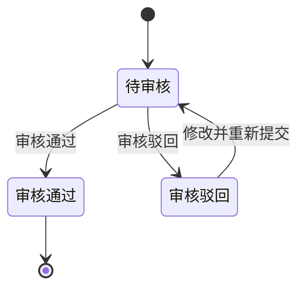

### 15.3 录入与审核规则

1. 账单录入的冲正记录和调账中心批量导入的冲正记录，最终都统一在调账中心审核，且归属账单由财务在审核时确认。
2. 应收账单调账、返款账单调账和成本账单调账共用同一审核入口，但字段、默认归属、审核归属和生效对象按各自账单类型处理。
3. `待审核` 记录可以修改、移除、审核。
4. 提交人只能修改和移除自己提交的待审核记录。
5. 审核人只能审核，不能代替提交人修改内容。
6. `审核通过` 记录进入只读态，不允许再次修改或移除，只能通过新增反向调账修正。
7. `审核驳回` 记录保留驳回原因，提交人可重新编辑后再次提交；重新编辑后仍回到 `待审核` 状态。
8. 批量移除、批量审核仅对待审核记录生效，混入其它状态时应禁用相应操作。
9. 归属账单未确认且系统未生成有效默认归属的调账记录，不允许审核通过。
10. 调账记录必须明确记录来源、去向、金额、币种、原因和凭证。
11. 成本金额冲正必须关联供应商、原成本账单、原成本明细和受影响业务对象；成本核销冲正必须关联原结清记录，并明确错误记录、反向记录和正确记录之间的关系。
12. 成本调账的提交人与审核人必须分离；审核人不得修改提交内容后直接通过。

### 15.4 生效与归属规则

1. 应收账单中的特定费项冲正完成后，系统按费项归属把结果计入对应应收账单的本期调账或往期调账，不直接覆盖历史快照。
2. 返款账单中的特定费项冲正完成后，系统按费项归属把结果计入对应返款账单的本期调账或往期调账，不直接覆盖历史快照。
3. 调账通过审核后，才允许影响对应应收账单或返款账单的应收金额、应返金额或核销结果，或者影响成本调整记录、成本归属、成本核销结果和利润分析。
4. 如果原始金额已经进入 `BMS费项池`，修正动作必须走调账中心，不允许直接回写源数据。
5. 已结清账单若再发现差异，不能直接改写历史账单金额，必须通过后续账单、反向调账承接。
6. 调账记录一旦审核通过，必须保留历史状态、审核轨迹和凭证，不允许被后续操作直接覆盖。
7. 账单中的任何未移除冲正记录，只有在调账中心全部审核通过后，整份账单才允许审核通过。
8. 调账中心也不触发源数据重采，不改变 `BMS检阅标记` 的状态流转。
9. 已结清成本账单发生金额差异时，调账中心生成新的成本调整明细和关联关系，原成本账单金额、编号和状态保持不变。
10. 已结清成本账单发生核销信息错误时，调账中心以新增反向核销记录和正确核销记录完成修正，不修改或删除原核销流水。
11. 成本调账形成待结清差额时，差额按供应商、币种和成本账期形成独立待结清记录；后续结清该差额不改变原成本账单状态。
12. 成本调账影响间接成本时，必须生成新的分摊版本；影响已确认`成本已齐`订单时，必须退回`成本未齐`并重算利润。

### 15.5 自动归属规则

1. 对于尚未归属任何应收账单的应收账单调账记录，系统在导入后先预生成默认归属，但该归属不等于最终审核归属。
2. 对于尚未归属任何返款账单的返款账单调账记录，系统在导入后先预生成默认归属，但该归属不等于最终审核归属。
3. 调账记录的归属账单由财务在审核时最终确认；财务可以沿用系统预生成的默认归属，也可以手动改派到另一份待审核或起草中的同类型账单。
4. 应收账单调账默认优先选择同客户、同账期内的待审核应收账单；如果没有待审核应收账单，再选择起草中的应收账单。
5. 返款账单调账默认优先选择同客户、同账期内的待审核返款账单；如果没有待审核返款账单，再选择起草中的返款账单。
6. 在同一客户、同一账期内，若可候选账单中存在财务本位币汇总金额最高的那一份，应优先选择该账单作为默认归属。
7. 选择财务本位币汇总金额最高的账单，是为了让冲正金额叠加后更不容易把单张账单推到负值。
8. 若候选账单的财务本位币汇总金额相同，系统应按账单编号升序选出唯一承接账单，账单编号以固定且唯一的规则生成，不会重复。
9. 自动归属只处理尚未归属任何应收账单或返款账单的调账记录，不影响已经归属完成的记录。
10. 成本账单调账不使用客户账单的自动归属算法。成本调账必须明确关联原成本账单；无法关联原成本账单的新增成本，应作为新的成本明细或新的成本账单处理，不得由系统猜测归属。


### 15.6 与账单的关系

1. 应收账单中的调账影响应收金额、已收金额和未收金额的展示与核销口径。
2. 返款账单中的调账影响应返金额、已返金额和未返金额的展示与核销口径。
3. 成本账单中的成本金额冲正影响成本调整金额、成本归属和利润；成本核销冲正影响结清流水及人民币换算结果，但不改变原成本账单的`已结清`状态。
4. 调账中心只是修正入口，不等于应收账单、返款账单或成本账单本身。
5. 调账中心产生的结果最终仍要由对应账单线或独立成本调整记录承接，不能绕过账单直接改写历史结果。

## 16. 非功能需求

非功能需求约束的是系统在所有账单模块中的横向表现。它不重新定义业务规则，但必须保证账单生成、审核、核销、调账、导出和追溯过程稳定、可控、可复盘。

### 16.1 权限与职责边界

1. 系统必须按角色控制配置、生成、审核、发送、核销、反核销、调账、冲正、导出和回款管理等操作。
2. 同一笔业务操作应区分提交人、审核人、核销人和查询人；需要审核的动作不得由同一角色绕过审核直接生效。
3. 待审核、待结清、已结清等状态下的可执行操作必须与各章节状态机一致，页面按钮、批量操作和接口入口都必须遵守同一权限口径。
4. 无权限操作必须给出明确提示，并记录拦截结果；不得仅隐藏入口而缺少服务端校验。
5. 导出权限应单独控制。能查看账单不代表一定能导出客户对账报表或内部审计信息。
6. 成本中心应分别控制供应商档案维护、成本费项索引维护、导入设置快照中的费项映射维护、供应商账单导入、单号关系维护、成本类型切换、成本归属、分摊规则维护、分摊执行、结清登记、成本调账、利润查看和内部成本导出权限，不得用单一“成本中心管理”权限覆盖全部高风险操作。
7. 成本金额冲正、成本核销冲正、分摊规则变更和`成本已齐`确认应区分提交人与审核或确认人；同一人员是否允许兼任由角色权限明确配置，不得由页面临时放开。

### 16.2 数据一致性与防回写

1. 已进入审核、待结清或已结清阶段的账单，不得被后续配置变更、汇率变更、源数据变化或重跑任务直接回写。
2. 已被 `BMS费项池` 成功采集的来源金额，不允许在数据源侧直接删除或覆盖；修正必须通过补录、调账、冲正或后续账单承接。
3. 源数据行级标记、账单明细、金额汇总、核销流水和调账记录之间必须保持一致；任一环节失败时，不得出现只更新部分结果的状态。
4. 同一来源费项只能按业务用途进入对应账单线。返款扣减项被返款账单占用后，应收账单不得再次把该金额作为可核销应收金额。
5. 账单结清后触发的支付状态同步，只能更新支付状态，不得改写费项金额、币种、汇率、账单快照或历史核销结果。

### 16.3 幂等、并发与恢复保护

本节只定义系统横向保护要求，不重复定义账单重跑的业务分流规则；具体重跑路径和状态边界见`10. 账单重跑机制`。

1. 账单生成、失败重试、补跑、重跑、金额重算、导入和核销动作必须具备幂等保护，重复触发不得生成重复账单、重复明细、重复核销或重复调账结果。
2. 同一客户、同一账期、同一配置组的账单生成流程不得并发执行；已有任务执行中时，后续任务应提示被占用或排队处理。
3. 源数据被任务锁定期间，不得被其它任务重复采集；锁定失败、任务中断或执行超时必须有可恢复处理。
4. 一般批量操作应保证每条记录的成功、失败和失败原因可见，不能用整体成功掩盖部分失败；`13.5 成本费项标准化与供应商账单导入`按整批原子规则处理，只允许完全成功或失败，不适用部分成功口径。
5. 重跑或重算后的结果必须能与原账单结果、来源快照和操作原因关联，避免财务无法解释金额变化；具体留痕字段见`10.11 异常提示与审计`。

### 16.4 金额、币种与精度

1. 所有金额展示、汇总、核销和导出必须明确金额所属币种，不得把不同结算币种金额混合成单一余额。
2. 原始币种金额、费项结算币种金额、货款结算币种金额、财务本位币金额和汇兑损益必须按`14. 金额汇兑`的口径计算与展示。
3. 汇率一旦在账单侧锁定，后续市场汇率、基准汇率表或客户级汇率配置变化不得自动影响历史账单金额。
4. 金额计算应保持明细、币种分桶汇总、账单总览、核销余额和导出结果一致。
5. 负数、超收、超返、部分核销和跨账期冲正必须有明确提示，不能只在后台形成异常状态。

### 16.5 对账导出与信息边界

1. 对账报表面向客户与财务对账，不是系统审计报表；导出内容只保留客户核对账单结果所需的信息。
2. 应收账单和返款账单导出必须按对账报表整合格式输出账单基本信息、结算币种分桶金额汇总、账单明细和往期账单冲正信息。
3. 导出文件不得包含内部任务状态、内部快照版本、内部审批意见、源数据锁定标记、系统审计字段或客户不需要关注的技术字段。
4. 客户要求追加字段时，只允许追加订单费用报表中可用于识别、筛选或辅助核对的非金额字段；不得追加会造成金额口径混乱的原始金额、内部汇率或内部结算字段。
5. 导出结果必须与页面当前生效账单结果一致；历史快照只用于系统内审计、追溯和防回写判断，不作为对账报表导出对象。

### 16.6 可用性与操作体验

1. 财务日常高频页面应围绕账期、客户、账单状态、审核状态、核销状态、回款状态和异常状态提供清晰筛选。
2. 列表、详情、金额汇总、明细区和核销记录之间的字段命名必须一致，避免同一含义在不同页面使用不同名称。
3. 关键动作必须在提交前展示影响范围，例如影响的账单、费项、金额、币种、核销结果和是否会产生调账或冲正。
4. 审核、核销、反核销、重跑、折返审核、批量移除和批量导出等高风险动作必须有二次确认或明确结果反馈。
5. 页面异常提示应使用财务能理解的业务语言，说明失败原因、影响范围和下一步处理方式。

### 16.7 异常恢复与告警

1. 账单生成、数据采集、导入、核销、导出和支付状态同步失败时，系统必须记录失败原因，并支持财务或管理员按权限重试。
2. 因数据缺失、配置冲突、账期不匹配、币种缺失、汇率缺失、来源已占用或核销金额异常导致失败时，应明确指出需处理的对象。
3. 系统应提供异常清单，帮助财务优先处理影响出账、审核、导出、核销和客户对账的阻断项。
4. 已完成的账单结果不得因后续异常被自动撤销；需要修正时，应按状态机、调账、冲正或反核销规则处理。
5. 异常处理完成后，相关任务、账单、调账记录和来源数据应能回到可继续处理的状态。

### 16.8 数据安全与信息保护

1. 系统应按客户、角色和业务范围控制数据可见性，防止不同客户账单、订单、回款和返款信息被越权查看。
2. 客户对账报表只输出客户可见信息；内部配置、内部审核、内部成本、内部汇率来源和系统审计字段不得向客户暴露。
3. 下载、导出和批量查询应记录操作人、时间、条件和文件类型，便于追溯敏感数据流向。
4. 敏感操作产生的日志应可用于审计，但不得在普通页面暴露不必要的内部实现细节。
5. 历史账单、快照、核销流水和调账记录应按财务审计要求保留，删除或归档策略不得破坏账单追溯链路。

## 17. 内部审计

内部审计用于集中查询 BMS 中影响账单金额、成本归属、结清结果和客户对账结果的关键操作。审计记录只用于内部追溯，不进入客户邮件或对账报表；普通业务页面可以展示与当前对象直接相关的操作记录，但不得允许修改审计内容。

### 17.1 审计范围

以下操作必须形成审计记录：

1. 客户级账单配置、基准汇率表、账单内锁定汇率、客户侧费项索引、成本费项索引、间接成本分摊规则、导入设置快照中的费项映射、场景取值规则、数据源规则和供应商财务档案变更；客户特调汇率变更按`8.4 客户特调汇率规则`只保留最近操作信息，不生成独立审计记录。
2. 账单生成、失败重试、账单重跑、金额重算、审核、驳回、发送、核销、反核销、调账、冲正和导出。
3. 供应商账单导入、导入失败、疑似重复确认、成本账单结清登记、成本金额冲正、成本核销冲正和成本核销汇率锁定。
4. 供应商侧单号关系新增、修改、停用，以及成本明细在直接成本和间接成本之间切换。
5. 分摊池新建、成本明细加入或移出、对象范围变更、分摊因子变更、执行分摊、版本生效和版本失效。
6. 业务订单`成本已齐`确认、退回`成本未齐`和由晚到成本或分摊重算触发的利润重算。

### 17.2 审计记录内容

1. 每条记录至少包含业务模块、操作对象类型、操作对象编号、操作类型、操作人、操作时间、操作原因、前值快照、后值快照和执行结果。
2. 涉及账单、任务、订单、尾程包裹、成本明细、分摊池或调账时，应保存相应关联编号，使财务能够沿业务链路追溯。
3. 系统自动触发的操作应把操作主体标记为`系统`，同时记录触发来源和关联业务操作，不得伪装为某个财务人员操作。
4. 操作失败或被系统阻断时，也应记录失败原因和阻断规则；失败记录不得写入虚假的业务后值。
5. 历史快照、金额快照、汇率快照、核销流水和分摊版本只允许追加或生成新版本，不允许静默覆盖。

### 17.3 成本中心专项审计

1. 成本类型切换应记录原成本类型、目标成本类型、原归属对象、目标归属对象、原分摊池、目标分摊池、切换依据和受影响订单。
2. 同一成本明细从一个分摊池迁移到另一个分摊池时，应记录原分摊版本失效和新分摊版本生效的完整过程，证明该成本没有被重复分摊。
3. 分摊规则变更应保存成本费项索引、成本板块、费用场景、适用供应商、供应商收费单位、范围锚点、候选订单条件、业务订单清单、优先与兜底分摊因子、例外处理规则、各币种池金额、尾差处理及变更前后结果。
4. 成本完整性记录应说明财务确认`成本已齐`时检查的应有成本范围、未决明细数量、分摊完成情况和汇率锁定情况；自动退回`成本未齐`时应记录触发原因。
5. 成本核销汇率记录应按币种保存汇率、汇兑方向、确认时间、结清记录和人民币金额；后续汇率配置变化不得修改已锁定记录。
6. 成本归属或分摊变化引起暂估实际利润、实际利润变化时，应记录受影响订单、变更前后利润和重算依据，但不得把利润变化写回客户侧账单。
7. 已结清成本账单的金额冲正应记录原成本账单、原成本明细、冲正金额、新成本调整记录和受影响订单；核销冲正应记录原核销流水、反向流水、正确流水和各自汇率快照。
8. 成本账单不允许返结清。任何试图修改或删除已结清状态、原结清流水或锁定汇率的操作都应被阻断，并记录操作人、操作时间、目标对象和阻断原因。

### 17.4 查询与权限

1. `内部审计`菜单仅对具有审计查询权限的财务管理人员开放；审计记录不得编辑或删除。
2. 支持按业务模块、操作对象、客户、供应商、账单号、主订单号、尾程运单号、成本明细号、分摊池编号、调账记录号、操作人、操作类型和时间范围组合查询。
3. 审计详情应并列展示前值与后值，并提供关联对象跳转；涉及多币种金额时按币种分桶展示。
4. 导出审计结果应受独立权限控制，并记录导出条件、导出人、导出时间和文件结果。
5. 审计记录的保留、归档和查询性能应满足财务审计周期要求，归档后仍不得破坏账单、成本和分摊版本的追溯链路。

## 18. 附录

### 18.1 业务术语表

| 术语 | 定义 | 术语 | 定义 |
| :--- | :--- | :--- | :--- |
| 费项 | 进入账单归集的费项明细，来源于自动计算、导入或手工补录。 | 应收账单 | 天马运通向客户收取费项时出示的账单。 |
| 返款账单 | COD 包裹代收货款返还给客户时出示的账单。 | 成本账单 | 供应商向我方提供、由财务在 BMS 登记并核对的收费账单，用于归集直接成本和分摊间接成本。 |
| 起草中 | 账单按账期持续归集费项的阶段。 | 待审核 | 账单已生成，进入财务审核窗口。 |
| 通知状态 | 系统向客户邮箱发送账单邮件的结果，枚举值为`已通知`、`通知失败`、`未配置邮箱`。 | 待结算 | 账单审核通过后，等待付款或返款完成。 |
| 已结清 | 账单全部金额闭环，仅保留查询与审计。 | 锁定汇率 | 生成或审核时冻结的汇率快照，具体口径见`14. 金额汇兑`。 |
| 仅展示不核销 | 事实金额已进入账单分摊范围，但仅在账单中呈现，不纳入任何账单的核销范围。 | 逾期未结清 | 非真实账单状态，是待结清账单中“超过信用期且未收齐款项”的常用筛选条件和展示标签。 |

### 18.2 业务系统基本面

本节记录当前业务系统（OIS）已经形成的基础事实，账单配置、账单生成规则、以及数据同步均以此为前提。OIS 主要由 OMS、WMS、TMS 构成。

#### 18.2.1 核心对象关系

##### 18.2.1.1 提及原因

BMS 的账单配置、账单生成、对账和核销都建立在 OIS 已有业务对象之上。系统并不是直接面对一张孤立订单，而是沿着`供应链 -> 店铺 -> 会员 / 客户 -> 集运单`这条业务链路识别费用归属。

本节参考`系统核心对象关系图`，并结合现有系统实现完成核对后，将核心对象关系沉淀为产品口径。后续涉及客户级账单配置、客户级汇率配置、费项归集、对账报表和核销时，都应沿用本节定义的对象边界。

##### 18.2.1.2 核心关系概览

OIS 的核心对象关系可以理解为三层：

1. 资源层：供应链、店铺、会员、KA客户 / 货主、集运仓。
2. 产品层：物流渠道 / 尾程承运商、线路报价。
3. 执行层：集运单。

其中，供应链是最上层组织，店铺是对外经营入口，会员是集运客平台的下单主体，KA客户 / 货主是财务和合同更关注的客户主体，集运仓是履约节点，物流渠道和线路报价决定订单采用的运输服务与报价基础，集运单是费用归集和账单生成的核心执行对象。

##### 18.2.1.3 对象关系说明

| 对象 | 产品含义 | 与账单的关系 |
| :--- | :--- | :--- |
| 供应链 | 可理解为一个跨境物流集团或经营组织，是店铺、仓库、客户和物流产品的上层归属。 | BMS 的账单数据必须在供应链范围内隔离，不能跨供应链归集费用或核销款项。 |
| 店铺 | 面向客户经营的服务入口，可配置独立域名、服务客群、启用仓库、物流产品和差异化汇率。 | 店铺决定订单从哪个经营入口产生，也影响账单配置匹配、店铺汇率兜底和对账报表归属。 |
| 会员 | 集运客平台的下单账号，通常由店铺开通和管理。 | 会员是订单下单主体。BMS 生成账单时，需要保留会员维度，避免只按客户名称或订单号归集导致串账。 |
| KA客户 / 货主 | 与供应链或店铺存在业务合作关系的客户主体，可启用集运客平台账号。 | 财务对账通常面向客户 / 货主进行，BMS 需要把客户口径与会员账号、店铺口径关联起来。 |
| 集运仓 | 接收头程包裹、完成仓内作业并推动订单履约的物理节点。 | 仓库不直接等同于账单主体，但会影响出库、核重、订单完结、费用产生和分支账单配置命中。 |
| 物流渠道 / 尾程承运商 | 承运商服务被包装成面向客户可选择的物流产品。 | 决定订单后续运输路径、尾程包裹轨迹和部分费用口径，BMS 只读取订单已沉淀的结果。 |
| 线路报价 | 某店铺下针对特定路线、承运商、重量或体积规则形成的报价方案。 | 决定订单费用产生的报价基础，BMS 不重新判定报价，只归集和快照订单侧已产生费用。 |
| 集运单 | 会员或客户在店铺下形成的核心业务单据，承接包裹、仓库、线路、承运商、费用和履约节点。 | 是 BMS 账单生成的核心执行对象。应收账单、返款账单、回款管理和对账报表都围绕集运单及其费用结果展开。 |

##### 18.2.1.4 已验证的业务事实

结合现有系统实现核对后，本 PRD 按以下业务事实设计 BMS 需求：

1. 一条账单主体链路必须同时包含供应链、店铺、会员和客户相关信息，不能只依赖客户名称或订单号。
2. 店铺和会员不是同一对象：店铺是经营入口，会员是下单账号；同一个客户在不同店铺下产生的订单，需要按店铺维度区分。
3. KA客户 / 货主和会员也不是天然等同：客户是财务对账和合同口径，会员是平台账号口径；BMS 需要在账单快照中保留二者关系。
4. 店铺可启用特定集运仓、物流产品、线路报价和汇率口径，因此店铺是账单配置、汇率兜底和费用归属的重要匹配维度。
5. 集运单已经沉淀了店铺、会员、仓库、承运商、尾程运单、费用和履约节点等信息，BMS 账单生成应读取这些已形成事实，而不是重新定义上游对象关系。
6. 物流产品和线路报价属于订单费用产生前的业务约束，BMS 不重新计算其可用性，只在账单明细、对账报表和追溯信息中保留订单侧结果。

##### 18.2.1.5 BMS 使用口径

1. 客户级账单配置应以客户为财务主体，同时保留供应链、店铺和会员维度。
2. 账单生成必须按订单已沉淀的主体关系归集费用，不能跨供应链、跨店铺或跨客户合并。
3. 分支账单配置可使用业务板块、运抵国、集运仓等条件进一步拆分账单，但不能改变订单原有主体归属。
4. 对账报表面向客户和财务核对，应展示客户能理解的订单、运单、仓库、承运商、费用和状态信息，不暴露系统内部对象编号。
5. 汇率兜底、费用归属、返款归属和核销归属，都必须以账单生成时固化的对象快照为准。
6. BMS 对上游核心对象只做读取、快照和对账，不反向改变 OIS 中的客户、会员、店铺、仓库、物流产品和线路报价配置。

#### 18.2.2 费项支付方式

##### 18.2.2.1 提及原因

费项支付方式是 OIS 已经存在的业务基本面，BMS 账单生成不能只看“费用是否产生”，还必须判断“费用由谁承担、何时支付、是否已经通过其他路径完成支付”。

对 BMS 账单管理来说，支付方式的核心影响如下：

1. 若费项已通过预存款扣款或收方到付完成支付，原则上不应再次作为寄方应收金额进入应收账单。
2. 若费项按账期后付或寄方后付，才需要按客户级账单配置归集到应收账单。
3. 同一类费项在不同业务场景下可能走不同支付路径，账单生成必须保留来源支付方式，便于后续对账、冲正和核销追溯。
4. 支付途径用于识别资金动作来源；支付时机用于判断费项是否进入账单、进入哪类账单以及何时进入账单。

##### 18.2.2.2 支付方式分类

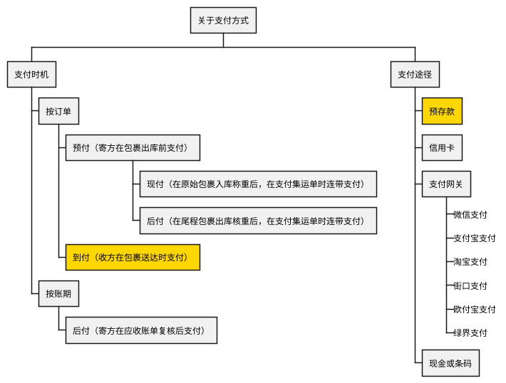

预付下的`现付`和`后付`是在运抵国配置面板中设置的运抵国级规则。BMS 只读取 OIS 已沉淀到来源数据中的支付时机结果，用于判断费用是否已通过预付链路完成支付，以及是否还需要进入应收账单。

##### 18.2.2.3 超材费扣款逻辑示例

超材费用于说明同一费项在不同支付条件下的归属差异。系统计算出超材费后，需要先判断寄方预存款是否足以覆盖该费用；若不能覆盖，再根据费项收取方式判断由收方到付还是寄方后付。

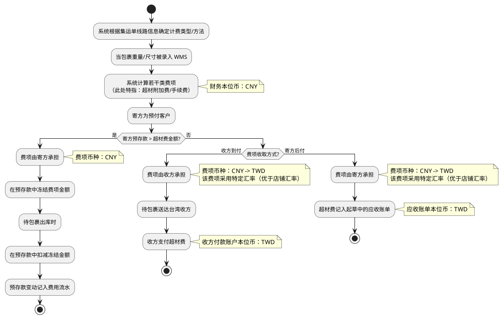

##### 18.2.2.4 账单生成影响

1. 预存款扣款场景下，费用应体现为预存款冻结、扣减和费用流水，不再重复进入应收账单应收金额。
2. 收方到付场景下，费用由收方支付，BMS 可保留展示和追溯信息，但不得作为寄方应收账单的可核销应收金额。
3. 寄方后付场景下，费用应进入起草中的应收账单，并按`7. 客户级账单配置`和`14. 金额汇兑`形成账单金额。
4. 支付方式、承担方、支付币种、汇率口径和资金流水应在来源数据或账单明细中保留可追溯关系，避免后续重跑、补录或冲正时重复归集。

#### 18.2.3 费项数据源

##### 18.2.3.1 提及原因

BMS 费项归集需要先明确每个费项从 OIS 哪个字段或哪类明细读取、归属于哪个业务对象、进入账单时应按什么费项类型处理，以及该字段是否属于系统计算链路、最早在哪个业务时机产生。本节作为`BMS费项池`、应收账单、返款账单和成本账单读取来源数据的产品口径基准。

费项挂靠对象用于标识费项归属的最小业务层级，只允许归属于`财务账单`、`业务订单`、`尾程包裹`、`首程包裹`四类之一。当前 OIS 中的集运单按`业务订单`口径处理；表格中的`不限`表示该类来源规则不预先限定单一挂靠层级，进入 BMS 时仍需按实际业务归属落到上述四类挂靠对象之一。

下表中的`费项类型`基于财务视角判定，用于表达该来源金额进入账单后的归集方向、正负方向和核销边界；不得仅按业务字段名、操作名称或资金动作字面含义直接判断。

1. `应收类`：可作为客户应收费用进入应收账单。
2. `应收扣减类`：用于抵减客户应收金额，不应按正向应收费用重复收取。
3. `应付类`：仅用于成本账单，表示应向供应商、承运商或其他服务方支付或确认的成本费用；从应收账单和返款账单角度，不存在`应付类`费项。
4. `代收类`：表示代客户收取的资金，不等同于服务费收入。
5. `代付类`：表示代客户垫付或支付的资金，不等同于服务费收入。
6. `非费项`：不纳入任何账单的核销范围，仅在返款账单、回款管理等特定位置作为业务事实、返款核对或资金核对信息呈现。

应收账单生成时，费项金额方向按以下规则处理：`应收扣减类`记为负数，`代收类`记为负数，`代付类`记为正数。也就是说，应收扣减和代收资金用于冲减客户应付金额，代付资金表示客户应补偿我方垫付或支付的金额。

##### 18.2.3.2 数据源清单

<style>
.fee-source-table {
  border-collapse: collapse;
  width: 100%;
}
.fee-source-table th {
  background-color: #000000;
  color: #ffffff;
  border: 1px solid #666666;
  padding: 4px 6px;
  text-align: left;
}
.fee-source-table td {
  border: 1px solid #999999;
  padding: 3px 6px;
}
.fee-source-table .source-extend { background-color: #f4cccc; }
.fee-source-table .source-header { background-color: #d9ead3; }
.fee-source-table .source-fee-detail { background-color: #f4cccc; }
.fee-source-table .source-claim { background-color: #d9ead3; }
.fee-source-table .source-additional { background-color: #ffffff; }
</style>
<table class="fee-source-table">
  <thead>
    <tr>
      <th>数据源</th>
      <th>费项名称</th>
      <th>挂靠对象</th>
      <th>费项类型</th>
      <th>是否机算</th>
      <th>首次产生于哪个业务时机</th>
    </tr>
  </thead>
  <tbody>
    <tr class="source-extend"><td><code>ofp_ofdb1.sale_order_header_extend.tail_freight_amount</code></td><td>派送费</td><td>业务订单</td><td>应收类</td><td><code>是</code></td><td>业务订单完成核重</td></tr>
    <tr class="source-extend"><td><code>ofp_ofdb1.sale_order_header_extend.system_service_amount</code></td><td>系统服务费</td><td>业务订单</td><td>应收类</td><td><code>是</code></td><td>业务订单完成核重</td></tr>
    <tr class="source-extend"><td><code>ofp_ofdb1.sale_order_header_extend.packing_amount</code></td><td>打包费</td><td>业务订单</td><td>应收类</td><td><code>是</code></td><td>业务订单完成核重</td></tr>
    <tr class="source-extend"><td><code>ofp_ofdb1.sale_order_header_extend.overweight_amount</code></td><td>超重费</td><td>业务订单</td><td>应收类</td><td><code>是</code></td><td>业务订单完成核重</td></tr>
    <tr class="source-extend"><td><code>ofp_ofdb1.sale_order_header_extend.overmaterial_amount</code></td><td>超材费</td><td>业务订单</td><td>应收类</td><td><code>是</code></td><td>业务订单完成核重</td></tr>
    <tr class="source-extend"><td><code>ofp_ofdb1.sale_order_header_extend.overlength_amount</code></td><td>超长费</td><td>业务订单</td><td>应收类</td><td><code>是</code></td><td>业务订单完成核重</td></tr>
    <tr class="source-extend"><td><code>ofp_ofdb1.sale_order_header_extend.marketing_activity_discount_amount</code></td><td>满减活动优惠金额</td><td>业务订单</td><td>应收扣减类</td><td><code>是</code></td><td>下单核价</td></tr>
    <tr class="source-header"><td><code>ofp_ofdb1.sale_order_header.weight_charge_amount</code></td><td>超重费</td><td>业务订单</td><td>应收类</td><td><code>否</code></td><td>--</td></tr>
    <tr class="source-header"><td><code>ofp_ofdb1.sale_order_header.warehouse_rental_amount</code></td><td>仓租费用</td><td>业务订单</td><td>应收类</td><td><code>是</code></td><td>下单核价</td></tr>
    <tr class="source-header"><td><code>ofp_ofdb1.sale_order_header.user_coupon_fee</code></td><td>优惠券优惠金额</td><td>业务订单</td><td>应收扣减类</td><td><code>是</code></td><td>下单核价</td></tr>
    <tr class="source-header"><td><code>ofp_ofdb1.sale_order_header.tax_premium_amount</code></td><td>包税手续费</td><td>业务订单</td><td>应收类</td><td><code>是</code></td><td>下单核价</td></tr>
    <tr class="source-header"><td><code>ofp_ofdb1.sale_order_header.material_charge_amount</code></td><td>包材费</td><td>业务订单</td><td>应收类</td><td><code>否</code></td><td>--</td></tr>
    <tr class="source-header"><td><code>ofp_ofdb1.sale_order_header.length_charge_amount</code></td><td>超长费</td><td>业务订单</td><td>应收类</td><td><code>否</code></td><td>--</td></tr>
    <tr class="source-header"><td><code>ofp_ofdb1.sale_order_header.integral_fee</code></td><td>积分优惠金额</td><td>业务订单</td><td>应收扣减类</td><td><code>是</code></td><td>下单核价</td></tr>
    <tr class="source-header"><td><code>ofp_ofdb1.sale_order_header.insurance_amount</code></td><td>保险金额</td><td>业务订单</td><td>应收类</td><td><code>否</code></td><td>--</td></tr>
    <tr class="source-header"><td><code>ofp_ofdb1.sale_order_header.freight</code></td><td>运费</td><td>业务订单</td><td>应收类</td><td><code>是</code></td><td>下单核价</td></tr>
    <tr class="source-header"><td><code>ofp_ofdb1.sale_order_header.forwarding_charge_amount</code></td><td>转运费用</td><td>业务订单</td><td>应收类</td><td><code>否</code></td><td>--</td></tr>
    <tr class="source-header"><td><code>ofp_ofdb1.sale_order_header.dest_division_amount</code></td><td>偏远地区费用</td><td>业务订单</td><td>应收类</td><td><code>是</code></td><td>下单核价</td></tr>
    <tr class="source-header"><td><code>ofp_ofdb1.sale_order_header.compensation_price</code></td><td>保价金额</td><td>业务订单</td><td>应收类</td><td><code>否</code></td><td>--</td></tr>
    <tr class="source-header"><td><code>ofp_ofdb1.sale_order_header.compensation_premium_amount</code></td><td>保价手续费</td><td>业务订单</td><td>应收类</td><td><code>是</code></td><td>下单核价</td></tr>
    <tr class="source-header"><td><code>ofp_ofdb1.sale_order_header.advance_amount</code></td><td>垫付金额</td><td>业务订单</td><td>代付类</td><td><code>是</code></td><td>下单核价</td></tr>
    <tr class="source-header"><td><code>ofp_ofdb1.sale_order_header.collection_price</code></td><td>代收货款</td><td>业务订单</td><td>代收类</td><td><code>否</code></td><td>--</td></tr>
    <tr class="source-header"><td><code>ofp_ofdb1.sale_order_header.collection_premium_amount</code></td><td>代收货款手续费</td><td>业务订单</td><td>应收类</td><td><code>否</code></td><td>--</td></tr>
    <tr class="source-header"><td><code>ofp_ofdb1.sale_order_header.cod_price</code></td><td>到付金额</td><td>业务订单</td><td>非费项</td><td><code>是</code></td><td>下单核价</td></tr>
    <tr class="source-header"><td><code>ofp_ofdb1.sale_order_header.cod_amount</code></td><td>货到付款手续费</td><td>业务订单</td><td>非费项</td><td><code>是</code></td><td>下单核价</td></tr>
    <tr class="source-fee-detail"><td><code>ofp_ofdb1.sale_order_fee_detail.collection</code></td><td>应返货款</td><td>业务订单</td><td>代收类</td><td><code>否</code></td><td>--</td></tr>
    <tr class="source-fee-detail"><td><code>ofp_ofdb1.sale_order_fee_detail.recovery_money</code></td><td>实收回款</td><td>业务订单</td><td>非费项</td><td><code>否</code></td><td>--</td></tr>
    <tr class="source-fee-detail"><td><code>ofp_ofdb1.sale_order_fee_detail.receivable_collection_amount</code></td><td>代收货款手续费</td><td>业务订单</td><td>应收类</td><td><code>否</code></td><td>--</td></tr>
    <tr class="source-fee-detail"><td><code>ofp_ofdb1.sale_order_fee_detail.resend_fee</code></td><td>重出费</td><td>业务订单</td><td>应收类</td><td><code>否</code></td><td>--</td></tr>
    <tr class="source-claim"><td><code>ofp_ofdb1.claim_order.claim_amount</code></td><td>理赔费</td><td>业务订单</td><td>应收扣减类</td><td><code>否</code></td><td>--</td></tr>
    <tr class="source-additional"><td><code>ofp_ofdb1.sale_order_additional_matter where fee_item_type="超材费"</code></td><td>超材费</td><td>不限</td><td>应收类</td><td><code>可能</code></td><td>--</td></tr>
    <tr class="source-additional"><td><code>ofp_ofdb1.sale_order_additional_matter where fee_item_type="转板费"</code></td><td>转板费</td><td>不限</td><td>应收类</td><td><code>否</code></td><td>--</td></tr>
    <tr class="source-additional"><td><code>ofp_ofdb1.sale_order_additional_matter where fee_item_type="退运费"</code></td><td>退运费</td><td>不限</td><td>应收类</td><td><code>否</code></td><td>--</td></tr>
    <tr class="source-additional"><td><code>ofp_ofdb1.sale_order_additional_matter where fee_item_type="税金"</code></td><td>税金</td><td>不限</td><td>应收类</td><td><code>否</code></td><td>--</td></tr>
    <tr class="source-additional"><td><code>ofp_ofdb1.sale_order_additional_matter where fee_item_type="税费"</code></td><td>税费</td><td>不限</td><td>应收类</td><td><code>否</code></td><td>--</td></tr>
    <tr class="source-additional"><td><code>ofp_ofdb1.sale_order_additional_matter where fee_item_type="木架费"</code></td><td>木架费</td><td>不限</td><td>应收类</td><td><code>否</code></td><td>--</td></tr>
    <tr class="source-additional"><td><code>ofp_ofdb1.sale_order_additional_matter where fee_item_type="加收地址附加费"</code></td><td>加收地址附加费</td><td>不限</td><td>应收类</td><td><code>否</code></td><td>--</td></tr>
    <tr class="source-additional"><td><code>ofp_ofdb1.sale_order_additional_matter where fee_item_type="加固包装费"</code></td><td>加固包装费</td><td>不限</td><td>应收类</td><td><code>否</code></td><td>--</td></tr>
    <tr class="source-additional"><td><code>ofp_ofdb1.sale_order_additional_matter where fee_item_type="国内转寄"</code></td><td>国内转寄</td><td>不限</td><td>应收类</td><td><code>否</code></td><td>--</td></tr>
    <tr class="source-additional"><td><code>ofp_ofdb1.sale_order_additional_matter where fee_item_type="国内到付"</code></td><td>国内到付</td><td>不限</td><td>应收类</td><td><code>否</code></td><td>--</td></tr>
    <tr class="source-additional"><td><code>ofp_ofdb1.sale_order_additional_matter where fee_item_type="改单费"</code></td><td>改单费</td><td>不限</td><td>应收类</td><td><code>否</code></td><td>--</td></tr>
    <tr class="source-additional"><td><code>ofp_ofdb1.sale_order_additional_matter where fee_item_type="分单费"</code></td><td>分单费</td><td>不限</td><td>应收类</td><td><code>否</code></td><td>--</td></tr>
    <tr class="source-additional"><td><code>ofp_ofdb1.sale_order_additional_matter where fee_item_type="罚款"</code></td><td>罚款</td><td>不限</td><td>应收类</td><td><code>否</code></td><td>--</td></tr>
    <tr class="source-additional"><td><code>ofp_ofdb1.sale_order_additional_matter where fee_item_type="店取费"</code></td><td>店取费</td><td>不限</td><td>应收类</td><td><code>否</code></td><td>--</td></tr>
    <tr class="source-additional"><td><code>ofp_ofdb1.sale_order_additional_matter where fee_item_type="代客收台币"</code></td><td>代客收台币</td><td>不限</td><td>代收类</td><td><code>否</code></td><td>--</td></tr>
    <tr class="source-additional"><td><code>ofp_ofdb1.sale_order_additional_matter where fee_item_type="代客付台币"</code></td><td>代客付台币</td><td>不限</td><td>代付类</td><td><code>否</code></td><td>--</td></tr>
    <tr class="source-additional"><td><code>ofp_ofdb1.sale_order_additional_matter where fee_item_type="超重费"</code></td><td>超重费</td><td>不限</td><td>应收类</td><td><code>否</code></td><td>--</td></tr>
    <tr class="source-additional"><td><code>ofp_ofdb1.sale_order_additional_matter where fee_item_type="超长费"</code></td><td>超长费</td><td>不限</td><td>应收类</td><td><code>否</code></td><td>--</td></tr>
    <tr class="source-additional"><td><code>ofp_ofdb1.sale_order_additional_matter where fee_item_type="超材手续费"</code></td><td>超材手续费</td><td>不限</td><td>应收类</td><td><code>否</code></td><td>--</td></tr>
    <tr class="source-additional"><td><code>ofp_ofdb1.sale_order_additional_matter where fee_item_type="缠膜费"</code></td><td>缠膜费</td><td>不限</td><td>应收类</td><td><code>否</code></td><td>--</td></tr>
    <tr class="source-additional"><td><code>ofp_ofdb1.sale_order_additional_matter where fee_item_type="仓租费"</code></td><td>仓租费</td><td>不限</td><td>应收类</td><td><code>否</code></td><td>--</td></tr>
    <tr class="source-additional"><td><code>ofp_ofdb1.sale_order_additional_matter where fee_item_type="报关费"</code></td><td>报关费</td><td>不限</td><td>应收类</td><td><code>否</code></td><td>--</td></tr>
    <tr class="source-additional"><td><code>ofp_ofdb1.sale_order_additional_matter where fee_item_type="派送费"</code></td><td>派送费</td><td>不限</td><td>应收类</td><td><code>否</code></td><td>--</td></tr>
  </tbody>
</table>

说明：

1. `是否系统计算项 = 是` 表示该费项在当前代码中存在明确的系统计算或汇总链路；`是否系统计算项 = 否` 表示该费项不属于系统计算项，作为历史兼容字段、人工登记字段、后置录入字段或外部导入事实字段，其`首次产生于哪个业务时机`统一记为`--`；`可能`表示该费项在特定场景下可能由系统计算，也可能由人工登记，进入 BMS 时需保留来源记录。
2. 表中“下单核价”早于“业务订单完成核重”；前者对应订单核价阶段的费用测算，后者对应尾程包裹完成核重后触发的费用汇总与回填。
3. `sale_order_header_extend` 和 `sale_order_header` 中的金额字段是集运单横表来源；同名或近似费项同时存在时，BMS 应按客户侧费项索引和来源规则明确优先级，避免重复归集。
4. `sale_order_fee_detail` 中的导入字段主要服务订单费用报表导入后的返款、回款和手续费核对；其中应返货款属于代付类资金，实回货款属于返款事实或资金事实，不作为普通应收费项。
5. `sale_order_additional_matter` 通过 `fee_item_type` 区分附加事项费项，除`超材费`可能存在系统计算场景外，其他附加事项均按人工登记口径处理；该类附加事项可能挂靠`业务订单`、`尾程包裹`或`首程包裹`，进入 BMS 时必须保留原始挂靠关系。
6. `代收货款`、`应返货款`等代收 / 代付资金可以参与返款账单、回款管理或对账展示，但不得进入客户应收账单的普通应收费用合计；`cod_price`、实回货款等非费项核对事实字段仅在返款账单、回款管理等特定位置呈现，不纳入任何账单核销范围。

#### 18.2.4 订单完成出库前的费项重算窗口

##### 18.2.4.1 提及原因

BMS 账单生成依赖 OIS 数据源中的费项原始金额。若在订单完成出库前就把费项金额同步到 `BMS费项池`，后续 WMS 核重回传、包裹增删、支付变化、补录或重算仍可能改变费项横表金额，导致 BMS 已采集金额与 OIS 最新金额不一致。

因此，本节需要明确：订单完成出库前属于费项重算窗口，费项金额还未稳定；BMS 不应把该阶段的金额视为最终出账依据。只有订单完成出库后，费项横表金额才进入相对稳定口径，适合作为 BMS 同步、账单生成、冲正和追溯的基础。

##### 18.2.4.2 业务口径

`sale_order_header.calc_fee_status` 可以理解为业务订单的计费状态。对于费项横表而言，业务订单完成出库前，所有自动计算项都可能因为包裹回传、支付变化或补录动作再次发生计算，因此这一阶段的费项金额并不稳定。

为了避免 `BMS费项池` 同步之后，费项横表原始金额继续变化，`BMS费项池` 的同步时点应落在业务订单完成出库时。也就是说，出库前允许二次计费，出库后再进入 BMS 同步和后续账单流程，这样才能把原始金额稳定在同一版口径上。

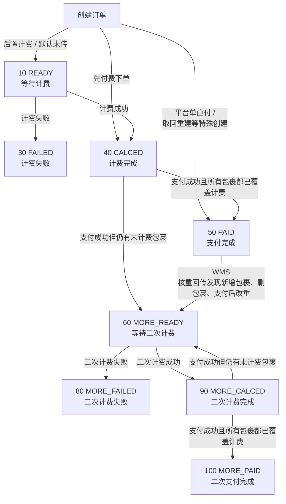

上图说明的是订单从首次计费到二次计费完成的状态流转：只要订单仍可能从 `PAID`、`CALCED` 或 `MORE_CALCED` 回到 `MORE_READY`，就表示费用仍可能被重新计算或补充，不能把当前费项金额视为最终稳定结果。BMS 判断同步时点时，应同时参考本节的重算窗口和`18.2.3 费项数据源`中的字段产生时机，避免提前采集仍可能变化的费项金额。

#### 18.2.5 广义签收

##### 18.2.5.1 提及原因

当`7. 客户级账单配置`中的应收账单配置将`履约节点`选择为`订单完结`时，账单生成任务会先按`订单完结时间`从数据源筛选本期要归集的订单。

当前 OIS 数据源 `sale_order_header` 没有`订单完结时间`字段，需要新增该字段，并由 OIS 定时任务维护。该任务根据订单下尾程包裹的 TMS 物流末条轨迹判断是否命中广义签收状态；若订单只有一个尾程包裹，则该包裹命中广义签收后，将末条轨迹时间写入数据源`订单完结时间`；若订单有多个尾程包裹，则必须全部尾程包裹均命中广义签收后，订单才算完结，并将满足条件时的最新末条轨迹时间写入数据源`订单完结时间`。

这里的广义签收是判断`订单完结`的业务口径，不是一个新的物流状态，也不等同于狭义的“正常签收”。当订单下全部尾程包裹的履约结果均已足以判断订单可进入应收账单归集时，该订单可视为达到广义签收口径。

##### 18.2.5.2 状态范围

当前纳入广义签收的末条轨迹状态如下：

| 轨迹状态 | 枚举名               | 枚举码   | 业务含义                   |
| :--- | :--- | :--- | :--- |
| 已妥投  | `SEND_COMPLETE`   | `220` | 尾程已完成正常妥投或签收           |
| 出柜   | `OUT_CABINET`     | `223` | 柜机、自提点或门店场景下，订单已进入取件完成 |
| 退件登记 | `RETURN_ORDER`    | `230` | 订单已进入退件链路并完成退件登记       |
| 退回妥投 | `RETURN_DELIVERY` | `250` | 退件链路已完成退回妥投            |
| 退货收货 | `RETURN_RECEIPT`  | `270` | 退货链路中，退回方或仓库已完成收货      |
| 退货上架 | `RETURN_PUTAWAY`  | `280` | 退货已完成仓库上架              |


### 18.3 系统功能清单

所有 BMS 菜单统一收口到`账单系统`根节点。下图中带方框的节点是真实菜单；无方框节点只用于标识菜单所属的业务标签，不提供独立入口。

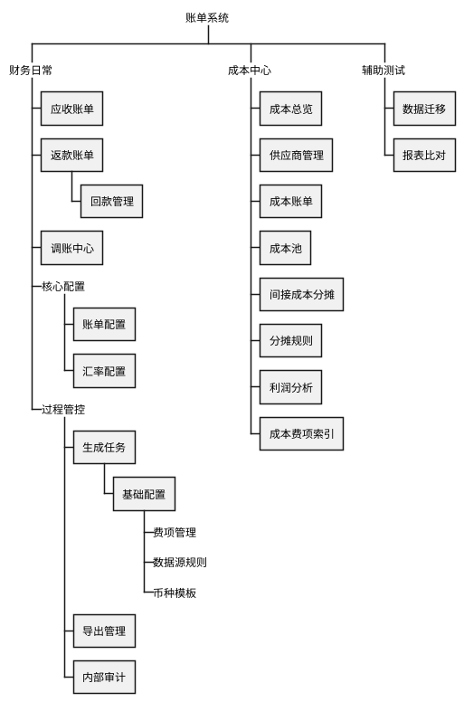

菜单功能清单仅列出 WBS 中带方框的真实菜单：

| 所属标签路径 | 真实菜单 | 主要能力 | 对应需求章节 |
| :--- | :--- | :--- | :--- |
| 财务日常 | 应收账单 | 查询、审核、发送、结算、补录、冲正、核销及跟踪应收账单异常 | `11. 应收账单模块` |
| 财务日常 | 返款账单 | 查询、审核、发送和结清返款账单，核对 COD 货款、扣减项及应返金额 | `12. 返款账单模块` |
| 财务日常 | 回款管理 | 登记和核对派送商回款，查看回款状态及回款金额 | `12.8 回款管理` |
| 财务日常 | 调账中心 | 处理补录、调账、冲正、重整及历史账单差异承接 | `15. 调账中心` |
| 财务日常 / 核心配置 | 账单配置 | 维护客户级应收和返款配置，包括账期、履约节点、限定情形、币种及版本 | `7. 客户级账单配置` |
| 财务日常 / 核心配置 | 汇率配置 | 维护基准汇率、客户特调汇率和账单特调汇率，查看默认汇率结果 | `8. 客户级汇率配置` |
| 财务日常 / 过程管控 | 生成任务 | 查看账单生成任务和源数据同步任务，跟踪执行结果并处理失败或待重试任务 | `10.10 页面入口与权限` |
| 财务日常 / 过程管控 | 基础配置 | 在费项管理、数据源规则和币种模板标签下，维护费项口径、数据来源、场景规则及结算币种规则 | `9.5 客户侧费项配置工作台整合方案`、`9.6 数据源同步至BMS费项池`、`14.2 费项结算币种模板` |
| 财务日常 / 过程管控 | 导出管理 | 跟踪应收和返款账单导出进度，下载结果、重试失败任务并维护对账报表导出配置 | `18.6.2 导出管理` |
| 财务日常 / 过程管控 | 内部审计 | 查询账单、配置、导入、核销、调账、导出、结清、成本归属及分摊版本等关键操作记录 | `17. 内部审计` |
| 成本中心 | 成本总览 | 汇总供应商收费、成本归属、待处理事项、成本完整性和利润概况 | `13.2 成本分层归集`、`13.10 成本分析、完整性与利润` |
| 成本中心 | 供应商管理 | 维护供应商财务档案、成本账期类型、适用成本板块和金额统计 | `13.4 供应商管理` |
| 成本中心 | 成本账单 | 导入并核对供应商账单，登记待结清或已结清状态 | `13.5 成本费项标准化与供应商账单导入`、`13.8 成本账单结清与调账` |
| 成本中心 | 成本池 | 查看逐行成本明细，确认直接成本归属或将间接成本纳入唯一分摊池 | `13.6 成本识别与归属` |
| 成本中心 | 间接成本分摊 | 建立分摊池、圈定候选业务订单、试算并执行间接成本分摊 | `13.7 间接成本分摊` |
| 成本中心 | 分摊规则 | 分页维护基础分摊规则和供应商特调分摊规则；供应商特调规则优先于基础规则 | `13.7.3 分摊规则与因子选择` |
| 成本中心 | 利润分析 | 按业务订单查看收入、直接成本、间接成本、利润及成本完整性 | `13.10 成本分析、完整性与利润` |
| 成本中心 | 成本费项索引 | 按五大成本板块维护标准成本费项及供应商原始名称识别口径 | `13.5.2 成本费项索引` |
| 辅助测试 | 数据迁移 | 在测试环境中同步指定生产数据并重置测试所需标记 | `18.4.1 同步生产环境数据` |
| 辅助测试 | 报表比对 | 仅在财务试运营 BMS 阶段比对财务侧报表和系统侧报表，定位缺单、重复及费项差异 | `18.4.2 财务侧报表与系统侧报表比对` |

### 18.4 辅助测试功能

#### 18.4.1 同步生产环境数据

同步生产环境数据用于把生产或指定来源中的集运订单、订单扩展、附加费、包裹费用、费用明细和理赔单等验证数据复制到测试客户名下，支撑账单生成、附加费归集、费用明细归集、理赔抵扣、重跑和核销链路验证。该能力只服务内部测试验证，不属于财务日常生产操作。

##### 18.4.1.1 使用边界与安全要求

同步生产环境数据是高风险内部测试能力，必须先限定环境、权限和连接安全，再允许用户选择同步范围。

1. 环境边界：仅允许在测试环境或经授权的内部验证环境使用，生产环境不得开放同步生产环境数据入口。
2. 写入边界：同步动作只能写入目标测试客户，不得改写来源客户、来源订单和来源费用。
3. 标记重置：执行同步会重置目标数据的 BMS 计费 / 付款相关标记，使同步后的数据可重新参与测试账单生成；该规则不得用于生产环境制造重新出账。
4. 连接安全：数据库连接、账号密码和来源连接参数由系统配置维护，页面不得展示账号密码。
5. 权限继承：同步生产环境数据不得绕过`16. 非功能需求`的权限、审计、幂等、数据一致性和信息保护要求。

##### 18.4.1.2 来源范围与目标映射

用户需要先圈定来源数据，再指定这些数据要复制到哪个测试客户口径下。

1. 来源客户筛选：来源客户条件应支持按来源店铺、来源用户、来源会员编码和来源客户编码筛选。
2. 来源订单圈定：支持按时间字段、时间范围和指定订单号圈定来源订单；指定订单号优先于时间范围。
3. 目标映射：同步目标应明确目标店铺、目标用户、目标会员编码、目标客户编码、目标仓库编码、目标客户名称和目标店铺名称。
4. 目标校验：系统必须校验目标客户、目标店铺和目标仓库是否存在且可用，避免把测试数据写入错误客户或错误仓库。
5. 归属一致：同步后订单及其费用、包裹、理赔等关联数据必须统一落到同一目标客户口径下，不能出现订单归属与费用归属不一致。

##### 18.4.1.3 同步内容与执行控制

来源范围和目标客户确定后，用户再选择本次同步的关联数据类型，并控制写入方式。

1. 同步项选择：同步项应支持选择是否复制订单扩展、附加费、包裹费用、费用明细和理赔单；未勾选的数据不应被写入目标环境。
2. 订单防冲突：支持为同步后的订单追加后缀，避免与目标环境已有订单号冲突。
3. 批量控制：支持按批次控制每批订单数量，防止一次性同步过多数据影响测试环境稳定性。
4. 执行一致性：同步执行过程中应保持同一批次内订单主数据与关联数据的一致性，任一关键写入失败时应给出失败原因和可重试范围。

##### 18.4.1.4 预览、执行与结果反馈

系统必须先让用户看到影响范围，再允许正式执行同步。

1. 预览要求：系统应提供`预览`能力，在正式执行前展示本次预计同步的订单数、扩展数、附加费数、包裹费用数、费用明细数和理赔单数；预览不得写入目标环境，也不得重置任何 BMS 标记。
2. 执行要求：`执行同步`必须校验权限并展示影响范围；用户确认后才允许写入目标环境。
3. 结果回显：执行完成后，页面应展示来源订单、源扩展、源附加费、源包裹费、源费用明细、源理赔单和已写入订单的数量。
4. 摘要与追溯：系统应展示摘要信息和同步后的订单号；摘要至少包括筛选条件、写入扩展数量、写入附加费数量、写入包裹费用数量、写入费用明细数量和写入理赔单数量。
5. 部分成功：部分成功时必须明确成功范围、失败范围和失败原因，不能只展示整体成功或整体失败。

##### 18.4.1.5 测试标识与审计隔离

同步后的数据和日志应能支持内部追溯，但不得进入客户可见或生产对账口径。

1. 测试标识：同步后的测试数据应带有可识别的测试来源标记，避免与真实生产业务数据混淆。
2. 审计日志：每次预览和执行同步都必须记录操作人、操作时间、来源条件、目标客户、同步范围、同步项、批次数量、执行结果和失败原因。
3. 信息隔离：同步日志应能用于追溯测试账单来源，但不应向客户、普通财务用户或生产对账报表暴露。

#### 18.4.2 财务侧报表与系统侧报表比对

财务侧报表与系统侧报表比对仅在财务试运营 BMS 阶段使用。系统将财务人工整理或历史口径报表与 BMS 导出的系统侧报表按订单维度对齐，辅助识别缺单、重复数据和费项映射异常，并并排呈现两侧费项金额。该能力仅用于试运营期间的内部验证，不属于客户对账报表，不作为正式账单核销、客户对账或财务审批依据。试运营结束后，系统关闭该入口，不再创建新的比对任务。

##### 18.4.2.1 使用入口与前提

用户分别导入财务侧报表和系统侧报表后，点击比对生成结果。导入文件即为本次比对的数据来源，比对入口不依赖账单是否已生成、待结算或已结清。

1. 模板前提：财务侧报表和系统侧报表必须使用指定模板导入。模板应明确 Sheet、表头、数据起始行、订单字段、时间字段、币种字段和金额字段。
2. 币种前提：两侧报表的费项结算币种默认一致，这是执行比对的用户前提。系统不校验币种，也不在比对过程中进行币种换算；若两侧币种不一致，应由用户重新导入同币种报表。
3. 留存前提：比对结果不要求跨登录或跨天保存。用户需要留存时，应通过结果导出功能保存当前比对结果。
4. 数据边界：系统不得在比对过程中覆盖、修正或反写任一来源报表。

##### 18.4.2.2 订单对齐规则

比对应先完成订单层面的对齐，再进入费项映射和金额展示。订单对齐只解决“同一订单是否在两侧报表中出现”的问题，不判断金额是否一致。

1. 主键对齐：财务侧`订单号`与 BMS `businessOrderNo` 字段语义一致时，优先按业务订单号对齐两侧数据。
2. 订单全集：系统以财务侧`订单号`和系统侧`内部订单号`构造订单并集，生成本次比对结果的订单范围。
3. 存在性标记：`财务侧报表`列打钩表示财务侧报表中有此订单；`系统侧报表`列打钩表示系统侧报表中有此订单。两列均打钩表示双方均存在；仅一侧打钩表示缺单或范围不一致。
4. 标记边界：存在性标记以订单号并集为准，不因承运单号补充匹配而反向改变。
5. 时间处理：`核重时间`仅用于排序和人工核对，不作为唯一比对主键；两侧时间不一致时，结果应保留可追溯的原始时间信息。

##### 18.4.2.3 费用匹配规则

订单对齐后，系统按费项维度归集两侧金额。不同费用的匹配方式应遵循派生分析文档中的 SQL 示例。

1. 基础费用：财务侧`运费`、`派送费`必定按订单号汇总和匹配。
2. 补充匹配：财务侧`订单号`为 `/` 时，允许按承运单号参与补充匹配；补充匹配范围以派生分析文档中的 SQL 示例为准。
3. 重复订单提示：财务侧报表或系统侧报表中出现重复订单号时，系统应在导入或比对操作反馈中提示重复值和所在行号，但不阻断本次比对，且不作为比对结果表固定列输出。
4. 重复运单提示：财务侧报表中出现重复承运单号时，系统应在导入或比对操作反馈中提示重复值和所在行号，但不阻断本次比对，且不作为比对结果表固定列输出。

##### 18.4.2.4 费项映射规则

费用匹配完成后，系统需要先确定两侧费项名称的对应关系，再生成动态费项列。

1. 费项范围：费项比对列不是固定清单，而是财务侧报表费项集合与系统侧报表费项集合的并集。
2. 自动映射：系统应根据字段名相似度和已配置的费项映射关系自动匹配两侧费项。
3. 人工确认：用户点击比对后，若存在无法明确匹配的费项，应先进入映射确认，再生成比对结果。
4. 映射边界：确认后的映射仅用于本次比对结果的费项归一和列名生成，不反写正式账单费项配置。
5. 名称归一：两侧名称不同但业务含义相同的费项，应按确认后的映射关系归一为同一个费项名称，再进入费项并集。

##### 18.4.2.5 金额展示与结果表

比对结果仅并排展示两侧金额，不判断两侧金额是否一致。用户可基于展示结果人工核对。

1. 成对展示：每个费项必须按`<费项名称><财务侧>`和`<费项名称><系统侧>`成对输出，并且两列相邻展示。
2. 单侧费项：财务侧存在、系统侧不存在的费项，系统侧列为空；系统侧存在、财务侧不存在的费项，财务侧列为空。
3. 空值与零值：某侧报表不存在该订单或该费项无金额时，对应单元格为空；金额为 `0` 时必须展示 `0`。
4. 排序规则：默认按`核重时间`倒序、`业务订单号`升序展示；仅一侧存在的订单必须保留在同一结果表中。
5. 导出规则：导出结果应保持页面展示的列结构和金额原值，便于用户线下核对。

比对结果应输出为一个明细 Sheet，固定列在前、动态费项列在后。

| 字段 | 说明 |
| :--- | :--- |
| `业务订单号` | 本次比对的订单主键。 |
| `核重时间` | 用于排序和人工核对的业务时间。 |
| `财务侧报表` | 财务侧存在性标记；打钩表示财务侧报表中有此订单。 |
| `系统侧报表` | 系统侧存在性标记；打钩表示系统侧报表中有此订单。 |
| `<费项名称><财务侧>` | 财务侧报表中该订单、该费项的金额。 |
| `<费项名称><系统侧>` | 系统侧报表中该订单、该费项的金额。 |

字段顺序规则如下：

| 固定列 | 动态费项列 |
| :--- | :--- |
| `业务订单号`、`核重时间`、`财务侧报表`、`系统侧报表` | 按费项并集依次输出：`<费项A><财务侧>`、`<费项A><系统侧>`、`<费项B><财务侧>`、`<费项B><系统侧>`、... |

展示要求：

1. `财务侧报表`和`系统侧报表`建议使用勾选样式展示存在性；导出 Excel 时可用 `TRUE` / `FALSE`、`Y` / 空值或图标样式承载，但页面和说明文案必须表达为“打钩表示该侧有此订单”。
2. 费项列排序可按本次测试配置、财务侧原始列顺序或系统侧标准费项顺序确定，但同一批次导出必须保持稳定。
3. 可对不同费项组使用浅色背景分区，但颜色只作为视觉辅助，不参与业务判断。

##### 18.4.2.6 参考 SQL 逻辑

完整 SQL 详见派生分析文档：[数据分析.md - 财务侧报表与系统侧报表比对 SQL](derivant/数据分析.md#财务侧报表与系统侧报表比对-sql)。

测试环境可参考以下 SQL 组织方式生成比对结果，具体表名、字段名以当前导入的财务侧报表和系统侧报表为准，不应固化为生产功能依赖。下述费项映射仅表示某次测试报表的示例映射，实际比对列必须按财务侧报表和系统侧报表的费项并集动态生成：

1. 构造订单全集：以财务侧订单号和系统侧内部订单号做 `LEFT JOIN UNION RIGHT JOIN`，得到完整订单集合，并生成`财务侧报表`、`系统侧报表`两个存在性标记。
2. 汇总财务侧基础费用：财务侧`运费`、`派送费`必定按订单号汇总和匹配。
3. 补充订单匹配：订单号为 `/` 的财务侧费用，使用承运单号参与补充匹配；补充匹配范围以派生分析文档中的 SQL 示例为准。
4. 汇总财务侧附加费用：按`收件人地址`区分`超材费`、`转板费`、`税金`等附加费用，并汇总`其它费用`。
5. 汇总财务侧代收返款：当`收件人地址 = '代收返款'`时，汇总`应收货款`为`代收货款<财务侧>`，汇总`手续费`为`货到付款手续费<财务侧>`。
6. 读取系统侧金额：按系统侧`内部订单号`回连订单全集，取系统侧已导出的对应费项金额。
7. 输出比对结果：以订单全集为主表，左连接各财务侧汇总结果和系统侧报表，按`核重时间`倒序、`业务订单号`升序排序，并按费项并集并排输出各费项的财务侧金额和系统侧金额。

示例映射如下：

| 比对列 | 财务侧取数口径 | 系统侧取数口径 |
| :--- | :--- | :--- |
| `运费` | 财务侧报表按订单号汇总`运费` | 系统侧报表`运费` |
| `派送费` | 财务侧报表按订单号汇总`派送费` | 系统侧报表`派送附加费` |
| `超材费` | 财务侧报表中`收件人地址 = '超材费'`时汇总`其它费用` | 系统侧报表`超材费` |
| `转板费` | 财务侧报表中`收件人地址 = '转板费'`时汇总`其它费用` | 系统侧报表`转板费` |
| `税金` | 财务侧报表中`收件人地址 = '税金'`时汇总`其它费用` | 系统侧报表`税金` |
| `代收货款` | 财务侧报表中`收件人地址 = '代收返款'`时汇总`应收货款` | 系统侧报表`代收货款` |
| `货到付款手续费` | 财务侧报表中`收件人地址 = '代收返款'`时汇总`手续费` | 系统侧报表`货到付款手续费` |

### 18.5 邮件模板

邮件模板仅用于规范系统自动向客户发出的邮件。人工催收、人工差异跟进、内部失败通知、财务手工沟通和客户经理沟通不纳入本节邮件模板范围。邮件内容应面向客户对账，不暴露内部配置、内部成本、内部汇率来源、系统审计字段或测试数据标识。

#### 18.5.1 通用规则

1. 邮件模板只适用于系统在账单首次审核通过、待结清账单反审修正后再次审核通过、客户级账单配置发生变更后自动向客户发送邮件的场景。
2. 邮件模板应支持按供应链、客户、账单类型和语言扩展，但同一账单或同一次配置变更发送时必须固化本次使用的模板版本。
3. 邮件主题、正文、附件名称均应支持变量替换；任一邮件场景的必需变量缺失时不得自动发送，应提示财务补齐该场景所需的客户邮箱、客户名称、账单信息、配置变更信息或附件等必要信息。
4. 如邮件包含附件，附件应以对账报表或账单导出文件为准；附件字段范围必须遵循`对账报表整合格式`和客户可见信息规则。
5. `通知状态`指应收账单列表和返款账单列表中，系统向客户邮箱发送账单邮件的状态，只允许展示`已通知`、`通知失败`、`未配置邮箱`三个枚举值。
6. 账单类邮件发送成功或失败都必须记录发送时间、收件人、抄送人、模板版本、账单编号、附件名称和失败原因；客户级账单配置变更通知发送成功或失败必须记录发送时间、收件人、抄送人、模板版本、配置版本、生效周期和失败原因。发送失败只进入对应页面的状态提示，不另行触发面向内部人员的邮件。
7. 客户邮箱来自客户级账单配置；未配置客户邮箱时，系统不得自动发送客户邮件。账单类邮件应在对应账单列表的`通知状态`展示`未配置邮箱`标签；客户级账单配置变更通知不挂靠具体账单，应在配置变更通知记录中记录`未配置邮箱`，不回写应收账单列表或返款账单列表。
8. 邮件正文不得承诺系统外无法自动判断的付款到账、返款到账或客户确认结果；相关状态以系统账单和核销记录为准。

#### 18.5.2 模板场景

| 邮件发送时机 | 邮件主题建议 | 正文 | 附件 |
| :--- | :--- | :--- | :--- |
| 当应收账单首次审核通过 | `{{客户名称}} {{账期}} 应收账单 {{账单编号}}` | 尊敬的客户，您好：<br/>附件为贵司 `{{账期}}` 应收账单对账报表，账单编号：`{{账单编号}}`，本期应收金额：`{{应收金额}}`，结算币种：`{{结算币种}}`，信用期截止日：`{{信用期截止日}}`。<br/>请您核对附件中的账单汇总和费项明细，并按约定付款方式安排付款；付款备注：`{{付款备注}}`。如对账单内容有疑问，请及时与我司对接人员联系。 | 应收账单对账报表 |
| 当返款账单首次审核通过 | `{{客户名称}} {{账期}} 返款账单 {{账单编号}}` | 尊敬的客户，您好：<br/>附件为贵司 `{{账期}}` 返款账单对账报表，账单编号：`{{账单编号}}`，本期应返货款：`{{应返金额}}`，实返金额：`{{实返金额}}`，货款结算币种：`{{结算币种}}`。<br/>本次返款将按系统记录的客户收款账户处理，账户摘要：`{{收款账户摘要}}`。请您核对附件中的返款汇总、扣减项和返款明细。如对账单内容有疑问，请及时与我司对接人员联系。 | 返款账单对账报表 |
| 当待结清应收账单因客户要求反审修正，且财务修正完成并再次审核通过 | `更新：{{客户名称}} {{账期}} 应收账单 {{账单编号}}` | 尊敬的客户，您好：<br/>贵司 `{{账期}}` 应收账单已完成修正并重新审核通过，账单编号：`{{账单编号}}`。关于此账单的此前邮件已失效，以本邮件为准。<br/>本次修正摘要：`{{修正摘要}}`。修正后本期应收金额：`{{应收金额}}`，结算币种：`{{结算币种}}`，信用期截止日：`{{信用期截止日}}`。<br/>请您以本邮件附件中的应收账单对账报表核对账单汇总和费项明细，并按约定付款方式安排付款；付款备注：`{{付款备注}}`。如对账单内容有疑问，请及时与我司对接人员联系。 | 应收账单对账报表 |
| 当待结清返款账单因客户要求反审修正，且财务修正完成并再次审核通过 | `更新：{{客户名称}} {{账期}} 返款账单 {{账单编号}}` | 尊敬的客户，您好：<br/>贵司 `{{账期}}` 返款账单已完成修正并重新审核通过，账单编号：`{{账单编号}}`。关于此账单的此前邮件已失效，以本邮件为准。<br/>本次修正摘要：`{{修正摘要}}`。修正后本期应返货款：`{{应返金额}}`，实返金额：`{{实返金额}}`，货款结算币种：`{{结算币种}}`。<br/>请您以本邮件附件中的返款账单对账报表核对返款汇总、扣减项和返款明细。如对账单内容有疑问，请及时与我司对接人员联系。 | 返款账单对账报表 |
| 当客户级账单配置变更确认后 | `{{客户名称}} 账单配置变更通知 {{配置生效周期}}` | 尊敬的客户，您好：<br/>贵司账单配置已发生变更，配置版本：`{{配置版本}}`，生效周期：`{{配置生效周期}}`。本次变更内容：`{{配置变更摘要}}`。<br/>该变更将影响生效周期内后续生成的账单，历史已生成账单仍以原账单快照为准。如对配置变更内容有疑问，请及时与我司对接人员联系。 | 无 |

#### 18.5.3 邮件变量

| 变量 | 含义 | 适用场景 |
| :--- | :--- | :--- |
| `{{客户名称}}` | 账单归属客户名称 | 账单首次发送、账单修正重发、客户级账单配置变更通知 |
| `{{账单编号}}` | 应收账单或返款账单编号 | 应收账单首次发送、返款账单首次发送、账单修正重发 |
| `{{账单类型}}` | 应收账单、返款账单 | 账单类邮件，用于区分应收账单和返款账单 |
| `{{账期}}` | 账单起止日期或账期名称 | 应收账单首次发送、返款账单首次发送、账单修正重发 |
| `{{结算币种}}` | 账单汇总使用的结算币种 | 应收账单首次发送、返款账单首次发送、账单修正重发 |
| `{{应收金额}}` | 应收账单本次应收金额 | 应收账单首次发送、应收账单修正重发 |
| `{{应返金额}}` | 返款账单本次应返货款金额 | 返款账单首次发送、返款账单修正重发 |
| `{{实返金额}}` | 返款账单扣减后的实际返款金额 | 返款账单首次发送、返款账单修正重发 |
| `{{信用期截止日}}` | 应收账单信用期结束日期 | 应收账单首次发送、应收账单修正重发 |
| `{{付款备注}}` | 客户付款时需要填写的备注信息 | 应收账单首次发送、应收账单修正重发 |
| `{{收款账户摘要}}` | 客户收款账户的脱敏摘要 | 返款账单首次发送 |
| `{{修正摘要}}` | 待结清账单反审修正后的客户可见修正说明 | 应收账单修正重发、返款账单修正重发 |
| `{{附件名称}}` | 本次邮件附带的账单文件名称 | 应收账单首次发送、返款账单首次发送、账单修正重发 |
| `{{配置版本}}` | 客户级账单配置本次生效的版本号 | 客户级账单配置变更通知 |
| `{{配置生效周期}}` | 客户级账单配置变更后的生效周期 | 客户级账单配置变更通知 |
| `{{配置变更摘要}}` | 面向客户展示的配置变更内容摘要 | 客户级账单配置变更通知 |

### 18.6 导出模板

#### 18.6.1 对账报表导出

##### 18.6.1.1 导出定位与适用范围

对账报表面向客户与财务核对账单结果，不作为系统审计报表。BMS 仅为应收账单和返款账单提供对账报表导出，账单处于任一状态时均可导出。

导出内容遵循以下信息边界：

1. 只保留客户能够理解、核对和追溯的信息，不展示内部处理过程、审核记录、系统快照或其它后台字段。
2. 金额口径承接`14. 金额汇兑`：应收账单只展示费项结算币种金额，返款账单只展示货款结算币种金额。
3. 对账报表不展示原始币种金额、汇率或财务本位币金额。

##### 18.6.1.2 导出文件与 Sheet 总览

每张账单对应一份独立 Excel，文件内容和 Sheet 结构不与其它账单合并。

Excel 文件名至少包含账单类型和账单编号，并过滤操作系统不允许使用的字符。

每份对账报表固定包含以下三个 Sheet：

| Sheet | Sheet 名称 | 内容定位 |
| --- | --- | --- |
| Sheet 1 | 账单汇总 | 账单基本信息、结算币种分桶金额汇总及可配置的客户告示和二维码等信息 |
| Sheet 2 | 应收账单为`费项明细`；返款账单为`返款明细` | 供客户逐行核对、筛选和二次汇总的账单明细 |
| Sheet 3 | 往期账单冲正信息 | 已影响当前账单结果的往期账单冲正记录 |

##### 18.6.1.3 Sheet 1：账单汇总

Sheet 1 先展示客户识别账单所需的基本信息，再展示按结算币种汇总的账单金额，最后展示对应账单类型的客户告示、二维码和收款信息。各信息区按下表输出：

| 信息区 | 应收账单 | 返款账单 |
| --- | --- | --- |
| 账单基本信息 | 账单编号、账期类型、账期、客户名称、业务板块、目的国 | 账单编号、账期类型、账期、客户名称、业务板块、目的国、返款模式 |
| 结算币种分桶金额汇总 | 结算币种账单总计、费项、结算币总计 | 结算币种账单总计、应返货款、扣减金额、实返金额、已返金额、未返金额 |
| 客户告示 | 输出应收账单配置 | 输出返款账单配置 |
| 客服二维码 | 输出应收账单配置 | 输出返款账单配置 |
| 收款账户 | 输出唯一指定对公账户的账户名称、账户编号和开户银行 | 不适用 |
| 收款二维码 | 输出应收账单配置 | 不适用 |

Sheet 1 按`账单基本信息`、`结算币种分桶金额汇总`、`客户告示`、`客服二维码`、`收款账户`、`收款二维码`的顺序输出。未配置或不适用于当前账单类型的信息区直接跳过，不保留空白占位。

###### 18.6.1.3.1 账单基本信息

1. `账期`合并展示账期开始日和账期结束日，格式为`YYYY/MM/DD - YYYY/MM/DD`。
2. `账期类型`展示本账单实际采用的日历账期或自然天账期类型，例如`周`、`半月`、`月`、`7 天`或`15 天`。
3. 基本信息只保留客户核对账单所需字段，不展示账单状态、客户编码、会员编码、店铺或审核通过时间等内部识别和过程字段。

###### 18.6.1.3.2 金额汇总

1. 金额按结算币种分别成块展示。每个币种块先展示`{结算币种名称}总计`，例如费项结算币种为 CNY 时显示`人民币总计`。
2. 应收账单在各币种块内使用`费项`和`结算币总计`两列，按账单实际包含的费项动态逐行汇总；未发生的费项不输出空行，同一费项存在多个结算币种时分别计入对应币种块。
3. 应收账单的结算币种账单总计等于该币种块内所有费项最终金额之和，并包含当前账单已生效的冲正结果。冲正明细统一在 Sheet 3 展示，Sheet 1 不再拆分本期冲正和往期账单冲正。
4. 返款账单按货款结算币种分别展示账单总计，并在对应币种块内汇总`应返货款`、`扣减金额`、`实返金额`、`已返金额`和`未返金额`。
5. 所有金额的数值、币种和精度遵循`18.6.1.6 金额、币种与精度`。

###### 18.6.1.3.3 对账报表导出配置

`对账报表导出配置`入口位于`18.6.2.2 管理面板`，以`应收账单`和`返款账单`为唯一配置维度，配置结果由所有客户共用。两类账单分别维护：

1. 应收账单配置`客户告示`、`客服二维码`、一个用于收款的对公账户和`收款二维码`。
2. 返款账单配置`客户告示`和`客服二维码`。

`客户告示`使用多行文本框编辑。收款账户的账户名称、账户编号和开户银行按原值保存，并在配置页面和导出文件中完整展示。客服二维码和收款二维码保持原始宽高比例，在 Sheet 1 的固定区域内完整居中显示；存在多张图片时按配置顺序横向排列。

配置保存后只影响新创建的导出任务。已创建任务继续使用任务创建时固化的配置；二维码配置有误时，财务修正配置后重新发起导出。

##### 18.6.1.4 Sheet 2：账单明细

Sheet 2 是客户逐行核对和二次汇总的主要明细区。应收账单命名为`费项明细`，返款账单命名为`返款明细`，两类 Sheet 使用统一字段结构，便于客户合并、筛选和透视。

1. 统一明细字段表中的固定字段必须同时出现在应收账单和返款账单中。某字段不适用于当前账单类型或当前行无值时，保留该列并让单元格为空。
2. `费项展开`按账单实际存在的费项动态生成金额列：实际有多少种费项，就输出多少列；未发生的费项不输出空列。统一明细字段表中的费项仅用于说明常见费项及适用范围，不限制实际列数。
3. 除`费项展开`外，统一明细字段表中的字段均为默认导出字段。财务可以按客户对账要求追加`订单费用报表`中的个别非金额字段；追加字段必须同时出现在该客户的应收账单和返款账单 Sheet 2 中，不适用或无值时保留列并让单元格为空。
4. 追加字段只用于客户识别、筛选或辅助核对，不改变账单金额口径，也不包含原始币种金额、汇率、财务本位币金额、内部快照或内部审核字段。
5. `下单时间`、`核重时间`、`出库时间`和`广义签收时间`按完整日期时间值写入，单元格显示格式统一为`yyyy/mm/dd hh:mm:ss`。例如原始值为`2026-07-06 14:30:25`时，显示为`2026/07/06 14:30:25`，并支持客户按年月日筛选、分组和透视。
6. 除`核重时间`外，其它时间原始值为空时，对应单元格保持为空。`核重时间`必须输出真实值；生产环境不能将其作为应收账单配置的履约节点，但不影响其作为明细字段导出。源数据缺失`核重时间`时按导出数据异常处理，不继续生成该账单的导出文件。

###### 18.6.1.4.1 统一明细字段表

<table>
  <thead>
    <tr>
      <th align="left">分组</th>
      <th align="left">明细字段</th>
      <th align="left">应收账单适用</th>
      <th align="left">返款账单适用</th>
    </tr>
  </thead>
  <tbody>
    <tr><td>单据识别</td><td>主订单号</td><td>✅</td><td>✅</td></tr>
    <tr><td>履约节点</td><td>下单时间</td><td>✅</td><td>✅</td></tr>
    <tr><td>履约节点</td><td>核重时间</td><td>✅</td><td>✅</td></tr>
    <tr><td>履约节点</td><td>出库时间</td><td>✅</td><td>✅</td></tr>
    <tr><td>履约节点</td><td>广义签收时间</td><td>✅</td><td>✅</td></tr>
    <tr><td>单据识别</td><td>主运单号</td><td>✅</td><td>✅</td></tr>
    <tr><td>单据识别</td><td>子运单号</td><td>✅</td><td>✅</td></tr>
    <tr><td>单据识别</td><td>报关单号</td><td>✅</td><td>✅</td></tr>
    <tr><td>单据识别</td><td>清关单号</td><td>✅</td><td>✅</td></tr>
    <tr><td>单据识别</td><td>电商平台订单号</td><td>✅</td><td>✅</td></tr>
    <tr><td>计费要素</td><td>核单重量</td><td>✅</td><td>✅</td></tr>
    <tr><td>计费要素</td><td>计费重量</td><td>✅</td><td>✅</td></tr>
    <tr><td>计费要素</td><td>计费单价</td><td>✅</td><td>--</td></tr>
    <tr><td>费项展开</td><td>运费</td><td>✅</td><td>✅</td></tr>
    <tr><td>费项展开</td><td>派送费</td><td>✅</td><td>✅</td></tr>
    <tr><td>费项展开</td><td>进店费</td><td>✅</td><td>--</td></tr>
    <tr><td>费项展开</td><td>打包费</td><td>✅</td><td>--</td></tr>
    <tr><td>费项展开</td><td>到付金额</td><td>--</td><td>✅</td></tr>
    <tr><td>费项展开</td><td>代收货款</td><td>--</td><td>✅</td></tr>
    <tr><td>费项展开</td><td>代收货款手续费</td><td>--</td><td>✅</td></tr>
    <tr><td>费项展开</td><td>其它费项</td><td>✅</td><td>✅</td></tr>
    <tr><td>业务识别</td><td>业务板块</td><td>✅</td><td>✅</td></tr>
    <tr><td>业务识别</td><td>时效类型</td><td>✅</td><td>✅</td></tr>
    <tr><td>业务识别</td><td>运抵国</td><td>✅</td><td>✅</td></tr>
    <tr><td>业务识别</td><td>仓库</td><td>✅</td><td>✅</td></tr>
    <tr><td>业务识别</td><td>店铺</td><td>✅</td><td>✅</td></tr>
    <tr><td>物流信息</td><td>货物类型</td><td>✅</td><td>✅</td></tr>
    <tr><td>物流信息</td><td>货物品名</td><td>✅</td><td>✅</td></tr>
    <tr><td>物流信息</td><td>收件人</td><td>✅</td><td>✅</td></tr>
    <tr><td>物流信息</td><td>收件电话</td><td>✅</td><td>✅</td></tr>
    <tr><td>物流信息</td><td>收件地址</td><td>✅</td><td>✅</td></tr>
    <tr><td>物流信息</td><td>承运商</td><td>✅</td><td>✅</td></tr>
    <tr><td>物流信息</td><td>末条轨迹时间</td><td>✅</td><td>✅</td></tr>
    <tr><td>物流信息</td><td>末条轨迹状态</td><td>✅</td><td>✅</td></tr>
    <tr><td>物流信息</td><td>末条轨迹描述</td><td>✅</td><td>✅</td></tr>
  </tbody>
</table>

##### 18.6.1.5 Sheet 3：往期账单冲正信息

Sheet 3 用于说明已影响当前账单结果的往期账单冲正记录。若当前账单没有往期账单冲正，仍保留 Sheet 3，并输出固定表头和空明细。

Sheet 3 至少包含以下字段：原账单类型、原账单编号、原账期、冲正记录编号、冲正原因、费项名称、主订单号、主运单号、子运单号、结算币种、冲正前金额、冲正金额、冲正后金额、生效账单编号、审核通过时间、备注。

##### 18.6.1.6 金额、币种与精度

对账报表中的所有金额字段均按 3 位小数展示和保留精度，包括 Sheet 1 的结算币种分桶金额汇总、Sheet 2 的账单明细金额和动态费项金额列，以及 Sheet 3 的冲正金额。

1. 金额单元格的真实值必须为可计算数值，币种通过 Excel 单元格显示格式呈现，不写入单元格真实值。例如单元格显示为`1,433.780 CNY`时，单元格格式为`#,##0.000 "CNY"`。
2. 应收账单金额按费项结算币种生成显示格式，返款账单金额按货款结算币种生成显示格式。币种不写入字段名，也不拆成独立币种列。
3. 金额统一采用“逢五进一”舍入，对应技术口径为`HALF_UP`。系统先按内部 4 位小数精度完成明细、分桶、冲正和汇总计算，再在导出时统一舍入为 3 位小数；汇总前不得先将明细逐行舍入为 3 位小数。
4. Sheet 1 汇总金额与 Sheet 2 的 3 位小数明细逐行相加结果可能存在舍入尾差。按币种和汇总项计算允许尾差：`max(0.1, 明细金额行数 × 0.0005 + 0.0005)`个对应结算币种单位，结果向上保留 3 位小数。差异绝对值不超过允许尾差时视为正常；超过时记录为导出金额异常，供财务复核。
5. 导出精度只约束客户对账文件中的数值和显示，不改变系统内部金额计算、汇率换算或核销精度；页面与导出必须基于同一账单结果。

#### 18.6.2 导出管理

导出管理统一承接应收账单和返款账单的导出发起、任务查询、进度跟踪、结果下载，以及对账报表导出配置。

##### 18.6.2.1 发起导出

应收账单和返款账单列表均提供行勾选框、当前页全选和`导出`操作，财务可以勾选一张或多张账单发起导出。

1. 导出范围以财务提交时实际勾选的账单为准，不受后续翻页、筛选条件变化或列表刷新影响。
2. 系统只处理财务有权查看的账单。创建任务前发现账单不存在、已失去访问权限或数据不完整时，将对应账单记为失败并说明原因。
3. 创建导出任务时，系统同时固化每张账单的导出数据和本次命中的对账报表导出配置。任务创建后发生的账单状态、账单内容或配置变化，不影响本次导出结果。
4. 单次仅导出一张账单时，任务结果为该账单的 Excel；单次导出多张账单时，每张账单独立生成 Excel，系统将本批次成功生成的文件打入同一个 ZIP。ZIP 文件名至少包含`BMS 账单导出`和任务创建时间，压缩包内文件名不得重复。
5. 财务确认后，系统立即创建异步导出任务并反馈提交结果；财务可以离开原账单列表，前往`18.6.2.2 管理面板`跟进进度。
6. 同一批次内单张账单导出失败不影响其它账单继续导出。任务部分成功时，ZIP 只包含成功生成的 Excel，任务详情列出失败账单和失败原因，并允许重试失败项。

##### 18.6.2.2 管理面板

`BMS 导出管理`至少包含以下区域：

| 区域 | 业务字段 | 交互与约束 |
| --- | --- | --- |
| 任务筛选 | `任务编号`、`账单类型`、`任务状态`、`创建人`、`创建时间` | 支持组合筛选；默认优先展示当前用户最近创建的任务。 |
| 导出任务列表 | `任务编号`、`账单类型`、`账单数量`、`成功数量`、`失败数量`<br>`任务状态`、`导出进度`、`创建人`、`创建时间`、`完成时间`、`文件失效时间` | `导出进度`同时展示已处理数量、总数量和完成百分比。任务状态包括`待执行`、`导出中`、`导出成功`、`部分成功`、`导出失败`和`已取消`。 |
| 任务操作 | 无业务字段 | `待执行`任务允许取消，取消后进入`已取消`；`导出中`任务只允许查看详情；`导出成功`和`部分成功`任务在文件有效期内允许下载；存在失败账单时允许重试失败项；`导出成功`、`部分成功`、`导出失败`和`已取消`任务允许删除。 |
| 对账报表导出配置 | 无业务字段 | 提供配置入口，用于维护应收账单和返款账单 Sheet 1 的客户告示、二维码和收款信息；该入口只向财务管理员展示。 |

任务进入`导出成功`、`部分成功`、`导出失败`或`已取消`后，系统向任务创建人发送站内通知。通知至少包含任务状态、账单数量、成功数量和失败数量，点击后直接进入任务详情。

##### 18.6.2.3 权限与文件生命周期

1. 财务管理员可以查看全部导出任务，并维护对账报表导出配置。
2. 普通财务可以创建导出任务，但只能查看和操作本人创建的任务。
3. 导出文件保留时长作为 BMS 系统参数维护，默认自任务完成起保留 1 天。保留期内允许下载；到期后系统删除已生成的 Excel 或 ZIP，并将文件标记为已失效。
4. 删除已完成任务时，同步删除其 Excel 或 ZIP；任务操作日志继续保留。
5. 文件失效或被删除后，财务需要重新发起导出。

