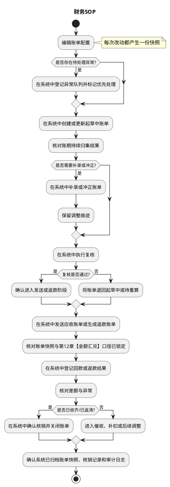
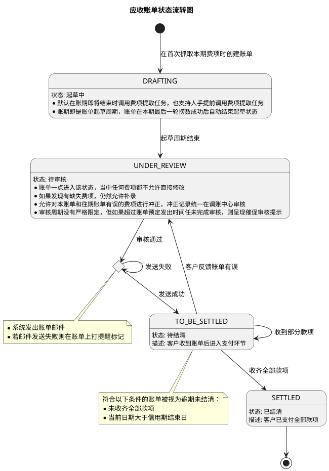
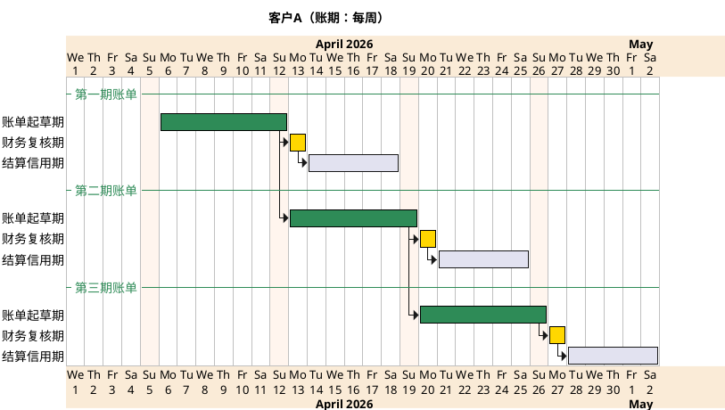
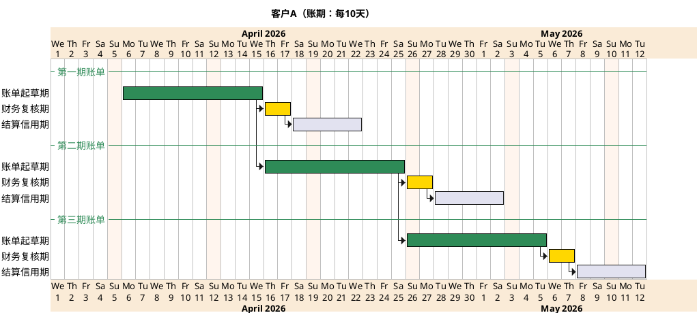
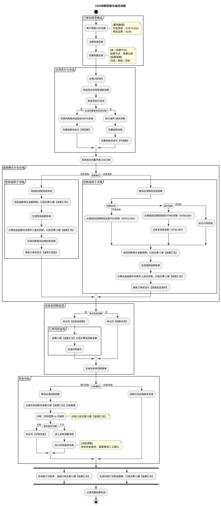
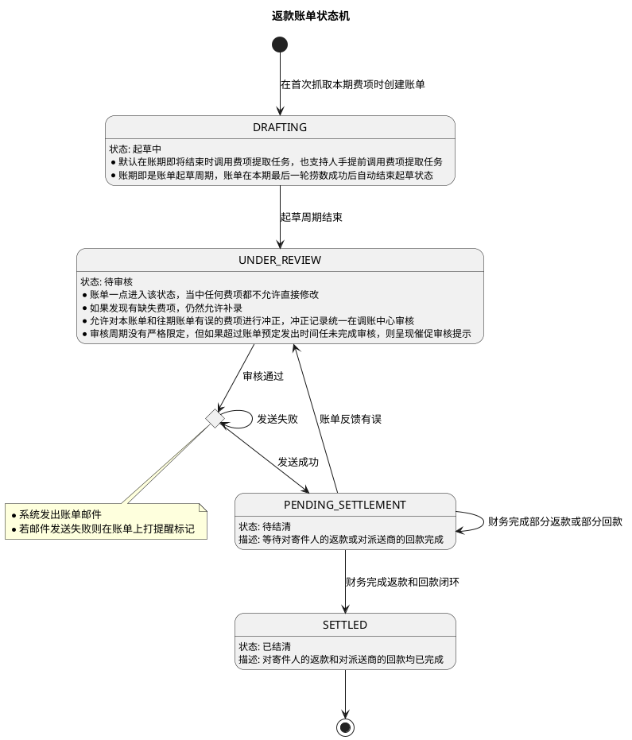
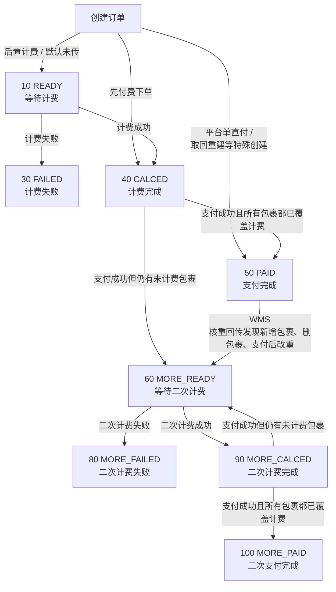
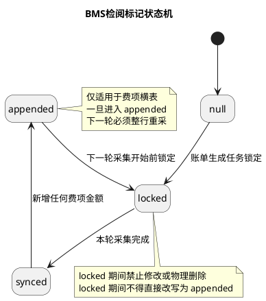
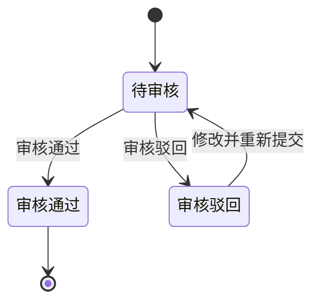

# 财务系统 PRD

## 1. 背景与目标
本 PRD 统一定义财务系统的账单体系与规则，目标是让系统能够：

- 按账期自动归集费项并生成账单。
- 支持应收账单与返款账单独立运行。
- 支持版本化结算条款管理，币种 / 汇率 / 汇兑口径统一见第12章【金额汇兑】。
- 支持复核、补录、冲正、核销、对账和催收闭环。
- 保留历史账单、历史规则和历史金额快照，不回写已生效单据。

## 2. 问题定义

1. 财务在应收、返款、核销、对账之间切换时，口径分散，难以追溯同一费项最终归属。
2. 账单生成依赖账期、费项归集和金额口径，若规则不统一会直接影响结算结果；相关币种 / 汇率 / 汇兑规则见第12章【金额汇兑】。
3. 应收账单与返款账单都存在历史快照诉求，若无统一冻结机制，容易出现历史账单被回写。
4. 返款与应收共享同一订单费项归属，但业务边界不同，需要明确优先级和分流规则。

## 3. 用户与场景

- 财务专员：维护配置、复核账单、处理核销与对账。
- 财务主管：审批冲正、调账、异常处理。
- 业务部：关注账单口径、线路与费项归属。
- 系统：按配置归集费项、生成账单、锁定快照、流转状态。
- 客户：接收账单、确认金额、完成付款或返款确认。

典型场景：

1. 应收账单按账期自动归集后付费项，并在复核后发给客户。
2. COD 返款账单按签收或回款触发，完成代收货款返还、扣减和核销。
3. 同一费项先判断是否进入返款账单，未命中时再进入应收账单。

## 4. 范围与边界

### 4.1 需求范围内

- 应收账单配置、生成、复核、发送、结算、冲正、核销。
- 返款账单配置、生成、复核、发送、回款管理、核销、对账。
- 费项索引、结算条款版本、金额快照、账单状态机；币种 / 汇率 / 汇兑口径见第12章【金额汇兑】。
- 账单列表、详情、导出、审计留痕、异常处理。

### 4.2 需求范围外

- 不重写上游订单、包裹、WMS 的基础履约逻辑。
- 不展开应付账单的详细功能设计，仅保留类型定义与编号规则。
- 不做跨币种自动抵扣作为 V1 默认能力。

## 5. 功能清单

财务系统统一从“客户账单”入口进入，核心功能清单如下：

| 功能项 | 主要能力 | 对应菜单 / 入口 | 说明 |
| --- | --- | --- | --- |
| 应收账单管理 | 支持应收账单的列表、详情、复核、发送、结算、补录、冲正、核销与异常跟踪 | `客户账单 > 应收账单` | 面向财务的日常应收账单主入口 |
| 账单配置管理 | 支持客户级结算条款配置，包含账期、生效周期、信用期限、币种、分支规则与版本管理 | `客户账单 > 账单配置` | 用于维护客户级账单规则与版本快照 |
| 账单核销管理 | 支持核销流水查询、核销确认、反核销与核销结果追踪 | `客户账单 > 账单核销` | 用于核销操作和结果查询 |
| 账单生成任务 | 支持账单生成任务的发起、查看、重跑与执行结果监控 | `客户账单 > 生成任务` | 用于监控账单生成过程与异常结果 |
| 费项管理 | 支持费项索引维护、费项归类、费项取值规则与业务场景映射 | `客户账单 > 费项管理` | 统一维护 fee_index 与费项业务含义 |
| 费项来源配置 | 支持维护费项数据来源口径、取数规则和联表关系，保证自动归集口径统一 | `客户账单 > 数据源规则` | 用于配置费项来源表、关联关系和取数口径 |
| 币种模板管理 | 支持维护目的国及业务场景对应的费项结算币种模板，统一币种映射与结算口径，具体口径见第12章【金额汇兑】 | `客户账单 > 币种模板` | 用于维护费项结算币种映射规则 |
| 账单生成机制 | 支持源数据增量采集、账单侧重算、配置快照固化、重跑边界控制与源数据行级标记管理 | `客户账单 > 生成任务 / 账单配置` | 账单生成的产品规则总入口 |

## 6. 业务对象与术语

| 术语 | 定义 |
| --- | --- |
| 费项 | 进入账单归集的费项明细，来源于自动计算、导入或手工补录。 |
| BMS费项池 | 费项明细最小粒度记录，包含费项与事实金额，是账单归集与展示的基础对象；其中非费项金额仅展示，不参与核销。 |
| sale_order_package_fee | 财务在【订单费项报表】功能导入文件后的包裹级落库表，承接导入文件中的尾程包裹粒度费项及回款金额。 |
| sale_order_fee_detail | 系统基于 `sale_order_package_fee` 自动汇总形成的订单级费项明细表，用于账单和对账汇总。 |
| 应收账单 | 天马运通向客户收取费项时出示的账单。 |
| 返款账单 | COD 包裹代收货款返还给客户时出示的账单。 |
| 应付账单 | 天马运通向供应商支付费项时使用的对账账单，V1 不展开。 |
| 起草中 | 账单按账期持续归集费项的阶段。 |
| 待审核 | 账单已生成，进入财务复核窗口。 |
| 待发送 | 应收账单审核通过后、发送前的状态。 |
| 待结算 | 账单已发送，等待付款或返款完成。 |
| 已结清 | 账单全部金额闭环，仅保留查询与审计。 |
| 锁定汇率 | 生成或复核时冻结的汇率快照，具体口径见第12章【金额汇兑】。 |
| 仅展示不核销 | 事实金额已进入账单分摊范围，但仅在账单中呈现，不纳入任何账单的核销范围。 |

## 7. 总体方案与关键原则

财务系统的核心目标，是把“费项怎么来、账单怎么分、金额怎么锁、状态怎么走、历史怎么留”统一起来，形成一条财务和技术都能对齐的主链路。

### 7.1 总体链路

财务系统采用“费项归集 -> 账单生成 -> 复核发送 -> 付款 / 返款 -> 核销对账 -> 历史留痕”的统一链路。

系统负责：

1. 维护结算条款版本和费项索引，金额快照与汇率口径见第12章【金额汇兑】。
2. 按账期自动归集费项并生成账单草稿。
3. 根据账单类型进入对应状态机。
4. 记录核销、回款、冲正和对账结果。

财务负责：

1. 维护客户级结算条款和返款配置。
2. 复核账单、补录费项、处理冲正。
3. 登记回款、核销差异、发起催收。

### 7.2 账单类型

| 类型 | 说明 | 本期范围 |
| --- | --- | --- |
| 应收账单 | 客户应付给天马运通的账单 | 是 |
| 返款账单 | 天马运通向客户返还 COD 货款的账单 | 是 |
| 应付账单 | 向供应商支付费项的账单 | 仅定义，不展开 |

### 7.3 账单编号

| 账单类型 | 前缀 | 结算主体 | 账期起始日 | 后缀 | 示例 |
| --- | --- | --- | --- | --- | --- |
| 应收账单 | ARB | 客户编号 | yyyymmdd | 业务板块+目的国 MD5 截前 4 位 | `ARB-OG4155-20260101-fse3` |
| 应付账单 | APB | 供应商编号 | yyyymmdd | 无 | `APB-OG4155-20260101` |
| 返款账单 | PCB | 客户编号 | yyyymmdd | 无 | `PCB-OG4155-20260101` |

应收账单同一账期内，若不同费项关联订单的业务板块或目的国不同，必须拆成多张账单，后缀用于区分。

### 7.4 归集与变更原则

1. 所有费项必须有挂靠对象，且挂靠对象只能是 `财务账单`、`业务订单`、`尾程包裹`、`首程包裹` 之一。
2. 一个后付费项（代收代付类除外）只挂靠到一张账单。
3. 代收代付类费项可以同时挂靠到一张应收账单和一张成本账单。
4. 返款账单优先于应收账单分流。
5. 历史账单一旦进入审核或结清，不允许被后续配置直接回写。
6. 已通过财务复核的应收账单，不允许直接修改已挂靠费项。
7. 往期金额错误或变动，只能在本期账单冲正。
8. 返款账单已结清后，不允许直接改写原核销结果，只能通过新账单或调整单处理。
9. 所有账单均需保留配置快照、金额快照与核销轨迹；涉及币种 / 汇率 / 汇兑的口径统一见第12章【金额汇兑】。

## 8. 财务SOP

财务 SOP 关注的是“每天先看什么、先做什么、什么状态能改、什么状态只能等”的固定操作节奏。它把账单生成、复核、发送、回款、核销和异常处理串成一条可执行的日常流程，方便财务和技术按同一顺序理解和实现。

### 8.1 SOP目标

1. 把财务日常动作标准化，减少个人经验差异。
2. 把系统任务、人工复核和资金动作串成同一条闭环。
3. 把起草、审核、发送、结算、核销和归档的边界说清楚。
4. 让财务和技术都能按同一节奏理解账单状态。

### 8.2 SOP主原则

1. 先看配置，再看费项，再看账单，再看资金，最后看核销。
2. 起草中可以改，待审核要复核，待结清只做资金动作，已结清只看历史。
3. 返款优先于应收，避免同一笔费项重复进入两个主账单。
4. 历史账单及相关金额快照不回写，具体口径见第12章【金额汇兑】。
5. 所有异常都要有记录，不能靠删除源数据解决。

### 8.3 日常SOP

| 时段 | 财务人员实际动作 | 关注重点 | 输出 |
| --- | --- | --- | --- |
| 日初 | 查看当天启用的账单配置、生效版本、待处理任务和异常队列 | 是否存在过期配置、未处理异常或账期切换 | 当日处理清单 |
| 归集前 | 核对 BMS 费项池中的 `null / locked` 数据，确认本期应归集范围 | 账期、币种、费项归属、配置快照是否一致 | 可归集范围确认 |
| 导入期 | 按系统导入模板不定期导入订单费项报表文件，先由系统落库再校验金额 | 导入模板是否匹配、回款金额是否齐全、包裹级粒度是否正确 | 包裹级导入结果 |
| 归集中 | 触发账单生成并检查起草中账单的自动归集结果 | 是否漏项、重项、错项，是否命中返款优先规则 | 起草中账单修正结果 |
| 复核期 | 对待审核账单执行复核，处理补录、冲正和口径差异 | 起草中可改，待审核冻结，历史不回写 | 复核结论 |
| 账前整理 | 临近账期结算日，从系统导出相关明细并整理成客户对账格式 | 明细口径是否与客户对账口径一致，是否需要按财务方式重分组汇总 | 客户对账格式明细 |
| 发送/返款期 | 确认应收账单已发送，或确认返款账单已生成并进入后续处理 | 发送是否成功、金额口径是否锁定，具体口径见第12章【金额汇兑】 | 待结清 / 待返清账单 |
| 结清期 | 登记回款或返款结果，核对差额、部分结清和异常回款 | 金额差异先核对第12章【金额汇兑】口径，再核核销 | 核销结果 |
| 日终 | 确认账单快照、核销记录和审计轨迹已归档 | 是否还有未闭环账单或待补处理事项 | 次日待办清单 |

日常执行顺序建议如下：

1. 先看配置是否有效，再看费项是否到位，再看账单是否起草完成。
2. 起草中账单优先处理补录和冲正，待审核账单只做复核和确认。
3. 临近账期结算日，先导出相关明细，再整理成客户对账格式，最后按财务口径汇总。
4. 返款优先于应收，避免同一笔费项重复进入两个主账单。
5. 已结清账单只做查询、对账和留痕，不再修改主结果。
6. 所有异常都必须落到系统记录中，不能靠人工口头同步或删除源数据解决。

### 8.4 财务SOP

## 9. 账单生成机制

### 9.1 设计目标

1. 起草中账单允许随时重跑。
2. 复核完成后的账单禁止再走“账单生成任务”重跑。
3. 账单生成拆分为源数据增量采集任务和账单侧调整重算任务。
4. 源数据侧行级状态包括 `null / locked / appended / synced`；其中 `appended` 仅用于费项横表后续追加费项金额后的再采集场景。
5. 已被 BMS 成功采集的费项原始金额，不允许在数据源侧直接删除或修改。
6. 费项修正或作废必须通过账单侧调账、冲正或作废兜底；若原始金额有误，应在调账中心对该费项做冲正，不回写源数据。

### 9.2 任务分层

1. 源数据增量采集任务负责先将待处理行锁定为 `locked`，再写入账单明细；所有步骤执行完毕后统一回写为 `synced`。
2. 账单侧调整重算任务负责补录、冲正、金额口径调整和配置变更后的重算，不回写源数据；相关币种 / 汇率 / 汇兑口径见第12章【金额汇兑】。
3. 触发方式包括定时、手动生成、失败重试、配置变更和财务调整。

### 9.3 行级标记

| 标记值 | 含义 | 产品规则 |
| --- | --- | --- |
| `null` | 尚未被采集 | 首次进入账单采集范围时拉取 |
| `locked` | 已被账单生成任务锁定 | 处理期间禁止修改或物理删除 |
| `appended` | 行内追加了新的费项金额 | 仅适用于费项横表，表示该行已有 BMS 已采集费项之后又追加了新的费项金额，需进入下一轮采集 |
| `synced` | 已被采集并同步 | 不再重复拉取 |

规则：

1. 这里的行级标记，当前特指供 BMS 检阅的标记，不是通用业务状态字段。
2. 新数据默认是 `null`。
3. 账单生成任务执行时，第一步必须先把参与处理的源数据行更新为 `locked`。
4. 锁定完成后再执行后续采集、归集、写入账单明细等步骤。
5. 对于费项横表，若某一行在既有 BMS 成功采集结果之后又追加了新的费项金额，追加事务必须先将该行标记置为 `appended`，以便下一轮采集任务识别该行需要再次同步。
6. 所有步骤执行完毕后，将本次处理涉及的源数据行统一回写为 `synced`。
7. `locked`、`appended` 和 `synced` 行都不能物理删除，只能保留用于追溯和审计。

### 9.4 配置与归属

1. 账单配置定义客户维度、业务类型、账期类型、履约节点和默认/分支规则。
2. 同一客户只能有一个默认配置，可以有多个分支配置。
3. 分支配置按目的国、仓库、业务板块等范围限定，重叠时按优先级或先到先得处理。
4. 同一订单在同一账期内只能命中一个 `bill_config_id`。
5. 执行前必须固化配置快照、范围快照和费项规则快照，不反查最新配置覆盖旧结果。
6. 账单归属时间不能简单按 `create_time` 判断，必须以账单归属时间快照为准。

### 9.5 生成与调整原则

1. 系统扫描启用配置，锁定当前账期和配置快照后开始生成。
2. 起草中账单可持续吸收新增或变化费项。
3. 进入 `待审核` 后，不允许再通过账单生成任务重跑覆盖结果，只能通过补录、冲正、调账或新账单承接变化。
4. 账单内只要存在任何冲正记录，这些冲正记录就必须先审核通过，整份账单才允许复核通过。
5. 进入 `待结清` 或 `已结清` 后，不允许再回写历史主结果。
6. 若某笔费项同时满足应收与返款规则，优先进入返款账单。
7. 重跑只采增量，不做全量回扫。

### 9.6 状态与操作权限

| 账单状态 | 导出账单 | 调整账单 | 重跑账单 | 复核账单 | 重发账单 | 核销账单 |
| --- | --- | --- | --- | --- | --- | --- |
| 起草中 | 可 | 可 | 可 | 不可 | 不可 | 不可 |
| 待审核 | 可 | 可 | 不可 | 可 | 不可 | 不可 |
| 待结清 | 可 | 不可 | 不可 | 不可 | 不可 | 可 |
| 已结清 | 可 | 不可 | 不可 | 不可 | 不可 | 不可 |

说明：

1. 这里的“调整账单”指账单侧的补录、冲正、调账和重算，不等于重跑生成任务。
2. `待审核` 阶段不再允许重跑账单生成任务，但仍可通过账单侧调整触发口径修正。
3. `已结清` 只保留查询和历史追溯能力。

### 9.7 账单生成与调整流程图

```plantuml
@startuml
title BMS账单生成与调整产品流程
skinparam shadowing false
skinparam DefaultTextAlignment center
start
partition "任务触发" {
  :系统扫描启用中的账单配置;
  :判断当前是否到了账期出账时点;
  if (是否需要生成本期账单?) then (是)
    :创建本期账单生成任务;
    :固化配置快照、范围快照、费项规则快照;
  else (否)
    :保留为待触发状态;
    stop
  endif
}
partition "任务领取" {
  :领取账单生成任务;
  if (任务是否可执行?) then (是)
    :锁定任务，进入本次处理周期;
  else (否)
    :提示任务已被占用或已失效;
    stop
  endif
}
partition "范围判定" {
  :按照账单配置筛选客户、业务类型、目的国、仓库和账期;
  :确定本次允许进入账单的费项范围;
  if (是否命中分支配置?) then (是)
    :使用分支配置作为本次账单口径;
  else (否)
    :使用默认配置作为本次账单口径;
  endif
  :按账单归属时间筛选订单和附加费候选项;
}
partition "费项归集" {
  :按订单归属时间拉取候选费项;
  :判断每条费项是否已在 BMS 中存在有效历史版本;
  if (是否为新增费项?) then (是)
    :将费项记入 BMS 费项池;
  else (否)
    :判断来源费项是否发生变化;
    if (是否发生变化?) then (是)
      :保留旧费项版本;
      :新增费项版本并标记为待重算;
    else (否)
      :跳过重复费项;
    endif
  endif
  :根据费项规则拆分主费项和附加费;
  if (是否为账单后新增附加费?) then (是)
    :进入增量归集候选队列;
  else (否)
    :继续进入本期常规归集队列;
  endif
}
partition "账单归属" {
  :按账单类型判断费项应进入应收、返款或其他账单;
  if (是否允许进入当前账单类型?) then (是)
    :生成账单费项关联;
  else (否)
    :将费项保留在待后续处理队列;
  endif
  if (是否同时命中返款与应收规则?) then (是)
    :优先进入返款账单;
  else (否)
    :按各自规则进入对应账单;
  endif
  if (是否存在待结清或已结清账单?) then (是)
    :不修改既有账单结果;
    :转入后续调整账单或新账单处理;
  else (否)
    :允许当前账单侧继续吸收未结清费项;
  endif
}
partition "账单计算" {
  :锁定结算币种、财务本位币和快照，口径见第12章【金额汇兑】;
  :计算原始金额、结算金额和本位币金额，口径见第12章【金额汇兑】;
  :汇总账单金额、待处理金额和核销进度;
  if (是否发生红冲、调账或补录?) then (是)
    :在账单侧新增调整记录;
    :保留原费项版本和历史轨迹;
  else (否)
    :继续保留正常费项汇总结果;
  endif
  if (是否需要重跑当前账单?) then (是)
    :仅重算账单侧结果;
    :不回写源费项和已存在历史账单;
  else (否)
    :保留本次生成结果;
  endif
}
partition "结果落库" {
  :写入账单费项关联及账单侧快照;
  :刷新账单汇总、币种汇总和状态;
  :更新来源归集轨迹和源表打标结果;
  if (是否存在源表打标失败?) then (是)
    :保留失败标记并等待补偿重试;
  else (否)
    :完成本次账单生成;
  endif
  if (是否允许后续修正?) then (是)
    :保留可调整入口;
  else (否)
    :冻结当前账单口径;
  endif
}
partition "后续处理" {
  if (账单是否仍可调整?) then (是)
    :允许补录、冲正、调账、金额口径调整或重跑，具体口径见第12章【金额汇兑】;
    if (是否已结清?) then (是)
      :只允许通过后续调整账单处理;
    else (否)
      :允许在当前账单侧重算并刷新结果;
    endif
  else (否)
    :仅保留查询、导出和审计追溯;
  endif
}
stop
@enduml
```

## 10. 应收账单模块

### 10.1 需求背景

集运单自创建后到履约结束涉及的大量后付应收费项，常跨越多个账期录入，财务需要按账期把费项挂靠到账单，并支持补录、冲正和批量调账。

### 10.2 核心设计思路

1. 任何费项都必须有挂靠对象，且只能归属到 `财务账单`、`业务订单`、`尾程包裹`、`首程包裹` 四类之一。
2. 后付费项必须挂靠到特定账单进行结算。
3. 系统自动算出的费项默认归入应收类，允许在起草期人工调整，但保留系统原始值。
4. 需要改造费项报表结构，以支持履约全过程费项与利润分析，并兼容包裹级到订单级的费项汇总链路。
5. 新账单从上一账期最后一轮费项数据捞取，默认处于起草状态。
6. 每天零时自动把本期后付费项挂靠到起草中的本期应收账单。
7. 若对应账单已复核，则该费项不可再修改。

### 10.3 业财一体流程

1. 业务部预设系统自动计算的应收费项。
2. 财务维护费项索引与客户级结算条款。
3. 客户预报、仓库揽收、入库称重、集运请求、尾程核重。
4. 系统计算线路运费、超材费等标准费项并汇集到订单费项报表。
5. 后付模式下，系统把费项挂靠到起草中的应收账单。
6. 账期结束后，账单进入待审核，系统创建新一期账单。
7. 财务批量复核后，系统发送账单并进入待结算。
8. 客户付款后，财务核实到账并完成结清。
9. 财务按系统导入模板不定期导入订单费项报表面板文件时，文件数据先落到 `sale_order_package_fee` 的包裹级粒度，再由系统自动汇总到 `sale_order_fee_detail` 的订单级粒度；`sale_order_package_fee` 直接包含回款金额。

#### 10.3.1 业财一体流程图

### 10.4 账单状态机

| 状态 | 定义 | 关键规则 |
| --- | --- | --- |
| 起草中 | 按账期持续归集费项 | 账期即起草周期 |
| 待审核 | 结束起草，等待财务复核 | 冻结正常修改入口 |
| 待发送 | 审核通过，待系统发送 | 发送失败可重试 |
| 待结算 | 已发送，等待付款 | 可部分付款 |
| 部分待结算 | 已收到部分款项 | 余额继续滚动 |
| 逾期未结清 | 超过信用期仍未足额收款 | 触发催收 |
| 已结清 | 全部到账 | 终态 |

补充规则：

1. 若账单内存在冲正记录，则必须待全部冲正记录审核通过后，账单才允许复核通过。
2. 冲正记录未全部审核通过时，账单应继续保留在待审核态，不得提前流转到待发送。
3. 冲正记录的审核统一在调账中心完成，账单侧只负责发起、展示和引用审核结果。

#### 10.4.1 应收账单状态流转图

流转规则：

1. 首次抓取本期费项时创建账单，进入起草中。
2. 起草中持续挂靠费项，账期结束后自动进入待审核。
3. 财务审核通过后进入待发送，系统负责对客户发送账单。
4. 发送成功后进入待结算。
5. 收到部分款项进入部分待结算，全部收齐进入已结清。
6. 到期未收足款项进入逾期未结清，后续收齐仍可转回已结清。

### 10.5 账期与自动拆单

1. 账期支持周、半月、月、10 天、15 天。
2. 同一客户、同一账期内，业务板块或目的国不同的费项必须拆成多张应收账单。
3. 拆分依据来自源订单的业务板块和目的国，缺值则任务报错。
4. 同一账期拆出的账单互不影响，复核、发送、付款、核销均按账单维度独立进行。

#### 10.5.1 账期节奏示意（周）

#### 10.5.2 账期节奏示意（10天）

### 10.6 结算条款配置

应收账单配置为客户级、版本化结算条款，包含两部分：

- 应收账单结算条款
- COD 包裹货款代收条款

关键规则：

1. 一个客户在同一时间只允许有一个当前生效版本。
2. 旧版本生效并通知客户后，不允许就地编辑，只能新建版本。
3. 每个账单必须指明依赖的条款版本。
4. 条款以 JSON 落库，支持历史版本查看。

配置项至少包括：

- 账期类型
- 生效周期
- 信用期限
- 滞纳金
- 信用评级
- 垫资额度上限
- 合同信息
- 账单发出时间
- 费项结算币种
- 费项默认结算币种
- 费项指定结算币种
- 费项结算币种模板

分支方案规则：

1. 默认方案必须存在。
2. 分支方案用于按目的国、集运仓、业务板块等维度拆分。
3. 分支方案之间不得存在情形交集。
4. 条件变更必须实时校验冲突。

费项结算币种模板、汇率快照和多币种汇总规则统一见第12章【金额汇兑】。

### 10.7 费项索引

费项索引用于财务导入、冲正和采集配置参考；具体金额换算、汇率快照和多币种汇总规则见第12章【金额汇兑】。

### 10.8 关键交互

1. 财务可在起草中查看费项归集结果并补录遗漏费项。
2. 财务在待审核阶段处理冲正与复核。
3. 系统在待发送阶段负责邮件或门户发送。
4. 财务在待结算、部分待结算、逾期未结清阶段完成对账、核销与催收。

### 10.9 应收账单详情与账单汇率

应收账单详情页用于查看一张应收账单的结算结果、金额快照和汇率快照；涉及币种分桶、金额换算、往期冲正和本位币折算的规则统一见第12章【金额汇兑】。

#### 10.9.1 账单概况与金额展示

1. 页面顶部展示账单状态流转，包括 `起草中`、`待核验`、`广义待结算` 等状态。
2. 账单概况区展示账单编号、客户、集运目的国、账期起止日、账单发送日、信用期结束日等基础信息。
3. 金额展示区仅展示账单计算后的结果，不在本章节重复定义币种分桶、汇率锁定和换算公式。
4. 同一张账单可以同时存在多个费项结算币种桶，页面仅按第12章口径回显各币种桶结果。
5. 账单应收金额区展示 `费项结算币种`、`原始应收金额`、`往期账单冲正`、`最终应收金额（费项结算币种）`、`最终应收金额（财务本位币）`。

#### 10.9.2 账单汇率页签与编辑弹窗

1. 账单汇率页签仅用于查看账单内已存在的货币对及其锁定结果。
2. 弹窗中的货币对列表必须来源于账单内已存在的费项货币对，不允许手工新增账单内不存在的货币对。
3. 货币对来源、换算方向、启用 / 关闭、账单级锁定汇率和店铺汇率回显的规则统一见第12章【金额汇兑】。
4. 页面保存后仅影响当前账单的金额换算结果，不回写历史账单。

说明：

1. “货币对一致，则必须汇兑方向一致，汇率一致”指的是同一账单内相同货币对只能有一条换算定义，且不能出现两个不同方向的口径。
2. “关闭时，锁定汇率回显店铺汇率”指的是未启用账单级锁定时，页面仍展示店铺汇率作为回显值，但不将其视为新的账单级锁定结果。

## 11. 返款账单模块

### 11.0 模块总览

返款账单模块用于管理 COD 包裹签收后的货款回收、货款返还、账单核销追踪和账单结清进度；币种、汇率与汇兑口径统一见第12章【金额汇兑】。

从产品视角看，本模块同时处理两条相互独立、但又彼此关联的线：

1. 包裹线：回答某个 COD 包裹当前是已回款、待回款，还是不回款；已返款、待返款，还是不返款。
2. 账单线：回答与该包裹相关的返款账单当前处于起草中、待审核、待结清还是已结清。

包裹状态与账单状态不做同名映射，包裹状态按回款管理口径计算，账单状态按返款账单处理进度计算。

### 11.1 需求背景

返款账单用于承载 COD 包裹签收后的货款回收与返还结算，统一管理签收返款和回款返款两种模式下的账单归集、核销追踪和账单结清；币种、汇率与汇兑规则统一见第12章【金额汇兑】。
当前业务上，绝大部分客户采用回款返款，签收返款仅用于少数客户的特殊约定场景。

### 11.2 核心概念

| 概念 | 定义 | 说明 |
| --- | --- | --- |
| `回款` | 财务向尾程派送商回收 COD 货款 | 结果是把货款从派送商回收到货代侧。 |
| `返款` | 财务向寄件人返还 COD 货款 | 结果是把货款从货代侧返还给寄件人。 |
| `签收返款` | 收件人签收后，先返还、后回收 | 适用于需要先垫资的场景。 |
| `回款返款` | 收件人签收后，先回收、后返还 | 适用于先收到货款再返还的场景。 |
| `正常签收` | COD 包裹正常签收且进入回款 / 返款结算闭环 | 必须同时产生回款和返款动作。 |
| `异常签收` | COD 包裹发生拒收、退件或其他异常 | 不产生回款和返款动作，仅保留在回款管理中跟踪。 |
| `汇兑损益` | 到付币种与回款 / 返款币种不一致时的差额 | 在回款管理中计算与展示，具体口径见第12章【金额汇兑】。 |

关键规则：

1. 返款账单与应收账单可独立按各自账期运行，不要求同周期对齐。
2. 所有 COD 包裹均纳入回款管理；只有正常签收包裹进入回款、返款，并由回款管理计算汇兑损益，具体口径见第12章【金额汇兑】。

### 11.3 货款回收与返还流程

本节描述的是 COD 包裹从签收到货款闭环的主业务链路，重点回答“先发生什么、后发生什么、在哪一步分流、在哪一步结算”。

1. 客户预报 COD 包裹，系统生成包裹记录及货款原始金额。
2. 包裹完成派送后，系统先判断签收结果：正常签收进入结算闭环，异常签收仅保留追踪状态。
3. 正常签收包裹再根据返款模式分流：`签收返款` 先返后回，`回款返款` 先回后返。
4. 财务在系统中确认回款和返款结果，系统同步更新包裹状态、账单状态和核销记录。
5. 若到付币种与回款 / 返款币种不一致，系统将回款 / 返款金额及快照交由回款管理计算汇兑损益，具体口径见第12章【金额汇兑】。

#### 11.3.1 COD货款回收与返还流程图

### 11.4 返款账单状态机

返款账单状态机只描述账单本身的处理进度，不直接决定包裹的回款状态或返款状态。包裹状态必须按回款管理列表口径单独计算。

| 状态 | 定义 | 关键规则 |
| --- | --- | --- |
| 起草中 | 按账期持续归集返款费项 | 允许补录与调整归集口径 |
| 待审核 | 账单已生成，等待财务复核 | 冻结明细修改 |
| 待结清 | 审核通过，等待对寄件人的返款或对派送商的回款 | 支持部分结清 |
| 已结清 | 返款和回款全部完成 | 终态 |

补充规则：

1. 若账单内存在冲正记录，则必须待全部冲正记录审核通过后，账单才允许从待审核进入复核通过结论。
2. 冲正记录未全部审核通过时，账单仍应保留在待审核态，不得提前通过。
3. 冲正记录的审核统一在调账中心完成，账单侧只负责发起、展示和引用审核结果。

#### 11.4.1 返款账单状态机图

说明：

1. 原型中的状态名统一采用“待审核”。
2. 部分返款/部分回款不单独作为主状态，作为待结清下的进度处理。
3. 发送动作是过渡节点，不单独作为主状态展示。
4. 账单中只要存在冲正记录，该账单就必须等全部冲正记录审核通过后，才允许账单复核通过。

### 11.5 返款模式分支

返款模式以回款返款为主流路径，签收返款作为少数客户的例外配置存在。系统需同时支持两种模式，但页面默认表达和业务描述应优先围绕回款返款展开；涉及币种换算、汇率快照和回款管理中的汇兑损益口径统一见第12章【金额汇兑】。

本节只描述返款链路的分支方式，不改变包裹是否回款、是否返款的判定口径。

#### 11.5.1 签收返款（先返后回）

1. 系统识别到订单为正常签收。
2. 财务先向寄件人返还货款，金额口径与快照规则见第12章【金额汇兑】。
3. 系统按第12章【金额汇兑】计算应返金额，并将回款 / 返款金额供回款管理计算汇兑损益。
4. 返款完成后，再向尾程派送商发起货款回收，订单状态更新为回款闭环。

#### 11.5.2 回款返款（先回后返）

1. 系统等待尾程派送结果和派送商回款结果。
2. 按完全回款、部分回款、未回款三类记录回款状态。
3. 财务确认回款到账后，系统按第12章【金额汇兑】锁定相关快照并计算应返金额，相关汇兑损益由回款管理计算。
4. 完成回收后生成回款返款账单，并向寄件人发起货款返还。
5. 订单状态更新为回款返款闭环。

### 11.6 返款配置

返款账单配置用于维护 COD 包裹货款代收条款，至少包括：

- 返款模式
- 账期类型
- 账期起始日
- 账单发出时间
- 在应返货款中直接扣减的应收费项
- 实返货款金额比例
- 货款结算币种
- 客户收款账户
- 当实返货款金额为负数时的应对措施
- 条款生效周期

关键规则：

1. 配置采用版本化管理。
2. 生效后仅影响后续新生成账单，不回写历史账单。
3. 条款生效周期内不允许重叠。
4. 货款结算币种的选择、匹配和兜底规则见第12章【金额汇兑】。
5. 负数金额可选择顺延到下期返款账单，或反向计入本期应收账单。

### 11.7 返款账单详情

返款账单详情页是账单视角页面，用于集中展示订单级返款账单的结算结果和核销轨迹。它只回答一张账单“怎么算、算到哪一步、核销到哪一步”，不负责判断包裹是否已回款、已返款；包裹级状态请到回款管理查看。涉及货款结算币种、回款 / 返款换算和汇率快照的规则统一见第12章【金额汇兑】。

页面展示区块如下：

1. 账单信息区：货款结算币种、返款金额、回款金额、未回款金额、账单状态。
2. 返款明细区：来自 `sale_order_fee_detail` 的订单级返款明细。
3. 扣减费项区：基础运费、代收服务费等可直接扣减费项。
4. 核销记录区：每笔回款或扣减动作的核销轨迹。
5. 账单汇率区：锁定快照和换算结果，具体口径见第12章【金额汇兑】。

### 11.8 回款管理

[原型：回款管理](http://localhost:9999/start.html#g=1&id=36g8f0&p=%E5%9B%9E%E6%AC%BE%E7%AE%A1%E7%90%86&g=1)

回款管理是包裹视角列表，用于查看所有 COD 包裹的回款状态、返款状态、汇兑损益和对账状态。它只回答一个包裹“是否已回款、是否已返款、是否需要跟踪”，不承载返款账单本身的结算流程；返款账单只作为回款状态判定和追溯依据被关联引用。列表主粒度为尾程包裹，回款明细行数据来自订单费项报表导入后沉淀的 `sale_order_package_fee`。回款管理负责回款 / 返款金额换算、汇率快照和汇兑损益计算，具体口径见第12章【金额汇兑】。回款管理不提供单独的回款导入入口。

这一页的核心不是“再算一遍账”，而是把包裹级事实、关联账单结果和对账状态放到同一张列表里，方便财务按包裹追踪全链路。

页面以尾程包裹为主粒度展示回款事实、返款事实和结算结果；回款明细行数据来源于 `sale_order_package_fee`，系统汇总口径对应 `sale_order_fee_detail`。

#### 11.8.1 页面目标

1. 以尾程包裹为主粒度，关联运单和订单信息，集中展示回款状态、返款状态和结算结果。
2. 回款数据直接来源于订单费项报表导入后的 `sale_order_package_fee` 明细，不在回款管理内二次导入。
3. 支持快速识别已回款、待回款、不回款，以及已返款、待返款、不返款，并覆盖所有 COD 包裹的状态跟踪。
4. 支持从列表直接定位关联返款账单，并追踪核销结果。

#### 11.8.2 页面结构与字段

| 区域 | 字段 / 操作 | 说明 |
| --- | --- | --- |
| 操作区 | `查看汇兑损益` | 勾选后展示汇兑损益相关的红色表头字段，具体金额口径见第12章【金额汇兑】。 |
    | 基础信息列 | 尾程运单号、所属内部订单、所属客户、所属店铺、签收状态、签收时间、货款原始金额、尾程派送商、回款状态、返款状态、回款时间、返款时间、回款快照、返款快照、实回货款金额、实返货款金额 | 用于定位运单、确认签收与回款 / 返款事实，并作为回款核对依据。 |
    | 返款信息列 | 返款模式、关联返款账单、应返货款金额 | 用于展示返款动作和结算结果，具体口径见第12章【金额汇兑】。 |

#### 11.8.3 业务规则

回款状态和返款状态是包裹级状态，返款账单状态是账单级状态，两者不互相替代，只存在关联关系。

包裹状态判定优先级如下：

1. 先判定签收结果。异常签收优先落为 `不回款` 和 `不返款`，并直接忽略返款账单状态。
2. 再判定回款明细。正常签收包裹若包裹级回款明细满足入账条件，则回款状态为 `已回款`，否则为 `待回款`。
3. 再判定返款账单结清结果。正常签收包裹若其所属业务主单挂靠的返款账单已结清，则返款状态反推为 `已返款`，否则为 `待返款`。
4. 返款账单结清结果只影响返款状态反推，不反向改写回款状态；回款状态只看回款明细，不看账单是否已结清。

1. 所有 COD 包裹都必须同时有回款状态和返款状态，且两者均与返款账单状态解耦。
2. 回款状态仅取值 `已回款`、`待回款`、`不回款`。
3. 返款状态仅取值 `已返款`、`待返款`、`不返款`。
4. 异常签收的 COD 包裹固定为 `不回款` 和 `不返款`。
5. 正常签收的 COD 包裹，尾程运单号出现在 `ofp_ofdb1.sale_order_package_fee` 且 `ofp_ofdb1.sale_order_package_fee.recovery_money` 非空非零时，回款状态为 `已回款`，否则为 `待回款`。
6. 正常签收的 COD 包裹，其所属业务主单挂靠的返款账单已结清时，返款状态反推为 `已返款`，否则为 `待返款`。
7. 返款模式为签收返款时，先返还后回收。
8. 返款模式为回款返款时，先回收后返还。
9. 关联返款账单应可点击跳转到对应账单详情，便于核销追溯。
11. 订单费项报表导入后，系统应同步刷新列表状态、账单核销记录和未回款监控。

#### 11.8.4 状态联动

1. 正常签收包裹的回款状态和返款状态，分别按 11.8.3 的规则独立计算，不因返款账单主状态直接变化。
2. 返款账单从待结清进入已结清，只表示对应业务主单的返款闭环完成，不代表所有包裹状态同步变更。
3. 异常签收包裹固定显示为 `不回款` 和 `不返款`，并保留在回款管理列表中。
4. `查看汇兑损益` 打开时，页面展示的损益字段应保持与回款 / 返款锁定快照一致，不随市场汇率刷新；异常签收行和同币种行是否展示，按第12章【金额汇兑】处理。

### 11.9 报表输出

系统需输出：

1. 客户对账单。
2. 内部汇兑损益报表。
3. 应收未回款报表。
4. 完整结算轨迹。

## 12. 金额汇兑

### 12.1 章节概述

本章统一定义应收账单、返款账单和回款管理涉及的金额汇兑口径，明确三件事：

1. 费项结算币种如何选择。
2. 汇率快照如何锁定。
3. 多币种账单如何汇总和核销。

本章聚焦金额换算与币种汇总，其他章节分别承接业务流程、页面入口和结果展示。

### 12.2 费项结算币种模板

费项结算币种模板属于公共配置，按业务场景和目的国维护，用于统一费项的结算币种选择口径。

#### 12.2.1 模板作用

1. 模板用于定义“某个业务场景下，某个费项默认按什么结算币种收取”。
2. 模板不是客户私有配置，不允许按客户重复复制维护。
3. 账单配置在生成时可以选择模板，生成后必须固化命中的模板快照。

#### 12.2.2 命中优先级

费项结算币种命中顺序如下：

1. 账单配置显式配置的费项规则。
2. 当前账单已选择的费项结算币种模板。
3. 目的国公共模板。
4. 账单默认结算币种 `bill_config.billing_currency`。

#### 12.2.3 模板快照

1. 生成任务必须保存本次命中的模板、规则和结算币种快照。
2. 历史账单不随模板后续变更而重算。
3. 若历史账单需要修正，只能通过新账期重新生成，不得回写旧快照。

### 12.3 汇率与金额换算

#### 12.3.1 汇率层级

结算汇率分三级：

1. 费项级
2. 账单级
3. 店铺级

优先级为：费项级 > 账单级 > 店铺级。

#### 12.3.2 汇率快照

1. 账单生成或复核时必须锁定汇率快照。
2. 锁定后的汇率不随市场汇率变化自动刷新。
3. 财务本位币种仅用于内部核算和对账，不改变客户侧真实应收币种。

#### 12.3.3 费项结算币种汇率列表生成与锁定

费项结算币种级锁定汇率列表中的汇率行，必须由账单下所有费项详情的货币对 `DISTINCT` 生成，不允许人工新增账单内不存在的货币对。

1. 费项结算币种级汇率行分为两类：
   - `费项结算币种 -> 财务本位币`
   - `费项结算币种 -> 费项原始币种`
2. 同一货币对在同一账单内只保留一条记录，不能因为费项行重复而重复生成多条。
3. 同一货币对一旦在账单内出现，汇兑方向必须固定，汇率必须一致，不允许同时存在相反方向或不同数值。
4. 若 `费项结算币种 -> 费项原始币种` 没有可直接使用的直连汇率，则优先按两端币种各自对 `财务本位币` 的锁定汇率推导：
   - `费项结算币种 -> 费项原始币种 = （费项结算币种 -> 财务本位币） / （费项原始币种 -> 财务本位币）`
5. 若账单内同时存在直连汇率和推导汇率，系统必须保持两者口径一致；若不一致，以费项结算币种级锁定结果为准。
6. 汇率行启用时，系统以当前填写值作为账单级锁定汇率，并用于后续账单金额换算。
7. 汇率行不启用时，系统回显店铺汇率，不在账单内单独固化为新的锁定汇率。
8. 汇率行启用状态变更后，只影响当前账单的换算口径，不回写历史已结清账单。
9. 账单内若后续新增新的费项货币对，则该货币对自动补入账单汇率列表，并遵循同样的启用 / 关闭规则。
10. 若 `费项原始币种 = 费项结算币种`，该货币对视为同币种行，换算汇率固定为 `1`。
11. 账单汇率列表只决定费项结算币种级锁定汇率与回显口径，不改变 `费项级 > 账单级 > 店铺级` 的换算优先级。

#### 12.3.4 金额换算规则

1. 当费项原始币种与结算币种相同时，金额不做换算，直接沿用原始金额。
2. 当费项原始币种与结算币种不同时，按锁定汇率换算为结算币种金额。
3. 若需要进入财务本位币，再按第二层汇率换算到财务本位币。
4. 历史金额只保留快照结果，不允许被后续汇率改写。

### 12.4 多币种账单汇总

当费项结算币种和汇率快照已经锁定后，系统需要把同一账单下的多币种费项归并成可汇总、可核销的账单结果。

#### 12.4.1 账单主表与汇总表

1. 账单主记录只保留账单编号、客户、账期、状态和总览信息。
2. 单笔费项明细需要保留原始币种、结算币种和财务本位币下的金额快照。
3. 账单需要按 `bill_no + currency` 形成币种汇总结果，并记录应收、已收、未收金额。

#### 12.4.2 汇总规则

1. 同一张账单可以同时存在多个结算币种。
2. 同一张账单的金额汇总按币种分组进行。
3. 财务本位币只用于内部统计和对账，不改变客户侧的真实应收币种。

### 12.5 多币种核销

核销必须建立在已形成的币种汇总结果之上，并且只能落到具体的币种汇总行，不能直接跨币种混核。

#### 12.5.1 核销落点

1. `payment_writeoff_detail` 必须关联具体的 `currency_summary_id`。
2. 核销必须落到具体的币种汇总行，不能把不同结算币种混在一起核销。
3. V1 不做跨币种自动抵扣。

#### 12.5.2 核销约束

1. 收款币种必须与本次核销对应的结算币种一致。
2. 若到付币种与结算币种不一致，系统只允许按锁定汇率折算后参与核销口径计算。
3. 汇率快照必须随账单或核销动作一并保存。
4. 历史账单、历史核销和历史汇率都不回写。

### 12.6 应收账单币种间换算

#### 12.6.1 应收账单换算总则

应收账单的币种间换算遵循“先分币种桶，再按锁定汇率换算费项，最后合并历史冲正并按需换算财务本位币”的顺序。也就是说，账单先在费项结算币种维度形成可核算结果，再在需要时折算到财务本位币；每一步的详细定义见 12.6.2 和 12.6.3。

1. `原始应收金额` 只负责承接本账期内费项换算后的汇总结果，不包含历史账期冲正。
2. `往期账单冲正` 只在 `费项结算币种` 下计入，不在原始币种维度重复拆分。
3. 财务本位币只用于内部核算和对账，不改变客户侧结算币种。

#### 12.6.2 费项结算币种级锁定汇率规则

费项结算币种级锁定汇率的生成、启用、关闭和推导规则，统一见 12.3.3。本节只说明金额换算如何引用这些锁定结果。

#### 12.6.3 应收账单币种间换算规则

应收账单以“费项结算币种桶”为主线组织金额换算。账单内不同费项可以命中不同的结算币种，但每一个币种桶内的计算口径必须一致，且所有换算都必须基于同一批锁定快照完成。

1. 账单生成时，系统先按 `费项结算币种` 将账单下费项分桶；同一张账单允许同时存在多个费项结算币种桶。
2. 每个币种桶内，系统先取该桶下费项的 `费项原始币种` 和 `费项金额`，再按第12.3章的汇率优先级换算到 `费项结算币种`。
3. 若 `费项原始币种 = 费项结算币种`，则直接沿用原始金额，不做换算。
4. 若 `费项原始币种 != 费项结算币种`，则必须按锁定汇率换算后再汇总，不允许先汇总再换算。
5. `原始应收金额` 只承接当前账期内费项换算后的结果，不包含历史账期冲正。
6. `往期账单冲正`、补录、调账都以 `费项结算币种` 计入，并直接参与当前账单汇总，不再回到原始币种重新拆分。
7. `最终应收金额（费项结算币种） = 原始应收金额 + 往期账单冲正`。
8. 若账单需要同时展示财务本位币，则先得到费项结算币种金额，再按 `费项结算币种 -> 财务本位币` 的锁定汇率换算。
9. 财务本位币金额仅用于内部核算和对账，不改变客户侧真实应收币种。
10. 应收账单中的对应金额结果均以本规则为准。

#### 12.6.4 应收账单换算示例

1. 某一币种桶的 `原始应收金额` 为 `18 USD`，`往期账单冲正` 为 `-8 USD`，则 `最终应收金额（费项结算币种） = 10 USD`。
2. 若该桶对应的 `费项结算币种 -> 财务本位币` 锁定汇率为 `6.86080`，则 `最终应收金额（财务本位币） = 10 × 6.86080 = 68.608 RMB`。
3. 若另一币种桶的 `原始应收金额` 为 `100 TWD`，`往期账单冲正` 为 `0 TWD`，且 `TWD -> RMB` 锁定汇率为 `0.21450`，则 `最终应收金额（财务本位币） = 21.45 RMB`。

### 12.7 返款账单与回款管理币种口径

#### 12.7.1 返款账单换算总则

返款账单以“货款结算币种”为统一核销口径。正常签收的 COD 包裹同时存在回款和返款两条金额链路，两条链路都必须落在同一货款结算币种下比较，才能形成可核算的回款金额与返款金额。

1. 只有正常签收的 COD 包裹才进入返款金额换算。
2. 异常签收的 COD 包裹不产生回款金额、返款金额。
3. 返款账单中的回款金额和返款金额都以 `货款结算币种` 作为统一比较币种。
4. 当到付币种与 `货款结算币种` 一致时，回款金额和返款金额都直接沿用到付金额。
5. 当到付币种与 `货款结算币种` 不一致时，系统分别按回款时点锁定的汇率和返款时点锁定的汇率，将同一笔到付金额换算到 `货款结算币种`。
6. `回款金额 = 到付金额 × 回款汇率`。
7. `返款金额 = 到付金额 × 返款汇率`。
8. 回款汇率与返款汇率可以不同，因为两者锁定的业务时点不同，系统必须分别保留各自快照，不允许共用一组市场汇率。
9. 返款账单中的回款金额、返款金额与未回款金额均以本规则为准。

#### 12.7.2 返款账单换算示例

1. 若到付金额为 `100 TWD`，回款锁定汇率为 `0.23000`，返款锁定汇率为 `0.21500`，则 `回款金额 = 23.00 RMB`，`返款金额 = 21.50 RMB`。
2. 若到付金额币种与货款结算币种一致，则 `回款金额 = 返款金额 = 到付金额`。

#### 12.7.3 回款管理币种口径

回款管理以尾程包裹为主粒度，只展示回款、返款和汇兑损益的包裹级结果，不承担返款账单的核销计算。

1. 回款管理中的回款金额、返款金额和未回款金额，均引用第12.7.1节的换算结果。
2. 回款管理在比较回款金额与返款金额后，计算并展示汇兑损益金额。
3. 汇兑损益金额 = 回款金额 - 返款金额。
4. 回款管理中的汇兑损益字段只做结果展示，不重新计算原始到付金额。
5. 回款管理的包裹级状态与返款账单状态独立计算，不互相替代。

示例：

1. 若到付金额为 `100 TWD`，回款锁定汇率为 `0.23000`，返款锁定汇率为 `0.21500`，则 `汇兑损益金额 = 1.50 RMB`。
2. 若到付金额币种与货款结算币种一致，则 `汇兑损益金额 = 0`。

## 13. 数据源同步至BMS费项池

### 13.1 背景与目标

财务系统需要把上游来自订单、包裹、赔付、附加费和导入文件的原始数据，统一整理成可归集、可追溯、可复算的 `BMS费项池`，作为后续应收账单、返款账单和账单展示的共同原料。

这一章要解决的核心问题是：同一类费用在不同业务场景下，取值来源和归集口径经常不一致。如果把来源表、金额字段、时间字段都拆散到单个费项配置里，就容易出现漏配、错配、重复归集，且历史结果无法追溯。因此，系统需要把“数据从哪里来”“按什么口径进入费项池”“进入后如何分流和展示”拆开定义。

### 13.2 设计原则

1. `fee_source_dataset` 负责定义公共数据集能力，包括主数据源、关联关系、识别字段、归集时点和查询策略。
2. `fee_source_rule` 只负责定义费用如何取值，包括金额字段、币种字段、过滤条件、去重规则和费项映射。
3. 数据源同步只负责把原始费项整理成可归集的费项原料，不负责账单分流、核销、回款状态、返款状态和最终结清判定。
4. 订单类费用的归集时点统一跟随账单配置的履约节点，不允许每个费项各自配置一套时间字段。
5. 附加费类数据按固定业务条件增量拉取，避免把非业务相关的历史脏数据带入费项池。
6. 历史同步结果必须保留快照，后续配置调整不能回写覆盖已生成结果。

### 13.3 数据源、费项与原始金额边界

先明确“数据源归属到什么业务对象”，再明确“这些数据源按横表还是纵表处理”，最后再约束原始金额边界，这样后续同步规则、状态流转和页面配置才有统一前提。

其中，`sale_order_header` 和 `sale_order_header_extend` 是系统自动计费的主要落库表，绝大多数费项金额在业务订单完成核重时产生，少部分费项会在下单核价时产生，还有个别费项会在核重后延迟产生。`sale_order_additional_matter` 绝大部分费项来自【附加费用报表】导入，只有极少数系统自动计费费项会落库到这里，当前仅超材附加费/超材手续费属于此类例外。

补充说明：`sale_order_header` 的【核重状态】以其所属业务订单下全部尾程包裹都完成核重为前提；只有当所有尾程包裹都完成核重后，业务订单的核重状态才会变为【已核重】。尾程包裹产生的若干核重费项，会自动汇总到 `sale_order_header` 等费项横表的对应费项金额。

#### 13.3.1 数据源归属对象

| 数据源 | 费项挂靠对象 | 说明 |
| --- | --- | --- |
| `sale_order_header_extend` | 业务订单 | 系统自动计费主要落库表之一，承载订单扩展信息和多数在核重时生成的费项。 |
| `sale_order_header` | 业务订单 | 系统自动计费主要落库表之一，承载订单主信息、履约节点和多数在核重时及之前生成的费项；少部分费项在核重后延迟产生。 |
| `sale_order_fee_detail` | 业务订单 | 系统基于 `sale_order_package_fee` 自动汇总形成的订单级明细来源。 |
| `sale_order_package_fee` | 尾程包裹 | 【订单费项报表】界面导入功能的落库表，属于回款管理数据源，不进入 `BMS费项池`。 |
| `sale_order_additional_matter` | 业务订单 / 尾程包裹 / 首程包裹 | 【附加费用报表】界面导入功能的落库表，绝大部分费项来自导入，但由系统自动计算的尾程包裹级超材附加费/超材手续费也会落库到这里。 |
| `claim_order` | 业务订单 | 索赔类费用来源。 |

说明：

1. `BMS费项池` 是最小归集单元，不等于账单本身。
2. `sale_order_fee_detail.collection` 和 `sale_order_fee_detail.recovery_money` 也会进入 `BMS费项池`，但它们属于事实金额而非费项。
3. `sale_order_package_fee` 只用于回款管理，不作为 `BMS费项池` 的同步对象。
4. 非费项金额仅在账单中展示，不纳入任何账单的核销范围。
5. 数据源按“费项横表 / 费项纵表”划分：
   - `费项横表`：一个数据行承载多个费项金额。
   - `费项纵表`：一个数据行只承载一个费项金额。
6. `sale_order_header_extend`、`sale_order_header`、`sale_order_fee_detail` 归为 `费项横表`。
7. `sale_order_additional_matter`、`claim_order` 归为 `费项纵表`。

#### 13.3.2 费项原始金额保护、追加与重采规则

原则上，无论费项横表还是费项纵表，数据行已有的费项原始金额一旦进入 `BMS费项池`，就不允许删除和修改；若金额有误，只能在调账中心对该费项冲正，不得直接在数据源删改费项金额。

本节下面的行级保护、追加和重采规则，重点约束费项横表；费项纵表仍按“一行一费项”口径处理，不使用 `appended` 状态。

`sale_order_additional_matter` 仅作为口径参照，用于说明超材附加费/超材手续费的首次产生时机，不纳入本节费项横表金额保护规则。

1. 对于进入 `BMS费项池` 的费项横表，只要 `BMS检阅标记` 非空，该行已采集到的费项原始金额都不允许再删除或修改。
2. `appended` 只用于提示 BMS：该横表行新增了费项金额，且新增金额一定是在业务订单完成核重后延迟产生的；一旦追加完成，该新增金额本身也按保护口径处理，不允许在下一轮采集前再次改写或删除。
3. 当 `BMS检阅标记` 变为 `appended` 时，下一轮需要对该行整行重采；账单生成任务在处理前先将其转为 `locked`，再继续采集。
4. 对于费项横表，只要新增任何费项金额，数据源侧的追加动作都要把该行标记为 `appended`；若该行此前已经是 `synced`，后续新增金额后可以再次回到 `appended`，并按同样路径流转。
5. 对于费项纵表，`appended` 不作为行级状态流转；其原始金额一旦被系统采集，同样不得删除或修改，修正方式仍然是通过调账中心冲正。
6. 若业务需要调整已保护的金额，只能通过补录、冲正、调整单或新版本同步链路处理，不允许直接修改原费项金额。

补充说明：若数据行当前处于 `locked`，追加动作不能直接改写为 `appended`，必须等当前锁定批次结束后再处理，避免锁定中的行被并发改写。

> 特别说明：
> 1. 从实现层面看，费项横表的修改入口分散在多个业务方法中，既可能来自订单完成核重，也可能来自补录、调整、重算和同步重跑。
> 2. 由于需要被 BMS 识别的字段很多，且同一数据行可能在不同场景下被多处方法间接修改，仅靠统一拦截很难保证所有影响采集口径的字段变更都能同步触发行级标记变化。
> 3. 因此，产品层面需要提前明确：费项金额一旦进入可采集状态，就应按保护规则处理，避免 BMS 费项池与数据源在原始金额上产生口径偏差。

#### 13.3.3 业务订单出库前的二次计费窗口

`sale_order_header.calc_fee_status` 可以理解为业务订单的计费状态。对于费项横表而言，业务订单完成出库前，所有自动计算项都可能因为包裹回传、支付变化或补录动作再次发生计算，因此这一阶段的费项金额并不稳定。

为了避免 `BMS费项池` 同步之后，费项横表原始金额继续变化，`BMS费项池` 的同步时点应落在业务订单完成出库时。也就是说，出库前允许二次计费，出库后再进入 BMS 同步和后续账单流程，这样才能把原始金额稳定在同一版口径上。

| 数据源 | 费项名称 | 是否系统计算项 | 首次产生于哪个业务时机 |
| --- | --- | --- | --- |
| `ofp_ofdb1.sale_order_header_extend.tail_freight_amount` | 派送费 | `Y` | 业务订单完成核重 |
| `ofp_ofdb1.sale_order_header_extend.system_service_amount` | 系统服务费 | `Y` | 业务订单完成核重 |
| `ofp_ofdb1.sale_order_header_extend.packing_amount` | 打包费 | `Y` | 业务订单完成核重 |
| `ofp_ofdb1.sale_order_header_extend.overweight_amount` | 超重费 | `Y` | 业务订单完成核重 |
| `ofp_ofdb1.sale_order_header_extend.overmaterial_amount` | 超材费 | `Y` | 业务订单完成核重 |
| `ofp_ofdb1.sale_order_header_extend.overlength_amount` | 超长费 | `Y` | 业务订单完成核重 |
| `ofp_ofdb1.sale_order_header_extend.marketing_activity_discount_amount` | 满减活动优惠金额 | `Y` | 下单核价 |
| `ofp_ofdb1.sale_order_header.weight_charge_amount` | 超重费 | `N` |  |
| `ofp_ofdb1.sale_order_header.warehouse_rental_amount` | 仓租费用 | `Y` | 下单核价 |
| `ofp_ofdb1.sale_order_header.user_coupon_fee` | 优惠券优惠金额 | `Y` | 下单核价 |
| `ofp_ofdb1.sale_order_header.tax_premium_amount` | 包税手续费 | `Y` | 下单核价 |
| `ofp_ofdb1.sale_order_header.material_charge_amount` | 包材费 | `N` |  |
| `ofp_ofdb1.sale_order_header.length_charge_amount` | 超长费 | `N` |  |
| `ofp_ofdb1.sale_order_header.integral_fee` | 积分优惠金额 | `Y` | 下单核价 |
| `ofp_ofdb1.sale_order_header.insurance_amount` | 保险金额 | `N` |  |
| `ofp_ofdb1.sale_order_header.freight` | 快递费用（即运费） | `Y` | 下单核价 |
| `ofp_ofdb1.sale_order_header.forwarding_charge_amount` | 转运费用 | `N` |  |
| `ofp_ofdb1.sale_order_header.dest_division_amount` | 偏远地区费用 | `Y` | 下单核价 |
| `ofp_ofdb1.sale_order_header.compensation_price` | 保价金额 | `N` |  |
| `ofp_ofdb1.sale_order_header.compensation_premium_amount` | 保价手续费 | `Y` | 下单核价 |
| `ofp_ofdb1.sale_order_header.collection_price` | 代收货款（应返货款） | `N` |  |
| `ofp_ofdb1.sale_order_header.collection_premium_amount` | 代收货款手续费 | `N` |  |
| `ofp_ofdb1.sale_order_header.cod_price` | COD金额（到付金额） | `Y` | 下单核价 |
| `ofp_ofdb1.sale_order_header.cod_amount` | 货到付款手续费 | `N` |  |
| `ofp_ofdb1.sale_order_header.advance_amount` | 垫付金额 | `Y` | 下单核价 |

说明：
1. `是否系统计算项 = Y` 表示该费项在当前代码中存在明确的系统计算、汇总或补录链路。
2. `是否系统计算项 = N` 表示该费项不属于系统计算项，作为历史兼容字段或后置录入字段。
3. 表中“下单核价”早于“业务订单完成核重”；前者对应订单核价阶段的费用测算，后者对应尾程包裹完成核重后触发的费用汇总与回填。

### 13.4 数据集与归集单元

在完成挂靠对象和横纵表边界定义后，系统再把具体来源表组织成数据集，统一控制取数范围、时间窗口和查询拆分策略。

| 数据集 | 主数据源 | 业务含义 | 归集口径 |
| --- | --- | --- | --- |
| `CONSOLIDATION_ORDER` | `sale_order_header h LEFT JOIN sale_order_header_extend e` | 集运订单主费项，支持核重出库、签收及返款相关归集。 | 跟随账单配置选择履约节点。 |
| `CONSOLIDATION_ADDITIONAL_FEE` | `sale_order_additional_matter a JOIN sale_order_header h` | 集运附加费，仅归集待支付附加费。 | 仅按 `a.create_time` 增量归集。 |

默认查询策略为 `query_window_days = 1`、`query_page_size = 500`。不同数据集可以单独调整，避免所有来源共用一份隐藏配置。

### 13.5 页面配置与规则映射

页面配置的目标，是把数据集、取值口径和场景映射统一呈现给财务，而不是让财务直接面对底层字段。

`/billing/feeItem` 增加“数据源规则”页签，用于维护 `fee_source_dataset`。

“场景费项对应”页签中，需要同步调整以下展示口径：

| 调整项 | 新口径 | 说明 |
| --- | --- | --- |
| 来源表 | 来源数据集 + 取值表 | 让财务先看到数据集，再看到实际取值来源。 |
| 增量时间字段 | 归集时间口径 | 强调归集规则，而不是单一字段。 |
| 订单类费用 | 跟随账单配置（核重出库、签收、回款） | 统一由账单配置决定归集时间表达式。 |
| 附加费类费用 | 增量：`a.create_time` | 明确只按创建时间增量拉取。 |
| 费用类型 | `非费项` | 仅用于展示，不参与核销汇总。 |

### 13.6 同步规则与账期口径

同步规则承接前面的对象、数据集和页面配置，负责把它们转换成可执行、可复算、可追溯的同步口径。

1. 数据源配置只负责“怎么连接”和“从哪取数”，费项映射、归集粒度和过滤条件由 `fee_source_dataset` / `fee_source_rule` 统一维护。
2. 订单类费项的归集时点必须跟随履约节点，核重出库使用 `sale_order_header.measure_time`，签收使用 `sale_order_header.signed_time`，回款模式下可额外使用 `received_time_column` 作为回款时间口径。
3. 附加费按 `sale_order_additional_matter.create_time` 增量拉取，并固定过滤 `fee_pay_status = waiting_pay`；系统自动生成的超材附加费/超材手续费先进入确认流转，确认完成后才会满足该条件。
4. 同单订单和电商订单按 `sale_order_header.order_type` 区分，归集口径必须保持一致，不能在不同费项之间私自改口径。
5. 业务场景费项对应关系独立维护，页面上的“场景费项对应”只表达 `fee_index` 与业务场景的映射，不改变源表本身。
6. 同一业务在同一账期内只能形成一条可追溯的同步链路，不允许同源重复入池。
7. 费项横表金额变动限制见 `13.3.2`。核心规则是：部分横表金额字段允许在订单完成核重后、进入 BMS 采集前再补录、补算或汇总，最终以核重完成后的补录结果为准。
8. 业务订单完成出库前，费项横表仍可能发生二次计费；因此 `BMS费项池` 的同步时点必须落在业务订单完成出库时，避免同步后原始金额继续变动。

### 13.7 BMS检阅标记、整行重采与状态流转

数据源进入 `BMS费项池` 时，必须以 `BMS检阅标记` 驱动处理。这里的 `BMS检阅标记` 仅指供 BMS 检阅和重采识别的行级标记，不是通用业务状态字段，但要让财务能够看懂、审计和追溯。

#### 13.7.1 BMS检阅标记定义

| 标记值 | 含义 | 同步规则 | 财务含义 |
| --- | --- | --- | --- |
| `null` | 尚未被采集 | 首次进入采集范围时，系统识别为待采集行。 | 该行尚未进入 `BMS费项池`。 |
| `locked` | 已被账单生成任务锁定 | 账单生成任务执行时先锁定该行。 | 该行在当前处理期间禁止修改或物理删除。 |
| `appended` | 已追加新的费项金额 | 仅适用于费项横表，表示同一行在前一轮采集后又新增了可被 BMS 识别的金额；由于 `BMS检阅标记` 无法区分新增的是哪一个费项金额，下一轮需要整行重采。 | 该行需要在下一轮采集开始前转为 `locked`。 |
| `synced` | 已被采集并同步 | 系统成功写入 `BMS费项池` 后回写为 `synced`。 | 该行在未再次追加金额前不再重复拉取。 |

#### 13.7.2 状态机示意

#### 13.7.3 状态流转与追加规则

1. 新增数据默认状态为 `null`。
2. 账单生成任务执行第一件事是将参与处理的源数据行更新为 `locked`。
3. 对于订单完成核重后延迟产生、且需要后续补录的费项横表金额，若进入既有数据行，则该行先转为 `appended`，下一轮采集开始时再转为 `locked`，随后按整行重采口径重新采集并入池；若进入新数据行，则数据行完成后直接进入 `locked`。
4. `locked` 行在账单生成任务未完成前，不能被修改或物理删除。
5. 所有后续步骤执行完成后，`locked` 行回写为 `synced`。
6. `synced` 行不能被物理删除，只能保留用于追溯、审计和重跑判断。
7. 若任一步骤失败，系统不能直接写成 `synced`；应保留失败原因、失败批次和当前锁定状态，供后续重跑。
8. 任何行级标记的变化，都必须保留变化时间、变化来源和操作者。

#### 13.7.4 增量采集规则与重跑边界

1. 源数据增量采集的候选范围为 `null / locked / appended`；其中 `locked` 仅指已触发本次账单生成流程的行，`appended` 行按整行重采处理，不采集 `synced` 行。
2. 费项横表若处于 `appended` 状态，说明该行已有新增费项金额；由于 `BMS检阅标记` 无法识别新增的是哪一个费项金额，账单生成任务在其他步骤执行前，需要先把该行转为 `locked`，再按整行重采口径继续采集和入池。
3. 同一行在同一账期内只能被有效采集一次；若出现重复同步请求，系统按幂等规则处理，不重复生成费项。
4. 账单生成任务执行过程中，先锁定源数据，再执行后续采集、归集和写账单明细操作，锁定后不允许并发修改。
5. 若任一步骤失败，系统不能直接写成 `synced`；应保留失败原因、失败批次和当前锁定状态，供后续重跑。
6. 重跑任务只处理尚未完成同步的源数据，不重算、不覆盖、不重写已采集成功的历史结果。
7. 行级标记仅用于处理锁定与同步控制，不替代账单状态、核销状态或回款状态。

#### 13.7.5 留痕要求与冲正约束

1. 每次行级状态变化必须记录来源批次、来源表、来源行号、处理时间和处理结果。
2. 系统需要保留行级标记的历史轨迹，以便财务核对本期锁定范围和同步范围。
3. 任何已经写入 `BMS费项池` 的费项原始金额，都不能通过删除或修改源数据的方式撤销或修正；若金额有误，按 13.3.2 的冲正规则处理。

### 13.8 后续生成账单规则

在同步结果稳定之后，账单生成只负责按照账单配置选择时间口径，不再重新判断源数据归属。

生成账单时，系统按照账单配置的 `contract_node` 选择数据集的时间表达式：

| 账单场景 | 时间表达式 | 说明 |
| --- | --- | --- |
| 主订单 `WEIGHT_OUTBOUND` | `sale_order_header.measure_time` | 核重出库口径。 |
| 主订单 `SIGN` | `sale_order_header.signed_time` | 签收口径。 |
| 返款主订单 `RECEIVED` | `received_time_column` | 优先使用数据集配置的回款时间口径。 |
| 附加费 | `sale_order_additional_matter.create_time` | 仅取 `fee_pay_status = waiting_pay`。 |
| `非费项` | 写入 `fee_detail` 并关联账单展示 | 只展示，不进入 `ar_bill_currency_summary` 和账单应收/未收汇总。 |

这样可以保证配置账单时只选择业务含义，不需要对每个费项重复选择时间字段。

### 13.9 同步一致性约束

在“账单原料同步”之后，还要约束源表与订单汇集表之间的一致性，避免跨层级跳写和重复入账。

1. 先落源表，再汇集订单原料，再进入 `BMS费项池`，不允许跨层级跳写。
2. `sale_order_fee_detail` 的同步口径必须保持一致，不能出现同一笔业务在不同订单原料口径下金额不一致。
3. 订单级返款明细行金额必须来自 `sale_order_fee_detail`；`sale_order_package_fee` 只用于回款管理，不进入 `BMS费项池`，也不纳入本章费项同步边界。
4. 同一源行只能对应一个目标费项记录版本，不允许重复入账。
5. 已同步成功的历史记录不允许被后续导入直接回写或修改；若金额有误，按 13.3.2 的冲正规则处理。
6. 数据源侧变更必须保留原始文件、导入批次、来源表、来源行号、处理时间和操作者。
7. 若汇集失败、映射失败或必填字段缺失，则不能进入 `BMS费项池`。
8. 金额为 0 或空的记录不能被当作有效费项同步，除非业务明确要求保留占位。

### 13.10 异常处理、留痕与历史版本

同步失败、重复导入、上游变更和重跑场景，都必须同时满足“可回溯、可追踪、可保留历史版本”三类要求。

#### 13.10.1 异常处理

1. 重复导入同一文件时，系统应按来源批次和来源行幂等处理，不得重复生成费项。
2. 上游数据发生修改后，应生成新的同步版本，不得覆盖历史同步结果。
3. 数据源同步失败时，需保留失败原因、失败字段和失败批次，供财务和技术回溯。
4. 数据源侧仅能同步可追溯数据，不能直接修改已结清账单对应的历史费项结果。

#### 13.10.2 留痕要求

1. 每次同步、锁定、回写和重跑都必须保留处理时间、处理来源、处理人和处理结果。
2. 系统需要保留本次同步链路和重跑链路的历史轨迹，以便财务核对本期锁定范围和同步范围。
3. 任何已经写入 `BMS费项池` 的费项原始金额，都不能通过删除或修改源数据的方式撤销或修正；若金额有误，按 13.3.2 的冲正规则处理。

#### 13.10.3 历史版本保留

系统必须保留以下历史信息：

- 账单快照
- 条款版本
- 金额快照（币种 / 汇率口径见第12章【金额汇兑】）
- 核销记录
- 回款记录
- 对账差异
- 操作日志

### 13.11 交叉归集

最后说明同一份 `BMS费项池` 在返款账单和应收账单之间的分流关系，避免把“先后顺序”误解成“互斥关系”。

1. 同一份 `BMS费项池` 在返款账单和应收账单之间分流，不是时间线上的互斥关系。
2. 若某条费项命中返款账单规则，优先进入返款账单。
3. 未命中返款规则的费项继续进入应收账单。
4. 应收账单中的“仅展示不核销”费项，只在账单中呈现，不纳入任何账单的核销范围。
5. 若返款账单尚未触发或条件不成立，该费项在应收账单中只能保持挂账占位。

## 14. 调账中心

### 14.1 章节概述

调账中心用于承接特定费项的冲正记录，统一解决“金额已入账但需要修正、历史账单又不能回写”的财务场景。它面向应收账单和返款账单两类业务，提供录入、审核、归属确认和留痕能力，作为账单侧调账结果的统一来源。

该中心不直接改写源数据，不替代账单生成流程，也不承担账单侧补录和冲正的执行动作。它只处理调账记录自身的审核状态；这里的“待审核”指调账记录状态，不是账单状态机状态。

1. 统一承接账单录入和批量导入的冲正记录。
2. 调账对象以特定费项为核心，审核结论可被账单侧引用。
3. 全流程保留录入、修改、审核、驳回和归档痕迹，满足追溯与审计需要。
4. 对于未指定归属账单的冲正记录，系统可先预生成默认归属，财务在审核时最终确认归属账单。

### 14.2 原型概述

[原型：调账中心](http://localhost:10000/#id=9kfgjn&p=%E8%B0%83%E8%B4%A6%E4%B8%AD%E5%BF%83)

#### 14.2.1 业务字段

| 区域 | 业务字段 |
| :--- | :--- |
| 列表域 | 批次提交时间、调账记录编号、审核状态、客户名称、应收账单号、冲正费项、费项挂靠对象、业务订单号、尾程运单号、首程运单号、冲正理由、冲正前币种、金额变幅<冲正前币种>、冲正后金额<冲正前币种>、冲正记录归属账单、冲正后币种、锁定汇率、金额变幅<冲正后币种>、冲正后金额<冲正后币种>、费项凭证、登记人 |
| 导入域 | 客户名称、应收账单号、冲正费项、费项挂靠对象、业务订单号、尾程运单号、首程运单号、冲正理由、冲正前币种、金额变幅<冲正前币种> |
| 筛选域 | 批次提交时间、调账记录编号、审核状态、客户名称、应收账单号、冲正费项、费项挂靠对象、业务订单号、尾程运单号、首程运单号、冲正前币种、冲正记录归属账单、冲正后币种、登记人 |
| 说明 | 1、调账记录编号先生成 UUID  2、再按照冲正费项的原始币种或结算币种填写冲正前币种 |

#### 14.2.2 业务操作
调账记录的业务操作与审核状态强绑定，操作权限、批量能力和状态流转必须一起定义。

| 状态 | 可执行操作 | 执行人 | 是否支持批量 | 状态流转 |
| :--- | :--- | :--- | :--- | :--- |
| `待审核` | 修改 | 提交人，且仅限本人提交的记录 | 否 | 修改后仍停留在 `待审核` |
| `待审核` | 移除 | 提交人，且仅限本人提交的记录 | 是 | 移除后记录终止，不再进入后续状态 |
| `待审核` | 审核 | 审核人 | 是 | 审核通过后进入 `审核通过`，审核驳回后进入 `审核驳回` |
| `审核驳回` | 修改并重新提交 | 提交人 | 否 | 重新提交后回到 `待审核` |
| `审核通过` | 查看 | 所有人 | 否 | 只读，不允许修改、移除或再次审核 |

| 状态 | 说明 |
| :--- | :--- |
| `待审核` | 记录可编辑、可移除、可审核，是唯一支持批量审核和批量移除的状态。 |
| `审核通过` | 记录已生效，只读保留，不允许再改。 |
| `审核驳回` | 记录保留驳回原因，允许提交人修改后再次提交，重新回到 `待审核`。 |
| 状态机起点 | 记录新建后进入 `待审核`。 |

### 14.3 录入与审核规则

1. 账单录入的冲正记录和调账中心批量导入的冲正记录，最终都统一在调账中心审核，且归属账单由财务在审核时确认。
2. 应收账单调账与返款账单调账共用同一审核入口，但默认归属、审核归属和生效账单分别按各自账单类型处理。
3. `待审核` 记录可以修改、移除、审核。
4. 提交人只能修改和移除自己提交的待审核记录。
5. 审核人只能审核，不能代替提交人修改内容。
6. `审核通过` 记录进入只读态，不允许再次修改或移除，只能通过新增反向调账修正。
7. `审核驳回` 记录保留驳回原因，提交人可重新编辑后再次提交；重新编辑后仍回到 `待审核` 状态。
8. 批量移除、批量审核仅对待审核记录生效，混入其它状态时应禁用相应操作。
9. 归属账单未确认且系统未生成有效默认归属的调账记录，不允许审核通过。
10. 调账记录必须明确记录来源、去向、金额、币种、原因和凭证。

### 14.4 生效与归属规则

1. 应收账单中的特定费项冲正完成后，系统按费项归属把结果计入对应应收账单的本期调账或往期调账，不直接覆盖历史快照。
2. 返款账单中的特定费项冲正完成后，系统按费项归属把结果计入对应返款账单的本期调账或往期调账，不直接覆盖历史快照。
3. 调账通过审核后，才允许影响对应应收账单或返款账单的应收金额、应返金额或核销结果。
4. 如果原始金额已经进入 `BMS费项池`，修正动作必须走调账中心，不允许直接回写源数据。
5. 已结清账单若再发现差异，不能直接改写历史账单金额，必须通过后续账单、反向调账承接。
6. 调账记录一旦审核通过，必须保留历史状态、审核轨迹和凭证，不允许被后续操作直接覆盖。
7. 账单中的任何未移除冲正记录，只有在调账中心全部审核通过后，整份账单才允许复核通过。
8. 调账中心也不触发源数据重采，不改变 `BMS检阅标记` 的状态流转。

### 14.5 自动归属规则

1. 对于尚未归属任何应收账单的应收账单调账记录，系统在导入后先预生成默认归属，但该归属不等于最终审核归属。
2. 对于尚未归属任何返款账单的返款账单调账记录，系统在导入后先预生成默认归属，但该归属不等于最终审核归属。
3. 调账记录的归属账单由财务在审核时最终确认；财务可以沿用系统预生成的默认归属，也可以手动改派到另一份待审核或起草中的同类型账单。
4. 应收账单调账默认优先选择同客户、同账期内的待审核应收账单；如果没有待审核应收账单，再选择起草中的应收账单。
5. 返款账单调账默认优先选择同客户、同账期内的待审核返款账单；如果没有待审核返款账单，再选择起草中的返款账单。
6. 在同一客户、同一账期内，若可候选账单中存在财务本位币汇总金额最高的那一份，应优先选择该账单作为默认归属。
7. 选择财务本位币汇总金额最高的账单，是为了让冲正金额叠加后更不容易把单张账单推到负值。
8. 若候选账单的财务本位币汇总金额相同，系统应按账单编号升序选出唯一承接账单，账单编号以固定且唯一的规则生成，不会重复。
9. 自动归属只处理尚未归属任何应收账单或返款账单的调账记录，不影响已经归属完成的记录。

### 14.6 与账单的关系

1. 应收账单中的调账影响应收金额、已收金额和未收金额的展示与核销口径。
2. 返款账单中的调账影响应返金额、已返金额和未返金额的展示与核销口径。
3. 调账中心只是修正入口，不等于应收账单本身，也不等于返款账单本身。
4. 调账中心产生的结果最终仍要落回账单侧承接，不能绕过账单直接改写历史结果。

## 15. 数据与指标

核心数据对象：

- 账单编号
- 账单状态
- 账期
- 费项明细
- 应返金额 / 应收金额
- 已返金额 / 已收金额
- 未回款金额 / 未收金额
- 结算币种（口径见第12章【金额汇兑】）
- 财务本位币种（口径见第12章【金额汇兑】）
- 金额快照（口径见第12章【金额汇兑】）
- 核销记录

建议指标：

1. 账单自动生成成功率。
2. 账单复核通过率。
3. 返款核销成功率。
4. 未回款敞口金额。
5. 汇率差收益金额。

## 16. 非功能需求

1. 权限控制：配置、复核、核销和回款管理按角色授权。
2. 审计留痕：配置修改、金额快照保存、核销和回款动作必须可追踪。
3. 一致性：历史账单快照不得被后续配置回写，具体口径见第12章【金额汇兑】。
4. 可用性：列表、详情和管理页支持日常财务稳定访问。
5. 国际化：币种、汇率、日期和时区展示口径统一，具体口径见第12章【金额汇兑】。

## 17. 风险与依赖

### 17.1 依赖

- 订单与包裹履约数据准确。
- 银行汇率来源稳定，具体口径见第12章【金额汇兑】。
- 邮件或门户通知链路稳定。
- WMS、CRM、财务本位币配置可用。

### 17.2 风险

1. 汇率口径变化会影响历史与当前账单一致性，具体口径见第12章【金额汇兑】。
2. 条款版本不统一会导致账单生成差异。
3. 历史快照若被误覆盖，会影响审计与对账。
4. 应收与返款术语不统一会造成实现偏差。

## 18. 验收标准

| 编号 | 验收项 | 前置条件 | 操作 / 输入 | 预期结果 | 关联章节 |
| --- | --- | --- | --- | --- | --- |
| AC-01 | 应收账单自动归集 | 客户已配置结算条款、账期和费项规则 | 触发账单生成任务 | 系统按账期自动归集费项，生成起草中账单，并形成可追溯的账单快照 | 8, 9, 10 |
| AC-02 | 应收账单复核与流转 | 应收账单已进入起草中 | 财务执行复核并发送 | 账单可从起草中流转到待审核、待结算，最终进入已结清；流转过程留痕完整 | 8, 10 |
| AC-03 | 业务板块+目的国拆单 | 同一客户同一账期存在不同业务板块或目的国费项 | 触发应收账单生成 | 系统按业务板块+目的国拆成多张账单；若源数据缺少任一维度，任务报错并阻止生成 | 10.2, 10.5 |
| AC-04 | 返款账单双模式生成 | 客户已配置返款模式与返款条款 | 分别触发签收返款和回款返款 | 系统可按签收返款、回款返款两种模式分别生成返款账单，并完成结清闭环 | 11.2, 11.3, 11.5 |
| AC-05 | 返款详情展示完整性 | 已存在返款账单 | 打开返款账单详情页 | 页面可展示货款结算币种、应返金额、回款金额、未回款金额、核销记录、锁定快照与差额说明，具体口径见第12章【金额汇兑】 | 11.7 |
| AC-06 | BMS费项池分流正确性 | 同一 BMS费项池 同时可能命中应收与返款规则 | 触发归集 | 系统优先将费项归入返款账单；未命中的费项再进入应收账单，且不产生重复入账 | 13.1, 13.2 |
| AC-07 | 历史快照不可回写 | 已生成历史账单，后续配置发生变更 | 修改条款、汇率或规则后重跑新任务 | 历史账单和历史快照保持原值不变，仅后续账期使用新配置，具体口径见第12章【金额汇兑】 | 8.4, 10.6, 11.6, 12.3 |
| AC-08 | 部分回款 / 异常回款留痕 | 存在部分回款、未回款或异常回款场景 | 通过订单费项报表导入后查看回款管理结果 | 系统可保留差额、待处理标记、核销记录和对账轨迹，不丢失历史状态 | 11.8, 11.9, 12.6 |
| AC-09 | 账单生成机制重跑边界 | 账单处于起草中、待审核、待结清或已结清状态 | 执行重跑、补录、冲正或调账 | 起草中允许重跑；待审核及之后状态禁止用生成任务覆盖结果，只能通过账单侧调整承接变化 | 9.1, 9.5, 9.6 |
| AC-10 | 行级标记与锁定采集 | 源数据已配置行级标记 | 变更源数据并重跑采集 | 系统仅采集 `null / locked / appended` 行；`appended` 行按整行重采口径处理，执行时先锁定、后处理、再回写为 `synced`；已采集数据不允许物理删除或修改 | 9.2, 9.3, 13.7 |

