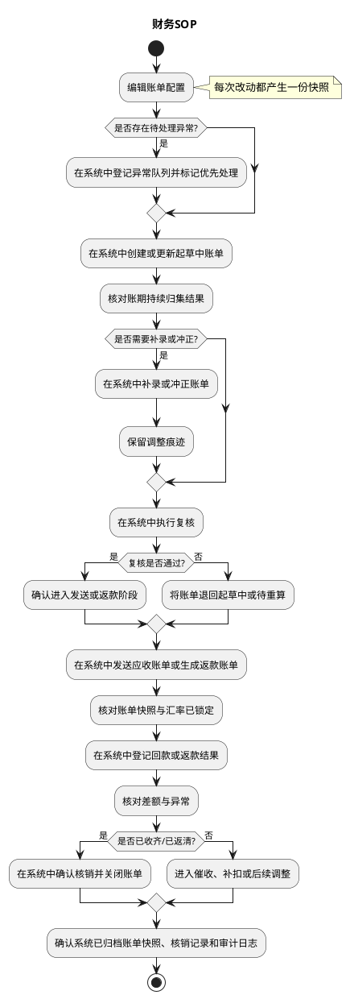
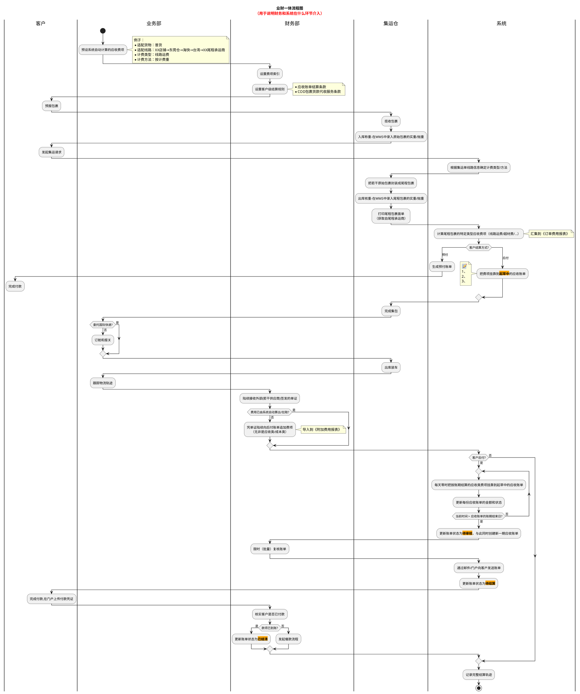
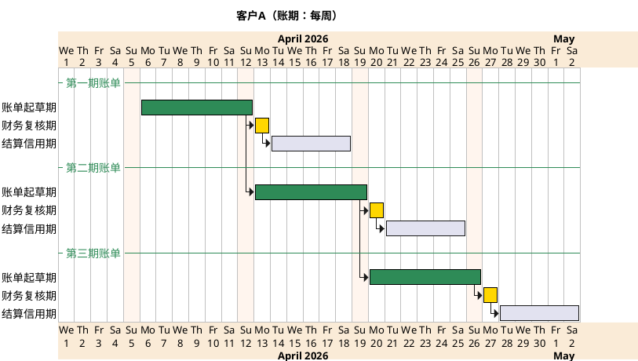
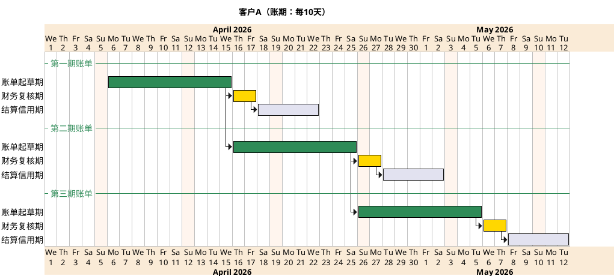
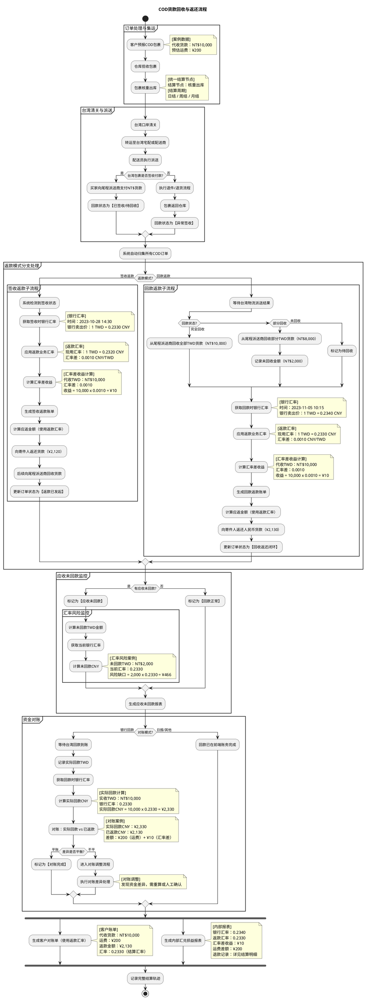

# 财务系统 PRD

## 1. 背景与目标
本 PRD 统一定义财务系统的账单体系与规则，目标是让系统能够：

- 按账期自动归集费项并生成账单。
- 支持应收账单与返款账单独立运行。
- 支持版本化结算条款与汇率快照留痕。
- 支持复核、补录、冲正、核销、对账和催收闭环。
- 保留历史账单、历史规则和历史汇率，不回写已生效单据。

## 2. 问题定义

1. 财务在应收、返款、核销、对账之间切换时，口径分散，难以追溯同一费项最终归属。
2. 账单生成依赖账期、费项归集、币种、汇率和扣减规则，若规则不统一会直接影响结算结果。
3. 应收账单与返款账单都存在历史快照诉求，若无统一冻结机制，容易出现历史账单被回写。
4. 返款与应收共享同一订单费用归属，但业务边界不同，需要明确优先级和分流规则。

## 3. 用户与场景

- 财务专员：维护配置、复核账单、处理核销与对账。
- 财务主管：审批冲正、调账、异常处理。
- 业务部：关注账单口径、线路与费项归属。
- 系统：按配置归集费项、生成账单、锁定快照、流转状态。
- 客户：接收账单、确认金额、完成付款或返款确认。

典型场景：

1. 应收账单按账期自动归集后付费项，并在复核后发给客户。
2. COD 返款账单按签收或回款触发，完成代收货款返还、扣减和核销。
3. 同一费项先判断是否进入返款账单，未命中时再进入应收账单。

## 4. 范围与边界

### 4.1 需求范围内

- 应收账单配置、生成、复核、发送、结算、冲正、核销。
- 返款账单配置、生成、复核、发送、回款管理、核销、对账。
- 费项索引、结算条款版本、汇率快照、账单状态机。
- 账单列表、详情、导出、审计留痕、异常处理。

### 4.2 需求范围外

- 不重写上游订单、包裹、WMS 的基础履约逻辑。
- 不展开应付账单的详细功能设计，仅保留类型定义与编号规则。
- 不做跨币种自动抵扣作为 V1 默认能力。

## 5. 功能清单

财务系统统一从“客户账单”入口进入，核心功能清单如下：

| 功能项 | 主要能力 | 对应菜单 / 入口 | 说明 |
| --- | --- | --- | --- |
| 应收账单管理 | 支持应收账单的列表、详情、复核、发送、结算、补录、冲正、核销与异常跟踪 | `客户账单 > 应收账单` | 面向财务的日常应收账单主入口 |
| 账单配置管理 | 支持客户级结算条款配置，包含账期、生效周期、信用期限、币种、分支规则与版本管理 | `客户账单 > 账单配置` | 用于维护客户级账单规则与版本快照 |
| 账单核销管理 | 支持核销流水查询、核销确认、反核销与核销结果追踪 | `客户账单 > 账单核销` | 用于核销操作和结果查询 |
| 账单生成任务 | 支持账单生成任务的发起、查看、重跑与执行结果监控 | `客户账单 > 生成任务` | 用于监控账单生成过程与异常结果 |
| 费项管理 | 支持费项索引维护、费项归类、费项取值规则与业务场景映射 | `客户账单 > 费项管理` | 统一维护 fee_index 与费项业务含义 |
| 费项来源配置 | 支持维护费项数据来源口径、取数规则和联表关系，保证自动归集口径统一 | `客户账单 > 数据源规则` | 用于配置费项来源表、关联关系和取数口径 |
| 币种模板管理 | 支持维护目的国及业务场景对应的费项结算币种模板，统一币种映射与结算口径 | `客户账单 > 币种模板` | 用于维护费项结算币种映射规则 |
| 账单生成机制 | 支持源数据增量采集、账单侧重算、配置快照固化、重跑边界控制与源数据行级标记管理 | `客户账单 > 生成任务 / 账单配置` | 账单生成的产品规则总入口 |

## 6. 业务对象与术语

| 术语 | 定义 |
| --- | --- |
| 费项 | 进入账单归集的费用明细，来源于自动计算、导入或手工补录。 |
| BMS费项池 | 费用明细最小粒度记录，是账单归集与核销的基本对象。 |
| sale_order_package_fee | 订单费用报表面板导入文件的包裹级落库表，承载尾程包裹粒度费用及回款金额。 |
| sale_order_fee_detail | 由系统从包裹级费用汇总得到的订单级费用明细表，用于账单和对账汇总。 |
| 应收账单 | 天马运通向客户收取费用时出示的账单。 |
| 返款账单 | COD 包裹代收货款返还给客户时出示的账单。 |
| 应付账单 | 天马运通向供应商支付费用时使用的对账账单，V1 不展开。 |
| 起草中 | 账单按账期持续归集费项的阶段。 |
| 待审核 | 账单已生成，进入财务复核窗口。 |
| 待发送 | 应收账单审核通过后、发送前的状态。 |
| 待结算 | 账单已发送，等待付款或返款完成。 |
| 已结清 | 账单全部金额闭环，仅保留查询与审计。 |
| 锁定汇率 | 生成或复核时冻结的汇率快照。 |
| 仅记入但不核销 | 费用已进入账单分摊范围，但本账期不做最终核销。 |

## 7. 总体方案与关键原则

财务系统的核心目标，是把“费用怎么来、账单怎么分、金额怎么锁、状态怎么走、历史怎么留”统一起来，形成一条财务和技术都能对齐的主链路。

### 7.1 总体链路

财务系统采用“费项归集 -> 账单生成 -> 复核发送 -> 付款 / 返款 -> 核销对账 -> 历史留痕”的统一链路。

系统负责：

1. 维护结算条款版本、费项索引和汇率快照。
2. 按账期自动归集费项并生成账单草稿。
3. 根据账单类型进入对应状态机。
4. 记录核销、回款、冲正和对账结果。

财务负责：

1. 维护客户级结算条款和返款配置。
2. 复核账单、补录费项、处理冲正。
3. 登记回款、核销差异、发起催收。

### 7.2 账单类型

| 类型 | 说明 | 本期范围 |
| --- | --- | --- |
| 应收账单 | 客户应付给天马运通的账单 | 是 |
| 返款账单 | 天马运通向客户返还 COD 货款的账单 | 是 |
| 应付账单 | 向供应商支付费用的账单 | 仅定义，不展开 |

### 7.3 账单编号

| 账单类型 | 前缀 | 结算主体 | 账期起始日 | 后缀 | 示例 |
| --- | --- | --- | --- | --- | --- |
| 应收账单 | ARB | 客户编号 | yyyymmdd | 业务板块+目的国 MD5 截前 4 位 | `ARB-OG4155-20260101-fse3` |
| 应付账单 | APB | 供应商编号 | yyyymmdd | 无 | `APB-OG4155-20260101` |
| 返款账单 | PCB | 客户编号 | yyyymmdd | 无 | `PCB-OG4155-20260101` |

应收账单同一账期内，若不同费项关联订单的业务板块或目的国不同，必须拆成多张账单，后缀用于区分。

### 7.4 归集与变更原则

1. 所有费项必须有挂靠对象。
2. 一个后付费项（代收代付类除外）只挂靠到一张账单。
3. 代收代付类费项可以同时挂靠到一张应收账单和一张成本账单。
4. 返款账单优先于应收账单分流。
5. 历史账单一旦进入审核或结清，不允许被后续配置直接回写。
6. 已通过财务复核的应收账单，不允许直接修改已挂靠费项。
7. 往期金额错误或变动，只能在本期账单冲正。
8. 返款账单已结清后，不允许直接改写原核销结果，只能通过新账单或调整单处理。
9. 所有账单均需保留配置快照、汇率快照与核销轨迹。

## 8. 财务SOP

财务 SOP 关注的是“每天先看什么、先做什么、什么状态能改、什么状态只能等”的固定操作节奏。它把账单生成、复核、发送、回款、核销和异常处理串成一条可执行的日常流程，方便财务和技术按同一顺序理解和实现。

### 8.1 SOP目标

1. 把财务日常动作标准化，减少个人经验差异。
2. 把系统任务、人工复核和资金动作串成同一条闭环。
3. 把起草、审核、发送、结算、核销和归档的边界说清楚。
4. 让财务和技术都能按同一节奏理解账单状态。

### 8.2 SOP主原则

1. 先看配置，再看费项，再看账单，再看资金，最后看核销。
2. 起草中可以改，待审核要复核，待结清只做资金动作，已结清只看历史。
3. 返款优先于应收，避免同一笔费用重复进入两个主账单。
4. 历史账单、历史汇率和历史快照不回写。
5. 所有异常都要有记录，不能靠删除源数据解决。

### 8.3 日常SOP

| 时段 | 财务人员实际动作 | 关注重点 | 输出 |
| --- | --- | --- | --- |
| 日初 | 查看当天启用的账单配置、生效版本、待处理任务和异常队列 | 是否存在过期配置、未处理异常或账期切换 | 当日处理清单 |
| 归集前 | 核对 BMS 费项池中的 `null / modified` 数据，确认本期应归集范围 | 账期、币种、费项归属、配置快照是否一致 | 可归集范围确认 |
| 导入期 | 按系统导入模板不定期导入订单费用报表文件，先由系统落库再校验金额 | 导入模板是否匹配、回款金额是否齐全、包裹级粒度是否正确 | 包裹级导入结果 |
| 归集中 | 触发账单生成并检查起草中账单的自动归集结果 | 是否漏项、重项、错项，是否命中返款优先规则 | 起草中账单修正结果 |
| 复核期 | 对待审核账单执行复核，处理补录、冲正和口径差异 | 起草中可改，待审核冻结，历史不回写 | 复核结论 |
| 账前整理 | 临近账期结算日，从系统导出相关明细并整理成客户对账格式 | 明细口径是否与客户对账口径一致，是否需要按财务方式重分组汇总 | 客户对账格式明细 |
| 发送/返款期 | 确认应收账单已发送，或确认返款账单已生成并进入后续处理 | 发送是否成功、汇率是否锁定、金额是否一致 | 待结清 / 待返清账单 |
| 结清期 | 登记回款或返款结果，核对差额、部分结清和异常回款 | 金额差异先核币种与汇率，再核核销 | 核销结果 |
| 日终 | 确认账单快照、核销记录和审计轨迹已归档 | 是否还有未闭环账单或待补处理事项 | 次日待办清单 |

日常执行顺序建议如下：

1. 先看配置是否有效，再看费项是否到位，再看账单是否起草完成。
2. 起草中账单优先处理补录和冲正，待审核账单只做复核和确认。
3. 临近账期结算日，先导出相关明细，再整理成客户对账格式，最后按财务口径汇总。
4. 返款优先于应收，避免同一笔费用重复进入两个主账单。
5. 已结清账单只做查询、对账和留痕，不再修改主结果。
6. 所有异常都必须落到系统记录中，不能靠人工口头同步或删除源数据解决。

### 8.4 财务SOP

## 9. 账单生成机制

### 9.1 设计目标

1. 起草中账单允许随时重跑。
2. 复核完成后的账单禁止再走“账单生成任务”重跑。
3. 账单生成拆分为源数据增量采集任务和账单侧调整重算任务。
4. 源数据侧仅保留 `null / synced / modified` 三种行级状态。
5. 已采集费项不能通过删除源数据来撤销。
6. 费项修正或作废必须通过账单侧调账、冲正或作废兜底。

### 9.2 任务分层

1. 源数据增量采集任务负责采集 `null / modified` 行，写入账单明细后回写为 `synced`。
2. 账单侧调整重算任务负责补录、冲正、汇率调整和配置变更后的重算，不回写源数据。
3. 触发方式包括定时、手动生成、失败重试、配置变更和财务调整。

### 9.3 行级标记

| 标记值 | 含义 | 产品规则 |
| --- | --- | --- |
| `null` | 尚未被采集 | 首次进入账单采集范围时拉取 |
| `synced` | 已被采集并同步 | 不再重复拉取 |
| `modified` | 已同步数据后又发生变化 | 下次重跑时增量补采 |

规则：

1. 新数据默认是 `null`。
2. 首次采集成功后写成 `synced`。
3. 上游或人工修改后变成 `modified`。
4. 重跑时只采 `null` 和 `modified`。
5. `synced` 和 `modified` 行都不能物理删除，只能保留用于追溯和审计。

### 9.4 配置与归属

1. 账单配置定义客户维度、业务类型、账期类型、履约节点和默认/分支规则。
2. 同一客户只能有一个默认配置，可以有多个分支配置。
3. 分支配置按目的国、仓库、业务板块等范围限定，重叠时按优先级或先到先得处理。
4. 同一订单在同一账期内只能命中一个 `bill_config_id`。
5. 执行前必须固化配置快照、范围快照和费项规则快照，不反查最新配置覆盖旧结果。
6. 账单归属时间不能简单按 `create_time` 判断，必须以账单归属时间快照为准。

### 9.5 生成与调整原则

1. 系统扫描启用配置，锁定当前账期和配置快照后开始生成。
2. 起草中账单可持续吸收新增或变化费用。
3. 进入 `待审核` 后，不允许再通过账单生成任务重跑覆盖结果，只能通过补录、冲正、调账或新账单承接变化。
4. 进入 `待结清` 或 `已结清` 后，不允许再回写历史主结果。
5. 若某笔费用同时满足应收与返款规则，优先进入返款账单。
6. 重跑只采增量，不做全量回扫。

### 9.6 状态与操作权限

| 账单状态 | 导出账单 | 调整账单 | 重跑账单 | 复核账单 | 重发账单 | 核销账单 |
| --- | --- | --- | --- | --- | --- | --- |
| 起草中 | 可 | 可 | 可 | 不可 | 不可 | 不可 |
| 待审核 | 可 | 可 | 不可 | 可 | 不可 | 不可 |
| 待结清 | 可 | 不可 | 不可 | 不可 | 不可 | 可 |
| 已结清 | 可 | 不可 | 不可 | 不可 | 不可 | 不可 |

说明：

1. 这里的“调整账单”指账单侧的补录、冲正、调账和重算，不等于重跑生成任务。
2. `待审核` 阶段不再允许重跑账单生成任务，但仍可通过账单侧调整触发口径修正。
3. `已结清` 只保留查询和历史追溯能力。

### 9.7 账单生成与调整流程图

```plantuml
@startuml
title BMS账单生成与调整产品流程
skinparam shadowing false
skinparam DefaultTextAlignment center
start
partition "任务触发" {
  :系统扫描启用中的账单配置;
  :判断当前是否到了账期出账时点;
  if (是否需要生成本期账单?) then (是)
    :创建本期账单生成任务;
    :固化配置快照、范围快照、费项规则快照;
  else (否)
    :保留为待触发状态;
    stop
  endif
}
partition "任务领取" {
  :领取账单生成任务;
  if (任务是否可执行?) then (是)
    :锁定任务，进入本次处理周期;
  else (否)
    :提示任务已被占用或已失效;
    stop
  endif
}
partition "范围判定" {
  :按照账单配置筛选客户、业务类型、目的国、仓库和账期;
  :确定本次允许进入账单的费项范围;
  if (是否命中分支配置?) then (是)
    :使用分支配置作为本次账单口径;
  else (否)
    :使用默认配置作为本次账单口径;
  endif
  :按账单归属时间筛选订单和附加费候选项;
}
partition "费用归集" {
  :按订单归属时间拉取候选费用;
  :判断每条费用是否已在 BMS 中存在有效历史版本;
  if (是否为新增费用?) then (是)
    :将费用记入 BMS 费用池;
  else (否)
    :判断来源费用是否发生变化;
    if (是否发生变化?) then (是)
      :保留旧费用版本;
      :新增费用版本并标记为待重算;
    else (否)
      :跳过重复费用;
    endif
  endif
  :根据费项规则拆分主费用和附加费;
  if (是否为账单后新增附加费?) then (是)
    :进入增量归集候选队列;
  else (否)
    :继续进入本期常规归集队列;
  endif
}
partition "账单归属" {
  :按账单类型判断费用应进入应收、返款或其他账单;
  if (是否允许进入当前账单类型?) then (是)
    :生成账单费用关联;
  else (否)
    :将费用保留在待后续处理队列;
  endif
  if (是否同时命中返款与应收规则?) then (是)
    :优先进入返款账单;
  else (否)
    :按各自规则进入对应账单;
  endif
  if (是否存在待结清或已结清账单?) then (是)
    :不修改既有账单结果;
    :转入后续调整账单或新账单处理;
  else (否)
    :允许当前账单侧继续吸收未结清费用;
  endif
}
partition "账单计算" {
  :锁定结算币种、财务本位币和汇率快照;
  :计算原始金额、结算金额和本位币金额;
  :汇总账单金额、待处理金额和核销进度;
  if (是否发生红冲、调账或补录?) then (是)
    :在账单侧新增调整记录;
    :保留原费用版本和历史轨迹;
  else (否)
    :继续保留正常费用汇总结果;
  endif
  if (是否需要重跑当前账单?) then (是)
    :仅重算账单侧结果;
    :不回写源费用和已存在历史账单;
  else (否)
    :保留本次生成结果;
  endif
}
partition "结果落库" {
  :写入账单费用关联及账单侧快照;
  :刷新账单汇总、币种汇总和状态;
  :更新来源归集轨迹和源表打标结果;
  if (是否存在源表打标失败?) then (是)
    :保留失败标记并等待补偿重试;
  else (否)
    :完成本次账单生成;
  endif
  if (是否允许后续修正?) then (是)
    :保留可调整入口;
  else (否)
    :冻结当前账单口径;
  endif
}
partition "后续处理" {
  if (账单是否仍可调整?) then (是)
    :允许补录、冲正、调账、汇率调整或重跑;
    if (是否已结清?) then (是)
      :只允许通过后续调整账单处理;
    else (否)
      :允许在当前账单侧重算并刷新结果;
    endif
  else (否)
    :仅保留查询、导出和审计追溯;
  endif
}
stop
@enduml
```

## 10. 应收账单模块

### 10.1 需求背景

集运单自创建后到履约结束涉及的大量后付应收费项，常跨越多个账期录入，财务需要按账期把费项挂靠到账单，并支持补录、冲正和批量调账。

### 10.2 核心设计思路

1. 任何费项都必须有挂靠对象：应收账单、主单、尾程包裹或原始包裹。
2. 后付费项必须挂靠到特定账单进行结算。
3. 系统自动算出的费项默认归入应收类，允许在起草期人工调整，但保留系统原始值。
4. 需要改造费用报表结构，以支持履约全过程费用与利润分析，并兼容包裹级到订单级的费用汇总链路。
5. 新账单从上一账期最后一轮费项数据捞取，默认处于起草状态。
6. 每天零时自动把本期后付费项挂靠到起草中的本期应收账单。
7. 若对应账单已复核，则该费项不可再修改。

### 10.3 业财一体流程

1. 业务部预设系统自动计算的应收费项。
2. 财务维护费项索引与客户级结算条款。
3. 客户预报、仓库揽收、入库称重、集运请求、尾程核重。
4. 系统计算线路运费、超材费等标准费项并汇集到订单费用报表。
5. 后付模式下，系统把费项挂靠到起草中的应收账单。
6. 账期结束后，账单进入待审核，系统创建新一期账单。
7. 财务批量复核后，系统发送账单并进入待结算。
8. 客户付款后，财务核实到账并完成结清。
9. 财务按系统导入模板不定期导入订单费用报表面板文件时，金额先落在 `sale_order_package_fee` 的包裹级粒度，再由系统汇集到 `sale_order_fee_detail` 的订单级粒度；`sale_order_package_fee` 直接包含回款金额。

#### 10.3.1 业财一体流程图

### 10.4 账单状态机

| 状态 | 定义 | 关键规则 |
| --- | --- | --- |
| 起草中 | 按账期持续归集费项 | 账期即起草周期 |
| 待审核 | 结束起草，等待财务复核 | 冻结正常修改入口 |
| 待发送 | 审核通过，待系统发送 | 发送失败可重试 |
| 待结算 | 已发送，等待付款 | 可部分付款 |
| 部分待结算 | 已收到部分款项 | 余额继续滚动 |
| 逾期未结清 | 超过信用期仍未足额收款 | 触发催收 |
| 已结清 | 全部到账 | 终态 |

#### 10.4.1 应收账单状态流转图

流转规则：

1. 首次抓取本期费项时创建账单，进入起草中。
2. 起草中持续挂靠费项，账期结束后自动进入待审核。
3. 财务审核通过后进入待发送，系统负责对客户发送账单。
4. 发送成功后进入待结算。
5. 收到部分款项进入部分待结算，全部收齐进入已结清。
6. 到期未收足款项进入逾期未结清，后续收齐仍可转回已结清。

### 10.5 账期与自动拆单

1. 账期支持周、半月、月、10 天、15 天。
2. 同一客户、同一账期内，业务板块或目的国不同的费项必须拆成多张应收账单。
3. 拆分依据来自源订单的业务板块和目的国，缺值则任务报错。
4. 同一账期拆出的账单互不影响，复核、发送、付款、核销均按账单维度独立进行。

#### 10.5.1 账期节奏示意（周）

#### 10.5.2 账期节奏示意（10天）

### 10.6 结算条款配置

应收账单配置为客户级、版本化结算条款，包含两部分：

- 应收账单结算条款
- COD 包裹货款代收条款

关键规则：

1. 一个客户在同一时间只允许有一个当前生效版本。
2. 旧版本生效并通知客户后，不允许就地编辑，只能新建版本。
3. 每个账单必须指明依赖的条款版本。
4. 条款以 JSON 落库，支持历史版本查看。

配置项至少包括：

- 账期类型
- 生效周期
- 信用期限
- 滞纳金
- 信用评级
- 垫资额度上限
- 合同信息
- 账单发出时间
- 账单结算币种
- 费项默认结算币种
- 费项指定结算币种

分支方案规则：

1. 默认方案必须存在。
2. 分支方案用于按目的国、集运仓、业务板块等维度拆分。
3. 分支方案之间不得存在情形交集。
4. 条件变更必须实时校验冲突。

### 10.7 费项索引与汇率

费项索引用于财务导入、冲正和采集配置参考。

结算汇率分三级：

1. 费项级
2. 账单级
3. 店铺级

优先级为：费项级 > 账单级 > 店铺级。

规则：

1. 账单生成或复核时锁定汇率快照，不随市场汇率自动刷新。
2. 财务本位币种作为中转币种时，用于统一核算与对账。
3. 当费项原始币种与结算币种相同时，优先展示直接锁定汇率。
4. 账单级汇率仅影响起草中或待审核账单。

### 10.8 关键交互

1. 财务可在起草中查看费项归集结果并补录遗漏费项。
2. 财务在待审核阶段处理冲正与复核。
3. 系统在待发送阶段负责邮件或门户发送。
4. 财务在待结算、部分待结算、逾期未结清阶段完成对账、核销与催收。

## 11. 返款账单模块

### 11.0 模块总览

返款账单模块用于管理 COD 包裹签收后的货款回收、货款返还、汇率换算、核销追踪和未回款监控。

从产品视角看，本模块同时处理两条相互独立、但又彼此关联的线：

1. 包裹线：回答某个 COD 包裹当前是已回款、待回款，还是不回款；已返款、待返款，还是不返款。
2. 账单线：回答与该包裹相关的返款账单当前处于起草中、待审核、待结清还是已结清。

包裹状态与账单状态不做同名映射，包裹状态按回款管理列表口径计算，账单状态按返款账单处理进度计算。

### 11.1 需求背景

返款账单用于承载 COD 包裹签收后的货款回收与返还结算，统一管理签收返款和回款返款两种模式下的账单归集、汇率快照、汇兑损益、核销追踪和未回款监控。
当前业务上，绝大部分客户采用回款返款，签收返款仅用于少数客户的特殊约定场景。

### 11.2 核心概念

| 概念 | 定义 | 说明 |
| --- | --- | --- |
| `回款` | 财务向尾程派送商回收 COD 货款 | 结果是把货款从派送商回收到货代侧。 |
| `返款` | 财务向寄件人返还 COD 货款 | 结果是把货款从货代侧返还给寄件人。 |
| `签收返款` | 收件人签收后，先返还、后回收 | 适用于需要先垫资的场景。 |
| `回款返款` | 收件人签收后，先回收、后返还 | 适用于先收到货款再返还的场景。 |
| `正常签收` | COD 包裹正常签收且进入回款 / 返款结算闭环 | 必须同时产生回款和返款动作。 |
| `异常签收` | COD 包裹发生拒收、退件或其他异常 | 不产生回款和返款动作，仅保留在回款管理中跟踪。 |
| `汇兑损益` | 到付币种与回款 / 返款币种不一致时的差额 | 仅在正常签收、同时存在回款和返款时计算。 |

关键规则：

1. 返款账单与应收账单可独立按各自账期运行，不要求同周期对齐。
2. 所有 COD 包裹均纳入回款管理；只有正常签收包裹进入回款、返款和汇兑损益计算。
3. 回款和返款使用同一结算币种；若到付币种与结算币种不一致，则分别按回款汇率和返款汇率折算。
4. 汇兑损益只在正常签收、同时存在回款和返款，且到付币种与结算币种不一致时计算；同币种场景不计算。
5. 当到付币种与结算币种不一致时，回款金额 = 到付金额 x 回款汇率，返款金额 = 到付金额 x 返款汇率，汇兑损益金额 = 回款金额 - 返款金额。

### 11.3 货款回收与返还流程

本节描述的是 COD 包裹从签收到货款闭环的主业务链路，重点回答“先发生什么、后发生什么、在哪一步分流、在哪一步结算”。

1. 客户预报 COD 包裹，系统生成包裹记录及货款原始金额。
2. 包裹完成派送后，系统先判断签收结果：正常签收进入结算闭环，异常签收仅保留追踪状态。
3. 正常签收包裹再根据返款模式分流：`签收返款` 先返后回，`回款返款` 先回后返。
4. 财务在系统中确认回款和返款结果，系统同步更新包裹状态、账单状态和核销记录。
5. 若到付币种与回款 / 返款币种不一致，系统在同一结算币种下计算汇兑损益并保留汇率快照。

#### 11.3.1 COD货款回收与返还流程图

### 11.4 返款账单状态机

返款账单状态机只描述账单本身的处理进度，不直接决定包裹的回款状态或返款状态。包裹状态必须按回款管理列表口径单独计算。

| 状态 | 定义 | 关键规则 |
| --- | --- | --- |
| 起草中 | 按账期持续归集返款费项 | 允许补录与调整归集口径 |
| 待审核 | 账单已生成，等待财务复核 | 冻结明细修改 |
| 待结清 | 审核通过，等待对寄件人的返款或对派送商的回款 | 支持部分结清 |
| 已结清 | 返款和回款全部完成 | 终态 |

#### 11.4.1 返款账单状态机图

说明：

1. 原型中的状态名统一采用“待审核”。
2. 部分返款/部分回款不单独作为主状态，作为待结清下的进度处理。
3. 发送动作是过渡节点，不单独作为主状态展示。

### 11.5 返款模式分支

返款模式以回款返款为主流路径，签收返款作为少数客户的例外配置存在。系统需同时支持两种模式，但页面默认表达和业务描述应优先围绕回款返款展开。

本节只描述返款链路的分支方式，不改变包裹是否回款、是否返款的判定口径。

#### 11.5.1 签收返款（先返后回）

1. 系统识别到订单为正常签收。
2. 财务先向寄件人返还货款，并锁定返款汇率快照。
3. 系统按返款汇率计算应返金额，并在币种不一致时同步计算汇兑损益。
4. 返款完成后，再向尾程派送商发起货款回收，订单状态更新为回款闭环。

#### 11.5.2 回款返款（先回后返）

1. 系统等待尾程派送结果和派送商回款结果。
2. 按完全回款、部分回款、未回款三类记录回款状态。
3. 财务确认回款到账后，系统锁定回款汇率快照并计算应返金额。
4. 完成回收后生成回款返款账单，并向寄件人发起货款返还。
5. 订单状态更新为回款返款闭环。

### 11.6 返款配置

返款账单配置用于维护 COD 包裹货款代收条款，至少包括：

- 返款模式
- 账期类型
- 账期起始日
- 账单发出时间
- 在应返货款中直接扣减的应收费项
- 实返货款金额比例
- 货款结算币种
- 客户收款账户
- 当实返货款金额为负数时的应对措施
- 条款生效周期

关键规则：

1. 配置采用版本化管理。
2. 生效后仅影响后续新生成账单，不回写历史账单。
3. 条款生效周期内不允许重叠。
4. 货款结算币种按原始币种逐行匹配，兜底行必须存在。
5. 负数金额可选择顺延到下期返款账单，或反向计入本期应收账单。

### 11.7 返款账单详情与汇率区

返款账单详情页用于集中展示单笔 COD 包裹的结算结果、汇率快照和核销轨迹。页面从上到下依次回答四件事：这笔包裹是什么、账算到哪一步了、金额怎么算出来的、核销依据是什么。

页面展示区块如下：

1. 账单信息区：货款结算币种、返款金额、回款金额、未回款金额、账单状态。
2. 返款明细区：代收货款按返款汇率换算后的应返金额。
3. 扣减费项区：基础运费、代收服务费等可直接扣减费项。
4. 核销记录区：每笔回款或扣减动作的核销轨迹。
5. 账单汇率区：展示锁定汇率和换算结果。
6. 汇兑损益区：仅在正常签收、同时存在回款和返款，且到付币种与回款 / 返款币种不一致时展示；回款金额与返款金额按同一结算币种折算后，按 `汇兑损益金额 = 回款金额 - 返款金额` 计算。

汇率区规则：

1. 默认按 `货款结算币种 -> 财务本位币 / 货款结算币种 -> 货款原始币种 / 货款结算币种 -> 费用原始币种` 分组展示。
2. 同一货币对只保留一条展示记录。
3. 若存在直接汇率，优先展示直接汇率。
4. 若不存在直接汇率，则通过财务本位币种中转推导。
5. 页面仅展示生成或复核时锁定的快照，不随市场汇率变化刷新。

### 11.8 回款管理

[原型：回款管理](http://localhost:9999/start.html#g=1&id=36g8f0&p=%E5%9B%9E%E6%AC%BE%E7%AE%A1%E7%90%86&g=1)

回款管理是财务查看所有 COD 包裹回款状态、返款状态、汇兑损益和对账状态的统一列表入口。列表主粒度为尾程包裹，数据来自订单费用报表导入后沉淀的 `sale_order_package_fee`，系统再汇总到 `sale_order_fee_detail`。回款管理不提供单独的回款导入入口。

这一页的核心不是“再算一遍账”，而是把包裹级事实、返款账单状态和对账结果放到同一张列表里，方便财务按包裹追踪全链路。

页面以尾程包裹为主粒度展示回款事实、返款事实和结算结果；列表行数据来源于 `sale_order_package_fee`，系统汇总口径对应 `sale_order_fee_detail`。
汇兑损益仅对正常签收、同时存在回款和返款记录，且到付币种与回款 / 返款币种不一致的行计算；异常签收行和同币种行不展示汇兑损益金额。

#### 11.8.1 页面目标

1. 以尾程包裹为主粒度，关联运单和订单信息，集中展示回款状态、返款状态和结算结果。
2. 回款数据直接来源于订单费用报表导入后的沉淀结果，不在回款管理内二次导入。
3. 支持快速识别已回款、待回款、不回款，以及已返款、待返款、不返款，并覆盖所有 COD 包裹的状态跟踪。
4. 支持从列表直接定位关联返款账单，并追踪核销结果。

#### 11.8.2 页面结构与字段

| 区域 | 字段 / 操作 | 说明 |
| --- | --- | --- |
| 操作区 | `查看汇兑损益` | 勾选后展示汇兑损益相关的红色表头字段；仅对正常签收、同时存在回款和返款记录，且到付币种与回款/返款币种不一致的行生效。 |
| 基础信息列 | 尾程运单号、所属内部订单、所属客户、所属店铺、签收状态、签收时间、货款原始金额、尾程派送商、回款状态、返款状态、回款时间、返款时间、回款汇率、返款汇率、实回货款金额、实返货款金额 | 用于定位运单、确认签收与回款 / 返款事实，并作为回款核对依据。 |
| 返款信息列 | 返款模式、关联返款账单、应返货款金额、汇兑损益金额 | 用于展示返款动作、结算结果和汇兑差异。 |

#### 11.8.3 业务规则

回款状态和返款状态是包裹级状态，返款账单状态是账单级状态，两者不互相替代，只存在规则上的关联。

包裹状态判定优先级如下：

1. 先判定签收结果。异常签收优先落为 `不回款` 和 `不返款`，并直接忽略返款账单状态。
2. 再判定回款明细。正常签收包裹若尾程运单号出现在 `ofp_ofdb1.sale_order_package_fee` 且 `ofp_ofdb1.sale_order_fee_detail.recovery_money` 非空非零，则回款状态为 `已回款`，否则为 `待回款`。
3. 再判定返款账单状态。正常签收包裹若其所属业务主单挂靠的返款账单已结清，则返款状态反推为 `已返款`，否则为 `待返款`。
4. 账单状态只影响返款状态反推，不反向改写回款状态；回款状态只看回款明细，不看账单是否已结清。

1. 所有 COD 包裹都必须同时有回款状态和返款状态，且两者均与返款账单状态解耦。
2. 回款状态仅取值 `已回款`、`待回款`、`不回款`。
3. 返款状态仅取值 `已返款`、`待返款`、`不返款`。
4. 异常签收的 COD 包裹固定为 `不回款` 和 `不返款`。
5. 正常签收的 COD 包裹，尾程运单号出现在 `ofp_ofdb1.sale_order_package_fee` 且 `ofp_ofdb1.sale_order_fee_detail.recovery_money` 非空非零时，回款状态为 `已回款`，否则为 `待回款`。
6. 正常签收的 COD 包裹，其所属业务主单挂靠的返款账单已结清时，返款状态反推为 `已返款`，否则为 `待返款`。
7. 返款模式为签收返款时，先返还后回收。
8. 返款模式为回款返款时，先回收后返还。
9. 汇兑损益仅在正常签收、同时存在回款和返款，且到付币种与回款 / 返款币种不一致时计算；同币种场景不计算也不展示。
10. 关联返款账单应可点击跳转到对应账单详情，便于核销追溯。
11. 订单费用报表导入后，系统应同步刷新列表状态、账单核销记录和未回款监控。

#### 11.8.4 状态联动

1. 正常签收包裹的回款状态和返款状态，分别按 11.8.3 的规则独立计算，不因返款账单主状态直接变化。
2. 返款账单从待结清进入已结清，只表示对应业务主单的返款闭环完成，不代表所有包裹状态同步变更。
3. 异常签收包裹固定显示为 `不回款` 和 `不返款`，并保留在回款管理列表中。
4. `查看汇兑损益` 打开时，页面展示的损益字段应保持与账单锁定快照一致，不随市场汇率刷新；异常签收行和同币种行不展示汇兑损益字段。

### 11.9 报表输出

系统需输出：

1. 客户对账单。
2. 内部汇兑损益报表。
3. 应收未回款报表。
4. 完整结算轨迹。

## 12. 交叉规则与数据归集

### 12.1 BMS费项池分流规则

1. 同一份 `BMS费项池` 在返款账单和应收账单之间分流，不是时间线上的互斥关系。
2. 若某条费项命中返款账单规则，优先进入返款账单。
3. 未命中返款规则的费项继续进入应收账单。
4. 应收账单中的“仅记入但不核销”费项，最终核销责任归属返款账单。
5. 若返款账单尚未触发或条件不成立，该费项在应收账单中只能保持挂账占位。

### 12.2 异常与兜底

1. 应收账单已复核后，缺失费项只能补录，错误费项只能冲正或下期处理。
2. 返款账单部分回款时，主状态保持待结清，只更新余额和核销记录。
3. 非正常签收包裹的冲减费项自动进入应收账单。
4. 若一条费项同时满足应收和返款归集且冲突，优先进入返款账单。

### 12.3 历史留痕

系统必须保留：

- 账单快照
- 条款版本
- 汇率快照
- 核销记录
- 回款记录
- 对账差异
- 操作日志

## 13. 数据与指标

核心数据对象：

- 账单编号
- 账单状态
- 账期
- 费项明细
- 应返金额 / 应收金额
- 已返金额 / 已收金额
- 未回款金额 / 未收金额
- 结算币种
- 财务本位币种
- 汇率快照
- 核销记录

建议指标：

1. 账单自动生成成功率。
2. 账单复核通过率。
3. 返款核销成功率。
4. 未回款敞口金额。
5. 汇率差收益金额。

## 14. 非功能需求

1. 权限控制：配置、复核、核销和回款管理按角色授权。
2. 审计留痕：配置修改、汇率保存、核销和回款动作必须可追踪。
3. 一致性：历史账单快照不得被后续配置回写。
4. 可用性：列表、详情和管理页支持日常财务稳定访问。
5. 国际化：币种、汇率、日期和时区展示口径统一。

## 15. 风险与依赖

### 15.1 依赖

- 订单与包裹履约数据准确。
- 银行汇率来源稳定。
- 邮件或门户通知链路稳定。
- WMS、CRM、财务本位币配置可用。

### 15.2 风险

1. 汇率口径变化会影响历史与当前账单一致性。
2. 条款版本不统一会导致账单生成差异。
3. 历史快照若被误覆盖，会影响审计与对账。
4. 应收与返款术语不统一会造成实现偏差。

## 16. 验收标准

| 编号 | 验收项 | 前置条件 | 操作 / 输入 | 预期结果 | 关联章节 |
| --- | --- | --- | --- | --- | --- |
| AC-01 | 应收账单自动归集 | 客户已配置结算条款、账期和费项规则 | 触发账单生成任务 | 系统按账期自动归集费项，生成起草中账单，并形成可追溯的账单快照 | 8, 9, 10 |
| AC-02 | 应收账单复核与流转 | 应收账单已进入起草中 | 财务执行复核并发送 | 账单可从起草中流转到待审核、待结算，最终进入已结清；流转过程留痕完整 | 8, 10 |
| AC-03 | 业务板块+目的国拆单 | 同一客户同一账期存在不同业务板块或目的国费用 | 触发应收账单生成 | 系统按业务板块+目的国拆成多张账单；若源数据缺少任一维度，任务报错并阻止生成 | 10.2, 10.5 |
| AC-04 | 返款账单双模式生成 | 客户已配置返款模式与返款条款 | 分别触发签收返款和回款返款 | 系统可按签收返款、回款返款两种模式分别生成返款账单，并完成结清闭环 | 11.2, 11.3, 11.5 |
| AC-05 | 返款详情展示完整性 | 已存在返款账单 | 打开返款账单详情页 | 页面可展示货款结算币种、应返金额、回款金额、未回款金额、核销记录、锁定汇率与差额说明 | 11.7 |
| AC-06 | BMS费项池分流正确性 | 同一 BMS费项池 同时可能命中应收与返款规则 | 触发归集 | 系统优先将费用归入返款账单；未命中的费用再进入应收账单，且不产生重复入账 | 12.1, 12.2 |
| AC-07 | 历史快照不可回写 | 已生成历史账单，后续配置发生变更 | 修改条款、汇率或规则后重跑新任务 | 历史账单和历史汇率保持原快照不变，仅后续账期使用新配置 | 8.4, 10.6, 11.6, 12.3 |
| AC-08 | 部分回款 / 异常回款留痕 | 存在部分回款、未回款或异常回款场景 | 通过订单费用报表导入后查看回款管理结果 | 系统可保留差额、待处理标记、核销记录和对账轨迹，不丢失历史状态 | 11.8, 11.9 |
| AC-09 | 账单生成机制重跑边界 | 账单处于起草中、待审核、待结清或已结清状态 | 执行重跑、补录、冲正或调账 | 起草中允许重跑；待审核及之后状态禁止用生成任务覆盖结果，只能通过账单侧调整承接变化 | 9.1, 9.5, 9.6 |
| AC-10 | 行级标记与增量采集 | 源数据已配置行级标记 | 变更源数据并重跑采集 | 系统仅采集 `null / modified` 行，回写为 `synced`；已采集数据不允许物理删除 | 9.2, 9.3 |
