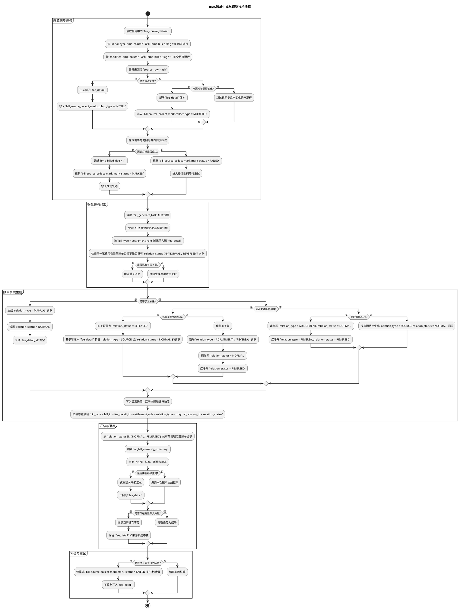
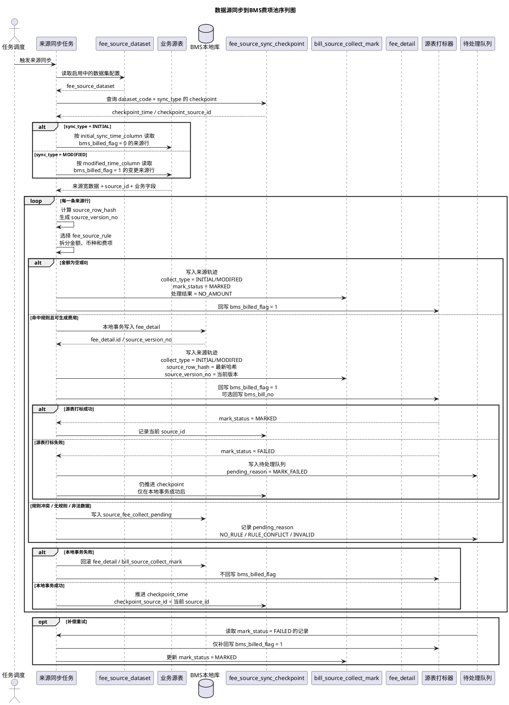
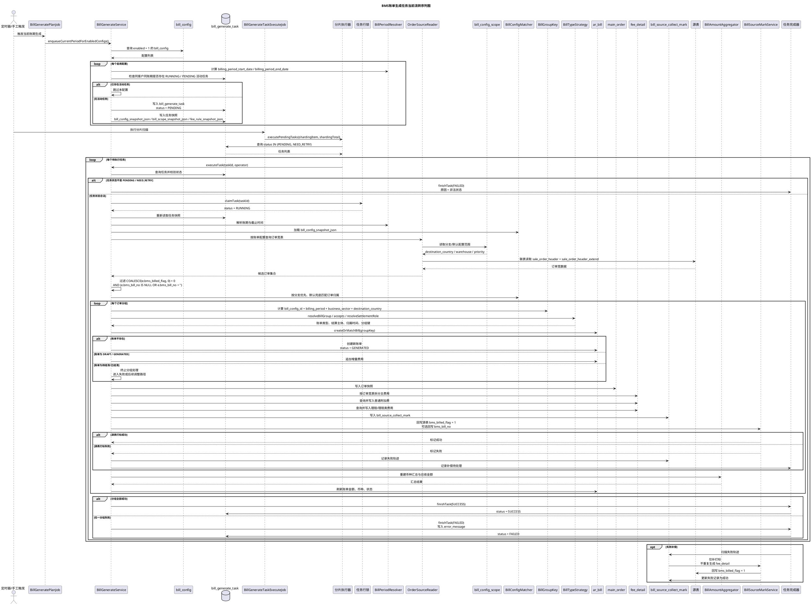
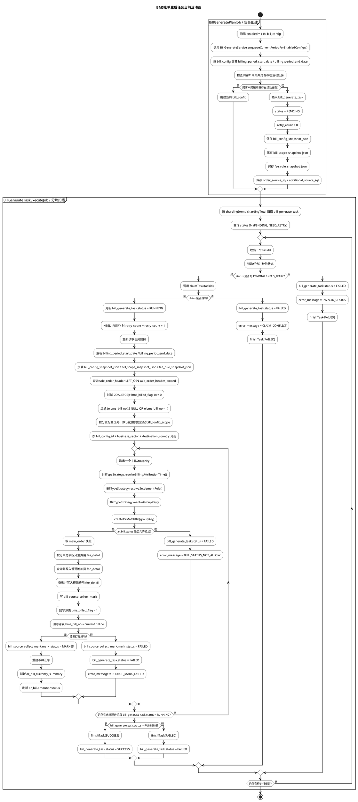
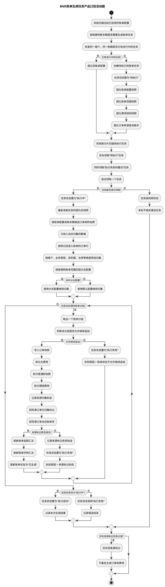
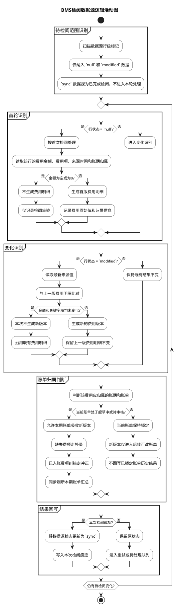

---
toc: true
toc_position: left
---


# 账单生成机制

本文是 BMS 应收账单生成的主设计稿，整合了原 `bms-bill-generation-design.md` 和 `bms-bill-generate-code-design.md`，并保留当前“账单生成机制”里的所有业务约束。目标是把配置、任务、代码路径、重跑边界、数据源标记、事务和幂等一次讲清楚。

## 1. 设计目标

1. 起草中账单允许随时重跑。
2. 复核完成后的账单禁止再走“账单生成任务”重跑。
3. 账单生成相关动作拆成两条任务线：源数据增量采集任务、账单侧调整重算任务。
4. 数据源侧只保留一个行级标记字段，用 `null / sync / modified` 表达采集状态。
5. 每次重跑都只采集增量数据，不做全量回扫。
6. 已被财务系统采集过的数据行不能物理删除，避免源数据侧“查无此行”。
7. 如果已采集费项需要修正或作废，必须通过财务调账中心兜底处理，不得直接修改或删除数据源。

## 2. 账单状态与操作权限

这里的“复核完成”指账单已经完成复核动作，进入后续结算链路，对应 `待结清` 及之后的状态。

| 账单状态 | 导出账单 | 调整账单 | 重跑账单 | 复核账单 | 重发账单 | 核销账单 |
| --- | --- | --- | --- | --- | --- | --- |
| 起草中 | 可 | 可 | 可 | 不可 | 不可 | 不可 |
| 待审核 | 可 | 可 | 可 | 可 | 不可 | 不可 |
| 待结清 | 可 | 不可 | 不可 | 不可 | 不可 | 可 |
| 已结清 | 可 | 不可 | 不可 | 不可 | 不可 | 不可 |

### 2.1 核心结论

1. `起草中` 属于账单可改阶段，允许重跑。
2. `待审核` 仍允许复核期内调整，但不再重跑账单生成任务。
3. 一旦账单进入 `待结清`，就不能再重跑账单生成任务。
4. 如果复核阶段发现问题，应该通过补录缺失费项或冲正已入账费项、调整汇率触发重算，而不是手工改总额。
5. 其中补录和冲正都发生在账单侧，只影响账单和账单明细，不回写数据源行级标记。
6. `已结清` 只保留查询和历史追溯能力，不允许再改生成结果。

## 3. 两条任务线

### 3.1 源数据增量采集任务

职责：

1. 从数据源采集 `null / modified` 行。
2. 写入账单明细、账单汇总、来源归集标记。
3. 回写命中的源数据为 `sync`。

触发方式：

| 触发方式 | 场景 | 说明 |
| --- | --- | --- |
| 定时器 | 常规周期出账 | 系统按账期自动创建任务 |
| 手动点击【生成】 | 运营/财务手工补跑 | 与定时器同样遵循状态闸门 |
| 技术重试 | 任务失败补偿 | 只补上一次采集失败的部分 |

推荐 `trigger_type`：

1. `SCHEDULE`
2. `MANUAL`
3. `RETRY`

### 3.2 账单侧调整重算任务

职责：

1. 补录费项、冲正费项、调整汇率。
2. 配置变更后重算账单侧口径。
3. 只改账单和账单明细，不改数据源。

触发方式：

| 触发方式 | 场景 | 说明 |
| --- | --- | --- |
| 变更账单配置 | 费项采集范围发生变化 | 新增范围里的未采集源数据继续走增量采集，已采集部分走账单重算 |
| 财务复核中的调整 | 补录费项、冲正费项、调整汇率 | 只改账单和账单明细，不改数据源 |

推荐 `trigger_type`：

1. `CONFIG_CHANGE`
2. `FINANCE_ADJUSTMENT`

## 4. 数据源行级标记

数据源侧每一行只保留一个标记字段，取值只有三种：

| 标记值 | 含义 | BMS 行为 |
| --- | --- | --- |
| `null` | 尚未被采集 | 首次进入账单采集范围时拉取 |
| `sync` | 已被采集并同步 | 不再重复拉取 |
| `modified` | 已同步数据后又发生变化 | 下次重跑时增量补采 |

### 4.1 状态流转

1. 新数据默认是 `null`。
2. BMS 首次采集成功后写成 `sync`。
3. 源数据被 OMS、上游系统或人工直接修改后，状态变成 `modified`。
4. BMS 重跑时只捞 `null` 和 `modified` 的源数据，采完再回写成 `sync`。

### 4.2 物理删除约束

1. `sync` 或 `modified` 的源数据不能被物理删除，只能继续保留用于采集、追溯和审计。
2. 已被财务系统采集过的数据行也不能被物理删除，避免已采集费项在数据源侧找不到。
3. 如果这些费项需要修正或作废，应通过财务调账中心兜底处理，不得直接修改或删除数据源。
4. 若业务上需要“撤销采集结果”，只能走账单侧冲正或作废，不允许通过删源数据来掩盖。

## 5. 配置与数据源模型

### 5.1 费项数据源配置表

`fee_source_datasource` 负责“怎么连接”：

1. `datasource_code`
2. `datasource_name`
3. `source_system`
4. `jdbc_url`
5. `username`
6. `password_cipher`
7. `default_database`
8. `enabled`

规则：

1. 密码必须加密存储。
2. 接口返回和日志打印只能脱敏展示。
3. 一条数据源配置代表一个可读数据库连接。
4. 数据源配置只负责连接，不负责取哪个费项。

### 5.2 费项来源规则

`fee_source_rule` 负责“从哪里取、怎么取”：

1. `datasource_code`
2. `source_table`
3. `source_amount_column`
4. `source_time_column`
5. `filter_params_json`
6. `supported_contract_nodes`

`business_type_fee_index` 负责把业务类型、费项、来源规则绑定起来。

推荐关系：

```text
fee_source_datasource.datasource_code
  -> fee_source_rule.datasource_code
  -> business_type_fee_index.fee_source_rule_id
  -> business_type_fee_index.fee_index_id
```

### 5.3 账单配置

`bill_config` 负责账单口径：

1. 客户维度：`sc_id / shop_id / user_id / member_code`
2. 业务类型：`PEER / ECOMMERCE / CONSOLIDATION`
3. 账期类型：`DAY / WEEK / HALF_MONTH / MONTH`
4. 履约节点：`WEIGHT_OUTBOUND / SIGN / SIGNED`
5. 账单类型：默认配置 / 分支配置

### 5.4 分支配置和默认配置

1. 同一客户只能有一个默认配置。
2. 可以有多个分支配置。
3. 分支配置通过 `bill_config_scope` 限定 `DEST_COUNTRY` 和 `WAREHOUSE`。
4. 订单归属必须先抢分支，再由默认配置兜底。
5. 同一订单在同一账期内只能命中一个 `bill_config_id`。
6. 分支配置重叠时按 `priority ASC, id ASC` 先到先得。

## 6. 数据来源表

### 6.1 订单主表

`sale_order_header` 主要提供：

1. 订单 ID、订单号、客户、店铺、目的国。
2. 签收时间相关字段。
3. 订单业务类型和基础状态。

### 6.2 订单扩展表

`sale_order_header_extend` 主要提供：

1. 核重时间。
2. 扩展金额字段。
3. 订单账单打标字段。

建议字段：

```sql
bms_billed_flag
bms_bill_no
```

### 6.3 附加费表

`sale_order_additional_matter` 主要提供：

1. 转板费、退运费、税费、木架费等附加费。
2. 与订单、首程/尾程单号关联的增量费用。
3. 账单生成后仍可能新增的费用。

建议字段：

```sql
bms_billed_flag
bms_bill_no
bms_after_bill_added_flag
```

规则：

1. `bms_after_bill_added_flag = 1` 表示计费后新增。
2. 附加费增量任务专门扫描这类数据。

## 7. 账期和履约节点

### 7.1 账期窗口

按 `billing_cycle_type` 计算：

1. `DAY`：自然日。
2. `WEEK`：自然周或配置周。
3. `HALF_MONTH`：1-15、16-月底。
4. `MONTH`：自然月。

### 7.2 履约节点映射

| contract_node | 业务含义 | 推荐字段 |
| --- | --- | --- |
| `WEIGHT_OUTBOUND` | 核重出库 | `measure_time` |
| `SIGNED` / `SIGN` | 签收 | `signed_time` |

规则：

1. 账期不能简单按 `create_time` 判断。
2. BMS 生成时应把 `billing_node_time` 写入 `main_order`。
3. 主订单和附加费可以使用不同的时间字段，但口径必须在任务快照中固定。

## 8. 主账单生成流程

### 8.1 任务创建

1. 扫描启用的 `bill_config`。
2. 计算账期起止日期。
3. 检查同配置同账期是否已有 `ar_bill`。
4. 检查同配置同账期是否已有活跃任务。
5. 写入 `bill_generate_task`，状态 `PENDING`。
6. 同步写入配置快照、范围快照、费项规则快照、源 SQL 快照。

### 8.2 任务领取

1. 任务执行器扫描 `PENDING / NEED_RETRY`。
2. `claimTask` 将任务改为 `RUNNING`。
3. `NEED_RETRY` 时 `retry_count + 1`。
4. 执行前必须重新读取任务快照，不再反查最新配置。

### 8.3 订单归属

1. 先按客户维度锁定配置组。
2. 再按业务类型、目的国、仓库匹配分支配置。
3. 命中分支后，订单只能进入该分支账单。
4. 没有命中分支的剩余订单才进入默认配置。

### 8.4 拉取订单宽表

候选条件：

1. `sc_id / shop_id / member_code / user_id`
2. `billing_node_time` 在账期内
3. 未作废、未删除、状态有效
4. 未被 BMS 成功归集

拉取方式：

1. `sale_order_header` + `sale_order_header_extend` 一次性联表拉取。
2. 按订单维度分页拉宽表，不要按费项逐个扫来源表。
3. 订单宽表中至少保留重量、体积、件数、目的国、仓库、签收/核重快照。

### 8.5 费用拆分

1. 主费用从 `sale_order_header` 或 `sale_order_header_extend` 的金额字段拆出。
2. 金额为空或 0 的费项不生成 `fee_detail`。
3. `AR` 生成正向应收。
4. `ARD` 作为红冲/抵扣，进入账单时按负数处理。
5. 附加费先按订单 ID 查询，再按规则映射费项。

### 8.6 账单落库顺序

推荐顺序：

1. 创建 `ar_bill` 草稿，状态 `GENERATING`。
2. 写 `main_order` 快照。
3. 写 `fee_detail`。
4. 写 `bill_source_collect_mark`。
5. 更新源表 BMS 打标。
6. 汇总金额并刷新 `ar_bill`。
7. 成功后更新 `bill_generate_task` 为 `SUCCESS`。

## 9. 账单生成调整流程图

### 9.1 产品口径流程图

```plantuml
@startuml
title BMS账单生成与调整产品流程
skinparam shadowing false
skinparam DefaultTextAlignment center
start
partition "任务触发" {
  :系统扫描启用中的账单配置;
  :判断当前是否到了账期出账时点;
  if (是否需要生成本期账单?) then (是)
    :创建本期账单生成任务;
    :固化配置快照、范围快照、费项规则快照;
  else (否)
    :保留为待触发状态;
    stop
  endif
}
partition "任务领取" {
  :领取账单生成任务;
  if (任务是否可执行?) then (是)
    :锁定任务，进入本次处理周期;
  else (否)
    :提示任务已被占用或已失效;
    stop
  endif
}
partition "范围判定" {
  :按照账单配置筛选客户、业务类型、目的国、仓库和账期;
  :确定本次允许进入账单的费项范围;
  if (是否命中分支配置?) then (是)
    :使用分支配置作为本次账单口径;
  else (否)
    :使用默认配置作为本次账单口径;
  endif
  :按账单归属时间筛选订单和附加费候选项;
}
partition "费用归集" {
  :按订单归属时间拉取候选费用;
  :判断每条费用是否已在 BMS 中存在有效历史版本;
  if (是否为新增费用?) then (是)
    :将费用记入 BMS 费用池;
  else (否)
    :判断来源费用是否发生变化;
    if (是否发生变化?) then (是)
      :保留旧费用版本;
      :新增费用版本并标记为待重算;
    else (否)
      :跳过重复费用;
    endif
  endif
  :根据费项规则拆分主费用和附加费;
  if (是否为账单后新增附加费?) then (是)
    :进入增量归集候选队列;
  else (否)
    :继续进入本期常规归集队列;
  endif
}
partition "账单归属" {
  :按账单类型判断费用应进入应收、返款或其他账单;
  if (是否允许进入当前账单类型?) then (是)
    :生成账单费用关联;
  else (否)
    :将费用保留在待后续处理队列;
  endif
  if (是否同时命中返款与应收规则?) then (是)
    :优先进入返款账单;
  else (否)
    :按各自规则进入对应账单;
  endif
  if (是否存在待结清或已结清账单?) then (是)
    :不修改既有账单结果;
    :转入后续调整账单或新账单处理;
  else (否)
    :允许当前账单侧继续吸收未结清费用;
  endif
}
partition "账单计算" {
  :锁定结算币种、财务本位币和汇率快照;
  :计算原始金额、结算金额和本位币金额;
  :汇总账单金额、待处理金额和核销进度;
  if (是否发生红冲、调账或补录?) then (是)
    :在账单侧新增调整记录;
    :保留原费用版本和历史轨迹;
  else (否)
    :继续保留正常费用汇总结果;
  endif
  if (是否需要重跑当前账单?) then (是)
    :仅重算账单侧结果;
    :不回写源费用和已存在历史账单;
  else (否)
    :保留本次生成结果;
  endif
}
partition "结果落库" {
  :写入账单费用关联及账单侧快照;
  :刷新账单汇总、币种汇总和状态;
  :更新来源归集轨迹和源表打标结果;
  if (是否存在源表打标失败?) then (是)
    :保留失败标记并等待补偿重试;
  else (否)
    :完成本次账单生成;
  endif
  if (是否允许后续修正?) then (是)
    :保留可调整入口;
  else (否)
    :冻结当前账单口径;
  endif
}
partition "后续处理" {
  if (账单是否仍可调整?) then (是)
    :允许补录、冲正、调账、汇率调整或重跑;
    if (是否已结清?) then (是)
      :只允许通过后续调整账单处理;
    else (否)
      :允许在当前账单侧重算并刷新结果;
    endif
  else (否)
    :仅保留查询、导出和审计追溯;
  endif
}
stop
@enduml
```



### 9.2 流程说明

1. 图中的“任务触发”描述的是账单从配置驱动到生成驱动的入口，不是技术层面的定时器实现。
2. 图中的“任务领取”描述的是系统开始处理某一期账单，不是线程或队列细节。
3. 图中的“范围判定”描述的是按客户、业务类型、目的国、仓库和账期确定哪些费用有资格进入本次账单。
4. 图中的“费用归集”描述的是将候选费用纳入 BMS 费用池并识别新增、重复、变更三种情形。
5. 图中的“账单归属”描述的是同一份费用如何进入应收、返款或其他账单类型，且同一笔费用若同时满足多个归属条件时的优先级。
6. 图中的“账单计算”描述的是在锁定币种、汇率和快照后完成金额换算与汇总，不会反向修改源数据。
7. 图中的“结果落库”描述的是账单侧结果写入、汇总刷新和来源轨迹固化。
8. 图中的“后续处理”描述的是账单在不同状态下是否允许补录、冲正、调账、汇率调整或重跑。
9. 若账单已进入待结清或已结清，本流程仅允许走后续调整账单，不允许直接回退或覆盖既有账单结果。

### 9.3 技术口径流程图



### 9.4 技术口径说明

1. 这张图强调的是实现拆分，不再把“来源采集”和“账单归属”混在同一张表里。
2. `bms_billed_flag = 0` 表示待首次同步，`bms_billed_flag = 1` 表示已同步到 BMS 费用源数据池。
3. `bill_source_collect_mark.collect_type` 只取 `INITIAL / MODIFIED`，`mark_status` 只在 `MARKED / FAILED` 间变化。
4. `fee_detail` 只负责承载费用源数据和版本轨迹，不负责描述某笔费用最终归哪张账单。
5. `bill_fee_detail_relation.relation_type` 只取 `SOURCE / MANUAL / ADJUSTMENT / REVERSAL`，`relation_status` 只取 `NORMAL / REPLACED / REVERSED / VOID`。
6. `relation_status IN ('NORMAL', 'REVERSED')` 才参与账单汇总，`REPLACED / VOID` 不参与汇总。
7. 任何账单重算都只重建关联和汇总，不回写或清空已同步的来源费用。
8. 已进入待结清或已结清的账单发生变化时，只能新增调整关系，不能用旧关联覆盖新结果。

### 9.5 技术口径序列图



### 9.6 序列说明

1. 这张序列图描述的是“数据源如何同步进 BMS 费项池”，不是账单归属过程。
2. `INITIAL` 只扫 `bms_billed_flag = 0` 的来源行，`MODIFIED` 只扫 `bms_billed_flag = 1` 且发生变更的来源行。
3. 每条来源行先计算 `source_row_hash`，再拆分 `fee_source_rule`，最后才写入 `fee_detail`。
4. `fee_detail` 写入成功后，才回写源表 `bms_billed_flag = 1`，必要时可回写 `bms_bill_no`。
5. `bill_source_collect_mark` 记录 `collect_type = INITIAL / MODIFIED`，并用 `mark_status = MARKED / FAILED` 表达打标结果。
6. `NO_RULE / RULE_CONFLICT / INVALID` 这类记录不进入正常费项池，必须进入待处理队列。
7. 源表打标失败不允许重复写 `fee_detail`，只能对 `mark_status = FAILED` 的记录做补偿。
8. 只有本地事务成功后才推进 checkpoint，避免漏扫或重复推进。

## 10. 代码级实现流程

### 10.1 当前主入口

1. `BillGenerateService.generate(BillGenerateReqDTO)`
2. `BillGenerateService.executeTask(Long taskId, String operator)`
3. `BillGenerateService.regenerate(BillRegenerateReqDTO)`
4. `BillGenerateService.enqueueCurrentPeriodForEnabledConfigs()`
5. `BillGenerateService.executePendingTasks(int shardingItem, int shardingTotal)`

### 10.2 `generate()` 的职责

1. 查询 `bill_config`。
2. 校验供应链归属。
3. 计算账期。
4. 校验是否已有同账期账单。
5. 校验是否已有活跃任务。
6. 构建任务快照。
7. 插入 `bill_generate_task(PENDING)`。

### 10.3 `executeTask()` 的职责

1. 查询任务。
2. 校验状态必须是 `PENDING / NEED_RETRY`。
3. `claimTask` 领取任务。
4. 重新读取任务和配置快照。
5. 如果配置已失效或账期已存在账单，直接失败。
6. 进入订单归集、费用拆分、账单落库、源表打标流程。

### 10.4 `executeTaskInternal()` 的职责

1. 解析 `orderTimeField` 和 `additionalTimeField`。
2. 解析业务类型对应的 `FeeCollectRule`。
3. 查询订单宽表。
4. 按 `BillGroupKey` 分组。
5. 每个分组生成一张 `ar_bill`。
6. 汇总分组金额，更新任务摘要。
7. 成功则 `finishTask(SUCCESS)`，失败则 `finishTask(FAILED)`。

### 10.5 `executeBillGroup()` 的职责

1. 创建账单。
2. 写主订单快照。
3. 按订单宽表拆 `fee_detail`。
4. 拉附加费并归集。
5. 写来源归集标记。
6. 更新币种汇总和应收金额。
7. 回写源表 BMS 标记。

### 10.6 `regenerate()` 的职责

1. 只允许起草中或待审核账单重跑。
2. 已结清的不走该路径。
3. 先作废旧账单和旧明细，再创建 `triggerType = REGENERATE` 的新任务。
4. 新任务仍走主生成链路。

## 11. 附加费增量归集

1. 账单生成后新增的附加费不能漏掉。
2. `bms_after_bill_added_flag = 1` 且 `bms_billed_flag = 0` 的附加费进入增量归集。
3. 如果原账单未复核，可追加到原账单并重算。
4. 如果原账单已进入待结清/已结清，则进入后续账单或附加费增量账单。
5. 附加费增量任务必须保留归集状态和归集轨迹。

## 12. 来源归集标记

`bill_source_collect_mark` 仍然建议保留，原因是：

1. 审计。
2. 幂等。
3. 重跑补偿。
4. 源表打标失败后的补打标。

核心唯一键：

```text
source_system + source_database + source_table + source_id + collect_type
```

`collect_type` 建议：

1. `MAIN_ORDER`
2. `ADDITIONAL_FEE`
3. `ADDITIONAL_INCREMENT`

## 13. 事务、幂等与快照

### 13.1 事务边界

1. 创建任务单独事务提交。
2. 账单主流程单独事务。
3. 成功后单独事务更新 `SUCCESS`。
4. 失败后单独事务更新 `FAILED + error_message`。

### 13.2 跨库补偿

如果 BMS 库和订单源库不能处在同一个本地事务中：

1. 先写 BMS 归集标记。
2. 再打源表标记。
3. 源表打标失败时任务进入 `FAILED / NEED_RETRY`。
4. 后台重试只补打标，不重复生成 `fee_detail`。

### 13.3 快照字段

`bill_generate_task` 建议保存：

1. `bill_config_snapshot_json`
2. `bill_scope_snapshot_json`
3. `fee_rule_snapshot_json`
4. `order_source_sql`
5. `additional_source_sql`

执行原则：

1. 创建任务时先组装快照。
2. 任务后续全部使用快照对象。
3. 不再依赖后续变更后的 `bill_config`。

### 13.4 幂等键

1. 账单幂等：`bill_config_id + billing_period_start_date + billing_period_end_date`
2. 费用幂等：`source_system:source_table:source_id:business_type_fee_id:bill_config_id`
3. 订单归属幂等：`source_order_id + billing_period_start + billing_period_end`

## 14. 逻辑漏洞检查与修正

### 14.1 配置变更不会改源数据

1. 配置变更只影响账单侧口径。
2. 已采集过的源数据不因为配置变更而重新变成 `null / modified`。
3. 如果新配置扩大范围，新增命中的未采集源数据继续按增量采集。
4. 如果新配置要重新解释已采集的订单，只能通过账单侧重算或调账处理。

### 14.2 财务调整不会改源数据

1. 补录费项、冲正费项、调整汇率都发生在账单侧。
2. 这些动作只改账单和账单明细。
3. 不回写源数据标记。
4. 不允许把财务调账动作误走成源数据重扫。

### 14.3 已采集源数据禁止删除

1. `sync` / `modified` 行不能物理删除。
2. 已被财务系统采集过的行也不能删除。
3. 要修正或作废，只能走财务调账中心或账单冲正。

### 14.4 分支与默认互斥

1. 分支配置必须先抢。
2. 默认配置只吃剩余订单。
3. 同一订单同一账期只能归属一张账单。
4. 同客户同账期的执行必须串行，避免重复归集。

### 14.5 复核完成后的边界

1. 起草中和待审核可重跑。
2. 待结清及之后不允许再走账单生成任务重跑。
3. 若必须调整，走财务调账中心，不走重跑生成。

## 15. 推荐代码结构

```text
BillGenerateService
  - 手动/定时入口

BillGenerateTaskService
  - createTask
  - finishSuccess
  - finishFailed

BillPeriodResolver
  - 计算账期 start/end

BillConfigMatcher
  - 默认/分支互斥匹配

OrderSourceReader
  - 按履约节点分页读取订单宽数据

FeeRuleMatcher
  - 业务类型 -> 费项规则
  - 一条订单宽表 -> 多条 fee_detail

AdditionalFeeCollector
  - 同步附加费归集
  - 增量附加费归集

BillAmountAggregator
  - 汇总 fee_detail
  - 更新 ar_bill

BillSourceMarkService
  - 来源归集标记
  - 源表打标
```

## 16. 总结

整合后的主设计结论是：

1. 源数据增量采集和账单侧调整重算是两条不同任务线。
2. `sync / modified` 只表达源数据采集状态，不等于账单调整状态。
3. 财务补录、冲正、调汇率都走账单侧，不改源数据。
4. `sync`、`modified`、已被财务系统采集的数据都不能删除。
5. 默认/分支互斥、任务快照、来源归集标记、跨库补偿、幂等键，是账单生成稳定落地的核心。

## 17. 账单生成任务当前流转序列图

本章描述当前代码真实执行链路，采用技术口径表达任务创建、任务领取、订单归集、账单落库、源表打标和失败补偿的时序关系。

### 17.1 当前任务流转序列图



### 17.2 序列说明

1. 这张图描述的是当前代码里的任务流，不是目标设计口径。
2. `BillGeneratePlanJob` 只负责创建 `bill_generate_task`，状态初始值固定为 `PENDING`。
3. `BillGenerateTaskExecuteJob` 只负责扫描 `PENDING / NEED_RETRY` 并触发 `executeTask()`。
4. `executeTask()` 领取任务后先将状态置为 `RUNNING`，再读取任务快照继续处理。
5. 订单归集阶段仍然直接查询 `sale_order_header` 和 `sale_order_header_extend`，并依赖 `COALESCE(e.bms_billed_flag, 0) = 0` 与 `bms_bill_no` 为空作为未归集判断。
6. 分支配置优先、默认配置兜底的规则在订单归属阶段生效，同一订单同一账期只允许命中一个配置。
7. 每个订单分组都会走 `createOrMatchBill()`、写 `main_order`、拆 `fee_detail`、写 `bill_source_collect_mark`、回写源表标记、刷新汇总和账单状态的完整链路。
8. 源表打标失败不会立刻终止所有数据处理，但必须进入失败轨迹和补偿路径。
9. 当前实现的补偿动作只补源表标记，不重复生成 `fee_detail` 和账单主数据。

## 18. 账单生成任务当前活动图

本章使用技术口径描述当前代码的任务创建、分片领取、订单归集、账单落库和源表打标活动流，不再使用产品口径表达。

### 18.1 当前活动图



### 18.2 活动说明

1. 这张图描述的是当前代码真实任务流，不是目标架构。
2. `BillGeneratePlanJob` 只负责创建任务，任务初始状态固定为 `PENDING`。
3. `BillGenerateTaskExecuteJob` 只扫描 `PENDING / NEED_RETRY`，并把任务领成 `RUNNING`。
4. 任务执行前必须重新读取任务快照，不再反查最新配置。
5. 订单归集只读取 `sale_order_header LEFT JOIN sale_order_header_extend`，并以 `COALESCE(e.bms_billed_flag, 0) = 0` 和 `bms_bill_no` 为空作为未归集判断。
6. 订单分组按 `bill_config_id + business_sector + destination_country` 继续拆分，每个分组都走 `createOrMatchBill()`、`main_order`、`fee_detail`、`bill_source_collect_mark`、源表回写和汇总刷新。
7. 只有 `ar_bill.status` 允许追加时才继续写入；`DRAFT / GENERATED` 允许增量，其他状态直接失败。
8. 源表打标成功时，`bill_source_collect_mark.mark_status = MARKED`；打标失败时，`mark_status = FAILED`，当前任务同步失败。
9. 成功任务最终落到 `SUCCESS`，失败任务最终落到 `FAILED`，不会保留半完成的账单流转结果。

## 19. 账单生成任务产品口径活动图

本章把当前任务流转过程翻译成产品可读的活动图，重点表达“账单何时创建、何时继续补充、何时失败、何时完成”，不展开代码类名和 SQL 细节。

### 19.1 产品口径活动图



### 19.2 产品口径说明

1. 这张图只表达业务可读的任务流，不再出现代码类名和数据库字段名。
2. “待执行”对应的是尚未开始处理的账单任务，“执行中”对应任务正在生成账单。
3. 任务领取失败时，本轮不处理该任务，避免同一客户同一账期并发生成。
4. 账单归集阶段只处理尚未进入账单的候选订单和附加费，不重复归集已入账数据。
5. 分支配置优先、默认配置兜底的规则仍然生效，但这里只表达为“命中分支后继续使用分支口径”。
6. 只有账单允许继续追加时，系统才会继续拆分费用、记录归集轨迹并刷新汇总。
7. 一旦来源标记失败，任务进入失败结果，后续只允许补偿标记，不允许重复生成账单数据。
8. 任务最终只会落到“执行成功”或“执行失败”两种结果，不保留半完成状态。

## 20. BMS检阅数据源逻辑

[原型：BMS检阅数据源逻辑](http://localhost:10000/#id=2xyshk&p=bms%E6%A3%80%E9%98%85%E6%95%B0%E6%8D%AE%E6%BA%90%E7%9A%84%E9%80%BB%E8%BE%91&c=1)
本章说明 BMS 如何识别数据源行的 `null / sync / modified` 三种状态，以及这些状态如何决定本期是否采集、是否新增版本、是否进入账单补录或冲正。

### 20.1 检阅活动图



### 20.2 逻辑说明

1. `null` 表示该行首次进入 BMS 检阅范围，系统先判断是否具备费用含义；若金额为空或为 0，则不生成费用明细，只保留检阅痕迹。
2. `sync` 表示该行已完成当前版本检阅且结果稳定，本轮不再重复生成费用。
3. `modified` 表示该行在上次检阅后又发生了影响费用结果的变化，系统需要重新比对并在必要时生成新版本。
4. 对于金额、费项、时间归属等关键字段未发生变化的 `modified` 数据，系统不重复生成新版本，避免无效增量。
5. 当账单处于起草中或待审核时，新增版本可以继续进入当前账单；缺失费项通过补录处理，已入账费项修正通过冲正处理。
6. 当账单进入待结清及之后状态，当前账单结果保持锁定，新版本只能进入后续可改账单，不允许回写历史账单。
7. 检阅成功后才允许把数据源状态更新为 `sync`；若本次处理失败，则保留原状态，等待后续重试。

#### 20.2.1 数据标记含义

| 数据标记 | 含义 | BMS 处理 | 是否生成新费用版本 |
| --- | --- | --- | --- |
| `null` | 首次进入检阅范围 | 判断是否具备费用含义 | 具备费用含义时生成 |
| `sync` | 当前版本已完成检阅 | 不重复生成 | 否 |
| `modified` | 已检阅后发生变化 | 对比上一版费用 | 变化影响费用时生成 |

#### 20.2.2 处理顺序

1. 先判断该行是否为首次进入检阅范围。
2. 再判断是否存在影响费用结果的变化。
3. 变化先决定是否生成新版本，再决定进入当前账单还是后续可改账单。
4. 历史费用版本始终保留，不被新版本覆盖。

### 20.3 图片解读

1. `null` 代表首轮识别，满足条件时形成首版费用。
2. `modified` 代表变化识别，必要时触发新版本，旧版本继续保留。
3. 起草中或待审核账单吸收变化，待结清后变化进入后续可改账单。

### 20.4 账单状态边界

| 账单状态 | 是否允许吸收新版本 | 缺失费项处理 | 已入账费项纠错 | 是否回写历史账单 |
| --- | --- | --- | --- | --- |
| 起草中 | 是 | 可补录 | 可冲正 | 否 |
| 待审核 | 是 | 可补录 | 可冲正 | 否 |
| 待结清 | 否 | 不在当前账单补录 | 仅在后续可改账单冲正 | 否 |
| 已结清 | 否 | 不在当前账单补录 | 仅在后续可改账单冲正 | 否 |

说明：

1. 账单进入待结清及之后阶段后，不再接受当前账单直接改写。
2. 补录只用于缺失费项，冲正只用于已入账费项纠错。
3. 历史账单被锁定后，只能在后续可改账单中承接修正结果。
