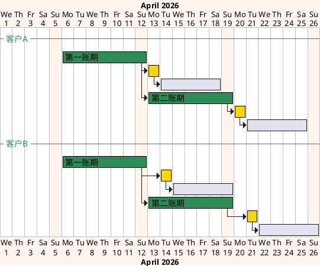
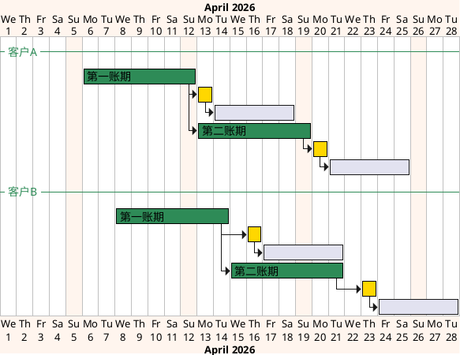

# 7. 客户级账单配置

> 本文件是《账单系统 PRD》多文件主库的模块档，完整全貌、总体方案、非功能与内部审计、共享规则索引见[主档](../PRD.账单系统.md)。模块定位：客户按什么规则出账与返款？配置版本与引用如何维护？

---

## 7. 客户级账单配置

[🔗原型链接](http://localhost:4181/#/billing/config)

客户级账单配置用于集中维护客户出账和返款的前置规则。应收账单模块和返款账单模块不再各自重复定义配置口径，统一从本章读取客户引用的配置编号、准确版本、账期规则、币种规则、履约节点、返款模式和生效周期。

### 7.1 章节概述

客户级账单配置回答的是“某个客户按什么规则生成应收账单和返款账单”。本 PRD 中的`客户`与集运客门户中的`会员`是同一业务主体：WMS 从货主关系称其为客户或货主，集运客门户从账号关系称其为会员。所有配置采用同一种可复用配置实体，客户引用稳定的配置编号；任务创建时再解析该配置当时生效的准确版本并锁定快照。配置不会因当前被一个或多个客户引用而改变实体类型。店铺和客户组只用于批量选择客户、查询和核对，不参与账单生成时的配置匹配。账单结算主体为客户 / 会员；一个会员在同一时点只能从属一个店铺，但订单已固化的历史`所属店铺快照`可能因会员转店而不同，账单必须按来源订单快照拆分，不能跨店铺归集。客户级账单配置位于账单生成之前，是任务类型为`账单生成`的BMS任务读取配置快照的来源。

本章覆盖两类配置：

1. 应收账单配置：用于控制客户应付费用如何按账期、履约节点、业务范围和币种规则生成应收账单。
2. 返款账单配置：用于控制 COD 货款如何按返款模式、回款时间、扣减项和货款结算币种生成返款账单。

应收账单配置和返款账单配置分别建立客户引用。一个客户可以在两类配置中引用不同的配置编号；同一客户、同一配置类型、同一生效时段只能存在一份有效引用，具体规则见<a href="#section-7-2-1">7.2.1 统一配置与配置标签</a>。

#### 7.1.1 页面原型概述

页面顶部设置`应收账单配置`、`返款账单配置`和`客户引用配置情况`三个同级入口。`应收账单配置`和`返款账单配置`分别直接进入对应配置清单，并从配置清单进入配置编辑；`客户引用配置情况`集中承载客户引用列表，进入后通过必选且不可清除的`配置类型`条件块选择`全部`、`应收账单配置`或`返款账单配置`，默认选择`全部`并同时展示两类当前有效引用：

| 区域 | 业务字段 | 业务操作 | 关键业务约束 |
| --- | --- | --- | --- |
| 客户引用配置情况 | 仅展示查询时点存在当前有效引用的客户；字段包括客户编码、客户名称、会员编码、所属店铺、所属客户组、引用配置、配置版本、配置标签和账期类型；`引用配置`列显示配置编号并在其下方以备注文字显示`配置备注`，未填写时显示`--`，`配置版本`列紧随其后并显示查询时点生效的准确版本号，两列均不显示组合后的配置版本编号；选择`全部`时增加`配置类型`列，应收配置另显示分支方案数量；`账期类型`列同时承载两类配置，应收行显示默认方案与已启用分支方案的账期类型汇总，返款行显示当前返款配置的账期类型；本列表不展示返款模式和默认结算币种 | 通过`配置类型`条件块选择`全部`、`应收账单配置`或`返款账单配置`；查询、更换配置、查看配置、按客户生成账单 | `配置类型`必选且不可清除，默认值为`全部`；选择`全部`时按客户和配置类型分别显示当前有效引用，同一客户同时存在应收与返款引用时显示两行。引用客户、共享配置客户和独享配置客户按客户编码去重统计，列表总数按引用行统计；客户与会员为同一主体；未配置或查询时点不存在有效引用的客户不进入本表，须从配置清单的分配向导选择；列表不再重复展示引用状态和启用状态；所属店铺和所属客户组仅用于筛选与核对；同一客户、同一配置类型、同一生效时段只能有一份配置引用；应收分支方案数量和账期类型按<a href="#section-7-4-1">7.4.1 应收配置列表怎样展示分支方案数量与账期类型？</a>展示 |
| 配置清单 | 配置备注（选填）、配置编号、配置版本、配置标签、命中客户数、发布时间、状态；`配置备注`以备注文字显示在`配置编号`下方，未填写时显示`--`；`配置版本`列紧随`配置编号`列，当前生效版本以小号版本标签显示在上方；存在待生效版本时，在同一单元格下方以备注文字显示`将在 YYYY/MM/DD 切换为 Vx`；`发布时间`显示当前生效版本的发布时间且不显示发布人；应收配置另含分支方案数量；返款配置另含返款模式和账期类型 | 新建配置（先设置配置，再指定适用客户，可跳过）、编辑并发布新版本、从操作列查看版本记录、查看任一版本的完整详情、分配客户、查看引用客户、按当前生效版本批量生成账单、停用 | 配置清单不单独展示`待生效版本`和`历史版本数量`列，也不单独展示`配置备注`列；待生效版本的生效日期同时显示在版本备注和版本记录弹窗中，历史版本数量及全部版本详情在版本记录弹窗中查看。配置备注未填写时在`配置编号`下方显示`--`，不影响配置编号与配置版本分列展示；版本记录弹窗按版本号倒序展示全部已发布版本及状态、发布时间、生效时间和变更原因；任一版本均可进入只读完整详情；配置标签由当前有效客户引用数派生且不可编辑；新版生效时全部当前引用客户统一使用新版；分配客户只选择配置，不允许指定历史版本；新建配置的两步流程按<a href="#section-7-2-3">7.2.3 配置版本、停用与引用约束</a>执行；应收分支方案数量按<a href="#section-7-4-1">7.4.1 应收配置列表怎样展示分支方案数量与账期类型？</a>展示 |
| 应收配置编辑 | 配置基本信息、配置版本编号、发布生效方式、默认方案、分支方案、费项结算币种、履约节点、账期类型、账单发出时间、方案生效周期、信用评级、信用期限、逾期滞纳金、垫资额度上限、合同编号、合同文件 | 新增或移除分支方案、新增或移除费项币种规则、引用费项结算币种模板、另存为新配置、新建时下一步指定适用客户、发布新版本 | 编辑内容不保存为草稿；取消或关闭不产生版本；发布时默认立即生效，也可指定未来日期生效；客户需要差异化时须另存为新配置并仅切换该客户；新建配置先设置配置再指定适用客户，该步骤可跳过，规则见<a href="#section-7-2-3">7.2.3 配置版本、停用与引用约束</a> |
| 返款配置编辑 | 配置基本信息、配置版本编号、发布生效方式、启用状态、返款模式、账期类型、半周起始日、账单发出时间、必要归集金额、直接扣减费项、货款原始币种、货款结算币种、客户收款账户、负数金额处理方式、条款生效周期 | 新增或移除币种账户规则、另存为新配置、新建时下一步指定适用客户、发布新版本 | 编辑内容不保存为草稿；发布时默认立即生效，也可指定未来日期生效；账期仅支持周和半周；半周必须选择两个起始日且两个账期均不少于 3 天；币种账户规则必须保留一条末行兜底规则；已发布版本不得由客户局部覆盖；新建配置先设置配置再指定适用客户，该步骤可跳过，规则见<a href="#section-7-2-3">7.2.3 配置版本、停用与引用约束</a> |

配置变更默认只影响变更后创建的任务和账单，不自动回写已有账单。尚未向客户发出的`待审核`账单如需改用新版配置，财务应发起`账单生成`并选择本次采用的新版配置；系统按<a href="09B-账单生成-执行规则.md#section-9-6-3">9.6.3 配置变了，怎样安全替换待审核账单？</a>判定是否执行替换生成。已经发出的账单不得作废或替换生成。

### 7.2 配置版本与生效规则

客户级账单配置采用“配置内容版本 + 客户对配置的引用 + 任务与账单版本快照”的分层版本模型。

1. `配置版本`保存一个配置编号在某一版本的完整内容；`客户引用记录`保存某个客户在某一时段引用的配置编号，不允许人工锁定该配置的某个历史版本。配置实体、配置版本与客户引用记录不得混为一条可变记录。
2. 客户引用唯一性按`供应链 + 客户主数据编号 + 配置类型 + 生效时段`校验。同一客户在同一应收或返款配置类型、同一时段只能引用一个配置编号；该配置编号在任务创建时只有一个生效版本。客户主数据编号与集运客门户会员编码一一对应；店铺不是配置唯一键。一个会员在同一时点只能从属一个店铺，转店不自动改变其配置引用。账单结算主体取客户 / 会员，但一张账单只能包含同一客户且同一`所属店铺快照`的费用；来源订单因历史转店形成不同店铺快照时，必须拆成不同客户账单。
3. 应收账单配置和返款账单配置分别独立建立引用。客户可以分别引用不同的配置编号；每类配置在任务创建时解析各自当时生效的准确版本。
4. 配置编辑不设置草稿状态。财务打开当前生效版本进行编辑时，页面内容只存在于本次编辑会话；取消、关闭或校验失败均不得形成可被查询、引用或执行的版本。只有完成发布才创建下一准确版本，已经发布的版本内容不得就地修改。
5. 发布新版本必须选择生效方式：默认为`立即生效`，发布成功时即生效；也可以选择`指定日期生效`，指定日期必须晚于当前业务日期，并从该日期 `00:00:00` 起生效。指定日期发布的版本进入`待生效`，但不属于草稿且内容不可修改。
6. 新版本生效时，查询时点仍引用该配置编号的全部客户统一采用新版本；客户引用记录无需逐客户改为某个版本，也不允许保留部分客户继续使用旧版本。版本发布后、生效前新引用该配置的客户，到达生效时点时同样统一切换；已经在生效前切换到其它配置的客户不受影响。
7. 每个任务和每张账单必须记录客户引用记录编号、配置编号和任务创建时实际解析的准确版本。后续配置版本和引用变化不得改写历史快照。
8. 配置编号或准确版本变化只影响生效后新创建的任务；生效前已经创建的任务继续使用创建时锁定的旧版本。尚未发出的`待审核`账单可由财务确认影响后发起`账单生成`并选择当前生效配置，由系统判定是否替换生成。已经发出、待结清或已结清的账单继续使用原快照，只能通过重算、调账、冲正或后续账单承接修正，不得作废或替换生成。
9. 客户邮箱属于客户主数据，不属于配置实体或配置版本；财务必须在客户主数据中维护客户邮箱，用于系统自动向客户发送账单和客户级账单配置变更通知。未维护客户邮箱时，系统不得自动发送客户邮件。
10. 发布或分配配置前，系统必须校验必填项、账期、履约节点、生效周期、限定情形、方案互斥关系、费项结算币种、客户引用唯一性及其它规则是否合法且完整。任一校验不通过时，不得发布版本或使客户的新配置引用生效，并应定位到具体客户或配置项说明原因。
11. 同一配置编号同一时点最多存在一个`待生效`版本。存在待生效版本时不得继续发布更高版本；如需调整，财务须先取消原待生效安排并记录原因，再重新编辑和发布。取消只终止未来生效安排，不删除版本快照和审计记录。
12. 普通账单任务只允许读取已经通过校验并在任务创建时生效的客户引用及配置版本。唯一例外是与`替换生成`任务绑定的`待生效`客户配置引用：该引用只允许用于生成本次替换的候选账单，不得被其它任务读取，并须在候选账单成功切换时同步生效。不得把配置阶段能够识别的问题延迟到账单生成或重算阶段处理。

#### 7.2.1 统一配置与配置标签

配置实体和客户引用按以下规则维护：

1. 应收配置和返款配置分别采用统一的可复用配置实体。配置编号必填、在同一配置类型内唯一且首次发布后不得修改；配置备注选填。任何列表或表格独立展示配置编号值时，必须同时展示`配置版本`列；客户引用配置情况列表将承载配置编号值的列命名为`引用配置`，其它列表使用`配置编号`，`配置版本`列均紧随其后。配置版本显示该行数据在查询时点或快照时点适用的准确版本号；有效版本号统一使用小号、非粗体的版本标签展示，空值或不适用时以普通备注文字显示`--`。配置清单、客户引用、分配向导、任务、批次和账单列表均执行本规则。详情、确认信息、版本快照或通知文案可以把配置编号和版本号组合展示为`配置版本编号`，格式为`配置编号-版本号`，例如`ARB-SCHEME-20260801101800123-V2`；组合展示不改变配置编号和版本号在版本快照、任务及账单中的独立记录。配置备注不单独成列，在客户引用配置情况列表的`引用配置`下方和配置清单的`配置编号`下方以备注文字显示，未填写时显示`--`，配置编号和配置版本仍按上述规则展示。
2. 系统按配置编号统计查询时点正在生效的客户引用，并自动派生配置标签：引用客户数为 `0` 时显示`未引用配置`，为 `1` 时显示`独享配置`，大于或等于 `2` 时显示`共享配置`。配置标签本身不拼接客户数量；准确数量通过当前有效引用客户数或发布影响确认区独立展示。配置标签只表达引用结果，不是配置类型，不允许人工新增、修改或锁定。
3. 配置标签按配置编号统计，与版本号无关。新版本生效不会改变客户对配置编号的引用数量，因此不会单独产生版本引用分布，也不得把历史任务或账单中的旧版本快照计入当前有效引用客户数。
4. 客户不得在引用记录上覆盖配置版本中的单个字段，也不得指定继续使用历史版本。某个客户需要差异化时，财务须从该客户当前引用配置的生效版本执行`另存为新配置`。系统把该版本内容带入新配置编辑页；新配置按<a href="#section-7-2-3">7.2.3 配置版本、停用与引用约束</a>完成`指定适用客户`步骤后发布形成`V1`，并把目标客户切换到新配置编号。原配置及其它客户引用不得因此改变。
5. 客户 / 会员、店铺和客户组关系遵循 OIS 主数据，仅作为分配向导的批量选客条件和客户配置、账单、任务列表的筛选与核对信息。一个客户主数据对应一个会员身份；一个会员在同一时点只有一个所属店铺，并且至多从属该店铺下的一个客户组。向导按打开时的主数据把所选店铺、客户组和指定客户条件展开为具体客户；所属店铺、所属客户组和本次选客条件均不写入配置版本，也不成为运行时配置层级。
6. 向导确认后，以最终确认的具体客户清单形成逐客户引用记录。后续会员转店或调整所属客户组，不得自动新增、删除或切换客户引用；财务需要调整时须重新运行分配向导。
7. 任务和账单中的`配置编号`与`准确版本`是两个独立快照字段。按配置编号或准确版本筛选历史任务或账单时，必须读取任务或账单快照，不得按客户当前引用或配置当前版本重新展开。
8. 财务在配置上发起批量生成时，系统读取发起时该配置的生效版本，展开当时正在引用该配置编号的客户，并按<a href="09A-账单生成-任务与费项入池.md#section-9-2-1">9.2.1 系统自动跑，还是财务手动跑？</a>形成账单生成批次和独立客户任务。任务创建后锁定的配置编号和准确版本只用于执行、快照追溯及汇总筛选，不作为一个整体执行任务。
9. 财务按生成批次编号、任务编号、配置编号或准确版本筛选出账单后，可以对筛选结果批量下载；每张账单仍按各自客户生成独立对账文件，批量下载规则见<a href="19C-模板与资产库-导出邮件等.md#section-19-6-3-1">19.6.3.1 发起导出</a>。
10. 存量迁移须在固定迁移时点按旧配置层级`客户级 > 客户组级 > 店铺级`逐客户计算唯一最终生效配置，并把同一份存量配置内容转换为一个统一配置及对应客户引用。同一优先级命中多份配置、主数据缺失或无法确定唯一结果时，必须进入冲突清单由财务确认，不得直接建立多份引用。迁移完成后，系统不得继续使用任何层级的运行时优先级匹配。

#### 7.2.2 客户配置分配向导

配置分配和强制切换客户均通过同一向导完成；版本升级不再逐客户选择：

1. 财务选择目标配置编号和配置切换时点`T`后，可以组合使用`店铺`、`客户组`和`指定客户`条件实时筛选候选客户；每个条件均可选择多个对象，也可以只使用其中部分条件。同一条件内任一值命中即可，不同条件之间按交集筛选。客户组必须隶属于一个店铺；选择店铺后，客户组选项只展示所选店铺创建的客户组。店铺和客户组同时使用时，客户当前所属店铺与客户组的上级店铺必须一致，不一致的条件组合不得命中候选客户。筛选条件只用于本次向导选客，不写入配置实体或配置版本，也不形成可复用的候选客户范围。
2. 候选客户必须按`未配置`、`已引用其它配置`、`已引用当前配置`和`不可切换`分类展示。每个客户主数据对应唯一会员行，每行展示客户编码、客户名称、会员编码、当前所属店铺和当前所属客户组；未加入客户组时所属客户组显示`-`。每行同时展示当前配置版本编号、目标配置在`T`时预计生效的配置版本编号、冲突任务或账单及可切换结论。
3. 常规打开分配向导时，系统不得默认勾选全部`未配置`客户或引用其它配置的客户；从客户行进入配置切换时，只默认勾选该目标客户。已引用当前配置和不可切换客户不得勾选或重复提交。发布新版本不打开本向导，也不允许取消部分引用客户的版本升级。
4. 勾选引用其它配置的客户属于强制切换。只有具备配置强制切换权限的财务人员可以执行，且必须勾选二次确认、填写变更原因；系统须展示将失效的配置编号、准确版本和受影响客户数。
5. 系统按客户逐一执行引用唯一性、目标配置完整性、切换时点`T`及通知资料校验。只有与`T`或新引用生效时段重叠的`待执行`、`执行中`、尚未删除的`执行失败`任务，或尚未完成的替换事务可以阻断配置编号切换；已完成任务和已生成历史账单只展示影响提示，由快照隔离，不得作为阻断条件。批量操作允许部分成功，但每个客户的引用切换必须原子完成，不得出现旧引用已失效而新引用未建立的中间结果。
6. 成功客户逐一结束旧配置引用、建立新配置引用和切换记录，并从`T`开始采用目标配置在该时点生效的版本；失败客户保持原配置引用不变，向导结果必须返回客户、失败原因和建议处理方式，可仅重试失败客户。
7. 向导提交时固化本次实时筛选条件、候选客户清单、每个候选客户的会员编码、所属店铺和所属客户组、最终勾选客户清单、目标配置编号、`T`、目标配置在`T`时预计生效的准确版本、强制切换标记、变更原因、操作人和逐客户结果，用于本次提交审计，不得把筛选条件或候选客户清单回写为配置适用范围。向导执行期间主数据变化不得扩大本次客户清单。
8. 实际改变客户配置编号的成功客户触发客户级账单配置变更通知；账单配置新版本生效时，系统还须按该时点仍引用此配置的客户清单逐客户发送版本变更通知。特调汇率配置的同类变化只进入内部审计，不发送客户邮件。
9. 新建配置在发布前复用本向导的选客规则完成`指定适用客户`步骤：财务先设置配置内容，再选择本次初始引用客户，该步骤可以跳过，跳过时配置发布为`未引用配置`。指定适用客户只建立本次初始引用，后续调整仍须重新打开分配向导；已有配置发布新版本不经过本向导。

#### 7.2.3 配置版本、停用与引用约束

1. 新建配置先设置配置，再进入`指定适用客户`步骤选择本次初始引用客户；该步骤可以跳过，跳过时配置发布为`未引用配置`，选客规则按<a href="#section-7-2-2">7.2.2 客户配置分配向导</a>执行。完成两步并发布成功后直接形成`V1`；已有配置从当前生效版本进入编辑，发布成功后形成下一版本，已有配置发布新版本不经过`指定适用客户`步骤，全部当前引用客户统一采用新版。编辑过程不形成草稿记录；版本一经发布即不可修改，旧版本作为只读完整快照供财务查看，并用于历史任务、账单和审计追溯。
2. 任何配置发布新版本前，无论当前为`未引用配置`、`独享配置`还是`共享配置`，系统都必须展示按配置编号统计的全部当前有效引用客户、计划生效方式、计划生效时点和变更摘要；没有有效引用时明确显示引用客户数为`0`。配置为`共享配置`时，还必须突出提示新版生效后将统一影响全部引用客户及准确人数。
3. 发布时默认`立即生效`；选择`指定日期生效`时，系统保存不可修改的待生效版本。配置清单以小号版本标签显示当前生效版本，并在下方以备注文字显示`将在 YYYY/MM/DD 切换为 Vx`，日期取该版本的指定生效日期；版本记录弹窗展示该版本的完整配置版本编号及生效日期。到达生效时点后，系统把该版本置为当前生效版本，并将原当前版本转为历史版本。
4. 新版本生效时，所有届时仍引用该配置编号的客户统一采用新版本，不提供全部、部分或不升级的选择。需要继续使用旧规则的客户，须在新版生效前另存为新配置并将该客户切换到新配置；不得让同一配置编号在同一时点对不同客户生效不同版本。
5. 被任何任务、账单快照或历史引用记录关联的配置版本不得物理删除。配置停用只禁止新分配和发布新版本，不自动解除现有客户引用；停用前页面必须提示当前有效引用客户数、待生效版本和待处理客户清单。
6. 配置内容、发布状态、生效方式、生效时点、发布原因、取消待生效原因和版本关系必须进入版本快照及审计记录；客户引用关系、强制切换原因和逐客户执行结果单独进入引用及切换记录。
7. 指定日期生效的版本发布后不得修改；取消待生效安排后，该版本保留为`已取消`快照且不得恢复生效。重新编辑发布时创建新的递增版本号，不复用已取消版本号。
8. 配置清单主表不单独展示`待生效版本`和`历史版本数量`列；当前生效版本以小号版本标签显示。存在待生效版本时，系统在同一单元格下方以备注文字显示`将在 YYYY/MM/DD 切换为 Vx`，日期取该版本的指定生效日期。主表`发布时间`列显示当前生效版本的发布时间，不显示发布人；待生效版本的发布时间在版本记录弹窗中查看。财务从该行操作列打开版本记录弹窗后，弹窗展示历史版本数量，只统计状态为`历史`或`已取消`的版本，不计当前`生效`和`待生效`版本；系统同时按版本号倒序展示该编号的全部已发布版本，包括`生效`、`待生效`、`历史`和`已取消`版本，不得只保留当前版本、历史版本或仍被任务、账单引用的版本。版本行至少展示版本号、版本状态、发布时间、生效时间和变更原因；`已取消`版本还展示取消时间和取消原因。财务可以查看任一版本发布时固化的全部配置内容，但不得编辑、恢复、分配或直接使用历史和已取消版本生成账单。

### 7.3 账期定义与节奏

账期是客户级账单配置中的出账周期口径，用于决定系统在什么时间范围内归集费项、生成账单并进入后续审核与对账流程。应收账单配置和返款账单配置都可以独立维护账期，两条账单线不要求同周期对齐。

账期类型分为两类：

1. 日历账期：`周`、`半月`、`月`等，必须对齐日历边界。`周`按自然周，`半月`按每月 1 日至 15 日、16 日至月末，`月`按自然月。
2. 自然天账期：统一显示为`N 自然天`，例如`1 自然天`、`7 自然天`、`10 自然天`、`15 自然天`；按配置生效起始日连续滚动计算，不要求对齐自然周、自然半月或自然月。

返款账单配置的账期类型仅支持`周`和`半周`，不支持`半月`、`月`或自然天账期。`半周`是返款账单专用账期，表示在一个自然周内拆成两个连续账期。

理解口径：

1. 账期只定义本期账单归集来源数据的时间范围，不代表客户付款、财务返款或核销必须在同一时间范围内完成。
2. 常规情况下，账期结束后由系统完成期末收口；已经生成的账单达到`待审核 + 已收口`后进入财务审核，尚未生成的账单由期末任务首次生成并收口。财务确需提前对账时，可以对`待审核 + 未收口`账单执行<a href="09C-账单生成-状态与页面.md#section-9-7-3">9.7.3 账期还没结束，怎样提前收口并审核？</a>，由系统先形成截断账期并完成收口，再推进审核。信用期、返款处理期和核销期是账期之后的资金处理口径。
3. 同一客户的应收账单和返款账单可以使用不同账期；同一应收配置中的默认方案和分支方案也可以使用不同账期。
4. 当默认方案和分支方案账期不同，系统按各方案自己的账期独立判断是否到达出账时点，不存在固定先后或兜底关系。

#### 7.3.1 账期（周）甘特图

本图演示日历账期中的`周`账期。`周`账期必须对齐自然周边界，因此客户 A 和客户 B 的账期起止日都按同一自然周滚动；账期结束后再按客户级账单配置进入账单发出日和结算信用期。图中客户 A 与客户 B 的账单发出日偏移不同，用于表达账期相同不代表账单发出日或信用期安排必须完全一致。

#### 7.3.2 账期（7 自然天）甘特图

本图演示`7 自然天`账期。该账期按客户级账单配置的生效起始日连续滚动，不要求对齐自然周、自然半月或自然月；因此客户 A 可以从 2026/04/06 开始滚动，客户 B 可以从 2026/04/08 开始滚动，两者不需要对齐同一日历边界。账期结束后，仍按各自配置进入账单发出日和结算信用期。

### 7.4 应收账单配置

应收账单配置用于维护客户后付费用的出账规则。

应收账单配置由配置版本信息、默认方案和分支方案组成。客户侧只保存对配置编号的引用记录，不复制或覆盖配置版本中的方案字段；任务创建时解析并锁定该配置当时生效的准确版本。

配置版本信息至少包括：

- 配置编号与配置备注（选填；备注为空时以配置编号展示）
- 准确版本
- 客户引用记录编号
- 生效周期
- 启用状态
- 操作人
- 操作时间
- 变更原因

每个方案都应独立维护出账规则，方案级配置项至少包括：

- 账期类型
- 账单发出时间
- 费项结算币种
- 应收账单履约节点
- 限定情形

客户级信用与合同条款包括信用期限、逾期未结算滞纳金、信用评级、垫资额度上限、合同编号和合同文件，不随默认方案或分支方案分别维护。

配置页面可以套用`费项结算币种模板`，批量填充费项结算币种规则。套用后只保留填充结果，不保存模板引用；财务可以继续修改填充值，模板后续变化也不得联动修改账单配置。

费项结算币种规则至少保留一行，且末行固定为兜底规则。当仅有一行时，兜底规则的费项口径为`全部`；存在明确费项规则时，兜底规则的费项口径自动变为`其他`。兜底规则的费项只读，不允许人工修改；其结算币种默认为`随原始币种`，也可以指定为其他币种。兜底规则之前的规则必须配置明确费项和明确币种，新增明确费项规则的结算币种默认取原始币种。同一方案内明确费项不得重复。

应收账单履约节点规则：

1. 应收账单配置的履约节点仅支持`出库时间`和`订单完结`。
2. `核重时间`不作为履约节点选项，任何环境均不得展示、选择或生效该选项。订单完成出库前仍存在费项重算窗口，核重完成不代表费项横表金额已经稳定，不得作为账单归集依据。
3. `签收`已由`订单完结`取代，不再作为应收账单配置选项。
4. `订单完结`与广义签收的当前系统口径见<a href="19B-业务参考-来源表与归集窗口.md#section-19-2-5">19.2.5 广义签收</a>；订单类费用归集时间口径见<a href="09B-账单生成-执行规则.md#section-9-5-4">9.5.4 费用达到什么条件才能入池？</a>。

#### 7.4.1 应收配置列表怎样展示分支方案数量与账期类型？

应收客户引用列表和应收配置清单分别以客户引用和配置为管理对象。默认方案和分支方案属于配置当前生效版本内的出账规则，不得拆成独立列表行。

1. 应收客户引用列表仅按存在当前有效引用的客户显示一条主行，未配置或查询时点不存在有效引用的客户不显示；应收配置清单按配置编号显示一条主行，并在配置编号后紧随显示当前生效的配置版本。默认方案和每个分支方案不得重复客户、配置编号或版本信息形成多行。
2. 主行的`分支方案数量`只显示当前生效版本内已启用分支方案的数字数量；没有已启用分支时显示`0`。单元格不得附加`个分支`或其它单位文案，也不得显示默认方案的账期类型、结算币种或`仅默认方案`文案。
3. 客户引用配置情况列表统一使用`账期类型`列。应收行按默认方案在前、已启用分支方案顺序在后的顺序汇总账期类型，去重后使用`、`连接；停用分支不纳入汇总。账期类型值不带`账单`字样，例如默认方案为`月`、两个已启用分支分别为`月`和`周`时，显示`月、周`。返款行直接显示查询时点当前返款配置的账期类型。
4. 客户引用列表不提供展开行。财务需要查看方案详情时，通过行操作`查看配置`打开该配置当前生效版本的只读完整详情，查看默认方案编号，并按已启用分支方案逐行查看分支方案编号、订单类型、目的国、集运仓、账期类型、账单发出时间、应收账单履约节点，以及该分支费项结算币种末行兜底规则的结算币种；该入口只用于查看，不提供独立发布、分配或生成账单操作。
5. 客户引用列表的分支方案数量和账期类型读取查询时点该配置编号的生效版本。指定日期待生效版本在实际生效前不得提前改变客户主行展示。
6. 配置清单主行的分支方案数量读取当前生效版本；配置清单不使用折叠行展示版本历史。财务从操作列打开版本记录弹窗后，系统按<a href="#section-7-2-3">7.2.3 配置版本、停用与引用约束</a>展示全部版本，并允许查看任一版本的完整方案和费项结算币种规则。历史版本不改变配置清单主行内容，也不得提供分配或生成账单入口。

### 7.5 返款账单配置

返款账单配置用于维护 COD 包裹货款代收与返还条款。

返款账单配置不包含默认方案和分支方案。返款客户引用列表不得展示应收配置的`分支方案数量`或方案展开内容，也不展示返款模式和默认结算币种，只在共用的`账期类型`列显示查询时点当前返款配置的账期类型。返款配置清单和配置详情继续展示返款模式、账期类型和返款条款字段。

配置项至少包括：

- 返款模式
- 账期类型
- 账期起始日
- 账单发出时间
- 返款账单必要归集金额
- 在准返款中直接扣减的应收费项
- 货款原始币种
- 货款结算币种
- 客户收款账户
- 当已返货款金额为负数时的应对措施
- 条款生效周期

返款账单配置规则：

1. 返款配置采用统一配置实体和版本化管理；客户引用记录保存配置编号，任务创建时再保存实际解析的准确版本和客户引用记录编号。
2. 生效后默认只影响后续任务，不自动回写已有返款账单；尚未发出的待审核返款账单只有在财务发起`账单生成`、选择新版配置且系统判定为替换生成时，才允许改用新版配置。
3. 同一客户的返款配置引用及条款生效周期不允许重叠。
4. 货款原始币种、货款结算币种和客户收款账户的匹配及换算规则见<a href="#section-7-5-1">7.5.1 返款账单怎样确定结算币种和金额？</a>；完整换算口径见<a href="15-金额汇兑与调账中心.md#section-15-7-1">15.7.1 返款账单换算总则</a>。
5. 负数金额可选择顺延到下期返款账单，或反向计入本期应收账单。
6. 返款账单账期类型仅支持`周`和`半周`。
7. 当账期类型为`周`时，账期按自然周滚动。
8. 当账期类型为`半周`时，财务必须明确两个连续账期的起始星期，例如`周二`和`周五`；系统应据此在每个自然周内拆出两个连续账期。
9. `半周`的两个起始星期必须保证每个单独账期不少于 3 天；若任一账期少于 3 天，系统不得保存配置。
10. 返款配置编号与应收配置编号采用同一构成规则，仅前缀不同。每份返款配置的配置编号格式为`RFB-SCHEME-yyyyMMddHHmmssSSS`，时间戳取首次发布成功时的系统创建时间，精确到毫秒，例如`RFB-SCHEME-20260801102000123`；若该毫秒对应的编号已经存在，系统按毫秒递增，直至取得未使用的配置编号，不得形成重复编号。返款配置不包含默认方案和分支方案，不产生`-BRANCH-`方案编号。首次发布完成前只允许显示待生成提示，不得形成可被引用、执行或查询的正式配置编号。

#### 7.5.1 返款账单怎样确定结算币种和金额？

后续订单费用报表只导入`回款汇率`和`实收回款`，不再导入`返款汇率`和`实付返款`。返款账单根据客户级返款配置确定货款原始币种和货款结算币种，并锁定两者之间的返款汇率；历史已导入的返款字段不参与新生成或重算的返款账单。

返款账单采用以下口径：

1. `货款原始币种`是配置的匹配条件，用于匹配`应付返款（即代收货款）`的原始币种。该币种通常为目的国币种。
2. `货款结算币种`是客户最终收款的币种，也是最终`实付返款`的币种。
3. `返款汇率`是返款账单锁定的`货款原始币种 → 货款结算币种`汇率，按<a href="15-金额汇兑与调账中心.md#section-15-3-1">15.3.1 汇率层级</a>取得；同币种换算时固定为`1`。
4. `实付返款（准）`是在货款原始币种中，从`应付返款`扣除返款账单指定扣减费项后得到的换算前金额；最终`实付返款`再按返款汇率换算为货款结算币种。

系统按以下顺序处理每张满足返款归集条件的 COD 业务订单：

| 处理步骤 | 处理口径 | 不满足时的处理 |
| :--- | :--- | :--- |
| 1. 匹配原始币种 | 先按`应付返款`的真实原始币种匹配明确的`货款原始币种`规则；没有明确规则时，才匹配`其他`兜底规则。`其他`不是可参与换算的真实币种。 | 没有匹配规则时，受影响业务订单不得进入本次返款账单。 |
| 2. 确定结算币种 | 读取匹配规则中的`货款结算币种`，作为返款账单的计算和分桶币种。 | 货款结算币种为空时，不得保存配置或生成账单。 |
| 3. 汇总指定扣减 | 将返款账单指定扣减费项统一换算为货款原始币种后汇总。 | 缺少必要汇率时，受影响业务订单不得进入本次返款账单。 |
| 4. 计算换算前返款 | `实付返款（准） = 应付返款 - 返款账单指定扣减费项`，结果仍使用货款原始币种。 | 缺少应付返款本金，或结果触发负数处理规则时，按对应规则处理。 |
| 5. 锁定返款汇率 | 按真实的货款原始币种和货款结算币种取得`返款汇率`，并随账单保存快照。 | 按<a href="15-金额汇兑与调账中心.md#section-15-3-1">15.3.1 汇率层级</a>处理。 |
| 6. 计算实付返款 | `实付返款 = 实付返款（准） × 返款汇率`。 | 缺少必要汇率时，受影响业务订单不得进入本次返款账单。 |
| 7. 校验收款账户 | 客户收款账户币种必须等于`货款结算币种`。 | 未配置同币种客户收款账户时，配置不得保存，受影响账单不得生成。 |

配置保存时，系统必须阻止同一配置版本内相同`货款原始币种`存在多个不同的`货款结算币种`规则；否则同一业务订单会得到多个结算结果。`其他`只负责兜底匹配未单独配置的原始币种，计算时仍须使用业务订单真实的原始币种取得返款汇率。例如，配置为`其他 → USD`时，TWD 业务订单应锁定`TWD → USD`返款汇率，不能把`其他`当作货币。

存量数据中历史已导入的`返款汇率`和`实付返款`只保留原记录，不在返款账单详情和对账报表中继续展示，也不影响货款币种规则匹配、账单生成、替换、重算或审核。

### 7.6 默认方案与分支方案

应收账单配置必须支持默认方案和分支方案。

1. 默认方案必须存在，用于表达客户最基础的应收出账规则。
2. 分支方案用于按运抵国、集运仓、业务板块等维度拆分账单规则。
3. 默认方案不包含限定情形，保存后直接生效；分支方案用于表达限定情形下的独立出账规则。
4. 分支方案必须选择订单类型和目的国，集运仓可以不限定。
5. 分支方案之间的限定情形不得存在交集；订单类型、目的国和集运仓三个维度均存在交集时，判定为方案冲突。
6. 任一分支方案的某个限定维度未填写时，该维度按不限制处理，并与其它分支方案在该维度视为存在交集。
7. 分支方案存在范围交集、缺少订单类型或缺少目的国时，配置不得保存。
8. 默认方案不参与分支方案限定情形的交集校验。
9. 每份应收配置的默认方案编号同时作为配置编号，格式为`ARB-SCHEME-yyyyMMddHHmmssSSS`；时间戳取首次发布成功时的系统创建时间，精确到毫秒，例如`ARB-SCHEME-20260801101800123`。若该毫秒对应的编号已经存在，系统按毫秒递增，直至取得未使用的配置编号，不得形成重复编号。分支方案编号格式为`默认方案编号-BRANCH-分支方案自增序号`，例如`ARB-SCHEME-20260801101800123-BRANCH-1`。分支方案首次创建时取得该配置内唯一且不可变的自增序号；继续存在的分支在后续版本中沿用原编号，新增分支取当前历史最大序号加 `1`，已删除分支的序号不得复用。方案显示顺序、显示名称或配置版本变化不得改写方案编号。任务和账单快照必须同时记录方案编号、方案名称和方案类型；方案类型只取`默认方案`或`分支方案`，不参与唯一性识别。首次发布完成前只允许显示待生成提示，不得形成可被引用、执行或查询的正式方案编号。

### 7.7 限定情形互斥算法

1. 校验对象：新增或修改的分支方案，应与同一应收配置版本内其它已启用分支方案逐一校验；默认方案不参与限定情形交集校验。
2. 情形表达：每个限定情形维度都按集合处理；单选值视为单元素集合，多选值视为多元素集合，`不限`或未配置视为该维度全集。
3. 交集判定：两个方案在全部限定情形维度上都存在交集，才判定两个方案的适用范围有交集；只要任一维度无交集，即可判定两个方案互斥。
4. 收敛方法：先用待校验方案的情形选项 1 跟其它方案的情形选项 1 比对，保留有交集的方案；再用情形选项 2 仅跟上一轮保留方案继续比对，直至所有情形选项比对完成。
5. 判定结果：任一轮比对后候选方案为空，则待校验方案与其它方案互斥；所有情形选项比对完成后仍存在候选方案，则这些候选方案与待校验方案有交集，配置不得保存或启用。
6. 默认方案没有限定情形，不参与本算法；订单未命中任何分支方案时才使用默认方案。

样例：假如要新增方案 10，则系统按以下方式判定其与方案 1-9 是否存在交集。

- 先用方案 10 的情形选项 1 跟方案 1-9 的情形选项 1 对比，发现方案 1-8 与方案 10 有交集。
- 再用方案 10 的情形选项 2 跟方案 1-8 的情形选项 2 对比，发现方案 1-7 与方案 10 有交集。
- 再用方案 10 的情形选项 3 跟方案 1-7 的情形选项 3 对比，发现方案 6-7 与方案 10 有交集。
- 最后用方案 10 的情形选项 4 跟方案 6-7 的情形选项 4 对比，未发现交集，因此方案 10 与其它方案互斥，可以通过校验。

<table style="width:max-content; border-collapse:collapse; white-space:nowrap;">
  <thead>
    <tr>
      <th style="text-align:left; border:1px solid #999; background:#f0f0f0;">情形维度</th>
      <th style="text-align:left; border:1px solid #999;">方案 1</th>
      <th style="text-align:left; border:1px solid #999;">方案 2</th>
      <th style="text-align:left; border:1px solid #999;">方案 3</th>
      <th style="text-align:left; border:1px solid #999;">方案 4</th>
      <th style="text-align:left; border:1px solid #999;">方案 5</th>
      <th style="text-align:left; border:1px solid #999;">方案 6</th>
      <th style="text-align:left; border:1px solid #999;">方案 7</th>
      <th style="text-align:left; border:1px solid #999;">方案 8</th>
      <th style="text-align:left; border:1px solid #999;">方案 9</th>
      <th style="text-align:left; border:2px solid #e55;">方案 10</th>
    </tr>
  </thead>
  <tbody>
    <tr>
      <td style="text-align:left; border:1px solid #999; background:#f0f0f0;">情形选项 1 枚举：A1、A2、A3、A4、A5</td>
      <td style="text-align:left; border:1px solid #999; background:#f8d7da;">A1、A2、A3、A4、A5</td>
      <td style="text-align:left; border:1px solid #999; background:#f8d7da;">A1、A2、A3、A4、A5</td>
      <td style="text-align:left; border:1px solid #999; background:#f8d7da;">A1、A2、A3、A4、A5</td>
      <td style="text-align:left; border:1px solid #999; background:#f8d7da;">A1、A2、A3、A4、A5</td>
      <td style="text-align:left; border:1px solid #999; background:#f8d7da;">A1、A2、A3、A4、A5</td>
      <td style="text-align:left; border:1px solid #999; background:#f8d7da;">A1、A2、A3、A4、A5</td>
      <td style="text-align:left; border:1px solid #999; background:#f8d7da;">A1、A2、A3、A4、A5</td>
      <td style="text-align:left; border:1px solid #999; background:#f8d7da;">A1、A2、A3、A4、A5</td>
      <td style="text-align:left; border:1px solid #999;">A5</td>
      <td style="text-align:left; border:2px solid #e55; background:#f8d7da;">A1、A2、A3、A4</td>
    </tr>
    <tr>
      <td style="text-align:left; border:1px solid #999; background:#f0f0f0;">情形选项 2 枚举：B1、B2、B3、B4、B5</td>
      <td style="text-align:left; border:1px solid #999; background:#d6f5f5;">B1、B2、B3、B4</td>
      <td style="text-align:left; border:1px solid #999; background:#d6f5f5;">B1、B2、B3、B4</td>
      <td style="text-align:left; border:1px solid #999; background:#d6f5f5;">B1、B2、B3、B4</td>
      <td style="text-align:left; border:1px solid #999; background:#d6f5f5;">B1、B2、B3、B4</td>
      <td style="text-align:left; border:1px solid #999; background:#d6f5f5;">B1、B2、B3、B4</td>
      <td style="text-align:left; border:1px solid #999; background:#d6f5f5;">B1、B2、B3</td>
      <td style="text-align:left; border:1px solid #999; background:#d6f5f5;">B2、B4</td>
      <td style="text-align:left; border:1px solid #999;">B3、B4</td>
      <td style="text-align:left; border:1px solid #999;">B5</td>
      <td style="text-align:left; border:2px solid #e55; background:#d6f5f5;">B1、B2</td>
    </tr>
    <tr>
      <td style="text-align:left; border:1px solid #999; background:#f0f0f0;">情形选项 3 枚举：C1、C2、C3、C4、C5</td>
      <td style="text-align:left; border:1px solid #999;">C1、C2、C3、C4</td>
      <td style="text-align:left; border:1px solid #999;">C1、C2、C3、C4</td>
      <td style="text-align:left; border:1px solid #999;">C1、C2、C3、C4</td>
      <td style="text-align:left; border:1px solid #999;">C1、C2、C3、C4</td>
      <td style="text-align:left; border:1px solid #999;">C1、C2、C3、C4</td>
      <td style="text-align:left; border:1px solid #999; background:#e2f0d9;">C5</td>
      <td style="text-align:left; border:1px solid #999; background:#e2f0d9;">C5</td>
      <td style="text-align:left; border:1px solid #999;">C4</td>
      <td style="text-align:left; border:1px solid #999;">C5</td>
      <td style="text-align:left; border:2px solid #e55; background:#e2f0d9;">C5</td>
    </tr>
    <tr>
      <td style="text-align:left; border:1px solid #999; background:#f0f0f0;">情形选项 4 枚举：D1、D2、D3、D4、D5</td>
      <td style="text-align:left; border:1px solid #999;">D1</td>
      <td style="text-align:left; border:1px solid #999;">D2</td>
      <td style="text-align:left; border:1px solid #999;">D3</td>
      <td style="text-align:left; border:1px solid #999;">D4</td>
      <td style="text-align:left; border:1px solid #999;">D5</td>
      <td style="text-align:left; border:1px solid #999;">D1</td>
      <td style="text-align:left; border:1px solid #999;">D3</td>
      <td style="text-align:left; border:1px solid #999;">D4</td>
      <td style="text-align:left; border:1px solid #999;">D5</td>
      <td style="text-align:left; border:2px solid #e55;">D5</td>
    </tr>
  </tbody>
</table>

### 7.8 与其它章节的关系

1. 账单生成 / 重算过程读取客户级账单配置快照，具体规则见<a href="09A-账单生成-任务与费项入池.md#section-9">9. 账单生成/重算机制</a>。
2. 应收账单模块只描述应收账单的状态、账期、详情和导出，配置口径统一引用本章。
3. 返款账单模块只描述返款账单的状态、返款模式、与回款管理的联动关系和报表输出；包裹级回款跟踪统一见<a href="11-返款账单与回款管理.md#section-12">12. 回款管理</a>，配置口径统一引用本章。
4. 费项结算币种、汇率快照和多币种汇总规则统一见<a href="15-金额汇兑与调账中心.md#section-15">15. 金额汇兑</a>。
5. 客户级汇率配置只负责生成账单前的默认汇率，具体见<a href="08-客户级汇率配置.md#section-8">8. 客户级汇率配置</a>。

客户级账单配置解决的是“哪些客户、哪些业务、按什么账期和履约节点生成账单”。当账单内存在多币种金额时，还需要在生成前确定默认汇率，所以下一章继续定义客户级汇率配置。

