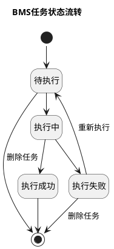

# 9A. 账单生成/重算机制（一）任务与费项入池

> 本文件是《账单系统 PRD》多文件主库的模块档，完整全貌、总体方案、非功能与内部审计、共享规则索引见[主档](../PRD.账单系统.md)。模块定位：任务由谁触发、何时创建成功、失败如何恢复？

---

<div id="section-9"></div>

## 9. 账单生成/重算机制

[🔗原型链接](http://localhost:4181/#/billing/tasks)

本章统一规定应收账单和返款账单如何从来源费用形成账单，以及账单形成后发生变化时如何处理。

`BMS费项池`是账单金额明细的统一归集基础。来源费用必须先进入费项池，再参与账单生成或重算，不得从业务数据源直接写入账单。

本章按照账单形成顺序展开：先说明整体流程和任务触发方式，再依次说明配置取用、来源筛选、费项入池、账单计算和结果保存，最后说明账单形成后的差异处理、页面操作与记录要求。

<div id="section-9-1"></div>

### 9.1 先看全貌：一张账单是怎样算出来的？

<div id="section-9-1-1"></div>

#### 9.1.1 一图看懂：同一个BMS任务怎样按需执行？

系统统一使用`BMS任务`承载费项入池、账单生成和账单重算，不建立父子任务。每条任务只有一个`任务类型`，用于直接说明本次任务要完成`费项入池`、`账单生成`还是`账单重算`。财务从配置准确版本批量发起账单生成时，系统另建一条非执行型`账单生成批次`用于冻结范围和汇总结果；批次不进入任务队列，也不是这些任务的父任务。

同一套任务流程按本次目的走到不同位置：只同步费用时执行到第四步；生成账单时从来源数据一直执行到账单结果；重算账单时跳过来源同步和费项入池，直接读取已有账单。第七步只在账单形成后又出现变化时触发。

```d2
vars: {
  d2-config: {
    layout-engine: elk
    theme-id: 104
  }
  d2-elk-config: {
    "elk.direction": "RIGHT"
    "elk.layered.spacing.nodeNodeBetweenLayers": 24
  }
}

classes: {
  step: {
    style.fill: "#FFFFFF"
    style.stroke: "#4B5563"
    style.stroke-width: 1
    style.border-radius: 6
    style.font-size: 16
  }
  entry: {
    style.fill: "#EAF4FF"
    style.stroke: "#2563A6"
    style.stroke-width: 1
    style.border-radius: 6
    style.font-size: 16
  }
  result: {
    style.fill: "#ECF8F0"
    style.stroke: "#2F855A"
    style.stroke-width: 1
    style.border-radius: 6
    style.font-size: 16
  }
}

pool: "费项入池\n仅由系统定时触发" { class: entry }
generate: "账单生成\n首次、补充或替换生成" { class: entry }
configBatch: "配置批量生成\n选择准确版本和客户范围" { class: entry }
recalculate: "账单重算\n财务修正、汇率调整或客户异议" { class: entry }

precheckBatch: "冻结提交参数并预校验\n客户、方案标识、实际账期和截止点" { class: step }
createBatch: "原子创建批次与任务\n至少一个范围通过" { class: step }
batchRejected: "全部范围跳过\n只保存提交校验审计" { class: result }
step1: "第一步\n确定任务类型并进入队列" { class: step }
step2: "第二步\n锁定任务执行规则" { class: step }
step3: "第三步\n筛选并锁定来源数据" { class: step }
step4: "第四步\n写入BMS费项池" { class: step }
step5: "第五步\n生成或重算账单" { class: step }
poolDone: "费项入池完成" { class: result }
step6: "第六步\n保存账单结果" { class: result }
step7: "第七步\n处理账单形成后的差异" { class: result }

pool -> step1
generate -> step1
configBatch -> precheckBatch
precheckBatch -> createBatch: "至少一个范围通过"
precheckBatch -> batchRejected: "无可创建范围"
createBatch -> step1: "逐个客户任务"
recalculate -> step1
step1 -> step2
step2 -> step3: "费项入池或账单生成"
step3 -> step4
step4 -> step5: "账单生成"
step4 -> poolDone: "费项入池"
step2 -> step5: "账单重算"
step5 -> step6
step6 -> step7: "后续发生差异"
```

三类入口分别按以下方式执行：

1. `费项入池`：账期内的日常任务把已达到归集时点的新费用写入`BMS费项池`后结束，不创建或更新账单。
2. `账单生成`：财务可在账期结束前或结束后按客户点击`账单生成`，也可从配置准确版本批量发起。配置批量发起先冻结提交参数并预校验；至少一个范围通过时，系统原子创建非执行批次及对应的客户独立任务，全部范围跳过时只保存提交校验审计。目标范围没有有效账单时首次生成，已有可沿用的从未发出`待审核`账单时补充生成，本次配置改变账期范围、分组结果或费项归属且满足替换条件时替换生成。
3. `账单重算`：只读取目标账单及其有效调整记录，不重新筛选业务来源数据。同时存在新增费项和重算需求时，先通过账单生成任务补充生成，再按补充后的结果重算。

`期末收口`不是第四种任务类型。账期结束后的次日凌晨，系统按客户、账单类型、到期方案和实际账期分别创建本范围最后一个`账单生成`任务，补齐期末费用并首次生成或补充生成；校验通过后把对应账单的账期收口状态更新为`已收口`，不得按配置编号合并为一个执行任务，也不得重复创建账单。

账期结束前生成的账单为`待审核 + 未收口`，默认只在财务内部处理。财务可以继续等待期末收口，也可以按<a href="09C-账单生成-状态与页面.md#section-9-7-3">9.7.3 账期还没结束，怎样提前收口并审核？</a>确认截断范围；系统必须先把截断后的实际账期更新为`已收口`，再完成审核和发出，不允许直接形成`待结清 + 未收口`。账单审核通过后，系统才按客户级账单配置向客户发出账单；`账单发出时间`不触发任务。

任务必须记录`当前执行阶段`并为已经成功的阶段保存检查点。任务因技术异常中断后，重新执行从失败阶段继续，不重复执行已完成的来源筛选或费项入池；需要采用新配置、新范围或新数据截止点时，必须创建新任务。

<div id="section-9-1-2"></div>

#### 9.1.2 先统一语言：任务、范围、快照和账单结果分别是什么？

阅读后续规则前，先按“任务怎样执行、任务能处理什么、最终形成什么”三个层次理解本章术语。同一个词在任务、账单和页面中必须保持相同含义。

**第一层：先看任务怎样执行**

| 术语 | 回答的问题 | 定义 |
| :--- | :--- | :--- |
| `BMS任务` | 本次处理怎样排队、跟踪和恢复？ | 一次独立进入队列、记录进度并形成执行结果的处理单元。费项入池、账单生成和账单重算都由BMS任务承载。 |
| `账单生成批次` | 一次配置批量发起包含哪些客户任务，整体结果怎样查看？ | 财务按配置编号和准确版本批量发起时形成的非执行分组记录。批次冻结配置编号、准确版本、客户引用、客户在确认时的会员编码、所属店铺和所属客户组快照、方案标识、方案名称、方案类型、实际账期、数据截止点和创建结果，并关联本次创建的独立BMS任务；批次本身没有任务类型、执行阶段或占用范围。客户 / 会员归属快照用于还原批量发起时的当前主数据，不代替来源订单的所属店铺快照，也不得把任务范围扩大为配置级或店铺级任务。 |
| `任务类型` | 本次任务要做什么？ | 固定分为`费项入池`、`账单生成`和`账单重算`。任务创建后不得改变类型。用户只能手动创建后两类任务；`费项入池`任务仅由系统定时创建。 |
| `账单生成方式` | 账单生成任务最终怎样形成账单？ | `账单生成`任务取得执行权后，系统根据已有账单、采用的配置及数据范围判定为`首次生成`、`补充生成`或`替换生成`；财务不得预先指定。账单重算和费项入池任务不适用。 |
| `收口结果` | 本次任务有没有完成账期收口？ | 系统内部字段。任务不处理收口时为`不涉及`；尝试收口并通过校验时为`已收口`，未通过时为`未收口`。该字段不向用户展示，也不替代账单自身的账期收口状态。 |
| `无需补充` | 任务成功后为什么没有新结果版本？ | 补充生成或期末任务检查后没有发现需要新增或更正的账单结果。这是执行结论，不是任务状态，也不是生成方式。 |

因此，用户先看`任务类型`确认任务要做什么；只有任务类型为`账单生成`时，再看`账单生成方式`确认系统最终怎样生成。任务是否完成账期收口由系统内部记录，用户统一查看账单自身的`账期收口状态`。

**第二层：再看任务能处理什么**

| 术语 | 定义 | 与相近概念的区别 |
| :--- | :--- | :--- |
| `数据截止点` | 本任务允许读取数据的最晚时间。 | 它限制可读取数据，不等于任务创建时间、开始执行时间或账期结束时间。 |
| `提前收口` | 财务在原账期结束前确认以当前账单的数据截止点截断实际账期，并审核该截断账单。 | 它不是绕过收口校验；系统必须先完成截断范围内的完整性校验和收口，再推进审核。 |
| `来源处理范围` | 本任务允许筛选和锁定的来源数据集、时间范围及配置范围。 | 用于防止来源数据被不同任务重复采集。 |
| `账单计算范围` | 本任务允许创建、补充、替换或重算的账期、方案标识、账单分组或目标账单范围。 | 用于防止同一账单结果被多个任务同时计算。 |
| `任务占用范围` | 任务创建后为防止并发冲突而暂时占用的范围。 | 费项入池任务占用来源处理范围；账单生成通常同时占用来源处理范围和账单计算范围；重算只占用账单计算范围。 |
| `业务快照` | 账单配置、客户引用、来源规则、费项规则和汇率等业务内容在某一版本下的不可变记录。 | 回答“业务规则具体是什么、客户当时采用哪个准确版本”；任务只引用所需业务快照，不重复复制其完整内容。 |
| `任务执行快照` | 任务创建时冻结的业务快照引用和本次执行特有条件，包括数据截止点、来源处理范围、账单计算范围、目标账单及操作参数。 | 回答“本次任务引用哪些规则、处理什么范围”；排队期间发生的配置或数据变化不得改写它。 |
| `增量同步水位` | 系统记录某个来源数据集已经成功同步到的位置。 | 用于确定下一条任务从哪里继续读取来源数据；任务列表不展示，任务详情只展示便于排查的可读摘要。 |
| `来源扫描记录` | 任务对一个来源数据集执行一次扫描所形成的记录。 | 分别保存该来源数据集采用全量还是增量扫描、扫描范围、水位、数量及结果；同一任务可以包含多条且扫描方式不同。 |
| `阶段检查点` | 某个执行阶段成功后保存的中间结果。 | 用于原任务失败恢复，不是可供页面、导出或核销使用的账单结果。 |
| `账单配置快照` | 客户引用的配置编号、准确版本和客户引用记录所对应的完整、不可变记录。 | 任务执行快照和账单结果都引用它；后续配置版本或客户引用变化不会改写该快照或已有账单口径。 |
| `账单结果版本` | 一次生成或重算成功后保存的完整账单计算结果。 | 同一账单可以保留多个历史版本，但同一时点只能有一个`当前有效结果版本`供页面、导出、通知和核销读取。 |

**第三层：最后看费项形成哪张账单**

| 术语 | 定义 | 关键边界 |
| :--- | :--- | :--- |
| `有效账单` | 尚未进入`已作废`状态、仍代表一项有效账单事实的账单，包括待审核、待结清和已结清账单。 | 候选新账单在替换成功前不是有效账单；已作废账单不再占用费项。 |
| `目标账单` | 本次补充生成或重算明确处理的已有账单。 | 首次生成没有目标账单；替换生成从一张账单进入，但可能扩展为待替换账单集合。 |
| `账单分组键` | 在同一客户、账单类型、实际采用的配置编号及准确版本、方案标识和实际账期内，用于继续区分具体账单的业务维度组合。 | 所有客户账单都必须包含来源订单的`所属店铺快照`；应收账单在此基础上再使用`业务板块 + 运抵国`，返款账单不再增加其它拆分维度。分组键不同必须形成不同账单。 |
| `费项占用关系` | 某条费项已经作为有效明细归属于某张有效账单的关系。 | 同一费项在同一业务用途下只能有一个有效占用；替换生成成功前不得提前释放原占用。 |
| `候选新账单` | 替换生成期间按新版配置计算、尚未对内生效或对外可见的新账单。 | 只有替换批次整体成功后，候选新账单才转为有效账单。 |
| `替换批次` | 将一张或多张旧账单与一张或多张候选新账单作为一个整体校验和切换的处理范围。 | 批次内必须整体成功或整体失败，不允许只切换其中部分账单。 |
| `配置移出待处理` | 原账单费项因新版配置不再适用，且暂时无法归入其它候选新账单时的费项处置标记。 | 它不是账单状态；被标记费项不得因释放占用而被后续任务自动归入其它账期。 |

**用一个生成账单的例子串起来**

1. 财务点击`账单生成`后，系统创建一条任务类型为`账单生成`的BMS任务，通过任务执行快照锁定本次采用的账单配置等业务快照引用、数据截止点、来源处理范围和账单计算范围；此时账单生成方式为`待判定`。
2. 任务取得执行权后检查有效账单和配置影响：对应范围尚无有效账单时，账单生成方式为`首次生成`；已有可沿用的同配置、同账期、同分组键且未发出的待审核账单时，账单生成方式为`补充生成`；已有待审核账单但本次配置改变账期范围、分组结果或费项归属，无法沿用原账单时，账单生成方式为`替换生成`。
3. 任务依次完成来源筛选、费项入池和账单计算，每个成功阶段保存检查点。检查点只用于失败恢复，不直接成为账单结果。
4. 计算成功后，首次生成为新账单保存首个结果版本，补充生成在目标账单下保存后续结果版本，替换生成则先形成候选新账单集合并在整体成功后切换新旧账单；所有旧结果继续保留供追溯。
5. 补充生成没有发现新增或更正结果时，任务以`无需补充`成功结束，不创建空的结果版本。

配置准确版本批量生成只改变任务发起方式，不改变单条任务的执行流程。系统先按配置编号和准确版本冻结本批次客户 / 会员当前的会员编码、所属店铺、所属客户组和方案范围，再按`客户 + 账单类型 + 方案标识 + 实际账期`为每个可创建范围生成独立任务；每条任务冻结所用准确版本和客户 / 会员归属快照，并分别形成任务状态、快照和结果。任务仍以客户 / 会员为执行主体；执行中识别出的费用按来源订单的所属店铺快照分别形成账单。

<div id="section-9-1-3"></div>

#### 9.1.3 别混淆：生成决定“哪些费项入账”，重算只改“怎样计算”

`账单生成`决定哪些费项进入账单：系统先同步来源数据，再从`BMS费项池`中选出符合账期和配置范围、尚未出账的费项，用于创建、补充或替换账单。

`账单重算`决定已有账单怎样重新得出金额：系统锁定一张已经存在的目标账单，在该账单已有明细范围内，结合已经审核生效且明确归属于该账单的调整记录，重新计算允许变化的明细、汇率、币种分桶和汇总金额。重算不重新发现来源数据，也不把最新账单配置套用到历史账单。

这里的`账单已有明细范围`，是指已经归属于目标账单的费项池记录、调整记录和冲正记录；`计算结果`是基于这些记录得到的明细金额、结算币种金额、汇率换算结果、币种分桶、账单总额和未结余额。

| 对比维度 | 账单生成 | 账单重算 |
| :--- | :--- | :--- |
| 业务目的 | 确定本期应当出账的费项，并形成账单。 | 修正一张已有账单的计算结果。 |
| 是否必须已有目标账单 | 首次生成不需要；补充生成和替换生成必须先选定从未发出的`待审核`账单。 | 必须先选定一张已有账单，不允许无目标账单重算。 |
| 典型触发 | 财务点击`账单生成`，或系统在账期结束后的次日凌晨创建本账期最后一个任务类型为`账单生成`的定时任务。 | 财务修正账单特调汇率、处理客户异议，或审核生效的调账、冲正需要反映到账单。 |
| 是否处理来源数据 | 执行来源筛选和费项入池后，再计算账单。 | 跳过来源筛选和费项入池。 |
| 输入范围 | 按账单配置、账期、适用的时间口径、限定情形和费项范围，从费项池中选取尚未归入有效账单的费项；附加费的账期归属使用附加费创建时间。 | 读取目标账单当前有效明细，以及已经审核生效并明确归属于该账单的调整或冲正记录。 |
| 使用哪套账单配置 | 首次生成使用任务创建时生效的配置；补充生成沿用目标账单配置；替换生成使用财务明确选择的新版配置。新版配置可以已经生效，也可以是仅与本次替换绑定的`待生效`配置。 | 沿用目标账单锁定的配置版本、费项规则和已保存的费项结算币种，不读取最新配置替换原口径。 |
| 能否扩大普通来源费项范围 | 可以。首次生成和补充生成纳入对应配置范围内的新费项；替换生成按新版配置重新确定完整范围。 | 不可以。普通来源费项遗漏时，应先通过`费项入池`和补充生成处理；账单已不能补充时，由调账或后续账单承接。 |
| 能否加入调整记录 | 可以纳入生成前已经审核生效且符合本期范围的调整记录。 | 只允许加入已经审核生效、已进入费项池且明确指向目标账单的调整或冲正记录。 |
| 如何处理原有明细 | 首次生成创建首版明细；补充生成保留原明细并增加新明细；替换生成按新版配置形成候选新账单集合，不直接复制原账单明细。 | 保留原明细和来源关系，在允许的重算范围内生成新的计算结果版本；不得物理删除原明细。 |
| 能否改变账单身份 | 首次生成创建账单编号；补充生成沿用原账单；替换生成按拆单结果创建一张或多张新账单，成功后把本批次全部原账单转为`已作废`。 | 不得改变账单编号、客户、账单类型、账期、方案标识或原始来源关系。 |
| 允许的账单状态 | 首次生成时不存在有效账单；补充生成和替换生成仅适用于从未发出的`待审核`账单。 | `待审核`可重算；`待结清`须先折返`待审核`；`已作废`和`已结清`不得重算。 |
| 结果 | 创建账单首版结果、形成补充后的新结果版本，或以候选新账单集合替换原账单集合。 | 在同一账单下形成新的重算结果版本，并保留重算前版本。 |
| 对通知和资金事实的影响 | 生成完成不等于发送、核销、回款或返款完成。 | 不得清空或覆盖既有通知、核销、收款、回款和返款事实。 |

选择处理方式时只需依次判断：

1. 只同步新费用，不需要账单结果：由系统按日创建`费项入池`任务，用户无需也不能手动触发。
2. 需要把普通来源新费项纳入账单：选择`账单生成`；没有账单时首次生成，沿用原配置补入同一账单时补充生成，改用新版配置时替换生成。
3. 不增加普通来源新费项，只重新计算已有账单：选择`账单重算`。
4. 同时存在新费项和重算需求：先补充生成，再重算。账单已经发出、已作废或已结清时，不得替换生成，差异按第七步处理。

<div id="section-9-1-4"></div>

#### 9.1.4 六条底线：不重复、不漏记、不暗中覆盖

1. 创建任务时必须立即锁定本任务规则：`费项入池`和账单生成锁定任务创建时生效的来源规则、处理范围、数据截止点及本次采用的客户级账单配置；账单重算锁定目标账单已经使用的配置版本。账单生成方式在任务取得执行权并完成重复检查、既有账单检查和配置影响检查后，确定为`首次生成`、`补充生成`或`替换生成`；补充生成没有新增结果时，任务以`无需补充`的执行结论成功结束，不新增结果版本。排队和执行期间发生的其它配置变化不得影响已创建任务。
2. 应收、返款和成本金额明细均先进入 `BMS费项池`再由对应账单归集；成本费项必须按成本账单规则单独归集，不参与应收与返款分流。
3. 同一来源费项在同一业务用途下只能形成一条有效费项池记录和一条有效账单明细，重复触发不得重复入池或重复出账。
4. 已进入 `BMS费项池` 的原始金额不得通过修改或删除来源数据进行修正；金额差异必须通过补录、调账、冲正或后续账单处理。
5. 已审核、已通知、已核销、已返款或已结清的记录，不得被后续配置、汇率或来源变化在无提示、无记录的情况下覆盖。
6. 每次执行费项入池、首次生成、补充生成、替换生成或账单重算时，都必须保留触发原因、任务类型、当前执行阶段、任务执行快照、阶段结果和最终结果；涉及账单生成时还须保留账单生成方式、金额变化、账单结果版本和新旧账单关系。

<div id="section-9-2"></div>

### 9.2 第一步：谁会触发任务，何时算创建成功？

系统先根据触发场景确定任务类型。单客户操作和系统定时触发直接创建一条`BMS任务`；配置准确版本批量生成先冻结提交参数并逐范围预校验，至少一个范围通过时再原子创建一条`账单生成批次`和一条或多条独立`BMS任务`，全部范围跳过时不创建批次或任务。每条任务进入队列后即视为创建成功，任务状态为`待执行`；此时任务正在轮候执行，尚未开始处理。

`数据截止点`是本任务允许读取数据的最晚时间。任务只能处理截止点以内且符合规则的数据；即使排队到更晚时间才执行，也不得擅自扩大到截止点之后的数据。

| 适用范围 | 本步骤要求 |
| :--- | :--- |
| 账单生成 | 创建任务类型为`账单生成`的任务；同一任务依次完成来源筛选、费项入池和账单计算。 |
| 配置批量生成 | 按`客户 + 账单类型 + 方案标识（返款固定为 REFUND） + 实际账期`拆分任务范围；每条任务同时冻结配置编号、准确版本，以及客户 / 会员在批次确认时唯一的会员编码、所属店铺和所属客户组快照。一个应收客户有多个方案在本次达到生成条件时，可以在同一批次内形成多条任务。任务同时保存方案名称和方案类型用于展示；返款方案名称为`返款配置`、方案类型为`不适用`。客户 / 会员归属快照用于审计和筛选，不参与配置命中；账单仍按来源订单所属店铺快照拆分。 |
| 账单重算 | 创建任务类型为`账单重算`的任务；必须锁定目标账单和重算范围，并跳过来源筛选和费项入池。 |

<div id="section-9-2-1"></div>

#### 9.2.1 系统自动跑，还是财务手动跑？

| 处理入口 | 触发条件 | 创建结果 |
| :--- | :--- | :--- |
| 定时费项入池 | 到达账期内每日预定执行时间，且不是本账期最后一次任务 | 创建任务类型为`费项入池`的定时任务，只处理已达到归集时点的新费用。 |
| 系统期末生成 | 账期结束后的次日凌晨，到达某客户、账单类型、方案标识和实际账期的最后一次定时执行时间 | 为该客户和到期方案创建任务类型为`账单生成`的定时任务；取得执行权后判定首次生成、补充生成或替换生成，没有新增结果时记为`无需补充`，并在成功后完成期末收口。配置编号不扩大定时任务粒度。 |
| 手动账单生成 | 财务需要形成账单、纳入新增或更正费项，或者要求本次采用新版配置 | 创建任务类型为`账单生成`的手动任务，账单生成方式统一先记为`待判定`。任务取得执行权后，系统按已有账单和配置影响判定首次生成、补充生成或替换生成；账期已经结束时自动标记需要收口。 |
| 配置批量生成 | 财务在配置清单选择配置并确认本次方案范围 | 系统先解析并冻结该配置当前生效的准确版本、提交参数以及客户 / 会员当前的会员编码、所属店铺和所属客户组快照，只展开确认时仍引用该配置编号的客户；至少一个范围通过时生成唯一批次编号，并按客户、账单类型、方案标识和实际账期创建一条或多条手动`账单生成`任务。返款配置按客户和实际账期创建任务。全部范围跳过时不生成批次或任务。 |
| 账单重算 | 财务修正当前账单金额、账单特调汇率，或需要反映已审核调账、冲正 | 创建任务类型为`账单重算`的手动任务，锁定目标账单和重算范围。 |
| 客户异议修正 | 待结清账单因客户异议折返回待审核 | 折返完成后创建任务类型为`账单重算`的任务，沿用目标账单口径并保留既有核销和通知事实。 |

用户不能独立触发`费项入池`任务，只能从客户、配置清单或账单业务入口手动创建`账单生成`和`账单重算`任务。账单生成任务在同一条任务中先完成必要的来源筛选和费项入池，再计算账单；该内置阶段不得在页面上拆成可单独点击的`同步数据`操作。

**把这些入口放进一个账期来看**

| 时间点 | 发生的事情 | 任务和账单结果 |
| :--- | :--- | :--- |
| 账期进行中，财务尚未手动生成 | 系统按日同步已经达到归集条件的费用。 | 创建`费项入池`任务；费用进入BMS费项池，但不创建账单。 |
| 账期进行中，财务提前点击`账单生成` | 财务希望提前查看当前账单金额。 | 创建`账单生成`任务；系统取得执行权后判定首次生成、补充生成或替换生成。账单保持`待审核 + 未收口`。 |
| 提前生成后，账期内又出现新费用 | 日常任务继续将新费用写入费项池。 | 日常同步不直接改写账单；财务再次生成或系统执行期末任务时，才通过补充生成纳入账单。 |
| 账期结束后的次日凌晨 | 系统执行本账期最后一个定时任务。 | 尚无账单时首次生成，已有账单时补充生成，没有新增结果时记录`无需补充`；通过完整性校验后完成期末收口。 |
| 财务与系统在相近时间触发同一范围 | 两个入口都试图处理同一账期。 | 必须先按同范围防重和串行规则确认可执行任务；无论触发几次，同一费项和账单结果都不得重复生成。 |

所有`BMS任务`统一遵循以下规则：

1. `任务创建时间`为任务进入排队队列的时间，不是任务开始执行的时间。任务创建时立即锁定所引用的业务快照和本次执行条件，并保存任务执行快照。
2. `执行耗时`从任务进入`执行中`开始累计，不包含`待执行`期间的轮候时间，也不包含两次自动重试之间的等待时间；每次实际执行产生的耗时均应累计。
3. 系统必须防止同一范围重复创建任务。任务身份必须记录`客户 + 账单类型 + 方案标识（返款固定为 REFUND） + 实际账期 + 配置编号及准确版本 + 任务类型`，并另存方案名称、方案类型、会员编码、所属店铺和所属客户组快照用于展示与审计；每项当前归属快照均为单值。来源处理范围按`客户 + 账单类型 + 方案标识 + 配置准确版本 + 来源数据集 + 处理时间范围`判定；账单计算范围按`客户 + 账单类型 + 实际账期 + 方案标识 + 目标账单或替换批次 + 任务类型`判定，不得仅因配置编号、版本、方案名称或方案类型不同而放行同一账单结果的并发计算。任务在客户粒度占用处理范围，一个客户任务可在执行后形成多个来源订单所属店铺快照下的账单；来源订单所属店铺快照用于账单分组、唯一识别和结果追溯，不把任务拆成店铺任务，也不缩小任务创建时的客户级并发保护。`费项入池`任务占用来源处理范围；`账单生成`任务同时占用来源处理范围和账单计算范围；`账单重算`任务只占用账单计算范围。同一范围已有`待执行`、`执行中`或尚未删除的`执行失败`任务时，不得再次创建。失败任务重新执行成功或被财务删除后，才释放其占用范围。
4. `任务类型`用于区分任务目的，不作为同一目标账单或替换批次并发放行的依据。同一目标账单或替换批次的`账单生成`和`账单重算`任务不得并行；两者同时发生时，先完成账单生成，再以其最新结果创建或继续执行账单重算任务。
5. 财务手动发起生成或重算后，无需留在当前页面等待。页面应立即告知任务已进入队列，并通过通知卡片更新后续状态。
6. 任务执行快照不得重复保存账单配置、来源规则、费项规则或汇率快照的完整内容，只保存所引用业务快照的编号、版本和校验值，以及本次执行特有的范围、时点、目标对象和操作参数。不同任务类型需要保存的具体内容见<a href="09B-账单生成-执行规则.md#section-9-3">9.3 第二步：任务按哪套规则执行，又需保存什么？</a>。
7. 单客户操作和系统定时触发生成一个唯一任务编号。配置准确版本批量生成一个唯一批次编号，并为每个通过校验的任务范围分别生成唯一任务编号；批次编号只能用于关联、筛选和汇总，不得代替任务编号进入队列或占用处理范围。任务必须记录任务类型、账单生成方式、内部收口结果、数据截止点、当前执行阶段，以及各阶段的开始时间、结束时间、执行结果和检查点。任务类型不是`账单生成`时，账单生成方式显示为`不适用`；账单生成任务尚未取得执行权时显示为`待判定`。内部收口结果不向用户展示。
8. 配置批量生成确认时，系统先按配置编号和准确版本冻结财务最终选择的客户引用、每个客户 / 会员的会员编码、所属店铺和所属客户组快照、方案标识、方案名称、方案类型、实际账期和数据截止点，再逐范围执行配置生效、防重和权限预校验。至少一个范围通过时，系统在同一事务中创建批次和所有通过校验的任务，并把未通过范围记录为`跳过`；没有任何范围可创建时，不创建批次和任务，只保存本次提交校验审计并在页面保留客户、方案、账期和失败原因。任务执行时实际进入账单的费用仍按来源订单自身的所属店铺快照归集，批次确认时的客户 / 会员当前归属快照不得覆盖订单快照。
9. 已成功完成的阶段结果可以在原任务重新执行时复用，但不得跨任务复用为新的任务输入。新触发、新配置、新范围或新数据截止点必须创建新任务，从规则与范围锁定阶段重新执行。

<div id="section-9-2-2"></div>

#### 9.2.2 任务现在到哪一步，失败了怎么办？

`任务状态`回答任务是否已经完成，`当前执行阶段`回答任务正在处理哪一步。任务页面只展示用户需要关注的四种任务状态；技术重试标记不得混入任务状态。

| 执行阶段 | `费项入池` | `账单生成` | `账单重算` | 阶段成功后保存的检查点 |
| :--- | :---: | :---: | :---: | :--- |
| 规则与范围锁定 | 执行 | 执行 | 执行 | 任务执行快照，包括业务快照引用、处理范围和数据截止点。 |
| 来源数据筛选 | 执行 | 执行 | 跳过 | 已锁定来源行和筛选结果。 |
| 费项写入BMS费项池 | 执行 | 执行 | 跳过 | 已入池费项、来源关系和检阅标记。 |
| 账单计算 | 不执行 | 执行 | 执行 | 账单计算草稿及金额校验结果；成功保存正式结果前不得对外可见。 |
| 结果保存 | 保存费项入池结果 | 保存账单结果 | 保存账单结果 | 本次执行结果、账单结果版本和审计记录。 |

任务只沿一条路径推进。任务类型在创建后不得修改；账单生成方式在任务取得执行权、锁定账单计算范围并完成重复检查、既有账单检查和配置影响检查后确定为首次生成、补充生成或替换生成，此后不得修改。`当前执行阶段`随任务推进而更新。任务重新执行时，从失败阶段继续，复用前面已经成功的阶段结果，不重复处理。

任务状态包括`待执行`、`执行中`、`执行成功`和`执行失败`：

| 用户关注状态 | 状态含义 |
| :--- | :--- |
| 待执行 | 任务已经进入队列，正在轮候执行，尚未开始处理。 |
| 执行中 | 任务已经开始同步数据或计算账单，尚未形成最终结果。 |
| 执行成功 | 本次任务已完整执行并形成结果。 |
| 执行失败 | 本次执行未能完成。用户可查看失败原因；后续操作按任务类型开放。 |

`费项入池`任务由系统创建并负责失败恢复。用户只可查看其状态、进度和结果，不得创建、删除或重新执行；下述删除和重新执行操作仅适用于`账单生成`和`账单重算`任务。

任务状态按以下路径流转：



**每种状态允许做什么**

| 任务状态 | 允许操作 | 操作结果 |
| :--- | :--- | :--- |
| 待执行 | 查看详情；`账单生成`和`账单重算`任务可删除 | 删除后移出队列并释放本任务占用的处理范围。`费项入池`任务不可删除。 |
| 执行中 | 查看详情、查看进度 | 不得删除或手动重新执行；临时技术异常由系统自动重试。 |
| 执行成功 | 查看详情、查看关联结果 | 不得删除或重新执行；后续业务变化应创建新任务。 |
| 执行失败 | 查看详情、查看错误；`账单生成`和`账单重算`任务可删除或重新执行 | 任务继续占用原处理范围。账单生成或账单重算任务重新执行时沿用原任务编号和快照，先回到`待执行`，再从失败阶段继续；删除后才释放处理范围。费项入池任务由系统内部恢复。 |

删除账单生成或账单重算任务后，任务不再出现在任务列表并释放其占用范围，但系统仍须保留任务编号、删除前状态、删除人和删除时间。重新执行不得改用新配置或扩大原范围；需要采用新配置或新范围时，财务应删除失败任务，再从对应业务入口创建新任务。同一范围存在尚未删除的失败任务时，系统不得接受新的同范围任务。费项入池任务不开放删除和重新执行入口，其失败恢复与范围释放由系统内部处理。

账单生成批次不提供整体重新执行或整体删除。批次查看结果分别展示`初始创建任务数`、`当前有效任务数`、`已删除任务数`，并按当前有效任务汇总`待执行`、`执行中`、`执行成功`和`执行失败`数量，另单列创建时的`跳过`数量。被删除任务不再出现在主任务列表，但在批次关联清单中保留只读审计行及删除前状态、删除人和删除时间；某条任务失败时，财务只对该任务执行重新执行或删除，其它任务状态和结果不受影响。重新执行沿用原任务编号、批次编号和任务执行快照。

**临时故障由谁处理**

1. 网络波动、服务暂时不可用或资源冲突等技术异常由系统在原任务内自动重试，不要求财务介入。
2. 自动重试期间，页面继续显示`执行中`；系统沿用原任务编号、快照和处理范围，不创建重复任务。重试仍未成功时，任务进入`执行失败`。
3. 系统记录每次重试的时间、失败阶段和原因；两次重试之间的等待时间不计入执行耗时。未按时触发等调度异常只产生内部告警，不增加财务可见的任务状态。
4. 账单配置和汇率配置必须在保存或启用时通过完整性校验。任务执行时仍发现配置不一致，应进入`执行失败`并产生内部告警，不得要求财务在任务页面临时修正后继续原任务。

**失败后重来，会不会重复处理**

| 适用范围 | 失败后的数据处理 | 重新执行的依据 |
| :--- | :--- | :--- |
| `费项入池` | 未完整入池的来源数据恢复为可处理；已经完整入池的记录保持不变。 | 使用原任务执行快照，从失败阶段继续处理原范围。 |
| `账单生成` | 不展示或保留未完成的账单结果；已经成功入池的费项保持不变。 | 使用原任务执行快照、原数据截止点和原账期，从失败阶段继续，不重复入池。 |
| `账单重算` | 目标账单继续使用重算前的有效结果版本，不改变来源行标记。 | 使用原目标账单口径、原任务执行快照和已经确认的重算范围，从失败阶段继续。 |

**按失败位置理解恢复结果**

| 失败位置 | 用户看到什么 | 重新执行从哪里继续 |
| :--- | :--- | :--- |
| 尚未完成规则与范围锁定 | 没有来源数据或账单结果发生变化。 | 重新校验原任务创建时的配置版本、处理范围和数据截止点，再从规则与范围锁定开始。 |
| 来源数据筛选或费项入池期间 | 已完整入池的费项继续有效，未完整入池的记录不作为账单输入。 | 复用完整且与任务执行快照一致的检查点，从最早未完成的阶段继续。 |
| 账单计算期间 | 页面仍显示目标账单上一个有效结果；首次生成失败时不展示半成品账单。 | 保留已经成功完成的费项入池结果，从账单计算阶段继续。 |
| 结果保存或切换期间 | 旧账单结果、旧占用关系和旧配置继续有效，候选结果不可见。 | 重新校验候选结果后整体保存或切换，不得只启用部分结果。 |

重新执行前，系统必须确认检查点完整且仍与原任务执行快照一致。检查点缺失、损坏或对应数据已回退时，应从最早受影响的阶段重新处理，但不得改变原任务引用的业务快照、处理范围和数据截止点；需要改变这些条件时，必须删除失败任务并创建新任务。

**页面与通知同步**

1. 任务状态变化后，页面统计、任务列表、通知卡片和允许操作必须同步更新。
2. 技术处理过程发生变化但用户任务状态未变化时，不重复发送状态通知。

