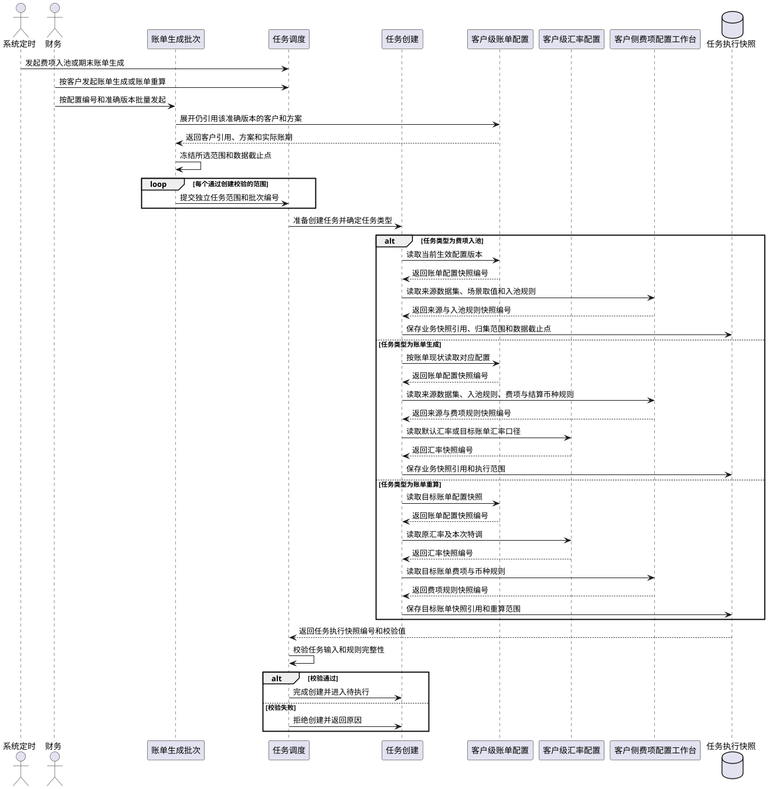
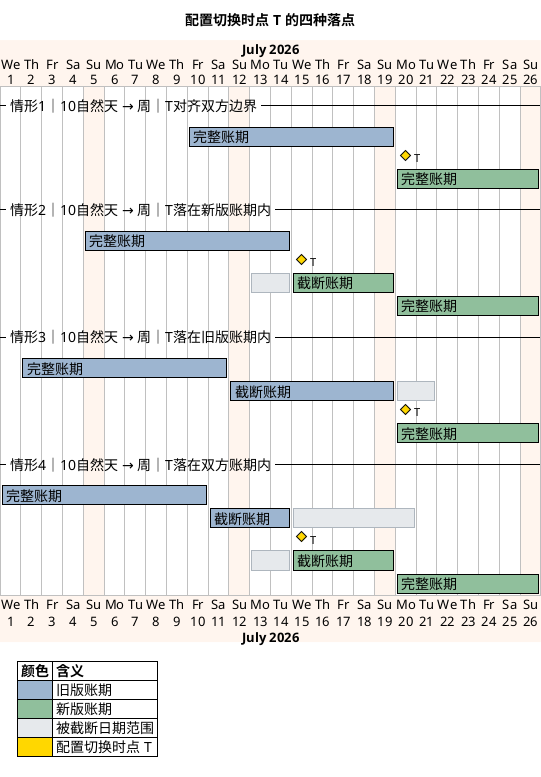
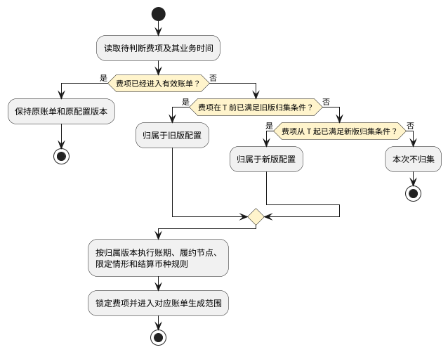
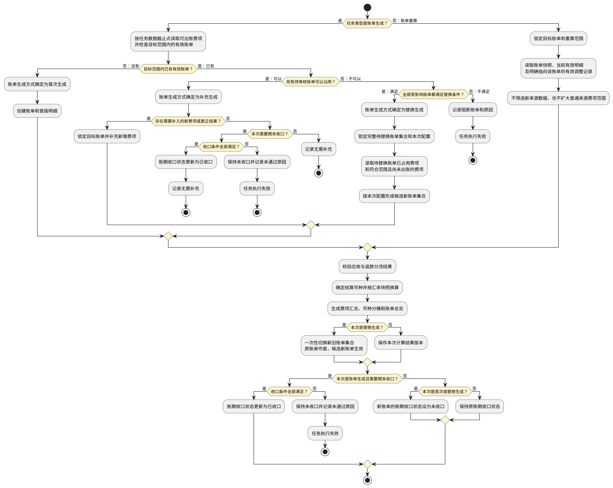

# 9B. 账单生成/重算机制（二）执行规则

> 本文件是《账单系统 PRD》多文件主库的模块档，完整全貌、总体方案、非功能与内部审计、共享规则索引见[主档](../PRD.账单系统.md)。模块定位：任务按哪套快照执行？来源数据如何入池并生成/重算账单？
> 承接 09A 文件的 `## 9.` 章节标题，本文件继续定义 9.3–9.6。

---

### 9.3 第二步：任务按哪套规则执行，又需保存什么？

任务创建时不再复制一份账单配置。系统应引用已经形成且不可修改的业务快照，并把这些引用与本次执行特有条件共同保存为`任务执行快照`。

| 任务类型 | 引用的业务快照 | 任务执行快照保存的本次条件 |
| :--- | :--- | :--- |
| 费项入池 | 当前客户生效的配置编号、准确版本及客户引用记录所对应的账单配置快照；来源数据与场景取值规则快照；费项入池规则快照 | 客户 / 会员、任务创建时的会员编码、所属店铺和所属客户组快照、账单类型、方案标识、方案名称、方案类型、账期、来源处理范围、数据截止点，以及各来源数据集采用的扫描方式和读取的增量同步水位。任务执行后，来源扫描结果另行记录实际命中来源订单的所属店铺快照集合。 |
| 账单生成 | 保存既有待审核账单引用的原业务快照，以及本次客户采用的配置编号、准确版本、客户引用记录、来源规则、费项规则、费项结算币种和默认汇率快照；没有既有账单时保存任务创建时生效的对应业务快照 | 是否需要收口、任务创建时的会员编码、所属店铺和所属客户组快照、来源处理范围、账单计算范围、数据截止点、已有待审核账单、本次采用的客户配置编号、准确版本及切换时点、方案标识、方案名称、方案类型，以及生成批次编号（如有），并保存各来源数据集采用的扫描方式和读取的增量同步水位；取得执行权后在执行结果中补记账单生成方式、收口结果和实际命中来源订单的所属店铺快照集合。判定为替换生成时，再形成替换批次和待替换账单集合。 |
| 账单重算 | 目标账单引用的账单配置、费项规则、费项结算币种、锁定汇率快照及当前有效结果版本 | 目标账单、重算原因、重算范围、本次纳入的已审核调整或冲正记录。普通重算沿用目标账单锁定汇率快照；财务显式提交账单级汇率调整时，另存本次明确输入或所选准确汇率版本，并形成新的账单级汇率快照。 |

业务快照与任务执行快照必须分别保存并建立引用关系：

1. 账单配置、客户引用、来源规则、费项规则和汇率快照保存业务规则本身；任务执行快照只保存其快照编号、准确版本和校验值，不重复保存完整内容。
2. 数据截止点、处理范围、生成批次编号、目标账单、替换批次、重算范围和本次操作参数只属于任务执行快照，不应写入账单配置快照。
3. 任务引用的业务快照不得修改或物理删除。任务创建、执行或重新执行时发现快照不存在或校验值不一致，必须阻断任务并记录异常。
4. 任务排队期间出现新配置或新规则时，原任务继续使用任务执行快照引用的版本；需要采用新版本时必须创建新任务。
5. 任务成功后，账单结果版本同时引用本次任务执行快照和实际采用的业务快照，形成“业务规则—本次执行—账单结果”的完整追溯关系。

共同规则如下：

1. 账单生成按<a href="07-客户级账单配置.md#section-7-2">7.2 配置版本与生效规则</a>锁定本次采用的配置版本，并按<a href="07-客户级账单配置.md#section-7-3">7.3 账期定义与节奏</a>确定账期范围；新旧配置版本的切换边界、截断账期和费项归属按<a href="#section-9-3-1">9.3.1 配置改了，旧账单怎么办，新费项归谁？</a>执行。执行前发现同范围账单使用不同配置版本，或本次配置会改变原账单范围、分组或费项归属时，不得判定为补充生成；符合替换边界时由系统判定为替换生成，不符合替换边界时任务失败并提示调整配置或处理范围。重算不得用后来生效的配置替换目标账单版本。
2. 应收账单的履约节点和方案范围按<a href="07-客户级账单配置.md#section-7-4">7.4 应收账单配置</a>及<a href="07-客户级账单配置.md#section-7-6">7.6 默认方案与分支方案</a>执行；返款账单按<a href="07-客户级账单配置.md#section-7-5">7.5 返款账单配置</a>执行。
3. 客户、供应链、店铺、会员与业务订单的归属边界按<a href="19A-业务参考-术语与系统基本面.md#section-19-2-1">19.2.1 核心对象关系</a>执行。
4. 费项结算币种读取客户级账单配置已经保存的结果；默认汇率命中按<a href="08-客户级汇率配置.md#section-8-5">8.5 账单生成命中与快照</a>执行，金额换算按<a href="15-金额汇兑与调账中心.md#section-15-3">15.3 汇率与金额换算</a>执行。
5. 客户侧费项、场景取值规则和来源数据集从<a href="09C-账单生成-状态与页面.md#section-9-9-3">9.9.3 系统从哪里知道该取哪些费用？</a>读取。配置变更只影响变更后创建的任务，不自动改变已有任务或账单，也不自动触发重算或替换生成。

任务准备创建时先确定并校验需要引用的业务快照，再保存任务执行快照。只有两者均校验成功，任务才正式创建并进入`待执行`：

#### 9.3.1 配置改了，旧账单怎么办，新费项归谁？

客户引用的配置编号或准确版本发生变更后，旧配置形成的账单和任务可能尚未结束，新引用也可能已经保存。本节规定每个客户新旧配置版本的切换边界、账期衔接和费项归属，确保同一费项不重复出账，也不因任务执行先后改变归属。批量分配配置时仍逐客户应用本节规则。

本节只适用于`账单生成`。`账单重算`必须沿用目标账单已经锁定的配置版本、账期和费项范围，不得通过重算切换至新版配置。

客户级账单配置的版本化要求见<a href="07-客户级账单配置.md#section-7-2">7.2 配置版本与生效规则</a>，完整账期的定义和计算方式见<a href="07-客户级账单配置.md#section-7-3">7.3 账期定义与节奏</a>。本节仅补充新旧版本交接时的处理规则。

**先看结论：新配置不会改写旧账单**

1. 已按旧配置版本生成的账单继续使用原配置快照。新的配置编号或准确版本不得自动覆盖、作废、重建或改变已有账单；只有尚未发出的`待审核`账单，才允许财务发起`账单生成`并选择新配置版本，由系统判定是否替换生成。
2. 同一客户的新旧配置引用以唯一的配置切换时点`T`划分承接范围：`T`之前由旧配置版本承接，`T`及之后由新配置版本承接。
3. 系统先确定费项归属该客户的哪个配置编号和准确版本，再按该版本校验账期、履约节点、限定情形、费项范围和结算币种。不得先尝试新配置，再把不符合新配置的费项交给旧配置处理。
4. 同一费项在同一业务用途下只能归入一个有效账单。任务先执行、后执行或重新执行，均不得改变已经确定的配置版本和账单归属。

**先看懂三个词：切换时点、完整账期、截断账期**

| 概念 | 定义 |
| :--- | :--- |
| 配置切换时点`T` | 同一客户的旧配置版本停止承接、新配置版本开始承接的唯一时间边界。 |
| 完整账期 | 按配置的账期类型、起始日和周期长度形成的标准账期。 |
| 截断账期 | 完整账期被`T`切开后，实际保留的旧版末段或新版首段。 |

**`T`怎样划分新旧配置**

1. 旧版配置的有效范围截止到`T`之前，新版配置的有效范围从`T`开始；恰好发生在`T`的费项按新版配置判断。
2. 系统内部统一按`[开始时间, 结束时间)`处理。页面按日期展示时，旧版截止日期为`T`的前一日，新版开始日期为`T`所在日期。
3. `T`按客户财务业务时区解释，并从生效日期当日`00:00:00`开始。
4. 新版配置只处理`T`及之后首次达到归集条件的费项，不得自动补取`T`之前未被旧版覆盖的历史数据。
5. 仅变更费项结算币种、默认汇率来源或其它金额口径时，虽然订单数据范围不变，仍须按`T`切换版本；旧账单保留旧快照，后续账单使用新版配置。

**新版配置什么时候可以生效**

提交客户配置分配向导，或发布指定日期生效的新版本时，系统按以下步骤确定并校验`T`：

1. 查询该客户、账单类型和方案标识下的旧版有效账单，取得最近的实际账期结束时间。
2. 查询使用旧版配置且处于`待执行`、`执行中`或`执行失败`的任务，取得任务已经锁定的账期和处理范围。
3. 根据旧版占用范围计算最早可切换日期。普通切换时，`T`不得落入旧版有效账单的实际账期，也不得截断已创建任务锁定的账期。
4. 财务选择切换方式并确认`T`。若`T`与旧版账单或任务冲突，系统不得直接启用新版配置，并应展示冲突对象和最早可切换日期。
5. 新配置引用可提前保存并指定未来的`T`。到达`T`前，系统继续使用旧配置版本；到达`T`后，不得再为普通新增费项创建跨越`T`的旧版账期。
6. 配置批量分配时，系统必须为每个客户独立计算和校验`T`。部分客户失败不回滚其它已经原子切换成功的客户，但失败客户必须保持原引用不变并返回失败原因。配置新版本生效属于同一配置编号的统一版本切换，若任一当前引用客户存在阻断冲突，则该版本不得生效；系统保持原版本生效并提示受阻客户和最早可生效日期，由财务调整后重新发布。

尚未发出的`待审核`账单需要改用新版配置时，允许作为普通切换的唯一例外，与`替换生成`同步处理：

1. 财务先选定一张待替换账单作为入口；系统再按新版配置推演候选范围，并自动识别所有与候选范围发生交集、必须共同替换的未发出待审核账单，形成`待替换账单集合`。任一受影响账单不满足替换条件时，本次任务不得创建。
2. 与替换任务绑定的新版配置引用在替换成功前保持`待生效`，并只允许本次替换任务读取，不得用于其它任务。
3. 系统以待替换账单集合的实际账期和新版配置推演候选账单集合，并校验不存在集合外的有效账单或未结束任务与新范围重叠。
4. 候选新账单集合成功后，系统在一次结果切换中启用新版配置、作废全部待替换账单并启用全部候选新账单；新版配置从确认的`T`开始承接后续费项。
5. 替换失败时，旧版配置和待替换账单继续有效，新版配置保持`待生效`并继续与失败任务绑定。财务重新执行时沿用原绑定关系；删除失败任务时，系统解除绑定、清除候选结果并重新校验`T`，新版配置不得自动生效。

系统提供以下两种切换方式：

| 切换方式 | `T`的确定规则 | 适用情形 |
| :--- | :--- | :--- |
| 下个完整新账期切换 | 将`T`顺延至新版配置的下一个完整账期起点；旧版配置负责承接`T`之前的剩余日期，必要时形成截断账期。 | 默认方式；新版首张账单需要保持完整账期。 |
| 指定日期切换 | 采用财务指定且通过冲突校验的日期作为`T`；旧版末段、新版首段均可能形成截断账期。 | 合同或客户明确要求从指定日期采用新版口径。 |

旧版任务阻断切换时，按任务状态处理：

| 旧版任务状态 | 处理规则 |
| :--- | :--- |
| 待执行 | 财务可删除任务，再由系统重新计算`T`。 |
| 执行中 | 必须等待任务进入`执行成功`或`执行失败`。 |
| 执行失败 | 任务仍占用切换范围时，财务须将其重新执行成功或删除，才能启动新版配置的首个`账单生成`任务。 |

**`T`切到账期中间时怎么办**

新旧账期类型不同，或相同账期类型的起始日、周期长度发生变化时，系统必须以`T`切开账期，不得生成与旧版实际账期重叠的新版完整账期。

1. `T`同时对齐旧版下一账期起点和新版完整账期起点时，新旧账期直接衔接，不形成截断账期。
2. `T`落在旧版完整账期内时，旧版账期截止到`T`之前，形成旧版截断账期。
3. `T`落在新版完整账期内时，新版账期从`T`开始，到该完整账期结束，形成新版截断账期。
4. `T`同时落在新旧完整账期内时，新旧两侧分别形成截断账期；两个实际账期必须在`T`处首尾相接，不得重叠或留空。
5. `月`、`半月`、`周`等日历账期在截断账期后，须从下一个日历边界恢复完整账期；`7自然天`、`10自然天`、`15自然天`等自然天账期须从新版首个实际账期起点连续计算，不要求对齐日历。
6. 返款账单的`半周`截断账期仍须不少于3天。拟定`T`导致任一实际账期少于3天时，系统不得启用新版配置，并应建议最近的可用切换日期。
7. 截断账单必须展示实际账期开始日、实际账期结束日、配置版本和`截断账期`标记，不得以完整月、完整周等名称代替实际范围。

下图统一以旧版`10自然天`、新版`周`为例，展示`T`与新旧账期边界的四种关系：

图中的“`T`落在某个账期内”，是指`T`落在按该版本配置推演的完整账期内，不代表该账单已经生成。旧版账单或旧版任务已经锁定包含`T`的实际账期时，该`T`无效，系统必须阻止切换。

| 情形 | 典型配置与`T` | 边界关系 | 实际账期结果 |
| :--- | :--- | :--- | :--- |
| 情形1：新旧账期直接衔接 | 旧版`10自然天`从7月10日起滚动；新版按自然周滚动；`T`为7月20日。 | `T`同时对齐旧版下一账期起点和新版自然周起点。 | 不形成截断账期；新版从7月20日至26日形成完整账期。 |
| 情形2：只截断新版账期 | 旧版`10自然天`从7月5日起滚动；新版按自然周滚动；`T`为7月15日。 | 旧版账期于7月14日结束；`T`落在新版7月13日至19日的完整账期内。 | 新版形成7月15日至19日的截断账期，并从7月20日起恢复完整账期。 |
| 情形3：只截断旧版账期 | 旧版`10自然天`从7月2日起滚动；新版按自然周滚动；`T`为7月20日。 | `T`落在旧版7月12日至21日的完整账期内，同时对齐新版自然周起点。 | 旧版形成7月12日至19日的截断账期；新版从7月20日至26日形成完整账期。 |
| 情形4：同时截断新旧账期 | 旧版`10自然天`从7月1日起滚动；新版按自然周滚动；`T`为7月15日。 | `T`同时落在旧版7月11日至20日和新版7月13日至19日的完整账期内。 | 旧版形成7月11日至14日的截断账期；新版形成7月15日至19日的截断账期，并从7月20日起恢复完整账期。 |

情形1和情形3可由任一切换方式产生，区别在于`T`是否对齐旧版账期边界。情形2和情形4只在`指定日期切换`时产生；若情形4改用`下个完整新账期切换`，`T`将顺延至7月20日，并转为情形3。

无论属于哪种情形，`T`之前只由旧版配置覆盖，`T`及之后只由新版配置覆盖。截断账期不得改变这一分界，也不得补生成与旧版已覆盖日期重叠的完整账期。

**一条费项到底归哪个配置版本**

系统必须按业务时间和首次达到归集条件的时间确定版本，不得按任务创建时间、执行时间或费项同步时间判断：

1. 费项已经进入有效账单时，保持原账单和原配置版本，不再参与新旧版本判断。
2. 尚未出账的费项在`T`之前已满足旧版归集条件时，归属于旧版配置。
3. 尚未出账的费项在`T`之前未满足旧版归集条件，并从`T`起满足新版归集条件时，归属于新版配置。
4. 费项不符合其所在时间范围对应版本的归集条件时，本次不归集；不得改用另一个版本补位。
5. 版本归属确定后，补充生成、任务重新执行和延迟同步均不得改变该归属。财务发起`账单生成`并选择新版配置后，系统如判定为替换生成，应按新版配置重新确定候选新账单范围，并保留原归属结果和替换差异，不得直接改写原账单。

流程图只确定费项归属的配置版本。确定版本后，费项还须通过该版本的账期、履约节点、限定情形、费项范围和防重校验，才能进入具体账单。

**配置范围或归集条件变化时怎样处理**

| 变更类型 | 处理规则 |
| :--- | :--- |
| 扩大国家、仓库、承运商、业务板块或费项范围 | 新增范围仅从`T`起生效，不补取`T`之前未被旧版覆盖的历史费项。 |
| 缩小数据范围 | `T`之前已经满足旧版条件的未出账费项仍归旧版；`T`及之后不符合新版条件的费项不再归集。 |
| 变更履约节点 | 例如旧版使用`出库时间`、新版使用`订单完结`：`T`之前已达到旧版节点的费项归旧版；此前未达到旧版节点、并从`T`起达到新版节点的费项归新版。 |
| 变更结算币种、默认汇率来源或其它金额口径 | 已有账单保持旧快照；费项仍按`T`确定配置版本，并使用归属版本的金额口径。 |

已进入旧版账单的费项即使在`T`之后再次满足新版履约节点或范围条件，也不得重复归集。旧版任务尚未执行，不代表已经满足旧版条件的费项可以转入新版。

**延迟同步的费用怎样处理**

费项在`T`之后才同步进入`BMS费项池`，不代表其归属于新版配置。系统仍按业务时间和首次达到归集条件的时间判断：

1. 费项在`T`之前已经满足旧版归集条件，但在`T`之后才同步入池时，仍归属于旧版配置。
2. 对应旧账单仍处于`待审核`、尚未发出且允许补充时，按旧版配置补充生成到对应旧账单。
3. 对应旧账单已经不能补充时，按<a href="09C-账单生成-状态与页面.md#section-9-8">9.8 第七步：账单生成后又有变化，应该走哪条路？</a>通过调账、冲正或本期、后续账单承接，并保留原配置版本、原账期和延迟归集原因。若由新版账单承接，必须先形成审核通过并进入`BMS费项池`的调整记录；不得把归属于旧版的原始费项直接补入新版账单。
4. 不得仅因费项同步时间晚于`T`，就套用新版履约节点、限定情形或结算币种。

**新旧任务怎样隔离处理范围**

以下规则适用于所有`BMS任务`；涉及创建、补充、替换或重算账单的要求只适用于`账单生成`或`账单重算`任务：

1. 使用旧版配置创建的任务始终使用任务执行快照所引用的旧版账单配置快照；即使执行时间晚于`T`，也不得读取新版配置。
2. 使用新版配置创建的任务不得读取`T`之前已经归属于旧版的费项。
3. 旧版最后一个`账单生成`任务与新版第一个`账单生成`任务涉及相邻范围时，新版任务可以进入`待执行`，但须等待旧版任务`执行成功`后再开始。旧版任务`执行失败`时，新版任务继续等待，直至旧版任务重新执行成功或被删除并重新确定`T`。
4. 旧版任务自动重试或由用户重新执行时，仍使用旧版配置和原处理范围，不得借重新执行跨越`T`。
5. 任务筛选费项时，须先排除已经进入有效账单的费项，再锁定本次处理范围。不同任务同时锁定同一费项时，后发任务不得写入；系统自动重试，重试失败后将任务置为`执行失败`。
6. 补充生成只能接收归属于原配置版本的费项。新版费项不得补入旧版账单，旧版延迟费项也不得直接补入新版账单；替换生成按新版配置重新筛选候选新账单，但不得占用其它有效账单已经占用的费项。

**启用新版配置前，财务需要确认什么**

新版配置从`待生效`转为`生效`前，页面必须展示以下切换预览，并由财务确认：

| 区域 | 展示内容 | 交互与约束 |
| :--- | :--- | :--- |
| 版本信息 | 客户、账单类型、旧配置编号与准确版本、新配置编号与准确版本、旧新客户引用记录、变更原因 | 财务必须确认本次逐客户切换对象无误。 |
| 配置差异 | 账期类型、账期起点、履约节点、限定情形、费项范围、费项结算币种及其它数据范围变化 | 范围扩大、缩小或履约节点变化必须重点提示。 |
| 切换边界 | 切换方式、拟定`T`、系统允许的最早切换日期 | `T`与旧账单或旧任务冲突时不得启用。 |
| 账期预览 | 旧版最后一个实际账期、新版第一个实际账期、新版首个完整账期、截断账期标记 | 必须展示实际开始日和结束日，不得只展示账期类型。 |
| 历史占用 | 已有旧账单、待执行任务、执行中任务、执行失败任务及其范围 | 存在阻断项时，应提供账单或任务跳转入口。 |
| 影响说明 | 配置变更不会自动改写旧账单、未发出待审核账单何时采用`替换生成`、已发出账单不追溯以及延迟费项的承接方式 | 财务确认后才能启用新版配置。 |

**切换后必须保留哪些记录**

系统必须保存独立的配置切换记录，并建立与账单、任务和费项的追溯关系：

1. 配置切换记录至少包括客户、账单类型、旧配置编号和准确版本、新配置编号和准确版本、旧新客户引用记录、切换方式、`T`、是否强制切换、变更原因、操作人和确认时间。
2. 配置切换记录须包括旧版最后一个实际账期、新版第一个实际账期、新版首个完整账期及是否形成截断账期。
3. 每张账单须记录客户主体、所属店铺快照、配置编号、准确版本、客户引用记录、方案标识、方案名称、方案类型、实际账期、账期类型、是否为截断账期、生成任务编号、生成批次编号（如有）和对应的配置切换记录。
4. 每个`账单生成`任务必须在创建时记录配置编号、准确版本、客户引用记录、客户 / 会员的会员编码、所属店铺和所属客户组快照、方案标识、方案名称、方案类型、`T`、生成批次编号（如有）、任务执行快照、计划账期和数据截止点；执行后再在任务结果中记录实际命中的来源订单所属店铺快照集合和实际处理范围。执行结果不得反向改写创建时冻结的客户 / 会员归属快照。
5. 每条进入账单的费项必须能够追溯其归属配置编号及准确版本、原业务时间、首次达到归集条件的时间、归属账单及是否属于延迟归集。
6. 系统必须记录因旧账单占用、旧任务锁定、版本范围不符或防重规则而未进入新版账单的费项及原因，供财务核对切换结果。

### 9.4 第三步：哪些来源数据可以由本次任务处理？

| 适用范围 | 本步骤要求 |
| :--- | :--- |
| `费项入池` | 执行本步骤，按任务执行快照引用的业务规则及其处理范围筛选并锁定业务来源数据。 |
| `账单生成` | 执行本步骤，为本次账单生成补齐数据截止点以内尚未入池的来源费用。 |
| `账单重算` | 跳过本步骤；不查询或锁定业务来源数据，不改变来源行的`BMS检阅标记`。 |

因此，本节后续需求适用于`费项入池`和`账单生成`，不适用于`账单重算`。重算直接读取目标账单当前有效明细和定向调整记录。

#### 9.4.1 本次从哪里开始同步？

`增量同步水位`用于记录某个来源数据集已经成功同步到的位置。水位按`客户 + 账单类型 + 方案标识 + 配置版本 + 来源数据集 + 来源规则版本 + 归集时间口径`分别维护；其中任一项不同，均不得共用水位。

系统对任务涉及的每个来源数据集分别确定扫描方式：

1. `账单重算`不读取来源数据，不适用全量或增量扫描。
2. `费项入池`和`账单生成`存在连续且有效的增量同步水位时，采用增量扫描，主要读取`上次成功水位（不含）至本次数据截止点（含）`之间的数据。
3. 不存在有效水位时，采用全量扫描。全量仅扫描本任务锁定的来源处理范围，不代表扫描整个来源数据库，也不得把`已入池（synced）`记录再次入池。
4. 同一任务包含多个来源数据集时，各数据集可以分别采用全量或增量扫描；系统不得用一个任务级字段概括为全量或增量。
5. 增量扫描除读取水位之后的数据外，还必须补查本任务来源处理范围内仍为`未处理（null）`的历史数据，避免遗漏延迟到达或此前未成功处理的数据。

增量同步水位至少记录来源数据集、增量字段、增量值、同一增量值下最后一条来源记录标识、上次数据截止点、最近成功任务和更新时间。仅使用时间值不足以区分同一时刻的多条记录，必须同时保存稳定的来源记录标识。

以下任一情形发生时，原水位失效，本次对应来源数据集改为全量扫描：

1. 首次同步，尚未形成水位。
2. 水位缺失、损坏，或无法与最近一次成功任务相互校验。
3. 来源数据集、来源规则版本、归集时间口径或增量字段发生变化。
4. 客户、账单类型、方案标识、配置版本或来源处理范围发生变化，导致原水位不能覆盖本次范围。
5. 系统执行数据修复并明确要求重新建立同步基线。

水位推进必须满足以下规则：

1. 来源数据筛选、费项池写入和来源关系保存全部成功后，才能把水位推进到本次已成功处理的位置。
2. 任务失败、事务回滚或仍存在未完成来源行时，不得推进水位；原水位继续有效。
3. 一条任务涉及多个来源数据集时，各数据集独立推进水位；某个数据集失败不得伪造其成功水位。
4. 任务重新执行时沿用原任务读取的起始水位和数据截止点，不得改读当前最新水位。
5. 任务列表及筛选条件不展示全量或增量扫描方式，避免用一个任务级字段概括多个来源数据集。任务详情按来源数据集展示`来源数据集`、`扫描方式`、`扫描范围`、`上次成功水位`、`本次数据截止点`、`拉取数量`、`命中数量`、`扫描结果`和`失败原因`；账单重算显示`不适用`。水位的内部主键等实现信息不向财务展示。

`增量同步水位`与`阶段检查点`用途不同：前者决定下一条新任务从哪里开始同步，后者仅供当前任务失败后从已完成阶段继续执行，两者不得互相替代。

任务锁定规则后，系统先按<a href="#section-9-3-1">9.3.1 配置改了，旧账单怎么办，新费项归谁？</a>确定费项归属配置版本，再按该版本和各来源适用的账期时间口径、履约门槛、限定情形筛选本次可处理的数据；附加费的专用口径见<a href="#section-9-5-4">9.5.4 费用达到什么条件才能入池？</a>。各类费项对应的来源表、金额字段、业务类型和首次产生时机见<a href="19B-业务参考-来源表与归集窗口.md#section-19-2-3">19.2.3 客户侧费项的 OIS 数据源</a>。`BMS检阅标记`只表示来源数据是否已被BMS处理，不表示账单、支付或核销状态。

| 标记值 | 业务含义 | 进入条件 | 后续处理 |
| :--- | :--- | :--- | :--- |
| 未处理（`null`） | 尚未被BMS处理 | 新来源数据进入本次处理范围 | 本次任务选中后转为`处理中`。 |
| 处理中（`locked`） | 已被当前任务锁定 | 任务开始处理该来源行 | 处理期间禁止修改、物理删除或被其它任务重复采集。 |
| 已入池（`synced`） | 已成功同步 | 费项池写入及关联结果完成 | 来源行和已入池原始金额冻结，后续任务不再处理。 |

状态图规则：

1. 任务选中并锁定来源行后，来源行从`未处理（null）`进入`处理中（locked）`；处于该状态时禁止修改或物理删除。
2. 本轮费项写入和来源关系均保存成功后，来源行从`处理中（locked）`进入`已入池（synced）`。进入`已入池（synced）`后不得补写、修改或重新采集；后续新费用必须形成新来源记录，并从`未处理（null）`重新进入同步流程。
3. 任务进入`执行失败`且该来源行未完整入池时，来源行从`处理中（locked）`回到`未处理（null）`；已经完整入池的来源行不得回退。

筛选和锁定的补充规则如下：

1. 本次可处理的范围仅包括`未处理（null）`和已被本任务锁定的`处理中（locked）`；不再处理`已入池（synced）`行。
2. 除附加事项外，订单类来源按本次任务的账期、履约节点和限定情形筛选。`附加费用报表导入`形成的附加费挂靠真实业务订单下的尾程包裹，以`ofp_ofdb1.sale_order_additional_matter.create_time`确定归属账期，并校验该包裹所属真实业务订单是否已达到配置要求的履约节点；履约节点可以早于本账期开始日，不要求与附加费创建时间落在同一账期。`记账单导入`形成的附加费挂靠虚拟业务订单，同样按`create_time`筛选，但不校验订单履约节点。两类入口的来源事实见<a href="19B-业务参考-来源表与归集窗口.md#section-19-2-3-5">19.2.3.5 同一张附加事项表，为什么要区分两种导入？</a>。
3. 同一来源行只能被一个未结束任务锁定；锁定冲突时，后发任务不得继续处理该行。
4. 任务自动重试期间，来源行保持`处理中（locked）`并继续归属原任务；任务进入`执行失败`时，未完整入池的写入结果必须撤回，来源行恢复为`未处理（null）`。已经完整入池并建立来源关系的记录保持`已入池（synced）`，不得回退后重复采集。

### 9.5 第四步：来源费用怎样变成BMS费项？

| 适用范围 | 本步骤要求 |
| :--- | :--- |
| `费项入池` | 执行本步骤，把第三步锁定的来源数据转换为统一费项池记录，完成后结束任务。 |
| `账单生成` | 执行本步骤，把第三步锁定的来源数据写入费项池，再继续计算账单。 |
| `账单重算` | 跳过本步骤；只读取目标账单已有明细，不新增、覆盖或重采普通来源费项。 |

因此，本节后续需求适用于`费项入池`和`账单生成`。来源数据锁定后，系统将订单费用、附加费、赔付和财务导入数据整理为统一费项记录并写入`BMS费项池`。`费项入池`任务在本步骤成功后结束；`账单生成`继续执行账单计算。

`账单生成`不得只使用本次新增的费项。来源写入完成后，系统须以任务数据截止点为边界，从费项池累计读取符合账期与配置范围且尚未出账的全部费项。`账单重算`不执行本节，只读取目标账单已有明细及明确归属于目标账单的有效调整记录。普通来源费项尚未入池时，必须通过`费项入池`或`账单生成`处理；不得用重算把普通来源新费项补入账单。

#### 9.5.1 什么能入池，什么只能展示？

OIS 当前保存客户侧费用的表、字段、关联对象和数据结构见<a href="19B-业务参考-来源表与归集窗口.md#section-19-2-3">19.2.3 客户侧费项的 OIS 数据源</a>。系统只能从已配置并启用的来源中识别费项。

`费项`指进入账单归集的费用明细，包括机算费项、导入费项和手工补录费项；进入账单前必须先形成费项池记录。

1. `BMS费项池`是应收、返款和成本账单全部金额明细的统一来源，但不等于账单本身。
2. 每条费项池记录必须保留费项、挂靠对象、来源记录、来源批次、原始币种、原始金额、费用发生时间和入池时间。
3. 只用于展示和核对的金额必须标记为`非费项`，即`仅展示不核销`：事实金额已进入账单分摊范围，但仅在账单中呈现，不纳入任何账单的核销汇总。
4. 成本费项使用独立的成本费项索引和账单归属规则，不参与本章的应收与返款分流。
5. 财务补录以及已审核的调账、冲正记录必须先形成可追溯的费项池记录，再参与账单计算；不得跳过费项池直接修改账单金额。

来源费用写入费项池时，按 OIS 的实际存储结构处理：

1. 费项横表按“来源记录 + 金额字段”拆分；同一行有多个有效金额字段时，分别形成多条费项池记录。
2. 费项纵表通常一条有效记录形成一条费项池记录。
3. 多行横字段混合结构先区分明细记录，再按该记录中的金额字段拆分；每条费项池记录必须保留原明细记录和原金额字段。

#### 9.5.2 入池后发现原金额有误，应该怎么办？

1. 费项原始金额一旦成功入池，就成为已使用的历史依据。来源数据不得删除或改写该金额；如需修正，必须通过调账中心新增调整或冲正记录。
2. 费项横表的一行数据成功入池后，整行都被保护：已入池金额不得改写，原为空值或`0`的其它费项字段，也不得在事后补写并重新采集。
3. 费项横表行处于`处理中（locked）`时不得修改任何费项金额或币种。
4. 同步完成后新发生的费用必须形成新的纵表来源行、附加费、索赔记录或调账记录；不得通过补写已同步横表表达后续费用。
5. 金额为`0`或空的来源记录默认不生成有效费项；业务明确要求保留占位时，必须标记占位原因且不计入金额汇总。

#### 9.5.3 系统从哪里取金额和币种？

每条来源规则都必须回答六个问题：使用哪个来源数据集、从哪张表取值、哪个字段是金额、哪个字段是币种、需要过滤什么数据、如何避免重复。系统只能使用已启用的数据集和场景取值规则，不得在任务执行时临时换表或换金额字段。

页面按两个层级选择来源：

1. `来源数据集`确定本次可以共同查询的主表、关联表、基础过滤条件和可用时间字段。
2. `取值表`确定实际保存金额和币种的表，可以不同于来源数据集的主表。例如，业务订单身份和出库时间来自订单主表，派送费金额可以来自订单扩展表。

同一张表存在名称相同或相近的金额字段时，启用中的场景取值规则必须明确指定唯一的金额字段和币种字段；任务不得根据字段名称自行猜测。

订单费项报表导入采用独立的原始币种口径，优先于下方店铺币种规则：

1. 每个作为 BMS 费项或账单计算输入的导入金额都必须在导入时确定原始币种，不得只保存无币种金额。`实收回款`和`回款汇率`属于回款来源事实，不按普通费项金额处理。
2. 普通费项中的`仓租费`和`航空费`原始币种固定为人民币；其它普通费项金额的原始币种均为来源订单的目的国币种，不得改用店铺币种。
3. 目的国币种优先读取来源订单的`ofp_ofdb1.sale_order_header.dest_country_currency_code`；该字段为空时，再按运抵国匹配运抵国配置。仍无法确定时，该行不得导入或进入`BMS费项池`，并须反馈币种缺失原因。
4. `回款汇率`不是金额字段，表示订单目的国币种到回款结算币种的汇率；当前由订单费用报表导入。具体字段口径见<a href="19B-业务参考-来源表与归集窗口.md#section-19-2-3-4">19.2.3.4 OIS 有哪些客户侧费用字段？</a>。
5. 订单费用报表不再导入`实付返款`和`返款汇率`。返款汇率由返款账单根据货款原始币种和货款结算币种取得并锁定，不从订单费用报表读取。

以下 OIS 来源采用目的国币种作为 BMS 记录的原始币种，该口径同样优先于店铺币种规则：

1. `ofp_ofdb1.sale_order_additional_matter.payment_method`表示`到付`的全部附加费。
2. `ofp_ofdb1.sale_order_header.collection_price`、`collection_premium_amount`、`cod_price`和`cod_amount`。
3. 以上来源即使同时存在其它币种字段，BMS 原始币种仍按目的国币种记录；来源中的其它币种值只作为来源事实保留，不得替代该口径。
4. 此处只规定原始币种，不改变应收归集范围。到付附加费不得因采用目的国币种而进入应收账单；附加费仍只有`收取方式`为`账期支付`时才进入应收归集，详见<a href="#section-9-5-4">9.5.4 费用达到什么条件才能入池？</a>。

除上述专用口径外，其它费项优先采用录入币种作为 BMS 原始币种；录入币种为空时，使用来源订单所属店铺的店铺币种兜底。店铺币种通常配置为人民币，但系统必须读取实际店铺配置，不得将人民币硬编码为固定值。录入币种和店铺币种均无法确定时，该费项不得进入`BMS费项池`，并记录币种缺失原因。

订单费项报表和上述指定目的国币种的来源不适用本兜底规则，始终按各自专用口径记录 BMS 原始币种。

系统按来源规则选定的时间字段取得实际时间，并把该值写为费项池记录的`费用发生时间`；费项实际写入费项池的时刻记为`入池时间`。账期归属按费用发生时间判断，不按入池时间判断。

页面显示口径如下：

| 配置项 | 页面显示 | 规则 |
| :--- | :--- | :--- |
| 来源位置 | 来源数据集、取值表 | 先识别公共数据集，再识别实际取值表。 |
| 时间口径 | 跟随账单配置或来源创建时间 | 除附加事项外，订单类费项跟随履约节点。`附加费用报表导入`和`记账单导入`形成的附加费均使用`ofp_ofdb1.sale_order_additional_matter.create_time`作为费用发生时间并确定归属账期；其中挂靠真实尾程包裹的附加费还须校验所属真实业务订单已经达到配置要求的履约节点，但履约时间不替代附加费创建时间。各来源使用的非金额字段见<a href="19B-业务参考-来源表与归集窗口.md#section-19-2-3-3">19.2.3.3 BMS 归集费项时使用哪些非金额字段？</a>。 |
| 金额口径 | 金额字段、币种字段 | 多币种来源必须具备币种字段或可追溯的默认币种。 |
| 非费项 | 非费项标记 | 只展示和核对，不进入账单核销汇总。 |

#### 9.5.4 费用达到什么条件才能入池？

费用进入`BMS费项池`必须同时满足账单配置和来源金额稳定条件：

1. 除附加事项外，订单类费项的履约节点按<a href="07-客户级账单配置.md#section-7-4">7.4 应收账单配置</a>执行；`订单完结`的判断按<a href="19B-业务参考-来源表与归集窗口.md#section-19-2-5">19.2.5 广义签收</a>执行。
2. 费项金额的稳定边界按<a href="19B-业务参考-来源表与归集窗口.md#section-19-2-4">19.2.4 费项重算窗口</a>执行。尚处于重算窗口内的横表来源不得入池。
3. 返款模式和账期范围按<a href="07-客户级账单配置.md#section-7-5">7.5 返款账单配置</a>执行；附加费按本节下方的导入入口、挂靠对象、创建时间和履约门槛判断能否入池。
4. 同一来源行、费项和有效版本不得因任务重复触发而重复入池。

写入费项池时还必须满足以下规则：

1. 横表、纵表和多行横字段混合结构按<a href="#section-9-5-1">9.5.1 什么能入池，什么只能展示？</a>拆分为独立费项池记录。
2. 费项池写入、来源关联和必要汇总全部成功后，来源行才能从`处理中（locked）`更新为`已入池（synced）`。
3. 任一关键步骤发生异常时，任务不得标记为`执行成功`；来源行按<a href="#section-9-4">9.4 第三步：哪些来源数据可以由本次任务处理？</a>规定的自动重试、`执行失败`或已完整入池结果处理。
4. 同一请求即使重复执行，同一来源对象、来源行、费项和有效版本也只能保留一条费项池记录。
5. 后续导入、配置变化或重复任务，不得在无提示、无记录的情况下覆盖已成功入池的历史版本。

附加费用表的两个导入入口还须满足以下规则：

1. 两个入口形成的附加费均须读取`ofp_ofdb1.sale_order_additional_matter.payment_method`。只有`收取方式`为`账期支付`的附加费，才可作为客户应收费项写入`BMS费项池`并参与应收账单计算；其它收取方式不得进入应收归集范围。
2. `附加费用报表导入`必须提供尾程运单号，并据此定位真实业务订单下的尾程包裹。同一尾程运单号对应多个包裹时，系统必须结合业务订单号、尾程子运单号等信息完成消歧；无法唯一定位尾程包裹时，导入不得成功。
3. 系统必须校验尾程包裹所属业务订单满足`ofp_ofdb1.sale_order_header.order_type != "BILL"`、订单有效且属于目标客户，才可把附加费挂靠至该尾程包裹；包裹不存在、所属订单不可执行或客户不一致时，导入不得成功。
4. `附加费用报表导入`形成的费项随尾程包裹所属的真实业务订单参与归集。该订单必须在本次任务的数据截止点之前达到应收账单配置要求的`出库`或`订单完结`履约节点；履约节点只决定该附加费是否具备归集资格，不决定附加费归属哪个账期。
5. `记账单导入`产生的费项挂靠`ofp_ofdb1.sale_order_header.order_type = "BILL"`的虚拟业务订单。该类费项是履约节点的例外来源：导入成功后，以`ofp_ofdb1.sale_order_additional_matter.create_time`作为归集时间，不等待虚拟业务订单出库或完结。
6. 两个入口形成的附加费均以`ofp_ofdb1.sale_order_additional_matter.create_time`作为费用发生时间，并据此确定归属账期。`附加费用报表导入`形成的附加费继续按真实业务订单命中默认方案或分支方案；`记账单导入`形成且`收取方式`为`账期支付`的附加费使用客户应收账单配置的`默认方案`。来源创建时间落入对应方案的实际账期，同时满足客户、店铺、限定情形、费项范围、金额、币种和防重条件时，由后续系统自动发起的`费项入池`任务或`账单生成`任务写入`BMS费项池`并参与账单计算。
7. 系统必须以`ofp_ofdb1.sale_order_header.order_type = "BILL"`识别虚拟业务订单，不得另设重复表达同一事实的字段，也不得为满足归集条件而伪造虚拟业务订单的出库或完结数据。
8. 两个入口形成的附加费进入费项池后，如对应账期尚无账单，则参与首次生成；如对应账单尚未发出且允许补充，则参与补充生成；其它情形按<a href="09C-账单生成-状态与页面.md#section-9-8">9.8 第七步：账单生成后又有变化，应该走哪条路？</a>承接，不得重复形成应收费项。
9. 真实业务订单的履约节点早于本账期开始日，而附加费创建时间落入本账期时，只要其它归集条件均已满足，该附加费必须纳入本期账单，不得因订单履约时间不在本账期而排除。订单在本次数据截止点前尚未达到配置要求的履约节点时，该附加费暂不入池；后续达到履约节点后仍按原附加费创建时间确定归属账期，并按第 8 条处理对应账单已经生成或发出的情况。
10. 新规则生效时，仍为`未处理（null）`、尚未进入`BMS费项池`的存量附加费按新规则处理，并以原附加费创建时间确定归属账期；已经处于`已入池（synced）`或已经归入有效账单的附加费保持原费项、原账单和原快照，不回写、不迁移，也不得重复归集。

#### 9.5.5 怎样防止重复，并查清每笔费用的来源？

1. 每笔费用必须先有可追溯的来源记录，再进入费项池；不得跳过来源记录直接写入账单明细。
2. 同一来源费项只能对应一个当前有效费项池版本；在同一客户、账单类型、账期和方案标识下，同一来源费项只能形成一条有效账单明细。
3. 来源缺少业务板块、运抵国、挂靠对象、归集时间、金额或币种时，不得入池。
4. 无费用订单不得标记为已计费；若业务明确跳过，必须记录跳过原因。

每次入池必须记录数据来源、本次处理范围、处理人、处理时间、结果和失败原因，至少包括来源系统、来源表、来源对象、来源行号、来源批次和导入文件。配置或来源规则发生变化时必须形成新版本，不得覆盖费项池原始记录和来源关系。账单结果及后续资金记录的留痕要求见<a href="09C-账单生成-状态与页面.md#section-9-7-1">9.7.1 每个结果为什么都能追溯？</a>和<a href="09C-账单生成-状态与页面.md#section-9-10">9.10 最后一道防线：操作前预览，操作后留痕</a>。

通过附加费用表导入时，每条记录还必须保留导入入口、导入批次、原始行、挂靠对象和导入人员。系统须为原始导入行生成稳定的来源记录标识，并至少按`导入入口 + 文件校验值 + 工作表 + 原始行号`执行防重校验；重复导入同一文件不得形成第二条有效费项。需要更正已入池金额时，按<a href="#section-9-5-2">9.5.2 入池后发现原金额有误，应该怎么办？</a>处理。

#### 9.5.6 同一费项进入应收账单，还是返款账单？

费项支付方式按<a href="19A-业务参考-术语与系统基本面.md#section-19-2-2">19.2.2 费项支付方式</a>判断；应收与返款的费项用途、占用优先级、账期关系和展示口径按<a href="11-返款账单与回款管理.md#section-11-2-2">11.2.2 返款账单和应收账单的关联性</a>执行。并发和负数处理还须遵守以下规则：

1. 应收和返款的`账单生成`任务可以并行匹配，但写入账单明细前必须一次性确认唯一归属；同一费项不得同时成为两类账单的可核销明细。
2. 正常情况下，返款本金和返款扣减项优先归入返款账单，应收账单只保留关联展示。
3. 返款账单计算后出现负数时，按<a href="07-客户级账单配置.md#section-7-5">7.5 返款账单配置</a>执行：选择`顺延到下期返款账单`时形成负数承接记录；选择`反向计入应收账单`时，系统生成一条独立的应收调整费项并关联原返款账单，不得把原扣减费项同时归入两类账单。
4. `非费项`只用于展示和核对，不进入任何账单的核销范围。
5. 应收账单计算时，`应收扣减类`和`代收类`费项必须按负数参与汇总，`代付类`费项必须按正数参与汇总；系统不得因来源金额的展示方式改变该财务方向。

### 9.6 第五步：如何生成新账单，或重算已有账单？

| 任务类型 | 本步骤要求 |
| :--- | :--- |
| 账单生成 | 以任务数据截止点为边界执行首次生成、补充生成或替换生成；期末任务还须判断是否完成账期收口。 |
| 账单重算 | 读取目标账单当前有效明细和定向调整记录，在锁定范围内重新计算，不扩大普通来源费项范围。 |

任务创建时必须确定任务类型。`账单生成`任务创建时的账单生成方式统一为`待判定`；系统取得执行权并锁定范围后，按以下顺序判定账单生成方式，财务不得直接指定：

1. 目标范围内不存在有效账单：判定为`首次生成`。
2. 已有从未发出的`待审核`账单，且本次采用的配置版本、实际账期、分组键和费项归属均可沿用：判定为`补充生成`。没有新增或更正结果时，以`无需补充`成功结束，不创建空结果版本。
3. 已有从未发出的`待审核`账单，但本次配置会改变账期范围、分组结果或费项归属，导致原账单不能继续沿用：在全部受影响账单均可替换时判定为`替换生成`。
4. 已有账单但既不能补充也不满足替换条件：任务失败，并明确提示阻断账单和原因；系统不得退回首次生成，也不得另建重复账单绕过占用关系。

补充生成必须同时满足：目标账单尚未发出、主状态为`待审核`，本次仍采用目标账单锁定的配置版本、实际账期和分组键，且不会把目标账单已占用费项移动到其它账单。替换生成必须同时满足：全部受影响账单均为从未发出的`待审核`账单，不存在核销、回款、返款等资金事实，没有其它执行中任务占用相同范围，并且系统能够一次性确定完整的待替换账单集合。具体替换过程见<a href="#section-9-6-3">9.6.3 配置变了，怎样安全替换待审核账单？</a>。

`账单生成`完成费项入池后，根据任务数据截止点从费项池累计读取本次可出账费项；判定为替换生成时，还可在不释放原占用关系的前提下读取待替换账单已经占用的费项。`账单重算`跳过来源处理，读取目标账单当前有效明细和本次允许带入的调整记录。确定输入范围后，两种任务共同执行以下计算：

1. 承接应收与返款分流结果，并确认同一来源费项没有被两张账单重复收取。
2. 按任务类型和账单生成方式创建、补充、替换或刷新账单明细，同时保留费项池记录、来源订单和挂靠对象的关联关系。
3. 读取账单配置已经保存的费项结算币种，并按<a href="15-金额汇兑与调账中心.md#section-15-3">15.3 汇率与金额换算</a>和<a href="15-金额汇兑与调账中心.md#section-15-4">15.4 多币种账单汇总</a>形成结算币种金额、财务本位币金额、币种分桶和账单总览。
4. 将本次符合条件的新增、调整、冲正和往期承接记录纳入结果，并校验账单总额与明细汇总一致。
5. 保存新的结果版本；不得覆盖上一个已保存版本。

#### 9.6.1 首次、补充和期末收口有何区别？

**首次生成**

1. 首次生成按任务执行快照引用的业务规则、处理范围和数据截止点筛选费项池记录，创建账单、账单编号、首版明细和首个结果版本。系统按`客户 + 所属店铺快照 + 账单类型 + 方案标识 + 配置编号 + 准确版本 + 实际账期 + 账单类型的其它分组维度`唯一识别同一张账单，不得重复创建。应收账单的其它分组维度为`业务板块 + 运抵国`，具体拆分规则以<a href="10-应收账单模块.md#section-10-5">10.5 自动拆单</a>为准；返款账单没有店铺之外的其它分组维度。
2. 首次生成不要求账期已经结束。账期结束前手动生成成功时，账单进入`待审核`，账期收口状态为`未收口`；页面必须显示`账期未结束`提示。普通`审核通过`和直接发送不可用，但具有审核权限的财务可以发起<a href="09C-账单生成-状态与页面.md#section-9-7-3">9.7.3 账期还没结束，怎样提前收口并审核？</a>。
3. 账期已经结束时，手动或自动首次生成任务必须标记需要期末收口；通过全部收口条件后同时完成期末收口，未通过时按本节期末收口失败规则处理。

**补充生成**

1. 目标账期已经存在从未发出的有效待审核账单且继续使用原配置时，账单生成方式确定为`补充生成`。补充生成沿用目标账单锁定的配置版本，只查找原账单范围内尚未归入有效账单的新费项或更正费项。
2. 补充生成保留原账单编号，在同一账单下保存新的结果版本，并保留补充前版本、本次新增明细和金额变化。
3. 补充生成不得把当前最新配置造成的范围变化混入原账单；需要改用新版配置时必须执行<a href="#section-9-6-3">9.6.3 配置变了，怎样安全替换待审核账单？</a>。
4. 账期结束前允许多次补充生成。账期结束后的自动或手动期末任务仍须重新检查数据完整性，不得仅因已有账单而跳过。

**提前生成后又有新费用，怎么办**

1. 新增来源记录或尚未入池的来源记录发生变化时，本次任务先按最新有效数据完成费项入池，再执行补充生成。
2. 原费用已经成功进入`BMS费项池`时，不得通过重新读取来源数据覆盖原始费项；必须形成可追溯的更正、调整或冲正费项，再由补充生成或重算纳入账单。
3. 变化只影响非金额展示字段时，只刷新展示关系，不创建执行账单生成的BMS任务，不改变账单结果版本。
4. 已收口但尚未发出的账单出现会影响范围或金额的数据变化时，系统应在相关费项入池或账单生成任务创建成功时，立即把账期收口状态改为`未收口`并禁用普通审核和发送，不得等到任务开始执行。任务删除或结束后，系统重新执行收口校验；全部条件再次满足时恢复为`已收口`。财务确需缩短实际账期时，必须等同范围任务全部结束后再执行提前收口。已经发出的账单不得重新打开收口状态，晚到费用按调账、冲正或后续账单规则处理。

**期末收口**

1. 期末收口既不是任务类型，也不是账单生成方式。系统期末任务由定时机制创建，任务类型为`账单生成`；财务在账期结束后主动处理时也创建`账单生成`任务。系统按已有账单和配置影响判定首次生成、补充生成或替换生成，并在执行后记录`已收口`或`未收口`。
2. 账期收口状态只有同时满足以下条件时才能更新为`已收口`：
   - 数据截止点已经覆盖账期结束时间；
   - 截止点以内符合来源规则、账期、履约节点和限定情形的来源记录均已形成完整入池结果，不存在仍为`未处理（null）`或`处理中（locked）`的应处理记录；
   - 除本次收口任务外，同一来源处理范围和账单计算范围内不存在`待执行`、`执行中`或尚未删除的`执行失败`任务；
   - 账期内符合配置的费项均已归入对应账单，或已经记录不归入本账单的明确原因；
   - 账单明细汇总、币种分桶和账单总额一致。
3. 标记为期末收口的任务未通过任一收口条件时，账单保持`未收口`，任务进入`执行失败`并列出未通过条件；财务补齐数据或处理阻断任务后，重新执行原任务。
4. 自动期末任务发现账单已经`已收口`时，仍须校验数据截止点和完整性；全部满足时记录`无需补充`并成功结束，不创建重复账单或结果版本。
5. 自动触发与手动触发同时命中同一账单计算范围时，以已经创建并占用范围的任务为准。后发触发不得再创建同范围任务，页面或调度记录返回已存在的任务编号；自动调度在下一次触发时重新校验，财务需要继续处理时应重新执行或删除既有失败任务后再发起，不得重复生成或重复占用费项。

**一个账期怎样从提前生成走到收口**

| 顺序 | 账期内发生的事情 | 账单结果 |
| :--- | :--- | :--- |
| 1 | 财务在账期结束前手动生成账单。 | 没有目标账单时执行首次生成；账单进入`待审核 + 未收口`，可以查看、继续补充，或在确认截断范围后提前收口并审核。 |
| 2 | 账期继续进行，系统每天同步新产生且已满足归集条件的费项。 | 新费项先进入BMS费项池，不直接改写账单。 |
| 3 | 财务再次手动生成，或等待期末任务。 | 已有符合条件的待审核账单时执行补充生成，沿用账单编号和原配置版本，并保存新的结果版本。 |
| 4 | 到达账期结束后的期末任务时点。 | 系统再次完成费项入池、首次或补充生成及完整性校验；全部通过后把账期更新为`已收口`。 |
| 5 | 已收口但尚未发出的账单又出现影响金额或范围的数据变化。 | 账期先恢复为`未收口`，完成补充生成并再次通过收口校验后才可审核和发送。账单已经发出时不得重新打开收口状态。 |

#### 9.6.2 重算能改什么，不能改什么？

重算前必须同时锁定`目标账单`和`重算范围`。重算范围支持整张账单、选中订单、选中费项、账单特调汇率、币种分桶或已审核调整记录；未明确选择的范围不得随本次任务变化。

**重算读取什么**

1. 读取目标账单锁定的配置、费项规则、费项结算币种、原汇率快照和当前有效账单明细。
2. 读取财务本次明确提交的账单特调汇率。
3. 读取已经审核生效、已经进入费项池且明确归属于目标账单的补录、调账或冲正记录。
4. 不读取尚未入池的业务来源，不重新执行账期、履约节点和限定情形筛选，也不因当前配置变化扩大账单范围。

**重算可以改变什么**

| 可变结果 | 处理规则 |
| :--- | :--- |
| 选中明细的结算金额 | 按目标账单口径和本次允许使用的汇率重新计算。 |
| 账单特调汇率及换算结果 | 只更新财务本次明确提交的货币对及其受影响金额。 |
| 币种分桶和账单汇总 | 根据重算后的有效明细重新汇总。 |
| 未结余额 | 在保留既有核销、收款、回款和返款事实的前提下重新计算。 |
| 调整或冲正后的净额 | 仅纳入已经审核生效并明确归属于目标账单的记录。 |

**重算不能改变什么**

1. 不得改变账单编号、客户、账单类型、账期、方案标识和原始账单配置版本。
2. 不得修改 `BMS费项池`中的原始金额、原始币种、来源对象或来源关系。
3. 不得把普通来源新费项直接作为重算输入；待审核账单的普通来源遗漏应走补充生成，账单已经发出时由调账或后续账单承接。
4. 不得物理删除原账单明细。错误明细必须通过失效标记、调整或冲正形成可追溯结果。
5. 不得清零、覆盖或倒推修改既有通知、审核、核销、收款、回款和返款记录。
6. 不得把重算后的最终应收或应返金额降到已核销金额以下，也不得直接形成无法结算的超收或超返结果。返款重算出现负数时，优先按<a href="07-客户级账单配置.md#section-7-5">7.5 返款账单配置</a>选择的方式顺延到下期返款账单，或生成独立的应收调整费项，使当前返款账单不以负数结算；处理后仍与既有核销、回款或返款事实冲突时，再转入<a href="15-金额汇兑与调账中心.md#section-16">16. 调账中心</a>。合法的红冲或负向调账明细不受该限制。

重算成功后，系统在原账单下生成新的结果版本，记录重算范围、触发原因、重算前后金额及所用快照；原结果版本继续保留。重算失败时，原账单仍使用重算前的有效结果，不得暴露半成品金额。

**用三个场景理解重算范围**

| 场景 | 财务选择的范围 | 系统实际处理 |
| :--- | :--- | :--- |
| 修正个别费项金额 | 选中一条或多条账单明细 | 只重新计算选中明细；未选中明细沿用当前有效结果，随后基于全部有效明细重新汇总币种分桶、账单总额和未结余额。 |
| 修改某个货币对的账单特调汇率 | 选中该货币对 | 重新计算目标账单内所有使用该货币对的有效明细，不得只更新部分明细而使同一账单同时使用新旧两套汇率。 |
| 同时选择订单、费项和货币对 | 提交多个重算条件 | 先取各条件命中明细的并集；货币对命中范围大于手工勾选范围时，以完整货币对范围为准。页面必须在提交前展示最终受影响明细和预计金额变化。 |

#### 9.6.3 配置变了，怎样安全替换待审核账单？

客户级账单配置变更不会自动改变已有账单。财务确认尚未发出的待审核账单需要采用新版配置时，必须从其中一张账单发起`账单生成`并选择新版配置；系统确认原账单不能沿用且满足替换条件后，才把账单生成方式判定为`替换生成`。不得直接覆盖原账单快照，也不得先作废原账单后再单独生成。

系统必须先按新版配置推演账期和自动拆单结果，再找出所有受影响的旧账单，形成一个`替换批次`。一个替换批次可以包含一张或多张待替换账单，也可以形成一张或多张候选新账单；新旧账单数量不必相同，但必须作为一个整体校验和切换。

**为什么替换不一定是一张旧账单对应一张新账单**

| 变化结果 | 典型配置变化 | 替换关系 |
| :--- | :--- | :--- |
| 账单边界不变，只改变账单内容 | 费项结算币种、限定情形或适用费项发生变化，但实际账期和拆单结果不变。 | 一张旧账单形成一张候选新账单。 |
| 一张旧账单被拆开 | 新版配置新增业务板块、运抵国等拆单维度，或原来合并的范围改由不同方案承接。 | 一张旧账单形成多张候选新账单。 |
| 多张旧账单被合并 | 新版账期或拆单口径使多张从未发出的待审核账单落入同一新账期和同一账单分组。 | 多张旧账单形成一张候选新账单。 |
| 边界和拆单结果同时变化 | 账期切换与自动拆单规则同时变化。 | 多张旧账单可形成多张候选新账单。 |

只要替换批次中的任一旧账单已经发出、已发生资金事实或不满足替换条件，整个替换批次都不得执行，不能只替换其中一部分。

**允许替换的条件**

1. 待替换账单集合中的每张账单主状态均为`待审核`。
2. 每张待替换账单的`账单发出时间`均为空，且尚未通过邮件、客户端或其它方式向客户开放查看、下载或送达。
3. 每张待替换账单均不存在核销、收款、回款、返款等资金事实。
4. 待替换范围内不存在审核、发送、补充生成、其它替换生成或重算任务，也不存在尚未删除的同范围失败任务。
5. 新版配置已经通过完整性校验，且处于`生效`状态，或处于仅与本次替换绑定的`待生效`状态；财务必须明确选择本次使用的配置版本。
6. 新版配置已经生效时，候选新账单集合的实际账期必须完全落在新版配置的有效范围内；新版配置仍待生效时，必须按待替换账单集合确定`T`并与本次替换同步生效。
7. 候选新账单必须按对应账单模块的拆单规则生成；候选范围不得与替换批次以外的有效账单、待执行任务、执行中任务或尚未删除的失败任务重叠。

邮件`通知失败`或`未配置邮箱`不能单独证明账单尚未发出。只要账单已经在客户端发布或通过其它方式送达，系统就必须记录`账单发出时间`并禁止替换生成。待结清账单因客户异议折返`待审核`后，账单发出时间仍然保留，因此同样不得作废或替换生成。

**财务确认什么**

执行前，页面必须展示并确认以下差异：

| 对比区域 | 展示内容 | 交互与约束 |
| :--- | :--- | :--- |
| 账单身份 | 客户、账单类型、待替换账单清单、候选新账单清单、原配置版本、新配置版本 | 客户或账单类型不一致时不得提交；系统必须明确展示一对一、一对多、多对一或多对多关系。 |
| 账期变化 | 原实际账期集合、新实际账期集合、账期类型、切换时点和截断账期 | 新实际账期不得与替换批次以外的有效账单重叠。 |
| 范围变化 | 履约节点、限定情形、默认与分支方案、费项范围 | 分别展示新增、移出和仍保留的费项范围。 |
| 金额变化 | 费项结算币种、汇率口径、分币种金额和账单总额 | 按币种展示预计差异，不得只展示本位币净差额。 |
| 操作确认 | 替换原因、影响说明 | 替换原因必填，财务确认后创建任务。 |

**怎样避免原账单先失效**

1. 替换任务创建成功后，系统立即锁定待替换账单集合、原费项占用范围和新版配置。锁定解除前，待替换账单不得审核、发送、补充生成、再次替换、重算或核销；页面必须展示`替换处理中`或`替换待处理`提示。
2. 系统按新版配置生成候选新账单集合。候选账单在任务成功前不得对外可见、不得参与审核、发送或核销；与本次替换绑定的待生效配置也不得被其它任务使用。
3. 候选新账单允许在计算时引用待替换账单占用的费项，但不得提前释放、转移或修改原占用关系。
4. 候选新账单完整生成并通过金额、费项去向、重复占用、自动拆单和账期重叠校验后，系统在一次结果切换中启用待生效的新配置、将全部待替换账单转为`已作废`、释放原占用关系，并使全部候选新账单成为有效账单。新版配置原本已生效时，只切换新旧账单集合。
5. 替换生成失败时，待替换账单继续保持有效的`待审核`状态、原收口状态和原结果版本；候选结果不得展示或占用费项。替换锁和待生效配置绑定继续保留，财务只能重新执行或删除失败任务。
6. 财务删除失败的替换任务后，系统删除候选结果、解除待替换账单和费项范围锁、解除待生效配置绑定并重新校验`T`；原账单恢复替换前允许的操作，新版配置不得自动生效。
7. 新账单必须使用新的账单编号，原账单编号不得复用。系统使用独立的`账单替换关系`记录替换批次、每张旧账单和每张新账单的对应关系，不在账单主表中使用方向含糊的单值`替换账单号`或`被替换账单号`表达多账单关系。
8. 新账单的账期收口状态根据实际账期和本次数据完整性重新判断。账期未结束或未通过收口校验时为`未收口`，不得沿用原账单的`已收口`结果。

**被新版配置移出的费项怎么办**

1. 每条原账单有效明细在替换结果中必须有且只有一个明确去向：归入某张候选新账单、转为已审核调整记录，或标记为`配置移出待处理`。存在未确定去向或重复去向时，替换任务不得成功。
2. 仍符合新版配置但因账期或自动拆单结果变化而转移的费项，必须归入对应候选新账单，并保留原账单、替换批次和新账单关系。
3. 不再符合新版配置且无法归入其它候选新账单的费项，释放原账单占用后标记为`配置移出待处理`，记录原账单、原配置、新配置、移出原因和替换任务。该费项不得被同一配置和同一实际范围的后续普通生成任务自动归集。
4. `配置移出待处理`费项只有在后续生效配置明确重新纳入，或财务通过调账中心确认处置后，才能重新参与账单计算；系统不得因其处于未占用状态而自动归入其它账期。

`已作废`是账单的最终状态。已作废账单只允许查询、导出内部留档和审计追溯，不得重新启用、审核、发送、核销、重算或再次替换；其账单明细、配置快照、金额结果、任务记录和作废原因不得删除。

#### 9.6.4 调账、冲正和费用重整如何参与计算？

调账、冲正、费用重整、核销记录冲正及其审核和归属规则统一见<a href="15-金额汇兑与调账中心.md#section-16">16. 调账中心</a>。

1. `账单生成`：生成前已经审核生效、已进入 `BMS费项池`且符合本期配置范围的调整记录，可以与普通来源费项一起进入本次账单结果。
2. `账单重算`：只读取已经审核生效、已进入 `BMS费项池`且明确指向目标账单的调整记录，不得把未指定目标账单的调整记录自动纳入。
3. `共同规则`：任何任务都不得直接修改原费用、原核销记录或往期账单快照。

