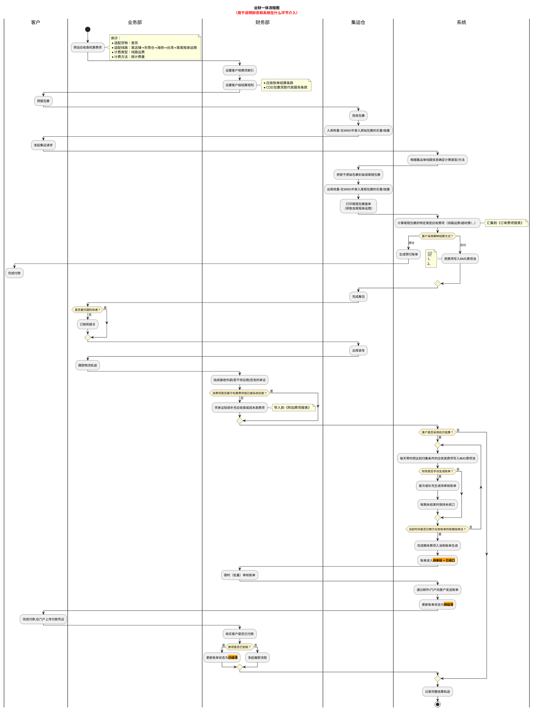
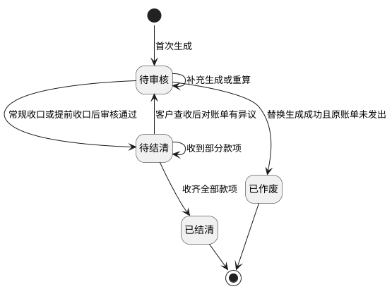

# 10. 应收账单模块

> 本文件是《账单系统 PRD》多文件主库的模块档，完整全貌、总体方案、非功能与内部审计、共享规则索引见[主档](../PRD.账单系统.md)。模块定位：应收账单如何形成、审核、结清与核销？

---

## 10. 应收账单模块

[🔗原型链接](http://localhost:4181/#/billing/receivable-bills)

### 10.1 需求背景

集运单自创建后到履约结束涉及的大量后付应收费项，常跨越多个账期录入，财务需要按账期把费项挂靠到账单，并支持补录、冲正和批量调账。

### 10.2 核心设计思路

1. `挂靠对象`是账单视角下一笔费项直接归属的最小业务对象，不等同于 OIS 数据库表之间的关联字段。任何费项都必须有且只能有一个挂靠对象，类型限定为`财务账单`、`业务订单`、`尾程包裹`或`首程包裹`。
2. 后付费项必须挂靠到特定账单进行结算。
3. 机算费项默认归入应收类。已入池原始金额不得直接修改；差异通过更正费项、调账或冲正处理并保留原始值。
4. 需要改造费项报表结构，以支持履约全过程费项与利润分析，并兼容包裹级到订单级的费项汇总链路。
5. 账期内每日任务把本期后付费项写入`BMS费项池`，不要求提前创建账单。
6. 财务可在账期结束前或结束后手动生成账单；生成后主状态为`待审核`，账期未结束或数据未完整时收口状态为`未收口`。
7. `待审核 + 已收口`账单可以按常规路径审核；`待审核 + 未收口`账单只有在财务确认提前收口、系统形成截断账期并完成收口后才能审核和发出。账单发出后不得作废或替换生成。

### 10.3 业财一体流程

1. 业务部预设应收类机算费项。
2. 财务维护客户侧费项索引与客户级结算条款。
3. 客户预报、仓库揽收、入库称重、集运请求、尾程核重。
4. 线路运费、超材费等机算费项完成计算后汇集到订单费项报表。
5. 后付模式下，系统先把费项归集到`BMS费项池`；财务可以在账期结束前后手动生成待审核账单。
6. 常规路径下，账期结束后系统完成期末费项入池和账单收口，账单达到`待审核 + 已收口`后由财务审核；需要提前对账时，财务按<a href="09C-账单生成-状态与页面.md#section-9-7-3">9.7.3 账期还没结束，怎样提前收口并审核？</a>确认截断范围。
7. 财务批量审核后，账单进入`待结清`，系统按客户级账单配置向客户发出账单。
8. 客户付款后，财务核实到账并完成结清。
9. 财务按系统导入模板不定期导入订单费项报表面板文件；导入数据的包裹级落表、订单级汇总及回款金额字段见<a href="19B-业务参考-来源表与归集窗口.md#section-19-2-3-2">19.2.3.2 各来源表怎样保存并关联业务对象？</a>和<a href="19B-业务参考-来源表与归集窗口.md#section-19-2-3-4">19.2.3.4 OIS 有哪些客户侧费用字段？</a>。

#### 10.3.1 业财一体流程图

### 10.4 账单状态机

| 主状态 | 定义 | 关键规则 |
| :--- | :--- | :--- |
| 待审核 | 账单已经生成，仍在财务内部处理 | 从未发出时允许发起账单生成或账单重算，补充生成或替换生成由系统判定；已经发出后折返时只允许按既有事实重算或调账；已收口时按常规路径审核，未收口时必须先确认提前收口 |
| 待结清 | 审核通过并进入客户对账与付款阶段 | 可按到账进度展示`待结算`或`部分待结算`；是否已向客户发出以`账单发出时间`为准，邮件发送结果由`通知状态`单独记录 |
| 已结清 | 全部到账 | 终态，只允许查询、导出和审计追溯 |
| 已作废 | 未发出的待审核账单被新账单成功替换 | 终态，不得重新启用、审核、发送、核销、重算或再次替换 |

账期收口状态独立于主状态：

| 账期收口状态 | 定义 | 关键规则 |
| :--- | :--- | :--- |
| 未收口 | 账期尚未结束，或账期结束后仍有来源数据、配置变更等待处理 | 待审核账单可以查看、补充生成、重算或替换生成；账期尚未结束时可执行`提前收口并审核`，但不得跳过收口直接发出 |
| 已收口 | 数据截止点已经覆盖实际账期结束时间，且实际账期内应处理费用和金额校验均已完成 | 与`待审核`同时满足时允许按常规路径审核并发出；实际账期可以是完整账期或提前收口形成的截断账期 |

补充规则：

1. 若账单内存在冲正记录，则必须待全部冲正记录审核通过后，账单才允许审核通过。
2. 冲正记录未全部审核通过时，账单应继续保留在待审核态。账期收口状态为`未收口`时，只能通过<a href="09C-账单生成-状态与页面.md#section-9-7-3">9.7.3 账期还没结束，怎样提前收口并审核？</a>完成截断和收口，不得直接进入待结清口径。
3. 冲正记录的审核统一在调账中心完成，账单侧只负责发起、展示和引用审核结果。
4. `逾期未结清`不是账单主状态，只是待结清账单中“超过信用期且未收齐款项”的筛选条件和展示标签。
5. 客户查收应收账单后对账单金额、费项或口径持有异议并要求修正时，账单可从待结清折返回`待审核`；折返不清空账单发出时间，因此不得作废或替换生成。
6. 应收账单折返回`待审核`时，若已经存在部分回款核销，系统必须保留原核销记录、核销币种、核销金额、汇率快照和操作轨迹，不得因状态折返删除或重置。
7. 应收账单核销完毕并进入`已结清`后，本系统应将数据源中与该应收账单关联的所有费项支付状态更新为`已支付`；支付状态同步不得改变原费项金额和账单历史结果。

#### 10.4.1 应收账单状态机

1. 任务类型为`账单生成`的BMS任务首次读取本期可出账费项时创建应收账单，账单直接进入`待审核`。账期未结束或尚未完成期末数据处理时，账期收口状态为`未收口`。
2. `待审核`是财务内部处理窗口。从未发出的账单可以发起账单生成、账单重算或补录遗漏费项，其中补充生成或替换生成由系统判定；已经发出后折返的账单不得补充或替换，只能按既有外部和资金事实重算、调账或冲正。既有费项原始金额不得直接改写。
3. 账期结束后的自动或手动期末任务完成费项入池、账单生成和完整性校验后，把账期收口状态更新为`已收口`。常规审核要求`待审核 + 已收口`且冲正记录全部审核通过；账期尚未结束时，财务可以按<a href="09C-账单生成-状态与页面.md#section-9-7-3">9.7.3 账期还没结束，怎样提前收口并审核？</a>先形成截断账期并完成收口，再审核账单。
4. 财务审核通过后，账单进入 `待结清`，系统按客户级账单配置向客户发出账单。账单首次通过邮件、客户端或其它方式成功向客户开放查看、下载或送达时，必须记录`账单发出时间`；各渠道不得重复改写首次发出时间。系统读取账单归属客户的客户主数据邮箱并发送账单邮件；若未配置客户邮箱，系统不得自动发送邮件，并在应收账单列表的`通知状态`展示`未配置邮箱`标签；邮件发送失败时展示`通知失败`，发送成功时展示`已通知`。`通知状态`只表示邮件结果，不阻断账单进入待结清；财务可在待结清阶段触发系统重发邮件，如改用其它方式送达，应另记送达说明且不改变`通知状态`枚举口径。
5. `待结清` 是广义结算阶段，覆盖 `待结算` 和 `部分待结算` 等展示口径。客户未付款时保持待结算；收到部分款项时仍停留在待结清口径并更新已收 / 未收金额；收齐全部款项后进入 `已结清`。
6. `逾期未结清` 并非真实账单状态。待结清账单同时满足“未收齐全部款项”和“当前日期大于信用期结束日”时，命中 `逾期未结清` 筛选条件，并可在列表上展示对应标签；后续收齐全部款项后进入 `已结清`，自然退出该筛选结果。
7. 客户查收账单后对金额、费项或口径提出异议并要求修正时，账单可从`待结清`折返回`待审核`；账单发出时间和既有核销事实继续保留，折返后的修正边界见<a href="09C-账单生成-状态与页面.md#section-9-8-2">9.8.2 再确认：当前账单状态允许怎么处理？</a>。
8. `已作废`是未发出待审核账单被新账单替换后的终态；其明细、配置快照、金额结果、作废原因和替换关系必须保留。
9. `已结清`是资金闭环终态。账单仅保留查询、导出、对账和审计追溯，不再通过状态折返直接改写历史结果。
10. 应收账单进入`已结清`后，本系统应将数据源中与该账单关联的全部费项支付状态更新为`已支付`；后续调账不得删除或覆盖原处理结果，具体处理见<a href="09C-账单生成-状态与页面.md#section-9-8-2">9.8.2 再确认：当前账单状态允许怎么处理？</a>。

### 10.5 自动拆单

账期定义、理解和节奏示意见<a href="07-客户级账单配置.md#section-7-3">7.3 账期定义与节奏</a>；本节只描述应收账单生成结果中的自动拆单规则。

1. 同一客户、同一账期内，来源订单的所属店铺快照、业务板块或运抵国任一不同，费用都必须拆成不同应收账单。账单结算主体仍取客户，店铺只作为强制拆分维度，不形成店铺级结算主体。
2. 拆分依据来自源订单固化的所属店铺、业务板块和运抵国；任一必需值缺失时任务报错，不得把缺值费用并入其它店铺或其它分组账单。
3. 同一账期拆出的账单互不影响，审核、发送、付款、核销均按账单维度独立进行。

### 10.6 账单配置

应收账单配置统一见<a href="07-客户级账单配置.md#section-7">7. 客户级账单配置</a>。本模块只描述应收账单的生成结果、状态流转、账期展示、详情和导出，不重复维护配置口径。

### 10.7 客户侧费项索引

客户侧费项索引只服务应收账单和返款账单，费项名称由我司统一定义，用于财务导入、冲正和采集配置参考；不得被成本账单或成本明细引用。成本账单使用的成本费项索引见<a href="../PRD.成本中心.md">《成本中心 PRD》5.2.2 客户侧与成本侧费项索引分域</a>。具体金额换算、汇率快照和多币种汇总规则见<a href="15-金额汇兑与调账中心.md#section-15">15. 金额汇兑</a>。

### 10.8 关键交互

1. 财务可在`BMS费项池`查看账期内费项归集结果，并可对从未发出的待审核账单发起`账单生成`或`账单重算`，也可执行补录或冲正；首次生成、补充生成或替换生成由系统判定。
2. 待审核账单达到`已收口`后可以按常规路径审核；账期尚未结束且状态为`未收口`时，可由财务确认提前收口并审核。未发出的待审核账单允许发起账单生成，并由系统判定是否需要替换生成。
3. 系统在账单审核通过后负责邮件发送，并以`通知状态`记录发送结果。
4. 财务在`待结清`账单中完成对账、核销与催收；页面可按到账进度展示`待结算`或`部分待结算`，并以`逾期未结清`标签快速定位超过信用期且未收齐款项的账单。
5. 应收账单列表支持按客户名称或编码、所属店铺、所属客户组、生成批次编号、任务编号、配置编号和准确版本筛选客户级账单；列表将两个快照字段分别展示为`配置编号`和`配置版本`列，`配置版本`列紧随`配置编号`列。生成批次编号和任务编号读取账单关联任务快照，配置编号与准确版本分别匹配账单快照中的独立字段，均不读取客户当前引用。财务按生成批次编号、任务编号、配置编号或准确版本筛选出账单后，可以对筛选结果批量下载，规则见<a href="19C-模板与资产库-导出邮件等.md#section-19-6-3-1">19.6.3.1 发起导出</a>。

### 10.9 应收账单详情与账单特调汇率

应收账单详情页用于查看一张应收账单的结算结果、金额快照和汇率快照；涉及币种分桶、金额换算、往期冲正和本位币折算的规则统一见<a href="15-金额汇兑与调账中心.md#section-15">15. 金额汇兑</a>。

#### 10.9.1 账单概况与金额展示

页面划分为以下业务字段区域：

| 区域 | 业务字段 / 操作 | 关键业务约束 |
| :--- | :--- | :--- |
| 账单概况 | 账单编号、主状态、账期收口状态、账期类型、实际账期起止日、截断账期标记、数据截止点、客户、会员编码、店铺、业务板块、运抵国；审核通过、提前收口并审核、导出账单 | `逾期未结清`仅作为筛选条件或标签；`待审核 + 已收口`展示普通`审核通过`，`待审核 + 未收口`且满足条件时展示`提前收口并审核`；详情导出固定为当前账单的客户对账文件。 |
| 费项结算币种金额 | 费项结算币种、核销状态、应收金额、实收金额、待收金额；费用核销 | 同一账单可以存在多个费项结算币种桶；各币种独立核销和判断结清。 |
| 账单汇率 | 费项结算币种、财务本位币种、费项原始币种、汇兑方向、锁定汇率；编辑汇率 | 仅展示账单内已存在的货币对；账单级调整只影响当前账单。 |
| 费用汇总与明细 | 费用汇总展示费项、结算币种、应收金额、已核销金额、待核销金额；费用明细支持横表和纵表，展示业务单号、尾程运单号、首程运单号、费用编号、动态费项金额列、金额币种口径、非业务订单下挂费项；补录费项 | 横表以业务单号为行、实际发生费项为动态列；纵表以单条费项为行。金额与费项必须读取当前有效账单结果版本，补录形成新费项记录，不得直接改写原始费项。 |
| 调账记录与核销记录 | 调账编号、调账类型、调账状态、核销编号、核销币种、核销金额、核销时间 | 原调账和核销记录只读；错误通过调账中心新增冲正记录处理。 |

#### 10.9.2 账单特调汇率页签与编辑弹窗

1. 账单特调汇率页签仅用于查看账单内已存在的货币对及其锁定结果。
2. 弹窗中的货币对列表必须来源于账单内已存在的费项货币对，不允许手工新增账单内不存在的货币对。
3. 货币对来源、换算方向、账单级锁定汇率和客户级默认汇率回显的规则统一见<a href="15-金额汇兑与调账中心.md#section-15">15. 金额汇兑</a>；账单级锁定汇率配置不可关闭。
4. 页面保存后仅影响当前账单的金额换算结果，不回写历史账单。

说明：

1. “货币对一致，则必须汇兑方向一致，汇率一致”指的是同一账单内相同币种组合只能采用一个汇兑方向和一套汇率口径，不允许同一货币对同时出现两个方向或两个数值。
2. 账单级锁定汇率配置不可关闭。未人工调整时，页面展示账单生成时命中的客户级默认汇率；人工调整后，页面展示当前账单级锁定汇率。

#### 10.9.3 账单导出范围

1. 应收账单详情内的`导出`固定为`导出给客户`，仅导出当前应收账单，并按<a href="19C-模板与资产库-导出邮件等.md#section-19-6-1">19.6.1 面向客户的对账报表导出</a>生成一份客户对账文件；该入口不展示用途选择，也不支持内部明细导出。
2. 应收账单列表的批量导出分为`导出给客户`和`导出给内部`。`导出给客户`按<a href="19C-模板与资产库-导出邮件等.md#section-19-6-1">19.6.1 面向客户的对账报表导出</a>逐账单生成客户对账文件；`导出给内部`按<a href="19C-模板与资产库-导出邮件等.md#section-19-6-2">19.6.2 面向财务的对账报表导出</a>汇总所选账单的费项明细，并允许财务选择`拆分式`或`合并式`。
3. 两种用途均只读取任务创建时固化的当前账单结果，不支持导出账单历史快照，也不提供历史快照版本列表、历史配置快照、历史金额快照或历史汇率快照文件。
4. 历史快照只保留在系统内用于审计、追溯和防回写判断，不作为客户对账文件或内部明细文件的导出对象。
5. 财务按生成批次编号、任务编号、账单快照中的配置编号或准确版本筛选出应收账单后，可以对筛选结果批量下载：`导出给客户`逐客户生成对账文件并打包下载，`导出给内部`按筛选结果全部账单生成内部明细文件，打包规则见<a href="19C-模板与资产库-导出邮件等.md#section-19-6-3-1">19.6.3.1 发起导出</a>。

### 10.10 账单编号

应收账单编号用于唯一识别客户在某一所属店铺快照、某一账期和某一应收拆分维度下形成的应收账单。

| 账单类型 | 前缀 | 结算主体 | 账期起始日 | 后缀 | 示例 |
| :--- | :--- | :--- | :--- | :--- | :--- |
| 应收账单 | ARB | 客户编码 | yyyymmdd | 店铺编号+业务板块+运抵国 MD5 截前 4 位 | `ARB-OG4155-20260101-fse3` |

规则：

1. 应收账单编号前缀固定为 `ARB`。
2. 结算主体取客户编码。
3. 账期起始日按 `yyyymmdd` 格式取当前应收账单账期开始日期。
4. 同一客户、同一账期内，若不同费项关联订单的所属店铺快照、业务板块或运抵国任一不同，必须拆成多张应收账单。
5. 应收账单后缀用于区分拆单维度，取`店铺编号 + 业务板块 + 运抵国`组合的 MD5 截前 4 位；店铺编号读取账单所属店铺快照，不读取客户当前归属。

