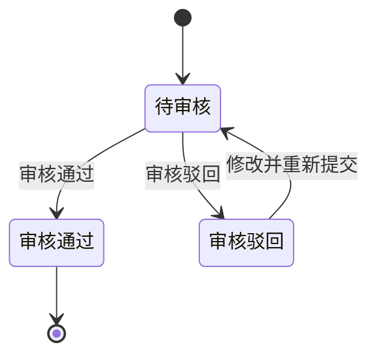

# 15. 金额汇兑 / 16. 调账中心

> 本文件是《账单系统 PRD》多文件主库的模块档，完整全貌、总体方案、非功能与内部审计、共享规则索引见[主档](../PRD.账单系统.md)。模块定位：金额如何换算、锁定与核销？差异如何调账与冲正？

---

## 15. 金额汇兑

### 15.1 章节概述

本章统一定义应收账单、返款账单、成本账单和回款管理涉及的金额汇兑口径。客户级汇率配置先决定账单生成前的默认汇率，本章再定义默认汇率如何在账单侧固化为快照、如何参与金额换算、汇总和核销。

1. 费项结算币种如何选择。
2. 汇率快照如何锁定。
3. 多币种账单如何汇总和核销。

本章聚焦金额换算与币种汇总，其他章节分别承接业务流程、页面入口和结果展示。

### 15.2 费项结算币种模板

费项结算币种模板是应收账单配置页面的快捷填充工具，用于把常用的费项结算币种映射一次性带入默认方案或分支方案。模板不参与账单生成时的实时匹配，也不与客户级账单配置建立绑定关系。

#### 15.2.1 模板作用

1. 模板按常用业务场景维护费项与结算币种的映射，减少财务逐项填写工作。
2. 模板可以提供费项结算币种规则集合。
3. 模板不是客户级账单配置项，也不是账单计算规则；任务类型为`账单生成`的BMS任务不得根据模板编号或模板当前内容决定结算币种。
4. 模板不是客户私有配置，不按客户复制维护；客户差异通过应收账单配置最终保存的费项结算币种表达。

#### 15.2.2 套用与保存规则

1. 财务编辑应收账单默认方案或分支方案时，可以选择一个模板并预览将要填充的费项结算币种规则。
2. 财务确认套用后，系统把模板当时的字段值复制到账单配置；页面不得只保存模板编号后延迟读取模板内容。
3. 目标配置已有费项结算币种时，套用前必须展示覆盖差异，由财务确认保留原值或使用模板值。
4. 套用完成后，财务可以继续新增、删除或修改任一费项结算币种；这些修改不回写模板。
5. 保存账单配置时，只校验并保存最终的费项结算币种规则，不保存模板引用关系。
6. 模板后续被修改、停用或移除时，不得联动改变任何已套用但未绑定的客户级账单配置。

#### 15.2.3 账单读取口径

1. 首次生成账单时，系统只读取任务锁定的应收账单配置中已经保存的费项结算币种，不再查询币种模板。
2. 账单任务和账单结果只保存最终费项结算币种快照，不保存模板编号、模板版本或模板快照。
3. 补充生成和账单重算沿用目标账单已经锁定的费项结算币种，不受模板后续变化影响；替换生成使用财务选择的新版配置中已经保存的费项结算币种。
4. 财务套用模板的动作可以作为账单配置编辑日志保留，但该日志只说明填充值来源，不构成账单配置与模板之间的业务关联。
5. 历史账单需要调整结算币种时，按<a href="09A-账单生成-任务与费项入池.md#section-9">9. 账单生成/重算机制</a>和<a href="#section-16">16. 调账中心</a>处理，不得通过修改模板回写历史结果。

### 15.3 汇率与金额换算

#### 15.3.1 汇率层级

账单生成前，默认汇率按<a href="08-客户级汇率配置.md#section-8">8. 客户级汇率配置</a>命中；账单生成后，命中的默认汇率会固化为账单特调汇率快照。账单金额换算时，汇率使用层级如下：

1. 账单级锁定汇率：账单生成或账单侧调整后固化的汇率。
2. 客户当前特调配置：读取任务执行快照锁定的配置编号和准确版本；同一货币对存在启用规则时使用，方向相反时按倒数规则推导。
3. 基准汇率表：客户当前特调配置没有可用规则时，使用已确认生效的基准汇率。
4. 店铺汇率表：客户特调配置和基准汇率表均不可用时，使用账单归属店铺对应的店铺汇率。
5. 固定汇率 `1`：以上来源均不可用，或同币种换算时使用。

客户当前特调规则因基准汇率不可用而无法产出默认汇率时，视为客户特调未命中并继续使用基准汇率表、店铺汇率表或`1`。账单金额换算优先级为：`账单级锁定汇率 > 客户引用的特调配置准确版本 > 基准汇率表 > 店铺汇率表 > 1`。同币种换算汇率固定为 `1`；异币种换算在客户特调配置、基准汇率表和店铺汇率表均找不到兜底汇率时，该货币对汇率也固定按 `1` 处理，并写入账单特调汇率快照。费项级明确汇率目前仅作为后续扩展概念预留，本期不纳入开发范围，也不参与账单生成和账单重算优先级。

#### 15.3.2 汇率快照

1. 账单生成或审核时必须锁定汇率快照。
2. 锁定后的汇率不随市场汇率变化自动刷新。
3. 财务本位币种仅用于内部核算和对账，不改变客户侧真实应收币种。

#### 15.3.3 费项结算币种汇率列表生成与锁定

费项结算币种级锁定汇率列表中的汇率行，必须由账单下所有费项详情的货币对 `DISTINCT` 生成，不允许人工新增账单内不存在的货币对。

1. 费项结算币种级汇率行分为两类：
   - `费项结算币种 -> 财务本位币`
   - `费项结算币种 -> 费项原始币种`
2. 同一货币对在同一账单内只保留一条记录，不能因为费项行重复、左右币种排列不同或来源方向不同而重复生成多条。
3. 同一货币对一旦在账单内出现，必须固定一个汇兑方向和一套汇率口径；同一账单内不得同时存在相同货币对但方向相反或数值不同的汇率行。
4. 若 `费项结算币种 -> 费项原始币种` 没有可直接使用的直连汇率，则优先按两端币种各自对 `财务本位币` 的锁定汇率推导：
   - `费项结算币种 -> 费项原始币种 = （费项结算币种 -> 财务本位币） / （费项原始币种 -> 财务本位币）`
5. 若账单内同时存在直连汇率和推导汇率，系统必须保持两者口径一致；若不一致，以费项结算币种级锁定结果为准。
6. 汇率行生成后必须存在有效汇率；未人工调整时，系统使用账单生成时命中的客户级默认汇率作为当前账单的锁定结果。
7. 财务在账单详情页人工调整汇率后，系统以当前填写值作为账单级锁定汇率，并用于后续账单金额换算。
8. 账单级锁定汇率配置不可关闭；财务可以在状态规则许可范围内修改当前账单的锁定汇率，但不能把该货币对汇率行关闭为空。
9. 账单级锁定汇率调整后，只影响当前账单的换算口径，不回写历史已结清账单。
10. 账单内若后续新增新的费项货币对，则该货币对自动补入账单特调汇率列表，并遵循同样的锁定汇率规则。
11. 若 `费项原始币种 = 费项结算币种`，该货币对视为同币种行，换算汇率固定为 `1`。
12. 账单特调汇率列表只决定费项结算币种级锁定汇率与回显口径，不改变 `账单级锁定汇率 > 客户引用的特调配置准确版本 > 基准汇率表 > 店铺汇率表 > 1` 的换算优先级。

#### 15.3.4 金额换算规则

1. 当费项原始币种与结算币种相同时，金额不做换算，直接沿用原始金额。
2. 当费项原始币种与结算币种不同时，按锁定汇率换算为结算币种金额。
3. 若需要进入财务本位币，再按<a href="#section-15-3-1">15.3.1 汇率层级</a>中对应的锁定汇率换算到财务本位币。
4. 历史金额只保留快照结果，不允许被后续汇率改写。

### 15.4 多币种账单汇总

当费项结算币种和汇率快照已经锁定后，系统需要把同一账单下的多币种费项归并成可汇总、可核销的账单结果。

#### 15.4.1 账单主表与汇总表

1. 账单主记录只保留账单编号、客户、账期、状态和总览信息。
2. 单笔费项明细需要保留原始币种、结算币种和财务本位币下的金额快照。
3. 账单需要按 `bill_no + currency` 形成币种汇总结果，并记录应收、已收、未收金额。

#### 15.4.2 汇总规则

1. 同一张账单可以同时存在多个结算币种。
2. 同一张账单的金额汇总按币种分组进行。
3. 财务本位币只用于内部统计和对账，不改变客户侧的真实应收币种。

### 15.5 多币种核销

核销必须建立在已形成的币种汇总结果之上，并且只能落到具体的币种汇总行，不能直接跨币种混核。

#### 15.5.1 核销落点

1. `payment_writeoff_detail` 必须关联具体的 `currency_summary_id`。
2. 核销必须落到具体的币种汇总行，不能把不同结算币种混在一起核销。
3. V1 不做跨币种自动抵扣。

#### 15.5.2 核销约束

1. 收款币种必须与本次核销对应的结算币种一致。
2. 若到付币种与结算币种不一致，系统只允许按锁定汇率折算后参与核销口径计算。
3. 汇率快照必须随账单或核销动作一并保存。
4. 历史账单、历史核销和历史汇率都不回写。
5. 应收账单或返款账单从 `待结清` 折返回 `待审核` 时，已发生的部分核销记录必须保留；系统不得删除、覆盖或重新生成既有核销流水，只能基于修正后的账单结果重新计算未核销余额和后续可核销金额。

### 15.6 应收账单币种间换算

#### 15.6.1 应收账单换算总则

应收账单的币种间换算遵循“先分币种桶，再按锁定汇率换算费项，最后合并历史冲正并按需换算财务本位币”的顺序。也就是说，账单先在费项结算币种维度形成可核算结果，再在需要时折算到财务本位币；每一步的详细定义见<a href="#section-15-6-2">15.6.2 费项结算币种级锁定汇率规则</a>和<a href="#section-15-6-3">15.6.3 应收账单币种间换算规则</a>。

1. `原始应收金额` 只负责承接本账期内费项换算后的汇总结果，不包含历史账期冲正。
2. `往期账单冲正` 只在 `费项结算币种` 下计入，不在原始币种维度重复拆分。
3. 财务本位币只用于内部核算和对账，不改变客户侧结算币种。

#### 15.6.2 费项结算币种级锁定汇率规则

费项结算币种级锁定汇率的生成、启用、关闭和推导规则，统一见<a href="#section-15-3-3">15.3.3 费项结算币种汇率列表生成与锁定</a>。本节只说明金额换算如何引用这些锁定结果。

#### 15.6.3 应收账单币种间换算规则

应收账单以“费项结算币种桶”为主线组织金额换算。账单内不同费项可以命中不同的结算币种，但每一个币种桶内的计算口径必须一致，且所有换算都必须基于同一批锁定快照完成。

1. 账单生成时，系统先按 `费项结算币种` 将账单下分桶；同一张账单允许同时存在多个费项结算币种桶。
2. 每个币种桶内，系统先取该桶下费项的 `费项原始币种` 和 `费项金额`，再按<a href="#section-15-3-1">15.3.1 汇率层级</a>换算到 `费项结算币种`。
3. 若 `费项原始币种 = 费项结算币种`，则直接沿用原始金额，不做换算。
4. 若 `费项原始币种 != 费项结算币种`，则必须按锁定汇率换算后再汇总，不允许先汇总再换算。
5. `原始应收金额` 只承接当前账期内费项换算后的结果，不包含历史账期冲正。
6. `往期账单冲正`、补录、调账都以 `费项结算币种` 计入，并直接参与当前账单汇总，不再回到原始币种重新拆分。
7. `最终应收金额（费项结算币种） = 原始应收金额 + 往期账单冲正`。
8. 若账单需要同时展示财务本位币，则先得到费项结算币种金额，再按 `费项结算币种 -> 财务本位币` 的锁定汇率换算。
9. 财务本位币金额仅用于内部核算和对账，不改变客户侧真实应收币种。
10. 应收账单中的对应金额结果均以本规则为准。

#### 15.6.4 应收账单换算示例

1. 某一币种桶的 `原始应收金额` 为 `18 USD`，`往期账单冲正` 为 `-8 USD`，则 `最终应收金额（费项结算币种） = 10 USD`。
2. 若该桶对应的 `费项结算币种 -> 财务本位币` 锁定汇率为 `6.86080`，则 `最终应收金额（财务本位币） = 10 × 6.86080 = 69.608 RMB`。
3. 若另一币种桶的 `原始应收金额` 为 `100 TWD`，`往期账单冲正` 为 `0 TWD`，且 `TWD -> RMB` 锁定汇率为 `0.21450`，则 `最终应收金额（财务本位币） = 22.45 RMB`。

### 15.7 返款账单与回款币种口径

#### 15.7.1 返款账单换算总则

正常签收的 COD 包裹同时存在回款和返款两条金额链路：回款是尾程派送商将完整到付金额返给财务，返款是财务将代收货款返还给客户；`到付金额 = 代收货款 + 到付附加费`。回款链路读取订单费用报表导入的`实收回款`和`回款汇率`；返款链路由返款账单根据配置计算。完整业务定义见<a href="11-返款账单与回款管理.md#section-11-2">11.2 核心概念</a>。

1. 只有正常签收的 COD 包裹才进入返款金额计算；异常签收的 COD 包裹不产生回款金额或返款金额。
2. 到付附加费和应付返款本金在货款原始币种中计算：`应付返款 = 到付金额 - 到付附加费总额`。
3. 返款账单指定扣减费项须先换算为货款原始币种，再计算`实付返款（准） = 应付返款 - 返款账单指定扣减费项`。`实付返款（准）`是换算前金额，不是客户最终收款金额。
4. `返款汇率`是返款账单中`货款原始币种 → 货款结算币种`的汇率，按<a href="#section-15-3-1">15.3.1 汇率层级</a>取得并随账单锁定；同币种时固定为`1`。
5. 客户最终收款金额按`实付返款 = 实付返款（准） × 返款汇率`计算，币种为货款结算币种。
6. 客户收款账户币种必须与货款结算币种一致；未配置同币种账户时，配置不得保存，受影响账单不得生成或执行返款。
7. 后续订单费用报表只导入`实收回款`和`回款汇率`，不再导入`实付返款`和`返款汇率`。历史已导入的返款字段只保留原记录，不参与账单展示、生成、重算、审核或核销。
8. `回款汇率`表示目的国币种到回款结算币种的导入汇率；无回款汇率且实收回款仍使用目的国币种时，按同币种汇率`1`理解。系统不得用回款汇率替代返款汇率。
9. 返款账单中的实付返款、已返金额与待返金额均以本节计算结果为准；包裹侧历史实付返款不参与返款核销。
10. `实付返款（准）`小于零时，按返款账单负数处理规则执行，不得直接形成负数实付返款或负数核销记录。
11. 返款金额链的识别和扣减顺序见<a href="11-返款账单与回款管理.md#section-11-2-3">11.2.3 到付金额、代收货款和实际返款如何区分？</a>。

#### 15.7.2 返款账单换算示例

以下示例均为：到付金额`70 TWD`，到付附加费总额`10 TWD`，返款账单指定扣减费项`20 TWD`。因此，`应付返款 = 70 - 10 = 60 TWD`，`实付返款（准） = 60 - 20 = 40 TWD`。

1. 货款币种配置为`TWD → TWD`时，返款汇率为`1`，最终`实付返款 = 40 TWD × 1 = 40 TWD`。若订单费用报表导入的实收回款为`70 TWD`且无回款换算，回款链路继续按`70 TWD`记录。
2. 货款币种配置为`TWD → CNY`时，返款账单锁定返款汇率`0.15`，最终`实付返款 = 40 TWD × 0.15 = 6 CNY`。若订单费用报表同时导入回款汇率`0.2`和实收回款`14 CNY`，两项仅描述回款链路，不改变返款金额。

#### 15.7.3 返款账单怎样计算汇兑损益？

汇兑损益用于比较同一笔换算前返款金额分别按回款汇率和返款汇率折算后的差额。该金额属于返款账单内部财务信息，不参与客户实付返款、账单核销或结清判断。

1. 公式中的返款金额基数是换算前的`实付返款（准）`，不是已经换算为货款结算币种的最终`实付返款`：`汇兑损益金额 = 实付返款（准） ×（标准化回款汇率 - 标准化返款汇率）`。
2. 两个汇率相减前，必须具有完全相同的左侧币种、右侧币种和汇兑方向。比较货币对以回款汇率的货币对和汇兑方向为准。
3. 返款汇率与回款汇率货币对一致时，直接作为标准化返款汇率。返款汇率货币对不一致时，使用账单已锁定的汇率换算为回款汇率货币对；不得直接相减。
4. 例如，回款汇率为`TWD → CNY`，返款汇率为`TWD → USD`，则须通过账单锁定的`USD → CNY`汇率计算`标准化返款汇率 = TWD → USD × USD → CNY`。若中间汇率方向相反，先取倒数再参与换算。
5. 正常情况下，货款原始币种与回款汇率左侧币种均为目的国币种。两者不一致时，须先按账单锁定汇率把`实付返款（准）`换算为比较货币对的左侧币种，再代入公式。
6. 汇兑损益币种为比较货币对的右侧币种。缺少回款汇率或必要的换算汇率时，返款账单仍须显示`汇兑损益金额`字段，字段值为`--`并说明缺失项。
7. 无回款汇率且实收回款继续使用货款原始币种时，标准化回款汇率按同币种汇率`1`处理；若返款也为同币种，汇兑损益为`0`。
8. 汇兑损益金额只在返款账单详情和面向财务的内部导出中展示，客户页面、客户邮件和面向客户的对账报表均不得展示。
9. 汇兑损益只反映汇率差异，不改变`实付返款`、已返金额、待返金额或核销金额，也不回写订单费用报表的实收回款和回款汇率。

按<a href="#section-15-7-2">15.7.2 返款账单换算示例</a>的第二个场景，`实付返款（准）`为`40 TWD`，回款汇率为`0.2`，返款汇率为`0.15`，且货币对均为`TWD → CNY`，因此`汇兑损益金额 = 40 ×（0.2 - 0.15）= 2 CNY`。

### 15.8 成本账单与利润换算口径

成本账单保留供应商收费的原始币种和原始金额；成本进入业务订单利润时，统一换算为财务本位币。客户侧收入和供应商侧成本分别使用各自业务时点锁定的汇率，不共用同一组汇率快照。

1. 客户侧收入使用应收账单或返款账单已经锁定的账单汇率，后续客户级汇率配置和市场汇率变化不得回写。
2. 供应商侧成本使用成本核销或结清登记时由财务确认的`成本核销汇率`；导入时直接标记`已结清`的，在导入确认时同步锁定。
3. 多币种成本账单按币种分别记录结清金额和成本核销汇率，再分别换算为人民币，不得先把不同币种原始金额相加。
4. 分次结清同一币种时，每次结清分别记录本次金额和本次成本核销汇率；业务订单最终成本人民币金额为各次结清人民币金额之和。
5. 成本账单处于`待结清`且尚无锁定成本核销汇率时，外币成本按原币种展示为`汇率待确认成本`，不使用当前市场汇率计入人民币利润合计，也不得确认`成本已齐`。
6. 成本核销汇率锁定后，系统把相关外币成本换算为人民币并重算受影响业务订单的利润；锁定前后只形成利润补入记录，不修改供应商原始币种金额，也不修改客户账单金额。
7. 成本核销汇率、汇兑方向、锁定时间、确认人和关联结清记录必须形成不可覆盖的快照，并按<a href="../PRD.账单系统.md#section-18">18. 内部审计</a>保留审计记录。

## 16. 调账中心

### 16.1 章节概述

调账中心产生于“原始金额或核销信息已经入账，但后续发现需要修正，且历史账单不能回写”的业务背景。它统一承接应收账单、返款账单和成本账单的冲正差异，让财务能够在不改写源数据、历史账单和历史结清事实的前提下完成修正闭环。调账中心的核心价值，是把分散在账单侧、导入侧和人工处理侧的冲正动作收敛到同一处管理，保证修正结果可追溯、可审核、可留痕，并能被对应账单线稳定引用。

成本账单调账分为`成本金额冲正`和`成本核销冲正`。前者修正供应商收费金额及成本明细，后者修正已登记的结清金额、币种、日期、汇率、方式或凭证。两类调账均不允许把原成本账单从`已结清`退回`待结清`，具体规则见<a href="../PRD.成本中心.md">《成本中心 PRD》8.3 已结清成本账单的纠错</a>。

### 16.2 原型概述

[🔗原型链接](http://localhost:4181/#/billing/adjustments)

#### 16.2.1 业务字段

| 区域 | 业务字段 |
| :--- | :--- |
| 列表域 | 批次提交时间、调账单号、审核状态、客户名称、触发账单号、冲正费项、费项挂靠对象、业务订单号、尾程运单号、首程运单号、冲正理由、冲正前币种、金额变幅<冲正前币种>、冲正后金额<冲正前币种>、归属账单号、冲正后币种、锁定汇率、金额变幅<冲正后币种>、冲正后金额<冲正后币种>、费项凭证、登记人 |
| 导入域 | 客户名称、应收账单号、冲正费项、费项挂靠对象、业务订单号、尾程运单号、首程运单号、冲正理由、冲正前币种、金额变幅<冲正前币种> |
| 筛选域 | 批次提交时间、调账单号、审核状态、客户名称、触发账单号、冲正费项、费项挂靠对象、业务订单号、尾程运单号、首程运单号、冲正前币种、归属账单号、冲正后币种、登记人 |
| 成本金额冲正域 | 调账类型、供应商、原成本账单号、原成本明细号、成本板块、标准成本费项、成本类型、业务订单号、尾程运单号、原币种、原金额、冲正金额、冲正后金额、冲正原因、凭证、登记人 |
| 成本核销冲正域 | 调账类型、供应商、原成本账单号、原结清记录号、原结清金额、原结清币种、原结清日期、原成本核销汇率、原结清方式、反向核销金额、正确结清金额、正确结清币种、正确结清日期、正确成本核销汇率、正确结清方式、冲正原因、凭证、登记人 |
| 说明 | 1、调账单号采用 UUID  2、再按照冲正费项的原始币种或结算币种填写冲正前币种 |

#### 16.2.2 业务操作
调账记录的业务操作与审核状态强绑定，操作权限、批量能力和状态流转必须一起定义。

| 状态 | 可执行操作 | 执行人 | 是否支持批量 | 状态流转 |
| :--- | :--- | :--- | :--- | :--- |
| `待审核` | 修改 | 提交人，且仅限本人提交的记录 | 否 | 修改后仍停留在 `待审核` |
| `待审核` | 移除 | 提交人，且仅限本人提交的记录 | 是 | 移除后记录终止，不再进入后续状态 |
| `待审核` | 审核 | 审核人 | 是 | 审核通过后进入 `审核通过`，审核驳回后进入 `审核驳回` |
| `审核驳回` | 修改并重新提交 | 提交人 | 否 | 重新提交后回到 `待审核` |
| `审核通过` | 查看 | 所有人 | 否 | 只读，不允许修改、移除或再次审核 |

| 状态 | 说明 |
| :--- | :--- |
| `待审核` | 记录可编辑、可移除、可审核，是唯一支持批量审核和批量移除的状态。 |
| `审核通过` | 记录已生效，只读保留，不允许再改。 |
| `审核驳回` | 记录保留驳回原因，允许提交人修改后再次提交，重新回到 `待审核`。 |
| 状态机起点 | 记录新建后进入 `待审核`。 |

### 16.3 录入与审核规则

1. 账单录入的冲正记录和调账中心批量导入的冲正记录，最终都统一在调账中心审核，且归属账单由财务在审核时确认。
2. 应收账单调账、返款账单调账和成本账单调账共用同一审核入口，但字段、默认归属、审核归属和生效对象按各自账单类型处理。
3. `待审核` 记录可以修改、移除、审核。
4. 提交人只能修改和移除自己提交的待审核记录。
5. 审核人只能审核，不能代替提交人修改内容。
6. `审核通过` 记录进入只读态，不允许再次修改或移除，只能通过新增反向调账修正。
7. `审核驳回` 记录保留驳回原因，提交人可重新编辑后再次提交；重新编辑后仍回到 `待审核` 状态。
8. 批量移除、批量审核仅对待审核记录生效，混入其它状态时应禁用相应操作。
9. 归属账单未确认且系统未生成有效默认归属的调账记录，不允许审核通过。
10. 调账记录必须明确记录来源、去向、金额、币种、原因和凭证。
11. 成本金额冲正必须关联供应商、原成本账单、原成本明细和受影响业务对象；成本核销冲正必须关联原结清记录，并明确错误记录、反向记录和正确记录之间的关系。
12. 成本调账的提交人与审核人必须分离；审核人不得修改提交内容后直接通过。

### 16.4 生效与归属规则

1. 应收账单中的特定费项冲正完成后，系统按费项归属把结果计入对应应收账单的本期调账或往期调账，不直接覆盖历史快照。
2. 返款账单中的特定费项冲正完成后，系统按费项归属把结果计入对应返款账单的本期调账或往期调账，不直接覆盖历史快照。
3. 调账通过审核后，才允许影响对应应收账单或返款账单的应收金额、应返金额或核销结果，或者影响成本调整记录、成本归属、成本核销结果和利润分析。
4. 如果原始金额已经进入 `BMS费项池`，修正动作必须走调账中心，不允许直接回写源数据。
5. 已结清账单若再发现差异，不能直接改写历史账单金额，必须通过后续账单、反向调账承接。
6. 调账记录一旦审核通过，必须保留历史状态、审核轨迹和凭证，不允许被后续操作直接覆盖。
7. 账单中的任何未移除冲正记录，只有在调账中心全部审核通过后，整份账单才允许审核通过。
8. 调账中心也不触发源数据重采，不改变 `BMS检阅标记` 的状态流转。
9. 已结清成本账单发生金额差异时，调账中心生成新的成本调整明细和关联关系，原成本账单金额、编号和状态保持不变。
10. 已结清成本账单发生核销信息错误时，调账中心以新增反向核销记录和正确核销记录完成修正，不修改或删除原核销流水。
11. 成本调账形成待结清差额时，差额按供应商、币种和成本账期形成独立待结清记录；后续结清该差额不改变原成本账单状态。
12. 成本调账影响间接成本时，必须生成新的分摊版本；影响已确认`成本已齐`订单时，必须退回`成本未齐`并重算利润。

### 16.5 自动归属规则

1. 对于尚未归属任何应收账单的应收账单调账记录，系统在导入后先预生成默认归属，但该归属不等于最终审核归属。
2. 对于尚未归属任何返款账单的返款账单调账记录，系统在导入后先预生成默认归属，但该归属不等于最终审核归属。
3. 调账记录的归属账单由财务在审核时最终确认；财务可以沿用系统预生成的默认归属，也可以手动改派到另一份同类型的有效待审核账单。
4. 应收账单调账默认优先选择同客户、同账期内的有效待审核应收账单；`已作废`账单不得作为归属账单。
5. 返款账单调账默认优先选择同客户、同账期内的有效待审核返款账单；`已作废`账单不得作为归属账单。
6. 在同一客户、同一账期内，若可候选账单中存在财务本位币汇总金额最高的那一份，应优先选择该账单作为默认归属。
7. 选择财务本位币汇总金额最高的账单，是为了让冲正金额叠加后更不容易把单张账单推到负值。
8. 若候选账单的财务本位币汇总金额相同，系统应按账单编号升序选出唯一承接账单，账单编号以固定且唯一的规则生成，不会重复。
9. 自动归属只处理尚未归属任何应收账单或返款账单的调账记录，不影响已经归属完成的记录。
10. 成本账单调账不使用客户账单的自动归属算法。成本调账必须明确关联原成本账单；无法关联原成本账单的新增成本，应作为新的成本明细或新的成本账单处理，不得由系统猜测归属。

### 16.6 与账单的关系

1. 应收账单中的调账影响应收金额、已收金额和未收金额的展示与核销口径。
2. 返款账单中的调账影响应返金额、已返金额和未返金额的展示与核销口径。
3. 成本账单中的成本金额冲正影响成本调整金额、成本归属和利润；成本核销冲正影响结清流水及人民币换算结果，但不改变原成本账单的`已结清`状态。
4. 调账中心只是修正入口，不等于应收账单、返款账单或成本账单本身。
5. 调账中心产生的结果最终仍要由对应账单线或独立成本调整记录承接，不能绕过账单直接改写历史结果。

