# 19C. 模板与资产库（按需检索）

> 本文件是《账单系统 PRD》多文件主库的模块档，完整全貌、总体方案、非功能与内部审计、共享规则索引见[主档](../PRD.账单系统.md)。模块定位：功能清单、辅助测试、邮件与导出模板（按需检索）。

---

### 19.3 系统功能清单

所有 BMS 菜单统一收口到`账单系统`根节点。下图中加粗节点是真实菜单；灰色节点只用于标识菜单所属的业务标签，不提供独立入口。

账单系统每个菜单页均使用独立且稳定的Hash路径。PRD引用原型时应直接链接对应路径；浏览器刷新、前进、后退或粘贴链接后，系统必须恢复到该页面。

| 页面 | 稳定原型路径 |
| :--- | :--- |
| 营收总览 | [🔗原型链接](http://localhost:10520/#/billing/revenue-overview) |
| 应收账单 | [🔗原型链接](http://localhost:4181/#/billing/receivable-bills) |
| 返款账单 | [🔗原型链接](http://localhost:4181/#/billing/refund-bills) |
| 回款管理 | [🔗原型链接](http://localhost:4181/#/billing/remittance) |
| 调账中心 | [🔗原型链接](http://localhost:4181/#/billing/adjustments) |
| 账单配置 | [🔗原型链接](http://localhost:4181/#/billing/config) |
| 汇率配置 | [🔗原型链接](http://localhost:4181/#/billing/rates) |
| 生成任务 | [🔗原型链接](http://localhost:4181/#/billing/tasks) |
| 基础配置 | [🔗原型链接](http://localhost:4181/#/billing/base-config) |
| 导出管理 | [🔗原型链接](http://localhost:4181/#/billing/exports) |
| 内部审计 | [🔗原型链接](http://localhost:4181/#/billing/audit) |
| 报表比对 | [🔗原型链接](http://localhost:4181/#/billing/report-compare) |
| 数据迁移 | [🔗原型链接](http://localhost:4181/#/billing/data-migration) |

```plantuml
@startuml
skinparam defaultFontName Microsoft YaHei

rectangle tree [
  <color:#6B7280>账单系统</color>
  |_ <color:#6B7280>财务日常</color>
    |_ <b>营收总览</b>
    |_ <b>应收账单</b>
    |_ <b>返款账单</b>
    |_ <b>回款管理</b>
    |_ <b>调账中心</b>
  |_ <color:#6B7280>核心配置</color>
    |_ <b>账单配置</b>
    |_ <b>汇率配置</b>
  |_ <color:#6B7280>过程管控</color>
    |_ <b>生成任务</b>
    |_ <b>基础配置</b>
    |_ <b>导出管理</b>
    |_ <b>内部审计</b>
  |_ <color:#6B7280>辅助测试</color>
    |_ <b>报表比对</b>
    |_ <color:red><b>数据迁移</b></color>
]
@enduml
```

菜单功能清单仅列出树图中加粗的真实菜单：

| 所属标签路径 | 真实菜单 | 主要能力 | 对应需求章节 |
| :--- | :--- | :--- | :--- |
| 财务日常 | 营收总览 | 在当前供应链范围内按店铺及其下属客户查看应收、已收、应收未收及逾期未收金额，并下钻到具体应收账单 | <a href="12-营收总览.md#section-13">13. 营收总览</a> |
| 财务日常 | 应收账单 | 查询、审核、发送、结算、补录、冲正、核销及跟踪应收账单异常 | <a href="10-应收账单模块.md#section-10">10. 应收账单模块</a> |
| 财务日常 | 返款账单 | 查询、审核、发送和结清返款账单，核对 COD 货款、扣减项及应返金额 | <a href="11-返款账单与回款管理.md#section-11">11. 返款账单模块</a> |
| 财务日常 | 回款管理 | 登记和核对派送商回款，查看回款状态及回款金额 | <a href="11-返款账单与回款管理.md#section-12">12. 回款管理</a> |
| 财务日常 | 调账中心 | 处理补录、调账、冲正、重整及历史账单差异承接 | <a href="15-金额汇兑与调账中心.md#section-16">16. 调账中心</a> |
| 财务日常 / 核心配置 | 账单配置 | 维护统一的应收和返款配置、配置版本及客户引用，包括账期、履约节点、限定情形和币种 | <a href="07-客户级账单配置.md#section-7">7. 客户级账单配置</a> |
| 财务日常 / 核心配置 | 汇率配置 | 维护基准汇率、统一的特调配置、配置版本及客户引用，查看客户最终默认汇率结果 | <a href="08-客户级汇率配置.md#section-8">8. 客户级汇率配置</a> |
| 财务日常 / 过程管控 | 账单任务 | 按任务类型查看BMS任务，跟踪待执行、执行中、执行成功或执行失败的任务并处理异常事项 | <a href="09C-账单生成-状态与页面.md#section-9-9">9.9 财务在哪里操作，页面如何反馈？</a> |
| 财务日常 / 过程管控 | 基础配置 | 在费项管理和数据源规则中维护费项口径、数据来源及场景规则；维护费项结算币种模板，供财务编辑应收账单配置时快捷填充 | <a href="09C-账单生成-状态与页面.md#section-9-9-3">9.9.3 系统从哪里知道该取哪些费用？</a>、<a href="09B-账单生成-执行规则.md#section-9-5">9.5 第四步：来源费用怎样变成BMS费项？</a>、<a href="15-金额汇兑与调账中心.md#section-15-2">15.2 费项结算币种模板</a> |
| 财务日常 / 过程管控 | 导出管理 | 跟踪应收和返款账单导出进度，区分客户对账与内部明细用途，下载结果、重试失败任务并维护对账报表导出配置 | <a href="#section-19-6-3">19.6.3 导出管理</a> |
| 财务日常 / 过程管控 | 内部审计 | 查询账单、配置、导入、核销、调账、导出、结清、成本归属及分摊版本等关键操作记录 | <a href="../PRD.账单系统.md#section-18">18. 内部审计</a> |
| 成本中心 | 成本总览 | 汇总供应商收费、成本归属、待处理事项、成本完整性和利润概况 | <a href="../PRD.成本中心.md">《成本中心 PRD》2. 成本归集链路总览</a>、<a href="../PRD.成本中心.md">《成本中心 PRD》10. 报价覆盖、利润与经营分析</a> |
| 成本中心 | 供应商管理 | 维护供应商财务档案、成本账期类型、适用成本板块和金额统计 | <a href="../PRD.成本中心.md">《成本中心 PRD》4. 供应商管理</a> |
| 成本中心 | 成本账单 | 导入并核对供应商账单，登记待结清或已结清状态；按间接成本分摊集确认分摊规则和执行结果 | <a href="../PRD.成本中心.md">《成本中心 PRD》5. 成本费项标准化与供应商账单导入</a>、<a href="../PRD.成本中心.md">《成本中心 PRD》7. 间接成本分摊</a>、<a href="../PRD.成本中心.md">《成本中心 PRD》8. 成本账单结清与调账</a> |
| 成本中心 | 成本池 | 查看逐行成本明细，确认直接成本归属或间接成本分摊集结果 | <a href="../PRD.成本中心.md">《成本中心 PRD》6. 成本识别与归属</a>、<a href="../PRD.成本中心.md">《成本中心 PRD》7.1 间接成本分摊集</a> |
| 成本中心 | 分摊规则 | 分页维护基础分摊规则和供应商特调分摊规则；供应商特调规则优先于基础规则 | <a href="../PRD.成本中心.md">《成本中心 PRD》7.3 分摊规则与因子选择</a> |
| 成本中心 | 利润分析 | 按业务订单查看收入、直接成本、间接成本、利润及成本完整性 | <a href="../PRD.成本中心.md">《成本中心 PRD》10. 报价覆盖、利润与经营分析</a> |
| 成本中心 | 成本费项索引 | 按五大成本板块维护标准成本费项及供应商原始名称识别口径 | <a href="../PRD.成本中心.md">《成本中心 PRD》5.2.2 客户侧与成本侧费项索引分域</a> |
| 辅助测试 | 数据迁移 | 在测试环境中同步指定生产数据并重置测试所需标记 | <a href="#section-19-4-1">19.4.1 同步生产环境数据</a> |
| 辅助测试 | 报表比对 | 仅在财务试运营 BMS 阶段比对财务侧报表和系统侧报表，定位缺单、重复及费项差异 | <a href="#section-19-4-2">19.4.2 财务侧报表与系统侧报表比对</a> |

### 19.4 辅助测试功能

#### 19.4.1 同步生产环境数据

同步生产环境数据用于把生产或指定来源中的集运订单、订单扩展、附加费、包裹费用、费用明细和理赔单等验证数据复制到测试客户名下，支撑账单生成、附加费归集、费用明细归集、理赔抵扣、重跑和核销链路验证。该能力只服务内部测试验证，不属于财务日常生产操作。

##### 19.4.1.1 使用边界与安全要求

同步生产环境数据是高风险内部测试能力，必须先限定环境、权限和连接安全，再允许用户选择同步范围。

1. 环境边界：仅允许在测试环境或经授权的内部验证环境使用，生产环境不得开放同步生产环境数据入口。
2. 写入边界：同步动作只能写入目标测试客户，不得改写来源客户、来源订单和来源费用。
3. 标记重置：执行同步会重置目标数据的 BMS 计费 / 付款相关标记，使同步后的数据可重新参与测试账单生成；该规则不得用于生产环境制造重新出账。
4. 连接安全：数据库连接、账号密码和来源连接参数由系统配置维护，页面不得展示账号密码。
5. 权限继承：同步生产环境数据不得绕过<a href="../PRD.账单系统.md#section-17">17. 非功能需求</a>的权限、审计、幂等、数据一致性和信息保护要求。

##### 19.4.1.2 来源范围与目标映射

用户需要先圈定来源数据，再指定这些数据要复制到哪个测试客户口径下。

1. 来源客户筛选：来源客户条件应支持按来源店铺、来源用户、来源会员编码和来源客户编码筛选。
2. 来源订单圈定：支持按时间字段、时间范围和指定订单号圈定来源订单；指定订单号优先于时间范围。
3. 目标映射：同步目标应明确目标店铺、目标用户、目标会员编码、目标客户编码、目标仓库编码、目标客户名称和目标店铺名称。
4. 目标校验：系统必须校验目标客户、目标店铺和目标仓库是否存在且可用，避免把测试数据写入错误客户或错误仓库。
5. 归属一致：同步后订单及其费用、包裹、理赔等关联数据必须统一落到同一目标客户口径下，不能出现订单归属与费用归属不一致。

##### 19.4.1.3 同步内容与执行控制

来源范围和目标客户确定后，用户再选择本次同步的关联数据类型，并控制写入方式。

1. 同步项选择：同步项应支持选择是否复制订单扩展、附加费、包裹费用、费用明细和理赔单；未勾选的数据不应被写入目标环境。
2. 订单防冲突：支持为同步后的订单追加后缀，避免与目标环境已有订单号冲突。
3. 批量控制：支持按批次控制每批订单数量，防止一次性同步过多数据影响测试环境稳定性。
4. 执行一致性：同步执行过程中应保持同一批次内订单主数据与关联数据的一致性，任一关键写入失败时应给出失败原因和可重试范围。

##### 19.4.1.4 预览、执行与结果反馈

系统必须先让用户看到影响范围，再允许正式执行同步。

1. 预览要求：系统应提供`预览`能力，在正式执行前展示本次预计同步的订单数、扩展数、附加费数、包裹费用数、费用明细数和理赔单数；预览不得写入目标环境，也不得重置任何 BMS 标记。
2. 执行要求：`执行同步`必须校验权限并展示影响范围；用户确认后才允许写入目标环境。
3. 结果回显：执行完成后，页面应展示来源订单、源扩展、源附加费、源包裹费、源费用明细、源理赔单和已写入订单的数量。
4. 摘要与追溯：系统应展示摘要信息和同步后的订单号；摘要至少包括筛选条件、写入扩展数量、写入附加费数量、写入包裹费用数量、写入费用明细数量和写入理赔单数量。
5. 部分成功：部分成功时必须明确成功范围、失败范围和失败原因，不能只展示整体成功或整体失败。

##### 19.4.1.5 测试标识与审计隔离

同步后的数据和日志应能支持内部追溯，但不得进入客户可见或生产对账口径。

1. 测试标识：同步后的测试数据应带有可识别的测试来源标记，避免与真实生产业务数据混淆。
2. 审计日志：每次预览和执行同步都必须记录操作人、操作时间、来源条件、目标客户、同步范围、同步项、批次数量、执行结果和失败原因。
3. 信息隔离：同步日志应能用于追溯测试账单来源，但不应向客户、普通财务用户或生产对账报表暴露。

#### 19.4.2 财务侧报表与系统侧报表比对

财务侧报表与系统侧报表比对仅在财务试运营 BMS 阶段使用。财务侧继续导入现有财务报表，系统侧改为导入 BMS 当前生成的新版应收账单对账报表。系统先把新版对账报表的明细结构转换为订单级可比数据，再按订单和同名费项与财务侧报表对齐，辅助识别缺单、重复数据和结构异常，并并排呈现两侧金额。

该能力仅用于试运营期间的内部验证，不属于客户对账报表，不作为正式账单核销、客户对账或财务审批依据。试运营结束后，系统关闭该入口，不再创建新的比对任务。

##### 19.4.2.1 使用入口与前提

页面分别提供财务侧报表卡片和系统侧报表卡片。用户在对应卡片中点击`上传`，各选择一份 `.xlsx` 报表；两侧均上传成功后，才可点击结果区工具栏中的`开始比对`。导入文件即为本次比对的数据来源，比对入口不依赖账单是否已生成、待结算或已结清。

1. 财务侧格式保持不变：继续按现有财务侧模板识别 Sheet、表头、数据起始行、`订单号`、`承运单号`、`出库时间`、`结单时间`和各费用字段，本次不调整财务侧模板及取数口径。
2. 系统侧格式改为新版：必须导入符合<a href="#section-19-6-1">19.6.1 面向客户的对账报表导出</a>的应收账单 Excel。系统只读取名为`费项明细`的 Sheet；`账单汇总`和`往期账单冲正信息`不参与比对。
3. 账单类型限制：系统侧文件必须是应收账单对账报表。文件不存在`费项明细`、只有`返款明细`，或缺少新版必需字段时，系统不得开始比对，并一次性提示缺少的 Sheet 或字段。
4. 币种前提：两侧报表的费项结算币种必须一致。系统不在比对过程中换算币种；系统侧金额单元格中的币种属于 Excel 显示格式，不属于金额真实值，读取时必须保留数值本身，不得把显示出的币种文本拼入金额。
5. 旧版边界：旧版系统侧单 Sheet 报表不再作为正式导入格式。识别到旧字段`内部订单号`且不存在新版`费项明细`时，系统应提示用户从 BMS 重新导出新版应收账单对账报表，不得按新旧字段混合猜测。
6. 留存前提：比对结果不要求跨登录或跨天保存。用户需要留存时，应通过结果导出功能保存当前比对结果。
7. 数据边界：系统不得在比对过程中覆盖、修正或反写任一来源报表，也不得改变正式账单、BMS 费项池或费项配置。
8. 上传交互：页面顶部将财务侧报表卡片、系统侧报表卡片和`履约时间`控件排列在同一行；财务侧报表卡片和系统侧报表卡片各自显示已上传文件名及一个`上传`按钮。任一侧重新上传文件后，既有比对结果立即失效，但保留当前的`履约时间`选择。
9. 开始比对：`开始比对`位于结果表工具栏；任一侧尚未上传成功时按钮不可用。两侧均上传成功后按钮可用，点击后才生成并呈现比对结果。
10. 履约时间：页面固定显示`履约时间`选项，支持`出库时间`和`结单时间`，首次进入页面时默认为`出库时间`。财务可在开始比对前或生成结果后切换选项；生成结果后切换时，系统直接切换结果第二列的列名、取值和排序，不重新执行金额比对。系统分别从两侧文件读取所选字段；同一订单优先取财务侧值，财务侧为空时取系统侧值；两侧均无值时该单元格留空。
11. 导出交互：`导出`位于结果表工具栏中的`开始比对`之后。尚未生成比对结果时按钮不可用；生成结果后，按当前时间字段和当前表格列结构导出。

##### 19.4.2.2 新版系统侧报表怎样进入 SQL 比对？

新版系统侧文件导入后，先将`费项明细`整理为供比对使用的系统侧临时数据。比对逻辑不直接解析 Excel，而是读取已经完成格式识别的临时表；临时表至少需要保留`业务订单号`、财务所选时间字段及系统侧全部费项金额字段。

1. SQL 只把系统侧`业务订单号`不以`>`结尾的记录作为订单记录；以`>`结尾的尾程包裹子行不进入订单主集合。`>`是导出文件中的层级展示符号，系统侧临时数据中的业务订单号应使用不带该符号的订单号。
2. 比对逻辑以系统侧订单记录为基础，通过财务侧`订单号`与系统侧`业务订单号`的关联，生成`业务订单号`、所选时间字段、`财务侧报表`和`系统侧报表`四个基础字段。
3. 按现有 SQL，订单主集合实际以系统侧符合条件的订单记录为基础；财务侧没有匹配到系统侧业务订单号的独有订单不会单独形成结果行。该行为属于现有 SQL 的比对口径。
4. 系统侧费用不从尾程包裹子行累加，直接读取系统侧临时表中与业务订单号对应的费用字段。新版 Excel 中动态展开的全部费项均应在导入整理时保留原字段名，供两侧按字段名精确对齐。

##### 19.4.2.3 两侧订单怎样关联？

SQL 使用财务侧`订单号`和系统侧`业务订单号`关联两侧数据，并以系统侧订单记录为基础输出比对结果。

1. 直接关联：财务侧`订单号`与系统侧`业务订单号`相等时，直接认定属于同一业务订单。
2. 财务侧`订单号 = '/'`时，SQL 使用`承运单号`作为关联值；实际匹配值由`订单号`不等于`/`时取`订单号`，否则取`承运单号`。财务侧订单号为空时，现有 SQL 不会自动改用承运单号。
3. 费用关联：直接费用按财务侧`订单号`与系统侧`业务订单号`关联；附加费用和代收返款使用上述替代关联值与系统侧业务订单号关联。
4. 存在性标记：`财务侧报表`和`系统侧报表`在对应侧存在记录时标记为`✅`，不存在时留空。
5. SQL 通过 `WHERE 系统侧业务订单号 != '/'` 排除业务订单号为`/`的系统侧记录；空值、重复值和未能关联的记录不由 SQL 自动修正。
6. 重复记录：SQL 不对财务侧重复订单号、系统侧重复业务订单号或未能关联的记录进行自动修正；这些数据按现有临时表内容参与查询。

##### 19.4.2.4 两侧费项怎样按字段名对齐和汇总？

上传前，财务必须确保两侧报表对同一费项使用完全相同的字段名。系统不提供费项映射配置，也不使用别名、名称相似度或其它算法推断两个异名字段属于同一费项。比对范围取财务侧费项字段与系统侧费项字段的并集；只要任一侧存在某个费项字段，结果中就必须输出该费项的一组财务侧、系统侧对比列。

1. 费项集合：分别识别两侧文件中的全部费用字段，按字段名合并为本次比对的费项集合，不设置固定费项清单。
2. 同名对齐：两侧字段名完全相同时，系统才将其认定为同一费项。字段名的文字、字符或空格存在差异时，视为两个不同费项。
3. 异名处理：系统不提供费项映射区域、人工改名入口或匹配建议；两个异名字段即使业务含义相同，也分别作为单侧费项参与比对。
4. 单侧费项：某个费项字段仅存在于一侧时，系统按原字段名保留该费项，并为另一侧同时生成空白对比列。
5. 既有取数口径：`运费`、`派送费`按财务侧`订单号`汇总；`超材费`、`转板费`和`税金`分别筛选财务侧`收件人地址`中的同名记录并汇总`其它费用`；`收件人地址 = 代收返款`时，分别汇总`应收货款`和`手续费`为`代收货款`和`货到付款手续费`。财务侧完成这些既有字段整理后，再与系统侧按字段名精确对齐。
6. 金额汇总：财务侧费用按业务订单号和费项字段名分组汇总，并使用三位小数进行四舍五入（舍入口径与导出文件一致，见<a href="#section-19-6-1-6">19.6.1.6 金额、币种与精度</a>）；系统侧通过业务订单号读取父行费项金额，不累计尾程包裹子行金额。

##### 19.4.2.5 结果怎样展示和导出？

比对结果仅并排展示两侧金额，不自动判定两侧金额是否一致。用户可根据存在性标记、所选时间字段和成对金额人工核对。

1. 成对展示：每个费项必须按`<费项名称><财务侧>`和`<费项名称><系统侧>`成对输出，并且两列相邻展示。
2. 单侧费项：财务侧存在、系统侧不存在的费项，系统侧列为空；系统侧存在、财务侧不存在的费项，财务侧列为空。
3. 空值与零值：某侧报表不存在该订单或该费项无金额时，对应单元格为空；金额为`0`时必须展示`0`。
4. 时间展示：生成结果后，第二列使用财务当前选择的时间字段，列名为`出库时间`或`结单时间`。同一订单两侧均有值时优先取财务侧值，财务侧为空时取系统侧值。
5. 排序规则：默认按结果第二列倒序；时间相同时按`业务订单号`倒序。按现有 SQL，系统侧存在而财务侧不存在的订单保留在结果中；财务侧独有订单不单独形成结果行。
6. 导入反馈：系统应在结果上方汇总文件结构异常、缺少字段、重复订单、重复承运单号及补充匹配未命中等信息，并允许用户定位到来源文件、Sheet 和行号。异名费项不属于导入异常，按两个单侧费项正常输出。
7. 导出规则：导出结果应保持页面展示的列结构和金额原值，导入反馈同时写入独立的`比对说明` Sheet；没有反馈信息时仍保留表头，不写空白说明行。

比对结果应输出为一个明细 Sheet，固定列在前、动态费项列在后。

| 字段 | 说明 |
| :--- | :--- |
| `业务订单号` | 本次比对的订单主键。 |
| `出库时间`或`结单时间` | 财务在`履约时间`中选择的时间字段；固定为结果第二列。 |
| `财务侧报表` | 财务侧存在性标记；打钩表示财务侧报表中有此订单。 |
| `系统侧报表` | 系统侧存在性标记；打钩表示系统侧报表中有此订单。 |
| `<费项名称><财务侧>` | 财务侧报表中该订单、该费项的金额。 |
| `<费项名称><系统侧>` | 新版系统侧`费项明细`业务订单父行中该费项的金额。 |

字段顺序规则如下：

| 固定列 | 动态费项列 |
| :--- | :--- |
| `业务订单号`、`出库时间`或`结单时间`、`财务侧报表`、`系统侧报表` | 按费项并集依次输出：`<费项A><财务侧>`、`<费项A><系统侧>`、`<费项B><财务侧>`、`<费项B><系统侧>`、... |

展示要求：

1. `财务侧报表`和`系统侧报表`建议使用勾选样式展示存在性；导出 Excel 时可用 `TRUE` / `FALSE`、`Y` / 空值或图标样式承载，但页面和说明文案必须表达为“打钩表示该侧有此订单”。
2. 动态费项列中，`运费`和`派送费`分别排在第一组和第二组；其它费项按原字段名排序。同一批次的页面和导出结果必须保持一致。
3. 可对不同费项组使用浅色背景分区，但颜色只作为视觉辅助，不参与业务判断。

##### 19.4.2.6 参考 SQL 逻辑

完整 SQL 详见派生分析文档：<a href="../../analysis/对账报表比对分析.md#财务侧报表与系统侧报表比对-sql">对账报表比对分析.md - 财务侧报表与系统侧报表比对 SQL</a>。

参考 SQL 只作用于已经完成格式识别和父子行整理的临时数据，不直接解析原始 Excel。系统侧临时数据必须已经做到：只保留业务订单父行、将层级标志从订单号中移除，并把新版动态费项列保留为数值列。具体临时表名不构成产品约束。

现有 SQL 中列出的七个费项用于说明既有财务侧取数和汇总方法，不构成产品支持费项的固定清单。最终比对应在该汇总方法上按<a href="#section-19-4-2-4">19.4.2.4 两侧费项怎样按字段名对齐和汇总？</a>扩展为两侧费项字段并集。

1. 标准化系统侧数据：读取新版`费项明细`，按<a href="#section-19-4-2-2">19.4.2.2 新版系统侧报表怎样进入 SQL 比对？</a>形成一条业务订单对应一条父行的系统侧临时数据。
2. 构造订单集合：现有 SQL 以系统侧业务订单父行为基础，通过财务侧`订单号`与系统侧`业务订单号`关联，生成`财务侧报表`、`系统侧报表`两个存在性标记。
3. 汇总财务侧基础费用：财务侧`运费`、`派送费`按订单号汇总和匹配。
4. 补充订单匹配：财务侧`订单号 = '/'`时，以`承运单号`作为附加费用和代收返款的业务订单关联值。
5. 汇总财务侧附加费用：按`收件人地址`区分`超材费`、`转板费`、`税金`等附加费用，并汇总`其它费用`。
6. 汇总财务侧代收返款：当`收件人地址 = '代收返款'`时，汇总`应收货款`为`代收货款<财务侧>`，汇总`手续费`为`货到付款手续费<财务侧>`。
7. 读取系统侧金额：按系统侧`业务订单号`回连订单集合，读取业务订单父行中的全部动态费项金额；不得读取或累计尾程包裹子行金额。
8. 建立动态费项并集：仅将字段名完全相同的两侧费项对齐；任一侧存在的费项都按原字段名生成一组财务侧、系统侧金额列。
9. 输出比对结果：以订单集合为主表，左连接财务侧汇总结果和系统侧父行数据，按<a href="#section-19-4-2-5">19.4.2.5 结果怎样展示和导出？</a>生成固定列和动态费项列。

现有 SQL 中的同名字段对齐示例如下；未列出的费项按相同结构动态扩展：

| 比对列 | 财务侧取数口径 | 系统侧取数口径 |
| :--- | :--- | :--- |
| `运费` | 财务侧报表按订单号汇总`运费` | 系统侧报表`运费` |
| `派送费` | 财务侧报表按订单号汇总`派送费` | 系统侧报表`派送费` |
| `超材费` | 财务侧报表中`收件人地址 = '超材费'`时汇总`其它费用` | 系统侧报表`超材费` |
| `转板费` | 财务侧报表中`收件人地址 = '转板费'`时汇总`其它费用` | 系统侧报表`转板费` |
| `税金` | 财务侧报表中`收件人地址 = '税金'`时汇总`其它费用` | 系统侧报表`税金` |
| `代收货款` | 财务侧报表中`收件人地址 = '代收返款'`时汇总`应收货款` | 系统侧报表`代收货款` |
| `货到付款手续费` | 财务侧报表中`收件人地址 = '代收返款'`时汇总`手续费` | 系统侧报表`货到付款手续费` |

### 19.5 邮件模板

邮件模板仅用于规范系统自动向客户发出的邮件。人工催收、人工差异跟进、内部失败通知、财务手工沟通和客户经理沟通不纳入本节邮件模板范围。邮件内容应面向客户对账，不暴露内部配置、内部成本、内部汇率来源、系统审计字段或测试数据标识。

#### 19.5.1 通用规则

1. 邮件模板只适用于系统在账单首次审核通过、待结清账单反审修正后再次审核通过、客户级账单配置发生变更后自动向客户发送邮件的场景。
2. 邮件模板应支持按供应链、客户、账单类型和语言扩展，但同一账单或同一次配置变更发送时必须固化本次使用的模板版本。
3. 邮件主题、正文、附件名称均应支持变量替换；任一邮件场景的必需变量缺失时不得自动发送，应提示财务补齐该场景所需的客户邮箱、客户名称、账单信息、配置变更信息或附件等必要信息。
4. 如邮件包含附件，附件必须使用<a href="#section-19-6-1">19.6.1 面向客户的对账报表导出</a>生成的客户对账文件，并遵循客户可见信息规则；<a href="#section-19-6-2">19.6.2 面向财务的对账报表导出</a>生成的内部文件不得作为客户邮件附件。
5. `通知状态`指应收账单列表和返款账单列表中，系统向客户邮箱发送账单邮件的状态，只允许展示`已通知`、`通知失败`、`未配置邮箱`三个枚举值。
6. 账单类邮件发送成功或失败都必须记录发送时间、收件人、抄送人、模板版本、账单编号、附件名称和失败原因；客户级账单配置变更通知发送成功或失败必须记录发送时间、收件人、抄送人、模板版本、配置编号、准确版本、生效周期和失败原因。发送失败只进入对应页面的状态提示，不另行触发面向内部人员的邮件。
7. 客户邮箱来自客户主数据；配置实体和配置版本都不保存客户邮箱。未配置客户邮箱时，系统不得自动发送客户邮件。账单类邮件应在对应账单列表的`通知状态`展示`未配置邮箱`标签；客户级账单配置变更通知不挂靠具体账单，应在配置变更通知记录中记录`未配置邮箱`，不回写应收账单列表或返款账单列表。
8. 邮件正文不得承诺系统外无法自动判断的付款到账、返款到账或客户确认结果；相关状态以系统账单和核销记录为准。
9. 提前收口形成的账单首次发送时，邮件正文和附件必须明确展示`截断账期`、实际账期起止日和数据截止点，并提示截断点之后的费用将由后续账单承接。
10. 客户级账单配置变更通知按实际改变配置编号或生效版本的客户清单逐客户发送。配置分配、强制切换和另存为新配置后切换客户成功时立即按成功客户发送；配置新版本指定未来日期生效时，在版本实际生效时按届时仍引用该配置的客户发送，不在提前发布时发送。未配置邮箱的客户记录`未配置邮箱`，不阻断其它客户发送。特调汇率配置变化不发送客户邮件。

#### 19.5.2 模板场景

| 邮件发送时机 | 邮件主题建议 | 正文 | 附件 |
| :--- | :--- | :--- | :--- |
| 当应收账单首次审核通过 | `{{客户名称}} {{账期}} 应收账单 {{账单编号}}` | 尊敬的客户，您好： 附件为贵司 `{{账期}}` 应收账单对账报表，账单编号：`{{账单编号}}`。账期说明：`{{账期说明}}`。本期应收金额：`{{应收金额}}`，结算币种：`{{结算币种}}`，信用期截止日：`{{信用期截止日}}`。 请您核对附件中的账单汇总和费项明细，并按约定付款方式安排付款；付款备注：`{{付款备注}}`。如对账单内容有疑问，请及时与我司对接人员联系。 | 应收账单对账报表 |
| 当返款账单首次审核通过 | `{{客户名称}} {{账期}} 返款账单 {{账单编号}}` | 尊敬的客户，您好： 附件为贵司 `{{账期}}` 返款账单对账报表，账单编号：`{{账单编号}}`。账期说明：`{{账期说明}}`。本期应返货款：`{{应返金额}}`，实返金额：`{{实返金额}}`，货款结算币种：`{{结算币种}}`。 本次返款将按系统记录的客户收款账户处理，账户摘要：`{{收款账户摘要}}`。请您核对附件中的返款汇总、扣减项和返款明细。如对账单内容有疑问，请及时与我司对接人员联系。 | 返款账单对账报表 |
| 当待结清应收账单因客户要求反审修正，且财务修正完成并再次审核通过 | `更新：{{客户名称}} {{账期}} 应收账单 {{账单编号}}` | 尊敬的客户，您好： 贵司 `{{账期}}` 应收账单已完成修正并重新审核通过，账单编号：`{{账单编号}}`。关于此账单的此前邮件已失效，以本邮件为准。 本次修正摘要：`{{修正摘要}}`。修正后本期应收金额：`{{应收金额}}`，结算币种：`{{结算币种}}`，信用期截止日：`{{信用期截止日}}`。 请您以本邮件附件中的应收账单对账报表核对账单汇总和费项明细，并按约定付款方式安排付款；付款备注：`{{付款备注}}`。如对账单内容有疑问，请及时与我司对接人员联系。 | 应收账单对账报表 |
| 当待结清返款账单因客户要求反审修正，且财务修正完成并再次审核通过 | `更新：{{客户名称}} {{账期}} 返款账单 {{账单编号}}` | 尊敬的客户，您好： 贵司 `{{账期}}` 返款账单已完成修正并重新审核通过，账单编号：`{{账单编号}}`。关于此账单的此前邮件已失效，以本邮件为准。 本次修正摘要：`{{修正摘要}}`。修正后本期应返货款：`{{应返金额}}`，实返金额：`{{实返金额}}`，货款结算币种：`{{结算币种}}`。 请您以本邮件附件中的返款账单对账报表核对返款汇总、扣减项和返款明细。如对账单内容有疑问，请及时与我司对接人员联系。 | 返款账单对账报表 |
| 当客户引用的账单配置编号改变，或所引用配置的新版本实际生效后 | `{{客户名称}} 账单配置变更通知 {{配置生效周期}}` | 尊敬的客户，您好： 贵司账单配置已发生变更，配置版本编号：`{{配置版本编号}}`，生效周期：`{{配置生效周期}}`。本次变更内容：`{{配置变更摘要}}`。 该变更不会自动改写已有账单；尚未向贵司发出的待审核账单如需采用新配置版本，将由我司财务确认后重新生成；已经向贵司发出的账单仍以原账单内容为准。如对配置变更内容有疑问，请及时与我司对接人员联系。 | 无 |

#### 19.5.3 邮件变量

| 变量 | 含义 | 适用场景 |
| :--- | :--- | :--- |
| `{{客户名称}}` | 账单归属客户名称 | 账单首次发送、账单修正重发、客户级账单配置变更通知 |
| `{{账单编号}}` | 应收账单或返款账单编号 | 应收账单首次发送、返款账单首次发送、账单修正重发 |
| `{{账单类型}}` | 应收账单、返款账单 | 账单类邮件，用于区分应收账单和返款账单 |
| `{{账期}}` | 账单起止日期或账期名称 | 应收账单首次发送、返款账单首次发送、账单修正重发 |
| `{{账期说明}}` | 完整账期填`完整账期`；截断账期填`截断账期，仅覆盖实际账期起止日及数据截止点，后续费用由后续账单承接` | 应收账单首次发送、返款账单首次发送、账单修正重发 |
| `{{结算币种}}` | 账单汇总使用的结算币种 | 应收账单首次发送、返款账单首次发送、账单修正重发 |
| `{{应收金额}}` | 应收账单本次应收金额 | 应收账单首次发送、应收账单修正重发 |
| `{{应返金额}}` | 返款账单本次应返货款金额 | 返款账单首次发送、返款账单修正重发 |
| `{{实返金额}}` | 返款账单扣减后的实际返款金额 | 返款账单首次发送、返款账单修正重发 |
| `{{信用期截止日}}` | 应收账单信用期结束日期 | 应收账单首次发送、应收账单修正重发 |
| `{{付款备注}}` | 客户付款时需要填写的备注信息 | 应收账单首次发送、应收账单修正重发 |
| `{{收款账户摘要}}` | 客户收款账户的脱敏摘要 | 返款账单首次发送 |
| `{{修正摘要}}` | 待结清账单反审修正后的客户可见修正说明 | 应收账单修正重发、返款账单修正重发 |
| `{{附件名称}}` | 本次邮件附带的账单文件名称 | 应收账单首次发送、返款账单首次发送、账单修正重发 |
| `{{配置版本编号}}` | 客户本次采用的配置编号与版本号组合值，例如`ARB-SCHEME-20260801101800123-V2` | 客户级账单配置变更通知 |
| `{{配置生效周期}}` | 客户级账单配置变更后的生效周期 | 客户级账单配置变更通知 |
| `{{配置变更摘要}}` | 面向客户展示的配置变更内容摘要 | 客户级账单配置变更通知 |

### 19.6 导出模板

#### 19.6.1 面向客户的对账报表导出

##### 19.6.1.1 导出定位与适用范围

对账报表面向客户与财务核对账单结果，不作为系统审计报表。BMS 仅为应收账单和返款账单提供对账报表导出，账单处于任一状态时均可导出。账单详情内的`导出`也属于面向客户的对账报表导出：入口仅处理当前账单，固定采用本节文件结构和客户可见信息边界，不提供内部导出用途。

导出内容遵循以下信息边界：

1. 只保留客户能够理解、核对和追溯的信息，不展示内部处理过程、审核记录、系统快照或其它后台字段。
2. 金额口径承接<a href="15-金额汇兑与调账中心.md#section-15">15. 金额汇兑</a>：应收账单只展示费项结算币种金额，返款账单只展示货款结算币种金额。
3. 对账报表不展示原始币种金额、汇率或财务本位币金额。

##### 19.6.1.2 导出文件与 Sheet 总览

每张账单对应一份独立 Excel，文件内容和 Sheet 结构不与其它账单合并。

Excel 文件名至少包含账单类型和账单编号，并过滤操作系统不允许使用的字符。

每份对账报表固定包含以下三个 Sheet：

| Sheet | Sheet 名称 | 内容定位 |
| --- | --- | --- |
| Sheet 1 | 账单汇总 | 账单基本信息、结算币种分桶金额汇总及可配置的客户告示和二维码等信息 |
| Sheet 2 | 应收账单为`费项明细`；返款账单为`返款明细` | 供客户逐行核对、筛选和二次汇总的账单明细 |
| Sheet 3 | 往期账单冲正信息 | 已影响当前账单结果的往期账单冲正记录 |

##### 19.6.1.3 Sheet 1：账单汇总

Sheet 1 先展示客户识别账单所需的基本信息，再展示按结算币种汇总的账单金额，最后展示对应账单类型的客户告示、二维码和收款信息。各信息区按下表输出：

| 信息区 | 应收账单 | 返款账单 |
| --- | --- | --- |
| 账单基本信息 | 账单编号、账期类型、账期、客户名称、业务板块、目的国 | 账单编号、账期类型、账期、客户名称、业务板块、目的国、返款模式 |
| 结算币种分桶金额汇总 | 结算币种账单总计、费项、结算币总计 | 结算币种账单总计、应返货款、扣减金额、实返金额、已返金额、未返金额 |
| 客户告示 | 输出应收账单配置 | 输出返款账单配置 |
| 客服二维码 | 输出应收账单配置 | 输出返款账单配置 |
| 收款账户 | 输出唯一指定对公账户的账户名称、账户编号和开户银行 | 不适用 |
| 收款二维码 | 输出应收账单配置 | 不适用 |

Sheet 1 按`账单基本信息`、`结算币种分桶金额汇总`、`客户告示`、`客服二维码`、`收款账户`、`收款二维码`的顺序输出。未配置或不适用于当前账单类型的信息区直接跳过，不保留空白占位。

###### 19.6.1.3.1 账单基本信息

1. `账期`合并展示账期开始日和账期结束日，格式为`YYYY/MM/DD - YYYY/MM/DD`。
2. `账期类型`展示本账单实际采用的日历账期或自然天账期类型，例如`周`、`半月`、`月`、`7 自然天`或`15 自然天`。
3. 基本信息只保留客户核对账单所需字段，不展示账单状态、客户编码、会员编码、店铺或审核通过时间等内部识别和过程字段。

###### 19.6.1.3.2 金额汇总

1. 金额按结算币种分别成块展示。每个币种块先展示`{结算币种名称}总计`，例如费项结算币种为 CNY 时显示`人民币总计`。
2. 应收账单在各币种块内使用`费项`和`结算币总计`两列，按账单实际包含的费项动态逐行汇总。费项展示顺序固定为`运费`、`派送费`、其它费项：`运费`和`派送费`分别优先作为第一个和第二个展示费项，其它费项按费项索引顺序排列。未发生的费项不输出空行，同一费项存在多个结算币种时分别计入对应币种块。
3. 应收账单的结算币种账单总计等于该币种块内所有费项最终金额之和，并包含当前账单已生效的冲正结果。冲正明细统一在 Sheet 3 展示，Sheet 1 不再拆分本期冲正和往期账单冲正。
4. 返款账单按货款结算币种分别展示账单总计，并在对应币种块内汇总`应返货款`、`扣减金额`、`实返金额`、`已返金额`和`未返金额`。
5. 所有金额的数值、币种和精度遵循<a href="#section-19-6-1-6">19.6.1.6 金额、币种与精度</a>。

###### 19.6.1.3.3 对账报表导出配置

`对账报表导出配置`入口位于<a href="#section-19-6-3-2">19.6.3.2 管理面板</a>，以`应收账单`和`返款账单`为唯一配置维度，配置结果由所有客户共用。两类账单分别维护：

1. 应收账单配置`客户告示`、`客服二维码`、一个用于收款的对公账户和`收款二维码`。
2. 返款账单配置`客户告示`和`客服二维码`。

`客户告示`使用多行文本框编辑。收款账户的账户名称、账户编号和开户银行按原值保存，并在配置页面和导出文件中完整展示。客服二维码和收款二维码保持原始宽高比例，在 Sheet 1 的固定区域内完整居中显示；存在多张图片时按配置顺序横向排列。

配置保存后只影响新创建的导出任务。已创建任务继续使用任务创建时固化的配置；二维码配置有误时，财务修正配置后重新发起导出。

##### 19.6.1.4 Sheet 2：账单明细

Sheet 2 是客户逐行核对和二次汇总的主要明细区。应收账单命名为`费项明细`，返款账单命名为`返款明细`，两类 Sheet 使用统一字段结构，便于客户合并、筛选和透视。

1. 统一明细字段表中的固定字段必须同时出现在应收账单和返款账单中。某字段不适用于当前账单类型或当前行无值时，保留该列并让单元格为空。
2. `费项展开`按账单实际存在的费项动态生成金额列：实际有多少种费项，就输出多少列；未发生的费项不输出空列。费项金额列的展示顺序固定为`运费`、`派送费`、其它费项：`运费`和`派送费`分别优先作为第一个和第二个展示费项，其它费项按费项索引顺序排列。某一优先费项未发生时不保留空列，后续实际发生的费项顺位前移。统一明细字段表中的费项仅用于说明常见费项及适用范围，不限制实际列数。
3. 除`费项展开`外，统一明细字段表中的字段均为默认导出字段。财务可以按客户对账要求追加`订单费用报表`中的个别非金额字段；追加字段必须同时出现在该客户的应收账单和返款账单 Sheet 2 中，不适用或无值时保留列并让单元格为空。
4. 追加字段只用于客户识别、筛选或辅助核对，不改变账单金额口径，也不包含原始币种金额、汇率、财务本位币金额、内部快照或内部审核字段。
5. `下单时间`、`核重时间`、`出库时间`和`广义签收时间`按完整日期时间值写入，单元格显示格式统一为`yyyy/mm/dd hh:mm:ss`。例如原始值为`2026-07-06 14:30:25`时，显示为`2026/07/06 14:30:25`，并支持客户按年月日筛选、分组和透视。
6. 除`核重时间`外，其它时间原始值为空时，对应单元格保持为空。`核重时间`必须输出真实值；该字段不作为应收账单配置的履约节点，但仍作为对账明细字段导出。源数据缺失`核重时间`时按导出数据异常处理，不继续生成该账单的导出文件。

###### 19.6.1.4.1 业务订单行与尾程包裹行

面向客户和面向财务的对账报表明细统一按需采用`业务订单行 + 尾程包裹行`的两级结构，尽可能将导出结果细化到尾程包裹级：

1. 每个业务订单固定输出一条业务订单行。业务订单行必须保留该订单的完整数据，包括订单自身字段、订单级金额和按业务订单口径形成的汇总结果；其`子运单号`字段保留以逗号`,`分隔的完整子运单号清单，不得因展开尾程包裹而清空、拆散或用包裹行替代。
2. 每个业务订单至少包含一个子运单号，同一业务订单内的子运单号不重复。系统按逗号`,`拆分子运单号清单：只有一个子运单号时仅输出业务订单行，不额外生成尾程包裹行；多于一个子运单号时，按每个子运单号输出一条尾程包裹行，并连续排列在所属业务订单行下方。
3. 业务订单行与其尾程包裹行使用 Excel 行分组形成父子层级。尾程包裹行统一使用浅蓝色底色；其`业务订单号`单元格展示所属业务订单号，并在右侧附加`>`作为层级标志。`>`仅用于识别包裹子行，不属于业务订单号真实值。
4. 尾程包裹行的`子运单号`只展示当前包裹对应的一个子运单号，其它字段也只展示该包裹自身专有值，包括包裹标识、包裹履约时间、承运信息、重量以及直接挂靠该包裹的费项金额。订单专有值和其它包裹的值不得复制、继承或分摊到当前包裹行；当前包裹无值的字段保持为空。
5. 业务订单行是订单汇总层，尾程包裹行是该订单的下钻层。同一费用同时以订单汇总值和包裹明细值呈现时，两层表达的是同一账单事实，不得合并求和；账单汇总、核销和 Sheet 1 金额仍以当前有效账单结果为准。
6. 客户版和财务版可以按各自的信息边界决定输出哪些字段，但不得改变订单与包裹的行粒度、父子关系和字段归属规则。

###### 19.6.1.4.2 统一明细字段表

<table>
  <thead>
    <tr>
      <th align="left">分组</th>
      <th align="left">明细字段</th>
      <th align="left">应收账单适用</th>
      <th align="left">返款账单适用</th>
    </tr>
  </thead>
  <tbody>
    <tr><td>单据识别</td><td>业务订单号</td><td>✅</td><td>✅</td></tr>
    <tr><td>单据识别</td><td>子运单号</td><td>✅</td><td>✅</td></tr>
    <tr><td>履约节点</td><td>下单时间</td><td>✅</td><td>✅</td></tr>
    <tr><td>履约节点</td><td>核重时间</td><td>✅</td><td>✅</td></tr>
    <tr><td>履约节点</td><td>出库时间</td><td>✅</td><td>✅</td></tr>
    <tr><td>履约节点</td><td>广义签收时间</td><td>✅</td><td>✅</td></tr>
    <tr><td>单据识别</td><td>主运单号</td><td>✅</td><td>✅</td></tr>
    <tr><td>单据识别</td><td>报关单号</td><td>✅</td><td>✅</td></tr>
    <tr><td>单据识别</td><td>清关单号</td><td>✅</td><td>✅</td></tr>
    <tr><td>单据识别</td><td>电商平台订单号</td><td>✅</td><td>✅</td></tr>
    <tr><td>计费要素</td><td>核单重量</td><td>✅</td><td>✅</td></tr>
    <tr><td>计费要素</td><td>计费重量</td><td>✅</td><td>✅</td></tr>
    <tr><td>计费要素</td><td>计费单价</td><td>✅</td><td>--</td></tr>
    <tr><td>费项展开</td><td>运费</td><td>✅</td><td>✅</td></tr>
    <tr><td>费项展开</td><td>派送费</td><td>✅</td><td>✅</td></tr>
    <tr><td>费项展开</td><td>进店费</td><td>✅</td><td>--</td></tr>
    <tr><td>费项展开</td><td>打包费</td><td>✅</td><td>--</td></tr>
    <tr><td>费项展开</td><td>到付金额</td><td>--</td><td>✅</td></tr>
    <tr><td>费项展开</td><td>代收货款</td><td>--</td><td>✅</td></tr>
    <tr><td>费项展开</td><td>代收货款手续费</td><td>--</td><td>✅</td></tr>
    <tr><td>费项展开</td><td>其它费项</td><td>✅</td><td>✅</td></tr>
    <tr><td>业务识别</td><td>业务板块</td><td>✅</td><td>✅</td></tr>
    <tr><td>业务识别</td><td>时效类型</td><td>✅</td><td>✅</td></tr>
    <tr><td>业务识别</td><td>运抵国</td><td>✅</td><td>✅</td></tr>
    <tr><td>业务识别</td><td>仓库</td><td>✅</td><td>✅</td></tr>
    <tr><td>业务识别</td><td>店铺</td><td>✅</td><td>✅</td></tr>
    <tr><td>物流信息</td><td>货物类型</td><td>✅</td><td>✅</td></tr>
    <tr><td>物流信息</td><td>货物品名</td><td>✅</td><td>✅</td></tr>
    <tr><td>物流信息</td><td>收件人</td><td>✅</td><td>✅</td></tr>
    <tr><td>物流信息</td><td>收件电话</td><td>✅</td><td>✅</td></tr>
    <tr><td>物流信息</td><td>收件地址</td><td>✅</td><td>✅</td></tr>
    <tr><td>物流信息</td><td>承运商</td><td>✅</td><td>✅</td></tr>
    <tr><td>物流信息</td><td>末条轨迹时间</td><td>✅</td><td>✅</td></tr>
    <tr><td>物流信息</td><td>末条轨迹状态</td><td>✅</td><td>✅</td></tr>
    <tr><td>物流信息</td><td>末条轨迹描述</td><td>✅</td><td>✅</td></tr>
  </tbody>
</table>

##### 19.6.1.5 Sheet 3：往期账单冲正信息

Sheet 3 用于说明已影响当前账单结果的往期账单冲正记录。若当前账单没有往期账单冲正，仍保留 Sheet 3，并输出固定表头和空明细。

Sheet 3 至少包含以下字段：原账单类型、原账单编号、原账期、冲正记录编号、冲正原因、费项名称、主订单号、主运单号、子运单号、结算币种、冲正前金额、冲正金额、冲正后金额、生效账单编号、审核通过时间、备注。

##### 19.6.1.6 金额、币种与精度

对账报表中的所有金额字段均按 3 位小数展示和保留精度，包括 Sheet 1 的结算币种分桶金额汇总、Sheet 2 的账单明细金额和动态费项金额列，以及 Sheet 3 的冲正金额。

1. 金额单元格的真实值必须为可计算数值，币种通过 Excel 单元格显示格式呈现，不写入单元格真实值。例如单元格显示为`1,433.780 CNY`时，单元格格式为`#,##0.000 "CNY"`。
2. 应收账单金额按费项结算币种生成显示格式，返款账单金额按货款结算币种生成显示格式。币种不写入字段名，也不拆成独立币种列。
3. 金额统一采用“逢五进一”舍入，对应技术口径为`HALF_UP`。系统先按内部 4 位小数精度完成明细、分桶、冲正和汇总计算，再在导出时统一舍入为 3 位小数；汇总前不得先将明细逐行舍入为 3 位小数。
4. Sheet 1 汇总金额与 Sheet 2 的 3 位小数明细逐行相加结果可能存在舍入尾差。按币种和汇总项计算允许尾差：`max(0.1, 明细金额行数 × 0.0005 + 0.0005)`个对应结算币种单位，结果向上保留 3 位小数。差异绝对值不超过允许尾差时视为正常；超过时记录为导出金额异常，供财务复核。
5. 导出精度只约束客户对账文件中的数值和显示，不改变系统内部金额计算、汇率换算或核销精度；页面与导出必须基于同一账单结果。

#### 19.6.2 面向财务的对账报表导出

面向财务的对账报表导出用于集中查看、核对和汇总一张或多张应收账单的费项明细，不形成客户对账报表。返款账单不提供该导出用途。

##### 19.6.2.1 先选择哪种内部导出格式？

一次选择一张或多张应收账单，均只生成一份 Excel。财务选择`导出给内部`后，必须继续选择以下一种`内部导出格式`，系统不得根据账单数量或上一次选择自动确定格式：

| 内部导出格式 | Sheet 结构 | 适用目的 |
| :--- | :--- | :--- |
| `拆分式` | 每张账单对应一个独立 Sheet，账单基本信息置于表头首个单元格的批注中 | 分账单查看账单基本信息和费项明细 |
| `合并式` | 所选账单的全部费项明细进入同一个 Sheet | 跨账单筛选、汇总和数据透视 |

导出确认页必须展示所选账单数量、导出用途、内部导出格式和预期 Sheet 数量。内部导出格式随任务固化，任务重试不得切换格式；需要改用其它格式时，财务应重新创建导出任务。

##### 19.6.2.2 拆分式

1. 文件名使用`对账报表批量导出_拆分式_任务创建时间`。
2. 每张应收账单对应一个独立 Sheet，Sheet 按账期开始日升序、账单编号升序排列。
3. Sheet 名称使用完整账单编号，不得截断、缩写或替换为序号。应收账单编号规则必须保证编号可直接作为合法且唯一的 Sheet 名称；不满足时，该账单导出失败并明确提示原因，不得静默改名。
4. 每个 Sheet 只包含一张连续的`费项明细`表，不在表格上方单独展示账单基本信息，也不生成客户版的`账单汇总`、`往期账单冲正信息`或其它附加 Sheet。
5. 费项明细表头首个单元格必须插入 Excel 批注，用于存放当前 Sheet 对应账单的基本信息；同一 Sheet 的其它单元格不重复插入该批注。
6. 批注按`字段名称：字段值`逐行展示，至少包含`账单编号`、`账单状态`、`账期类型`、`账期`、`客户名称`、`客户编码`、`会员编码`、`店铺`、`业务板块`、`目的国`、`账单发送日`和`信用期结束日`。无值字段显示`-`，不得省略字段名称。
7. `账期`格式为`YYYY/MM/DD - YYYY/MM/DD`。批注不得改变表头首个单元格的字段名称、显示格式、筛选或排序能力。

##### 19.6.2.3 合并式

**一个 Sheet 怎样容纳多张账单**

1. 文件名使用`对账报表批量导出_合并式_任务创建时间`，只生成一个名为`费项明细`的 Sheet。
2. Sheet 只保留一套统一表头；所选账单按账期开始日升序、账单编号升序排列，每张账单的全部业务订单行及其尾程包裹行必须连续成块，相邻账单的数据区不得交叉。
3. `账单编号`作为第一列并写入每条业务订单行和尾程包裹行，不得仅通过批注或背景色表达明细所属账单。财务排序、筛选或透视后，仍须能够凭该字段追溯每条明细。
4. 动态费项列取本次成功导出的全部账单所含费项的并集，并按`运费`、`派送费`、其它费项的顺序生成统一列；其它费项按费项索引顺序排列。某张账单未发生某项费用时，保留该列并让对应单元格为空，不得为不同账单重复生成同名列。
5. 表头启用筛选并冻结；数据区不得插入重复表头、空白分隔行、合并单元格或额外的账单汇总行。<a href="#section-19-6-1-4-1">19.6.1.4.1 业务订单行与尾程包裹行</a>规定的业务订单父行和包裹子行不属于本条禁止的额外汇总行。

**账单基本信息怎样放入批注**

1. 每张账单数据区首行的首个单元格，即该账单第一条费项明细的`账单编号`单元格，必须插入 Excel 批注；同一账单的其它单元格不重复插入。
2. 批注按`字段名称：字段值`逐行展示，至少包含`账单编号`、`账单状态`、`账期类型`、`账期`、`客户名称`、`客户编码`、`会员编码`、`店铺`、`业务板块`、`目的国`、`账单发送日`和`信用期结束日`。无值字段显示`-`，不得省略字段名称。
3. `账期`格式为`YYYY/MM/DD - YYYY/MM/DD`。批注仅补充账单基本信息，不得改变首个单元格的真实值、显示格式或排序能力。

**订单与包裹怎样用底色区分**

1. 业务订单行使用普通数据行底色；尾程包裹行统一使用浅蓝色底色，且背景色覆盖统一表头范围内的全部列，空值单元格也保持包裹行底色。
2. 浅蓝色只表示尾程包裹子行，不表达账单归属、账单状态、异常程度或金额含义；账单归属始终以每行的`账单编号`为准，订单归属以`业务订单号`及 Excel 行分组为准。
3. 相邻账单不再使用交替底色区分，避免与尾程包裹行的固定底色冲突。

##### 19.6.2.4 两种格式共同遵守哪些明细规则？

1. 业务订单与尾程包裹的行粒度、父子分组、字段归属、费项明细字段、动态费项展开、日期时间格式、金额币种显示格式和 3 位小数精度，与<a href="#section-19-6-1-4">19.6.1.4 Sheet 2：账单明细</a>和<a href="#section-19-6-1-6">19.6.1.6 金额、币种与精度</a>中的应收账单口径一致。
2. 所有固定字段均须输出；当前账单或当前明细行无值时保留列并让单元格为空。`拆分式`按各账单实际包含的费项生成动态金额列；`合并式`按<a href="#section-19-6-2-3">19.6.2.3 合并式</a>规定的全部成功账单费项并集生成动态金额列。
3. 内部导出只承接费项明细，不额外输出账单金额汇总、核销记录、调账 / 冲正明细或客户展示内容。
4. 内部导出文件不得作为客户账单邮件附件，也不得通过账单发送操作直接发送给客户。
5. 内部导出不读取`对账报表导出配置`，不输出客户告示、客服二维码、收款账户或收款二维码。

#### 19.6.3 导出管理

导出管理统一承接应收账单和返款账单的导出发起、用途确认、任务查询、进度跟踪、结果下载，以及对账报表导出配置。

##### 19.6.3.1 发起导出

导出可以从账单详情或账单列表发起。账单详情只处理当前账单；应收账单和返款账单列表均提供行勾选框、当前页全选和`导出`操作，财务可以勾选一张或多张账单发起导出。

1. 在应收账单或返款账单详情内点击`导出`时，系统固定按`导出给客户`创建任务，仅包含当前账单，不展示导出用途选择；生成结果为一份符合<a href="#section-19-6-1">19.6.1 面向客户的对账报表导出</a>的 Excel。
2. 从账单列表发起导出时，导出范围以财务提交时实际勾选的账单为准，不受后续翻页、筛选条件变化或列表刷新影响。
3. 应收账单列表点击`导出`后，必须选择`导出给客户`或`导出给内部`，系统不得根据上一次选择自动确定用途。选择`导出给内部`时，还必须选择`拆分式`或`合并式`，具体规则见<a href="#section-19-6-2-1">19.6.2.1 先选择哪种内部导出格式？</a>。
4. 返款账单列表固定为`导出给客户`，沿用<a href="#section-19-6-1">19.6.1 面向客户的对账报表导出</a>，不展示内部导出选项。
5. 系统只处理财务有权查看的账单。创建任务前发现账单不存在、已失去访问权限或数据不完整时，将对应账单记为失败并说明原因。
6. 创建导出任务时，系统固化发起入口、导出用途、内部导出格式和每张账单的导出数据；只有`导出给客户`时才同时固化本次命中的对账报表导出配置。任务创建后发生的账单状态、账单内容或配置变化，不影响本次导出结果。
7. `导出给客户`时，单张账单生成一份 Excel；从列表选择多张账单时，各账单分别生成 Excel 后打入同一个 ZIP。ZIP 文件名至少包含`BMS 账单导出`和任务创建时间，压缩包内文件名不得重复。
8. `导出给内部`时，不论选择一张还是多张应收账单，均按<a href="#section-19-6-2">19.6.2 面向财务的对账报表导出</a>生成一份 Excel。两种内部格式均按已处理账单数量计算进度，不以 Sheet 数量或明细行数计算进度。
9. 财务确认后，系统立即创建异步导出任务并反馈提交结果；财务可以离开发起页面，前往<a href="#section-19-6-3-2">19.6.3.2 管理面板</a>跟进进度。
10. 同一任务内单张账单导出失败不影响其它账单继续处理。客户导出部分成功时，ZIP 只包含成功生成的 Excel；`拆分式`部分成功时，Excel 只包含成功账单的 Sheet；`合并式`部分成功时，统一 Sheet 只包含成功账单的数据区，并按成功账单重新确定动态费项列、批注和交替底色。任务详情必须列出失败账单和失败原因，并允许重试失败项；全部账单失败时不生成结果文件。
11. 重试失败项成功后，系统重新生成包含原成功项和本次新增成功项的完整结果文件，并以新文件替换该任务此前的结果文件；旧文件立即失效，避免同一任务存在多个内容不一致的可下载版本。
12. 按生成批次编号、任务编号、配置编号或准确版本筛选后的批量下载：财务在应收账单或返款账单列表按任一上述快照字段筛选出账单后，可以对筛选结果批量下载，无需逐张勾选；生成批次编号和任务编号基于账单关联的任务快照匹配，配置编号和准确版本基于账单已固化的两个独立字段匹配，客户当前引用变化不得改变结果。应收账单仍可选择`导出给客户`或`导出给内部`，返款账单固定为`导出给客户`。系统在导出任务中固化本次筛选条件和账单清单（例如`生成批次编号 / BMSB-20260731-0006`、`任务编号 / BMS-20260731-0001`或`配置编号 / AR-CFG-20260701-01 + 准确版本 / V2`），执行导出时不得按客户当前引用重新展开；压缩包内各客户账单仍分别生成独立 Excel，文件名以客户编码或账单编号区分，不得重复。
13. 按筛选条件批量下载的`导出给内部`按筛选结果全部账单汇总处理；`拆分式`和`合并式`的范围、Sheet 和进度口径与列表勾选导出一致。

##### 19.6.3.2 管理面板

`BMS 导出管理`至少包含以下区域：

| 区域 | 业务字段 | 交互与约束 |
| --- | --- | --- |
| 任务筛选 | `任务编号`、`账单类型`、`导出用途`、`导出范围`、`内部导出格式`、`任务状态`、`创建人`、`创建时间` | 支持组合筛选；默认优先展示当前用户最近创建的任务。`导出用途`包括`导出给客户`和`导出给内部`；`导出范围`包括`列表勾选`、`生成批次编号筛选`、`任务编号筛选`、`配置编号筛选`和`准确版本筛选`，按实际筛选条件记录；`内部导出格式`只在导出用途为`导出给内部`时适用。 |
| 导出任务列表 | `任务编号`、`账单类型`、`导出用途`、`导出范围`、`内部导出格式`、`结果文件类型` `账单数量`、`成功数量`、`失败数量`、`任务状态`、`导出进度` `创建人`、`创建时间`、`完成时间`、`文件失效时间` | `导出进度`同时展示已处理数量、总数量和完成百分比。客户导出结果为单份 Excel 或 ZIP，内部导出结果固定为一份 Excel；客户导出的`内部导出格式`显示`不适用`。任务状态包括`待执行`、`导出中`、`导出成功`、`部分成功`、`导出失败`和`已取消`。 |
| 任务详情 | `导出用途`、`导出范围`、`内部导出格式`、`账单编号`、`处理结果`、`Sheet 名称或文件名称`、`失败原因` | 客户导出按账单展示独立文件结果；`拆分式`展示各账单对应的 Sheet；`合并式`展示各账单是否成功写入统一 Sheet。失败原因必须定位到具体账单。 |
| 任务操作 | 无业务字段 | `待执行`任务允许取消，取消后进入`已取消`；`导出中`任务只允许查看详情；`导出成功`和`部分成功`任务在文件有效期内允许下载；存在失败账单时允许重试失败项；`导出成功`、`部分成功`、`导出失败`和`已取消`任务允许删除。 |
| 对账报表导出配置 | 无业务字段 | 提供配置入口，用于维护应收账单和返款账单客户导出文件 Sheet 1 的客户告示、二维码和收款信息；该配置不作用于内部导出，且入口只向财务管理员展示。 |

任务进入`导出成功`、`部分成功`、`导出失败`或`已取消`后，系统向任务创建人发送站内通知。通知至少包含导出用途、任务状态、账单数量、成功数量和失败数量，点击后直接进入任务详情。

##### 19.6.3.3 权限与文件生命周期

1. 财务管理员可以查看全部导出任务，并维护对账报表导出配置。
2. 普通财务可以创建导出任务，但只能查看和操作本人创建的任务。
3. 导出文件保留时长作为 BMS 系统参数维护，默认自任务完成起保留 1 天。保留期内允许下载；到期后系统删除已生成的 Excel 或 ZIP，并将文件标记为已失效。
4. 删除已完成任务时，同步删除其 Excel 或 ZIP；任务操作日志继续保留。
5. 文件失效或被删除后，财务需要重新发起导出。
