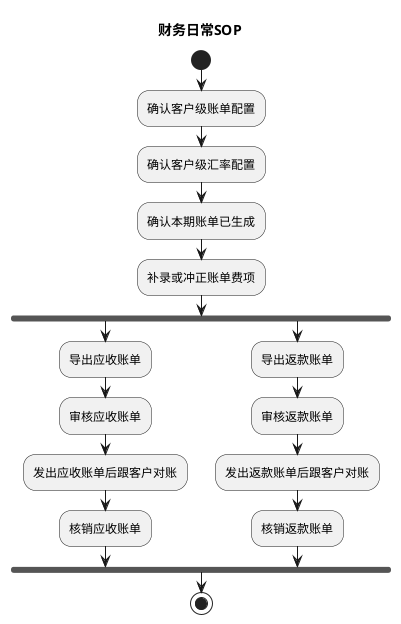

# 账单系统 PRD

> 本文件是《账单系统 PRD》多文件主库的主档，保留需求目的、总体方案、财务日常 SOP、成本中心入口、非功能与内部审计，并提供模块导航与共享规则索引。业务模块规则按章节归入模块档。

## 文档导航

| 模块文件 | 包含章节 | 模块回答的问题 |
| :--- | :--- | :--- |
| [07-客户级账单配置.md](PRD.账单系统/07-客户级账单配置.md) | 7 | 客户按什么规则出账与返款？配置版本与引用如何维护？ |
| [08-客户级汇率配置.md](PRD.账单系统/08-客户级汇率配置.md) | 8 | 基准与特调汇率如何维护，账单默认汇率如何命中并快照？ |
| [09A-账单生成-任务与费项入池.md](PRD.账单系统/09A-账单生成-任务与费项入池.md) | 9.1–9.2 | 任务由谁触发、何时创建成功、失败如何恢复？ |
| [09B-账单生成-执行规则.md](PRD.账单系统/09B-账单生成-执行规则.md) | 9.3–9.6 | 任务按哪套快照执行？来源数据如何入池并生成/重算账单？ |
| [09C-账单生成-状态与页面.md](PRD.账单系统/09C-账单生成-状态与页面.md) | 9.7–9.10 | 结果如何保存、状态如何流转、财务在哪里操作？ |
| [10-应收账单模块.md](PRD.账单系统/10-应收账单模块.md) | 10 | 应收账单如何形成、审核、结清与核销？ |
| [11-返款账单与回款管理.md](PRD.账单系统/11-返款账单与回款管理.md) | 11–12 | COD 返款与回款如何形成、结清并跟踪？ |
| [12-营收总览.md](PRD.账单系统/12-营收总览.md) | 13 | 店铺与客户的应收、已收、未收与逾期从哪里看？ |
| [15-金额汇兑与调账中心.md](PRD.账单系统/15-金额汇兑与调账中心.md) | 15–16 | 金额如何换算、锁定与核销？差异如何调账与冲正？ |
| [19A-业务参考-术语与系统基本面.md](PRD.账单系统/19A-业务参考-术语与系统基本面.md) | 19.1–19.2.2 | 术语、核心对象与费项支付方式（按需检索） |
| [19B-业务参考-来源表与归集窗口.md](PRD.账单系统/19B-业务参考-来源表与归集窗口.md) | 19.2.3–19.2.5 | OIS 来源表、重算窗口与广义签收（按需检索） |
| [19C-模板与资产库-导出邮件等.md](PRD.账单系统/19C-模板与资产库-导出邮件等.md) | 19.3–19.6 | 功能清单、辅助测试、邮件与导出模板（按需检索） |

## 共享规则与引用索引

| 共享规则/受控术语 | 唯一归属 | 主要消费方 |
| :--- | :--- | :--- |
| 配置编号、准确版本、引用与停用约束 | [07-客户级账单配置](PRD.账单系统/07-客户级账单配置.md) 7.2 | 08、09A–09C、10、11 |
| 账期定义与节奏 | [07-客户级账单配置](PRD.账单系统/07-客户级账单配置.md) 7.3 | 09A–09C、10、11 |
| 默认方案、分支方案与限定情形互斥算法 | [07-客户级账单配置](PRD.账单系统/07-客户级账单配置.md) 7.6–7.7 | 09B、10 |
| 基准汇率、特调汇率与账单生成命中快照 | [08-客户级汇率配置](PRD.账单系统/08-客户级汇率配置.md) 8.3–8.5 | 09B、15 |
| 任务创建、执行快照与收口结果 | [09A-账单生成-任务与费项入池](PRD.账单系统/09A-账单生成-任务与费项入池.md) 9.1–9.2、[09B-账单生成-执行规则](PRD.账单系统/09B-账单生成-执行规则.md) 9.3、[09C-账单生成-状态与页面](PRD.账单系统/09C-账单生成-状态与页面.md) 9.7 | 10、11、15 |
| BMS 费项池、入池条件与账单归属 | [09B-账单生成-执行规则](PRD.账单系统/09B-账单生成-执行规则.md) 9.4–9.5 | 09C、10、11、15 |
| 汇率快照、金额换算、多币种汇总与核销口径 | [15-金额汇兑与调账中心](PRD.账单系统/15-金额汇兑与调账中心.md) 15.3–15.7 | 08、10、11、12-营收总览 |
| 非功能约束（权限、一致性、幂等、精度等） | 主档 17 | 全部模块 |
| 内部审计记录与查询 | 主档 18 | 07、08、10、11、15 |
| 术语、核心对象关系与费项支付方式 | [19A-业务参考-术语与系统基本面](PRD.账单系统/19A-业务参考-术语与系统基本面.md) 19.1–19.2 | 全部模块 |
| 导出与邮件模板资产 | [19C-模板与资产库-导出邮件等](PRD.账单系统/19C-模板与资产库-导出邮件等.md) 19.5–19.6 | 10、11 |

## 1. 背景与目标

本 PRD 定义 BMS 账单管理系统的业务口径。BMS 实质上是财务系统的一大核心板块，重点承接客户应收、COD 返款、供应商收费核对、金额汇兑、账单核销和历史追溯，不等同于完整的财务系统。

系统目标如下：

1. 让财务能够按客户配置和账期稳定生成应收账单、返款账单，并登记、核对供应商提供的成本账单。
2. 让每张账单都有清晰的来源、金额、币种、状态和历史快照。
3. 让 `BMS费项池` 成为 BMS 内部数据归集的根基，应收账单、返款账单、成本账单的全部金额明细都必须从 `BMS费项池` 归集。
4. 让客户对账只看到客户需要核对的信息，让供应商收费核对和内部成本信息留在内部。
5. 让账单生成后的修正、冲正、核销和重跑都有明确边界，不靠删除或覆盖历史结果解决问题。

要实现以上目标，首先需要把当前财务链路中最容易造成口径不一致、结果不可追溯的问题说清楚。

## 2. 核心问题

当前主要问题集中在五个方面：

1. 账单线分散：应收账单、返款账单和供应商收费核对分别处理，财务难以从同一业务订单或尾程包裹追溯完整账务结果。
2. 配置口径分散：账期、履约节点、返款模式、币种、汇率和客户规则如果没有统一快照，账单生成结果会随配置变化产生歧义。
3. 来源金额不稳定：来源数据在进入 BMS 前可能仍会变化，系统必须明确可采集口径和最终金额口径。
4. 历史账单易被覆盖：账单进入审核、对账、核销或结清后，如果仍允许后续任务直接覆盖，会破坏客户确认、供应商核对和财务审计链路。
5. 对账边界不清：客户对账、供应商收费核对和内部经营分析关注的信息不同，导出、通知和页面展示必须区分客户可见信息与内部信息。

这些问题最终都会落到不同参与方的日常动作上，因此需要先说明谁会使用系统、各自关注什么，再说明系统要覆盖哪些业务场景。

## 3. 参与方与业务场景

BMS 围绕财务账单管理工作展开，同时需要让业务、客户和系统任务在同一账单口径下协作。

| 参与方 | 关注点 |
| :--- | :--- |
| 财务专员 | 维护配置、核对费用、审核账单、导出对账报表、登记核销结果。 |
| 财务主管 | 关注账单口径、异常差异、调账冲正、审核结果和历史留痕。 |
| 业务部 | 关注订单、包裹、线路、仓库、供应商和费项归属是否符合业务事实。 |
| 客户 | 接收应收账单或返款账单，核对金额并完成付款或返款确认。 |
| 系统任务 | 按配置读取来源数据、生成账单、锁定快照、记录状态和异常。 |

核心业务场景按阅读顺序理解如下：

1. 账前配置：财务先维护客户级账单配置和客户级汇率配置。
2. 客户应收：系统按配置归集客户应付费用，形成应收账单，审核后用于客户对账和收款核销。
3. COD 返款：系统按返款模式及对应的签收、回款事实形成返款账单，审核后用于客户返款确认和核销。
4. 供应商收费核对：财务用成本账单核对供应商给出的收费账单，并把收费结果沉淀为包裹和订单成本。
5. 差异处理：账单生成后发现差异时，通过补录、调账、冲正、反核销或后续账单承接，不直接改写已生效结果。
6. 历史追溯：所有关键配置、金额、汇率、核销和调整动作都保留快照和操作轨迹。

明确参与方和业务场景后，下一步需要限定本 PRD 负责解决哪些问题，以及哪些问题不在本期范围内展开。

## 4. 范围与边界

### 4.1 需求范围内

本 PRD 覆盖以下能力：

1. 客户级账单配置、客户级汇率配置及其版本快照。
2. 来源数据同步、费项池、客户侧费项索引、成本费项索引和账单生成机制。
3. 应收账单、返款账单的生成、审核、结清，以及成本账单的登记、成本处理、结清、查询和追溯。
4. 账单重跑、账单侧重算、补录、调账、冲正、反核销和后续账单承接。
5. 金额汇兑、币种汇总、核销约束和客户对账报表导出。
6. 权限、审计、幂等、异常恢复、数据安全和测试环境辅助能力。

### 4.2 需求范围外

本 PRD 不覆盖以下内容：

1. 不重写 OIS、OMS、WMS、TMS 的基础履约逻辑。
2. 不重新计算上游订单报价，只读取和快照来源数据中已经形成的业务事实。
3. 不展开供应商付款审批、发票管理、税务处理、总账凭证和企业级会计分录。
4. 不把内部成本、内部汇率来源、系统审计字段输出给客户。
5. 不把跨币种自动抵扣作为 V1 默认能力。

范围明确之后，本章从系统视角说明整体方案：账单链路如何组织，三类账单如何分工，以及所有后续章节共同遵守哪些原则。

## 5. 总体方案

系统总体采用“先配置、再采集、再生成、再审核对账、最后核销和留痕”的顺序组织。后续章节分别展开这条主链路上的具体规则。

### 5.1 总体链路

BMS 账单管理主链路如下：

| 阶段 | 目标 | 主要落点 |
| :--- | :--- | :--- |
| 前置配置 | 明确客户出账规则、返款规则和默认汇率。 | <a href="PRD.账单系统/07-客户级账单配置.md#section-7">7. 客户级账单配置</a>、<a href="PRD.账单系统/08-客户级汇率配置.md#section-8">8. 客户级汇率配置</a> |
| 来源准备 | 把稳定后的来源费项进入 `BMS费项池`；`BMS费项池` 是应收账单、返款账单、成本账单全部金额明细的统一归集根基。 | <a href="PRD.账单系统/09B-账单生成-执行规则.md#section-9-5">9.5 第四步：来源费用怎样变成BMS费项？</a>、<a href="PRD.账单系统/19A-业务参考-术语与系统基本面.md#section-19-2">19.2 业务系统基本面</a> |
| 账单生成 | 按配置快照和来源数据生成账单结果。 | <a href="PRD.账单系统/09A-账单生成-任务与费项入池.md#section-9">9. 账单生成/重算机制</a> |
| 账单处理 | 按账单类型完成审核、对账、核销和供应商收费核对。 | <a href="PRD.账单系统/10-应收账单模块.md#section-10">10. 应收账单模块</a>、<a href="PRD.账单系统/11-返款账单与回款管理.md#section-11">11. 返款账单模块</a>、<a href="./PRD.成本中心.md">《成本中心 PRD》</a> |
| 金额处理 | 锁定币种、汇率、金额快照和核销口径。 | <a href="PRD.账单系统/15-金额汇兑与调账中心.md#section-15">15. 金额汇兑</a> |
| 差异闭环 | 对错误、遗漏、客户异议和历史差异做可追溯处理。 | <a href="PRD.账单系统/15-金额汇兑与调账中心.md#section-16">16. 调账中心</a>、<a href="#section-17">17. 非功能需求</a> |

### 5.2 账单类型

三类账单的业务目的不同，不能互相替代：

三类账单的金额明细来源必须一致：应收账单、返款账单、成本账单的全部金额明细均归集自 `BMS费项池`。各账单模块只负责在 `BMS费项池` 基础上按自身业务目的做分流、汇总和后续处理；应收账单、返款账单按客户账单流程审核与核销，成本账单按供应商账单流程进行成本处理与结清。

| 类型 | 面向对象 | 业务目的 | 详见 |
| :--- | :--- | :--- |
| 应收账单 | 客户 | 核对客户应向我方支付的费用，并完成收款核销。 | <a href="PRD.账单系统/10-应收账单模块.md#section-10">10. 应收账单模块</a> |
| 返款账单 | 客户 | 核对 COD 货款应返金额、扣减项和返款结果。 | <a href="PRD.账单系统/11-返款账单与回款管理.md#section-11">11. 返款账单模块</a> |
| 成本账单 | 供应商 / 内部财务 | 核对供应商给出的收费账单，并沉淀包裹和订单成本。 | <a href="./PRD.成本中心.md">《成本中心 PRD》</a> |

### 5.3 设计原则

1. 配置先行：账单生成必须先读取客户级账单配置、客户级汇率配置和来源数据快照。
2. 费项池归集：三类账单的全部金额明细必须先进入 `BMS费项池`，不得绕过 `BMS费项池` 直接生成账单金额。
3. 快照优先：账单一旦形成关键结果，必须保留配置、金额、币种、汇率和操作快照。
4. 类型分流：应收账单、返款账单和成本账单按各自业务目的处理，具体分流规则在对应账单模块展开。
5. 历史保护：应收账单、返款账单在审核后不得被静默覆盖；成本账单形成后不得被来源数据静默覆盖，已结清成本账单只能通过<a href="PRD.账单系统/15-金额汇兑与调账中心.md#section-16">16. 调账中心</a>形成成本金额冲正或成本核销冲正，且不得返结清。
6. 差异留痕：补录、调账、冲正、反核销和重跑都必须保留触发原因、影响范围和处理结果。
7. 信息分层：客户对账只输出客户可核对的信息；供应商收费核对、内部成本、内部汇率来源和系统审计信息不得对客户暴露。

系统视角的链路明确后，还需要把同一条链路翻译成财务每天能执行的操作顺序。

## 6. 财务日常SOP

本章只描述财务从确认客户配置到完成账单核销的日常操作。应收账单和返款账单共用账前准备环节，进入账单处理后可以并行推进。

### 6.1 SOP目标

1. 让财务按稳定顺序完成配置确认、账单费项处理、导出、审核、客户对账和核销。
2. 让应收账单和返款账单可以同时处理，两条账单线互不等待。
3. 让特定场景的处理完成后能回到明确的主流程节点，不依赖线下记忆继续推进。

### 6.2 执行原则

1. 配置先行：先确认客户级账单配置和客户级汇率配置，再进入本期账单处理。
2. 先处理费项：确认本期账单已生成后，财务先补录或调整账单费项，再分别处理应收账单和返款账单。
3. 先导出再审核：导出的账单用于财务核对；财务确认账单内容无误后再审核。
4. 审核后发出：账单只有审核通过后才能发给客户并进入客户对账。
5. 双线并行：应收和返款分别按各自的导出、审核、客户对账和核销进度处理，一条账单线未完成不得阻塞另一条。
6. 结果留痕：账单金额或核销有误时，按重算、调账、冲正或后续账单承接规则处理，不删除或覆盖已生效历史。
7. 状态约束：已向客户发出的账单不得作废或替换生成；已结清账单不得返核销，核销差错通过核销记录冲正处理。

### 6.3 每日按什么顺序处理？

| 环节 | 财务动作 | 关注重点 | 输出 |
| :--- | :--- | :--- | :--- |
| 配置确认 | 依次确认客户级账单配置和客户级汇率配置。 | 配置是否完整，是否与客户约定一致。 | 本期账单采用的配置口径 |
| 账单确认 | 确认本期应处理的账单已经生成。 | 账单范围、账期和采用的配置是否符合预期。 | 已生成的本期账单 |
| 费项处理 | 补录或调整账单费项。 | 费项、金额、币种、汇率、扣减项和冲正结果是否完整、准确。 | 可供导出核对的账单 |
| 账单导出 | 分别导出应收账单和返款账单。 | 导出内容是否完整，金额汇总是否与账单一致。 | 应收账单 / 返款账单导出文件 |
| 账单审核 | 分别审核应收账单和返款账单。 | 账单是否可以正式发给客户；未收口账单是否确需截断账期。 | 已审核账单 |
| 客户对账 | 发出已审核账单并跟客户对账。 | 客户是否收到正确版本，异议是否已记录和处理。 | 客户确认结果 / 待处理异议 |
| 账单核销 | 分别核销应收账单和返款账单。 | 实际收款或返款、未结金额、差额及汇兑损益是否清楚。 | 应收账单 / 返款账单核销结果 |

### 6.4 主流程与子流程

主流程以“配置确认 → 账单生成确认 → 费项处理 → 分线导出、审核、客户对账和核销”为固定顺序。应收账单和返款账单在同一个 `fork` 中并行，表示两条账单线可以同时推进，不表示必须同时完成。子流程只在配置变更、账单有误、客户异议或资金差异等特定场景下触发。

#### 6.4.1 主流程

客户只启用应收或返款其中一类配置时，只执行对应分支；两类配置同时启用时，两条分支并行推进。账单生成与重算的适用边界见<a href="PRD.账单系统/09A-账单生成-任务与费项入池.md#section-9">9. 账单生成/重算机制</a>，应收和返款的具体处理规则分别见<a href="PRD.账单系统/10-应收账单模块.md#section-10">10. 应收账单模块</a>、<a href="PRD.账单系统/11-返款账单与回款管理.md#section-11">11. 返款账单模块</a>。

#### 6.4.2 哪些情况才进入子流程？

子流程只在特定场景下触发，不进入主流程的必经节点。子流程处理完成后，应回到配置确认、账单确认、费项处理、账单导出、客户对账或账单核销中的对应节点继续主流程。

| 子流程 | 触发场景 | 财务动作 | 回到主流程的位置 |
| :--- | :--- | :--- | :--- |
| 配置新建 / 变更 | 新客户启用账单，或现有客户的账期、账单范围、返款规则、币种或汇率口径变更。 | 维护配置，确认生效时间、适用范围及对已有待审核账单的影响。 | 配置确认 |
| 提前生成 / 提前收口 | 财务需要在账期结束前提前查看或向客户发出账单。 | 选择`账单生成`；需提前审核时，确认截断后的实际账期范围。 | 账单确认 |
| 待审核账单重新生成 | 账单配置已变更，或账期结束前已生成账单但来源费用又发生变化。 | 对从未发出的`待审核`账单选择`账单生成`，由系统判定补充生成或替换生成；已发出账单不得使用该方式。 | 账单确认 |
| 账单重算 | 不增加新的来源费项，只需将已有账单的汇率调整、调账或冲正结果重新计算。 | 选择`账单重算`，完成后重新确认和处理账单费项。 | 费项处理 |
| 费项或金额缺失 | 账单费项处理或审核时发现费项、扣减项、返款金额或必要的订单信息不完整。 | 暂停后续处理；补录或来源结果完整后，再选择账单生成或重算。 | 费项处理 |
| 审核未通过 | 账单金额或明细有误，或关联冲正尚未全部审核通过。 | 驳回并记录原因；修正账单费项后重新导出和审核。 | 费项处理 |
| 客户异议 | 客户收到账单后，对金额、费项、扣减项、回款或返款口径提出异议。 | 记录异议，按账单状态进入重算、调账、冲正或后续账单承接；需要形成新版本时，重新导出、审核并发给客户。 | 费项处理 / 账单导出 / 客户对账 |
| 通知失败 / 未配置邮箱 | 账单审核通过后，`通知状态`为`通知失败`或`未配置邮箱`。 | 确认客户邮箱配置并重新发送；不得因通知失败重新生成账单。 | 客户对账 |
| 部分结清 / 金额差异 | 客户部分付款、财务向客户部分返款，或实际金额与账单待结清金额不一致。 | 登记实际资金结果，按部分核销、超额、差额和汇兑损益口径处理。 | 账单核销 |
| 核销错误 | 已结清账单的核销记录有误。 | 发起核销记录冲正；不返核销、不改写原核销记录。 | 账单核销 |
| 导出字段定制 | 客户要求在默认对账报表外追加辅助核对字段。 | 按<a href="PRD.账单系统/19C-模板与资产库-导出邮件等.md#section-19-6">19.6 对账报表导出格式</a>处理，追加字段不得改变账单金额口径。 | 账单导出 |

财务 SOP 确定了配置确认、费项处理、账单导出、审核、客户对账和核销的操作顺序。其中配置确认需要稳定的客户出账和返款口径，下一章继续定义客户级账单配置。

## 14. 成本中心

成本中心已拆分为独立需求文档，完整需求见<a href="./PRD.成本中心.md">《成本中心 PRD》</a>。本章仅作为财务系统总 PRD 的模块入口；成本中心与金额汇兑、调账、非功能需求和内部审计的跨模块约束，继续分别承接<a href="PRD.账单系统/15-金额汇兑与调账中心.md#section-15">15. 金额汇兑</a>、<a href="PRD.账单系统/15-金额汇兑与调账中心.md#section-16">16. 调账中心</a>、<a href="#section-17">17. 非功能需求</a>和<a href="#section-18">18. 内部审计</a>。

## 17. 非功能需求

非功能需求约束的是系统在所有账单模块中的横向表现。它不重新定义业务规则，但必须保证账单生成、审核、核销、调账、导出和追溯过程稳定、可控、可复盘。

### 17.1 权限与职责边界

1. 系统必须按角色控制配置、生成、审核、发送、核销、反核销、调账、冲正、导出和回款管理等操作。
2. 同一笔业务操作应区分提交人、审核人、核销人和查询人；需要审核的动作不得由同一角色绕过审核直接生效。
3. 待审核、待结清、已结清等状态下的可执行操作必须与各章节状态机一致，页面按钮、批量操作和接口入口都必须遵守同一权限口径。
4. 无权限操作必须给出明确提示，并记录拦截结果；不得仅隐藏入口而缺少服务端校验。
5. 导出权限应单独控制。能查看账单不代表一定能导出客户对账报表或内部审计信息。
6. 成本中心应分别控制供应商档案维护、成本费项索引维护、导入设置快照中的费项映射维护、供应商账单导入、单号关系维护、成本类型切换、成本归属、分摊规则维护、分摊执行、结清登记、成本调账、利润查看和内部成本导出权限，不得用单一“成本中心管理”权限覆盖全部高风险操作。
7. 成本金额冲正、成本核销冲正、分摊规则变更和`成本已齐`确认应区分提交人与审核或确认人；同一人员是否允许兼任由角色权限明确配置，不得由页面临时放开。

### 17.2 数据一致性与防回写

1. 已进入审核、待结清或已结清阶段的账单，不得被后续配置变更、汇率变更、源数据变化或重跑任务直接回写。
2. 已被 `BMS费项池` 成功采集的来源金额，不允许在数据源侧直接删除或覆盖；修正必须通过补录、调账、冲正或后续账单承接。
3. 源数据行级标记、账单明细、金额汇总、核销流水和调账记录之间必须保持一致；任一环节失败时，不得出现只更新部分结果的状态。
4. 同一来源费项只能按业务用途进入对应账单线。返款扣减项被返款账单占用后，应收账单不得再次把该金额作为可核销应收金额。
5. 账单结清后触发的支付状态同步，只能更新支付状态，不得改写费项金额、币种、汇率、账单快照或历史核销结果。

### 17.3 幂等、并发与恢复保护

本节只定义系统横向保护要求，不重复定义账单重跑的业务分流规则；具体重跑路径和状态边界见<a href="PRD.账单系统/09A-账单生成-任务与费项入池.md#section-9">9. 账单生成/重算机制</a>。

1. 账单生成、失败重试、补跑、重跑、金额重算、导入和核销动作必须具备幂等保护，重复触发不得生成重复账单、重复明细、重复核销或重复调账结果。
2. 同一客户、同一账期、同一账单类型和同一方案标识的账单生成流程不得并发执行；多个客户是否引用同一配置不扩大并发锁范围。已有任务执行中时，后续任务应提示被占用或排队处理。
3. 源数据被任务锁定期间，不得被其它任务重复采集；锁定失败、任务中断或执行超时必须有可恢复处理。
4. 一般批量操作应保证每条记录的成功、失败和失败原因可见，不能用整体成功掩盖部分失败；<a href="./PRD.成本中心.md">《成本中心 PRD》5. 成本费项标准化与供应商账单导入</a>按整批原子规则处理，只允许完全成功或失败，不适用部分成功口径。
5. 重跑或重算后的结果必须能与原账单结果、来源快照和操作原因关联，避免财务无法解释金额变化；具体记录要求见<a href="PRD.账单系统/09C-账单生成-状态与页面.md#section-9-10">9.10 最后一道防线：操作前预览，操作后留痕</a>。

### 17.4 金额、币种与精度

1. 所有金额展示、汇总、核销和导出必须明确金额所属币种，不得把不同结算币种金额混合成单一余额。
2. 原始币种金额、费项结算币种金额、货款结算币种金额、财务本位币金额和汇兑损益必须按<a href="PRD.账单系统/15-金额汇兑与调账中心.md#section-15">15. 金额汇兑</a>的口径计算与展示。
3. 汇率一旦在账单侧锁定，后续市场汇率、基准汇率表、特调配置版本或客户引用变化不得自动影响历史账单金额。
4. 金额计算应保持明细、币种分桶汇总、账单总览、核销余额和导出结果一致。
5. 负数、超收、超返、部分核销和跨账期冲正必须有明确提示，不能只在后台形成异常状态。

### 17.5 对账导出与信息边界

1. `导出给客户`面向客户与财务对账，不是系统审计报表；导出内容只保留客户核对账单结果所需的信息。
2. 应收账单和返款账单的客户导出必须按对账报表整合格式输出账单基本信息、结算币种分桶金额汇总、账单明细和往期账单冲正信息。
3. 客户导出文件不得包含内部任务状态、内部快照版本、内部审批意见、源数据锁定标记、系统审计字段或客户不需要关注的技术字段。
4. 客户要求追加字段时，只允许追加订单费用报表中可用于识别、筛选或辅助核对的非金额字段；不得追加会造成金额口径混乱的原始金额、内部汇率或内部结算字段。
5. 应收账单的`导出给内部`只汇总所选账单的费项明细和对应账单基本信息，不输出客户告示、客服二维码、收款账户、收款二维码、账单汇总或往期账单冲正 Sheet，也不得用于向客户发送账单。
6. 两种导出结果均必须与任务创建时固化的当前生效账单结果一致；历史快照只用于系统内审计、追溯和防回写判断，不作为导出对象。

### 17.6 可用性与操作体验

1. 财务日常高频页面应围绕账期、客户、账单状态、审核状态、核销状态、回款状态和异常状态提供清晰筛选。
2. 列表、详情、金额汇总、明细区和核销记录之间的字段命名必须一致，避免同一含义在不同页面使用不同名称。
3. 关键动作必须在提交前展示影响范围，例如影响的账单、费项、金额、币种、核销结果和是否会产生调账或冲正。
4. 审核、核销、反核销、重跑、折返审核、批量移除和批量导出等高风险动作必须有二次确认或明确结果反馈。
5. 页面异常提示应使用财务能理解的业务语言，说明失败原因、影响范围和下一步处理方式。
6. 表格中的客户、账单、任务、回款或报价归属关系字段统一显示为`所属店铺`和`所属客户组`，避免与可编辑对象混淆；查询筛选条件和分配向导的选客方式仍可简写为`店铺`和`客户组`。

### 17.7 异常恢复与告警

1. BMS任务因技术原因执行异常时，系统必须自动重试，不得要求财务介入技术恢复过程。自动重试期间任务保持`执行中`，达到重试上限后直接进入`执行失败`。
2. 每次自动重试必须记录任务编号、失败阶段、失败原因、重试时间和重试结果，并保证同一任务不会产生重复账单、重复费项或重复调整结果。
3. `执行失败`任务必须展示财务可以识别的失败阶段和结果。技术问题解决后，账单生成和账单重算任务可以按原任务执行快照重新执行；费项入池任务由系统内部恢复。系统不得提供人工继续执行一个尚处于`执行中`的任务入口。
4. 客户级账单配置和客户级汇率配置必须在保存、确认或启用时完成完整性、合法性和冲突校验。校验不通过时必须阻断操作，不得把可提前识别的配置问题延迟到任务执行阶段。
5. 任务执行阶段若仍发现账单配置或汇率配置数据不一致，应进入`执行失败`并产生内部告警，不得要求财务在任务页面临时修正后继续原任务。
6. 导入、核销、导出和支付状态同步失败时，系统必须记录失败原因，并按对应业务权限提供重试或纠错入口。
7. 已完成的账单结果不得因后续异常被自动撤销；需要修正时，应按状态机、调账或冲正规则处理。

### 17.8 数据安全与信息保护

1. 系统应按客户、角色和业务范围控制数据可见性，防止不同客户账单、订单、回款和返款信息被越权查看。
2. 客户对账报表只输出客户可见信息；内部配置、内部审核、内部成本、内部汇率来源和系统审计字段不得向客户暴露。
3. 下载、导出和批量查询应记录操作人、时间、条件和文件类型，便于追溯敏感数据流向。
4. 敏感操作产生的日志应可用于审计，但不得在普通页面暴露不必要的内部实现细节。
5. 历史账单、快照、核销流水和调账记录应按财务审计要求保留，删除或归档策略不得破坏账单追溯链路。

## 18. 内部审计

内部审计用于集中查询 BMS 中影响账单金额、成本归属、结清结果和客户对账结果的关键操作。审计记录只用于内部追溯，不进入客户邮件或对账报表；普通业务页面可以展示与当前对象直接相关的操作记录，但不得允许修改审计内容。

### 18.1 审计范围

以下操作必须形成审计记录：

1. 账单配置及版本发布、另存为新配置、客户分配与强制切换、配置准确版本账单生成批次提交、基准汇率表、特调配置及版本发布、客户分配与强制切换、账单内锁定汇率、客户侧费项索引、成本费项索引、间接成本分摊规则、导入设置快照中的费项映射、场景取值规则、数据源规则和供应商财务档案变更。
2. 账单生成批次的范围冻结和逐项创建结果、账单首次生成、补充生成、替换生成、期末收口、失败重试、金额重算、审核、驳回、发送、作废、核销、核销记录冲正、调账、冲正和导出。
3. 供应商账单导入、导入失败、疑似重复确认、成本账单结清登记、成本金额冲正、成本核销冲正和成本核销汇率锁定。
4. 供应商侧单号关系新增、修改、停用，以及成本明细在直接成本和间接成本之间切换。
5. 间接成本分摊集形成、处理方式确认或变更、不分摊原因、拆分、合并、成本明细加入或移出、分摊集规则变更、对象范围变更、分摊因子变更、执行分摊、版本生效和版本失效。
6. 业务订单`成本已齐`确认、退回`成本未齐`和由晚到成本或分摊重算触发的利润重算。

### 18.2 审计记录内容

1. 每条记录至少包含业务模块、操作对象类型、操作对象编号、操作类型、操作人、操作时间、操作原因、前值快照、后值快照和执行结果。
2. 涉及账单生成批次、账单、任务、订单、尾程包裹、成本明细、间接成本分摊集或调账时，应保存相应关联编号；批次审计还须保存配置编号及准确版本、冻结客户与方案范围、创建任务、跳过范围和原因，使财务能够沿业务链路追溯。
3. 系统自动触发的操作应把操作主体标记为`系统`，同时记录触发来源和关联业务操作，不得伪装为某个财务人员操作。
4. 操作失败或被系统阻断时，也应记录失败原因和阻断规则；失败记录不得写入虚假的业务后值。
5. 历史快照、金额快照、汇率快照、核销流水和分摊版本只允许追加或生成新版本，不允许静默覆盖。

### 18.3 成本中心专项审计

1. 成本类型切换应记录原成本类型、目标成本类型、原归属对象、原分摊集、目标归属方式、切换依据和受影响订单。
2. 成本明细因规则或分摊集键变化从一个分摊集迁移到另一个分摊集时，应记录原分摊版本失效和新分摊版本生效的完整过程，证明该成本没有被重复分摊。
3. 分摊规则变更应保存成本费项索引、成本板块、适用供应商、供应商收费单位、范围锚点、候选订单条件、业务订单清单、优先与兜底分摊因子、例外处理规则、分摊集币种与金额、尾差处理及变更前后结果。
4. 成本完整性记录应说明财务确认`成本已齐`时检查的应有成本范围、未决明细数量、分摊完成情况和汇率锁定情况；自动退回`成本未齐`时应记录触发原因。
5. 成本核销汇率记录应按币种保存汇率、汇兑方向、确认时间、结清记录和人民币金额；后续汇率配置变化不得修改已锁定记录。
6. 成本归属或分摊变化引起暂估实际利润、实际利润变化时，应记录受影响订单、变更前后利润和重算依据，但不得把利润变化写回客户侧账单。
7. 已结清成本账单的金额冲正应记录原成本账单、原成本明细、冲正金额、新成本调整记录和受影响订单；核销冲正应记录原核销流水、反向流水、正确流水和各自汇率快照。
8. 成本账单不允许返结清。任何试图修改或删除已结清状态、原结清流水或锁定汇率的操作都应被阻断，并记录操作人、操作时间、目标对象和阻断原因。

### 18.4 查询与权限

1. `内部审计`菜单仅对具有审计查询权限的财务管理人员开放；审计记录不得编辑或删除。
2. 支持按业务模块、操作对象、客户、供应商、账单号、主订单号、尾程运单号、成本明细号、分摊集编号、调账记录号、操作人、操作类型和时间范围组合查询。
3. 审计详情应并列展示前值与后值，并提供关联对象跳转；涉及多币种金额时按币种分桶展示。
4. 导出审计结果应受独立权限控制，并记录导出条件、导出人、导出时间和文件结果。
5. 审计记录的保留、归档和查询性能应满足财务审计周期要求，归档后仍不得破坏账单、成本和分摊版本的追溯链路。

