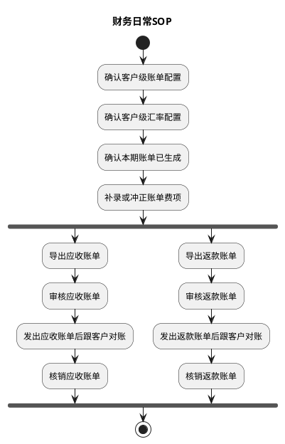

# 第002篇

> 本篇定位：财务日常SOP；主要内容：财务日常SOP；文档角色：模块档；文档ID：C108D6E5CA

## 1. 财务日常SOP

本章只描述财务从确认客户配置到完成账单核销的日常操作。应收账单和返款账单共用账前准备环节，进入账单处理后可以并行推进。

### 1.1 SOP目标

1. 让财务按稳定顺序完成配置确认、账单费项处理、导出、审核、客户对账和核销。
2. 让应收账单和返款账单可以同时处理，两条账单线互不等待。
3. 让特定场景的处理完成后能回到明确的主流程节点，不依赖线下记忆继续推进。

### 1.2 执行原则

1. 配置先行：先确认客户级账单配置和客户级汇率配置，再进入本期账单处理。
2. 先处理费项：确认本期账单已生成后，财务先补录或调整账单费项，再分别处理应收账单和返款账单。
3. 先导出再审核：导出的账单用于财务核对；财务确认账单内容无误后再审核。
4. 审核后发出：账单只有审核通过后才能发给客户并进入客户对账。
5. 双线并行：应收和返款分别按各自的导出、审核、客户对账和核销进度处理，一条账单线未完成不得阻塞另一条。
6. 结果留痕：账单金额或核销有误时，按重算、调账、冲正或后续账单承接规则处理，不删除或覆盖已生效历史。
7. 状态约束：已向客户发出的账单不得作废或替换生成；已结清账单不得返核销，核销差错通过核销记录冲正处理。

### 1.3 每日按什么顺序处理？

| 环节 | 财务动作 | 关注重点 | 输出 |
| :--- | :--- | :--- | :--- |
| 配置确认 | 依次确认客户级账单配置和客户级汇率配置。 | 配置是否完整，是否与客户约定一致。 | 本期账单采用的配置口径 |
| 账单确认 | 确认本期应处理的账单已经生成。 | 账单范围、账期和采用的配置是否符合预期。 | 已生成的本期账单 |
| 费项处理 | 补录或调整账单费项。 | 费项、金额、币种、汇率、扣减项和冲正结果是否完整、准确。 | 可供导出核对的账单 |
| 账单导出 | 分别导出应收账单和返款账单。 | 导出内容是否完整，金额汇总是否与账单一致。 | 应收账单 / 返款账单导出文件 |
| 账单审核 | 分别审核应收账单和返款账单。 | 账单是否可以正式发给客户；未收口账单是否确需截断账期。 | 已审核账单 |
| 客户对账 | 发出已审核账单并跟客户对账。 | 客户是否收到正确版本，异议是否已记录和处理。 | 客户确认结果 / 待处理异议 |
| 账单核销 | 分别核销应收账单和返款账单。 | 实际收款或返款、未结金额、差额及汇兑损益是否清楚。 | 应收账单 / 返款账单核销结果 |

### 1.4 主流程与子流程

主流程以“配置确认 → 账单生成确认 → 费项处理 → 分线导出、审核、客户对账和核销”为固定顺序。应收账单和返款账单在同一个 `fork` 中并行，表示两条账单线可以同时推进，不表示必须同时完成。子流程只在配置变更、账单有误、客户异议或资金差异等特定场景下触发。

#### 1.4.1 主流程

客户只启用应收或返款其中一类配置时，只执行对应分支；两类配置同时启用时，两条分支并行推进。账单生成与重算的适用边界见[账单生成/重算机制](PRD.账单系统.第007篇.BMS任务生命周期与操作.D94FE560DB.md#doc-D94FE560DB-task-lifecycle-48b1e1bb)，应收和返款的具体处理规则分别见[应收账单模块](PRD.账单系统.第011篇.应收账单.88A604AED3.md#doc-88A604AED3-receivable-bill-b1671b99)、[返款账单模块](PRD.账单系统.第012篇.返款账单.A4A4EF02F0.md#doc-A4A4EF02F0-refund-bill-09993f61)。

#### 1.4.2 哪些情况才进入子流程？

子流程只在特定场景下触发，不进入主流程的必经节点。子流程处理完成后，应回到配置确认、账单确认、费项处理、账单导出、客户对账或账单核销中的对应节点继续主流程。

| 子流程 | 触发场景 | 财务动作 | 回到主流程的位置 |
| :--- | :--- | :--- | :--- |
| 配置新建 / 变更 | 新客户启用账单，或现有客户的账期、账单范围、返款规则、币种或汇率口径变更。 | 维护配置，确认生效时间、适用范围及对已有待审核账单的影响。 | 配置确认 |
| 提前生成 / 提前收口 | 财务需要在账期结束前提前查看或向客户发出账单。 | 选择`账单生成`；需提前审核时，确认截断后的实际账期范围。 | 账单确认 |
| 待审核账单重新生成 | 账单配置已变更，或账期结束前已生成账单但来源费用又发生变化。 | 对从未发出的`待审核`账单选择`账单生成`，由系统判定补充生成或替换生成；已发出账单不得使用该方式。 | 账单确认 |
| 账单重算 | 不增加新的来源费项，只需将已有账单的汇率调整、调账或冲正结果重新计算。 | 选择`账单重算`，完成后重新确认和处理账单费项。 | 费项处理 |
| 费项或金额缺失 | 账单费项处理或审核时发现费项、扣减项、返款金额或必要的订单信息不完整。 | 暂停后续处理；补录或来源结果完整后，再选择账单生成或重算。 | 费项处理 |
| 审核未通过 | 账单金额或明细有误，或关联冲正尚未全部审核通过。 | 驳回并记录原因；修正账单费项后重新导出和审核。 | 费项处理 |
| 客户异议 | 客户收到账单后，对金额、费项、扣减项、回款或返款口径提出异议。 | 记录异议，按账单状态进入重算、调账、冲正或后续账单承接；需要形成新版本时，重新导出、审核并发给客户。 | 费项处理 / 账单导出 / 客户对账 |
| 通知失败 / 未配置邮箱 | 账单审核通过后，`通知状态`为`通知失败`或`未配置邮箱`。 | 确认客户邮箱配置并按[账单邮件](PRD.账单系统.第018篇.账单通知.F82B342382.md#doc-F82B342382-bill-email)重新发送；不得因通知失败重新生成账单。 | 客户对账 |
| 部分结清 / 金额差异 | 客户部分付款、财务向客户部分返款，或实际金额与账单待结清金额不一致。 | 登记实际资金结果，按部分核销、超额、差额和汇兑损益口径处理。 | 账单核销 |
| 核销错误 | 已结清账单的核销记录有误。 | 发起核销记录冲正；不返核销、不改写原核销记录。 | 账单核销 |
| 导出字段定制 | 客户要求在默认对账报表外追加辅助核对字段。 | 按[对账报表导出格式](PRD.账单系统.第017篇.账单导出.29F2A66D22.md#doc-29F2A66D22-notification-export-c1ad8a3c)处理，追加字段不得改变账单金额口径。 | 账单导出 |

财务 SOP 确定了配置确认、费项处理、账单导出、审核、客户对账和核销的操作顺序。其中配置确认需要稳定的客户出账和返款口径，下一章继续定义客户级账单配置。
