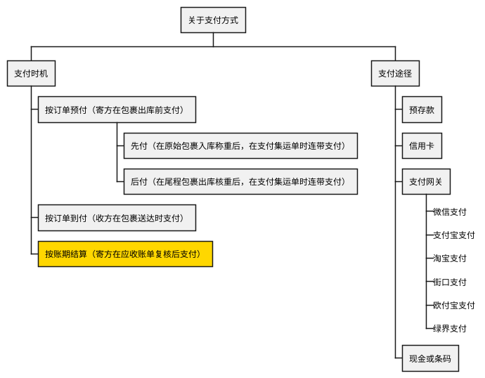
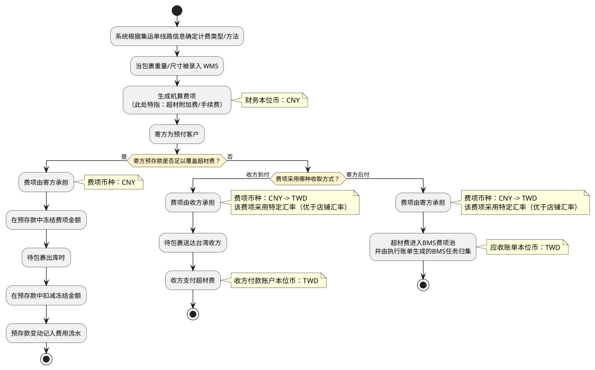
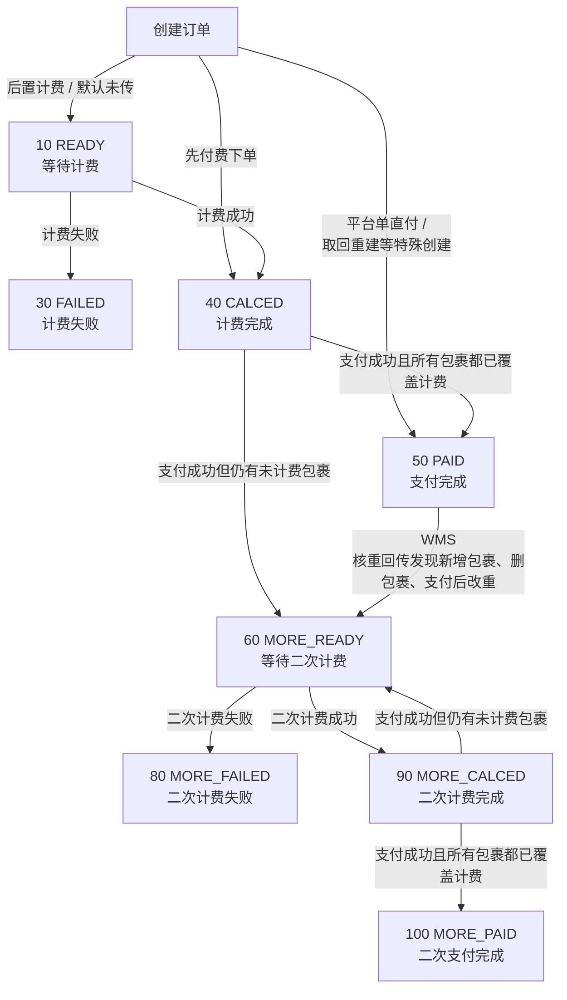

# 第003篇

> 本篇定位：业务系统基本面；主要内容：核心对象关系、费项支付方式、费项重算窗口与广义签收；文档角色：共享规则档；文档ID：A231A39E11

## 1. 业务系统基本面

本节记录当前业务系统（OIS）已经形成的基础事实，账单配置、账单生成规则、以及数据同步均以此为前提。OIS 主要由 OMS、WMS、TMS 构成。

### 1.1 核心对象关系

#### 1.1.1 提及原因

BMS 的账单配置、账单生成、对账和核销都建立在 OIS 已有业务对象之上。系统并不是直接面对一张孤立订单，而是沿着`供应链 -> 店铺 -> 客户 / 会员 -> 集运单`这条业务链路识别费用归属；客户组是店铺内对客户 / 会员进行归集的分组。

本节参考`系统核心对象关系图`，并结合现有系统实现完成核对后，将核心对象关系沉淀为产品口径。后续涉及客户级账单配置、客户级汇率配置、费项归集、对账报表和核销时，都应沿用本节定义的对象边界。

#### 1.1.2 核心关系概览

OIS 的核心对象关系可以理解为三层：

1. 资源层：供应链、店铺、客户组、客户 / 会员、集运仓。
2. 产品层：物流渠道 / 尾程承运商、线路报价。
3. 执行层：集运单。

其中，供应链是最上层组织，店铺是对外经营入口，客户组是店铺内归集客户 / 会员的分组关系。客户与会员是同一业务主体：WMS 从货主关系称为客户或货主，集运客门户从账号关系称为会员。集运仓是履约节点，物流渠道和线路报价决定订单采用的运输服务与报价基础，集运单是费用归集和账单生成的核心执行对象。

#### 1.1.3 对象关系说明

| 对象 | 产品含义 | 与账单的关系 |
| :--- | :--- | :--- |
| 供应链 | 可理解为一个跨境物流集团或经营组织，是店铺、仓库、客户和物流产品的上层归属。 | BMS 的账单数据必须在供应链范围内隔离，不能跨供应链归集费用或核销款项。 |
| 店铺 | 面向客户经营的服务入口，可配置独立域名、服务客群、启用仓库、物流产品和差异化汇率。 | 店铺决定订单从哪个经营入口产生，用于账单归集与筛选、配置分配向导选客、店铺汇率兜底和对账报表归属；不参与账单配置或特调配置的运行时分级命中。 |
| 客户组 | 在店铺内创建的客户 / 会员归集分组，即集运客门户中的子账号分组。一个店铺可创建多个客户组，一个客户组可包含多个会员；一个会员在同一时点至多从属其所属店铺下的一个客户组，不得加入其它店铺的客户组。 | 客户组用于查询、报表归集和配置分配向导选客。BMS 只读取订单及客户主数据已沉淀的客户组，不重新划分客户组，也不按客户组动态决定配置引用。 |
| 客户 / 会员 | 同一业务主体在不同系统语境下的称谓。WMS 从货主关系称为客户或货主，使用客户编码；集运客门户从账号关系称为会员，使用会员编码。客户主数据与会员身份一一对应，一个会员在同一时点只能从属一个店铺。 | 客户 / 会员是订单下单、财务对账、合同和配置引用的共同主体。BMS 同时保留客户编码和会员编码，用于跨系统定位同一主体；不得把会员当作客户下的另一层多账号对象。客户编码由系统自动生成，固定采用`OG`加 4 位数字的格式（如`OG4155`），演示数据中的客户编号统一使用该格式。 |
| 集运仓 | 接收头程包裹、完成仓内作业并推动订单履约的物理节点。 | 仓库不直接等同于账单主体，但会影响出库、核重、订单完结、费用产生和分支账单配置命中。 |
| 物流渠道 / 尾程承运商 | 承运商服务被包装成面向客户可选择的物流产品。 | 决定订单后续运输路径、尾程包裹轨迹和部分费用口径，BMS 只读取订单已沉淀的结果。 |
| 线路报价 | 某店铺下针对特定路线、承运商、重量或体积规则形成的报价方案。 | 决定订单费用产生的报价基础，BMS 不重新判定报价，只归集和快照订单侧已产生费用。 |
| 集运单 | 会员或客户在店铺下形成的核心业务单据，承接包裹、仓库、线路、承运商、费用和履约节点。 | 是 BMS 账单生成的核心执行对象。应收账单、返款账单、回款管理和对账报表都围绕集运单及其费用结果展开。 |

#### 1.1.4 已验证的业务事实

结合现有系统实现核对后，本 PRD 按以下业务事实设计 BMS 需求：

1. 一条账单主体链路必须同时包含供应链、店铺、客户 / 会员相关信息，不能只依赖客户名称或订单号。
2. 店铺和客户 / 会员不是同一对象：店铺是经营入口，客户 / 会员是下单与对账主体。一个会员在同一时点只能从属一个店铺；会员转店后，新订单使用新店铺，历史订单保留原所属店铺快照。
3. 客户 / 货主与会员是同一业务主体在不同系统语境下的称谓。BMS 需要同时保留 WMS 客户编码和集运客门户会员编码的一一对应关系，不得建立一个客户关联多个会员账号的业务模型。
4. 店铺可启用特定集运仓、物流产品、线路报价和汇率口径，因此店铺是订单与费用归属、账单拆分、配置分配选客和店铺汇率兜底的重要维度，但不是客户账单配置或客户特调配置的运行时唯一键。
5. 集运单已经沉淀了店铺、会员、仓库、承运商、尾程运单、费用和履约节点等信息，BMS 账单生成应读取这些已形成事实，而不是重新定义上游对象关系。
6. 物流产品和线路报价属于订单费用产生前的业务约束，BMS 不重新计算其可用性，只在账单明细、对账报表和追溯信息中保留订单侧结果。
7. 一个店铺可创建多个客户组，一个客户组可下挂多个客户 / 会员。一个会员在同一时点只能从属一个店铺，并且至多加入该店铺下的一个客户组。客户组是 OIS 已形成的客户归集主数据，订单已沉淀所属店铺、客户组和客户 / 会员身份，BMS 只读取该关系。
8. 一个店铺对应一个集运客门户二级域名和主账号，一个会员对应一个集运客门户账号。会员只能在其唯一所属店铺中使用，并且不得加入其它店铺创建的客户组；会员转店或改组由 OIS 管理，BMS 不反向维护该归属。

#### 1.1.5 BMS 使用口径

1. 客户级账单配置和客户特调配置都以`供应链 + 客户主数据编号`确定客户 / 会员配置主体；客户主数据编号与会员编码一一对应。客户 / 会员在每种配置类型和同一生效时段只能引用一个配置编号，任务创建时解析该配置当时唯一生效的准确版本。所属店铺和所属客户组仅用于配置分配向导选客、列表筛选和结果核对，不参与运行时分级命中。账单生成必须保留供应链、客户编码、会员编码、所属店铺和所属客户组，并把来源订单的所属店铺快照纳入账单分组键与唯一识别。
2. 账单生成必须按订单已沉淀的主体关系归集费用，不能跨供应链、跨店铺或跨客户 / 会员合并。一个会员当前只有一个所属店铺；同一账期的来源订单因历史转店包含不同所属店铺快照时，继续使用该客户 / 会员的同一配置引用，但按来源店铺快照形成不同账单。
3. 分支账单配置可使用业务板块、运抵国、集运仓等条件进一步拆分账单，但不能改变订单原有主体归属。
4. 对账报表面向客户和财务核对，应展示客户能理解的订单、运单、仓库、承运商、费用和状态信息，不暴露系统内部对象编号。
5. 汇率兜底、费用归属、返款归属和核销归属，都必须以账单生成时固化的对象快照为准。
6. BMS 对上游核心对象只做读取、快照和对账，不反向改变 OIS 中的客户、会员、店铺、仓库、物流产品和线路报价配置。
7. 客户组作为 OIS 已形成的店铺内主数据，BMS 只读取并快照订单侧已沉淀的所属店铺、所属客户组和客户 / 会员身份，不反向修改客户组及会员挂靠关系。会员转店或客户组关系变化不得自动新增、删除或切换客户的配置引用。
8. 分配向导以客户主数据编号为唯一客户 / 会员行，展示客户编码、客户名称、会员编码、当前所属店铺和当前所属客户组。店铺筛选与客户组筛选联动：选择店铺后只展示该店铺创建的客户组；未选择店铺而直接选择客户组时，系统按该客户组的所属店铺筛选。候选客户的当前所属店铺与客户组的上级店铺不一致时不得进入候选清单。
9. OIS 提供给分配向导的数据契约必须包含供应链编号、客户主数据编号、客户名称、会员编号及名称、当前所属店铺编号及名称、当前所属客户组编号及名称、客户组所属店铺、关系生效状态和更新时间。产品与 OIS 负责人须在技术设计评审前确认接口或数据视图、字段映射和刷新时效；客户与会员无法一一对应、会员同时存在多个当前所属店铺、客户组不属于该会员当前店铺或任一必需字段缺失时，该客户不得进入分配向导候选清单，并须返回具体数据问题。

### 1.2 费项支付方式

#### 1.2.1 提及原因

费项支付方式是 OIS 已经存在的业务基本面，BMS 账单生成不能只看“费用是否产生”，还必须判断“费用由谁承担、何时支付、是否已经通过其他路径完成支付”。

对 BMS 账单管理来说，支付方式的核心影响如下：

1. 若费项已通过预存款扣款或收方到付完成支付，原则上不应再次作为寄方应收金额进入应收账单。
2. 若费项按账期后付或寄方后付，才需要按客户级账单配置归集到应收账单。
3. 同一类费项在不同业务场景下可能走不同支付路径，账单生成必须保留来源支付方式，便于后续对账、冲正和核销追溯。
4. 支付途径用于识别资金动作来源；支付时机用于判断费项是否进入账单、进入哪类账单以及何时进入账单。

#### 1.2.2 支付方式分类

预付下的`现付`和`后付`是在运抵国配置面板中设置的运抵国级规则。BMS 只读取 OIS 已沉淀到来源数据中的支付时机结果，用于判断费用是否已通过预付链路完成支付，以及是否还需要进入应收账单。归集时使用的支付状态字段见[BMS 归集费项时使用哪些非金额字段？](PRD.账单系统.第021篇.OIS客户侧费项数据.A6A29BE637.md#doc-A6A29BE637-ois-fee-data-cce16964)。

#### 1.2.3 超材费扣款逻辑示例

超材费用于说明同一费项在不同支付条件下的归属差异。超材费作为机算费项产生后，需要先判断寄方预存款是否足以覆盖该费用；若不能覆盖，再根据费项收取方式判断由收方到付还是寄方后付。

#### 1.2.4 账单生成影响

1. 预存款扣款场景下，费用应体现为预存款冻结、扣减和费用流水，不再重复进入应收账单应收金额。
2. 收方到付场景下，费用由收方支付，BMS 可保留展示和追溯信息，但不得作为寄方应收账单的可核销应收金额。
3. 寄方后付场景下，费用应先进入`BMS费项池`，再由执行账单生成的BMS任务按[客户级账单配置](PRD.账单系统.第005篇.客户级账单配置.B6349C60A4.md#doc-B6349C60A4-billing-config-d161171a)和[金额汇兑](PRD.账单系统.第014篇.金额汇兑.27B80EF314.md#doc-27B80EF314-currency-exchange-e7e21dd6)形成账单金额。
4. 支付方式、承担方、支付币种、汇率口径和资金流水应在来源数据或账单明细中保留可追溯关系，避免后续重跑、补录或冲正时重复归集。

### 1.3 费项重算窗口

#### 1.3.1 提及原因

BMS 账单生成依赖 OIS 数据源中的费项原始金额。若在订单完成出库前就把费项金额同步到 `BMS费项池`，后续 WMS 核重回传、包裹增删、支付变化、补录或重算仍可能改变费项横表金额，导致 BMS 已采集金额与 OIS 最新金额不一致。

因此，本节需要明确：订单完成出库前属于费项重算窗口，费项金额还未稳定；BMS 不应把该阶段的金额视为最终出账依据。订单完成出库后，费项横表才进入 BMS 同步；同步成功后固化为账单生成、冲正和追溯的原始口径。

#### 1.3.2 业务口径

`sale_order_header.calc_fee_status` 可以理解为业务订单的计费状态。对于费项横表而言，业务订单完成出库前，所有机算费项都可能因为包裹回传、支付变化或补录动作再次发生计算，因此这一阶段的费项金额并不稳定。

为了避免 `BMS费项池` 同步之后，费项横表原始金额继续变化，`BMS费项池` 的同步时点应落在业务订单完成出库时。也就是说，出库前允许二次计费，出库后再进入 BMS 同步和后续账单流程。费项横表成功同步后不得再修改、补写或整行重采；后续新发生的费用必须通过新来源记录或调账记录进入 BMS。

上图说明的是订单从首次计费到二次计费完成的状态流转：只要订单仍可能从 `PAID`、`CALCED` 或 `MORE_CALCED` 回到 `MORE_READY`，就表示费用仍可能被重新计算或补充，不能把当前费项金额视为最终稳定结果。BMS 判断同步时点时，应同时参考本节的重算窗口和[客户侧费项的 OIS 数据源](PRD.账单系统.第021篇.OIS客户侧费项数据.A6A29BE637.md#doc-A6A29BE637-ois-fee-data-ad5529f1)中的字段产生时机，避免提前采集仍可能变化的费项金额。

### 1.4 广义签收

#### 1.4.1 提及原因

当[客户级账单配置](PRD.账单系统.第005篇.客户级账单配置.B6349C60A4.md#doc-B6349C60A4-billing-config-d161171a)中的应收账单配置将`履约节点`选择为`订单完结`时，任务类型为`费项入池`或`账单生成`的BMS任务，均按`订单完结时间`从数据源筛选本期要归集的订单并形成对应费项。

当前 OIS 的`ofp_ofdb1.sale_order_header`主表没有订单完结时间字段，订单完结时间记录在`ofp_ofdb1.sale_order_header_extend.order_completed_time`。该字段用于 BMS 归集的口径见[BMS 归集费项时使用哪些非金额字段？](PRD.账单系统.第021篇.OIS客户侧费项数据.A6A29BE637.md#doc-A6A29BE637-ois-fee-data-cce16964)。该字段由 OIS 定时任务维护：任务根据订单下尾程包裹的 TMS 物流末条轨迹判断是否命中广义签收状态；若订单只有一个尾程包裹，则该包裹命中广义签收后，将末条轨迹时间写入`order_completed_time`；若订单有多个尾程包裹，则必须全部尾程包裹均命中广义签收后，订单才算完结，并将满足条件时的最新末条轨迹时间写入`order_completed_time`。

这里的广义签收是判断`订单完结`的业务口径，不是一个新的物流状态，也不等同于狭义的“正常签收”。当订单下全部尾程包裹的履约结果均已足以判断订单可进入应收账单归集时，该订单可视为达到广义签收口径。

#### 1.4.2 状态范围

当前纳入广义签收的末条轨迹状态如下：

| 轨迹状态 | 枚举名               | 枚举码   | 业务含义                   |
| :--- | :--- | :--- | :--- |
| 已妥投  | `SEND_COMPLETE`   | `220` | 尾程已完成正常妥投或签收           |
| 出柜   | `OUT_CABINET`     | `223` | 柜机、自提点或门店场景下，订单已进入取件完成 |
| 退件登记 | `RETURN_ORDER`    | `230` | 订单已进入退件链路并完成退件登记       |
| 退回妥投 | `RETURN_DELIVERY` | `250` | 退件链路已完成退回妥投            |
| 退货收货 | `RETURN_RECEIPT`  | `270` | 退货链路中，退回方或仓库已完成收货      |
| 退货上架 | `RETURN_PUTAWAY`  | `280` | 退货已完成仓库上架              |
