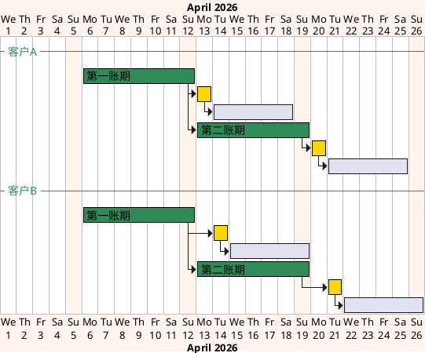
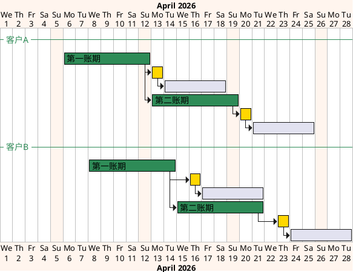

# 第005篇

> 本篇定位：客户级账单配置；主要内容：客户级账单配置、账期与方案规则；文档角色：模块档；文档ID：B6349C60A4

## 1. 客户级账单配置

[🔗原型链接](http://localhost:4181/#/billing/config)

客户级账单配置用于集中维护客户出账和返款的前置规则。应收账单模块和返款账单模块不再各自重复定义配置口径，统一从本章读取客户引用的配置编号、准确版本、账期规则、币种规则、履约节点、返款模式和生效周期。

### 1.1 章节概述

客户级账单配置回答的是“某个客户按什么规则生成应收账单和返款账单”。本 PRD 中的`客户`与集运客门户中的`会员`是同一业务主体：WMS 从货主关系称其为客户或货主，集运客门户从账号关系称其为会员。所有配置采用同一种可复用配置实体，客户引用稳定的配置编号；任务创建时再解析该配置当时生效的准确版本并锁定快照。配置不会因当前被一个或多个客户引用而改变实体类型。店铺和客户组只用于批量选择客户、查询和核对，不参与账单生成时的配置匹配。账单结算主体为客户 / 会员；一个会员在同一时点只能从属一个店铺，但订单已固化的历史`所属店铺快照`可能因会员转店而不同，账单必须按来源订单快照拆分，不能跨店铺归集。客户级账单配置位于账单生成之前，是任务类型为`账单生成`的BMS任务读取配置快照的来源。

本章覆盖两类配置：

1. 应收账单配置：用于控制客户应付费用如何按账期、履约节点、业务范围和币种规则生成应收账单。
2. 返款账单配置：用于控制 COD 货款如何按返款模式、回款时间、扣减项和货款结算币种生成返款账单。

应收账单配置和返款账单配置分别建立客户引用。一个客户可以在两类配置中引用不同的配置编号；同一客户、同一配置类型、同一生效时段只能存在一份有效引用，具体规则见[统一配置与配置标签](PRD.账单系统.第004篇.配置版本与客户引用.40A1257C97.md#doc-40A1257C97-config-version-4f4a8fbe)。

#### 1.1.1 页面原型概述

页面顶部设置`应收账单配置`、`返款账单配置`和`客户引用配置情况`三个同级入口。`应收账单配置`和`返款账单配置`分别直接进入对应配置清单，并从配置清单进入配置编辑；`客户引用配置情况`集中承载客户引用列表，进入后通过必选且不可清除的`配置类型`条件块选择`全部`、`应收账单配置`或`返款账单配置`，默认选择`全部`并同时展示两类当前有效引用：

| 区域 | 业务字段 | 业务操作 | 关键业务约束 |
| --- | --- | --- | --- |
| 客户引用配置情况 | 仅展示查询时点存在当前有效引用的客户；字段包括客户编码、客户名称、会员编码、所属店铺、所属客户组、引用配置、配置版本、配置标签和账期类型；`引用配置`列显示配置编号并在其下方以备注文字显示`配置备注`，未填写时显示`--`，`配置版本`列紧随其后并显示查询时点生效的准确版本号，两列均不显示组合后的配置版本编号；选择`全部`时增加`配置类型`列，应收配置另显示分支方案数量；`账期类型`列同时承载两类配置，应收行显示默认方案与已启用分支方案的账期类型汇总，返款行显示当前返款配置的账期类型；本列表不展示返款模式和默认结算币种 | 通过`配置类型`条件块选择`全部`、`应收账单配置`或`返款账单配置`；查询、更换配置、查看配置、按客户生成账单 | `配置类型`必选且不可清除，默认值为`全部`；选择`全部`时按客户和配置类型分别显示当前有效引用，同一客户同时存在应收与返款引用时显示两行。引用客户、共享配置客户和独享配置客户按客户编码去重统计，列表总数按引用行统计；客户与会员为同一主体；未配置或查询时点不存在有效引用的客户不进入本表，须从配置清单的分配向导选择；列表不再重复展示引用状态和启用状态；所属店铺和所属客户组仅用于筛选与核对；同一客户、同一配置类型、同一生效时段只能有一份配置引用；应收分支方案数量和账期类型按[应收配置列表怎样展示分支方案数量与账期类型？](#doc-B6349C60A4-billing-config-03b4ccda)展示 |
| 配置清单 | 配置备注（选填）、配置编号、配置版本、配置标签、命中客户数、发布时间、状态；`配置备注`以备注文字显示在`配置编号`下方，未填写时显示`--`；`配置版本`列紧随`配置编号`列，当前生效版本以小号版本标签显示在上方；存在待生效版本时，在同一单元格下方以备注文字显示`将在 YYYY/MM/DD 切换为 Vx`；`发布时间`显示当前生效版本的发布时间且不显示发布人；应收配置另含分支方案数量；返款配置另含返款模式和账期类型 | 新建配置（先设置配置，再指定适用客户，可跳过）、编辑并发布新版本、从操作列查看版本记录、查看任一版本的完整详情、分配客户、查看引用客户、按当前生效版本批量生成账单、停用 | 配置清单不单独展示`待生效版本`和`历史版本数量`列，也不单独展示`配置备注`列；待生效版本的生效日期同时显示在版本备注和版本记录弹窗中，历史版本数量及全部版本详情在版本记录弹窗中查看。配置备注未填写时在`配置编号`下方显示`--`，不影响配置编号与配置版本分列展示；版本记录弹窗按版本号倒序展示全部已发布版本及状态、发布时间、生效时间和变更原因；任一版本均可进入只读完整详情；配置标签由当前有效客户引用数派生且不可编辑；新版生效时全部当前引用客户统一使用新版；分配客户只选择配置，不允许指定历史版本；新建配置的两步流程按[配置版本、停用与引用约束](PRD.账单系统.第004篇.配置版本与客户引用.40A1257C97.md#doc-40A1257C97-config-version-67bb7ea2)执行；应收分支方案数量按[应收配置列表怎样展示分支方案数量与账期类型？](#doc-B6349C60A4-billing-config-03b4ccda)展示 |
| 应收配置编辑 | 配置基本信息、配置版本编号、发布生效方式、默认方案、分支方案、费项结算币种、履约节点、账期类型、账单发出时间、方案生效周期、信用评级、信用期限、逾期滞纳金、垫资额度上限、合同编号、合同文件 | 新增或移除分支方案、新增或移除费项币种规则、引用费项结算币种模板、另存为新配置、新建时下一步指定适用客户、发布新版本 | 编辑内容不保存为草稿；取消或关闭不产生版本；发布时默认立即生效，也可指定未来日期生效；客户需要差异化时须另存为新配置并仅切换该客户；新建配置先设置配置再指定适用客户，该步骤可跳过，规则见[配置版本、停用与引用约束](PRD.账单系统.第004篇.配置版本与客户引用.40A1257C97.md#doc-40A1257C97-config-version-67bb7ea2) |
| 返款配置编辑 | 配置基本信息、配置版本编号、发布生效方式、启用状态、返款模式、账期类型、半周起始日、账单发出时间、必要归集金额、直接扣减费项、货款原始币种、货款结算币种、客户收款账户、负数金额处理方式、条款生效周期 | 新增或移除币种账户规则、另存为新配置、新建时下一步指定适用客户、发布新版本 | 编辑内容不保存为草稿；发布时默认立即生效，也可指定未来日期生效；账期仅支持周和半周；半周必须选择两个起始日且两个账期均不少于 3 天；币种账户规则必须保留一条末行兜底规则；已发布版本不得由客户局部覆盖；新建配置先设置配置再指定适用客户，该步骤可跳过，规则见[配置版本、停用与引用约束](PRD.账单系统.第004篇.配置版本与客户引用.40A1257C97.md#doc-40A1257C97-config-version-67bb7ea2) |

配置变更默认只影响变更后创建的任务和账单，不自动回写已有账单。尚未向客户发出的`待审核`账单如需改用新版配置，财务应发起`账单生成`并选择本次采用的新版配置；系统按[账单生成、重算与变更分流](PRD.账单系统.第010篇.账单生成重算与变更分流.4CA3C606DB.md#doc-4CA3C606DB-billing-calculation-6868a655)中的[配置变了，怎样安全替换待审核账单？](PRD.账单系统.第010篇.账单生成重算与变更分流.4CA3C606DB.md#doc-4CA3C606DB-billing-calculation-63bd6948)判定是否执行替换生成。已经发出的账单不得作废或替换生成。

### 1.2 账期定义与节奏

账期是客户级账单配置中的出账周期口径，用于决定系统在什么时间范围内归集费项、生成账单并进入后续审核与对账流程。应收账单配置和返款账单配置都可以独立维护账期，两条账单线不要求同周期对齐。

账期类型分为两类：

1. 日历账期：`周`、`半月`、`月`等，必须对齐日历边界。`周`按自然周，`半月`按每月 1 日至 15 日、16 日至月末，`月`按自然月。
2. 自然天账期：统一显示为`N 自然天`，例如`1 自然天`、`7 自然天`、`10 自然天`、`15 自然天`；按配置生效起始日连续滚动计算，不要求对齐自然周、自然半月或自然月。

返款账单配置的账期类型仅支持`周`和`半周`，不支持`半月`、`月`或自然天账期。`半周`是返款账单专用账期，表示在一个自然周内拆成两个连续账期。

理解口径：

1. 账期只定义本期账单归集来源数据的时间范围，不代表客户付款、财务返款或核销必须在同一时间范围内完成。
2. 常规情况下，账期结束后由系统完成期末收口；已经生成的账单达到`待审核 + 已收口`后进入财务审核，尚未生成的账单由期末任务首次生成并收口。财务确需提前对账时，可以对`待审核 + 未收口`账单执行[账期还没结束，怎样提前收口并审核？](PRD.账单系统.第010篇.账单生成重算与变更分流.4CA3C606DB.md#doc-4CA3C606DB-billing-calculation-7e705a70)，由系统先形成截断账期并完成收口，再推进审核。信用期、返款处理期和核销期是账期之后的资金处理口径。
3. 同一客户的应收账单和返款账单可以使用不同账期；同一应收配置中的默认方案和分支方案也可以使用不同账期。
4. 当默认方案和分支方案账期不同，系统按各方案自己的账期独立判断是否到达出账时点，不存在固定先后或兜底关系。

#### 1.2.1 账期（周）甘特图

本图演示日历账期中的`周`账期。`周`账期必须对齐自然周边界，因此客户 A 和客户 B 的账期起止日都按同一自然周滚动；账期结束后再按客户级账单配置进入账单发出日和结算信用期。图中客户 A 与客户 B 的账单发出日偏移不同，用于表达账期相同不代表账单发出日或信用期安排必须完全一致。

#### 1.2.2 账期（7 自然天）甘特图

本图演示`7 自然天`账期。该账期按客户级账单配置的生效起始日连续滚动，不要求对齐自然周、自然半月或自然月；因此客户 A 可以从 2026/04/06 开始滚动，客户 B 可以从 2026/04/08 开始滚动，两者不需要对齐同一日历边界。账期结束后，仍按各自配置进入账单发出日和结算信用期。

### 1.3 应收账单配置

应收账单配置用于维护客户后付费用的出账规则。

应收账单配置由配置版本信息、默认方案和分支方案组成。客户侧只保存对配置编号的引用记录，不复制或覆盖配置版本中的方案字段；任务创建时解析并锁定该配置当时生效的准确版本。

配置版本信息至少包括：

- 配置编号与配置备注（选填；备注为空时以配置编号展示）
- 准确版本
- 客户引用记录编号
- 生效周期
- 启用状态
- 操作人
- 操作时间
- 变更原因

每个方案都应独立维护出账规则，方案级配置项至少包括：

- 账期类型
- 账单发出时间
- 费项结算币种
- 应收账单履约节点
- 限定情形

客户级信用与合同条款包括信用期限、逾期未结算滞纳金、信用评级、垫资额度上限、合同编号和合同文件，不随默认方案或分支方案分别维护。

配置页面可以套用`费项结算币种模板`，批量填充费项结算币种规则。套用后只保留填充结果，不保存模板引用；财务可以继续修改填充值，模板后续变化也不得联动修改账单配置。

费项结算币种规则至少保留一行，且末行固定为兜底规则。当仅有一行时，兜底规则的费项口径为`全部`；存在明确费项规则时，兜底规则的费项口径自动变为`其他`。兜底规则的费项只读，不允许人工修改；其结算币种默认为`随原始币种`，也可以指定为其他币种。兜底规则之前的规则必须配置明确费项和明确币种，新增明确费项规则的结算币种默认取原始币种。同一方案内明确费项不得重复。

应收账单履约节点规则：

1. 应收账单配置的履约节点仅支持`出库时间`和`订单完结`。
2. `核重时间`不作为履约节点选项，任何环境均不得展示、选择或生效该选项。订单完成出库前仍存在费项重算窗口，核重完成不代表费项横表金额已经稳定，不得作为账单归集依据。
3. `签收`已由`订单完结`取代，不再作为应收账单配置选项。
4. `订单完结`与广义签收的当前系统口径见[广义签收](PRD.账单系统.第003篇.业务系统基本面.A231A39E11.md#doc-A231A39E11-business-baseline-176b8321)；订单类费用归集时间口径见[费用达到什么条件才能入池？](PRD.账单系统.第009篇.来源范围与费项池.C986F40642.md#doc-C986F40642-fee-source-a23a7c51)。

#### 1.3.1 应收配置列表怎样展示分支方案数量与账期类型？

应收客户引用列表和应收配置清单分别以客户引用和配置为管理对象。默认方案和分支方案属于配置当前生效版本内的出账规则，不得拆成独立列表行。

1. 应收客户引用列表仅按存在当前有效引用的客户显示一条主行，未配置或查询时点不存在有效引用的客户不显示；应收配置清单按配置编号显示一条主行，并在配置编号后紧随显示当前生效的配置版本。默认方案和每个分支方案不得重复客户、配置编号或版本信息形成多行。
2. 主行的`分支方案数量`只显示当前生效版本内已启用分支方案的数字数量；没有已启用分支时显示`0`。单元格不得附加`个分支`或其它单位文案，也不得显示默认方案的账期类型、结算币种或`仅默认方案`文案。
3. 客户引用配置情况列表统一使用`账期类型`列。应收行按默认方案在前、已启用分支方案顺序在后的顺序汇总账期类型，去重后使用`、`连接；停用分支不纳入汇总。账期类型值不带`账单`字样，例如默认方案为`月`、两个已启用分支分别为`月`和`周`时，显示`月、周`。返款行直接显示查询时点当前返款配置的账期类型。
4. 客户引用列表不提供展开行。财务需要查看方案详情时，通过行操作`查看配置`打开该配置当前生效版本的只读完整详情，查看默认方案编号，并按已启用分支方案逐行查看分支方案编号、订单类型、目的国、集运仓、账期类型、账单发出时间、应收账单履约节点，以及该分支费项结算币种末行兜底规则的结算币种；该入口只用于查看，不提供独立发布、分配或生成账单操作。
5. 客户引用列表的分支方案数量和账期类型读取查询时点该配置编号的生效版本。指定日期待生效版本在实际生效前不得提前改变客户主行展示。
6. 配置清单主行的分支方案数量读取当前生效版本；配置清单不使用折叠行展示版本历史。财务从操作列打开版本记录弹窗后，系统按[配置版本、停用与引用约束](PRD.账单系统.第004篇.配置版本与客户引用.40A1257C97.md#doc-40A1257C97-config-version-67bb7ea2)展示全部版本，并允许查看任一版本的完整方案和费项结算币种规则。历史版本不改变配置清单主行内容，也不得提供分配或生成账单入口。

### 1.4 返款账单配置

返款账单配置用于维护 COD 包裹货款代收与返还条款。

返款账单配置不包含默认方案和分支方案。返款客户引用列表不得展示应收配置的`分支方案数量`或方案展开内容，也不展示返款模式和默认结算币种，只在共用的`账期类型`列显示查询时点当前返款配置的账期类型。返款配置清单和配置详情继续展示返款模式、账期类型和返款条款字段。

配置项至少包括：

- 返款模式
- 账期类型
- 账期起始日
- 账单发出时间
- 返款账单必要归集金额
- 在准返款中直接扣减的应收费项
- 货款原始币种
- 货款结算币种
- 客户收款账户
- 当已返货款金额为负数时的应对措施
- 条款生效周期

返款账单配置规则：

1. 返款配置采用统一配置实体和版本化管理；客户引用记录保存配置编号，任务创建时再保存实际解析的准确版本和客户引用记录编号。
2. 生效后默认只影响后续任务，不自动回写已有返款账单；尚未发出的待审核返款账单只有在财务发起`账单生成`、选择新版配置且系统判定为替换生成时，才允许改用新版配置。
3. 同一客户的返款配置引用及条款生效周期不允许重叠。
4. 货款原始币种、货款结算币种和客户收款账户的匹配及换算规则见[返款账单怎样确定结算币种和金额？](#doc-B6349C60A4-billing-config-e5cbf17a)；完整换算口径见[返款账单换算总则](PRD.账单系统.第014篇.金额汇兑.27B80EF314.md#doc-27B80EF314-currency-exchange-83e6bbc9)。
5. 负数金额可选择顺延到下期返款账单，或反向计入本期应收账单。
6. 返款账单账期类型仅支持`周`和`半周`。
7. 当账期类型为`周`时，账期按自然周滚动。
8. 当账期类型为`半周`时，财务必须明确两个连续账期的起始星期，例如`周二`和`周五`；系统应据此在每个自然周内拆出两个连续账期。
9. `半周`的两个起始星期必须保证每个单独账期不少于 3 天；若任一账期少于 3 天，系统不得保存配置。
10. 返款配置编号与应收配置编号采用同一构成规则，仅前缀不同。每份返款配置的配置编号格式为`RFB-SCHEME-yyyyMMddHHmmssSSS`，时间戳取首次发布成功时的系统创建时间，精确到毫秒，例如`RFB-SCHEME-20260801102000123`；若该毫秒对应的编号已经存在，系统按毫秒递增，直至取得未使用的配置编号，不得形成重复编号。返款配置不包含默认方案和分支方案，不产生`-BRANCH-`方案编号。首次发布完成前只允许显示待生成提示，不得形成可被引用、执行或查询的正式配置编号。

#### 1.4.1 返款账单怎样确定结算币种和金额？

后续订单费用报表只导入`回款汇率`和`实收回款`，不再导入`返款汇率`和`实付返款`。返款账单根据客户级返款配置确定货款原始币种和货款结算币种，并锁定两者之间的返款汇率；历史已导入的返款字段不参与新生成或重算的返款账单。

返款账单采用以下口径：

1. `货款原始币种`是配置的匹配条件，用于匹配`应付返款（即代收货款）`的原始币种。该币种通常为目的国币种。
2. `货款结算币种`是客户最终收款的币种，也是最终`实付返款`的币种。
3. `返款汇率`是返款账单锁定的`货款原始币种 → 货款结算币种`汇率，按[汇率层级](PRD.账单系统.第014篇.金额汇兑.27B80EF314.md#doc-27B80EF314-currency-exchange-b119d22a)取得；同币种换算时固定为`1`。
4. `实付返款（准）`是在货款原始币种中，从`应付返款`扣除返款账单指定扣减费项后得到的换算前金额；最终`实付返款`再按返款汇率换算为货款结算币种。

系统按以下顺序处理每张满足返款归集条件的 COD 业务订单：

| 处理步骤 | 处理口径 | 不满足时的处理 |
| :--- | :--- | :--- |
| 1. 匹配原始币种 | 先按`应付返款`的真实原始币种匹配明确的`货款原始币种`规则；没有明确规则时，才匹配`其他`兜底规则。`其他`不是可参与换算的真实币种。 | 没有匹配规则时，受影响业务订单不得进入本次返款账单。 |
| 2. 确定结算币种 | 读取匹配规则中的`货款结算币种`，作为返款账单的计算和分桶币种。 | 货款结算币种为空时，不得保存配置或生成账单。 |
| 3. 汇总指定扣减 | 将返款账单指定扣减费项统一换算为货款原始币种后汇总。 | 缺少必要汇率时，受影响业务订单不得进入本次返款账单。 |
| 4. 计算换算前返款 | `实付返款（准） = 应付返款 - 返款账单指定扣减费项`，结果仍使用货款原始币种。 | 缺少应付返款本金，或结果触发负数处理规则时，按对应规则处理。 |
| 5. 锁定返款汇率 | 按真实的货款原始币种和货款结算币种取得`返款汇率`，并随账单保存快照。 | 按[汇率层级](PRD.账单系统.第014篇.金额汇兑.27B80EF314.md#doc-27B80EF314-currency-exchange-b119d22a)处理。 |
| 6. 计算实付返款 | `实付返款 = 实付返款（准） × 返款汇率`。 | 缺少必要汇率时，受影响业务订单不得进入本次返款账单。 |
| 7. 校验收款账户 | 客户收款账户币种必须等于`货款结算币种`。 | 未配置同币种客户收款账户时，配置不得保存，受影响账单不得生成。 |

配置保存时，系统必须阻止同一配置版本内相同`货款原始币种`存在多个不同的`货款结算币种`规则；否则同一业务订单会得到多个结算结果。`其他`只负责兜底匹配未单独配置的原始币种，计算时仍须使用业务订单真实的原始币种取得返款汇率。例如，配置为`其他 → USD`时，TWD 业务订单应锁定`TWD → USD`返款汇率，不能把`其他`当作货币。

存量数据中历史已导入的`返款汇率`和`实付返款`只保留原记录，不在返款账单详情和对账报表中继续展示，也不影响货款币种规则匹配、账单生成、替换、重算或审核。

### 1.5 默认方案与分支方案

应收账单配置必须支持默认方案和分支方案。

1. 默认方案必须存在，用于表达客户最基础的应收出账规则。
2. 分支方案用于按运抵国、集运仓、业务板块等维度拆分账单规则。
3. 默认方案不包含限定情形，并随所属配置版本发布和生效；分支方案用于表达限定情形下的独立出账规则。
4. 分支方案必须选择订单类型和目的国，集运仓可以不限定。
5. 分支方案之间的限定情形不得存在交集；订单类型、目的国和集运仓三个维度均存在交集时，判定为方案冲突。
6. 任一分支方案的某个限定维度未填写时，该维度按不限制处理，并与其它分支方案在该维度视为存在交集。
7. 分支方案存在范围交集、缺少订单类型或缺少目的国时，配置不得保存。
8. 默认方案不参与分支方案限定情形的交集校验。
9. 每份应收配置的默认方案编号同时作为配置编号，格式为`ARB-SCHEME-yyyyMMddHHmmssSSS`；时间戳取首次发布成功时的系统创建时间，精确到毫秒，例如`ARB-SCHEME-20260801101800123`。若该毫秒对应的编号已经存在，系统按毫秒递增，直至取得未使用的配置编号，不得形成重复编号。分支方案编号格式为`默认方案编号-BRANCH-分支方案自增序号`，例如`ARB-SCHEME-20260801101800123-BRANCH-1`。分支方案首次创建时取得该配置内唯一且不可变的自增序号；继续存在的分支在后续版本中沿用原编号，新增分支取当前历史最大序号加 `1`，已删除分支的序号不得复用。方案显示顺序、显示名称或配置版本变化不得改写方案编号。任务和账单快照必须同时记录方案编号、方案名称和方案类型；方案类型只取`默认方案`或`分支方案`，不参与唯一性识别。首次发布完成前只允许显示待生成提示，不得形成可被引用、执行或查询的正式方案编号。

### 1.6 限定情形互斥算法

1. 校验对象：新增或修改的分支方案，应与同一应收配置版本内其它已启用分支方案逐一校验；默认方案不参与限定情形交集校验。
2. 情形表达：每个限定情形维度都按集合处理；单选值视为单元素集合，多选值视为多元素集合，`不限`或未配置视为该维度全集。
3. 交集判定：两个方案在全部限定情形维度上都存在交集，才判定两个方案的适用范围有交集；只要任一维度无交集，即可判定两个方案互斥。
4. 收敛方法：先用待校验方案的情形选项 1 跟其它方案的情形选项 1 比对，保留有交集的方案；再用情形选项 2 仅跟上一轮保留方案继续比对，直至所有情形选项比对完成。
5. 判定结果：任一轮比对后候选方案为空，则待校验方案与其它方案互斥；所有情形选项比对完成后仍存在候选方案，则这些候选方案与待校验方案有交集，配置不得保存或启用。
6. 默认方案没有限定情形，不参与本算法；订单未命中任何分支方案时才使用默认方案。

样例：假如要新增方案 10，则系统按以下方式判定其与方案 1-9 是否存在交集。

- 先用方案 10 的情形选项 1 跟方案 1-9 的情形选项 1 对比，发现方案 1-8 与方案 10 有交集。
- 再用方案 10 的情形选项 2 跟方案 1-8 的情形选项 2 对比，发现方案 1-7 与方案 10 有交集。
- 再用方案 10 的情形选项 3 跟方案 1-7 的情形选项 3 对比，发现方案 6-7 与方案 10 有交集。
- 最后用方案 10 的情形选项 4 跟方案 6-7 的情形选项 4 对比，未发现交集，因此方案 10 与其它方案互斥，可以通过校验。

<table style="width:max-content; border-collapse:collapse; white-space:nowrap;">
  <thead>
    <tr>
      <th style="text-align:left; border:1px solid #999; background:#f0f0f0;">情形维度</th>
      <th style="text-align:left; border:1px solid #999;">方案 1</th>
      <th style="text-align:left; border:1px solid #999;">方案 2</th>
      <th style="text-align:left; border:1px solid #999;">方案 3</th>
      <th style="text-align:left; border:1px solid #999;">方案 4</th>
      <th style="text-align:left; border:1px solid #999;">方案 5</th>
      <th style="text-align:left; border:1px solid #999;">方案 6</th>
      <th style="text-align:left; border:1px solid #999;">方案 7</th>
      <th style="text-align:left; border:1px solid #999;">方案 8</th>
      <th style="text-align:left; border:1px solid #999;">方案 9</th>
      <th style="text-align:left; border:2px solid #e55;">方案 10</th>
    </tr>
  </thead>
  <tbody>
    <tr>
      <td style="text-align:left; border:1px solid #999; background:#f0f0f0;">情形选项 1 枚举：A1、A2、A3、A4、A5</td>
      <td style="text-align:left; border:1px solid #999; background:#f8d7da;">A1、A2、A3、A4、A5</td>
      <td style="text-align:left; border:1px solid #999; background:#f8d7da;">A1、A2、A3、A4、A5</td>
      <td style="text-align:left; border:1px solid #999; background:#f8d7da;">A1、A2、A3、A4、A5</td>
      <td style="text-align:left; border:1px solid #999; background:#f8d7da;">A1、A2、A3、A4、A5</td>
      <td style="text-align:left; border:1px solid #999; background:#f8d7da;">A1、A2、A3、A4、A5</td>
      <td style="text-align:left; border:1px solid #999; background:#f8d7da;">A1、A2、A3、A4、A5</td>
      <td style="text-align:left; border:1px solid #999; background:#f8d7da;">A1、A2、A3、A4、A5</td>
      <td style="text-align:left; border:1px solid #999; background:#f8d7da;">A1、A2、A3、A4、A5</td>
      <td style="text-align:left; border:1px solid #999;">A5</td>
      <td style="text-align:left; border:2px solid #e55; background:#f8d7da;">A1、A2、A3、A4</td>
    </tr>
    <tr>
      <td style="text-align:left; border:1px solid #999; background:#f0f0f0;">情形选项 2 枚举：B1、B2、B3、B4、B5</td>
      <td style="text-align:left; border:1px solid #999; background:#d6f5f5;">B1、B2、B3、B4</td>
      <td style="text-align:left; border:1px solid #999; background:#d6f5f5;">B1、B2、B3、B4</td>
      <td style="text-align:left; border:1px solid #999; background:#d6f5f5;">B1、B2、B3、B4</td>
      <td style="text-align:left; border:1px solid #999; background:#d6f5f5;">B1、B2、B3、B4</td>
      <td style="text-align:left; border:1px solid #999; background:#d6f5f5;">B1、B2、B3、B4</td>
      <td style="text-align:left; border:1px solid #999; background:#d6f5f5;">B1、B2、B3</td>
      <td style="text-align:left; border:1px solid #999; background:#d6f5f5;">B2、B4</td>
      <td style="text-align:left; border:1px solid #999;">B3、B4</td>
      <td style="text-align:left; border:1px solid #999;">B5</td>
      <td style="text-align:left; border:2px solid #e55; background:#d6f5f5;">B1、B2</td>
    </tr>
    <tr>
      <td style="text-align:left; border:1px solid #999; background:#f0f0f0;">情形选项 3 枚举：C1、C2、C3、C4、C5</td>
      <td style="text-align:left; border:1px solid #999;">C1、C2、C3、C4</td>
      <td style="text-align:left; border:1px solid #999;">C1、C2、C3、C4</td>
      <td style="text-align:left; border:1px solid #999;">C1、C2、C3、C4</td>
      <td style="text-align:left; border:1px solid #999;">C1、C2、C3、C4</td>
      <td style="text-align:left; border:1px solid #999;">C1、C2、C3、C4</td>
      <td style="text-align:left; border:1px solid #999; background:#e2f0d9;">C5</td>
      <td style="text-align:left; border:1px solid #999; background:#e2f0d9;">C5</td>
      <td style="text-align:left; border:1px solid #999;">C4</td>
      <td style="text-align:left; border:1px solid #999;">C5</td>
      <td style="text-align:left; border:2px solid #e55; background:#e2f0d9;">C5</td>
    </tr>
    <tr>
      <td style="text-align:left; border:1px solid #999; background:#f0f0f0;">情形选项 4 枚举：D1、D2、D3、D4、D5</td>
      <td style="text-align:left; border:1px solid #999;">D1</td>
      <td style="text-align:left; border:1px solid #999;">D2</td>
      <td style="text-align:left; border:1px solid #999;">D3</td>
      <td style="text-align:left; border:1px solid #999;">D4</td>
      <td style="text-align:left; border:1px solid #999;">D5</td>
      <td style="text-align:left; border:1px solid #999;">D1</td>
      <td style="text-align:left; border:1px solid #999;">D3</td>
      <td style="text-align:left; border:1px solid #999;">D4</td>
      <td style="text-align:left; border:1px solid #999;">D5</td>
      <td style="text-align:left; border:2px solid #e55;">D5</td>
    </tr>
  </tbody>
</table>

### 1.7 与其它章节的关系

1. 账单生成 / 重算过程读取客户级账单配置快照，具体规则见[账单生成/重算机制](PRD.账单系统.第007篇.BMS任务生命周期与操作.D94FE560DB.md#doc-D94FE560DB-task-lifecycle-48b1e1bb)。
2. 应收账单模块只描述应收账单的状态、账期、详情和导出，配置口径统一引用本章。
3. 返款账单模块只描述返款账单的状态、返款模式、与回款管理的联动关系和报表输出；包裹级回款跟踪统一见[回款管理](PRD.账单系统.第012篇.返款账单.A4A4EF02F0.md#doc-A4A4EF02F0-collection-94d05002)，配置口径统一引用本章。
4. 费项结算币种、汇率快照和多币种汇总规则统一见[金额汇兑](PRD.账单系统.第014篇.金额汇兑.27B80EF314.md#doc-27B80EF314-currency-exchange-e7e21dd6)。
5. 客户级汇率配置只负责生成账单前的默认汇率，具体见[客户级汇率配置](PRD.账单系统.第006篇.客户级汇率配置.72D3AF6045.md#doc-72D3AF6045-rate-config-809a91c4)。

客户级账单配置解决的是“哪些客户、哪些业务、按什么账期和履约节点生成账单”。当账单内存在多币种金额时，还需要在生成前确定默认汇率，所以下一章继续定义客户级汇率配置。
