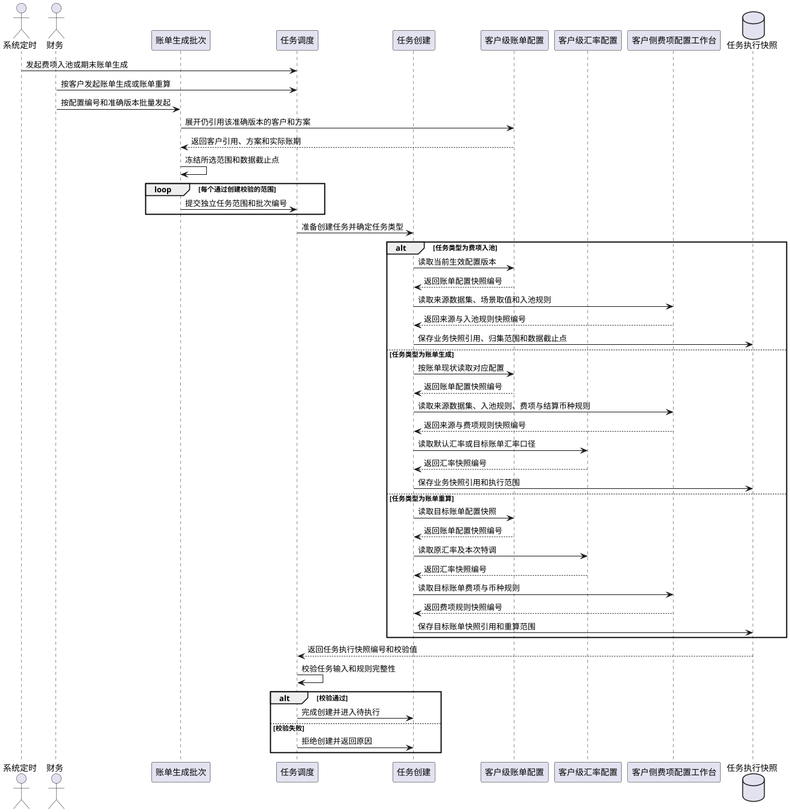
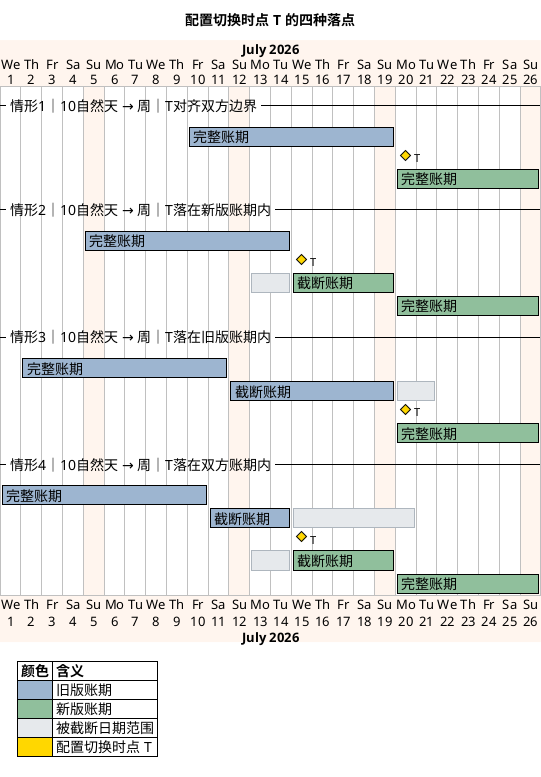
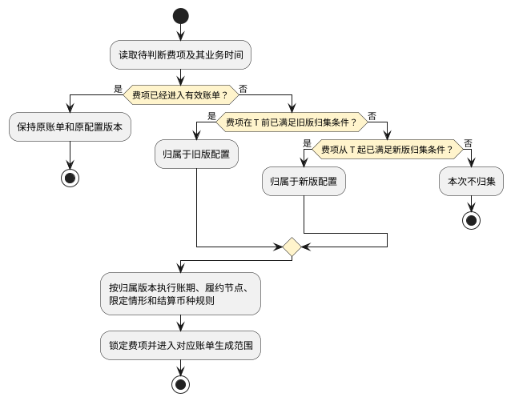

# 第008篇

> 本篇定位：任务快照与配置衔接；主要内容：任务规则快照、新旧配置衔接；文档角色：共享规则档；文档ID：A82E89D72C

## 1. 第二步：任务按哪套规则执行，又需保存什么？

任务创建时不再复制一份账单配置。系统应引用已经形成且不可修改的业务快照，并把这些引用与本次执行特有条件共同保存为`任务执行快照`。

| 任务类型 | 引用的业务快照 | 任务执行快照保存的本次条件 |
| :--- | :--- | :--- |
| 费项入池 | 当前客户生效的配置编号、准确版本及客户引用记录所对应的账单配置快照；来源数据与场景取值规则快照；费项入池规则快照 | 客户 / 会员、任务创建时的会员编码、所属店铺和所属客户组快照、账单类型、方案标识、方案名称、方案类型、账期、来源处理范围、数据截止点，以及各来源数据集采用的扫描方式和读取的增量同步水位。任务执行后，来源扫描结果另行记录实际命中来源订单的所属店铺快照集合。 |
| 账单生成 | 保存既有待审核账单引用的原业务快照，以及本次客户采用的配置编号、准确版本、客户引用记录、来源规则、费项规则、费项结算币种和默认汇率快照；没有既有账单时保存任务创建时生效的对应业务快照 | 是否需要收口、任务创建时的会员编码、所属店铺和所属客户组快照、来源处理范围、账单计算范围、数据截止点、已有待审核账单、本次采用的客户配置编号、准确版本及切换时点、方案标识、方案名称、方案类型，以及生成批次编号（如有），并保存各来源数据集采用的扫描方式和读取的增量同步水位；取得执行权后在执行结果中补记账单生成方式、收口结果和实际命中来源订单的所属店铺快照集合。判定为替换生成时，再形成替换批次和待替换账单集合。 |
| 账单重算 | 目标账单引用的账单配置、费项规则、费项结算币种、锁定汇率快照及当前有效结果版本 | 目标账单、重算原因、重算范围、本次纳入的已审核调整或冲正记录。普通重算沿用目标账单锁定汇率快照；财务显式提交账单级汇率调整时，另存本次明确输入或所选准确汇率版本，并形成新的账单级汇率快照。 |

业务快照与任务执行快照必须分别保存并建立引用关系：

1. 账单配置、客户引用、来源规则、费项规则和汇率快照保存业务规则本身；任务执行快照只保存其快照编号、准确版本和校验值，不重复保存完整内容。
2. 数据截止点、处理范围、生成批次编号、目标账单、替换批次、重算范围和本次操作参数只属于任务执行快照，不应写入账单配置快照。
3. 任务引用的业务快照不得修改或物理删除。任务创建、执行或重新执行时发现快照不存在或校验值不一致，必须阻断任务并记录异常。
4. 任务排队期间出现新配置或新规则时，原任务继续使用任务执行快照引用的版本；需要采用新版本时必须创建新任务。
5. 任务成功后，账单结果版本同时引用本次任务执行快照和实际采用的业务快照，形成“业务规则—本次执行—账单结果”的完整追溯关系。

共同规则如下：

1. 账单生成按[配置版本与生效规则](PRD.账单系统.第004篇.配置版本与客户引用.40A1257C97.md#doc-40A1257C97-config-version-d940c715)锁定本次采用的配置版本，并按[账期定义与节奏](PRD.账单系统.第005篇.客户级账单配置.B6349C60A4.md#doc-B6349C60A4-billing-config-0508bc67)确定账期范围；新旧配置版本的切换边界、截断账期和费项归属按[配置改了，旧账单怎么办，新费项归谁？](#doc-A82E89D72C-task-snapshot-ab6c0655)执行。执行前发现同范围账单使用不同配置版本，或本次配置会改变原账单范围、分组或费项归属时，不得判定为补充生成；符合替换边界时由系统判定为替换生成，不符合替换边界时任务失败并提示调整配置或处理范围。重算不得用后来生效的配置替换目标账单版本。
2. 应收账单的履约节点和方案范围按[应收账单配置](PRD.账单系统.第005篇.客户级账单配置.B6349C60A4.md#doc-B6349C60A4-billing-config-d6a30ec3)及[默认方案与分支方案](PRD.账单系统.第005篇.客户级账单配置.B6349C60A4.md#doc-B6349C60A4-billing-config-44affb07)执行；返款账单按[返款账单配置](PRD.账单系统.第005篇.客户级账单配置.B6349C60A4.md#doc-B6349C60A4-billing-config-23b922e3)执行。
3. 客户、供应链、店铺、会员与业务订单的归属边界按[核心对象关系](PRD.账单系统.第003篇.业务系统基本面.A231A39E11.md#doc-A231A39E11-business-baseline-c84fb3e2)执行。
4. 费项结算币种读取客户级账单配置已经保存的结果；默认汇率命中按[账单生成命中与快照](PRD.账单系统.第006篇.客户级汇率配置.72D3AF6045.md#doc-72D3AF6045-rate-config-42cd9f89)执行，金额换算按[汇率与金额换算](PRD.账单系统.第015篇.金额汇兑.27B80EF314.md#doc-27B80EF314-currency-exchange-d860ed63)执行。
5. 客户侧费项、场景取值规则和来源数据集从[系统从哪里知道该取哪些费用？](PRD.账单系统.第009篇.来源范围与费项池.C986F40642.md#doc-C986F40642-fee-source-0283d06f)读取。配置变更只影响变更后创建的任务，不自动改变已有任务或账单，也不自动触发重算或替换生成。

任务准备创建时先确定并校验需要引用的业务快照，再保存任务执行快照。只有两者均校验成功，任务才正式创建并进入`待执行`：

### 1.1 配置改了，旧账单怎么办，新费项归谁？

客户引用的配置编号或准确版本发生变更后，旧配置形成的账单和任务可能尚未结束，新引用也可能已经保存。本节规定每个客户新旧配置版本的切换边界、账期衔接和费项归属，确保同一费项不重复出账，也不因任务执行先后改变归属。批量分配配置时仍逐客户应用本节规则。

本节只适用于`账单生成`。`账单重算`必须沿用目标账单已经锁定的配置版本、账期和费项范围，不得通过重算切换至新版配置。

客户级账单配置的版本化要求见[配置版本与生效规则](PRD.账单系统.第004篇.配置版本与客户引用.40A1257C97.md#doc-40A1257C97-config-version-d940c715)，完整账期的定义和计算方式见[账期定义与节奏](PRD.账单系统.第005篇.客户级账单配置.B6349C60A4.md#doc-B6349C60A4-billing-config-0508bc67)。本节仅补充新旧版本交接时的处理规则。

**先看结论：新配置不会改写旧账单**

1. 已按旧配置版本生成的账单继续使用原配置快照。新的配置编号或准确版本不得自动覆盖、作废、重建或改变已有账单；只有尚未发出的`待审核`账单，才允许财务发起`账单生成`并选择新配置版本，由系统判定是否替换生成。
2. 同一客户的新旧配置引用以唯一的配置切换时点`T`划分承接范围：`T`之前由旧配置版本承接，`T`及之后由新配置版本承接。
3. 系统先确定费项归属该客户的哪个配置编号和准确版本，再按该版本校验账期、履约节点、限定情形、费项范围和结算币种。不得先尝试新配置，再把不符合新配置的费项交给旧配置处理。
4. 同一费项在同一业务用途下只能归入一个有效账单。任务先执行、后执行或重新执行，均不得改变已经确定的配置版本和账单归属。

**先看懂三个词：切换时点、完整账期、截断账期**

| 概念 | 定义 |
| :--- | :--- |
| 配置切换时点`T` | 同一客户的旧配置版本停止承接、新配置版本开始承接的唯一时间边界。 |
| 完整账期 | 按配置的账期类型、起始日和周期长度形成的标准账期。 |
| 截断账期 | 完整账期被`T`切开后，实际保留的旧版末段或新版首段。 |

**`T`怎样划分新旧配置**

1. 旧版配置的有效范围截止到`T`之前，新版配置的有效范围从`T`开始；恰好发生在`T`的费项按新版配置判断。
2. 系统内部统一按`[开始时间, 结束时间)`处理。页面按日期展示时，旧版截止日期为`T`的前一日，新版开始日期为`T`所在日期。
3. `T`按客户财务业务时区解释，并从生效日期当日`00:00:00`开始。
4. 新版配置只处理`T`及之后首次达到归集条件的费项，不得自动补取`T`之前未被旧版覆盖的历史数据。
5. 仅变更费项结算币种、默认汇率来源或其它金额口径时，虽然订单数据范围不变，仍须按`T`切换版本；旧账单保留旧快照，后续账单使用新版配置。

**新版配置什么时候可以生效**

提交客户配置分配向导，或发布指定日期生效的新版本时，系统按以下步骤确定并校验`T`：

1. 查询该客户、账单类型和方案标识下的旧版有效账单，取得最近的实际账期结束时间。
2. 查询使用旧版配置且处于`待执行`、`执行中`或`执行失败`的任务，取得任务已经锁定的账期和处理范围。
3. 根据旧版占用范围计算最早可切换日期。普通切换时，`T`不得落入旧版有效账单的实际账期，也不得截断已创建任务锁定的账期。
4. 财务选择切换方式并确认`T`。若`T`与旧版账单或任务冲突，系统不得直接启用新版配置，并应展示冲突对象和最早可切换日期。
5. 新配置引用可提前保存并指定未来的`T`。到达`T`前，系统继续使用旧配置版本；到达`T`后，不得再为普通新增费项创建跨越`T`的旧版账期。
6. 配置批量分配时，系统必须为每个客户独立计算和校验`T`。部分客户失败不回滚其它已经原子切换成功的客户，但失败客户必须保持原引用不变并返回失败原因。配置新版本生效属于同一配置编号的统一版本切换，若任一当前引用客户存在阻断冲突，则该版本不得生效；系统保持原版本生效并提示受阻客户和最早可生效日期，由财务调整后重新发布。

尚未发出的`待审核`账单需要改用新版配置时，允许作为普通切换的唯一例外，与`替换生成`同步处理：

1. 财务先选定一张待替换账单作为入口；系统再按新版配置推演候选范围，并自动识别所有与候选范围发生交集、必须共同替换的未发出待审核账单，形成`待替换账单集合`。任一受影响账单不满足替换条件时，本次任务不得创建。
2. 与替换任务绑定的新版配置引用在替换成功前保持`待生效`，并只允许本次替换任务读取，不得用于其它任务。
3. 系统以待替换账单集合的实际账期和新版配置推演候选账单集合，并校验不存在集合外的有效账单或未结束任务与新范围重叠。
4. 候选新账单集合成功后，系统在一次结果切换中启用新版配置、作废全部待替换账单并启用全部候选新账单；新版配置从确认的`T`开始承接后续费项。
5. 替换失败时，旧版配置和待替换账单继续有效，新版配置保持`待生效`并继续与失败任务绑定。财务重新执行时沿用原绑定关系；删除失败任务时，系统解除绑定、清除候选结果并重新校验`T`，新版配置不得自动生效。

系统提供以下两种切换方式：

| 切换方式 | `T`的确定规则 | 适用情形 |
| :--- | :--- | :--- |
| 下个完整新账期切换 | 将`T`顺延至新版配置的下一个完整账期起点；旧版配置负责承接`T`之前的剩余日期，必要时形成截断账期。 | 默认方式；新版首张账单需要保持完整账期。 |
| 指定日期切换 | 采用财务指定且通过冲突校验的日期作为`T`；旧版末段、新版首段均可能形成截断账期。 | 合同或客户明确要求从指定日期采用新版口径。 |

旧版任务阻断切换时，按任务状态处理：

| 旧版任务状态 | 处理规则 |
| :--- | :--- |
| 待执行 | 财务可删除任务，再由系统重新计算`T`。 |
| 执行中 | 必须等待任务进入`执行成功`或`执行失败`。 |
| 执行失败 | 任务仍占用切换范围时，财务须将其重新执行成功或删除，才能启动新版配置的首个`账单生成`任务。 |

**`T`切到账期中间时怎么办**

新旧账期类型不同，或相同账期类型的起始日、周期长度发生变化时，系统必须以`T`切开账期，不得生成与旧版实际账期重叠的新版完整账期。

1. `T`同时对齐旧版下一账期起点和新版完整账期起点时，新旧账期直接衔接，不形成截断账期。
2. `T`落在旧版完整账期内时，旧版账期截止到`T`之前，形成旧版截断账期。
3. `T`落在新版完整账期内时，新版账期从`T`开始，到该完整账期结束，形成新版截断账期。
4. `T`同时落在新旧完整账期内时，新旧两侧分别形成截断账期；两个实际账期必须在`T`处首尾相接，不得重叠或留空。
5. `月`、`半月`、`周`等日历账期在截断账期后，须从下一个日历边界恢复完整账期；`7自然天`、`10自然天`、`15自然天`等自然天账期须从新版首个实际账期起点连续计算，不要求对齐日历。
6. 返款账单的`半周`截断账期仍须不少于3天。拟定`T`导致任一实际账期少于3天时，系统不得启用新版配置，并应建议最近的可用切换日期。
7. 截断账单必须展示实际账期开始日、实际账期结束日、配置版本和`截断账期`标记，不得以完整月、完整周等名称代替实际范围。

下图统一以旧版`10自然天`、新版`周`为例，展示`T`与新旧账期边界的四种关系：

图中的“`T`落在某个账期内”，是指`T`落在按该版本配置推演的完整账期内，不代表该账单已经生成。旧版账单或旧版任务已经锁定包含`T`的实际账期时，该`T`无效，系统必须阻止切换。

| 情形 | 典型配置与`T` | 边界关系 | 实际账期结果 |
| :--- | :--- | :--- | :--- |
| 情形1：新旧账期直接衔接 | 旧版`10自然天`从7月10日起滚动；新版按自然周滚动；`T`为7月20日。 | `T`同时对齐旧版下一账期起点和新版自然周起点。 | 不形成截断账期；新版从7月20日至26日形成完整账期。 |
| 情形2：只截断新版账期 | 旧版`10自然天`从7月5日起滚动；新版按自然周滚动；`T`为7月15日。 | 旧版账期于7月14日结束；`T`落在新版7月13日至19日的完整账期内。 | 新版形成7月15日至19日的截断账期，并从7月20日起恢复完整账期。 |
| 情形3：只截断旧版账期 | 旧版`10自然天`从7月2日起滚动；新版按自然周滚动；`T`为7月20日。 | `T`落在旧版7月12日至21日的完整账期内，同时对齐新版自然周起点。 | 旧版形成7月12日至19日的截断账期；新版从7月20日至26日形成完整账期。 |
| 情形4：同时截断新旧账期 | 旧版`10自然天`从7月1日起滚动；新版按自然周滚动；`T`为7月15日。 | `T`同时落在旧版7月11日至20日和新版7月13日至19日的完整账期内。 | 旧版形成7月11日至14日的截断账期；新版形成7月15日至19日的截断账期，并从7月20日起恢复完整账期。 |

情形1和情形3可由任一切换方式产生，区别在于`T`是否对齐旧版账期边界。情形2和情形4只在`指定日期切换`时产生；若情形4改用`下个完整新账期切换`，`T`将顺延至7月20日，并转为情形3。

无论属于哪种情形，`T`之前只由旧版配置覆盖，`T`及之后只由新版配置覆盖。截断账期不得改变这一分界，也不得补生成与旧版已覆盖日期重叠的完整账期。

**一条费项到底归哪个配置版本**

系统必须按业务时间和首次达到归集条件的时间确定版本，不得按任务创建时间、执行时间或费项同步时间判断：

1. 费项已经进入有效账单时，保持原账单和原配置版本，不再参与新旧版本判断。
2. 尚未出账的费项在`T`之前已满足旧版归集条件时，归属于旧版配置。
3. 尚未出账的费项在`T`之前未满足旧版归集条件，并从`T`起满足新版归集条件时，归属于新版配置。
4. 费项不符合其所在时间范围对应版本的归集条件时，本次不归集；不得改用另一个版本补位。
5. 版本归属确定后，补充生成、任务重新执行和延迟同步均不得改变该归属。财务发起`账单生成`并选择新版配置后，系统如判定为替换生成，应按新版配置重新确定候选新账单范围，并保留原归属结果和替换差异，不得直接改写原账单。

流程图只确定费项归属的配置版本。确定版本后，费项还须通过该版本的账期、履约节点、限定情形、费项范围和防重校验，才能进入具体账单。

**配置范围或归集条件变化时怎样处理**

| 变更类型 | 处理规则 |
| :--- | :--- |
| 扩大国家、仓库、承运商、业务板块或费项范围 | 新增范围仅从`T`起生效，不补取`T`之前未被旧版覆盖的历史费项。 |
| 缩小数据范围 | `T`之前已经满足旧版条件的未出账费项仍归旧版；`T`及之后不符合新版条件的费项不再归集。 |
| 变更履约节点 | 例如旧版使用`出库时间`、新版使用`订单完结`：`T`之前已达到旧版节点的费项归旧版；此前未达到旧版节点、并从`T`起达到新版节点的费项归新版。 |
| 变更结算币种、默认汇率来源或其它金额口径 | 已有账单保持旧快照；费项仍按`T`确定配置版本，并使用归属版本的金额口径。 |

已进入旧版账单的费项即使在`T`之后再次满足新版履约节点或范围条件，也不得重复归集。旧版任务尚未执行，不代表已经满足旧版条件的费项可以转入新版。

**延迟同步的费用怎样处理**

费项在`T`之后才同步进入`BMS费项池`，不代表其归属于新版配置。系统仍按业务时间和首次达到归集条件的时间判断：

1. 费项在`T`之前已经满足旧版归集条件，但在`T`之后才同步入池时，仍归属于旧版配置。
2. 对应旧账单仍处于`待审核`、尚未发出且允许补充时，按旧版配置补充生成到对应旧账单。
3. 对应旧账单已经不能补充时，按[账单生成、重算与变更分流](PRD.账单系统.第010篇.账单生成重算与变更分流.4CA3C606DB.md#doc-4CA3C606DB-billing-calculation-6868a655)中的[第七步：账单生成后又有变化，应该走哪条路？](PRD.账单系统.第010篇.账单生成重算与变更分流.4CA3C606DB.md#doc-4CA3C606DB-billing-calculation-746cf792)通过调账、冲正或本期、后续账单承接，并保留原配置版本、原账期和延迟归集原因。若由新版账单承接，必须先形成审核通过并进入`BMS费项池`的调整记录；不得把归属于旧版的原始费项直接补入新版账单。
4. 不得仅因费项同步时间晚于`T`，就套用新版履约节点、限定情形或结算币种。

**新旧任务怎样隔离处理范围**

以下规则适用于所有`BMS任务`；涉及创建、补充、替换或重算账单的要求只适用于`账单生成`或`账单重算`任务：

1. 使用旧版配置创建的任务始终使用任务执行快照所引用的旧版账单配置快照；即使执行时间晚于`T`，也不得读取新版配置。
2. 使用新版配置创建的任务不得读取`T`之前已经归属于旧版的费项。
3. 旧版最后一个`账单生成`任务与新版第一个`账单生成`任务涉及相邻范围时，新版任务可以进入`待执行`，但须等待旧版任务`执行成功`后再开始。旧版任务`执行失败`时，新版任务继续等待，直至旧版任务重新执行成功或被删除并重新确定`T`。
4. 旧版任务自动重试或由用户重新执行时，仍使用旧版配置和原处理范围，不得借重新执行跨越`T`。
5. 任务筛选费项时，须先排除已经进入有效账单的费项，再锁定本次处理范围。不同任务同时锁定同一费项时，后发任务不得写入；系统自动重试，重试失败后将任务置为`执行失败`。
6. 补充生成只能接收归属于原配置版本的费项。新版费项不得补入旧版账单，旧版延迟费项也不得直接补入新版账单；替换生成按新版配置重新筛选候选新账单，但不得占用其它有效账单已经占用的费项。

**启用新版配置前，财务需要确认什么**

新版配置从`待生效`转为`生效`前，页面必须展示以下切换预览，并由财务确认：

| 区域 | 展示内容 | 交互与约束 |
| :--- | :--- | :--- |
| 版本信息 | 客户、账单类型、旧配置编号与准确版本、新配置编号与准确版本、旧新客户引用记录、变更原因 | 财务必须确认本次逐客户切换对象无误。 |
| 配置差异 | 账期类型、账期起点、履约节点、限定情形、费项范围、费项结算币种及其它数据范围变化 | 范围扩大、缩小或履约节点变化必须重点提示。 |
| 切换边界 | 切换方式、拟定`T`、系统允许的最早切换日期 | `T`与旧账单或旧任务冲突时不得启用。 |
| 账期预览 | 旧版最后一个实际账期、新版第一个实际账期、新版首个完整账期、截断账期标记 | 必须展示实际开始日和结束日，不得只展示账期类型。 |
| 历史占用 | 已有旧账单、待执行任务、执行中任务、执行失败任务及其范围 | 存在阻断项时，应提供账单或任务跳转入口。 |
| 影响说明 | 配置变更不会自动改写旧账单、未发出待审核账单何时采用`替换生成`、已发出账单不追溯以及延迟费项的承接方式 | 财务确认后才能启用新版配置。 |

**切换后必须保留哪些记录**

系统必须保存独立的配置切换记录，并建立与账单、任务和费项的追溯关系：

1. 配置切换记录至少包括客户、账单类型、旧配置编号和准确版本、新配置编号和准确版本、旧新客户引用记录、切换方式、`T`、是否强制切换、变更原因、操作人和确认时间。
2. 配置切换记录须包括旧版最后一个实际账期、新版第一个实际账期、新版首个完整账期及是否形成截断账期。
3. 每张账单须记录客户主体、所属店铺快照、配置编号、准确版本、客户引用记录、方案标识、方案名称、方案类型、实际账期、账期类型、是否为截断账期、生成任务编号、生成批次编号（如有）和对应的配置切换记录。
4. 每个`账单生成`任务必须在创建时记录配置编号、准确版本、客户引用记录、客户 / 会员的会员编码、所属店铺和所属客户组快照、方案标识、方案名称、方案类型、`T`、生成批次编号（如有）、任务执行快照、计划账期和数据截止点；执行后再在任务结果中记录实际命中的来源订单所属店铺快照集合和实际处理范围。执行结果不得反向改写创建时冻结的客户 / 会员归属快照。
5. 每条进入账单的费项必须能够追溯其归属配置编号及准确版本、原业务时间、首次达到归集条件的时间、归属账单及是否属于延迟归集。
6. 系统必须记录因旧账单占用、旧任务锁定、版本范围不符或防重规则而未进入新版账单的费项及原因，供财务核对切换结果。
