# 第009篇

> 本篇定位：来源范围与费项池；主要内容：来源数据范围、BMS费项池、客户侧费项与数据源配置；文档角色：共享规则档；文档ID：C986F40642

## 1. 第三步：哪些来源数据可以由本次任务处理？

| 适用范围 | 本步骤要求 |
| :--- | :--- |
| `费项入池` | 执行本步骤，按任务执行快照引用的业务规则及其处理范围筛选并锁定业务来源数据。 |
| `账单生成` | 执行本步骤，为本次账单生成补齐数据截止点以内尚未入池的来源费用。 |
| `账单重算` | 跳过本步骤；不查询或锁定业务来源数据，不改变来源行的`BMS检阅标记`。 |

本节后续的来源扫描规则只适用于`费项入池`和`账单生成`。`账单重算`直接读取目标账单当前有效明细和定向调整记录。

### 1.1 本次从哪里开始同步？

`增量同步水位`用于记录某个来源数据集已经成功同步到的位置。水位按`客户 + 账单类型 + 方案标识 + 配置版本 + 来源数据集 + 来源规则版本 + 归集时间口径`分别维护；其中任一项不同，均不得共用水位。

系统对任务涉及的每个来源数据集分别确定扫描方式：

1. `账单重算`不读取来源数据，不适用全量或增量扫描。
2. `费项入池`和`账单生成`存在连续且有效的增量同步水位时，采用增量扫描，主要读取`上次成功水位（不含）至本次数据截止点（含）`之间的数据。
3. 不存在有效水位时，采用全量扫描。全量仅扫描本任务锁定的来源处理范围，不代表扫描整个来源数据库，也不得把`已入池（synced）`记录再次入池。
4. 同一任务包含多个来源数据集时，各数据集可以分别采用全量或增量扫描；系统不得用一个任务级字段概括为全量或增量。
5. 增量扫描除读取水位之后的数据外，还必须补查本任务来源处理范围内仍为`未处理（null）`的历史数据，避免遗漏延迟到达或此前未成功处理的数据。

增量同步水位至少记录来源数据集、增量字段、增量值、同一增量值下最后一条来源记录标识、上次数据截止点、最近成功任务和更新时间。仅使用时间值不足以区分同一时刻的多条记录，必须同时保存稳定的来源记录标识。

以下任一情形发生时，原水位失效，本次对应来源数据集改为全量扫描：

1. 首次同步，尚未形成水位。
2. 水位缺失、损坏，或无法与最近一次成功任务相互校验。
3. 来源数据集、来源规则版本、归集时间口径或增量字段发生变化。
4. 客户、账单类型、方案标识、配置版本或来源处理范围发生变化，导致原水位不能覆盖本次范围。
5. 系统执行数据修复并明确要求重新建立同步基线。

水位推进必须满足以下规则：

1. 来源数据筛选、费项池写入和来源关系保存全部成功后，才能把水位推进到本次已成功处理的位置。
2. 任务失败、事务回滚或仍存在未完成来源行时，不得推进水位；原水位继续有效。
3. 一条任务涉及多个来源数据集时，各数据集独立推进水位；某个数据集失败不得伪造其成功水位。
4. 任务重新执行时沿用原任务读取的起始水位和数据截止点，不得改读当前最新水位。
5. 任务列表及筛选条件不展示全量或增量扫描方式，避免用一个任务级字段概括多个来源数据集。任务详情按来源数据集展示`来源数据集`、`扫描方式`、`扫描范围`、`上次成功水位`、`本次数据截止点`、`拉取数量`、`命中数量`、`扫描结果`和`失败原因`；账单重算显示`不适用`。水位的内部主键等实现信息不向财务展示。

`增量同步水位`与`阶段检查点`用途不同：前者决定下一条新任务从哪里开始同步，后者仅供当前任务失败后从已完成阶段继续执行，两者不得互相替代。

任务锁定规则后，系统先按[配置改了，旧账单怎么办，新费项归谁？](PRD.账单系统.第008篇.任务快照与配置衔接.A82E89D72C.md#doc-A82E89D72C-task-snapshot-ab6c0655)确定费项归属配置版本，再按该版本和各来源适用的账期时间口径、履约门槛、限定情形筛选本次可处理的数据。附加费的专用口径见[费用达到什么条件才能入池？](#doc-C986F40642-fee-source-a23a7c51)。

各类费项对应的来源表、金额字段、业务类型和首次产生时机见[客户侧费项的 OIS 数据源](PRD.账单系统.第021篇.OIS客户侧费项数据.A6A29BE637.md#doc-A6A29BE637-ois-fee-data-ad5529f1)。

`BMS检阅标记`只表示来源数据是否已被 BMS 处理，不表示账单、支付或核销状态。

| 标记值 | 业务含义 | 进入条件 | 后续处理 |
| :--- | :--- | :--- | :--- |
| 未处理（`null`） | 尚未被BMS处理 | 新来源数据进入本次处理范围 | 本次任务选中后转为`处理中`。 |
| 处理中（`locked`） | 已被当前任务锁定 | 任务开始处理该来源行 | 处理期间禁止修改、物理删除或被其他任务重复采集。 |
| 已入池（`synced`） | 已成功同步 | 费项池写入及关联结果完成 | 来源行和已入池原始金额冻结，后续任务不再处理。 |

```plantuml
@startuml
!pragma layout smetana
hide empty description

state "未处理\nnull" as Unreviewed
state "处理中\nlocked" as Locked
state "已入池\nsynced" as Synced

[*] --> Unreviewed
Unreviewed --> Locked
Locked --> Synced
Locked --> Unreviewed
@enduml
```

状态图规则：

1. 任务选中并锁定来源行后，来源行从`未处理（null）`进入`处理中（locked）`；处于该状态时禁止修改或物理删除。
2. 本轮费项写入和来源关系均保存成功后，来源行从`处理中（locked）`进入`已入池（synced）`。进入`已入池（synced）`后不得补写、修改或重新采集；后续新费用必须形成新来源记录，并从`未处理（null）`重新进入同步流程。
3. 任务进入`执行失败`且该来源行未完整入池时，来源行从`处理中（locked）`回到`未处理（null）`；已经完整入池的来源行不得回退。

来源行筛选、锁定和失败回退还遵守以下规则：

1. 本次可处理的范围仅包括`未处理（null）`和已被本任务锁定的`处理中（locked）`；不再处理`已入池（synced）`行。
2. 除附加事项外，订单类来源按本次任务的账期、履约节点和限定情形筛选。附加费不直接套用该通用筛选规则，完整入池条件见[费用达到什么条件才能入池？](#doc-C986F40642-fee-source-a23a7c51)，两类导入入口的来源事实见[同一张附加事项表，为什么要区分两种导入？](PRD.账单系统.第021篇.OIS客户侧费项数据.A6A29BE637.md#doc-A6A29BE637-ois-fee-data-a254f9b7)。
3. 同一来源行只能被一个未结束任务锁定；锁定冲突时，后发任务不得继续处理该行。
4. 任务自动重试期间，来源行保持`处理中（locked）`并继续归属原任务；任务进入`执行失败`时，未完整入池的写入结果必须撤回，来源行恢复为`未处理（null）`。已经完整入池并建立来源关系的记录保持`已入池（synced）`，不得回退后重复采集。

## 2. 第四步：来源费用怎样变成BMS费项？

| 适用范围 | 本步骤要求 |
| :--- | :--- |
| `费项入池` | 执行本步骤，把第三步锁定的来源数据转换为统一费项池记录，完成后结束任务。 |
| `账单生成` | 执行本步骤，把第三步锁定的来源数据写入费项池，再继续计算账单。 |
| `账单重算` | 跳过本步骤；只读取目标账单已有明细，不新增、覆盖或重采普通来源费项。 |

本节后续的费项写入规则适用于`费项入池`和`账单生成`。来源数据锁定后，系统将订单费用、附加费、赔付和财务导入数据整理为统一费项记录并写入`BMS费项池`。`费项入池`任务在本步骤成功后结束；`账单生成`继续执行账单计算。

`账单生成`不得只使用本次新增的费项。来源写入完成后，系统须以任务数据截止点为边界，从费项池累计读取符合账期与配置范围且尚未出账的全部费项。

`账单重算`不执行本节，只读取目标账单已有明细及明确归属于目标账单的有效调整记录。普通来源费项尚未入池时，必须通过`费项入池`或`账单生成`处理；不得用重算把普通来源新费项补入账单。

### 2.1 什么能入池，什么只能展示？

OIS 保存客户侧费用的表、字段、关联对象和数据结构见[客户侧费项的 OIS 数据源](PRD.账单系统.第021篇.OIS客户侧费项数据.A6A29BE637.md#doc-A6A29BE637-ois-fee-data-ad5529f1)。系统只能从已配置并启用的来源中识别费项。

`费项`指进入账单归集的费用明细，包括机算费项、导入费项和手工补录费项；进入账单前必须先形成费项池记录。

1. `BMS费项池`是应收、返款和成本账单全部金额明细的统一来源，但不等于账单本身。
2. 每条费项池记录必须保留费项、挂靠对象、来源记录、来源批次、原始币种、原始金额、费用发生时间和入池时间。
3. 只用于展示和核对的金额必须标记为`非费项`，即`仅展示不核销`：事实金额已进入账单分摊范围，但仅在账单中呈现，不纳入任何账单的核销汇总。
4. 成本费项使用独立的成本费项索引和账单归属规则，不参与本章的应收与返款分流。
5. 财务补录以及已审核的调账、冲正记录必须先形成可追溯的费项池记录，再参与账单计算；不得跳过费项池直接修改账单金额。

来源费用写入费项池时，按 OIS 的实际存储结构处理：

1. 费项横表按“来源记录 + 金额字段”拆分；同一行有多个有效金额字段时，分别形成多条费项池记录。
2. 费项纵表通常一条有效记录形成一条费项池记录。
3. 多行横字段混合结构先区分明细记录，再按该记录中的金额字段拆分；每条费项池记录必须保留原明细记录和原金额字段。

### 2.2 入池后发现原金额有误，应该怎么办？

1. 费项原始金额一旦成功入池，就成为已使用的历史依据。来源数据不得删除或改写该金额；如需修正，必须通过调账中心新增调整或冲正记录。
2. 费项横表的一行数据成功入池后，整行都被保护：已入池金额不得改写，原为空值或`0`的其他费项字段，也不得在事后补写并重新采集。
3. 费项横表行处于`处理中（locked）`时不得修改任何费项金额或币种。
4. 同步完成后新发生的费用必须形成新的纵表来源行、附加费、索赔记录或调账记录；不得通过补写已同步横表表达后续费用。
5. 金额为`0`或空的来源记录默认不生成有效费项；业务明确要求保留占位时，必须标记占位原因且不计入金额汇总。

### 2.3 系统从哪里取金额和币种？

每条来源规则都必须回答六个问题：使用哪个来源数据集、从哪张表取值、哪个字段是金额、哪个字段是币种、需要过滤什么数据、如何避免重复。系统只能使用已启用的数据集和场景取值规则，不得在任务执行时临时换表或换金额字段。

页面按两个层级选择来源：

1. `来源数据集`确定本次可以共同查询的主表、关联表、基础过滤条件和可用时间字段。
2. `取值表`确定实际保存金额和币种的表，可以不同于来源数据集的主表。例如，业务订单身份和出库时间来自订单主表，派送费金额可以来自订单扩展表。

同一张表存在名称相同或相近的金额字段时，启用中的场景取值规则必须明确指定唯一的金额字段和币种字段；任务不得根据字段名称自行猜测。

订单费项报表导入采用独立的原始币种口径，优先于下方店铺币种规则：

1. 每个作为 BMS 费项或账单计算输入的导入金额都必须在导入时确定原始币种，不得只保存无币种金额。`实收回款`和`回款汇率`属于回款来源事实，不按普通费项金额处理。
2. 普通费项中的`仓租费`和`航空费`原始币种固定为人民币；其他普通费项金额的原始币种均为来源订单的目的国币种，不得改用店铺币种。
3. 目的国币种优先读取来源订单的`ofp_ofdb1.sale_order_header.dest_country_currency_code`；该字段为空时，再按运抵国匹配运抵国配置。仍无法确定时，该行不得导入或进入`BMS费项池`，并须反馈币种缺失原因。
4. `回款汇率`不是金额字段，表示订单目的国币种到回款结算币种的汇率，由订单费用报表导入。具体字段口径见[OIS 有哪些客户侧费用字段？](PRD.账单系统.第021篇.OIS客户侧费项数据.A6A29BE637.md#doc-A6A29BE637-ois-fee-data-b7b2c0fa)。
5. 订单费用报表不导入`实付返款`和`返款汇率`。返款汇率由返款账单根据货款原始币种和货款结算币种取得并锁定，不从订单费用报表读取。

以下 OIS 来源采用目的国币种作为 BMS 记录的原始币种，该口径同样优先于店铺币种规则：

1. `ofp_ofdb1.sale_order_additional_matter.payment_method`表示`到付`的全部附加费。
2. `ofp_ofdb1.sale_order_header.collection_price`、`collection_premium_amount`、`cod_price`和`cod_amount`。
3. 以上来源即使同时存在其他币种字段，BMS 原始币种仍按目的国币种记录；来源中的其他币种值只作为来源事实保留，不得替代该口径。
4. 此处只规定原始币种，不改变应收归集范围。到付附加费不得因采用目的国币种而进入应收账单；附加费仍只有`收取方式`为`账期支付`时才进入应收归集，详见[费用达到什么条件才能入池？](#doc-C986F40642-fee-source-a23a7c51)。

除上述专用口径外，其他费项优先采用录入币种作为 BMS 原始币种；录入币种为空时，使用来源订单所属店铺的店铺币种兜底。店铺币种通常配置为人民币，但系统必须读取实际店铺配置，不得将人民币硬编码为固定值。录入币种和店铺币种均无法确定时，该费项不得进入`BMS费项池`，并记录币种缺失原因。

订单费项报表和上述指定目的国币种的来源不适用本兜底规则，始终按各自专用口径记录 BMS 原始币种。

系统按来源规则选定的时间字段取得实际时间，并把该值写为费项池记录的`费用发生时间`；费项实际写入费项池的时刻记为`入池时间`。账期归属按费用发生时间判断，不按入池时间判断。

来源位置、时间、金额和非费项在页面按下表展示：

| 配置项 | 页面显示 | 规则 |
| :--- | :--- | :--- |
| 来源位置 | 来源数据集、取值表 | 先识别公共数据集，再识别实际取值表。 |
| 时间口径 | 跟随账单配置或来源创建时间 | 除附加事项外，订单类费项跟随履约节点；两类附加费使用来源创建时间，归属账期和履约资格的完整定义见[费用达到什么条件才能入池？](#doc-C986F40642-fee-source-a23a7c51)。各来源使用的非金额字段见[BMS 归集费项时使用哪些非金额字段？](PRD.账单系统.第021篇.OIS客户侧费项数据.A6A29BE637.md#doc-A6A29BE637-ois-fee-data-cce16964)。 |
| 金额口径 | 金额字段、币种字段 | 多币种来源必须具备币种字段或可追溯的默认币种。 |
| 非费项 | 非费项标记 | 只展示和核对，不进入账单核销汇总。 |

### 2.4 费用达到什么条件才能入池？

费用进入`BMS费项池`必须同时满足账单配置和来源金额稳定条件：

1. 除附加事项外，订单类费项的履约节点按[应收账单配置](PRD.账单系统.第005篇.客户级账单配置.B6349C60A4.md#doc-B6349C60A4-billing-config-d6a30ec3)执行；`订单完结`的判断按[广义签收](PRD.账单系统.第003篇.业务系统基本面.A231A39E11.md#doc-A231A39E11-business-baseline-176b8321)执行。
2. 费项金额的稳定边界按[费项重算窗口](PRD.账单系统.第003篇.业务系统基本面.A231A39E11.md#doc-A231A39E11-business-baseline-c9cdf277)执行。尚处于重算窗口内的横表来源不得入池。
3. 返款模式和账期范围按[返款账单配置](PRD.账单系统.第005篇.客户级账单配置.B6349C60A4.md#doc-B6349C60A4-billing-config-23b922e3)执行；附加费按本节下方的导入入口、挂靠对象、创建时间和履约门槛判断能否入池。
4. 同一来源行、费项和有效版本不得因任务重复触发而重复入池。

写入费项池时还必须满足以下规则：

1. 横表、纵表和多行横字段混合结构按[什么能入池，什么只能展示？](#doc-C986F40642-fee-source-c6aeed9f)拆分为独立费项池记录。
2. 费项池写入、来源关联和必要汇总全部成功后，来源行才能从`处理中（locked）`更新为`已入池（synced）`。
3. 费项池写入、来源关联或必要汇总任一环节发生异常时，任务不得标记为`执行成功`；来源行按[第三步：哪些来源数据可以由本次任务处理？](#doc-C986F40642-fee-source-07045de3)规定的自动重试、`执行失败`或已完整入池结果处理。
4. 同一请求即使重复执行，同一来源对象、来源行、费项和有效版本也只能保留一条费项池记录。
5. 后续导入、配置变化或重复任务，不得在无提示、无记录的情况下覆盖已成功入池的历史版本。

附加费用表的两个导入入口还须满足以下规则：

1. 两个入口形成的附加费均须读取`ofp_ofdb1.sale_order_additional_matter.payment_method`。只有`收取方式`为`账期支付`的附加费，才可作为客户应收费项写入`BMS费项池`并参与应收账单计算；其他收取方式不得进入应收归集范围。
2. `附加费用报表导入`必须提供尾程运单号，并据此定位真实业务订单下的尾程包裹。同一尾程运单号对应多个包裹时，系统必须结合业务订单号、尾程子运单号等信息完成消歧；无法唯一定位尾程包裹时，导入不得成功。
3. 系统必须校验尾程包裹所属业务订单满足`ofp_ofdb1.sale_order_header.order_type != "BILL"`、订单有效且属于目标客户，才可把附加费挂靠至该尾程包裹；包裹不存在、所属订单不可执行或客户不一致时，导入不得成功。
4. `附加费用报表导入`形成的费项随尾程包裹所属的真实业务订单参与归集。该订单必须在本次任务的数据截止点之前达到应收账单配置要求的`出库`或`订单完结`履约节点；履约节点只决定该附加费是否具备归集资格，不决定附加费归属哪个账期。
5. `记账单导入`产生的费项挂靠`ofp_ofdb1.sale_order_header.order_type = "BILL"`的虚拟业务订单。该类费项是履约节点的例外来源：导入成功后，以`ofp_ofdb1.sale_order_additional_matter.create_time`作为归集时间，不等待虚拟业务订单出库或完结。
6. 两个入口形成的附加费均以`ofp_ofdb1.sale_order_additional_matter.create_time`作为费用发生时间，并据此确定归属账期。`附加费用报表导入`形成的附加费继续按真实业务订单命中默认方案或分支方案；`记账单导入`形成且`收取方式`为`账期支付`的附加费使用客户应收账单配置的`默认方案`。来源创建时间落入对应方案的实际账期，同时满足客户、店铺、限定情形、费项范围、金额、币种和防重条件时，由后续系统自动发起的`费项入池`任务或`账单生成`任务写入`BMS费项池`并参与账单计算。
7. 系统必须以`ofp_ofdb1.sale_order_header.order_type = "BILL"`识别虚拟业务订单，不得另设重复表达同一事实的字段，也不得为满足归集条件而伪造虚拟业务订单的出库或完结数据。
8. 两个入口形成的附加费进入费项池后，如对应账期尚无账单，则参与[第五步：如何生成新账单，或重算已有账单？](PRD.账单系统.第010篇.账单生成重算与变更分流.4CA3C606DB.md#doc-4CA3C606DB-billing-calculation-6868a655)定义的首次生成；如对应账单尚未发出且允许补充，则参与补充生成；其他情形按[第七步：账单生成后又有变化，应该走哪条路？](PRD.账单系统.第010篇.账单生成重算与变更分流.4CA3C606DB.md#doc-4CA3C606DB-billing-calculation-746cf792)承接，不得重复形成应收费项。
9. 真实业务订单的履约节点早于本账期开始日，而附加费创建时间落入本账期时，只要其他归集条件均已满足，该附加费必须纳入本期账单，不得因订单履约时间不在本账期而排除。订单在本次数据截止点前尚未达到配置要求的履约节点时，该附加费暂不入池；后续达到履约节点后仍按原附加费创建时间确定归属账期，并按第 8 条处理对应账单已经生成或发出的情况。
10. 新规则生效时，仍为`未处理（null）`、尚未进入`BMS费项池`的存量附加费按新规则处理，并以原附加费创建时间确定归属账期；已经处于`已入池（synced）`或已经归入有效账单的附加费保持原费项、原账单和原快照，不回写、不迁移，也不得重复归集。

### 2.5 怎样防止重复，并查清每笔费用的来源？

1. 每笔费用必须先有可追溯的来源记录，再进入费项池；不得跳过来源记录直接写入账单明细。
2. 同一来源费项只能对应一个当前有效费项池版本；在同一客户、账单类型、账期和方案标识下，同一来源费项只能形成一条有效账单明细。
3. 来源缺少业务板块、运抵国、挂靠对象、归集时间、金额或币种时，不得入池。
4. 无费用订单不得标记为已计费；若业务明确跳过，必须记录跳过原因。

每次入池必须记录数据来源、本次处理范围、处理人、处理时间、结果和失败原因，至少包括来源系统、来源表、来源对象、来源行号、来源批次和导入文件。

配置或来源规则发生变化时必须形成新版本，不得覆盖费项池原始记录和来源关系。账单结果及后续资金记录的留痕要求见[每个结果为什么都能追溯？](PRD.账单系统.第010篇.账单生成重算与变更分流.4CA3C606DB.md#doc-4CA3C606DB-billing-calculation-c8e1d0ef)和[操作前预览与操作后留痕](PRD.账单系统.第007篇.BMS任务生命周期与操作.D94FE560DB.md#doc-D94FE560DB-task-lifecycle-cdb2c686)。

通过附加费用表导入时，每条记录还必须保留导入入口、导入批次、原始行、挂靠对象和导入人员。系统须为原始导入行生成稳定的来源记录标识，并至少按`导入入口 + 文件校验值 + 工作表 + 原始行号`执行防重校验；重复导入同一文件不得形成第二条有效费项。需要更正已入池金额时，按[入池后发现原金额有误，应该怎么办？](#doc-C986F40642-fee-source-322cd765)处理。

### 2.6 费项入池时怎样保证应收与返款唯一归属？

费项支付方式按[费项支付方式](PRD.账单系统.第003篇.业务系统基本面.A231A39E11.md#doc-A231A39E11-business-baseline-c85612d6)判断；应收与返款的费项用途、占用优先级、账期关系和展示口径按[返款账单和应收账单的关联性](PRD.账单系统.第012篇.返款账单.A4A4EF02F0.md#doc-A4A4EF02F0-refund-bill-2591ef54)执行。并发和负数处理还须遵守以下规则：

1. 应收和返款的`账单生成`任务可以并行匹配，但写入账单明细前必须一次性确认唯一归属；同一费项不得同时成为两类账单的可核销明细。
2. 正常情况下，返款本金和返款扣减项优先归入返款账单，应收账单只保留关联展示。
3. 返款账单计算后出现负数时，按[返款账单配置](PRD.账单系统.第005篇.客户级账单配置.B6349C60A4.md#doc-B6349C60A4-billing-config-23b922e3)执行：选择`顺延到下期返款账单`时形成负数承接记录；选择`反向计入应收账单`时，系统生成一条独立的应收调整费项并关联原返款账单，不得把原扣减费项同时归入两类账单。
4. `非费项`只用于展示和核对，不进入任何账单的核销范围。
5. 应收账单计算时，`应收扣减类`和`代收类`费项必须按负数参与汇总，`代付类`费项必须按正数参与汇总；系统不得因来源金额的展示方式改变该财务方向。

## 3. 系统从哪里知道该取哪些费用？

客户侧费项配置工作台统一维护应收和返款账单的三类信息：有哪些费项、哪些场景适用、从哪里取原始金额和原始币种。费项结算币种在客户级账单配置中保存，不属于来源规则；成本中心使用独立的成本费项配置，客户侧费项和成本费项不得互相引用。

### 3.1 三类配置分别管什么？

| 配置对象 | 负责定义 | 不负责定义 |
| :--- | :--- | :--- |
| 客户侧费项 | 费项编码、名称、费项类型、场景标签、挂靠对象和适用订单来源 | 来源表、金额字段、币种字段和成本费项 |
| 场景取值规则 | 某个业务场景使用哪个客户侧费项，以及从哪张表的哪些金额、币种字段取值，如何过滤、去重和排序 | 费项基础资料和公共数据集结构 |
| 数据源规则 | 来源系统、主表、关联关系、基础过滤、归集时间、查询窗口和支持节点 | 单个费项的金额字段和适用业务场景 |

三类配置可以放在同一工作台中联动查看，但仍必须分别保存、启用、停用和记录版本，不得因为页面合并而混淆各自职责。

来源数据集和取值表的页面使用方式见[系统从哪里取金额和币种？](#doc-C986F40642-fee-source-3859a98f)。

### 3.2 费项索引怎样定义费项类型？

`费项类型`由费项索引配置，用于确定费项进入账单后的业务用途、金额方向和核销边界。该类型不是 OIS 来源数据中的既成分类，也不得仅根据来源字段名、操作名称或资金动作的字面含义推导。

| 费项类型 | 定义 | 适用位置 | 默认金额方向 |
| :--- | :--- | :--- | :--- |
| `应收类` | 向客户收取的服务费用 | 应收账单 | 正数 |
| `应收扣减类` | 用于抵减客户应付金额，不属于正向应收费用 | 应收账单 | 负数 |
| `应付类` | 应向供应商、承运商或其他服务方支付或确认的成本费用 | 成本账单 | 正数；应收账单和返款账单不使用该类型 |
| `代收类` | 代客户收取的资金，不等同于服务费收入 | 应收账单或返款账单，按分流规则确定 | 应收账单中记为负数 |
| `代付类` | 代客户垫付或支付的资金，不等同于服务费收入 | 应收账单或返款账单，按分流规则确定 | 应收账单中记为正数 |
| `非费项` | 只用于呈现业务事实、返款核对或资金核对信息，不属于账单核销金额 | 返款账单详情中的回款记录等指定位置 | 不参与应收、应返、未收、未返或核销金额汇总 |

`代收类`和`代付类`进入哪类账单，必须按[同一费项进入应收账单，还是返款账单？](#doc-C986F40642-fee-source-8c928b78)判定；同一费项不得同时进入应收账单和返款账单。

### 3.3 页面展示什么，可以做什么？

| 页面视角 | 业务字段 | 交互与约束 |
| :--- | :--- | :--- |
| 客户侧费项 | 费项编码、费项名称、费项类型、场景标签、挂靠对象 适用订单来源、状态、备注、被引用场景数、配置完整性 | 支持新增、编辑和启停；费项编码启用后不得修改；至少存在一条启用且校验通过的场景取值规则时，费项才可参与账单生成。 |
| 费项详情 | 业务场景、来源数据集、取值表、金额字段、币种字段 归集时间、过滤参数、去重规则、优先级、状态 | 支持新增、编辑和启停场景取值规则；同一费项可按不同业务场景绑定不同取值规则。 |
| 按业务场景配置 | 业务场景、费项编码、费项名称、费项类型、来源数据集 取值表、金额字段、币种字段、优先级、状态、配置完整性 | 支持筛选、批量启停、调整优先级和完整性检查；修改费项或数据源时跳转至对应页面。 |
| 数据源规则 | 数据集编码、名称、来源系统、来源库、主表、关联关系 支持节点、归集时间、查询窗口、分页条数、状态、引用规则数 | 支持新增、编辑和启停；修改或停用前必须展示受影响的场景取值规则。 |

### 3.4 哪些配置不能保存或启用？

| 场景取值字段 | 必填性 | 规则 |
| :--- | :--- | :--- |
| 业务场景、客户侧费项、来源数据集、取值表、金额字段、归集时间、优先级、状态 | 必填 | 只能引用启用中的客户侧费项和数据集；取值表及金额字段必须属于所选数据集。 |
| 币种字段 | 条件必填 | 多币种费项必填；固定单币种可使用场景取值规则中的固定原始币种，但必须可追溯。 |
| 过滤参数 | 非必填 | 必须使用系统可识别的条件，不得保存系统无法执行的自由文本。 |
| 去重规则 | 条件必填 | 来源可能出现重复记录时必填。 |

保存或启用前还必须完成以下校验：

1. 除附加事项外，订单类费项的归集时间必须跟随客户级账单配置，不得在费项规则中覆盖履约节点。附加费必须使用来源记录的创建时间确定归属账期；挂靠真实尾程包裹的附加费还须读取所属真实业务订单的履约时间作为归集资格校验，但不得用履约时间替代附加费创建时间。
2. 附加费来源必须过滤可计费状态，避免无关历史数据进入 `BMS费项池`。
3. 同一业务场景、费项、数据源、取值表、金额字段和过滤参数组合下，只允许一条启用规则。
4. `非费项`只能用于展示和核对，不得计入应收、应返、未收、未返或核销汇总金额。
5. 已被客户级账单配置、BMS任务或历史账单快照引用的规则不得直接删除，只能停用。

### 3.5 谁能修改，修改后影响什么？

| 操作 | 权限角色 | 变更要求 |
| :--- | :--- | :--- |
| 新增或编辑客户侧费项、场景取值规则 | 财务主管、产品、实施 | 记录业务场景、费项、来源规则、变更原因及前后值。 |
| 新增或编辑数据源规则 | 管理员、实施、产品 | 修改关联关系、过滤条件或时间口径时，必须填写原因并展示影响范围。 |
| 启停客户侧费项或场景取值规则 | 财务主管、产品、实施 | 停用前展示引用范围；停用不影响历史快照。 |
| 启停数据源规则 | 管理员、实施、产品 | 存在启用规则引用时必须阻断停用；只有先停用或迁移全部引用规则并再次通过完整性校验后，才允许停用数据源规则，二次确认不得绕过该限制。 |

配置变更只影响变更后创建的新任务，不自动触发既有账单重算，也不得回写历史任务和账单快照。
