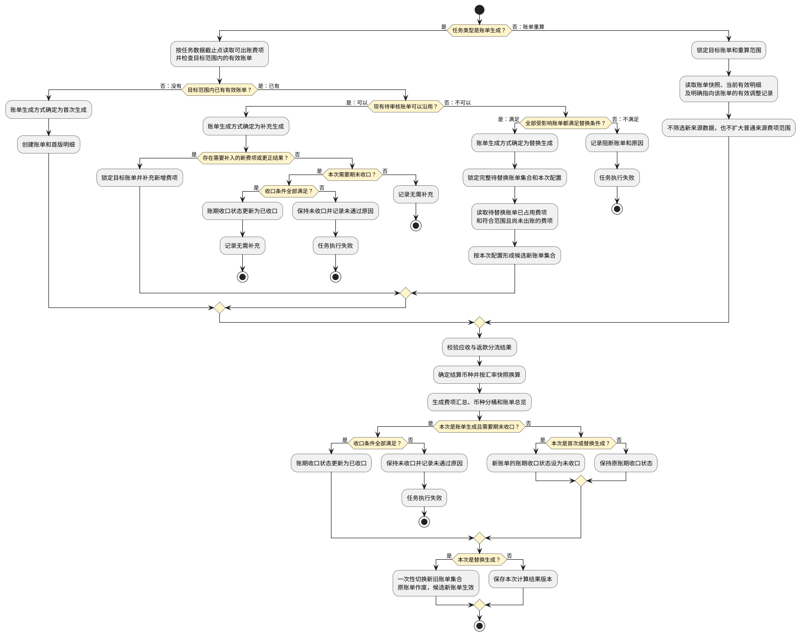

# 第010篇

> 本篇定位：账单生成重算与变更分流；主要内容：账单生成、重算、结果状态与变更分流；文档角色：共享规则档；文档ID：4CA3C606DB

## 1. 第五步：如何生成新账单，或重算已有账单？

| 任务类型 | 本步骤要求 |
| :--- | :--- |
| 账单生成 | 以任务数据截止点为边界执行首次生成、补充生成或替换生成；期末任务还须判断是否完成账期收口。 |
| 账单重算 | 读取目标账单当前有效明细和定向调整记录，在锁定范围内重新计算，不扩大普通来源费项范围。 |

任务创建时必须确定任务类型。`账单生成`任务创建时的账单生成方式统一为`待判定`；系统取得执行权并锁定范围后，按以下顺序判定账单生成方式，财务不得直接指定：

1. 目标范围内不存在有效账单：判定为`首次生成`。
2. 已有从未发出的`待审核`账单，且本次采用的配置版本、实际账期、分组键和费项归属均可沿用：判定为`补充生成`。没有新增或更正结果时，以`无需补充`成功结束，不创建空结果版本。
3. 已有从未发出的`待审核`账单，但本次配置会改变账期范围、分组结果或费项归属，导致原账单不能继续沿用：在全部受影响账单均可替换时判定为`替换生成`。
4. 已有账单但既不能补充也不满足替换条件：任务失败，并明确提示阻断账单和原因；系统不得退回首次生成，也不得另建重复账单绕过占用关系。

补充生成与替换生成分别满足以下条件：

| 账单生成方式 | 必须同时满足的条件 |
| :--- | :--- |
| 补充生成 | 目标账单尚未发出且主状态为`待审核`；本次仍采用目标账单锁定的配置版本、实际账期和分组键；不会把目标账单已占用费项移动到其他账单。 |
| 替换生成 | 全部受影响账单均为从未发出的`待审核`账单；不存在核销、回款、返款等资金事实；没有其他执行中任务占用相同范围；系统能够一次性确定完整的待替换账单集合。 |

具体替换过程见[配置变了，怎样安全替换待审核账单？](#doc-4CA3C606DB-billing-calculation-63bd6948)。

`账单生成`完成费项入池后，根据任务数据截止点从费项池累计读取本次可出账费项。判定为替换生成时，还可在不释放原占用关系的前提下读取待替换账单已经占用的费项。

`账单重算`跳过来源处理，读取目标账单当前有效明细和本次允许带入的调整记录。

确定输入范围后，两种任务共同执行以下计算：

1. 承接应收与返款分流结果，并确认同一来源费项没有被两张账单重复收取。
2. 按任务类型和账单生成方式创建、补充、替换或刷新账单明细，同时保留费项池记录、来源订单和挂靠对象的关联关系。
3. 读取账单配置已经保存的费项结算币种，并按[汇率与金额换算](PRD.账单系统.第014篇.金额汇兑.27B80EF314.md#doc-27B80EF314-currency-exchange-d860ed63)和[多币种账单汇总](PRD.账单系统.第014篇.金额汇兑.27B80EF314.md#doc-27B80EF314-currency-exchange-5729dad4)形成结算币种金额、财务本位币金额、币种分桶和账单总览。
4. 将本次符合条件的新增、调整、冲正和往期承接记录纳入结果，并校验账单总额与明细汇总一致。
5. 保存新的结果版本；不得覆盖上一个已保存版本。

### 1.1 首次、补充和期末收口有何区别？

**首次生成**

1. 首次生成按任务执行快照引用的业务规则、处理范围和数据截止点筛选费项池记录，创建账单、账单编号、首版明细和首个结果版本。
2. 系统按`客户 + 所属店铺快照 + 账单类型 + 方案标识 + 配置编号 + 准确版本 + 实际账期 + 账单类型的其他分组维度`唯一识别同一张账单，不得重复创建。
3. 应收账单的其他分组维度为`业务板块 + 运抵国`，具体拆分规则以[自动拆单](PRD.账单系统.第011篇.应收账单.88A604AED3.md#doc-88A604AED3-receivable-bill-feb17ffe)为准；返款账单没有店铺之外的其他分组维度。
4. 首次生成不要求账期已经结束。账期结束前手动生成成功时，账单进入`待审核`，账期收口状态为`未收口`；页面必须显示`账期未结束`提示。普通`审核通过`和直接发送不可用，但具有审核权限的财务可以发起[账期还没结束，怎样提前收口并审核？](#doc-4CA3C606DB-billing-calculation-7e705a70)。
5. 账期已经结束时，手动或自动首次生成任务必须标记需要期末收口；通过全部收口条件后同时完成期末收口，未通过时按本节期末收口失败规则处理。

**补充生成**

1. 目标账期已经存在从未发出的有效待审核账单且继续使用原配置时，账单生成方式确定为`补充生成`。补充生成沿用目标账单锁定的配置版本，只查找原账单范围内尚未归入有效账单的新费项或更正费项。
2. 补充生成保留原账单编号，在同一账单下保存新的结果版本，并保留补充前版本、本次新增明细和金额变化。
3. 补充生成不得把当前最新配置造成的范围变化混入原账单；需要改用新版配置时必须执行[配置变了，怎样安全替换待审核账单？](#doc-4CA3C606DB-billing-calculation-63bd6948)。
4. 账期结束前允许多次补充生成。账期结束后的自动或手动期末任务仍须重新检查数据完整性，不得仅因已有账单而跳过。

**提前生成后又有新费用，怎么办**

1. 新增来源记录或尚未入池的来源记录发生变化时，本次任务先按最新有效数据完成费项入池，再执行补充生成。
2. 原费用已经成功进入`BMS费项池`时，不得通过重新读取来源数据覆盖原始费项；必须形成可追溯的更正、调整或冲正费项，再由补充生成或重算纳入账单。
3. 变化只影响非金额展示字段时，只刷新展示关系，不创建执行账单生成的BMS任务，不改变账单结果版本。
4. 已收口但尚未发出的账单出现会影响范围或金额的数据变化时，按以下规则处理：
   - 在相关费项入池或账单生成任务创建成功时，立即把账期收口状态改为`未收口`并禁用普通审核和发送，不得等到任务开始执行。
   - 任务删除或结束后，系统重新执行收口校验；全部条件再次满足时恢复为`已收口`。
   - 财务确需缩短实际账期时，必须等同范围任务全部结束后再执行提前收口。
   - 已经发出的账单不得重新打开收口状态，晚到费用按调账、冲正或后续账单规则处理。

**期末收口**

1. 期末收口既不是任务类型，也不是账单生成方式。系统期末任务由定时机制创建，任务类型为`账单生成`；财务在账期结束后主动处理时也创建`账单生成`任务。系统按已有账单和配置影响判定首次生成、补充生成或替换生成，并在执行后记录`已收口`或`未收口`。
2. 账期收口状态只有同时满足以下条件时才能更新为`已收口`：
   - 数据截止点已经覆盖账期结束时间；
   - 截止点以内符合来源规则、账期、履约节点和限定情形的来源记录均已形成完整入池结果，不存在仍为`未处理（null）`或`处理中（locked）`的应处理记录；
   - 除本次收口任务外，同一来源处理范围和账单计算范围内不存在`待执行`、`执行中`或尚未删除的`执行失败`任务；
   - 账期内符合配置的费项均已归入对应账单，或已经记录不归入本账单的明确原因；
   - 账单明细汇总、币种分桶和账单总额一致。
3. 标记为期末收口的任务未通过任一收口条件时，账单保持`未收口`，任务进入`执行失败`并列出未通过条件；财务补齐数据或处理阻断任务后，重新执行原任务。
4. 自动期末任务发现账单已经`已收口`时，仍须校验数据截止点和完整性；全部满足时记录`无需补充`并成功结束，不创建重复账单或结果版本。
5. 自动触发与手动触发同时命中同一账单计算范围时，以已经创建并占用范围的任务为准：
   - 后发触发不得再创建同范围任务，页面或调度记录返回已存在的任务编号。
   - 自动调度在下一次触发时重新校验。
   - 财务需要继续处理时，应重新执行或删除既有失败任务后再发起，不得重复生成或重复占用费项。

**一个账期怎样从提前生成走到收口**

| 顺序 | 账期内发生的事情 | 账单结果 |
| :--- | :--- | :--- |
| 1 | 财务在账期结束前手动生成账单。 | 没有目标账单时执行首次生成；账单进入`待审核 + 未收口`，可以查看、继续补充，或在确认截断范围后提前收口并审核。 |
| 2 | 账期继续进行，系统每天同步新产生且已满足归集条件的费项。 | 新费项先进入BMS费项池，不直接改写账单。 |
| 3 | 财务再次手动生成，或等待期末任务。 | 已有符合条件的待审核账单时执行补充生成，沿用账单编号和原配置版本，并保存新的结果版本。 |
| 4 | 到达账期结束后的期末任务时点。 | 系统再次完成费项入池、首次或补充生成及完整性校验；全部通过后把账期更新为`已收口`。 |
| 5 | 已收口但尚未发出的账单又出现影响金额或范围的数据变化。 | 账期先恢复为`未收口`，完成补充生成并再次通过收口校验后才可审核和发送。账单已经发出时不得重新打开收口状态。 |

### 1.2 重算能改什么，不能改什么？

重算前必须同时锁定`目标账单`和`重算范围`。重算范围支持整张账单、选中订单、选中费项、账单特调汇率、币种分桶或已审核调整记录；未明确选择的范围不得随本次任务变化。

**重算读取什么**

1. 读取目标账单锁定的配置、费项规则、费项结算币种、原汇率快照和当前有效账单明细。
2. 读取财务本次明确提交的账单特调汇率。
3. 读取已经审核生效、已经进入费项池且明确归属于目标账单的补录、调账或冲正记录。
4. 不读取尚未入池的业务来源，不重新执行账期、履约节点和限定情形筛选，也不因当前配置变化扩大账单范围。

**重算可以改变什么**

| 可变结果 | 处理规则 |
| :--- | :--- |
| 选中明细的结算金额 | 按目标账单口径和本次允许使用的汇率重新计算。 |
| 账单特调汇率及换算结果 | 只更新财务本次明确提交的货币对及其受影响金额。 |
| 币种分桶和账单汇总 | 根据重算后的有效明细重新汇总。 |
| 未结余额 | 在保留既有核销、收款、回款和返款事实的前提下重新计算。 |
| 调整或冲正后的净额 | 仅纳入已经审核生效并明确归属于目标账单的记录。 |

**重算不能改变什么**

1. 不得改变账单编号、客户、账单类型、账期、方案标识和原始账单配置版本。
2. 不得修改 `BMS费项池`中的原始金额、原始币种、来源对象或来源关系。
3. 不得把普通来源新费项直接作为重算输入；待审核账单的普通来源遗漏应走补充生成，账单已经发出时由调账或后续账单承接。
4. 不得物理删除原账单明细。错误明细必须通过失效标记、调整或冲正形成可追溯结果。
5. 不得清零、覆盖或倒推修改既有通知、审核、核销、收款、回款和返款记录。
6. 不得把重算后的最终应收或应返金额降到已核销金额以下，也不得直接形成无法结算的超收或超返结果。
7. 返款重算出现负数时，优先按[返款账单配置](PRD.账单系统.第005篇.客户级账单配置.B6349C60A4.md#doc-B6349C60A4-billing-config-23b922e3)选择的方式顺延到下期返款账单，或生成独立的应收调整费项，使当前返款账单不以负数结算。
8. 处理后仍与既有核销、回款或返款事实冲突时，再转入[调账中心](PRD.账单系统.第015篇.调账中心.17F89514C9.md#doc-17F89514C9-adjustment-center-98536490)。
9. 合法的红冲或负向调账明细不受上述限制。

重算成功后，系统在原账单下生成新的结果版本，记录重算范围、触发原因、重算前后金额及所用快照；原结果版本继续保留。重算失败时，原账单仍使用重算前的有效结果，不得暴露半成品金额。

**用三个场景理解重算范围**

| 场景 | 财务选择的范围 | 系统实际处理 |
| :--- | :--- | :--- |
| 修正个别费项金额 | 选中一条或多条账单明细 | 只重新计算选中明细；未选中明细沿用当前有效结果，随后基于全部有效明细重新汇总币种分桶、账单总额和未结余额。 |
| 修改某个货币对的账单特调汇率 | 选中该货币对 | 重新计算目标账单内所有使用该货币对的有效明细，不得只更新部分明细而使同一账单同时使用新旧两套汇率。 |
| 同时选择订单、费项和货币对 | 提交多个重算条件 | 先取各条件命中明细的并集；货币对命中范围大于手工勾选范围时，以完整货币对范围为准。页面必须在提交前展示最终受影响明细和预计金额变化。 |

### 1.3 配置变了，怎样安全替换待审核账单？

客户级账单配置变更不会自动改变已有账单。财务确认尚未发出的待审核账单需要采用新版配置时，必须从其中一张账单发起`账单生成`并选择新版配置；系统确认原账单不能沿用且满足替换条件后，才把账单生成方式判定为`替换生成`。不得直接覆盖原账单快照，也不得先作废原账单后再单独生成。

系统必须先按新版配置推演账期和自动拆单结果，再找出所有受影响的旧账单，形成一个`替换批次`。一个替换批次可以包含一张或多张待替换账单，也可以形成一张或多张候选新账单；新旧账单数量不必相同，但必须作为一个整体校验和切换。

**为什么替换不一定是一张旧账单对应一张新账单**

| 变化结果 | 典型配置变化 | 替换关系 |
| :--- | :--- | :--- |
| 账单边界不变，只改变账单内容 | 费项结算币种、限定情形或适用费项发生变化，但实际账期和拆单结果不变。 | 一张旧账单形成一张候选新账单。 |
| 一张旧账单被拆开 | 新版配置新增业务板块、运抵国等拆单维度，或原来合并的范围改由不同方案承接。 | 一张旧账单形成多张候选新账单。 |
| 多张旧账单被合并 | 新版账期或拆单口径使多张从未发出的待审核账单落入同一新账期和同一账单分组。 | 多张旧账单形成一张候选新账单。 |
| 边界和拆单结果同时变化 | 账期切换与自动拆单规则同时变化。 | 多张旧账单可形成多张候选新账单。 |

只要替换批次中的任一旧账单已经发出、已发生资金事实或不满足替换条件，整个替换批次都不得执行，不能只替换其中一部分。

**允许替换的条件**

1. 待替换账单集合中的每张账单主状态均为`待审核`。
2. 每张待替换账单的`账单发出时间`均为空，且尚未通过邮件、客户端或其他方式向客户开放查看、下载或送达。
3. 每张待替换账单均不存在核销、收款、回款、返款等资金事实。
4. 待替换范围内不存在审核、发送、补充生成、其他替换生成或重算任务，也不存在尚未删除的同范围失败任务。
5. 新版配置已经通过完整性校验，且处于`生效`状态，或处于仅与本次替换绑定的`待生效`状态；财务必须明确选择本次使用的配置版本。
6. 新版配置已经生效时，候选新账单集合的实际账期必须完全落在新版配置的有效范围内；新版配置仍待生效时，必须按待替换账单集合确定`T`并与本次替换同步生效。
7. 候选新账单必须按对应账单模块的拆单规则生成；候选范围不得与替换批次以外的有效账单、待执行任务、执行中任务或尚未删除的失败任务重叠。

邮件`通知失败`或`未配置邮箱`不能单独证明账单尚未发出。只要账单已经在客户端发布或通过其他方式送达，系统就必须记录`账单发出时间`并禁止替换生成，跨渠道发出判断见[集运客门户账单列表](PRD.账单系统.第017篇.账单通知.F82B342382.md#doc-F82B342382-portal-bill-list)。待结清账单因客户异议折返`待审核`后，账单发出时间仍然保留，因此同样不得作废或替换生成。

**财务确认什么**

执行前，页面必须展示并确认以下差异：

| 对比区域 | 展示内容 | 交互与约束 |
| :--- | :--- | :--- |
| 账单身份 | 客户、账单类型、待替换账单清单、候选新账单清单、原配置版本、新配置版本 | 客户或账单类型不一致时不得提交；系统必须明确展示一对一、一对多、多对一或多对多关系。 |
| 账期变化 | 原实际账期集合、新实际账期集合、账期类型、切换时点和截断账期 | 新实际账期不得与替换批次以外的有效账单重叠。 |
| 范围变化 | 履约节点、限定情形、默认与分支方案、费项范围 | 分别展示新增、移出和仍保留的费项范围。 |
| 金额变化 | 费项结算币种、汇率口径、分币种金额和账单总额 | 按币种展示预计差异，不得只展示本位币净差额。 |
| 操作确认 | 替换原因、影响说明 | 替换原因必填，财务确认后创建任务。 |

**怎样避免原账单先失效**

1. 替换任务创建成功后，系统立即锁定待替换账单集合、原费项占用范围和新版配置。锁定解除前，待替换账单不得审核、发送、补充生成、再次替换、重算或核销；页面必须展示`替换处理中`或`替换待处理`提示。
2. 系统按新版配置生成候选新账单集合。候选账单在任务成功前不得对外可见、不得参与审核、发送或核销；与本次替换绑定的待生效配置也不得被其他任务使用。
3. 候选新账单允许在计算时引用待替换账单占用的费项，但不得提前释放、转移或修改原占用关系。
4. 候选新账单完整生成并通过金额、费项去向、重复占用、自动拆单和账期重叠校验后，系统在一次结果切换中启用待生效的新配置、将全部待替换账单转为`已作废`、释放原占用关系，并使全部候选新账单成为有效账单。新版配置原本已生效时，只切换新旧账单集合。
5. 替换生成失败时，待替换账单继续保持有效的`待审核`状态、原收口状态和原结果版本；候选结果不得展示或占用费项。替换锁和待生效配置绑定继续保留，财务只能重新执行或删除失败任务。
6. 财务删除失败的替换任务后，系统删除候选结果、解除待替换账单和费项范围锁、解除待生效配置绑定并重新校验`T`；原账单恢复替换前允许的操作，新版配置不得自动生效。
7. 新账单必须使用新的账单编号，原账单编号不得复用。系统使用独立的`账单替换关系`记录替换批次、每张旧账单和每张新账单的对应关系，不在账单主表中使用方向含糊的单值`替换账单号`或`被替换账单号`表达多账单关系。
8. 新账单的账期收口状态根据实际账期和本次数据完整性重新判断。账期未结束或未通过收口校验时为`未收口`，不得沿用原账单的`已收口`结果。

**被新版配置移出的费项怎么办**

1. 每条原账单有效明细在替换结果中必须有且只有一个明确去向：归入某张候选新账单、转为已审核调整记录，或标记为`配置移出待处理`。存在未确定去向或重复去向时，替换任务不得成功。
2. 仍符合新版配置但因账期或自动拆单结果变化而转移的费项，必须归入对应候选新账单，并保留原账单、替换批次和新账单关系。
3. 不再符合新版配置且无法归入其他候选新账单的费项，释放原账单占用后标记为`配置移出待处理`，记录原账单、原配置、新配置、移出原因和替换任务。该费项不得被同一配置和同一实际范围的后续普通生成任务自动归集。
4. `配置移出待处理`费项只有在后续生效配置明确重新纳入，或财务通过调账中心确认处置后，才能重新参与账单计算；系统不得因其处于未占用状态而自动归入其他账期。

`已作废`是账单的最终状态。已作废账单只允许查询、导出内部留档和审计追溯，不得重新启用、审核、发送、核销、重算或再次替换；其账单明细、配置快照、金额结果、任务记录和作废原因不得删除。

### 1.4 调账、冲正和费用重整如何参与计算？

调账、冲正、费用重整、核销记录冲正及其审核和归属规则统一见[调账中心](PRD.账单系统.第015篇.调账中心.17F89514C9.md#doc-17F89514C9-adjustment-center-98536490)。

1. `账单生成`：生成前已经审核生效、已进入 `BMS费项池`且符合本期配置范围的调整记录，可以与普通来源费项一起进入本次账单结果。
2. `账单重算`：只读取已经审核生效、已进入 `BMS费项池`且明确指向目标账单的调整记录，不得把未指定目标账单的调整记录自动纳入。
3. `两类任务的共同规则`：任何任务都不得直接修改原费用、原核销记录或往期账单快照。

## 2. 第六步：计算完成后，系统保存什么，账单变成什么状态？

`账单生成`或`账单重算`任务成功后，系统先保存本次结果和计算依据，再按任务类型和账单生成方式处理账单主状态与账期收口状态，并记录任务的`收口结果`。

`结果快照`用于追溯金额计算过程。主状态表示账单所处的财务环节；账期收口状态决定账单能否按常规路径审核和发出。未收口账单只有在完成提前收口后才能推进审核。

| 处理方式 | 结果保存 | 主状态处理 | 账期收口状态处理 |
| :--- | :--- | :--- | :--- |
| 首次生成 | 保存首个结果版本。 | 新账单进入`待审核`。 | 账期未结束或未通过收口校验时为`未收口`；期末生成通过完整性校验时为`已收口`。 |
| 补充生成 | 在同一账单下保存新结果版本并保留补充前版本。 | 保持`待审核`。 | 影响已收口结果的数据变化先置为`未收口`；通过期末收口校验后恢复`已收口`。 |
| 替换生成 | 保存候选新账单集合的首个结果版本、替换批次和新旧差异。 | 成功后原账单集合进入`已作废`，候选新账单集合进入`待审核`；失败时原账单集合不变。 | 每张新账单分别重新判断，不继承原账单收口状态。 |
| 账单重算 | 在原账单下保存新的重算结果版本，并保留重算前版本。 | 不因重算成功自动推进主状态；待审核账单保持`待审核`。 | 不涉及来源范围变化时保持原收口状态。 |

生成和重算都必须采用完整成功后再切换有效结果的方式。任务自动重试期间或进入`执行失败`时，页面、导出、通知和核销继续读取上一个有效结果版本。

### 2.1 每个结果为什么都能追溯？

每次生成或重算成功后，系统必须保存以下结果：

1. 任务、账期、方案标识、方案名称、方案类型和限定范围快照。
2. 客户侧费项、来源数据集、场景取值规则和费项结算币种快照。
3. 费项池记录、账单明细、来源订单和挂靠对象关系。
4. 汇率来源、换算方向、锁定汇率、币种分桶和账单金额快照。
5. 调账、冲正、核销、回款和返款的关联结果。
6. 本次任务类型、账单生成方式、收口结果、上一结果版本、本次结果版本、计算前后金额和差异明细。

首次生成形成账单首个结果版本；补充生成和账单重算形成同一账单的后续结果版本；替换生成为候选新账单集合分别形成首个结果版本。每个后续版本必须关联上一版本并标明产生方式，每个替换生成结果必须通过替换批次建立新旧账单集合之间的关系。

### 2.2 账单处于不同状态时，还能做什么？

任务状态与账单状态相互独立。任务`执行成功`只表示本次处理完成，不代表账单已经审核、发出或结清；任务`执行失败`也不得回退账单状态。账单主状态、账期收口状态和账单发出时间共同决定后续允许的操作，具体处理路径见[再确认：当前账单状态允许怎么处理？](#doc-4CA3C606DB-billing-calculation-449d46f8)。

普通审核只对`待审核 + 已收口`账单开放。`待审核 + 未收口`账单必须按[账期还没结束，怎样提前收口并审核？](#doc-4CA3C606DB-billing-calculation-7e705a70)先完成截断和收口，才能审核和发出。账单一旦发出，既有通知和资金事实必须保留；已结清账单不支持反核销，核销错误须通过[调账中心](PRD.账单系统.第015篇.调账中心.17F89514C9.md#doc-17F89514C9-adjustment-center-98536490)新增核销记录冲正。

### 2.3 账期还没结束，怎样提前收口并审核？

`提前收口并审核`适用于财务需要在原账期结束前，先把当前已经形成的账单发给客户对账的场景。它不是直接审核未收口账单，而是把原完整账期截短为一个实际账期，完成该范围的收口校验后再审核。

**什么情况下允许提前收口**

1. 账单主状态必须为`待审核`，账期收口状态为`未收口`，且账单从未通过邮件、客户端或其他方式向客户发出。
2. 当前时间必须早于原账期结束时点。原账期已经结束但因数据不完整、任务失败或配置问题仍为`未收口`时，不得使用提前收口绕过问题，必须补齐数据并完成常规期末收口。
3. 账单不得存在核销、收款、回款、返款等资金事实；冲正记录必须全部审核通过。
4. 同一来源处理范围和账单计算范围内不得存在`待执行`、`执行中`或尚未删除的`执行失败`任务，也不得存在其他正在进行的审核、补充生成、替换生成或重算操作。
5. 截断点固定为账单当前有效结果版本的数据截止点，不允许在审核弹窗中手工改写；系统必须通过截止点以内的来源完整性、费项归属、币种分桶和金额一致性校验。财务需要采用其他数据截止点时，必须先完成对应账单生成任务并形成新的有效结果版本，再重新发起提前收口。
6. 截断后的实际账期必须与同一配置范围内的其他有效账单按数据截止点首尾连续，不得重叠或留下无人承接的时间范围。配置版本恰好在剩余范围内切换时，按[配置改了，旧账单怎么办，新费项归谁？](PRD.账单系统.第008篇.任务快照与配置衔接.A82E89D72C.md#doc-A82E89D72C-task-snapshot-ab6c0655)确定后续归属。
7. 返款账单采用`半周`账期时，截断后的单个实际账期仍不得少于3天。

**财务需要确认什么**

| 确认项 | 页面展示 | 交互与约束 |
| :--- | :--- | :--- |
| 原账期 | 原账期类型、原账期起始日、原账期结束日 | 只读展示，不因提前收口改写客户级账单配置。 |
| 截断结果 | 截断后的实际账期、数据截止点、剩余待出账范围 | 数据截止点读取当前有效结果版本并保持只读；实际账期结束日取数据截止点所在日期，系统内部仍按精确到秒的数据截止点划分新旧范围。 |
| 账单结果 | 截断范围内的费项数量、币种分桶、账单金额、未处理记录和未完成任务 | 存在未处理记录、金额不一致或范围冲突时不得提交。 |
| 后续归属 | 截断点之后的剩余账期、预计期末生成时间、适用配置版本 | 必须明确告知剩余范围将形成后续账单，不会继续补入本账单。 |
| 操作确认 | 提前收口原因 | 原因必填；按钮统一命名为`提前收口并审核`，不得使用含义不清的普通`审核通过`。 |

**确认后系统怎样处理**

1. 系统必须在同一次结果提交中完成截断范围校验、更新实际账期结束日、写入`截断账期`标记、把账期收口状态更新为`已收口`、记录审核结果并将账单推进至`待结清`。任一步失败时全部回滚，账单继续保持`待审核 + 未收口`。
2. 系统不得产生`待结清 + 未收口`的中间状态。提前收口成功后，账单配置快照、汇率快照、当前有效结果版本、实际账期和数据截止点一并锁定，不得通过补充生成追加费项。
3. 原账期中截断点之后的日期形成`剩余待出账范围`。系统日常任务继续把符合条件的费用写入`BMS费项池`；财务再次手动生成或原账期到达期末时，只能针对尚未被有效账单覆盖的剩余范围生成新账单，不得重新生成原完整账期。
4. 账单发出后才到达BMS费项池、但按业务日期本应归入已截断范围的晚到费项，不得回写或补充生成到该账单；应按[再确认：当前账单状态允许怎么处理？](#doc-4CA3C606DB-billing-calculation-449d46f8)由调账、冲正、其他当前账单或后续账单承接，并保留原账期、原账单和晚到原因。
5. 账单对账报表、列表、详情和客户通知必须同时展示`截断账期`标记、实际账期起止日和数据截止点，不得只展示原账期名称，使客户误认为账单覆盖完整周期。
6. 系统必须记录原账期、截断后的实际账期、数据截止点、剩余待出账范围、提前收口原因、审核人、审核时间、审核结果和客户通知结果，供后续对账和审计追溯。

### 2.4 账单结清后，来源系统还要更新什么？

账单核销完毕并进入`已结清`后，系统将数据源中与该账单关联的全部费项支付状态更新为`已支付`。该动作只更新支付状态，不得改写费项金额、币种、汇率、账单快照或历史核销结果。

## 3. 第七步：账单生成后又有变化，应该走哪条路？

账单生成后出现变化时，先判断`发生了什么变化`，再判断`当前账单状态是否允许处理`。不得用重算补入普通来源新费项，不得用补充生成套用新版配置，也不得删除账单后重新生成。

### 3.1 先分清：是新费用、配置变化，还是金额重算？

| 发生的变化 | 应选处理方式 | 处理规则 |
| :--- | :--- | :--- |
| 出现尚未同步、尚未入账或已经形成更正记录的新费项，且继续使用原配置 | 补充生成 | 先完成费项入池，再把新费项补入同一张未发出的待审核账单；影响已收口结果时，先改为`未收口`，补充后重新校验收口。 |
| 财务要求未发出的待审核账单改用新版配置 | 替换生成 | 按[配置变了，怎样安全替换待审核账单？](#doc-4CA3C606DB-billing-calculation-63bd6948)生成候选新账单集合；成功后一次性作废原账单集合并启用候选新账单集合。 |
| 已有账单明细、账单特调汇率或已审核调整记录需要重新计算 | 账单重算 | 锁定目标账单和重算范围，只更新允许变化的计算结果，不扩大普通来源费项范围。 |
| 同时出现新费项和已有结果变化 | 先补充生成，再重算 | 先得到包含新增费项的完整结果，再以该结果为基础重算。 |
| 发生调账、冲正、费用重整或核销错误 | 调账中心处理 | 新增可追溯的调整或冲正记录，不得由重算直接修改原费项或原核销记录。 |
| 只变化非金额展示信息 | 刷新展示 | 不创建账单任务，不改变账单金额或结果版本。 |

### 3.2 再确认：当前账单状态允许怎么处理？

应收账单状态见[账单状态机](PRD.账单系统.第011篇.应收账单.88A604AED3.md#doc-88A604AED3-receivable-bill-16ae68e0)，返款账单状态见[返款账单状态机](PRD.账单系统.第012篇.返款账单.A4A4EF02F0.md#doc-A4A4EF02F0-refund-bill-890fe9a2)。

多币种结清条件见[多币种核销](PRD.账单系统.第014篇.金额汇兑.27B80EF314.md#doc-27B80EF314-currency-exchange-54087816)。共同处理边界如下：

| 当前账单情况 | 允许处理 | 不允许处理 |
| :--- | :--- | :--- |
| 从未发出的`待审核`账单 | 补充生成、替换生成、重算；发生影响范围或金额的变化后重新校验账期收口；`已收口`时普通审核，`未收口`时可确认提前收口并审核 | 删除账单、覆盖原结果、直接形成`待结清 + 未收口`或跳过影响预览 |
| 已经发出后折返为`待审核` | 在保留既有通知和资金事实的前提下重算、调账或冲正 | 补充生成、替换生成、作废或清空原核销记录 |
| `待结清`账单 | 因客户异议先按对应账单模块规则折返`待审核`，再按允许范围修正 | 直接替换生成、删除账单或覆盖已生效资金事实 |
| `已作废`账单 | 查询、内部留档和审计追溯 | 重新启用、审核、发送、核销、重算或再次替换 |
| `已结清`账单 | 调账中心新增冲正记录，或由其他当前账单、后续账单承接差异 | 重新打开、重算、反核销或修改原记录 |

`晚到费项`是指费用发生时间或原应归属账期早于其进入BMS费项池的时间，导致相关账单生成时尚未取得该费项。晚到费项按相关账单当前阶段处理：

| 相关账单阶段 | 处理方式 | 必须保留的信息 |
| :--- | :--- | :--- |
| 从未发出的`待审核 + 未收口` | 通过补充生成归入原账单。 | 本次入池时间、补充任务和新增结果版本。 |
| 从未发出的`待审核 + 已收口` | 先恢复为`未收口`，完成补充生成和收口校验后再恢复`已收口`。 | 原收口结果、重新打开原因、本次补充任务和新收口结果。 |
| 已经发出后折返为`待审核`，或仍为`待结清` | 不得补充生成；通过调账、冲正或其他当前账单承接差异。 | 原订单号、原账期、原账单号、费用发生时间、归集时间及承接账单。 |
| `已结清` | 不得重新打开或重算；通过调账中心或后续账单承接差异。 | 原订单号、原账期、原账单号、费用发生时间、归集时间、调整记录及承接账单。 |

### 3.3 返款账单还有哪些额外限制？

返款账单与应收账单的独立性、占用关系和扣减优先级见[返款账单和应收账单的关联性](PRD.账单系统.第012篇.返款账单.A4A4EF02F0.md#doc-A4A4EF02F0-refund-bill-2591ef54)，返款账单状态和`逾期未结清`边界见[返款账单状态机](PRD.账单系统.第012篇.返款账单.A4A4EF02F0.md#doc-A4A4EF02F0-refund-bill-890fe9a2)。返款重算不得改写应收账单；确需形成应收金额时，只能按返款账单配置生成独立的应收调整费项。
