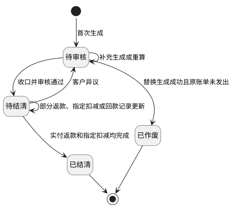

# 第012篇

> 本篇定位：返款账单；主要内容：返款账单模块与 COD 回款记录、汇兑损益；文档角色：模块档；文档ID：A4A4EF02F0

## 1. 返款账单模块

[🔗原型链接](http://localhost:4181/#/billing/refund-bills)

### 1.1 模块总览

返款账单模块用于把 COD 业务订单的应付返款及手续费，与其尾程包裹的回款事实整理为客户可核对、财务可审核、可执行返款和可追溯结清的账单结果。模块的核心结果不是“把到付总额原样返给客户”，而是依次确定到付总额、到付附加费、应付返款本金、返款账单指定扣减费项、换算前的实付返款（准）和最终实付返款。

本章统一定义返款账单的金额、归集、状态、审核、核销、返款、回款记录、汇兑损益和输出规则。COD 尾程包裹回款统一通过订单费用报表导入，不设置独立的回款管理页面；导入形成的包裹级回款记录和订单级汇兑损益在返款账单详情中统一呈现与跟踪。回款记录和汇兑损益只用于财务跟踪与分析，不参与返款账单的金额计算、核销和结清判断，也不进入面向客户的账单输出。OIS 来源表、字段结构和导入事实统一见[客户侧费项的 OIS 数据源](PRD.账单系统.第021篇.OIS客户侧费项数据.A6A29BE637.md#doc-A6A29BE637-ois-fee-data-ad5529f1)；币种和汇率快照统一见[金额汇兑](PRD.账单系统.第014篇.金额汇兑.27B80EF314.md#doc-27B80EF314-currency-exchange-e7e21dd6)。

### 1.2 需求背景

尾程派送商向收件人收取的 COD 到付金额中，可能同时包含应返给客户的代收货款和已经向收件人收取的到付附加费。尾程派送商应把完整到付金额返给财务；财务不得把完整到付金额直接返给客户，否则会把不属于代收货款本金的到付附加费一并返还。若返款账单的指定扣减费项未单独处理，又会把应由客户承担的费用从返款结果中遗漏或重复计费。

因此，返款账单必须先在目的国币种中拆出代收货款本金（该币种同时是到付金额、到付附加费总额与应付返款的原始币种），再扣除返款账单明确指定的扣减费项，得到换算前的`实付返款（准）`；最后按[返款账单怎样确定结算币种和金额？](PRD.账单系统.第005篇.客户级账单配置.B6349C60A4.md#doc-B6349C60A4-billing-config-e5cbf17a)锁定返款汇率，并换算为客户实际收款的货款结算币种。

订单费用报表只提供`实收回款`和`回款汇率`，不提供返款金额或返款汇率。

签收返款和回款返款只是“何时具备返款条件、何时锁定回款事实”的两种配置方式，不能改变上述金额顺序。

### 1.3 核心概念

本章中的`回款`和`返款`均以财务为观察主体：资金回到财务称为回款，资金由财务返还给客户称为返款。

| 概念 | 定义 | 说明 |
| :--- | :--- | :--- |
| `回款` | 尾程派送商从收件人收取到付金额后，将该到付金额返给财务 | 资金方向为`收件人 → 尾程派送商 → 财务`；回款对象是完整的到付金额。 |
| `返款` | 财务将代客户收取的货款返还给客户 | 资金方向为`财务 → 客户`；返款对象是代收货款，不包含到付附加费。 |
| `应收回款（即到付金额）` | 尾程派送商应返给财务的 COD 总额 | `到付金额 = 代收货款 + 到付附加费`，因此到付金额不等于应返给客户的代收货款。 |
| `到付附加费总额` | 随 COD 一起向收件人收取、但不属于代收货款本金的费用合计 | 例如`超材费（到付）`；先从到付总额中扣除，再确定应付返款本金。 |
| `应付返款（即代收货款）` | 从到付总额中扣除到付附加费后的代收货款本金 | 按`应收回款（即到付金额） - 到付附加费总额`计算，对应 OIS 订单侧`cod_price - dest_country_surcharge_amount`；以货款原始币种记录，是计算`实付返款（准）`的原始金额。 |
| `代收货款手续费` | 因代收货款业务产生、可按返款配置从返款中扣减的费用 | OIS按包裹计算后汇总形成业务订单级机算结果，并直接挂靠业务订单；BMS读取该结果，命中直接扣减配置时进入返款账单，同一业务订单只计入一次。 |
| `实收回款` | 订单费用报表导入的包裹侧回款事实 | 直接挂靠尾程包裹，表示尾程派送商实际返给财务的金额；系统直接读取导入值，不按公式生成。未导入回款汇率时按目的国币种记录，导入回款汇率时按财务本位币（CNY）记录。 |
| `回款汇率` | 订单费用报表导入的回款汇率 | 表示`订单目的国币种 → 财务本位币（CNY）`的汇率；系统直接读取导入值。 |
| `返款汇率` | 返款账单锁定的`货款原始币种 → 货款结算币种`汇率 | 按[汇率层级](PRD.账单系统.第014篇.金额汇兑.27B80EF314.md#doc-27B80EF314-currency-exchange-b119d22a)取得，用于把换算前返款金额换算为客户收款币种。 |
| `实付返款（准）` | 扣除指定扣减费项后的换算前返款金额 | `实付返款（准） = 应付返款 - 返款账单指定扣减费项`；以货款原始币种记录。 |
| `返款账单指定扣减费项` | 在返款账单中明确指定、从扣减前返款金额中扣除的客户应承担费用 | 例如`税金（账期支付）`；只有被指定后才参与本次返款扣减。 |
| `实付返款` | 按返款汇率换算后的最终返款金额 | `实付返款 = 实付返款（准） × 返款汇率`；以货款结算币种记录，实际返款完成后才形成已返金额。 |
| `签收返款` | 收件人签收后，先返还、后回收 | 适用于需要先垫资的场景。 |
| `回款返款` | 收件人签收后，先回收、后返还 | 适用于先收到货款再返还的场景。 |
| `正常签收` | COD 包裹末条轨迹状态为`已妥投`或`出柜`（[广义签收](PRD.账单系统.第003篇.业务系统基本面.A231A39E11.md#doc-A231A39E11-business-baseline-9512412e)轨迹状态表前两行） | 正常签收包裹进入返款结算范围，按返款模式参与归集与计算；回款事实以订单费用报表导入为准。 |
| `异常签收` | COD 包裹末条轨迹状态为`退件登记`、`退回妥投`、`退货收货`或`退货上架`（[广义签收](PRD.账单系统.第003篇.业务系统基本面.A231A39E11.md#doc-A231A39E11-business-baseline-9512412e)轨迹状态表后四行），例如拒收、退件或退货 | 异常包裹不形成自身回款事实；业务订单全部包裹均异常签收时整单不进入返款计算，一票多件中部分包裹异常时整票仍按订单级金额返款，异常原因在明细中标注并仅作跟踪。 |
| `汇兑损益` | 同一换算前返款金额分别按回款汇率和返款汇率折算产生的差额 | 在返款账单中计算，仅财务可见，不进入客户对账报表；具体口径见[返款账单怎样计算汇兑损益？](PRD.账单系统.第014篇.金额汇兑.27B80EF314.md#doc-27B80EF314-currency-exchange-a4f16295)。 |

关键规则：

1. 返款账单与应收账单可独立按各自账期运行，不要求同周期对齐。
2. 返款账单按 COD 业务订单归集`应付返款`和`代收货款手续费`；尾程包裹只提供签收和`实收回款`事实，回款记录在返款账单详情中随对应业务订单一并呈现。回款记录只用于判断`回款返款`模式的归集条件以及财务跟踪和汇兑损益计算，不影响返款金额、扣减核销或账单结清判断。包裹回款记录属于来源侧资金事实，直接挂靠尾程包裹，不属于核销、返款登记或收款等账单侧资金事实，分类见[资金事实分为哪两类？](PRD.账单系统.第010篇.账单生成重算与变更分流.4CA3C606DB.md#doc-4CA3C606DB-billing-calculation-funds-fact-classification)。返款账单替换生成或提前收口时，回款记录不作为阻断条件，但必须保持与来源导入记录、尾程包裹和业务订单的映射并只读呈现，不复制、不删除、不修改：替换成功后新账单继续引用同一批回款记录，被移出账单范围的记录不再随新账单展示，提前收口截断后晚到的回款只更新跟踪展示，不改变账单结果。异常签收包裹不形成自身回款事实，在账单明细中标注异常原因作跟踪；业务订单全部包裹均异常签收时整单不进入返款计算，一票多件部分异常时整票仍按订单级金额返款。
3. 到付附加费和返款账单指定扣减费项均在货款原始币种中依次扣除：前者决定应付返款本金，后者决定换算前的`实付返款（准）`。两类费用不得互相替代，也不得在应收账单和返款账单中重复核销。
4. 回款金额以尾程派送商应返给财务的完整到付金额为基础；返款金额以从到付金额中扣除到付附加费后得到的代收货款为基础。

#### 1.3.1 返款金额从哪里取？

返款账单同时引用订单侧金额和订单费用报表导入形成的包裹侧事实，但两类数据的用途不同：

1. OIS 在订单侧机算并挂靠`到付金额`（`cod_price`）与`到付附加费总额`（`dest_country_surcharge_amount`）；BMS 读取后按`应付返款（即代收货款）= cod_price - dest_country_surcharge_amount`计算订单级应付返款，再按业务订单归集。`代收货款手续费`由 OIS 机算形成并直接挂靠业务订单，BMS 只读取结果并按业务订单归集。订单侧其他名称相近的金额字段（例如`collection_price`）不作为应付返款计算输入；到付金额同时保留用于核对该订单的 COD 业务背景。
2. `实收回款`和`回款汇率`来自订单费用报表导入，直接挂靠对应尾程包裹，继续作为回款链路的金额和汇率事实。`ofp_ofdb1.sale_order_package_fee`下的金额均为尾程包裹级导入值，不是OIS机算值；包裹导入手续费与订单级机算手续费分别保留形成方式和挂靠对象，两者同时存在时按各自挂靠层级归集，不做覆盖、合并或冲突拦截。
3. 订单费用报表不导入新的`实付返款`和`返款汇率`；存量历史值不作为返款账单展示、结算币种、返款汇率或实付返款的计算输入。
4. 返款账单先在货款原始币种中计算`实付返款（准） = 应付返款 - 返款账单指定扣减费项`，再按账单锁定的返款汇率计算最终`实付返款`。
5. 字段名称相近不代表金额含义相同。系统不得仅凭中文字段名，把到付总额、代收货款本金、手续费、实收回款和账单计算的实付返款互相替代。
6. 返款账单明细必须分别保留业务订单和尾程包裹的挂靠关系，并明确区分订单级金额、包裹级回款事实和本账单计算结果。
7. 来源表、字段含义及当前数据核对事实统一见[返款账单怎样理解订单侧和包裹侧字段？](PRD.账单系统.第021篇.OIS客户侧费项数据.A6A29BE637.md#doc-A6A29BE637-ois-fee-data-a5752663)；本章不重复定义来源表结构。
8. 计算输入缺失或不可计算：`cod_price`、`dest_country_surcharge_amount` 任一为空、非数值或无法相减得出有效金额时，该业务订单不得进入本期返款账单，账单生成任务记录来源输入缺失并提示财务；补齐更正后按[返款账单还有哪些额外限制？](PRD.账单系统.第010篇.账单生成重算与变更分流.4CA3C606DB.md#doc-4CA3C606DB-billing-calculation-7ca5c0f8)处理。输入缺失不属于`负数金额处理方式`，只有金额可计算且`实付返款（准）`小于零时才进入负数处理。

一票多件怎样触发返款账单：

1. 一张业务订单包含多个尾程包裹时，`应付返款`和`代收货款手续费`仍各自只属于该业务订单，不拆分、复制或重复下挂到每个尾程包裹。
2. `回款返款`模式下，只要该业务订单任一尾程包裹已录入非空且非零的`实收回款`，该业务订单即满足“已回款”归集条件；不要求同一订单下所有尾程包裹都录入实收回款。
3. 首个符合条件的尾程包裹只负责触发订单归集。系统必须按业务订单去重，将订单级`应付返款`和命中直接扣减配置的`代收货款手续费`各计入返款账单一次。
4. 同一业务订单的其他尾程包裹后续录入实收回款时，只新增或更新对应包裹的回款事实，不得再次计入该订单的应付返款或手续费。
5. 包裹级`实收回款`不得复制到同一订单的其他尾程包裹，也不得自动拆分为订单下各包裹的回款金额。返款账单详情按业务订单展示订单返款数据行，每条订单行可展开为若干包裹回款数据行，承载该订单全部尾程包裹的回款数据；已导入回款的包裹行展示实收回款与回款汇率，未导入的标记为`待回款`，不因同订单其他包裹已回款而隐藏。包裹回款数据行不重复订单级`应付返款`、指定扣减金额和`实付返款`等计算结果。
6. `签收返款`模式仍以正常签收作为归集条件，不要求先录入实收回款；本节的一票多件回款触发规则不改变该模式的先返后回顺序。
7. 一票多件中部分包裹异常签收时，该业务订单仍按订单级金额整票返款：异常包裹只标记签收异常与`异常不回款`，不拆分订单级金额，也不改变整票应付返款和实付返款。业务订单全部包裹均异常签收时，整单不进入本期返款账单。

#### 1.3.2 同一费项进入应收账单，还是返款账单？

[🔗原型链接](http://localhost:4181/#/billing/refund-bills)

应收账单和返款账单可以引用同一订单、尾程包裹和来源明细，但结算目的不同：应收账单核对客户应向我方支付的费用，返款账单核对我方应返给客户的 COD 货款及本次返款扣减。系统必须按费项用途分流，不得仅按订单是否已入账判断归属。

| 来源金额或费项 | 应收账单 | 返款账单 | 归属口径 |
| :--- | :--- | :--- | :--- |
| 普通客户应付费用，例如运费 | 进入应收账单并参与应收核销 | 不进入返款账单 | 客户应向我方支付的服务费。 |
| 代收货款本金 | 不进入应收账单 | 作为`应付返款`参与返款核销 | 我方代客户收取、后续应返给客户的资金。 |
| 到付附加费，例如`超材费（到付）` | 不作为客户账期应收费重复核销 | 在目的国币种中先从到付总额扣除 | 该费用已随 COD 向收件人收取，用于确定代收货款本金，不属于返款账单指定扣减费项。 |
| 返款账单指定扣减费项，例如被指定的`税金（账期支付）` | 仅保留来源和关联关系，不参与应收核销 | 从`实付返款（准）`中扣除并参与返款核销 | 只有命中客户级返款账单配置中的直接扣减规则后，才进入返款扣减。 |
| 未被指定为返款扣减的账期支付费用 | 进入应收账单并参与应收核销 | 不进入返款账单 | 不能因同一订单存在返款账单，就自动改为返款扣减。 |

这里的`参与核销`表示金额进入该账单的应收 / 返款结算、已核销和待核销计算；`仅保留来源和关联关系`表示页面和导出可以展示其去向，但金额不进入该账单核销进度。

分流与防重规则如下：

1. 每笔来源费项必须先确定业务用途，再确定进入哪条账单线；一笔费项最多只能在一类账单中作为可核销金额出现。
2. 到付附加费和返款账单指定扣减费项是两个不同层级。到付附加费先按目的国币种从到付总额中扣除、决定代收货款本金，返款账单指定扣减费项再换算到同一货款原始币种后影响`实付返款（准）`，详见[到付金额、代收货款和实际返款如何区分？](#doc-A4A4EF02F0-refund-bill-a48f08d4)。
3. 只有命中返款账单指定扣减规则的费用，才能从返款金额中扣除；未命中的客户应付费用继续按应收账单规则处理。
4. 已被返款账单作为扣减金额占用的费项，应收账单只能关联展示，不得再次核销；已经进入应收账单核销的费项，也不得再转为返款扣减。
5. 系统发现同一来源费项同时成为两类账单的可核销金额时，必须阻止生成冲突结果并提示财务处理，不得静默按某一账单优先。
6. 来源费项必须保留账单类型、账单编号、账单期次和占用状态，供重算、调账和追溯时判断是否已经结算。

账期与展示规则如下：

1. 应收账单和返款账单分别读取各自配置、账期和触发时间，可以在不同日期生成，也可以归属不同账期。
2. 同一订单的普通应收费可能先进入应收账单，代收货款及指定扣减费项可能在回款条件满足后进入后续返款账单；账期不同不影响两者保持订单和包裹关联。
3. 账单详情应按费项粒度展示归属账单、账单期次和是否参与核销，不得只按订单粒度显示`已入账`。
4. 应收账单详情、返款账单详情和对账报表必须使用同一归属结果。
5. 两条账单线需要修正时分别处理：返款账单按[返款账单还有哪些额外限制？](PRD.账单系统.第010篇.账单生成重算与变更分流.4CA3C606DB.md#doc-4CA3C606DB-billing-calculation-7ca5c0f8)处理，应收账单按[账单生成/重算机制](PRD.账单系统.第007篇.BMS任务生命周期与操作.D94FE560DB.md#doc-D94FE560DB-task-lifecycle-48b1e1bb)处理；任一侧的修正不得反向改写另一侧已经核销的金额。

#### 1.3.3 到付金额、代收货款和实际返款如何区分？

返款账单不能把 COD 到付总额直接当作应返给客户的金额。一笔正常签收的 COD 包裹，至少要按以下顺序区分金额：

1. **先识别到付总额**：`应收回款（即到付金额）`是尾程派送商向收件人收取后，应完整返给财务的 COD 总额。
2. **再扣除到付附加费**：`到付附加费总额`是随 COD 一起向收件人收取、但不属于代收货款本金的费用，例如`超材费（到付）`。该金额先从到付总额中扣除，得到`应付返款（即代收货款）`。
3. **再扣除指定扣减费项**：把返款账单明确指定的扣减费项换算到货款原始币种后汇总，计算`实付返款（准） = 应付返款 - 返款账单指定扣减费项`。例如，`税金（账期支付）`只有在被指定为返款扣减费项后，才参与本次扣减。
4. **最后换算为客户收款币种**：按[返款账单怎样确定结算币种和金额？](PRD.账单系统.第005篇.客户级账单配置.B6349C60A4.md#doc-B6349C60A4-billing-config-e5cbf17a)匹配货款原始币种和货款结算币种，取得并锁定返款汇率，计算`实付返款 = 实付返款（准） × 返款汇率`。

两类费用的扣减对象不同，但都先在货款原始币种中处理：到付附加费先决定应付返款本金，返款账单指定扣减费项再决定换算前的`实付返款（准）`。到付附加费不会因为被从 COD 总额中扣除，就自动变成返款账单的指定扣减费项；返款账单也不得把同一笔费用在应收账单和返款账单中重复核销。

返款账单中，到付金额、到付附加费总额与应付返款（即代收货款）的原始币种始终一致，均为该业务订单的目的国币种；账单计算所称`货款原始币种`即该实际币种，不存在三笔金额分属不同币种的情形。

下表用两个相同业务金额的案例，说明货款原始币种与结算币种相同或不同时，返款账单怎样计算实付返款。两个案例的到付金额均为`70 TWD`，到付附加费均为`10 TWD`，因此应付返款均为`60 TWD`；指定扣减费项均为`20 TWD`，因此换算前的`实付返款（准）`均为`40 TWD`。绿色区域中的`实收回款`和`回款汇率`为订单费用报表导入的回款事实；粉色区域为返款账单计算结果。

<strong>示例一：货款原始币种与结算币种一致</strong>

  <table class="refund-amount-table">
    <tbody>
      <tr>
        <th class="green">应收回款（即到付金额）</th>
        <th class="green">回款汇率</th>
        <th class="green">实收回款</th>
        <th colspan="2" class="empty">&nbsp;</th>
      </tr>
      <tr>
        <td class="value">70 TWD</td>
        <td class="value">--</td>
        <td class="value">70 TWD</td>
        <td colspan="2" class="empty">&nbsp;</td>
      </tr>
      <tr>
        <td class="gray">到付附加费总额</td>
        <td colspan="4" class="empty">&nbsp;</td>
      </tr>
      <tr>
        <td class="value">10 TWD</td>
        <td colspan="4" class="empty">&nbsp;</td>
      </tr>
      <tr>
        <th class="pink">应付返款（代收货款）</th>
        <th class="pink">返款账单指定扣减费项</th>
        <th class="pink">实付返款（准）</th>
        <th class="pink">返款汇率</th>
        <th class="pink">实付返款</th>
      </tr>
      <tr>
        <td class="value">60 TWD</td>
        <td class="value">20 TWD</td>
        <td class="value">40 TWD</td>
        <td class="value">1</td>
        <td class="value">40 TWD</td>
      </tr>
    </tbody>
  </table>

<strong>示例二：货款原始币种与结算币种不同</strong>

  <table class="refund-amount-table">
    <tbody>
      <tr>
        <th class="green">应收回款（即到付金额）</th>
        <th class="green">回款汇率</th>
        <th class="green">实收回款</th>
        <th colspan="2" class="empty">&nbsp;</th>
      </tr>
      <tr>
        <td class="value">70 TWD</td>
        <td class="value">0.2</td>
        <td class="value">14 CNY</td>
        <td colspan="2" class="empty">&nbsp;</td>
      </tr>
      <tr>
        <td class="gray">到付附加费总额</td>
        <td colspan="4" class="empty">&nbsp;</td>
      </tr>
      <tr>
        <td class="value">10 TWD</td>
        <td colspan="4" class="empty">&nbsp;</td>
      </tr>
      <tr>
        <th class="pink">应付返款（代收货款）</th>
        <th class="pink">返款账单指定扣减费项</th>
        <th class="pink">实付返款（准）</th>
        <th class="pink">返款汇率</th>
        <th class="pink">实付返款</th>
      </tr>
      <tr>
        <td class="value">60 TWD</td>
        <td class="value">20 TWD</td>
        <td class="value">40 TWD</td>
        <td class="value">0.15</td>
        <td class="value">6 CNY</td>
      </tr>
    </tbody>
  </table>

示例一中，货款币种配置为`TWD → TWD`，同币种返款汇率固定为`1`，因此`40 TWD`的`实付返款（准）`换算后仍为`40 TWD`。示例二中，货款币种配置为`TWD → CNY`，账单锁定的返款汇率为`0.15`，因此最终`实付返款 = 40 TWD × 0.15 = 6 CNY`。两个示例的结算币种均由货款币种配置决定。

配置为`TWD → USD`时，系统必须取得并锁定`TWD → USD`返款汇率；配置为`其他 → USD`时，也必须按业务订单真实的货款原始币种取得对应的返款汇率。

计算关系如下：

1. `应付返款（即代收货款） = 应收回款（即到付金额） - 到付附加费总额`（对应 OIS 订单侧 `cod_price - dest_country_surcharge_amount`），两个示例均为 `70 TWD - 10 TWD = 60 TWD`。
2. `实付返款（准） = 应付返款 - 返款账单指定扣减费项`；两个示例均为`60 TWD - 20 TWD = 40 TWD`。
3. `实付返款 = 实付返款（准） × 返款汇率`；示例一为`40 TWD × 1 = 40 TWD`，示例二为`40 TWD × 0.15 = 6 CNY`。
4. `实收回款`由报表导入：示例一未导入回款汇率，实收回款按目的国币种记录为`70 TWD`；示例二导入回款汇率`0.2`，实收回款按财务本位币（CNY）记录为`14 CNY`。示例二的导入值与核对关系 `70 TWD × 0.2 = 14 CNY`一致。实收回款不等于客户最终收到的返款金额。
5. 表内所有相减和相加必须在同一币种下进行。指定扣减费项不是货款原始币种时，须先按账单锁定汇率换算为货款原始币种，再参与`实付返款（准）`计算。
6. 客户最终收到的金额以换算后的`实付返款`为准；未完成实际返款前，该金额属于待返金额，完成返款后才形成已返金额，不能仅凭计算结果把账单标记为已结清。
7. `实付返款（准）`小于零时，不得继续换算或执行负数返款；该业务订单的后续处理见[应付返款不足以覆盖指定扣减费项时怎样处理？](#doc-A4A4EF02F0-refund-bill-negative-amount)。

#### 1.3.4 应付返款不足以覆盖指定扣减费项时怎样处理？

当业务订单按`实付返款（准）= 应付返款 - 返款账单指定扣减费项`计算，且金额可计算的结果小于零时，说明该订单的`应付返款`不足以覆盖本次指定的扣减费项。负数只在货款原始币种中产生；系统不得把负数换算为`实付返款`，也不得生成负数待返金额、负数返款核销记录或负数账单汇总。`cod_price`、`dest_country_surcharge_amount` 等计算输入缺失或不可计算不属于本节范围，相关订单不得进入本期返款账单，按[返款金额从哪里取？](#doc-A4A4EF02F0-refund-bill-3b9f382c)的来源输入异常处理。

负数订单的处理方式由[返款账单配置](PRD.账单系统.第005篇.客户级账单配置.B6349C60A4.md#doc-B6349C60A4-billing-config-23b922e3)的`负数金额处理方式`决定；未选择时默认按`顺延到下期返款账单`处理。两种方式的业务结果如下：

| 处理方式 | 本期业务处理 | 后续处理 |
| :--- | :--- | :--- |
| `顺延到下期返款账单`（默认） | 系统按业务订单生成`负数承接记录`，保存负数金额、货款原始币种、客户、所属店铺快照、所属返款账单和产生账期；该订单不进入本期`实付返款`、`已返金额`、`待返金额`和返款核销，不产生负数核销记录；其指定扣减费项在本账单视角已完成核销，未覆盖差额由负数承接记录单独结转。返款明细中展示负数金额及处理去向。 | 后续返款账单对同一客户、同一所属店铺快照、同一货款原始币种的`实付返款（准）`正数净额，先冲抵未消除的负数承接金额：本次冲抵金额以一条不挂业务订单的`负数承接冲抵`特殊明细行进入当期账单，冲抵后仍为正的部分才形成当期`实付返款（准）`；冲抵后小于或等于零时当期不返款，负数承接金额继续顺延。负数承接记录按产生时间先后冲抵，不产生核销，也不等于返款或回款事实。 |
| `反向计入本期应收账单` | 返款账单审核通过时，系统按负数金额绝对值生成一条独立`应收调整费项`，原始币种为货款原始币种，关联原返款账单、业务订单和货款原始币种；该订单不进入本期`实付返款`、`已返金额`、`待返金额`和返款核销，返款明细中展示负数金额及处理去向。原指定扣减费项在本账单视角已完成核销并标记为`已转应收调整`。 | `应收调整费项`按应收账单规则归集并向客户收取：以负数订单所属返款账单的实际账期为业务归属期，对应应收账单尚未发出时由系统纳入，已发出或已结清时通过调账中心或后续应收账期承接，完整规则见[应收调整费项怎样进入应收账单？](PRD.账单系统.第011篇.应收账单.88A604AED3.md#doc-88A604AED3-receivable-bill-arr-adjustment)。原指定扣减费项仍归属返款账单，不得再次进入应收账单。 |

负数承接记录与应收调整费项的边界：

1. 负数承接记录的处理方式随记录形成时使用的返款配置版本固化；配置切换只影响切换后新产生的负数，不改变已形成的负数承接记录。
2. 负数承接记录按`客户 + 所属店铺快照 + 货款原始币种`归集冲抵，跨账期累计；记录与产生它的返款账单结果版本绑定。账单重算或替换生成后，系统按新的有效结果重新派生负数承接记录，与原结果绑定的记录同步失效并保留历史与替换批次关系，不得叠加冲抵或重复生成。
3. 账单进入`已结清`时，负数订单的指定扣减费项在本账单视角已完成核销并同步为`已支付`，未覆盖差额仍由负数承接记录或应收调整费项单独跟踪，不因费项已支付而消失。
4. 客户停止使用该返款配置或所属店铺快照不再产生后续返款账单，仍有未冲抵负数承接记录时，由财务通过[调账中心](PRD.账单系统.第015篇.调账中心.17F89514C9.md#doc-17F89514C9-adjustment-center-98536490)转入应收调整费项或冲销，系统不得悬挂无法处理的负数金额。
5. 返款账单结清时，负数订单必须已经按所选方式完成顺延结转或应收调整：顺延时以负数承接记录生成并纳入结果快照为完成；反向时以应收调整费项生成并进入应收侧为完成。账单不得以负数待处理状态结清。
6. 负数承接记录、负数承接冲抵特殊明细行和应收调整费项纳入账单结果快照与内部审计记录；任何重算、替换、作废和结清都须保留其历史可追溯。

负数承接冲抵特殊明细行只在发生冲抵的后续返款账单中出现，规则如下：

1. 该行不挂业务订单，不参与订单行级核销；行金额为本次冲抵的负数承接金额（负数，货款原始币种）。
2. 订单行金额不做任何分摊；账单换算前`实付返款（准）`汇总 = 订单返款数据行合计 + 负数承接冲抵特殊行金额。
3. 详情页与客户对账报表按特殊行展示其来源（原负数承接记录、产生账期与原返款账单）、本次冲抵金额与冲抵后剩余金额；未发生冲抵的账单不出现该行。
4. 该行在当期账单中作为`负数承接冲抵`调整记录生成并呈现：由系统在应用负数承接冲抵时自动形成，不经过调账中心人工发起；作为不挂业务订单的账单级金额调整计入`实付返款`汇总，不产生该行的已返或待返金额，也不与订单行核销状态互相换算。

示例：同一客户 TWD 货款下，某业务订单`应付返款`为`60 TWD`、指定扣减费项为`100 TWD`，`实付返款（准）`为`-40 TWD`。选择`顺延到下期返款账单`时，该订单本期不返款并形成`-40 TWD`负数承接记录；下期同一客户、同一所属店铺快照、同一货款原始币种下各订单`实付返款（准）`正数净额为`100 TWD`时，先以一条`-40 TWD`的`负数承接冲抵`特殊明细行冲抵负数承接金额，其余`60 TWD`进入当期可返款金额；若正数净额只有`30 TWD`，则当期不返款，负数承接金额变为`-10 TWD`并继续顺延。

### 1.4 返款账单怎样形成并完成结清？

返款账单从业务订单取得返款触发事实开始，到本账单实付返款与指定扣减费项处理完成并结清结束。本章完整定义账单与回款记录的衔接：COD 尾程包裹回款通过订单费用报表导入，导入后的回款记录、待回款包裹和汇兑损益在返款账单详情中统一展示与跟进，供财务跟踪；回款记录与汇兑损益不参与返款金额计算、核销和结清判断。

#### 1.4.1 从可返款业务订单到账单结清

| 环节 | 处理规则 | 业务结果 |
| :--- | :--- | :--- |
| 确认归集范围 | 先按尾程包裹识别正常签收和实收回款事实，再归并到业务订单。`签收返款`按[核心概念](#doc-A4A4EF02F0-refund-bill-e15cb291)中的正常签收定义触发；`回款返款`按[返款金额从哪里取？](#doc-A4A4EF02F0-refund-bill-3b9f382c)的一票多件规则，以任一尾程包裹的有效实收回款触发。回款事实只用于判定归集条件，不作为结算输入。 | 得到本期可进入返款账单的业务订单范围。 |
| 读取金额及来源事实 | 按业务订单读取到付金额、到付附加费总额、代收货款手续费和指定扣减费项作为计算输入；同时读取各尾程包裹的实收回款和回款汇率，具体规则见[返款金额从哪里取？](#doc-A4A4EF02F0-refund-bill-3b9f382c)。 | 得到订单级返款金额和可追溯的包裹级回款事实。 |
| 计算返款金额 | 按[到付金额、代收货款和实际返款如何区分？](#doc-A4A4EF02F0-refund-bill-a48f08d4)，以业务订单为单位依次计算应付返款、实付返款（准）和最终实付返款。 | 形成订单级返款结果和账单汇总金额。 |
| 生成待审核账单 | 系统按返款配置、账期和任务使用的配置快照归集明细，生成返款账单并进入`待审核`。 | 财务可以核对金额、来源、扣减项和汇率。 |
| 审核并发出 | 财务确认账期范围、金额链路和扣减费项后审核账单；未收口账期必须先按提前收口规则形成截断账期。审核通过后，账单进入`待结清`并向客户发出。 | 客户收到可核对的返款账单。 |
| 登记资金和核销 | 财务按实际发生结果登记财务向客户的返款及指定扣减核销，并通过订单费用报表导入结果查看包裹级回款记录用于资金跟踪与汇兑损益核对。返款或扣减部分完成时账单保持`待结清`。 | 已返、待返金额持续更新；回款记录按导入结果更新为`已回款`或保持`待回款`，回款未齐全不影响账单结清。 |
| 完成结清 | 本账单实付返款和指定扣减费项均已完成，负数订单已按`负数金额处理方式`完成顺延结转或应收调整，且各结算币种不存在待返或待处理扣减金额。 | 账单进入`已结清`，相关费项支付状态同步为`已支付`；回款记录晚于结清到达时只更新跟踪展示，不改变结清结果。 |

补充规则：

1. 返款模式只决定包裹何时进入可归集范围及回款、返款的先后顺序，不改变金额计算公式。
2. 返款账单生成时必须锁定配置、金额、币种和汇率快照；后续页面刷新或来源数据变化不得静默改写账单结果。
3. 账单进入`待结清`后，可以分别登记部分返款和部分指定扣减核销；回款记录由订单费用报表导入，不得用回款完成标记代替返款或扣减完成标记。
4. 客户异议、账单折返、重算、调账和冲正统一按[返款账单还有哪些额外限制？](PRD.账单系统.第010篇.账单生成重算与变更分流.4CA3C606DB.md#doc-4CA3C606DB-billing-calculation-7ca5c0f8)处理，不在本流程重复定义。

### 1.5 返款账单处于什么状态？

返款账单状态只表示账单结算进度。返款登记结果呈现为已返金额、待返金额与扣减处理状态；尾程包裹回款不设独立状态机，由账单明细中的导入回款记录呈现为`已回款`、`待回款`或`异常不回款`。回款记录与汇兑损益只用于财务跟踪，不参与账单结清判断。

下列状态表用于快速定位状态含义和关键规则；状态图后的编号规则是状态流转与操作边界的完整定义。

| 主状态 | 含义 | 允许的主要处理 |
| :--- | :--- | :--- |
| `待审核` | 账单已经生成，仍在财务内部核对 | 查看、补充生成、账单重算、补录、审核或提前收口并审核；未发出账单需要替换时，由系统判定替换生成。 |
| `待结清` | 账单已经审核通过并进入客户对账、返款和指定扣减核销阶段；回款记录仅作财务跟踪 | 查看导入的回款记录，登记部分或全部返款和扣减核销；客户提出异议时折返回`待审核`。 |
| `已结清` | 本账单实付返款和指定扣减均已完成，负数订单已按处理方式结转；回款记录不影响结清 | 终态，不允许返款、扣减或金额操作；回款记录可随订单费用报表导入更新跟踪展示，只允许查询、导出和审计追溯。 |
| `已作废` | 未发出的待审核账单已被新账单成功替换 | 终态，只允许查询和追溯，不得重新启用。 |

账期收口状态与账单主状态分别记录：

| 账期收口状态 | 含义 | 审核约束 |
| :--- | :--- | :--- |
| `未收口` | 账期尚未结束，或期末来源数据和金额校验尚未完成 | 不得直接审核通过；账期尚未结束时，可按[账期还没结束，怎样提前收口并审核？](PRD.账单系统.第010篇.账单生成重算与变更分流.4CA3C606DB.md#doc-4CA3C606DB-billing-calculation-7e705a70)形成截断账期。 |
| `已收口` | 数据截止点已覆盖实际账期结束时间，且本期应处理明细和金额校验已经完成 | 与`待审核`同时满足、且冲正记录均已审核通过时，允许审核通过。 |

#### 1.5.1 返款账单状态机图

状态流转与操作边界的完整定义：

1. `待审核`账单从未发出时，可以按[账单生成/重算机制](PRD.账单系统.第007篇.BMS任务生命周期与操作.D94FE560DB.md#doc-D94FE560DB-task-lifecycle-48b1e1bb)补充或替换；已经发出后因客户异议折返时，必须保留账单发出时间和既有资金事实，不得作废或替换生成。替换生成与提前收口的阻断判断中，资金事实类条件只检查账单侧资金事实；包裹回款记录等来源侧资金事实允许存在，保留边界见[资金事实分为哪两类？](PRD.账单系统.第010篇.账单生成重算与变更分流.4CA3C606DB.md#doc-4CA3C606DB-billing-calculation-funds-fact-classification)。
2. 财务审核前必须确认金额链路、返款扣减项、账期收口状态和冲正审核结果；任一冲正记录未审核通过时，账单继续保持`待审核`。
3. 审核通过后账单进入`待结清`并向客户发出。集运客门户开放和首次`账单发出时间`遵循[集运客门户账单列表](PRD.账单系统.第017篇.账单通知.F82B342382.md#doc-F82B342382-portal-bill-list)，邮件发送结果和`通知状态`遵循[账单邮件](PRD.账单系统.第017篇.账单通知.F82B342382.md#doc-F82B342382-bill-email)。
4. 部分返款或部分指定扣减核销不会改变`待结清`主状态，但必须更新已返金额、待返金额与扣减处理状态；回款记录按导入结果更新，只改变包裹回款展示，不产生待处理金额或结清进度。
5. 客户异议导致账单折返时，原核销记录、核销币种、核销金额、汇率快照和操作轨迹不得删除或重置，具体修正边界见[再确认：当前账单状态允许怎么处理？](PRD.账单系统.第010篇.账单生成重算与变更分流.4CA3C606DB.md#doc-4CA3C606DB-billing-calculation-449d46f8)和[返款账单还有哪些额外限制？](PRD.账单系统.第010篇.账单生成重算与变更分流.4CA3C606DB.md#doc-4CA3C606DB-billing-calculation-7ca5c0f8)。
6. 返款账单不设置`逾期未结清`状态或标签；逾期只适用于应收账单客户信用期。
7. 账单进入`已结清`后，系统将与该账单关联的费项支付状态同步为`已支付`，但不得改写费项金额、账单金额或历史核销记录。回款记录在结清后到达的，只更新包裹回款展示事实，不得改写账单金额、状态或费项支付状态。

### 1.6 返款模式只改变先后顺序

系统支持`签收返款`和`回款返款`。两种模式使用相同的订单级金额链路、扣减规则和货款结算币种，只改变业务订单何时取得包裹侧触发事实，以及回款和返款的先后顺序。

包裹级正常签收与异常签收的判定见[核心概念](#doc-A4A4EF02F0-refund-bill-e15cb291)。

| 返款模式 | 业务订单取得返款触发事实的条件 | 资金顺序 | 适用口径 |
| :--- | :--- | :--- | :--- |
| `签收返款` | 业务订单达到正常签收归集条件 | 财务先向客户返款，尾程派送商再向财务回款 | 我方需要先行垫付返款。 |
| `回款返款` | 业务订单任一尾程包裹已录入有效`实收回款` | 尾程派送商先向财务回款，财务再向客户返款 | 我方收到到付金额后再返还代收货款；一票多件时不等待全部包裹回款。 |

#### 1.6.1 签收返款（先返后回）

业务订单达到正常签收归集条件后，系统即可按本期账单配置归集该业务订单并计算返款；财务向客户完成返款及指定扣减核销后，账单即可进入`已结清`。尾程派送商向财务的回款仍需继续跟踪：回款记录在返款账单中展示，回款未完成不阻断账单结清。

#### 1.6.2 回款返款（先回后返）

业务订单进入回款等待阶段后，只要任一尾程包裹已录入有效`实收回款`，该业务订单即可进入返款账单归集范围。一票多件时不等待其他包裹全部回款；其他包裹已回款或未回款在返款账单详情中按包裹分别显示，仅作跟踪展示，不改变返款金额和结清判断；财务向客户返还的金额仍按[到付金额、代收货款和实际返款如何区分？](#doc-A4A4EF02F0-refund-bill-a48f08d4)计算。

### 1.7 哪些配置决定返款账单？

返款账单读取[返款账单配置](PRD.账单系统.第005篇.客户级账单配置.B6349C60A4.md#doc-B6349C60A4-billing-config-23b922e3)，本章不重复维护配置字段。以下配置会直接影响返款账单结果：

| 配置 | 影响 |
| :--- | :--- |
| 返款模式 | 决定正常签收后是立即具备返款条件，还是等待回款后再具备返款条件。 |
| 账期类型与起始日 | 决定包裹归属哪一期返款账单。 |
| 必要归集金额 | 决定生成账单时必须具备哪些货款或回款事实。 |
| 直接扣减费项 | 决定哪些账期支付费用从`实付返款（准）`中扣除；未配置的费项不得自动扣减。 |
| 货款原始币种、货款结算币种和客户收款账户 | 决定返款明细的币种匹配、返款汇率、分桶汇总和实际返款账户；返款汇率即货款原始币种到货款结算币种的账单锁定汇率。 |
| 负数金额处理方式 | 决定`实付返款（准）`小于零（应付返款不足以覆盖指定扣减费项）时如何结转；处理规则见[应付返款不足以覆盖指定扣减费项时怎样处理？](#doc-A4A4EF02F0-refund-bill-negative-amount)。 |

每张返款账单必须保存实际采用的配置版本快照。配置变更对既有账单的影响见[配置版本与生效规则](PRD.账单系统.第004篇.配置版本与客户引用.40A1257C97.md#doc-40A1257C97-config-version-d940c715)；生成、重算与替换生成的判定和存量边界见[第五步：如何生成新账单，或重算已有账单？](PRD.账单系统.第010篇.账单生成重算与变更分流.4CA3C606DB.md#doc-4CA3C606DB-billing-calculation-6868a655)及其中的[配置变了，怎样安全替换待审核账单？](PRD.账单系统.第010篇.账单生成重算与变更分流.4CA3C606DB.md#doc-4CA3C606DB-billing-calculation-63bd6948)。

### 1.8 返款账单详情怎样展示金额链路？

返款账单详情页用于核对一张账单“返款金额从哪里来、怎样计算、已经处理多少、还剩多少”，同时按业务订单展示订单级金额链路、包裹级回款记录与订单级汇兑损益。回款记录不是独立页面，而是返款账单详情中订单返款数据行的展开内容：财务在账单内展开订单行核对尾程派送商的包裹级回款事实、跟踪未回款包裹，并查看按业务订单计算的汇兑损益金额。

| 区域 | 业务字段 / 操作 | 交互与约束 |
| :--- | :--- | :--- |
| 账单概况 | 账单编号、账单状态、账期收口状态、客户、会员编码、店铺、目的国、账期类型、实际账期起止日、截断账期标记、数据截止点；审核通过、提前收口并审核、退回待审核、登记返款、调账中心、导出明细 | 操作随账单状态和收口状态显示；详情导出只包含当前账单。 |
| 返款金额链路 | 到付附加费总额、应付返款（即代收货款）、返款账单指定扣减费项、实付返款（准）、返款汇率、实付返款 | 字段顺序必须与[到付金额、代收货款和实际返款如何区分？](#doc-A4A4EF02F0-refund-bill-a48f08d4)一致，并展示每一步币种。 |
| 货款结算币种汇总 | 货款结算币种、实付返款、已返金额、待返金额、核销状态；核销 | 各货款结算币种分别汇总和核销；所有币种待返金额为零只是结清条件之一，还须完成指定扣减费项处理；回款记录与汇兑损益不参与结清条件。 |
| 财务本位币汇总 | 财务本位币、实付返款、已返金额、待返金额、汇兑损益金额 | 仅供财务统一查看，不替代货款结算币种的核销结果；汇兑损益按业务订单计算后汇总，仅财务可见，不影响结算。 |
| 账单汇率 | 左侧币种、右侧币种、汇兑方向、汇率来源、锁定汇率、汇率状态 | 读取账单锁定快照，不随后续配置或市场汇率变化。 |
| 返款明细（订单返款数据行） | 业务订单号、来源金额与币种、到付附加费总额、应付返款（即代收货款）、指定扣减金额、实付返款（准）、返款汇率、实付返款、已返金额、待返金额、核销状态 | 按业务订单逐行展示订单级金额链路，不把订单级金额拆分或复制到包裹行；每条订单行可展开为包裹回款数据行。 |
| 包裹回款数据行（订单返款行展开） | 尾程运单号、业务订单号、签收状态、签收时间、回款时间、回款币种、回款金额、回款方式、回款流水号、回款汇率、实收回款金额、回款状态 | 展开行逐条承载对应业务订单全部尾程包裹的导入回款事实；已导入回款的显示`已回款`，正常签收但未导入回款记录的显示`待回款`，异常签收的显示`异常不回款`，不重复订单级返款金额。 |
| 指定扣减费项 | 费用编号、费项名称、业务订单号、尾程运单号、原始币种及金额、换算汇率、货款原始币种及扣减金额、处理状态 | 只展示本账单实际占用的指定扣减费项；扣减金额须先统一为货款原始币种，同一费项不得再进入应收账单核销。 |
| 关联调账、负数承接与核销记录 | 调账编号、调账状态、负数承接冲抵调整记录、核销编号、核销类型、币种、金额、时间、操作人 | 负数承接冲抵行按当期账单调整记录登记，不挂业务订单、不与订单行分摊，也不产生该行的已返或待返金额；调账、冲正和核销记录原值不得修改或删除，差异通过新增调整或冲正记录处理。 |

详情页金额必须满足以下关系：

1. `待返金额 = 实付返款 - 已返金额`。
2. 指定扣减费项不是货款原始币种时，先按账单锁定汇率换算为货款原始币种，再计入指定扣减金额。
3. 财务本位币汇总、货款结算币种汇总和包裹明细必须能相互追溯；展示精度差异按[金额汇兑](PRD.账单系统.第014篇.金额汇兑.27B80EF314.md#doc-27B80EF314-currency-exchange-e7e21dd6)处理。
4. `实付返款（准）`小于零时，详情页应展示负数金额及其处理去向，不计算实付返款，也不生成负数待返金额或负数返款核销记录；负数订单的结转规则见[应付返款不足以覆盖指定扣减费项时怎样处理？](#doc-A4A4EF02F0-refund-bill-negative-amount)。
5. 汇兑损益按[返款账单怎样计算汇兑损益？](PRD.账单系统.第014篇.金额汇兑.27B80EF314.md#doc-27B80EF314-currency-exchange-a4f16295)计算，不参与实付返款、已返金额、待返金额或核销金额，也不作为账单结清判断条件。
6. 回款记录直接读取订单费用报表导入值，不在返款账单内修改或重新计算；回款记录只用于财务跟踪与汇兑损益计算，不参与实付返款、已返金额、待返金额、扣减核销或结清判断，也不进入面向客户的对账报表、客户邮件或集运客门户。
7. 发生负数承接冲抵时，该行以当期账单调整记录计入`货款结算币种汇总`的`实付返款`；冲抵行不产生已返或待返金额，返款登记按扣减冲抵后的汇总金额推进，不把冲抵金额分摊到订单行。

#### 1.8.1 COD 订单回款记录与汇兑损益怎样展示？

COD 尾程包裹回款通过订单费用报表统一导入，系统不设置独立的回款管理页面。返款账单详情的返款明细按业务订单展示订单返款数据行，每条订单行可展开为若干包裹回款数据行，逐条承载该订单全部尾程包裹的导入回款事实，具体规则如下：

1. 包裹回款数据行必须保留尾程运单号、所属业务订单、签收状态与时间、回款时间、回款币种、回款金额、回款方式、回款流水号、回款汇率和实收回款金额，全部读取订单费用报表导入值。
2. 正常签收且已导入有效`实收回款`的包裹标记为`已回款`；正常签收但尚未导入回款记录的包裹标记为`待回款`，在账单内持续可见，直到对应回款记录导入或业务订单移出本期返款范围。
3. 异常签收包裹不参与返款计算，在其所属订单行的包裹回款数据行中标记为`异常不回款`并展示签收异常事实；该标记只用于说明不产生回款，不作为可执行的资金登记状态。签收状态与回款记录分别按各自来源更新，系统不要求二者同时到达，也不以一方推导另一方。
4. 财务不能通过返款账单新增、修改或删除回款记录；回款事实的更正由订单费用报表重新导入或通过调账、冲正承接。
5. 汇兑损益按业务订单计算，用于比较同一订单换算前返款金额按回款汇率与返款汇率折算的差额，完整公式见[返款账单怎样计算汇兑损益？](PRD.账单系统.第014篇.金额汇兑.27B80EF314.md#doc-27B80EF314-currency-exchange-a4f16295)；账单详情按业务订单展示`汇兑损益金额`，缺少回款汇率或必要换算汇率时显示`--`并说明缺失项。
6. 汇兑损益属于返款账单内部财务信息，只在返款账单详情和面向财务的内部导出中展示，不进入客户对账报表、客户邮件或集运客门户；汇兑损益金额只用于财务分析统计，不影响账单结算。

### 1.9 返款账单输出什么？

1. 面向客户输出返款账单对账报表，包含账单基本信息、货款结算币种汇总、返款明细和往期账单冲正信息，格式统一见[面向客户的对账报表导出](PRD.账单系统.第016篇.账单导出.29F2A66D22.md#doc-29F2A66D22-notification-export-4e42db1e)。
2. 面向财务的批量或内部核对格式统一见[面向财务的对账报表导出](PRD.账单系统.第016篇.账单导出.29F2A66D22.md#doc-29F2A66D22-notification-export-6fedb811)，本章不重复定义字段和样式。
3. 汇兑损益属于返款账单内部财务信息，仅在返款账单页面和面向财务的内部导出中展示，不进入面向客户的对账报表，也不影响账单结算。
4. 配置快照、金额快照、审核、发出、返款、回款、扣减、核销和调账轨迹属于内部审计记录，统一见[内部审计](PRD.账单系统.第019篇.内部审计.38B07AC864.md#doc-38B07AC864-internal-audit-b4731bb9)。
5. 返款账单列表支持按客户名称或编码、所属店铺、所属客户组、生成批次编号、任务编号、配置编号和准确版本筛选客户级账单。列表将两个快照字段分别展示为`配置编号`和`配置版本`列，`配置版本`列紧随`配置编号`列。
6. 生成批次编号和任务编号读取账单关联任务快照；配置编号与准确版本分别匹配账单快照中的独立字段，均不读取客户当前引用。
7. 财务按生成批次编号、任务编号、配置编号或准确版本筛选出返款账单后，可以对筛选结果批量下载，并选择`导出给客户`或`导出给内部`，规则与应收账单一致，见[发起导出](PRD.账单系统.第016篇.账单导出.29F2A66D22.md#doc-29F2A66D22-notification-export-b6e8359a)；返款账单内部导出的结构与字段见[返款账单的内部导出内容](PRD.账单系统.第016篇.账单导出.29F2A66D22.md#doc-29F2A66D22-notification-export-refund-internal-detail)。

### 1.10 账单编号

返款账单编号用于唯一识别客户在某一所属店铺快照和某一账期下形成的 COD 货款返款账单。

| 账单类型 | 前缀 | 结算主体 | 账期起始日 | 后缀 | 示例 |
| :--- | :--- | :--- | :--- | :--- | :--- |
| 返款账单 | PCB | 客户编号 | yyyymmdd | 店铺编号 MD5 截前 4 位 | `PCB-OG4155-20260101-a8d2` |

规则：

1. 返款账单编号前缀固定为 `PCB`。
2. 结算主体取客户编号。
3. 账期起始日按 `yyyymmdd` 格式取当前返款账单账期开始日期。
4. 同一客户、同一账期内，来源订单的所属店铺快照不同必须拆成不同返款账单；返款账单后缀取账单所属店铺快照中`店铺编号`的 MD5 截前 4 位。返款账单不因业务板块或运抵国继续拆分。
