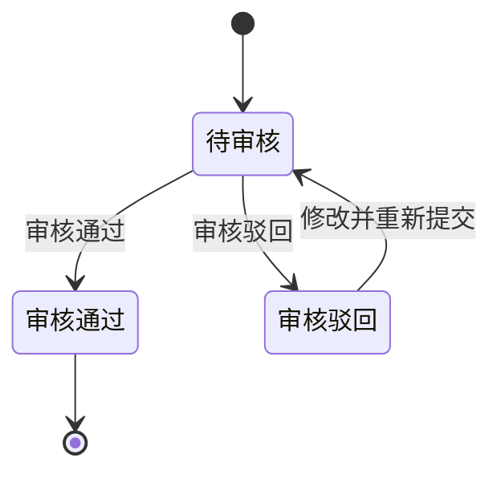

# 第016篇

> 本篇定位：调账中心；主要内容：调账中心；文档角色：模块档；文档ID：17F89514C9

## 1. 调账中心

### 1.1 章节概述

调账中心产生于“原始金额或核销信息已经入账，但后续发现需要修正，且历史账单不能回写”的业务背景。它统一承接应收账单、返款账单和成本账单的冲正差异，让财务能够在不改写源数据、历史账单和历史结清事实的前提下完成修正闭环。调账中心的核心价值，是把分散在账单侧、导入侧和人工处理侧的冲正动作收敛到同一处管理，保证修正结果可追溯、可审核、可留痕，并能被对应账单线稳定引用。

成本账单调账分为`成本金额冲正`和`成本核销冲正`。前者修正供应商收费金额及成本明细，后者修正已登记的结清金额、币种、日期、汇率、方式或凭证。两类调账均不允许把原成本账单从`已结清`退回`待结清`，具体规则见<a href="../PRD.成本中心.md">《成本中心 PRD》8.3 已结清成本账单的纠错</a>。

### 1.2 原型概述

[🔗原型链接](http://localhost:4181/#/billing/adjustments)

#### 1.2.1 业务字段

| 区域 | 业务字段 |
| :--- | :--- |
| 列表域 | 批次提交时间、调账单号、审核状态、客户名称、触发账单号、冲正费项、费项挂靠对象、业务订单号、尾程运单号、首程运单号、冲正理由、冲正前币种、金额变幅<冲正前币种>、冲正后金额<冲正前币种>、归属账单号、冲正后币种、锁定汇率、金额变幅<冲正后币种>、冲正后金额<冲正后币种>、费项凭证、登记人 |
| 导入域 | 客户名称、应收账单号、冲正费项、费项挂靠对象、业务订单号、尾程运单号、首程运单号、冲正理由、冲正前币种、金额变幅<冲正前币种> |
| 筛选域 | 批次提交时间、调账单号、审核状态、客户名称、触发账单号、冲正费项、费项挂靠对象、业务订单号、尾程运单号、首程运单号、冲正前币种、归属账单号、冲正后币种、登记人 |
| 成本金额冲正域 | 调账类型、供应商、原成本账单号、原成本明细号、成本板块、标准成本费项、成本类型、业务订单号、尾程运单号、原币种、原金额、冲正金额、冲正后金额、冲正原因、凭证、登记人 |
| 成本核销冲正域 | 调账类型、供应商、原成本账单号、原结清记录号、原结清金额、原结清币种、原结清日期、原成本核销汇率、原结清方式、反向核销金额、正确结清金额、正确结清币种、正确结清日期、正确成本核销汇率、正确结清方式、冲正原因、凭证、登记人 |
| 说明 | 1、调账单号采用 UUID  2、再按照冲正费项的原始币种或结算币种填写冲正前币种 |

#### 1.2.2 业务操作
调账记录的业务操作与审核状态强绑定，操作权限、批量能力和状态流转必须一起定义。

| 状态 | 可执行操作 | 执行人 | 是否支持批量 | 状态流转 |
| :--- | :--- | :--- | :--- | :--- |
| `待审核` | 修改 | 提交人，且仅限本人提交的记录 | 否 | 修改后仍停留在 `待审核` |
| `待审核` | 移除 | 提交人，且仅限本人提交的记录 | 是 | 移除后记录终止，不再进入后续状态 |
| `待审核` | 审核 | 审核人 | 是 | 审核通过后进入 `审核通过`，审核驳回后进入 `审核驳回` |
| `审核驳回` | 修改并重新提交 | 提交人 | 否 | 重新提交后回到 `待审核` |
| `审核通过` | 查看 | 所有人 | 否 | 只读，不允许修改、移除或再次审核 |

| 状态 | 说明 |
| :--- | :--- |
| `待审核` | 记录可编辑、可移除、可审核，是唯一支持批量审核和批量移除的状态。 |
| `审核通过` | 记录已生效，只读保留，不允许再改。 |
| `审核驳回` | 记录保留驳回原因，允许提交人修改后再次提交，重新回到 `待审核`。 |
| 状态机起点 | 记录新建后进入 `待审核`。 |

### 1.3 录入与审核规则

1. 账单录入的冲正记录和调账中心批量导入的冲正记录，最终都统一在调账中心审核，且归属账单由财务在审核时确认。
2. 应收账单调账、返款账单调账和成本账单调账共用同一审核入口，但字段、默认归属、审核归属和生效对象按各自账单类型处理。
3. `待审核` 记录可以修改、移除、审核。
4. 提交人只能修改和移除自己提交的待审核记录。
5. 审核人只能审核，不能代替提交人修改内容。
6. `审核通过` 记录进入只读态，不允许再次修改或移除，只能通过新增反向调账修正。
7. `审核驳回` 记录保留驳回原因，提交人可重新编辑后再次提交；重新编辑后仍回到 `待审核` 状态。
8. 批量移除、批量审核仅对待审核记录生效，混入其它状态时应禁用相应操作。
9. 归属账单未确认且系统未生成有效默认归属的调账记录，不允许审核通过。
10. 调账记录必须明确记录来源、去向、金额、币种、原因和凭证。
11. 成本金额冲正必须关联供应商、原成本账单、原成本明细和受影响业务对象；成本核销冲正必须关联原结清记录，并明确错误记录、反向记录和正确记录之间的关系。
12. 成本调账的提交人与审核人必须分离；审核人不得修改提交内容后直接通过。

### 1.4 生效与归属规则

1. 应收账单中的特定费项冲正完成后，系统按费项归属把结果计入对应应收账单的本期调账或往期调账，不直接覆盖历史快照。
2. 返款账单中的特定费项冲正完成后，系统按费项归属把结果计入对应返款账单的本期调账或往期调账，不直接覆盖历史快照。
3. 调账通过审核后，才允许影响对应应收账单或返款账单的应收金额、应返金额或核销结果，或者影响成本调整记录、成本归属、成本核销结果和利润分析。
4. 如果原始金额已经进入 `BMS费项池`，修正动作必须走调账中心，不允许直接回写源数据。
5. 已结清账单若再发现差异，不能直接改写历史账单金额，必须通过后续账单、反向调账承接。
6. 调账记录一旦审核通过，必须保留历史状态、审核轨迹和凭证，不允许被后续操作直接覆盖。
7. 账单中的任何未移除冲正记录，只有在调账中心全部审核通过后，整份账单才允许审核通过。
8. 调账中心也不触发源数据重采，不改变 `BMS检阅标记` 的状态流转。
9. 已结清成本账单发生金额差异时，调账中心生成新的成本调整明细和关联关系，原成本账单金额、编号和状态保持不变。
10. 已结清成本账单发生核销信息错误时，调账中心以新增反向核销记录和正确核销记录完成修正，不修改或删除原核销流水。
11. 成本调账形成待结清差额时，差额按供应商、币种和成本账期形成独立待结清记录；后续结清该差额不改变原成本账单状态。
12. 成本调账影响间接成本时，必须生成新的分摊版本；影响已确认`成本已齐`订单时，必须退回`成本未齐`并重算利润。

### 1.5 自动归属规则

1. 对于尚未归属任何应收账单的应收账单调账记录，系统在导入后先预生成默认归属，但该归属不等于最终审核归属。
2. 对于尚未归属任何返款账单的返款账单调账记录，系统在导入后先预生成默认归属，但该归属不等于最终审核归属。
3. 调账记录的归属账单由财务在审核时最终确认；财务可以沿用系统预生成的默认归属，也可以手动改派到另一份同类型的有效待审核账单。
4. 应收账单调账默认优先选择同客户、同账期内的有效待审核应收账单；`已作废`账单不得作为归属账单。
5. 返款账单调账默认优先选择同客户、同账期内的有效待审核返款账单；`已作废`账单不得作为归属账单。
6. 在同一客户、同一账期内，若可候选账单中存在财务本位币汇总金额最高的那一份，应优先选择该账单作为默认归属。
7. 选择财务本位币汇总金额最高的账单，是为了让冲正金额叠加后更不容易把单张账单推到负值。
8. 若候选账单的财务本位币汇总金额相同，系统应按账单编号升序选出唯一承接账单，账单编号以固定且唯一的规则生成，不会重复。
9. 自动归属只处理尚未归属任何应收账单或返款账单的调账记录，不影响已经归属完成的记录。
10. 成本账单调账不使用客户账单的自动归属算法。成本调账必须明确关联原成本账单；无法关联原成本账单的新增成本，应作为新的成本明细或新的成本账单处理，不得由系统猜测归属。

### 1.6 与账单的关系

1. 应收账单中的调账影响应收金额、已收金额和未收金额的展示与核销口径。
2. 返款账单中的调账影响应返金额、已返金额和未返金额的展示与核销口径。
3. 成本账单中的成本金额冲正影响成本调整金额、成本归属和利润；成本核销冲正影响结清流水及人民币换算结果，但不改变原成本账单的`已结清`状态。
4. 调账中心只是修正入口，不等于应收账单、返款账单或成本账单本身。
5. 调账中心产生的结果最终仍要由对应账单线或独立成本调整记录承接，不能绕过账单直接改写历史结果。
