# 第022篇

> 本篇定位：术语与功能入口；主要内容：业务术语表、系统功能清单；文档角色：字典或参考库；文档ID：7460531813

## 1. 业务术语表

下表按业务主题归行，术语链接指向正文中首次解释该概念的位置；定义以正文为准，本表不重复解释。

| 业务主题 | 术语链接 |
| :--- | :--- |
| 总体方案 | [应收账单](PRD.账单系统.第001篇.概览与索引.7822BE08F7.md#doc-7822BE08F7-overview-9d9ba04a)、[返款账单](PRD.账单系统.第001篇.概览与索引.7822BE08F7.md#doc-7822BE08F7-overview-9d9ba04a)、[成本账单](PRD.账单系统.第001篇.概览与索引.7822BE08F7.md#doc-7822BE08F7-overview-9d9ba04a) |
| 账单生成/重算机制 | [费项](PRD.账单系统.第009篇.来源范围与费项池.C986F40642.md#doc-C986F40642-fee-source-c6aeed9f)、[提前收口](PRD.账单系统.第007篇.BMS任务生命周期与操作.D94FE560DB.md#doc-D94FE560DB-task-lifecycle-984e810a)、[截断账期](PRD.账单系统.第008篇.任务快照与配置衔接.A82E89D72C.md#doc-A82E89D72C-task-snapshot-ab6c0655)、[仅展示不核销](PRD.账单系统.第009篇.来源范围与费项池.C986F40642.md#doc-C986F40642-fee-source-c6aeed9f) |
| 应收账单模块 | [待审核](PRD.账单系统.第011篇.应收账单.88A604AED3.md#doc-88A604AED3-receivable-bill-16ae68e0)、[待结清](PRD.账单系统.第011篇.应收账单.88A604AED3.md#doc-88A604AED3-receivable-bill-16ae68e0)、[已结清](PRD.账单系统.第011篇.应收账单.88A604AED3.md#doc-88A604AED3-receivable-bill-16ae68e0)、[已作废](PRD.账单系统.第011篇.应收账单.88A604AED3.md#doc-88A604AED3-receivable-bill-16ae68e0)、[账期收口状态](PRD.账单系统.第011篇.应收账单.88A604AED3.md#doc-88A604AED3-receivable-bill-16ae68e0)、[账单发出时间](PRD.账单系统.第011篇.应收账单.88A604AED3.md#doc-88A604AED3-receivable-bill-119cdedf)、[通知状态](PRD.账单系统.第011篇.应收账单.88A604AED3.md#doc-88A604AED3-receivable-bill-119cdedf)、[逾期未结清](PRD.账单系统.第011篇.应收账单.88A604AED3.md#doc-88A604AED3-receivable-bill-16ae68e0) |
| 金额汇兑 | [锁定汇率](PRD.账单系统.第014篇.金额汇兑.27B80EF314.md#doc-27B80EF314-currency-exchange-338cc4ee) |

## 2. 系统功能清单

所有 BMS 菜单统一收口到`账单系统`根节点。下图中加粗节点是真实菜单；灰色节点只用于标识菜单所属的业务标签，不提供独立入口。

账单系统每个菜单页都有可直接访问且保持不变的页面地址（Hash 路径）。PRD 引用原型时直接链接对应路径；浏览器刷新、前进、后退或粘贴链接后，系统必须恢复到该页面。

| 页面 | 稳定原型路径 |
| :--- | :--- |
| 营收总览 | [🔗原型链接](http://localhost:10520/#/billing/revenue-overview) |
| 应收账单 | [🔗原型链接](http://localhost:4181/#/billing/receivable-bills) |
| 返款账单 | [🔗原型链接](http://localhost:4181/#/billing/refund-bills) |
| 调账中心 | [🔗原型链接](http://localhost:4181/#/billing/adjustments) |
| 账单配置 | [🔗原型链接](http://localhost:4181/#/billing/config) |
| 汇率配置 | [🔗原型链接](http://localhost:4181/#/billing/rates) |
| 生成任务 | [🔗原型链接](http://localhost:4181/#/billing/tasks) |
| 基础配置 | [🔗原型链接](http://localhost:4181/#/billing/base-config) |
| 导出管理 | [🔗原型链接](http://localhost:4181/#/billing/exports) |
| 内部审计 | [🔗原型链接](http://localhost:4181/#/billing/audit) |
| 报表比对 | [🔗原型链接](http://localhost:4181/#/billing/report-compare) |
| 数据迁移 | [🔗原型链接](http://localhost:4181/#/billing/data-migration) |

```plantuml
@startuml
skinparam defaultFontName Microsoft YaHei

rectangle tree [
  <color:#6B7280>账单系统</color>
  |_ <color:#6B7280>财务日常</color>
    |_ <b>营收总览</b>
    |_ <b>应收账单</b>
    |_ <b>返款账单</b>
    |_ <b>调账中心</b>
  |_ <color:#6B7280>核心配置</color>
    |_ <b>账单配置</b>
    |_ <b>汇率配置</b>
  |_ <color:#6B7280>过程管控</color>
    |_ <b>生成任务</b>
    |_ <b>基础配置</b>
    |_ <b>导出管理</b>
    |_ <b>内部审计</b>
  |_ <color:#6B7280>辅助测试</color>
    |_ <b>报表比对</b>
    |_ <color:red><b>数据迁移</b></color>
]
@enduml
```

菜单功能清单仅列出树图中加粗的真实菜单：

| 所属标签路径 | 真实菜单 | 主要能力 | 对应需求章节 |
| :--- | :--- | :--- | :--- |
| 财务日常 | 营收总览 | 在当前供应链范围内按店铺及其下属客户查看应收、已收、应收未收及逾期未收金额，并下钻到具体应收账单 | [营收总览](PRD.账单系统.第013篇.营收总览.3D43B00B76.md#doc-3D43B00B76-revenue-overview-7a6b4f62) |
| 财务日常 | 应收账单 | 查询、审核、发送、结算、补录、冲正、核销及跟踪应收账单异常 | [应收账单模块](PRD.账单系统.第011篇.应收账单.88A604AED3.md#doc-88A604AED3-receivable-bill-b1671b99) |
| 财务日常 | 返款账单 | 查询、审核、发送和结清返款账单，核对 COD 货款、扣减项、应返金额及回款记录与汇兑损益 | [返款账单模块](PRD.账单系统.第012篇.返款账单.A4A4EF02F0.md#doc-A4A4EF02F0-refund-bill-09993f61) |
| 财务日常 | 调账中心 | 处理补录、调账、冲正、重整及历史账单差异承接 | [调账中心](PRD.账单系统.第015篇.调账中心.17F89514C9.md#doc-17F89514C9-adjustment-center-98536490) |
| 财务日常 / 核心配置 | 账单配置 | 维护统一的应收和返款配置、配置版本及客户引用，包括账期、履约节点、限定情形和币种 | [客户级账单配置](PRD.账单系统.第005篇.客户级账单配置.B6349C60A4.md#doc-B6349C60A4-billing-config-d161171a) |
| 财务日常 / 核心配置 | 汇率配置 | 维护基准汇率、统一的特调配置、配置版本及客户引用，查看客户最终默认汇率结果 | [客户级汇率配置](PRD.账单系统.第006篇.客户级汇率配置.72D3AF6045.md#doc-72D3AF6045-rate-config-809a91c4) |
| 财务日常 / 过程管控 | 生成任务 | 按任务类型查看 BMS 任务，跟踪待执行、执行中、执行成功或执行失败的任务并处理异常事项 | [财务在哪里操作，页面如何反馈？](PRD.账单系统.第007篇.BMS任务生命周期与操作.D94FE560DB.md#doc-D94FE560DB-task-lifecycle-2c544758) |
| 财务日常 / 过程管控 | 基础配置 | 在费项管理和数据源规则中维护费项口径、数据来源及场景规则；维护费项结算币种模板，供财务编辑应收账单配置时快捷填充 | [系统从哪里知道该取哪些费用？](PRD.账单系统.第009篇.来源范围与费项池.C986F40642.md#doc-C986F40642-fee-source-0283d06f)、[第四步：来源费用怎样变成BMS费项？](PRD.账单系统.第009篇.来源范围与费项池.C986F40642.md#doc-C986F40642-fee-source-30c53b3a)、[费项结算币种模板](PRD.账单系统.第014篇.金额汇兑.27B80EF314.md#doc-27B80EF314-currency-exchange-1011050d) |
| 财务日常 / 过程管控 | 导出管理 | 跟踪应收和返款账单导出进度，区分客户对账与内部明细用途，下载结果、重试失败任务并维护对账报表导出配置 | [导出管理](PRD.账单系统.第016篇.账单导出.29F2A66D22.md#doc-29F2A66D22-notification-export-f4e1387e) |
| 财务日常 / 过程管控 | 内部审计 | 查询账单、配置、导入、核销、调账、导出、结清、成本归属及分摊版本等关键操作记录 | [内部审计](PRD.账单系统.第019篇.内部审计.38B07AC864.md#doc-38B07AC864-internal-audit-b4731bb9) |
| 成本中心 | 成本总览 | 汇总供应商收费、成本归属、待处理事项、成本完整性和利润概况 | <a href="../../../长篇单档PRD/PRD.成本中心.md">《成本中心 PRD》2. 成本归集链路总览</a>、<a href="../../../长篇单档PRD/PRD.成本中心.md">《成本中心 PRD》10. 报价覆盖、利润与经营分析</a> |
| 成本中心 | 供应商管理 | 维护供应商财务档案、成本账期类型、适用成本板块和金额统计 | <a href="../../../长篇单档PRD/PRD.成本中心.md">《成本中心 PRD》4. 供应商管理</a> |
| 成本中心 | 成本账单 | 导入并核对供应商账单，登记待结清或已结清状态；按间接成本分摊集确认分摊规则和执行结果 | <a href="../../../长篇单档PRD/PRD.成本中心.md">《成本中心 PRD》5. 成本费项标准化与供应商账单导入</a>、<a href="../../../长篇单档PRD/PRD.成本中心.md">《成本中心 PRD》7. 间接成本分摊</a>、<a href="../../../长篇单档PRD/PRD.成本中心.md">《成本中心 PRD》8. 成本账单结清与调账</a> |
| 成本中心 | 成本池 | 查看逐行成本明细，确认直接成本归属或间接成本分摊集结果 | <a href="../../../长篇单档PRD/PRD.成本中心.md">《成本中心 PRD》6. 成本识别与归属</a>、<a href="../../../长篇单档PRD/PRD.成本中心.md">《成本中心 PRD》7.1 间接成本分摊集</a> |
| 成本中心 | 分摊规则 | 分别维护基础分摊规则和供应商特调分摊规则；供应商特调规则优先于基础规则 | <a href="../../../长篇单档PRD/PRD.成本中心.md">《成本中心 PRD》7.3 分摊规则与因子选择</a> |
| 成本中心 | 利润分析 | 按业务订单查看收入、直接成本、间接成本、利润及成本完整性 | <a href="../../../长篇单档PRD/PRD.成本中心.md">《成本中心 PRD》10. 报价覆盖、利润与经营分析</a> |
| 成本中心 | 成本费项索引 | 按五大成本板块维护标准成本费项及供应商原始名称识别口径 | <a href="../../../长篇单档PRD/PRD.成本中心.md">《成本中心 PRD》5.2.2 客户侧与成本侧费项索引分域</a> |
| 辅助测试 | 数据迁移 | 在测试环境中同步指定生产数据并重置测试所需标记 | [同步生产环境数据](PRD.账单系统.第020篇.辅助测试功能.B7799733AF.md#doc-B7799733AF-test-support-83586c70) |
| 辅助测试 | 报表比对 | 仅在财务试运营 BMS 阶段比对财务侧报表和系统侧报表，定位缺单、重复及费项差异 | [财务侧报表与系统侧报表比对](PRD.账单系统.第020篇.辅助测试功能.B7799733AF.md#doc-B7799733AF-test-support-e08a2afc) |
