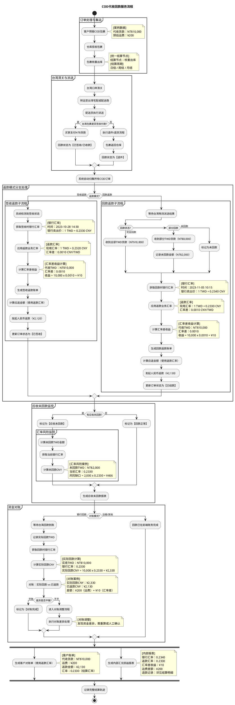
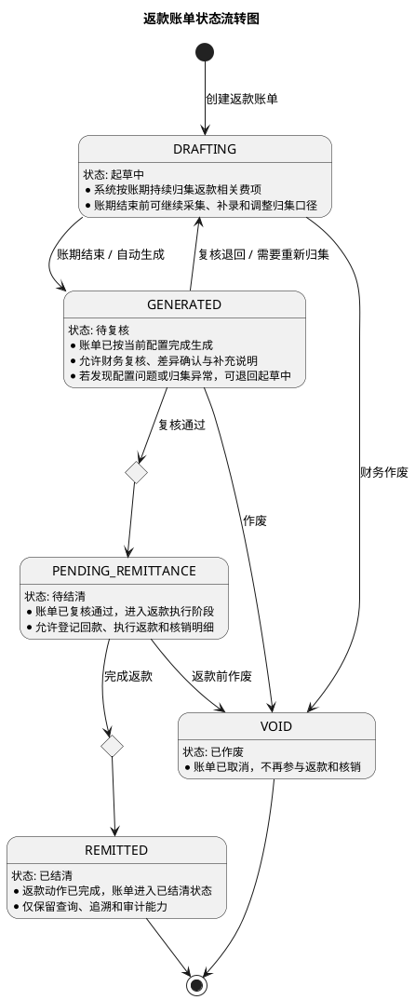

# 返款账单PRD

返款账单用于承载 COD 包裹代收货款回款后的返款结算，重点解决“签收返款 / 回款返款”两种模式下的账单归集、汇率换算、差额留痕、未回款监控和资金对账问题。返款账单与应收账单可独立账期运行，不要求同周期对齐，但需要共享同一订单的费用归属与历史追踪能力。

## 1. 返款流程图

## 2. 流程说明

### 2.1 流程目标

1. 为 COD 业务提供独立的返款账单载体，统一承载代收货款返还、返款扣减费项、汇率换算和对账留痕。
2. 支持“签收返款”和“回款返款”两种返款模式，分别按签收时点或回款时点生成返款账单。
3. 返款账单与应收账单可独立配置账期，不要求同周期对齐，但必须保持同一订单的费用归属关系清晰可追溯。
4. 系统需保留银行汇率快照、返款汇率、汇率差收益、未回款风险敞口和对账差异，便于财务复核、审计和后续追踪。
5. 本需求重点覆盖返款账单配置、列表、详情、回款管理和对账输出，不改变应收账单既有结算逻辑。

### 2.2 参与角色

- `业务部`：定义线路、服务商和计费口径。
- `财务部`：维护结算规则、复核账单、处理对账和差异。
- `客户`：预报包裹、确认账单并完成付款。
- `集运仓`：负责揽收、入库、核重、出库、打印面单。
- `系统`：负责归集、计算、生成账单、更新状态和留痕。

### 2.3 订单处理与集运

1. 客户预报 COD 包裹后，系统进入订单处理阶段。
2. 集运仓揽收包裹并完成入库称重，记录原始包裹重量。
3. 包裹进入核重出库环节后，系统以“核重出库”作为统一结算节点，后续账单归集都以该节点时间为准。
4. 账期支持日结、周结、月结等多种周期，返款账单和应收账单不要求同周期对齐。

### 2.4 清关与派送

1. 包裹完成集运后进入台湾口岸清关。
2. 清关后转运至台湾宅配或配送商。
3. 配送员执行派送，形成最终签收或退件结果。
4. 如果包裹为签收付款，买家在签收时完成 TWD 货款支付，系统将回款状态标记为“已签收/已收款”。
5. 如果包裹退件，则执行退件/退货流程，包裹返回仓库，回款状态标记为“退件”。

### 2.5 返款模式分支处理

#### 2.5.1 签收返款

1. 系统检测到订单已签收。
2. 获取签收时点对应的银行汇率，并作为本次返款的汇率参考。
3. 应用返款业务汇率，计算返款结算金额。
4. 计算汇率差收益，并保留汇率快照。
5. 生成签收返款账单。
6. 计算应返金额，按返款汇率向客户发起人民币返款。
7. 返款完成后，将订单状态更新为“已签收”。

#### 2.5.2 回款返款

1. 系统等待台湾物流派送结果和实际回款结果。
2. 根据回款状态分三类处理：
   - 完全回款：收到全部 TWD 货款。
   - 部分回款：收到部分 TWD 货款，同时记录未回款金额。
   - 未回款：标记为未回款。
3. 系统获取回款时点的银行汇率。
4. 应用返款业务汇率，重新计算本次应返金额。
5. 计算汇率差收益，作为内部损益留痕。
6. 生成回款返款账单。
7. 发起人民币返款，并将订单状态更新为“已结款”。

### 2.6 应收未回款监控

1. 系统持续监控所有 COD 订单的回款状态。
2. 如果存在未回款订单，系统统一标记为“应收未回款”。
3. 对未回款金额进行 TWD 和 CNY 双口径测算，形成风险敞口。
4. 风险敞口会在应收未回款报表中持续展示，便于财务和业务关注。
5. 如果没有未回款订单，则标记为“回款正常”。

### 2.7 资金对账

1. 当对账模式为银行回款时，系统等待台湾回款到账。
2. 系统记录实际回款 TWD，并获取对应时点的银行汇率。
3. 计算实际回款 CNY，并与已返款金额进行对比。
4. 对账差异一般由两部分构成：
   - 运费等业务差额。
   - 银行汇率与返款汇率之间的汇率差。
5. 如果差异可以平衡，则标记为对账完成。
6. 如果差异不平，则进入对账调整流程，由财务或系统进行差异处理。
7. 如果对账模式不是银行回款，则认为回款已在前端账务完成，直接进入结算留痕。

### 2.8 报表输出

1. 系统生成客户对账单，客户对账单采用返款汇率口径，展示代收货款、运费和最终返款金额。
2. 财务生成内部汇兑损益报表，展示银行汇率、返款汇率、汇率差收益、运费差额及退款记录。
3. 所有流程结束后，系统记录完整结算轨迹，保证后续审计、追踪和复盘可用。

### 2.9 关键业务规则

1. 返款账单和应收账单可以独立账期运行，不要求同周期对齐。
2. 返款账单以返款动作发生时必须一起结算的费项为边界。
3. 如果某笔业务既命中返款扣减项，又命中应收账单规则，优先按照返款扣减处理。
4. 如果代收货款不足以覆盖返款扣减项，差额需要进入待补扣或待处理状态。
5. 所有汇率快照、返款金额、对账差异都应保留历史轨迹，避免口径漂移。

### 2.10 返款账单状态机

返款账单状态与列表页展示口径的映射关系如下：

1. `起草中` 对应系统归集中的返款账单。
2. `待复核` 对应列表页中的待复核账单。
3. `待结清` 对应已复核、待执行返款或待核销账单。
4. `已结清` 对应返款完成且账单关闭。
5. `已作废` 对应财务取消或系统撤销的账单。

补充说明：

1. 账单主状态只描述返款账单生命周期，不把明细级 `核销` 作为独立账单状态。
2. `待补扣`、`待处理`、`异常回款` 这类口径以标记或明细状态体现，不单独拆成主状态。
3. 若账单已进入 `已结清`，原则上不再修改金额；如需冲正，应通过新账单或调整单处理。

## 原型交互

### 返款账单配置

[原型：返款账单配置页面](http://localhost:9999/#id=ngn0y4&p=%E8%BF%94%E6%AC%BE%E8%B4%A6%E5%8D%95%E9%85%8D%E7%BD%AE%E9%A1%B5&g=1)

返款账单配置页用于维护 COD 包裹货款代收条款，是返款账单生成与返款结算的基础配置入口。

主要配置项包括：

1. `返款模式`：支持 `签收返款`、`回款返款` 两种模式。
2. `账期类型`：支持 `周`、`半周` 两种周期。
3. `实返货款金额比例`：用于计算代收货款手续费或返款扣减比例。
4. `账单发出时间`：控制账期结束后多少天内完成账单复核，可用于错峰处理。
5. `条款生效周期`：控制当前配置对哪个时间段内生成的账单生效。
6. `货款原始币种 / 汇兑策略 / 货款结算币种 / 客户收款账户`：用于多币种返款和账户落地。
7. `账期起始日`：仅在 `半周` 账期下展示，用于选择每周的两个起始日。

字段说明如下：

1. `返款模式`
   - `签收返款`：以买家签收作为返款触发时点。
   - `回款返款`：以实际回款到账作为返款触发时点。
2. `账期类型`
   - 用于定义返款账单的统计周期和发单节奏。
   - 不同账期类型只影响后续新账单的归集范围，不影响历史账单。
3. `实返货款金额比例`
   - 以百分比形式维护。
   - 用于计算代收货款手续费，即 `实返货款金额 {…%}` 对应的手续费口径。
4. `账单发出时间`
   - 表示账期结束后延后多少天发起账单复核。
   - 该值是建议复核时间，不是强制执行时间。
5. `条款生效周期`
   - 配置只对生效周期内创建的账单有效。
   - 若周期重叠，系统应禁止保存或提示财务选择优先级。
6. `货款原始币种 / 汇兑策略 / 货款结算币种 / 客户收款账户`
   - `货款原始币种`：订单回款所使用的原始币种。
   - `汇兑策略`：原始币种转换为结算币种的方式。
   - `货款结算币种`：客户最终收款的币种，可支持多币种配置。
   - `客户收款账户`：不同结算币种对应的客户收款账户信息。
7. `账期起始日`
   - 仅 `半周` 账期需要配置。
   - 通过多选方式选择每周两个账期起始日，例如 `周二、周五`。

交互规则如下：

1. 一份配置支持多个货款结算币种，系统按币种分别维护返款账户与结算规则。
2. 用户修改返款模式、账期类型或汇兑策略后，仅影响后续新生成的返款账单，不回写历史账单。
3. 保存时需要校验必填项、有效期重叠、币种配置完整性和半周账期起始日完整性。
4. 配置生效后，列表页和详情页中的返款模式、账期、结算币种与汇率口径应同步展示。
5. 若同一条款在生效周期内被再次编辑，应以新版本覆盖后续账单口径，历史账单仍保留原快照。
6. `确定` 按钮用于提交并保存当前配置；保存成功后配置立即进入生效判定逻辑。

### 返款账单列表

[原型：返款账单列表页面](http://localhost:9999/start.html#g=1&id=g28u5o&p=%E8%BF%94%E6%AC%BE%E8%B4%A6%E5%8D%95%E5%88%97%E8%A1%A8)

返款账单列表页用于查看和筛选所有返款账单，是财务和业务的日常操作入口。

主要展示与筛选维度包括：

1. 账单状态，原型中包含 `全部`、`待复核`、`待结清`、`已结清`。
2. 账单基础信息，如账单编号、客户、账期、返款模式、币种、应返金额、已返金额、未返金额。
3. 账单流转信息，如复核时间、发出时间、结清时间、操作人和备注。

交互规则如下：

1. 点击状态标签可快速切换账单列表视图。
2. 点击账单进入对应详情页，签收返款与回款返款分别进入不同详情原型。
3. `待复核` 账单允许财务复核与调整，`待结清` 账单允许继续核销或回款处理，`已结清` 账单仅支持查看。
4. 列表页应作为回款管理的统一入口，便于从账单列表直接定位待处理单据。

### 返款账单详情页（回款返款）

[原型：返款账单详情页](http://localhost:9999/start.html#g=1&id=7m2sv9&p=%E5%9B%9E%E6%AC%BE%E8%BF%94%E6%AC%BE%E8%B4%A6%E5%8D%95%E8%AF%A6%E6%83%85)

回款返款详情页用于展示“回款返款”模式下的账单明细、返款金额和核销情况。

页面核心信息包括：

1. 账单信息区，展示货款结算币种、返款金额、回款金额、未回款金额、账单状态等。
2. 返款明细区，展示代收货款、返款扣减项、最终应返金额。
3. 扣减费项明细区，展示基础运费、代收服务费及其他返款时可直接扣减的费项。
4. 核销记录区，展示每笔回款或扣减动作的核销轨迹。
5. 账单汇率区，展示银行汇率、返款汇率、汇率差收益及快照时间。

交互规则如下：

1. 回款日在记账起始日和记账结束日之间的包裹应纳入本账单。
2. 已正常签收但待回款的包裹也应纳入本账单，因为需要关联冲减费项。
3. 非正常签收包裹不出现在本账单，其冲减费项自动挂到起草中的应收账单。
4. 详情页中的 `核销` 入口用于登记或确认对应明细已处理，处理后状态变为 `已核销`。
5. 若存在部分回款或异常回款，详情页应保留差额说明和待处理状态。

### 返款账单详情页（签收返款）

[原型：返款账单详情页](http://localhost:9999/start.html#g=1&id=zbc7tx&p=%E7%AD%BE%E6%94%B6%E8%BF%94%E6%AC%BE%E8%B4%A6%E5%8D%95%E8%AF%A6%E6%83%85)

签收返款详情页用于展示“签收返款”模式下的账单明细、汇率口径和核销情况。

页面核心信息包括：

1. 账单信息区，展示货款结算币种、签收状态、返款金额和账单状态。
2. 返款明细区，展示代收货款按返款汇率换算后的应返金额。
3. 扣减费项明细区，展示签收返款阶段可直接冲减的基础运费、代收服务费等费项。
4. 核销记录区，展示返款执行和费用核销的完整记录。
5. 账单汇率区，展示签收时点银行汇率、返款汇率与汇率差收益。

交互规则如下：

1. 广义签收日在记账起始日和记账结束日之间的包裹均纳入本账单。
2. 在返回货款中可以直接冲减基础运费、货款代收服务费等费项。
3. 非正常签收包裹应高亮突出，不需要回款和返款，其冲减费项自动挂到起草中的应收账单。
4. 当返款完成后，账单状态更新为已处理，详情页保留汇率快照和核销轨迹。

### 回款管理

[原型：回款管理](http://localhost:9999/start.html#g=1&id=zbc7tx&p=%E7%AD%BE%E6%94%B6%E8%BF%94%E6%AC%BE%E8%B4%A6%E5%8D%95%E8%AF%A6%E6%83%85)

回款管理用于维护实际回款结果，是财务执行返款核销和异常处理的入口。

主要能力包括：

1. 登记实际回款金额、回款时间、回款币种、凭证与备注。
2. 支持单笔回款处理，也支持批量回款处理。
3. 对部分回款、未回款和异常回款进行状态标记。
4. 将回款结果同步到返款账单详情和未回款监控报表。
5. 回款成功后驱动对应返款账单从待处理状态进入已核销或已结清状态。

交互规则如下：

1. 财务可以从列表页或详情页进入回款管理。
2. 回款信息确认后，系统更新对应账单的核销记录和余额。
3. 如果回款金额不足或存在异常，账单应保留待处理标记，等待后续补录或人工确认。

### 返款账单和应收账单的关联性

[原型：返款账单和应收账单的关联性](http://localhost:9999/start.html#g=1&id=7m2sv9&p=%E5%9B%9E%E6%AC%BE%E8%BF%94%E6%AC%BE%E8%B4%A6%E5%8D%95%E8%AF%A6%E6%83%85)

该原型用于说明同一份 `fee_detail` 数据在返款账单和应收账单之间的分流关系，属于规则示意而非操作页面。

说明口径如下：

1. 在“回款返款”模式下，返款动作发生时必须一起结算的费项优先进入返款账单。
2. 未命中的费项继续进入起草中的应收账单，保持应收与返款的边界清晰。
3. 非正常签收包裹对应的冲减费项不进入返款账单，自动挂到应收账单。
4. 该页面用于帮助财务理解费用归集路径，不承载直接业务操作。
