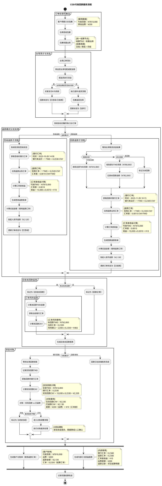

# 返款账单PRD

## 1. 返款流程图

## 2. 流程说明

### 2.1 流程目标

返款账单用于承载 COD 包裹在货款回收后的返还结算，核心目标是把“代收货款、返款扣减项、返款结果、汇率差收益、对账差异”统一纳入一条可追溯的业务链路。

### 2.2 参与角色

- `业务部`：定义线路、服务商和计费口径。
- `财务部`：维护结算规则、复核账单、处理对账和差异。
- `客户`：预报包裹、确认账单并完成付款。
- `集运仓`：负责揽收、入库、核重、出库、打印面单。
- `系统`：负责归集、计算、生成账单、更新状态和留痕。

### 2.3 订单处理与集运

1. 客户预报 COD 包裹后，系统进入订单处理阶段。
2. 集运仓揽收包裹并完成入库称重，记录原始包裹重量。
3. 包裹进入核重出库环节后，系统以“核重出库”作为统一结算节点，后续账单归集都以该节点时间为准。
4. 账期支持日结、周结、月结等多种周期，返款账单和应收账单不要求同周期对齐。

### 2.4 清关与派送

1. 包裹完成集运后进入台湾口岸清关。
2. 清关后转运至台湾宅配或配送商。
3. 配送员执行派送，形成最终签收或退件结果。
4. 如果包裹为签收付款，买家在签收时完成 TWD 货款支付，系统将回款状态标记为“已签收/已收款”。
5. 如果包裹退件，则执行退件/退货流程，包裹返回仓库，回款状态标记为“退件”。

### 2.5 返款模式分支处理

系统在归集到 COD 订单后，会根据返款模式拆成两条子流程。

#### 2.5.1 签收返款

1. 系统检测到订单已签收。
2. 获取签收时点对应的银行汇率，并作为本次返款的汇率参考。
3. 应用返款业务汇率，计算返款结算金额。
4. 计算汇率差收益，并保留汇率快照。
5. 生成签收返款账单。
6. 计算应返金额，按返款汇率向客户发起人民币返款。
7. 返款完成后，将订单状态更新为“已签收”。

#### 2.5.2 回款返款

1. 系统等待台湾物流派送结果和实际回款结果。
2. 根据回款状态分三类处理：
   - 完全回款：收到全部 TWD 货款。
   - 部分回款：收到部分 TWD 货款，同时记录未回款金额。
   - 未回款：标记为未回款。
3. 系统获取回款时点的银行汇率。
4. 应用返款业务汇率，重新计算本次应返金额。
5. 计算汇率差收益，作为内部损益留痕。
6. 生成回款返款账单。
7. 发起人民币返款，并将订单状态更新为“已结款”。

### 2.6 应收未回款监控

1. 系统持续监控所有 COD 订单的回款状态。
2. 如果存在未回款订单，系统统一标记为“应收未回款”。
3. 对未回款金额进行 TWD 和 CNY 双口径测算，形成风险敞口。
4. 风险敞口会在应收未回款报表中持续展示，便于财务和业务关注。
5. 如果没有未回款订单，则标记为“回款正常”。

### 2.7 资金对账

1. 当对账模式为银行回款时，系统等待台湾回款到账。
2. 系统记录实际回款 TWD，并获取对应时点的银行汇率。
3. 计算实际回款 CNY，并与已返款金额进行对比。
4. 对账差异一般由两部分构成：
   - 运费等业务差额。
   - 银行汇率与返款汇率之间的汇率差。
5. 如果差异可以平衡，则标记为对账完成。
6. 如果差异不平，则进入对账调整流程，由财务或系统进行差异处理。
7. 如果对账模式不是银行回款，则认为回款已在前端账务完成，直接进入结算留痕。

### 2.8 报表输出

1. 系统生成客户对账单，客户对账单采用返款汇率口径，展示代收货款、运费和最终返款金额。
2. 财务生成内部汇兑损益报表，展示银行汇率、返款汇率、汇率差收益、运费差额及退款记录。
3. 所有流程结束后，系统记录完整结算轨迹，保证后续审计、追踪和复盘可用。

### 2.9 关键业务规则

1. 返款账单和应收账单可以独立账期运行，不要求同周期对齐。
2. 返款账单以返款动作发生时必须一起结算的费项为边界。
3. 如果某笔业务既命中返款扣减项，又命中应收账单规则，优先按照返款扣减处理。
4. 如果代收货款不足以覆盖返款扣减项，差额需要进入待补扣或待处理状态。
5. 所有汇率快照、返款金额、对账差异都应保留历史轨迹，避免口径漂移。

