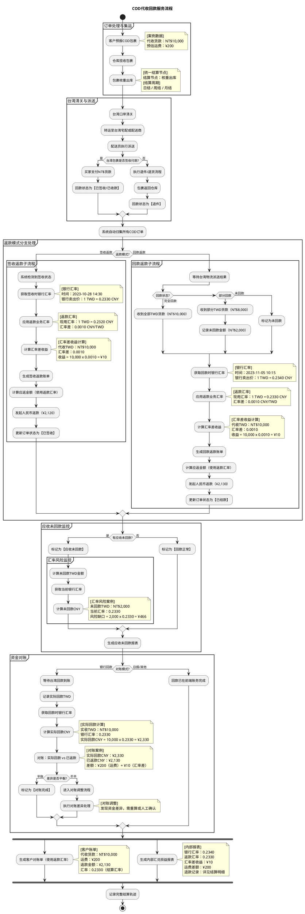
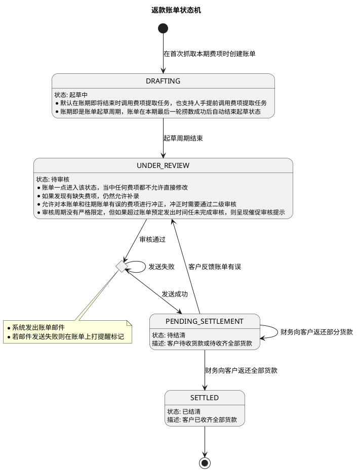

# 返款账单PRD

返款账单用于承载 COD 包裹代收货款回款后的返款结算，重点解决“签收返款 / 回款返款”两种模式下的账单归集、汇率换算、差额留痕、未回款监控和资金对账问题。返款账单与应收账单可独立账期运行，不要求同周期对齐，但需要共享同一订单的费用归属与历史追踪能力。

## 1. 返款流程图

## 2. 流程说明

### 2.1 流程目标

1. 为 COD 业务提供独立的返款账单载体，统一承载代收货款返还、返款扣减费项、汇率换算和对账留痕。
2. 支持“签收返款”和“回款返款”两种返款模式，分别按签收时点或回款时点生成返款账单。
3. 返款账单与应收账单可独立配置账期，不要求同周期对齐，但必须保持同一订单的费用归属关系清晰可追溯。
4. 系统需保留银行汇率快照、返款汇率、汇率差收益、未回款风险敞口和对账差异，便于财务复核、审计和后续追踪。
5. 本需求重点覆盖返款账单配置、列表、详情、回款管理和对账输出，不改变应收账单既有结算逻辑。

### 2.2 参与角色

- `业务部`：定义线路、服务商和计费口径。
- `财务部`：维护结算规则、复核账单、处理对账和差异。
- `客户`：预报包裹、确认账单并完成付款。
- `集运仓`：负责揽收、入库、核重、出库、打印面单。
- `系统`：负责归集、计算、生成账单、更新状态和留痕。

### 2.3 订单处理与集运

1. 客户预报 COD 包裹后，系统进入订单处理阶段。
2. 集运仓揽收包裹并完成入库称重，记录原始包裹重量。
3. 包裹进入核重出库环节后，系统以“核重出库”作为统一结算节点，后续账单归集都以该节点时间为准。
4. 账期支持日结、周结、月结等多种周期，返款账单和应收账单不要求同周期对齐。

### 2.4 清关与派送

1. 包裹完成集运后进入台湾口岸清关。
2. 清关后转运至台湾宅配或配送商。
3. 配送员执行派送，形成最终签收或退件结果。
4. 如果包裹为签收付款，买家在签收时完成 TWD 货款支付，系统将回款状态标记为“已签收/已收款”。
5. 如果包裹退件，则执行退件/退货流程，包裹返回仓库，回款状态标记为“退件”。

### 2.5 返款模式分支处理

#### 2.5.1 签收返款

1. 系统检测到订单已签收。
2. 获取签收时点对应的银行汇率，并作为本次返款的汇率参考。
3. 应用返款业务汇率，计算返款结算金额。
4. 计算汇率差收益，并保留汇率快照。
5. 生成签收返款账单。
6. 计算应返金额，按返款汇率向客户发起人民币返款。
7. 返款完成后，将订单状态更新为“已签收”。

#### 2.5.2 回款返款

1. 系统等待台湾物流派送结果和实际回款结果。
2. 根据回款状态分三类处理：
   - 完全回款：收到全部 TWD 货款。
   - 部分回款：收到部分 TWD 货款，同时记录未回款金额。
   - 未回款：标记为未回款。
3. 系统获取回款时点的银行汇率。
4. 应用返款业务汇率，重新计算本次应返金额。
5. 计算汇率差收益，作为内部损益留痕。
6. 生成回款返款账单。
7. 发起人民币返款，并将订单状态更新为“已结款”。

### 2.6 应收未回款监控

1. 系统持续监控所有 COD 订单的回款状态。
2. 如果存在未回款订单，系统统一标记为“应收未回款”。
3. 对未回款金额进行 TWD 和 CNY 双口径测算，形成风险敞口。
4. 风险敞口会在应收未回款报表中持续展示，便于财务和业务关注。
5. 如果没有未回款订单，则标记为“回款正常”。

### 2.7 资金对账

1. 当对账模式为银行回款时，系统等待台湾回款到账。
2. 系统记录实际回款 TWD，并获取对应时点的银行汇率。
3. 计算实际回款 CNY，并与已返货款金额进行对比。
4. 对账差异一般由两部分构成：
   - 运费等业务差额。
   - 银行汇率与返款汇率之间的汇率差。
5. 如果差异可以平衡，则标记为对账完成。
6. 如果差异不平，则进入对账调整流程，由财务或系统进行差异处理。
7. 如果对账模式不是银行回款，则认为回款已在前端账务完成，直接进入结算留痕。

### 2.8 报表输出

1. 系统生成客户对账单，客户对账单采用返款汇率口径，展示代收货款、运费和最终返款金额。
2. 财务生成内部汇兑损益报表，展示银行汇率、返款汇率、汇率差收益、运费差额及退款记录。
3. 所有流程结束后，系统记录完整结算轨迹，保证后续审计、追踪和复盘可用。

### 2.9 关键业务规则

1. 返款账单和应收账单可以独立账期运行，不要求同周期对齐。
2. 返款账单以返款动作发生时必须一起结算的费项为边界。
3. 如果某笔业务既命中返款扣减项，又命中应收账单规则，优先按照返款扣减处理。
4. 如果代收货款不足以覆盖返款扣减项，差额需要进入待补扣或待处理状态。
5. 所有汇率快照、返款金额、对账差异都应保留历史轨迹，避免口径漂移。

### 2.10 返款账单状态机

返款账单状态与图中的主状态含义对应如下：

1. `起草中`：系统按账期持续归集返款相关费项，账期结束前仍可补录和调整归集口径。
2. `待审核`：账单已生成并冻结明细，进入财务复核阶段；此时不允许直接修改已采集费项，但仍允许补录缺失费项和发起冲正。
3. `待结清`：账单已完成审核并进入发送后的结算阶段，等待实际返款或支付动作完成；该状态可记录部分结清进度，若客户反馈账单有误可回退到 `待审核`。
4. `已结清`：账单已完成全部返款并关闭，仅保留查询、追溯和审计能力。

补充说明：

1. 账单主状态只描述返款账单生命周期，不把明细级 `核销` 作为独立账单状态。
2. 图中存在“发送”动作的过渡节点，但它不作为账单主状态展示，也不单独作为列表筛选项。
3. `部分返款` 不单独作为主状态展示，作为 `待结清` 下的支付进度处理。
4. `待处理`、`异常回款`、`待补扣` 这类口径以标记或明细状态体现，不单独拆成主状态。
5. 若账单已进入 `已结清`，原则上不再修改金额；如需冲正，应通过新账单或调整单处理。

状态流转规则如下：

1. `起草中` -> `待审核`：当本期最后一轮费项归集完成后，账单自动结束起草。
2. `待审核` -> `待结清`：财务复核通过后，系统完成发送动作并进入结算阶段，账单开始等待返款/回款处理。
3. 发送动作失败或需要重试时：账单主状态不变，由系统内部重试发送并更新提醒信息，不单独形成一个账单状态。
4. `待结清` -> `待审核`：客户反馈账单有误，或结清前发现需要重新复核时回退到审核阶段。
5. `待结清` -> `待结清`：发生部分返款时，仅更新余额、核销记录和进度，不改变主状态。
6. `待结清` -> `已结清`：全部返款完成后，账单关闭并进入终态。

## 原型交互

### 返款账单配置

[原型：返款账单配置页面](http://localhost:9999/#id=ngn0y4&p=%E8%BF%94%E6%AC%BE%E8%B4%A6%E5%8D%95%E9%85%8D%E7%BD%AE%E9%A1%B5&g=1)

返款账单配置页用于维护 COD 包裹货款代收条款，是返款账单生成与返款结算的基础配置入口。
页面顶部开关用于控制该条款是否启用，开启后参与后续返款账单生效判定，关闭后仅保留配置内容，不再作为新账单生成依据。
页面按“基础条款 + 账期配置 + 货款结算币种 + 扣减项配置 + 异常处理”组织信息，支持按行维护不同货款结算币种及对应客户收款账户。

主要配置项包括：

1. `返款模式`：支持 `回款返款`、`签收返款` 两种模式。
2. `账期类型`：支持 `周`、`半周` 两种周期。
3. `账期起始日`：仅在 `半周` 账期下展示，通过多选方式指定两个账期起始日，例如 `周二`、`周五`。
4. `账单发出时间`：控制账期结束后第几天进入账单复核提示，属于建议值，不是强制执行时间，主要用于财务错峰处理。
5. `在应返货款中直接扣减的应收费项`：包括 `代收货款手续费`、`重出费`、`超材费`、`其他应收费项`。
6. `实返货款金额比例`：页面以 `实返货款金额 {…%} 用作代收货款手续费` 的形式展示，按百分比维护，用于计算代收货款手续费。
7. `货款结算币种`：采用表格方式维护，列为 `货款原始币种`、`货款结算币种`、`客户收款账户` 和 `操作`。
8. `当实返货款金额为负数时的应对措施`：即当应返货款不足以扣减应收费项时的应对措施，支持 `负数金额计入下期返款账单` 或 `负数金额反向计入本期应收账单`。
9. `条款生效周期`：控制当前配置对哪个时间段内生成的账单生效。

字段说明如下：

1. `返款模式`
   - `签收返款`：以买家签收作为返款触发时点。
   - `回款返款`：以实际回款到账作为返款触发时点。
2. `账期类型`
   - 用于定义返款账单的统计周期和发单节奏。
   - 不同账期类型只影响后续新账单的归集范围，不影响历史账单。
3. `账期起始日`
   - 仅 `半周` 账期需要配置。
   - 通过下拉多选选择每周两个账期起始日，例如 `周二、周五`。
4. `账单发出时间`
   - 表示账期结束后第几天进入账单复核提示。
   - 该值是建议复核时间，不是强制执行时间。
5. `在应返货款中直接扣减的应收费项`
   - 勾选后，该类费项在返款账单内直接参与扣减与核销。
   - 页面默认展示 `代收货款手续费`、`重出费`、`超材费`、`其他应收费项`。
6. `实返货款金额比例`
   - 以百分比形式维护。
   - 用于计算代收货款手续费，对应页面中的 `实返货款金额 {…%}` 口径。
7. `货款结算币种`
   - 以表格方式维护，列为 `货款原始币种`、`货款结算币种`、`客户收款账户` 和 `操作`。
   - 每行对应一组结算规则，同一配置内 `货款原始币种` 不可重复。
   - 兜底行固定保留：当表内仅剩兜底行时，其 `货款原始币种` 显示为 `不限`；存在多行配置时，兜底行显示为 `其他`。
   - 非兜底行的 `货款原始币种` 可选具体币种，兜底行不参与具体币种选择。
   - 非兜底行的 `货款结算币种` 可为 `随原始币种` 或指定币种；兜底行的 `货款结算币种` 不可为 `随原始币种`。
   - `客户收款账户` 用于维护对应币种的收款账户信息，可按多行文本填写账户名称与账号。
   - 点击 `添加一行` 时，在兜底行上方插入新行；操作列中的非兜底行可 `移除`，兜底行不可删除。
8. `当实返货款金额为负数时的应对措施`
   - `负数金额计入下期返款账单`：将本次负数差额顺延到下一期返款账单处理。
   - `负数金额反向计入本期应收账单`：将本次负数差额回冲到本期应收账单。
9. `条款生效周期`
   - 以日期区间控制当前配置对哪个时间段内生成的账单生效。
   - 同一生效周期内不允许与现有配置重叠，保存时需提示冲突并阻止提交。

交互规则如下：

1. 一份配置支持多个货款结算币种，系统按 `货款原始币种` 逐行匹配 `货款结算币种` 与 `客户收款账户`。
2. 用户修改返款模式、账期类型、账期起始日、账单发出时间、货款结算币种、客户收款账户、扣减项或负数处理策略后，仅影响后续新生成的返款账单，不回写历史账单。
3. 保存时需要校验必填项、有效期重叠、币种配置完整性、`货款原始币种` 唯一性、扣减项配置完整性和半周账期起始日完整性。
4. 配置生效后，列表页和详情页中的返款模式、账期、结算币种、扣减项与核销口径应同步展示。
5. 若同一条款在生效周期内被再次编辑，应以新版本覆盖后续账单口径，历史账单仍保留原快照。
6. `确定` 按钮用于提交并保存当前配置；保存成功后配置立即进入生效判定逻辑。

### 返款账单列表

[原型：返款账单列表页面](http://localhost:9999/start.html#g=1&id=g28u5o&p=%E8%BF%94%E6%AC%BE%E8%B4%A6%E5%8D%95%E5%88%97%E8%A1%A8)

返款账单列表页用于查看和筛选所有返款账单，是财务和业务的日常操作入口。

主要展示与筛选维度包括：

1. 账单状态，原型中包含 `全部`、`待复核`、`待结清`、`已结清`；其中 `待复核` 可理解为状态机中的 `待审核`，发送动作由系统内部处理，不单独作为列表筛选项。
2. 账单基础信息，如账单编号、客户、账期、返款模式、币种、应返金额、已返金额、未返金额。
3. 账单流转信息，如复核时间、发出时间、结清时间、操作人和备注。

交互规则如下：

1. 点击状态标签可快速切换账单列表视图。
2. 点击账单进入对应详情页，签收返款与回款返款分别进入不同详情原型。
3. `待复核` 账单允许财务复核与调整，对应状态机中的 `待审核`；`待结清` 账单允许继续核销或回款处理，`已结清` 账单仅支持查看。
4. 列表页应作为回款管理的统一入口，便于从账单列表直接定位待处理单据。

### 返款账单详情页（回款返款）

[原型：返款账单详情页](http://localhost:9999/start.html#g=1&id=7m2sv9&p=%E5%9B%9E%E6%AC%BE%E8%BF%94%E6%AC%BE%E8%B4%A6%E5%8D%95%E8%AF%A6%E6%83%85)

回款返款详情页用于展示“回款返款”模式下的账单明细、返款金额和核销情况。

页面核心信息包括：

1. 账单信息区，展示货款结算币种、返款金额、回款金额、未回款金额、账单状态等。
2. 返款明细区，展示代收货款、返款扣减项、最终应返金额。
3. 扣减费项明细区，展示基础运费、代收服务费及其他返款时可直接扣减的费项。
4. 核销记录区，展示每笔回款或扣减动作的核销轨迹。
5. 账单汇率区，用于展示该账单涉及的所有费项货币对汇率，并支持通过 `编辑` 进入汇率配置弹窗。

交互规则如下：

1. 回款日在记账起始日和记账结束日之间的包裹应纳入本账单。
2. 已正常签收但待回款的包裹也应纳入本账单，因为需要关联冲减费项。
3. 非正常签收包裹不出现在本账单，其冲减费项自动挂到起草中的应收账单。
4. 详情页中的 `核销` 入口用于登记或确认对应明细已处理，处理结果保留在核销记录中，账单主状态仍按 `待结清` / `已结清` 推进。
5. 若存在部分回款或异常回款，详情页应保留差额说明和待处理状态。

### 返款账单详情页（签收返款）

[原型：返款账单详情页](http://localhost:9999/start.html#g=1&id=zbc7tx&p=%E7%AD%BE%E6%94%B6%E8%BF%94%E6%AC%BE%E8%B4%A6%E5%8D%95%E8%AF%A6%E6%83%85)

签收返款详情页用于展示“签收返款”模式下的账单明细、汇率口径和核销情况。

页面核心信息包括：

1. 账单信息区，展示货款结算币种、签收状态、返款金额和账单状态。
2. 返款明细区，展示代收货款按返款汇率换算后的应返金额。
3. 扣减费项明细区，展示签收返款阶段可直接冲减的基础运费、代收服务费等费项。
4. 核销记录区，展示返款执行和费用核销的完整记录。
5. 账单汇率区，按“货款结算币种 -> 财务本位币 / 货款原始币种 -> 财务本位币 / 货款结算币种 -> 费用原始币种”展示锁定汇率、汇率方向和换算结果。

账单汇率区的展示与计算规则如下：

1. 页面以表格方式分组展示汇率，默认分为三组：
   - `货款结算币种 -> 财务本位币`
   - `货款结算币种 -> 货款原始币种`
   - `货款结算币种 -> 费用原始币种`
2. 每组表格均包含 `货款结算币种`、`汇兑方向`、`换算目标币种`、`锁定汇率` 四列。
3. `货款结算币种 -> 财务本位币` 用于展示当前账单的标准折算汇率，金额从结算币种折算到财务本位币后参与内部核算与对账。
4. `货款结算币种 -> 货款原始币种` 用于展示结算币种与原始币种之间的换算关系，便于追溯不同原始币种的结算路径。
5. `货款结算币种 -> 费用原始币种` 用于展示结算币种与费用原始币种之间的换算关系；当货款原始币种与费用原始币种相同时，系统复用 `货款原始币种 -> 财务本位币` 对应的汇率推导结果。
6. 若货款结算币种与对应的原始币种、费用原始币种存在直接汇率，则优先展示直接锁定汇率；若不存在直接汇率，则通过财务本位币作为中转币种换算得到。
7. 页面仅展示账单生成或复核时锁定的汇率快照，不随后续银行汇率变化自动刷新。
8. 汇率表中的 `锁定汇率` 统一保留到页面配置精度，用于确保账单金额、核销记录和对账结果的一致性。

交互规则如下：

1. 广义签收日在记账起始日和记账结束日之间的包裹均纳入本账单。
2. 在返回货款中可以直接冲减基础运费、货款代收服务费等费项。
3. 非正常签收包裹应高亮突出，不需要回款和返款，其冲减费项自动挂到起草中的应收账单。
4. 当返款完成后，账单状态更新为 `已结清`，详情页保留汇率快照和核销轨迹。

账单汇率区的展示与配置规则如下：

1. 页面以标签页形式挂在详情页中，默认按账单生成时锁定的货币对汇率分组展示。
2. 汇率区展示的数据来源于账单所有费用明细生成的 `货币对`，同一货币对只保留一条展示记录。
3. 页面上方默认展示财务本位币种，用于说明当前详情页的统一核算币种。
4. 汇率表默认按“费项结算币种 / 账单结算币种”两类口径分组展示，其中每组都按 `货币对`、`汇兑方向`、`目标币种`、`锁定汇率` 进行展示。
5. `汇兑方向` 只允许与币种关系一致的单向展示，若账单结算币种与目标币种已存在逆向汇率，则系统按正向汇率折算后再回显为页面统一方向。
6. 点击 `编辑` 后打开汇率配置弹窗，弹窗中按行维护货币对汇率，每一行对应一个费项结算币种到目标币种的锁定关系。
7. 弹窗内支持启用 / 禁用单条汇率配置；启用时该行参与账单汇率计算，禁用时仅保留历史配置，不参与后续账单核算。
8. 当 `费项结算币种` 与 `费项原始币种` 已存在匹配时，系统优先直接展示这组货币对的锁定汇率；若页面配置的是 `费项结算币种 -> 财务本位币种`，则再由财务本位币种推导到原始币种。
9. 当 `费项结算币种` 与 `财务本位币种` 之间存在锁定汇率时，页面以该汇率作为账单核算基准，并据此折算各费项明细的金额。
10. 当某笔费用的 `原始币种` 与账单中的 `结算币种` 相同但目标币种不同，系统以财务本位币种作为中转币种计算汇率，避免直接跨币种推导带来的口径偏差。
11. 汇率配置保存后，详情页只回显当前账单生效时点的锁定汇率，不随市场汇率变动自动刷新。
12. 汇率表中的 `锁定汇率` 需与弹窗配置保持一致，若配置被禁用，详情页仍保留历史快照但不再影响新增账单。

### 回款管理

[原型：回款管理](http://localhost:9999/start.html#g=1&id=zbc7tx&p=%E7%AD%BE%E6%94%B6%E8%BF%94%E6%AC%BE%E8%B4%A6%E5%8D%95%E8%AF%A6%E6%83%85)

回款管理用于维护实际回款结果，是财务执行返款核销和异常处理的入口。

主要能力包括：

1. 登记实际回款金额、回款时间、回款币种、凭证与备注。
2. 支持单笔回款处理，也支持批量回款处理。
3. 对部分回款、未回款和异常回款进行状态标记。
4. 将回款结果同步到返款账单详情和未回款监控报表。
5. 回款成功后驱动对应返款账单从 `待结清` 进入 `已结清`；若存在部分回款，则主状态仍保持 `待结清`，仅更新余额和核销记录。

交互规则如下：

1. 财务可以从列表页或详情页进入回款管理。
2. 回款信息确认后，系统更新对应账单的核销记录和余额。
3. 如果回款金额不足或存在异常，账单应保留待处理标记，等待后续补录或人工确认。

### 返款账单和应收账单的关联性

[原型：返款账单和应收账单的关联性](http://localhost:9999/start.html#g=1&id=7m2sv9&p=%E5%9B%9E%E6%AC%BE%E8%BF%94%E6%AC%BE%E8%B4%A6%E5%8D%95%E8%AF%A6%E6%83%85)

该原型用于说明同一份 `fee_detail` 数据在返款账单和应收账单之间的分流关系，属于规则示意而非操作页面。

说明口径如下：

1. 在“回款返款”模式下，返款动作发生时必须一起结算的费项优先进入返款账单。
2. 未命中的费项继续进入起草中的应收账单，保持应收与返款的边界清晰。
3. 非正常签收包裹对应的冲减费项不进入返款账单，自动挂到应收账单。
4. 该页面用于帮助财务理解费用归集路径，不承载直接业务操作。
