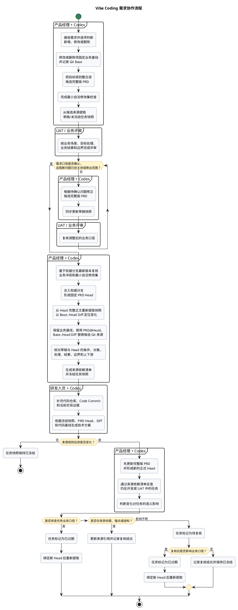

# 完整版 PRD 与开发任务需求快照指南

## 1. 这份指南解决什么问题？

### 1.1 适用范围

本指南用于 Vibe Coding 团队维护各业务领域的软件产品需求，适用于：

- 新建、改写或持续维护 Git 管理的完整版 PRD。
- 把新增、修改或删除需求整合为完整版 PRD 中最新已确认的目标规则。
- 在正式 Head 形成前，使用开发任务需求快照的草稿模式完成需求评审。
- 从指定 PRD 提交中形成已冻结的开发任务需求快照，供 UAT 人员、研发人员和产品经理查阅。
- 为技术方案准备可追溯的产品输入，但不在 PRD 中代写技术实现方案。

本文件所在目录以及文中的物流、账单、金额等例子，不限制指南的适用范围。实际编写时，应替换为当前产品和业务领域使用的正式名称。

### 1.2 交付目标

整理后的需求按照“UAT 人员 → 研发人员 → 产品经理”的读者优先级组织。三类读者应沿同一条业务口径读懂：

1. 为什么提出需求，要解决什么具体问题。
2. 谁在什么位置发起，业务经过哪些主要环节。
3. 页面、业务工作项、后台自动作业、接口、字段、计算、状态或权限怎样变化。
4. 成功路径、业务分支、异常、兼容和存量数据怎样处理。
5. 哪些规则已经确定，哪些问题仍需产品经理确认。

团队只维护两类正式需求载体：

1. **完整版 PRD**：持续维护最新已确认的目标业务口径，是唯一需求主库。
2. **开发任务需求快照**：围绕某个业务目标组织的任务视图；冻结后绑定固定 PRD Head，供 UAT 和研发阅读。

修改或删除需求在合并前使用开发任务需求快照的“草稿/未冻结”模式评审，不再建立第三类“变更需求文档”。逻辑问题进入任务系统；尚未建立外部问题时，可以随草稿快照输出临时问题清单。

**PRD 与测试材料必须分开**：

- PRD 只定义产品目标、业务场景、正式规则、系统行为、数据口径和业务边界。
- PRD 不写测试用例、测试步骤、专用于测试执行的数据集或清单、测试覆盖、通过/失败判定或独立验收标准。
- 规则无法形成唯一业务结果时，补全条件和边界，不另写一套测试或验收口径。
- 第 6.10 节的虚构业务数据只用于解释正式规则，不属于测试数据。

### 1.3 不可破坏的原则

- **逻辑完整**：调整结构、顺序、标题、措辞或图示时，不得改变已经确认的业务口径。
- **先总后分**：先交代目的和全貌，再逐步展开场景、规则、数据与边界。
- **唯一主描述**：一条规则只在一个位置完整定义，其他位置通过业务标题或链接引用；已有稳定 `R-xx` 时一并标注。
- **具体可执行**：写清条件、对象、处理和可观察结果，避免读者自行推测。
- **术语一致**：同一对象、字段、状态和操作始终使用同一名称。
- **依据可追溯**：可验证事实、已确认规则、工作假设和待确认问题分开标识；已有数据、反馈或现状记录时注明来源。
- **问题透明**：无法形成唯一实现结果的问题必须显式列出，不得自行选择口径并静默覆盖。
- **载体各司其职**：PRD、Git、任务系统、开发任务和技术方案分别承载业务口径、修改历史、任务治理、需求快照和实现设计，不重复维护同一信息。采用 Git 管理并提取开发任务时，另遵守第 2.3、3.5、9.3 和 9.4 节。

本指南使用以下规则强度：

- **必须/不得**：缺失或违反后，无法形成唯一、可执行的业务口径或业务结果。可以合并表达，不等于必须单独成节。
- **涉及或满足条件时必须**：只有触发条件成立时才强制执行；未触发时不写空章节或“不适用”占位。
- **必须检查/盘点**：作者必须完成判断；实际没有相关规则，且省略不会造成误解时，不保留空标题。
- **应/推荐**：默认采用的做法；确有更清晰的表达方式时可以调整，但应说明理由并保全逻辑。
- **可以/按需**：按复杂度选用的表达工具，不得借此省略已经存在的业务规则。

### 1.4 统一术语

| 术语 | 含义 |
| --- | --- |
| 新增项 | 引入此前不存在的目标业务能力或业务结果；没有既有业务行为时不虚构“修改前” |
| 修改项 | 改变既有业务条件、处理方式或结果；必须保留已确认的修改前依据 |
| 删除项 | 取消既有业务能力或结果；必须说明删除前依据以及删除后的系统行为和影响 |
| UAT 人员 | 代表实际业务用户确认产品行为、业务结果和适用边界是否符合已确认口径的读者 |
| 参与方 | 用户角色、业务系统、后台自动作业或外部服务 |
| 成功主流程（Happy Flow） | 业务从起点成功到达终点的主要路径 |
| 业务分支 | 可预期且能够按已确认规则得到业务结果的情况，即使结果并不理想，例如缺货转人工复核 |
| 异常流程 | 系统无法按预定规则完成处理的情况，例如数据不合法、执行失败、超时、并发冲突、回退、重试或补偿 |
| 业务工作项 | 由人员领取、分派或处理，并具有处理人、状态和完成条件的业务对象，例如审批待办或复核工作项 |
| 后台自动作业 | 由系统按时间、事件或条件自动执行的处理，例如定时扫描或批量归集；不包括业务工作项 |
| 存量数据与已生效结果 | 新规则生效前已经产生的数据，以及已经完成、锁定或对外生效的结果 |
| 完整版 PRD | 在 Git 中持续维护、包含最新已确认目标业务口径的权威文档；未生效规则必须注明生效边界，开发任务不得取代它 |
| PRD 基准提交（Base Commit） | 本次需求修改前最后一个已确认的 PRD 提交，用于识别修改前内容 |
| PRD 目标提交（Head Commit） | 已包含本次完整且确认后 PRD 修改的固定提交，是开发任务提取的业务版本 |
| PRD 提交差异（Diff） | Base Commit 与 Head Commit 之间的文件差异，只用于定位变化，不单独定义最终规则 |
| 开发任务需求快照 | 围绕一个业务目标组织新增、修改或删除项的任务视图；正式冻结后以目标提交中的完整版 PRD 为准 |
| 草稿/未冻结快照 | 正式 Head 形成前用于评审的临时任务视图；可以引用 Base、候选提交、PR Diff 或明确的工作区范围，不能作为正式开发或 UAT 依据 |
| 已冻结快照 | 正式 Head 合入权威分支并完成自洽复核后，从该 Head 重新提取并确认的任务视图 |
| 代码基线提交（Code Commit） | 技术方案分析时对应当前代码现状的固定提交；它与 PRD 目标提交分属不同版本维度 |

## 2. 怎样使用这份指南？

### 2.1 先按任务选读

先执行与当前任务对应的最短路径。未满足触发条件的章节无需阅读，也不得把相应结构写进成稿。

| 任务 | 必读内容 | 使用模板 |
| --- | --- | --- |
| 新建或维护完整版 PRD | 第 3.1～3.2、4.1～4.3、7、9.1 和 11.1 节；改写或高频维护时增加第 3.3、3.6、8.1 和 8.3 节；第 5～6 章按内容触发 | 第 10.1 节 |
| 评审新增、修改或删除需求 | 第 3.1～3.3、4.4～4.6、6.9、8.2、9.3 和 11.1～11.3 节；新增项不虚构前态 | 第 10.2 节草稿/未冻结模式 |
| 从正式 Head 冻结开发任务 | 第 3.5、9.3、9.4 和 11.3 节，并回读被引用的业务章节 | 第 10.2 节已冻结模式 |
| 为技术方案准备产品输入 | 第 9.4、10.2 和 11.3 节；技术方案另按团队技术规范编写 | 第 10.2 节中的输入清单 |

常用内容按以下条件启用：

| 内容 | 何时必须写 | 何时省略独立结构 |
| --- | --- | --- |
| 目的、范围、核心场景、业务落点、业务结果和上下游 | 所有需求 | 信息较少时合并进相邻小节，但内容不能缺失 |
| 修改前后与业务基线 | 开发任务快照中的修改/删除项 | 新增项没有既有业务行为时省略，不得把 Diff 中“没有文字”当成业务现状 |
| 生效和存量 | 修改/删除项；新增能力可能处理生效前已存在对象时 | 不单独成节时就近写入对应场景 |
| 流程图或对象关系图 | 达到第 5 章绘图条件 | 文字能无歧义说明时不画 |
| 字段表、决策表、状态表或权限规则 | 字段较多、多条件、多状态或权限影响结果 | 简单规则直接写入场景正文 |
| PlantUML | 动态顺序复杂且文字或表格仍难理解 | 简单线性流程使用编号步骤 |
| 业务数据示例 | 抽象规则仅靠文字难理解 | 规则本身已经清楚时不举例 |
| 非功能约束、风险和依赖 | 实际影响产品可用、业务结果或发布判断 | 没有相关事项时不保留空节 |

同一份 PRD 可以为不同读者提供不同阅读入口，但不能生成多套需求口径。成稿的信息优先级固定为“UAT 人员 → 研发人员 → 产品经理”：

- **UAT 人员优先阅读**：概要（如有）→ 新增能力或修改/删除前后 → 业务全貌 → 核心场景、系统处理与业务结果 → 业务边界 → 生效与存量 → 结果与下游。
- **研发人员优先阅读**：概要（如有）→ 核心场景 → 业务落点 → 正式规则 → 字段、计算、状态、权限和外部契约 → 异常与存量。
- **产品经理优先阅读**：问题依据与范围 → 基线与规则归属 → 业务口径 → 逻辑问题 → 风险、依赖和多载体一致性。

UAT 人员在 PRD 中阅读业务行为和结果；测试材料遵守第 1.2 节的分离边界。其他业务人员可以沿 UAT 路径阅读。

### 2.2 统一执行七步

| 步骤 | 主要输入 | 关键动作 | 产出 | 对应章节 |
| --- | --- | --- | --- | --- |
| 1. 明确目的与边界 | 原始需求、关联资料、业务口径 | 说明缘由、对象、范围、输入和输出；既有需求建立基线 | 需求定位卡 | 第 3 章 |
| 2. 选择载体并搭建骨架 | 需求定位卡 | 选择完整版 PRD 或开发任务需求快照，逐项判断新增、修改或删除，确定唯一主描述位置 | 章节目录 | 第 4 章 |
| 3. 建立业务全貌 | 参与方、对象、输入输出、主要环节 | 先用文字概括，复杂时补 D2 总览图或对象关系图 | 业务全貌 | 第 5 章 |
| 4. 补全详细需求 | 已确认规则、字段、原型、状态和外部契约 | 先盘点规则，再按需补充指标、非功能约束、PlantUML 和数据示例 | 业务口径完整、结果唯一的正文 | 第 6 章 |
| 5. 优化结构与措辞 | 完整需求初稿 | 调整衔接，统一术语，删除无效和含糊表达 | 易读正文 | 第 7 章 |
| 6. 检查逻辑与一致性 | 正文、图、原型、示例、关联 PRD | 查冲突、缺失、歧义、存量、多载体口径及实际存在的风险、依赖和发布条件 | 问题初稿 | 第 8 章 |
| 7. 完成交付 | 正文和问题初稿 | 区分评审稿与正式稿，输出逻辑问题清单 | PRD 正文 + 问题清单 | 第 9 章 |

执行顺序和成稿顺序不同：编写时先确认详细规则，再据此绘制 PlantUML；成稿时可以把场景图放在规则之前，帮助读者先看全貌。不得用尚未确认的图反推业务规则。第 3 章的需求定位卡默认是编写底稿，其目的、范围和上下游信息应转写进完整版 PRD；改写基线默认作为审查依据，修改或删除项的基线进入开发任务需求快照，不长期写入合并后的完整版 PRD。

### 2.3 Vibe Coding 团队怎样串联 PRD、开发任务和技术方案？

采用 Git 管理完整版 PRD 时，按“更新候选 PRD → 提取任务草稿 → 评审并形成正式 Head → 冻结任务快照 → 补充代码基线 → 生成技术方案”的顺序协作：

1. 收到需求后逐项标明新增、修改或删除；修改/删除项固定业务基线和 Git Base。
2. 先把目标规则整合进候选版完整版 PRD，并完成一次最小自洽修改集检查。
3. 从候选提交、PR Diff 或明确的工作区范围提取开发任务需求快照草稿，用于 UAT/业务评审；草稿不作为正式开发或 UAT 依据。
4. 根据评审结论继续修正完整版 PRD，按第 3.5～3.6 节形成已经合入权威分支且自洽的 Head Commit。
5. 按第 9.3 节从固定 Head 重新提取和核对任务快照，替换候选来源并标记为已冻结。
6. 研发按第 9.4 节补充代码仓库、Code Commit 和现有实现证据后，生成技术方案。
7. 来源规则后续变化时，先提交新版 PRD，再按语义影响处理旧快照：无关变化保持冻结，纯定位变化更新引用，影响不明时标记“待复核”，业务口径变化时标记“已过期”并重新提取。

下图展示一次需求从进入产品流程，到形成技术方案，再到后续规则变化时重新处理任务快照的完整协作路径：



图中只有“已冻结”任务快照可以进入正式开发和 UAT。草稿快照用于确认需求口径；完整业务规则始终维护在完整版 PRD 中，任务快照只提供版本化阅读视图。正式 Head 是 PRD 的 Git 版本，不是任务状态；冻结任务时只替换候选 Git 来源，修改或删除项的业务基线继续保留。研发生成技术方案前，还必须从代码仓库补齐代码基线和当前实现证据，不能仅凭 PRD Diff 推断实现方式。

该图只概括协作顺序和门禁，不单独定义业务规则。完整规则分别以第 3.5～3.6、9.3～9.4 和 11.3 节为准；图中节点与这些章节存在差异时，必须先修正文和图，不能从图中自行选择口径。

开发任务草稿可以先于正式 Head 建立，但必须明确候选来源和未冻结状态。只有正式 Head 已存在并完成重新提取与核对后，任务快照才能冻结。不得在 PRD 正文预填未知 Commit；详细规则以第 3.5、9.3 和 9.4 节为准。

## 3. 第一步：明确需求目的与边界

### 3.1 先用简洁语义说明缘由

开始写正文前，先回答：

- 现有业务怎样处理，出现了什么可观察的问题或风险？
- 哪些事实、数据、反馈或现状记录能够证明该问题，来源和时间范围是什么？
- 当前有明确的政策、业务阶段、数据变化或版本窗口驱动吗；如果有，为什么需要现在处理？
- 本次需求要解决什么问题，不解决会产生什么业务影响？
- 核心用户、次要用户和受影响方分别是谁，处理的核心业务对象是什么？用户分群依据是角色、权限、行为还是业务目标？
- 上游提供什么输入，本需求输出什么结果，结果交给谁继续使用？
- 哪些内容在本需求范围内，哪些明确不在范围内？
- 哪些规则由本需求完整定义，哪些只引用其他章节？
- 哪些内容是尚未确认的工作假设，哪些必须由产品经理或业务负责人确认？

需求目的应直接写“缘由 + 目标结果”，不写“优化体验”“完善能力”等抽象结论。先描述能够观察或复现的问题，再描述方案，不得把拟采用的方案当成问题本身。存在多个层级的问题时，先写造成主要业务影响的主问题，再写支撑或派生的次级问题，避免把不同层级的症状平铺。内容较简单时，用一至两段说清即可。

目标涉及数量、比例、时效或质量变化时，按需写明现状基线、目标值、统计周期和数据来源。资料不足时列为待确认，不虚构数字。工作假设只用于推动评审，必须明确标注；会改变业务结果的假设在正式稿前必须确认，无法确认时将受影响内容移出范围。

### 3.2 形成需求定位卡

| 项目 | 需要填写的内容 |
| --- | --- |
| 需求目的 | 要解决的具体问题和目标业务结果 |
| 目标用户或参与方 | 使用者、受影响角色、系统、后台自动作业或外部服务 |
| 核心对象 | 本需求处理的业务对象或记录 |
| 问题依据 | 已有数据、反馈或现状记录的来源、日期和统计口径；没有直接依据时明确说明 |
| 成功结果 | 可观察的业务结果；涉及量化变化时补基线、目标值、统计周期和数据来源 |
| 范围 | 本次纳入和明确排除的内容；容易误解的排除项补充原因、已确认的后续版本或承接方式 |
| 上游输入 | 来源、触发条件、前置状态或已有配置 |
| 下游输出 | 页面结果、数据结果、状态、通知或后续流程 |
| 规则归属 | 本章完整说明的规则，以及只引用的外部规则 |
| 工作假设 | 当前用于评审但尚未确认的前提，不得与已确认事实混写 |
| 待确认事项 | 暂时无法形成唯一口径的问题；优先关联任务系统问题 ID，没有外部 ID 时在评审稿临时编号 |

灰度对象、例外条件或前置依赖会改变规则适用范围或处理结果时，必须写入范围边界。无法填清需求目的、输入、输出或规则归属时，先补齐边界，不要直接罗列字段或调整原型。

当前文档存在易混淆对象、内部简称或多对象主从关系时，应在这些内容首次出现前增加“业务术语与对象定义”，也可以放在业务全貌开头，至少说明正式名称、业务含义、识别方式和关键关系。同一概念全篇只使用一个名称；没有易混淆术语时不为凑结构增加词典。

### 3.3 改写完整版 PRD，以及修改或删除项必须建立基线

基线用于在改写、评审和开发任务提取时证明“修改前表现”以哪个已确认版本为准，至少包括：

- 任务系统中的需求或变更 ID。
- 关联 PRD 的文件、章节或规则位置。
- 关联原型或页面版本。
- 当前线上版本或最近确认版本。
- 基线日期和能够证明现状的资料。

无法确认基线，且不同基线会产生不同修改结果时，应列为阻断问题，不能凭记忆描述现状。

基线默认属于编写底稿、评审材料或开发任务，不永久写入已经合并完成的完整版 PRD。完整版 PRD 合并后只保留最新已确认的目标规则，以及仍影响目标行为的生效、并行和存量边界；修改前表现、已结束的迁移过程和已关闭问题交由 Git、任务系统及 Diff 追溯。只有新旧规则仍在并行、迁移尚未结束，或存量数据继续受旧规则约束时，旧口径才作为业务边界保留；条件结束后及时删除。

### 3.4 Git 管理下哪些元信息不再写进 PRD？

当 Git 和任务系统已经能够提供版本、状态、人员与时间信息时，PRD 不再手工维护重复元信息：

| 信息 | 记录位置 |
| --- | --- |
| 文档名称 | 使用准确的文件名和一级标题 |
| 版本、创建/更新时间、修改历史 | Git Commit、Log 和 Diff，不在正文另建版本号或变更记录表 |
| 草稿、评审、开发、完成等状态 | 任务、PR 或团队工作流，不在 PRD 正文重复维护 |
| 负责人 | 任务系统、代码所有者或仓库约定；无法从外部确定且确有沟通价值时，PRD 顶部只保留“业务负责人”一项 |
| 关联资料 | 在相关业务规则附近链接实际使用的原型、制度或外部契约；不建立重复的资料目录 |

业务生效版本、生效时间和适用范围会改变系统行为，属于正式规则，不属于文档元信息，仍须写入对应场景。独立文档没有 Git、任务系统或其他治理载体时，才按团队需要补最少的负责人、状态和日期；所属 PRD 内的章节不单独建立元信息。

### 3.5 Git 提交怎样成为可追溯需求基线？

业务基线和 Git 版本基线解决的问题不同：第 3.3 节的基线说明线上或已确认能力当前怎样工作；Base Commit 和 Head Commit 说明本次文档从哪个固定版本改到哪个固定版本。两者必须分别记录，不得互相替代。

采用 Git 管理完整版 PRD 时，遵循以下规则：

1. **固定仓库和路径**：在开发任务或交付记录中记录仓库名称或地址、PRD 文件路径；同名文件存在多个副本时，明确哪一个是权威来源。完整版 PRD 不记录自身仓库信息。
2. **固定前后提交**：Base Commit 是本次修改前最后一个已确认提交，Head Commit 是包含本次完整 PRD 修改的提交。正式交付使用不可变的 Commit SHA，不用分支名、“最新版本”或日期代替。
3. **一个提交围绕一个连贯业务目标**：同一提交可以同时修改 PRD、原型说明和关联规则，但不要混入无关需求或纯格式整理。无法拆分时，开发任务必须精确限定文件、业务标题、标题锚点和按需使用的稳定规则编号，并说明混合提交风险。
4. **提交内容必须自洽**：同一规则涉及的正文、图、字段、状态、原型说明和问题结论应同步更新。暂时不能同步时，通过任务系统问题 ID 或评审稿临时问题编号说明差异、影响版本和补齐责任；差异会导致业务口径或结果不唯一时，按第 3.6 节作为阻断项处理，不得形成正式 Head。
5. **未提交内容不进入正式提取**：工作区存在尚未提交的相关修改时，只能生成“草稿/未冻结”任务，并列出未提交来源；不得把工作区内容伪装成 Head Commit 中的规则。
6. **提交信息直接说明业务变化**：优先使用“业务对象 + 修改动作 + 主要结果”，避免“更新文档”“调整描述”等无法检索业务内容的提交信息。
7. **交付后不改写历史**：开发任务已经引用某个 Head Commit 后，不通过覆盖或改写该提交改变口径；后续修正使用新提交，并更新任务的来源版本和状态。

PRD Diff 负责回答“相对 Base Commit 改了什么”，Head Commit 中的完整正文负责回答“目标提交采用什么完整规则”。删除的旧规则只用于理解变化，不得继续作为目标需求；Diff 未展示但被新规则引用的共用规则、字段、状态和上下游，仍必须从 Head Commit 回读。

完整版 PRD 的 Head Commit 不能写在产生该提交的正文中，也不需要补写；只有开发任务、PR 或其他交付记录引用它。这样可以避免为了更新 Commit 而再次产生无业务意义的提交。

### 3.6 高频修改时，完整版 PRD 怎样持续保持自洽？

完整版 PRD 是“最新已确认目标口径说明书”，不等同于当前线上现状。尚未生效的目标规则必须写清生效条件、适用范围和存量处理；新旧规则并行时，同时保留两套规则的适用边界和旧规则退出条件。线上或修改前现状由业务基线说明。

每次新增、修改或删除都必须形成一个“最小自洽修改集”：凡是会被本次业务变化影响的正文、共用规则、流程图、对象关系、字段、计算、状态、权限、原型引用、生效存量和上下游，都在同一次修改中更新或明确记录未同步原因。不得只改提出需求的段落，把相互矛盾的旧口径或悬空引用留在其他位置。

每次修改按以下顺序完成：

1. **定位主描述**：确认本次新增、修改或删除涉及的业务标题、唯一主描述位置，以及被引用的共用规则。新增能力先确定应归入哪个业务对象和章节，不在文末长期堆叠“新增需求”；删除能力同时定位需要清理或改写的引用位置。
2. **扫描影响**：搜索旧名称、业务标题、锚点、稳定 `R-xx`、字段、状态、流程节点和原型引用，形成受影响位置清单；同时检查上游输入、下游结果和保持不变的高风险规则。
3. **合并目标口径**：直接把正式章节改成最新已确认的目标完整规则。旧行为只在仍并行、迁移未结束或存量继续受其约束时保留，并写清适用范围与退出条件。
4. **同步关联载体**：同一结果涉及的正文、图、表、示例和原型说明同步修改。暂时不能同步且会造成业务口径或可观察结果不唯一时，该问题属于阻断项，不能形成正式 Head 或冻结任务；只有不影响当前唯一结果且明确移出本次范围的事项可以延期。
5. **检查新增冲突**：重新执行第 8 章，重点比较公共规则与局部例外、同一字段或状态的多处定义，以及新旧上下游契约。
6. **提交最小业务闭环**：一个提交围绕一个连贯业务目标，包含该目标的完整自洽修改集；纯格式重排或无关需求另行提交，避免 Diff 无法识别真实业务变化。

多个需求并行修改同一 PRD 时，以业务标题和主描述位置划分修改范围。正式 Head 必须是变更已经合入权威分支、完成冲突复核和自洽检查后的提交。不同任务同时触及同一主描述、共用规则、字段、状态或流程节点时，必须串行合并，或先形成双方共同确认的合并后规则；后合并者基于最新 Head 重新执行影响扫描，不得把较早版本的段落整体覆盖回来。Git 没有文本冲突不代表业务规则没有冲突。

一个任务跨多个提交完成时，开发任务应记录目标分支上的最终 Head，并通过业务标题、锚点和提交集合限定本任务来源范围；不得使用包含其他任务的整段 Diff 代替精确来源。每次合入权威分支后，都要检查受影响的已冻结任务。

已经提取的开发任务不会随完整版 PRD 自动更新。后续提交只要触及任务引用的主描述、共用规则、字段、状态、流程、原型或边界，就按第 9.3 节判断任务失效范围，并重新提取或逐项复核。

## 4. 第二步：选择需求载体并搭建骨架

### 4.1 两类需求载体共用的信息顺序

无论编写完整版 PRD 还是开发任务需求快照，正文都先回答三个层次的问题：

1. **为什么和影响谁**：为什么做、做什么、不做什么，涉及哪些场景、参与方和业务对象。
2. **系统怎样处理并形成什么结果**：业务从哪里进入，各场景怎样处理，结果在哪里可见或可用，谁继续使用。
3. **哪些约束会改变结果**：实际涉及的页面、字段、计算、状态、权限、外部契约、异常、存量、风险和依赖。

简单需求可以合并相邻小节，但必需信息不能删除。不得先讲异常再补成功主流程，也不得在业务对象尚未解释时直接堆放字段名、状态名或技术表名。

根据复杂度选择展开方式，不因模板完整而机械填满章节：

| 复杂度 | 适用条件 | 推荐表达方式 |
| --- | --- | --- |
| 轻量 | 单一业务落点、主要结果唯一、没有复杂分支或跨对象联动 | 目的与范围 → 落点及目标处理 → 正式规则与边界 → 生效/存量 → 上下游结果 |
| 标准 | 存在多个场景、字段或状态约束，但业务全貌仍能顺序说明 | 按交付载体使用第 4.3 或 4.4 节骨架，并删除未触发的按需章节 |
| 复杂 | 跨角色或系统、存在关键分支、对象关系复杂，或有跨场景共用约束 | 在标准结构上按条件增加 D2、PlantUML、对象关系图、规则定位索引及专项规则 |

章节可以合并、重命名或调整非关键位置，但不得省略实际存在的规则、边界和上下游结果。轻量结构减少的是阅读层级，不是需求内容。

为降低作者负担，分两轮成稿：

1. **第一轮闭合业务主线**：只写清目的、范围和核心场景。每个场景回答“谁在什么条件下、在哪里处理哪个对象，系统怎样处理，形成什么业务结果，由谁继续处理”。任务快照中的修改或删除项同时补齐业务基线、前后差异、生效和存量。
2. **第二轮按触发条件补专项内容**：只补本需求实际涉及的字段、计算、状态、权限、外部契约、图、数据示例、非功能约束、风险和依赖。开始写正文前先删除未触发的按需章节，不能逐格填满模板。

### 4.2 面向不同读者提供首屏导航

只有较长、复杂或包含多个业务模块的完整版 PRD 才保留文档级概要；轻量 PRD、单一章节以及上层概要已经覆盖的内容不重复增加。完整版 PRD 的概要描述最新已确认的目标能力及其适用、生效边界，不记录某次历史变更。开发任务需求快照使用同样的四项结构；其中新增项概括“新增能力 → 主要业务结果”，修改或删除项概括“前态 → 目标行为 → 主要业务结果”。

- **目的**：一句话说明要解决的问题和目标业务结果，并链接目的或范围章节。
- **影响范围**：说明主要场景、用户和业务对象；关键排除项一并说明，并链接范围章节。
- **核心内容**：完整版 PRD 概括目标核心能力；任务快照中的新增项概括“新增能力 → 主要业务结果”，修改或删除项概括“前态 → 目标行为 → 主要业务结果”；混合任务分别概括，并链接对应业务标题或标题锚点。
- **生效边界**：说明生效范围和时点、存量数据处理及最关键限制，并链接正式规则。

评审稿存在阻断问题时，可以增加一行“待决策：{任务系统问题 ID 或临时问题编号} + 影响”；问题关闭后从正式 PRD 概要中删除。系统落点、上下游、字段和状态等细节不单列为概要项，需要突出时直接链接对应业务标题。

概要只做导航，不完整定义规则。链接直接放在业务标题或摘要句中，不为“主描述位置”另加一列表格；不得在概要重新定义触发条件、计算方式或边界。

导航链接必须指向当前正文采用的业务标题或锚点，链接文字优先使用业务标题而不是裸编号或文件名。读者从摘要或场景导航最多跳转一次即可到达核心规则；即使链接或图暂时无法打开，正文也必须能独立表达完整业务口径。

满足以下任一条件时，可以在业务全貌后增加“场景导航”：核心场景达到三个及以上；场景说明跨多个章节；需要多个业务角色协作。

| 场景 | 适用条件摘要 | 参与方与对象 | 业务结果摘要 | 正文位置 |
| --- | --- | --- | --- | --- |
| {业务标题} | {触发条件和前置状态} | {角色和对象} | {形成的业务结果} | {业务标题锚点；按需附稳定规则编号} |

场景导航只帮助定位，不定义新规则。简单需求不得增加空导航表。

复杂文档的规则跨越多个章节、单段需要引用三个以上规则，或读者难以定位主描述时，可以增加“规则定位索引”：

| 规则标识（按需） | 业务标题 | 主描述位置 | 其他引用位置 |
| --- | --- | --- | --- |
| {稳定规则编号；无则删除本列} | {对象 + 处理动作} | {标题锚点} | {图、字段表、状态表或示例链接} |

规则定位索引只回答“规则在哪里”，不定义或检查规则。默认使用业务标题和 Markdown 锚点；确有稳定规则编号时必须搭配业务标题，正文不得只堆编号。

### 4.3 完整版 PRD 的标准骨架

完整版 PRD 推荐按以下阅读顺序组织；可以按需求复杂度合并、重命名或调整非关键章节，但必须保留实际涉及的信息并符合先总后分。第 10.1 节模板按此顺序提供参考：

Git 管理的完整版 PRD 是“最新已确认目标口径说明书”。新需求或变更合并完成后，正文只保留目标适用范围、目标流程、目标规则、目标边界和目标上下游；尚未生效时写清生效条件和存量处理。不长期保留修改原因、修改前表现、变更类型、已结束的迁移过程、已关闭问题或版本修改记录。新旧规则仍并行或存量数据仍受旧规则影响时，相关旧规则属于目标口径的当前边界，保留到退出条件满足为止。

1. **需求目的与范围**：缘由、目标、纳入和排除范围。
2. **业务全貌**：参与方、核心对象、输入、主要环节和输出；存在易混淆术语或对象时先定义。
3. **成功主流程**：按业务发生顺序说明主要成功路径。
4. **分场景规则**：展开正常条件下的不同处理结果。
5. **业务落点与操作**：每个核心场景必须写清业务落点；可以在场景内直接说明，也可以引用统一定义。只有多个场景共用落点、涉及多种落点类型或定位信息较长时，才独立成节。
6. **字段、计算、状态、权限、指标与非功能约束**：按实际涉及的规则类型补齐。
7. **业务数据示例**：复杂规则仅在需要帮助理解时按需提供，并引用正式规则的业务标题或锚点；规则已有稳定 `R-xx` 时一并标注。示例遵守第 1.2 节边界。
8. **共用异常与边界**：每个核心场景必须完成异常与边界盘点，局部规则就近说明；只有跨场景共用时才独立成节。
9. **风险、依赖与发布条件**：存在会影响范围、规则、生效结果或发布判断的事项时按需说明，不因跨团队或跨系统本身机械增加章节。
10. **结果与下游衔接**：说明输出由谁、在何处继续使用。

需求目的、范围、业务全貌、各核心场景的业务落点、实际存在的核心规则和结果衔接必须存在，但可以合并进相邻内容。每个核心场景必须盘点异常与边界；实际存在时就近写入，不存在且省略不会造成误解时不设空章节。图、独立业务落点小节、独立原型小节、字段表、状态表和数据示例按触发条件选用。

第 4 项用于完整定义按场景发生的行为、时效、分析采集、通知留痕、查询统计或报表规则；其中跨多个场景共用的字段、计算、状态、权限、指标和非功能约束可以集中放在第 6 项，并由各场景引用。编写者必须为每条规则确定唯一主描述位置，不能因模板分节而重复定义。

### 4.4 开发任务需求快照的标准骨架

开发任务需求快照统一承载新增、修改和删除项，不再为新增需求和变更需求维护不同模板。任务标题使用：`开发任务：{业务对象 + 目标动作或结果}`。每个任务围绕一个连贯业务结果；可以独立上线、回滚或采用不同存量策略的内容应拆成不同任务。

同一模板有两种状态：

- **草稿/未冻结**：用于正式 Head 形成前的需求评审。新增项直接描述目标能力；修改或删除项必须说明业务基线、前态、目标行为和影响。来源可以是 Base、候选提交、PR Diff 或明确的工作区范围，但必须标明尚未冻结，不能作为正式开发或 UAT 依据。
- **已冻结**：完整版 PRD 已合入权威分支并形成自洽 Head 后，从该 Head 重新提取和核对。候选来源必须替换为不可变的 `PRD@Head` 与 `Base..Head Diff`；只有该状态可以正式进入开发和 UAT。

两种状态使用相同的 UAT 优先信息顺序：

1. **需求概要**：目的、影响范围、核心内容和生效边界。
2. **本次需求导航**：逐项标明新增、修改或删除，以及目标处理、完整业务结果和来源位置；全为新增项时不保留前态列。
3. **业务全貌与核心场景**：复杂任务按需展示流程全貌；每个场景连续说明参与方、对象、业务落点、目标系统处理、完整业务结果和局部边界。修改或删除项在目标处理之前补充前态及依据。
4. **生效、存量、异常与上下游**：说明切换点、已存在对象、已完成结果、重复与失败处理，以及上下游影响。
5. **受影响专项约束和高风险不变规则**：只保留本任务实际涉及的字段、计算、状态、权限、页面、工作项、后台作业、接口、运行约束及容易误改的相邻规则。
6. **来源与依赖**：草稿记录候选来源；冻结后记录 `PRD@Head`、`Base..Head Diff`、实际原型或外部契约和来源依赖清单。
7. **待确认问题**：仅草稿或确有未决问题时保留；阻断项关闭或移出范围前不得冻结。
8. **技术方案交接**：只列产品输入和研发需要补齐的代码基线，不写实现设计。

修改或删除项的合并前评审能力由草稿快照承担，不再建立独立变更需求文档。评审通过后，把目标规则整合进第 4.3 节结构；修改原因、业务基线、前态和已结束的迁移过程留在任务系统、Git 与任务快照，只有仍影响目标行为的生效、并行、存量和退出边界继续保留在完整版 PRD。

任务快照必须直指系统业务落点和可观察结果，但不指定代码结构、技术框架、数据库表或中间件方案。已经确认且必须兼容的外部契约除外。

### 4.5 用业务标题和锚点定位内容，编号只按需使用

默认使用“PRD 文件@Head Commit + 业务标题或 Markdown 锚点”定位内容。章节编号只表示当前阅读顺序，插入、删除或重排章节后可能变化，不得作为跨版本、跨任务或长期引用的唯一标识。

| 内容 | 默认定位方式 | 何时补编号 |
| --- | --- | --- |
| 任务条目 | 开发任务中的业务标题和普通序号 | 不使用 `CP-xx`；具有独立上线、回滚或存量策略时优先拆成独立任务 |
| 正式规则 | 业务标题和标题锚点 | 同一规则跨章节、被图/表反复引用、被多个任务长期引用，或高风险规则容易混淆时使用稳定 `R-xx` |
| 业务数据示例 | 紧跟对应规则，以“示例”作为标题 | 不使用 `EX-xx`；确需从多个位置引用时，使用有业务含义的示例标题 |
| 待确认问题 | 任务系统问题 ID | 没有外部 ID 且评审稿同时存在多个问题时，临时使用 `Q-xx`；问题关闭后从完整版 PRD 删除 |

规则使用 `R-xx` 时，业务标题必须在前，例如“附加费按创建时间归入账期（R-12）”，不得只写“参见 R-12”。一条稳定规则对应同一触发条件下的一项主要可观察结果；触发条件、责任方、结果或失败处理可以独立变化时拆分。状态表或决策表可以作为一条规则的完整载体，其每一行不机械编号。

同一文件内短距离引用可以只写业务标题或锚点；跨文件或跨版本引用写成：`PRD 文件@Head Commit#业务标题锚点`。如果业务标题必须调整，同时更新引用位置；Git 负责保留旧标题和规则变化历史。

### 4.6 避免重复定义

- 任务整体范围只写纳入和排除项，不在各场景重复抄写。
- 业务落点只负责定位，不在定位表里展开完整规则。
- 每个任务条目连续说明适用场景、目标处理、完整业务结果、局部影响和特有边界；修改或删除项在前面补充前态依据。
- 集中的业务落点及跨场景专项约束放在 UAT 业务主线之后；核心场景只保留落点摘要和链接，不重复展开定位表或共用约束。
- “保持不变的高风险规则”只写跨任务条目且容易被误改的既有规则。
- 相同规则只保留一个完整描述位置，其他位置引用业务标题或锚点；规则已有稳定 `R-xx` 时一并引用，不得复制后形成两套口径。

共用规则和局部例外同时存在时，局部规则必须写明：覆盖哪个业务标题或稳定规则编号、在什么对象和条件下覆盖，以及未被覆盖的部分继续沿用哪条规则。不得只写“特殊处理”“其他沿用原逻辑”。

只有省略某类内容后容易被误解为漏写时，才使用下表记录适用性；默认作为编写底稿，确有沟通价值时才进入 PRD。它只判断内容类别，不枚举输入组合、操作步骤或结果断言。

| 内容类别 | 适用/不适用 | 判断依据 | 正文位置 |
| --- | --- | --- | --- |
| {流程图/对象关系/状态权限/存量/非功能/风险依赖等} | {适用/不适用} | {为什么} | {章节链接或不适用} |

## 5. 第三步：建立业务全貌与图形总览

### 5.1 先用文字说明全貌

先用一段话或编号步骤说明参与方、核心对象、输入、主要环节和输出，再分别判断业务流程和对象关系是否需要绘图。流程复杂度与对象关系复杂度互不依赖，可以只画一种图，也可以两种都画。

### 5.2 什么时候绘制 D2 主流程总览图？

成功路径满足以下任一条件，且编号步骤仍难以让读者一次看清全貌时，使用 D2 绘制“成功主流程总览图（Happy Flow）”：

- 主要业务环节较多，顺序、依赖或结果不容易通过编号步骤说明。
- 跨越不同业务角色、系统或处理阶段，并发生职责或数据交接；简单的一次用户操作和页面反馈不单独触发绘图。
- 存在会改变后续环节的两条及以上正常成功路径。
- 包含正常等待、异步接续、人工接续或业务循环，并影响后续成功路径。

仅包含两至三个线性步骤、由同一参与方连续完成且没有关键分支时，可以使用编号步骤代替 D2。

### 5.3 D2 主流程总览图怎样画？

- 默认展示从起点到终点的主要成功路径，不混入失败、重试和回退。
- 关键正常分支会改变后续环节时，在总览中画出分流与汇合，或另画分支总览。
- 一个节点表示读者需要理解的业务环节，名称使用“业务动作 + 结果”。
- 对业务结果有直接影响的定时作业、批处理、自动审核或异步处理可以成为节点。
- 接口调用、数据库操作、消息队列消费等实现步骤不得单独成为业务节点。
- 每个节点必须能定位到正文说明；多个简单、连续的节点可以由同一小节统一说明。
- 涉及多个参与方时，按角色、系统、后台自动作业或外部服务分组。

开发任务中的修改或删除项需要流程总览时，至少保留一个上游入口、完整变化路径和一个下游出口。大段未变化流程使用一个上下文节点或引用既有流程，不重复绘制整条链路。

### 5.4 什么时候绘制 D2 核心对象关系图？

当核心对象的归属、包含、引用或数量关系无法在一至三句话内无歧义地说明时，使用 D2 核心对象关系图。对象数量本身不构成绘图条件。

- 静态对象图按“业务领域”或“对象职责”划分业务分组或容器，不称为泳道；“泳道”只用于动态活动图。
- 每个对象只展示理解当前关系所需的标识、归属、关联和关键业务字段，不伪装成完整 ER 图或字段字典。
- 连线使用“包含”“归属于”“引用”等明确关系词；能确认时，用通俗文字标明一对一、一对多等数量关系。
- 无法确认的关系进入问题清单，不得猜测。
- 数据产生、传递、汇总、拆分、匹配和写回属于动态处理，应在流程正文中说明；只有达到第 6.8 节条件时才进入 PlantUML。

### 5.5 D2 图下必须补充业务说明

| 图类型 | 图下说明 |
| --- | --- |
| 主流程总览图 | 流程目的、起点和终点、参与方、主要输入输出、各环节对应的正文位置 |
| 核心对象关系图 | 分组含义、对象范围、归属或引用关系、数量关系，以及“图中字段并非完整字段清单”的说明 |

D2 图遵守 [D2 节点关系图布局规则](./layout-d2.md)。本指南只规定何时画、画什么；D2 语法、渲染和布局不列入常规检查。只有产品经理审阅发现异常或明确要求时，才执行相关校验。

## 6. 第四步：补全业务口径完整、结果唯一的详细需求

### 6.1 先按场景盘点规则

先列出成功主流程、正常业务分支和异常流程，再确认每个场景的条件、参与方、对象、输入、处理和输出。

每个核心场景按照“角色与触发 → 对象与前置状态 → 业务落点 → 系统处理 → 完整业务结果 → 后续处理方 → 局部边界”的顺序连续说明。存在多角色协作时，分别说明各角色的动作和责任边界。

业务落点或共用规则集中定义时，场景内使用业务标题或锚点链接引用，规则已有稳定 `R-xx` 时一并标注；同时用一句业务摘要说明与当前场景的关系，不得只留裸编号或复制完整规则。

每个核心场景都必须盘点异常与边界。实际存在时就近写入场景；不存在且省略不会造成误解时不设空章节。只有“本场景不允许出现某类分支或异常”本身是重要业务限制时，才明确写出该限制。完成规则、字段、状态和异常盘点后，再判断是否需要 PlantUML；不要先画详细图再补规则。

异常类型较多时，按识别信号或业务处理方式分类，不得统称为“异常情况”。每类异常分别说明触发来源、责任方、处理动作、对核心结果及上下游的影响，以及升级或转人工条件。

### 6.2 不同规则使用不同结构

| 规则类型 | 必须说明的内容 |
| --- | --- |
| 行为或处理规则 | 触发条件、执行者或触发方、处理对象、动作、可观察结果 |
| 字段规则 | 字段名称、业务含义、来源、格式或单位，以及本次涉及的必填、默认、选项、编辑、空值、展示或写回约束 |
| 计算或转换规则 | 输入、公式或转换关系、单位、精度、舍入、输出、空值和异常值处理 |
| 状态规则 | 变更前状态、触发条件、执行者或触发方、变更后状态、允许或禁止操作、是否可逆 |
| 权限规则 | 角色或主体、数据范围、生效条件、允许操作、禁止操作 |
| 匹配或优先级规则 | 候选对象、匹配条件、执行顺序、冲突处理、未命中处理 |
| 业务工作项规则 | 工作项名称、创建条件、关联对象、队列或处理角色、分派/领取、状态、完成条件、转派、并发和超时 |
| 后台自动作业规则 | 作业名称、触发方式、处理范围、输入、处理动作、输出、重复执行、失败和重试 |
| 接口或集成事件规则 | 提供方、调用方或消费方、触发条件、关键业务输入、业务输出、失败结果、重复请求和兼容约束 |
| 页面交互规则 | 页面位置、操作入口、前置状态、用户动作、系统反馈、结果和禁止操作 |
| 异常与边界规则 | 识别条件或信号、受影响对象、处理动作、用户反馈、重试/回退/补偿/人工处理和最终状态 |
| 时效或 SLA 规则 | 按第 6.4 节说明承诺范围、时间边界、超时及补偿口径 |
| 指标规则 | 指标名称、业务定义、公式、数据来源、统计周期与时区、统计维度、排除项、负责人，以及已确认的基线或目标值 |
| 分析采集规则 | 业务事件名称、触发时机、关键业务属性、采集端和使用目的；不写 SDK、代码或日志框架等实现方式 |
| 通知或业务留痕规则 | 触发条件、接收方或记录对象、渠道或可见位置、关键内容、时点、重复和失败处理 |
| 查询、统计或报表规则 | 使用场景、筛选维度、指标口径、刷新时点或频率、导出范围、权限和无数据结果 |

“条件—对象—动作—结果”只适用于行为或处理规则。不得强迫字段、计算、状态、权限、业务工作项、后台自动作业或接口规则套用同一句式。不同条件产生不同结果时，拆为独立规则；多条件组合用流程图仍不直观时，使用决策表列出条件组合、结果和兜底处理。

一个完整业务结果至少说明：哪个业务对象发生什么变化；结果在哪个页面、记录或下游可见或可用；谁可以据此继续什么业务操作。涉及不可逆结果时，还要说明是否允许撤回、更正或重新处理。

一个动作改变多个业务对象或形成多个结果时，必须分别说明各对象变化，并明确哪些结果共同构成本次业务处理完成。允许部分成功时，还必须说明成功与失败对象的识别方式、总体业务状态、已成功结果是否保留、失败对象由谁从哪里继续处理，以及重试、补偿或撤销是否影响已成功对象；不允许部分成功时，说明任一对象失败后的整体业务结果。

| 规则标题/标识 | 条件一 | 条件二 | 其他条件 | 处理结果 | 未命中/冲突处理 |
| --- | --- | --- | --- | --- | --- |
| {业务标题；按需附 R-xx} | {条件值} | {条件值} | {按需增加} | {唯一结果} | {兜底或优先级} |

### 6.3 哪些字段必须逐项列出？

必须逐项列出：

1. 新增、删除、重命名或业务含义发生变化的字段。
2. 来源、格式、单位、必填、默认值、选项、编辑、空值、展示或脱敏规则发生变化的字段。
3. 参与计算、转换、匹配、排序、筛选、防重、状态判断、权限判断或结果写回的字段。
4. 构成本次新增或变更的表单输入、导入、导出、接口、事件或后台自动作业业务契约的字段。
5. 用于关联、快照、审计或追溯，且会影响需求结果的字段。

未发生变化、也不参与判断或数据契约的普通展示字段，不要求在正式规则中穷举；页面关键展示字段可以在原型概述中说明。

字段达到六个及以上，或跨越两个及以上业务对象或用途时，必须按业务对象或用途分组；字段较少且同属一个对象时可以不分组。通用分组包括对象识别、对象归属、业务分类、时间、数量与计算、状态与操作、来源与追溯。

字段表按需使用以下列，不为填满表格虚构规则：

| 字段/字段组 | 处理类型 | 业务含义 | 来源 | 格式/单位 | 本次约束 | 关联规则 |
| --- | --- | --- | --- | --- | --- | --- |
| {业务字段名} | 新增/修改/删除/沿用 | {供谁做什么} | {填写、读取或计算来源} | {类型、长度、单位等} | {必填、默认、选项、权限、空值、防重、展示或写回} | {业务标题/锚点；按需附 R-xx} |

### 6.4 数值、计算和时间规则怎样写？

涉及数量、比例、评分、时长、容量、金额等数值时，写明输入值、单位、公式或转换关系、精度、舍入方式、有效范围、统计时间范围、空值和异常值处理，以及输出值。涉及日期时补充时区、起止边界和是否包含临界时点。

计算结果会随执行时点或来源数据变化时，还必须说明计算触发时点、取数截点（采用哪个时点或版本的数据）、输出是动态值还是快照；快照何时冻结，允许重算的条件、发起方和范围，重算时原结果怎样处理，以及对已生效结果和下游的影响。不重算时，明确来源变化后继续采用哪个结果。

涉及时效或 SLA 时，还要说明承诺对象与适用范围、起算点、截止点、暂停和恢复条件、工作日或节假日、跨时区口径、超时判定、免责条件和补偿结果。“实时”“尽快”“及时”等词只有在定义了明确且可量化的时间边界后才能使用。

财务场景还应按需说明币种、汇率来源、正负方向和汇总范围；这些只是数值规则的一种应用，不是所有 PRD 的必填项。

### 6.5 状态和权限怎样写？

状态较多、名称不能直接说明业务含义，或操作受角色与状态共同限制时，先列状态定义，再使用状态迁移矩阵。简单且唯一的状态变化可以直接写入正式规则，不为单次线性流转增加空表。

| 业务对象 | 状态名称 | 业务定义 | 终态/非终态 | 状态级允许/禁止操作 |
| --- | --- | --- | --- | --- |
| {对象} | {状态} | {进入该状态代表什么业务结果} | {终态/非终态} | {在该状态始终允许或禁止的操作} |

状态迁移矩阵：

| 业务对象 | 变更前状态 | 触发条件/操作 | 执行者/触发方 | 变更后状态 | 关联对象同步结果 | 是否可逆 |
| --- | --- | --- | --- | --- | --- | --- |
| {对象} | {状态} | {条件或操作} | {角色} | {状态} | {其他对象的状态或数据变化} | 是/否，如何恢复 |

多个对象各自有完整状态机时，分别使用状态矩阵，再单独写跨对象同步规则。权限规则必须同时说明角色、可见或可操作的数据范围、生效条件和禁止操作，不能只写“按权限控制”。

### 6.6 原型概述必须轻量化

原型概述只描述页面包含的业务区域，以及各区域的关键字段、关键操作和会影响业务结果的交互约束。

| 业务区域 | 关键业务字段 | 关键业务操作 | 关键交互约束 |
| --- | --- | --- | --- |
| {筛选区、统计区、列表区、详情区或编辑区} | {关键字段} | {查询、提交、审批等} | {会改变业务结果的条件、限制或反馈} |

会影响业务结果、下一步业务决策或后续操作的提示、警告、错误、部分成功、降级和空数据结果，应在 PRD 中写清触发条件、业务含义和后续动作；具体文案、控件步骤和视觉反馈保留在原型。不写按钮颜色、字号、间距、列宽等视觉细节，不写“输入框支持输入”等控件常识，也不指定前端框架、接口或数据库实现。已经在正式规则中定义的内容不重复抄写，使用业务标题或锚点引用。

### 6.7 页面、工作项、后台自动作业和接口都要写清业务落点

业务落点是每个核心场景的必有信息。落点可以紧邻场景说明，也可以集中定义后由场景引用；只有多个场景共用落点、涉及多种落点类型或定位信息较长时，才设置独立“业务落点与操作”小节。

- 页面型需求定位到产品或系统、菜单或入口路径、页面、业务区域和操作入口。
- 业务工作项型需求定位到所属产品或系统、工作项名称、创建入口、业务对象和处理队列或角色；分派、领取、状态、完成、转派、并发和超时写入业务工作项规则。
- 后台自动作业型需求定位到所属产品或系统、作业名称、触发方式、处理对象与范围和输出位置；数据来源、失败、重试和重复执行写入后台自动作业规则。内部触发信号归入此类。
- 接口或集成事件型需求定位到提供方、调用方或消费方、接口或事件业务名称和触发条件；业务输入输出、失败、重复请求和兼容范围写入接口或集成事件规则。跨系统发布订阅或对外事件契约归入此类；内部事件具有独立业务契约时也可以使用此类。

落点让研发快速找到“改哪里”；正式规则说明“怎样改、结果是什么”。两者不能互相替代。

### 6.8 什么时候用 PlantUML 展开场景？

每个 D2 节点都必须用正文或 PlantUML 展开，但不要求简单节点也绘图。一个环节满足以下任一条件，且正文步骤、规则表或决策表仍难以清楚表达动态顺序时，使用 PlantUML 场景图：

- 判断会产生不同业务结果。
- 两个及以上参与方发生多轮交互、异步接续或职责交接，且文字难以清楚表达顺序；简单的一次请求和反馈不触发绘图。
- 存在状态流转、等待、回调、重试、回退或补偿。
- 步骤较多，纯文字容易遗漏顺序。

简单线性环节使用正文步骤即可。一张图只说明一个环节或边界清楚的场景，可按重点选择活动图、时序图或状态图。判断节点使用完整业务问题，图中的参与方、字段、状态和操作名称必须与正文一致。

图下写明场景目的、触发条件、参与方、输入输出和关键规则。存在异常时，说明异常入口并链接具体规则或小节；不存在独立异常时不得虚构，只有省略可能造成误解时才简短说明。

PlantUML 只表达动态活动、交互或状态，不用于静态对象关系。[PlantUML 节点关系图布局规则](./layout-plantuml.md) 当前主要适用于类图和组件图；绘制活动图、时序图或状态图时，只复用其中通用的可读性、分组和连线原则，不套用特定图型的布局方法。PlantUML 的语法、渲染和布局不列入常规检查，仅在审阅发现异常或明确要求时检查。

### 6.9 修改或删除项必须说明生效和存量处理

每个会改变业务结果、数据结构、状态、权限、计算、匹配或外部契约的修改或删除项，都必须能追溯到以下信息：

1. 生效时点或生效版本，以及适用的用户、组织、渠道、对象或数据范围。
2. 生效前已经存在但尚未完成的数据怎样处理。
3. 已完成、锁定、不可逆或已经对外生效的结果是否保持原结果。
4. 是否迁移、补算、回填、重新触发或转人工处理。
5. 重复执行怎样防止重复结果，失败后怎样重试、补偿或回滚。

多个任务条目共用相同策略时，在“生效、存量、异常与上下游”完整说明并标注关联业务标题，各条目只引用；某个条目有差异时，只在该条目补充差异。各条目独立生效时，可以在场景内完整说明，不再建立重复的共用策略。确实不影响存量数据时，明确写“存量数据不处理”，并说明判断依据。

| 关联任务条目/规则 | 数据范围/状态 | 判断时点 | 是否采用新规则 | 处理方式 | 形成的业务结果 | 重复执行/失败处理 |
| --- | --- | --- | --- | --- | --- | --- |
| {业务标题/锚点} | 新产生数据 | {条件} | 是/否 | {处理} | {结果} | {防重、重试或补偿} |
| {业务标题/锚点} | 生效前未完成数据 | {条件} | 是/否 | {沿用、迁移或重跑} | {结果} | {处理} |
| {业务标题/锚点} | 已完成或已锁定数据 | {条件} | 是/否 | {保持、补算或人工处理} | {结果} | {处理} |

### 6.10 用业务数据示例解释复杂规则

抽象的计算、状态、匹配、时间或存量规则仅靠文字难以理解时，可以提供业务数据示例。示例数量以解释清楚规则为准，不要求按场景逐项穷举，并遵守第 1.2 节边界。

| 示例标题 | 关联规则 | 业务情境与示例数据 | 规则处理说明 | 形成的业务结果 | 理解要点 |
| --- | --- | --- | --- | --- | --- |
| {有业务含义的标题} | {业务标题/锚点；按需附 R-xx} | {具体但虚构的业务情境和数据} | {说明正式规则如何作用于这些数据，不写测试操作步骤} | {字段、数量、记录或状态结果} | {解释容易误读的口径；无则删除} |

示例使用具体且虚构的数据，不使用真实客户、账号或其他敏感信息。计算示例可以写出过程、单位、精度和输出；状态示例写明前后状态；匹配或防重示例写明参与判断的字段和值；权限示例写明角色和数据范围。示例只解释已存在的正式规则，不得引入新条件、禁止结果或异常边界；这些内容必须写回正式规则。规则变化后同步更新示例。

以下财务示例只演示解释颗粒度，不构成本指南的固定业务规则。假设“附加费按创建时间归入账期”已定义归集范围、账期边界和防重复规则：

| 示例标题 | 关联规则 | 业务情境与示例数据 | 规则处理说明 | 形成的业务结果 | 理解要点 |
| --- | --- | --- | --- | --- | --- |
| 记账单导入附加费归入当期账单 | 附加费按创建时间归入账期 | 附加费 AF-1001 来源为“记账单导入”，创建时间为 2026-08-05 10:00，金额为 CNY 12.50；账期为 2026-08-01 至 2026-08-31 | 按附加费创建时间判断所属账期 | AF-1001 归入该账期应收账单，形成一条 CNY 12.50 明细 | 来源不改变账期判断字段 |
| 已归集附加费不重复生成 | 附加费按创建时间归入账期 | AF-1001 已经归集，来源记录编号仍为同一值 | 按来源记录编号识别同一业务记录 | 账单仍保留一条 AF-1001 明细，总额不再次增加 | 防重复规则以来源记录编号为依据 |

以下仓储示例说明同一格式也适用于非财务领域。假设“拣货缺货转人工复核”和“复核工作项不重复生成”已经定义：

| 示例标题 | 关联规则 | 业务情境与示例数据 | 规则处理说明 | 形成的业务结果 | 理解要点 |
| --- | --- | --- | --- | --- | --- |
| 拣货缺货生成一个复核工作项 | 拣货缺货转人工复核；复核工作项不重复生成 | 拣货明细 L-01，SKU-A，应拣 10 件、已拣 7 件，缺货 3 件，状态为“拣货中” | 将受影响明细转入复核，并按缺货业务键生成工作项 | L-01 进入“待复核”，形成一个关联 L-01 的复核工作项；其他明细继续拣货 | 暂停范围是受影响明细，不是整个任务 |

### 6.11 何时写非功能与运行约束？

仅当性能、业务连续性、安全与合规、终端或版本兼容、可观察性、国际化或本地化会影响产品可用、业务结果或发布判断时，才写非功能与运行约束。不适用的维度直接省略，不为凑齐章节虚构指标。第 6.11 节只集中说明跨场景或跨功能共用的运行条件；具体权限、字段、时间、指标、分析采集、通知和接口兼容规则仍按第 6.2～6.5 节定义，并通过业务标题或锚点引用，不在本节复制。

| 约束维度 | 需要说明的内容 |
| --- | --- |
| 性能与容量 | 适用场景和数据量、响应时间、吞吐或并发、超时阈值、统计时间窗和业务判定口径 |
| 业务连续性 | 可用范围、降级或人工兜底结果、恢复目标、业务回滚边界和不可恢复结果 |
| 安全与合规 | 角色和数据范围、敏感信息展示或脱敏、审计留痕、保存期限及明确适用的法规或制度 |
| 兼容性 | 需要支持的终端、浏览器、系统版本、外部契约版本和不支持范围 |
| 可观察性 | 需要被业务或运营观察的事件、指标、告警对象、触发条件和处置入口 |
| 国际化与本地化 | 语言、时区、日期格式、币种、单位及地区差异 |

每项约束必须写明适用范围、明确的条件、边界或量化阈值、统计或业务判定口径，以及不满足约束时的业务结果或降级方式。PRD 定义产品结果和业务判定口径，不指定技术架构、部署方式、日志框架或监控产品；已经确认的外部契约和合规要求除外。

### 6.12 何时写风险、依赖与发布条件？

存在会影响需求范围、业务规则、生效结果或发布判断的风险和依赖时，必须具体列出；简单需求没有相关事项时不增加空章节。只有会改变产品范围、业务结果或发布条件的事项才进入 PRD；纯工程内部风险、研发任务、人力安排和项目排期进入技术方案或项目计划。

| 类型 | 触发条件或依赖内容 | 可能影响 | 发生可能性/完成条件 | 应对或未满足时的处理 | 负责人 |
| --- | --- | --- | --- | --- | --- |
| 业务/数据/流程/产品可感知的技术风险 | {什么情况下发生} | {影响哪些对象、规则或结果} | 高/中/低，或明确判断条件 | {规避、降级、转人工或调整范围} | {角色/姓名} |
| 关键依赖 | {依赖对象和所需内容} | {未完成会阻断什么} | {期望完成时间或确认条件} | {等待、调整范围或替代方案} | {角色/姓名} |

发布安排只记录会改变产品行为或适用范围的内容，例如版本范围、灰度对象、启用前置条件、迁移窗口、业务回退或人工兜底，以及是否需要重新评审。普通研发排期和不影响产品口径的项目里程碑不写入需求正文。

## 7. 第五步：优化结构衔接与措辞

### 7.1 标题直接说明本节回答什么问题

标题应可检索、可区分，并保持稳定。完整版 PRD 优先使用“业务对象 + 能力或问题 + 必要范围”，开发任务使用“业务对象 + 目标动作或结果”；避免“优化一下”“改进一下”“支持一下”等无法看出具体内容的标题。章节标题应包含业务对象和处理动作。内容复杂时，可以使用疑问句标题或在首句提出问题来引导阅读，例如“审批被退回后，申请人怎样重新提交？”。疑问句必须由本节直接回答，不得夸张或制造焦虑；字段表、固定定义和技术附录使用直接标题即可。

概要、基线、范围和索引等导航标题可以保留结构名称；核心场景、任务条目、正式规则、业务结果和专项约束必须使用业务标题。需要编号时，业务标题在前、编号放在末尾，例如“附加费按创建时间归入账期（R-01）”，不得写成“R-01 附加费归集规则”。模板中的花括号、说明语和“按需”都是编写提示，正式成稿必须替换或删除。

### 7.2 用具体过渡句承接上下文

章节开头说明目的、对象和上下游，结尾说明结果流向。小节从主流程转到分支、从规则转到数据或从页面转到后台处理时，用一句话说明两者关系，不写“下面进行详细说明”等空过渡。

### 7.3 使用当前业务领域的惯用词

- 优先使用目标读者熟悉的业内惯用词，让首次接触该业务的读者也能理解。
- 生僻名词、系统缩写和内部简称首次出现时，先解释业务含义。
- 先写业务名称，再按需补技术字段名；数据库字段不能代替业务解释。
- 一个名词只表达一种含义，同一对象不得在不同段落随意更名。
- 一句话只表达一项主要规则；多个条件、动作或结果应拆开。

### 7.4 必要时用类比解释复杂概念

读者难以理解抽象机制时，可以先写正式规则，再用熟悉的生活或业务场景类比。一个类比只解释一个难点，不增加正文没有的新条件，最后应说明类比与实际业务对象的对应关系。

类比和第 6.10 节的业务数据示例只帮助理解，不定义正式规则。简单规则不增加类比，避免例子比规则更难懂。

### 7.5 删除无效和含糊表达

| 类型 | 不合格表达 | 改写方式 |
| --- | --- | --- |
| 非需求表达 | 讨论过程、个人判断、未经确认的开发方案 | 移入决策记录或问题清单 |
| 不必要表达 | 控件常识、读者可以直接推出的结论 | 删除 |
| 冗余表达 | 同一规则在概述、正文和其他清单中重复 | 保留一个主描述，其他位置引用 |
| 歧义表达 | “相关数据”“适时处理”“正常展示” | 写明具体字段、条件、时间和结果 |
| 抽象目标 | “优化体验”“完善能力”“保证准确” | 写明新增或修改什么、解决什么问题、失败怎样处理 |
| 未定义能力词 | “自动处理”“智能识别”“尽量匹配”“实时同步” | 写明触发条件、判定依据、处理范围、时间边界和业务结果 |
| 模糊范围 | “其他逻辑不变” | 列出高风险且必须保持不变的具体规则 |

删除或精简前，先确认文字是否包含唯一条件、边界或例外，不能把业务限制一并删掉。

### 7.6 控制跳读、宽表和信息密度

- 同一场景的触发条件、业务对象、处理规则、业务结果和局部边界应相邻放置；业务数据示例紧随需要解释的规则，或通过链接定位。
- 一段只说明一个主要问题；一句话不同时堆叠多个条件、动作和结果。条件或结果较多时，改用编号规则、决策表或状态表。
- 正文表格通常控制在五至七列。超过七列、单元格需要写长段落，或一张表同时承担“在哪里处理”和“怎样处理”时，应拆表或使用纵向信息卡。
- 单个对象或任务条目使用纵向信息卡时，最少包含：业务标题、业务位置、影响对象、需求摘要、正式规则链接和边界链接。信息卡只做定位和概括，不复制完整规则。
- 业务落点表只定位产品、系统、页面、工作项、后台自动作业或接口；分派、失败、重复、兼容等处理规则写入对应业务规则，不能塞进定位表。
- 正文先使用业务说法，例如“重复提交不得重复生成结果”；“幂等”等技术惯用词只在需要与既有契约对齐时作为括注。
- 图不能成为唯一规则来源。图下必须链接到正文规则，字段值、计算口径、禁止结果和异常边界都应在正文定义。

## 8. 第六步：检查逻辑与多载体一致性

### 8.1 通用完整性检查

逐项检查：

- 目的、范围、参与方、前置条件、触发时点、输入和输出是否完整。
- 成功主流程是否连续，业务分支是否覆盖全部条件并有兜底。
- 字段来源、格式、单位、必填、默认、空值、编辑、唯一性和写回规则是否完整。
- 数值的公式、精度、舍入、范围和时间口径是否明确。
- 状态是否可达、可退出，终态或不可逆限制能否被绕过。
- 权限是否同时覆盖角色、数据范围、允许和禁止操作。
- 失败、超时、重复、冲突、重试、回退、补偿和人工处理是否有明确结果。
- 外部接口、事件、通知或下游依赖是否有失败、重复和兼容口径。
- 存量数据与已生效结果是否会被意外覆盖或重复处理。
- 上下游章节、业务标题、锚点和按需使用的稳定规则编号是否能够闭合。

涉及财务时，再检查金额、币种、汇率、正负方向、汇总范围、已出账或已核销结果；涉及其他领域时，替换为该领域的关键数据和不可逆结果。

### 8.2 修改或删除项专项检查

- 基线是否唯一且有资料支持，修改前和修改后是否形成完整对照。
- 任务范围、需求导航、落点和场景规则是否使用相同业务标题和锚点定位同一内容。
- 每个修改或删除项是否直指产品或系统、菜单、业务工作项或后台自动作业、页面区域、按钮或触发时点。
- 生效时点、新数据、未完成数据、已完成或锁定数据是否分别有处理口径。
- 迁移、回填、补算、重跑、防重、失败和回滚边界是否完整。
- 整体排除项、局部边界和保持不变的高风险规则是否各司其职、没有重复或冲突。
- 上下游、接口、导入导出和既有用户操作是否需要兼容。
- 本次变更是否推翻已确认结论、改变已确认发布范围或影响已有版本；若是，是否明确需要重新评审的内容。

### 8.3 检查所有载体是否同一口径

正文、D2 主流程图、D2 核心对象关系图、PlantUML、原型、字段表、状态表、数据示例和问题清单中的参与方、对象、名称、条件、顺序和结果必须一致。图或示例只能解释正式规则，不能成为隐藏规则的唯一来源。

任一载体修改对象、字段、状态或规则时，应同步更新其他受影响载体。暂时无法同步时，使用任务系统问题 ID；没有外部 ID 时使用评审稿临时问题编号，记录差异、影响版本、补齐责任人和计划处理方式，不得让读者自行判断哪个版本有效。

高频维护完整版 PRD 时，还要按第 3.6 节检查本次修改是否形成最小自洽修改集：唯一主描述、所有引用位置、共用规则、字段与状态、图和原型、上下游及生效边界是否同步；并行任务是否基于最新 Head 完成影响扫描，是否存在用旧段落覆盖新规则的风险。

### 8.4 分开判断处理状态和影响等级

| 维度 | 分类 | 判断标准 |
| --- | --- | --- |
| 处理状态 | 阻断 | 缺少必要决策，无法形成唯一、可实现的业务结果 |
| 处理状态 | 非阻断 | 已有唯一口径，问题只涉及补充说明、文案或不改变结果的低风险细节 |
| 影响等级 | 高/中/低 | 按对核心数据、权限与安全、外部契约、不可逆结果、主流程终态和用户范围的影响判断 |

高影响不自动等于阻断，低影响也可能因缺少唯一答案而阻断。评审稿可以在受影响位置用“{任务系统问题 ID 或临时问题编号} 待确认”占位；正式 PRD 不得遗留未关闭的阻断问题。无法及时关闭时，必须把受影响规则移出本次发布范围并明确记录。

### 8.5 检查风险、依赖与发布条件

按第 6.12 节检查：实际存在的产品风险是否写清触发、影响、发生可能性、应对和负责人；关键依赖是否写清对象、内容、完成条件、未满足影响、处理方式和负责人；灰度、启用、迁移和业务回退条件是否明确。不得把纯工程任务、人力安排或普通项目排期混入 PRD。

## 9. 第七步：交付正文、逻辑问题和开发任务输入

### 9.1 正文交付条件

**唯一口径最低门槛**：任一核心场景都能唯一回答“谁在什么条件下、在哪里处理哪个对象，系统形成哪些可观察结果；未完成或部分成功时各对象最终怎样，后续由谁继续处理”。不能唯一回答时，不得作为正式稿交付。

- 需求目的、范围、核心规则、实际存在的异常边界和上下游结果完整；每个场景已完成异常与边界盘点，没有为填模板保留空章节。
- 正文已经形成研发实现所需的唯一、完整业务口径，并遵守第 1.2 节边界。
- 所有正式规则都有唯一主描述位置，图、原型和示例引用正式规则。
- 评审稿已明确标识，待确认位置均引用任务系统问题 ID 或评审稿临时问题编号。
- 工作假设已经转为已确认规则、关闭为明确结论，或将受影响内容移出范围；正式稿不得把未确认假设当成规则发布。
- 正式稿的阻断问题已关闭，或受影响内容已经移出发布范围。

### 9.2 输出独立问题清单

问题清单是评审材料，默认不写进正式 PRD 正文。不得为了完成正文而替问题选择默认答案。

已有任务系统承载问题时，直接使用任务系统问题 ID，不在 PRD 另建第二套编号和处理表；问题清单只保留链接、问题摘要及其对当前需求的影响。没有任务系统，或评审阶段尚未建外部问题时，使用以下临时表：

问题识别表：

| 问题标识 | 处理状态 | 影响等级 | 关联位置/版本 | 问题类型 | 问题描述 | 可能影响 |
| --- | --- | --- | --- | --- | --- | --- |
| Q-01 | 阻断/非阻断 | 高/中/低 | {业务标题/锚点/字段/流程节点；按需写影响版本} | 冲突/漏洞/歧义/缺失 | {具体问题} | {可能结果} |

问题处理表：

| 问题标识 | 问题摘要 | 改进建议 | 待确认事项 | 责任人/处理计划 | 结论/关闭记录 |
| --- | --- | --- | --- | --- | --- |
| Q-01 | {与识别表一致的简短标题} | {建议补充或统一的规则} | {需要谁决定什么} | {补齐责任人和计划处理方式} | {结论、确认人和日期} |

问题识别表和问题处理表必须使用同一个临时编号关联同一问题；新增、删除、合并或关闭问题时，两张表同步维护。问题迁入任务系统后，使用任务系统 ID 替换临时编号；问题关闭后从完整版 PRD 删除，结论写回正式规则。

没有问题时，明确写：`未发现待确认的冲突、漏洞、歧义或缺失。` 不得为了凑清单虚构问题。

存在多个有效方案时，“改进建议”先写推荐方案和理由，再写确有价值的备选方案及主要取舍；“待确认事项”应写成能够得到明确结论的问题，并说明由谁决策。不要把已经确认的正文内容包装成争议点，也不要只写“请讨论”“待评估”等开放式问题。

### 9.3 怎样从完整版 PRD 提取开发任务？

开发任务需求快照用于降低阅读负担，不用于重新定义需求。它统一承载新增、修改和删除项，并从草稿评审视图演进为绑定正式 Head 的冻结快照：

- **新增项**：说明新增能力的使用场景、系统处理、业务结果和边界。不存在既有业务行为时，不填写或虚构“修改前”；Base 中没有对应文字只能证明文档新增，不能证明业务或系统此前没有该能力。
- **修改或删除项**：修改项必须说明修改前、目标处理及其影响；删除项必须说明删除前行为、删除后的系统行为及其影响。修改前或删除前内容以已确认业务基线为准。
- **混合任务**：同一任务同时包含新增、修改或删除时，按业务标题逐项标明类型；只有各项必须共同形成一个业务结果时才放在同一任务。可以独立上线、回滚或采用不同存量策略时拆成不同任务。

1. **先更新候选版完整版 PRD**：逐项标明新增、修改或删除，把目标规则写入唯一主描述并完成初步自洽检查；修改/删除项同时固定业务基线与 Git Base。
2. **建立草稿并用候选 Diff 定位变化**：从工作区、功能分支或 PR 中明确候选来源，检查被新增、修改或删除的业务标题、锚点、按需使用的稳定规则编号、字段、状态、图和原型引用，形成评审范围，并标明“草稿/未冻结”；不得把候选 Diff 当成最终规则。
3. **回读候选目标正文**：读取候选版本中的目标完整规则，以及其引用的共用规则、上下游、权限、状态、生效和存量口径。删除项同时从业务基线和 Base 回读删除前行为；不得只从 Diff 的新增行或删除行拼成任务。
4. **按业务结果确定边界**：提取完成一个业务结果所需的全部规则；只提供背景但不影响本次处理的章节可以省略。相邻高风险规则虽未修改，但若容易被误改或影响当前结果，应以“保持不变”方式纳入。
5. **按 UAT 优先顺序重组**：先写目的和适用场景；新增项直接写新增处理和完整业务结果，变更项写修改前后；再写业务落点、字段/状态/权限等研发信息，最后写来源、问题和决策记录。
6. **逐项标明来源**：草稿指向 Base、候选提交/PR/工作区范围和候选 Diff；冻结后，新增、修改后的规则、共用规则和保持不变规则改为 `PRD 文件@Head Commit#业务标题锚点`。删除前行为指向业务基线、`PRD 文件@Base Commit#原业务标题锚点` 或 Diff 删除位置；删除后的行为指向 Head 中仍存在的关联规则。Head 不再保留对应标题且没有替代规则时，使用 `PRD 文件@Head Commit` 与 `Base..Head Diff` 共同证明删除结果，不得虚构 Head 锚点。
7. **保留未决问题状态**：源材料中尚未关闭的任务系统问题 ID 或临时问题编号必须原样保留处理状态和影响，不得在提取时自行选择答案。阻断问题未关闭时，任务不得标记为“已冻结”。
8. **形成正式 Head 后重新冻结**：正式 Head 必须已经合入权威分支并完成冲突复核与自洽检查。重新从 Head 和 `Base..Head` 提取任务，替换全部候选来源，对照草稿确认条件、对象、业务结果、边界、生效存量和上下游没有失真，才能标记“已冻结”。

任务状态由任务系统管理，不在开发任务正文另建状态字段。状态至少能区分：正式 Head 尚未形成、候选来源未完成冻结核对或阻断问题未关闭的“草稿/未冻结”，已经绑定固定 Head 并完成对照的“已冻结”，来源范围可能受影响但尚未确认的“待复核”，以及业务口径已经变化的“已过期”。只有“已冻结”任务可以正式进入开发和 UAT 流程。

开发或 UAT 开始前，比较任务 Head Commit 与当前准备发布的 PRD 版本，并按语义影响处理：

| 后续 PRD 变化 | 任务处理 |
| --- | --- |
| 未涉及任务来源及其依赖规则 | 保持已冻结，不重新提取 |
| 只调整措辞、结构、标题或锚点，业务含义不变 | 更新追踪引用并记录复核结论，无需重新提取 |
| 改变条件、对象、处理、结果、字段、状态、流程、原型约束、生效边界或上下游 | 标记已过期，绑定新的 Head Commit 后重新提取 |
| 与任务范围重叠但影响尚不能确定 | 标记待复核；复核完成前不得继续作为正式开发或 UAT 依据 |

冻结任务应保留机器可搜索的来源依赖清单。当前规则至少记录 `PRD 文件@Head Commit#业务标题锚点` 和实际引用的稳定 `R-xx`；删除项另记 `PRD 文件@Base Commit#原业务标题锚点` 或 Diff 删除位置。共享规则修改后，反查仍在开发或 UAT 中的任务，逐项标记“保持已冻结”“待复核”或“已过期”，不得只检查当前新任务。

### 9.4 开发任务怎样为技术方案提供完整产品输入？

开发任务和 PRD Diff 只能说明产品变化，不能单独证明当前代码怎样实现。产品经理只需在开发任务提供“PRD 路径@Head Commit”“Base..Head Diff”和实际使用的原型或外部契约；以下代码类输入由研发在生成技术方案时从仓库补齐：

1. **开发任务需求快照**：已经冻结，包含本次目的、范围、场景、完整业务结果和边界；草稿/未冻结任务只能进入初步技术分析。
2. **目标版本完整上下文**：研发按任务中的 PRD 路径、Head Commit、业务标题和锚点回读共用规则、字段、状态、权限和上下游，不能只看 Diff。
3. **代码现状基线**：研发固定代码仓库和 Code Commit，并从代码确认现有模块、入口、数据流、接口、后台作业和配置。PRD 中的业务落点不等于代码位置。
4. **问题与外部约束**：阻断问题已经关闭或移出范围；实际存在的接口契约、兼容、发布、安全、性能或运行约束已经确认。

技术方案应把受影响的业务标题或按需使用的稳定规则编号逐项映射到代码和系统影响，并区分“PRD 已确认的产品规则”“从代码获得的现状证据”和“研发提出的实现选择”。若缺少代码仓库、Code Commit、关键现状证据或未关闭的产品决策，技术方案只能标为初步分析，不能声称已经覆盖完整实现。

研发发现 PRD、开发任务、原型或现有代码之间存在冲突时，不得直接在技术方案中改写产品口径；应建立或关联任务系统问题交由产品经理确认。产品口径确认后先更新完整版 PRD并产生新提交，再更新开发任务和技术方案输入。技术方案的章节结构、代码设计、库表设计和实施步骤由独立技术规范约束，不写入本指南的 PRD 模板。

## 10. 可直接使用的模板

模板中的花括号、说明语和“按需”只用于编写判断，正式文档必须替换或删除。先按第 4.1 节删除未触发的小节，再撰写正文；不得把模板分类名或空表直接留在成稿中。

### 10.1 完整版 PRD 模板

新建或维护完整版 PRD 时，先使用以下最小骨架；只有触发第 2.1 节内容表中的专项内容时，才插入后方标准模板对应模块：

```markdown
## {业务对象 + 要解决的问题}

### 1. 目的与范围
{说明问题、目标业务结果、纳入和排除范围。}

### 2. 业务落点与处理规则
{说明由谁在什么位置处理；按发生顺序写清触发条件、处理对象、系统动作和业务结果。}

### 3. 业务边界与生效规则
{说明实际存在的异常、权限、兼容、生效时点和存量处理；没有的内容不列空项。}

### 4. 结果与下游
{说明形成的业务结果、使用方和后续流程。}
```

```markdown
{以上方最小骨架为起点；只复制当前需求实际触发的下列模块。完整 PRD 使用一级标题；只有较长、复杂或包含多个业务模块时才保留“当前能力概要”。只编写所属 PRD 的单一章节时，从下方章节标题开始。}

# {完整 PRD：业务对象 + 能力或问题 + 必要范围}

## 当前能力概要（复杂文档按需）

- 目的：{当前能力解决的问题和目标业务结果；链接正式章节}
- 影响范围：{主要场景、用户、业务对象和关键排除项；链接范围章节}
- 核心能力：{不超过五条目标能力摘要；每条链接业务标题或锚点}
- 生效边界：{当前生效范围、存量处理和最关键限制；链接正式规则}

{评审稿存在阻断问题时增加“待决策：任务系统问题 ID 或临时问题编号 + 影响”；关闭后删除。}

## {章节编号}. {业务对象 + 要解决的问题}

### {章节编号}.1 需求目的与范围

{说明现有场景、具体问题、证据或来源、需求目标或目标业务结果、纳入范围和排除范围。目标涉及量化变化时补基线、目标值、统计周期和数据来源；工作假设必须标注。}

### {章节编号}.2 业务全貌

{说明参与方、核心对象、上游输入、主要环节和下游输出。存在易混淆术语、内部简称或多对象主从关系时，先增加“业务术语与对象定义”。达到第 5.2 节条件时放置 D2 主流程总览图；达到第 5.4 节条件时另放核心对象关系图，并补齐图下说明。}

{满足第 4.2 节任一场景导航条件时，增加场景导航；规则跨多个章节、单段引用三个以上规则，或读者难以定位主描述时，增加规则定位索引。简单需求删除这些导航。}

### {章节编号}.3 成功主流程

{按业务发生顺序说明主要成功路径。}

### {章节编号}.4 核心场景与业务规则

#### {业务对象在什么条件下形成什么结果}{跨章节或长期引用时在末尾附 R-xx}

- 适用角色与触发：{谁在什么条件下进入本场景}
- 对象与前置状态：{处理什么对象，开始时处于什么状态}
- 业务落点：{直接说明产品/系统和操作位置，或引用对应业务标题/Markdown 锚点}
- 系统处理：{系统按什么顺序处理；复杂时再使用 PlantUML}
- 完整业务结果：{对象发生什么变化、结果在哪里可见或可用、谁可以据此继续什么操作}
- 后续处理方：{由谁或哪个系统继续处理}
- 局部边界：{本场景实际存在的异常、限制或例外；没有且省略不致误解时删除本行}

{再按第 6.2 节补齐对应类型的正式规则。时效/SLA、分析采集、通知留痕、查询统计或报表规则在当前场景定义；跨场景共用约束放入第 6 节并引用。达到第 6.8 节条件时放置 PlantUML，否则用正文步骤说明。}

### {章节编号}.5 业务落点与操作（独立小节按需）

{每个核心场景必须写清或引用业务落点。多个场景共用落点、涉及多种落点类型或定位信息较长时，在本节集中说明；否则在对应场景内说明并删除本节。页面型需求写明产品或系统、入口、页面和业务区域；业务工作项、后台自动作业、接口或集成事件按第 6.7 节说明。}

### {章节编号}.6 跨场景共用约束（按需）

#### {实际专项规则的业务标题}{跨章节或长期引用时在末尾附 R-xx}

{只集中定义跨场景共用的字段、计算、状态、权限、指标或非功能约束。实际有几类就写几类，使用第 6 章对应结构；不得把分类清单留作成稿标题。各场景通过业务标题或锚点引用，不重复定义。}

### {章节编号}.7 业务数据示例（按需）

{仅在复杂规则难以理解时，按第 6.10 节提供解释性示例，并紧跟或链接对应业务规则。}

### {章节编号}.8 共用异常与边界（按需）

{场景特有的异常与边界就近写在第 4 节。只有多个场景共用失败、超时、重复、冲突、重试、回退、补偿、兼容、灰度或存量规则时保留本节；没有共用规则时删除。}

### {章节编号}.9 风险、依赖与发布条件（按需）

{只写会影响需求范围、业务规则、生效结果或发布判断的风险、关键依赖和发布条件；使用第 6.12 节结构。没有相关事项时删除本节。}

### {章节编号}.10 结果与下游衔接

{说明输出结果、使用方和后续流程。}
```

目的、范围、业务全貌、各核心场景的业务落点、实际存在的规则和结果衔接是必需信息。每个场景必须完成异常与边界盘点，实际存在时就近说明；其余内容按触发条件保留、合并或删除，不得删除实际存在的业务规则。

完整版 PRD 默认使用业务标题和锚点定位。只有规则跨章节、被图表反复引用、被多个任务长期引用或属于容易混淆的高风险规则时，才按第 4.5 节补稳定 `R-xx`。数据示例不编号；逻辑问题优先使用任务系统问题 ID，没有外部 ID 时才在评审稿临时编号。

### 10.2 开发任务需求快照模板

此模板同时用于需求评审和正式交付。任务系统管理“草稿/未冻结”与“已冻结”状态，正文不另建状态字段：正式 Head 形成前使用候选来源块；正式 Head 合入权威分支并通过自洽检查后，重新提取和核对正文，改用固定来源块。两种状态共用同一份任务正文，不建立独立新增或变更需求模板。

```markdown
# 开发任务：{业务对象 + 目标动作或结果}

## 1. 需求概要

- 目的：{具体问题和目标业务结果}
- 影响范围：{适用场景、参与方、业务对象和关键排除项}
- 核心内容：{新增项写“新增能力 → 主要业务结果”；修改/删除项写“前态 → 目标行为 → 主要业务结果”；混合任务分别概括}
- 生效边界：{生效范围/时点、存量处理和关键限制}

## 2. 本次需求

| 序号 | 类型 | 业务标题 | 前态摘要 | 目标处理 | 完整业务结果 | 来源位置 |
| --- | --- | --- | --- | --- | --- | --- |
| 1 | 新增/修改/删除 | {对象 + 动作} | {新增项删除本格内容；修改/删除项概括原处理和结果} | {新增、修改后的处理，或删除后的系统行为} | {对象变化、可见/可用位置及后续使用方} | {业务标题或锚点；草稿使用候选来源，冻结后改为 Head 来源；按需附稳定 R-xx} |

{如果所有条目都是新增项，删除“前态摘要”列；不要用“无”“不适用”填满该列。}

## 3. 业务全貌与核心场景

{多个环节、场景或对象关系需要总览时，按第 5 章先说明目标业务全貌；简单任务直接进入核心场景。}

### {业务场景标题}

- 类型：{新增/修改/删除}
- 修改前/删除前表现及依据：{仅修改或删除项保留；写明已确认业务处理和结果，并引用第 6.1 节的业务基线；Base 原标题或 Diff 删除位置仅用于辅助定位文档变化，不得替代业务基线}
- 参与方、触发和对象：{谁在什么条件下处理什么对象}
- 业务落点：{产品/系统/菜单/页面/区域/操作，或工作项/后台作业/接口落点}
- 目标系统处理：{按业务顺序说明新增、修改后的处理，或删除后的系统行为}
- 完整业务结果：{各对象变化、结果位置和后续处理方}
- 局部边界：{实际存在的限制、异常或例外}
- 来源规则：{草稿链接候选 PRD 标题或锚点；冻结后链接 Head 标题或锚点。删除项完全移除且没有替代规则时，冻结后链接 PRD@Head 与 Base..Head Diff；按需附稳定 R-xx}

{有多个核心场景时分别展开；共用规则集中写一次，其他场景引用。}

## 4. 生效、存量、异常与上下游

- 生效范围和时点：{规则}
- 存量数据与已生效结果：{新增项说明生效前相关对象是否进入新能力；修改/删除项说明未完成数据及已完成、锁定或对外生效结果怎样处理；不处理时明确说明依据}
- 重复执行、失败和业务回退：{实际规则}
- 上游输入与下游结果：{来源、输出及使用方}
- 来源规则：{业务标题或锚点链接；按需附稳定 R-xx}

## 5. 受影响约束与保持不变规则（按需）

### 5.1 受影响的专项约束（按需）

{只列本任务实际涉及的字段、计算、状态、权限、页面、工作项、后台作业、接口或运行约束，并逐项引用来源业务标题或锚点；来源规则有稳定 R-xx 时一并引用。}

### 5.2 保持不变的高风险规则（按需）

- {容易被误改、且影响本次结果的相邻规则；引用来源位置，不重复全文。}

## 6. 需求来源与依赖

{第 6.1 节记录业务现状依据，与 Git 来源分开。根据任务系统状态，第 6.2 和 6.3 节只保留一种；草稿转为冻结时，必须删除候选来源，重新从正式 Head 提取并核对正文。}

### 6.1 业务基线（修改或删除项必填）

- {修改或删除项业务标题}：{当前线上或最近确认版本、基线日期及现状依据}

{业务基线说明修改前怎样工作，不得用 Base Commit、Diff 缺少文字或代码推测替代。全为新增项且不存在需说明的既有行为时删除本节。}

### 6.2 草稿/未冻结来源

- PRD Base：{仓库及文件路径}@{Base Commit；尚未固定时说明原因}
- 候选目标来源：{功能分支提交、PR 链接，或明确的工作区文件和业务标题范围}
- 候选 Diff：{Base..候选提交、PR Diff，或未提交文件清单}
- 原型/外部契约：{实际使用的链接和版本；无则删除}

> 当前任务尚未绑定正式 PRD Head，只用于需求评审，不得作为正式开发或 UAT 依据。

### 6.3 已冻结来源

- PRD：{仓库及文件路径}@{Head Commit}#{当前业务标题锚点；完全删除且没有替代标题时省略锚点；按需附稳定 R-xx}
- Diff：{Base Commit..Head Commit 或可访问链接}
- 精确来源范围：{Head 混入其他任务或本任务跨多个提交时，列提交集合和业务标题/锚点；否则删除}
- 原型/外部契约：{实际使用的链接和版本；无则删除}

#### 来源依赖清单

- 当前规则：{PRD 文件@Head Commit#业务标题锚点；按需附稳定 R-xx}
- 删除项前态：{PRD 文件@Base Commit#原业务标题锚点或 Diff 删除位置；没有删除项时删除本行}

{逐项列出本任务实际依赖的主描述和共用规则，供后续 PRD 修改时反查任务影响。}

> 本任务是上述 PRD Head Commit 的需求快照。若与来源版本中的完整版 PRD 冲突，以来源版本为准，并立即发起差异确认；不得静默选择其中一种口径。

## 7. 待确认问题（按需）

{原样保留相关任务系统问题 ID；没有外部 ID 时保留临时问题标识、处理状态、影响和待决策事项。没有问题时删除本节；存在阻断问题时不得冻结。}

## 8. 技术方案交接

产品输入：见第 6 节 PRD、Diff 和原型/外部契约。研发生成技术方案时补充代码仓库、Code Commit，以及从代码核实的模块、入口、数据流、接口、后台作业和配置；缺少正式 Head、代码基线或关键现状证据时，只能形成初步技术分析。
```

## 11. 提交前检查清单

先执行“正式交付门槛”；只有当前需求触发相应内容时，再执行专项检查。详细写法回到对应章节，不在此重复抄写。

### 11.1 正式交付门槛

- UAT 人员能否从概要、业务全貌和核心场景直接理解目的、影响对象、系统处理、业务结果、生效范围和主要边界？
- 任一核心场景能否唯一回答角色、条件、业务落点、处理对象、系统动作、完整业务结果和后续处理方？
- 目的、范围、上游输入、下游结果和实际存在的异常边界是否闭合？
- 同一规则是否只有一个主描述位置，正文、图、原型、表格和示例是否使用同一口径？
- 内容型标题是否使用业务语义；导航是否通过业务标题或锚点最多一次跳转到主描述？
- 是否删除未触发的章节、空表、模板提示和“不适用”占位，并控制段落及表格的信息密度？
- 已确认事实、正式规则、工作假设和待确认问题是否分开；正式稿是否关闭阻断问题或移出受影响范围？
- 是否完成第 8 章的冲突、漏洞、歧义和缺失检查，并独立输出问题清单？
- 正文是否遵守第 1.2 节的 PRD 与测试材料分离边界？

### 11.2 按触发内容检查

- **复杂流程或对象关系**：按第 5 章检查 D2、正文展开、图下说明，以及修改/删除项变化路径的上下游边界；动态顺序复杂时再按第 6.8 节检查 PlantUML。
- **字段、计算、状态或权限**：按第 6.2～6.5 节检查字段范围、条件兜底、单位精度、取数与重算、状态迁移、可逆性和权限范围。
- **页面、业务工作项、后台自动作业或集成**：按第 6.6～6.7 节检查实际业务载体的落点，并把处理、失败、重复和兼容规则放回对应正式规则。
- **多个对象或部分成功**：按第 6.2 节检查共同完成条件、总体状态、已成功结果、失败对象后续入口以及重试、补偿或撤销影响。
- **修改或删除项**：按第 3.3、4.4、6.9 和 8.2 节检查业务基线、前态与目标行为、生效存量、保持不变规则、系统落点及重新评审范围。
- **数据示例、非功能、风险或依赖**：分别按第 6.10～6.12 节检查，未触发时不保留结构。

### 11.3 Git、开发任务与技术方案输入

- 是否只维护完整版 PRD 和开发任务需求快照两类正式需求载体，没有另建长期变更需求文档？
- 开发任务草稿是否明确候选来源和未冻结状态；正式 Head 形成后是否重新提取、替换候选来源并完成冻结核对？修改或删除项的业务基线是否始终保留，且没有被 Base 或 Diff 替代？
- 本次 PRD 修改是否按第 3.6 节形成最小自洽修改集；共享规则修改后是否检查全部引用场景和仍在开发或 UAT 中的任务？
- 并行修改是否基于权威分支的最新 Head 完成冲突复核和影响扫描，没有把旧段落整体覆盖回来？
- 冻结任务是否使用不可变的 Base Commit 和 Head Commit，并把业务现状基线与 Git 版本基线分开？
- 是否先用 Diff 定位变化，再回读 Head Commit 的完整规则和上下游，而不是从新增行拼接任务？
- 开发任务是否逐项标明新增、修改或删除；新增项没有虚构修改前，修改/删除项有已确认的前态依据？
- 开发任务是否按 UAT 优先顺序组织；冻结任务是否通过可搜索的来源依赖清单回到文件、Head、业务标题、锚点或按需稳定 `R-xx`；删除项是否还能回到业务基线、Base 原规则或 Diff 删除位置？
- 相关规则后续变化时，是否按语义影响保持冻结、标记待复核或标记过期，而不是把所有文字修改一律视为失效？
- 技术方案输入是否包含开发任务、PRD Base/Head/Diff、实际使用的原型或外部契约、代码仓库和 Code Commit？研发是否从代码核实现状，没有把 PRD 业务落点当成代码位置？

D2 和 PlantUML 的语法、渲染及布局不属于常规提交检查。只有审阅发现异常或产品经理明确要求时才执行。
